# 第八章：使用 Apache Spark 2.0 进行无监督聚类

在本章中，我们将涵盖：

+   在 Spark 2.0 中构建 KMeans 分类系统

+   在 Spark 2.0 中的新成员 Bisecting KMeans

+   使用高斯混合和期望最大化（EM）在 Spark 2.0 中对数据进行分类

+   使用 Spark 2.0 中的 Power Iteration Clustering（PIC）对图的顶点进行分类

+   使用 Latent Dirichlet Allocation（LDA）对文档和文本进行主题分类

+   流式 KMeans 用于近实时分类数据

# 介绍

无监督机器学习是一种学习技术，我们试图从一组未标记的观察中直接或间接（通过潜在因素）推断出推理。简而言之，我们试图在一组数据中找到隐藏的知识或结构，而不是最初标记训练数据。

虽然大多数机器学习库实现在应用于大型数据集时会出现问题（迭代，多次传递，大量中间写入），但 Apache Spark 机器库通过提供专为并行处理和极大数据集设计的机器库算法而成功，使用内存进行中间写入。

在最抽象的层面上，我们可以将无监督学习视为：

+   **聚类系统**：将输入分类为硬分类（仅属于单个簇）或软分类（概率成员和重叠）。

+   **降维系统**：使用原始数据的简化表示找到隐藏因素。

以下图显示了机器学习技术的景观。在之前的章节中，我们专注于监督机器学习技术。在本章中，我们专注于无监督机器学习技术，从聚类到使用 Spark 的 ML/MLIB 库 API 的潜在因素模型：

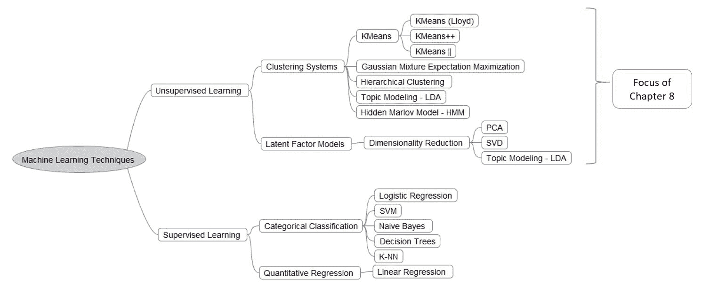

这些簇通常使用簇内相似度测量来建模，例如欧几里得或概率技术。Spark 提供了一套完整且高性能的算法，适合于规模化的并行实现。它们不仅提供 API，还提供完整的源代码，非常有助于理解瓶颈并解决它们（分叉到 GPU）以满足您的需求。

机器学习的应用是广泛的，可以想象的无限。一些最广为人知的例子和用例包括：

+   欺诈检测（金融，执法）

+   网络安全（入侵检测，流量分析）

+   模式识别（营销，情报界，银行）

+   推荐系统（零售，娱乐）

+   亲和营销（电子商务，推荐系统，深度个性化）

+   医学信息学（疾病检测，患者护理，资产管理）

+   图像处理（对象/子对象检测，放射学）

关于 Spark 中 ML 与 MLIB 的使用和未来方向的警告：

虽然 MLIB 目前仍然可行，但在未来的发展中，人们逐渐转向 Spark 的 ML 库而不是 Spark 中的 MLIB。`org.apache.spark.ml.clustering`是一个高级机器学习包，API 更专注于 DataFrame。`org.apache.spark.mllib.clustering`是一个较低级别的机器学习包，API 直接在 RDD 上。虽然两个包都将受益于 Spark 的高性能和可伸缩性，但主要区别在于 DataFrame。`org.apache.spark.ml`将是未来的首选方法。

例如，我们鼓励开发人员查看为什么 KMeans 分类系统存在于 ML 和 MLLIB 中：`org.apache.spark.ml.clustering`和`org.apache.spark.mllib.clustering`

# 在 Spark 2.0 中构建 KMeans 分类系统

在这个示例中，我们将使用 LIBSVM 文件加载一组特征（例如 x、y、z 坐标），然后使用`KMeans()`来实例化一个对象。然后我们将把所需的簇数设置为三，然后使用`kmeans.fit()`来执行算法。最后，我们将打印出我们找到的三个簇的中心。

非常重要的一点是，Spark *不*实现 KMeans++，与流行的文献相反，它实现的是 KMeans ||（读作 KMeans Parallel）。请参阅以下示例和代码后面的部分，以了解 Spark 中实现的算法的完整解释。

# 如何做...

1.  在 IntelliJ 或您选择的 IDE 中启动一个新项目。确保包含必要的 JAR 文件。

1.  设置程序所在位置的包位置：

```scala
package spark.ml.cookbook.chapter8
```

1.  导入 Spark 上下文所需的必要包，以便访问集群和`Log4j.Logger`以减少 Spark 产生的输出量：

```scala
import org.apache.log4j.{Level, Logger}
import org.apache.spark.ml.clustering.KMeans
import org.apache.spark.sql.SparkSession
```

1.  将输出级别设置为`ERROR`以减少 Spark 的日志输出：

```scala
Logger.getLogger("org").setLevel(Level.ERROR)

```

1.  创建 Spark 的 Session 对象：

```scala
val spark = SparkSession
 .builder.master("local[*]")
 .appName("myKMeansCluster")
 .config("spark.sql.warehouse.dir", ".")
 .getOrCreate()
```

1.  我们从`libsvm`格式的文件中创建一个训练数据集，并在控制台上显示文件：

```scala
val trainingData = spark.read.format("libsvm").load("../data/sparkml2/chapter8/my_kmeans_data.txt")

trainingData.show()
```

从控制台，您将看到：

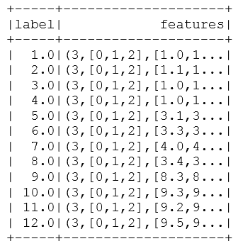

以下公式通过等高线图可视化数据，描述了每个特征向量（每行）与三个唯一特征的 3D 和平面等高线图：

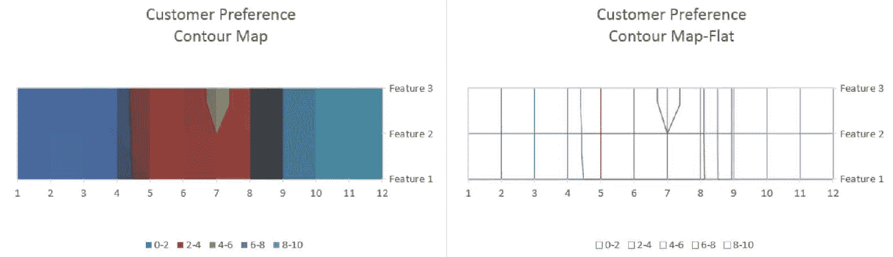

1.  然后我们创建一个 KMeans 对象，并设置一些关键参数到 KMeans 模型和设置参数。

在这种情况下，我们将`K`值设置为`3`，并将*feature*列设置为“features”列，该列在上一步中定义。这一步是主观的，最佳值会根据特定数据集而变化。我们建议您尝试值从 2 到 50，并检查最终值的聚类中心。

我们还将最大迭代次数设置为`10`。大多数值都有默认设置，如下面的代码中所示的注释。

```scala
// Trains a k-means modelval kmeans = new KMeans()
.setK(3) // default value is 2.setFeaturesCol("features")
.setMaxIter(10) // default Max Iteration is 20.setPredictionCol("prediction")
.setSeed(1L)
```

1.  然后训练数据集。`fit()`函数将运行算法并执行计算。它是基于前面步骤中创建的数据集。这些步骤在 Spark 的 ML 中是常见的，通常不会因算法而异：

```scala
val model = kmeans.fit(trainingData)
```

我们还在控制台上显示模型的预测：

```scala
model.summary.predictions.show()
```

从控制台：

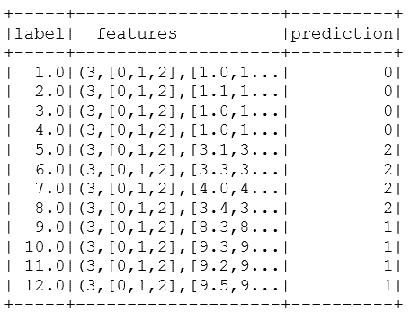

1.  然后我们使用包括`computeCost(x)`函数来计算成本。

1.  KMeans 成本是通过**WSSSE**（Within Set Sum of Squared Errors）计算的。该值将在程序的控制台中打印出来：

```scala
println("KMeans Cost:" +model.computeCost(trainingData))
```

控制台输出将显示以下信息：

```scala
KMeans Cost:4.137499999999979
```

1.  然后根据模型的计算打印出簇的中心：

```scala
println("KMeans Cluster Centers: ")
 model.clusterCenters.foreach(println)
```

1.  控制台输出将显示以下信息：

```scala
The centers for the 3 cluster (i.e. K= 3) 
KMeans Cluster Centers:  
[1.025,1.075,1.15] 
[9.075,9.05,9.025] 
[3.45,3.475,3.55] 
```

根据 KMeans 聚类的设置，我们将`K`值设置为`3`；该模型将根据我们拟合的训练数据集计算出三个中心。

1.  然后通过停止 Spark 上下文来关闭程序：

```scala
spark.stop()
```

# 它是如何工作的...

我们读取了一个带有一组坐标的 LIBSVM 文件（可以被解释为三个数字的元组），然后创建了一个`KMean()`对象，但是出于演示目的，将默认的簇数从 2（默认值）更改为 3。我们使用`.fit()`来创建模型，然后使用`model.summary.predictions.show()`来显示哪个元组属于哪个簇。在最后一步，我们打印出了三个簇的成本和中心。从概念上讲，可以将其视为具有一组 3D 坐标作为数据，然后使用 KMeans 算法将每个单独的坐标分配给三个簇之一。

KMeans 是一种无监督机器学习算法，其根源在于信号处理（矢量量化）和压缩（将相似向量的项目分组在一起以实现更高的压缩率）。一般来说，KMeans 算法试图使用一种距离度量（局部优化）将一系列观察{X[1,] X[2], .... , X[n]}分成一系列群集{C[1,] C[2 .....] C[n]}，并以迭代方式进行优化。

目前有三种主要类型的 KMeans 算法正在使用。在一项简单的调查中，我们发现了 12 种专门的 KMeans 算法变体。重要的是要注意，Spark 实现了一种称为 KMeans ||（KMeans Parallel）的版本，而不是一些文献或视频中提到的 KMeans++或标准 KMeans。

下图简要描述了 KMeans：

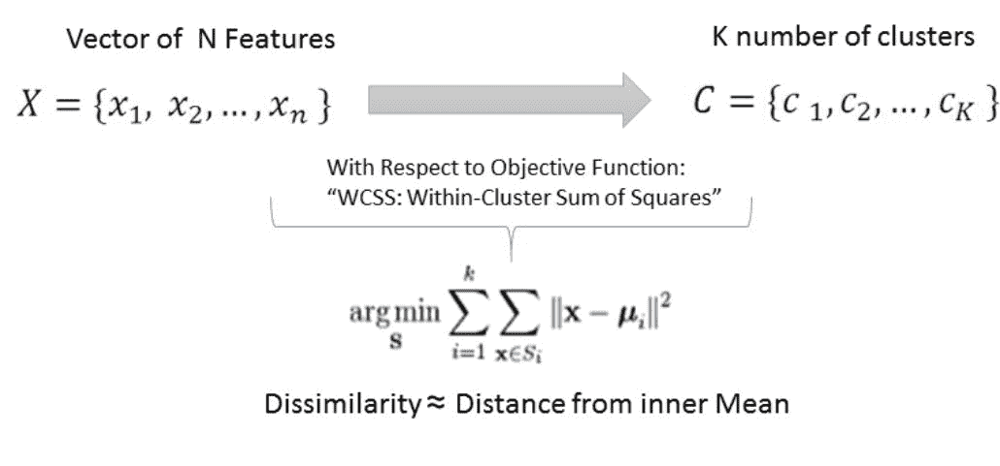

来源：Spark 文档

# KMeans（Lloyd 算法）

基本 KMeans 实现（Lloyd 算法）的步骤是：

1.  从观察中随机选择 K 个数据中心作为初始质心。

1.  保持迭代直到满足收敛标准：

+   测量从点到每个质心的距离

+   将每个数据点包括在最接近的质心的群集中

+   根据距离公式（代表不相似性的代理）计算新的群集质心

+   使用新的中心点更新算法

三代人的情况如下图所示：

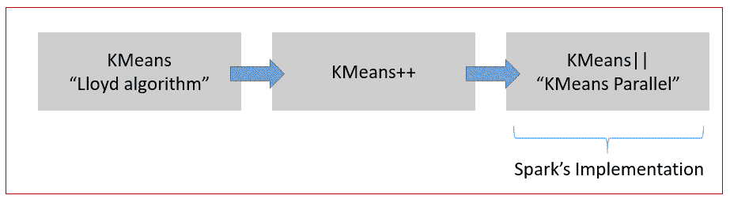

# KMeans++（Arthur 的算法）

对标准 KMeans 的下一个改进是由 David Arthur 和 Sergei Vassilvitskii 于 2007 年提出的 KMeans++。 Arthur 的算法通过在种植过程（初始步骤）中更加选择性来改进最初的 Lloyd's KMeans。

KMeans ++不是随机选择中心（随机质心）作为起始点，而是随机选择第一个质心，然后逐个选择数据点并计算`D(x)`。然后它随机选择另一个数据点，并使用比例概率分布`D(x)2`，然后重复最后两个步骤，直到选择所有*K*个数字。在初始种植之后，我们最终运行 KMeans 或使用新种植的质心的变体。 KMeans++算法保证在*Omega= O(log k)*复杂度中找到解决方案。尽管初始种植需要额外的步骤，但准确性的提高是实质性的。

# KMeans||（发音为 KMeans Parallel）

KMeans ||经过优化以并行运行，并且可以比 Lloyd 的原始算法快一到两个数量级。 KMeans++的局限性在于它需要对数据集进行 K 次遍历，这可能严重限制使用大型或极端数据集运行 KMeans 的性能和实用性。 Spark 的 KMeans||并行实现运行更快，因为它通过对 m 个点进行采样并在过程中进行过采样，从而对数据进行更少的遍历。

该算法的核心和数学内容如下图所示：

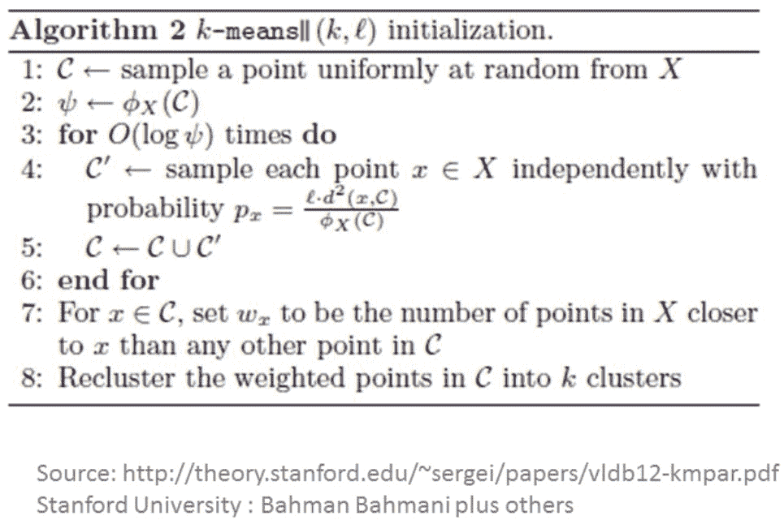

简而言之，KMeans ||（Parallel KMeans）的亮点是粗粒度采样，它在*log(n)*轮次中重复，并且最终我们剩下*k * log(n)*个距离最优解有 C（常数）距离的点！这种实现对可能会扭曲 KMeans 和 KMeans++中的聚类结果的异常数据点也不太敏感。

为了更深入地理解该算法，读者可以访问 Bahman Bahmani 在[`theory.stanford.edu/~sergei/papers/vldb12-kmpar.pdf`](http://theory.stanford.edu/~sergei/papers/vldb12-kmpar.pdf)上的论文。

# 还有更多...

Spark 还有一个 KMeans 实现的流式版本，允许您即时对特征进行分类。 KMeans 的流式版本在《第十三章》*Spark Streaming 和 Machine Learning Library*中有更详细的介绍。

还有一个类可以帮助您为 KMeans 生成 RDD 数据。我们发现这在应用程序开发过程中非常有用：

```scala
def generateKMeansRDD(sc: SparkContext, numPoints: Int, k: Int, d: Int, r: Double, numPartitions: Int = 2): RDD[Array[Double]] 
```

这个调用使用 Spark 上下文来创建 RDD，同时允许您指定点数、簇、维度和分区。

一个有用的相关 API 是：`generateKMeansRDD()`。`generateKMeansRDD`的文档可以在[`spark.apache.org/docs/latest/api/scala/index.html#org.apache.spark.mllib.util.KMeansDataGenerator$`](http://spark.apache.org/docs/latest/api/scala/index.html#org.apache.spark.mllib.util.KMeansDataGenerator%24)找到，用于生成包含 KMeans 测试数据的 RDD。

# 另请参阅

我们需要两个对象来能够编写、测量和操作 Spark 中 KMeans ||算法的参数。这两个对象的详细信息可以在以下网站找到：

+   `KMeans()`: [`spark.apache.org/docs/latest/api/scala/index.html#org.apache.spark.ml.clustering.KMeans`](http://spark.apache.org/docs/latest/api/scala/index.html#org.apache.spark.ml.clustering.KMeans)

+   `KMeansModel()`: [`spark.apache.org/docs/latest/api/scala/index.html#org.apache.spark.ml.clustering.KMeansModel`](http://spark.apache.org/docs/latest/api/scala/index.html#org.apache.spark.ml.clustering.KMeansModel)

# Bisecting KMeans，Spark 2.0 中的新成员

在这个配方中，我们将下载玻璃数据集，并尝试使用 Bisecting KMeans 算法识别和标记每个玻璃。Bisecting KMeans 是 Spark 中使用`BisectingKMeans()`API 实现的 K-Mean 算法的分层版本。虽然这个算法在概念上类似于 KMeans，但在某些具有分层路径的用例中，它可以提供相当快的速度。

我们用于这个配方的数据集是玻璃识别数据库。对玻璃类型的分类研究是由犯罪学研究激发的。如果正确识别，玻璃可以被视为证据。数据可以在 NTU（台湾）找到，已经以 LIBSVM 格式存在。

# 如何做...

1.  我们从以下网址下载了 LIBSVM 格式的准备好的数据文件：[`www.csie.ntu.edu.tw/~cjlin/libsvmtools/datasets/multiclass/glass.scale`](https://www.csie.ntu.edu.tw/~cjlin/libsvmtools/datasets/multiclass/glass.scale)

数据集包含 11 个特征和 214 行。

1.  原始数据集和数据字典也可以在 UCI 网站上找到：[`archive.ics.uci.edu/ml/datasets/Glass+Identification`](http://archive.ics.uci.edu/ml/datasets/Glass+Identification)

+   ID 编号：1 到 214

+   RI：折射率

+   Na：钠（单位测量：相应氧化物中的重量百分比，属性 4-10 也是如此）

+   镁：镁

+   铝：铝

+   硅：硅

+   钾：钾

+   钙：钙

+   Ba：钡

+   铁：铁

玻璃类型：将使用`BisectingKMeans()`找到我们的类属性或簇：

+   `building_windows_float_processed`

+   `building_windows_non-_float_processed`

+   `vehicle_windows_float_processed`

+   `vehicle_windows_non-_float_processed`（此数据库中没有）

+   `Containers`

+   `Tableware`

+   `Headlamps`

1.  在 IntelliJ 或您选择的 IDE 中启动一个新项目。确保包含必要的 JAR 文件。

1.  设置程序所在的包位置：

```scala
package spark.ml.cookbook.chapter8
```

1.  导入必要的包：

```scala
import org.apache.spark.ml.clustering.BisectingKMeans
import org.apache.spark.sql.SparkSession
import org.apache.log4j.{Level, Logger}
```

1.  将输出级别设置为`ERROR`以减少 Spark 的日志输出：

```scala
Logger.getLogger("org").setLevel(Level.ERROR)
```

1.  创建 Spark 的 Session 对象：

```scala
val spark = SparkSession
 .builder.master("local[*]")
 .appName("MyBisectingKMeans")
 .config("spark.sql.warehouse.dir", ".")
 .getOrCreate()
```

1.  我们从 libsvm 格式的文件创建数据集，并在控制台上显示数据集：

```scala
val dataset = spark.read.format("libsvm").load("../data/sparkml2/chapter8/glass.scale")
 dataset.show(false)
```

从控制台，您将看到：

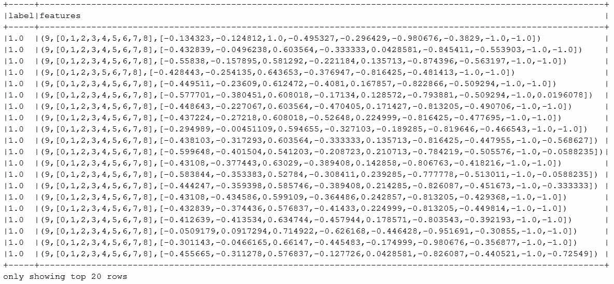

1.  然后，我们将数据集随机分成 80%和 20%的两部分：

```scala
val splitData = dataset.randomSplit(Array(80.0, 20.0))
 val training = splitData(0)
 val testing = splitData(1)

 println(training.count())
 println(testing.count())
```

从控制台输出（总数为 214）：

```scala
180
34
```

1.  然后，我们创建一个`BisectingKMeans`对象，并为模型设置一些关键参数。

在这种情况下，我们将`K`值设置为`6`，并将`Feature`列设置为"features"列，这在前面的步骤中已定义。这一步是主观的，最佳值将根据特定数据集而变化。我们建议您尝试值从 2 到 50，并检查最终值的聚类中心。

1.  我们还将最大迭代次数设置为`65`。大多数值都有默认设置，如下面的代码所示：

```scala
// Trains a k-means modelval bkmeans = new BisectingKMeans()
   .setK(6)
   .setMaxIter(65)
   .setSeed(1)
```

1.  然后我们训练数据集。`fit()`函数将运行算法并进行计算。它基于前面步骤中创建的数据集。我们还打印出模型参数：

```scala
val bisectingModel = bkmeans.fit(training)
 println("Parameters:")
 println(bisectingModel.explainParams())
```

从控制台输出：

```scala
Parameters:
featuresCol: features column name (default: features)
k: The desired number of leaf clusters. Must be > 1\. (default: 4, current: 6)
maxIter: maximum number of iterations (>= 0) (default: 20, current: 65)
minDivisibleClusterSize: The minimum number of points (if >= 1.0) or the minimum proportion of points (if < 1.0) of a divisible cluster. (default: 1.0)
predictionCol: prediction column name (default: prediction)
seed: random seed (default: 566573821, current: 1)
```

1.  然后我们使用包括 computeCost(x)函数来计算成本：

```scala
val cost = bisectingModel.computeCost(training)
 println("Sum of Squared Errors = " + cost)
```

控制台输出将显示以下信息：

```scala
Sum of Squared Errors = 70.38842983516193
```

1.  然后，我们根据模型的计算打印出聚类中心：

```scala
println("Cluster Centers:")
val centers = bisectingModel.clusterCenters
centers.foreach(println)
```

控制台输出将显示以下信息：

```scala
The centers for the 6 cluster (i.e. K= 6) 
KMeans Cluster Centers: 
```

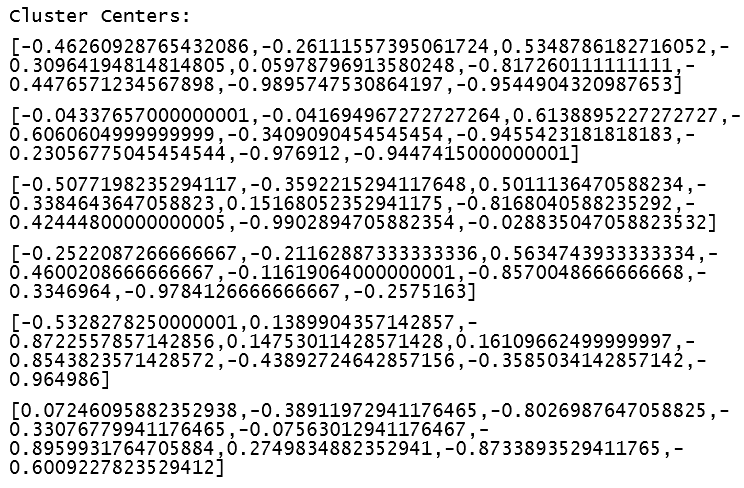

1.  然后我们使用训练好的模型对测试数据集进行预测：

```scala
val predictions = bisectingModel.transform(testing)
 predictions.show(false)
```

从控制台输出：

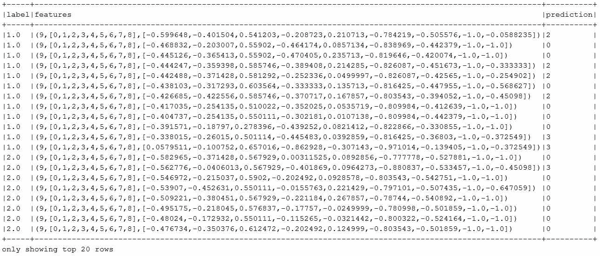

1.  然后通过停止 Spark 上下文来关闭程序：

```scala
spark.stop()
```

# 它是如何工作的...

在本节中，我们探索了 Spark 2.0 中新的 Bisecting KMeans 模型。在本节中，我们使用了玻璃数据集，并尝试使用`BisectingKMeans()`来分配玻璃类型，但将 k 更改为 6，以便有足够的聚类。像往常一样，我们使用 Spark 的 libsvm 加载机制将数据加载到数据集中。我们将数据集随机分为 80%和 20%，其中 80%用于训练模型，20%用于测试模型。

我们创建了`BiSectingKmeans()`对象，并使用`fit(x)`函数创建模型。然后我们使用`transform(x)`函数对测试数据集进行探索模型预测，并在控制台输出结果。我们还输出了计算聚类的成本（误差平方和），然后显示了聚类中心。最后，我们打印出了特征及其分配的聚类编号，并停止操作。

层次聚类的方法包括：

+   **分裂式**：自上而下的方法（Apache Spark 实现）

+   **聚合式**：自下而上的方法

# 还有更多...

有关 Bisecting KMeans 的更多信息，请访问：

+   [`spark.apache.org/docs/latest/api/scala/index.html#org.apache.spark.ml.clustering.BisectingKMeans`](http://spark.apache.org/docs/latest/api/scala/index.html#org.apache.spark.ml.clustering.BisectingKMeans)

+   [`spark.apache.org/docs/latest/api/scala/index.html#org.apache.spark.ml.clustering.BisectingKMeansModel`](http://spark.apache.org/docs/latest/api/scala/index.html#org.apache.spark.ml.clustering.BisectingKMeansModel)

我们使用聚类来探索数据，并了解聚类的结果。分裂式 KMeans 是分层分析与 KMeans 聚类的有趣案例。

理解分裂式 KMeans 的最佳方式是将其视为递归的分层 KMeans。分裂式 KMeans 算法使用类似 KMeans 的相似性测量技术来划分数据，但使用分层方案来提高准确性。它在文本挖掘中特别普遍，其中分层方法将最小化语料库中文档之间的聚类内依赖性。

Bisecting KMeans 算法首先将所有观察结果放入单个聚类中，然后使用 KMeans 方法将聚类分成 n 个分区（K=n）。然后，它继续选择最相似的聚类（最高内部聚类分数）作为父类（根聚类），同时递归地分割其他聚类，直到以分层方式得出目标聚类数。

Bisecting KMeans 是文本分析中用于智能文本/主题分类的强大工具，用于减少特征向量的维度。通过使用这种聚类技术，我们最终将相似的单词/文本/文档/证据分组到相似的组中。最终，如果您开始探索文本分析、主题传播和评分（例如，哪篇文章会成为病毒？），您一定会在旅程的早期阶段遇到这种技术。

一份白皮书描述了使用 Bisecting KMeans 进行文本聚类的方法，可以在以下链接找到：[`www.ijarcsse.com/docs/papers/Volume_5/2_February2015/V5I2-0229.pdf`](http://www.ijarcsse.com/docs/papers/Volume_5/2_February2015/V5I2-0229.pdf)

# 另请参阅

有两种实现分层聚类的方法--Spark 使用递归自顶向下的方法，在该方法中选择一个簇，然后在算法向下移动时执行拆分：

+   有关分层聚类方法的详细信息可以在以下链接找到：[`en.wikipedia.org/wiki/Hierarchical_clustering`](https://en.wikipedia.org/wiki/Hierarchical_clustering)

+   Bisecting K-Mean 的 Spark 2.0 文档可以在以下链接找到：[`spark.apache.org/docs/latest/ml-clustering.html#bisecting-k-means`](http://spark.apache.org/docs/latest/ml-clustering.html#bisecting-k-means)

+   一篇描述如何使用 Bisecting KMeans 对 Web 日志进行分类的论文可以在以下链接找到：[`research.ijcaonline.org/volume116/number19/pxc3902799.pdf`](http://research.ijcaonline.org/volume116/number19/pxc3902799.pdf)

# 使用 Gaussian Mixture 和期望最大化（EM）在 Spark 中对数据进行分类

在这个示例中，我们将探讨 Spark 对**期望最大化**（**EM**）`GaussianMixture()`的实现，它根据一组特征计算最大似然。它假设一个高斯混合模型，其中每个点可以从 K 个子分布（簇成员资格）中抽样。

# 如何做...

1.  在 IntelliJ 或您选择的 IDE 中启动一个新项目。确保包含必要的 JAR 文件。

1.  设置程序所在的包位置：

```scala
package spark.ml.cookbook.chapter8.
```

1.  导入用于向量和矩阵操作的必要包：

```scala
 import org.apache.log4j.{Level, Logger}
 import org.apache.spark.mllib.clustering.GaussianMixture
 import org.apache.spark.mllib.linalg.Vectors
 import org.apache.spark.sql.SparkSession
```

1.  创建 Spark 的会话对象：

```scala
val spark = SparkSession
 .builder.master("local[*]")
 .appName("myGaussianMixture")
 .config("spark.sql.warehouse.dir", ".")
 .getOrCreate()
```

1.  让我们来看看数据集并检查输入文件。模拟的 SOCR 膝痛质心位置数据表示了 1,000 个主题的假设膝痛位置的质心位置。数据包括质心的 X 和 Y 坐标。

该数据集可用于说明高斯混合和期望最大化。数据可在以下链接找到：[`wiki.stat.ucla.edu/socr/index.php/SOCR_Data_KneePainData_041409`](http://wiki.stat.ucla.edu/socr/index.php/SOCR_Data_KneePainData_041409)

样本数据如下所示：

+   **X**：一个主题和一个视图的质心位置的*x*坐标。

+   **Y**：一个主题和一个视图的质心位置的*y*坐标。

X，Y

11 73

20 88

19 73

15 65

21 57

26 101

24 117

35 106

37 96

35 147

41 151

42 137

43 127

41 206

47 213

49 238

40 229

下图描述了基于`wiki.stat.ucla`的 SOCR 数据集的膝痛地图：

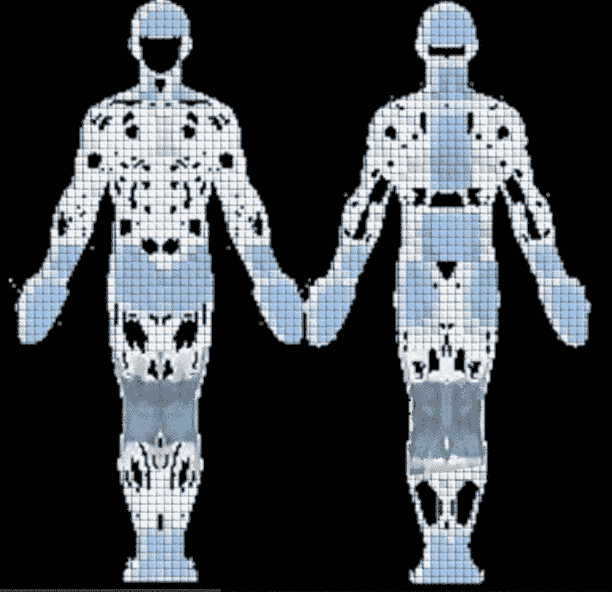

1.  我们将数据文件放在数据目录中（您可以将数据文件复制到任何您喜欢的位置）。

数据文件包含 8,666 个条目：

```scala
val dataFile ="../data/sparkml2/chapter8/socr_data.txt"
```

1.  然后将数据文件加载到 RDD 中：

```scala
val trainingData = spark.sparkContext.textFile(dataFile).map { line =>
 Vectors.dense(line.trim.split(' ').map(_.toDouble))
 }.cache()
```

1.  现在我们创建一个 GaussianMixture 模型，并设置模型的参数。我们将 K 值设置为 4，因为数据是由四个视图收集的：**左前**（**LF**），**左后**（**LB**），**右前**（**RF**）和**右后**（**RB**）。我们将收敛值设置为默认值 0.01，最大迭代次数设置为 100：

```scala
val myGM = new GaussianMixture()
 .setK(4 ) // default value is 2, LF, LB, RF, RB
 .setConvergenceTol(0.01) // using the default value
 .setMaxIterations(100) // max 100 iteration
```

1.  我们运行模型算法：

```scala
val model = myGM.run(trainingData)
```

1.  我们在训练后打印出 GaussianMixture 模型的关键值：

```scala
println("Model ConvergenceTol: "+ myGM.getConvergenceTol)
 println("Model k:"+myGM.getK)
 println("maxIteration:"+myGM.getMaxIterations)

 for (i <- 0 until model.k) {
 println("weight=%f\nmu=%s\nsigma=\n%s\n" format
 (model.weights(i), model.gaussians(i).mu, model.gaussians(i).sigma))
 }
```

1.  由于我们将 K 值设置为 4，因此将有四组值在控制台记录器中打印出来：

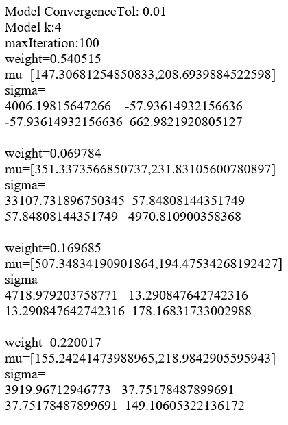

1.  我们还根据 GaussianMixture 模型的预测打印出前 50 个集群标签：

```scala
println("Cluster labels (first <= 50):")
 val clusterLabels = model.predict(trainingData)
 clusterLabels.take(50).foreach { x =>
 *print*(" " + x)
 }
```

1.  控制台中的示例输出将显示如下内容：

```scala
Cluster labels (first <= 50):
 1 1 1 1 1 1 1 1 1 0 0 0 0 0 0 0 0 0 0 0 0 0 0 0 0 0 0 0 0 0 0 0 0 0 0 0 0 0 0 0 0 0 0 0 0 0 0 0 0 0
```

1.  然后通过停止 Spark 上下文来关闭程序：

```scala
spark.stop()
```

# 它是如何工作的...

在前面的配方中，我们观察到 KMeans 可以使用相似性（欧几里得等）的迭代方法发现并分配成员资格给一个且仅一个集群。人们可以将 KMeans 视为具有 EM 模型的高斯混合模型的专门版本，在其中强制执行离散（硬）成员资格。

但有些情况会有重叠，这在医学或信号处理中经常发生，如下图所示：

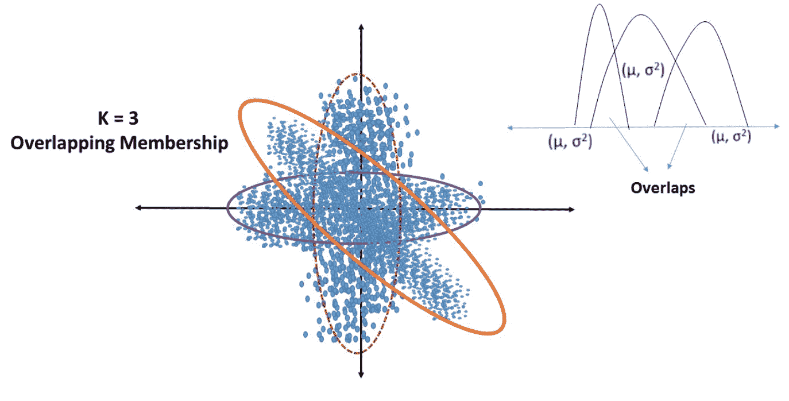

在这种情况下，我们需要一个概率密度函数，可以表达在每个子分布中的成员资格。具有**期望最大化**（**EM**）的高斯混合模型是 Spark 中可处理此用例的算法`GaussianMixture()`。

这是 Spark 用于实现具有期望最大化的高斯混合的 API（对数似然的最大化）。

# 新的 GaussianMixture()

这构造了一个默认实例。控制模型行为的默认参数是：

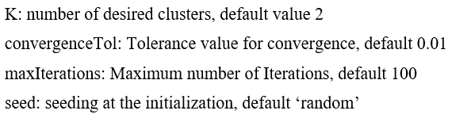

具有期望最大化的高斯混合模型是一种软聚类形式，可以使用对数最大似然函数推断成员资格。在这种情况下，使用均值和协方差的概率密度函数来定义对 K 个集群的成员资格或成员资格的可能性。它是灵活的，因为成员资格没有被量化，这允许基于概率的重叠成员资格（索引到多个子分布）。

以下图是 EM 算法的快照：

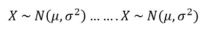

以下是 EM 算法的步骤：

1.  假设* N *个高斯分布。

1.  迭代直到收敛：

1.  对于每个点 Z，条件概率被绘制为从分布 Xi 中被绘制的*P（Z | Xi）*

1.  调整参数的均值和方差，使它们适合分配给子分布的点

更多数学解释，请参见以下链接：[`www.ee.iisc.ernet.in/new/people/faculty/prasantg/downloads/GMM_Tutorial_Reynolds.pdf`](http://www.ee.iisc.ernet.in/new/people/faculty/prasantg/downloads/GMM_Tutorial_Reynolds.pdf)

# 还有更多...

以下图提供了一个快速参考点，以突出硬聚类与软聚类之间的一些差异：

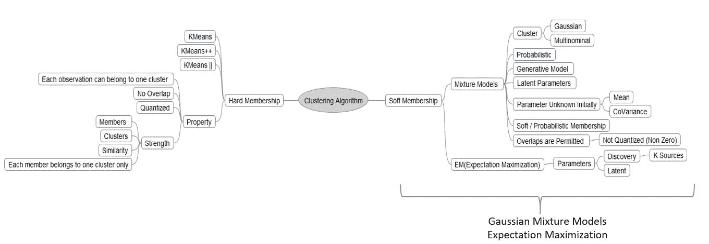

# 另请参阅

+   构造函数 GaussianMixture 的文档可以在以下链接找到：[`spark.apache.org/docs/latest/api/scala/index.html#org.apache.spark.mllib.clustering.GaussianMixture`](http://spark.apache.org/docs/latest/api/scala/index.html#org.apache.spark.mllib.clustering.GaussianMixture)

+   GaussianMixtureModel 的构造函数文档可以在以下链接找到：[`spark.apache.org/docs/latest/api/scala/index.html#org.apache.spark.mllib.clustering.GaussianMixtureModel`](http://spark.apache.org/docs/latest/api/scala/index.html#org.apache.spark.mllib.clustering.GaussianMixtureModel)

# 在 Spark 2.0 中使用幂迭代聚类（PIC）对图的顶点进行分类

这是一种根据边缘定义的相似性对图的顶点进行分类的方法。它使用 GraphX 库，该库与 Spark 一起提供以实现该算法。幂迭代聚类类似于其他特征向量/特征值分解算法，但没有矩阵分解的开销。当您有一个大型稀疏矩阵时（例如，图表示为稀疏矩阵），它是合适的。

GraphFrames 将成为 GraphX 库的替代/接口，以后会继续使用（[`databricks.com/blog/2016/03/03/introducing-graphframes.html`](https://databricks.com/blog/2016/03/03/introducing-graphframes.html)）。

# 如何做...

1.  在 IntelliJ 或您选择的 IDE 中启动一个新项目。确保包含必要的 JAR 文件。

1.  设置程序所在的包位置：

```scala
package spark.ml.cookbook.chapter8
```

1.  导入 Spark 上下文所需的包以访问集群和`Log4j.Logger`以减少 Spark 产生的输出量：

```scala
 import org.apache.log4j.{Level, Logger}
 import org.apache.spark.mllib.clustering.PowerIterationClustering
 import org.apache.spark.sql.SparkSession
```

1.  将日志记录器级别设置为仅错误以减少输出：

```scala
Logger.getLogger("org").setLevel(Level.*ERROR*)
```

1.  创建 Spark 的配置和 SQL 上下文，以便我们可以访问集群，并能够根据需要创建和使用 DataFrame：

```scala
// setup SparkSession to use for interactions with Sparkval spark = SparkSession
 .builder.master("local[*]")
 .appName("myPowerIterationClustering")
 .config("spark.sql.warehouse.dir", ".")
 .getOrCreate()
```

1.  我们创建了一个包含数据集列表的训练数据集，并使用 Spark 的`sparkContext.parallelize()`函数创建 Spark RDD：

```scala
val trainingData =spark.sparkContext.parallelize(*List*(
 (0L, 1L, 1.0),
 (0L, 2L, 1.0),
 (0L, 3L, 1.0),
 (1L, 2L, 1.0),
 (1L, 3L, 1.0),
 (2L, 3L, 1.0),
 (3L, 4L, 0.1),
 (4L, 5L, 1.0),
 (4L, 15L, 1.0),
 (5L, 6L, 1.0),
 (6L, 7L, 1.0),
 (7L, 8L, 1.0),
 (8L, 9L, 1.0),
 (9L, 10L, 1.0),
 (10L,11L, 1.0),
 (11L, 12L, 1.0),
 (12L, 13L, 1.0),
 (13L,14L, 1.0),
 (14L,15L, 1.0)
 ))
```

1.  我们创建一个`PowerIterationClustering`对象并设置参数。我们将`K`值设置为`3`，最大迭代次数设置为`15`：

```scala
val pic = new PowerIterationClustering()
 .setK(3)
 .setMaxIterations(15)
```

1.  然后让模型运行：

```scala
val model = pic.run(trainingData)
```

1.  我们根据训练数据的模型打印出聚类分配：

```scala
model.assignments.foreach { a =>
 println(s"${a.id} -> ${a.cluster}")
 }
```

1.  控制台输出将显示以下信息：

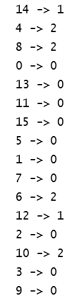

1.  我们还打印出每个聚类的模型分配数据：

```scala
val clusters = model.assignments.collect().groupBy(_.cluster).mapValues(_.map(_.id))
 val assignments = clusters.toList.sortBy { case (k, v) => v.length }
 val assignmentsStr = assignments
 .map { case (k, v) =>
 s"$k -> ${v.sorted.mkString("[", ",", "]")}" }.mkString(", ")
 val sizesStr = assignments.map {
 _._2.length
 }.sorted.mkString("(", ",", ")")
 println(s"Cluster assignments: $assignmentsStr\ncluster sizes: $sizesStr")
```

1.  控制台输出将显示以下信息（总共有三个聚类，这些聚类是在前面的参数中设置的）：

```scala
Cluster assignments: 1 -> [12,14], 2 -> [4,6,8,10], 0 -> [0,1,2,3,5,7,9,11,13,15]
 cluster sizes: (2,4,10)
```

1.  然后通过停止 Spark 上下文来关闭程序：

```scala
spark.stop()
```

# 它是如何工作的...

我们创建了一个图的边和顶点的列表，然后继续创建对象并设置参数：

```scala
new PowerIterationClustering().setK(3).setMaxIterations(15)
```

接下来是训练数据的模型：

```scala
val model = pic.run(trainingData)
```

然后输出了聚类以供检查。接近结尾的代码使用 Spark 转换操作符将模型分配数据打印到集合中。

在核心**PIC**（**Power Iteration Clustering**）是一种特征值类算法，它通过产生满足*Av* = λ*v*的特征值加上特征向量来避免矩阵分解。因为 PIC 避免了矩阵 A 的分解，所以当输入矩阵 A（在 Spark 的 PIC 的情况下描述为图）是一个大稀疏矩阵时，它是合适的。

PIC 在图像处理中的示例（已增强以供论文使用）如下图所示：

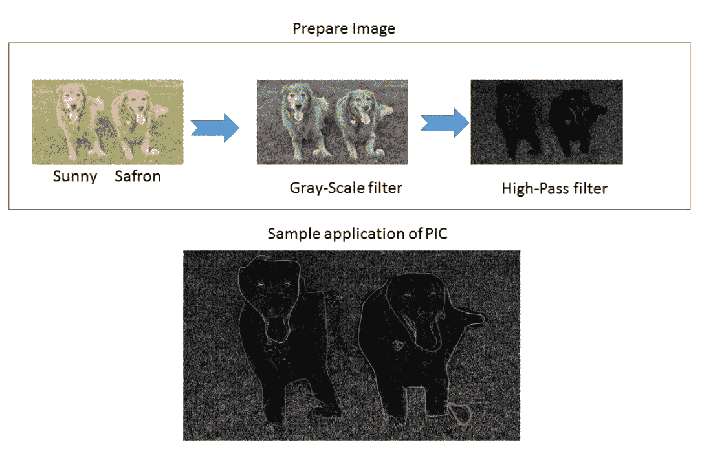

PIC 算法的 Spark 实现是对以前常见实现（NCut）的改进，通过计算伪特征向量来定义相似性，这些相似性被定义为给定 N 个顶点的边（如亲和矩阵）。

如下图所示的输入是描述图的 RDD 的三元组。输出是每个节点的聚类分配的模型。假定算法相似性（边）是正的和对称的（未显示）：

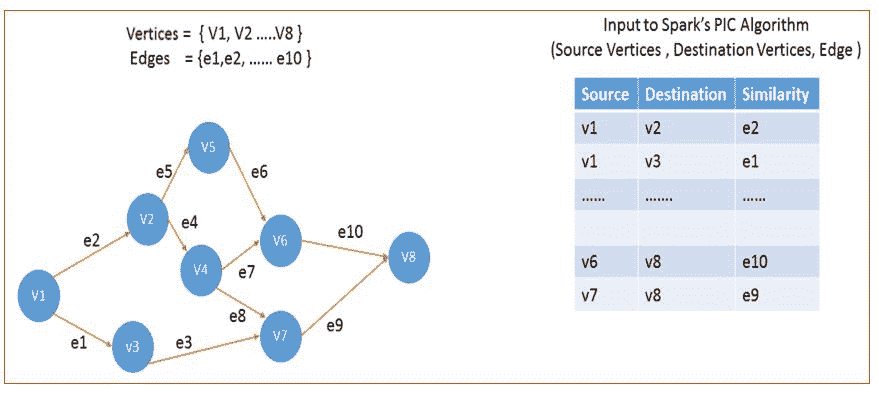

# 还有更多...

有关该主题（幂迭代）的更详细的数学处理，请参阅卡内基梅隆大学的以下白皮书：[`www.cs.cmu.edu/~wcohen/postscript/icml2010-pic-final.pdf`](http://www.cs.cmu.edu/~wcohen/postscript/icml2010-pic-final.pdf)

# 另请参阅

+   可以在[`spark.apache.org/docs/latest/api/scala/index.html#org.apache.spark.mllib.clustering.PowerIterationClustering`](http://spark.apache.org/docs/latest/api/scala/index.html#org.apache.spark.mllib.clustering.PowerIterationClustering)找到`PowerIterationClustering()`构造函数的文档。

+   可以在[`spark.apache.org/docs/latest/api/scala/index.html#org.apache.spark.mllib.clustering.PowerIterationClusteringModel`](http://spark.apache.org/docs/latest/api/scala/index.html#org.apache.spark.mllib.clustering.PowerIterationClusteringModel)找到`PowerIterationClusteringModel()`构造函数的文档。

# 潜在狄利克雷分配（LDA）用于将文档和文本分类为主题

在本教程中，我们将探讨 Spark 2.0 中的**潜在狄利克雷分配**（**LDA**）算法。我们在本教程中使用的 LDA 与线性判别分析完全不同。潜在狄利克雷分配和线性判别分析都被称为 LDA，但它们是极其不同的技术。在本教程中，当我们使用 LDA 时，我们指的是潜在狄利克雷分配。文本分析章节也与理解 LDA 相关。

LDA 经常用于自然语言处理，试图将大量文档（例如来自安然欺诈案的电子邮件）分类为离散数量的主题或主题，以便理解。 LDA 也是一个很好的选择，可以根据兴趣选择文章（例如，当您翻页并在特定主题上花时间时）在给定杂志文章或页面中。

# 如何做...

1.  在 IntelliJ 或您选择的 IDE 中启动新项目。确保包含必要的 JAR 文件。

1.  设置程序所在的包位置：

```scala
package spark.ml.cookbook.chapter8
```

1.  导入必要的包：

```scala
import org.apache.log4j.{Level, Logger}
import org.apache.spark.sql.SparkSession
import org.apache.spark.ml.clustering.LDA
```

1.  我们设置必要的 Spark 会话以访问集群：

```scala
val spark = SparkSession
 .builder.master("local[*]")
 .appName("MyLDA")
 .config("spark.sql.warehouse.dir", ".")
 .getOrCreate()
```

1.  我们有一个 LDA 数据集，位于以下相对路径（您可以使用绝对路径）。 示例文件随任何 Spark 分发一起提供，并且可以在 Spark 的主目录下的 data 目录中找到（请参见以下）。假设输入是输入到 LDA 方法的一组特征：

```scala
val input = "../data/sparkml2/chapter8/my_lda_data.txt"
```

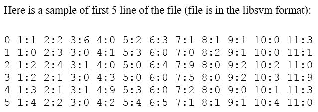

1.  在这一步中，我们读取文件并从输入文件创建必要的数据集，并在控制台中显示前五行：

```scala
val dataset = spark.read.format("libsvm").load(input)
 dataset.show(5)
```

从控制台输出：

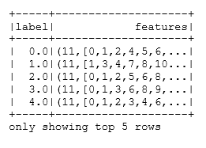

1.  我们创建 LDA 对象并设置对象的参数：

```scala
val lda = new LDA()
 .setK(5)
 .setMaxIter(10)
 .setFeaturesCol("features")
 .setOptimizer("online")
 .setOptimizeDocConcentration(true)
```

1.  然后我们使用包的高级 API 运行模型：

```scala
val ldaModel = lda.fit(dataset)

 val ll = ldaModel.logLikelihood(dataset)
 val lp = ldaModel.logPerplexity(dataset)

 println(s"\t Training data log likelihood: $ll")
 println(s"\t Training data log Perplexity: $lp")
```

从控制台输出：

```scala
Training data log likelihood: -762.2149142231476
 Training data log Perplexity: 2.8869048032045974
```

1.  我们从 LDA 模型中获取每组特征的主题分布，并显示主题。

1.  我们将`maxTermsPerTopic`值设置为`3`：

```scala
val topics = ldaModel.describeTopics(3)
 topics.show(false) // false is Boolean value for truncation for the dataset
```

1.  在控制台上，输出将显示以下信息：

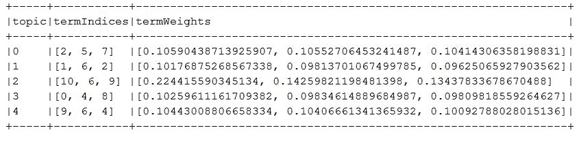

1.  我们还从 LDA 模型转换训练数据集，并显示结果：

```scala
val transformed = ldaModel.transform(dataset)
 transformed.show(false)
```

输出将显示以下内容：

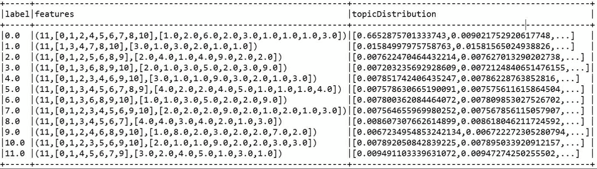

如果前面的方法被更改为：

```scala
transformed.show(true)
```

1.  结果将被显示为截断：

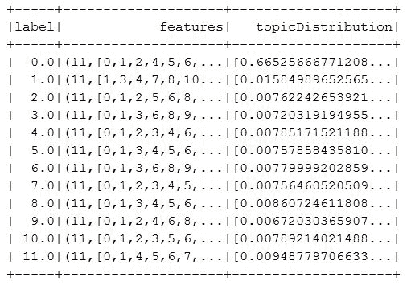

1.  我们关闭 Spark 上下文以结束程序：

```scala
spark.stop()
```

# 它是如何工作的...

LDA 假设文档是具有狄利克雷先验分布的不同主题的混合物。假定文档中的单词倾向于特定主题，这使得 LDA 能够对最匹配主题的整个文档进行分类（组成和分配分布）。

主题模型是一种生成潜在模型，用于发现文档集合中出现的抽象主题（主题）（通常对于人类来说太大）。这些模型是总结，搜索和浏览一大批未标记文档及其内容的先导条件。一般来说，我们试图找到一组特征（单词，子图像等），这些特征一起出现。

以下图表描述了整体 LDA 方案：

请务必参考此处引用的白皮书以获取完整信息 [`ai.stanford.edu/~ang/papers/nips01-lda.pdf`](http://ai.stanford.edu/~ang/papers/nips01-lda.pdf)

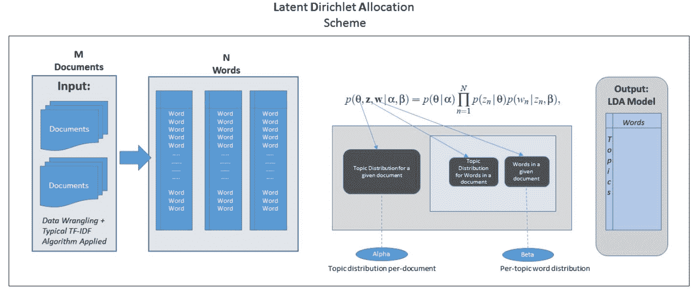

LDA 算法的步骤如下：

1.  初始化以下参数（控制浓度和平滑）：

1.  Alpha 参数（高 alpha 使文档更相似，并包含相似的主题）

1.  Beta 参数（高 beta 意味着每个主题很可能包含大部分单词的混合）

1.  随机初始化主题分配。

1.  迭代：

1.  对于每个文档。

1.  对于文档中的每个单词。

1.  为每个单词重新取样主题。

1.  相对于所有其他单词及其当前分配（对于当前迭代）。

1.  获得结果。

1.  模型评估

在统计学中，Dirichlet 分布 Dir（alpha）是由一组正实数α参数化的连续多元概率分布家族。有关 LDA 的更深入处理，请参阅原始论文

机器学习杂志：[`www.jmlr.org/papers/volume3/blei03a/blei03a.pdf`](http://www.jmlr.org/papers/volume3/blei03a/blei03a.pdf)

LDA 不会为主题分配任何语义，也不在乎主题的名称。它只是一个生成模型，使用细粒度项目的分布（例如，关于猫、狗、鱼、汽车的单词）来分配得分最高的整体主题。它不知道、不关心、也不理解称为狗或猫的主题。

在输入 LDA 算法之前，我们经常需要通过 TF-IDF 对文档进行标记化和向量化。

# 还有更多...

以下图描述了 LDA 的要点：

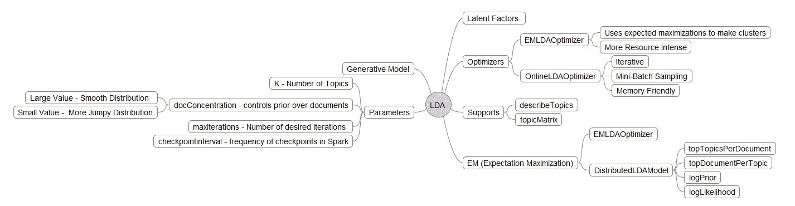

文档分析有两种方法。我们可以简单地使用矩阵分解将大型数据集的矩阵分解为较小的矩阵（主题分配）乘以一个向量（主题本身）：

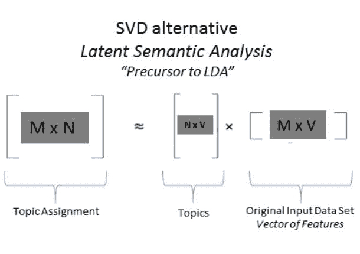

# 另请参阅

+   **LDA**：构造函数的文档可以在此处找到：[`spark.apache.org/docs/latest/api/scala/index.html#org.apache.spark.ml.clustering.LDA`](http://spark.apache.org/docs/latest/api/scala/index.html#org.apache.spark.ml.clustering.LDA)

+   [**LDAModel**：构造函数的文档可以在此处找到：](http://spark.apache.org/docs/latest/api/scala/index.html#org.apache.spark.ml.clustering.LDA)[`spark.apache.org/docs/latest/api/scala/index.html#org.apache.spark.ml.clustering.LDAModel`](http://spark.apache.org/docs/latest/api/scala/index.html#org.apache.spark.ml.clustering.LDAModel)

另请参阅，通过 Spark 的 Scala API，以下文档链接：

+   DistributedLDAModel

+   EMLDAOptimizer

+   LDAOptimizer

+   LocalLDAModel

+   OnlineLDAOptimizer

# 流式 KMeans 用于实时分类数据

Spark 流式处理是一个强大的工具，它让您可以在同一范式中结合近实时和批处理。流式 KMeans 接口位于 ML 聚类和 Spark 流式处理的交集处，并充分利用了 Spark 流式处理本身提供的核心功能（例如，容错性、精确一次性传递语义等）。

# 如何做...

1.  在 IntelliJ 或您选择的 IDE 中启动一个新项目。确保包含必要的 JAR 文件。

1.  导入流式 KMeans 所需的包：

`spark.ml.cookbook.chapter8`包。

1.  导入流式 KMeans 所需的包：

```scala
import org.apache.log4j.{Level, Logger}
 import org.apache.spark.mllib.clustering.StreamingKMeans
 import org.apache.spark.mllib.linalg.Vectors
 import org.apache.spark.mllib.regression.LabeledPoint
 import org.apache.spark.sql.SparkSession
 import org.apache.spark.streaming.{Seconds, StreamingContext}
```

1.  我们为流式 KMeans 程序设置以下参数。训练目录将是发送训练数据文件的目录。KMeans 聚类模型利用训练数据来运行算法和计算。`testDirectory`将是用于预测的测试数据。`batchDuration`是批处理运行的秒数。在以下情况下，程序将每 10 秒检查一次是否有新的数据文件进行重新计算。

1.  集群设置为`2`，数据维度为`3`：

```scala
val trainingDir = "../data/sparkml2/chapter8/trainingDir" val testDir = "../data/sparkml2/chapter8/testDir" val batchDuration = 10
 val numClusters = 2
 val numDimensions = 3
```

1.  使用上述设置，样本训练数据将包含以下数据（格式为[*X[1]，X[2]，...X[n]*]，其中*n*为`numDimensions`）：

[0.0,0.0,0.0]

[0.1,0.1,0.1]

[0.2,0.2,0.2]

[9.0,9.0,9.0]

[9.1,9.1,9.1]

[9.2,9.2,9.2]

[0.1,0.0,0.0]

[0.2,0.1,0.1]

....

测试数据文件将包含以下数据（格式为（*y，[X1，X2，.. Xn]*），其中*n*为`numDimensions`，`y`是标识符）：

(7,[0.4,0.4,0.4])

(8,[0.1,0.1,0.1])

(9,[0.2,0.2,0.2])

(10,[1.1,1.0,1.0])

(11,[9.2,9.1,9.2])

(12,[9.3,9.2,9.3])

1.  我们设置必要的 Spark 上下文以访问集群：

```scala
val spark = SparkSession
 .builder.master("local[*]")
 .appName("myStreamingKMeans")
 .config("spark.sql.warehouse.dir", ".")
 .getOrCreate()
```

1.  定义流式上下文和微批处理窗口：

```scala
val ssc = new StreamingContext(spark.sparkContext, Seconds(batchDuration.toLong))
```

1.  以下代码将通过解析前两个目录中的数据文件来创建`trainingData`和`testData RDDs`：

```scala
val trainingData = ssc.textFileStream(trainingDir).map(Vectors.parse)
 val testData = ssc.textFileStream(testDir).map(LabeledPoint.parse)
```

1.  我们创建`StreamingKMeans`模型并设置参数：

```scala
val model = new StreamingKMeans()
 .setK(numClusters)
 .setDecayFactor(1.0)
 .setRandomCenters(numDimensions, 0.0)
```

1.  程序将使用训练数据集训练模型，并使用测试数据集进行预测：

```scala
model.trainOn(trainingData)
 model.predictOnValues(testData.map(lp => (lp.label, lp.features))).print()
```

1.  我们启动流式上下文，并且程序将每 10 秒运行一次批处理，以查看是否有新的数据集可用于训练，以及是否有新的测试数据集可用于预测。如果接收到终止信号（退出批处理运行），程序将退出：

```scala
ssc.start()
 ssc.awaitTermination()
```

1.  我们将`testKStreaming1.txt`数据文件复制到前述`testDir`集中，并在控制台日志中看到以下内容：

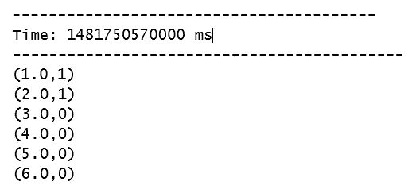

1.  对于 Windows 机器，我们将`testKStreaming1.txt`文件复制到目录：`C:\spark-2.0.0-bin-hadoop2.7\data\sparkml2\chapter8\testDir\`。

1.  我们还可以检查 SparkUI 以获取更多信息：`http://localhost:4040/`。

作业面板将显示流式作业，如下图所示：

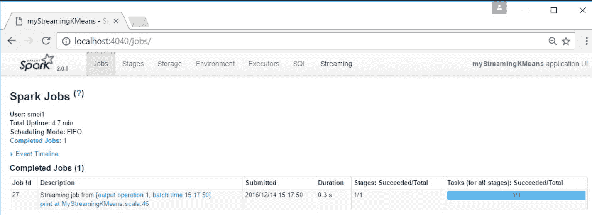

如下图所示，流式面板将显示前述流式 KMeans 矩阵作为显示的矩阵，在本例中每 10 秒运行一次批处理作业：

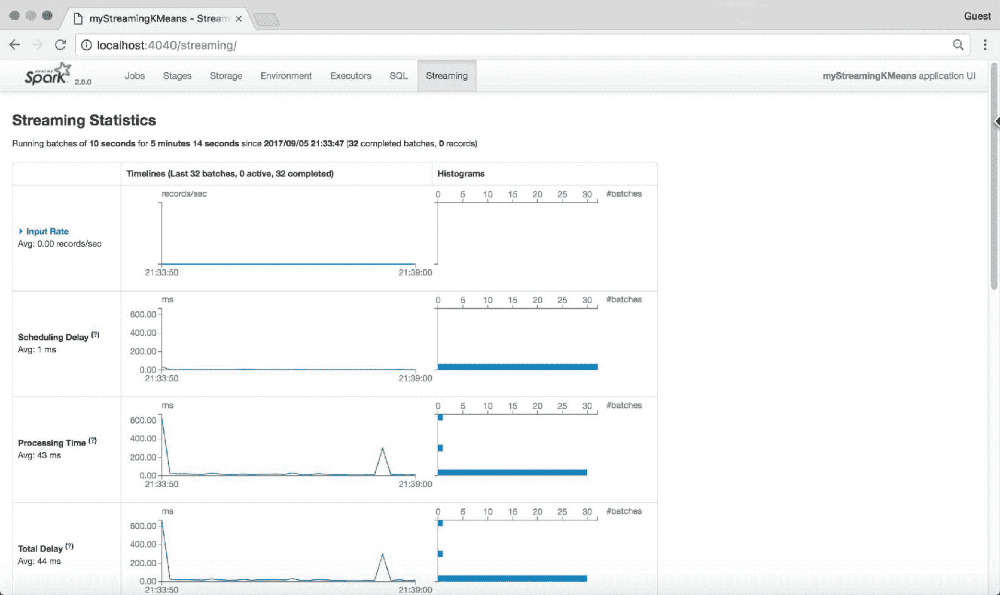

您可以通过单击任何批次来获取有关流式批处理的更多详细信息，如下图所示：

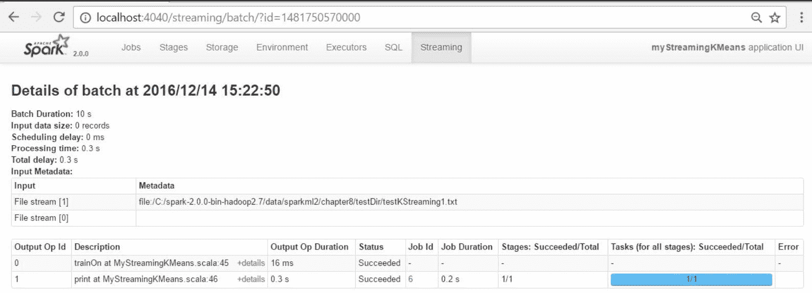

# 工作原理...

在某些情况下，我们无法使用批处理方法来加载和捕获事件，然后对其做出反应。我们可以使用创造性的方法在内存或着陆数据库中捕获事件，然后迅速将其调度到另一个系统进行处理，但大多数这些系统无法充当流式系统，并且通常非常昂贵。

Spark 提供了几乎实时（也称为主观实时）的功能，可以通过连接器（例如 Kafka 连接器）接收传入的来源，如 Twitter feeds、信号等，然后将其处理并呈现为 RDD 接口。

这些是在 Spark 中构建和构造流式 KMeans 所需的元素：

1.  使用流式上下文，而不是迄今为止使用的常规 Spark 上下文：

```scala
val ssc = new StreamingContext(conf, Seconds(batchDuration.toLong))
```

1.  选择连接器以连接到数据源并接收事件：

+   Twitter

+   Kafka

+   第三方

+   ZeroMQ

+   TCP

+   ........

1.  创建您的流式 KMeans 模型；根据需要设置参数：

```scala
model = new StreamingKMeans()
```

1.  像往常一样进行训练和预测：

+   请记住，K 不能在运行时更改

1.  启动上下文并等待终止信号以退出：

+   `ssc.start()`

+   `ssc.awaitTermination()`

# 还有更多...

流式 KMeans 是 KMeans 实现的特殊情况，其中数据可以几乎实时到达并根据需要分类到一个簇（硬分类）。应用程序广泛，可以从几乎实时的异常检测（欺诈、犯罪、情报、监视和监控）到金融中细粒度微部门旋转可视化与 Voronoi 图。第十三章，*Spark Streaming 和机器学习库*提供了更详细的流式覆盖。

有关 Voronoi 图的参考，请参阅以下网址：[`en.wikipedia.org/wiki/Voronoi_diagram`](https://en.wikipedia.org/wiki/Voronoi_diagram)

目前，在 Spark 机器库中除了流式 KMeans 之外，还有其他算法，如下图所示：

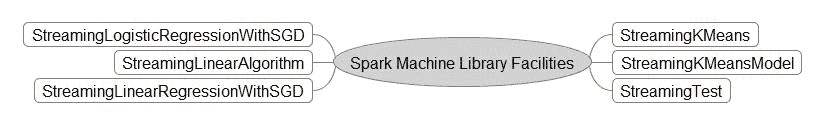

# 另请参阅

+   有关流式 KMeans 的文档可以在以下网址找到：[`spark.apache.org/docs/latest/api/scala/index.html#org.apache.spark.mllib.clustering.StreamingKMeans`](http://spark.apache.org/docs/latest/api/scala/index.html#org.apache.spark.mllib.clustering.StreamingKMeans)

+   有关流式 KMeans 模型的文档可以在以下网址找到：[`spark.apache.org/docs/latest/api/scala/index.html#org.apache.spark.mllib.stat.test.StreamingTest`](http://spark.apache.org/docs/latest/api/scala/index.html#org.apache.spark.mllib.stat.test.StreamingTest)

+   流式测试的文档--用于数据生成--可以在以下网址找到：[`spark.apache.org/docs/latest/api/scala/index.html#org.apache.spark.mllib.clustering.StreamingKMeansModel`](http://spark.apache.org/docs/latest/api/scala/index.html#org.apache.spark.mllib.clustering.StreamingKMeansModel)
