# 第九章：优化-使用梯度下降下山

在本章中，我们将涵盖：

+   通过数学优化二次成本函数并找到最小值来获得洞察

+   从头开始编码二次成本函数优化，使用梯度下降（GD）

+   编码梯度下降优化以从头解决线性回归

+   在 Spark 2.0 中，正规方程作为解决线性回归的替代方法

# 介绍

了解优化的工作原理对于成功的机器学习职业至关重要。我们选择了**梯度下降**（**GD**）方法进行端到端的深入挖掘，以演示优化技术的内部工作原理。我们将使用三个配方来开发这个概念，从头开始到完全开发的代码，以解决实际问题和真实世界数据。第四个配方探讨了使用 Spark 和正规方程（大数据问题的有限扩展）来解决回归问题的 GD 的替代方法。

让我们开始吧。机器到底是如何学习的？它真的能从错误中学习吗？当机器使用优化找到解决方案时，这意味着什么？

在高层次上，机器学习基于以下五种技术之一：

+   **基于错误的学习**：在这种技术中，我们搜索领域空间，寻找最小化训练数据上总误差（预测与实际）的参数值组合（权重）。

+   **信息论学习**：这种方法使用经典香农信息论中的熵和信息增益等概念。基于树的 ML 系统，在 ID3 算法中经典地根植于这一类别。集成树模型将是这一类别的巅峰成就。我们将在第十章中讨论树模型，*使用决策树和集成模型构建机器学习系统*。

+   **概率空间学习**：这个机器学习分支基于贝叶斯定理（[`en.wikipedia.org/wiki/Bayes'_theorem)`](https://en.wikipedia.org/wiki/Bayes'_theorem)）。机器学习中最著名的方法是朴素贝叶斯（多种变体）。朴素贝叶斯以引入贝叶斯网络而告终，这允许对模型进行更多控制。

+   **相似度测量学习**：这种方法通过尝试定义相似度度量，然后根据该度量来拟合观察的分组。最著名的方法是 KNN（最近邻），这是任何 ML 工具包中的标准。 Spark ML 实现了带有并行性的 K-means++，称为 K-Means||（K 均值并行）。

+   **遗传算法（GA）和进化学习**：这可以被视为达尔文的理论（物种的起源）应用于优化和机器学习。 GA 背后的想法是使用递归生成算法创建一组初始候选者，然后使用反馈（适应性景观）来消除远距离的候选者，折叠相似的候选者，同时随机引入突变（数值或符号抖动）到不太可能的候选者，然后重复直到找到解决方案。

一些数据科学家和 ML 工程师更喜欢将优化视为最大化对数似然，而不是最小化成本函数-它们实际上是同一枚硬币的两面！在本章中，我们将专注于基于错误的学习，特别是**梯度下降**。

为了提供扎实的理解，我们将深入研究梯度下降（GD），通过三个 GD 配方来了解它们如何应用于优化。然后，我们将提供 Spark 的正规方程配方作为数值优化方法的替代方法，例如梯度下降（GD）或**有限内存的 Broyden-Fletcher-Goldfarb-Shanno**（**LBFGS**）算法。

Apache Spark 为所有类别提供了出色的覆盖范围。以下图表描述了一个分类法，将指导您在数值优化领域的旅程，这对于在机器学习中取得卓越成就至关重要。

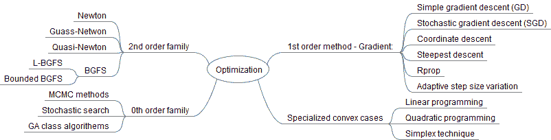

# 机器如何使用基于错误的系统学习？

机器学习的学习方式与我们大致相同-它们从错误中学习。首先，它们首先进行初始猜测（参数的随机权重）。其次，它们使用自己的模型（例如 GLM、RRN、等温回归）进行预测（例如一个数字）。第三，它们查看答案应该是什么（训练集）。第四，它们使用各种技术（如最小二乘法、相似性等）来衡量实际与预测答案之间的差异。

一旦所有这些机制都就位，它们将在整个训练数据集上重复这个过程，同时试图提出一种参数组合，当考虑整个训练数据集时具有最小误差。有趣的是，机器学习的每个分支都使用数学或领域已知事实，以避免蛮力组合方法，这种方法在现实世界的环境中不会终止。

基于错误的机器学习优化是数学规划（MP）的一个分支，它是通过算法实现的，但精度有限（精度变化为 10^(-2)到 10^(-6)）。这一类别中的大多数方法，如果不是全部，都利用简单的微积分事实，如一阶导数（斜率）（例如 GD 技术）和二阶导数（曲率）（例如 BFGS 技术），以最小化成本函数。在 BFGS 的情况下，隐形的手是更新器函数（L1 更新器）、秩（二阶秩更新器），使用无 Hessian 矩阵的 Hessian 自由技术来近似最终答案/解决方案([`en.wikipedia.org/wiki/Hessian_matrix`](https://en.wikipedia.org/wiki/Hessian_matrix))。

以下图表描述了 Spark 中涉及优化的一些设施：

**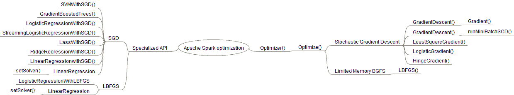**

Spark 中有用于执行 SGD 和 LBFGS 优化的函数。要使用它们，您应该能够编写并提供自己的成本函数。这些函数，如`runMiniBatchSGD()`，不仅标记为私有，而且需要对两种算法的实现有很好的理解。

由于这是一本食谱，我们无法深入研究优化理论，因此我们建议从我们的图书馆中参考以下书籍：

+   **优化（2013）**：[`www.amazon.com/Optimization-Springer-Texts-Statistics-Kenneth/dp/1461458374/ref=sr_1_8?ie=UTF8&qid=1485744639&sr=8-8&keywords=optimization`](https://www.amazon.com/Optimization-Springer-Texts-Statistics-Kenneth/dp/1461458374/ref=sr_1_8?ie=UTF8&qid=1485744639&sr=8-8&keywords=optimization)

+   **机器学习优化（2011）**：[`www.amazon.com/Optimization-Machine-Learning-Information-Processing/dp/026201646X/ref=sr_1_1?ie=UTF8&qid=1485744817&sr=8-1&keywords=optimization+for+machine+learning`](https://www.amazon.com/Optimization-Machine-Learning-Information-Processing/dp/026201646X/ref=sr_1_1?ie=UTF8&qid=1485744817&sr=8-1&keywords=optimization+for+machine+learning)

+   **凸优化（2004）**：[`www.amazon.com/Convex-Optimization-Stephen-Boyd/dp/0521833787/ref=pd_sim_14_2?_encoding=UTF8&psc=1&refRID=7T88DJY5ZWBEREGJ4WT4`](https://www.amazon.com/Convex-Optimization-Stephen-Boyd/dp/0521833787/ref=pd_sim_14_2?_encoding=UTF8&psc=1&refRID=7T88DJY5ZWBEREGJ4WT4)

+   **遗传算法在搜索、优化和机器学习中（1989）-经典！**：[`www.amazon.com/Genetic-Algorithms-Optimization-Machine-Learning/dp/0201157675/ref=sr_1_5?s=books&ie=UTF8&qid=1485745151&sr=1-5&keywords=genetic+programming`](https://www.amazon.com/Genetic-Algorithms-Optimization-Machine-Learning/dp/0201157675/ref=sr_1_5?s=books&ie=UTF8&qid=1485745151&sr=1-5&keywords=genetic+programming)

+   **《从自然到人工系统的群体智能》（1999）**：[`www.amazon.com/Swarm-Intelligence-Artificial-Institute-Complexity/dp/0195131592/ref=sr_1_3?s=books&ie=UTF8&qid=1485745559&sr=1-3&keywords=swarm+intelligence`](https://www.amazon.com/Swarm-Intelligence-Artificial-Institute-Complexity/dp/0195131592/ref=sr_1_3?s=books&ie=UTF8&qid=1485745559&sr=1-3&keywords=swarm+intelligence)

# 通过数学来优化二次成本函数并找到最小值

在本教程中，我们将在介绍梯度下降（一阶导数）和 L-BFGS（一种无 Hessian 的拟牛顿方法）之前，探索数学优化背后的基本概念。

我们将研究一个样本二次成本/误差函数，并展示如何仅通过数学找到最小值或最大值。

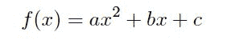

我们将使用顶点公式和导数方法来找到最小值，但我们将在本章的后续教程中介绍数值优化技术，如梯度下降及其在回归中的应用。

# 如何操作...

1.  假设我们有一个二次成本函数，我们找到它的最小值：

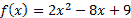

1.  在统计机器学习算法中，成本函数充当我们在搜索空间中移动时的难度级别、能量消耗或总误差的代理。

1.  我们要做的第一件事是绘制函数并进行直观检查。

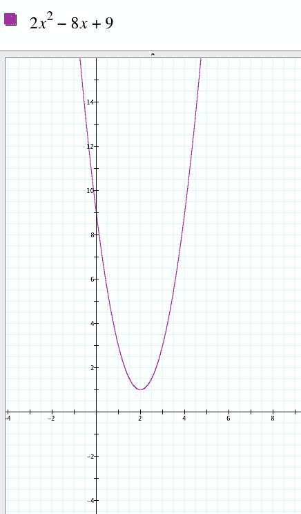

1.  通过直观检查，我们看到 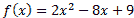 是一个凹函数，其最小值在 (2,1) 处。

1.  我们的下一步将是通过优化函数来找到最小值。在机器学习中，呈现成本或误差函数的一些示例可能是平方误差、欧几里得距离、MSSE，或者任何其他能够捕捉我们离最佳数值答案有多远的相似度度量。

1.  下一步是寻找最小化误差（例如成本）的最佳参数值。例如，通过优化线性回归成本函数（平方误差的总和），我们得到其参数的最佳值。

+   导数方法：将一阶导数设为 0 并解出

+   顶点方法：使用封闭代数形式

1.  首先，我们通过计算一阶导数，将其设为 0，并解出 *x* 和 *y* 来使用导数方法求解最小值。

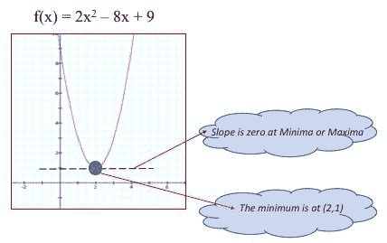

给定 f(x) = 2x² - 8x +9 作为我们的成本/误差函数，导数可以计算如下：

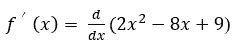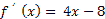

幂规则：![]

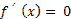 我们将导数设为 0 并解出![]

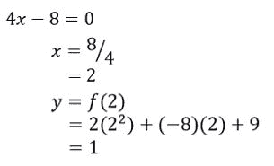

我们现在使用顶点公式方法验证最小值。要使用代数方法计算最小值，请参见以下步骤。

1.  给定函数 ，顶点可以在以下位置找到：

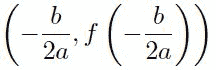

1.  让我们使用顶点代数公式来计算最小值：

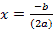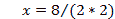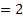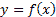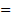2(2)2 + (-8) (2) +9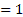

1.  作为最后一步，我们检查步骤 4 和 5 的结果，以确保我们使用封闭代数形式得出的最小值 (2, 1) 与导数方法得出的 (2, 1) 一致。

1.  在最后一步，我们在左侧面板中展示 *f(x)* 的图形，右侧面板中展示其导数，这样您可以直观地检查答案。

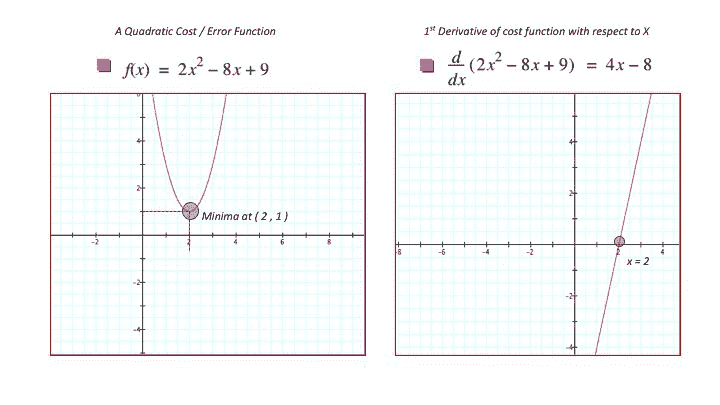

1.  正如您所看到的，随意检查显示最小值顶点在左侧为 (2,1) *{ x=2, f(x)=1 }*，而右侧图表显示函数关于 *X*（仅参数）的导数在 *X=2* 处取得最小值。如前面的步骤所示，我们将函数的导数设为零并解出 *X*，结果为数字 2。您还可以直观地检查两个面板和方程，以确保 *X=2* 在两种情况下都是正确的并且有意义。

# 工作原理...

我们有两种技术可以用来找到二次函数的最小值，而不使用数值方法。在现实生活中的统计机器学习优化中，我们使用导数来找到凸函数的最小值。如果函数是凸的（或者优化是有界的），那么只有一个局部最小值，所以工作比在深度学习中出现的非线性/非凸问题要简单得多。

在前面的配方中使用导数方法：

+   首先，我们通过应用导数规则（例如指数）找到了导数。

+   其次，我们利用了这样一个事实，对于给定的简单二次函数（凸优化），当第一导数的斜率为零时，最小值出现。

+   第三，我们简单地通过遵循和应用机械微积分规则找到了导数。

+   第四，我们将函数的导数设置为零！[](img/00211.gif)并解出 x

+   第五，我们使用 x 值并将其代入原方程以找到 y。通过步骤 1 到 5，我们最终得到了点（2，1）处的最小值。

# 还有更多...

大多数统计机器学习算法在定义和搜索域空间时使用成本或误差函数来得到最佳的数值近似解（例如，回归的参数）。函数达到最小值（最小化成本/误差）或最大值（最大化对数似然）的点是最佳解（最佳近似）存在的地方，误差最小。

可以在以下网址找到微分规则的快速复习：[`en.wikipedia.org/wiki/Differentiation_rules`](https://en.wikipedia.org/wiki/Differentiation_rules) [和](https://en.wikipedia.org/wiki/Differentiation_rules)[`www.math.ucdavis.edu/~kouba/Math17BHWDIRECTORY/Derivatives.pdf`](https://www.math.ucdavis.edu/~kouba/Math17BHWDIRECTORY/Derivatives.pdf)

可以在以下网址找到有关最小化二次函数的更多数学写作：[`www.cis.upenn.edu/~cis515/cis515-11-sl12.pdf`](http://www.cis.upenn.edu/~cis515/cis515-11-sl12.pdf)

可以在 MIT 找到有关二次函数优化和形式的科学写作：[`ocw.mit.edu/courses/sloan-school-of-management/15-084j-nonlinear-programming-spring-2004/lecture-notes/lec4_quad_form.pdf`](https://ocw.mit.edu/courses/sloan-school-of-management/15-084j-nonlinear-programming-spring-2004/lecture-notes/lec4_quad_form.pdf)

# 另见

+   可以在 UCSC 找到有关二次方程的详细写作：[`people.ucsc.edu/~miglior/chapter%20pdf/Ch08_SE.pdf`](https://people.ucsc.edu/~miglior/chapter%20pdf/Ch08_SE.pdf)

+   二次函数可以表示为以下形式之一：

| **二次函数 ax² + bx + c 形式** | **二次函数的标准形式** |
| --- | --- |
| 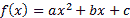 | 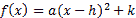 |

其中*a，b*和*c*是实数。

下图提供了最小值/最大值和参数的快速参考，这些参数调节了函数的凸/凹外观和感觉：

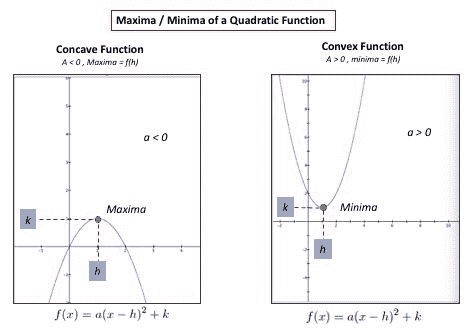

# 从头开始编写使用梯度下降（GD）的二次成本函数优化

在这个配方中，我们将编写一个名为梯度下降（GD）的迭代数值优化技术，以找到二次函数*f(x) = 2x² - 8x +9*的最小值。

这里的重点从使用数学来解决最小值（将第一导数设置为零）转移到了一种名为梯度下降（GD）的迭代数值方法，该方法从一个猜测开始，然后在每次迭代中使用成本/误差函数作为指导方针逐渐接近解决方案。

# 如何做...

1.  在 IntelliJ 或您选择的 IDE 中启动一个新项目。确保包含必要的 JAR 文件。

1.  使用包指令设置路径：`package spark.ml.cookbook.chapter9`。

1.  导入必要的包。

`scala.util.control.Breaks`将允许我们跳出程序。我们仅在调试阶段使用它，当程序无法收敛或陷入永无止境的过程中（例如，当步长过大时）。

```scala
import scala.collection.mutable.ArrayBuffer
import scala.util.control.Breaks._
```

1.  这一步定义了我们试图最小化的实际二次函数：

```scala
def quadratic_function_itself(x:Double):Double = {
// the function being differentiated
// f(x) = 2x² - 8x + 9
return 2 * math.pow(x,2) - (8*x) + 9
}
```

1.  这一步定义了函数的导数。这被称为点 x 处的梯度。这是函数*f(x) = 2x² - 8x + 9*的一阶导数。

```scala
def derivative_of_function(x:Double):Double = {
// The derivative of f(x)
return 4 * x - 8
}
```

1.  在这一步中，我们设置一个随机起始点（这里设置为 13）。这将成为我们在*x*轴上的初始起始点。

```scala
var currentMinimumValue = 13.0 // just pick up a random value
```

1.  我们继续设置从上一个配方*优化二次成本函数并仅使用数学来获得洞察力找到最小值*计算出的实际最小值，以便我们可以计算我们的估计与实际的每次迭代。

```scala
val actualMinima = 2.0 // proxy for a label in training phase
```

这一点试图充当您在 ML 算法的训练阶段提供的标签。在现实生活中，我们会有一个带有标签的训练数据集，并让算法进行训练并相应地调整其参数。

1.  设置记录变量并声明`ArrayBuffer`数据结构以存储成本（错误）加上估计的最小值，以便进行检查和绘图：

```scala
var oldMinimumValue = 0.0
var iteration = 0;
var minimumVector = ArrayBuffer[Double]()
var costVector = ArrayBuffer[Double]()
```

1.  梯度下降算法的内部控制变量在这一步中设置：

```scala
val stepSize = .01
val tolerance = 0.0001
```

`stepSize`，也被称为学习率，指导程序每次移动多少，而容差帮助算法在接近最小值时停止。

1.  我们首先设置一个循环来迭代，并在接近最小值时停止，基于期望的容差：

```scala
while (math.abs(currentMinimumValue - oldMinimumValue) > tolerance) {
iteration +=1 //= iteration + 1 for debugging when non-convergence
```

1.  我们每次更新最小值并调用函数计算并返回当前更新点的导数值：

```scala
oldMinimumValue = currentMinimumValue
val gradient_value_at_point = derivative_of_function(oldMinimumValue)
```

1.  我们决定移动多少，首先通过取上一步返回的导数值，然后将其乘以步长（即，我们对其进行缩放）。然后我们继续更新当前最小值并减少它的移动（导数值 x 步长）：

```scala
val move_by_amount = gradient_value_at_point * stepSize
currentMinimumValue = oldMinimumValue - move_by_amount
```

1.  我们通过使用一个非常简单的平方距离公式来计算我们的成本函数值（错误）。在现实生活中，实际的最小值将从训练中得出，但在这里我们使用上一个配方*优化二次成本函数并仅使用数学来获得洞察力找到最小值*中的值。

```scala
costVector += math.pow(actualMinima - currentMinimumValue, 2)
minimumVector += currentMinimumValue
```

1.  我们生成一些中间输出结果，以便您观察每次迭代时 currentMinimum 的行为：

```scala
print("Iteration= ",iteration," currentMinimumValue= ", currentMinimumValue)
print("\n")
```

输出将如下所示：

```scala
(Iteration= ,1, currentMinimumValue= ,12.56)
(Iteration= ,2, currentMinimumValue= ,12.1376)
(Iteration= ,3, currentMinimumValue= ,11.732096)
(Iteration= ,4, currentMinimumValue= ,11.342812160000001)
(Iteration= ,5, currentMinimumValue= ,10.9690996736)
(Iteration= ,6, currentMinimumValue= ,10.610335686656)
(Iteration= ,7, currentMinimumValue= ,10.265922259189761)
(Iteration= ,8, currentMinimumValue= ,9.935285368822171)
..........
..........
..........
(Iteration= ,203, currentMinimumValue= ,2.0027698292180602)
(Iteration= ,204, currentMinimumValue= ,2.0026590360493377)
(Iteration= ,205, currentMinimumValue= ,2.0025526746073643)
(Iteration= ,206, currentMinimumValue= ,2.00245056762307)
(Iteration= ,207, currentMinimumValue= ,2.002352544918147)
```

1.  以下声明包括一个提醒，即使优化算法如何实现，它也应始终提供退出非收敛算法的手段（即，它应防范用户输入和边缘情况）：

```scala
if (iteration == 1000000) break //break if non-convergence - debugging
}
```

1.  我们在每次迭代中收集的成本和最小值向量的输出，以供以后分析和绘图：

```scala
print("\n Cost Vector: "+ costVector)
print("\n Minimum Vactor" + minimumVector)
```

输出是：

```scala
Cost vector: ArrayBuffer(111.51360000000001, 102.77093376000002, 94.713692553216, 87.28813905704389, ........7.0704727116774655E-6, 6.516147651082496E-6, 6.005281675238673E-6, 5.534467591900128E-6)

Minimum VactorArrayBuffer(12.56, 12.1376, 11.732096, 11.342812160000001, 10.9690996736, 10.610335686656, 10.265922259189761, 9.935285368822171, ........2.0026590360493377, 2.0025526746073643, 2.00245056762307, 2.002352544918147)

```

1.  我们定义并设置最终最小值和实际函数值*f(minima)*的变量。它们充当最小值的(X,Y)位置：

```scala
var minimaXvalue= currentMinimumValue
var minimaYvalue= quadratic_function_itself(currentMinimumValue)
```

1.  我们打印出最终结果，与我们在配方中的计算匹配，*优化二次成本函数并仅使用数学来获得洞察力找到最小值*，使用迭代方法。最终输出应该是我们的最小值位于(2,1)，可以通过视觉或计算通过配方*优化二次成本函数并仅使用数学来获得洞察力找到最小值*进行检查。

```scala
print("\n\nGD Algo: Local minimum found at X="+f"$minimaXvalue%1.2f")
print("\nGD Algo: Y=f(x)= : "+f"$minimaYvalue%1.2f")
}
```

输出是：

```scala
GD Algo: Local minimum found at X = : 2.00 GD Algo: Y=f(x)= : 1.00
```

该过程以退出码 0 完成

# 工作原理...

梯度下降技术利用了函数的梯度（在这种情况下是一阶导数）指向下降方向的事实。概念上，梯度下降（GD）优化成本或错误函数以搜索模型的最佳参数。下图展示了梯度下降的迭代性质：

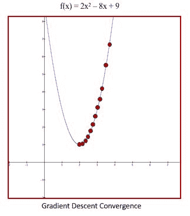

我们通过定义步长（学习率）、容差、要进行微分的函数以及函数的一阶导数来开始配方，然后继续迭代并从初始猜测（在这种情况下为 13）接近目标最小值 0。

在每次迭代中，我们计算了点的梯度（该点的一阶导数），然后使用步长对其进行缩放，以调节每次移动的量。由于我们在下降，我们从旧点中减去了缩放的梯度，以找到下一个更接近解决方案的点（以最小化误差）。

关于梯度值是应该加还是减以到达新点存在一些混淆，我们将在下面尝试澄清。指导原则应该是斜率是负还是正。为了朝着正确的方向移动，您必须朝着第一导数（梯度）的方向移动。

以下表格和图表提供了 GD 更新步骤的指南：

|  ***< 0****负梯度* | 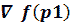 ***> 0****正梯度* |
| --- | --- |
| 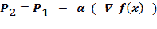 | 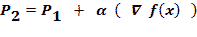 |

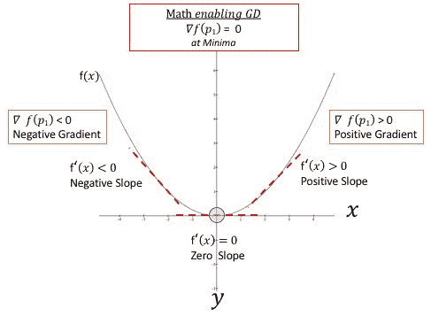

以下图表描述了单个步骤（负斜率）的内部工作，我们要么从起始点减去梯度，要么加上梯度，以到达下一个点，使我们离二次函数的最小值更近一步。例如，在这个配方中，我们从 13 开始，经过 200 多次迭代（取决于学习率），最终到达（2,1）的最小值，这与本章中的配方*优化二次成本函数并仅使用数学来获得洞察*中找到的解决方案相匹配。

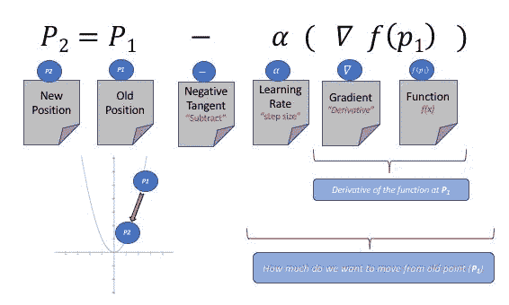

为了更好地理解这些步骤，让我们尝试从前图的左侧跟随一个步骤，对于一个简单的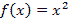函数。在这种情况下，我们位于曲线的左侧（原始猜测是负数），并且我们试图在每次迭代中向下爬升并增加 X，朝着梯度（一阶导数）的方向。

以下步骤将引导您浏览下一个图表，以演示核心概念和配方中的步骤：

1.  在给定点计算导数--梯度。

1.  使用步骤 1 中的梯度，并按步长进行缩放--移动的量。

1.  通过减去移动量找到新位置：

+   **负梯度情况**：在下图中，我们减去负梯度（有效地加上梯度）到原始点，以便向下爬升到的最小值 0。图中所示的曲线符合这种情况。

+   **正梯度情况**：如果我们在曲线的另一侧，梯度为正，那么我们从先前位置减去正梯度数（有效减小梯度）以向下爬向最小值。本配方中的代码符合这种情况，我们试图从正数 13（初始猜测）开始，并以迭代方式向 0 的最小值移动。

1.  更新参数并移动到新点。

1.  我们不断重复这些步骤，直到收敛到解决方案，从而最小化函数。

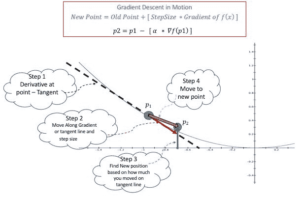

1.  重要的是要注意，梯度下降（GD）及其变体使用一阶导数，这意味着它们忽略曲率，而牛顿或拟牛顿（BFGS，LBFGS）方法等二阶导数算法使用梯度和曲率，有时还使用海森矩阵（相对于每个变量的部分导数矩阵）。

GD 的替代方案将是在整个域空间中搜索最佳设置，这既不切实际，也永远不会在实际意义上终止，因为真实大数据机器学习问题的规模和范围。

# 还有更多...

当你刚开始使用 GD 时，掌握步长或学习率非常重要。如果步长太小，会导致计算浪费，并给人一种梯度下降不收敛到解决方案的错觉。虽然对于演示和小项目来说设置步长是微不足道的，但将其设置为错误的值可能会导致大型 ML 项目的高计算损失。另一方面，如果步长太大，我们就会陷入乒乓情况或远离收敛，通常表现为误差曲线爆炸，意味着误差随着每次迭代而增加，而不是减少。

根据我们的经验，最好查看误差与迭代图表，并使用拐点来确定正确的值。另一种方法是尝试 .01, .001,......0001，并观察每次迭代的收敛情况（步长太小或太大）。值得记住的是，步长只是一个缩放因子，因为在某一点的实际梯度可能太大而无法移动（它会跳过最小值）。

总结：

+   如果步长太小，收敛速度就会很慢。

+   如果步长太大，你会跳过最小值（过冲），导致计算缓慢或出现乒乓效应（卡住）。

下图显示了基于不同步长的变化，以演示前面提到的要点。

+   **场景 1**：步长= .01 - 步长适中 - 只是稍微有点小，但在大约 200 次迭代中完成了任务。我们不希望看到任何少于 200 的情况，因为它必须足够通用以在现实生活中生存。

+   **场景 2**：步长= .001 - 步长太小，导致收敛速度缓慢。虽然看起来并不那么糟糕（1,500+次迭代），但可能被认为太细粒度了。

+   **场景 3**：步长= .05 - 步长太大了。在这种情况下，算法会陷入困境，来回徘徊而无法收敛。不能再强调了，你必须考虑在现实生活中出现这种情况时的退出策略（数据的性质和分布会发生很大变化，所以要有所准备）。

+   **场景 4**：步长= .06 - 步长太大，导致不收敛和爆炸。误差曲线爆炸（以非线性方式增加），意味着误差随着每次迭代而变大，而不是变小。在实践中，我们看到这种情况（场景 4）比之前的情况更多，但两种情况都可能发生，所以你应该为两种情况做好准备。正如你所看到的，场景 3 和场景 4 之间步长的微小差异造成了梯度下降行为的不同。这也是使算法交易困难的相同问题（优化）。

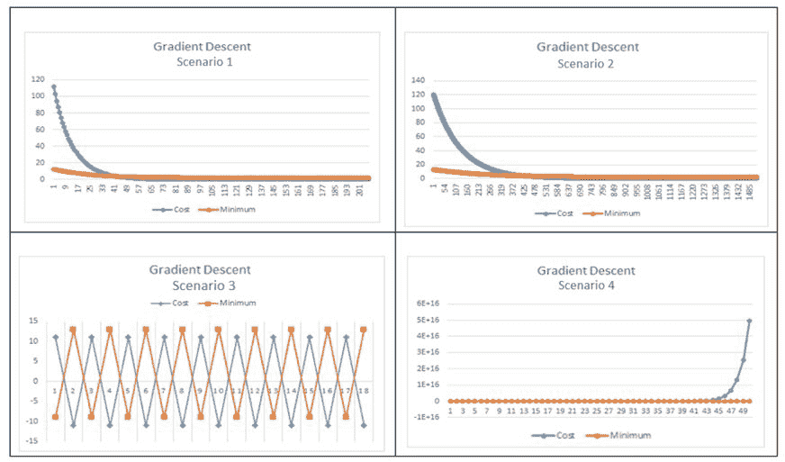

值得一提的是，对于这种光滑凸优化问题，局部最小值通常与全局最小值相同。你可以将局部最小值/最大值视为给定范围内的极值。对于同一函数，全局最小值/最大值指的是函数整个范围内的全局或最绝对值。

# 另见

随机梯度下降：梯度下降（GD）有多种变体，其中随机梯度下降（SGD）是最受关注的。Apache Spark 支持随机梯度下降（SGD）变体，其中我们使用训练数据的子集来更新参数 - 这有点具有挑战性，因为我们需要同时更新参数。SGD 与 GD 之间有两个主要区别。第一个区别是 SGD 是一种在线学习/优化技术，而 GD 更多是一种离线学习/优化技术。SGD 与 GD 之间的第二个区别是由于不需要在更新任何参数之前检查整个数据集，因此收敛速度更快。这一区别在下图中有所体现：

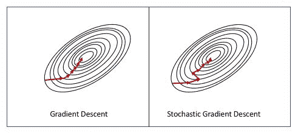

我们可以在 Apache Spark 中设置批处理窗口大小，以使算法对大规模数据集更具响应性（无需一次遍历整个数据集）。SGD 会有一些与之相关的随机性，但总体上它是当今使用的“事实标准”方法。它速度更快，收敛速度更快。

在 GD 和 SGD 的情况下，您通过更新原始参数来寻找模型的最佳参数。不同之处在于，在核心 GD 中，您必须遍历所有数据点以在给定迭代中对参数进行单次更新，而在 SGD 中，您需要查看来自训练数据集的每个单个（或小批量）样本以更新参数。

对于简短的通用写作，一个好的起点是以下内容：

+   GD :[`en.wikipedia.org/wiki/Gradient_descent`](https://en.wikipedia.org/wiki/Gradient_descent)

+   SGD:[`en.wikipedia.org/wiki/Stochastic_gradient_descent`](https://en.wikipedia.org/wiki/Stochastic_gradient_descent)

可以在 CMU、微软和统计软件杂志中找到更多数学处理：

+   CMU: [`www.cs.cmu.edu/~ggordon/10725-F12/slides/05-gd-revisited.pdf`](https://www.cs.cmu.edu/~ggordon/10725-F12/slides/05-gd-revisited.pdf)

+   [MS :](https://www.cs.cmu.edu/~ggordon/10725-F12/slides/05-gd-revisited.pdf) [`cilvr.cs.nyu.edu/diglib/lsml/bottou-sgd-tricks-2012.pdf`](http://cilvr.cs.nyu.edu/diglib/lsml/bottou-sgd-tricks-2012.pdf)

+   Jstat:[`arxiv.org/pdf/1509.06459v1.pdf`](https://arxiv.org/pdf/1509.06459v1.pdf)

# 编写梯度下降优化来解决线性回归问题

在这个示例中，我们将探讨如何编写梯度下降来解决线性回归问题。在上一个示例中，我们演示了如何编写 GD 来找到二次函数的最小值。

这个示例演示了一个更现实的优化问题，我们通过 Scala 在 Apache Spark 2.0+上优化（最小化）最小二乘成本函数来解决线性回归问题。我们将使用真实数据运行我们的算法，并将结果与一流的商业统计软件进行比较，以展示准确性和速度。

# 如何做...

1.  我们首先从普林斯顿大学下载包含以下数据的文件：

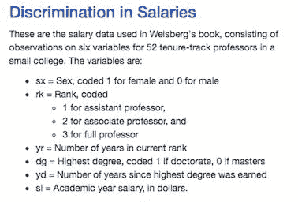

来源：普林斯顿大学

1.  下载源码：[`data.princeton.edu/wws509/datasets/#salary`](http://data.princeton.edu/wws509/datasets/#salary).

1.  为了简化问题，我们选择`yr`和`sl`来研究年级对薪水的影响。为了减少数据整理代码，我们将这两列保存在一个文件中（`Year_Salary.csv`），如下表所示，以研究它们的线性关系：

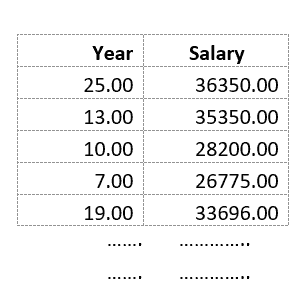

1.  我们使用 IBM SPSS 软件的散点图来直观地检查数据。不能再次强调，视觉检查应该是任何数据科学项目的第一步。

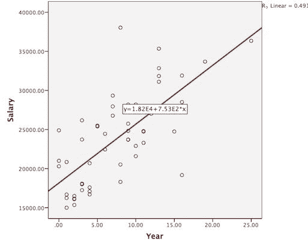

1.  在 IntelliJ 或您选择的 IDE 中启动一个新项目。确保包含必要的 JAR 文件。

1.  我们使用 import 包将代码放在所需的位置：

`package spark.ml.cookbook.chapter9`.

前四个语句导入了 JFree 图表包的必要包，以便我们可以在同一代码库中绘制 GD 错误和收敛。第五个导入处理`ArrayBuffer`，我们用它来存储中间结果：

```scala
import java.awt.Color
import org.jfree.chart.plot.{XYPlot, PlotOrientation}
import org.jfree.chart.{ChartFactory, ChartFrame, JFreeChart}
import org.jfree.data.xy.{XYSeries, XYSeriesCollection}
import scala.collection.mutable.ArrayBuffer
```

1.  定义数据结构以保存中间结果，因为我们最小化错误并收敛到斜率（`mStep`）和截距（`bStep`）的解决方案：

```scala
val gradientStepError = ArrayBuffer[(Int, Double)]()
val bStep = ArrayBuffer[(Int, Double)]()
val mStep = ArrayBuffer[(Int, Double)]()
```

1.  定义通过 JFree 图表进行绘图的函数。第一个函数只显示图表，第二个函数设置图表属性。这是一个模板代码，您可以根据自己的喜好进行自定义：

```scala
def show(chart: JFreeChart) {
val frame = new ChartFrame("plot", chart)
frame.pack()
frame.setVisible(true)
}
def configurePlot(plot: XYPlot): Unit = {
plot.setBackgroundPaint(Color.WHITE)
plot.setDomainGridlinePaint(Color.BLACK)
plot.setRangeGridlinePaint(Color.BLACK)
plot.setOutlineVisible(false)
}
```

1.  该函数基于最小二乘原理计算错误，我们最小化该错误以找到最佳拟合解决方案。该函数找到我们预测的值与训练数据中实际值（薪水）之间的差异。找到差异后，对其进行平方以计算总错误。pow()函数是一个 Scala 数学函数，用于计算平方。

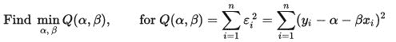

来源：维基百科

```scala
Beta : Slope (m variable)
Alpha : Intercept b variable)

def compute_error_for_line_given_points(b:Double, m:Double, points: Array[Array[Double]]):Double = {
var totalError = 0.0
for( point <- points ) {
var x = point(0)
var y = point(1)
totalError += math.pow(y - (m * x + b), 2)
}
return totalError / points.length
}
```

1.  下一个函数计算*f(x)= b + mx*的两个梯度（一阶导数），并在整个定义域（所有点）上对它们进行平均。这与第二个配方中的过程相同，只是我们需要偏导数（梯度），因为我们要最小化两个参数`m`和`b`（斜率和截距），而不仅仅是一个参数。

在最后两行中，我们通过学习率（步长）将梯度进行缩放。我们这样做的原因是为了确保我们不会得到很大的步长，并超过最小值，导致出现乒乓情景或错误膨胀，正如前面的配方中所讨论的那样。

```scala
def step_gradient(b_current:Double, m_current:Double, points:Array[Array[Double]], learningRate:Double): Array[Double]= {
var b_gradient= 0.0
var m_gradient= 0.0
var N = points.length.toDouble
for (point <- points) {
var x = point(0)
var y = point(1)
b_gradient += -(2 / N) * (y - ((m_current * x) + b_current))
m_gradient += -(2 / N) * x * (y - ((m_current * x) + b_current))
}
var result = new ArrayDouble
result(0) = b_current - (learningRate * b_gradient)
result(1) = m_current - (learningRate * m_gradient)
return result
}
```

1.  该函数读取并解析 CSV 文件：

```scala
def readCSV(inputFile: String) : Array[Array[Double]] = {scala.io.Source.fromFile(inputFile)
.getLines()
.map(_.split(",").map(_.trim.toDouble))
.toArray
}
```

1.  以下是一个包装函数，它循环 N 次迭代，并调用`step_gradient()`函数来计算给定点的梯度。然后，我们继续逐步存储每一步的结果，以便以后处理（例如绘图）。

值得注意的是使用`Tuple2()`来保存`step_gradient()`函数的返回值。

在函数的最后几步中，我们调用`compute_error_for_line_given_points()`函数来计算给定斜率和截距组合的错误，并将其存储在`gradientStepError`中。

```scala
def gradient_descent_runner(points:Array[Array[Double]], starting_b:Double, starting_m:Double, learning_rate:Double, num_iterations:Int):Array[Double]= {
var b = starting_b
var m = starting_m
var result = new ArrayDouble
var error = 0.0
result(0) =b
result(1) =m
for (i <-0 to num_iterations) {
result = step_gradient(result(0), result(1), points, learning_rate)
bStep += Tuple2(i, result(0))
mStep += Tuple2(i, result(1))
error = compute_error_for_line_given_points(result(0), result(1), points)
gradientStepError += Tuple2(i, error)
}
```

1.  最后一步是主程序，它设置了斜率、截距、迭代次数和学习率的初始起点。我们故意选择了较小的学习率和较大的迭代次数，以展示准确性和速度。

1.  首先，我们从初始化 GD 的关键控制变量开始（学习率、迭代次数和起始点）。

1.  其次，我们继续显示起始点（0,0），并调用`compute_error_for_line_given_points()`来显示起始错误。值得注意的是，经过 GD 运行后，错误应该更低，并在最后一步显示结果。

1.  1.  第三，我们为 JFree 图表设置必要的调用和结构，以显示两个图表，描述斜率、截距和错误的行为，当我们朝着优化解决方案（最小化错误的最佳斜率和截距组合）合并时。

```scala
def main(args: Array[String]): Unit = {
val input = "../data/sparkml2/chapter9/Year_Salary.csv"
val points = readCSV(input)
val learning_rate = 0.001
val initial_b = 0
val initial_m = 0
val num_iterations = 30000
println(s"Starting gradient descent at b = $initial_b, m =$initial_m, error = "+ compute_error_for_line_given_points(initial_b, initial_m, points))
println("Running...")
val result= gradient_descent_runner(points, initial_b, initial_m, learning_rate, num_iterations)
var b= result(0)
var m = result(1)
println( s"After $num_iterations iterations b = $b, m = $m, error = "+ compute_error_for_line_given_points(b, m, points))
val xy = new XYSeries("")
gradientStepError.foreach{ case (x: Int,y: Double) => xy.add(x,y) }
val dataset = new XYSeriesCollection(xy)
val chart = ChartFactory.createXYLineChart(
"Gradient Descent", // chart title
"Iteration", // x axis label
"Error", // y axis label
dataset, // data
PlotOrientation.VERTICAL,
false, // include legend
true, // tooltips
false // urls)
val plot = chart.getXYPlot()
configurePlot(plot)
show(chart)
val bxy = new XYSeries("b")
bStep.foreach{ case (x: Int,y: Double) => bxy.add(x,y) }
val mxy = new XYSeries("m")
mStep.foreach{ case (x: Int,y: Double) => mxy.add(x,y) }
val stepDataset = new XYSeriesCollection()
stepDataset.addSeries(bxy)
stepDataset.addSeries(mxy)
val stepChart = ChartFactory.createXYLineChart(
"Gradient Descent Steps", // chart title
"Iteration", // x axis label
"Steps", // y axis label
stepDataset, // data
PlotOrientation.VERTICAL,
true, // include legend
true, // tooltips
false // urls
)
val stepPlot = stepChart.getXYPlot()
configurePlot(stepPlot)
show(stepChart)
}
```

1.  以下是此配方的输出。

首先，我们显示起始点为 0,0，错误为 6.006，然后允许算法运行，并在完成迭代次数后显示结果：

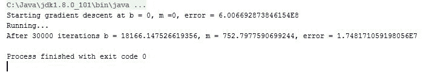

值得注意的是起始和结束的错误数字以及由于优化而随时间减少。

1.  我们使用 IBM SPSS 作为控制点，以显示我们组合的 GD 算法与 SPSS 软件生成的结果（几乎 1:1）几乎完全相同！

下图显示了 IBM SPSS 的输出，用于比较结果：

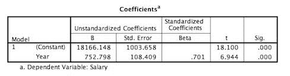

1.  在最后一步，程序并排生成了两个图表。

下图显示了斜率（*m*）和截距（*b*）是如何朝着最小化错误的最佳组合收敛的，当我们通过迭代运行时。

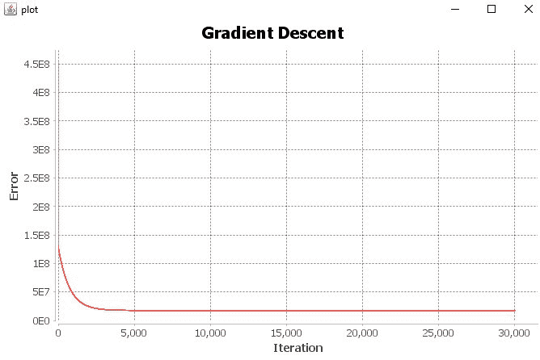

下图显示了斜率（*m*）和截距（*b*）是如何朝着最小化错误的最佳组合收敛的，当我们通过迭代运行时。

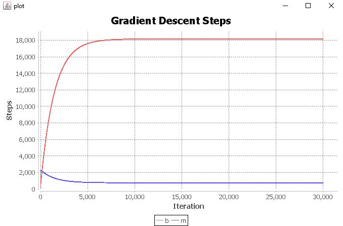

# 工作原理...

梯度下降是一种迭代的数值方法，它从一个初始猜测开始，然后通过查看一个错误函数来询问自己，我做得有多糟糕，这个错误函数是训练文件中预测数据与实际数据的平方距离。

在这个程序中，我们选择了一个简单的线性方程*f(x) = b + mx*作为我们的模型。为了优化并找出最佳的斜率 m 和截距 b 的组合，我们有 52 对实际数据(年龄，工资)可以代入我们的线性模型(*预测工资=斜率 x 年龄+截距*)。简而言之，我们想要找到最佳的斜率和截距的组合，帮助我们拟合一个最小化平方距离的线性线。平方函数给我们所有正值，并让我们只关注错误的大小。

+   `ReadCSV()`: 读取和解析数据文件到我们的数据集中：

*(x[1], y[1]), (x[2], y[2]), (x[3], y[4]), ... (x[52], y[52])*

+   `Compute_error_for_line_given_points()`: 这个函数实现了成本或错误函数。我们使用一个线性模型(一条直线的方程)来预测，然后测量与实际数字的平方距离。在添加错误后，我们平均并返回总错误：

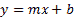

y[i] = mx[i] + b：对于所有数据对(*x, y)*

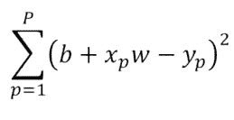

函数内值得注意的代码：第一行代码计算了预测值(*m * x + b*)与实际值(*y*)之间的平方距离。第二行代码对其进行平均并返回：

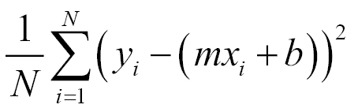*totalError += math.pow(y - (m * x + b), 2)**....**return totalError / points.length*

下图显示了最小二乘法的基本概念。简而言之，我们取实际训练数据与我们的模型预测之间的距离，然后对它们进行平方，然后相加。我们平方的原因是为了避免使用绝对值函数`abs()`，这在计算上是不可取的。平方差具有更好的数学性质，提供了连续可微的性质，这在想要最小化它时是更可取的。

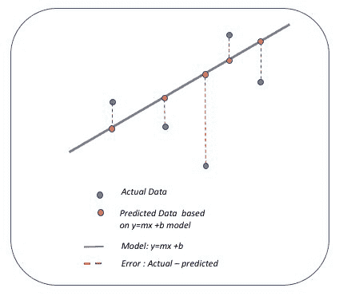

+   `step_gradient()`: 这个函数是计算梯度(一阶导数)的地方，使用我们正在迭代的当前点(*x[i],y[i])*。需要注意的是，与之前的方法不同，我们有两个参数，所以我们需要计算截距(`b_gradient`)和斜率(`m_gradient`)的偏导数。然后我们需要除以点的数量来求平均。

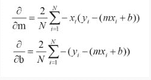

+   使用对截距(*b*)的偏导数：

*b_gradient += -(2 / N) * (y - ((m_current * x) + b_current))*

+   使用对斜率(*m*)的偏导数：

*m_gradient += -(2 / N) * x * (y - ((m_current * x) + b_current))*

+   最后一步是通过学习率(步长)来缩放计算出的梯度，然后移动到斜率(m_current)和截距(b_current)的新估计位置：*result(0) = b_current - (learningRate * b_gradient)**result(1) = m_current - (learningRate * m_gradient)*

+   `gradient_descent_runner()`: 这是执行`step_gradient()`和`compute_error_for_line_given_points()`的驱动程序，执行定义的迭代次数：

```scala
r (i <-0 to num_iterations) {
step_gradient()
...
compute_error_for_line_given_points()
...
}
```

# 还有更多...

虽然这个方法能够处理现实生活中的数据并与商业软件的估计相匹配，但在实践中，您需要实现随机梯度下降。

Spark 2.0 提供了带有小批量窗口的随机梯度下降(SGD)。

Spark 提供了两种利用 SGD 的方法。第一种选择是使用独立的优化技术，您可以通过传入优化函数来使用。参见以下链接：[`spark.apache.org/docs/latest/api/scala/index.html#org.apache.spark.mllib.optimization.Optimizer`](https://spark.apache.org/docs/latest/api/scala/index.html#org.apache.spark.mllib.optimization.Optimizer)和[`spark.apache.org/docs/latest/api/scala/index.html#org.apache.spark.mllib.optimization.GradientDescent`](https://spark.apache.org/docs/latest/api/scala/index.html#org.apache.spark.mllib.optimization.GradientDescent)

第二种选择是使用已经内置了 SGD 的专门 API 作为它们的优化技术：

+   `LogisticRegressionWithSGD()`

+   `StreamingLogisticRegressionWithSGD()`

+   `LassoWithSGD()`

+   `LinearRegressionWithSGD()`

+   `RidgeRegressionWithSGD()`

+   `SVMWithSGD()`

截至 Spark 2.0，所有基于 RDD 的回归只处于维护模式。

# 另请参阅

+   Spark 2.0 的优化：[`spark.apache.org/docs/latest/mllib-optimization.html#stochastic-gradient-descent-sgd`](https://spark.apache.org/docs/latest/mllib-optimization.html#stochastic-gradient-descent-sgd)

# 正规方程作为解决 Spark 2.0 中线性回归的替代方法

在这个示例中，我们提供了使用正规方程来解决线性回归的梯度下降（GD）和 LBFGS 的替代方法。在正规方程的情况下，您正在将回归设置为特征矩阵和标签向量（因变量），同时尝试通过使用矩阵运算（如逆、转置等）来解决它。

重点在于强调 Spark 使用正规方程来解决线性回归的便利性，而不是模型或生成系数的细节。

# 如何操作...

1.  我们使用了在第五章和第六章中广泛涵盖的相同的房屋数据集，这些章节分别是*Spark 2.0 中的回归和分类的实际机器学习-第 I 部分*和*Spark 2.0 中的回归和分类的实际机器学习-第 II 部分*，它们将各种属性（例如房间数量等）与房屋价格相关联。

数据可在`Chapter 9`数据目录下的`housing8.csv`中找到。

1.  我们使用 package 指令来处理放置：

```scala
package spark.ml.cookbook.chapter9
```

1.  然后导入必要的库：

```scala
import org.apache.spark.ml.feature.LabeledPoint
import org.apache.spark.ml.linalg.Vectors
import org.apache.spark.ml.regression.LinearRegression
import org.apache.spark.sql.SparkSession
import org.apache.log4j.{Level, Logger}
import spark.implicits._
```

1.  将 Spark 生成的额外输出减少，将 Logger 信息级别设置为`Level.ERROR`：

```scala
Logger.getLogger("org").setLevel(Level.ERROR)
Logger.getLogger("akka").setLevel(Level.ERROR)
```

1.  使用适当的属性设置 SparkSession：

```scala
val spark = SparkSession
.builder
.master("local[*]")
.appName("myRegressNormal")
.config("spark.sql.warehouse.dir", ".")
.getOrCreate()
```

1.  读取输入文件并将其解析为数据集：

```scala
val data = spark.read.text("../data/sparkml2/housing8.csv").as[String]
val RegressionDataSet = data.map { line => val columns = line.split(',')
LabeledPoint(columns(13).toDouble , Vectors.dense(columns(0).toDouble,columns(1).toDouble, columns(2).toDouble, columns(3).toDouble,columns(4).toDouble,
columns(5).toDouble,columns(6).toDouble, columns(7).toDouble
))
}
```

1.  显示以下数据集内容，但限制为前三行以供检查：

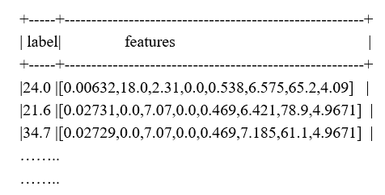

1.  我们创建一个 LinearRegression 对象，并设置迭代次数、ElasticNet 和正则化参数。最后一步是通过选择`setSolver("normal")`来设置正确的求解器方法：

```scala
val lr = new LinearRegression()                                      
  .setMaxIter(1000)                                   
  .setElasticNetParam(0.0)  
  .setRegParam(0.01)                                    
  .setSolver("normal")
```

请确保将 ElasticNet 参数设置为 0.0，以便"normal"求解器正常工作。

1.  使用以下内容将`LinearRegressionModel`拟合到数据中：

```scala
val myModel = lr.fit(RegressionDataSet)
Extract the model summary:
val summary = myModel.summary
```

运行程序时会生成以下输出：

```scala
training Mean Squared Error = 13.609079490110766
training Root Mean Squared Error = 3.6890485887435482
```

读者可以输出更多信息，但模型摘要已在第五章和第六章中进行了覆盖，*Spark 2.0 中的回归和分类的实际机器学习-第 I 部分*和*Spark 2.0 中的回归和分类的实际机器学习-第 II 部分*，通过其他技术。

# 它是如何工作的...

我们最终尝试使用封闭形式公式解决线性回归的以下方程：

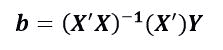

Spark 通过允许您设置`setSolver("normal")`提供了一个完全并行的解决这个方程的方法。

# 还有更多...

如果未将 ElasticNet 参数设置为 0.0，则会出现错误，因为在 Spark 中通过正规方程求解时使用了 L2 正则化（截至目前）。

有关 Spark 2.0 中等稳定回归的文档可以在以下网址找到：[`spark.apache.org/docs/latest/api/scala/index.html#org.apache.spark.ml.regression.LinearRegression`](http://spark.apache.org/docs/latest/api/scala/index.html#org.apache.spark.ml.regression.LinearRegression) 和 [`spark.apache.org/docs/latest/api/scala/index.html#org.apache.spark.ml.regression.LinearRegressionModel`](http://spark.apache.org/docs/latest/api/scala/index.html#org.apache.spark.ml.regression.LinearRegressionModel)

模型摘要可以在以下链接找到：[`spark.apache.org/docs/latest/api/scala/index.html#org.apache.spark.ml.regression.LinearRegressionSummary`](http://spark.apache.org/docs/latest/api/scala/index.html#org.apache.spark.ml.regression.LinearRegressionSummary)

[](http://spark.apache.org/docs/latest/api/scala/index.html#org.apache.spark.ml.regression.LinearRegressionSummary)

# 另请参阅

还可以参考以下表格：

| 迭代方法（SGD，LBFGS） | 闭合形式正规方程 |
| --- | --- |
| 选择学习率 | 无参数 |
| 迭代次数可能很大 | 不迭代 |
| 在大特征集上表现良好 | 在大特征集上速度慢且不实用 |
| 容易出错：由于参数选择不当而卡住 | (x^Tx)^(-1)的计算代价高 - 复杂度为 n³ |

以下是关于 LinearRegression 对象配置的快速参考，但是请查看第五章，*Spark 2.0 中的回归和分类的实用机器学习-第 I 部分*和第六章，*Spark 2.0 中的回归和分类的实用机器学习-第 II 部分*以获取更多细节。

+   L1：套索回归

+   L2：岭回归

+   L1 - L2：弹性网络，可以调整参数

以下链接是哥伦比亚大学的一篇文章，解释了正规方程与解决线性回归问题的关系：

+   [`www.stat.columbia.edu/~fwood/Teaching/w4315/Fall2009/lecture_11`](http://www.stat.columbia.edu/~fwood/Teaching/w4315/Fall2009/lecture_11)

+   [GNU 的 Octave（](http://www.stat.columbia.edu/~fwood/Teaching/w4315/Fall2009/lecture_11) [`www.gnu.org/software/octave/`](https://www.gnu.org/software/octave/)[)是一种流行的矩阵操作软件，你应该在工具包中拥有它。](http://www.stat.columbia.edu/~fwood/Teaching/w4315/Fall2009/lecture_11)

+   以下链接包含一个快速教程，帮助你入门：[`www.lauradhamilton.com/tutorial-linear-regression-with-octave`](http://www.lauradhamilton.com/tutorial-linear-regression-with-octave)
