# 第十章：使用决策树和集成模型构建机器学习系统

在本章中，我们将涵盖：

+   获取和准备真实世界的医疗数据，以探索 Spark 2.0 中的决策树和集成模型

+   在 Spark 2.0 中使用决策树构建分类系统

+   在 Spark 2.0 中使用决策树解决回归问题

+   在 Spark 2.0 中使用随机森林树构建分类系统

+   在 Spark 2.0 中使用随机森林树解决回归问题

+   在 Spark 2.0 中使用梯度提升树（GBT）构建分类系统

+   在 Spark 2.0 中使用梯度提升树（GBT）解决回归问题

# 介绍

决策树是商业中最古老和广泛使用的机器学习方法之一。它们受欢迎的原因不仅在于它们处理更复杂的分区和分割的能力（它们比线性模型更灵活），还在于它们解释我们是如何得出解决方案以及“为什么”结果被预测或分类为类/标签的能力。

Apache Spark 提供了一系列基于决策树的算法，完全能够利用 Spark 中的并行性。实现范围从直接的单决策树（CART 类型算法）到集成树，例如随机森林树和梯度提升树（GBT）。它们都有变体风味，以便进行分类（例如，分类，例如，身高=矮/高）或回归（例如，连续，例如，身高=2.5 米）的便利。

以下图描述了一个思维导图，显示了决策树算法在 Spark ML 库中的覆盖范围，截至撰写时：

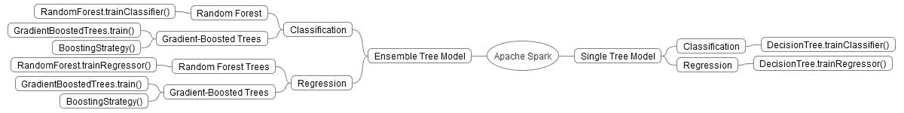

快速理解决策树算法的一种方法是将其视为一种智能分区算法，它试图最小化损失函数（例如，L2 或最小二乘），因为它将范围划分为最适合数据的分段空间。通过对数据进行采样并尝试组合特征，该算法变得更加复杂，从而组装出更复杂的集成模型，其中每个学习者（部分样本或特征组合）都对最终结果进行投票。

以下图描述了一个简化版本，其中一个简单的二叉树（树桩）被训练为将数据分类为属于两种不同颜色的段（例如，健康患者/患病患者）。该图描述了一个简单的算法，每次建立决策边界（因此分类）时，它只是将 x/y 特征空间分成一半，同时最小化错误的数量（例如，L2 最小二乘测量）：

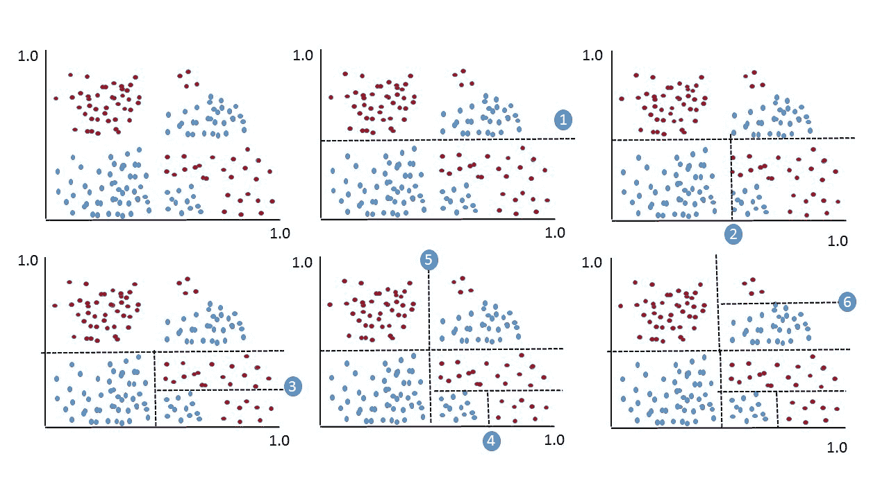

以下图提供了相应的树，以便我们可以可视化算法（在这种情况下，简单的分而治之）针对提出的分割空间。决策树算法受欢迎的原因是它们能够以一种易于向业务用户沟通的语言显示其分类结果，而无需太多数学：

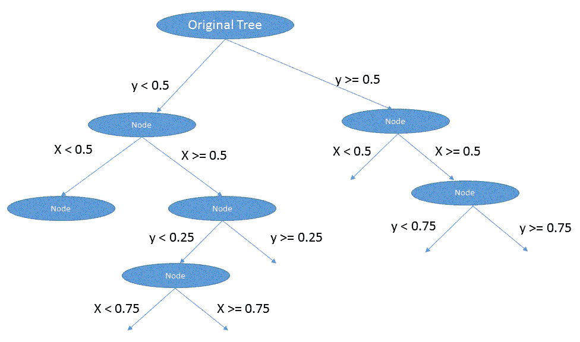

Spark 中的决策树是一种并行算法，旨在将单个树拟合和生长到可以是分类（分类）或连续（回归）的数据集中。它是一种贪婪算法，基于树桩（二进制分割等），通过递归地划分解空间，尝试使用信息增益最大化（基于熵）来选择所有可能分割中的最佳分割。

# 集成模型

观察 Spark 对决策树的另一种方式是将算法视为属于两个阵营。第一个阵营，我们在介绍中看到过，关注于试图找到各种技术来为数据集找到最佳的单棵树。虽然这对许多数据集来说是可以的，但算法的贪婪性质可能会导致意想不到的后果，比如过拟合和过度深入以能够捕捉训练数据中的所有边界（即过度优化）。

为了克服过拟合问题并提高准确性和预测质量，Spark 实现了两类集成决策树模型，试图创建许多不完美的学习器，这些学习器要么看到数据的子集（有或没有替换地采样），要么看到特征的子集。虽然每棵单独的树不太准确，但树的集合组装的投票（或在连续变量的情况下的平均概率）和由此产生的平均值比任何单独的树更准确：

+   **随机森林**：这种方法并行创建许多树，然后投票/平均结果以最小化单棵树算法中容易出现的过拟合问题。它们能够捕捉非线性和特征交互而无需任何缩放。它们应该至少被认真考虑为用于解剖数据并了解其构成的第一工具集之一。以下图提供了 Spark 中此实现的可视化指南：

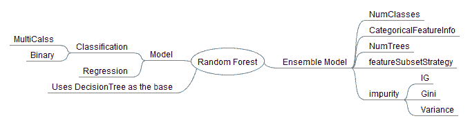

+   **梯度提升树**：这种方法是另一种集成模型，通过许多树的平均值（即使它们不太完美）来提高预测的准确性和质量。它们与随机森林的不同之处在于，它们一次构建一棵树，每棵树都试图从前一棵树的缺点中学习，通过最小化损失函数来改进。它们类似于梯度下降的概念，但它们使用最小化（类似于梯度）来选择和改进下一棵树（它们沿着创建最佳准确性的树的方向前进）。

损失函数的三个选项是：

+   **对数损失**：分类的负对数似然

+   **L2**：回归的最小二乘

+   **L1**：回归的绝对误差

以下图提供了一个易于使用的可视化参考：

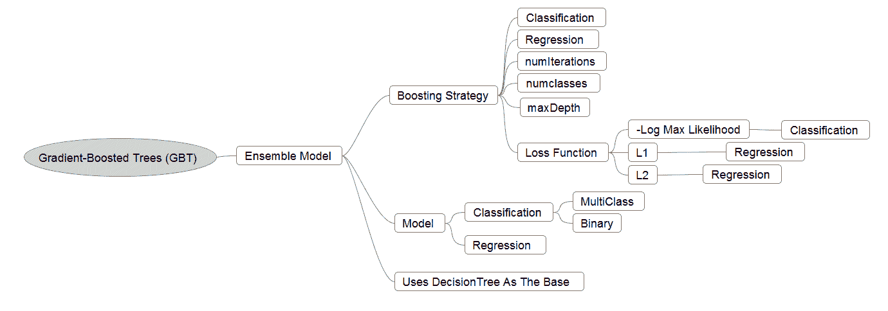

Spark 中决策树的主要包在 ML 中，如下所示：

```scala
org.apache.spark.mllib.tree
org.apache.spark.mllib.tree.configuration
org.apache.spark.mllib.tree.impurity
org.apache.spark.mllib.tree.model
```

# 不纯度的度量

对于所有的机器学习算法，我们都试图最小化一组成本函数，这些函数帮助我们选择最佳的移动。Spark 使用三种可能的最大化函数选择。以下图描述了这些替代方案：

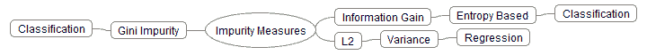

在本节中，我们将讨论三种可能的替代方案：

+   **信息增益**：粗略地说，这是根据熵的概念来衡量群体中不纯度的水平--参见香农信息理论，然后后来由 Quinlan 在他的 ID3 算法中建议。

熵的计算如下方程所示：

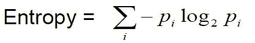

信息增益帮助我们在每个特征向量空间中选择一个属性，这个属性可以最好地帮助我们将类别彼此分开。我们使用这个属性来决定如何对节点中的属性进行排序（从而影响决策边界）。

以下图形以易于理解的方式描述了计算。在第一步中，我们希望选择一个属性，以便在根节点或父节点中最大化 IG（信息增益），然后为所选属性的每个值构建我们的子节点（它们的关联向量）。我们不断递归地重复算法，直到我们再也看不到任何收益：

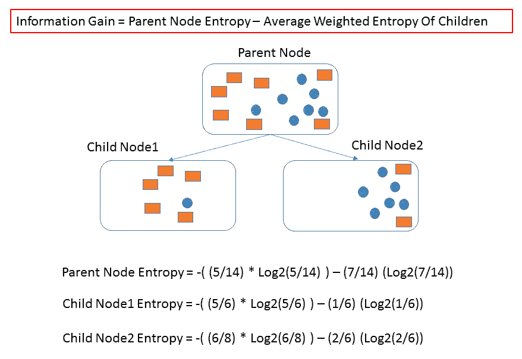

+   **基尼指数：** 这试图通过隔离类别来改进信息增益（IG），以便最大的类别与总体分离。基尼指数与熵有些不同，因为您尝试实现 50/50 的分割，然后应用进一步的分割来推断解决方案。它旨在反映一个变量的影响，并且不会扩展其影响到多属性状态。它使用简单的频率计数来对总体进行评估。用于更高维度和更多噪音数据的基尼指数。

在您拥有复杂的多维数据并且正在尝试从中解剖简单信号的情况下，请使用基尼不纯度。

另一方面，在您拥有更清洁和低维数据集的情况下，可以使用信息增益（或任何基于熵的系统），但您正在寻找更复杂（在准确性和质量方面）的数据集：

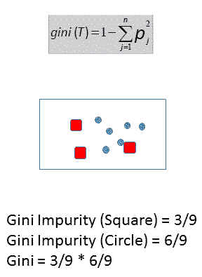

+   **方差**：方差用于信号树算法的回归模型。简而言之，我们仍然试图最小化 L2 函数，但不同之处在于这里我们试图最小化观察值与被考虑的节点（段）的平均值之间的距离的平方。

以下图表描述了可视化的简化版本：

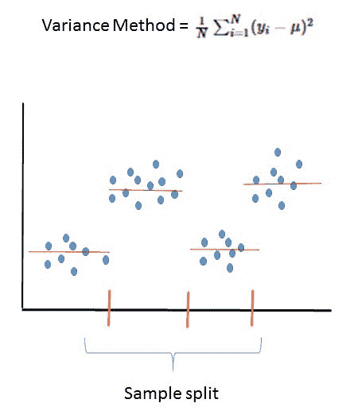

用于评估树模型的 Spark 模型评估工具包括以下内容：

混淆矩阵是用来描述分类模型性能的表格，其中真实值已知的测试数据集。混淆矩阵本身相对简单；它是一个 2x2 的矩阵：

|  |  | **预测** | **值** |
| --- | --- | --- | --- |
|  |  | 是 | 否 |
| **实际** | 是 | 真正例（TP） | 假反例（FN） |
| **值** | 否 | 假正例（FP） | 真反例（TN） |

对于我们的癌症数据集：

+   **真正例（TP）：** 预测为是，且他们确实患有乳腺癌

+   **真反例（TN）：** 预测为否，且他们没有乳腺癌

+   **假正例（FP）：** 我们预测为是，但他们没有乳腺癌

+   **假反例（FN）：** 我们预测为否，但他们确实患有乳腺癌

一个良好的分类系统应该与现实情况密切匹配，具有良好的 TP 和 TN 值，同时具有较少的 FP 和 FN 值。

总的来说，以下术语也被用作分类模型的标记：

1.  **准确性**：模型的正确率：

+   *(TP + TN)/总数*

1.  **错误**：总体上，模型错误的百分比：

+   *(FP+FN)/总数*

+   也等于 1-准确性

在 Spark 机器学习库中，有一个实用程序类来处理上述常见矩阵的计算：

```scala
   org.apache.spark.mllib.evaluation.MulticlassMetrics 
```

我们将在以下示例代码中使用实用程序类。

同样，对于回归算法，**均方误差（MSE）** 或误差平方的平均值，被广泛用作模型测量的关键参数。在 Spark 机器学习库中，也有一个实用程序类，它将提供回归模型的关键指标：

```scala
   org.apache.spark.mllib.evaluation.RegressionMetrics 
```

Spark 矩阵评估器的文档可以在[`spark.apache.org/docs/latest/api/scala/index.html#org.apache.spark.mllib.evaluation.MulticlassMetrics`](http://spark.apache.org/docs/latest/api/scala/index.html#org.apache.spark.mllib.evaluation.MulticlassMetrics)和[`spark.apache.org/docs/latest/api/scala/index.html#org.apache.spark.mllib.evaluation.RegressionMetrics`](http://spark.apache.org/docs/latest/api/scala/index.html#org.apache.spark.mllib.evaluation.RegressionMetrics)找到。

# 获取和准备真实世界的医学数据，以探索 Spark 2.0 中的决策树和集成模型

使用决策树在机器学习中的真实应用。我们使用了一个癌症数据集来预测患者病例是恶性还是良性。为了探索决策树的真正威力，我们使用了一个展现真实生活非线性和复杂误差表面的医学数据集。

# 如何做...

**威斯康星乳腺癌**数据集是从威斯康星大学医院的 William H Wolberg 博士处获得的。该数据集是定期获得的，因为 Wolberg 博士报告了他的临床病例。

该数据集可以从多个来源检索，并且可以直接从加州大学尔湾分校的网络服务器 [`archive.ics.uci.edu/ml/machine-learning-databases/breast-cancer-wisconsin/breast-cancer-wisconsin.data`](http://archive.ics.uci.edu/ml/machine-learning-databases/breast-cancer-wisconsin/breast-cancer-wisconsin.data) 获取。

数据也可以从威斯康星大学的网络服务器 ftp://ftp.cs.wisc.edu/math-prog/cpo-dataset/machine-learn/cancer/cancer1/datacum 获取。

该数据集目前包含 1989 年至 1991 年的临床病例。它有 699 个实例，其中 458 个被分类为良性肿瘤，241 个被分类为恶性病例。每个实例由九个属性描述，属性值在 1 到 10 的范围内，并带有二进制类标签。在这 699 个实例中，有 16 个实例缺少一些属性。

我们将从内存中删除这 16 个实例，并处理其余的（总共 683 个实例）进行模型计算。

样本原始数据如下所示：

```scala
1000025,5,1,1,1,2,1,3,1,1,2
1002945,5,4,4,5,7,10,3,2,1,2
1015425,3,1,1,1,2,2,3,1,1,2
1016277,6,8,8,1,3,4,3,7,1,2
1017023,4,1,1,3,2,1,3,1,1,2
1017122,8,10,10,8,7,10,9,7,1,4
...
```

属性信息如下：

| **#** | **属性** | **域** |
| --- | --- | --- |
| 1 | 样本编号 | ID 编号 |
| 2 | 块厚度 | 1 - 10 |
| 3 | 细胞大小的均匀性 | 1 - 10 |
| 4 | 细胞形态的均匀性 | 1 - 10 |
| 5 | 边缘粘附 | 1 - 10 |
| 6 | 单个上皮细胞大小 | 1 - 10 |
| 7 | 裸核 | 1 - 10 |
| 8 | 淡染色质 | 1 - 10 |
| 9 | 正常核仁 | 1 - 10 |
| 10 | 有丝分裂 | 1 - 10 |
| 11 | 类别 | (2 表示良性，4 表示恶性) |

如果以正确的列呈现，将如下所示：

| **ID 编号** | **块厚度** | **细胞大小的均匀性** | **细胞形态的均匀性** | **边缘粘附** | **单个上皮细胞大小** | **裸核** | **淡染色质** | **正常核仁** | **有丝分裂** | **类别** |
| --- | --- | --- | --- | --- | --- | --- | --- | --- | --- | --- |
| 1000025 | 5 | 1 | 1 | 1 | 2 | 1 | 3 | 1 | 1 | 2 |
| 1002945 | 5 | 4 | 4 | 5 | 7 | 10 | 3 | 2 | 1 | 2 |
| 1015425 | 3 | 1 | 1 | 1 | 2 | 2 | 3 | 1 | 1 | 2 |
| 1016277 | 6 | 8 | 8 | 1 | 3 | 4 | 3 | 7 | 1 | 2 |
| 1017023 | 4 | 1 | 1 | 3 | 2 | 1 | 3 | 1 | 1 | 2 |
| 1017122 | 8 | 10 | 10 | 8 | 7 | 10 | 9 | 7 | 1 | 4 |
| 1018099 | 1 | 1 | 1 | 1 | 2 | 10 | 3 | 1 | 1 | 2 |
| 1018561 | 2 | 1 | 2 | 1 | 2 | 1 | 3 | 1 | 1 | 2 |
| 1033078 | 2 | 1 | 1 | 1 | 2 | 1 | 1 | 1 | 5 | 2 |
| 1033078 | 4 | 2 | 1 | 1 | 2 | 1 | 2 | 1 | 1 | 2 |
| 1035283 | 1 | 1 | 1 | 1 | 1 | 1 | 3 | 1 | 1 | 2 |
| 1036172 | 2 | 1 | 1 | 1 | 2 | 1 | 2 | 1 | 1 | 2 |
| 1041801 | 5 | 3 | 3 | 3 | 2 | 3 | 4 | 4 | 1 | 4 |
| 1043999 | 1 | 1 | 1 | 1 | 2 | 3 | 3 | 1 | 1 | 2 |
| 1044572 | 8 | 7 | 5 | 10 | 7 | 9 | 5 | 5 | 4 | 4 |
| ... | ... | ... | ... | ... | ... | ... | ... | ... | ... | ... |

# 还有更多...

威斯康星乳腺癌数据集在机器学习社区中被广泛使用。该数据集包含有限的属性，其中大部分是离散数字。非常容易将分类算法和回归模型应用于该数据集。

已经有 20 多篇研究论文和出版物引用了这个数据集，它是公开可用的，非常容易使用。

该数据集具有多变量数据类型，其中属性为整数，属性数量仅为 10。这使得它成为本章分类和回归分析的典型数据集之一。

# 在 Spark 2.0 中构建决策树分类系统

在本示例中，我们将使用乳腺癌数据并使用分类来演示 Spark 中的决策树实施。我们将使用 IG 和 Gini 来展示如何使用 Spark 已经提供的设施，以避免冗余编码。此示例尝试使用二进制分类来拟合单棵树，以训练和预测数据集的标签（良性（0.0）和恶性（1.0））。

# 如何做到这一点

1.  在 IntelliJ 或您选择的 IDE 中启动新项目。确保包含必要的 JAR 文件。

1.  设置程序所在的包位置：

```scala
package spark.ml.cookbook.chapter10
```

1.  导入 Spark 上下文所需的必要包，以便访问集群和`Log4j.Logger`以减少 Spark 产生的输出量：

```scala
import org.apache.spark.mllib.evaluation.MulticlassMetrics
import org.apache.spark.mllib.tree.DecisionTree
import org.apache.spark.mllib.linalg.Vectors
import org.apache.spark.mllib.regression.LabeledPoint
import org.apache.spark.mllib.tree.model.DecisionTreeModel
import org.apache.spark.rdd.RDD
import org.apache.spark.sql.SparkSession
import org.apache.log4j.{Level, Logger} 
```

1.  创建 Spark 的配置和 Spark 会话，以便我们可以访问集群：

```scala
Logger.getLogger("org").setLevel(Level.ERROR)

 val spark = SparkSession
 .builder.master("local[*]")
 .appName("MyDecisionTreeClassification")
 .config("spark.sql.warehouse.dir", ".")
 .getOrCreate()
```

1.  我们读取原始原始数据文件：

```scala
val rawData = spark.sparkContext.textFile("../data/sparkml2/chapter10/breast-cancer-wisconsin.data")
```

1.  我们预处理数据集：

```scala
val data = rawData.map(_.trim)
 .filter(text => !(text.isEmpty || text.startsWith("#") || text.indexOf("?") > -1))
 .map { line =>
 val values = line.split(',').map(_.toDouble)
 val slicedValues = values.slice(1, values.size)
 val featureVector = Vectors.dense(slicedValues.init)
 val label = values.last / 2 -1
 LabeledPoint(label, featureVector)
 }
```

首先，我们修剪行并删除任何空格。一旦行准备好进行下一步，如果行为空或包含缺失值（“?”），则删除行。在此步骤之后，内存中的数据集将删除 16 行缺失数据。

然后我们将逗号分隔的值读入 RDD。由于数据集中的第一列只包含实例的 ID 号，最好将此列从实际计算中删除。我们使用以下命令切片，将从 RDD 中删除第一列：

```scala
val slicedValues = values.slice(1, values.size)
```

然后我们将其余数字放入密集向量。

由于威斯康星州乳腺癌数据集的分类器要么是良性病例（最后一列值=2），要么是恶性病例（最后一列值=4），我们使用以下命令转换前面的值：

```scala
val label = values.last / 2 -1
```

因此，良性病例 2 转换为 0，恶性病例值 4 转换为 1，这将使后续计算更容易。然后将前一行放入`Labeled Points`：

```scala
    Raw data: 1000025,5,1,1,1,2,1,3,1,1,2
    Processed Data: 5,1,1,1,2,1,3,1,1,0
    Labeled Points: (0.0, [5.0,1.0,1.0,1.0,2.0,1.0,3.0,1.0,1.0])
```

1.  我们验证原始数据计数并处理数据计数：

```scala
println(rawData.count())
println(data.count())
```

然后您将在控制台上看到以下内容：

```scala
699
683
```

1.  我们将整个数据集随机分成训练数据（70%）和测试数据（30%）。请注意，随机拆分将生成大约 211 个测试数据集。这大约是但并非完全是数据集的 30%：

```scala
val splits = data.randomSplit(Array(0.7, 0.3))
val (trainingData, testData) = (splits(0), splits(1))
```

1.  我们定义一个度量计算函数，它利用 Spark 的`MulticlassMetrics`：

```scala
def getMetrics(model: DecisionTreeModel, data: RDD[LabeledPoint]): MulticlassMetrics = {
 val predictionsAndLabels = data.map(example =>
 (model.predict(example.features), example.label)
 )
 new MulticlassMetrics(predictionsAndLabels)
 }
```

此函数将读取模型和测试数据集，并创建一个包含前面提到的混淆矩阵的度量。它将包含模型准确性，这是分类模型的指标之一。

1.  我们定义一个评估函数，它可以接受一些可调参数用于决策树模型，并对数据集进行训练：

```scala
def evaluate(
 trainingData: RDD[LabeledPoint],
 testData: RDD[LabeledPoint],
 numClasses: Int,
 categoricalFeaturesInfo: Map[Int,Int],

 impurity: String,
 maxDepth: Int,
 maxBins:Int
 ) :Unit = {

 val model = DecisionTree.*trainClassifier*(trainingData, numClasses,
 categoricalFeaturesInfo,
 impurity, maxDepth, maxBins)
 val metrics = getMetrics(model, testData)
 println("Using Impurity :"+ impurity)
 println("Confusion Matrix :")
 println(metrics.confusionMatrix)
 println("Decision Tree Accuracy: "+metrics.*precision*)
 println("Decision Tree Error: "+ (1-metrics.*precision*))

 }
```

评估函数将读取几个参数，包括不纯度类型（模型的基尼或熵）并生成评估指标。

1.  我们设置以下参数：

```scala
val numClasses = 2
 val categoricalFeaturesInfo = *Map*[Int, Int]()
 val maxDepth = 5
 val maxBins = 32
```

由于我们只有良性（0.0）和恶性（1.0），我们将 numClasses 设置为 2。其他参数是可调的，其中一些是算法停止标准。

1.  首先我们评估基尼不纯度：

```scala
evaluate(trainingData, testData, numClasses, categoricalFeaturesInfo,
"gini", maxDepth, maxBins)
```

从控制台输出：

```scala
Using Impurity :gini
Confusion Matrix :
115.0 5.0
0 88.0
Decision Tree Accuracy: 0.9620853080568721
Decision Tree Error: 0.03791469194312791
To interpret the above Confusion metrics, Accuracy is equal to (115+ 88)/ 211 all test cases, and error is equal to 1 -accuracy
```

1.  我们评估熵不纯度：

```scala
evaluate(trainingData, testData, numClasses, categoricalFeaturesInfo,
"entropy", maxDepth, maxBins)
```

从控制台输出：

```scala
Using Impurity:entropy
Confusion Matrix:
116.0 4.0
9.0 82.0
Decision Tree Accuracy: 0.9383886255924171
Decision Tree Error: 0.06161137440758291
To interpret the preceding confusion metrics, accuracy is equal to (116+ 82)/ 211 for all test cases, and error is equal to 1 - accuracy
```

1.  然后通过停止会话来关闭程序：

```scala
spark.stop()
```

# 它是如何工作的... 

数据集比通常更复杂，但除了一些额外步骤外，解析它与前几章介绍的其他示例相同。解析将数据以原始形式转换为中间格式，最终将成为 Spark ML 方案中常见的 LabelPoint 数据结构：

```scala
     Raw data: 1000025,5,1,1,1,2,1,3,1,1,2
     Processed Data: 5,1,1,1,2,1,3,1,1,0
     Labeled Points: (0.0, [5.0,1.0,1.0,1.0,2.0,1.0,3.0,1.0,1.0])
```

我们使用`DecisionTree.trainClassifier()`在训练集上训练分类器树。然后通过检查各种不纯度和混淆矩阵测量来演示如何衡量树模型的有效性。

鼓励读者查看输出并参考其他机器学习书籍，以了解混淆矩阵和不纯度测量的概念，以掌握 Spark 中决策树和变体。

# 还有更多...

为了更好地可视化，我们在 Spark 中包含了一个样本决策树工作流程，它将首先将数据读入 Spark。在我们的情况下，我们从文件创建 RDD。然后我们使用随机抽样函数将数据集分为训练数据和测试数据。

数据集分割后，我们使用训练数据集来训练模型，然后使用测试数据来测试模型的准确性。一个好的模型应该有一个有意义的准确度值（接近 1）。下图描述了工作流程：

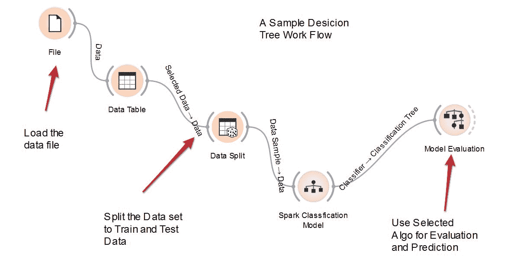

基于威斯康星乳腺癌数据集生成了一棵样本树。红点代表恶性病例，蓝点代表良性病例。我们可以在下图中直观地检查这棵树：

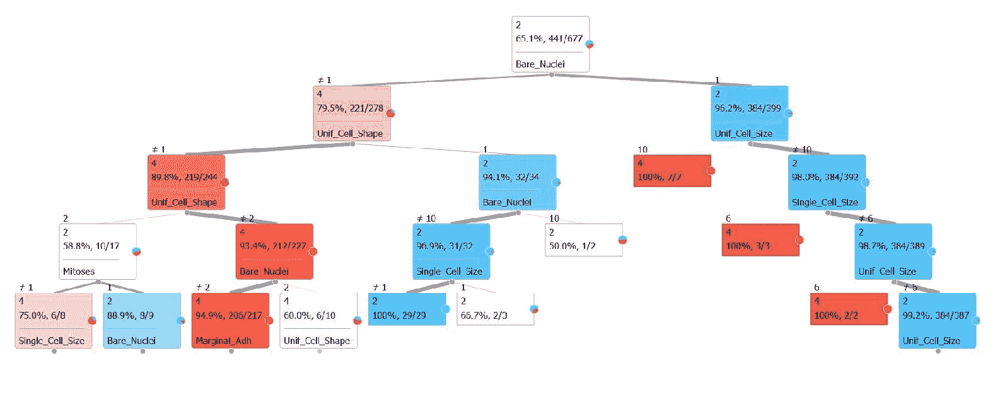

# 另请参阅

+   构造函数的文档可以在以下网址找到：[`spark.apache.org/docs/latest/api/scala/index.html#org.apache.spark.mllib.tree.DecisionTree`](http://spark.apache.org/docs/latest/api/scala/index.html#org.apache.spark.mllib.tree.DecisionTree) 和 [`spark.apache.org/docs/latest/api/scala/index.html#org.apache.spark.mllib.tree.model.DecisionTreeModel`](http://spark.apache.org/docs/latest/api/scala/index.html#org.apache.spark.mllib.tree.model.DecisionTreeModel)

+   Spark 矩阵评估器的文档可以在以下网址找到：[`spark.apache.org/docs/latest/api/scala/index.html#org.apache.spark.mllib.evaluation.MulticlassMetrics`](http://spark.apache.org/docs/latest/api/scala/index.html#org.apache.spark.mllib.evaluation.MulticlassMetrics)

# 在 Spark 2.0 中使用决策树解决回归问题

与之前的示例类似，我们将使用`DecisionTree()`类来训练和预测使用回归树模型的结果。刷新所有这些模型是**CART**（**分类和回归树**）的一个变体，有两种模式。在这个示例中，我们探索了 Spark 中决策树实现的回归 API。

# 如何做...

1.  在 IntelliJ 或您选择的 IDE 中启动一个新项目。确保包含必要的 JAR 文件。

1.  设置程序所在的包位置：

```scala
package spark.ml.cookbook.chapter10
```

1.  导入 Spark 上下文所需的必要包，以便访问集群和`Log4j.Logger`以减少 Spark 产生的输出量：

```scala
import org.apache.spark.mllib.evaluation.RegressionMetrics
import org.apache.spark.mllib.linalg.Vectors
import org.apache.spark.mllib.regression.LabeledPoint
import org.apache.spark.mllib.tree.DecisionTree
import org.apache.spark.mllib.tree.model.DecisionTreeModel
import org.apache.spark.rdd.RDD

import org.apache.spark.sql.SparkSession
import org.apache.log4j.{Level, Logger}
```

1.  创建 Spark 的配置和 Spark 会话，以便我们可以访问集群：

```scala
Logger.getLogger("org").setLevel(Level.*ERROR*)

 val spark = SparkSession
 .builder.master("local[*]")
 .appName("MyDecisionTreeRegression")
 .config("spark.sql.warehouse.dir", ".")
 .getOrCreate()
```

1.  我们读取原始的原始数据文件：

```scala
val rawData = spark.sparkContext.textFile("../data/sparkml2/chapter10/breast-cancer-wisconsin.data")
```

1.  我们预处理数据集（详细信息请参见前面的代码）：

```scala
val data = rawData.map(_.trim)
 .filter(text => !(text.isEmpty || text.startsWith("#") || text.indexOf("?") > -1))
 .map { line =>
 val values = line.split(',').map(_.toDouble)
 val slicedValues = values.slice(1, values.size)
 val featureVector = Vectors.dense(slicedValues.init)
 val label = values.last / 2 -1
 LabeledPoint(label, featureVector)
 }
```

1.  我们验证原始数据计数并处理数据计数：

```scala
println(rawData.count())
println(data.count())
```

在控制台上你会看到以下内容：

```scala
699
683
```

1.  我们将整个数据集分为训练数据（70%）和测试数据（30%）集：

```scala
val splits = data.randomSplit(Array(0.7, 0.3))
val (trainingData, testData) = (splits(0), splits(1))
```

1.  我们定义一个度量计算函数，该函数利用 Spark 的`RegressionMetrics`：

```scala
def getMetrics(model: DecisionTreeModel, data: RDD[LabeledPoint]): RegressionMetrics = {
 val predictionsAndLabels = data.map(example =>
 (model.predict(example.features), example.label)
 )
 new RegressionMetrics(predictionsAndLabels)
 }
```

1.  我们设置以下参数：

```scala
val categoricalFeaturesInfo = Map[Int, Int]()
val impurity = "variance" val maxDepth = 5
val maxBins = 32
```

1.  我们首先评估基尼不纯度：

```scala
val model = DecisionTree.trainRegressor(trainingData, categoricalFeaturesInfo, impurity, maxDepth, maxBins)
val metrics = getMetrics(model, testData)
println("Test Mean Squared Error = " + metrics.meanSquaredError)
println("My regression tree model:\n" + model.toDebugString)

```

从控制台输出：

```scala
Test Mean Squared Error = 0.037363769271664016
My regression tree model:
DecisionTreeModel regressor of depth 5 with 37 nodes
If (feature 1 <= 3.0)
   If (feature 5 <= 3.0)
    If (feature 0 <= 6.0)
     If (feature 7 <= 3.0)
      Predict: 0.0
     Else (feature 7 > 3.0)
      If (feature 0 <= 4.0)
       Predict: 0.0
      Else (feature 0 > 4.0)
       Predict: 1.0
    Else (feature 0 > 6.0)
     If (feature 2 <= 2.0)
      Predict: 0.0
     Else (feature 2 > 2.0)
      If (feature 4 <= 2.0)
       Predict: 0.0
      Else (feature 4 > 2.0)
       Predict: 1.0
   Else (feature 5 > 3.0)
    If (feature 1 <= 1.0)
     If (feature 0 <= 5.0)
      Predict: 0.0
     Else (feature 0 > 5.0)
      Predict: 1.0
    Else (feature 1 > 1.0)
     If (feature 0 <= 6.0)
      If (feature 7 <= 4.0)
       Predict: 0.875
      Else (feature 7 > 4.0)
       Predict: 0.3333333333333333
     Else (feature 0 > 6.0)
      Predict: 1.0
  Else (feature 1 > 3.0)
   If (feature 1 <= 4.0)
    If (feature 4 <= 6.0)
     If (feature 5 <= 7.0)
      If (feature 0 <= 8.0)
       Predict: 0.3333333333333333
      Else (feature 0 > 8.0)
       Predict: 1.0
     Else (feature 5 > 7.0)
      Predict: 1.0
    Else (feature 4 > 6.0)
     Predict: 0.0
   Else (feature 1 > 4.0)
    If (feature 3 <= 1.0)
     If (feature 0 <= 6.0)
      If (feature 0 <= 5.0)
       Predict: 1.0
      Else (feature 0 > 5.0)
       Predict: 0.0
     Else (feature 0 > 6.0)
      Predict: 1.0
    Else (feature 3 > 1.0)
     Predict: 1.0
```

1.  然后通过停止 Spark 会话来关闭程序：

```scala
spark.stop()
```

# 工作原理...

我们使用相同的数据集，但这次我们使用决策树来解决数据的回归问题。值得注意的是创建一个度量计算函数，该函数利用 Spark 的`RegressionMetrics()`：

```scala
def getMetrics(model: DecisionTreeModel, data: RDD[LabeledPoint]): RegressionMetrics = {
 val predictionsAndLabels = data.map(example =>
 (model.predict(example.features), example.label)
 )
 new RegressionMetrics(predictionsAndLabels)
 }
```

然后我们继续使用`DecisionTree.trainRegressor()`来执行实际的回归，并获得不纯度测量（GINI）。然后我们继续输出实际的回归，这是一系列决策节点/分支和用于在给定分支上做出决策的值：

```scala
If (feature 0 <= 4.0)
       Predict: 0.0
      Else (feature 0 > 4.0)
       Predict: 1.0
    Else (feature 0 > 6.0)
     If (feature 2 <= 2.0)
      Predict: 0.0
     Else (feature 2 > 2.0)
      If (feature 4 <= 2.0)
........
........
.......
```

# 另请参阅

+   构造函数的文档可以在以下网址找到：[`spark.apache.org/docs/latest/api/scala/index.html#org.apache.spark.mllib.tree.DecisionTree`](http://spark.apache.org/docs/latest/api/scala/index.html#org.apache.spark.mllib.tree.DecisionTree) 和 [`spark.apache.org/docs/latest/api/scala/index.html#org.apache.spark.mllib.tree.model.DecisionTreeModel`](http://spark.apache.org/docs/latest/api/scala/index.html#org.apache.spark.mllib.tree.model.DecisionTreeModel)

+   Spark Matrix Evaluator 的文档可以在[`spark.apache.org/docs/latest/api/scala/index.html#org.apache.spark.mllib.evaluation.RegressionMetrics`](http://spark.apache.org/docs/latest/api/scala/index.html#org.apache.spark.mllib.evaluation.RegressionMetrics)找到。

# 在 Spark 2.0 中使用随机森林树构建分类系统

在这个示例中，我们将探讨 Spark 中随机森林的实现。我们将使用随机森林技术来解决离散分类问题。由于 Spark 利用并行性（同时生长许多树），我们发现随机森林的实现非常快。我们也不需要太担心超参数，技术上我们只需设置树的数量。

# 如何做...

1.  在 IntelliJ 或您选择的 IDE 中启动一个新项目。确保包含必要的 JAR 文件。

1.  设置程序将驻留的包位置：

```scala
package spark.ml.cookbook.chapter10
```

1.  导入 Spark 上下文所需的包，以便访问集群和`Log4j.Logger`以减少 Spark 产生的输出量：

```scala
import org.apache.spark.mllib.evaluation.MulticlassMetrics
import org.apache.spark.mllib.linalg.Vectors
import org.apache.spark.mllib.regression.LabeledPoint
import org.apache.spark.mllib.tree.model.RandomForestModel
import org.apache.spark.rdd.RDD
import org.apache.spark.mllib.tree.RandomForest

import org.apache.spark.sql.SparkSession
import org.apache.log4j.{Level, Logger}

```

1.  创建 Spark 的配置和 Spark 会话，以便我们可以访问集群：

```scala
Logger.getLogger("org").setLevel(Level.*ERROR*)

 val spark = SparkSession
 .builder.master("local[*]")
 .appName("MyRandomForestClassification")
 .config("spark.sql.warehouse.dir", ".")
 .getOrCreate()
```

1.  我们读取原始原始数据文件：

```scala
val rawData = spark.sparkContext.textFile("../data/sparkml2/chapter10/breast-cancer-wisconsin.data")
```

1.  我们对数据集进行预处理（有关详细信息，请参见前面的部分）：

```scala
val data = rawData.map(_.trim)
 .filter(text => !(text.isEmpty || text.startsWith("#") || text.indexOf("?") > -1))
 .map { line =>
 val values = line.split(',').map(_.toDouble)
 val slicedValues = values.slice(1, values.size)
 val featureVector = Vectors.*dense*(slicedValues.init)
 val label = values.last / 2 -1
 LabeledPoint(label, featureVector)
 }
```

1.  我们验证原始数据计数并处理数据计数：

```scala
println("Training Data count:"+trainingData.count())
println("Test Data Count:"+testData.count())
```

您将在控制台中看到以下内容：

```scala
Training Data count: 501 
Test Data Count: 182
```

1.  我们将整个数据集随机分为训练数据（70%）和测试数据（30%）：

```scala
val splits = data.randomSplit(Array(0.7, 0.3))
val (trainingData, testData) = (splits(0), splits(1))
```

1.  我们定义了一个度量计算函数，它利用了 Spark 的`MulticlassMetrics`：

```scala
def getMetrics(model: RandomForestModel, data: RDD[LabeledPoint]): MulticlassMetrics = {
 val predictionsAndLabels = data.map(example =>
 (model.predict(example.features), example.label)
 )
 new MulticlassMetrics(predictionsAndLabels)
 }
```

此函数将读取模型和测试数据集，并创建包含先前提到的混淆矩阵的度量。它将包含模型准确性，这是分类模型的指标之一。

1.  我们定义了一个评估函数，该函数可以接受一些可调参数，用于随机森林模型，并对数据集进行训练：

```scala
def evaluate(
 trainingData: RDD[LabeledPoint],
 testData: RDD[LabeledPoint],
 numClasses: Int,
 categoricalFeaturesInfo: Map[Int,Int],
 numTrees: Int,
 featureSubsetStrategy: String,
 impurity: String,
 maxDepth: Int,
 maxBins:Int
 ) :Unit = {
val model = RandomForest.*trainClassifier*(trainingData, numClasses, categoricalFeaturesInfo, numTrees, featureSubsetStrategy,impurity, maxDepth, maxBins)
val metrics = *getMetrics*(model, testData)
println("Using Impurity :"+ impurity)
println("Confusion Matrix :")
println(metrics.confusionMatrix)
println("Model Accuracy: "+metrics.*precision*)
println("Model Error: "+ (1-metrics.*precision*))
 }

```

评估函数将读取几个参数，包括不纯度类型（模型的基尼或熵）并生成用于评估的度量。

1.  我们设置了以下参数：

```scala
val numClasses = 2
 val categoricalFeaturesInfo = *Map*[Int, Int]()
 val numTrees = 3 *// Use more in practice.* val featureSubsetStrategy = "auto" *// Let the algorithm choose.

* val maxDepth = 4
 val maxBins = 32
```

1.  我们首先评估基尼不纯度：

```scala
evaluate(trainingData, testData, numClasses,categoricalFeaturesInfo,numTrees,
featureSubsetStrategy, "gini", maxDepth, maxBins)
```

从控制台输出：

```scala
Using Impurity :gini
Confusion Matrix :
118.0 1.0
4.0 59.0
Model Accuracy: 0.9725274725274725
Model Error: 0.027472527472527486
To interpret the above Confusion metrics, Accuracy is equal to (118+ 59)/ 182 all test cases, and error is equal to 1 -accuracy
```

1.  我们评估熵不纯度：

```scala
evaluate(trainingData, testData, numClasses, categoricalFeaturesInfo,
 "entropy", maxDepth, maxBins)
```

从控制台输出：

```scala
Using Impurity :entropy
Confusion Matrix :
115.0  4.0   
0.0    63.0
Model Accuracy: 0.978021978021978
Model Error: 0.02197802197802201             
To interpret the above Confusion metrics, Accuracy is equal to (115+ 63)/ 182 all test cases, and error is equal to 1 -accuracy
```

1.  然后通过停止 Spark 会话来关闭程序：

```scala
spark.stop()
```

# 它是如何工作的...

数据与前一个示例中的数据相同，但我们使用随机森林和多指标 API 来解决分类问题：

+   `RandomForest.trainClassifier()`

+   `MulticlassMetrics()`

我们有很多选项可以调整随机森林树，以获得分类复杂表面的正确边缘。这里列出了一些参数：

```scala
 val numClasses = 2
 val categoricalFeaturesInfo = *Map*[Int, Int]()
 val numTrees = 3 // Use more in practice. val featureSubsetStrategy = "auto" // Let the algorithm choose. val maxDepth = 4
 val maxBins = 32
```

值得注意的是这个示例中的混淆矩阵。混淆矩阵是通过`MulticlassMetrics()` API 调用获得的。要解释前面的混淆度量，准确度等于（118+ 59）/ 182，对于所有测试案例，错误等于 1-准确度：

```scala
Confusion Matrix :
118.0 1.0
4.0 59.0
Model Accuracy: 0.9725274725274725
Model Error: 0.027472527472527486
```

# 另请参阅

+   构造函数的文档可以在以下 URL 中找到 [`spark.apache.org/docs/latest/api/scala/index.html#org.apache.spark.mllib.tree.RandomForest$`](http://spark.apache.org/docs/latest/api/scala/index.html#org.apache.spark.mllib.tree.RandomForest%24) [和 ](http://spark.apache.org/docs/latest/api/scala/index.html#org.apache.spark.mllib.tree.RandomForest%24)[`spark.apache.org/docs/latest/api/scala/index.html#org.apache.spark.mllib.tree.model.RandomForestModel`](http://spark.apache.org/docs/latest/api/scala/index.html#org.apache.spark.mllib.tree.model.RandomForestModel)

+   Spark Matrix Evaluator 的文档可以在[`spark.apache.org/docs/latest/api/scala/index.html#org.apache.spark.mllib.evaluation.MulticlassMetrics`](http://spark.apache.org/docs/latest/api/scala/index.html#org.apache.spark.mllib.evaluation.MulticlassMetrics)找到。

# 在 Spark 2.0 中使用随机森林树解决回归问题

这与之前的步骤类似，但我们使用随机森林树来解决回归问题（连续）。以下参数用于指导算法应用回归而不是分类。我们再次将类的数量限制为两个：

```scala
val impurity = "variance" // USE variance for regression
```

# 如何做...

1.  在 IntelliJ 或您选择的 IDE 中启动一个新项目。确保包含必要的 JAR 文件。

1.  设置程序所在的包位置：

```scala
package spark.ml.cookbook.chapter10
```

1.  从 Spark 中导入必要的包：

```scala
import org.apache.spark.mllib.evaluation.RegressionMetrics
import org.apache.spark.mllib.linalg.Vectors
import org.apache.spark.mllib.regression.LabeledPoint
import org.apache.spark.mllib.tree.model.RandomForestModel
import org.apache.spark.rdd.RDD
import org.apache.spark.mllib.tree.RandomForest

import org.apache.spark.sql.SparkSession
import org.apache.log4j.{Level, Logger}

```

1.  创建 Spark 的配置和 Spark 会话：

```scala
Logger.getLogger("org").setLevel(Level.*ERROR*)

val spark = SparkSession
.builder.master("local[*]")
.appName("MyRandomForestRegression")
.config("spark.sql.warehouse.dir", ".")
.getOrCreate()
```

1.  我们读取原始的原始数据文件：

```scala
val rawData = spark.sparkContext.textFile("../data/sparkml2/chapter10/breast-cancer-wisconsin.data")
```

1.  我们预处理数据集（详情请参阅前面的部分）：

```scala
val data = rawData.map(_.trim)
 .filter(text => !(text.isEmpty || text.startsWith("#") || text.indexOf("?") > -1))
 .map { line =>
 val values = line.split(',').map(_.toDouble)
 val slicedValues = values.slice(1, values.size)
 val featureVector = Vectors.dense(slicedValues.init)
 val label = values.last / 2 -1
 LabeledPoint(label, featureVector)
 }
```

1.  我们随机将整个数据集分为训练数据（70%）和测试数据（30%）：

```scala
val splits = data.randomSplit(Array(0.7, 0.3))
val (trainingData, testData) = (splits(0), splits(1))
println("Training Data count:"+trainingData.count())
println("Test Data Count:"+testData.count())
```

您将在控制台上看到以下内容：

```scala
Training Data count:473
Test Data Count:210
```

1.  我们定义一个度量计算函数，它利用 Spark 的`RegressionMetrics`：

```scala
def getMetrics(model: RandomForestModel, data: RDD[LabeledPoint]): RegressionMetrics = {
val predictionsAndLabels = data.map(example =>
 (model.predict(example.features), example.label)
 )
new RegressionMetrics(predictionsAndLabels)
 }

```

1.  我们设置以下参数：

```scala
val numClasses = 2
val categoricalFeaturesInfo = Map[Int, Int]()
val numTrees = 3 // Use more in practice.val featureSubsetStrategy = "auto" // Let the algorithm choose.val impurity = "variance"
 val maxDepth = 4
val maxBins = 32
val model = RandomForest.trainRegressor(trainingData, categoricalFeaturesInfo,
numTrees, featureSubsetStrategy, impurity, maxDepth, maxBins)
val metrics = getMetrics(model, testData)
println("Test Mean Squared Error = " + metrics.meanSquaredError)
println("My Random Forest model:\n" + model.toDebugString)
```

从控制台输出：

```scala
Test Mean Squared Error = 0.028681825568809653
My Random Forest model:
TreeEnsembleModel regressor with 3 trees
  Tree 0:
    If (feature 2 <= 3.0)
     If (feature 7 <= 3.0)
      If (feature 4 <= 5.0)
       If (feature 0 <= 8.0)
        Predict: 0.006825938566552901
       Else (feature 0 > 8.0)
        Predict: 1.0
      Else (feature 4 > 5.0)
       Predict: 1.0
     Else (feature 7 > 3.0)
      If (feature 6 <= 3.0)
       If (feature 0 <= 6.0)
        Predict: 0.0
       Else (feature 0 > 6.0)
        Predict: 1.0
      Else (feature 6 > 3.0)
       Predict: 1.0
    Else (feature 2 > 3.0)
     If (feature 5 <= 3.0)
      If (feature 4 <= 3.0)
       If (feature 7 <= 3.0)
        Predict: 0.1
       Else (feature 7 > 3.0)
        Predict: 1.0
      Else (feature 4 > 3.0)
       If (feature 3 <= 3.0)
        Predict: 0.8571428571428571
       Else (feature 3 > 3.0)
        Predict: 1.0
     Else (feature 5 > 3.0)
      If (feature 5 <= 5.0)
       If (feature 1 <= 4.0)
        Predict: 0.75
       Else (feature 1 > 4.0)
        Predict: 1.0
      Else (feature 5 > 5.0)
       Predict: 1.0
  Tree 1:
...
```

1.  然后通过停止 Spark 会话来关闭程序：

```scala
spark.stop()
```

# 工作原理...

我们使用数据集和随机森林树来解决数据的回归问题。解析和分离的机制仍然相同，但我们使用以下两个 API 来进行树回归和评估结果：

+   `RandomForest.trainRegressor()`

+   `RegressionMetrics()`

值得注意的是定义`getMetrics()`函数以利用 Spark 中的`RegressionMetrics()`功能：

```scala
def getMetrics(model: RandomForestModel, data: RDD[LabeledPoint]): RegressionMetrics = {
val predictionsAndLabels = data.map(example =>
 (model.predict(example.features), example.label)
 )
new RegressionMetrics(predictionsAndLabels)
}

```

我们还将杂质值设置为“方差”，以便我们可以使用方差来测量错误：

```scala
val impurity = "variance" // use variance for regression
```

# 另请参阅

+   构造函数的文档可以在以下网址找到：[`spark.apache.org/docs/latest/api/scala/index.html#org.apache.spark.mllib.tree.RandomForest$`](http://spark.apache.org/docs/latest/api/scala/index.html#org.apache.spark.mllib.tree.RandomForest%24) 和 [`spark.apache.org/docs/latest/api/scala/index.html#org.apache.spark.mllib.tree.model.RandomForestModel`](http://spark.apache.org/docs/latest/api/scala/index.html#org.apache.spark.mllib.tree.model.RandomForestModel)

+   Spark 矩阵评估器的文档：[`spark.apache.org/docs/latest/api/scala/index.html#org.apache.spark.mllib.evaluation.RegressionMetrics`](http://spark.apache.org/docs/latest/api/scala/index.html#org.apache.spark.mllib.evaluation.RegressionMetrics)

# 在 Spark 2.0 中构建使用梯度提升树（GBT）的分类系统

在这个步骤中，我们将探讨 Spark 中梯度提升树（GBT）分类的实现。GBT 在决定最终结果之前需要更多的超参数和多次尝试。必须记住，如果使用 GBT，完全可以种植较短的树。

# 如何做...

1.  在 IntelliJ 或您选择的 IDE 中启动一个新项目。确保包含必要的 JAR 文件。

1.  设置程序所在的包位置：

```scala
package spark.ml.cookbook.chapter10
```

1.  为 Spark 上下文导入必要的包：

```scala
import org.apache.spark.mllib.evaluation.MulticlassMetrics
import org.apache.spark.mllib.linalg.Vectors
import org.apache.spark.mllib.regression.LabeledPoint
import org.apache.spark.mllib.tree.model.GradientBoostedTreesModel
import org.apache.spark.rdd.RDD
import org.apache.spark.mllib.tree.GradientBoostedTrees
import org.apache.spark.mllib.tree.configuration.BoostingStrategy
import org.apache.spark.sql.SparkSession
import org.apache.log4j.{Level, Logger}

```

1.  创建 Spark 的配置和 Spark 会话，以便我们可以访问集群：

```scala
Logger.getLogger("org").setLevel(Level.*ERROR*)

val spark = SparkSession
   .builder.master("local[*]")
   .appName("MyGradientBoostedTreesClassification")
   .config("spark.sql.warehouse.dir", ".")
   .getOrCreate()
```

1.  我们读取原始的原始数据文件：

```scala
val rawData = spark.sparkContext.textFile("../data/sparkml2/chapter10/breast-cancer-wisconsin.data")
```

1.  我们预处理数据集（详情请参阅前面的部分）：

```scala
val data = rawData.map(_.trim)
 .filter(text => !(text.isEmpty || text.startsWith("#") || text.indexOf("?") > -1))
 .map { line =>
 val values = line.split(',').map(_.toDouble)
 val slicedValues = values.slice(1, values.size)
 val featureVector = Vectors.*dense*(slicedValues.init)
 val label = values.last / 2 -1
 LabeledPoint(label, featureVector)
 }
```

1.  我们随机将整个数据集分为训练数据（70%）和测试数据（30%）。请注意，随机分割将生成大约 211 个测试数据集。这大约但并非完全是数据集的 30%：

```scala
val splits = data.randomSplit(Array(0.7, 0.3))
val (trainingData, testData) = (splits(0), splits(1))
println("Training Data count:"+trainingData.count())
println("Test Data Count:"+testData.count())
```

您将在控制台上看到：

```scala
Training Data count:491
Test Data Count:192
```

1.  我们定义一个度量计算函数，它利用 Spark 的`MulticlassMetrics`：

```scala
def getMetrics(model: GradientBoostedTreesModel, data: RDD[LabeledPoint]): MulticlassMetrics = {
 val predictionsAndLabels = data.map(example =>
 (model.predict(example.features), example.label)
 )
 new MulticlassMetrics(predictionsAndLabels)
 }
```

1.  我们定义一个评估函数，该函数可以接受一些可调参数用于梯度提升树模型，并对数据集进行训练：

```scala
def evaluate(
 trainingData: RDD[LabeledPoint],
 testData: RDD[LabeledPoint],
 boostingStrategy : BoostingStrategy
 ) :Unit = {

 val model = GradientBoostedTrees.*train*(trainingData, boostingStrategy)

 val metrics = getMetrics(model, testData)
 println("Confusion Matrix :")
 println(metrics.confusionMatrix)
 println("Model Accuracy: "+metrics.*precision*)
 println("Model Error: "+ (1-metrics.*precision*))
 }
```

1.  我们设置以下参数：

```scala
val algo = "Classification" val numIterations = 3
val numClasses = 2
val maxDepth = 5
val maxBins = 32
val categoricalFeatureInfo = *Map*[Int,Int]()
val boostingStrategy = BoostingStrategy.*defaultParams*(algo)
boostingStrategy.setNumIterations(numIterations)
boostingStrategy.treeStrategy.setNumClasses(numClasses) 
boostingStrategy.treeStrategy.setMaxDepth(maxDepth)
boostingStrategy.treeStrategy.setMaxBins(maxBins) boostingStrategy.treeStrategy.categoricalFeaturesInfo = categoricalFeatureInfo
```

1.  我们使用前面的策略参数评估模型：

```scala
evaluate(trainingData, testData, boostingStrategy)
```

从控制台输出：

```scala
Confusion Matrix :
124.0 2.0
2.0 64.0
Model Accuracy: 0.9791666666666666
Model Error: 0.02083333333333337

To interpret the above Confusion metrics, Accuracy is equal to (124+ 64)/ 192 all test cases, and error is equal to 1 -accuracy
```

1.  然后通过停止 Spark 会话来关闭程序：

```scala
spark.stop()
```

# 工作原理...

我们跳过数据摄取和解析，因为这与之前的步骤类似，但不同的是我们如何设置参数，特别是将“classification”作为参数传递给`BoostingStrategy.defaultParams()`：

```scala
val algo = "Classification"
 val numIterations = 3
 val numClasses = 2
 val maxDepth = 5
 val maxBins = 32
 val categoricalFeatureInfo = Map[Int,Int]()

 val boostingStrategy = BoostingStrategy.*defaultParams*(algo)
```

我们还使用`evaluate()`函数通过查看不纯度和混淆矩阵来评估参数：

```scala
evaluate(trainingData, testData, boostingStrategy)
```

```scala
Confusion Matrix :
124.0 2.0
2.0 64.0
Model Accuracy: 0.9791666666666666
Model Error: 0.02083333333333337
```

# 还有更多...

重要的是要记住 GBT 是一个多代算法，我们一次生长一棵树，从错误中学习，然后以迭代的方式构建下一棵树。

# 另请参阅

+   构造函数的文档可以在以下网址找到：[`spark.apache.org/docs/latest/api/scala/index.html#org.apache.spark.mllib.tree.GradientBoostedTrees`](http://spark.apache.org/docs/latest/api/scala/index.html#org.apache.spark.mllib.tree.GradientBoostedTrees)、[`spark.apache.org/docs/latest/api/scala/index.html#org.apache.spark.mllib.tree.configuration.BoostingStrategy`](http://spark.apache.org/docs/latest/api/scala/index.html#org.apache.spark.mllib.tree.configuration.BoostingStrategy)和[`spark.apache.org/docs/latest/api/scala/index.html#org.apache.spark.mllib.tree.model.GradientBoostedTreesModel`](http://spark.apache.org/docs/latest/api/scala/index.html#org.apache.spark.mllib.tree.model.GradientBoostedTreesModel)

+   Spark 矩阵评估器的文档可以在[`spark.apache.org/docs/latest/api/scala/index.html#org.apache.spark.mllib.evaluation.MulticlassMetrics`](http://spark.apache.org/docs/latest/api/scala/index.html#org.apache.spark.mllib.evaluation.MulticlassMetrics)找到

# 在 Spark 2.0 中使用 Gradient Boosted Trees（GBT）解决回归问题

这个示例与 GBT 分类问题类似，但我们将使用回归。我们将使用`BoostingStrategy.defaultParams()`来指示 GBT 使用回归：

```scala
algo = "Regression" val boostingStrategy = BoostingStrategy.defaultParams(algo)
```

# 如何做...

1.  在 IntelliJ 或您选择的 IDE 中启动一个新项目。确保包含必要的 JAR 文件。

1.  设置程序所在的包位置：

``package spark.ml.cookbook.chapter10``。

1.  导入 Spark 上下文所需的包：

```scala
import org.apache.spark.mllib.evaluation.RegressionMetrics
import org.apache.spark.mllib.linalg.Vectors
import org.apache.spark.mllib.regression.LabeledPoint
import org.apache.spark.mllib.tree.model.GradientBoostedTreesModel
import org.apache.spark.rdd.RDD
import org.apache.spark.mllib.tree.GradientBoostedTrees
import org.apache.spark.mllib.tree.configuration.BoostingStrategy

import org.apache.spark.sql.SparkSession
import org.apache.log4j.{Level, Logger}

```

1.  创建 Spark 的配置和 Spark 会话：

```scala
Logger.getLogger("org").setLevel(Level.ERROR)

val spark = SparkSession
   .builder   .master("local[*]")
   .appName("MyGradientBoostedTreesRegression")
   .config("spark.sql.warehouse.dir", ".")
   .getOrCreate()
```

1.  我们在原始的原始数据文件中阅读：

```scala
val rawData = spark.sparkContext.textFile("../data/sparkml2/chapter10/breast-cancer-wisconsin.data")
```

1.  我们对数据集进行预处理（有关详细信息，请参见前面的会话）：

```scala
val data = rawData.map(_.trim)
 .filter(text => !(text.isEmpty || text.startsWith("#") || text.indexOf("?") > -1))
 .map { line =>
 val values = line.split(',').map(_.toDouble)
 val slicedValues = values.slice(1, values.size)
 val featureVector = Vectors.*dense*(slicedValues.init)
 val label = values.last / 2 -1
 *LabeledPoint*(label, featureVector)
 }
```

1.  我们将整个数据集随机分为训练数据（70%）和测试数据（30%）：

```scala
val splits = data.randomSplit(Array(0.7, 0.3))
val (trainingData, testData) = (splits(0), splits(1))
println("Training Data count:"+trainingData.count())
println("Test Data Count:"+testData.count())
```

您将在控制台中看到以下内容：

```scala
Training Data count:469
Test Data Count:214
```

1.  我们定义一个度量计算函数，它利用 Spark 的`RegressionMetrics`：

```scala
def getMetrics(model: GradientBoostedTreesModel, data: RDD[LabeledPoint]): RegressionMetrics = {
 val predictionsAndLabels = data.map(example =>
 (model.predict(example.features), example.label)
 )
 new RegressionMetrics(predictionsAndLabels)
 }
```

1.  我们设置以下参数：

```scala
val algo = "Regression" val numIterations = 3
val maxDepth = 5
val maxBins = 32
val categoricalFeatureInfo = Map[Int,Int]()
val boostingStrategy = BoostingStrategy.defaultParams(algo)
boostingStrategy.setNumIterations(numIterations)
boostingStrategy.treeStrategy.setMaxDepth(maxDepth) 
boostingStrategy.treeStrategy.setMaxBins(maxBins) boostingStrategy.treeStrategy.categoricalFeaturesInfo = categoricalFeatureInfo
```

1.  我们使用前面的策略参数评估模型：

```scala
val model = GradientBoostedTrees.train(trainingData, boostingStrategy)
val metrics = getMetrics(model, testData)

 println("Test Mean Squared Error = " + metrics.meanSquaredError)
 println("My regression GBT model:\n" + model.toDebugString)
```

从控制台输出：

```scala
Test Mean Squared Error = 0.05370763765769276
My regression GBT model:
TreeEnsembleModel regressor with 3 trees
Tree 0:
If (feature 1 <= 2.0)
If (feature 0 <= 6.0)
If (feature 5 <= 5.0)
If (feature 5 <= 4.0)
Predict: 0.0
Else (feature 5 > 4.0)
...
```

1.  然后我们通过停止 Spark 会话来关闭程序：

```scala
spark.stop()
```

# 它是如何工作的...

我们使用与上一个示例相同的 GBT 树，但我们调整了参数，以指示 GBT API 执行回归而不是分类。值得注意的是将以下代码与上一个示例进行比较。 "回归"用于指示 GBT 对数据执行回归：

```scala
 val algo = "Regression"
 val numIterations = 3
 val maxDepth = 5
 val maxBins = 32
 val categoricalFeatureInfo = *Map*[Int,Int]()

 val boostingStrategy = BoostingStrategy.*defaultParams*(algo)
```

我们使用以下 API 来训练和评估模型的指标：

+   `GradientBoostedTrees.train()`

+   `getMetrics()`

以下代码片段显示了检查模型所需的典型输出：

```scala
Test Mean Squared Error = 0.05370763765769276
My regression GBT model:
Tree 0:
If (feature 1 <= 2.0)
If (feature 0 <= 6.0)
If (feature 5 <= 5.0)
If (feature 5 <= 4.0)
Predict: 0.0
Else (feature 5 > 4.0)
...
```

# 还有更多...

GBT 可以像随机森林一样捕捉非线性和变量交互，并且可以处理多类标签。

# 另请参阅

+   构造函数的文档可以在以下网址找到：[`spark.apache.org/docs/latest/api/scala/index.html#org.apache.spark.mllib.tree.GradientBoostedTrees`](http://spark.apache.org/docs/latest/api/scala/index.html#org.apache.spark.mllib.tree.GradientBoostedTrees)、[`spark.apache.org/docs/latest/api/scala/index.html#org.apache.spark.mllib.tree.configuration.BoostingStrategy`](http://spark.apache.org/docs/latest/api/scala/index.html#org.apache.spark.mllib.tree.configuration.BoostingStrategy)和[`spark.apache.org/docs/latest/api/scala/index.html#org.apache.spark.mllib.tree.model.GradientBoostedTreesModel`](http://spark.apache.org/docs/latest/api/scala/index.html#org.apache.spark.mllib.tree.model.GradientBoostedTreesModel)

+   Spark Matrix Evaluator 的文档可以在[`spark.apache.org/docs/latest/api/scala/index.html#org.apache.spark.mllib.evaluation.RegressionMetrics`](http://spark.apache.org/docs/latest/api/scala/index.html#org.apache.spark.mllib.evaluation.RegressionMetrics)找到。
