# 第十一章：大数据中的高维度诅咒

在本章中，我们将涵盖以下主题：

+   在 Spark 中摄取和准备 CSV 文件进行处理的两种方法

+   **奇异值分解**（**SVD**）以减少 Spark 中的高维度

+   **主成分分析**（**PCA**）在 Spark 中为机器学习选择最有效的潜在因素

# 介绍

维度诅咒并不是一个新的术语或概念。这个术语最初是由 R.贝尔曼在解决动态规划问题（贝尔曼方程）时创造的。机器学习中的核心概念指的是，随着我们增加维度（轴或特征）的数量，训练数据（样本）的数量保持不变（或相对较低），这导致我们的预测准确性降低。这种现象也被称为*休斯效应*，以 G.休斯的名字命名，它讨论了随着我们在问题空间中引入越来越多的维度，搜索空间的迅速（指数级）增加所导致的问题。这有点违直觉，但如果样本数量的增长速度不如添加更多维度的速度，实际上你最终会得到一个更不准确的模型！

总的来说，大多数机器学习算法本质上是统计学的，它们试图通过在训练期间切割空间并对每个子空间中每个类别的数量进行某种计数来学习目标空间的属性。维度诅咒是由于随着维度的增加，能够帮助算法区分和学习的数据样本变得越来越少。一般来说，如果我们在一个密集的*D*维度中有*N*个样本，那么我们需要*(N)^D*个样本来保持样本密度恒定。

例如，假设你有 10 个患者数据集，这些数据集是沿着两个维度（身高、体重）进行测量的。这导致了一个二维平面上的 10 个数据点。如果我们开始引入其他维度，比如地区、卡路里摄入量、种族、收入等，会发生什么？在这种情况下，我们仍然有 10 个观察点（10 个患者），但是在一个更大的六维空间中。当新的维度被引入时，样本数据（用于训练）无法呈指数级增长，这就是所谓的**维度诅咒**。

让我们看一个图形示例来展示搜索空间与数据样本的增长。下图描述了一组五个数据点，这些数据点在 5 x 5（25 个单元格）中被测量。当我们添加另一个维度时，预测准确性会发生什么变化？我们仍然有五个数据点在 125 个 3D 单元格中，这导致了大量稀疏子空间，这些子空间无法帮助机器学习算法更好地学习（区分），因此导致了更低的准确性：

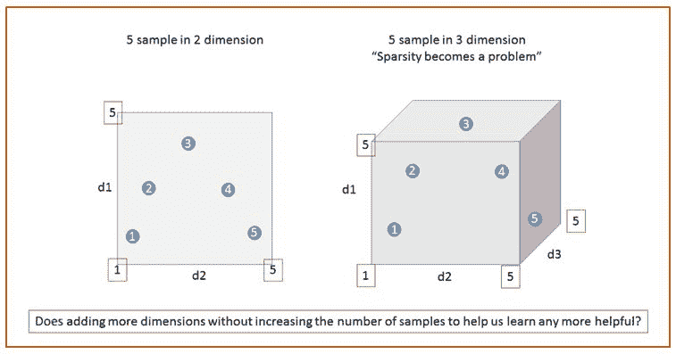

我们的目标应该是努力朝着一个接近最佳特征或维度的数量，而不是不断添加更多特征（最大特征或维度）。毕竟，如果我们只是不断添加更多特征或维度，难道我们不应该有更好的分类错误吗？起初这似乎是个好主意，但在大多数情况下答案是“不”，除非你能指数级增加样本，而这在几乎所有情况下都是不切实际的也几乎不可能的。

让我们看一下下图，它描述了学习错误与特征总数的关系：

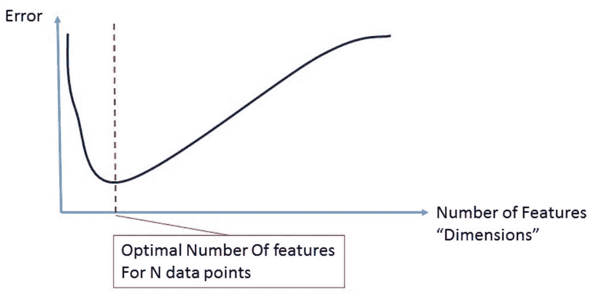

在前一节中，我们研究了维度诅咒背后的核心概念，但我们还没有讨论它的其他副作用或如何处理诅咒本身。正如我们之前所看到的，与普遍观念相反，问题不在于维度本身，而在于样本与搜索空间的比率的减少，随之而来的是更不准确的预测。

想象一个简单的 ML 系统，如下图所示。这里显示的 ML 系统使用 MNIST（[`yann.lecun.com/exdb/mnist/`](http://yann.lecun.com/exdb/mnist/)）类型的手写数据集，并希望对自己进行训练，以便能够预测包裹上使用的六位邮政编码是什么：

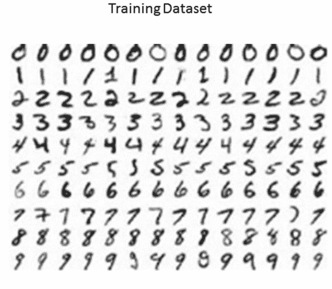

来源：MNIST

即使 MNIST 数据是 20 x 20，为了使问题更加明显，让我们假设每个数字有一个 40 x 40 像素的补丁需要存储、分析，然后用于未来的预测。如果我们假设是黑/白，那么“表观”维度是两个（40 x 40）或 21,600，这是很大的。接下来应该问的问题是：给定数据的 21,600 个表观维度，我们需要多少实际维度来完成我们的工作？如果我们看一下从 40 x 40 补丁中抽取的所有可能样本，有多少实际上是在寻找数字？一旦我们仔细看一下这个问题，我们会发现“实际”维度（即限制在一个较小的流形子空间中，这是笔画用来制作数字的空间。实际上，实际子空间要小得多，而且不是随机分布在 40 x 40 的补丁上）实际上要小得多！这里发生的情况是，实际数据（人类绘制的数字）存在于更小的维度中，很可能局限于子空间中的一小组流形（即，数据存在于某个子空间周围）。为了更好地理解这一点，从 40 x 40 的补丁中随机抽取 1,000 个样本，并直观地检查这些样本。有多少样本实际上看起来像 3、6 或 5？

当我们增加维度时，我们可能会无意中增加错误率，因为由于没有足够的样本来准确预测，或者由于测量本身引入了噪声，系统可能会引入噪声。增加更多维度的常见问题如下：

+   更长的计算时间

+   增加噪声

+   需要更多样本以保持相同的学习/预测速率

+   由于稀疏空间中缺乏可操作样本而导致数据过拟合

图片展示可以帮助我们理解“表观维度”与“实际维度”的差异，以及在这种情况下“少即是多”的原因：

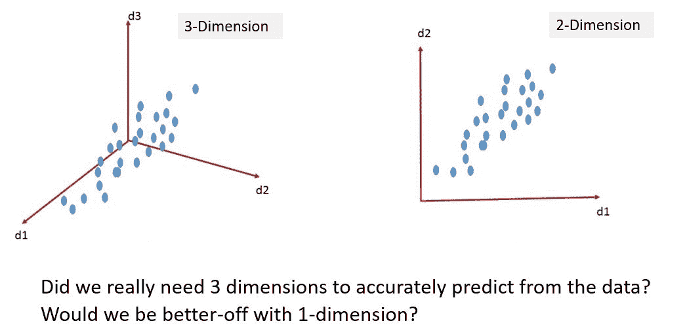

我们希望减少维度的原因可以表达为：

+   更好地可视化数据

+   压缩数据并减少存储需求

+   增加信噪比

+   实现更快的运行时间

# 特征选择与特征提取

我们有两个选择，特征选择和特征提取，可以用来将维度减少到一个更易管理的空间。这些技术各自是一个独立的学科，有自己的方法和复杂性。尽管它们听起来相同，但它们是非常不同的，需要单独处理。

下图提供了一个思维导图，比较了特征选择和特征提取。虽然特征选择，也称为特征工程，超出了本书的范围，但我们通过详细的配方介绍了两种最常见的特征提取技术（PCA 和 SVD）：

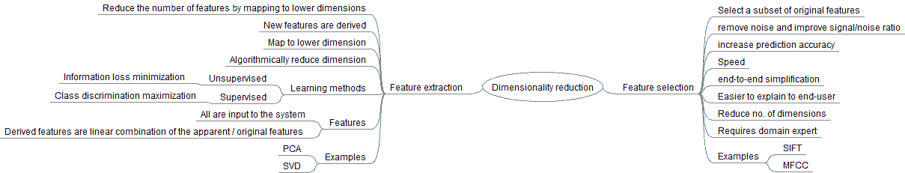

用于选择 ML 算法的一组特征或输入的两种可用技术是：

+   **特征选择**：在这种技术中，我们利用我们的领域知识选择最能描述数据方差的特征子集。我们试图做的是选择最能帮助我们预测结果的最佳因变量（特征）。这种方法通常被称为“特征工程”，需要数据工程师或领域专业知识才能有效。

例如，我们可能会查看为物流分类器提出的 200 个独立变量（维度、特征），以预测芝加哥市的房屋是否会出售。在与在芝加哥市购买/销售房屋有 20 多年经验的房地产专家交谈后，我们发现最初提出的 200 个维度中只有 4 个是足够的，例如卧室数量、价格、总平方英尺面积和学校质量。虽然这很好，但通常非常昂贵、耗时，并且需要领域专家来分析和提供指导。

+   **特征提取**：这是指一种更算法化的方法，使用映射函数将高维数据映射到低维空间。例如，将三维空间（例如，身高、体重、眼睛颜色）映射到一维空间（例如，潜在因素），可以捕捉数据集中几乎所有的变化。

我们在这里尝试的是提出一组潜在因素，这些因素是原始因素的组合（通常是线性的），可以以准确的方式捕捉和解释数据。例如，我们使用单词来描述文档，通常以 10⁶到 10⁹的空间结束，但是用主题（例如，浪漫、战争、和平、科学、艺术等）来描述文档会更抽象和高层次，这不是很好吗？我们真的需要查看或包含每个单词来更好地进行文本分析吗？以什么代价？

特征提取是一种从“表观维度”到“实际维度”映射的降维算法方法。

# 两种在 Spark 中摄取和准备 CSV 文件进行处理的方法

在这个示例中，我们探讨了读取、解析和准备 CSV 文件用于典型的 ML 程序。**逗号分隔值**（**CSV**）文件通常将表格数据（数字和文本）存储在纯文本文件中。在典型的 CSV 文件中，每一行都是一个数据记录，大多数情况下，第一行也被称为标题行，其中存储了字段的标识符（更常见的是字段的列名）。每个记录由一个或多个字段组成，字段之间用逗号分隔。

# 如何做...

1.  示例 CSV 数据文件来自电影评分。该文件可在[`files.grouplens.org/datasets/movielens/ml-latest-small.zip`](http://files.grouplens.org/datasets/movielens/ml-latest-small.zip)中获取。

1.  文件提取后，我们将使用`ratings.csv`文件来加载数据到 Spark 中。CSV 文件将如下所示：

| **userId** | **movieId** | **rating** | **timestamp** |
| --- | --- | --- | --- |
| 1 | 16 | 4 | 1217897793 |
| 1 | 24 | 1.5 | 1217895807 |
| 1 | 32 | 4 | 1217896246 |
| 1 | 47 | 4 | 1217896556 |
| 1 | 50 | 4 | 1217896523 |
| 1 | 110 | 4 | 1217896150 |
| 1 | 150 | 3 | 1217895940 |
| 1 | 161 | 4 | 1217897864 |
| 1 | 165 | 3 | 1217897135 |
| 1 | 204 | 0.5 | 1217895786 |
| ... | ... | ... | ... |

1.  在 IntelliJ 或您选择的 IDE 中启动一个新项目。确保包含必要的 JAR 文件。

1.  设置程序所在的包位置：

`package spark.ml.cookbook.chapter11`。

1.  导入 Spark 所需的包，以便访问集群和`Log4j.Logger`以减少 Spark 产生的输出量：

```scala
import org.apache.log4j.{Level, Logger}
import org.apache.spark.sql.SparkSession
```

1.  创建 Spark 的配置和 Spark 会话，以便我们可以访问集群：

```scala
Logger.getLogger("org").setLevel(Level.ERROR)

 val spark = SparkSession
 .builder
.master("local[*]")
 .appName("MyCSV")
 .config("spark.sql.warehouse.dir", ".")
 .getOrCreate()
```

1.  我们将 CSV 文件读入为文本文件：

```scala
// 1\. load the csv file as text file
val dataFile = "../data/sparkml2/chapter11/ratings.csv"
val file = spark.sparkContext.textFile(dataFile)
```

1.  我们处理数据集：

```scala
val headerAndData = file.map(line => line.split(",").map(_.trim))
 val header = headerAndData.first
 val data = headerAndData.filter(_(0) != header(0))
 val maps = data.map(splits => header.zip(splits).toMap)
 val result = maps.take(10)
 result.foreach(println)
```

这里应该提到，`split`函数仅用于演示目的，生产中应该使用更健壮的标记技术。

1.  首先，我们修剪行，删除任何空格，并将 CSV 文件加载到`headerAndData` RDD 中，因为`ratings.csv`确实有标题行。

1.  然后我们将第一行读取为标题，将其余数据读入数据 RDD 中。任何进一步的计算都可以使用数据 RDD 来执行机器学习算法。为了演示目的，我们将标题行映射到数据 RDD 并打印出前 10 行。

在应用程序控制台中，您将看到以下内容：

```scala
Map(userId -> 1, movieId -> 16, rating -> 4.0, timestamp -> 1217897793)
Map(userId -> 1, movieId -> 24, rating -> 1.5, timestamp -> 1217895807)
Map(userId -> 1, movieId -> 32, rating -> 4.0, timestamp -> 1217896246)
Map(userId -> 1, movieId -> 47, rating -> 4.0, timestamp -> 1217896556)
Map(userId -> 1, movieId -> 50, rating -> 4.0, timestamp -> 1217896523)
Map(userId -> 1, movieId -> 110, rating -> 4.0, timestamp -> 1217896150)
Map(userId -> 1, movieId -> 150, rating -> 3.0, timestamp -> 1217895940)
Map(userId -> 1, movieId -> 161, rating -> 4.0, timestamp -> 1217897864)
Map(userId -> 1, movieId -> 165, rating -> 3.0, timestamp -> 1217897135)
Map(userId -> 1, movieId -> 204, rating -> 0.5, timestamp -> 1217895786)
```

1.  还有另一种选项可以使用 Spark-CSV 包将 CSV 文件加载到 Spark 中。

要使用此功能，您需要下载以下 JAR 文件并将它们放在类路径上：[`repo1.maven.org/maven2/com/databricks/spark-csv_2.10/1.4.0/spark-csv_2.10-1.4.0.jar`](http://repo1.maven.org/maven2/com/databricks/spark-csv_2.10/1.4.0/spark-csv_2.10-1.4.0.jar)

由于 Spark-CSV 包也依赖于`common-csv`，您需要从以下位置获取`common-csv` JAR 文件：[`commons.apache.org/proper/commons-csv/download_csv.cgi`](https://commons.apache.org/proper/commons-csv/download_csv.cgi)

我们获取`common-csv-1.4-bin.zip`并提取`commons-csv-1.4.jar`，然后将前两个 jar 放在类路径上。

1.  我们使用 Databricks 的`spark-csv`包加载 CSV 文件，使用以下代码。成功加载 CSV 文件后，它将创建一个 DataFrame 对象：

```scala
// 2\. load the csv file using databricks package
val df = spark.read.format("com.databricks.spark.csv").option("header", "true").load(dataFile)
```

1.  我们从 DataFrame 中注册一个名为`ratings`的临时内存视图：

```scala
df.createOrReplaceTempView("ratings")
 val resDF = spark.sql("select * from ratings")
 resDF.show(10, false)
```

然后我们对表使用 SQL 查询并显示 10 行。在控制台上，您将看到以下内容：

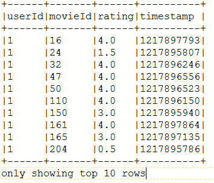

1.  进一步的机器学习算法可以在之前创建的 DataFrame 上执行。

1.  然后我们通过停止 Spark 会话来关闭程序：

```scala
spark.stop()
```

# 工作原理...

在旧版本的 Spark 中，我们需要使用特殊包来读取 CSV，但现在我们可以利用`spark.sparkContext.textFile(dataFile)`来摄取文件。开始该语句的`Spark`是 Spark 会话（集群句柄），可以在创建阶段通过任何您喜欢的名称来命名，如下所示：

```scala
val spark = SparkSession
 .builder
.master("local[*]")
 .appName("MyCSV")
 .config("spark.sql.warehouse.dir", ".")
 .getOrCreate()
spark.sparkContext.textFile(dataFile)
spark.sparkContext.textFile(dataFile)
```

Spark 2.0+使用`spark.sql.warehouse.dir`来设置存储表的仓库位置，而不是`hive.metastore.warehouse.dir`。`spark.sql.warehouse.dir`的默认值是`System.getProperty("user.dir")`。

另请参阅`spark-defaults.conf`以获取更多详细信息。

在以后的工作中，我们更喜欢这种方法，而不是按照本示例的第 9 步和第 10 步所解释的获取特殊包和依赖 JAR 的方法：

```scala
spark.read.format("com.databricks.spark.csv").option("header", "true").load(dataFile)
```

这演示了如何使用文件。

# 还有更多...

CSV 文件格式有很多变化。用逗号分隔字段的基本思想是清晰的，但它也可以是制表符或其他特殊字符。有时甚至标题行是可选的。

由于其可移植性和简单性，CSV 文件广泛用于存储原始数据。它可以在不同的应用程序之间进行移植。我们将介绍两种简单而典型的方法来将样本 CSV 文件加载到 Spark 中，并且可以很容易地修改以适应您的用例。

# 另请参阅

+   有关 Spark-CSV 包的更多信息，请访问[`github.com/databricks/spark-csv`](https://github.com/databricks/spark-csv)

# 使用 Singular Value Decomposition（SVD）在 Spark 中降低高维度

在这个示例中，我们将探讨一种直接来自线性代数的降维方法，称为**SVD**（**奇异值分解**）。这里的重点是提出一组低秩矩阵（通常是三个），它们可以近似原始矩阵，但数据量要少得多，而不是选择使用大型*M*乘以*N*矩阵。

SVD 是一种简单的线性代数技术，它将原始数据转换为特征向量/特征值低秩矩阵，可以捕捉大部分属性（原始维度）在一个更有效的低秩矩阵系统中。

以下图示了 SVD 如何用于降低维度，然后使用 S 矩阵来保留或消除从原始数据派生的更高级概念（即，具有比原始数据更少列/特征的低秩矩阵）：

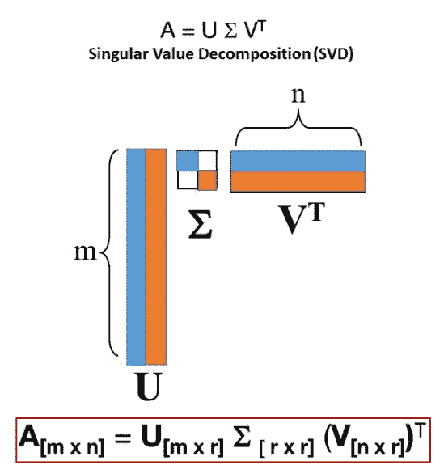

# 如何做...

1.  我们将使用电影评分数据进行 SVD 分析。MovieLens 1M 数据集包含大约 100 万条记录，由 6000 个 MovieLens 用户对约 3900 部电影的匿名评分组成。

数据集可以在以下位置检索：[`files.grouplens.org/datasets/movielens/ml-1m.zip`](http://files.grouplens.org/datasets/movielens/ml-1m.zip)

数据集包含以下文件：

+   `ratings.dat`：包含用户 ID、电影 ID、评分和时间戳

+   `movies.dat`：包含电影 ID、标题和类型

+   `users.dat`：包含用户 ID、性别、年龄、职业和邮政编码

1.  我们将使用`ratings.dat`进行 SVD 分析。`ratings.dat`的样本数据如下：

```scala
1::1193::5::978300760
1::661::3::978302109
1::914::3::978301968
1::3408::4::978300275
1::2355::5::978824291
1::1197::3::978302268
1::1287::5::978302039
1::2804::5::978300719
1::594::4::978302268
1::919::4::978301368
1::595::5::978824268
1::938::4::978301752
```

我们将使用以下程序将数据转换为评分矩阵，并将其适应 SVD 算法模型（在本例中，总共有 3953 列）：

|  | **电影 1** | **电影 2** | **电影...** | **电影 3953** |
| --- | --- | --- | --- | --- |
| 用户 1 | 1 | 4 | - | 3 |
| 用户 2 | 5 | - | 2 | 1 |
| 用户... | - | 3 | - | 2 |
| 用户 N | 2 | 4 | - | 5 |

1.  在 IntelliJ 或您选择的 IDE 中启动一个新项目。确保包含必要的 JAR 文件。

1.  设置程序所在的包位置：

`package spark.ml.cookbook.chapter11`。

1.  导入 Spark 会话所需的包：

```scala
import org.apache.log4j.{Level, Logger}
import org.apache.spark.mllib.linalg.distributed.RowMatrix
import org.apache.spark.mllib.linalg.Vectors
import org.apache.spark.sql.SparkSession
```

1.  创建 Spark 的配置和 Spark 会话，以便我们可以访问集群：

```scala
Logger.getLogger("org").setLevel(Level.ERROR)

val spark = SparkSession
.builder
.master("local[*]")
.appName("MySVD")
.config("spark.sql.warehouse.dir", ".")
.getOrCreate()    

```

1.  我们读取原始的原始数据文件： 

```scala
val dataFile = "../data/sparkml2/chapter11/ratings.dat" //read data file in as a RDD, partition RDD across <partitions> cores
val data = spark.sparkContext.textFile(dataFile)
```

1.  我们预处理数据集：

```scala
//parse data and create (user, item, rating) tuplesval ratingsRDD = data
   .map(line => line.split("::"))
   .map(fields => (fields(0).toInt, fields(1).toInt, fields(2).toDouble))
```

由于我们对评分更感兴趣，我们从数据文件中提取`userId`，`movieId`和评分值，即`fields(0)`，`fields(1)`和`fields(2)`，并基于记录创建一个评分 RDD。

1.  然后我们找出评分数据中有多少部电影，并计算最大电影索引：

```scala
val items = ratingsRDD.map(x => x._2).distinct()
val maxIndex = items.max + 1
```

总共，我们根据数据集得到 3953 部电影。

1.  我们将所有用户的电影项目评分放在一起，使用 RDD 的`groupByKey`函数，所以单个用户的电影评分被分组在一起：

```scala
val userItemRatings = ratingsRDD.map(x => (x._1, ( x._2, x._3))).groupByKey().cache()
 userItemRatings.take(2).foreach(println)
```

然后我们打印出前两条记录以查看集合。由于我们可能有一个大型数据集，我们缓存 RDD 以提高性能。

在控制台中，您将看到以下内容：

```scala
(4904,CompactBuffer((2054,4.0), (588,4.0), (589,5.0), (3000,5.0), (1,5.0), ..., (3788,5.0)))
(1084,CompactBuffer((2058,3.0), (1258,4.0), (588,2.0), (589,4.0), (1,3.0), ..., (1242,4.0)))
```

在上述记录中，用户 ID 为`4904`。对于电影 ID`2054`，评分为`4.0`，电影 ID 为`588`，评分为`4`，依此类推。

1.  然后我们创建一个稀疏向量来存储数据：

```scala
val sparseVectorData = userItemRatings
 .map(a=>(a._1.toLong, Vectors.sparse(maxIndex,a._2.toSeq))).sortByKey()

 sparseVectorData.take(2).foreach(println)
```

然后我们将数据转换为更有用的格式。我们使用`userID`作为键（排序），并创建一个稀疏向量来存储电影评分数据。

在控制台中，您将看到以下内容：

```scala
(1,(3953,[1,48,150,260,527,531,588,...], [5.0,5.0,5.0,4.0,5.0,4.0,4.0...]))
(2,(3953,[21,95,110,163,165,235,265,...],[1.0,2.0,5.0,4.0,3.0,3.0,4.0,...]))
```

在上述打印输出中，对于用户`1`，总共有`3,953`部电影。对于电影 ID`1`，评分为`5.0`。稀疏向量包含一个`movieID`数组和一个评分值数组。

1.  我们只需要评分矩阵进行 SVD 分析：

```scala
val rows = sparseVectorData.map{
 a=> a._2
 }
```

上述代码将提取稀疏向量部分并创建一个行 RDD。

1.  然后我们基于 RDD 创建一个 RowMatrix。一旦创建了 RowMatrix 对象，我们就可以调用 Spark 的`computeSVD`函数来计算矩阵的 SVD：

```scala
val mat = new RowMatrix(rows)
val col = 10 //number of leading singular values
val computeU = true
val svd = mat.computeSVD(col, computeU)
```

1.  上述参数也可以调整以适应我们的需求。一旦我们计算出 SVD，就可以获取模型数据。

1.  我们打印出奇异值：

```scala
println("Singular values are " + svd.s)
println("V:" + svd.V)
```

您将在控制台上看到以下输出：

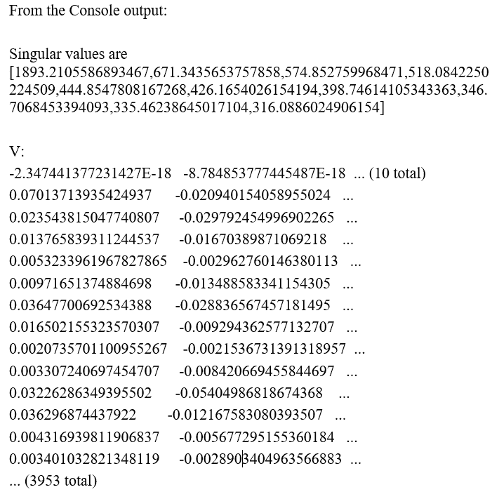

1.  从 Spark Master（`http://localhost:4040/jobs/`）中，您应该看到如下截图所示的跟踪：

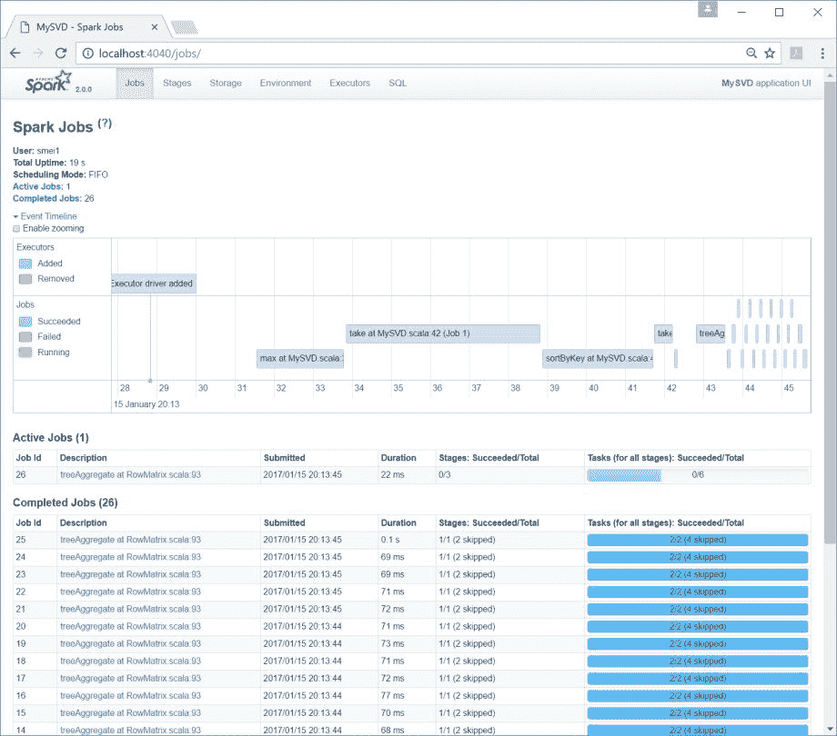

1.  然后我们通过停止 Spark 会话来关闭程序：

```scala
spark.stop()
```

# 它是如何工作的...

工作的核心是声明一个`RowMatrix()`，然后调用`computeSVD()`方法将矩阵分解为更小的子组件，但以惊人的准确度近似原始矩阵：

```scala
valmat = new RowMatrix(rows)
val col = 10 //number of leading singular values
val computeU = true
val svd = mat.computeSVD(col, computeU)
```

SVD 是一个用于实数或复数矩阵的因式分解技术。在其核心，它是一种直接的线性代数，实际上是从 PCA 中导出的。这个概念在推荐系统（ALS，SVD），主题建模（LDA）和文本分析中被广泛使用，以从原始的高维矩阵中推导出概念。让我们尝试概述这个降维的方案及其数据集（`MovieLens`）与 SVD 分解的关系，而不深入讨论 SVD 分解中的数学细节。以下图表描述了这个降维方案及其数据集（`MovieLens`）与 SVD 分解的关系：

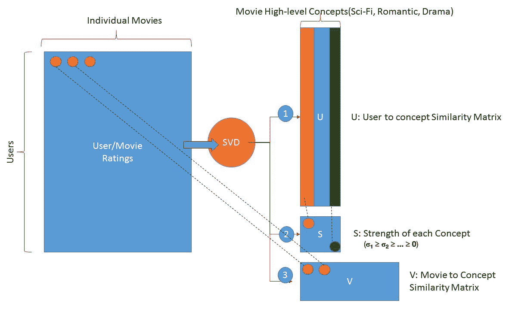

# 还有更多...

我们将得到基于原始数据集的更高效（低秩）的矩阵。

以下方程描述了一个*m x n*数组的分解，这个数组很大，很难处理。方程的右边帮助解决了分解问题，这是 SVD 技术的基础。

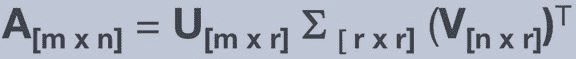

以下步骤逐步提供了 SVD 分解的具体示例：

+   考虑一个 1,000 x 1,000 的矩阵，提供 1,000,000 个数据点（M=用户，N=电影）。

+   假设有 1,000 行（观测数量）和 1,000 列（电影数量）。

+   假设我们使用 Spark 的 SVD 方法将 A 分解为三个新矩阵。

+   矩阵`U [m x r]`有 1,000 行，但现在只有 5 列（`r=5`；`r`可以被看作是概念）

+   矩阵`S [r x r]`保存了奇异值，它们是每个概念的强度（只对对角线感兴趣）

+   矩阵`V [n x r]`具有右奇异值向量（`n=电影`，`r=概念`，如浪漫，科幻等）

+   假设在分解后，我们得到了五个概念（浪漫，科幻剧，外国，纪录片和冒险）

+   低秩如何帮助？

+   最初我们有 1,000,000 个兴趣点

+   在 SVD 之后，甚至在我们开始使用奇异值（矩阵 S 的对角线）选择我们想要保留的内容之前，我们得到了总的兴趣点数= U（1,000 x 5）+ S（5 x 5）+ V（1,000 x 5）

+   现在我们不再使用 1 百万个数据点（矩阵 A，即 1,000 x 1,000），而是有了 5,000+25+5,000，大约有 10,000 个数据点，这要少得多

+   选择奇异值的行为允许我们决定我们想要保留多少，以及我们想要丢弃多少（你真的想向用户展示最低的 900 部电影推荐吗？这有价值吗？）

# 另见

+   RowMatrix 的文档可以在[`spark.apache.org/docs/latest/api/scala/index.html#org.apache.spark.mllib.linalg.distributed.RowMatrix`](http://spark.apache.org/docs/latest/api/scala/index.html#org.apache.spark.mllib.linalg.distributed.RowMatrix)和[`spark.apache.org/docs/latest/api/scala/index.html#org.apache.spark.mllib.linalg.SingularValueDecomposition`](http://spark.apache.org/docs/latest/api/scala/index.html#org.apache.spark.mllib.linalg.SingularValueDecomposition)找到

# 主成分分析（PCA）用于在 Spark 中为机器学习选择最有效的潜在因子

在这个方案中，我们使用**PCA**（主成分分析）将高维数据（表面维度）映射到低维空间（实际维度）。难以置信，但 PCA 的根源早在 1901 年（参见 K. Pearson 的著作）和 1930 年代由 H. Hotelling 独立提出。

PCA 试图以最大化垂直轴上的方差的方式选择新的组件，并有效地将高维原始特征转换为一个具有派生组件的低维空间，这些组件可以以更简洁的形式解释变化（区分类别）。

PCA 背后的直觉如下图所示。现在假设我们的数据有两个维度（x，y），我们要问的问题是，大部分变化（和区分）是否可以用一个维度或更准确地说是原始特征的线性组合来解释：

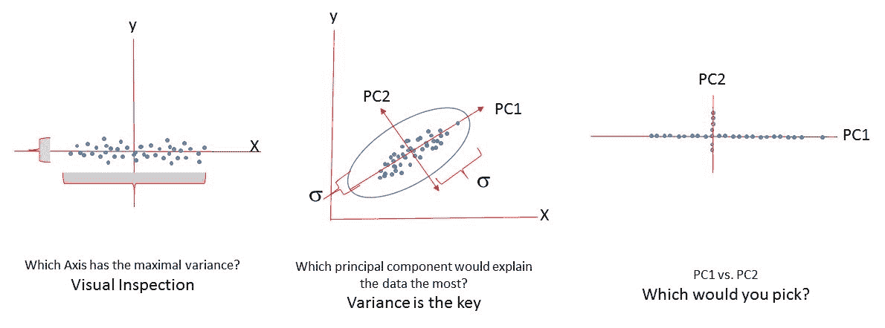

# 如何做...

1.  克利夫兰心脏病数据库是机器学习研究人员使用的一个已发布的数据集。该数据集包含十几个字段，对克利夫兰数据库的实验主要集中在试图简单地区分疾病的存在（值 1,2,3）和不存在（值 0）（在目标列，第 14 列）。

1.  克利夫兰心脏病数据集可在[`archive.ics.uci.edu/ml/machine-learning-databases/heart-disease/processed.cleveland.data`](http://archive.ics.uci.edu/ml/machine-learning-databases/heart-disease/processed.cleveland.data)找到。

1.  数据集包含以下属性（年龄，性别，cp，trestbps，chol，fbs，restecg，thalach，exang，oldpeak，slope，ca，thal，num），如下表的标题所示：

有关各个属性的详细解释，请参阅：[`archive.ics.uci.edu/ml/datasets/Heart+Disease`](http://archive.ics.uci.edu/ml/datasets/Heart+Disease)

1.  数据集将如下所示：

| **age** | **sex** | **cp** | **trestbps** | **chol** | **fbs** | **restecg** | **thalach** | **exang** | **oldpeak** | **slope** | **ca** | **thal** | **num** |
| --- | --- | --- | --- | --- | --- | --- | --- | --- | --- | --- | --- | --- | --- |
| 63 | 1 | 1 | 145 | 233 | 1 | 2 | 150 | 0 | 2.3 | 3 | 0 | 6 | 0 |
| 67 | 1 | 4 | 160 | 286 | 0 | 2 | 108 | 1 | 1.5 | 2 | 3 | 3 | 2 |
| 67 | 1 | 4 | 120 | 229 | 0 | 2 | 129 | 1 | 2.6 | 2 | 2 | 7 | 1 |
| 37 | 1 | 3 | 130 | 250 | 0 | 0 | 187 | 0 | 3.5 | 3 | 0 | 3 | 0 |
| 41 | 0 | 2 | 130 | 204 | 0 | 2 | 172 | 0 | 1.4 | 1 | 0 | 3 | 0 |
| 56 | 1 | 2 | 120 | 236 | 0 | 0 | 178 | 0 | 0.8 | 1 | 0 | 3 | 0 |
| 62 | 0 | 4 | 140 | 268 | 0 | 2 | 160 | 0 | 3.6 | 3 | 2 | 3 | 3 |
| 57 | 0 | 4 | 120 | 354 | 0 | 0 | 163 | 1 | 0.6 | 1 | 0 | 3 | 0 |
| 63 | 1 | 4 | 130 | 254 | 0 | 2 | 147 | 0 | 1.4 | 2 | 1 | 7 | 2 |
| 53 | 1 | 4 | 140 | 203 | 1 | 2 | 155 | 1 | 3.1 | 3 | 0 | 7 | 1 |
| 57 | 1 | 4 | 140 | 192 | 0 | 0 | 148 | 0 | 0.4 | 2 | 0 | 6 | 0 |
| 56 | 0 | 2 | 140 | 294 | 0 | 2 | 153 | 0 | 1.3 | 2 | 0 | 3 | 0 |
| 56 | 1 | 3 | 130 | 256 | 1 | 2 | 142 | 1 | 0.6 | 2 | 1 | 6 | 2 |
| 44 | 1 | 2 | 120 | 263 | 0 | 0 | 173 | 0 | 0 | 1 | 0 | 7 | 0 |
| 52 | 1 | 3 | 172 | 199 | 1 | 0 | 162 | 0 | 0.5 | 1 | 0 | 7 | 0 |
| 57 | 1 | 3 | 150 | 168 | 0 | 0 | 174 | 0 | 1.6 | 1 | 0 | 3 | 0 |
| ... | ... | ... | ... | ... | ... | ... | ... | ... | ... | ... | ... | ... | ... |

1.  在 IntelliJ 或您选择的 IDE 中启动一个新项目。确保包含必要的 JAR 文件。

1.  设置程序所在的包位置：

`package spark.ml.cookbook.chapter11`.

1.  导入 Spark 会话所需的包：

```scala
import org.apache.log4j.{Level, Logger}
import org.apache.spark.ml.feature.PCA
import org.apache.spark.ml.linalg.Vectors
import org.apache.spark.sql.SparkSession
```

1.  创建 Spark 的配置和 Spark 会话，以便我们可以访问集群：

```scala
Logger.getLogger("org").setLevel(Level.ERROR)
val spark = SparkSession
.builder
.master("local[*]")
.appName("MyPCA")
.config("spark.sql.warehouse.dir", ".")
.getOrCreate()
```

1.  我们读取原始数据文件并计算原始数据：

```scala
val dataFile = "../data/sparkml2/chapter11/processed.cleveland.data"
val rawdata = spark.sparkContext.textFile(dataFile).map(_.trim)
println(rawdata.count())
```

在控制台中，我们得到以下内容：

```scala
303
```

1.  我们对数据集进行预处理（详细信息请参见前面的代码）：

```scala
val data = rawdata.filter(text => !(text.isEmpty || text.indexOf("?") > -1))
 .map { line =>
 val values = line.split(',').map(_.toDouble)

 Vectors.dense(values)
 }

 println(data.count())

data.take(2).foreach(println)
```

在前面的代码中，我们过滤了缺失的数据记录，并使用 Spark DenseVector 来托管数据。在过滤缺失数据后，我们在控制台中得到以下数据计数：

```scala
297
```

记录打印，`2`，将如下所示：

```scala
[63.0,1.0,1.0,145.0,233.0,1.0,2.0,150.0,0.0,2.3,3.0,0.0,6.0,0.0]
[67.0,1.0,4.0,160.0,286.0,0.0,2.0,108.0,1.0,1.5,2.0,3.0,3.0,2.0]
```

1.  我们从数据 RDD 创建一个 DataFrame，并创建一个用于计算的 PCA 对象：

```scala
val df = sqlContext.createDataFrame(data.map(Tuple1.apply)).toDF("features")
val pca = new PCA()
.setInputCol("features")
.setOutputCol("pcaFeatures")
.setK(4)
.fit(df)
```

1.  PCA 模型的参数如前面的代码所示。我们将`K`值设置为`4`。`K`代表在完成降维算法后我们感兴趣的前 K 个主成分的数量。

1.  另一种选择也可以通过矩阵 API 实现：`mat.computePrincipalComponents(4)`。在这种情况下，`4`代表了在完成降维后的前 K 个主成分。

1.  我们使用 transform 函数进行计算，并在控制台中显示结果：

```scala
val pcaDF = pca.transform(df)
val result = pcaDF.select("pcaFeatures")
result.show(false)
```

以下内容将显示在控制台上。

您所看到的是四个新的 PCA 组件（PC1、PC2、PC3 和 PC4），可以替代原始的 14 个特征。我们已经成功地将高维空间（14 个维度）映射到了一个低维空间（四个维度）：

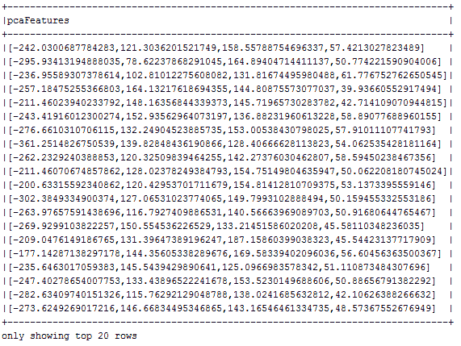

1.  从 Spark Master（`http://localhost:4040/jobs`）中，您还可以跟踪作业，如下图所示：

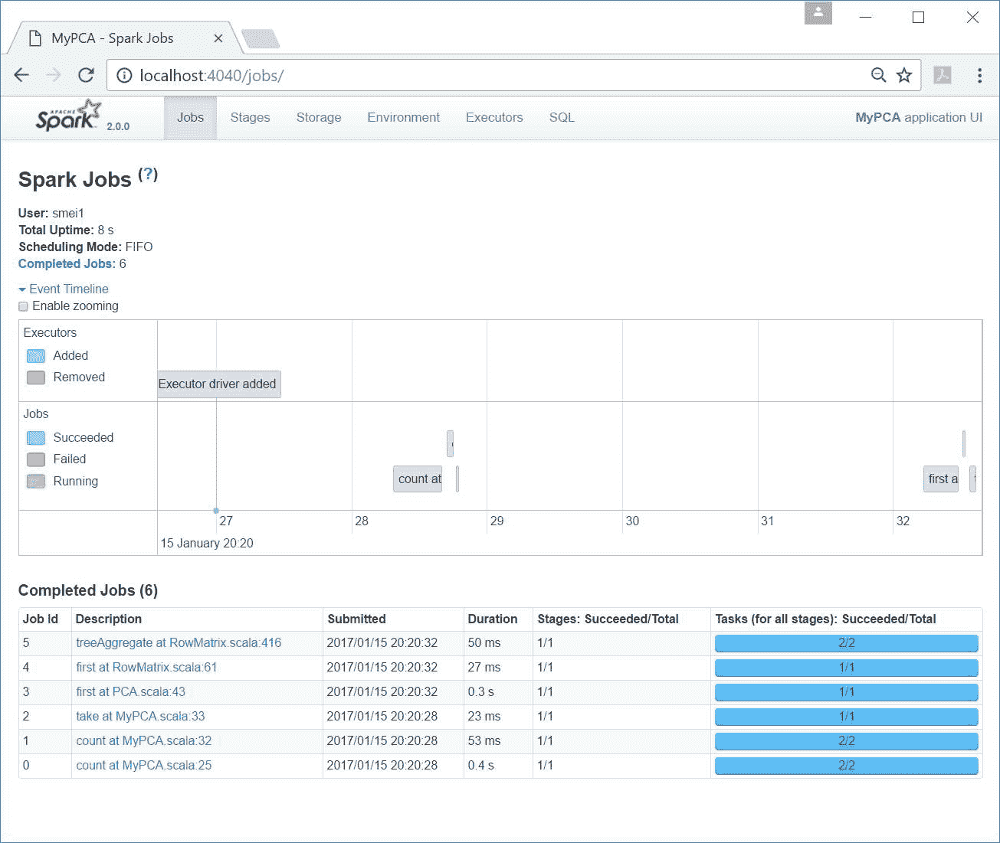

1.  然后通过停止 Spark 会话来关闭程序：

```scala
spark.stop()
```

# 工作原理...

在加载和处理数据之后，通过以下代码完成了 PCA 的核心工作：

```scala
val pca = new PCA()
 .setInputCol("features")
 .setOutputCol("pcaFeatures")
 .setK(4)
 .fit(df)
```

`PCA()`调用允许我们选择需要多少个组件（`setK(4)`）。在这个配方的情况下，我们选择了前四个组件。

目标是从原始的高维数据中找到一个较低维度的空间（降低的 PCA 空间），同时保留结构属性（沿主成分轴的数据方差），以便最大限度地区分带标签的数据，而无需原始的高维空间要求。

下图显示了一个样本 PCA 图表。在降维后，它将看起来像下面这样--在这种情况下，我们可以很容易地看到大部分方差由前四个主成分解释。如果您快速检查图表（红线），您会看到第四个组件后方差如何迅速消失。这种膝盖图（方差与组件数量的关系）帮助我们快速选择所需的组件数量（在这种情况下，四个组件）来解释大部分方差。总之，几乎所有的方差（绿线）可以累积地归因于前四个组件，因为它几乎达到了 1.0，同时可以通过红线追踪每个单独组件的贡献量：

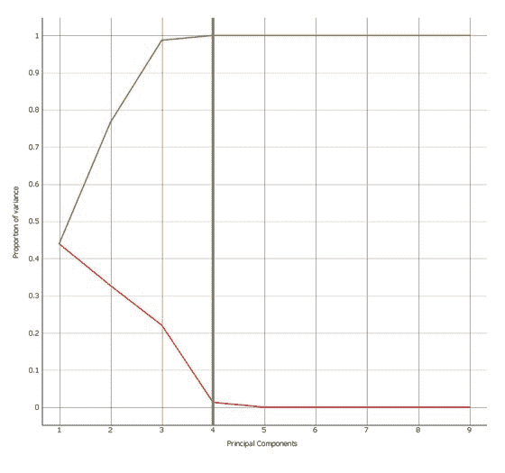

上面的图表是“凯撒法则”的描述，这是选择组件数量最常用的方法。要生成图表，可以使用 R 来绘制特征值与主成分的关系，或者使用 Python 编写自己的代码。

请参见密苏里大学的以下链接以在 R 中绘制图表：

[`web.missouri.edu/~huangf/data/mvnotes/Documents/pca_in_r_2.html`](http://web.missouri.edu/~huangf/data/mvnotes/Documents/pca_in_r_2.html)。

如前所述，图表与凯撒法则有关，凯撒法则指出在特定主成分中加载的更多相关变量，该因子在总结数据方面就越重要。在这种情况下，特征值可以被认为是一种衡量组件在总结数据方面的好坏的指标（在最大方差方向上）。

使用 PCA 类似于其他方法，我们试图学习数据的分布。我们仍然需要每个属性的平均值和 K（要保留的组件数量），这只是一个估计的协方差。简而言之，降维发生是因为我们忽略了具有最小方差的方向（PCA 组件）。请记住，PCA 可能很困难，但您可以控制发生的事情以及保留多少（使用膝盖图表来选择 K 或要保留的组件数量）。

有两种计算 PCA 的方法：

+   协方差方法

+   **奇异值分解**（**SVD**）

我们将在这里概述协方差矩阵方法（直接特征向量和特征值加上居中），但是请随时参考 SVD 配方（*Singular Value Decomposition（SVD）在 Spark 中减少高维度*）以了解 SVD 与 PCA 的内部工作原理。

用协方差矩阵方法进行 PCA 算法，简而言之，涉及以下内容：

1.  给定一个 N 乘以 M 的矩阵：

1.  N = 训练数据的总数

1.  M 是特定的维度（或特征）

1.  M x N 的交集是一个带有样本值的调用

1.  计算平均值：

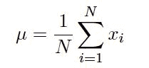

1.  通过从每个观察中减去平均值来对数据进行中心化（标准化）：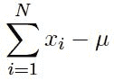

1.  构建协方差矩阵：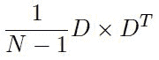

1.  计算协方差矩阵的特征向量和特征值（这很简单，但要记住并非所有矩阵都可以分解）。

1.  选择具有最大特征值的特征向量。

1.  特征值越大，对组件的方差贡献越大。

# 还有更多...

使用 PCA 在这个案例中的净结果是，原始的 14 维搜索空间（也就是说 14 个特征）被减少到解释原始数据集中几乎所有变化的 4 个维度。

PCA 并不纯粹是一个机器学习概念，在机器学习运动之前，它在金融领域已经使用了很多年。在本质上，PCA 使用正交变换（每个组件都与其他组件垂直）将原始特征（明显的维度）映射到一组新推导的维度，以便删除大部分冗余和共线性属性。推导的（实际的潜在维度）组件是原始属性的线性组合。

虽然使用 RDD 从头开始编程 PCA 很容易，但学习它的最佳方法是尝试使用神经网络实现 PCA，并查看中间结果。您可以在 Café（在 Spark 上）中进行此操作，或者只是 Torch，以查看它是一个直线转换，尽管围绕它存在一些神秘。在本质上，无论您使用协方差矩阵还是 SVD 进行分解，PCA 都是线性代数的基本练习。

Spark 在 GitHub 上提供了 PCA 的源代码示例，分别在降维和特征提取部分。

# 另请参阅

+   PCA 的文档可以在[`spark.apache.org/docs/latest/api/scala/index.html#org.apache.spark.ml.feature.PCA`](http://spark.apache.org/docs/latest/api/scala/index.html#org.apache.spark.ml.feature.PCA)和[`spark.apache.org/docs/latest/api/scala/index.html#org.apache.spark.ml.feature.PCAModel`](http://spark.apache.org/docs/latest/api/scala/index.html#org.apache.spark.ml.feature.PCAModel)找到。

关于 PCA 的使用和缺点的一些建议：

+   有些数据集是相互排斥的，因此特征值不会下降（矩阵中每个值都是必需的）。例如，以下向量(.5,0,0), (0,.5,0,0), (0,0,.5,0), and (0,0,0,.5)......不会允许任何特征值下降。

+   PCA 是线性的，试图通过使用均值和协方差矩阵来学习高斯分布。

+   有时，两个彼此平行的高斯分布不会允许 PCA 找到正确的方向。在这种情况下，PCA 最终会终止并找到一些方向并输出它们，但它们是否是最好的呢？
