# 第十二章：使用 Spark 2.0 ML 库实现文本分析

在本章中，我们将涵盖以下示例：

+   使用 Spark 进行词频统计-所有都计算

+   使用 Word2Vec 在 Spark 中显示相似的单词

+   下载维基百科的完整转储，用于实际的 Spark ML 项目

+   使用潜在语义分析进行文本分析，使用 Spark 2.0

+   在 Spark 2.0 中使用潜在狄利克雷分配进行主题建模

# 介绍

文本分析处于机器学习、数学、语言学和自然语言处理的交叉点。文本分析，在旧文献中称为文本挖掘，试图从非结构化和半结构化数据中提取信息并推断出更高级别的概念、情感和语义细节。重要的是要注意，传统的关键字搜索无法处理嘈杂、模糊和无关的标记和概念，需要根据实际上下文进行过滤。

最终，我们试图做的是针对一组给定的文档（文本、推文、网络和社交媒体），确定沟通的要点以及它试图传达的概念（主题和概念）。如今，将文档分解为其部分和分类是太原始了，无法被视为文本分析。我们可以做得更好。

Spark 提供了一套工具和设施，使文本分析变得更容易，但用户需要结合技术来构建一个可行的系统（例如 KKN 聚类和主题建模）。

值得一提的是，许多商业系统使用多种技术的组合来得出最终答案。虽然 Spark 拥有足够数量的技术，在规模上运行得非常好，但可以想象，任何文本分析系统都可以从图形模型（即 GraphFrame、GraphX）中受益。下图总结了 Spark 提供的文本分析工具和设施：

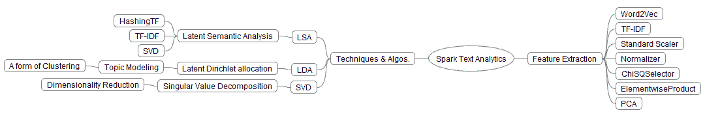

文本分析是一个新兴且重要的领域，因为它适用于许多领域，如安全、客户参与、情感分析、社交媒体和在线学习。使用文本分析技术，可以将传统数据存储（即结构化数据和数据库表）与非结构化数据（即客户评论、情感和社交媒体互动）结合起来，以确定更高级的理解和更全面的业务单位视图，这在以前是不可能的。在处理选择社交媒体和非结构化文本作为其主要沟通方式的千禧一代时，这尤为重要。

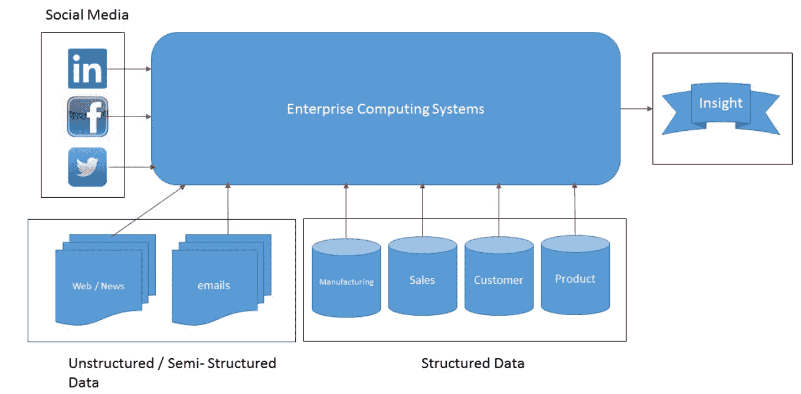

非结构化文本的主要挑战在于无法使用传统的数据平台工具，如 ETL 来提取并对数据进行排序。我们需要结合 NLP 技术的新数据整理、ML 和统计方法，可以提取信息和洞察力。社交媒体和客户互动，比如呼叫中心的通话记录，包含了有价值的信息，如果不加以重视就会失去竞争优势。

我们不仅需要文本分析来处理静态的大数据，还必须考虑到动态的大数据，比如推文和数据流，才能有效。

处理非结构化数据有几种方法。下图展示了当今工具包中的技术。虽然基于规则的系统可能适用于有限的文本和领域，但由于其特定的决策边界设计为在特定领域中有效，因此无法推广。新系统使用统计和 NLP 技术以实现更高的准确性和规模。

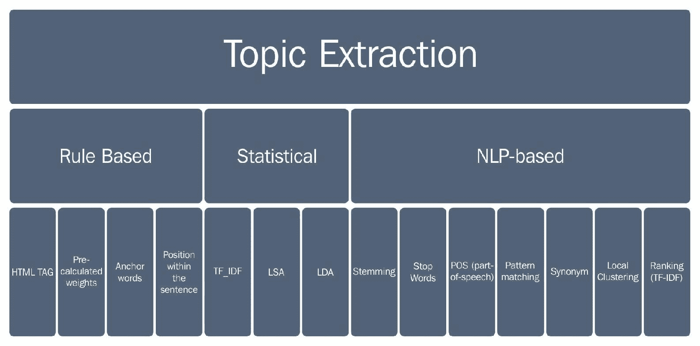

在本章中，我们涵盖了四个示例和两个实际数据集，以演示 Spark 在规模上处理非结构化文本分析的能力。

首先，我们从一个简单的配方开始，不仅模仿早期的网络搜索（关键词频率），而且还以原始代码格式提供了 TF-IDF 的见解。这个配方试图找出一个单词或短语在文档中出现的频率。尽管听起来难以置信，但实际上美国曾对这种技术发出了专利！

其次，我们使用一个众所周知的算法 Word2Vec，它试图回答这样一个问题，即*如果我给你一个单词，你能告诉我周围的单词，或者它的邻居是什么吗？*这是使用统计技术在文档中寻找同义词的好方法。

第三，我们实现了**潜在语义分析**（**LSA**），这是一种主题提取方法。这种方法是在科罗拉多大学博尔德分校发明的，并且一直是社会科学的主要工具。

第四，我们实现了**潜在狄利克雷分配**（**LDA**）来演示主题建模，其中抽象概念以可扩展和有意义的方式（例如，家庭，幸福，爱情，母亲，家庭宠物，孩子，购物和聚会）提取并与短语或单词相关联。

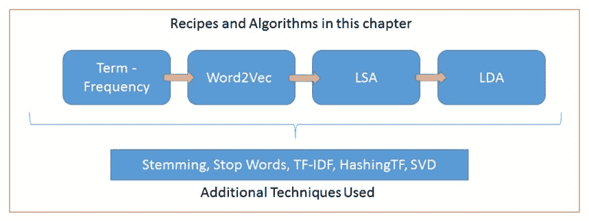

# 使用 Spark 进行词频统计 - 一切都计算在内

对于这个配方，我们将从 Project Gutenberg 下载一本文本格式的书籍，网址为[`www.gutenberg.org/cache/epub/62/pg62.txt`](http://www.gutenberg.org/cache/epub/62/pg62.txt)。

Project Gutenberg 提供了超过 5 万本各种格式的免费电子书供人类使用。请阅读他们的使用条款；让我们不要使用命令行工具下载任何书籍。

当您查看文件的内容时，您会注意到书的标题和作者是《火星公主》的作者是埃德加·赖斯·伯勒斯。

这本电子书可以供任何人在任何地方免费使用，几乎没有任何限制。您可以复制它，赠送它，或者根据本电子书在线附带的 Project Gutenberg 许可证条款进行重复使用，网址为[`www.gutenberg.org/`](http://www.gutenberg.org/)。

然后我们使用下载的书籍来演示 Scala 和 Spark 的经典单词计数程序。这个例子一开始可能看起来有些简单，但我们正在开始进行文本处理的特征提取过程。此外，对于理解 TF-IDF 的概念，对文档中单词出现次数的一般理解将有所帮助。

# 如何做...

1.  在 IntelliJ 或您选择的 IDE 中开始一个新项目。确保包含必要的 JAR 文件。

1.  该配方的`package`语句如下：

```scala
package spark.ml.cookbook.chapter12
```

1.  导入 Scala、Spark 和 JFreeChart 所需的包：

```scala
import org.apache.log4j.{Level, Logger}
import org.apache.spark.sql.SQLContext
import org.apache.spark.{SparkConf, SparkContext}
import org.jfree.chart.axis.{CategoryAxis, CategoryLabelPositions}
import org.jfree.chart.{ChartFactory, ChartFrame, JFreeChart}
import org.jfree.chart.plot.{CategoryPlot, PlotOrientation}
import org.jfree.data.category.DefaultCategoryDataset
```

1.  我们将定义一个函数来在窗口中显示我们的 JFreeChart：

```scala
def show(chart: JFreeChart) {
val frame = new ChartFrame("", chart)
   frame.pack()
   frame.setVisible(true)
 }
```

1.  让我们定义我们书籍文件的位置：

```scala
val input = "../data/sparkml2/chapter12/pg62.txt"
```

1.  使用工厂构建器模式创建一个带有配置的 Spark 会话：

```scala
val spark = SparkSession
 .builder .master("local[*]")
 .appName("ProcessWordCount")
 .config("spark.sql.warehouse.dir", ".")
 .getOrCreate()
import spark.implicits._
```

1.  我们应该将日志级别设置为警告，否则输出将难以跟踪：

```scala
Logger.getRootLogger.setLevel(Level.*WARN*)
```

1.  我们读取停用词文件，稍后将用作过滤器：

```scala
val stopwords = scala.io.Source.fromFile("../data/sparkml2/chapter12/stopwords.txt").getLines().toSet
```

1.  停用词文件包含常用词，这些词在匹配或比较文档时没有相关价值，因此它们将被排除在术语池之外。

1.  我们现在加载书籍进行标记化、分析、应用停用词、过滤、计数和排序：

```scala
val lineOfBook = spark.sparkContext.textFile(input)
 .flatMap(line => line.split("\\W+"))
 .map(_.toLowerCase)
 .filter( s => !stopwords.contains(s))
 .filter( s => s.length >= 2)
 .map(word => (word, 1))
 .reduceByKey(_ + _)
 .sortBy(_._2, false)
```

1.  我们取出出现频率最高的 25 个单词：

```scala
val top25 = lineOfBook.take(25)
```

1.  我们循环遍历结果 RDD 中的每个元素，生成一个类别数据集模型来构建我们的单词出现图表：

```scala
val dataset = new DefaultCategoryDataset()
top25.foreach( {case (term: String, count: Int) => dataset.setValue(count, "Count", term) })
```

显示单词计数的条形图：

```scala
val chart = ChartFactory.createBarChart("Term frequency",
 "Words", "Count", dataset, PlotOrientation.VERTICAL,
 false, true, false)

 val plot = chart.getCategoryPlot()
 val domainAxis = plot.getDomainAxis();
 domainAxis.setCategoryLabelPositions(CategoryLabelPositions.DOWN_45);
show(chart)
```

以下图表显示了单词计数：

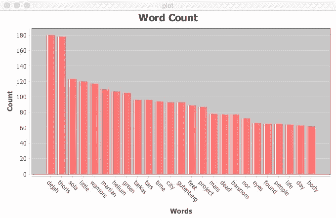

1.  我们通过停止 SparkContext 来关闭程序：

```scala
spark.stop()
```

# 它是如何工作的...

我们首先通过正则表达式加载下载的书籍并对其进行标记化。下一步是将所有标记转换为小写，并从我们的标记列表中排除停用词，然后过滤掉任何少于两个字符长的单词。

去除停用词和特定长度的单词会减少我们需要处理的特征数量。这可能并不明显，但根据各种处理标准去除特定单词会减少我们的机器学习算法后续处理的维度数量。

最后，我们按降序对结果进行了排序，取前 25 个，并为其显示了条形图。

# 还有更多...

在本食谱中，我们有了关键词搜索的基础。重要的是要理解主题建模和关键词搜索之间的区别。在关键词搜索中，我们试图根据出现的次数将短语与给定文档关联起来。在这种情况下，我们将指导用户查看出现次数最多的一组文档。

# 另请参阅

这个算法的演进的下一步，开发者可以尝试作为扩展的一部分，是添加权重并得出加权平均值，但是 Spark 提供了一个我们将在即将到来的食谱中探讨的设施。

# 使用 Word2Vec 在 Spark 中显示相似的单词

在本食谱中，我们将探讨 Word2Vec，这是 Spark 用于评估单词相似性的工具。Word2Vec 算法受到了一般语言学中的*分布假设*的启发。在本质上，它试图表达的是在相同上下文中出现的标记（即，与目标的距离）倾向于支持相同的原始概念/含义。

Word2Vec 算法是由 Google 的一个研究团队发明的。请参考本食谱中*还有更多...*部分提到的一篇白皮书，其中更详细地描述了 Word2Vec。

# 如何做...

1.  在 IntelliJ 或您选择的 IDE 中启动一个新项目。确保包含必要的 JAR 文件。

1.  本食谱的`package`语句如下：

```scala
package spark.ml.cookbook.chapter12
```

1.  导入 Scala 和 Spark 所需的包：

```scala
import org.apache.log4j.{Level, Logger}
import org.apache.spark.ml.feature.{RegexTokenizer, StopWordsRemover, Word2Vec}
import org.apache.spark.sql.{SQLContext, SparkSession}
import org.apache.spark.{SparkConf, SparkContext}
```

1.  让我们定义我们的书籍文件的位置：

```scala
val input = "../data/sparkml2/chapter12/pg62.txt"
```

1.  使用工厂构建器模式创建具有配置的 Spark 会话：

```scala
val spark = SparkSession
         .builder
.master("local[*]")
         .appName("Word2Vec App")
         .config("spark.sql.warehouse.dir", ".")
         .getOrCreate()
import spark.implicits._
```

1.  我们应该将日志级别设置为警告，否则输出将难以跟踪：

```scala
Logger.getRootLogger.setLevel(Level.WARN)
```

1.  我们加载书籍并将其转换为 DataFrame：

```scala
val df = spark.read.text(input).toDF("text")
```

1.  现在，我们将每一行转换为一个词袋，利用 Spark 的正则表达式标记器，将每个术语转换为小写，并过滤掉任何字符长度少于四个的术语：

```scala
val tokenizer = new RegexTokenizer()
 .setPattern("\\W+")
 .setToLowercase(true)
 .setMinTokenLength(4)
 .setInputCol("text")
 .setOutputCol("raw")
 val rawWords = tokenizer.transform(df)
```

1.  我们使用 Spark 的`StopWordRemover`类来去除停用词：

```scala
val stopWords = new StopWordsRemover()
 .setInputCol("raw")
 .setOutputCol("terms")
 .setCaseSensitive(false)
 val wordTerms = stopWords.transform(rawWords)
```

1.  我们应用 Word2Vec 机器学习算法来提取特征：

```scala
val word2Vec = new Word2Vec()
 .setInputCol("terms")
 .setOutputCol("result")
 .setVectorSize(3)
 .setMinCount(0)
val model = word2Vec.fit(wordTerms)
```

1.  我们从书中找到*火星*的十个同义词：

```scala
val synonyms = model.findSynonyms("martian", 10)
```

1.  显示模型找到的十个同义词的结果：

```scala
synonyms.show(false)
```

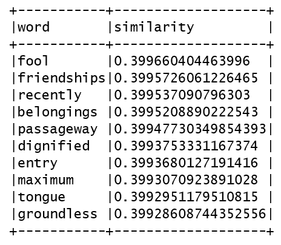

1.  我们通过停止 SparkContext 来关闭程序：

```scala
spark.stop()
```

# 它是如何工作的...

Spark 中的 Word2Vec 使用 skip-gram 而不是**连续词袋**（**CBOW**），后者更适合**神经网络**（**NN**）。在本质上，我们试图计算单词的表示。强烈建议用户了解局部表示与分布式表示之间的区别，这与单词本身的表面含义非常不同。

如果我们使用分布式向量表示单词，那么相似的单词自然会在向量空间中靠在一起，这是一种理想的模式抽象和操作的泛化技术（即，我们将问题简化为向量运算）。

对于一组经过清理并准备好进行处理的单词*{Word[1,] Word[2, .... ,]Word[n]}*，我们要做的是定义一个最大似然函数（例如，对数似然），然后继续最大化似然（即，典型的 ML）。对于熟悉 NN 的人来说，这是一个简单的多类 softmax 模型。

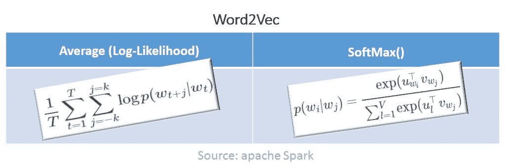

我们首先将免费书籍加载到内存中，并将其标记为术语。然后将术语转换为小写，并过滤掉任何少于四个字的单词。最后应用停用词，然后进行 Word2Vec 计算。

# 还有更多...

无论如何，你如何找到相似的单词？有多少算法可以解决这个问题，它们又有什么不同？Word2Vec 算法已经存在一段时间了，还有一个叫做 CBOW 的对应算法。请记住，Spark 提供了 skip-gram 方法作为实现技术。

Word2Vec 算法的变体如下：

+   **Continuous Bag of Words (CBOW)**：给定一个中心词，周围的词是什么？

+   **Skip-gram**：如果我们知道周围的单词，我们能猜出缺失的单词吗？

有一种称为**skip-gram 模型与负采样**（**SGNS**）的算法变体，似乎优于其他变体。

共现是 CBOW 和 skip-gram 的基本概念。尽管 skip-gram 没有直接使用共现矩阵，但它间接使用了它。

在这个食谱中，我们使用了 NLP 中的*停用词*技术，在运行算法之前对我们的语料库进行了清理。停用词是英语单词，比如“*the*”，需要被移除，因为它们对结果没有任何改进。

另一个重要的概念是*词干提取*，这里没有涉及，但将在以后的食谱中演示。词干提取去除额外的语言构件，并将单词减少到其根（例如，“工程”、“工程师”和“工程师”变成“Engin”，这是根）。

在以下 URL 找到的白皮书应该对 Word2Vec 提供更深入的解释：

[`arxiv.org/pdf/1301.3781.pdf`](http://arxiv.org/pdf/1301.3781.pdf)

# 另请参阅

Word2Vec 食谱的文档：

+   `Word2Vec()`: [`spark.apache.org/docs/latest/api/scala/index.html#org.apache.spark.ml.feature.Word2Vec`](http://spark.apache.org/docs/latest/api/scala/index.html#org.apache.spark.ml.feature.Word2Vec)

+   `Word2VecModel()`: [`spark.apache.org/docs/latest/api/scala/index.html#org.apache.spark.ml.feature.Word2VecModel`](http://spark.apache.org/docs/latest/api/scala/index.html#org.apache.spark.ml.feature.Word2VecModel)

+   `StopWordsRemover()`: [`spark.apache.org/docs/latest/api/scala/index.html#org.apache.spark.ml.feature.StopWordsRemover`](http://spark.apache.org/docs/latest/api/scala/index.html#org.apache.spark.ml.feature.StopWordsRemover)

# 下载维基百科的完整转储以进行真实的 Spark ML 项目

在这个食谱中，我们将下载并探索维基百科的转储，以便我们可以有一个现实生活的例子。在这个食谱中，我们将下载的数据集是维基百科文章的转储。您将需要命令行工具**curl**或浏览器来检索一个压缩文件，目前大约为 13.6 GB。由于文件大小，我们建议使用 curl 命令行工具。

# 如何做...

1.  您可以使用以下命令开始下载数据集：

```scala
curl -L -O http://dumps.wikimedia.org/enwiki/latest/enwiki-latest-pages-articles-multistream.xml.bz2
```

1.  现在你想要解压 ZIP 文件：

```scala
bunzip2 enwiki-latest-pages-articles-multistream.xml.bz2
```

这将创建一个名为`enwiki-latest-pages-articles-multistream.xml`的未压缩文件，大约为 56 GB。

1.  让我们来看看维基百科的 XML 文件：

```scala
head -n50 enwiki-latest-pages-articles-multistream.xml
<mediawiki xmlns=http://www.mediawiki.org/xml/export-0.10/  xsi:schemaLocation="http://www.mediawiki.org/xml/export-0.10/ http://www.mediawiki.org/xml/export-0.10.xsd" version="0.10" xml:lang="en"> 

  <siteinfo> 
    <sitename>Wikipedia</sitename> 
    <dbname>enwiki</dbname> 
    <base>https://en.wikipedia.org/wiki/Main_Page</base> 
    <generator>MediaWiki 1.27.0-wmf.22</generator> 
    <case>first-letter</case> 
    <namespaces> 
      <namespace key="-2" case="first-letter">Media</namespace> 
      <namespace key="-1" case="first-letter">Special</namespace> 
      <namespace key="0" case="first-letter" /> 
      <namespace key="1" case="first-letter">Talk</namespace> 
      <namespace key="2" case="first-letter">User</namespace> 
      <namespace key="3" case="first-letter">User talk</namespace> 
      <namespace key="4" case="first-letter">Wikipedia</namespace> 
      <namespace key="5" case="first-letter">Wikipedia talk</namespace> 
      <namespace key="6" case="first-letter">File</namespace> 
      <namespace key="7" case="first-letter">File talk</namespace> 
      <namespace key="8" case="first-letter">MediaWiki</namespace> 
      <namespace key="9" case="first-letter">MediaWiki talk</namespace> 
      <namespace key="10" case="first-letter">Template</namespace> 
      <namespace key="11" case="first-letter">Template talk</namespace> 
      <namespace key="12" case="first-letter">Help</namespace> 
      <namespace key="13" case="first-letter">Help talk</namespace> 
      <namespace key="14" case="first-letter">Category</namespace> 
      <namespace key="15" case="first-letter">Category talk</namespace> 
      <namespace key="100" case="first-letter">Portal</namespace> 
      <namespace key="101" case="first-letter">Portal talk</namespace> 
      <namespace key="108" case="first-letter">Book</namespace> 
      <namespace key="109" case="first-letter">Book talk</namespace> 
      <namespace key="118" case="first-letter">Draft</namespace> 
      <namespace key="119" case="first-letter">Draft talk</namespace> 
      <namespace key="446" case="first-letter">Education Program</namespace> 
      <namespace key="447" case="first-letter">Education Program talk</namespace> 
      <namespace key="710" case="first-letter">TimedText</namespace> 
      <namespace key="711" case="first-letter">TimedText talk</namespace> 
      <namespace key="828" case="first-letter">Module</namespace> 
      <namespace key="829" case="first-letter">Module talk</namespace> 
      <namespace key="2300" case="first-letter">Gadget</namespace> 
      <namespace key="2301" case="first-letter">Gadget talk</namespace> 
      <namespace key="2302" case="case-sensitive">Gadget definition</namespace> 
      <namespace key="2303" case="case-sensitive">Gadget definition talk</namespace> 
      <namespace key="2600" case="first-letter">Topic</namespace> 
    </namespaces> 
  </siteinfo> 
  <page> 
    <title>AccessibleComputing</title> 
    <ns>0</ns> 
    <id>10</id> 
    <redirect title="Computer accessibility" />
```

# 还有更多...

我们建议使用 XML 文件的分块，并对实验使用抽样，直到准备好进行最终的作业提交。这将节省大量的时间和精力。

# 另请参阅

维基下载的文档可在[`en.wikipedia.org/wiki/Wikipedia:Database_download`](https://en.wikipedia.org/wiki/Wikipedia:Database_download)找到。

# 使用 Spark 2.0 进行文本分析的潜在语义分析

在这个食谱中，我们将利用维基百科文章的数据转储来探索 LSA。LSA 意味着分析一系列文档，以找出这些文档中的隐藏含义或概念。

在本章的第一个示例中，我们介绍了 TF（即术语频率）技术的基础知识。在这个示例中，我们使用 HashingTF 来计算 TF，并使用 IDF 将模型拟合到计算的 TF 中。在其核心，LSA 使用**奇异值分解**（**SVD**）对术语频率文档进行降维，从而提取最重要的概念。在我们开始分析之前，还有其他一些清理步骤需要做（例如，停用词和词干处理）来清理词袋。

# 如何做...

1.  在 IntelliJ 或您选择的 IDE 中启动一个新项目。确保包含必要的 JAR 文件。

1.  该示例的包语句如下：

```scala
package spark.ml.cookbook.chapter12
```

1.  导入 Scala 和 Spark 所需的包：

```scala
import edu.umd.cloud9.collection.wikipedia.WikipediaPage
 import edu.umd.cloud9.collection.wikipedia.language.EnglishWikipediaPage
 import org.apache.hadoop.fs.Path
 import org.apache.hadoop.io.Text
 import org.apache.hadoop.mapred.{FileInputFormat, JobConf}
 import org.apache.log4j.{Level, Logger}
 import org.apache.spark.mllib.feature.{HashingTF, IDF}
 import org.apache.spark.mllib.linalg.distributed.RowMatrix
 import org.apache.spark.sql.SparkSession
 import org.tartarus.snowball.ext.PorterStemmer
```

以下两个语句导入了处理维基百科 XML 转储/对象所需的`Cloud9`库工具包元素。`Cloud9`是一个库工具包，使得开发人员更容易访问、整理和处理维基百科 XML 转储。有关更详细信息，请参阅以下代码行：

```scala
import edu.umd.cloud9.collection.wikipedia.WikipediaPage
import edu.umd.cloud9.collection.wikipedia.language.EnglishWikipediaPage
```

维基百科是一个免费的知识体，可以通过以下维基百科下载链接免费下载为 XML 块/对象的转储：

[`en.wikipedia.org/wiki/Wikipedia:Database_download`](https://en.wikipedia.org/wiki/Wikipedia:Database_download)

文本的复杂性和结构可以通过`Cloud9`工具包轻松处理，该工具包可以使用之前列出的`import`语句来访问和处理文本。

以下链接提供了有关`Cloud9`库的一些信息：

+   主页位于[`lintool.github.io/Cloud9/docs/content/wikipedia.html`](https://lintool.github.io/Cloud9/docs/content/wikipedia.html)。

+   源代码可在[`grepcode.com/file/repo1.maven.org/maven2/edu.umd/cloud9/2.0.0/edu/umd/cloud9/collection/wikipedia/WikipediaPage.java`](http://grepcode.com/file/repo1.maven.org/maven2/edu.umd/cloud9/2.0.0/edu/umd/cloud9/collection/wikipedia/WikipediaPage.java)和[`grepcode.com/file/repo1.maven.org/maven2/edu.umd/cloud9/2.0.1/edu/umd/cloud9/collection/wikipedia/language/EnglishWikipediaPage.java`](http://grepcode.com/file/repo1.maven.org/maven2/edu.umd/cloud9/2.0.1/edu/umd/cloud9/collection/wikipedia/language/EnglishWikipediaPage.java)上找到。

接下来，执行以下步骤：

1.  我们定义一个函数来解析维基百科页面并返回页面的标题和内容文本：

```scala
def parseWikiPage(rawPage: String): Option[(String, String)] = {
 val wikiPage = new EnglishWikipediaPage()
 WikipediaPage.*readPage*(wikiPage, rawPage)

 if (wikiPage.isEmpty
 || wikiPage.isDisambiguation
 || wikiPage.isRedirect
 || !wikiPage.isArticle) {
 None
 } else {
 Some(wikiPage.getTitle, wikiPage.getContent)
 }
 }
```

1.  我们定义一个简短的函数来应用 Porter 词干算法到术语上：

```scala
def wordStem(stem: PorterStemmer, term: String): String = {
 stem.setCurrent(term)
 stem.stem()
 stem.getCurrent
 }
```

1.  我们定义一个函数将页面的内容文本标记为术语：

```scala
def tokenizePage(rawPageText: String, stopWords: Set[String]): Seq[String] = {
 val stem = new PorterStemmer()

 rawPageText.split("\\W+")
 .map(_.toLowerCase)
 .filterNot(s => stopWords.contains(s))
 .map(s => wordStem(stem, s))
 .filter(s => s.length > 3)
 .distinct
 .toSeq
 }
```

1.  让我们定义维基百科数据转储的位置：

```scala
val input = "../data/sparkml2/chapter12/enwiki_dump.xml"
```

1.  为 Hadoop XML 流处理创建一个作业配置：

```scala
val jobConf = new JobConf()
 jobConf.set("stream.recordreader.class", "org.apache.hadoop.streaming.StreamXmlRecordReader")
 jobConf.set("stream.recordreader.begin", "<page>")
 jobConf.set("stream.recordreader.end", "</page>")
```

1.  为 Hadoop XML 流处理设置数据路径：

```scala
FileInputFormat.addInputPath(jobConf, new Path(input))
```

1.  使用工厂构建器模式创建一个带有配置的`SparkSession`：

```scala
val spark = SparkSession
   .builder.master("local[*]")
   .appName("ProcessLSA App")
   .config("spark.serializer", "org.apache.spark.serializer.KryoSerializer")
   .config("spark.sql.warehouse.dir", ".")
   .getOrCreate()
```

1.  我们应该将日志级别设置为警告，否则输出将难以跟踪：

```scala
Logger.getRootLogger.setLevel(Level.WARN)
```

1.  我们开始处理庞大的维基百科数据转储成文章页面，取样文件：

```scala
val wikiData = spark.sparkContext.hadoopRDD(
 jobConf,
 classOf[org.apache.hadoop.streaming.StreamInputFormat],
 classOf[Text],
 classOf[Text]).sample(false, .1)
```

1.  接下来，我们将样本数据处理成包含标题和页面内容文本的 RDD：

```scala
val wikiPages = wikiData.map(_._1.toString).flatMap(*parseWikiPage*)
```

1.  我们现在输出我们将处理的维基百科文章的数量：

```scala
println("Wiki Page Count: " + wikiPages.count())
```

1.  我们将加载停用词以过滤页面内容文本：

```scala
val stopwords = scala.io.Source.fromFile("../data/sparkml2/chapter12/stopwords.txt").getLines().toSet
```

1.  我们标记化页面内容文本，将其转换为术语以进行进一步处理：

```scala
val wikiTerms = wikiPages.map{ case(title, text) => tokenizePage(text, stopwords) }
```

1.  我们使用 Spark 的`HashingTF`类来计算我们标记化的页面内容文本的术语频率：

```scala
val hashtf = new HashingTF()
 val tf = hashtf.transform(wikiTerms)
```

1.  我们获取术语频率并利用 Spark 的 IDF 类计算逆文档频率：

```scala
val idf = new IDF(minDocFreq=2)
 val idfModel = idf.fit(tf)
 val tfidf = idfModel.transform(tf)
```

1.  使用逆文档频率生成一个`RowMatrix`并计算奇异值分解：

```scala
tfidf.cache()
 val rowMatrix = new RowMatrix(tfidf)
 val svd = rowMatrix.computeSVD(k=25, computeU = true)

 println(svd)
```

**U**：行将是文档，列将是概念。

**S**：元素将是每个概念的变化量。

**V**：行将是术语，列将是概念。

1.  通过停止 SparkContext 来关闭程序：

```scala
spark.stop()
```

# 工作原理...

该示例首先通过使用 Cloud9 Hadoop XML 流处理工具加载维基百科 XML 的转储来开始。一旦我们解析出页面文本，标记化阶段调用将我们的维基百科页面文本流转换为标记。在标记化阶段，我们使用 Porter 词干提取器来帮助将单词减少到一个共同的基本形式。

有关词干处理的更多细节，请参阅[`en.wikipedia.org/wiki/Stemming`](https://en.wikipedia.org/wiki/Stemming)。

下一步是对每个页面标记使用 Spark HashingTF 计算词项频率。完成此阶段后，我们利用了 Spark 的 IDF 生成逆文档频率。

最后，我们使用 TF-IDF API 并应用奇异值分解来处理因子分解和降维。

以下屏幕截图显示了该步骤和配方的流程：

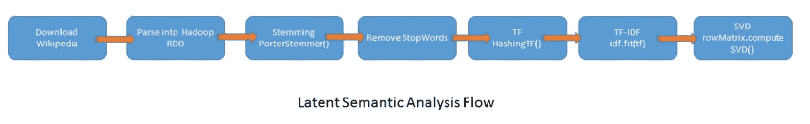

Cloud9 Hadoop XML 工具和其他一些必需的依赖项可以在以下链接找到：

+   `bliki-core-3.0.19.jar`: [`central.maven.org/maven2/info/bliki/wiki/bliki-core/3.0.19/bliki-core-3.0.19.jar`](http://central.maven.org/maven2/info/bliki/wiki/bliki-core/3.0.19/bliki-core-3.0.19.jar)

+   `cloud9-2.0.1.jar`: [`central.maven.org/maven2/edu/umd/cloud9/2.0.1/cloud9-2.0.1.jar`](http://central.maven.org/maven2/edu/umd/cloud9/2.0.1/cloud9-2.0.1.jar)

+   `hadoop-streaming-2.7.4.jar`: [`central.maven.org/maven2/org/apache/hadoop/hadoop-streaming/2.7.4/hadoop-streaming-2.7.4.jar`](http://central.maven.org/maven2/org/apache/hadoop/hadoop-streaming/2.7.4/hadoop-streaming-2.7.4.jar)

+   `lucene-snowball-3.0.3.jar`: [`central.maven.org/maven2/org/apache/lucene/lucene-snowball/3.0.3/lucene-snowball-3.0.3.jar`](http://central.maven.org/maven2/org/apache/lucene/lucene-snowball/3.0.3/lucene-snowball-3.0.3.jar)

# 还有更多...

现在显而易见，即使 Spark 没有提供直接的 LSA 实现，TF-IDF 和 SVD 的组合也能让我们构建然后分解大语料库矩阵为三个矩阵，这可以通过 SVD 的降维来帮助我们解释结果。我们可以集中精力在最有意义的聚类上（类似于推荐算法）。

SVD 将分解词项频率文档（即文档按属性）为三个不同的矩阵，这些矩阵更有效地提取出*N*个概念（在我们的例子中为*N=27*）从一个难以处理且昂贵的大矩阵中。在机器学习中，我们总是更喜欢高瘦的矩阵（在这种情况下是*U*矩阵）而不是其他变体。

以下是 SVD 的技术：

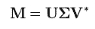

SVD 的主要目标是降维以获得所需的（即前*N*个）主题或抽象概念。我们将使用以下输入来获得以下部分中所述的输出。

作为输入，我们将采用*m x n*（*m*为文档数，*n*为术语或属性数）的大矩阵。

这是我们应该得到的输出：

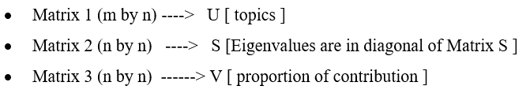

有关 SVD 的更详细示例和简短教程，请参见以下链接：

+   [`home.iitk.ac.in/~crkrish/MLT/PreRequisites/linalgWithSVD.pdf`](http://home.iitk.ac.in/~crkrish/MLT/PreRequisites/linalgWithSVD.pdf)

+   [`davetang.org/file/Singular_Value_Decomposition_Tutorial.pdf`](http://davetang.org/file/Singular_Value_Decomposition_Tutorial.pdf)

您还可以参考 RStudio 的写作，链接如下：

[`rstudio-pubs-static.s3.amazonaws.com/222293_1c40c75d7faa42869cc59df879547c2b.html`](http://rstudio-pubs-static.s3.amazonaws.com/222293_1c40c75d7faa42869cc59df879547c2b.html)

# 另请参阅

SVD 在第十一章中有详细介绍，*大数据中的高维度诅咒*。

有关 SVD 的图示表示，请参阅第十一章中的示例*使用奇异值分解（SVD）解决高维度问题*，*大数据中的高维度问题*。

有关`SingularValueDecomposition()`的更多详细信息，请参考[`spark.apache.org/docs/latest/api/scala/index.html#org.apache.spark.mllib.linalg.SingularValueDecomposition`](http://spark.apache.org/docs/latest/api/scala/index.html#org.apache.spark.mllib.linalg.SingularValueDecomposition)。

有关`RowMatrix()`的更多详细信息，请参考[`spark.apache.org/docs/latest/api/scala/index.html#org.apache.spark.mllib.linalg.distributed.RowMatrix`](http://spark.apache.org/docs/latest/api/scala/index.html#org.apache.spark.mllib.linalg.distributed.RowMatrix)。

# 在 Spark 2.0 中使用潜在狄利克雷分配进行主题建模

在这个示例中，我们将利用潜在狄利克雷分配来演示主题模型生成，以从一系列文档中推断主题。

我们在之前的章节中已经涵盖了 LDA，因为它适用于聚类和主题建模，但在本章中，我们演示了一个更详细的示例，以展示它在文本分析中对更真实和复杂的数据集的应用。

我们还应用 NLP 技术，如词干处理和停用词，以提供更真实的 LDA 问题解决方法。我们试图发现一组潜在因素（即与原始因素不同），可以以更高效的方式在减少的计算空间中解决和描述解决方案。

当使用 LDA 和主题建模时，经常出现的第一个问题是*狄利克雷是什么？* 狄利克雷只是一种分布，没有别的。请参阅明尼苏达大学的以下链接了解详情：[`www.tc.umn.edu/~horte005/docs/Dirichletdistribution.pdf`](http://www.tc.umn.edu/~horte005/docs/Dirichletdistribution.pdf)。

# 如何做...

1.  在 IntelliJ 或您选择的 IDE 中启动一个新项目。确保包含必要的 JAR 文件。

1.  该示例的`package`语句如下：

```scala
package spark.ml.cookbook.chapter12
```

1.  导入 Scala 和 Spark 所需的包：

```scala
import edu.umd.cloud9.collection.wikipedia.WikipediaPage
 import edu.umd.cloud9.collection.wikipedia.language.EnglishWikipediaPage
 import org.apache.hadoop.fs.Path
 import org.apache.hadoop.io.Text
 import org.apache.hadoop.mapred.{FileInputFormat, JobConf}
 import org.apache.log4j.{Level, Logger}
 import org.apache.spark.ml.clustering.LDA
 import org.apache.spark.ml.feature._
 import org.apache.spark.sql.SparkSession
```

1.  我们定义一个函数来解析维基百科页面，并返回页面的标题和内容文本：

```scala
def parseWikiPage(rawPage: String): Option[(String, String)] = {
 val wikiPage = new EnglishWikipediaPage()
 WikipediaPage.*readPage*(wikiPage, rawPage)

 if (wikiPage.isEmpty
 || wikiPage.isDisambiguation
 || wikiPage.isRedirect
 || !wikiPage.isArticle) {
 None
 } else {
 *Some*(wikiPage.getTitle, wikiPage.getContent)
 }
 }
```

1.  让我们定义维基百科数据转储的位置：

```scala
val input = "../data/sparkml2/chapter12/enwiki_dump.xml" 
```

1.  我们为 Hadoop XML 流创建作业配置：

```scala
val jobConf = new JobConf()
 jobConf.set("stream.recordreader.class", "org.apache.hadoop.streaming.StreamXmlRecordReader")
 jobConf.set("stream.recordreader.begin", "<page>")
 jobConf.set("stream.recordreader.end", "</page>")
```

1.  我们为 Hadoop XML 流处理设置了数据路径：

```scala
FileInputFormat.addInputPath(jobConf, new Path(input))
```

1.  使用工厂构建器模式创建带有配置的`SparkSession`：

```scala
val spark = SparkSession
    .builder
.master("local[*]")
    .appName("ProcessLDA App")
    .config("spark.serializer",   "org.apache.spark.serializer.KryoSerializer")
    .config("spark.sql.warehouse.dir", ".")
    .getOrCreate()
```

1.  我们应该将日志级别设置为警告，否则输出将难以跟踪：

```scala
Logger.getRootLogger.setLevel(Level.WARN)
```

1.  我们开始处理庞大的维基百科数据转储，将其转换为文章页面并对文件进行抽样：

```scala
val wikiData = spark.sparkContext.hadoopRDD(
 jobConf,
 classOf[org.apache.hadoop.streaming.StreamInputFormat],
 classOf[Text],
 classOf[Text]).sample(false, .1)
```

1.  接下来，我们将我们的样本数据处理成包含标题和页面上下文文本的元组的 RDD，最终生成一个 DataFrame：

```scala
val df = wiki.map(_._1.toString)
 .flatMap(parseWikiPage)
 .toDF("title", "text")
```

1.  现在，我们使用 Spark 的`RegexTokenizer`将 DataFrame 的文本列转换为原始单词，以处理每个维基百科页面：

```scala
val tokenizer = new RegexTokenizer()
 .setPattern("\\W+")
 .setToLowercase(true)
 .setMinTokenLength(4)
 .setInputCol("text")
 .setOutputCol("raw")
 val rawWords = tokenizer.transform(df)
```

1.  下一步是通过从标记中删除所有停用词来过滤原始单词：

```scala
val stopWords = new StopWordsRemover()
 .setInputCol("raw")
 .setOutputCol("words")
 .setCaseSensitive(false)

 val wordData = stopWords.transform(rawWords)
```

1.  我们通过使用 Spark 的`CountVectorizer`类为过滤后的标记生成术语计数，从而生成包含特征列的新 DataFrame：

```scala
val cvModel = new CountVectorizer()
 .setInputCol("words")
 .setOutputCol("features")
 .setMinDF(2)
 .fit(wordData)
 val cv = cvModel.transform(wordData)
 cv.cache()
```

"MinDF"指定必须出现的不同文档术语的最小数量，才能包含在词汇表中。

1.  现在，我们调用 Spark 的 LDA 类来生成主题和标记到主题的分布：

```scala
val lda = new LDA()
 .setK(5)
 .setMaxIter(10)
 .setFeaturesCol("features")
 val model = lda.fit(tf)
 val transformed = model.transform(tf)
```

"K"指的是主题数量，"MaxIter"指的是执行的最大迭代次数。

1.  最后，我们描述了生成的前五个主题并显示：

```scala
val topics = model.describeTopics(5)
 topics.show(false)
```

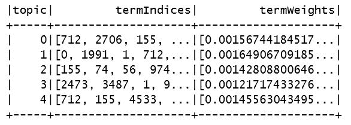

1.  现在显示，与它们相关的主题和术语：

```scala
val vocaList = cvModel.vocabulary
topics.collect().foreach { r => {
 println("\nTopic: " + r.get(r.fieldIndex("topic")))
 val y = r.getSeqInt).map(vocaList(_))
 .zip(r.getSeqDouble))
 y.foreach(println)

 }
}
```

控制台输出将如下所示：

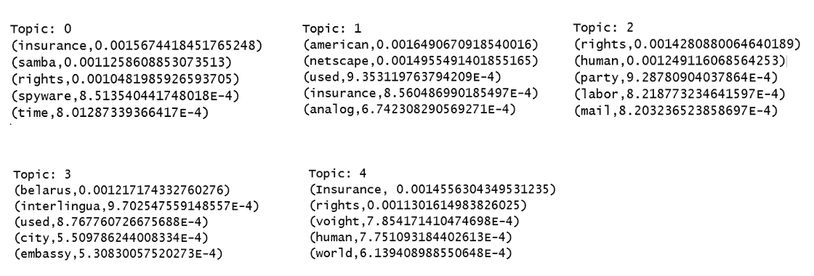

1.  通过停止 SparkContext 来关闭程序：

```scala
spark.stop()
```

# 它是如何工作的...

我们首先加载了维基百科文章的转储，并使用 Hadoop XML 利用流式处理 API 将页面文本解析为标记。特征提取过程利用了几个类来设置最终由 LDA 类进行处理，让标记从 Spark 的`RegexTokenize`，`StopwordsRemover`和`HashingTF`中流出。一旦我们有了词频，数据就被传递给 LDA 类，以便将文章在几个主题下进行聚类。

Hadoop XML 工具和其他一些必需的依赖项可以在以下位置找到：

+   `bliki-core-3.0.19.jar`: [`central.maven.org/maven2/info/bliki/wiki/bliki-core/3.0.19/bliki-core-3.0.19.jar`](http://central.maven.org/maven2/info/bliki/wiki/bliki-core/3.0.19/bliki-core-3.0.19.jar)

+   `cloud9-2.0.1.jar`: [`central.maven.org/maven2/edu/umd/cloud9/2.0.1/cloud9-2.0.1.jar`](http://central.maven.org/maven2/edu/umd/cloud9/2.0.1/cloud9-2.0.1.jar)

+   `hadoop-streaming-2.7.4.jar`: [`central.maven.org/maven2/org/apache/hadoop/hadoop-streaming/2.7.4/hadoop-streaming-2.7.4.jar`](http://central.maven.org/maven2/org/apache/hadoop/hadoop-streaming/2.7.4/hadoop-streaming-2.7.4.jar)

+   `lucene-snowball-3.0.3.jar`: [`central.maven.org/maven2/org/apache/lucene/lucene-snowball/3.0.3/lucene-snowball-3.0.3.jar`](http://central.maven.org/maven2/org/apache/lucene/lucene-snowball/3.0.3/lucene-snowball-3.0.3.jar)

# 还有更多...

请参阅第八章中的 LDA 配方，了解更多关于 LDA 算法本身的详细解释。*Apache Spark 2.0 无监督聚类*

来自*机器学习研究杂志（JMLR）*的以下白皮书为那些希望进行深入分析的人提供了全面的处理。这是一篇写得很好的论文，具有基本统计和数学背景的人应该能够毫无问题地理解。

有关 JMLR 的更多详细信息，请参阅[`www.jmlr.org/papers/volume3/blei03a/blei03a.pdf`](http://www.jmlr.org/papers/volume3/blei03a/blei03a.pdf)链接；另一个链接是[`www.cs.colorado.edu/~mozer/Teaching/syllabi/ProbabilisticModels/readings/BleiNgJordan2003.pdf`](https://www.cs.colorado.edu/~mozer/Teaching/syllabi/ProbabilisticModels/readings/BleiNgJordan2003.pdf)。

# 还可以参考

+   构造函数的文档可在[`spark.apache.org/docs/latest/api/scala/index.html#org.apache.spark.ml.clustering.LDA`](http://spark.apache.org/docs/latest/api/scala/index.html#org.apache.spark.ml.clustering.LDA)找到

+   LDAModel 的文档可在[`spark.apache.org/docs/latest/api/scala/index.html#org.apache.spark.ml.clustering.LDAModel`](http://spark.apache.org/docs/latest/api/scala/index.html#org.apache.spark.ml.clustering.LDAModel)找到

还可以参考 Spark 的 Scala API 文档：

+   DistributedLDAModel

+   EMLDAOptimizer

+   LDAOptimizer

+   LocalLDAModel

+   OnlineLDAOptimizer
