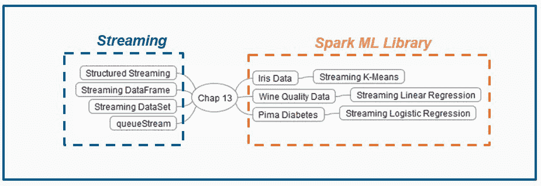
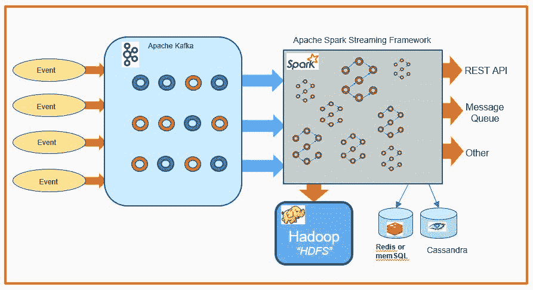
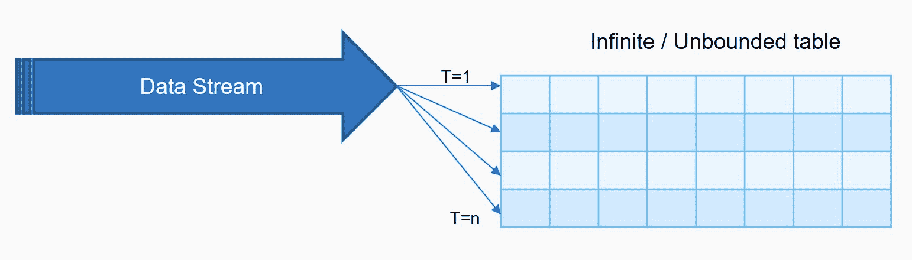
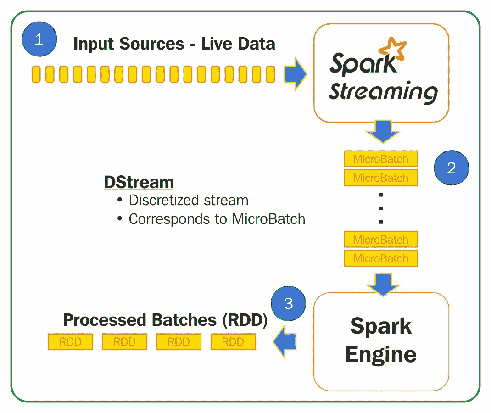
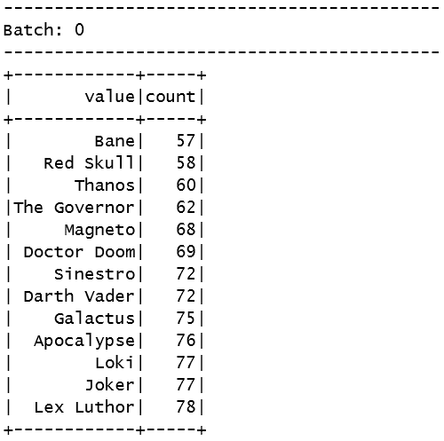
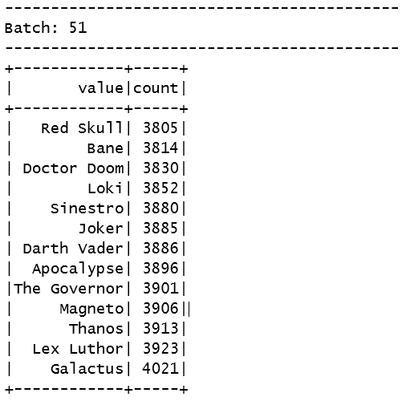
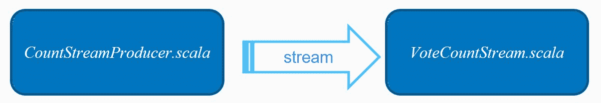
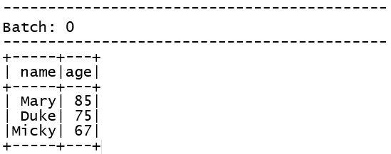
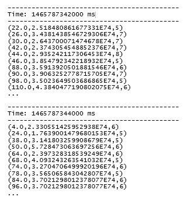

# 第十三章：Spark Streaming 和机器学习库

在本章中，我们将涵盖以下内容：

+   结构化流式处理用于近实时机器学习

+   实时机器学习的流式数据框架

+   实时机器学习的流式数据集

+   使用 queueStream 进行流式数据和调试

+   下载和理解著名的鸢尾花数据，用于无监督分类

+   流式 KMeans 用于实时在线分类器

+   下载葡萄酒质量数据进行流式回归

+   流式线性回归用于实时回归

+   下载皮马糖尿病数据进行监督分类

+   流式逻辑回归用于在线分类器

# 介绍

Spark 流式处理是朝着统一和结构化 API 的发展之路，以解决批处理与流处理的问题。自 Spark 1.3 以来，Spark 流式处理一直可用，使用离散流（DStream）。新的方向是使用无界表模型来抽象底层框架，用户可以使用 SQL 或函数式编程查询表，并以多种模式（完整、增量和追加输出）将输出写入另一个输出表。Spark SQL Catalyst 优化器和 Tungsten（堆外内存管理器）现在是 Spark 流式处理的固有部分，这导致了更高效的执行。

在本章中，我们不仅涵盖了 Spark 机器库中提供的流式设施，还提供了四个介绍性的配方，这些配方在我们对 Spark 2.0 的更好理解之旅中非常有用。

以下图表描述了本章涵盖的内容：



Spark 2.0+通过抽象掉一些框架的内部工作原理，并将其呈现给开发人员，而不必担心端到端的一次写入语义，来构建上一代的成功。这是从基于 RDD 的 DStream 到结构化流处理范式的一次旅程，在这个范式中，您的流处理世界可以被视为具有多种输出模式的无限表。

状态管理已经从`updateStateByKey`（Spark 1.3 到 Spark 1.5）发展到`mapWithState`（Spark 1.6+），再到结构化流处理（Spark 2.0+）的第三代状态管理。

现代 ML 流式系统是一个复杂的连续应用程序，不仅需要将各种 ML 步骤组合成管道，还需要与其他子系统交互，以提供实用的端到端信息系统。

在我们完成这本书时，Databricks，这家支持 Spark 社区的公司，在 Spark Summit West 2017 上宣布了关于 Spark 流处理未来方向的声明（尚未发布）：

“今天，我们很高兴提出一个新的扩展，连续处理，它还消除了执行中的微批处理。正如我们今天早上在 Spark Summit 上展示的那样，这种新的执行模式让用户在许多重要的工作负载中实现亚毫秒的端到端延迟 - 而不需要更改他们的 Spark 应用程序。”

来源：[`databricks.com/blog/2017/06/06/simple-super-fast-streaming-engine-apache-spark.html`](https://databricks.com/blog/2017/06/06/simple-super-fast-streaming-engine-apache-spark.html)

以下图表描述了大多数流式系统的最小可行流式系统（为了演示而过于简化）：



如前图所示，任何现实生活中的系统都必须与批处理（例如，模型参数的离线学习）进行交互，而更快的子系统则集中于对外部事件的实时响应（即在线学习）。

Spark 的结构化流处理与 ML 库的完全集成即将到来，但与此同时，我们可以创建和使用流式数据框架和流式数据集来进行补偿，这将在接下来的一些配方中看到。

新的结构化流式处理具有多个优势，例如：

+   批处理和流处理 API 的统一（无需翻译）

+   更简洁的表达式语言的函数式编程

+   容错状态管理（第三代）

+   大大简化的编程模型：

+   触发

+   输入

+   查询

+   结果

+   输出

+   数据流作为无界表

以下图表描述了将数据流建模为无限无界表的基本概念：



在 Spark 2.0 之前的范式中，DStream 构造推进了流作为一组离散数据结构（RDDs）的模型，当我们有延迟到达时，这是非常难处理的。固有的延迟到达问题使得难以构建具有实时回溯模型的系统（在云中非常突出），因为实际费用的不确定性。

以下图表以可视化方式描述了 DStream 模型，以便进行相应比较：



相比之下，使用新模型，开发人员需要担心的概念更少，也不需要将代码从批处理模型（通常是 ETL 类似的代码）转换为实时流模型。

目前，由于时间线和遗留问题，必须在所有 Spark 2.0 之前的代码被替换之前一段时间内了解两种模型（DStream 和结构化流）。我们发现新的结构化流模型特别简单，与 DStream 相比，并尝试在本章涵盖的四个入门配方中展示和突出显示差异。

# 结构化流用于近实时机器学习

在这个配方中，我们探索了 Spark 2.0 引入的新的结构化流范式。我们使用套接字和结构化流 API 进行实时流处理，以进行投票和统计投票。

我们还通过模拟随机生成的投票流来探索新引入的子系统，以选择最不受欢迎的漫画恶棍。

这个配方由两个不同的程序（`VoteCountStream.scala`和`CountStreamproducer.scala`）组成。

# 如何做...

1.  在 IntelliJ 或您选择的 IDE 中启动一个新项目。确保包含必要的 JAR 文件。

1.  设置程序所在的包位置：

```scala
package spark.ml.cookbook.chapter13
```

1.  导入必要的包以便 Spark 上下文可以访问集群和`log4j.Logger`以减少 Spark 产生的输出量：

```scala
import org.apache.log4j.{Level, Logger}
import org.apache.spark.sql.SparkSession
import java.io.{BufferedOutputStream, PrintWriter}
import java.net.Socket
import java.net.ServerSocket
import java.util.concurrent.TimeUnit
import scala.util.Random
import org.apache.spark.sql.streaming.ProcessingTime
```

1.  定义一个 Scala 类来生成投票数据到客户端套接字：

```scala
class CountSreamThread(socket: Socket) extends Thread
```

1.  定义一个包含人们投票的文字字符串值的数组：

```scala
val villians = Array("Bane", "Thanos", "Loki", "Apocalypse", "Red Skull", "The Governor", "Sinestro", "Galactus",
 "Doctor Doom", "Lex Luthor", "Joker", "Magneto", "Darth Vader")
```

1.  现在我们将覆盖`Threads`类的`run`方法，随机模拟对特定恶棍的投票：

```scala
override def run(): Unit = {

 println("Connection accepted")
 val out = new PrintWriter(new BufferedOutputStream(socket.getOutputStream()))

 println("Producing Data")
 while (true) {
 out.println(villians(Random.nextInt(villians.size)))
 Thread.sleep(10)
 }

 println("Done Producing")
 }
```

1.  接下来，我们定义一个 Scala 单例对象，以接受在定义的端口`9999`上的连接并生成投票数据：

```scala
object CountStreamProducer {

 def main(args: Array[String]): Unit = {

 val ss = new ServerSocket(9999)
 while (true) {
 println("Accepting Connection...")
 new CountSreamThread(ss.accept()).start()
 }
 }
 }
```

1.  不要忘记启动数据生成服务器，这样我们的流式示例就可以处理流式投票数据。

1.  将输出级别设置为`ERROR`以减少 Spark 的输出：

```scala
   Logger.getLogger("org").setLevel(Level.ERROR)
    Logger.getLogger("akka").setLevel(Level.ERROR)
```

1.  创建一个`SparkSession`，以访问 Spark 集群和底层会话对象属性，如`SparkContext`和`SparkSQLContext`：

```scala
val spark = SparkSession
.builder.master("local[*]")
.appName("votecountstream")
.config("spark.sql.warehouse.dir", ".")
.getOrCreate()
```

1.  导入 spark implicits，因此只需导入行为：

```scala
import spark.implicits._
```

1.  通过连接到本地端口`9999`创建一个流 DataFrame，该端口利用 Spark 套接字源作为流数据的来源：

```scala
val stream = spark.readStream
 .format("socket")
 .option("host", "localhost")
 .option("port", 9999)
 .load()
```

1.  在这一步中，我们通过恶棍名称和计数对流数据进行分组，以模拟用户实时投票：

```scala
val villainsVote = stream.groupBy("value").count()
```

1.  现在我们定义一个流查询，每 10 秒触发一次，将整个结果集转储到控制台，并通过调用`start()`方法来调用它：

```scala
val query = villainsVote.orderBy("count").writeStream
 .outputMode("complete")
 .format("console")
 .trigger(ProcessingTime.create(10, TimeUnit.SECONDS))
 .start()
```

第一个输出批次显示在这里作为批次`0`：



额外的批处理结果显示在这里：



1.  最后，等待流查询的终止或使用`SparkSession` API 停止进程：

```scala
query.awaitTermination()
```

# 它是如何工作的...

在这个配方中，我们创建了一个简单的数据生成服务器来模拟投票数据的流，然后计算了投票。下图提供了这个概念的高级描述：



首先，我们通过执行数据生成服务器来开始。其次，我们定义了一个套接字数据源，允许我们连接到数据生成服务器。第三，我们构建了一个简单的 Spark 表达式，按反派（即坏超级英雄）分组，并计算当前收到的所有选票。最后，我们配置了一个 10 秒的阈值触发器来执行我们的流查询，将累积的结果转储到控制台上。

这个配方涉及两个简短的程序：

+   `CountStreamproducer.scala`:

+   生产者-数据生成服务器

+   模拟为自己投票并广播

+   `VoteCountStream.scala`:

+   消费者-消费和聚合/制表数据

+   接收并计算我们的反派超级英雄的选票

# 还有更多...

如何使用 Spark 流处理和结构化流处理编程的主题超出了本书的范围，但我们认为有必要在深入研究 Spark 的 ML 流处理提供之前分享一些程序来介绍这些概念。

要了解流处理的基本知识，请参阅以下关于 Spark 的文档：

+   Spark 2.0+结构化流的信息可在[`spark.apache.org/docs/latest/structured-streaming-programming-guide.html#api-using-datasets-and-dataframes`](https://spark.apache.org/docs/latest/structured-streaming-programming-guide.html#api-using-datasets-and-dataframes)找到

+   Spark 1.6 流处理的信息可在[`spark.apache.org/docs/latest/streaming-programming-guide.html`](https://spark.apache.org/docs/latest/streaming-programming-guide.html)找到

# 另请参见

+   结构化流处理的文档可在[`spark.apache.org/docs/latest/api/scala/index.html#org.apache.spark.sql.streaming.package`](https://spark.apache.org/docs/latest/api/scala/index.html#org.apache.spark.sql.streaming.package)找到

+   DStream（Spark 2.0 之前）的文档可在[`spark.apache.org/docs/latest/api/scala/index.html#org.apache.spark.streaming.dstream.DStream`](https://spark.apache.org/docs/latest/api/scala/index.html#org.apache.spark.streaming.dstream.DStream)找到

+   `DataStreamReader`的文档可在[`spark.apache.org/docs/latest/api/scala/index.html#org.apache.spark.sql.streaming.DataStreamReader`](https://spark.apache.org/docs/latest/api/scala/index.html#org.apache.spark.sql.streaming.DataStreamReader)找到

+   `DataStreamWriter`的文档可在[`spark.apache.org/docs/latest/api/scala/index.html#org.apache.spark.sql.streaming.DataStreamWriter`](https://spark.apache.org/docs/latest/api/scala/index.html#org.apache.spark.sql.streaming.DataStreamWriter)找到

+   `StreamingQuery`的文档可在[`spark.apache.org/docs/latest/api/scala/index.html#org.apache.spark.sql.streaming.StreamingQuery`](https://spark.apache.org/docs/latest/api/scala/index.html#org.apache.spark.sql.streaming.StreamingQuery)找到

# 用于实时机器学习的流 DataFrame

在这个配方中，我们探讨了流 DataFrame 的概念。我们创建了一个由个人的姓名和年龄组成的 DataFrame，我们将通过电线进行流式传输。流 DataFrame 是与 Spark ML 一起使用的一种流行技术，因为在撰写本文时，我们尚未完全集成 Spark 结构化 ML。

我们将此配方限制为仅演示流 DataFrame 的范围，并留给读者将其适应其自定义 ML 管道。虽然在 Spark 2.1.0 中，流 DataFrame 并不是开箱即用的，但在后续版本的 Spark 中，它将是一个自然的演进。

# 如何做...

1.  在 IntelliJ 或您选择的 IDE 中启动一个新项目。确保包含必要的 JAR 文件。

1.  设置程序所在的包位置：

```scala
package spark.ml.cookbook.chapter13
```

1.  导入必要的包：

```scala
import java.util.concurrent.TimeUnit
import org.apache.log4j.{Level, Logger}
import org.apache.spark.sql.SparkSession
import org.apache.spark.sql.streaming.ProcessingTime
```

1.  创建一个`SparkSession`作为连接到 Spark 集群的入口点：

```scala
val spark = SparkSession
.builder.master("local[*]")
.appName("DataFrame Stream")
.config("spark.sql.warehouse.dir", ".")
.getOrCreate()

```

1.  日志消息的交错会导致难以阅读的输出，因此将日志级别设置为警告：

```scala
Logger.getLogger("org").setLevel(Level.ERROR)
Logger.getLogger("akka").setLevel(Level.ERROR)
```

1.  接下来，加载人员数据文件以推断数据模式，而无需手动编写结构类型：

```scala
val df = spark.read .format("json")
.option("inferSchema", "true")
.load("../data/sparkml2/chapter13/person.json")
df.printSchema()
```

从控制台，您将看到以下输出：

```scala
root
|-- age: long (nullable = true)
|-- name: string (nullable = true)
```

1.  现在配置一个用于摄取数据的流 DataFrame：

```scala
val stream = spark.readStream
.schema(df.schema)
.json("../data/sparkml2/chapter13/people/")
```

1.  让我们执行一个简单的数据转换，通过筛选年龄大于`60`：

```scala
val people = stream.select("name", "age").where("age > 60")
```

1.  现在，我们将转换后的流数据输出到控制台，每秒触发一次：

```scala
val query = people.writeStream
.outputMode("append")
.trigger(ProcessingTime(1, TimeUnit.SECONDS))
.format("console")
```

1.  我们启动我们定义的流查询，并等待数据出现在流中：

```scala
query.start().awaitTermination()
```

1.  最后，我们的流查询结果将出现在控制台中：



# 它是如何工作的...

在这个示例中，我们首先使用一个快速方法（使用 JSON 对象）发现一个人对象的基础模式，如第 6 步所述。结果 DataFrame 将知道我们随后对流输入施加的模式（通过模拟流式传输文件）并将其视为流 DataFrame，如第 7 步所示。

将流视为 DataFrame 并使用函数式或 SQL 范式对其进行操作的能力是一个强大的概念，可以在第 8 步中看到。然后，我们使用`writestream()`以`append`模式和 1 秒批处理间隔触发器输出结果。

# 还有更多...

DataFrame 和结构化编程的结合是一个强大的概念，它帮助我们将数据层与流分离，使编程变得更加容易。DStream（Spark 2.0 之前）最大的缺点之一是无法将用户与流/RDD 实现的细节隔离开来。

DataFrames 的文档：

+   `DataFrameReader`: [`spark.apache.org/docs/latest/api/scala/index.html#org.apache.spark.sql.DataFrameReader`](https://spark.apache.org/docs/latest/api/scala/index.html#org.apache.spark.sql.DataFrameReader)

+   `DataFrameWriter`: [`spark.apache.org/docs/latest/api/scala/index.html#org.apache.spark.sql.DataFrameWriter`](https://spark.apache.org/docs/latest/api/scala/index.html#org.apache.spark.sql.DataFrameWriter)

# 另请参阅

Spark 数据流读取器和写入器的文档：

+   DataStreamReader: [`spark.apache.org/docs/latest/api/scala/index.html#org.apache.spark.sql.streaming.DataStreamReader`](https://spark.apache.org/docs/latest/api/scala/index.html#org.apache.spark.sql.streaming.DataStreamReader)

+   DataStreamWriter: [`spark.apache.org/docs/latest/api/scala/index.html#org.apache.spark.sql.streaming.DataStreamWriter`](https://spark.apache.org/docs/latest/api/scala/index.html#org.apache.spark.sql.streaming.DataStreamWriter)

# 用于实时机器学习的流数据集

在这个示例中，我们创建一个流数据集来演示在 Spark 2.0 结构化编程范式中使用数据集的方法。我们从文件中流式传输股票价格，并使用数据集应用过滤器来选择当天收盘价高于 100 美元的股票。

该示例演示了如何使用流来过滤和处理传入数据，使用简单的结构化流编程模型。虽然它类似于 DataFrame，但语法上有一些不同。该示例以一种通用的方式编写，因此用户可以根据自己的 Spark ML 编程项目进行自定义。

# 如何做...

1.  在 IntelliJ 或您选择的 IDE 中启动一个新项目。确保包含必要的 JAR 文件。

1.  设置程序所在的包位置：

```scala
package spark.ml.cookbook.chapter13
```

1.  导入必要的包：

```scala
import java.util.concurrent.TimeUnit
import org.apache.log4j.{Level, Logger}
import org.apache.spark.sql.SparkSession
import org.apache.spark.sql.streaming.ProcessingTime

```

1.  定义一个 Scala `case class`来建模流数据：

```scala
case class StockPrice(date: String, open: Double, high: Double, low: Double, close: Double, volume: Integer, adjclose: Double)
```

1.  创建`SparkSession`以用作进入 Spark 集群的入口点：

```scala
val spark = SparkSession
.builder.master("local[*]")
.appName("Dataset Stream")
.config("spark.sql.warehouse.dir", ".")
.getOrCreate()
```

1.  日志消息的交错导致输出难以阅读，因此将日志级别设置为警告：

```scala
Logger.getLogger("org").setLevel(Level.ERROR)
Logger.getLogger("akka").setLevel(Level.ERROR)
```

1.  现在，加载通用电气 CSV 文件并推断模式：

```scala
val s = spark.read
.format("csv")
.option("header", "true")
.option("inferSchema", "true")
.load("../data/sparkml2/chapter13/GE.csv")
s.printSchema()
```

您将在控制台输出中看到以下内容：

```scala
root
|-- date: timestamp (nullable = true)
|-- open: double (nullable = true)
|-- high: double (nullable = true)
|-- low: double (nullable = true)
|-- close: double (nullable = true)
|-- volume: integer (nullable = true)
|-- adjclose: double (nullable = true)
```

1.  接下来，我们将通用电气 CSV 文件加载到类型为`StockPrice`的数据集中：

```scala
val streamDataset = spark.readStream
            .schema(s.schema)
            .option("sep", ",")
            .option("header", "true")
            .csv("../data/sparkml2/chapter13/ge").as[StockPrice]
```

1.  我们将过滤流，以获取任何收盘价大于 100 美元的股票：

```scala
val ge = streamDataset.filter("close > 100.00")
```

1.  现在，我们将转换后的流数据输出到控制台，每秒触发一次：

```scala
val query = ge.writeStream
.outputMode("append")
.trigger(ProcessingTime(1, TimeUnit.SECONDS))
.format("console")

```

1.  我们启动我们定义的流式查询，并等待数据出现在流中：

```scala
query.start().awaitTermination()
```

1.  最后，我们的流式查询结果将出现在控制台中：

！[](img/00292.jpeg)

# 它是如何工作的…

在这个示例中，我们将利用追溯到 1972 年的**通用电气**（**GE**）的收盘价格市场数据。为了简化数据，我们已经对此示例进行了预处理。我们使用了上一个示例中的相同方法，*用于实时机器学习的流式数据框架*，通过窥探 JSON 对象来发现模式（步骤 7），然后在步骤 8 中将其强加到流中。

以下代码显示了如何使用模式使流看起来像一个可以即时读取的简单表格。这是一个强大的概念，使流编程对更多程序员可访问。以下代码片段中的`schema(s.schema)`和`as[StockPrice]`是创建具有相关模式的流式数据集所需的：

```scala
val streamDataset = spark.readStream
            .schema(s.schema)
            .option("sep", ",")
            .option("header", "true")
            .csv("../data/sparkml2/chapter13/ge").as[StockPrice]
```

# 还有更多…

有关数据集下所有可用 API 的文档，请访问[`spark.apache.org/docs/latest/api/scala/index.html#org.apache.spark.sql.Dataset`](https://spark.apache.org/docs/latest/api/scala/index.html#org.apache.spark.sql.Dataset)网站[.](https://spark.apache.org/docs/latest/api/scala/index.html#org.apache.spark.sql.Dataset)

# 另请参阅

在探索流式数据集概念时，以下文档很有帮助：

+   `StreamReader`：[`spark.apache.org/docs/latest/api/scala/index.html#org.apache.spark.sql.streaming.DataStreamReader`](https://spark.apache.org/docs/latest/api/scala/index.html#org.apache.spark.sql.streaming.DataStreamReader)

+   `StreamWriter`：[`spark.apache.org/docs/latest/api/scala/index.html#org.apache.spark.sql.streaming.DataStreamWriter`](https://spark.apache.org/docs/latest/api/scala/index.html#org.apache.spark.sql.streaming.DataStreamWriter)

+   `StreamQuery`：[`spark.apache.org/docs/latest/api/scala/index.html#org.apache.spark.sql.streaming.StreamingQuery`](https://spark.apache.org/docs/latest/api/scala/index.html#org.apache.spark.sql.streaming.StreamingQuery)

# 使用 queueStream 流式数据和调试

在这个示例中，我们探讨了`queueStream()`的概念，这是一个有价值的工具，可以在开发周期中尝试使流式程序工作。我们发现`queueStream()`API 非常有用，并且认为其他开发人员可以从完全演示其用法的示例中受益。

我们首先通过使用程序`ClickGenerator.scala`模拟用户浏览与不同网页相关的各种 URL，然后使用`ClickStream.scala`程序消耗和制表数据（用户行为/访问）：

！[](img/00293.jpeg)

我们使用 Spark 的流式 API 与`Dstream()`，这将需要使用流式上下文。我们明确指出这一点，以突出 Spark 流和 Spark 结构化流编程模型之间的差异之一。

这个示例由两个不同的程序（`ClickGenerator.scala`和`ClickStream.scala`）组成。

# 如何做到…

1.  在 IntelliJ 或您选择的 IDE 中启动一个新项目。确保包含必要的 JAR 文件。

1.  设置程序所在的包位置：

```scala
package spark.ml.cookbook.chapter13
```

1.  导入必要的包：

```scala
import java.time.LocalDateTime
import scala.util.Random._
```

1.  定义一个 Scala`case class`，用于模拟用户的点击事件，包含用户标识符、IP 地址、事件时间、URL 和 HTTP 状态码：

```scala
case class ClickEvent(userId: String, ipAddress: String, time: String, url: String, statusCode: String)
```

1.  为生成定义状态码：

```scala
val statusCodeData = Seq(200, 404, 500)
```

1.  为生成定义 URL：

```scala
val urlData = Seq("http://www.fakefoo.com",
 "http://www.fakefoo.com/downloads",
 "http://www.fakefoo.com/search",
 "http://www.fakefoo.com/login",
 "http://www.fakefoo.com/settings",
 "http://www.fakefoo.com/news",
 "http://www.fakefoo.com/reports",
 "http://www.fakefoo.com/images",
 "http://www.fakefoo.com/css",
 "http://www.fakefoo.com/sounds",
 "http://www.fakefoo.com/admin",
 "http://www.fakefoo.com/accounts" )
```

1.  为生成定义 IP 地址范围：

```scala
val ipAddressData = generateIpAddress()
def generateIpAddress(): Seq[String] = {
 for (n <- 1 to 255) yield s"127.0.0.$n" }
```

1.  为生成定义时间戳范围：

```scala
val timeStampData = generateTimeStamp()

 def generateTimeStamp(): Seq[String] = {
 val now = LocalDateTime.now()
 for (n <- 1 to 1000) yield LocalDateTime.*of*(now.toLocalDate,
 now.toLocalTime.plusSeconds(n)).toString
 }
```

1.  为生成定义用户标识符范围：

```scala
val userIdData = generateUserId()

 def generateUserId(): Seq[Int] = {
 for (id <- 1 to 1000) yield id
 }
```

1.  定义一个函数来生成一个或多个伪随机事件：

```scala
def generateClicks(clicks: Int = 1): Seq[String] = {
 0.until(clicks).map(i => {
 val statusCode = statusCodeData(nextInt(statusCodeData.size))
 val ipAddress = ipAddressData(nextInt(ipAddressData.size))
 val timeStamp = timeStampData(nextInt(timeStampData.size))
 val url = urlData(nextInt(urlData.size))
 val userId = userIdData(nextInt(userIdData.size))

 s"$userId,$ipAddress,$timeStamp,$url,$statusCode" })
 }
```

1.  定义一个函数，从字符串中解析伪随机的`ClickEvent`：

```scala
def parseClicks(data: String): ClickEvent = {
val fields = data.split(",")
new ClickEvent(fields(0), fields(1), fields(2), fields(3), fields(4))
 }
```

1.  创建 Spark 的配置和具有 1 秒持续时间的 Spark 流上下文：

```scala
val spark = SparkSession
.builder.master("local[*]")
 .appName("Streaming App")
 .config("spark.sql.warehouse.dir", ".")
 .config("spark.executor.memory", "2g")
 .getOrCreate()
val ssc = new StreamingContext(spark.sparkContext, Seconds(1))
```

1.  日志消息的交错导致难以阅读的输出，因此将日志级别设置为警告：

```scala
Logger.getRootLogger.setLevel(Level.WARN)
```

1.  创建一个可变队列，将我们生成的数据附加到上面：

```scala
val rddQueue = new Queue[RDD[String]]()
```

1.  从流上下文中创建一个 Spark 队列流，传入我们数据队列的引用：

```scala
val inputStream = ssc.queueStream(rddQueue)
```

1.  处理队列流接收的任何数据，并计算用户点击每个特定链接的总数：

```scala
val clicks = inputStream.map(data => ClickGenerator.parseClicks(data))
 val clickCounts = clicks.map(c => c.url).countByValue()
```

1.  打印出`12`个 URL 及其总数：

```scala
clickCounts.print(12)
```

1.  启动我们的流上下文以接收微批处理：

```scala
ssc.start()
```

1.  循环 10 次，在每次迭代中生成 100 个伪随机事件，并将它们附加到我们的可变队列中，以便它们在流队列抽象中实现：

```scala
for (i <- 1 to 10) {
 rddQueue += ssc.sparkContext.parallelize(ClickGenerator.*generateClicks*(100))
 Thread.sleep(1000)
 }
```

1.  我们通过停止 Spark 流上下文来关闭程序：

```scala
ssc.stop()
```

# 它是如何工作的...

通过这个配方，我们介绍了使用许多人忽视的技术来引入 Spark Streaming，这使我们能够利用 Spark 的`QueueInputDStream`类来创建流应用程序。`QueueInputDStream`类不仅是理解 Spark 流的有益工具，也是在开发周期中进行调试的有用工具。在最初的步骤中，我们设置了一些数据结构，以便在稍后的阶段为流处理生成伪随机的`clickstream`事件数据。

应该注意，在第 12 步中，我们创建的是一个流上下文而不是 SparkContext。流上下文是我们用于 Spark 流应用程序的。接下来，创建队列和队列流以接收流数据。现在的第 15 步和第 16 步类似于操作 RDD 的一般 Spark 应用程序。下一步是启动流上下文处理。流上下文启动后，我们将数据附加到队列，处理开始以微批处理方式进行。

这里提到了一些相关主题的文档：

+   `StreamingContext`和`queueStream()`: [`spark.apache.org/docs/latest/api/scala/index.html#org.apache.spark.streaming.StreamingContext`](https://spark.apache.org/docs/latest/api/scala/index.html#org.apache.spark.streaming.StreamingContext)

+   `DStream`:[`spark.apache.org/docs/latest/api/scala/index.html#org.apache.spark.streaming.dstream.DStream`](https://spark.apache.org/docs/latest/api/scala/index.html#org.apache.spark.streaming.dstream.DStream)

+   `InputDStream`: [`spark.apache.org/docs/latest/api/scala/index.html#org.apache.spark.streaming.dstream.InputDStream`](https://spark.apache.org/docs/latest/api/scala/index.html#org.apache.spark.streaming.dstream.InputDStream)

# 另请参阅

在其核心，`queueStream()`只是一个队列，我们在 Spark 流（2.0 之前）转换为 RDD 后拥有的 RDD 队列：

+   结构化流的文档（Spark 2.0+）： [`spark.apache.org/docs/2.1.0/structured-streaming-programming-guide.html`](https://spark.apache.org/docs/2.1.0/structured-streaming-programming-guide.html)

+   流处理的文档（Spark 2.0 之前）： [`spark.apache.org/docs/latest/streaming-programming-guide.html`](https://spark.apache.org/docs/latest/streaming-programming-guide.html)

# 下载并理解著名的鸢尾花数据，用于无监督分类

在这个配方中，我们下载并检查了著名的鸢尾花数据，为即将到来的流式 KMeans 配方做准备，这让您可以实时查看分类/聚类。

数据存储在 UCI 机器学习库中，这是一个很好的原型算法数据来源。您会注意到 R 博客作者倾向于喜欢这个数据集。

# 如何做...

1.  您可以通过以下两个命令之一下载数据集：

```scala
wget https://archive.ics.uci.edu/ml/machine-learning-databases/iris/iris.data
```

您也可以使用以下命令：

```scala
curl https://archive.ics.uci.edu/ml/machine-learning-databases/iris/iris.data -o iris.data
```

您也可以使用以下命令：

```scala
https://archive.ics.uci.edu/ml/machine-learning-databases/iris/iris.data
```

1.  现在我们通过检查`iris.data`中的数据格式来开始数据探索的第一步：

```scala
head -5 iris.data
5.1,3.5,1.4,0.2,Iris-setosa
4.9,3.0,1.4,0.2,Iris-setosa
4.7,3.2,1.3,0.2,Iris-setosa
4.6,3.1,1.5,0.2,Iris-setosa
5.0,3.6,1.4,0.2,Iris-setosa
```

1.  现在我们来看一下鸢尾花数据的格式：

```scala
tail -5 iris.data
6.3,2.5,5.0,1.9,Iris-virginica
6.5,3.0,5.2,2.0,Iris-virginica
6.2,3.4,5.4,2.3,Iris-virginica
5.9,3.0,5.1,1.8,Iris-virginica
```

# 它是如何工作的...

数据由 150 个观测组成。每个观测由四个数值特征（以厘米为单位测量）和一个标签组成，该标签表示每个鸢尾花属于哪个类别：

**特征/属性**：

+   花萼长度（厘米）

+   花萼宽度（厘米）

+   花瓣长度（厘米）

+   花瓣宽度（厘米）

**标签/类别**：

+   Iris Setosa

+   Iris Versicolour

+   Iris Virginic

# 还有更多...

以下图片描述了一朵鸢尾花，标有花瓣和萼片以便清晰显示：


# 另请参阅

以下链接更详细地探讨了鸢尾花数据集：

[`en.wikipedia.org/wiki/Iris_flower_data_set`](https://en.wikipedia.org/wiki/Iris_flower_data_set)

# 实时在线分类器的流式 KMeans

在这个配方中，我们探讨了 Spark 中用于无监督学习方案的 KMeans 的流式版本。流式 KMeans 算法的目的是根据它们的相似性因子将一组数据点分类或分组成多个簇。

KMeans 分类方法有两种实现，一种用于静态/离线数据，另一种用于不断到达的实时更新数据。

我们将把鸢尾花数据集作为新数据流流入我们的流式上下文进行聚类。

# 如何做...

1.  在 IntelliJ 或您选择的 IDE 中启动一个新项目。确保包含必要的 JAR 文件。

1.  设置程序将驻留的包位置：

```scala
package spark.ml.cookbook.chapter13
```

1.  导入必要的包：

```scala
import org.apache.spark.mllib.linalg.Vectors
import org.apache.spark.mllib.regression.LabeledPoint
import org.apache.spark.rdd.RDD
import org.apache.spark.SparkContext
import scala.collection.mutable.Queue
```

1.  我们首先定义一个函数，将鸢尾花数据加载到内存中，过滤掉空白行，为每个元素附加一个标识符，最后返回类型为字符串和长整型的元组：

```scala
def readFromFile(sc: SparkContext) = {
 sc.textFile("../data/sparkml2/chapter13/iris.data")
 .filter(s => !s.isEmpty)
 .zipWithIndex()
 }
```

1.  创建一个解析器来获取我们元组的字符串部分并创建一个标签点：

```scala
def toLabelPoints(records: (String, Long)): LabeledPoint = {
 val (record, recordId) = records
 val fields = record.split(",")
 LabeledPoint(recordId,
 Vectors.*dense*(fields(0).toDouble, fields(1).toDouble,
 fields(2).toDouble, fields(3).toDouble))
 }
```

1.  创建一个查找映射，将标识符转换回文本标签特征：

```scala
def buildLabelLookup(records: RDD[(String, Long)]) = {
 records.map {
 case (record: String, id: Long) => {
 val fields = record.split(",")
 (id, fields(4))
 }
 }.collect().toMap
 }
```

1.  创建 Spark 的配置和 Spark 流式上下文，持续 1 秒：

```scala
val spark = SparkSession
 .builder.master("local[*]")
 .appName("KMean Streaming App")
 .config("spark.sql.warehouse.dir", ".")
 .config("spark.executor.memory", "2g")
 .getOrCreate()

 val ssc = new StreamingContext(spark.sparkContext, *Seconds*(1))
```

1.  日志消息的交错导致输出难以阅读，因此将日志级别设置为警告：

```scala
Logger.getRootLogger.setLevel(Level.WARN)
```

1.  我们读取鸢尾花数据并构建一个查找映射来显示最终输出：

```scala
val irisData = IrisData.readFromFile(spark.sparkContext)
val lookup = IrisData.buildLabelLookup(irisData)
```

1.  创建可变队列以追加流式数据：

```scala
val trainQueue = new Queue[RDD[LabeledPoint]]()
val testQueue = new Queue[RDD[LabeledPoint]]()
```

1.  创建 Spark 流式队列以接收数据：

```scala
val trainingStream = ssc.queueStream(trainQueue)
 val testStream = ssc.queueStream(testQueue)
```

1.  创建流式 KMeans 对象将数据聚类成三组：

```scala
val model = new StreamingKMeans().setK(3)
 .setDecayFactor(1.0)
 .setRandomCenters(4, 0.0)
```

1.  设置 KMeans 模型以接受流式训练数据来构建模型：

```scala
model.trainOn(trainingStream.map(lp => lp.features))
```

1.  设置 KMeans 模型以预测聚类组值：

```scala
val values = model.predictOnValues(testStream.map(lp => (lp.label, lp.features)))
 values.foreachRDD(n => n.foreach(v => {
 println(v._2, v._1, lookup(v._1.toLong))
 }))
```

1.  启动流式上下文，以便在接收到数据时处理数据：

```scala
  ssc.start()
```

1.  将鸢尾花数据转换为标签点：

```scala
val irisLabelPoints = irisData.map(record => IrisData.toLabelPoints(record))
```

1.  现在将标签点数据分成训练数据集和测试数据集：

```scala
val Array(trainData, test) = irisLabelPoints.randomSplit(Array(.80, .20))
```

1.  将训练数据追加到流式队列进行处理：

```scala
trainQueue += irisLabelPoints
 Thread.sleep(2000)
```

1.  现在将测试数据分成四组，并追加到流式队列进行处理：

```scala
val testGroups = test.randomSplit(*Array*(.25, .25, .25, .25))
 testGroups.foreach(group => {
 testQueue += group
 *println*("-" * 25)
 Thread.sleep(1000)
 })
```

1.  配置的流式队列打印出聚类预测组的以下结果：

```scala
-------------------------
(0,78.0,Iris-versicolor)
(2,14.0,Iris-setosa)
(1,132.0,Iris-virginica)
(0,55.0,Iris-versicolor)
(2,57.0,Iris-versicolor)
-------------------------
(2,3.0,Iris-setosa)
(2,19.0,Iris-setosa)
(2,98.0,Iris-versicolor)
(2,29.0,Iris-setosa)
(1,110.0,Iris-virginica)
(2,39.0,Iris-setosa)
(0,113.0,Iris-virginica)
(1,50.0,Iris-versicolor)
(0,63.0,Iris-versicolor)
(0,74.0,Iris-versicolor)
-------------------------
(2,16.0,Iris-setosa)
(0,106.0,Iris-virginica)
(0,69.0,Iris-versicolor)
(1,115.0,Iris-virginica)
(1,116.0,Iris-virginica)
(1,139.0,Iris-virginica)
-------------------------
(2,1.0,Iris-setosa)
(2,7.0,Iris-setosa)
(2,17.0,Iris-setosa)
(0,99.0,Iris-versicolor)
(2,38.0,Iris-setosa)
(0,59.0,Iris-versicolor)
(1,76.0,Iris-versicolor)
```

1.  通过停止 SparkContext 来关闭程序：

```scala
ssc.stop()
```

# 它是如何工作的...

在这个配方中，我们首先加载鸢尾花数据集，并使用`zip()` API 将数据与唯一标识符配对，以生成用于 KMeans 算法的*标记点*数据结构。

接下来，创建可变队列和`QueueInputDStream`，以便追加数据以模拟流式。一旦`QueueInputDStream`开始接收数据，流式 k 均值聚类就开始动态聚类数据并打印结果。你会注意到的有趣的事情是，我们在一个队列流上流式训练数据，而在另一个队列流上流式测试数据。当我们向我们的队列追加数据时，KMeans 聚类算法正在处理我们的传入数据并动态生成簇。

# 还有更多...

*StreamingKMeans()*的文档：

+   `StreamingKMeans`: [`spark.apache.org/docs/latest/api/scala/index.html#org.apache.spark.mllib.clustering.StreamingKMeans`](https://spark.apache.org/docs/latest/api/scala/index.html#org.apache.spark.mllib.clustering.StreamingKMeans)

+   `StreamingKMeansModel`: [`spark.apache.org/docs/latest/api/scala/index.html#org.apache.spark.mllib.clustering.StreamingKMeansModel`](https://spark.apache.org/docs/latest/api/scala/index.html#org.apache.spark.mllib.clustering.StreamingKMeansModel)

# 另请参阅

通过构建模式或`streamingKMeans`定义的超参数为：

```scala
setDecayFactor()
setK()
setRandomCenters(,)
```

有关更多详细信息，请参阅第八章中的*在 Spark 中构建 KMeans 分类系统*食谱，*使用 Apache Spark 2.0 进行无监督聚类*。

# 下载用于流回归的葡萄酒质量数据

在这个食谱中，我们下载并检查了 UCI 机器学习存储库中的葡萄酒质量数据集，以准备数据用于 Spark 的流线性回归算法。

# 如何做...

您将需要以下命令行工具之一`curl`或`wget`来检索指定的数据：

1.  您可以通过以下三个命令之一开始下载数据集。第一个如下：

```scala
wget http://archive.ics.uci.edu/ml/machine-learning-databases/wine-quality/winequality-white.csv
```

您还可以使用以下命令：

```scala
curl http://archive.ics.uci.edu/ml/machine-learning-databases/wine-quality/winequality-white.csv -o winequality-white.csv
```

这个命令是做同样事情的第三种方式：

```scala
http://archive.ics.uci.edu/ml/machine-learning-databases/wine-quality/winequality-white.csv
```

1.  现在我们开始通过查看`winequality-white.csv`中的数据格式来进行数据探索的第一步：

```scala
head -5 winequality-white.csv

"fixed acidity";"volatile acidity";"citric acid";"residual sugar";"chlorides";"free sulfur dioxide";"total sulfur dioxide";"density";"pH";"sulphates";"alcohol";"quality"
7;0.27;0.36;20.7;0.045;45;170;1.001;3;0.45;8.8;6
6.3;0.3;0.34;1.6;0.049;14;132;0.994;3.3;0.49;9.5;6
8.1;0.28;0.4;6.9;0.05;30;97;0.9951;3.26;0.44;10.1;6
7.2;0.23;0.32;8.5;0.058;47;186;0.9956;3.19;0.4;9.9;6
```

1.  现在我们来看一下葡萄酒质量数据，了解其格式：

```scala
tail -5 winequality-white.csv
6.2;0.21;0.29;1.6;0.039;24;92;0.99114;3.27;0.5;11.2;6
6.6;0.32;0.36;8;0.047;57;168;0.9949;3.15;0.46;9.6;5
6.5;0.24;0.19;1.2;0.041;30;111;0.99254;2.99;0.46;9.4;6
5.5;0.29;0.3;1.1;0.022;20;110;0.98869;3.34;0.38;12.8;7
6;0.21;0.38;0.8;0.02;22;98;0.98941;3.26;0.32;11.8;6
```

# 它是如何工作的...

数据由 1,599 种红葡萄酒和 4,898 种白葡萄酒组成，具有 11 个特征和一个输出标签，可在训练过程中使用。

以下是特征/属性列表：

+   固定酸度

+   挥发性酸度

+   柠檬酸

+   残留糖

+   氯化物

+   游离二氧化硫

+   总二氧化硫

+   密度

+   pH

+   硫酸盐

+   酒精

以下是输出标签：

+   质量（0 到 10 之间的数值）

# 还有更多...

以下链接列出了流行机器学习算法的数据集。可以根据需要选择新的数据集进行实验。

可在[`en.wikipedia.org/wiki/List_of_datasets_for_machine_learning_research`](https://en.wikipedia.org/wiki/List_of_datasets_for_machine_learning_research)找到替代数据集。

我们选择了鸢尾花数据集，因此可以使用连续的数值特征进行线性回归模型。

# 实时回归的流线性回归

在这个食谱中，我们将使用 UCI 的葡萄酒质量数据集和 MLlib 中的 Spark 流线性回归算法来预测葡萄酒的质量。

这个食谱与我们之前看到的传统回归食谱的区别在于使用 Spark ML 流来实时评估葡萄酒的质量，使用线性回归模型。

# 如何做...

1.  在 IntelliJ 或您选择的 IDE 中启动一个新项目。确保包含必要的 JAR 文件。

1.  设置程序所在的包位置：

```scala
package spark.ml.cookbook.chapter13
```

1.  导入必要的包：

```scala
import org.apache.log4j.{Level, Logger}
 import org.apache.spark.mllib.linalg.Vectors
 import org.apache.spark.mllib.regression.LabeledPoint
 import org.apache.spark.mllib.regression.StreamingLinearRegressionWithSGD
 import org.apache.spark.rdd.RDD
 import org.apache.spark.sql.{Row, SparkSession}
 import org.apache.spark.streaming.{Seconds, StreamingContext}
 import scala.collection.mutable.Queue
```

1.  创建 Spark 的配置和流上下文：

```scala
val spark = SparkSession
 .builder.master("local[*]")
 .appName("Regression Streaming App")
 .config("spark.sql.warehouse.dir", ".")
 .config("spark.executor.memory", "2g")
 .getOrCreate()

 import spark.implicits._

 val ssc = new StreamingContext(spark.sparkContext, *Seconds*(2))
```

1.  日志消息的交错会导致难以阅读的输出，因此将日志级别设置为警告：

```scala
Logger.getRootLogger.setLevel(Level.WARN)
```

1.  使用 Databricks CSV API 将葡萄酒质量 CSV 加载到 DataFrame 中：

```scala
val rawDF = spark.read
 .format("com.databricks.spark.csv")
 .option("inferSchema", "true")
 .option("header", "true")
 .option("delimiter", ";")
 .load("../data/sparkml2/chapter13/winequality-white.csv")
```

1.  将 DataFrame 转换为`rdd`并将唯一标识符`zip`到其中：

```scala
val rdd = rawDF.rdd.zipWithUniqueId()
```

1.  构建查找映射，以便稍后比较预测的质量与实际质量值：

```scala
val lookupQuality = rdd.map{ case (r: Row, id: Long)=> (id, r.getInt(11))}.collect().toMap
```

1.  将葡萄酒质量转换为标签点，以便与机器学习库一起使用：

```scala
val labelPoints = rdd.map{ case (r: Row, id: Long)=> LabeledPoint(id,
 Vectors.dense(r.getDouble(0), r.getDouble(1), r.getDouble(2), r.getDouble(3), r.getDouble(4),
 r.getDouble(5), r.getDouble(6), r.getDouble(7), r.getDouble(8), r.getDouble(9), r.getDouble(10))
 )}
```

1.  创建一个可变队列以追加数据：

```scala
val trainQueue = new Queue[RDD[LabeledPoint]]()
val testQueue = new Queue[RDD[LabeledPoint]]()
```

1.  创建 Spark 流队列以接收流数据：

```scala
val trainingStream = ssc.queueStream(trainQueue)
val testStream = ssc.queueStream(testQueue)
```

1.  配置流线性回归模型：

```scala
val numFeatures = 11
 val model = new StreamingLinearRegressionWithSGD()
 .setInitialWeights(Vectors.zeros(numFeatures))
 .setNumIterations(25)
 .setStepSize(0.1)
 .setMiniBatchFraction(0.25)
```

1.  训练回归模型并预测最终值：

```scala
model.trainOn(trainingStream)
val result = model.predictOnValues(testStream.map(lp => (lp.label, lp.features)))
result.map{ case (id: Double, prediction: Double) => (id, prediction, lookupQuality(id.asInstanceOf[Long])) }.print()

```

1.  启动 Spark 流上下文：

```scala
ssc.start()
```

1.  将标签点数据拆分为训练集和测试集：

```scala
val Array(trainData, test) = labelPoints.randomSplit(Array(.80, .20))
```

1.  将数据追加到训练数据队列以进行处理：

```scala
trainQueue += trainData
 Thread.sleep(4000)
```

1.  现在将测试数据分成两半，并追加到队列以进行处理：

```scala
val testGroups = test.randomSplit(*Array*(.50, .50))
 testGroups.foreach(group => {
 testQueue += group
 Thread.sleep(2000)
 })
```

1.  一旦队列流接收到数据，您将看到以下输出：



1.  通过停止 Spark 流上下文来关闭程序：

```scala
ssc.stop()
```

# 它是如何工作的...

我们首先通过 Databrick 的`spark-csv`库将葡萄酒质量数据集加载到 DataFrame 中。接下来的步骤是为数据集中的每一行附加一个唯一标识符，以便稍后将预测的质量与实际质量进行匹配。原始数据被转换为带标签的点，以便用作流线性回归算法的输入。在第 9 步和第 10 步，我们创建了可变队列的实例和 Spark 的`QueueInputDStream`类的实例，以用作进入回归算法的导管。

然后我们创建了流线性回归模型，它将预测我们最终结果的葡萄酒质量。我们通常从原始数据中创建训练和测试数据集，并将它们附加到适当的队列中，以开始我们的模型处理流数据。每个微批处理的最终结果显示了唯一生成的标识符、预测的质量值和原始数据集中包含的质量值。

# 还有更多...

`StreamingLinearRegressionWithSGD()`的文档：[`spark.apache.org/docs/latest/api/scala/index.html#org.apache.spark.mllib.regression.StreamingLinearRegressionWithSGD`](https://spark.apache.org/docs/latest/api/scala/index.html#org.apache.spark.mllib.regression.StreamingLinearRegressionWithSGD)。

# 另请参阅

`StreamingLinearRegressionWithSGD()`的超参数*：*

+   `setInitialWeights(Vectors.*zeros*())`

+   `setNumIterations()`

+   `setStepSize()`

+   `setMiniBatchFraction()`

还有一个不使用**随机梯度下降**（**SGD**）版本的`StreamingLinearRegression()` API：

[`spark.apache.org/docs/latest/api/scala/index.html#org.apache.spark.mllib.regression.StreamingLinearAlgorithm`](https://spark.apache.org/docs/latest/api/scala/index.html#org.apache.spark.mllib.regression.StreamingLinearAlgorithm)

以下链接提供了线性回归的快速参考：

[`en.wikipedia.org/wiki/Linear_regression`](https://en.wikipedia.org/wiki/Linear_regression)

# 下载皮马糖尿病数据进行监督分类

在这个配方中，我们从 UCI 机器学习库下载并检查了皮马糖尿病数据集。我们将稍后使用该数据集与 Spark 的流式逻辑回归算法。

# 如何做...

您将需要以下命令行工具`curl`或`wget`来检索指定的数据：

1.  您可以通过以下两个命令之一开始下载数据集。第一个命令如下：

```scala
http://archive.ics.uci.edu/ml/machine-learning-databases/pima-indians-diabetes/pima-indians-diabetes.data
```

这是您可以使用的另一种选择：

```scala
wget http://archive.ics.uci.edu/ml/machine-learning-databases/pima-indians-diabetes/pima-indians-diabetes.data -o pima-indians-diabetes.data
```

1.  现在我们开始通过查看`pima-indians-diabetes.data`中的数据格式（从 Mac 或 Linux 终端）来探索数据的第一步：

```scala
head -5 pima-indians-diabetes.data
6,148,72,35,0,33.6,0.627,50,1
1,85,66,29,0,26.6,0.351,31,0
8,183,64,0,0,23.3,0.672,32,1
1,89,66,23,94,28.1,0.167,21,0
0,137,40,35,168,43.1,2.288,33,1
```

1.  现在我们来看一下皮马糖尿病数据，以了解其格式：

```scala
tail -5 pima-indians-diabetes.data
10,101,76,48,180,32.9,0.171,63,0
2,122,70,27,0,36.8,0.340,27,0
5,121,72,23,112,26.2,0.245,30,0
1,126,60,0,0,30.1,0.349,47,1
1,93,70,31,0,30.4,0.315,23,0
```

# 它是如何工作的...

我们有 768 个观测值的数据集。每行/记录由 10 个特征和一个标签值组成，可以用于监督学习模型（即逻辑回归）。标签/类别要么是`1`，表示糖尿病检测呈阳性，要么是`0`，表示检测呈阴性。

**特征/属性：**

+   怀孕次数

+   口服葡萄糖耐量试验 2 小时后的血浆葡萄糖浓度

+   舒张压（毫米汞柱）

+   三头肌皮褶厚度（毫米）

+   口服葡萄糖耐量试验 2 小时后的血清胰岛素（mu U/ml）

+   身体质量指数（体重（公斤）/（身高（米）²））

+   糖尿病谱系功能

+   年龄（岁）

+   类变量（0 或 1）

```scala
    Label/Class:
               1 - tested positive
               0 - tested negative
```

# 还有更多...

我们发现普林斯顿大学提供的以下替代数据集非常有帮助：

[`data.princeton.edu/wws509/datasets`](http://data.princeton.edu/wws509/datasets)

# 另请参阅

您可以用来探索此配方的数据集必须以标签（预测类）为二进制（糖尿病检测呈阳性/阴性）的方式进行结构化。

# 在线分类器的流式逻辑回归

在这个示例中，我们将使用在上一个示例中下载的 Pima 糖尿病数据集和 Spark 的流式逻辑回归算法进行预测，以预测具有各种特征的 Pima 是否会测试为糖尿病阳性。这是一种在线分类器，它根据流式数据进行学习和预测。

# 如何操作...

1.  在 IntelliJ 或您选择的 IDE 中启动一个新项目。确保包含必要的 JAR 文件。

1.  设置程序所在的包位置：

```scala
package spark.ml.cookbook.chapter13
```

1.  导入必要的包：

```scala
import org.apache.log4j.{Level, Logger}
import org.apache.spark.mllib.classification.StreamingLogisticRegressionWithSGD
import org.apache.spark.mllib.linalg.Vectors
import org.apache.spark.mllib.regression.LabeledPoint
import org.apache.spark.rdd.RDD
import org.apache.spark.sql.{Row, SparkSession}
import org.apache.spark.streaming.{Seconds, StreamingContext}
import scala.collection.mutable.Queue

```

1.  创建一个`SparkSession`对象作为集群的入口点和一个`StreamingContext`：

```scala
val spark = SparkSession
 .builder.master("local[*]")
 .appName("Logistic Regression Streaming App")
 .config("spark.sql.warehouse.dir", ".")
 .getOrCreate()

 import spark.implicits._

 val ssc = new StreamingContext(spark.sparkContext, *Seconds*(2))
```

1.  日志消息的交错导致输出难以阅读，因此将日志级别设置为警告：

```scala
Logger.getLogger("org").setLevel(Level.ERROR)
```

1.  将 Pima 数据文件加载到类型为字符串的数据集中：

```scala
val rawDS = spark.read
.text("../data/sparkml2/chapter13/pima-indians- diabetes.data").as[String]
```

1.  从我们的原始数据集中构建一个 RDD，方法是生成一个元组，其中最后一项作为标签，其他所有内容作为序列：

```scala
val buffer = rawDS.rdd.map(value => {
val data = value.split(",")
(data.init.toSeq, data.last)
})
```

1.  将预处理数据转换为标签点，以便与机器学习库一起使用：

```scala
val lps = buffer.map{ case (feature: Seq[String], label: String) =>
val featureVector = feature.map(_.toDouble).toArray[Double]
LabeledPoint(label.toDouble, Vectors.dense(featureVector))
}

```

1.  创建用于附加数据的可变队列：

```scala
val trainQueue = new Queue[RDD[LabeledPoint]]()
val testQueue = new Queue[RDD[LabeledPoint]]()
```

1.  创建 Spark 流队列以接收流数据：

```scala
val trainingStream = ssc.queueStream(trainQueue)
val testStream = ssc.queueStream(testQueue)
```

1.  配置流式逻辑回归模型：

```scala
val numFeatures = 8
val model = new StreamingLogisticRegressionWithSGD()
.setInitialWeights(Vectors.*zeros*(numFeatures))
.setNumIterations(15)
.setStepSize(0.5)
.setMiniBatchFraction(0.25)
```

1.  训练回归模型并预测最终值：

```scala
model.trainOn(trainingStream)
val result = model.predictOnValues(testStream.map(lp => (lp.label,
lp.features)))
 result.map{ case (label: Double, prediction: Double) => (label, prediction) }.print()
```

1.  启动 Spark 流上下文：

```scala
ssc.start()
```

1.  将标签点数据拆分为训练集和测试集：

```scala
val Array(trainData, test) = lps.randomSplit(*Array*(.80, .20))
```

1.  将数据附加到训练数据队列以进行处理：

```scala
trainQueue += trainData
 Thread.sleep(4000)
```

1.  现在将测试数据分成两半，并附加到队列以进行处理：

```scala
val testGroups = test.randomSplit(*Array*(.50, .50))
 testGroups.foreach(group => {
 testQueue += group
 Thread.sleep(2000)
 })
```

1.  一旦数据被队列流接收，您将看到以下输出：

```scala
-------------------------------------------
Time: 1488571098000 ms
-------------------------------------------
(1.0,1.0)
(1.0,1.0)
(1.0,0.0)
(0.0,1.0)
(1.0,0.0)
(1.0,1.0)
(0.0,0.0)
(1.0,1.0)
(0.0,1.0)
(0.0,1.0)
...
-------------------------------------------
Time: 1488571100000 ms
-------------------------------------------
(1.0,1.0)
(0.0,0.0)
(1.0,1.0)
(1.0,0.0)
(0.0,1.0)
(0.0,1.0)
(0.0,1.0)
(1.0,0.0)
(0.0,0.0)
(1.0,1.0)
...
```

1.  通过停止 Spark 流上下文来关闭程序：

```scala
ssc.stop()
```

# 它是如何工作的...

首先，我们将 Pima 糖尿病数据集加载到一个数据集中，并通过将每个元素作为特征，除了最后一个元素作为标签，将其解析为元组。其次，我们将元组的 RDD 变形为带有标签的点，以便用作流式逻辑回归算法的输入。第三，我们创建了可变队列的实例和 Spark 的`QueueInputDStream`类，以用作逻辑算法的路径。

第四，我们创建了流式逻辑回归模型，它将预测我们最终结果的葡萄酒质量。最后，我们通常从原始数据创建训练和测试数据集，并将其附加到适当的队列中，以触发模型对流数据的处理。每个微批处理的最终结果显示了测试真正阳性的原始标签和预测标签为 1.0，或者真正阴性的标签为 0.0。

# 还有更多...

`StreamingLogisticRegressionWithSGD()`的文档可在[`spark.apache.org/docs/latest/api/scala/index.html#org.apache.spark.mllib.classification.StreamingLogisticRegressionWithSGD`](https://spark.apache.org/docs/latest/api/scala/index.html#org.apache.spark.mllib.classification.StreamingLogisticRegressionWithSGD)上找到

[](https://spark.apache.org/docs/latest/api/scala/index.html#org.apache.spark.mllib.classification.StreamingLogisticRegressionWithSGD)

# 另请参阅

模型的超参数：

+   `setInitialWeights()`

+   `setNumIterations()`

+   `setStepSize()`

+   `setMiniBatchFraction()`
