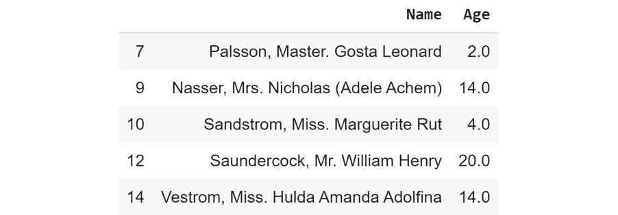

#### 第二章：1\. 基础知识

#### 概述

本章将向你介绍监督学习，使用 Anaconda 管理编码环境，以及使用 Jupyter notebooks 创建、管理和运行代码。它还涵盖了一些在监督学习中最常用的 Python 包：pandas、NumPy、Matplotlib 和 seaborn。本章结束时，你将能够安装并加载 Python 库到你的开发环境中，用于分析和机器学习问题。你还将能够使用 pandas 加载外部数据源，并使用多种方法搜索、过滤和计算数据的描述性统计信息。本章将使你能够评估数据源中诸如缺失数据、类别不平衡和样本量不足等问题的潜在影响。

#### 介绍

机器学习和人工智能的研究和应用最近引起了技术和商业界的广泛关注。先进的数据分析和机器学习技术在推动许多领域取得巨大进展方面表现出巨大的潜力，例如个性化医疗、自驾汽车，以及解决世界上一些最大的挑战，例如应对气候变化（参见《使用机器学习应对气候变化》：https://arxiv.org/pdf/1906.05433.pdf）。

本书旨在帮助你利用当今数据科学和机器学习领域中的独特发展机遇。全球范围内，私营企业和政府都在认识到数据驱动的产品和服务的价值和效率。与此同时，硬件成本的降低和开源软件解决方案显著降低了学习和应用机器学习技术的门槛。

在这里，我们将重点介绍监督式机器学习（简称监督学习）。我们稍后将解释不同类型的机器学习，但我们先从一些简单的信息开始。监督学习的经典示例是开发一个算法来区分猫和狗的图片。监督的部分源于两个方面；首先，我们有一组图片，其中正确答案是已知的。我们称这种数据为标签数据。其次，我们进行一个过程，不断测试我们的算法是否能够根据图片预测“猫”或“狗”，并在预测错误时对算法进行修正。从高层次上讲，这个过程类似于教孩子。然而，训练一个算法通常需要比教一个孩子识别猫和狗更多的数据！幸运的是，我们有越来越多的数据源可以利用。请注意，在开发我们的算法时，使用了“学习”和“训练”这两个词。这些词看起来似乎是赋予机器和计算机程序人的特质，但它们已经深深根植于机器学习（和人工智能）文献中，所以我们就用它们，并理解它们。在这里，“训练”指的是将标签数据提供给算法，并对算法进行调整，以便根据数据最好地预测标签。监督的意思是，数据的标签在训练过程中已提供，使得模型能够从这些标签中学习。

现在让我们了解监督学习与其他形式机器学习的区别。

#### 何时使用监督学习

通常，如果你试图自动化或复制一个现有的过程，那么问题就是一个监督学习问题。举个例子，假设你是一本评论并排名各个时期发型的杂志的出版商。你的读者经常向你发送远多于你能够手动处理的发型图片进行评审。为了节省时间，你希望自动化排序你收到的发型图片，按照时间顺序从 1960 年代和 1980 年代的发型开始，正如你在下图中所看到的：

图 1.1：来自不同时期的发型图片

为了创建你的发型排序算法，你首先需要收集大量发型图片，并手动为每一张图片标注对应的时间时期。这样的数据集（称为标签数据集）是输入数据（发型图片），其所需的输出信息（时间时期）是已知并记录下来的。这类问题是经典的监督学习问题；我们正在尝试开发一个算法，它可以接收一组输入，并学会返回我们告知它正确的答案。

#### Python 包和模块

Python 是最常用的机器学习编程语言之一，并且是本书中使用的语言。

虽然 Python 中包含的标准功能确实功能丰富，但 Python 的真正强大之处在于额外的库（也称为包），这些库由于开源许可，可以通过几个简单的命令轻松下载和安装。在本书中，我们一般假设您的系统已经使用 Anaconda 配置，Anaconda 是一个用于 Python 的开源环境管理器。根据您的系统，您可以使用 Anaconda 配置多个虚拟环境，每个环境都配置有特定的包，甚至不同版本的 Python。使用 Anaconda 可以解决许多准备进行机器学习的要求，因为许多最常用的包都已经预构建在 Anaconda 中。有关 Anaconda 安装说明，请参阅前言。

在本书中，我们将使用以下附加的 Python 包：

NumPy（发音为 Num Pie，可在 https://www.numpy.org/ 获取）：NumPy（即数字 Python 的简称）是 Python 科学计算的核心组成部分之一。NumPy 提供了多个数据类型，这些数据类型衍生出了许多其他数据结构，包括线性代数、向量和矩阵，以及关键的随机数功能。

SciPy（发音为 Sigh Pie，可在 https://www.scipy.org 获取）：SciPy 与 NumPy 一起，是核心的科学计算包。SciPy 提供了许多统计工具、信号处理工具和其他功能，如傅里叶变换。

pandas（可在 https://pandas.pydata.org/ 获取）：pandas 是一个高性能的库，用于加载、清洗、分析和操作数据结构。

Matplotlib（可在 https://matplotlib.org/ 获取）：Matplotlib 是 Python 中用于创建数据集图表和绘图的基础库，也是其他 Python 绘图库的基础包。Matplotlib 的 API 设计与 Matlab 的绘图库对齐，以便于轻松过渡到 Python。

Seaborn（可在 https://seaborn.pydata.org/ 获取）：Seaborn 是一个基于 Matplotlib 构建的绘图库，提供了吸引人的颜色和线条样式，以及一些常见的绘图模板。

Scikit-learn（可在 https://scikit-learn.org/stable/ 获取）：Scikit-learn 是一个 Python 机器学习库，提供了许多数据挖掘、建模和分析技术，且有一个简单的 API。Scikit-learn 内置了许多机器学习算法，包括分类、回归和聚类技术。

这些包构成了一个多功能的机器学习开发环境的基础，每个包都提供了一个关键功能集。如前所述，使用 Anaconda 时，您已经安装了所有必需的包，并且可以随时使用。如果需要安装 Anaconda 安装包中未包含的包，可以通过在 Jupyter 笔记本单元格中输入并执行以下代码来安装：

!conda install <package name>

例如，如果我们想安装 Seaborn，可以运行以下命令：

!conda install seaborn

要在笔记本中使用这些包，我们只需要导入它：

import matplotlib

#### 在 Pandas 中加载数据

pandas 能够读取和写入多种不同的文件格式和数据结构，包括 CSV、JSON、HDF5 文件，以及 SQL 和 Python Pickle 格式。pandas 的输入/输出文档可以在 https://pandas.pydata.org/pandas-docs/stable/user_guide/io.html 找到。我们将继续通过加载 CSV 文件来研究 pandas 的功能。

#### 注意

本章使用的数据集可以通过以下链接在我们的 GitHub 仓库中找到：https://packt.live/2vjyPK9。下载整个仓库到您的系统后，您可以在 Datasets 文件夹中找到数据集。此外，这个数据集是 Titanic: Machine Learning from Disaster 数据集，最初可以在 https://www.kaggle.com/c/Titanic/data 找到。

该数据集包含了著名的泰坦尼克号上的乘客名单，以及他们的年龄、幸存状态和兄弟姐妹/父母的数量。在开始将数据加载到 Python 之前，关键是花时间查看数据集提供的信息，以便我们能够深入理解它所包含的内容。下载数据集并将其放置在您的工作目录中。

从数据描述中，我们可以看到我们有以下字段：

survival: 这告诉我们一个人是否幸存（0 = 否，1 = 是）。

pclass: 这是社会经济地位的代理，其中头等舱代表上层，二等舱代表中层，三等舱代表下层。

sex: 这告诉我们一个人是男性还是女性。

age: 如果年龄小于 1，则这是一个分数值；例如，0.25 表示 3 个月。如果年龄是估算的，它将以 xx.5 的形式表示。

sibsp: 兄弟姐妹定义为兄弟、姐妹、继兄或继姐，配偶定义为丈夫或妻子。

parch: 父母是母亲或父亲，而子女则是女儿、儿子、继女或继子。仅与保姆一起旅行的孩子没有与父母一起旅行。因此，该字段赋值为 0。

ticket: 这是乘客的票号。

fare: 这是乘客的票价。

cabin: 这告诉我们乘客的舱号。

embark: 登船地点是乘客登船的地点。

请注意，数据集提供的信息没有说明数据是如何收集的。survival、pclass 和 embarked 字段被称为分类变量，因为它们被分配到一组固定的标签或类别中，以指示其他信息。例如，在 embarked 中，C 标签表示乘客在瑟堡登船，而 survival 中的 1 表示他们在沉船事故中幸存。

#### 练习 1.01：加载并总结 Titanic 数据集

在本练习中，我们将把 Titanic 数据集读入 Python 并进行一些基本的总结操作：

打开一个新的 Jupyter notebook。

使用简写语法导入 pandas 和 numpy 包：

import pandas as pd

import numpy as np

通过点击 Jupyter notebook 首页上的 titanic.csv 文件来打开并读取文件，如下图所示：

图 1.2：打开 CSV 文件

该文件是一个 CSV 文件，可以将其视为一个表格，每一行代表表格中的一行，每个逗号分隔表格中的列。幸运的是，我们无需以原始文本形式处理这些表格，可以使用 pandas 加载它们：

图 1.3：CSV 文件内容

#### 注释

花点时间查阅 pandas 文档中关于 read_csv 函数的说明，网址：https://pandas.pydata.org/pandas-docs/stable/reference/api/pandas.read_csv.html。注意加载 CSV 数据到 pandas DataFrame 中的不同选项。

在可执行的 Jupyter notebook 单元格中，执行以下代码来从文件加载数据：

df = pd.read_csv(r'..\Datasets\titanic.csv')

pandas 的 DataFrame 类提供了一整套可以在其内容上执行的属性和方法，涵盖从排序、过滤、分组方法到描述性统计，以及绘图和转换等功能。

#### 注释

打开 pandas DataFrame 对象的文档，网址：https://pandas.pydata.org/pandas-docs/stable/reference/frame.html。

使用 DataFrame 的 head() 方法读取前十行数据：

#### 注释

以下代码片段中的 # 符号表示代码注释。注释是添加到代码中以帮助解释特定逻辑的部分。

df.head(10) # 检查前 10 个样本

输出将如下所示：

图 1.4：读取前 10 行

#### 注释

要访问此特定部分的源代码，请参考 https://packt.live/2Ynb7sf。

你也可以在网上运行这个示例，网址：https://packt.live/2BvTRrG。你必须执行整个笔记本以获得预期结果。

在此示例中，我们展示了 DataFrame 中信息的可视化表示。我们可以看到数据以表格化的方式组织，几乎像电子表格一样。不同类型的数据被组织成列，而每个样本被组织成行。每一行都分配了一个索引值，并以粗体数字 0 到 9 显示在 DataFrame 的左侧。每一列都分配了一个标签或名称，如粗体所示，在 DataFrame 的顶部。

DataFrame 作为一种电子表格的类比是合理的。如本章所示，我们可以像在电子表格程序中那样对数据进行排序、过滤和计算。虽然本章未涉及，但值得注意的是，DataFrame 还包含了类似电子表格的透视表功能（https://pandas.pydata.org/pandas-docs/stable/reference/api/pandas.pivot_table.html）。

#### 练习 1.02：索引和选择数据

现在我们已经加载了一些数据，让我们使用 DataFrame 的选择和索引方法来访问一些感兴趣的数据。这个练习是练习 1.01，“加载并总结泰坦尼克数据集”的延续：

通过使用列的标签，以类似于常规字典的方式选择单个列，如下所示：

df['Age']

输出结果如下：

0 22.0

1 38.0

2 26.0

3 35.0

4 35.0

...

1304 NaN

1305 39.0

1306 38.5

1307 NaN

1308 NaN

名称：年龄，长度：1309，数据类型：float64

如果列名中没有空格，我们还可以使用点操作符。如果列名中有空格，则需要使用括号表示法：

df.Age

输出结果如下：

0 22.0

1 38.0

2 26.0

3 35.0

4 35.0

...

1304 NaN

1305 39.0

1306 38.5

1307 NaN

1308 NaN

名称：年龄，长度：1309，数据类型：float64

使用括号表示法一次选择多个列，如下所示：

df[['Name', 'Parch', 'Sex']]

输出结果如下：

图 1.5：选择多个列

#### 注意

由于展示需要，输出已被截断。

使用 iloc 选择第一行：

df.iloc[0]

输出结果如下：

图 1.6：选择第一行

使用 iloc 选择前三行：

df.iloc[[0,1,2]]

输出结果如下：

图 1.7：选择前三行

接下来，获取所有可用列的列表：

columns = df.columns # 提取列名列表

print(columns)

输出结果如下：

图 1.8：获取所有列

使用此列名列表和标准的 Python 切片语法，获取第 2、3、4 列及其对应的值：

df[columns[1:4]] # 第 2、3、4 列

输出结果如下：

图 1.9：获取第二列、第三列和第四列

使用 len 运算符获取 DataFrame 中的行数：

len(df)

输出结果如下所示：

1309

使用以行中心的方法获取第 2 行的 Fare 列值：

df.iloc[2]['Fare'] # 以行为中心

输出结果如下所示：

7.925

使用点操作符来访问列，如下所示：

df.iloc[2].Fare # 以行为中心

输出结果如下所示：

7.925

使用以列为中心的方法，如下所示：

df['Fare'][2] # 以列为中心

输出结果如下所示：

7.925

使用以列为中心的方法并使用点操作符，如下所示：

df.Fare[2] # 以列为中心

输出结果如下所示：

7.925

#### 注意

要访问这一特定部分的源代码，请参考 [`packt.live/2YmA7jb`](https://packt.live/2YmA7jb)。

你也可以在 [`packt.live/3dmk0qf`](https://packt.live/3dmk0qf) 上在线运行此示例。你必须执行整个笔记本才能得到预期的结果。

在这个练习中，我们学习了如何使用 pandas 的 read_csv() 函数将数据加载到 Python 中的 Jupyter 笔记本中。然后，我们探讨了 pandas 通过以 DataFrame 形式呈现数据，如何便捷地选择 DataFrame 中的特定项并查看其内容。在理解了这些基础知识后，我们将进一步探索更高级的索引和数据选择方法。

#### 练习 1.03：高级索引和选择

在掌握了基本的索引和选择方法之后，我们可以将注意力转向更高级的索引和选择方法。在这个练习中，我们将探索几种重要的方法来执行高级索引和数据选择。这个练习是练习 1.01 "加载并总结 Titanic 数据集" 的延续：

创建一个包含 21 岁以下乘客姓名和年龄的列表，如下所示：

child_passengers = df[df.Age < 21][['Name', 'Age']]

child_passengers.head()

输出结果如下所示：

](img/image-W5SL6I98.jpg)

图 1.10：21 岁以下乘客的姓名和年龄列表

计算有多少名儿童乘客，如下所示：

print(len(child_passengers))

输出结果如下所示：

249

计算年龄在 21 岁到 30 岁之间的乘客数量。此步骤不使用 Python 的逻辑与运算符，而是使用和符号（&）。具体操作如下：

#### 注意

这里展示的代码片段使用了反斜杠（\）将逻辑分割成多行。当代码执行时，Python 会忽略反斜杠，并将下一行代码视为当前行的直接延续。

young_adult_passengers = df.loc[(df.Age > 21) \

& (df.Age < 30)]

len(young_adult_passengers)

输出结果如下所示：

279

查找第一类或第三类票的乘客。我们不会使用 Python 的逻辑或运算符，而是使用管道符号（|）。具体操作如下：

df.loc[(df.Pclass == 3) | (df.Pclass ==1)]

输出如下：

图 1.11：既是头等舱票持有者又是三等舱票持有者的乘客数量

查找不是头等或者三等舱票持有者的乘客。不要简单地选择二等舱票持有者，而是使用 ~ 符号作为非逻辑运算符。操作如下：

df.loc[~((df.Pclass == 3) | (df.Pclass == 1))]

输出如下：

图 1.12：不是头等舱或三等舱票持有者的乘客数量

我们不再需要未命名的 0 列，因此使用 del 运算符删除它：

del df['Unnamed: 0']

df.head()

输出如下：

图 1.13：del 运算符

#### 注意

要访问此特定部分的源代码，请参考 https://packt.live/3empSRO。

您也可以在 https://packt.live/3fEsPgK 上在线运行此示例。为了获得期望的结果，您必须执行整个笔记本。

在这个练习中，我们学习了如何使用条件运算符从 DataFrame 中选择数据，并返回我们想要的子集。我们还看到如何删除我们不需要的列（在这种情况下，未命名列只包含对分析无关的行号）。现在，让我们深入了解一些 pandas 的强大功能。

#### Pandas 方法

现在我们对一些 pandas 基础知识和一些更高级的索引和选择工具感到自信，让我们看一些其他 DataFrame 方法。要获取 DataFrame 中可用的所有方法的完整列表，可以参考类文档。

#### 注意

pandas 的文档可以在 https://pandas.pydata.org/pandas-docs/stable/reference/frame.html 找到。

现在您应该知道 DataFrame 中有多少方法可用。这些方法太多，无法在本章节详细介绍，因此我们将选择一些能为您提供优秀启动的方法。

我们已经看到了一个方法的用法，head()，它提供了 DataFrame 的前五行。如果需要，我们可以通过提供行数来选择更多或更少的行，如下所示：

df.head(n=20) # 20 行

df.head(n=32) # 32 行

或者，您可以使用 tail() 函数查看 DataFrame 结尾的指定行数。

另一个有用的方法是 describe，这是一种快速获取 DataFrame 中数据描述统计信息的方法。我们可以看到样本大小（计数）、均值、最小值、最大值、标准差以及第 25、50 和 75 百分位数对所有数值数据列返回（请注意，文本列已被省略）：

df.describe()

输出如下：

图 1.14：describe 方法

请注意，只有数值型数据的列被包含在摘要中。这个简单的命令为我们提供了大量有用的信息；通过查看 count（即有效样本数）的值，我们可以看到年龄（Age）类别中有 1,046 个有效样本，但票价（Fare）有 1,308 个，而生存（Survived）列只有 891 个有效样本。我们可以看到，最年轻的人是 0.17 岁，平均年龄为 29.898 岁，最年长的乘客为 80 岁。最小票价为 £0，平均票价为 £33.30，最贵票价为 £512.33。如果我们看一下 Survived 列，我们有 891 个有效样本，均值为 0.38，这意味着大约 38% 的人存活。

我们还可以通过调用 DataFrame 的相应方法，分别获取每一列的这些值，如下所示：

df.count()

输出将如下所示：

Cabin 295

Embarked 1307

Fare 1308

Pclass 1309

Ticket 1309

Age 1046

Name 1309

Parch 1309

Sex 1309

SibSp 1309

Survived 891

dtype: int64

但我们也有一些包含文本数据的列，例如 Embarked、Ticket、Name 和 Sex。那么这些怎么办呢？我们如何获取这些列的描述性信息？我们仍然可以使用 describe 方法，只是需要传递更多的信息。默认情况下，describe 只会包含数值列，并计算 25%、50% 和 75% 的分位数，但我们可以通过传递 `include = 'all'` 参数来配置它以包含文本列，如下所示：

df.describe(include='all')

输出将如下所示：

图 1.15：带文本列的 describe 方法

这样更好了——现在我们有了更多信息。查看 Cabin 列，我们可以看到有 295 个条目，其中有 186 个唯一值。最常见的值是 C32、C25 和 C27，它们出现了 6 次（来自 freq 值）。类似地，查看 Embarked 列，我们看到有 1,307 个条目，3 个唯一值，最常出现的值是 S，共有 914 个条目。

注意我们在 describe 输出表中出现了 NaN 值。NaN，即非数字（Not a Number），在 DataFrame 中非常重要，因为它表示缺失或不可用的数据。pandas 库能够读取包含缺失或不完整信息的数据源，既是一个福音，也是一个诅咒。许多其他库在遇到缺失信息时会直接无法导入或读取数据文件，而 pandas 能够读取数据也意味着必须妥善处理这些缺失数据。

当查看 describe 方法的输出时，你会注意到 Jupyter 笔记本将其呈现为与我们通过 read_csv 读取的原始 DataFrame 相同的方式。这样做是有充分理由的，因为 describe 方法返回的结果本身就是一个 pandas DataFrame，因此它具备与从 CSV 文件读取的数据相同的方法和特征。可以使用 Python 内置的 type 函数轻松验证这一点，如以下代码所示：

type(df.describe(include='all'))

输出将如下所示：

pandas.core.frame.DataFrame

现在我们已经有了数据集的摘要，让我们深入研究一下，以便更好地理解可用数据。

#### 注意

对可用数据的全面理解对于任何监督学习问题都至关重要。数据的来源和类型、收集的方式，以及可能由于收集过程中的错误所导致的问题，都对最终模型的性能产生影响。

希望到现在为止，你已经习惯使用 pandas 提供数据的高级概览。接下来，我们将花一些时间更深入地研究数据。

#### 练习 1.04：使用聚合方法

我们已经看到如何索引或选择 DataFrame 中的行或列，并使用高级索引技术根据特定标准过滤可用数据。另一个方便的选择方法是 groupby 方法，它提供了一种快速选择一组数据的方法，并通过 DataFrameGroupBy 对象提供额外的功能。本练习是练习 1.01《加载并总结泰坦尼克号数据集》的延续：

使用 groupby 方法对 Embarked 列下的数据进行分组，以找出 Embarked 有多少种不同的值：

embarked_grouped = df.groupby('Embarked')

print(f'共有{len(embarked_grouped)}个 Embarked 组')

输出将如下所示：

共有 3 个 Embarked 组

显示 embarked_grouped.groups 的输出，以查看 groupby 方法实际执行了什么操作：

embarked_grouped.groups

输出将如下所示：

图 1.16：embarked_grouped.groups 的输出

我们可以看到，这三个组分别是 C、Q 和 S，并且 embarked_grouped.groups 实际上是一个字典，其中键是组，值是属于该组的行或索引。

使用 iloc 方法检查第 1 行，并确认它属于 Embarked 组 C：

df.iloc[1]

输出将如下所示：

图 1.17：检查第 1 行

由于这些组是字典类型，我们可以遍历它们并对每个单独的组执行计算。计算每个组的平均年龄，如下所示：

对于 name, group 在 embarked_grouped 中：

print(name, group.Age.mean())

输出将如下所示：

C 32.33216981132075

Q 28.63

S 29.245204603580564

另一种选择是使用 aggregate 方法，简称 agg，并提供一个函数来应用于各列。使用 agg 方法来确定每个组的均值：

embarked_grouped.agg(np.mean)

输出将如下所示：

](img/image-0S7SC7MC.jpg)

图 1.18：使用 agg 方法

那么，agg 究竟是如何工作的，我们可以传递什么类型的函数给它呢？在回答这些问题之前，我们首先需要考虑 DataFrame 中每一列的数据类型，因为每一列都会通过此函数产生我们所看到的结果。每个 DataFrame 由一组 pandas 序列数据的列组成，这在许多方面类似于一个列表。因此，任何可以接受列表或类似可迭代对象并计算出单一结果值的函数，都可以与 agg 一起使用。

定义一个简单的函数，返回列中的第一个值，然后将该函数传递给 agg，作为示例：

def first_val(x):

return x.values[0]

embarked_grouped.agg(first_val)

输出将如下所示：

](img/image-0S7SC7MC.jpg)

图 1.19：使用.agg 方法与函数

#### 注意

要访问此特定部分的源代码，请参考 https://packt.live/2NlEkgM。

你也可以在 https://packt.live/2AZnq51 上在线运行此示例。你必须执行整个 Notebook 才能获得预期的结果。

在这个练习中，我们展示了如何在 DataFrame 中对数据进行分组，从而允许使用.agg()应用额外的函数，比如计算组的均值。这类操作在分析和准备数据时非常常见。

#### 分位数

前一个练习展示了如何找到均值。在统计数据分析中，我们也经常感兴趣的是数据集中某个值以下或以上，某个比例的点会落在其中。这些点被称为分位数。例如，如果我们有一个从 1 到 10,001 的数字序列，25%的分位数值为 2,501。也就是说，在值 2,501 处，25%的数据位于该截止值以下。分位数在数据可视化中经常使用，因为它们能传达数据分布的感觉。特别是，Matplotlib 中的标准箱线图会绘制一个由四个分位数中的第一和第三个分位数界定的箱体。

例如，让我们建立以下 DataFrame 的 25%分位数：

import pandas as pd

df = pd.DataFrame({"A":[1, 6, 9, 9]})

#计算 DataFrame 的 25%分位数

df.quantile(0.25, axis = 0)

输出将如下所示：

A 4.75

Name: 0.25, dtype: float64

从前面的输出中可以看出，4.75 是 DataFrame 的 25%分位数值。

#### 注意

有关分位数方法的更多信息，请参考 https://pandas.pydata.org/pandas-docs/stable/reference/frame.html。

本书稍后我们将继续使用分位数的概念，深入探讨数据。

#### Lambda 函数

实现 agg 的一种常见且有用的方法是通过使用 Lambda 函数。

Lambda 或匿名函数（在其他语言中也称为内联函数）是小型的单表达式函数，可以声明并使用，而无需通过 def 关键字进行正式的函数定义。Lambda 函数本质上是为了方便而提供的，通常不用于长时间的复杂任务。Lambda 函数的主要优点是它们可以在不适合或不方便定义函数的地方使用，例如在其他表达式或函数调用中。Lambda 函数的标准语法如下（总是以 lambda 关键字开头）：

lambda <输入值>: <计算返回的值>

现在我们来做一个练习，创建一些有趣的 Lambda 函数。

#### 练习 1.05：创建 Lambda 函数

在本练习中，我们将创建一个 Lambda 函数，返回列中的第一个值，并与 agg 一起使用。本练习是练习 1.01“加载和汇总泰坦尼克数据集”的延续：

将 first_val 函数写为 Lambda 函数，并传递给 agg：

embarked_grouped = df.groupby('Embarked')

embarked_grouped.agg(lambda x: x.values[0])

输出结果如下：

图 1.20：使用 agg 方法和 Lambda 函数

显然，我们得到相同的结果，但请注意，Lambda 函数的使用更加方便，尤其是考虑到它仅仅是暂时使用的。

我们还可以通过列表将多个函数传递给 agg，从而在数据集上应用这些函数。传递 Lambda 函数以及 NumPy 的均值和标准差函数，如下所示：

embarked_grouped.agg([lambda x: x.values[0], np.mean, np.std])

输出结果如下：

图 1.21：使用 agg 方法和多个 Lambda 函数

将 numpy.sum 应用于 Fare 列，并将 Lambda 函数应用于 Age 列，通过传递一个包含列名（作为字典的键）和相应函数（作为字典的值）的字典给 agg，从而使得可以对 DataFrame 中的不同列应用不同的函数：

embarked_grouped.agg({'Fare': np.sum, \

'Age': lambda x: x.values[0]})

输出结果如下：

图 1.22：使用 agg 方法和包含不同列的字典

最后，使用多个列执行 groupby 方法。提供包含列列表（性别和登船港口）以进行分组，如下所示：

age_embarked_grouped = df.groupby(['Sex', 'Embarked'])

age_embarked_grouped.groups

输出结果如下：

图 1.23：使用 groupby 方法进行多列分组

与仅通过 Embarked 列进行分组计算时类似，我们可以看到这里返回了一个字典，其中键是 Sex 和 Embarked 列的组合，以元组形式返回。字典中的第一个键值对是元组 ('Male', 'S')，值对应于具有该特定组合的行索引。每个 Sex 和 Embarked 列中唯一值的组合都会有一个键值对。

#### 注意

要查看此特定部分的源代码，请参考 https://packt.live/2B1jAZl。

你也可以在 https://packt.live/3emqwPe 上在线运行这个示例。你必须执行整个 Notebook 才能获得期望的结果。

这标志着我们对数据检查和处理的简要探索的结束。接下来，我们将进入数据科学中最重要的话题之一——数据质量。

#### 数据质量考虑

在任何机器学习问题中，无论是监督学习还是无监督学习，所使用数据的质量对最终模型的表现至关重要，因此在规划任何机器学习项目时，数据质量应处于首要位置。作为一个简单的经验法则，如果你拥有干净的数据、足够的数量，并且输入数据类型与期望输出之间有良好的相关性，那么选用哪种类型的监督学习模型及其具体细节对获得良好的结果变得不那么重要。

然而，实际上这种情况很少发生。通常，关于数据量、数据质量或信噪比、输入与输出之间的相关性，或三者的某种组合，都会存在一些问题。因此，我们将在本章的最后一部分考虑可能出现的一些数据质量问题以及解决这些问题的一些机制。我们之前提到，在任何机器学习问题中，深入了解数据集对于构建高性能模型至关重要。

在研究数据质量并尝试解决数据中存在的一些问题时，尤其如此。如果没有对数据集的全面理解，数据清理过程中可能会引入额外的噪声或其他未预见的问题，从而导致性能进一步下降。

#### 注意

Titanic 数据集的详细描述和其中包含的数据类型可以在 pandas 中的加载数据部分找到。如果你需要快速回顾，可以回去复习那部分内容。

#### 管理缺失数据

正如我们之前讨论的，pandas 读取带有缺失值的数据的能力既是一种福音也是一种诅咒，可以说是在继续开发我们的监督学习模型之前需要解决的最常见问题。最简单但不一定最有效的方法是简单地删除或忽略那些缺失数据的条目。我们可以在 pandas 中轻松地使用 DataFrame 上的 dropna 方法来实现这一点：

完整数据 = df.dropna()

仅仅删除具有缺失数据的行有一个非常重要的后果，那就是我们可能会丢失很多重要信息。这在泰坦尼克号数据集中非常明显，因为很多行包含缺失数据。如果我们简单地忽略这些行，我们将从 1,309 个样本开始，最终只剩下 183 个条目。使用略多于 10% 的数据开发一个合理的监督学习模型将非常困难。以下代码显示了使用 dropna() 方法处理缺失条目的示例：

len(df)

前面的输入产生以下输出：

1309

dropna() 方法的实现如下：

len(df.dropna())

前面的输入产生以下输出：

183

因此，除了早期的探索阶段外，简单丢弃所有具有无效信息的行通常是不可接受的。我们可以确定哪些行实际上缺少信息，以及缺失信息是某些列特有的问题还是整个数据集中所有列都存在的问题。我们也可以使用 aggregate 来帮助我们：

df.aggregate(lambda x: x.isna().sum())

输出如下：

船舱 1014

登船港口 2

票价 1

客舱等级 0

票号 0

年龄 263

姓名 0

父母/子女 0

性别 0

兄弟姐妹/配偶 0

生还 418

类型：int64

现在这很有用！我们可以看到绝大多数缺失信息在船舱列中，一些在年龄中，还有一些在生还中。这是数据清洗过程中我们可能需要做出明智判断的首次之一。

对于船舱列我们想要做什么？这里缺失的信息太多了，事实上，可能无法以任何合理的方式使用它。我们可以尝试通过查看姓名、年龄和父母/兄弟姐妹的数量来恢复信息，看看是否可以将一些家庭匹配在一起提供信息，但在这个过程中会有很多不确定性。我们也可以简化列，使用船上舱位的级别而不是确切的舱位号，这样可能会更好地与姓名、年龄和社会地位相关联。这很不幸，因为船舱和生还之间可能存在很好的相关性，也许那些在船的下层甲板上的乘客可能更难撤离。我们可以仅检查具有有效船舱值的行，看看舱位信息是否具有任何预测能力；但是，目前，我们将简单地将船舱视为一个合理的输入（或特征）而忽略。

我们可以看到，Embarked 和 Fare 列之间只有三条缺失样本。如果我们决定模型需要这两列，那么直接删除这些行是一个合理的选择。我们可以使用索引技巧来实现这一点，其中 ~ 代表取反操作，或者反转结果（也就是说，当 df.Embarked 和 df.Fare 不为 NaN 时）：

df_valid = df.loc[(~df.Embarked.isna()) & (~df.Fare.isna())]

缺失的年龄值更为有趣，因为有太多缺失年龄值的行，无法简单地将它们丢弃。但我们在这里有更多的选项，因为我们可以对一些合理的值有更高的信心。最简单的选择是直接用数据集的平均年龄填充缺失的年龄值：

df_valid[['Age']] = df_valid[['Age']]\

.fillna(df_valid.Age.mean())

这样是可以的，但可能有更好的填充数据的方式，而不仅仅是给所有 263 个人赋相同的值。记住，我们的目标是清理数据，以最大化输入特征和生存率的预测能力。虽然简单，但让每个人都有相同的值似乎不太合理。如果我们查看每个票务等级（Pclass）成员的平均年龄呢？这可能会提供一个更好的估计，因为随着票务等级从 1 到 3 下降，平均年龄也逐渐降低，以下代码可以看到这一点：

df_valid.loc[df.Pclass == 1, 'Age'].mean()

上述输入会产生以下输出：

37.956806510096975

第二等级的平均年龄如下：

df_valid.loc[df.Pclass == 2, 'Age'].mean()

上述输入会产生以下输出：

29.52440879717283

第三等级的平均年龄如下：

df_valid.loc[df.Pclass == 3, 'Age'].mean()

上述输入会产生以下输出：

26.23396338788047

如果我们同时考虑人的性别和票务等级（社会地位）呢？这里的平均年龄也会有所不同吗？让我们来探讨一下：

for name, grp in df_valid.groupby(['Pclass', 'Sex']):

print('%i' % name[0], name[1], '%0.2f' % grp['Age'].mean())

输出将如下所示：

1 女性 36.84

1 男性 41.03

2 女性 27.50

2 男性 30.82

3 女性 22.19

3 男性 25.86

我们可以看到，所有票务等级中的男性通常年龄较大。性别和票务等级的组合提供的信息比仅仅用平均年龄填充缺失值要丰富得多。为此，我们将使用 transform 方法，它可以对 Series 或 DataFrame 的内容应用一个函数，并返回另一个具有变换值的 Series 或 DataFrame。当与 groupby 方法结合使用时，这非常强大：

mean_ages = df_valid.groupby(['Pclass', 'Sex'])['Age'].\

transform(lambda x: \

x.fillna(x.mean()))

df_valid.loc[:, 'Age'] = mean_ages

这两行代码包含了很多内容，我们来逐步解析。首先看看第一行：

mean_ages = df_valid.groupby(['Pclass', 'Sex'])['Age'].\

transform(lambda x: \

x.fillna(x.mean()))

我们已经熟悉 df_valid.groupby(['Pclass', 'Sex'])['Age']，它根据票务等级和性别对数据进行分组，并返回仅包含 Age 列的数据。lambda x: x.fillna(x.mean()) Lambda 函数将输入的 pandas 系列填充 NaN 值为该系列的均值。

第二行将 mean_ages 中的填充值分配给 Age 列。注意使用了 loc[:, 'Age']索引方法，表示将 Age 列中的所有行赋值为 mean_ages 中的值：

df_valid.loc[:, 'Age'] = mean_ages

我们已经描述了几种填充 Age 列缺失值的方法，但这绝不是一个详尽的讨论。我们可以使用更多的方法来填充缺失数据：我们可以在分组数据的均值的一个标准差范围内应用随机值，也可以考虑根据性别、父母/子女数量（Parch）或兄弟姐妹数量，甚至是票务等级、性别和父母/子女数量来对数据进行分组。关于此过程中做出的决策，最重要的是最终的预测准确性。我们可能需要尝试不同的选项，重新运行模型，并考虑对最终预测准确性的影响。因此，选择能为模型提供最大预测能力的特征或组件。你会发现，在这个过程中，你会尝试不同的特征，运行模型，查看最终结果，然后重复这个过程，直到你对性能感到满意。

这个监督学习问题的最终目标是根据我们所掌握的信息预测泰坦尼克号乘客的生存情况。所以，这意味着“是否生存”这一列提供了我们训练的标签。如果我们缺少 418 个标签该怎么办？如果这是一个我们可以控制数据收集并访问数据来源的项目，我们显然可以通过重新收集数据或请求明确标签来进行修正。但在泰坦尼克号数据集中，我们没有这种能力，因此必须做出另一个有根据的判断。一个方法是从训练数据中删除这些行，之后用在（更小的）训练集上训练的模型来预测其他人的结果（这实际上是 Kaggle 泰坦尼克号比赛中的任务）。在某些商业问题中，我们可能没有简单忽略这些行的选项；我们可能在尝试预测一个非常关键过程的未来结果，而这些数据就是我们所拥有的。我们可以尝试一些无监督学习技术，看看是否能发现一些生存信息的模式以供使用。然而，通过无监督技术来估计真实标签，可能会给数据集引入显著的噪声，从而降低我们准确预测生存情况的能力。

#### 类别不平衡

缺失数据并不是数据集中可能存在的唯一问题。类别不平衡——即一个类别或多个类别的样本数量大大超过其他类别——可能是一个显著问题，特别是在分类问题中（我们将在第五章“分类技术”中深入讨论分类问题），即我们试图预测一个样本属于哪个类别。通过查看我们的“Survived”列，可以看到数据集中死亡的人数（Survived 等于 0）远多于生还的人数（Survived 等于 1），如下代码所示：

len(df.loc[df.Survived ==1])

输出如下：

342

死亡人数为：

len(df.loc[df.Survived ==0])

输出如下：

549

如果我们不考虑这个类别不平衡问题，我们模型的预测能力可能会大大降低，因为在训练过程中，模型只需要猜测这个人没有生还，就可以正确预测 61%的时间（549 / (549 + 342)）。如果实际生还率是 50%，那么在应用于未见数据时，我们的模型会过于频繁地预测“没有生还”。

管理类别不平衡有几种可选方法，其中一种方法，类似于缺失数据场景，是随机删除过度代表类的样本，直到达到平衡为止。再次强调，这种方法并不理想，甚至可能不适当，因为它涉及忽略可用的数据。一个更具建设性的例子可能是通过随机复制数据集中不足代表类的样本来进行过采样，以增加样本数量。虽然删除数据可能导致由于丢失有用信息而产生准确性问题，但对不足代表类进行过采样可能会导致无法预测未见数据的标签，这也被称为过拟合（我们将在第六章“集成建模”中讨论）。

向过采样数据的输入特征中添加一些随机噪声可能有助于防止一定程度的过拟合，但这在很大程度上取决于数据集本身。与缺失数据一样，检查任何类别不平衡修正对整体模型性能的影响非常重要。使用 append 方法将更多数据复制到 DataFrame 中是相对简单的，append 方法的工作方式与列表非常相似。如果我们想把第一行复制到 DataFrame 的末尾，可以这样做：

df_oversample = df.append(df.iloc[0])

#### 样本量过小

机器学习领域可以视为更大统计学领域的一个分支。因此，置信度和样本量的原理也可以用于理解小数据集的问题。回想一下，如果我们从一个高方差的数据源中获取测量数据，那么这些测量的 不确定性程度也会很高，并且为了在均值的值上获得特定的置信度，我们需要更多的样本。样本原理可以应用于机器学习数据集。那些特征方差较大的数据集，通常需要更多的样本才能获得合理的性能，因为更高的置信度也是必需的。

有一些技术可以用来弥补样本量减少的问题，比如迁移学习。然而，这些技术超出了本书的范围。然而，最终来说，使用小数据集所能做的事有限，显著的性能提升可能只有在增加样本量后才会发生。

#### 活动 1.01：实现 Pandas 函数

在这个活动中，我们将测试我们在本章中学到的各种 Pandas 函数。我们将使用相同的 Titanic 数据集进行练习。

执行的步骤如下：

打开一个新的 Jupyter 笔记本。

使用 Pandas 加载 Titanic 数据集，并对数据集使用 `head` 函数以显示数据集的顶部行。描述所有列的总结数据。

我们不需要 `Unnamed: 0` 列。在练习 1.03: 高级索引和选择中，我们演示了如何使用 `del` 命令删除该列。还有其他方法可以删除此列吗？不使用 `del` 删除此列。

计算 DataFrame 列的均值、标准差、最小值和最大值，而不使用 `describe`。注意，可以使用 `df.min()` 和 `df.max()` 函数找到最小值和最大值。

使用 `quantile` 方法获取 33%、66% 和 99%的分位数值。

使用 `groupby` 方法找出每个舱位的乘客数量。

使用选择/索引方法计算每个舱位的乘客数量。可以使用 `unique()` 方法找出每个舱位的唯一值。

确认第 6 步和第 7 步的答案是否匹配。

确定第三舱中最年长的乘客是谁。

对于许多机器学习问题，常常需要将数值数据缩放到 0 和 1 之间。使用 `agg` 方法与 Lambda 函数将 Fare 和 Age 列的数据缩放到 0 和 1 之间。

数据集中有一位个体没有列出票价值，可以通过以下方式确认：

df_nan_fare = df.loc[(df.Fare.isna())]

df_nan_fare

输出将如下所示：

图 1.24：没有列出票价的个体

使用 groupby 方法，将主数据框中该行的 NaN 值替换为与该行对应的相同类别和登船地点的平均票价值。

输出结果如下：

图 1.25：没有列出票价详情的个人输出

#### 注意

本活动的解决方案可以通过此链接找到。

通过本活动，我们回顾了所有基本的数据加载、检查和操作方法，以及一些基本的总结统计方法。

#### 总结

本章介绍了监督学习的概念，并提供了一些应用案例，包括自动化手动任务，如识别 1960 年代和 1980 年代的发型。在此介绍中，我们遇到了标记数据集的概念，以及将一个信息集（输入数据或特征）映射到相应标签的过程。我们通过实践方法，使用 Jupyter 笔记本和功能强大的 pandas 库，讲解了数据加载和清理的过程。请注意，本章仅涵盖了 pandas 功能的一小部分，实际上，整个书籍都可以专门讲解这个库。建议您熟悉阅读 pandas 文档，并通过实践继续提升您的 pandas 技能。本章的最后部分讨论了在开发高性能监督学习模型时需要考虑的一些数据质量问题，包括缺失数据、类别不平衡和样本量过小等问题。我们讨论了管理这些问题的多种选择，并强调了将这些缓解措施与模型性能进行对比检查的重要性。在下一章中，我们将扩展本章所涉及的数据清理过程，并研究数据探索和可视化过程。数据探索是任何机器学习解决方案中的关键部分，因为如果没有对数据集的全面了解，几乎不可能对所提供的信息进行建模。
