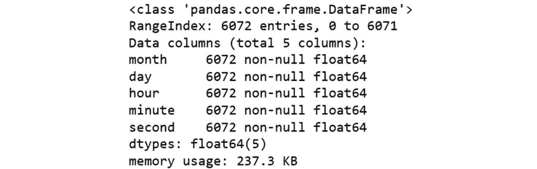
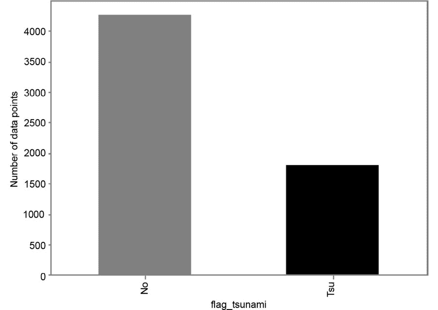
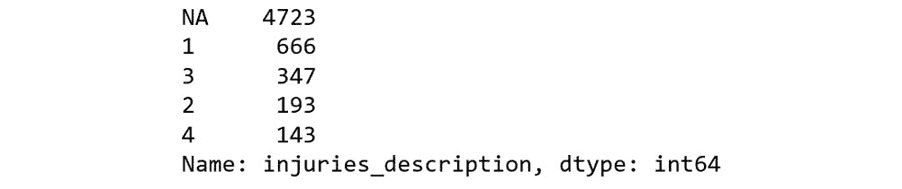
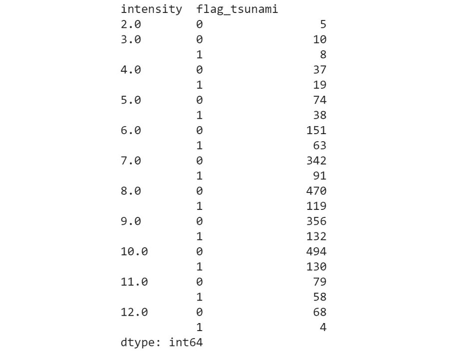

#### 第三章：2. 探索性数据分析与可视化

#### 概述

本章带领我们了解如何对一个新的数据集进行探索和分析。到本章结束时，你将能够解释数据探索的重要性，并能够传达数据集的汇总统计信息。你将能够可视化数据中缺失值的模式，并能够适当地替换空值。你将学会识别连续特征、分类特征，并可视化各个变量的值分布。你还将能够使用相关性和可视化来描述和分析不同类型变量之间的关系。

#### 介绍

假设我们有一个问题陈述，涉及预测某次地震是否引发了海啸。我们如何决定使用什么模型？我们对现有的数据了解多少？什么都不知道！但如果我们不了解数据，最终可能会建立一个不太可解释或不可靠的模型。在数据科学中，彻底理解我们所处理的数据非常重要，以便生成高度信息化的特征，并因此构建准确而强大的模型。为了获得这种理解，我们对数据进行探索性分析，看看数据能告诉我们关于特征和目标变量（你试图通过其他变量预测的值）之间关系的信息。了解数据甚至有助于我们解释所构建的模型，并找出改进其准确性的方法。我们采取的做法是让数据揭示其结构或模型，这有助于我们获得一些新的、往往是意想不到的见解。

我们将首先简要介绍探索性数据分析，然后逐步解释汇总统计和中心值。本章还将教你如何查找和可视化缺失值，并描述处理缺失值问题的各种填充策略。接下来的部分将专注于可视化。具体来说，本章教你如何创建各种图表，如散点图、直方图、饼图、热图、配对图等。让我们从探索性数据分析开始。

#### 探索性数据分析（EDA）

探索性数据分析（EDA）被定义为一种分析数据集并总结其主要特征的方法，通过这种方法得出有用的结论，通常采用可视化方法。

EDA 的目的是：

发现数据集中的模式

发现异常值

对数据行为形成假设

验证假设

从基本的摘要统计到复杂的可视化帮助我们直观地理解数据本身，这在形成关于数据的新假设并揭示哪些参数影响目标变量时极为重要。通常，发现目标变量如何在单一特征上变化，会给我们提供该特征可能有多重要的指示，而多个特征组合的变化有助于我们提出新的有信息量的特征工程思路。

大多数探索性分析和可视化的目的是理解特征与目标变量之间的关系。这是因为我们希望找出我们所拥有的数据与我们要预测的值之间存在（或不存在）什么关系。

EDA 可以告诉我们：

有缺失值、脏数据或异常值的特征

有助于目标识别的具有信息性的特征

特征与目标之间的关系类型

数据可能需要的进一步特征，我们当前并没有

可能需要单独考虑的边缘情况

可能需要应用于数据集的过滤条件

存在不正确或虚假数据点

现在我们已经了解了 EDA 的重要性以及它能告诉我们什么，接下来让我们讨论 EDA 到底涉及什么。EDA 可以包括从查看基本的摘要统计数据到可视化多变量之间的复杂趋势。尽管如此，即便是简单的统计数据和图表也可以是强大的工具，因为它们可能揭示出关于数据的重要事实，这些事实可能会改变我们建模的视角。当我们看到表示数据的图表时，相比于仅仅是原始数据和数字，我们能更容易地检测到趋势和模式。这些可视化还可以让我们提出“如何？”和“为什么？”这样的问题，并对数据集形成可以通过进一步可视化验证的假设。这是一个持续的过程，最终会加深我们对数据的理解。

我们将用于探索性分析和可视化的数据集来自 NOAA 的显著地震数据库，该数据库作为公共数据集可以在 Google BigQuery 上访问（表 ID：'bigquery-public-data.noaa_significant_earthquakes.earthquakes'）。我们将使用其中一部分列，相关元数据可以在[`console.cloud.google.com/bigquery?project=packt-data&folder&organizationId&p=bigquery-public-data&d=noaa_significant_earthquakes&t=earthquakes&page=table`](https://console.cloud.google.com/bigquery?project=packt-data&folder&organizationId&p=bigquery-public-data&d=noaa_significant_earthquakes&t=earthquakes&page=table)获取，并将其加载到 pandas DataFrame 中进行探索。我们主要将使用 Matplotlib 进行大多数可视化，同时也会使用 Seaborn 和 Missingno 库进行部分可视化。然而需要注意的是，Seaborn 只是 Matplotlib 功能的封装，因此，使用 Seaborn 绘制的图形也可以通过 Matplotlib 绘制。我们将通过这两种库的可视化来保持内容的趣味性。

探索和分析将基于一个示例问题：根据我们拥有的数据，我们想预测地震是否引发了海啸。这将是一个分类问题（更多内容请参见第五章，分类技术），目标变量是 flag_tsunami 列。

在我们开始之前，首先导入所需的库，这些库将用于我们大多数的数据操作和可视化。

在 Jupyter Notebook 中，导入以下库：

import json

import pandas as pd

import numpy as np

import missingno as msno

from sklearn.impute import SimpleImputer

import matplotlib.pyplot as plt

import seaborn as sns

我们还可以读取包含每列数据类型的元数据，这些数据以 JSON 文件的形式存储。使用以下命令来读取。此命令以可读格式打开文件，并使用 json 库将文件读取为字典：

with open('..\dtypes.json', 'r') as jsonfile:

dtyp = json.load(jsonfile)

#### 注意

前述命令的输出可以在这里找到：https://packt.live/3a4Zjhm

#### 概要统计和中心值

为了了解我们的数据真实情况，我们使用一种称为数据概况的技术。数据概况被定义为检查现有信息来源（例如，数据库或文件）中的数据，并收集该数据的统计信息或信息性摘要的过程。其目的是确保你充分理解数据，并能够及早识别数据可能在项目中带来的挑战，这通常通过总结数据集并评估其结构、内容和质量来实现。

数据概况包括收集描述性统计信息和数据类型。常见的数据概况命令包括你之前见过的命令，例如 data.describe()、data.head() 和 data.tail()。你还可以使用 data.info()，它会告诉你每列中有多少非空值，以及这些值的数据类型（非数字类型表示为对象类型）。

#### 练习 2.01：总结我们的数据集统计信息

在本练习中，我们将使用之前学到的概要统计函数，初步了解我们的数据集：

#### 注意

数据集可以在我们的 GitHub 仓库中找到，链接如下：https://packt.live/2TjU9aj

将地震数据读取到 pandas DataFrame 中，并使用我们在前一节中使用 json 库读取的 dtyp 字典，指定 CSV 中每列的数据类型。首先加载所需的库和我们已经准备好的包含数据类型的 JSON 文件。你可以在读取数据之前检查数据类型：

import json

import pandas as pd

import numpy as np

import missingno as msno

from sklearn.impute import SimpleImputer

import matplotlib.pyplot as plt

import seaborn as sns

with open('../dtypes.json', 'r') as jsonfile:

dtyp = json.load(jsonfile)

dtyp

输出将如下所示：

图 2.1：检查数据类型

使用 data.info() 函数获取数据集的概览：

data = pd.read_csv('../Datasets/earthquake_data.csv', dtype = dtyp)

data.info()

输出将如下所示：

图 2.2：数据集概览

打印数据集的前五行和最后五行。前五行打印如下：

data.head()

data.tail()

输出将如下所示：

图 2.3：前五行和最后五行

我们可以从这些输出中看到，数据集有 28 列，但并不是所有的列都显示出来。只显示了前 10 列和最后 10 列，省略号表示其中有未显示的列。

使用 data.describe() 查找数据集的汇总统计信息。运行 data.describe().T：

data.describe().T

这里，.T 表示我们正在对应用它的 DataFrame 进行转置，即将列变成行，反之亦然。将其应用于 describe() 函数，使我们能更容易地查看输出，每一行在转置后的 DataFrame 中对应一个特征的统计信息。

我们应该得到类似这样的输出：

图 2.4：汇总统计信息

#### 注意

要访问该特定部分的源代码，请参考 [`packt.live/2Yl5qer`](https://packt.live/2Yl5qer)。

你也可以在线运行这个示例，访问 [`packt.live/2V3I76D`](https://packt.live/2V3I76D)。你必须执行整个 Notebook 才能得到期望的结果。

请注意，这里 describe() 函数只显示数值型列的统计信息。这是因为我们无法对非数值型列计算统计数据（尽管我们可以像稍后所见那样可视化它们的值）。

#### 缺失值

当数据点的某个特征没有记录值（即为空值）时，我们称数据为缺失数据。在实际数据集中出现缺失值是不可避免的；没有数据集是完美的。然而，理解数据缺失的原因以及是否有某些因素影响了数据丢失非常重要。理解并识别这一点可以帮助我们以合适的方式处理其余数据。例如，如果数据是随机缺失的，那么剩余的数据很可能仍然能够代表整个数据集。但如果缺失的数据并非随机缺失，而我们假设它是随机的，这可能会导致我们的分析和后续建模出现偏差。

让我们来看一下缺失数据的常见原因（或机制）：

完全随机缺失（MCAR）：如果数据集中缺失的值与任何其他记录的变量或外部参数之间没有任何相关性，那么这些缺失值被称为 MCAR。这意味着其余数据仍然能够代表整个群体，尽管这种情况很少发生，且假设缺失数据是完全随机的通常是不现实的。

例如，在一项研究中，如果要确定 K12 学生肥胖的原因，MCAR 的情况是父母忘记带孩子去诊所参加研究。

随机缺失（MAR）：如果数据缺失的原因与已记录的数据相关，而与未记录的数据无关，那么这些数据就被称为 MAR。由于无法通过统计方法验证数据是否为 MAR，我们只能依赖是否存在合理的可能性来判断。

以 K12 研究为例，缺失数据的原因是父母搬到了其他城市，导致孩子不得不退出研究；缺失与研究本身无关。

非随机缺失（MNAR）：既不是 MAR 也不是 MCAR 的数据被称为 MNAR。这种情况通常是不可忽略的非响应情况，也就是说，缺失的变量值与其缺失的原因有关。

继续使用案例研究的例子，如果父母因为研究的性质感到不悦，不希望孩子被欺负，因此将孩子从研究中撤出，那么数据就是 MNAR（非随机缺失）。

#### 查找缺失值

所以，现在我们知道了为什么了解数据缺失背后的原因如此重要，接下来让我们讨论如何在数据集中找到这些缺失值。对于一个 pandas DataFrame，最常见的做法是使用 `.isnull()` 方法，这个方法会在 DataFrame 上创建一个缺失值的掩码（即一个布尔值的 DataFrame），用来指示缺失值的位置——任何位置上为 True 的值表示该位置是缺失值，而 False 则表示该位置有有效值。

#### 注意

`.isnull()` 方法与 `.isna()` 方法可以互换使用，在 pandas DataFrame 中，两者做的事情完全相同——之所以有两个方法做同一件事，是因为 pandas DataFrame 最初是基于 R DataFrame 开发的，因此复用了很多 R DataFrame 的语法和思想。

缺失数据是否随机可能一开始并不明显。通过两种常见的可视化技术，我们可以发现数据集中特征的缺失值性质：

缺失矩阵：这是一种数据密集型的显示方式，可以让我们快速可视化数据完成情况的模式。它可以帮助我们快速查看一个特征（以及多个特征）中的缺失值是如何分布的，缺失值的数量是多少，以及它们与其他特征的关联频率。

空值相关性热图：该热图直观地描述了每对特征之间的空值关系（或数据完整性关系）；即它衡量了一个变量的存在或缺失如何影响另一个变量的存在。

类似于常规的相关性分析，空值相关性值的范围从 -1 到 1，前者表示一个变量出现时，另一个变量肯定不出现，后者则表示两个变量同时存在。值为 0 表示一个变量的空值对另一个变量的空值没有影响。

#### 练习 2.02：可视化缺失值

让我们首先通过查看每个特征的缺失值数量和百分比，来分析缺失值的性质，然后使用 Python 中的 missingno 库绘制空值矩阵和相关性热图。我们将继续使用前面练习中的相同数据集。

请注意，本练习是练习 2.01：总结我们的数据集统计信息的延续。

以下步骤将帮助你完成这个练习，以可视化数据集中的缺失值：

计算每列缺失值的数量和百分比，并按降序排列。我们将使用 `.isnull()` 函数对 DataFrame 进行掩码操作。然后，可以使用 `.sum()` 函数计算每列的空值数量。类似地，空值的比例可以通过对 DataFrame 掩码使用 `.mean()` 并乘以 100 来转换为百分比。

然后，我们使用 `pd.concat()` 函数将空值的总数和百分比合并到一个 DataFrame 中，接着按照缺失值的百分比对行进行排序，并打印出该 DataFrame：

mask = data.isnull()

total = mask.sum()

percent = 100*mask.mean()

missing_data = pd.concat([total, percent], axis=1,join='outer', \

keys=['count_missing', 'perc_missing'])

missing_data.sort_values(by='perc_missing', ascending=False, \

inplace=True)

missing_data

输出结果如下：

图 2.5：每列缺失值的数量和百分比

在这里，我们可以看到 state、total_damage_millions_dollars 和 damage_millions_dollars 列的缺失值超过 90%，意味着数据集中这些列的可用数据点不到 10%。另一方面，year、flag_tsunami、country 和 region_code 列没有缺失值。

绘制空值矩阵。首先，我们使用 `.any()` 函数从前一步骤的 DataFrame mask 中找出包含空值的列。然后，我们使用 missingno 库绘制一个空值矩阵，针对数据集中仅包含缺失值的列，从 500 条随机数据中取样：

nullable_columns = data.columns[mask.any()].tolist()

msno.matrix(data[nullable_columns].sample(500))

plt.show()

输出结果如下：

图 2.6：缺失值矩阵

在这里，黑色线条表示非空值，而白色线条表示该列中存在缺失值。总体来看，location_name 列似乎完全填充（我们从前面的步骤中得知，这一列实际上只有一个缺失值），而 latitude 和 longitude 列似乎大部分完整，但有些地方较为稀疏。

右侧的火花图总结了数据完整性的整体形态，并指出了数据集中最大和最小缺失值所在的行。请注意，这仅适用于 500 个数据点的样本。

绘制缺失值相关性热图。我们将使用 missingno 库绘制缺失值相关性热图，仅针对那些存在缺失值的列：

msno.heatmap(data[nullable_columns], figsize=(18,18))

plt.show()

输出结果如下：

图 2.7：缺失值相关性热图

在这里，我们还可以看到一些标有<1 的框：这仅意味着这些情况下的相关性值都接近 1.0，但仍然不是完全一致。我们可以看到在 injuries 和 total_injuries 之间有<1 的值，这意味着每个类别中的缺失值是相关的。我们需要深入挖掘，了解这些缺失值是否因为基于相同或类似的信息而相关，或者是出于其他原因。

#### 注意

要访问此特定部分的源代码，请参考 https://packt.live/2YSXq3k。

您也可以在 https://packt.live/2Yn3Us7 上在线运行此示例。您必须执行整个 Notebook 才能获得所需的结果。

#### 缺失值的填充策略

处理列中缺失值有多种方法。最简单的方法是直接删除包含缺失值的行；然而，这可能会导致丧失其他列中的有价值信息。另一种选择是对数据进行填充，即用从已知数据部分推断出的有效值替换缺失值。常见的填充方法如下：

创建一个与其他值不同的新值，以替换列中的缺失值，从而区分这些行。然后，使用非线性机器学习算法（如集成模型或支持向量机），将这些值分离出来。

使用列中的适当中心值（均值、中位数或众数）来替换缺失值。

使用模型（例如 K 近邻或高斯混合模型）来学习最佳值，以替换缺失值。

Python 有一些函数可以用来将列中的空值替换为静态值。实现这一点的一种方式是使用 pandas 本身的.fillna(0)函数：这里没有歧义——替换空数据点的静态值就是传递给函数的参数（括号中的值）。

然而，如果列中空值的数量较大，并且无法立即确定可以用来替换每个空值的合适中心值，那么我们可以从建模的角度出发，选择删除含有空值的行，或者直接删除整个列，因为它可能不会增加任何重要的价值。这可以通过在 DataFrame 上使用.dropna()函数来完成。可以传递给该函数的参数如下：

axis: 这定义了是删除行还是列，具体取决于为参数分配 0 或 1 的值。

how: 可以为此参数分配“all”或“any”值，表示行/列是否应包含所有空值才能删除该列，或者是否应在至少有一个空值时删除该列。

thresh: 这定义了行/列应具有的最小空值数量，才会被删除。

此外，如果无法确定一个适当的替代值来填充分类特征的空值，那么删除该列的一个可能替代方案是为该特征创建一个新的类别，用来表示空值。

#### 注意

如果可以通过直观理解或领域知识立即得出一个适合的值来替换列中的空值，那么我们可以当场进行替换。请记住，任何此类数据更改应在代码中进行，而绝不是直接在原始数据上操作。这样做的一个原因是它使得将来可以轻松地更新策略；另一个原因是它使得其他人如果以后审查这项工作时，可以清楚地看到在哪里进行了更改。直接更改原始数据可能会导致数据版本控制问题，并使得其他人无法重现你的工作。在很多情况下，推断会在后续的探索阶段变得更加明显。在这种情况下，我们可以在找到合适的方法时，随时替换空值。

#### 练习 2.03：使用 Pandas 进行填充

让我们来看一下缺失值，并在具有至少一个空值的基于时间（连续）的特征中将它们替换为零（如月份、日期、小时、分钟和秒）。我们这么做是因为对于那些没有记录值的情况，可以安全地假设事件发生在时间段的开始。这项操作是练习 2.02：可视化缺失值的延续：

创建一个包含我们想要填充的列名的列表：

time_features = ['month', 'day', 'hour', 'minute', 'second']

使用 .fillna() 填充空值。我们将使用 pandas 自带的 .fillna() 函数，并传递 0 作为参数来替换这些列中的缺失值：

data[time_features] = data[time_features].fillna(0)

使用 .info() 函数查看填充列的空值计数：

data[time_features].info()

输出结果如下：

图 2.8：空值计数

如今，我们可以看到数据框中所有特征的值都不再是空值。

#### 注意

要访问该特定部分的源代码，请参阅 https://packt.live/2V9nMx3。

你也可以在线运行这个示例，网址为 https://packt.live/2BqoZZM。你必须执行整个 Notebook 才能得到预期的结果。

#### 练习 2.04：使用 Scikit-Learn 执行填充

在本练习中，你将使用 scikit-learn 的 SimpleImputer 类来替换描述相关的类别特征中的空值。在练习 2.02：可视化缺失值中，我们看到几乎所有这些特征都包含超过 50% 的缺失值。用中央值替换这些缺失值可能会导致我们构建的模型产生偏差，从而认为它们无关紧要。我们不妨将这些空值替换为一个单独的类别，赋值为 NA。本练习是练习 2.02：可视化缺失值的延续：

创建一个包含我们希望填充其值的列名的列表：

description_features = ['injuries_description', \

'damage_description', \

'total_injuries_description', \

'total_damage_description']

创建 SimpleImputer 类的对象。在这里，我们首先创建一个 imp 对象，并使用表示我们希望如何填充数据的参数对其进行初始化。我们将传递给对象初始化的参数如下：

missing_values：这是缺失值的占位符，也就是说，missing_values 参数中所有出现的值都会被填充。

strategy：这是填充策略，可以是 mean、median、most_frequent（即众数）或 constant。前三者仅能用于数值数据，并将使用指定的中央值沿每列替换缺失值，而最后一种将根据 fill_value 参数使用常数来替换缺失值。

fill_value：指定用来替换所有缺失值的值。如果保持默认值，当填充数值数据时，填充值将为 0，对于字符串或对象数据类型，则为 missing_value 字符串：

imp = SimpleImputer(missing_values=np.nan, \

strategy='constant', \

fill_value='NA')

执行填充操作。我们将使用 imp.fit_transform() 来实际执行填充。它接受包含空值的 DataFrame 作为输入，并返回填充后的 DataFrame：

data[description_features] = \

imp.fit_transform(data[description_features])

使用 .info() 函数查看插补列的空值计数：

data[description_features].info()

输出结果如下：

图 2.9：空值计数

#### 注

要访问此特定部分的源代码，请参考 https://packt.live/3ervLgk。

你也可以在线运行这个示例，访问 https://packt.live/3doEX3G。你必须执行整个 Notebook 才能得到预期的结果。

在前两个练习中，我们研究了使用 pandas 和 scikit-learn 方法进行缺失值插补的两种方法。这些方法是我们在对底层数据几乎没有或没有任何信息时可以使用的非常基础的方法。接下来，我们将看看我们可以使用的更高级的技术来填补缺失数据。

#### 练习 2.05：使用推断值进行插补

让我们用来自类别 damage_description 特征的信息替换连续的 damage_millions_dollars 特征中的空值。虽然我们可能不知道具体的损失金额，但类别特征能提供关于地震损失金额区间的信息。这个练习是练习 2.04（使用 scikit-learn 进行插补）的延续：

查找多少行具有空的 damage_millions_dollars 值，并且其中有多少行具有非空的 damage_description 值：

print(data[pd.isnull(data.damage_millions_dollars)].shape[0])

print(data[pd.isnull(data.damage_millions_dollars) \

& (data.damage_description != 'NA')].shape[0])

输出结果如下：

5594

3849

正如我们所见，3849 个空值（在 5594 个空值中）可以通过另一个变量轻松替代。例如，我们知道所有列名以 _description 结尾的变量是描述字段，包含一些原始数值列可能缺失的数据估算值。对于死亡、伤害和总伤害，相关的类别值表示如下：

0 = 无

1 = 少量（~1 到 50 死亡）

2 = 一些（~51 到 100 死亡）

3 = 多（~101 到 1000 死亡）

4 = 非常多（~1001 或更多死亡）

关于 damage_millions_dollars，相应的类别值表示如下：

0 = 无

1 = 有限（大致对应不到 100 万美元）

2 = 中等（~1 到 500 万美元）

3 = 严重（~>5 到 2400 万美元）

4 = 极端（~2500 万美元或更多）

查找每个类别的平均 damage_millions_dollars 值。由于 damage_description 中的每个类别代表一个值的范围，因此我们从已经有的非空值中找到每个类别的平均 damage_millions_dollars 值。这些值为该类别提供了一个合理的最可能的估算值：

category_means = data[['damage_description', \

'damage_millions_dollars']]\

.groupby('damage_description').mean()

category_means

输出结果如下：

图 2.10：每个类别的平均 damage_millions_dollars 值

请注意，前面定义的前三个值具有直观意义：0.42 位于 0 和 1 之间，3.1 位于 1 和 5 之间，13.8 位于 5 和 24 之间。最后一个类别定义为 2500 万或更多；事实证明，这些极端情况的均值非常高（3575！）。

将均值存储为字典。在这一步，我们将包含均值的 DataFrame 转换为字典（Python dict 对象），以便方便地访问它们。

此外，由于新创建的 NA 类别的值（前一步骤中的插补值）是 NaN，且 0 类别的值缺失（数据集中没有 damage_description 等于 0 的行），我们还将这些值显式地添加到字典中：

replacement_values = category_means\

.damage_millions_dollars.to_dict()

replacement_values['NA'] = -1

replacement_values['0'] = 0

replacement_values

输出结果如下：

图 2.11：均值字典

创建一系列替代值。对于 damage_description 列中的每个值，我们使用 map 函数将类别值映射到均值。使用 .map() 函数将列中的键映射到 replacement_values 字典中对应元素的值：

imputed_values = data.damage_description.map(replacement_values)

替换列中的空值。我们通过使用 np.where 作为三元运算符来完成这一步：第一个参数是掩码，第二个参数是当掩码为正时取值的系列，第三个参数是当掩码为负时取值的系列。

这确保了 np.where 返回的数组只会用 imputed_values 系列中的值替换 damage_millions_dollars 中的空值：

data['damage_millions_dollars'] = \

np.where(data.damage_millions_dollars.isnull(), \

data.damage_description.map(replacement_values), \

data.damage_millions_dollars)

使用 .info() 函数查看插补列的空值计数：

data[['damage_millions_dollars']].info()

输出结果如下：

图 2.12：空值计数

我们可以看到，在替换后，damage_millions_dollars 列中没有空值。

#### 注意

要访问此特定部分的源代码，请参阅 https://packt.live/3fMRqQo。

您还可以在 https://packt.live/2YkBgYC 上在线运行此示例。您必须执行整个 Notebook，才能获得预期结果。

在本节中，我们已研究了多种替换缺失值的方法。某些情况下，我们将缺失值替换为零；另一些情况下，我们通过进一步了解数据集的信息来推测，可以用描述性字段的信息和我们已有值的均值来替换缺失值。在处理真实数据时，这类决策和步骤非常常见。我们还注意到，偶尔在数据足够充分且缺失值实例较少的情况下，我们可以直接删除这些实例。在接下来的活动中，我们将使用不同的数据集，以帮助你练习并巩固这些方法。

#### 活动 2.01：汇总统计与缺失值

在本活动中，我们将回顾本章到目前为止我们所研究的一些汇总统计和缺失值探索内容。我们将使用一个新的数据集“房价：高级回归技术”，该数据集可在 Kaggle 上获得。

#### 注意

原始数据集可通过以下链接获取：https://www.kaggle.com/c/house-prices-advanced-regression-techniques/data，或者访问我们的 GitHub 仓库：https://packt.live/2TjU9aj。

虽然用于练习的地震数据集是为了处理分类问题（当目标变量只有离散值时），但我们在活动中将使用的数据集是为了解决回归问题（当目标变量为连续值范围时）。我们将使用 pandas 函数生成汇总统计，并通过空值矩阵和空值相关性热图来可视化缺失值。

执行的步骤如下：

读取数据（house_prices.csv）。

使用 pandas 的 .info() 和 .describe() 方法查看数据集的汇总统计。

info() 方法的输出如下所示：

图 2.13：info() 方法的输出（简略版）

info() 方法的输出如下所示：

图 2.14：describe() 方法的输出（简略版）

#### 注意

为了展示方便，info() 和 describe() 方法的输出已被截断。你可以在这里找到完整的输出：https://packt.live/2TjZSgi

查找 DataFrame 中每一列的缺失值总数和缺失值百分比，并按缺失百分比降序显示至少有一个空值的列。

绘制空值矩阵和空值相关性热图。

空值矩阵如下所示：

图 2.15：空值矩阵

空值相关性热图如下所示：

图 2.16：空值相关性热图

删除缺失值超过 80% 的列。

将 FireplaceQu 列中的空值替换为 NA 值。

#### 注意

此活动的解决方案可通过此链接找到。

现在，您应该能够使用我们学到的方法来调查任何类型表格数据中的缺失值。

#### 值的分布

在本节中，我们将研究各个变量的行为——它们取什么样的值，这些值的分布情况如何，以及如何通过视觉手段表示这些分布。

#### 目标变量

目标变量可以是连续值（在回归问题中）或离散值（如分类问题中）。本章我们研究的问题涉及预测地震是否引发海啸，即 flag_tsunami 变量，该变量只有两个离散值，使其成为分类问题。

一种可视化方法是使用柱状图来显示有多少地震引发了海啸，有多少没有引发。在柱状图中，每个柱子代表变量的一个单一离散值，柱子的高度等于具有相应离散值的数据点的计数。这使我们能够很好地比较每个类别的绝对计数。

#### Exercise 2.06: 绘制柱状图

让我们看看我们的数据集中有多少地震引发了海啸。我们将使用 value_counts() 方法对列进行操作，并直接在返回的 pandas 系列上使用 .plot(kind='bar') 函数。这个练习是 Exercise 2.05: 使用推断值进行插补的延续：

使用 plt.figure() 开始绘图：

plt.figure(figsize=(8,6))

接下来，键入我们的主要绘图命令：

data.flag_tsunami.value_counts().plot(kind='bar', \

color = ('grey', \

'black'))

设置显示参数并显示图表：

plt.ylabel('数据点数目')

plt.xlabel('flag_tsunami')

plt.show()

输出如下：

图 2.17: 显示引发海啸的地震数量的柱状图

从这个条形图中，我们可以看到大多数地震并没有引发海啸，实际上不到三分之一的地震确实引发了海啸。这显示数据集略微不平衡。

#### 注：

要访问此特定部分的源代码，请参考 https://packt.live/2Yn4UfR。

您还可以在线运行此示例，网址为 https://packt.live/37QvoJI。您必须执行整个笔记本才能获得所需的结果。

让我们更仔细地看看这些 Matplotlib 命令的作用：

plt.figure(figsize=(8,6)): 此命令定义了我们的图表大小，提供了宽度和高度数值。这是在任何绘图命令之前始终首先执行的命令。

plt.xlabel() 和 plt.ylabel()：这些命令接受字符串作为输入，并允许我们指定绘图的 X 和 Y 轴标签应该是什么。

plt.show()：这是绘制可视化时所写的最终命令，用于在 Jupyter 笔记本中内联显示图表。

#### 类别数据

类别变量是那些取离散值，表示不同类别或观察级别的变量，这些值可以是字符串对象或整数值。例如，我们的目标变量 flag_tsunami 是一个类别变量，有两个类别，分别是 Tsu 和 No。

类别变量可以分为两种类型：

名义变量：没有优先顺序的类别标签的变量称为名义变量。我们数据集中的一个名义变量例子是 location_name。这个变量的值不能说是有顺序的，即一个位置不大于另一个位置。同样，更多这样的变量例子包括颜色、鞋类类型、种族类型等。

有序变量：具有某种顺序关系的变量称为有序变量。我们数据集中的一个例子是 damage_description，因为每个值表示一个逐渐增加的损害程度。另一个例子可以是星期几，它的值从星期一到星期天，具有一定的顺序关系，我们知道星期四在星期三之后但在星期五之前。

虽然有序变量可以用对象数据类型表示，但它们通常也用数值数据类型表示，这常常使得它们与连续变量之间的区别变得困难。

处理数据集中的类别变量时面临的一个主要挑战是高基数，即类别或不同值的数量非常大，每个值出现的次数相对较少。例如，location_name 有大量唯一的值，每个值在数据集中出现的次数很少。

此外，非数值的类别变量总是需要进行某种形式的预处理，以将其转换为数值格式，以便可以供机器学习模型进行训练。如何将类别变量转换为数值而不丢失上下文信息是一大挑战，尽管这些信息对于人类来说容易理解（由于领域知识或常识），但对于计算机来说却很难自动理解。例如，像国家或位置名称这样的地理特征本身无法表明不同值之间的地理接近性，但这可能是一个重要特征——如果东南亚地区发生的地震比欧洲发生的地震引发更多的海啸呢？仅通过将该特征编码为数值，无法捕捉到这种信息。

#### 练习 2.07：识别类别变量的数据类型

让我们确定 Earthquake 数据集中哪些变量是分类变量，哪些是连续变量。正如我们现在所知道的，分类变量也可以具有数值，因此仅有数值数据类型并不能保证变量是连续的。本练习是练习 2.05：使用推测值进行插补的延续：

查找所有数值型和对象型的列。我们在 DataFrame 上使用 .select_dtypes() 方法，创建一个子集 DataFrame，包含数值型（np.number）和分类型（np.object）列，然后打印每个列的列名。对于数值列，使用以下命令：

numeric_variables = data.select_dtypes(include=[np.number])

numeric_variables.columns

输出结果如下：

图 2.18：所有数值型列

对于分类列，使用以下命令：

object_variables = data.select_dtypes(include=[np.object])

object_variables.columns

输出结果如下：

图 2.19：所有对象类型的列

在这里，显然，属于对象类型的列是分类变量。为了区分数值列中的分类变量和连续变量，让我们看看每个特征的唯一值数量。

查找数值特征的唯一值个数。我们在 DataFrame 上使用 select_dtypes 方法，查找每列中的唯一值数量，并按升序排列结果序列。对于数值列，使用以下命令：

numeric_variables.nunique().sort_values()

输出结果如下：

图 2.20：数值特征的唯一值数量

对于分类列，使用以下命令：

object_variables.nunique().sort_values()

输出结果如下：

图 2.21：分类列的唯一值数量

#### 注意

要访问此特定部分的源代码，请参考 https://packt.live/2YlSmFt。

您也可以在 https://packt.live/31hnuIr 在线运行此示例。您必须执行整个 Notebook 才能得到预期的结果。

对于数值变量，我们可以看到前九个变量具有显著较少的唯一值，远少于其余行，因此这些变量很可能是分类变量。然而，我们必须记住，某些变量可能只是具有较低范围的四舍五入值的连续变量。另外，月份和日期在这里不应视为分类变量。

#### 练习 2.08：计算分类值的计数

对于具有分类值的列，查看特征的唯一值（类别）及其频率是非常有用的，即每个不同值在数据集中出现的频率。让我们找出 injuries_description 分类变量中每个 0 到 4 标签和 NaN 值的出现次数。此练习是练习 2.07：识别分类变量的数据类型的延续：

使用 value_counts() 函数对 injuries_description 列进行操作，找出每个类别的频率。使用 value_counts 会以降序的形式返回每个值的频率，结果为 pandas 系列：

counts = data.injuries_description.value_counts(dropna=False)

计数

输出应如下所示：

图 2.22：每个类别的频率

按顺序变量的升序排序值。如果我们希望按值本身的频率排序，我们可以重置索引以得到一个 DataFrame，并按索引排序（即按顺序变量）：

counts.reset_index().sort_values(by='index')

输出如下所示：

图 2.23：排序后的值

#### 注意

要访问此特定部分的源代码，请参考 https://packt.live/2Yn5URj。

你也可以在 https://packt.live/314dYIr 上在线运行此示例。你必须执行整个 Notebook 才能得到所需结果。

#### 练习 2.09：绘制饼图

由于我们样本数据中的目标变量是分类变量，在练习 2.06：绘制柱状图中，我们展示了可视化分类值分布的一种方法（使用柱状图）。另一个可以清楚显示每个类别如何作为整体数据集的一部分的方法是饼图。我们将绘制一个饼图来可视化 damage_description 变量的离散值分布。此练习是练习 2.08：计算类别值计数的延续：

将数据格式化为需要绘制的形式。在这里，我们对列运行 value_counts() 并按索引排序系列：

counts = data.damage_description.value_counts()

counts = counts.sort_index()

绘制饼图。plt.pie() 类别绘制饼图并使用计数数据。我们将使用在练习 2.06：绘制柱状图中描述的相同三个步骤进行绘制：

fig, ax = plt.subplots(figsize=(10,10))

slices = ax.pie(counts, \

labels=counts.index, \

colors = ['white'], \

wedgeprops = {'edgecolor': 'black'})

patches = slices[0]

hatches = ['/', '\\', '|', '-', '+', 'x', 'o', 'O', '\.', '*']

对每个补丁执行循环，范围为补丁数量：

patches[patch].set_hatch(hatches[patch])

plt.title('饼图显示\ndamage_description 的计数 '\

'类别')

plt.show()

输出如下所示：

图 2.24：饼图显示损害描述类别的计数

#### 注意

要访问此特定部分的源代码，请参考 https://packt.live/37Ovj9s。

你也可以在 https://packt.live/37OvotM 在线运行这个示例。你必须执行整个 Notebook 才能获得预期的结果。

图 2.24 展示了五个损害描述类别中每个类别的相对项目数量。请注意，最好做额外的工作将无意义的标签更改为类别标签——回忆一下从 EDA 讨论中提到的：

0 = 无

1 = 有限（大致对应于低于 100 万美元）

2 = 中等（约 100 万到 500 万美元）

3 = 严重（约 500 万到 2400 万美元）

4 = 极端（约 2500 万美元或更多）

此外，虽然饼图能给我们一个快速的视觉印象，告诉我们哪些是最大和最小的类别，但它并没有提供实际的数量信息，因此添加这些标签将提升图表的价值。你可以使用本书中仓库里的代码来更新图表。

#### 连续数据

连续变量可以取任何数量的值，通常是整数（例如，死亡人数）或浮动数据类型（例如，山的高度）。了解特征值的基本统计信息是非常有用的：从 describe()函数的输出中得到的最小值、最大值和百分位数值可以为我们提供一个合理的估计。

然而，对于连续变量，查看其在所处范围内的分布情况也是非常有用的。由于我们不能简单地找到单个值的计数，因此我们将值按升序排列，分组为均匀大小的区间，并计算每个区间的计数。这为我们提供了底层的频率分布，并绘制这个分布会得到一个直方图，这让我们能够检查数据的形状、中心值和变异性。

直方图为我们提供了一个便捷的视图，让我们可以一眼看出数据的表现，包括底层分布（例如，正态分布或指数分布）、异常值、偏斜程度等。

#### 注意

很容易将条形图和直方图混淆。主要的区别在于，直方图用于绘制已分箱的连续数据，用以可视化频率分布，而条形图可以用于多种其他用途，包括表示分类变量，正如我们所做的那样。此外，在直方图中，箱数是可以变化的，因此箱内值的范围由箱数决定，直方图中条形的高度也是如此。在条形图中，条形的宽度通常不具有传达意义，而高度通常是类别的属性，比如计数。

最常见的频率分布之一是高斯（或正态）分布。这是一个对称分布，具有钟形曲线，表示数据集中中间范围附近的值出现的频率最高，随着远离中间，出现的频率对称性地减少。你几乎肯定见过高斯分布的例子，因为许多自然和人为过程生成的值几乎呈现高斯分布。因此，数据与高斯分布的比较是非常常见的。

它是一个概率分布，曲线下方的面积等于 1，如图 2.25 所示：

图 2.25：高斯（正态）分布

像正态分布这样的对称分布可以通过两个参数完全描述——均值（µ）和标准差（σ）。例如，在图 2.25 中，均值为 7.5。然而，许多实际数据并不遵循正态分布，可能是非对称的。数据的非对称性通常被称为偏斜。

#### 偏度

如果一个分布不对称，则称为偏斜，偏度衡量的是变量相对于其均值的非对称性。其值可以为正、负（或未定义）。在前一种情况下，尾部位于分布的右侧，而后一种情况则表示尾部位于左侧。

但是，必须注意的是，粗短的尾部与细长的尾部对偏度值的影响是相同的。

#### 峰度

峰度是衡量变量分布尾部程度的指标，用于衡量一个尾部相对于另一个尾部的异常值情况。高峰度值表示尾部较胖，并且存在异常值。与偏度概念类似，峰度也描述了分布的形状。

#### 练习 2.10：绘制直方图

让我们使用 Seaborn 库绘制 eq_primary 特征的直方图。这个练习是练习 2.09，绘制饼图的延续：

使用 plt.figure() 来初始化绘图：

plt.figure(figsize=(10,7))

sns.distplot() 是我们用来绘制直方图的主要命令。第一个参数是一维数据，它决定了要绘制直方图的数据，而 bins 参数定义了箱子的数量和大小。使用方法如下：

sns.distplot(data.eq_primary.dropna(), \

bins=np.linspace(0,10,21))

使用 plt.show() 显示图表：

plt.show()

输出将如下所示：

图 2.26：示例主特征的直方图

图表为我们提供了一个标准化（或归一化）的直方图，这意味着直方图柱形下方的面积等于 1。此外，直方图上方的线是核密度估计，它能给我们一个变量概率分布的大致形态。

#### 注意

若要访问此特定部分的源代码，请参考 https://packt.live/2BwZrdj。

你也可以在网上运行此示例，网址为 https://packt.live/3fMSxj2。你必须执行整个 Notebook 才能获得期望的结果。

从图表中，我们可以看到 `eq_primary` 的值大多介于 5 和 8 之间，这意味着大多数地震的震级处于中等至高值范围，几乎没有地震的震级是低值或极高值。

#### 练习 2.11：计算偏度和峰度

让我们使用 pandas 中的核心函数来计算数据集中所有特征的偏度和峰度值。此练习是练习 2.10: 绘制直方图的延续：

使用 .skew() DataFrame 方法计算所有特征的偏度，然后按升序排列这些值：

data.skew().sort_values()

输出将如下所示：

图 2.27: 数据集中所有特征的偏度值

使用 .kurt() DataFrame 方法计算所有特征的峰度：

data.kurt()

输出将如下所示：

图 2.28: 数据集中所有特征的峰度值

这里我们可以看到，某些变量的峰度值与 0 的偏差较大。这意味着这些列具有长尾分布。但是，这些变量尾部的值（表示死亡人数、受伤人数和损失金额），在我们的案例中，可能是我们需要特别关注的异常值。较大的值实际上可能表示有额外的力量加剧了地震带来的破坏，即海啸。

#### 注意

若要访问此特定部分的源代码，请参考 https://packt.live/2Yklmh0。

你也可以在网上运行此示例，网址为 https://packt.live/37PcMdj。你必须执行整个 Notebook 才能获得期望的结果。

#### 活动 2.02：可视化表示值的分布

在此活动中，我们将通过创建不同的图表，如直方图和饼图，来实现上一节中学到的内容。此外，我们将计算数据集特征的偏度和峰度。这里我们将使用在活动 2.01: 总结统计与缺失值中使用的相同数据集，即“房价：高级回归技巧”数据集。我们将使用不同类型的图表来可视化该数据集的值分布。本活动是活动 2.01: 总结统计与缺失值的延续：

执行的步骤如下：

使用 Matplotlib 绘制目标变量 SalePrice 的直方图。

输出结果如下所示：

图 2.29：目标变量的直方图

找出每个列中具有对象类型的唯一值的数量。

创建一个数据框，表示 HouseStyle 列中每个类别值的出现次数。

绘制表示这些计数的饼图。

输出结果如下所示：

图 2.30：表示计数的饼图

找出每个列中具有数字类型的唯一值的数量。

使用 seaborn 绘制 LotArea 变量的直方图。

输出结果如下所示：

图 2.31：LotArea 变量的直方图

计算每列值的偏斜度和峰度值。

偏斜度值的输出将如下所示：

图 2.32：每列的偏斜值

对峰度值的输出将如下所示：

图 2.33：每列的峰度值

#### 注意

本活动的解决方案可以通过此链接找到。

我们已经看到了如何更详细地了解数据的性质，特别是通过开始理解数据的分布，使用直方图或密度图、数据的相对计数使用饼图，以及检查变量的偏斜度和峰度，作为发现潜在问题数据、异常值等的第一步。

到现在为止，你应该已经能够熟练处理各种数据统计量，例如摘要统计、计数和数值分布。使用直方图和密度图等工具，你可以探索数据集的形状，并通过计算如偏斜度和峰度等统计量来增强对数据集的理解。你应该逐渐培养一些直觉，识别出需要进一步调查的标志，如较大的偏斜度或峰度值。

#### 数据中的关系

寻找数据中变量之间关系的重要性有两个原因：

确定哪些特征可能重要是至关重要的，因为找到与目标变量有强关系的特征有助于特征选择过程。

寻找不同特征之间的关系也很有用，因为数据集中的变量通常不是完全独立的，这会以多种方式影响我们的建模。

现在，有多种方式可以可视化这些关系，这主要取决于我们试图找到关系的变量类型，以及我们在方程或比较中考虑的变量数量。

#### 两个连续变量之间的关系

建立两个连续变量之间的关系基本上是观察其中一个变量在另一个变量增加时如何变化。最常见的可视化方法是使用散点图，我们将每个变量沿单一轴（当有两个变量时是二维平面中的 X 和 Y 轴）绘制，并在 X-Y 平面中使用标记绘制每个数据点。这种可视化方式可以很好地帮助我们了解这两个变量之间是否存在某种关系。

然而，如果我们想量化两个变量之间的关系，最常见的方法是找出它们之间的相关性。如果目标变量是连续的，并且与另一个变量有很高的相关性，这表明该特征将在模型中占据重要地位。

#### 皮尔逊相关系数

皮尔逊相关系数是常用的相关系数，用于展示一对变量之间的线性关系。该公式返回一个介于 -1 和 +1 之间的值，其中：

+1 表示强正相关

-1 表示强负相关

0 表示完全没有关系

找出特征对之间的相关性也非常有用。在某些模型中，高度相关的特征可能会引发问题，包括系数在数据或模型参数发生微小变化时剧烈波动。在极端情况下，完全相关的特征（例如 X2 = 2.5 * X1）会导致某些模型（包括线性回归）返回未定义的系数（如 Inf）。

#### 注意

在拟合线性模型时，特征之间的高度相关性可能会导致模型不可预测且变化较大。这是因为线性模型中每个特征的系数可以解释为在保持其他特征不变的情况下，目标变量的单位变化。然而，当一组特征不是独立的（即它们是相关的）时，我们无法确定每个特征对目标变量的独立变化影响，导致系数大幅波动。

要查找 DataFrame 中每个数值特征与其他特征之间的配对相关性，我们可以使用 DataFrame 上的 `.corr()` 函数。

#### 练习 2.12：绘制散点图

我们来绘制一个散点图，X 轴为主要地震震级，Y 轴为相应的受伤人数。此练习是练习 2.11（计算偏度和峰度）的延续：

筛选出非空值。由于我们知道两列中都有空值，首先我们筛选出只包含非空行的数据：

data_to_plot = data[~pd.isnull(data.injuries) \

& ~pd.isnull(data.eq_primary)]

创建并显示散点图。我们将使用 Matplotlib 的 plt.scatter(x=..., y=...) 命令作为绘制数据的主要命令。x 和 y 参数指定在哪个轴上考虑哪个特征。它们接受单维数据结构，如列表、元组或 pandas 系列。我们还可以向 scatter 函数发送更多参数，以定义例如要使用的图标来绘制单个数据点。例如，要使用红色十字作为图标，我们需要发送参数 marker='x'，c='r'：

plt.figure(figsize=(12,9))

plt.scatter(x=data_to_plot.eq_primary, y=data_to_plot.injuries)

plt.xlabel('主要地震震级')

plt.ylabel('受伤人数')

plt.show()

输出如下：

Figure 2.34: 散点图

从图中我们可以推断，尽管看不出受伤人数与地震震级之间有趋势，但随着震级增加，受伤人数较多的地震数量有所增加。然而，对于大多数地震，似乎没有明显的关系。

#### 注意

要访问此特定部分的源代码，请参阅 https://packt.live/314eupR。

您也可以在 https://packt.live/2YWtbsm 上在线运行此示例。为了获得期望的结果，您必须执行整个笔记本。

#### 练习 2.13: 绘制相关性热图

我们将使用 seaborn 的 sns.heatmap() 函数在数据集中的特征间相关性值上绘制一个相关性热图。这是练习 2.12 绘制散点图的延续。

传递给 sns.heatmap() 函数的可选参数为 square 和 cmap，分别表示绘制的每个像素为正方形，并指定使用的颜色方案：

绘制包含所有特征的基本热图：

plt.figure(figsize = (12,10))

sns.heatmap(data.corr(), square=True, cmap="YlGnBu")

plt.show()

输出如下：

Figure 2.35: 相关性热图

我们可以从图右侧的色条中看到，最小值约为 -0.2，是最浅的色调，这是对相关性值的误表示，实际上相关性值的范围是从 -1 到 1。

在更定制的热图中绘制特征子集。我们将使用 vmin 和 vmax 参数指定上下限，并在特定特征子集上重新绘制带有注释的热图，指定成对相关性值。我们还将更改颜色方案，以便更好地解释—中性的白色表示无相关性，越来越深的蓝色和红色表示更高的正相关和负相关值：

特征子集 = ['震源深度', '主要地震震级', '震级 (MW)', \

'震级 (MS)', '震级 (MB)', '强度', \

'纬度', '经度', '受伤人数', \

'damage_millions_dollars','total_injuries', \

'total_damage_millions_dollars']

plt.figure(figsize = (12,10))

sns.heatmap(data[feature_subset].corr(), square=True, \

annot=True, cmap="RdBu", vmin=-1, vmax=1)

plt.show()

输出结果如下：

](img/image-Y1Y2KFEB.jpg)

图 2.36：自定义相关性热图

#### 注意

要访问此特定部分的源代码，请参考 https://packt.live/2Z1lPUB。

你也可以在 https://packt.live/2YntBc8 上在线运行这个示例。你必须执行整个笔记本才能得到预期的结果。

现在，虽然我们可以计算相关性值，但这仅仅给出了线性关系的一个指示。为了更好地判断是否存在可能的依赖关系，我们可以绘制特征对之间的散点图，这在变量之间的关系未知时尤其有用，且可视化数据点如何散布或分布可以让我们初步判断这两个变量是否可能有关联（以及如何关联）。

#### 使用成对图

成对图对于一次性可视化多个特征对之间的关系非常有用，可以使用 Seaborn 的 .pairplot() 函数绘制。在接下来的练习中，我们将创建一个成对图，并可视化数据集中特征之间的关系。

#### 练习 2.14：实现一个成对图

在本练习中，我们将查看数据集中具有最高成对相关性的特征之间的成对图。此练习是练习 2.13《绘制相关性热图》的延续：

定义一个列表，其中包含要创建成对图的特征子集：

feature_subset = ['focal_depth', 'eq_primary', 'eq_mag_mw', \

'eq_mag_ms', 'eq_mag_mb', 'intensity',]

使用 seaborn 创建成对图。传递给绘图函数的参数是 kind='scatter'，这表示我们希望网格中每一对变量之间的单独图像显示为散点图，diag_kind='kde'，这表示我们希望对角线（即特征对相同的地方）上的图形是一个核密度估计。

还需要注意的是，这里对角线对称的图将本质上是相同的，只是坐标轴被反转了：

sns.pairplot(data[feature_subset].dropna(), kind ='scatter', \

diag_kind='kde')

plt.show()

输出结果如下：

](img/image-8A67TY8S.jpg)

图 2.37：具有最高成对相关性的特征之间的成对图

我们已经成功地通过成对图可视化了数据集中具有高相关性的特征之间的关系。

#### 注意

要访问此特定部分的源代码，请参考 https://packt.live/2Ni11T0。

你也可以在 https://packt.live/3eol7aj 上在线运行这个示例。你必须执行整个笔记本才能得到预期的结果。

#### 连续变量与分类变量之间的关系

查看一个分类变量和一个连续变量之间关系的常见方法是使用条形图或箱线图：

条形图有助于比较离散参数集的变量值，是最常见的图表类型之一。每个条形代表一个分类值，条形的高度通常代表该类别下连续变量的聚合值（例如平均值、总和或该类别下连续变量值的计数）。

箱线图是用来表示每个分类变量的离散值对应的连续变量分布的矩形。它不仅能有效地可视化离群值，还能帮助我们比较分类变量不同类别之间的连续变量分布。矩形的上下边缘分别代表第一四分位数和第三四分位数，中间的线代表中位数，矩形上下方的点（或异常值）表示离群值。

#### 练习 2.15：绘制条形图

让我们使用条形图可视化由不同强度级别的地震产生的海啸总数。这个练习是练习 2.14 的延续，内容为：实现一个配对图（Pairplot）：

对 flag_tsunami 变量进行预处理。在使用 flag_tsunami 变量之前，我们需要对其进行预处理，将 No 值转换为零，Tsu 值转换为一。这样就可以得到二进制目标变量。为此，我们使用 .loc 操作符设置列中的值，: 表示对所有行设置值，第二个参数指定要设置值的列名：

data.loc[:,'flag_tsunami'] = data.flag_tsunami\

.apply(lambda t: int(str(t) == 'Tsu'))

从我们要绘制的数据中删除所有具有空强度值的行：

subset = data[~pd.isnull(data.intensity)][['intensity',\

'flag_tsunami']]

查找每个强度级别的海啸总数并显示 DataFrame。为了以条形图可视化这些数据，我们需要按强度级别对行进行分组，然后对 flag_tsunami 值求和，以得到每个强度级别的海啸总数：

data_to_plot = subset.groupby('intensity').sum()

data_to_plot

输出结果如下：

图 2.38：每个强度级别的海啸总数

使用 Matplotlib 的 plt.bar(x=..., height=...) 方法绘制条形图，该方法需要两个参数，第一个指定绘制条形图的 x 值，第二个指定每个条形的高度。这两个参数都是一维数据结构，且必须具有相同的长度：

plt.figure(figsize=(12,9))

plt.bar(x=data_to_plot.index, height=data_to_plot.flag_tsunami)

plt.xlabel('地震强度')

plt.ylabel('海啸数量')

plt.show()

输出将如下所示：

图 2.39: 条形图

从这个图中，我们可以看到，随着地震强度的增加，海啸数量也随之增加，但当强度超过 9 时，海啸数量似乎突然下降。

思考一下为什么会发生这种情况。也许只是因为强度这么高的地震较少，因此海啸也就更少。或者，这可能是一个完全独立的因素；也许高强度地震历史上发生在陆地上，无法触发海啸。请探索数据来找出原因。

#### 注意

要访问此特定部分的源代码，请访问 https://packt.live/3enFjsZ。

你也可以在线运行此示例，网址：https://packt.live/2V5apxV。你必须执行整个笔记本才能得到预期的结果。

#### 练习 2.16: 可视化箱型图

在本练习中，我们将绘制一个箱型图，表示发生至少 100 次地震的国家中 eq_primary 的变化。此练习是练习 2.15“绘制条形图”的延续：

查找发生超过 100 次地震的国家。我们将计算数据集中所有国家的频次计数。然后，我们将创建一个仅包含那些频次大于 100 的国家的系列：

country_counts = data.country.value_counts()

top_countries = country_counts[country_counts > 100]

top_countries

输出将如下所示：

图 2.40: 超过 100 次地震的国家

子集筛选数据框，只保留那些国家属于前述集合的行。要筛选行，我们使用 .isin() 方法在 pandas 系列上选择那些包含传递为参数的类数组对象中的值的行：

subset = data[data.country.isin(top_countries.index)]

创建并显示箱型图。绘制数据的主要命令是 sns.boxplot(x=..., y=..., data=..., order=)。x 和 y 参数是数据框中要绘制在每个轴上的列名——前者被认为是分类变量，后者是连续变量。data 参数接受数据框，并且 order 参数接受一个类别名称列表，指示在 X 轴上显示类别的顺序：

plt.figure(figsize=(15, 15))

sns.boxplot(x='country', y="eq_primary", data=subset, \

order=top_countries.index)

plt.show()

输出将如下所示：

图 2.41: 箱型图

#### 注意

要访问此特定部分的源代码，请访问 https://packt.live/2zQHPZw。

你也可以在线运行此示例，网址：https://packt.live/3hPAzhN。你必须执行整个笔记本才能得到预期的结果。

#### 两个分类变量之间的关系

当我们仅查看一对分类变量以寻找它们之间的关系时，最直观的方法是基于第一个类别划分数据，然后根据第二个分类变量进一步细分数据，查看结果计数以了解数据点的分布。虽然这可能看起来有些困惑，但一种常见的可视化方法是使用堆叠条形图。与常规条形图一样，每个条形图表示一个分类值。但每个条形图会再次被细分为颜色编码的类别，这些类别表示主类别中有多少数据点属于每个子类别（即第二个类别）。通常，类别数量较多的变量被认为是主类别。

#### 练习 2.17：绘制堆叠条形图

在这个练习中，我们将绘制一个堆叠条形图，表示每个强度级别发生的海啸数量。这个练习是练习 2.16（可视化箱形图）的延续：

查找每个分组值的强度和 flag_tsunami 的数据点数量：

grouped_data = data.groupby(['intensity', \

'flag_tsunami']).size()

grouped_data

输出结果如下：

图 2.42：每个分组值的强度和 flag_tsunami 的数据点

使用`.unstack()`方法在结果 DataFrame 上获取 level-1 索引（flag_tsunami）作为列：

data_to_plot = grouped_data.unstack()

data_to_plot

输出结果如下：

图 2.43：level-1 索引

创建堆叠条形图。我们首先使用 sns.set()函数来指示我们想使用 seaborn 作为可视化库。然后，我们可以轻松地使用 pandas 中的.native .plot()函数，通过传递 kind='bar'和 stacked=True 参数来绘制堆叠条形图：

sns.set()

data_to_plot.plot(kind='bar', stacked=True, figsize=(12,8))

plt.show()

输出结果如下：

图 2.44：堆叠条形图

#### 注意

要访问此特定部分的源代码，请参阅 https://packt.live/37SnqA8。

你也可以在线运行此示例，网址为 https://packt.live/3dllvVx。你必须执行整个 Notebook 才能获得所需的结果。

该图现在让我们能够可视化和解释每个强度级别导致海啸的地震所占的比例。在练习 2.15：绘制条形图中，我们看到对于强度大于 9 的地震，海啸的数量减少了。从这张图中，我们现在可以确认，这主要是因为地震本身的数量在超过 10 级之后减少了；甚至在 11 级时，海啸的比例有所增加。

#### 活动 2.03：数据中的关系

在这个活动中，我们将复习上一节关于数据关系的知识。我们将使用在活动 2.01: 总结统计和缺失值中使用的相同数据集，即《房价：高级回归技术》。我们将使用不同的图表来突出数据集中的变量关系。这个活动是活动 2.01: 总结统计和缺失值的延续：

执行的步骤如下：

绘制数据集的相关性热图。

输出应类似于以下内容：

](img/image-KZM5Q1AT.jpg)

图 2.45：房屋数据集的相关性热图

使用以下特征子集绘制一个更紧凑的热图，并附加相关值的注释：

feature_subset = ['GarageArea','GarageCars','GarageCond', \

'GarageFinish','GarageQual','GarageType', \

'GarageYrBlt','GrLivArea','LotArea', \

'MasVnrArea','SalePrice']

输出应类似于以下内容：

](img/image-R3PJ6CKC.jpg)

图 2.46：房屋数据集选择变量的相关性热图

显示相同特征子集的配对图，直方图在对角线上，散点图在其他位置。

输出将如下所示：

](img/image-SYRP2X30.jpg)

图 2.47：相同特征子集的配对图

创建一个箱型图，以显示不同 GarageCars 类别中 SalePrice 的变化：

输出将如下所示：

](img/image-RV8XI78X.jpg)

图 2.48：展示不同 GarageCars 类别中 SalePrice 变化的箱型图

使用 seaborn 绘制折线图，展示较旧和较新建的房屋的 SalePrice 变化：

输出将如下所示：

针对较旧和较新建的房屋

](img/image-0972CWFE.jpg)

图 2.49：展示较旧和较新建的房屋 SalePrice 变化的折线图

#### 注意

该活动的解决方案可以通过此链接找到。

你已经学会了如何使用 seaborn 包中的更高级方法来可视化大量变量，使用相关性热图、配对图和箱型图等图表。通过箱型图，你学会了如何可视化一个变量在另一个分类变量中的范围。箱型图还直接可视化了四分位数和异常值，使其成为你 EDA 工具包中的强大工具。你还创建了一些初步的折线图和散点图，这对于可视化随时间或其他变量变化的连续数据非常有帮助。

#### 总结

在本章中，我们首先讨论了为什么数据探索是建模过程中的重要部分，以及它如何帮助我们不仅为建模过程进行数据预处理，还能帮助我们工程化有意义的特征并提高模型的准确性。本章不仅侧重于对数据集及其特征的基本概述，还通过创建结合多个特征的可视化图表来获得深入见解。我们介绍了如何使用 pandas 的核心功能找到数据集的摘要统计信息。我们讨论了如何查找缺失值，并讲解了它们的重要性，同时学习了如何使用 Missingno 库来分析缺失值，以及如何使用 pandas 和 scikit-learn 库来填补缺失值。接着，我们学习了如何研究数据集中变量的单变量分布，并使用条形图、饼图和直方图等方法将其可视化，适用于分类变量和连续变量。最后，我们学习了如何探索变量之间的关系，并了解了如何使用散点图、热力图、箱线图和堆叠条形图等方式来展示它们。

在接下来的章节中，我们将开始探索有监督的机器学习算法。现在，我们已经对如何探索现有数据集有了一定的了解，可以进入建模阶段。下一章将介绍回归，这是一类主要用于构建连续目标变量模型的算法。
