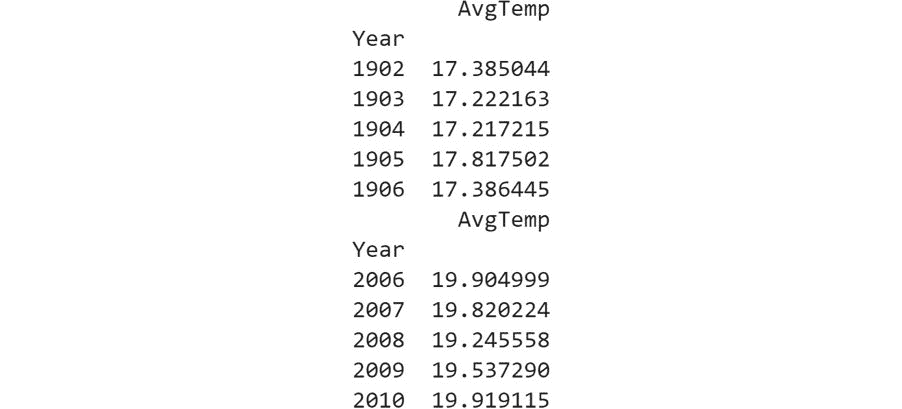
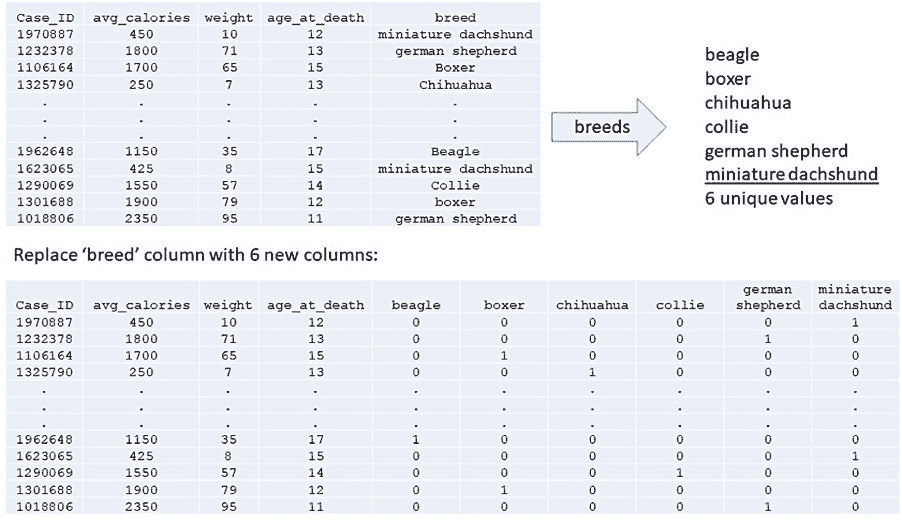
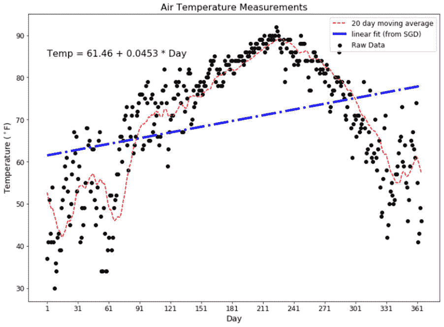

#### 第四章：3\. 线性回归

#### 概述

本章涵盖回归问题及其分析，介绍了线性回归、多个线性回归和梯度下降法。到本章结束时，你将能够区分回归问题和分类问题。你将能够在回归问题中实现梯度下降法，并将其应用于其他模型架构。你还将能够使用线性回归为 x-y 平面中的数据构建线性模型，评估线性模型的性能，并利用评估结果选择最佳模型。此外，你还将能够执行特征工程，创建虚拟变量，以构建复杂的线性模型。

#### 介绍

在第一章《基础知识》和第二章《探索性数据分析与可视化》中，我们介绍了 Python 中有监督机器学习的概念，以及加载、清理、探索和可视化原始数据源所需的基本技术。我们讨论了在进行进一步分析之前，全面理解数据的重要性，以及初步数据准备过程有时可能占据整个项目大部分时间的问题。特别地，我们考虑了所有变量之间的相关性、寻找并处理缺失值，以及通过直方图、条形图和密度图理解数据的形态。在本章中，我们将深入探讨模型构建过程，并使用线性回归构建我们的第一个有监督机器学习解决方案。

#### 回归与分类问题

我们在第一章《基础》中讨论了两种不同的方法：监督学习和无监督学习。监督学习问题旨在将输入信息映射到已知的输出值或标签，但还有两个子类别需要考虑。监督学习问题可以进一步分为回归问题或分类问题。本章的回归问题旨在预测或建模连续值，例如，从历史数据中预测明天的温度（以摄氏度为单位），或基于产品的销售历史预测未来的产品销售额。相对而言，分类问题则不是返回一个连续值，而是预测属于一个或多个指定类别或类的成员身份。第一章《基础》中提到的监督学习问题示例，就是想要判断发型是属于 1960 年代还是 1980 年代，这是一个良好的监督分类问题示例。在那里，我们试图预测发型是属于两个不同类别中的一个，其中类别 1 为 1960 年代，类别 2 为 1980 年代。其他分类问题包括预测泰坦尼克号乘客是否生还，或经典的 MNIST 问题（http://yann.lecun.com/exdb/mnist/）。(MNIST 是一个包含 70,000 张标注过的手写数字图像的数据库，数字从 0 到 9。MNIST 分类任务是从这 70,000 张输入图像中选取一张，预测或分类该图像中写的是哪一个数字（0 到 9）。该模型必须预测该图像属于 10 个不同类别中的哪一个。)

#### 机器学习工作流

在我们开始讨论回归问题之前，我们首先需要了解创建任何机器学习模型（无论是监督回归还是其他类型模型）所涉及的六个主要阶段。这些阶段如下：

商业理解

数据理解

数据准备

建模

评估

部署

该工作流由一个知名的开放行业标准 CRISP-DM（跨行业数据挖掘标准流程）描述，可以如下查看：

图 3.1：CRISP-DM 工作流

建议确保完全理解这个流程以及本节所描述的内容，因为每个阶段对于实现良好的模型性能和满足业务需求至关重要。在这里，我们回顾每个阶段的关键要素。

#### 商业理解

任何数据分析和建模项目的第一阶段并不是直接跳入数据或建模，而是理解我们为什么要分析这些数据，以及我们的模型和结论对业务的影响是什么。作为数据处理人员，你可能没有这阶段所需的全部领域知识；解决方案是花时间与业务中的利益相关者进行互动，他们了解痛点和业务目标。不要低估这一阶段的重要性。从流程图中还可以看到，业务理解阶段和数据理解阶段之间有反馈流动，评估阶段也会反馈到业务理解阶段。换句话说，这些都是持续进行的阶段，你应当尽力不断发现更多关于你所研究问题的业务方面的信息。在这一阶段的初步工作中，你还应该制定一个初步的整体项目计划。

#### 数据理解

在大多数实际项目中，可能会有多个潜在的数据来源，并且这些数据来源可能随着时间的推移而变化。本阶段的目的是获取数据，并对其有足够的了解，以便选择解决问题所需的数据。这可能导致确定需要更多数据。基本步骤是先确定初始可用数据，并制作数据清单。接着，审查数据，这可能包括将数据读取到 Python 中并评估数据质量；常见的问题如缺失值、异常值等可以在此阶段发现，并与业务团队讨论，确定最佳的处理方案。尽管流行文献中广泛描述了填补缺失值的方法，但你不应立即跳到使用工具“修复”数据中的问题——此阶段的目标是理解这些问题，并与业务利益相关者讨论合适的解决方案。请注意，可能比填补缺失值或进行填补过程更合适的做法是直接舍弃缺失值的数据实例。

除了数据清单外，本阶段的一个关键输出是描述数据、所发现内容和预期行动的报告。为了得到这个输出，需要进行一些 EDA（探索性数据分析），正如在第二章《探索性数据分析与可视化》中所描述的那样。

#### 数据准备

在数据准备阶段，我们使用从前一阶段确定为合适的数据，并对其进行清洗和转换，使其能够用于建模。这是第一章《基础》中的一个重要部分，因此在本节中不会进一步分析。然而，重要的是要充分理解数据规范、收集和清理/整理过程的关键性。如果输入数据不理想，我们无法期望产生高性能的系统。关于数据质量的一个常用词句是“垃圾进，垃圾出”。如果你使用低质量的数据，就会得到低质量的结果。在我们的发型示例中，我们希望样本大小至少为数百个，理想情况下应为数千个，并且这些样本已正确标注为 1960 年代或 1980 年代的样本。我们不希望使用错误标注或甚至不属于这两个年代的样本。

请注意，在数据准备过程中，完全有可能发现数据的额外方面，并且在此过程中可能需要进行额外的可视化，以便得到用于建模的数据集。

#### 建模

建模阶段包括两个子阶段：模型架构规范和模型训练。

模型架构规范：在更复杂的项目中，这些步骤可能是迭代相关的。在许多情况下，可能有多种模型类型（如线性回归、人工神经网络、梯度提升等）适用于当前问题。因此，有时调查不止一个模型架构是有益的，并且为了做到这一点，必须训练并比较这些模型的预测能力。

训练：建模的第二个子阶段是训练，在这个阶段，我们使用现有的数据和已知的结果，通过一个过程“学习”候选模型的参数。在这里，我们必须建立训练过程的设计和执行；这些细节将根据选择的模型架构和输入数据的规模而有所不同。例如，对于非常大的数据集，我们可能需要将数据流式传输或流动通过训练过程，因为数据太大，无法完全存入计算机内存，而对于较小的数据集，我们可以一次性使用所有数据。

#### 评估

工作流程的下一阶段是对模型进行评估，得出最终的性能指标。这是我们判断模型是否值得发布、是否比以前的版本更好，或者是否已经在不同的编程语言或开发环境之间有效迁移的机制。我们将在第七章《模型评估》中更详细地讨论一些这些指标，因此在此阶段不会详细展开。只需要记住，无论使用何种方法，都需要能够一致地报告并独立地衡量模型相对于指标的表现，且需要使用适当的样本来自数据中进行评估。

#### 部署

在一个完整的数据分析工作流程中，大多数模型一旦开发完成，就需要进行部署以供使用。部署在某些应用中至关重要，例如，在电子商务网站上，模型可能作为推荐系统的基础，每次更新时，模型必须重新部署到 Web 应用程序中。部署的形式多种多样，从简单地共享 Jupyter notebook，到在代码提交时自动更新网站代码，再到主仓库。尽管部署非常重要，但它超出了本书的范围，我们不会在接下来的内容中深入讨论。

在进入回归建模之前，让我们做一些最终的数据准备练习。为此，我们创建了一个合成的数据集，记录了从 1841 年到 2010 年的空气温度数据，该数据集可在本书附带的代码包中或在 GitHub 上找到，网址为 https://packt.live/2Pu850C。该数据集包含的数值旨在展示本章的主题，不能与科学研究中收集的数据混淆。

#### 练习 3.01：使用移动平均法绘制数据

正如我们在第一章《基础知识》中讨论的，以及在前面的章节中提到的，充分理解所使用的数据集对于构建高性能的模型至关重要。所以，考虑到这一点，让我们通过这个练习加载、绘制并查询数据源：

导入 numpy、pandas 和 matplotlib 包：

import numpy as np

import pandas as pd

import matplotlib.pyplot as plt

使用 pandas 的 read_csv 函数加载包含 synth_temp.csv 数据集的 CSV 文件，并显示前五行数据：

df = pd.read_csv('../Datasets/synth_temp.csv')

df.head()

输出将如下所示：

图 3.2：前五行

对于我们的目的，我们不希望使用所有这些数据，但让我们看一下每年有多少个数据点。创建一个打印语句，输出 1841 年、1902 年和 2010 年的点数，并制作一个简单的图表，显示每年的数据点数：

# 快速查看每年数据点的数量

print('There are ' + str(len(df.loc[df['Year'] == 1841])) \

+ ' points in 1841\n' + 'and ' \

+ str(len(df.loc[df['Year'] == 2010])) \

+ ' 2010 年的数据点\n' + '以及 ' \

+ str(len(df.loc[df['Year'] == 1902])) \

+ ' 1902 年的数据点']

# 看到每年有不同数量的数据点，做个快速图表看看

fig, ax = plt.subplots()

ax.plot(df['Year'].unique(), [len(df.loc[df['Year'] == i]) \

for i in df['Year'].unique()])

plt.show()

输出将如下所示：

图 3.3：每年数据点数量不同

我们看到每年的数据点数量不同。还需要注意的是，我们没有关于每年各个数据点测量时间的确切信息。如果这很重要，我们可能需要询问相关业务负责人是否能获得这些信息。

让我们切片 DataFrame，去除所有 1901 年及之前的数据，因为我们可以看到这些年份的数据较少：

# 从 1902 年开始切片

df = df.loc[df.Year > 1901]

df.head()

输出将如下所示：

图 3.4：1902 年及以后数据的子集

快速绘制图表以可视化数据：

# 快速绘制图表以了解目前为止的情况

fig, ax = plt.subplots()

ax.scatter(df.Year, df.RgnAvTemp)

plt.show()

输出将如下所示：

图 3.5：过滤日期后的原始数据基本可视化

我们可以看到每年有相当大的差异。将数据按年分组，使用 DataFrame 的 agg 方法来创建年度平均值。这绕过了我们每年都有多个未知日期的数据点的问题，但仍然使用了所有数据：

# 按年汇总

df_group_year = (df.groupby('Year').agg('mean')\

.rename(columns = {'RgnAvTemp' : 'AvgTemp'}))

print(df_group_year.head())

print(df_group_year.tail())

输出将如下所示：

图 3.6：每年平均数据

和以前一样，进行快速可视化，方法如下：

# 可视化按年份平均的结果

fig, ax = plt.subplots()

ax.scatter(df_group_year.index, df_group_year['AvgTemp'])

plt.show()

数据现在将如下所示：

图 3.7：每年平均数据

由于数据仍然有噪声，移动平均滤波器可以提供一个有用的整体趋势指示器。移动平均滤波器简单地计算最近 N 个值的平均值，并将此平均值分配给第 N 个样本。使用 10 年的窗口计算温度测量的移动平均值：

window = 10

smoothed_df = \

pd.DataFrame(df_group_year.AvgTemp.rolling(window).mean())

smoothed_df.colums = 'AvgTemp'

print(smoothed_df.head(14))

print(smoothed_df.tail())

我们将得到以下输出：

图 3.8：10 年移动平均温度

请注意，前 9 个样本为 NaN，这是因为移动平均滤波器窗口的大小。窗口大小是 10，因此需要 9 个样本（10-1）来生成第一个平均值，因此前 9 个样本为 NaN。rolling() 方法有额外的选项，可以将值延伸到左侧或右侧，或允许基于更少的点计算早期值。在这种情况下，我们将只过滤掉它们：

# 过滤掉 NaN 值

smoothed_df = smoothed_df[smoothed_df['AvgTemp'].notnull()]

# 快速绘制图表以了解目前的进展

fig, ax = plt.subplots()

ax.scatter(smoothed_df.index, smoothed_df['AvgTemp'])

plt.show()

输出如下：

图 3.9：预处理温度数据的可视化

最后，按年份绘制测量数据以及移动平均信号：

fig = plt.figure(figsize=(10, 7))

ax = fig.add_axes([1, 1, 1, 1]);

# 原始数据

raw_plot_data = df[df.Year > 1901]

ax.scatter(raw_plot_data.Year, \

raw_plot_data.RgnAvTemp, \

label = '原始数据', c = 'blue', s = 1.5)

# 年度平均

annual_plot_data = df_group_year\

.filter(items = smoothed_df.index, axis = 0)

ax.scatter(annual_plot_data.index, \

annual_plot_data.AvgTemp, \

label = '年度平均', c = 'k')

# 移动平均

ax.plot(smoothed_df.index, smoothed_df.AvgTemp, \

c = 'r', linestyle = '--', \

label = f'{window} 年移动平均')

ax.set_title('平均空气温度测量', fontsize = 16)

# 使刻度包括第一个和最后一个年份

tick_years = [1902] + list(range(1910, 2011, 10))

ax.set_xlabel('年份', fontsize = 14)

ax.set_ylabel('温度 ($^\circ$C)', fontsize = 14)

ax.set_xticks(tick_years)

ax.tick_params(labelsize = 12)

ax.legend(fontsize = 12)

plt.show()

输出如下：

图 3.10：年度平均温度与 10 年移动平均叠加图

我们可以通过调整 y 轴的尺度，专注于我们最感兴趣的部分——年度平均值，从而改进图表。这是大多数可视化中的一个重要方面，即尺度应优化以向读者传递最有用的信息：

fig = plt.figure(figsize=(10, 7))

ax = fig.add_axes([1, 1, 1, 1]);

# 原始数据

raw_plot_data = df[df.Year > 1901]

ax.scatter(raw_plot_data.Year, raw_plot_data.RgnAvTemp, \

label = '原始数据', c = 'blue', s = 1.5)

# 年度平均

annual_plot_data = df_group_year\

.filter(items = smoothed_df.index, axis = 0)

ax.scatter(annual_plot_data.index, annual_plot_data.AvgTemp, \

label = '年度平均', c = 'k')

# 移动平均

ax.plot(smoothed_df.index, smoothed_df.AvgTemp, c = 'r', \

linestyle = '--', \

label = f'{window} 年移动平均')

ax.set_title('平均空气温度测量', fontsize = 16)

# 使刻度包括第一个和最后一个年份

tick_years = [1902] + list(range(1910, 2011, 10))

ax.set_xlabel('年份', fontsize = 14)

ax.set_ylabel('温度 ($^\circ$C)', fontsize = 14)

ax.set_ylim(17, 20)

ax.set_xticks(tick_years)

ax.tick_params(labelsize = 12)

ax.legend(fontsize = 12)

plt.show()

最终图表应如下所示：

图 3.11：原始数据、年均值和平滑数据的最终图表

看图 3.11，我们可以立即得出几个有趣的观察结果。首先，温度从 1902 年到大约 1950 年保持相对一致，之后温度趋势上升直到数据结束。其次，测量值中即使在每年平均后仍然存在波动或噪声。第三，1960 年左右似乎有一个变化，这可能代表测量方法的变化或其他因素；我们可能需要与业务团队进一步沟通以更全面地了解这一点。

最后，请注意，在存在趋势的时期，移动平均值通常位于原始数据的右侧。这是滚动()方法中默认参数的直接结果；每个移动平均值是当前点和其左侧 9 个点的平均值。

#### 注意

要访问本节的源代码，请参阅 https://packt.live/316S0o6。

你也可以在 https://packt.live/2CmpJPZ 在线运行这个示例。你必须执行整个 Notebook 才能得到期望的结果。

#### 活动 3.01：使用移动平均绘制数据

在本次活动中，我们获取了来自德克萨斯州奥斯丁的天气信息数据集（austin_weather.csv），该数据集可以在随附的源代码中找到，我们将查看日均温度的变化情况。我们将为此数据集绘制一个移动平均滤波器。

#### 注意

原始数据集可以在这里找到：https://www.kaggle.com/grubenm/austin-weather

需要执行的步骤如下：

导入 pandas 和 matplotlib.pyplot。

将数据集从 CSV 文件加载到 pandas DataFrame 中。

我们只需要日期和 TempAvgF 列；请从数据集中删除所有其他列。

最初，我们只关注第一年的数据，因此需要提取该信息。

在 DataFrame 中创建一个列来存储年份值，并从 Date 列中的字符串中提取年份值，将这些值分配到 Year 列中。

重复此过程以提取月份值，并将这些值作为整数存储在 Month 列中。

再次重复此过程，将日值存储为 Day 列中的整数。

将第一年的数据复制到 DataFrame 中。

计算 20 天的移动平均滤波器。

绘制原始数据和移动平均信号，x 轴表示年份中的天数。

输出应如下所示：

图 3.12：温度数据叠加在 20 天移动平均线上

#### 注意

本活动的解答可以通过这个链接找到。

你已经学习了如何从 CSV 文件加载数据，如何删除不需要的列，如何从包含日期的文本字段中提取信息，如何使用移动平均法平滑数据，以及如何可视化结果。

#### 线性回归

我们将通过选择线性模型开始对回归模型的研究。线性模型是一个非常好的初步选择，因为它们具有直观的性质，而且在预测能力上也非常强大，前提是数据集包含一定程度的线性或多项式关系，输入特征和输出值之间有某种联系。线性模型的直观性质通常源于能够将数据绘制在图表上，并观察数据中呈现出的趋势模式，例如，输出（数据的 y 轴值）与输入（x 轴值）呈正相关或负相关。线性回归模型的基本组件通常也在高中数学课程中学习过。你可能还记得，直线的方程定义如下：

图 3.13：直线方程

在这里，x 是输入值，y 是相应的输出或预测值。模型的参数包括直线的斜率（y 值的变化除以 x 的变化，也叫梯度），在方程中用β1 表示，以及 y 截距值β1，表示直线与 y 轴交点的位置。通过这样的模型，我们可以提供β1 和β0 参数的值来构建一个线性模型。

例如，y = 1 + 2 * x 的斜率为 2，这意味着 y 值的变化速度是 x 值的两倍；该直线在 y 轴的截距为 1，以下图所示：

图 3.14：直线参数和线性模型

所以，我们了解了定义直线所需的参数，但这并没有做什么特别有趣的事情。我们只是规定了模型的参数来构建一条直线。我们想要做的是，使用一个数据集来构建一个最能描述该数据集的模型。根据上一节的内容，我们希望选择线性模型作为模型架构，然后训练模型来找到最佳的β0 和β1 值。如前所述，这个数据集需要具有某种程度的线性关系，才能使线性模型成为一个好的选择。

#### 最小二乘法

机器学习中使用的许多技术其实早在机器学习作为描述出现之前就已经存在。有些技术体现了统计学的元素，而其他技术则已经在科学中被用来“拟合”数据很长时间。最小二乘法用于找出最能代表一组数据的直线方程，这就是其中之一，最早创建于 19 世纪初。这种方法可以用来说明监督学习回归模型的许多关键概念，因此我们将在这里从它开始。

最小二乘法侧重于最小化预测的 y 值与实际 y 值之间的误差平方。最小化误差的思想是机器学习中的基本概念，也是几乎所有学习算法的基础。

尽管使用最小二乘法的简单线性回归可以写成简单的代数表达式，但大多数包（如 scikit-learn）在“幕后”会有更通用的优化方法。

#### Scikit-Learn 模型 API

Scikit-learn API 使用类似的代码模式，无论构建的是何种类型的模型。通用流程是：

导入你想要使用的模型类型的类。

在这里，我们将使用 `from sklearn.linear_model import LinearRegression`。

实例化模型类的一个实例。此处将设置超参数。对于简单的线性回归，我们可以使用默认值。

使用拟合方法并应用我们想要建模的 x 和 y 数据。

检查结果，获取指标，然后进行可视化。

让我们使用这个工作流程，在下一个练习中创建一个线性回归模型。

#### 练习 3.02：使用最小二乘法拟合线性模型

在本练习中，我们将使用最小二乘法构建第一个线性回归模型，来可视化每年时间范围内的气温，并使用评估指标评估模型的表现：

#### 注意

我们将使用与练习 3.01 中相同的 synth_temp.csv 数据集：使用移动平均法绘制数据。

从 scikit-learn 的 `linear_model` 模块导入 `LinearRegression` 类，并导入我们需要的其他包：

import pandas as pd

import matplotlib.pyplot as plt

`from sklearn.linear_model import LinearRegression`

加载数据。对于本练习，我们将使用之前使用的相同的合成温度数据：

# 加载数据

df = pd.read_csv('../Datasets/synth_temp.csv')

重复之前的数据预处理过程：

# 切片从 1902 年开始

df = df.loc[df.Year > 1901]

# 按年份进行汇总

df_group_year = df.groupby(['Year']).agg({'RgnAvTemp' : 'mean'})

df_group_year.head(12)

# 添加年列，以便我们可以在模型中使用它。

df_group_year['Year'] = df_group_year.index

df_group_year = \

df_group_year.rename(columns = {'RgnAvTemp' : 'AvTemp'})

df_group_year.head()

数据应如下所示：

](img/image-RJBJLLG8.jpg)

图 3.15：预处理后的数据

实例化 LinearRegression 类。然后，我们可以使用我们的数据来拟合模型。最初，我们只会将温度数据拟合到年份。在以下代码中，请注意该方法要求 x 数据为 2D 数组，并且我们仅传递了年份。我们还需要使用 reshape 方法，并且在 (-1, 1) 参数中，-1 表示“该值从数组的长度和剩余维度中推断出来”：

# 构建模型并检查结果

linear_model = LinearRegression(fit_intercept = True)

linear_model.fit(df_group_year['Year'].values.reshape((-1, 1)), \

df_group_year.AvTemp)

print('模型斜率 = ', linear_model.coef_[0])

print('模型截距 = ', linear_model.intercept_)

r2 = linear_model.score(df_group_year['Year']\

.values.reshape((-1, 1)), \

df_group_year.AvTemp)

print('r 平方 = ', r2)

#### 注意

有关 scikit-learn 的更多阅读，请参考以下链接： [`scikit-learn.org/stable/modules/generated/sklearn.linear_model.LinearRegression.html`](https://scikit-learn.org/stable/modules/generated/sklearn.linear_model.LinearRegression.html)

输出将如下所示：

](img/image-CEGQBU5B.jpg)

图 3.16：使用拟合方法的结果

注意使用 score 方法，这是模型对象的方法，用于获得 r2 值。这个度量叫做决定系数，是线性回归中广泛使用的度量。r2 越接近 1，说明我们的模型对数据的预测越精确。有多个公式可以用来计算 r2。这里有一个例子：

](img/image-ZH6EW0LQ.jpg)

图 3.17：r2 计算

从图 3.17 中，你可以通过注意到分子是预测误差的总和，而分母是数据与均值的变动之和，来对 r2 有一些理解。因此，随着预测误差的减小，r2 会增大。这里需要强调的是，r2 只是“拟合优度”的一个度量——在本例中，指的是简单的直线如何拟合给定的数据。在更复杂的现实世界监督学习问题中，我们会使用更稳健的方法来优化模型并选择最佳/最终模型。特别是，一般情况下，我们会在未用于训练的数据上评估模型，因为在训练数据上评估会给出过于乐观的性能度量。第七章《模型评估》将讨论这一点。

为了可视化结果，我们需要将一些数据传递给模型的 predict 方法。一个简单的方法是直接重用我们用来拟合模型的数据：

# 生成可视化预测

pred_X = df_group_year.loc[:, 'Year']

pred_Y = linear_model.predict(df_group_year['Year']\

.values.reshape((-1, 1)))

现在，我们已经拥有可视化结果所需的一切：

fig = plt.figure(figsize=(10, 7))

ax = fig.add_axes([1, 1, 1, 1]);

# 原始数据

raw_plot_data = df[df.Year > 1901]

ax.scatter(raw_plot_data.Year, raw_plot_data.RgnAvTemp, \

label = '原始数据', c = 'red', s = 1.5)

# 年度平均值

ax.scatter(df_group_year.Year, df_group_year.AvTemp, \

label = '年平均', c = 'k', s = 10)

# 线性拟合

ax.plot(pred_X, pred_Y, c = "blue", linestyle = '-.', \

linewidth = 4, label = '线性拟合')

ax.set_title('平均气温测量', fontsize = 16)

# 使刻度包含第一个和最后一个年份

tick_years = [1902] + list(range(1910, 2011, 10))

ax.set_xlabel('年份', fontsize = 14)

ax.set_ylabel('温度 ($^\circ$C)', fontsize = 14)

ax.set_ylim(15, 21)

ax.set_xticks(tick_years)

ax.tick_params(labelsize = 12)

ax.legend(fontsize = 12)

plt.show()

输出结果如下：

图 3.18：线性回归 - 第一个简单的线性模型

从图 3.18 中可以看出，直线并不是数据的一个很好的模型。我们将在一个活动之后回到这个问题。

#### 注意

要访问此特定部分的源代码，请参阅 https://packt.live/2NwANg1。

你也可以在 https://packt.live/2Z1qQfT 上在线运行这个示例。你必须执行整个 Notebook 才能得到预期的结果。

我们已经看到了如何加载一些数据，如何从 scikit-learn 导入 LinearRegression 类，并使用 fit、score 和 predict 方法构建模型，查看性能指标，并可视化结果。在此过程中，我们介绍了最小二乘法，给出了一些数学背景，并展示了部分计算过程。

我们看到，对于我们的合成温度数据，线性模型并不完全适合这些数据。没关系。在大多数情况下，早期生成一个基准模型是一个好习惯，这个模型可以作为更复杂模型性能的比较基准。因此，我们可以将这里开发的线性模型视为一个简单的基准模型。

在继续之前，需要注意的是，当报告机器学习模型的性能时，训练模型所使用的数据不能用于评估模型性能，因为这会给出模型性能的过于乐观的视角。我们将在第七章《模型评估》中讨论验证的概念，包括评估和报告模型性能。然而，本章中我们将使用训练数据来检查模型性能；只要记住，在完成第七章《模型评估》后，你会更清楚如何做。

#### 活动 3.02：使用最小二乘法进行线性回归

对于这个活动，我们将使用在前一个活动中使用的德克萨斯州奥斯汀的天气数据集。我们将使用最小二乘法为该数据集绘制线性回归模型。

要执行的步骤如下：

导入必要的包、类等。如果需要，请参阅练习 3.02：使用最小二乘法拟合线性模型。

从 csv 文件加载数据（austin_weather.csv）。

检查数据（使用 head() 和 tail() 方法）。

df.head()的输出将如下所示：

](img/image-UPOYLJPO.jpg)

图 3.19：df.head()的输出

df.tail()的输出将如下所示：

](img/image-LPNVRK9C.jpg)

图 3.20：df.tail()的输出

删除除 Date 和 TempAvgF 列以外的所有列。

创建新的 Year、Month 和 Day 列，并通过解析 Date 列来填充它们。

创建一个新的列用于移动平均，并用 TempAvgF 列的 20 天移动平均值填充它。

切割出一整年的数据用于模型训练。确保该年份的数据没有因移动平均而缺失。此外，创建一个 Day_of_Year 列（应从 1 开始）。

创建一个散点图，显示原始数据（原始 TempAvgF 列），并在其上叠加 20 天移动平均线。

绘图将如下所示：

](img/image-5VDXTR6A.jpg)

图 3.21：原始数据与叠加的 20 天移动平均

使用默认参数创建线性回归模型，即计算模型的 y 截距，并且不对数据进行归一化。

现在拟合模型，其中输入数据是年份的天数（1 到 365），输出是平均温度。打印模型的参数和 r² 值。

结果应如下所示：

模型斜率: [0.04304568]

模型截距: 62.23496914044859

模型 r² 值: 0.09549593659736466

使用相同的 x 数据从模型中生成预测。

创建一个新的散点图，像之前一样，添加模型预测的叠加图层。

](img/image-3A1PPP86.jpg)

图 3.22：原始数据、20 天移动平均和线性拟合

#### 注意

该活动的解决方案可以通过此链接找到。

基于之前的练习，你已经了解了如何加载并使用 scikit-learn 中的 LinearRegression 类，以及 fit、score 和 predict 方法。不出所料，产生直线的简单线性模型并不是该数据的最佳模型。在后续练习中，我们将探讨可能的改进方法。

你已经学会了如何加载数据、将其结构化以适应 scikit-learn API，并使用 LinearRegression 类将一条简单的直线拟合到数据上。显然，这对该数据来说是一个不理想的模型，因此我们将探索改进模型的方法，从下一个话题“具有分类变量的线性回归”开始。

#### 具有分类变量的线性回归

模型架构选择阶段有一个方面与数据准备阶段有些重叠：特征工程。广义上讲，特征工程涉及创建附加的特征（在我们这里是列），并将它们用于模型中以提高模型性能。特征可以通过转换现有特征（例如取对数或平方根）来工程化，或者以某种方式生成并添加到数据集中。举个后者的例子，我们可以从数据集中的日期信息中提取出月份、日期、星期几等。虽然像月份这样的新特征可以是一个数值，但在大多数监督学习的情况下，简单地使用这种特征的数值并不是最佳实践。一个简单的思路是：如果我们将 1 月到 12 月编码为 1 到 12，那么模型可能会给 12 月更多的权重，因为 12 月比 1 月大 12 倍。此外，当日期从 12 月切换回 1 月时，值会发生人为的阶跃变化。因此，这样的特征被认为是名义类别的。名义类别变量是具有多个可能值的特征，但这些值的顺序不包含任何信息，甚至可能会误导。还有一些类别变量确实有隐含的顺序，它们被称为有序类别变量。例如，“小”、“中”、“大”、“特大”和“巨大”等。

为了处理大多数机器学习模型中的任何类型的类别数据，我们仍然需要将其转换为数字。这种转换的通用方法叫做编码。一种非常强大但易于理解的编码方法是使用独热编码将类别特征转换为数值。

使用独热编码时，类别特征的每个可能值都会变成一列。在对应于给定值的列中，如果该数据实例在该值下具有该特征，则输入 1，否则输入 0。一个例子会让这一点更加清晰，如下图所示：

图 3.23：名义类别列的独热编码

因此，通过创建这些列并在适当的位置插入 1，我们让模型“知道”名义类别变量的存在，但不会对任何特定值赋予额外的权重。在图 3.23 中的例子中，如果我们试图模拟狗的预期寿命，在使用独热编码之前，我们只有饮食和体重作为预测因素。应用独热编码后，我们预计能够得到一个更好的模型，因为我们的直觉是：在其他因素相等的情况下，一些犬种比其他犬种活得更久。在接下来的练习中，我们将看到如何使用编码来利用线性模型的强大能力来模拟复杂的行为。

#### 注意

还有许多其他可能的编码分类变量的方法；例如，参见《神经网络分类器的分类变量编码技术比较研究》：https://pdfs.semanticscholar.org/0c43/fb9cfea23e15166c58e24106ce3605b20229.pdf

在某些情况下，最佳方法可能取决于所使用的模型类型。例如，线性回归要求特征之间没有线性依赖（我们将在本章后面进一步讨论）。独热编码实际上会引入这个问题，因为第 n 类别实际上可以通过其他 n-1 类别来确定——直观地，在图 3.23 中，如果比格犬、拳师犬、吉娃娃、柯利犬和德国牧羊犬都是 0，那么迷你杜宾犬就是 1（假设一个实例不可能有多个有效类别）。因此，在进行线性回归时，我们使用稍有不同的编码方法，即虚拟变量。虚拟变量和独热编码的唯一区别是我们去掉了 n 个列中的一个，从而消除了依赖关系。

#### 练习 3.03：引入虚拟变量

在本练习中，我们将向线性回归模型中引入虚拟变量，以提高其性能。

我们将使用与之前练习相同的 synth_temp 数据集：

导入所需的包和类：

import pandas as pd

import numpy as np

import matplotlib.pyplot as plt

from sklearn.linear_model import LinearRegression

加载数据：

# 加载数据

df = pd.read_csv('../Datasets/synth_temp.csv')

从 1902 年起切片数据框，然后计算每年的平均值：

# 从 1902 年起切片

print(df.head())

df = df.loc[df.Year > 1901]

print(df.head())

输出将如下所示：

图 3.24：切片 1902 后的输出

# 按年份汇总

df_group_year = df.groupby(['Year', 'Region'])\

.agg({'RgnAvTemp':'mean'})

"""

注意，.droplevel() 方法会移除多重索引

通过 .agg() 方法添加（）以简化操作

后续分析中

"""

print(df_group_year.head(12))

print(df_group_year.tail(12))

数据应如下所示：

图 3.25：按地区划分的年均温度

使用索引（即年份）级别 0 和地区列（即索引级别 1）来添加 Year 列和 Region 列：

# 添加地区列，以便我们可以用它来创建虚拟变量

df_group_year['Region'] = df_group_year.index.get_level_values(1)

# 添加 Year 列，以便我们可以在模型中使用它

df_group_year['Year'] = df_group_year.index.get_level_values(0)

# 重置长轴上的索引

df_group_year = df_group_year.droplevel(0, axis = 0)

df_group_year = df_group_year.reset_index(drop = True)

也许温度水平或变化因地区而异。让我们看一下每个地区的整体平均温度：

# 按地区检查数据

region_temps = df_group_year.groupby('Region').agg({'RgnAvTemp':'mean'})

colors = ['red', 'green', 'blue', 'black', 'lightcoral', \

'palegreen','skyblue', 'lightslategray', 'magenta', \

'chartreuse', 'lightblue', 'olive']

fig = plt.figure(figsize=(10, 7))

ax = fig.add_axes([1, 1, 1, 1])

ax.bar(region_temps.index, region_temps.RgnAvTemp, \

color = colors, alpha = 0.5)

ax.set_title('平均空气温度测量值', fontsize = 16)

ax.set_xlabel('区域', fontsize = 14)

ax.set_ylabel('温度 ($^\circ$C)', fontsize = 14)

ax.tick_params(labelsize = 12)

plt.show()

结果应如下所示：

图 3.26: 各区域的整体平均温度

我们看到，平均而言，区域之间的温差可达 5 度。因此，考虑区域可能对模型有益。为此，我们将从 Region 列创建虚拟变量。

Pandas 有一个名为 get_dummies() 的 DataFrame 方法，我们可以用它来满足我们的需求。首先，我们创建一个包含新列的新 DataFrame。请注意，它们已经填充了零和一。然后，我们将虚拟变量列与数据合并，并删除 Region 列，因为它现在是冗余的：

# 将分类变量 'region' 转换为虚拟变量

dummy_cols = pd.get_dummies(df_group_year.Region, \

drop_first = True)

df_group_year = pd.concat([df_group_year, dummy_cols], axis = 1)

print(df_group_year.head())

print(df_group_year.tail())

结果应如下所示：

图 3.27: 添加区域的虚拟变量

请注意，在 get_dummies 方法中，我们设置了 drop_first = True 参数以删除其中一列，正如前面讨论的那样。

我们现在创建一个线性模型，和之前一样，使用 Year 列和所有虚拟列：

linear_model = LinearRegression(fit_intercept = True)

linear_model.fit(df_group_year.loc[:, 'Year':'L'], \

df_group_year.RgnAvTemp)

r2 = linear_model.score(df_group_year.loc[:, 'Year':'L'], \

df_group_year.RgnAvTemp)

print('r 平方 ', r2)

输出结果如下：

r 平方 0.7778768442731825

r2 值比之前高得多，看起来很有前景。从包含虚拟变量的 DataFrame 生成预测结果，然后将所有内容可视化到图表中：

# 构建用于预测的模型数据

pred_X = df_group_year.drop(['RgnAvTemp', 'Region'], axis = 1)

pred_Y = linear_model.predict(pred_X.values)

preds = pd.concat([df_group_year.RgnAvTemp, \

df_group_year.Region, \

pred_X, pd.Series(pred_Y)], axis = 1)

preds.rename(columns = {0 : 'pred_temp'}, inplace = True)

print(preds.head())

数据应如下所示：

图 3.28: 新模型的预测结果

为了绘图，我们通过从预测结果中抽样来减少杂乱：

# 定义原始数据和预测值的样本

# 设置随机种子，以确保结果可重复

np.random.seed(42)

plot_data = preds.sample(n = 100)

fig = plt.figure(figsize=(10, 7))

ax = fig.add_axes([1, 1, 1, 1])

# 原始数据

raw_plot_data = plot_data

ax.scatter(raw_plot_data.Year, raw_plot_data.RgnAvTemp, \

label = 'Raw Data', c = 'red', s = 1.5)

# 年度平均值

annual_plot_data = df_group_year.groupby('Year').agg('mean')

ax.scatter(annual_plot_data.index, annual_plot_data.RgnAvTemp, \

label = 'Annual average', c = 'k', s = 10)

让我们也可视化线性拟合结果：

fit_data = plot_data

for i in range(len(plot_data.Region.unique())):

region = plot_data.Region.unique()[i]

plot_region = fit_data.loc[fit_data.Region == region, :]

ax.scatter(plot_region.Year, plot_region.pred_temp, \

edgecolor = colors[i], facecolor = "none", \

s = 80, label = region)

# 绘制连接原始数据和预测值的虚线

for i in fit_data.index:

ax.plot([fit_data.Year[i], fit_data.Year[i]], \

[fit_data.pred_temp[i], fit_data.RgnAvTemp[i]], \

'-', linewidth = 0.1, c = "red")

ax.set_title('Mean Air Temperature Measurements', fontsize = 16)

# 使刻度包括第一年和最后一年

tick_years = [1902] + list(range(1910, 2011, 10))

ax.set_xlabel('Year', fontsize = 14)

ax.set_ylabel('Temperature ($^\circ$C)', fontsize = 14)

ax.set_ylim(15, 21)

ax.set_xticks(tick_years)

ax.tick_params(labelsize = 12)

ax.legend(fontsize = 12)

plt.show()

#### 注意

为确保无错误执行，您应在编写步骤 9 和 10 的代码后再运行该单元。

绘制结果应如下所示：

图 3.29：新模型的预测

我们可以看到，模型正在为不同区域预测不同的水平，尽管仍未完全跟随趋势，但相比之前，它已能解释更多的变异性。

现在让我们通过绘制一个区域来结束，以便了解模型的效果：

# 我们先绘制一个区域

region_B = preds.loc[preds.B == 1, :]

np.random.seed(42)

plot_data = region_B.sample(n = 50)

fig = plt.figure(figsize=(10, 7))

ax = fig.add_axes([1, 1, 1, 1])

# 原始数据

ax.scatter(plot_data.Year, plot_data.RgnAvTemp, \

label = 'Raw Data', c = 'red', s = 1.5)

ax.scatter(plot_data.Year, plot_data.pred_temp, \

label = "Predictions", facecolor = "none", \

edgecolor = "blue", s = 80)

绘制连接原始数据和预测值的虚线：

for i in plot_data.index:

ax.plot([plot_data.Year[i], plot_data.Year[i]], \

[plot_data.pred_temp[i], plot_data.RgnAvTemp[i]], \

'-', linewidth = 0.1, c = "red")

# 使刻度包括第一年和最后一年

tick_years = [1902] + list(range(1910, 2011, 10))

ax.set_xlabel('Year', fontsize = 14)

ax.set_ylabel('Temperature ($^\circ$C)', fontsize = 14)

ax.set_ylim(16, 21)

ax.set_xticks(tick_years)

ax.tick_params(labelsize = 12)

ax.legend(fontsize = 12)

plt.show()

#### 注意

为确保无错误执行，您应在编写步骤 11 和 12 的代码后再运行该单元。

结果应如下所示：

图 3.30：B 区域的预测

#### 注意

若要访问此特定部分的源代码，请参见 https://packt.live/2YogxDt。

你也可以通过 https://packt.live/311LDCx 在线运行这个示例。你必须执行整个 Notebook 才能获得所需结果。

我们现在有了一个改进的模型，它能够跟随数据的大部分变化。然而，我们可以看到，仍然没有捕捉到大约在 1960 年左右出现的趋势变化。为了解决这个问题，我们将探索使用线性回归通过使用 x 数据的幂（即多项式模型）来拟合模型。首先，你将通过使用奥斯汀温度数据集来练习使用虚拟变量。

#### 活动 3.03：虚拟变量

对于这项活动，我们将使用在前一项活动中使用的奥斯汀（德州）天气数据集。在本次活动中，我们将使用虚拟变量来增强该数据集的线性回归模型。

需要执行的步骤如下：

从 scikit-learn 加载 LinearRegression 类，以及 fit、score 和 predict 方法，还需要导入 pandas 和 matplotlib.pyplot。

加载 austin_weather.csv 数据集，删除除 Date 和 TempAvgF 列以外的所有列，并从数据中创建 Year、Month 和 Day 列。

创建一个 20 天的移动平均列并填充数据，然后切片出完整的第一年数据（从第 1 天到第 365 天—即 2015 年）。切片后，重置数据框的索引（使用 Pandas 核心方法 reset_index）。现在，创建一个 Day_of_Year 列并填充数据（请记住，第一天应为 1，而不是 0）。

绘制原始数据和移动平均线相对于 Day_of_Year 的图表。

图表应如下所示：

图 3.31：奥斯汀气温和移动平均线

现在，研究将月份添加到模型中是否能够改进模型。为此，使用 pandas 的 get_dummies 方法对数据框的 Month 列创建一个 dummy_vars 数据框，并将虚拟列重命名为 Jan 至 Dec。现在，将 dummy_vars 合并到新的数据框 df_one_year 中。

显示数据框并确认虚拟列已存在。

使用最小二乘法线性回归模型，并将模型拟合到 Day_of_Year 值和虚拟变量上，以预测 TempAvgF。

获取模型参数和 r2 值。r2 值应该比前一项活动中的值大得多。

使用 Day_of_Year 值和虚拟变量，预测 df_one_year 数据中的温度。

绘制原始数据、20 天移动平均线和新的预测值。

输出将如下所示：

图 3.32：使用月份虚拟变量的线性回归结果

#### 注意

本次活动的解决方案可以通过此链接找到。

你已经学习了如何使用 scikit-learn API 中的 LinearRegression 类来拟合包含虚拟变量的数据。使用 get_dummies pandas 方法生成了额外的变量列来编码月份，以改进模型。新模型的一个有用特性是，它考虑了温度的季节性变化，以及任何整体趋势。然而，它是相当分段的，这可能不完全符合预测的业务需求。

到目前为止，你应该已经对基本的线性回归以及使用 scikit-learn 接口和 get_dummies pandas 方法感到熟悉。我们还介绍了一些可视化的要点，并在使用虚拟变量的背景下引入了特征工程的概念。接下来我们将介绍多项式回归，它将特征工程带入一个不同的方向，同时仍然利用线性回归的强大功能。

#### 线性回归的多项式模型

线性回归模型并不限于直线线性模型。我们可以使用完全相同的技术拟合一些更复杂的模型。在合成的温度数据中，我们可以看到趋势的上升曲线。因此，除了任何整体（随时间变化的线性）趋势外，可能还存在与时间的正幂相关的趋势。如果我们使用自变量的整数幂来构建模型，这就叫做多项式回归。对于幂次为 2 的情况，方程式如下所示。注意，我们将多项式的阶数称为最高幂次，因此这是一个阶数为 2 的多项式：

图 3.33：二阶多项式的方程

添加这个平方项将趋势线从直线转变为具有曲率的线。一般来说，多项式模型在拟合给定数据时可能非常强大，但它们可能无法很好地在数据范围之外进行外推。这将是过拟合的一个例子，尤其是在多项式阶数增加时，这一点尤为明显。

因此，通常情况下，除非有明确的业务需求或已知的潜在模型表明需要采取不同方法，否则你应该有限地使用多项式回归，并保持阶数较低：

图 3.34：二阶多项式的 y 与 x 的关系图

注意，这里我们正在查看一个简单的模型，其中只有一个特征变量 x。在更复杂的情况下，我们可能有多个特征。随着特征数量的增加，方程中的项数会迅速增加。为了构建多项式，像 scikit-learn 这样的回归包提供了自动生成多项式特征的方法（例如，sklearn.preprocessing.PolynomialFeatures）。在这里，我们将手动构建一个简单的多项式模型，以说明这一方法。

#### 练习 3.04：线性回归的多项式模型

为了使用线性回归拟合多项式模型，我们需要创建提升到所需幂次的特征。回顾一下之前关于特征工程的讨论；我们将创建新的特征，即将原始自变量提升到一个幂次：

从 synth_temp.csv 数据开始，加载包和类，然后像以前一样预处理数据：

import pandas as pd

import matplotlib.pyplot as plt

from sklearn.linear_model import LinearRegression

# 加载数据

df = pd.read_csv('../Datasets/synth_temp.csv')

# 从 1902 年及以后开始切片

df = df.loc[df.Year > 1901]

# 按年汇总

df_group_year = df.groupby(['Year']).agg({'RgnAvTemp' : 'mean'})

现在，我们使用索引添加 Year 列，然后通过将 Year 列的值平方来计算 Year2 列：

# 添加 Year 列，以便我们可以在模型中使用它

df_group_year['Year'] = df_group_year.index

df_group_year = df_group_year\

.rename(columns = {'RgnAvTemp' : 'AvTemp'})

# 添加一个 Year**2 列，构建二次多项式模型

df_group_year['Year2'] = df_group_year['Year']**2

print(df_group_year.head())

print(df_group_year.tail())

结果如下：

图 3.35：带有年份和年份平方的年度温度数据

将数据拟合到模型中。这次，我们需要提供两组值作为模型的输入，Year 和 Year2，相当于将 x 和 x2 传递给多项式方程。由于我们提供了两列数据，因此不需要重塑输入数据，它将默认作为一个 N x 2 的数组提供。目标 y 值保持不变：

# 构建模型并检查结果

linear_model = LinearRegression(fit_intercept = True)

linear_model.fit(df_group_year.loc[:, ['Year', 'Year2']], \

df_group_year.AvTemp)

print('模型系数 = ', linear_model.coef_)

print('模型截距 = ', linear_model.intercept_)

r2 = linear_model.score(df_group_year.loc[:, ['Year', 'Year2']], \

df_group_year.AvTemp)

print('r 平方 = ', r2)

输出结果如下：

模型系数 = [-1.02981369e+00 2.69257683e-04]

模型截距 = 1002.0087338444181

r 平方 = 0.9313996496373635

该模型在虚拟变量方法上有所改进，但让我们通过可视化结果来看看它是否更合理。首先，生成预测结果。这里，我们额外采取一步，将预测延伸到未来 10 年，看看这些预测是否合理。在大多数监督学习问题中，最终目标是预测以前未知的数据值。由于我们的模型仅使用 Year 和 Year2 变量，我们可以生成一个年份值的列表，然后像之前一样平方它们，预测未来 10 年的温度：

# 生成可视化的预测

pred_X = df_group_year.loc[:, ['Year', 'Year2']]

pred_Y = linear_model.predict(pred_X)

# 生成未来 10 年的预测

pred_X_future = pd.DataFrame(list(range(2011, 2021)))\

.rename(columns = {0 : 'Year'})

pred_X_future['Year2'] = pred_X_future['Year']**2

pred_Y_future = linear_model.predict(pred_X_future)

现在，创建一个可视化：

fig = plt.figure(figsize=(10, 7))

ax = fig.add_axes([1, 1, 1, 1]);

# 原始数据

raw_plot_data = df

ax.scatter(raw_plot_data.Year, raw_plot_data.RgnAvTemp, \

label = '原始数据', c = 'red', s = 1.5)

# 年度平均

ax.scatter(df_group_year.Year, df_group_year.AvTemp, \

label = '年度平均', c = 'k', s = 10)

# 线性拟合

ax.plot(pred_X.Year, pred_Y, c = "blue", linestyle = '-.', \

linewidth = 4, label = '线性拟合')

可视化未来预测：

ax.plot(pred_X_future.Year, pred_Y_future, c = "purple", \

linestyle = '--', linewidth = 4, \

label = '未来预测')

ax.set_title('平均气温测量', fontsize = 16)

# 使得刻度包含首尾年份

tick_years = [1902] + list(range(1910, 2021, 10))

ax.set_xlabel('年份', fontsize = 14)

ax.set_ylabel('温度 ($^\circ$C)', fontsize = 14)

ax.set_ylim(15, 21)

ax.set_xticks(tick_years)

ax.tick_params(labelsize = 12)

ax.legend(fontsize = 12)

plt.show()

结果如下：

图 3.36：使用二次多项式模型的线性回归

#### 注意

要访问此特定部分的源代码，请参考 https://packt.live/3fSusaR.

你也可以在线运行这个例子，访问 https://packt.live/2BulmCd。你必须执行整个笔记本才能获得期望的结果。

参考图 3.36，我们可以看到使用多项式模型的性能优势，趋势线几乎跟随 10 年移动平均。这是一个相对较好的拟合，因为每年平均的原始数据有一定噪声。在这种情况下，不应期望模型能够完美地拟合数据。如果我们的模型能够完美地拟合观察到的样本，那么就有很强的过拟合数据的风险，导致对未知样本的预测能力差。例如，假设我们对这些数据进行了 10 阶多项式拟合。结果模型会在数据点上上下波动，最后一个数据点可能会非常陡峭地上升或下降，这将导致糟糕的预测。在这种情况下，使用二阶多项式拟合，我们可以看到未来的趋势似乎是合理的，尽管这仍然需要验证。

#### 活动 3.04：使用线性回归进行特征工程

我们尝试了标准线性模型以及包含虚拟变量的模型。在这项工作中，我们将创建一些周期特征，试图更好地拟合数据。周期特征源自在独立变量某个范围内重复的函数。在图 3.37 中，我们可以看到，年初的数据接近相同的值，而在中间，温度先升高然后降低。这在直觉上是合理的，因为我们知道在温带气候中，存在一年一度的温度周期。因此，如果我们在 1 年的时间尺度上包含周期性特征，可能会改进模型。我们可以构造正弦和余弦函数，其行为符合所需。

当拟合一个含有工程周期特征的模型时，我们面临一个额外的挑战，即确定如何将特征的周期循环与实际数据对齐。在这种情况下，您可以将其视为时间偏移量，这是我们事先不知道的。您也可以将偏移量视为超参数——拟合模型并不会给出这个值，因此我们必须以其他方式找到最佳值。在下图中，所需的偏移量为Δt：

图 3.37：展示随时间周期性行为的一些数据及适合数据的候选函数

幸运的是，如果我们使用正弦和余弦函数作为我们的特征，有一种方法可以解决这个问题。这是一个数学事实，即任何给定的正弦函数在单一周期内（如图 3.37 中的原始数据）可以表示为相同周期的正弦和余弦函数的线性组合。在下一张图中，我们展示了一个周期为 365 天的正弦和余弦函数以及图 3.37 中的原始数据。我们还展示了与原始数据非常匹配的正弦和余弦函数的线性组合。因此，要将正弦（或余弦）函数拟合到我们的数据中，我们只需设计两个特征，一个是时间的正弦值，另一个是时间的余弦值。线性回归然后将找到最佳系数，就像处理任何其他特征一样。请注意，这意味着我们知道周期是多少：

图 3.38：正弦和余弦函数的线性组合将匹配一个经未知时间偏移量移动的正弦函数

我们最后需要知道的是如何构建正弦和余弦函数。为此，我们可以使用 NumPy 方法 sin 和 cos。我们知道我们需要 1 年的周期，而我们的数据是按天计算的。编写一个具有 365 天周期的正弦函数的正确方法如下所示：

图 3.40：一个周期为 365 天的 Python 系列

现在，让我们继续进行使用周期函数来拟合奥斯汀温度数据的活动。要执行的步骤如下：

加载软件包和类（numpy、pandas、LinearRegression 和 matplotlib）。

执行与之前相同的预处理，直到创建 Day_of_Year 列的步骤。

添加一个 Day_of_Year 的正弦列和一个余弦列。

对平均温度与 Day_of_Year 以及正弦和余弦特征进行线性回归。

打印模型的参数和 r2 分数。

使用新特征生成预测。

可视化原始数据和新模型。

输出如下：

图 3.41：在线性回归模型中使用正弦和余弦特征的预期结果

到目前为止，您已经了解到我们可以通过将函数应用于现有特征来工程化特征，例如多项式函数或周期函数。您已经看到如何使用正弦和余弦函数构建周期函数以适应任意正弦或余弦函数。在这种情况下，我们假设了 365 天的周期，这是基于地球温带地区的年度气候周期而合理的。在实际业务案例中，我们可能不确定周期，或者可能同时存在多个周期（例如销售中的每周、每月和每季度周期）。此外，使用多项式和正弦/余弦等函数很容易导致过拟合，从而导致非常差的外推。

#### 注意

您可以通过此链接找到此活动的解决方案。

在图 3.41 中，我们看到新模型在一年内平稳变化，并在年末返回接近年初的值。由于我们已经知道一年中存在总体趋势，这个模型因包含 Day_of_Year 特征，显示出年末的温度比年初略高。在特征工程方面，我们可以考虑使用日期（将其转换为整数）并在超过 1 年的数据上拟合模型，以捕捉长期趋势。

#### 通用模型训练

构建线性回归模型的最小二乘法是一种有用且准确的训练方法，假设数据集的维度较低，并且系统内存足够大以管理数据集。

近年来，大型数据集变得更加容易获取，许多大学、政府，甚至一些公司都将大型数据集免费发布到网上；因此，在使用最小二乘法回归建模时，可能会相对容易超过系统内存。在这种情况下，我们需要采用不同的训练方法，比如梯度下降，这种方法不容易受到高维度的影响，可以处理大规模数据集，并且避免使用内存密集型的矩阵运算。

在我们更详细地探讨梯度下降之前，我们将以更一般的形式回顾一下模型训练的过程，因为大多数训练方法，包括梯度下降，都是遵循这个通用过程的。以下是模型训练过程中的参数更新循环概述：

图 3.42：通用模型参数更新循环

训练过程包括将模型及其参数（包括超参数）反复暴露于一组样本训练数据，并将模型预测出的值传递给指定的代价或误差函数。代价函数与某些超参数一起，决定了如何计算“更新参数”模块中的更新，如图 3.42 所示。

代价函数用于确定模型与目标值之间的接近程度，并作为训练过程中进展的衡量标准。然而，代价函数也与一些超参数一起用于确定参数更新。例如，在我们的线性回归案例中，代价函数是均方误差。

最小二乘法，我们展示为构建线性回归模型的一种方法，最小化均方误差（MSE），因此称为最小二乘法。因此，我们可以将训练过程的图示更新为以下内容：

图 3.43：通用训练过程

#### 梯度下降

梯度下降的过程可以总结为一种根据系统中的误差，通过代价函数更新模型参数的方式。可以选择多种代价函数，具体取决于拟合的模型类型或解决的问题。我们将选择简单但有效的均方误差代价函数。

回想一下，直线方程可以写作如下：

图 3.44：直线方程

下图展示了代价函数 J 在 β0 和 β1 范围值下的图像。最优的参数集是代价函数最小的参数，这个点被称为代价函数的全局最小值。我们可以将其类比为在徒步旅行中寻找山谷中最低点的过程。直观地说，不管我们站在何处，如果不在底部，那么我们正站在斜坡上，要到达底部，就需要朝下坡走。因此，斜坡就是梯度，而找到最小值的过程就是梯度下降：

图 3.45：简单的两参数线性回归中梯度下降的可视化表现

如前图所示，在每个训练周期中，参数 β0 和 β1 会更新，以朝着最陡峭的斜坡（梯度）方向移动，最终找到 J(β) 的最小值。

让我们更详细地了解梯度下降算法：

梯度下降从对所有 β 值进行初始随机猜测开始。注意，在某些模型中，这一步骤，称为初始化，可能会通过选择某个特定的分布来约束初始值的采样。初始化的选择可以被视为一个超参数，并且可能会影响最终结果，尤其是在像人工神经网络这样的复杂模型中。大多数 Python 实现的方法都有很好的默认值，使用默认值是很常见的做法。

使用 β 的随机值为训练集中的每个样本做出预测，然后计算代价函数 J(β)。

然后，β 值会被更新，进行一个与误差成比例的小调整，以尽量减少误差。通常，尝试直接从当前 β 值跳到能够最小化 J(β) 的值并不是最好的方法，因为如图 3.45 所示，损失面可能并不平滑。大多数实际的损失面，即使在三维空间中，也有多个峰值和谷值。对于更复杂的代价函数面，存在多个最小值，称为局部最小值，所有最小值中的最低点就是全局最小值。非凸代价函数可能会在找到全局最小值时带来挑战，研究界在高效寻找非凸表面全局最小值方面投入了大量努力。超参数学习率，用 γ 表示，用于在每次训练时调整步长。

该过程在以下图表中进行了可视化，简化为二维：

图 3.46：梯度下降过程

在这个简化的情况下，使用较低的学习率导致路径 A，并且我们陷入局部最小值。路径 C 是由于非常高的学习率而不收敛。路径 B 使用中间的学习率值，并收敛到全局最小值。

作为设置学习率的一般提示，开始较大，例如约为 0.1，如果找不到解决方案，即错误为 NaN 或波动剧烈，则将学习率降低为 10 的因子。一旦找到允许误差随着 epoch 相对平稳下降的学习率，可以测试其他超参数，包括学习率，以达到最佳结果。

尽管这个过程听起来复杂，但实际上并不像看起来那么可怕。梯度下降可以通过一次性猜测参数值、计算猜测误差、对参数进行微小调整并持续重复此过程直到误差在最小值处收敛来概括。为了加强我们的理解，让我们看一个更具体的例子。我们将使用梯度下降来训练我们在练习 3.02 中构建的原始线性回归模型：使用最小二乘法拟合线性模型，将最小二乘法替换为梯度下降。

#### 练习 3.05：使用梯度下降进行线性回归

在这个练习中，我们将手动实现梯度下降算法。我们将使用如前所述的 synth_temp.csv 数据：

与之前一样导入包和类：

import pandas as pd

import numpy as np

import matplotlib.pyplot as plt

from sklearn.metrics import r2_score

在我们开始梯度下降过程之前，我们需要实现一些关键函数。

编写一个函数来定义我们的线性模型。这里使用线性代数乘法将参数（β）和输入值 x 之间的乘积形式，这是使用简化形式的线性模型的优势所在。

# 模型函数

def h_x(Beta, X):

# 计算 X 和 Betas 的矩阵点积

返回 np.dot(Beta, X).flatten()

我们还需要编写一个评估成本函数 J(β) 的函数：

# 成本函数

def J_beta(pred, true):

# 均方误差

return np.mean((pred - true) ** 2)

最后，我们需要实现更新参数的函数：

# 更新函数

def update(pred, true, X, gamma):

返回 gamma * np.sum((true - pred) * X, axis = 1)

接下来，加载数据，从 1902 年起切片，计算年均值，并添加年份列：

# 载入数据

df = pd.read_csv('../Datasets/synth_temp.csv')

# 切片 1902 年及以后

df = df.loc[df.Year > 1901]

# 按年份卷起

df_group_year = df.groupby(['Year']).agg({'RgnAvTemp' : 'mean'})

# 添加年份列以便在模型中使用

df_group_year['Year'] = df_group_year.index

df_group_year = \

df_group_year.rename(columns = {'RgnAvTemp' : 'AvTemp'})

现在，我们将构建训练数据。首先，我们需要在使用梯度下降之前，将数据缩放到 0 到 1 之间。某些机器学习算法可以处理原始数据（如常规线性回归），但在使用梯度下降时，如果变量的尺度差异很大，那么某些参数的梯度值将远大于其他参数的梯度值。如果数据没有缩放，原始数据可能会扭曲成本函数表面上的下降，从而偏移结果。直观地讲，在我们的例子中，Year 数据的量级是千，而 AvTemp 数据的量级是十。因此，Year 变量会在参数的影响力上占主导地位。

机器学习中使用了多种缩放方法。例如，将数据归一化到特定范围（如（0, 1）或（-1, 1）），以及标准化（将数据缩放到均值为 0，标准差为 1）。在这里，我们将 x 和 y 数据归一化到范围（0, 1）：

# 对数据进行缩放并添加 X0 序列

X_min = df_group_year.Year.min()

X_range = df_group_year.Year.max() - df_group_year.Year.min()

Y_min = df_group_year.AvTemp.min()

Y_range = df_group_year.AvTemp.max() - df_group_year.AvTemp.min()

scale_X = (df_group_year.Year - X_min) / X_range

train_X = pd.DataFrame({'X0' : np.ones(df_group_year.shape[0]), \

'X1' : scale_X}).transpose()

train_Y = (df_group_year.AvTemp - Y_min) / Y_range

print(train_X.iloc[:, :5])

print(train_Y[:5])

输出应如下所示：

图 3.47：用于梯度下降的归一化数据

请注意，train_Y 的值是真实值，也称为真实标签（ground truth）。

如我们所学，我们需要初始化参数值。请注意，我们使用带有常数值的 NumPy `random.seed()` 方法。设置 `random.seed` 将在每次运行笔记本时重现相同的结果。在模型开发过程中以及探索超参数时，这非常有用，因为你可以看到所做更改的影响，而不是随机初始化的影响。`reshape()` 方法用于将数据转化为正确的矩阵形式：

# 初始化 Beta 和学习率 gamma

np.random.seed(42)

Beta = np.random.randn(2).reshape((1, 2)) * 0.1

print('初始 Beta\n', Beta)

值应如下所示：

初始 Beta [[ 0.04967142 -0.01382643]]

我们还需要设置一些超参数，包括学习率 gamma 和训练周期的最大次数（epochs）：

gamma = 0.0005

max_epochs = 100

做出初步预测并使用定义的 h_x 和 J_beta 函数计算该预测的误差或成本：

y_pred = h_x(Beta, train_X)

print('初始成本 J(Beta) = ' + str(J_beta(y_pred, train_Y)))

输出将如下所示：

初始成本 J(Beta) = 0.18849128813354338

我们现在准备使用循环来迭代训练过程。在这里，我们存储了 epoch 和 cost 值，以便稍后进行可视化。同时，我们每 10 个 epoch 输出一次成本函数和 epoch 的值：

epochs = []

costs = []

for epoch in range(max_epochs):

Beta += update(y_pred, train_Y, train_X, gamma)

y_pred = h_x(Beta, train_X)

cost = J_beta(y_pred, train_Y)

if epoch % 10 == 0:

print('新成本 J(Beta) = ' + str(round(cost, 3)) \

+ ' 在第 ' + str(epoch) + ' 轮')

epochs.append(epoch)

costs.append(cost)

输出将如下所示：

图 3.48：每 10 个 epoch 的训练结果

在图 3.48 中观察到，成本函数在前 20 个周期内快速下降，然后改进速度放缓。这是梯度下降训练中的典型模式，尤其是当学习率处于合理值时。

可视化训练历史：

# 绘制训练历史

fig = plt.figure(figsize=(10, 7))

ax = fig.add_axes([1, 1, 1, 1])

ax.plot(epochs, costs)

ax.tick_params(labelsize = 14)

ax.set_ylabel('成本函数 J(' + r'$\theta$' + ')', \

fontsize = 18)

ax.set_xlabel('Epoch', fontsize = 18)

plt.show()

输出将如下所示：

图 3.49：成本函数与 epoch 的关系图（前 100 个 epoch）

在图 3.49 中，我们可以看到，当我们停止更新时，成本函数仍在下降。因此，我们可以通过增大 max_epochs 超参数重新运行训练，看看结果是否有所改善。

使用我们之前导入的 sklearn.metrics 中的 r2_score 函数，计算使用梯度下降训练的模型的 R 平方值：

# 计算 r 平方值

r2 = r2_score(train_Y, y_pred)

print('r squared = ', r2)

输出应与以下内容类似：

r squared = 0.5488427996385263

注意，您可以调整学习率和最大 epoch 参数，观察它们对训练历史和 r2 值的影响。

现在，我们使用训练数据生成预测值，以便可视化结果模型。在这个单元格中，我们首先使用缩放后的训练数据进行预测，因为模型系数是基于缩放输入的，然后使用我们在缩放过程中保存的(Y_min 和 Y_range)值将结果还原为“实际”值。请注意，我们使用我们的模型函数 h_x 来生成预测值。另外，为了方便起见，我们将 pred_X 替换为原始年份值，用于可视化：

# 生成预测以便可视化

pred_X = train_X

# 进行预测

pred_Y = h_x(Beta, pred_X)

# 将预测值还原为实际值

pred_Y = (pred_Y * Y_range) + Y_min

# 替换 X 为原始值

pred_X = df_group_year['Year']

使用缩放数据进行回归的一个影响是，β 值是相对于缩放后的数据，而不是原始数据。在许多情况下，我们希望得到未缩放的参数值。特别是在线性回归中，未缩放的系数可以解释为自变量每单位变化时因变量的变化。例如，在我们的案例中，β1 是直线的“斜率”，表示每增加 1 年，平均年气温的变化。我们现在可以计算未缩放模型的参数：

# 将系数缩放回实际值

Beta0 = (Y_min + Y_range * Beta[0, 0] \

- Y_range * Beta[0, 1] * X_min / X_range)

Beta1 = Y_range * Beta[0, 1] / X_range

可视化结果：

fig = plt.figure(figsize=(10, 7))

ax = fig.add_axes([1, 1, 1, 1])

# 原始数据

raw_plot_data = df

ax.scatter(raw_plot_data.Year, raw_plot_data.RgnAvTemp, \

label = '原始数据', c = 'red', s = 1.5)

# 年度平均

ax.scatter(df_group_year.Year, df_group_year.AvTemp, \

label = '年度平均', c = 'k', s = 10)

# 线性拟合

ax.plot(pred_X, pred_Y, c = "blue", linestyle = '-.', \

linewidth = 4, label = '线性拟合')

将模型绘制到图表上：

ax.text(1902, 20, 'Temp = ' + str(round(Beta0, 2)) \

+' + ' + str(round(Beta1, 4)) + ' * Year', \

fontsize = 16, backgroundcolor = 'white')

ax.set_title('平均气温测量', fontsize = 16)

# 使刻度包含第一个和最后一个年份

tick_years = [1902] + list(range(1910, 2011, 10))

ax.set_xlabel('年份', fontsize = 14)

ax.set_ylabel('温度 ($^\circ$C)', fontsize = 14)

ax.set_ylim(15, 21)

ax.set_xticks(tick_years)

ax.tick_params(labelsize = 12)

ax.legend(fontsize = 12)

plt.show()

#### 注意

为确保无错误执行，你应该在编写完步骤 15 和 16 的代码后再运行该单元。

输出结果如下：

图 3.50：使用梯度下降法测量的平均气温

#### 注意

要访问该特定部分的源代码，请参考 https://packt.live/3diOR76。

你还可以在 https://packt.live/2YWvviZ 在线运行这个例子。你必须执行整个笔记本，才能得到期望的结果。

你刚刚用梯度下降法训练了你的第一个模型。这是一个重要的步骤，因为这个简单的工具可以用来构建更复杂的模型，如逻辑回归和神经网络模型。然而，我们首先必须注意一个重要的观察：梯度下降模型产生的 r-squared 值不如最小二乘法模型高，而且线的方程也不同。

话虽如此，梯度下降过程还有更多的选项可以调整，包括不同类型的梯度下降算法、更高级的学习率使用方法以及在训练过程中如何提供数据。这些修改超出了本书的范围，因为一本书可以专门讨论梯度下降过程及其性能优化方法。通过足够的实验，我们可以将两个结果匹配到任意精度，但在本案例中，这样做并不是高效的时间利用。

在本练习中，我们直接实现了梯度下降；然而，我们通常不会使用这种实现，而是利用现有的高效优化包。scikit-learn 的梯度下降方法包含了许多优化，并且只需几行代码即可使用。以下内容来自 scikit-learn 文档（参考 https://scikit-learn.org/stable/modules/generated/sklearn.linear_model.SGDRegressor.html）：“SGD 代表随机梯度下降：每次估计一个样本的损失梯度，模型会在过程中按递减强度（即学习率）更新。”

到目前为止，在我们的示例中，我们直接使用了所有数据进行线性回归方法，或者通过梯度下降方法在每次更新时使用所有数据。然而，使用梯度下降时，我们可以完全控制何时更新我们对参数的估计。

#### 练习 3.06：优化梯度下降

在本练习中，我们将使用 scikit-learn 模块中的 SGDRegressor，它利用随机梯度下降来训练模型。

在本练习中，我们从 synth_temp.csv 数据开始，和之前一样：

如之前一样导入所需的包和类，并添加 SGDRegressor：

import pandas as pd

import numpy as np

import matplotlib.pyplot as plt

来自 sklearn.metrics 导入 r2_score

来自 sklearn.linear_model 导入 SGDRegressor

加载数据并进行与之前相同的预处理和标准化：

# 加载数据

df = pd.read_csv('../Datasets/synth_temp.csv')

# 从 1902 年开始切片

df = df.loc[df.Year > 1901]

# 按年份汇总

df_group_year = df.groupby(['Year']).agg({'RgnAvTemp' : 'mean'})

# 添加 Year 列，以便在模型中使用该列

df_group_year['Year'] = df_group_year.index

df_group_year = df_group_year\

.rename(columns = {'RgnAvTemp' : 'AvTemp'})

# 标准化数据

X_min = df_group_year.Year.min()

X_range = df_group_year.Year.max() - df_group_year.Year.min()

Y_min = df_group_year.AvTemp.min()

Y_range = df_group_year.AvTemp.max() - df_group_year.AvTemp.min()

scale_X = (df_group_year.Year - X_min) / X_range

train_X = scale_X.ravel()

train_Y = ((df_group_year.AvTemp - Y_min) / Y_range).ravel()

我们通过调用 SGDRegressor 来实例化模型，并传递超参数。在这里，我们设置了 NumPy random.seed 方法，且由于我们没有为 SGDRegressor 提供种子或方法，它将使用 NumPy 随机生成器：

# 创建模型对象

np.random.seed(42)

model = SGDRegressor(loss = 'squared_loss', max_iter = 100, \

learning_rate = 'constant', eta0 = 0.0005, \

tol = 0.00009, penalty = 'none')

我们通过调用模型对象的 fit 方法来拟合模型：

# 拟合模型

model.fit(train_X.reshape((-1, 1)), train_Y)

输出应如下所示，回显调用中使用的参数：

图 3.51：调用模型对象的 fit 方法后的输出

我们现在想要从模型中提取系数，并像之前的练习那样将其重新缩放，以便可以直接比较结果：

Beta0 = (Y_min + Y_range * model.intercept_[0] \

- Y_range * model.coef_[0] * X_min / X_range)

Beta1 = Y_range * model.coef_[0] / X_range

print(Beta0)

print(Beta1)

输出应如下所示：

-0.5798539884018439

0.009587734834970016

如前所述，我们现在生成预测结果，然后使用 r2_score 函数计算 r2。请注意，由于我们使用的是 scikit-learn 方法，我们通过模型对象的 predict 方法来返回预测结果：

# 生成预测结果

pred_X = df_group_year['Year']

pred_Y = model.predict(train_X.reshape((-1, 1)))

# 计算 r squared 值

r2 = r2_score(train_Y, pred_Y)

print('r squared = ', r2)

结果将类似于以下内容：

r squared = 0.5436475116024911

最后，我们将预测结果重新缩放回实际温度以进行可视化：

# 将预测结果缩放回实际值

pred_Y = (pred_Y * Y_range) + Y_min

现在，展示结果：

fig = plt.figure(figsize=(10, 7))

ax = fig.add_axes([1, 1, 1, 1])

# 原始数据

raw_plot_data = df

ax.scatter(raw_plot_data.Year, raw_plot_data.RgnAvTemp, \

label = '原始数据', c = 'red', s = 1.5)

# 年度平均值

ax.scatter(df_group_year.Year, df_group_year.AvTemp, \

label = '年度平均', c = 'k', s = 10)

# 线性拟合

ax.plot(pred_X, pred_Y, c = "blue", linestyle = '-.', \

linewidth = 4, label = '线性拟合')

# 将模型绘制在图上

ax.text(1902, 20, '温度 = ' + str(round(Beta0, 2)) +' + ' \

+ str(round(Beta1, 4)) + ' * 年份', fontsize = 16)

ax.set_title('平均空气温度测量', fontsize = 16)

# 使刻度包括第一个和最后一个年份

tick_years = [1902] + list(range(1910, 2011, 10))

ax.set_xlabel('年份', fontsize = 14)

ax.set_ylabel('温度 ($^\circ$C)', fontsize = 14)

ax.set_ylim(15, 21)

ax.set_xticks(tick_years)

ax.tick_params(labelsize = 12)

ax.legend(fontsize = 12)

plt.show()

输出将如下所示：

图 3.52：使用 scikit-learn 接口进行线性拟合的梯度下降结果

#### 注意

要访问此特定部分的源代码，请参考 https://packt.live/2zWIadm。

您也可以在 https://packt.live/3eqhroj 上在线运行此示例。您必须执行整个 Notebook 才能得到期望的结果。

将此图与使用梯度下降手动实现构建的图进行比较。注意相似之处：这让我们确信两种梯度下降实现都是正确的。然而，现在我们可以利用 scikit-learn 实现 SGD 的全部功能。对于更复杂的问题，这可能至关重要。例如，您可能已经注意到 SGDRegressor 支持正则化方法，但我们没有使用它们。一些正则化方法向成本函数方程添加调整，以对相对较大的参数值（使参数变小的因子）施加惩罚。有其他方法专门适用于某些模型（例如，人工神经网络有几种额外的正则化方法可供使用）。正则化的一个重要用途是减少过拟合，尽管到目前为止我们使用的简单模型中不存在过拟合问题。有关正则化的进一步讨论可在第六章“集成建模”中找到。

#### 活动 3.05：梯度下降

在此活动中，我们将实现与“活动 3.02: 使用最小二乘法进行线性回归”相同的模型，但我们将使用梯度下降过程。

要执行的步骤如下：

导入模块和类；在本例中：

import pandas as pd

import numpy as np

import matplotlib.pyplot as plt

from sklearn.metrics import r2_score

from sklearn.linear_model import SGDRegressor

加载数据（austin_weather.csv），并预处理以创建 Day_of_Year 列并切片一整年（2015 年）。

创建经过缩放的 X 和 Y 数据，每种情况都在 0 和 1 之间进行缩放。

使用 SGDRegressor 实例化模型。记得设置 NumPy 的 random.seed() 方法。

拟合模型。

提取经过重新缩放的模型系数 Theta0 和 Theta1，并将它们打印出来。

使用缩放数据生成预测，使用 r2_score 方法获取拟合的 r2 值，然后打印出 r2。

重新缩放预测值以用于绘图。

创建可视化图表，显示原始数据、20 天移动平均线以及新的线性拟合线。在图表上包含模型方程式。

输出应如下所示：

图 3.53：优化的梯度下降预测趋势线

#### 注意

可通过此链接找到此活动的解决方案。

到目前为止，您应该已经熟悉使用 scikit-learn 的 SGDRegressor 接口以及理解梯度下降的基本过程。您还应该对何时使用 SGD 而不是标准线性回归有一些想法。

我们现在已经覆盖了数据平滑和简单线性回归，手动实现了梯度下降算法，并使用 scikit-learn 的 SGDRegressor 接口将梯度下降应用于线性回归。你已经看到如何使用虚拟变量、和多项式特征以及正弦/余弦特征进行一些特征工程。你可能会注意到，大部分代码是用来准备数据和可视化结果的。对于机器学习来说，这并不奇怪——理解和处理数据通常是最重要的任务，并且对成功至关重要。接下来我们将讨论回归的另一个应用——多元线性回归。

#### 多元线性回归

我们已经涵盖了常规线性回归，以及带有多项式和其他项的线性回归，并考虑了用最小二乘法和梯度下降法训练它们。本章的这一部分考虑了一种额外的线性回归类型：多元线性回归，其中使用多个变量（或特征）来构建模型。事实上，我们已经在不明确提及的情况下使用了多元线性回归——当我们添加虚拟变量时，或者再添加正弦和余弦项时，我们实际上是在拟合多个 x 变量以预测单一的 y 变量。

让我们考虑一个简单的例子，说明多元线性回归如何自然成为建模的解决方案。假设你看到以下图表，它显示了一个假设的技术工人在长期职业生涯中的年度总收入。你可以看到，随着时间推移，他们的收入在增加，但数据中有一些异常的跳跃和斜率变化：

图 3.54：假设工人职业生涯中的收入

你可能猜测这位工人时常换工作，导致了收入的波动。然而，假设根据我们得到的数据，薪酬是每年每周平均工作小时数与小时工资的乘积。直观地讲，每年的总收入应当是总工作小时数与小时工资的乘积。我们可以构建一个多元线性模型，使用年份、工资和每周工作小时数来预测总收入，而不是简单的收入与年份的线性模型。在这个假设的情况下，使用多元线性回归与简单线性回归相比，结果如下图所示：

图 3.55：简单线性回归与多元线性回归在假设数据集上的比较

红色圆圈似乎比简单的蓝色线条更能满足模型需求。数据中仍然存在一些未被解释的特征——也许在某些年份有奖金或退休基金配对，或者与数据相关的其他因素我们尚不清楚。尽管如此，在这种情况下，使用多个 x 变量是合理的。

在继续之前，让我们先讨论一些细节。我们将使用 pandas 中的 `corr()` 方法，它接受一个 DataFrame 并计算所有变量之间的成对相关性。在接下来的练习中，我们将研究两个关键问题。首先，当执行多元回归时，如果某些变量之间高度相关，可能会导致模型出现问题。这个问题被称为多重共线性，它可能导致系数估计对数据或模型的微小变化不稳定。在极端情况下，如果一个变量实际上是其他变量的线性组合，模型可能变得奇异；在某些方法中，线性相关的变量的系数可能会返回为 Inf，或者出现其他错误。其次，我们还希望了解这些变量是否会对预测结果产生影响。让我们通过解决一个练习来更好地理解这一点。

#### 练习 3.07: 多元线性回归

对于这个练习，我们将使用一个 UCI 数据集，它包含一个组合循环电厂的功率输出和几个可能的解释变量：

#### 注意

原始数据和描述文件可从 https://archive.ics.uci.edu/ml/datasets/Combined+Cycle+Power+Plant 获得

或者，您也可以在我们的存储库中找到数据： https://packt.live/2Pu850C

加载模块和类；注意，我们在这里添加了 seaborn，以便在一些可视化中使用：

导入 pandas 为 pd

导入 numpy 为 np

导入 matplotlib.pyplot 为 plt

导入 seaborn 为 sns

来自 sklearn.linear_model 的导入 LinearRegression

加载并检查数据：

#### 注意

以下代码片段中的三引号（"""）用于表示多行代码注释的开始和结束。注释用于帮助解释代码中的特定逻辑。

"""

加载并检查数据

来自描述文件

(https://archive.ics.uci.edu/ml/machine-learning-databases/00294/)

变量包括：

注意：描述文件中某些变量名称不正确

环境温度 (AT)

环境压力 (AP)

相对湿度 (RH)

排气真空 (V)

因变量是

每小时净电能输出 (PE)

"""

power_data = pd.read_csv\

('../Datasets/combined_cycle_power_plant.csv')

print(power_data.shape)

print(power_data.head())

missings = power_data.isnull().sum()

print(missings)

结果应如下所示：

图 3.56: 组合动力循环数据集没有缺失值

由于我们之前没有使用过这个数据，让我们进行一些快速的 EDA（探索性数据分析）。首先，我们将查看所有变量之间的相关性：

"""

快速 EDA

相关性分析

"""

corr = power_data.corr()

# 用于 seaborn 中热图的掩码

mask = np.ones((power_data.shape[1], power_data.shape[1]))

mask = [[1 if j< i else 0 \

for j in range(corr.shape[0])] \

for i in range(corr.shape[1])]

fig, ax = plt.subplots(figsize = (10, 7))

"""

绘制相关矩阵的热图

隐藏上三角形（重复项）

"""

sns.heatmap(corr, cmap = 'jet_r', square = True, linewidths = 0.5, \

center = 0, annot = True, mask = mask, \

annot_kws = {"size" : 12}, \

xticklabels = power_data.columns, \

yticklabels = power_data.columns)

plt.show()

该图表应如下所示：

](img/image-JMMJK0S2.jpg)

图 3.57：变量相关性图表

在前面的数据中，x 变量之间最强的相关性是 V 和 AT 之间的 0.84。因此，这里应该没有多重共线性问题。

我们希望能够显示出 x 变量会影响我们试图预测的目标变量 PE。在图表的最后一行，我们可以看到 PE 与所有其他变量之间有显著的相关性，这是它们在模型中都将是有价值的一个良好指示。如果特征非常多，我们可能会考虑删除一些在减少模型噪音方面不太重要的变量。然而，这些相关系数只是成对的，即使我们看到低相关性，也需要更多的工作来证明删除某个变量的合理性。

关于可视化，我们使用了 seaborn 的热图功能来生成图表。由于相关值是对称的，比如 AT 和 V 之间的相关性与 V 和 AT 之间的相关性是相同的。因此，网格的右上三角形会与左下三角形镜像，所以热图方法提供了一种方式来隐藏我们想要忽略的方块。我们通过 mask 变量实现这一点，mask 是一个与相关矩阵形状相同的矩阵，并隐藏任何在 mask 中对应为 False 值的方块。我们使用了嵌套的列表推导式来将 False 值（整数 0）放入 mask 中。

最后，请注意对角线上的值都是 1；根据定义，一个变量与自身的相关性是完美的。你可能会看到这些方块用于绘制变量分布或其他有价值的信息，同时，右上（三角形）或左下（三角形）部分的方块可以用于额外的信息，例如下一步中的图表。

使用 seaborn 的 pairplot 来可视化所有变量之间的成对关系。这些信息可以补充相关图，并且如前所述，有时会将其与相关图合并成一个网格：

# (2) 查看成对的变量关系

plot_grid = sns.pairplot(power_data)

结果应该如下所示：

](img/image-J58CFLEM.jpg)

图 3.58：Seaborn 数据的 pairplot 图

默认情况下，这个图表展示了每个变量与其他变量之间的散点图，并且每个变量沿对角线的分布。请注意，右上三角形是左下三角形的镜像，且每个图表的坐标轴是翻转的。

沿着对角线，我们可以看到所有变量的分布。我们可以看到 RH 变量向左偏斜；我们可以考虑对该列应用变换，例如 numpy.log(power_data['RH'])或 numpy.sqrt(power_data['RH'])。但在本次练习中，我们将保持原样。

从这个图表中我们还可以观察到底部行的散点图；注意，AT 与 PE 的负相关性最大，AT 与 PE 的关系呈现出明显的负趋势，这在直观上是有意义的。向右移动时，相关性变得较弱，这与散点图一致。在第三张图中，PE 与 AP 的关系，我们可以看到一些积极相关的迹象。

现在，我们将数据结构化以用于线性回归模型，拟合模型，并获得预测值和 r2 值。这与我们在之前的练习中做的方式相同：

# 结构化数据

X_train = power_data.drop('PE', axis = 1)

Y_train = power_data['PE']

# 拟合模型

model = LinearRegression()

model.fit(X_train, Y_train)

# 获取预测值

Y_pred = model.predict(X_train)

r2 = model.score(X_train, Y_train)

print('模型系数 ' + str(model.coef_))

print('r2 值 ' + str(round(r2, 3)))

输出结果应如下所示：

图 3.59：多重线性回归拟合结果

相对较高的 r2 值是模型在预测 PE 时可能有效的良好信号。

对于多重线性回归，我们无法像绘制预测变量与 x 变量的图那样轻松地可视化结果。然而，有一个非常强大的可视化方法几乎可以在任何情况下使用，那就是将预测值与真实值绘制在一起。为了便于解释，最好使这个图对称（x 和 y 的轴范围应相同）——完美的预测值应沿对角线分布。我们添加一条对角线以帮助视觉解释：

fig, ax = plt.subplots(figsize=(10, 10))

# 设置一些限制

PE_range = max(power_data.PE) - min(power_data.PE)

plot_range = [min(power_data.PE) - 0.05 * PE_range, \

max(power_data.PE) + 0.05 * PE_range]

ax.scatter(Y_train, Y_pred)

ax.set_xlim(plot_range)

ax.set_ylim(plot_range)

ax.set_xlabel('实际 PE 值', fontsize = 14)

ax.set_ylabel('预测 PE 值', fontsize = 14)

ax.plot(plot_range, plot_range, c = "black")

plt.show()

结果如下：

图 3.60：多重线性回归的预测值与实际 PE 值对比

图 3.60 显示，大多数预测结果都位于对角线上。也有一些值的预测显著高于大多数，我们可能需要对这些特定点进行进一步调查。此外，在最高值处，预测通常偏低，这可能表明模型中缺少一些特征工程或其他数据。回想一下，我们没有对任何变量进行变换；在这里尝试进行变换可能会有所帮助，看是否能改进结果。我们在这里不会进一步探讨这个问题。

#### 注意

要访问此特定部分的源代码，请参考 [`packt.live/2CwfIzZ`](https://packt.live/2CwfIzZ)。

你也可以在线运行此示例，网址是 [`packt.live/37UzZuK`](https://packt.live/37UzZuK)。你必须执行整个 Notebook 才能获得预期的结果。

我们已经看到，使用多元线性回归是工具集中的一个强大补充，并且是我们已掌握的方法的一个非常简单的扩展。事实上，多元线性回归在回归问题中，往往能够与更复杂的模型表现得一样好甚至更好。尽管我们在这里没有讨论，但使用多元线性回归与人工神经网络相比的一个好处是，多元线性回归模型的系数可以解释为每个 x 变量对预测变量的影响估计；在某些情况下，这种解释非常有价值。

#### 总结

在本章中，我们迈出了构建机器学习模型并使用带标签的数据集进行预测的第一步。我们通过查看多种构建线性模型的方式开始了分析，首先使用精确的最小二乘法，这是在使用现有计算机内存处理小量数据时非常有效的方法。线性模型的性能可以通过使用虚拟变量来提高，这些虚拟变量是由分类变量创建的，能够为模型添加额外的特征和背景。随后，我们使用带有多项式模型的线性回归分析来进一步提高性能，为数据集拟合更自然的曲线，并探讨了通过增加正弦和余弦序列作为预测变量的其他非线性特征工程。

作为显式线性回归的一个概括，我们实现了梯度下降算法。正如我们所指出的，梯度下降虽然不像最小二乘法那样精确（对于给定的迭代次数或轮次），但能够处理任意大的数据集和更多的变量。此外，使用广义梯度下降引入了许多其他参数，即所谓的超参数，我们作为数据科学家可以对其进行优化，从而提高模型性能。我们将进一步的模型优化研究推迟到第七章《模型评估》。

现在我们已经对线性回归有了充分的理解，在下一章中我们将深入研究自回归模型。
