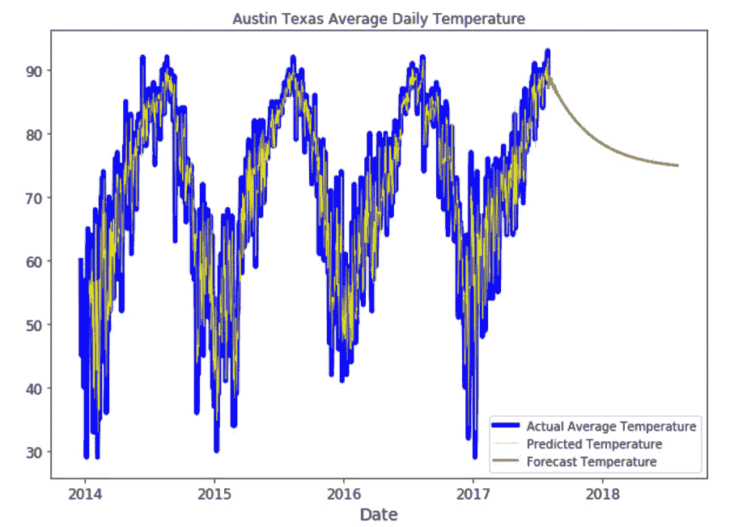

#### 第五章：4. 自回归

#### 概述

本章将教你如何实现自回归模型，作为一种基于过去值预测未来值的方法。在本章结束时，你将能够创建一个自回归模型，并使用自回归构建时间序列回归模型。你将完全掌握如何使用自回归模型对数据集进行建模，并预测未来的值。

#### 引言

在上一章中，我们研究了用于构建线性回归模型的不同方法。我们学习了如何使用最小二乘法开发线性模型。我们利用虚拟变量来提高这些线性模型的性能。我们还通过多项式模型进行线性回归分析，以提升模型的表现。接下来，我们实现了梯度下降算法，能够轻松处理大数据集和大量变量。

在本章中，我们将开发自回归模型。自回归是一种特殊类型的回归，可以根据数据集中的前期数据经验预测未来的值。

#### 自回归模型

自回归模型是经典的或“标准”的建模方法，适用于时间序列数据（即任何随时间变化的数据），并且可以补充之前讨论的线性回归技术。自回归模型常用于经济学和金融行业的预测，因为它们在单变量时间序列（即除了时间之外没有其他 x 变量）以及非常大的数据集（如流数据或高频传感器数据）中非常有效，后者在处理时可能会遇到内存或性能问题。“自”（auto）部分指的是这些模型利用时间序列与自身过去的相关性，因此称为自回归。此外，许多系统没有相关的因果模型——时间序列数据被认为是随机的。例如，股票价格随时间的变化。尽管已经进行并且仍在进行许多尝试，旨在开发股票市场行为的预测性因果模型，但成功的案例寥寥无几。因此，我们可以将某一股票符号的价格随时间变化视为随机序列，并使用自回归方法进行建模尝试。

#### 注意

为了说明自回归模型，我们将使用 1986 年至 2018 年间的标准普尔 500 日收盘价，这些数据可以在与本书相关的仓库中找到（[`packt.live/2w3ZkDw`](https://packt.live/2w3ZkDw)）。

原始数据集可以在这里找到：

[`www.kaggle.com/pdquant/sp500-daily-19862018`](https://www.kaggle.com/pdquant/sp500-daily-19862018 )

该数据的图形表示如下图所示：

图 4.1：标准普尔 500 日收盘价

自回归模型背后的主要原理是，给定足够的历史观察数据，可以对未来做出合理的预测；也就是说，我们本质上是在构建一个模型，将数据集作为自我回归，使用过去的值作为预测因子。选择自回归模型的一个关键因素是未来值与过去值在特定滞后时间点之间有足够的相关性。滞后时间指的是模型使用的数据回溯多长时间来预测未来。

#### 练习 4.01：创建自回归模型

在这个练习中，我们将使用自回归方法，尝试预测未来一年内标准普尔 500 指数的收盘价：

#### 注意

本练习适用于较早版本的 pandas，请确保使用以下命令将 pandas 降级：

pip install pandas==0.24.2

导入必要的包和类。在这个练习中，我们介绍了 statsmodels 包，它包括广泛的统计和建模函数，包括自回归。如果你之前没有从终端提示符安装 statsmodels，请使用以下命令：

conda install -c anaconda statsmodels

如果你没有使用 Anaconda（或 Miniconda），而是通过 pip 安装，请使用以下命令：

pip install -U statsmodels

一旦在系统上安装了 statsmodels，加载以下内容：

import pandas as pd

import numpy as np

from statsmodels.tsa.ar_model import AR

from statsmodels.graphics.tsaplots import plot_acf

import matplotlib.pyplot as plt

加载标准普尔 500 数据（spx.csv），并将日期列转换为 datetime 数据类型：

df = pd.read_csv('../Datasets/spx.csv')

df['date'] = pd.to_datetime(df['date'])

print(df.head())

print(df.tail())

我们将得到以下输出：

图 4.2：标准普尔 500 历史数据

如果你仔细查看图 4.2 中的数据，你可能会发现一些数据缺失——例如，1986 年 1 月 4 日和 1986 年 1 月 5 日没有数据。这些是市场关闭的周末日期。自回归模型，特别是包含大量数据的模型，对于缺失值通常不敏感，原因有至少两个。首先，由于模型一次前进一个时间段，并且在高阶模型中使用多个过去的值，预测对于缺失值的敏感度比基于单一滞后值的模型要低。其次，像这里的情况一样，大部分缺失值是周期性的（星期六每 7 天重复一次，星期天每 7 天重复一次，依此类推），如果我们有大量数据，模型会自动考虑这些缺失的日期。然而，正如我们将看到的，预测超出现有数据的时间范围时，自回归模型的预测不确定性会变得很大。

将原始数据集与日期数据类型进行比较绘制：

fig, ax = plt.subplots(figsize = (10, 7))

ax.plot(df.date, df.close)

ax.set_title('标准普尔 500 每日收盘价', fontsize = 16)

ax.set_ylabel('价格 ($)', fontsize = 14)

ax.tick_params(axis = 'both', labelsize = 12)

plt.show()

输出将如下所示：

图 4.3：标准普尔 500 指数收盘价的图

在构建自回归模型之前，我们应该首先检查模型是否能够用于自回归。正如我们之前提到的，自回归模型的成功依赖于能否利用过去的值通过线性模型预测未来的值。这意味着未来的值应该与过去的值有很强的相关性。我们可以通过使用 statsmodelsplot_acf 函数（绘制自相关函数）来进行检查。我们之前提到过，回顾过去多长时间被称为滞后；我们将覆盖 plot_acf 的默认最大值，并绘制从 0 天到 4,000 天的滞后：

max_lag = 4000

fig, ax = plt.subplots(figsize = (10, 7))

acf_plot = plot_acf(x = df.close, ax = ax, lags = max_lag, \

use_vlines = False, alpha = 0.9, \

title = '标准普尔 500 指数的自相关与滞后关系')

ax.grid(True)

ax.text(1000, 0.01, '90% 置信区间')

ax.set_xlabel('滞后', fontsize = 14)

ax.tick_params(axis = 'both', labelsize = 12)

plt.show()

结果应该如下所示：

图 4.4：标准普尔 500 指数收盘价与滞后（天数）的自相关图

我们可以这样理解这张图。首先，根据定义，在滞后为 0 时，序列与自身完全相关，因此自相关函数（ACF）值为 1.0。然后，我们可以看到，随着滞后的增加，序列的相关性逐渐减弱，这意味着越往后的数据点与我们预测的值相关性越小。这是典型的随机或斯托卡斯蒂克序列（注意周期性序列在 ACF 图中会有峰值和谷值—我们稍后会看到这一点）。此外，通过在函数调用中选择该值，我们绘制了一个 90%的置信区间，并用蓝色阴影标示。这个区间的意义是，任何超出该区间的滞后都被认为在统计上显著—换句话说，相关性在统计上是有效的。为了构建自回归模型，我们必须有超出置信区间的 ACF 值才能成功。在这种情况下，从 0 到若干天，我们有相当高的相关性，这可以在模型中使用（稍后会详细讨论）。最后，我们可以看到，在大约 2,750 天以上的滞后下，相关性为负—也就是说，过去的值预测了与未来相反的结果。然而，在这种情况下，那些长期的负滞后并不非常显著。

为了对 ACF 结果有一些直观的理解，我们选择了一个相对较短的滞后期 100 天，并将原始数据和滞后数据绘制在同一张图上。我们可以通过使用 pandas.shift()函数来做到这一点：

spx_shift_100 = df.copy()

spx_shift_100['close'] = df.close.shift(100)

fix, ax = plt.subplots(figsize = (10, 7))

ax.plot(df.date, df.close, c = "blue")

ax.plot(spx_shift_100.date, spx_shift_100.close, c = "red")

plt.show()

输出将如下所示：

](img/image-C5NFMM99.jpg)

图 4.5：标准普尔 500 指数收盘价（蓝色）和滞后 100 天的收盘价（红色）

在图 4.5 中，红色线条表示 100 天前的值，与蓝色线条（表示给定日期的实际值）进行对比。我们看到，在值增加的阶段，过去的值低于实际值，而在值减少的阶段，情况则相反。这是直观上合理的。重要的是，在大部分时间段内，两条曲线之间的垂直间距看起来大致恒定。这意味着，直观上，过去与现在的关系大致相似。如果你仔细思考这些曲线，你还会看到自回归模型的局限性——预测值总是看起来像最近的历史，因此当情况发生变化时，预测会变得不准确，直到模型“追赶上”新的行为。

还有一种方式可以帮助我们可视化正在分析的相关性。在多元线性回归的案例中，我们引入了一个图表，绘制了预测值与实际值的对比；完美的预测沿对角线分布。同样，如果我们不再绘制滞后值和实际值相对于时间的图，而是将滞后值与实际值作图，我们会看到什么样的效果呢？

print(spx_shift_100.head(), '\n', spx_shift_100.tail())

fig, ax = plt.subplots(figsize = (7, 7))

ax.scatter(df.loc[100:, 'close'], spx_shift_100.loc[100:, 'close'])

ax.set_xlim(0, 3000)

ax.set_ylim(0, 3000)

plt.show()

输出将如下所示：

日期 收盘价

0 1986-01-02 NaN

1 1986-01-03 NaN

2 1986-01-06 NaN

3 1986-01-07 NaN

4 1986-01-08 NaN

日期 收盘价

8187 2018-06-25 2823.81

8188 2018-06-26 2821.98

8189 2018-06-27 2762.13

8190 2018-06-28 2648.94

8191 2018-06-29 2695.14

图表将如下所示：

](img/image-RLYG1WTV.jpg)

图 4.6：滞后 100 天的标准普尔收盘价与实际值的比较

图 4.6 显示，大多数滞后 100 天的值沿着对角线分布，这意味着滞后值与实际值之间的关系在所有实际值中都是相似的。

我们可以在不同的滞后时间范围内创建类似图 4.6 的图表，尝试理解哪些滞后时间对模型有用，哪些没有用。在此之前，了解图 4.6 中的自相关函数（ACF）值将是有用的，这样我们可以将滞后图中的内容与相关函数值关联起来。statsmodels 的 plot_acf 函数基于一个底层的 numpy 函数——correlate。我们可以使用它来获取图 4.6 中显示的值：

"""

statsmodels 的 plot_acf 基于 numpy 的 correlate 函数

函数，因此我们可以生成实际的值来

插图，因此我们可以稍后为一些图表加标签

acf 图的标准表示中，值位于

lag 0 == 1；correlate 函数返回未缩放的

这些值使我们得到第一个值，用于缩放到 1

函数中要测试的值必须具有

从未移动序列中减去的均值

两个序列

"""

corr0 = np.correlate(df.close[0: ] - df.close.mean(), \

df.close[0: ] - df.close.mean(), \

mode = 'valid')

corrs = [np.correlate(df.close[:(df.close.shape[0] - i)] \

- df.close.mean(), df.close[i: ]

- df.close.mean(), mode = 'valid')

for i in range(max_lag)] / corr0

请注意，我们从相关函数中使用的每个值中减去了基础序列（df.close）的均值。这是一个数学上的微妙之处，目的是与 plot_act 函数的输出保持一致。

现在，与其在不同滞后值下手动创建许多图表，不如创建一个函数来生成一个图表网格，我们可以用不同的滞后范围、图表数量等来使用它。我们将传递 df.close 序列给函数，同时传递前面的 corrs 值，并设置控制图表的参数：

"""

绘制一定范围的实用函数

描述自相关的图

"""

def plot_lag_grid(series, corrs, axis_min, axis_max, \

num_plots, total_lag, n_rows, n_cols):

lag_step = int(total_lag / num_plots)

fig = plt.figure(figsize = (18, 16))

for i in range(num_plots):

corr = corrs[lag_step * i]

ax = fig.add_subplot(n_rows, n_cols, i + 1)

ax.scatter(series, series.shift(lag_step * i))

ax.set_xlim(axis_min, axis_max)

ax.set_ylim(axis_min, axis_max)

ax.set_title('lag = ' + str(lag_step * i))

ax.text(axis_min + 0.05 * (axis_max - axis_min), \

axis_max - 0.05 * (axis_max - axis_min), \

'correlation = ' + str(round(corr[0], 3)))

fig.tight_layout()

plt.show()

我们现在已经准备好深入理解相关性与滞后图之间的关系。我们将调用这个函数：

"""

创建一个网格，查看数据在增大的滞后期下的相关性

滞后与原始数据的相关性

“完美”的相关性将表现为对角线

离直线越远，相关性越差

"""

plot_lag_grid(df.close, corrs, df.close.min(), df.close.max(), \

num_plots = 16, total_lag = 480, \

n_rows = 4, n_cols = 4)

这将产生如下结果：

图 4.7：在不同值下的滞后图

在图 4.7 中，我们可以看到滞后图的外观逐渐恶化，这与每个图中显示的 ACF 函数值直接相关。这让我们得出一个结论：尝试使用更长的滞后期将会给模型增加噪声，到滞后 60 时噪声较大，而滞后 30 时噪声较小。现在，我们可以使用另一个 statsmodels 函数来开发模型，并查看它与我们想法的契合程度。

statsmodels 的 AR 函数与相关的 fit 方法一起，构建了一个自回归模型。使用默认设置时，它将确定最大滞后期，返回从滞后期 1 到最大滞后期的所有参数，并允许我们对现有数据范围内和未来进行预测：

"""

statsmodels AR 函数构建了一个自回归模型

使用所有默认设置时，它将确定最大滞后期

并提供所有模型系数

"""

model = AR(df.close)

model_fit = model.fit()

# 现在，模型拟合包含了所有模型信息

max_lag = model_fit.k_ar

"""

请注意，使用默认设置时，最大滞后期为

计算公式为 round(12*(nobs/100.)**(1/4.))

请访问 https://www.statsmodels.org/devel/generated/statsmodels.tsa.ar_model.AR.fit.html#statsmodels.tsa.ar_model.AR.fit

"""

print('最大滞后期：' + str(max_lag))

print('系数：\n' + str(model_fit.params))

输出结果如下：

图 4.8：来自 statsmodels AR 函数的滞后系数

请注意，对于每个权重和一个常数，模型有 36 个系数——该函数确定了在模型中使用的最大滞后期为 36 天。预测值生成和结果可视化非常简单：

# 我们想预测的未来时长

max_forecast = 365

# 从模型中生成预测值

pred_close = pd.DataFrame({'pred_close': \

model_fit.predict(start = max_lag, \

end = df.shape[0] \

+ max_forecast - 1)})

# 附加日期以便可视化

pred_close['date'] = df.loc[pred_close.index, 'date'].reindex()

pred_close.loc[(max(df.index) + 1):, 'date'] = \

pd.to_datetime([max(df.date) \

+ pd.Timedelta(days = i) \

for i in range(1, max_forecast + 1)])

"""

将预测结果与真实数据叠加进行可视化

以及对未来的外推

"""

fig, ax = plt.subplots(figsize = (10, 7))

ax.plot(df.date, df.close, c = "blue", linewidth = 4, \

label = '实际 SPX 收盘'

ax.plot(pred_close.loc[0 : len(df.close), 'date'], \

pred_close.loc[0 : len(df.close), 'pred_close'], \

c = "yellow", linewidth = 0.5, \

label = '预测 SPX 收盘'

ax.plot(pred_close.loc[len(df.close):, 'date'], \

pred_close.loc[len(df.close):, 'pred_close'], \

c = "red", linewidth = 2, label = '预测 SPX 收盘')

ax.set_xlabel('日期', fontsize = 14)

ax.tick_params(axis = 'both', labelsize = 12)

ax.legend()

plt.show()

结果将如下所示：

图 4.9：来自自回归模型（滞后期为 36）的 S&P 500 收盘值、预测值和预测（未来）值

请注意，预测值在跟随数据集方面表现非常好，并且在数据集结束后，预测值相对线性。由于模型是从前一个样本的线性模型构建的，而且在 yt+1 之后，随着基于过去预测的预测值增多，每个预测都带有一定误差，因此预测的确定性会逐渐降低。

拟合效果相当好。我们可以像线性回归一样比较预测值与实际值之间的差异。由于预测值直到超过原始数据的最大滞后期才开始，因此我们需要处理这个问题——我们至少需要最大滞后期数量的历史值才能预测下一个值——在本例中是 36 个值。结果是我们需要对比数据集的索引进行偏移，这在进行线性回归时并不需要：

# 比较预测值与实际值

fig, ax = plt.subplots(figsize = (10, 7))

ax.scatter(df.loc[max_lag:(df.shape[0] - 1), 'close'], \

pred_close.loc[max_lag:(df.shape[0] - 1), 'pred_close'])

ax.tick_params(axis = 'both', labelsize = 12)

ax.set_xlabel('SPX 实际值', fontsize = 14)

ax.set_ylabel('SPX 预测值', fontsize = 14)

plt.show()

这提供了如下图表：

图 4.10：预测的 S&P 500 收盘值与实际值的对比

在图 4.10 中，似乎所有值的预测都很好。然而，我们可以通过查看残差来深入分析，残差是实际值与预测值之间的差异：

使用与之前相同的方法计算残差，以考虑日期偏移：

fig, ax = plt.subplots(figsize = (10, 7))

residuals = pd.DataFrame({'date' : (df.loc[max_lag:\

(df.shape[0] - 1), 'date']),

'residual' : df.loc[max_lag:\

(df.shape[0] - 1), 'close'] \

- pred_close.loc\

[max_lag:(df.shape[0] - 1), \

'pred_close']})

ax.scatter(residuals.date, residuals.residual)

ax.tick_params(axis = 'both', labelsize = 12)

ax.set_xlabel('日期', fontsize = 14)

ax.set_ylabel('残差 (' + r'$SPX_{act} - SPX_{pred}$' \

+ ')', fontsize = 14)

plt.show()

这产生了以下图表：

图 4.11：S&P 500 收盘价的自回归模型残差值与时间的关系

图 4.11 显示，残差均匀地分布在 0 附近，这意味着模型的偏差最小，而且它们似乎随时间有所增加。然而，这种特性不一定意味着存在问题——最好将数据视为实际值的百分比——直观地说，对于一个同样准确的模型，随着值变大，残差会更大。我们可以将数据转换为百分比，并查看这一点。

通过将残差除以实际值并乘以 100 来计算残差的百分比。请注意，如果实际值接近零，百分比值可能存在问题，但在这种情况下这不是问题：

fig, ax = plt.subplots(figsize = (10, 7))

pct_residuals = pd.DataFrame({'date' : residuals.date, \

'pct_residual' : 100 \

* residuals.residual \

/ df.loc[max_lag:(df.shape[0] - 1), \

'close']})

ax.scatter(pct_residuals.date, pct_residuals.pct_residual)

ax.tick_params(axis = 'both', labelsize = 12)

ax.set_xlabel('日期', fontsize = 14)

ax.set_ylabel('%残差 100 *(' \

+ r'$SPX_{act} - SPX_{pred}$' + ') / ' \

+ r'$SPX_{act}$', fontsize = 14)

plt.show()

输出将如下所示：

图 4.12：实际值与时间的残差百分比关系

#### 注意

若要访问此特定部分的源代码，请参阅 https://packt.live/3eAi6DG。

你也可以在线运行这个示例，网址为 https://packt.live/2Z0uEh4。你必须执行整个 Notebook 才能得到预期的结果。

现在，既然练习已经顺利完成，升级 pandas 的版本以继续顺利运行本书剩余部分的练习和活动。要升级 pandas，请运行：

pip install pandas==1.0.3

我们现在看到，整个期间的百分比误差非常相似，只有少数几个期间误差增大。除去 1987 年的一个异常值，大多数值都在 10%以内，绝大多数值都在 5%以内。我们可以得出结论，这似乎是一个相当不错的模型。然而，在看到未来结果之前，我们应该保留判断——即超出我们用于模型的数据的预测结果。我们在图 4.12 中看到，数据结束后的未来预测呈现出相当线性的上升趋势。

我们将把获取最新的标准普尔 500 指数收盘数据并将其与此模型的 1 年预测数据进行比较的任务留给你。我们还必须强调，完全验证这样的模型需要将训练数据、验证数据和测试数据分开，并执行如交叉验证等测试，这将在第六章“集成建模”中详细讲解。作为一个提示，数据后的全年最差误差约为 20%，平均误差为 1.4%，而预测期结束时的误差为 0.8%。我们必须强调，预测股市是非常具有挑战性的，预测期能够保持相对均匀的正增长可能是偶然的。

通过使用自回归模型进行此练习，我们可以看到，即使在缺失数据的情况下，使用这些模型也具有显著的预测能力。对 S&P 500 数据集使用的自回归模型能够有效地在观察样本范围内提供预测。然而，在此范围之外，当预测没有采样数据的未来值时，预测能力可能会有所限制。在这种特定情况下，未来的预测似乎是合理的。接下来，我们将进行一个可能对这种模型类型更具挑战性的练习。

#### 活动 4.01: 基于周期数据的自回归模型

在此活动中，我们将使用自回归模型来拟合奥斯汀天气数据集并预测未来值。该数据与股票市场数据具有不同的特征，将展示应用自回归模型时面临的一些挑战。

要执行的步骤如下：

导入所需的包和类。与股票市场练习一样，我们需要 pandas、numpy、来自 statsmodels.tsa.ar_model 的 AR 函数、来自 statsmodels.graphics.tsaplots 的 plot_acf 函数，以及当然的 matplotlib.pyplot。

加载奥斯汀天气数据（austin_weather.csv），并将日期列转换为 datetime 格式，如之前所示。

绘制完整的平均温度值集（df.TempAvgF），横坐标为日期。

输出应如下所示：

图 4.13: 奥斯汀温度数据的多年绘图

构建自相关图，以查看平均温度是否可以与自回归模型一起使用。考虑此图与练习 4.01“创建自回归模型”之间的差异，并思考其原因。

绘图应如下所示：

图 4.14: 自相关与滞后（天数）

使用 numpy.correlate()函数提取实际的 ACF 值，如练习 4.01“创建自回归模型”中所示。

使用相同的 plot_lag_grid 函数来研究不同相关值下的相关性与滞后图。考虑到原始数据显然在大约 365 天的周期上重复，并且自相关模型在如此长的滞后期下可能不太有效。查看短期和长期滞后，并理解数据。

短滞后期的输出将如下所示：

图 4.15: 短滞后期的滞后图

较长滞后期的输出将如下所示：

图 4.16: 较长滞后期的滞后图

使用 statsmodelsAR 函数和 model.fit()方法对数据进行建模。从 model.fit()方法中获取最大模型滞后期。打印系数。默认情况下使用了多少项？

使用 365 天的最大预测期（问：为什么这是合理的？）并生成模型预测结果。使用之前相同的方法，将正确的日期与预测结果匹配，这样我们就能将它们与原始数据一起可视化。

绘制预测结果（包括 365 天的预测），以及原始数据集。

结果应如下所示：

图 4.17：奥斯汀温度数据、内数据预测与外数据预测

图 4.18：数据末尾附近预测的详细信息

我们可以从图 4.18 看出，正如股市案例中所示，用于拟合模型的数据范围内的预测效果良好。然而，未来的预测似乎并不那么理想。它们在合理的趋势上起步，但随后趋于一个明显不准确的值，持续到部分预测期。这是自回归模型局限性的一个很好的例子；它们可能在短期内对难以预测的序列非常有效，但长期预测可能会出现显著误差。要在信任此类模型之前严格评估它们，唯一的方法是使用第六章中的集成建模方法。

#### 注意事项

本活动的解答可以通过以下链接找到。

在这一部分，我们使用了自相关、滞后图和自回归等多种工具，构建了一个时间序列的预测模型。这些模型构建速度快，对于单变量数据（只有时间作为 x 变量时）效果良好，且能提供较好的短期预测。

我们已经探讨了自回归模型，作为时间序列数据中线性回归模型的替代方案。自回归模型对于没有底层模型或明显预测变量的单变量时间序列非常有用。在经济或金融建模中，自回归广泛应用，尤其是当我们认为序列是随机的或是随机变量时。我们已经看到，在某些情况下，自回归模型可以非常强大，但在存在周期性或其他非恒定时间行为的情况下，这些模型可能受到限制。根本原因是，自回归模型是过去值的线性组合，因此未来的预测总是反映了近期的过去。通常，自回归模型最适合用于相对短期的预测，尽管“短期”的定义是相对的。

#### 总结

在本章中，我们研究了自回归模型的使用，该模型根据序列中先前数据的时间行为预测未来值。通过使用自回归建模，我们能够准确地建模 1986 年到 2018 年期间以及未来一年的标准普尔 500 指数收盘价。另一方面，自回归模型在预测德克萨斯州奥斯汀的年度周期性温度数据时，表现似乎更为有限。

既然我们已经有了回归问题的经验，我们将在下一章转向分类问题。
