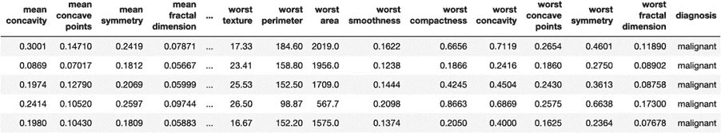
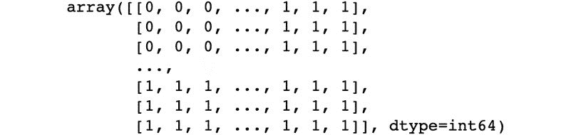
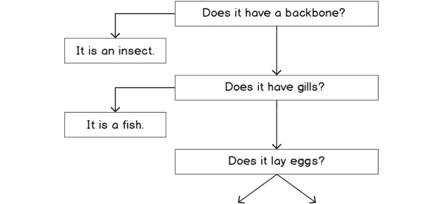

#### 第六章：5\. 分类技术

#### 概述

本章介绍了分类问题，使用线性回归和逻辑回归、K 最近邻和决策树进行分类。你还将简要了解人工神经网络作为一种分类技术。

到本章结束时，你将能够实现逻辑回归并解释如何使用它将数据分类到特定的组或类别中。你还将能够使用 K 最近邻算法进行分类，使用决策树进行数据分类，包括 ID3 算法。此外，你将能够识别数据中的熵，并解释决策树（如 ID3）如何通过减少熵来进行分类。

#### 介绍

在前几章中，我们通过回归技术开始了有监督机器学习之旅，预测给定输入数据集上的连续变量输出。现在我们将转向另一类机器学习问题：分类。回想一下，分类任务的目的是将给定的输入数据分类到两个或更多指定的类别中。

因此，回归是估计给定输入数据的连续值的任务（例如，根据房子的地点和尺寸估计房价），而分类则是预测给定输入数据的（离散）标签。例如，一个著名的机器学习分类任务是电子邮件的垃圾邮件检测，任务是预测给定的电子邮件是否为垃圾邮件或非垃圾邮件。在这里，垃圾邮件和非垃圾邮件是这个任务的标签，输入数据是电子邮件，或者更准确地说，是电子邮件中不同字段的文本数据，如主题、正文和收件人。文本数据将经过预处理，转化为数值特征，以便用于分类模型。因为这个任务只有两个标签，所以它被称为二分类任务。如果分类任务中有两个以上的标签，则称为多类分类任务。

有各种类型的分类模型，采用不同的学习算法，每种方法都有其优缺点。但本质上，所有模型都使用带标签的数据集进行训练，训练完成后，可以对未标记的数据样本进行标签预测。在本章中，我们将扩展第三章《线性回归》和第四章《自回归》中学到的概念，并将其应用于带有类别标签的数据集，而不是连续值作为输出。我们将讨论一些著名的分类模型，并将其应用于一些示例标签数据集。

#### 普通最小二乘法作为分类器

在上一章中，我们将最小二乘法（OLS）作为线性回归应用于预测连续变量输出，但它也可以用于预测一组数据属于哪个类别。基于最小二乘法的分类器虽然不如本章后续介绍的其他分类器强大，但它们在理解分类过程时尤其有用。回顾一下，基于最小二乘法的分类器是一个非概率性的线性二分类器。它之所以是非概率性的，是因为它不会像逻辑回归那样对预测生成置信度。它是一个线性分类器，因为它与其参数/系数之间具有线性关系。

现在，假设我们有一个虚构的数据集，其中包含两个不同的组，X 和 O，如图 5.1 所示。我们可以通过首先使用最小二乘法线性回归来拟合一条直线方程，从而构造一个线性分类器。对于任何位于直线之上的值，将预测为 X 类，而对于任何位于直线之下的值，将预测为 O 类。任何能够被直线分开的数据集都被称为线性可分的（如我们的例子所示），这是机器学习问题中一个重要的数据类型子集。在这种情况下，直线将被称为决策边界。更一般地说，决策边界被定义为将数据分开的超平面。在这种情况下，决策边界是线性的。也可能存在决策边界是非线性的情况。像我们例子中的数据集，可以通过线性分类器（如基于 OLS 的分类器）或具有线性核的支持向量机（SVM）进行学习。

然而，这并不意味着线性模型只能有线性的决策边界。线性分类器/模型是指与模型的参数/权重（β）具有线性关系的模型，但不一定与输入（x）具有线性关系。根据输入的不同，线性模型可能会有线性或非线性的决策边界。如前所述，线性模型的例子包括最小二乘法、支持向量机（SVM）和逻辑回归，而非线性模型的例子包括 KNN、随机森林、决策树和人工神经网络（ANN）。我们将在本章后续部分介绍更多这些模型：

图 5.1：最小二乘法作为分类器

#### 练习 5.01：最小二乘法作为分类器

这个练习包含了一个使用最小二乘法（OLS）作为分类器的设计示例。在本练习中，我们将使用一个完全虚构的数据集，并测试最小二乘法模型作为分类器的效果。为了实现 OLS，我们将使用 sklearn 的 LinearRegression API。数据集由手动选择的 x 和 y 值组成，用于散点图，这些值大致被分为两组。该数据集专门为本练习设计，旨在演示如何将线性回归用作分类器，相关代码文件随书附赠，并且也可以在 GitHub 上找到，网址为 https://packt.live/3a7oAY8：

导入所需的包：

import matplotlib.pyplot as plt

import matplotlib.lines as mlines

import numpy as np

import pandas as pd

from sklearn.linear_model import LinearRegression

from sklearn.model_selection import train_test_split

将 linear_classifier.csv 数据集加载到 pandas DataFrame 中：

df = pd.read_csv('../Datasets/linear_classifier.csv')

df.head()

输出将如下所示：

图 5.2：前五行

浏览数据集时，每一行包含一组 x、y 坐标，以及与数据所属类别相关的标签，类别可以是叉号（x）或圆圈（o）。

绘制数据的散点图，并用对应的类别标签作为每个点的标记：

plt.figure(figsize=(10, 7))

for label, label_class in df.groupby('labels'):

plt.scatter(label_class.values[:,0], label_class.values[:,1], \

label=f'类 {label}', marker=label, c='k')

plt.legend()

plt.title("线性分类器");

我们将获得以下散点图：

图 5.3 线性分类器的散点图

为了公正地评估模型，我们应将训练数据集分为训练集和测试集。我们将在接下来的步骤中按照 60:40 的比例进行训练/测试数据的划分：

df_train, df_test = train_test_split(df.copy(), test_size=0.4, \

random_state=12)

使用上一章中的 scikit-learn LinearRegression API，将一个线性模型拟合到训练数据集的 x、y 坐标，并打印出线性方程：

# 拟合线性回归模型

model = LinearRegression()

model.fit(df_train.x.values.reshape((-1, 1)), \

df_train.y.values.reshape((-1, 1)))

# 打印出参数

print(f'y = {model.coef_[0][0]}x + {model.intercept_[0]}')

输出将如下所示：

y = 1.2718120805369124x + 8.865771812080538

#### 注意

在本章的练习和活动中，由于随机化的原因，输出结果可能会与你得到的结果略有不同。

绘制拟合的趋势线于测试数据集上：

# 绘制趋势线

trend = model.predict(np.linspace(0, 10).reshape((-1, 1)))

plt.figure(figsize=(10, 7))

for label, label_class in df_test.groupby('labels'):

plt.scatter(label_class.values[:,0], label_class.values[:,1], \

label=f'类 {label}', marker=label, c='k')

plt.plot(np.linspace(0, 10), trend, c='k', label='趋势线')

plt.legend()

plt.title("线性分类器");

输出将如下所示：

图 5.4：带趋势线的散点图

使用拟合的趋势线后，可以应用分类器。对于测试数据集中的每一行，判断 x, y 点是否位于线性模型（或趋势线）之上或之下。如果点位于趋势线以下，模型预测为 o 类；如果位于趋势线以上，预测为 x 类。将这些值作为预测标签列：

# 做出预测

y_pred = model.predict(df_test.x.values.reshape((-1, 1)))

pred_labels = []

for _y, _y_pred in zip(df_test.y, y_pred):

if _y < _y_pred:

pred_labels.append('o')

else:

pred_labels.append('x')

df_test['预测标签'] = pred_labels

df_test.head()

输出将如下所示：

图 5.5：前五行数据

绘制具有相应真实标签的点。对于那些标签被正确预测的点，绘制相应的类别。对于那些错误预测的点，绘制一个菱形：

plt.figure(figsize=(10, 7))

for idx, label_class in df_test.iterrows():

if label_class.labels != label_class['预测标签']:

label = 'D'

s=70

else:

label = label_class.labels

s=50

plt.scatter(label_class.values[0], label_class.values[1], \

label=f'类 {label}', marker=label, c='k', s=s)

plt.plot(np.linspace(0, 10), trend, c='k', label='趋势线')

plt.title("线性分类器");

incorrect_class = mlines.Line2D([], [], color='k', marker='D', \

markersize=10, \

label='错误分类');

plt.legend(handles=[incorrect_class]);

输出将如下所示：

图 5.6：显示错误预测的散点图

我们可以看到，在这个图中，线性分类器在这个完全虚构的数据集中做出了两个错误的预测，一个发生在 x = 1，另一个发生在 x = 3。

#### 注意

要访问此特定部分的源代码，请参考 https://packt.live/3hT3Fwy。

你也可以在 https://packt.live/3fECHai 在线运行这个例子。你必须执行整个 Notebook 才能获得预期结果。

但如果我们的数据集不是线性可分的，且我们无法使用直线模型对数据进行分类，这种情况非常常见。此外，前面的方式并没有给出关于预测的置信度度量。为了应对这些挑战，我们转向其他分类方法，其中许多使用不同的模型，但过程在逻辑上是从我们简化的线性分类器模型延续下来的。

#### 逻辑回归

逻辑回归模型，或称为 logit 模型，是一种线性模型，已被有效应用于多个领域的分类任务。回顾上一节中 OLS 模型的定义，逻辑回归模型以输入特征的线性组合作为输入。在本节中，我们将使用它来分类手写数字图像。在理解逻辑回归模型时，我们也迈出了理解一个非常强大的机器学习模型——人工神经网络的关键一步。那么，逻辑回归模型究竟是什么呢？就像由线性或直线函数组成的 OLS 模型一样，逻辑回归模型由标准的逻辑函数组成，在数学上，它看起来大致如下：

图 5.7：逻辑函数

从实际的角度来看，经过训练后，这个函数返回输入信息属于特定类别或组的概率。在前面的方程中，x 是输入特征向量（一个数字数组，每个数字代表输入数据的一个特征），β1 是模型的参数向量，通过训练模型来学习，β0 是偏置项或偏置项（另一个参数），它帮助模型处理输入（x）和输出（y）之间的常数偏移值关系，p(x) 是数据样本 x 属于某个类别的输出概率。例如，如果我们有两个类别 A 和 B，那么 p(x) 是类别 A 的概率，1-p(x) 是类别 B 的概率。

那么，我们是如何得出逻辑函数的呢？逻辑回归模型的产生源于希望通过 x 的线性函数来建模数据点属于两个类别（A 和 B）中类别 A 的概率对数。该模型具有以下形式：

图 5.8：逻辑回归模型的逻辑函数

我们这里考虑的是二分类的情况，只有两个类别 A 和 B，尽管我们也可以通过一对多分类的技巧轻松扩展讨论到多分类问题。稍后会在后续章节中进一步讨论这个问题。但现在，由于我们知道只有两个类别，我们知道：

图 5.9：概率分布的求和

使用前面的两个方程式，我们可以得到：

图 5.10：用于二分类的逻辑回归模型的逻辑函数

现在，如果我们将类别 A 视为我们的目标类别，我们可以将 p(类别=A) 替换为 y（目标输出）：

图 5.11：通过替换 p(class=A) 得到的逻辑回归模型的逻辑函数

上述方程的左侧通常被称为对数几率（log-odds），因为它是几率比的对数，几率比是类 A 的概率与类 B 的概率之比。那么，为什么这很重要呢？对于像逻辑回归这样的线性模型，模型的对数几率与输入 x 之间的线性关系意味着模型的线性性。

通过稍微重新排列上述方程，我们得到逻辑函数：

图 5.12：逻辑函数

请注意 e 的指数部分，即 β0 + β1x，并且这种关系是两个训练参数或权重 β0 和 β1，以及输入特征向量 x 的线性函数。如果我们假设 β0 = 0 和 β1 = 1，并在范围 (-6, 6) 内绘制逻辑函数，我们将得到如下结果：

图 5.13：逻辑函数曲线

#### 注意

S 型曲线围绕点 x = -β0 中心，因此，如果 β0 不为零，曲线将不会围绕点 x = 0 中心，如前图所示。

查看图 5.13，我们注意到分类的一些重要方面。首先要注意的是，如果我们查看函数两端的 y 轴上的概率值，当 x = -6 时，值几乎为零，而当 x = 6 时，值接近一。虽然看起来这些值实际上是 0 和 1，但实际情况并非如此。逻辑函数在这些极限点趋近于零和一，只有当 x 处于正无穷或负无穷时，才会等于零或一。从实际角度看，这意味着逻辑函数永远不会返回大于或等于 1 的概率，或者小于或等于 0 的概率，这对于分类任务来说是完美的。无论如何，我们永远不会有大于 1 的概率，因为根据定义，概率为 1 表示事件发生的确定性。同样，我们也不能有小于 0 的概率，因为根据定义，概率为 0 表示事件不发生的确定性。逻辑函数趋近但永远不会等于 1 或 0，这意味着结果或分类中总会存在一定的不确定性。

关于逻辑函数的最后一个方面是，当 x = 0 时，概率为 0.5。如果我们得到这个结果，那么说明模型对对应类别的结果同样不确定；也就是说，它实际上并没有任何明确的判断。

#### 注意

正确理解和解释分类模型（如逻辑回归）提供的概率信息非常重要。将这个概率分数视为给定训练数据的变异性后，输入信息属于某一特定类别的概率。一个常见的错误是将这个概率分数作为判断模型预测是否可靠的客观指标；然而，这并不一定是正确的。例如，一个模型可能提供 99.99%的概率，认为某些数据属于特定类别，但它仍然可能完全错误。

我们使用概率值的目的是选择分类器的预测类别。在模型输出概率与我们决定预测类别之间，存在一个概率阈值。我们需要决定一个阈值τ，它位于 0 和 1 之间，从而可以定义两个类别（例如，A 和 B），具体定义如下：

模型输出概率介于 0 和τ之间的数据样本属于类别 A。

模型输出概率介于τ和 1 之间的数据样本属于类别 B。

假设我们有一个模型，它用于预测某一组数据属于类别 A 还是类别 B，并且我们决定阈值为 0.5（这实际上是一个非常常见的选择）。如果逻辑回归模型返回的概率是 0.7，那么我们会将类别 B 作为模型的预测类别。如果概率只有 0.2，那么模型的预测类别将是类别 A。

#### 练习 5.02: 逻辑回归作为分类器 – 二元分类器

对于本次练习，我们将使用著名的 MNIST 数据集样本（可通过 http://yann.lecun.com/exdb/mnist/ 或在 GitHub 上的 https://packt.live/3a7oAY8 获取）。该数据集包含从 0 到 9 的手写数字图像及其对应的标签。MNIST 数据集包括 60,000 个训练样本和 10,000 个测试样本，每个样本都是 28 x 28 像素的灰度图像。在本次练习中，我们将使用逻辑回归来构建一个分类器。我们首先要构建的是一个二元分类器，用于判断图像是手写数字 0 还是 1：

对于本次练习，我们需要导入一些依赖库。请执行以下导入语句：

import struct

import numpy as np

import gzip

import urllib.request

import matplotlib.pyplot as plt

from array import array

from sklearn.linear_model import LogisticRegression

我们还需要下载 MNIST 数据集。你只需做这一步一次，因此在此步骤之后，可以随意注释掉或删除这些代码块。请按照以下方式下载图像数据：

request = \

urllib.request.urlopen('http://yann.lecun.com/exdb'\

'/mnist/train-images-idx3-ubyte.gz')

with open('../Datasets/train-images-idx3-ubyte.gz', 'wb') as f:

f.write(request.read())

request = \

urllib.request.urlopen('http://yann.lecun.com/exdb'\

'/mnist/t10k-images-idx3-ubyte.gz')

with open('../Datasets/t10k-images-idx3-ubyte.gz', 'wb') as f:

f.write(request.read())

下载数据的相应标签：

request = \

urllib.request.urlopen('http://yann.lecun.com/exdb'\

'/mnist/train-labels-idx1-ubyte.gz')

with open('../Datasets/train-labels-idx1-ubyte.gz', 'wb') as f:

f.write(request.read())

request = \

urllib.request.urlopen('http://yann.lecun.com/exdb'\

'/mnist/t10k-labels-idx1-ubyte.gz')

with open('../Datasets/t10k-labels-idx1-ubyte.gz', 'wb') as f:

f.write(request.read())

一旦所有文件都成功下载，请使用以下命令解压缩本地目录中的文件（适用于 Windows）：

!ls *.gz #!dir *.gz for windows

输出将如下所示：

t10k-images-idx3-ubyte.gz train-images-idx3-ubyte.gz

t10k-labels-idx1-ubyte.gz train-images-idx1-ubyte.gz

#### 注意

对于 Linux 和 macOS，请使用 !ls *.gz 命令检查本地目录中的文件。

加载下载的数据。无需过多担心数据读取的具体细节，因为这些是针对 MNIST 数据集的特定内容：

with gzip.open('../Datasets/train-images-idx3-ubyte.gz', 'rb') as f:

magic, size, rows, cols = struct.unpack(">IIII", f.read(16))

img = np.array(array("B", f.read())).reshape((size, rows, cols))

with gzip.open('../Datasets/train-labels-idx1-ubyte.gz', 'rb') as f:

magic, size = struct.unpack(">II", f.read(8))

labels = np.array(array("B", f.read()))

with gzip.open('../Datasets/t10k-images-idx3-ubyte.gz', 'rb') as f:

magic, size, rows, cols = struct.unpack(">IIII", f.read(16))

img_test = np.array(array("B", f.read()))\

.reshape((size, rows, cols))

with gzip.open('../Datasets/t10k-labels-idx1-ubyte.gz', 'rb') as f:

magic, size = struct.unpack(">II", f.read(8))

labels_test = np.array(array("B", f.read()))

一如既往，彻底理解数据至关重要，因此请创建训练样本中前 10 张图像的图像图。注意这些是灰度图像，并且对应的标签是 0 到 9 的数字：

for i in range(10):

plt.subplot(2, 5, i + 1)

plt.imshow(img[i], cmap='gray');

plt.title(f'{labels[i]}');

plt.axis('off')

输出将如下所示：

图 5.14：训练图像

由于初始分类器旨在分类数字 0 或数字 1 的图像，我们必须首先从数据集中选择这些样本：

samples_0_1 = np.where((labels == 0) | (labels == 1))[0]

images_0_1 = img[samples_0_1]

labels_0_1 = labels[samples_0_1]

samples_0_1_test = np.where((labels_test == 0) | (labels_test == 1))

images_0_1_test = img_test[samples_0_1_test]\

.reshape((-1, rows * cols))

labels_0_1_test = labels_test[samples_0_1_test]

可视化从 0 选择的一个样本和从手写数字 1 中选取的另一个样本，以确保我们已正确分配数据。

这里是 0 的代码：

sample_0 = np.where((labels == 0))[0][0]

plt.imshow(img[sample_0], cmap='gray');

输出将如下所示：

图 5.15：第一张手写图片

这里是 1 的代码：

sample_1 = np.where((labels == 1))[0][0]

plt.imshow(img[sample_1], cmap='gray');

输出将如下所示：

图 5.16：第二张手写图片

我们几乎到达了可以开始构建模型的阶段。然而，由于每个样本是一个图片，并且数据采用矩阵格式，因此我们必须先重新排列每张图片。模型需要以向量形式提供图片，即每张图片的所有信息都存储在一行中。按照如下步骤执行：

images_0_1 = images_0_1.reshape((-1, rows * cols))

images_0_1.shape

现在，我们可以使用选定的图片和标签来构建并拟合逻辑回归模型：

model = LogisticRegression(solver='liblinear')

model.fit(X=images_0_1, y=labels_0_1)

输出将如下所示：

图 5.17：逻辑回归模型

请注意，scikit-learn API 对逻辑回归的调用与线性回归的一致。还有一个额外的参数 `solver`，它指定了要使用的优化过程类型。我们在这里提供了该参数的默认值，以抑制 scikit-learn 在该版本中要求指定 `solver` 的警告。`solver` 参数的具体内容超出了本章的范围，添加它的目的是为了抑制警告消息。

检查该模型在相应训练数据上的表现：

model.score(X=images_0_1, y=labels_0_1)

输出将如下所示：

1.0

在这个例子中，模型能够以 100%的准确率预测训练标签。

使用模型显示训练数据的前两个预测标签：

model.predict(images_0_1) [:2]

输出将如下所示：

array([0, 1], dtype=uint8)

逻辑回归模型是如何做出分类决策的？来看一下模型为训练集生成的一些概率：

model.predict_proba(images_0_1)[:2]

输出将如下所示：

array([[9.99999999e-01, 9.89532857e-10],

[4.56461358e-09, 9.99999995e-01]])

我们可以看到，对于每个预测，都会有两个概率值。对于每张图片的预测，第一个值是该图片是数字 0 的概率，第二个值是数字 1 的概率。这两个值相加为 1。我们可以看到，在第一个例子中，数字 0 的预测概率为 0.9999999，因此，预测为数字 0。同理，第二个例子的情况也相反。

#### 注意

理想情况下，这两个概率应该相加为 1，但由于计算限制和截断误差，它们几乎等于 1。

计算模型在测试集上的表现，以检查其在未见数据上的表现：

model.score(X=images_0_1_test, y=labels_0_1_test)

输出将如下所示：

0.9995271867612293

#### 注意

请参阅第七章《模型评估》，了解更好的客观评估模型性能的方法。

我们可以看到，逻辑回归是一种强大的分类器，能够区分手写的 0 和 1 样本。

#### 注意

若要访问此特定部分的源代码，请参见 [`packt.live/3dqqEvH`](https://packt.live/3dqqEvH)。

你也可以在线运行此示例，网址是 [`packt.live/3hT6FJm`](https://packt.live/3hT6FJm)。你必须执行整个 Notebook 才能获得期望的结果。

现在我们已经在一个二分类问题上训练了一个逻辑回归模型，让我们将模型扩展到多个类。实际上，我们将使用相同的数据集，而不是只将其分类为两个类别或数字 0 和 1，而是将其分类为所有 10 个类别，或数字 0-9。实际上，逻辑回归的多类分类是通过一对多分类来实现的。也就是说，对于分类为 10 个类别，我们将训练 10 个二分类器。每个分类器将有一个数字作为第一类，其他 9 个数字作为第二类。通过这种方式，我们得到了 10 个二分类器，然后共同用于做出预测。换句话说，我们从每个二分类器中获取预测概率，最终的输出数字/类别是其分类器给出最高概率的那个。

#### 练习 5.03: 逻辑回归 – 多类分类器

在前面的练习中，我们研究了使用逻辑回归对两个组别进行分类。然而，逻辑回归也可以用于将输入信息分类为 k 个不同的组，这就是我们将在本练习中探讨的多类分类器。加载 MNIST 训练和测试数据的过程与前一个练习完全相同：

导入所需的包：

import struct

import numpy as np

import gzip

import urllib.request

import matplotlib.pyplot as plt

from array import array

from sklearn.linear_model import LogisticRegression

加载训练/测试图像及其对应的标签：

with gzip.open('../Datasets/train-images-idx3-ubyte.gz', 'rb') as f:

magic, size, rows, cols = struct.unpack(">IIII", f.read(16))

img = np.array(array("B", f.read()))\

.reshape((size, rows, cols))

with gzip.open('../Datasets/train-labels-idx1-ubyte.gz', 'rb') as f:

magic, size = struct.unpack(">II", f.read(8))

labels = np.array(array("B", f.read()))

with gzip.open('../Datasets/t10k-images-idx3-ubyte.gz', 'rb') as f:

magic, size, rows, cols = struct.unpack(">IIII", f.read(16))

img_test = np.array(array("B", f.read()))\

.reshape((size, rows, cols))

with gzip.open('../Datasets/t10k-labels-idx1-ubyte.gz', 'rb') as f:

magic, size = struct.unpack(">II", f.read(8))

labels_test = np.array(array("B", f.read()))

可视化数据的一个样本：

for i in range(10):

plt.subplot(2, 5, i + 1)

plt.imshow(img[i], cmap='gray');

plt.title(f'{labels[i]}');

plt.axis('off')

输出将如下所示：

图 5.18：示例数据

鉴于训练数据量非常大，我们将选择一部分数据来减少训练时间及所需的系统资源：

np.random.seed(0) # 提供一致的随机数

selection = np.random.choice(len(img), 5000)

selected_images = img[selection]

selected_labels = labels[selection]

请注意，在本示例中，我们使用了来自所有 10 个类别的数据，而不仅仅是类别 0 和 1，因此我们将此示例视为一个多类分类问题。

再次将输入数据重塑为向量形式，以便后续使用：

selected_images = selected_images.reshape((-1, rows * cols))

selected_images.shape

输出结果如下：

(5000, 784)

下一个单元格故意被注释掉了。暂时保留这段代码注释：

# selected_images = selected_images / 255.0

# img_test = img_test / 255.0

构建逻辑回归模型。该模型有一些额外的参数如下：求解器的 lbfgs 值适用于多类别问题，且需要更多的 max_iter 迭代才能收敛。multi_class 参数设置为 multinomial，以便计算整个概率分布的损失：

model = LogisticRegression(solver='lbfgs', \

multi_class='multinomial', \

max_iter=500, tol=0.1)

model.fit(X=selected_images, y=selected_labels)

输出结果如下：

图 5.19：逻辑回归模型

#### 注意

详细信息请参阅文档：https://scikit-learn.org/stable/modules/generated/sklearn.linear_model.LogisticRegression.html。

确定训练集的准确度评分：

model.score(X=selected_images, y=selected_labels)

输出结果如下：

1.0

确定训练集前两个预测结果，并绘制带有相应预测的图像：

model.predict(selected_images)[:2]

输出结果如下：

array([4, 1], dtype=uint8)

显示训练集前两个样本的图像，以查看我们是否正确：

plt.subplot(1, 2, 1)

plt.imshow(selected_images[0].reshape((28, 28)), cmap='gray');

plt.axis('off');

plt.subplot(1, 2, 2)

plt.imshow(selected_images[1].reshape((28, 28)), cmap='gray');

plt.axis('off');

输出结果如下：

图 5.20：绘制两个选定图像

再次打印出模型为训练集中的第一个样本提供的概率得分。确认每个类别有 10 个不同的值：

model.predict_proba(selected_images)[0]

输出结果如下：

图 5.21：预测值数组

请注意，在第一个样本的概率数组中，第五个（索引四）样本的概率最高，这表明预测结果为 4。

计算模型在测试集上的准确率。这将为模型在实际环境中的表现提供一个合理的估计，因为模型从未见过测试集中的数据。由于模型没有接触过这些数据，预计测试集的准确率会略低于训练集：

model.score(X=img_test.reshape((-1, rows * cols)), y=labels_test)

输出将如下所示：

0.878

在测试集上检查时，模型的准确率为 87.8%。当应用测试集时，性能下降是预期中的，因为这是模型第一次看到这些样本；而在训练过程中，训练集数据是反复呈现给模型的。

找到带有注释掉的代码的单元格，如第 4 步所示。取消注释该单元格中的代码：

selected_images = selected_images / 255.0

img_test = img_test / 255.0

这个单元格仅仅是将所有图像的值缩放到 0 到 1 之间。灰度图像的像素值范围在 0 到 255 之间，其中 0 代表黑色，255 代表白色。

点击“重启并运行全部”以重新运行整个 Notebook。

找到训练集的误差：

model.score(X=selected_images, y=selected_labels)

我们将得到以下得分：

0.986

找到测试集的误差：

model.score(X=img_test.reshape((-1, rows * cols)), y=labels_test)

我们将得到以下得分：

0.9002

#### 注意

要访问此特定部分的源代码，请参考 [`packt.live/2B1CNKe`](https://packt.live/2B1CNKe)。

你也可以在网上运行这个示例，网址是 [`packt.live/3fQU4Vd`](https://packt.live/3fQU4Vd)。你必须执行整个 Notebook 才能得到预期的结果。

正常化图像对系统整体性能有何影响？训练误差更大了！我们从训练集的 100%准确率下降到 98.6%。是的，训练集的性能有所下降，但测试集的准确率从 87.8%上升到了 90.02%。测试集的性能更为重要，因为模型之前没有见过这些数据，因此它更能代表我们期望模型在实际应用中的表现。那么，为什么会有更好的结果呢？

回想我们在第二章《探索性数据分析与可视化》中讨论的关于归一化和数据缩放方法的内容。现在让我们回顾一下图 5.13，并注意曲线在接近-6 和+6 时的形状。曲线在接近 0 和接近 1 时分别饱和或变平。所以，如果我们使用的是 0 到 255 之间的图像（或 x 值），由逻辑函数定义的类概率会落在曲线的平坦区域内。位于此区域内的预测不太可能发生太大变化，因为它们需要非常大的 x 值变化才能使 y 发生有意义的变化。将图像缩放到 0 和 1 之间，最初会将预测值接近 p(x) = 0.5，因此，x 的变化对 y 的值影响更大。这可以实现更灵敏的预测，并导致在训练集上犯几个错误，但在测试集上更多的正确预测。建议在进行逻辑回归模型的训练和测试之前，将输入值缩放到 0 到 1 或-1 到 1 之间。

以下函数是一种将 NumPy 数组的值缩放到 0 和 1 之间的方法：

定义`scale_input(x)`函数：

`normalized = (x - min(x)) / (max(x) - min(x))`

返回`normalized`

上述缩放方法被称为最小-最大缩放（min-max scaling），因为它是基于数组的最小值和最大值进行缩放的。Z 缩放和均值缩放是其他著名的缩放方法。

因此，我们已经成功地使用逻辑回归模型解决了一个多类分类问题。现在让我们进行一个类似于练习 5.02：“逻辑回归作为分类器 – 二分类器”的活动，这次我们将解决一个二分类问题。不过，这次我们将使用一个更简单的模型——线性回归分类器。

#### 活动 5.01：普通最小二乘法分类器 – 二分类器

在这个活动中，我们将构建一个基于 OLS（线性回归）的二类分类器，使用 MNIST 数据集对数字 0 和 1 进行分类。

要执行的步骤如下：

导入所需的依赖：

导入`struct`

导入`numpy`为`np`

导入`gzip`

导入`urllib.request`

导入`matplotlib.pyplot`为`plt`

从数组库导入`array`

从`sklearn.linear_model`导入`LinearRegression`

将 MNIST 数据加载到内存中。

可视化数据样本。

构建一个线性分类器模型，用于分类数字 0 和 1。我们将创建的模型是用来确定样本是否为数字 0 或 1。为此，我们首先需要选择这些样本。

使用 0 和 1 的一个样本图像可视化所选信息。

为了将图像信息提供给模型，我们必须首先将数据展平，使得每个图像的形状为 1 x 784 个像素。

构建模型；使用`LinearRegression` API 并调用`fit`函数。

确定训练集上的准确性。

使用 0.5 的阈值确定每个训练样本的标签预测值。大于 0.5 的值分类为 1；小于或等于 0.5 的值分类为 0。

计算预测训练值与实际值之间的分类准确率。

与测试集进行性能比较。

#### 注意

此活动的解决方案可以通过此链接找到。

这里有一个有趣的点需要注意，那就是在这里的测试集表现比练习 5.02：逻辑回归作为分类器——二元分类器的表现更差。两种情况的数据集完全相同，但模型不同。正如预期的那样，线性回归分类器作为一个更简单的模型，其测试集表现比更强大的逻辑回归模型要差。

#### 选择 K 最佳特征选择

现在我们已经建立了如何在 MNIST 数据集上训练和测试线性回归与逻辑回归模型，接下来我们将使用逻辑回归模型在另一个数据集上解决一个多类分类问题。作为下一个练习的前提条件，让我们快速讨论一种特定的特征选择方法——选择 K 最佳特征选择方法。在这种方法中，我们根据 K 个最高分数来选择特征。分数是基于评分函数得出的，该函数输入特征（X）和目标（y），并返回每个特征的分数。一个这样的函数的例子可能是计算标签（y）与特征（X）之间的 ANOVA F 值的函数。此评分函数的实现可以通过 scikit-learn 获得：https://scikit-learn.org/stable/modules/generated/sklearn.feature_selection.f_classif.html#sklearn.feature_selection.f_classif。然后，特征会根据分数的降序排列，我们从这个排序列表中选择前 K 个特征。选择 K 最佳特征选择方法的实现也可以通过 scikit-learn 获得：https://scikit-learn.org/stable/modules/generated/sklearn.feature_selection.SelectKBest.html。此外，以下是一个示例代码，展示如何在 scikit-learn 中使用此方法：

>>> 从 sklearn.datasets 导入 load_digits

>>> 从 sklearn.feature_selection 导入 SelectKBest 和 chi2

>>> X, y = load_digits(return_X_y=True)

>>> X.shape

(1797, 64)

>>> X_new = SelectKBest(chi2, k=20).fit_transform(X, y)

>>> X_new.shape

(1797, 20)

现在我们进入下一个练习，解决一个多类分类问题。

#### 练习 5.04：使用逻辑回归进行乳腺癌诊断分类

在这个练习中，我们将使用乳腺癌诊断数据集（可在 https://archive.ics.uci.edu/ml/datasets/Breast+Cancer+Wisconsin+%28Diagnostic%29 下载，也可以在 GitHub 上找到 https://packt.live/3a7oAY8）。该数据集是 UCI 机器学习库的一部分（https://archive.ics.uci.edu/ml/index.php）。数据集包含数字化的乳腺肿块细针穿刺（FNA）图像中细胞核的特征，每个细胞核都标有恶性或良性的标签。特征包括（共 30 个），例如细胞核的平均半径、半径误差、最差半径、平均纹理、纹理误差和最差纹理等。我们将使用数据集提供的这些特征来对恶性细胞和良性细胞进行分类。

需要执行的步骤如下：

导入所需的包。对于这个练习，我们需要 pandas 包来加载数据，Matplotlib 包来绘图，以及 scikit-learn 来创建逻辑回归模型。导入所有必需的包和相关模块：

import pandas as pd

import matplotlib.pyplot as plt

from sklearn.linear_model import LogisticRegression

from sklearn.feature_selection import SelectKBest

from sklearn.model_selection import train_test_split

使用 pandas 加载乳腺癌诊断数据集并检查前五行：

df = pd.read_csv('../Datasets/breast-cancer-data.csv')

df.head()

输出将如下所示：

图 5.22：乳腺癌数据集的前五行

此外，将数据集分解为输入（X）和输出（y）变量：

X, y = df[[c for c in df.columns if c != 'diagnosis']], df.diagnosis

下一步是特征工程。我们使用 scikit-learn 的 SelectKBest 特征选择模块。基本上，这个方法根据得分函数检查每个特征对目标输出的影响力。你可以在这里阅读更多细节： https://scikit-learn.org/stable/modules/generated/sklearn.feature_selection.SelectKBest.html：

"""

限制为两个最佳特征，以便

我们可以在图表中可视化它们

"""

skb_model = SelectKBest(k=2)

X_new = skb_model.fit_transform(X, y)

# 获取 k 个最佳列名称

mask = skb_model.get_support() # 布尔值列表

selected_features = [] # 你的 K 个最佳特征列表

for bool, feature in zip(mask, df.columns):

if bool:

selected_features.append(feature)

print(selected_features)

输出将如下所示：

['worst perimeter', 'worst concave points']

现在，让我们可视化这两个最重要的特征与目标（诊断）的相关性，以及它们如何很好地区分这两类诊断：

markers = {'benign': {'marker': 'o'}, \

'malignant': {'marker': 'x'},}

plt.figure(figsize=(10, 7))

for name, group in df.groupby('diagnosis'):

plt.scatter(group[selected_features[0]], \

group[selected_features[1]], label=name, \

marker=markers[name]['marker'],)

plt.title(f'诊断分类 {selected_features[0]} 与 \

{selected_features[1]}');

plt.xlabel(selected_features[0]);

plt.ylabel(selected_features[1]);

plt.legend();

输出结果如下：

图 5.23：特征选择的散点图

在构建模型之前，我们必须先将诊断值转换为可以在模型中使用的标签。将良性诊断字符串替换为值 0，将恶性诊断字符串替换为值 1：

diagnoses = ['良性', '恶性',]

output = [diagnoses.index(diag) for diag in df.diagnosis]

同时，为了公平地评估模型，我们应将训练数据集分为训练集和验证集：

train_X, valid_X, \

train_y, valid_y = train_test_split(df[selected_features], output, \

test_size=0.2, random_state=123)

使用 selected_features 和分配的诊断标签创建模型：

model = LogisticRegression(solver='liblinear')

model.fit(df[selected_features], output)

输出结果如下：

LogisticRegression(C=1.0, class_weight=None, dual=False, fit_intercept=True,

intercept_scaling=1, l1_ratio=None, max_iter=100,

multi_class='warn', n_jobs=None, penalty='l2',

random_state=None, solver='liblinear', tol=0.0001,

verbose=0,

warm_start=False)

计算模型在验证集上的准确性：

model.score(valid_X, valid_y)

输出结果如下：

0.9385964912280702

使用随机选择的 selected_features 构建另一个模型并比较性能：

selected_features = ['mean radius', # 在此列出特征 \

'mean texture', 'compactness error']

train_X, valid_X, \

train_y, valid_y = train_test_split(df[selected_features], output, \

test_size=0.2, random_state=123)

model = LogisticRegression(solver='liblinear')

model.fit(train_X, train_y)

model.score(valid_X, valid_y)

输出结果如下：

0.8859649122807017

这个降低的准确性表明，确实，使用两个最重要的特征比使用三个随机选择的特征能更强大。

使用所有可用信息构建另一个模型并比较性能：

selected_features = [feat for feat in df.columns \

如果 feat != 'diagnosis' # 在此列出特征

]

train_X, valid_X, \

train_y, valid_y = train_test_split(df[selected_features], output, \

test_size=0.2, random_state=123)

model = LogisticRegression(solver='liblinear')

model.fit(train_X, train_y)

model.score(valid_X, valid_y)

输出结果如下：

0.9824561403508771

#### 注意

若要访问此特定部分的源代码，请参考 https://packt.live/2YWxjIN。

你也可以在线运行这个示例，网址是 https://packt.live/2Bx8NWt。你必须执行整个 Notebook 才能得到预期的结果。

通过使用所有特征来提高性能表明，即使是那些并非最重要的特征，也仍然在提高模型性能方面发挥了作用。

#### 使用 K-近邻分类

现在我们已经熟悉了使用逻辑回归创建多类分类器，并且这些模型的性能也不错，我们将把注意力转向另一种类型的分类器：K-近邻（KNN）分类器。KNN 是一种非概率的非线性分类器。它不会预测类别的概率。而且，由于它不会学习任何参数，因此没有参数的线性组合，因而它是一个非线性模型：

图 5.24：KNN 的可视化表示

图 5.24 展示了 KNN 分类器的工作原理。两种不同的符号，X 和 O，代表属于两个不同类别的数据点。中心的实心圆是需要分类的测试点，内层虚线圆显示了 k=3 时的分类过程，而外层虚线圆显示了 k=5 时的分类过程。这里的意思是，如果 k=3，我们只看离测试点最近的三个数据点，这给人一种虚线圆圈包含这三个最近数据点的感觉。

KNN 是最简单的数据分类“学习”算法之一。这里使用引号中的“学习”是有明确指示的，因为 KNN 并不像其他方法（如逻辑回归）那样从数据中学习并通过参数或权重对这些学习进行编码。KNN 使用基于实例的学习或懒学习，因为它仅仅存储或记住所有的训练样本及其相应的类别。它的名字“K-近邻”来源于这样一个事实：当测试样本提供给算法进行分类预测时，它通过对 k 个最近数据点的多数投票来决定相应的类别。如果我们看图 5.24，并假设 k=3，最近的三个数据点位于内层虚线圆内，在这种情况下，分类结果将是一个空心圆（O）。

然而，如果我们取 k=5，则最近的五个点位于外部虚线圆内，分类结果为叉号（X）（三个叉号与两个空心圆）。那么，我们如何选择 k 呢？从学术角度来看，我们应该将 KNN 模型的性能（误差）绘制成 k 的函数。查看图中是否有肘部（elbow）点，并观察当 k 增加时，误差是否不再显著变化；这意味着我们已经找到了 k 的最优值。更实际地说，k 的选择取决于数据，较大的 k 值能够减少噪声对分类的影响，但也会使类别之间的边界变得不那么明显。

上图突出了 KNN 分类中应考虑的一些特性：

如前所述，k 的选择非常重要。在这个简单的例子中，由于两类样本的接近，k 从 3 切换到 5 使得分类预测发生了变化。由于最终分类是通过多数投票确定的，因此使用奇数值的 k 通常是有益的，以确保投票过程中有赢家。如果选择偶数值的 k，并且发生投票平局，那么可以使用多种方法来打破平局，包括：

将 k 减 1，直到打破平局

基于最小欧几里得距离选择最近点的类别

应用加权函数使测试点更倾向于靠近的邻居

KNN 模型能够形成极其复杂的非线性边界，这在对具有高度非线性边界的图像或数据集进行分类时具有优势。考虑到在图 5.24 中，随着 k 的增加，测试点从空心圆分类变为交叉点，我们可以看到这里可能会形成一个复杂的边界。

由于分类过程实际上只依赖于附近的点，KNN 模型对数据中的局部特征非常敏感。

由于 KNN 模型会记住所有训练信息以进行预测，因此它们在泛化到新的、未见过的数据时可能会遇到困难。

KNN 还有一个变种，它不是指定最近邻的数量，而是指定围绕测试点的半径大小来查找邻居。这种方法称为半径邻居分类，本章不予讨论，但在理解 KNN 的同时，你也将理解半径邻居分类，并学习如何通过 scikit-learn 使用该模型。

#### 注意

我们对 KNN 分类的解释以及接下来的练习将研究具有两个特征或两个维度的数据建模，因为这可以简化可视化并更好地理解 KNN 建模过程。接下来，我们将在活动 5.02：KNN 多类分类器中对具有更多维度的数据集进行分类，在那里我们将使用 KNN 对 MNIST 数据集进行分类。记住，尽管有太多维度以至于无法绘制图像，但这并不意味着它不能用 N 维度进行分类。

为了便于可视化 KNN 过程，我们将在接下来的练习中关注乳腺癌诊断数据集。该数据集作为本书附带的代码文件的一部分提供。

#### 练习 5.05：KNN 分类

在本练习中，我们将使用 KNN 分类算法，在乳腺癌诊断数据集上构建模型，并通过计算其准确率来评估模型的表现：

本练习中，我们需要导入 pandas、Matplotlib 以及 scikit-learn 中的 KNeighborsClassifier 和 train_test_split 子模块。我们将使用简写 KNN 以便快速访问：

import pandas as pd

import matplotlib.pyplot as plt

from sklearn.neighbors import KNeighborsClassifier as KNN

from sklearn.model_selection import train_test_split

加载乳腺癌诊断数据集并查看前五行：

df = pd.read_csv('../Datasets/breast-cancer-data.csv')

df.head()

输出结果如下：

图 5.25：前五行

在此阶段，我们需要从数据集中选择最合适的特征用于分类器。我们可以简单地选择所有 30 个特征。然而，由于这个练习是为了展示 KNN 过程，我们将任意选择平均半径和最差半径。构建一个散点图，展示每个类别的平均半径与最差半径的关系，并标明对应的诊断类型：

markers = {'良性': {'marker': 'o', 'facecolor': 'g', \

'edgecolor': 'g'}, \

'恶性': {'marker': 'x', 'facecolor': 'r', \

'edgecolor': 'r'},}

plt.figure(figsize=(10, 7))

for name, group in df.groupby('diagnosis'):

plt.scatter(group['mean radius'], group['worst radius'], \

label=name, marker=markers[name]['marker'], \

facecolors=markers[name]['facecolor'], \

edgecolor=markers[name]['edgecolor'])

plt.title('乳腺癌诊断分类 平均半径 '\

'与最差半径');

plt.xlabel('平均半径');

plt.ylabel('最差半径');

plt.legend();

输出结果如下：

图 5.26：癌症数据的散点图

在实际开始训练模型之前，我们先将训练数据集按 80:20 的比例拆分为训练集和验证集，以便稍后使用验证集公正地评估模型性能：

train_X, valid_X, \

train_y, valid_y = train_test_split(df[['mean radius', \

'最差半径']], \

df.diagnosis, test_size=0.2, \

random_state=123)

构建一个 KNN 分类器模型，k = 3，并将其拟合到训练数据上：

model = KNN(n_neighbors=3)

model.fit(X=train_X, y=train_y)

输出结果如下：

图 5.27：K 邻近分类器

检查模型在验证集上的表现：

model.score(X=valid_X, y=valid_y)

输出将显示性能得分：

0.9385964912280702

如我们所见，验证集上的准确率超过了 93%。接下来，通过一个练习，我们将尝试理解 KNN 模型在训练过程中形成的决策边界。我们将在练习中绘制这些边界。

#### 注意

要查看此特定部分的源代码，请参见 https://packt.live/3dovRUH。

你也可以在 https://packt.live/2V5hYEP 上在线运行此示例。你必须执行整个 Notebook 才能获得期望的结果。

#### 练习 5.06：可视化 KNN 边界

为了可视化 KNN 分类器生成的决策边界，我们需要遍历预测空间，即“平均半径”和“最差半径”的最小值和最大值，并确定模型在这些点上的分类结果。一旦完成遍历，我们就可以绘制模型所做的分类决策：

导入所有相关的包。我们还需要使用 NumPy 来完成此练习：

import numpy as np

import pandas as pd

import matplotlib.pyplot as plt

from matplotlib.colors import ListedColormap

from sklearn.neighbors import KNeighborsClassifier as KNN

将数据集加载到 pandas DataFrame 中：

df = pd.read_csv('../Datasets/breast-cancer-data.csv')

df.head()

输出结果如下：

](img/image-A9HFJUOT.jpg)

图 5.28：前五行数据

虽然我们可以使用诊断字符串来创建之前练习中的模型，但在绘制决策边界时，将诊断映射为不同的整数值会更加有用。为此，首先创建一个标签列表以供后续参考，并通过遍历该列表，将现有标签替换为列表中对应的索引：

labelled_diagnoses = ['良性', '恶性',]

for idx, label in enumerate(labelled_diagnoses):

df.diagnosis = df.diagnosis.replace(label, idx)

df.head()

输出结果如下：

](img/image-MBA2EF5A.jpg)

图 5.29：前五行数据

请注意在 for 循环定义中使用了 enumerate 函数。在遍历 for 循环时，enumerate 函数提供了列表中值的索引以及每次迭代中的值。我们将值的索引赋给 idx 变量，将值赋给 label。以这种方式使用 enumerate 提供了一种简单的方法来将物种字符串替换为唯一的整数标签。

构建一个 KNN 分类模型，同样使用三个最近邻，并拟合“平均半径”和“最差半径”以及新标签化的诊断数据：

model = KNN(n_neighbors=3)

model.fit(X=df[['mean radius', 'worst radius']], y=df.diagnosis)

输出结果如下：

](img/image-WKLMXVYM.jpg)

图 5.30：K-邻居分类器

为了可视化我们的决策边界，我们需要在信息空间内创建一个网格或预测范围，即所有可能的“平均半径”和“最差半径”的值的组合。从“平均半径”和“最差半径”的最小值减去 1 单位开始，最终在“平均半径”和“最差半径”的最大值上加 1 单位，使用 NumPy 的 arange 函数在这些范围内按 0.1（间隔）创建一系列值：

spacing = 0.1

mean_radius_range = np.arange(df['mean radius'].min() - 1, \

df['mean radius'].max() + 1, spacing)

worst_radius_range = np.arange(df['worst radius'].min() - 1, \

df['worst radius'].max() + 1, spacing)

使用 NumPy 的 meshgrid 函数将两个范围合并成网格：

# 创建网格

xx, yy = np.meshgrid(mean_radius_range, worst_radius_range)

查看 xx：

xx

输出结果如下：

图 5.31: 网格 xx 值数组

查看 yy：

yy

输出结果如下：

图 5.32: 网格 yy 值数组

使用 np.c_ 将网格拼接成一个 NumPy 数组：

pred_x = np.c_[xx.ravel(), yy.ravel()] # 拼接结果

pred_x

输出结果如下：

图 5.33: 预测值数组

虽然这个函数调用看起来有点神秘，但它其实只是将两个独立的数组拼接在一起（参考 https://docs.scipy.org/doc/numpy/reference/generated/numpy.c_.html），是拼接的简写形式。

生成网格的类别预测：

pred_y = model.predict(pred_x).reshape(xx.shape)

pred_y

输出结果如下：

图 5.34: 预测的 y 值数组

为了一致地可视化边界，我们需要两组一致的颜色；一组较浅的颜色用于决策边界，另一组较深的颜色用于训练集的点。使用 ListedColormaps 创建两个色图：

# 创建色图

cmap_light = ListedColormap(['#6FF6A5', '#F6A56F',])

cmap_bold = ListedColormap(['#0EE664', '#E6640E',])

为了突出决策边界，首先根据诊断类型绘制训练数据，使用 cmap_bold 色图，并为每种不同的诊断类型使用不同的标记：

markers = {'良性': {'marker': 'o', 'facecolor': 'g', \

'edgecolor': 'g'}, \

'恶性': {'marker': 'x', 'facecolor': 'r', \

'edgecolor': 'r'},}

plt.figure(figsize=(10, 7))

for name, group in df.groupby('diagnosis'):

diagnoses = labelled_diagnoses[name]

plt.scatter(group['mean radius'], group['worst radius'], \

c=cmap_bold.colors[name], \

label=labelled_diagnoses[name], \

marker=markers[diagnoses]['marker'])

plt.title('乳腺癌诊断分类平均半径 '\

'vs 最差半径');

plt.xlabel('平均半径');

plt.ylabel('最差半径');

plt.legend();

输出结果如下：

图 5.35: 突出显示决策边界的散点图

使用先前制作的预测网格，绘制决策边界以及训练数据：

plt.figure(figsize=(10, 7))

plt.pcolormesh(xx, yy, pred_y, cmap=cmap_light);

plt.scatter(df['mean radius'], df['worst radius'], c=df.diagnosis, cmap=cmap_bold, edgecolor='k', s=20);

plt.title('乳腺癌诊断决策边界平均半径 '\

'vs 最差半径');

plt.xlabel('平均半径');

plt.ylabel('最差半径');

plt.text(15, 12, '良性', ha='center',va='center', \

size=20,color='k');

plt.text(15, 30, '恶性', ha='center',va='center', \

size=20,color='k');

输出将如下所示：

图 5.36：决策边界

#### 注意

要访问此特定部分的源代码，请参阅 https://packt.live/3dpxPnY。

你也可以在 https://packt.live/3drmBPE 在线运行此示例。你必须执行整个 Notebook 才能得到期望的结果。

因此，我们既训练了一个 KNN 分类器，又理解了 knn 决策边界是如何形成的。接下来，我们将训练一个 KNN 多类分类器，应用于不同的数据集，并评估其性能。

#### 活动 5.02：KNN 多类分类器

在本次活动中，我们将使用 KNN 模型将 MNIST 数据集分类为 10 个不同的数字类。

要执行的步骤如下：

导入以下包：

导入 `struct`

导入 `numpy` 为 `np`

导入 `gzip`

导入 `urllib.request`

导入 `matplotlib.pyplot` 为 `plt`

从 `array` 导入 `array`

从 `sklearn.neighbors` 导入 `KNeighborsClassifier` 为 `KNN`

将 MNIST 数据加载到内存中；首先是训练图像，然后是训练标签，然后是测试图像，最后是测试标签。

可视化数据的一个样本。

构建一个 KNN 分类器，使用三个最近邻来分类 MNIST 数据集。同样，为了节省处理能力，随机采样 5,000 张图像用于训练。

为了将图像信息提供给模型，我们必须首先将数据展平，使得每个图像的形状为 1 x 784 像素。

使用 k=3 构建 KNN 模型，并将数据拟合到模型中。请注意，在本次活动中，我们为模型提供了 784 个特征或维度，而不仅仅是 2 个。

确定在训练集上的得分。

显示模型在训练数据上的前两个预测。

将性能与测试集进行比较。

输出将如下所示：

0.9376

#### 注意

此活动的解决方案可以通过此链接找到。

如果我们将前面的测试集性能与第 5.03 题中的逻辑回归——多类分类器的表现进行比较，我们会发现，在相同的数据集上，knn 模型在此任务中优于逻辑回归分类器。这并不意味着 knn 总是优于逻辑回归，但在这个任务和这个数据集上，它确实表现得更好。

#### 使用决策树进行分类

在本章中，我们将研究另一种强大的分类方法——决策树。决策树在许多应用中都有广泛的使用，例如自然语言处理等。本章将探讨 ID3 方法在分类类别数据中的应用，同时使用 scikit-learn 中的 CART 实现作为另一种分类数据集的方法。那么，决策树到底是什么呢？

如其名称所示，决策树是一种学习算法，基于输入信息按顺序做出一系列决策，以做出最终分类。回想你小时候的生物课，你可能通过二分法分类工具（dichotomous keys）来分类不同类型的动物，类似于决策树的过程。就像上面展示的二分法工具的例子一样，决策树旨在根据一系列决策或问题步骤的结果对信息进行分类：

图 5.37：使用二分法分类动物

根据使用的决策树算法不同，决策步骤的实现可能略有差异，但我们将专门讨论 ID3 算法的实现。ID3 算法的目的是根据每个决策提供的最大信息增益来对数据进行分类。为了更好地理解这一设计，我们还需要理解两个额外的概念：熵和信息增益。

#### 注意

ID3 算法最早由澳大利亚研究员罗斯·昆兰（Ross Quinlan）在 1985 年提出（https://doi.org/10.1007/BF00116251）。

熵：简单来说，熵表示信号的不确定性程度。例如，如果一场足球比赛（soccer）距离结束还有 5 分钟，而比分是 5-0，我们就会说这场比赛的熵很低，换句话说，我们几乎可以确定 5 个进球的队伍将获胜。然而，如果比分是 1-1，那么这场比赛的熵将被认为很高（不确定性）。在信息论的背景下，熵是由随机数据源提供信息的平均速率。从数学角度看，这个熵定义为：

图 5.38：熵方程

在这种情况下，当数据的随机源产生约 0.5 的概率值时，事件携带更多的信息，因为与数据源产生极端（高或低）概率值时相比，最终结果相对不确定。

信息增益：这是量化如果我们事先知道变量 a 的信息（在机器学习模型中，变量 a 通常是一个特征）时，可以减少的不确定性。换句话说，变量 a 可以提供关于某个事件多少信息。给定数据集 S 和要观察的属性 a，信息增益在数学上定义为：

图 5.39：信息增益方程

数据集 S 的属性 a 的信息增益等于 S 的熵减去 S 在属性 a 条件下的熵，或者 S 的数据集熵减去集合 t 中元素数与源 S 中元素总数的比例，再乘以 t 的熵，其中 t 是属性 a 中的某个类别。

如果你觉得这里的数学有点难理解，不用担心，它比看起来要简单得多。为了更好地理解 ID3 过程，我们将使用与 Quinlan 在原始论文中提供的相同数据集，逐步讲解该过程。

#### 练习 5.07：ID3 分类

在这个练习中，我们将对一个数据集执行 ID3 分类。在原始论文中，Quinlan 提供了一个包含 10 个天气观察样本的小数据集，标记为 P 表示天气适合，例如，适合周六早晨的板球比赛（或者对于我们北美的朋友来说，是棒球），如果天气不适合比赛，则标记为 N。论文中描述的示例数据集将在本练习中创建：

导入所需的包：

import pandas as pd

import numpy as np

import matplotlib.pyplot as plt

在 Jupyter Notebook 中，创建一个如下的 pandas DataFrame 训练集：

df = pd.DataFrame()

df['Outlook'] = ['晴天', '晴天', '阴天', '雨天', '雨天', \

'雨天'，'阴天'，'晴天'，'晴天'，'雨天'，\

'晴天'，'阴天'，'阴天'，'雨天']

df['Temperature'] = ['炎热', '炎热', '炎热', '温和', '凉爽', '凉爽', \

'凉爽'，'温和'，'凉爽'，'温和'，'温和'，\

'温和'，'炎热'，'温和'，]

df['Humidity'] = ['高', '高', '高', '高', '正常', \

'正常', '正常', '高', '正常', \

'正常', '正常', '高', '正常', '高']

df['Windy'] = ['弱', '强', '弱', '弱', '弱', '强', \

'强'，'弱'，'弱'，'弱'，'强'，'强'，\

'弱'，'强']

df['Decision'] = ['N', 'N', 'P', 'P', 'P', 'N', 'P', 'N', 'P', \

'P','P', 'P', 'P', 'N']

df

输出将如下所示：

图 5.40：pandas DataFrame

在原始论文中，ID3 算法通过随机选取训练集中的小样本并将树拟合到这个窗口开始。这对于大数据集可能是一个有用的方法，但考虑到我们的数据集相当小，我们将直接从整个训练集开始。第一步是计算决策列的熵，这里有两个可能的值或类别，P 和 N：

# P 的概率

p_p = len(df.loc[df.Decision == 'P']) / len(df)

# N 的概率

p_n = len(df.loc[df.Decision == 'N']) / len(df)

entropy_decision = -p_n * np.log2(p_n) - p_p * np.log2(p_p)

print(f'H(S) = {entropy_decision:0.4f}')

输出将如下所示：

H(S) = 0.94403

我们需要重复这个计算，因此将其包装成一个函数：

def f_entropy_decision(data):

p_p = len(data.loc[data.Decision == 'P']) / len(data)

p_n = len(data.loc[data.Decision == 'N']) / len(data)

返回 -p_n * np.log2(p_n) - p_p * np.log2(p_p)

下一步是计算哪个属性在 Outlook、Temperature、Humidity 和 Windy 中提供了最高的信息增益。从 Outlook 参数开始，确定在晴天、阴天和雨天情况下每个决策的概率。我们需要评估以下方程：

图 5.41：信息增益

使用 pandas groupby 方法在 Python 中构建这个方程：

IG_decision_Outlook = entropy_decision # H(S)

# 创建一个字符串以打印出整体方程

overall_eqn = 'Gain(Decision, Outlook) = Entropy(Decision)'

"""迭代遍历 outlook 的值，并计算每个决策的概率和熵值

"""

对于 name, Outlook in df.groupby('Outlook'):

num_p = len(Outlook.loc[Outlook.Decision == 'P'])

num_n = len(Outlook.loc[Outlook.Decision != 'P'])

num_Outlook = len(Outlook)

print(f'p(Decision=P|Outlook={name}) = {num_p}/{num_Outlook}')

print(f'p(Decision=N|Outlook={name}) = {num_n}/{num_Outlook}')

print(f'p(Outlook={name}) = {num_Outlook}/{len(df)}')

print(f'Entropy(Decision|Outlook={name}) = '\

f'-{num_p}/{num_Outlook}.log2({num_p}/{num_Outlook}) - '\

f'{num_n}/{num_Outlook}.log2({num_n}/{num_Outlook})')

entropy_decision_outlook = 0

# 不能计算 0 的对数，因此需要添加检查

如果 num_p != 0:

entropy_decision_outlook -= (num_p / num_Outlook) \

* np.log2(num_p / num_Outlook)

# 不能计算 0 的对数，因此需要添加检查

如果 num_n != 0:

entropy_decision_outlook -= (num_n / num_Outlook) \

* np.log2(num_n / num_Outlook)

IG_decision_Outlook -= (num_Outlook / len(df)) \

* entropy_decision_outlook

print()

overall_eqn += f' - p(Outlook={name}).'

overall_eqn += f'Entropy(Decision|Outlook={name})'

print(overall_eqn)

print(f'Gain(Decision, Outlook) = {IG_decision_Outlook:0.4f}')

输出将如下所示：

图 5.42：熵和增益概率

Outlook 的最终增益方程可以重新写为：

图 5.43：信息增益的方程

我们需要重复这个过程好几次，因此将其包装成一个方便以后使用的函数：

def IG(data, column, ent_decision=entropy_decision):

IG_decision = ent_decision

对于 name, temp in data.groupby(column):

p_p = len(temp.loc[temp.Decision == 'P']) / len(temp)

p_n = len(temp.loc[temp.Decision != 'P']) / len(temp)

entropy_decision = 0

如果 p_p != 0:

entropy_decision -= (p_p) * np.log2(p_p)

如果 p_n != 0:

entropy_decision -= (p_n) * np.log2(p_n)

IG_decision -= (len(temp) / len(df)) * entropy_decision

return IG_decision

对其他每一列重复这个过程，计算相应的信息增益：

for col in df.columns[:-1]:

print(f'Gain(Decision, {col}) = {IG(df, col):0.4f}')

输出将如下所示：

Gain(Decision, Outlook) = 0.2467

Gain(Decision, Temperature) = 0.0292

Gain(Decision, Humidity) = 0.1518

Gain(Decision, Windy) = 0.0481

这些信息提供了决策树的第一个决策。我们希望按最大信息增益进行拆分，所以我们选择在 Outlook 上进行拆分。看一下根据 Outlook 拆分后的数据：

for name, temp in df.groupby('Outlook'):

print('-' * 15)

print(name)

print('-' * 15)

print(temp)

print('-' * 15)

输出将如下所示：

图 5.44：信息增益

请注意，所有多云记录的决策为 P。这为我们的决策树提供了第一个终止叶子节点。如果是多云，我们将进行游戏，而如果是雨天或阳光明媚，则有可能不进行游戏。目前为止，决策树可以表示为以下图示：

图 5.45：决策树

#### 注意

该图是手动创建的，仅供参考，并不包含在附带的源代码中，也没有从中获得。

现在我们重复这个过程，通过信息增益进行拆分，直到所有数据被分配完并且所有树的分支都终止。首先，移除多云的样本，因为它们不再提供任何额外的信息：

df_next = df.loc[df.Outlook != 'overcast']

df_next

输出将如下所示：

图 5.46：移除多云样本后的数据

现在，我们将关注阳光样本，并重新运行增益计算，以确定最佳的阳光信息拆分方式：

df_sunny = df_next.loc[df_next.Outlook == 'sunny']

对阳光样本重新计算熵值：

entropy_decision = f_entropy_decision(df_sunny)

entropy_decision

输出将如下所示：

0.9709505944546686

对阳光样本进行增益计算：

for col in df_sunny.columns[1:-1]:

print(f'Gain(Decision, {col}) = \

{IG(df_sunny, col, entropy_decision):0.4f}')

输出将如下所示：

Gain(Decision, Temperature) = 0.8281

Gain(Decision, Humidity) = 0.9710

Gain(Decision, Windy) = 0.6313

再次选择最大增益，这次是湿度。根据湿度分组数据：

for name, temp in df_sunny.groupby('Humidity'):

print('-' * 15)

print(name)

print('-' * 15)

print(temp)

print('-' * 15)

输出将如下所示：

图 5.47：根据湿度分组后的数据

我们可以看到，当湿度较高时，决策是“不玩”，而当湿度正常时，决策是“玩”。因此，更新后的决策树表示为：

图 5.48：具有两个值的决策树

所以，最后一组需要分类的数据是雨天预报数据。提取仅包含降雨数据的部分并重新运行熵计算：

df_rain = df_next.loc[df_next.Outlook == 'rain']

entropy_decision = f_entropy_decision(df_rain)

entropy_decision

输出如下：

0.9709505944546686

重复对雨天子集的增益计算：

for col in df_rain.columns[1:-1]:

print(f'Gain(Decision, {col}) = \

{IG(df_rain, col, entropy_decision):0.4f}')

输出如下：

Gain(Decision, Temperature) = 0.6313

Gain(Decision,Humidity) = 0.6313

Gain(Decision, Windy) = 0.9710

同样，基于最大增益值的划分需要基于“Windy”值进行划分。因此，将剩余信息按“Windy”进行分组：

for name, temp in df_rain.groupby('Windy'):

print('-' * 15)

print(name)

print('-' * 15)

print(temp)

print('-' * 15)

输出如下：

图 5.49：按 Windy 分组的数据

最后，我们有了所有终止叶节点，完成树的构建，因为基于“Windy”属性的划分提供了两个集合，其中每个集合都指示“玩”（P）或“不玩”（N）值。我们的完整决策树如下：

图 5.50：最终决策树

#### 注释

要访问该特定部分的源代码，请参考 https://packt.live/37Rh7fX。

您还可以在线运行此示例，网址是 https://packt.live/3hTz4Px。您必须执行整个笔记本，以获得所需的结果。

决策树，类似于 KNN 模型，是判别模型。判别模型旨在最大化给定特征的数据类别的条件概率。与判别模型相对的是生成模型，生成模型学习数据类别和特征的联合概率，从而学习数据的分布以生成人工样本。

那么，在决策树的情况下，我们如何利用未见过的信息进行预测呢？只需沿着树走。查看每个节点处做出的决策，并应用未见样本的数据。预测最终会是终止叶节点所指定的标签。假设我们有一个即将到来的星期六的天气预报，并且我们想预测是否能去玩。天气预报如下：

图 5.51：即将到来的星期六的天气预报

该决策树的结构如下（虚线圈表示树中选择的叶子）：

图 5.52：使用决策树进行新预测

现在，希望你对决策树的基本概念和顺序决策过程有了合理的理解。掌握了决策树的原理后，我们将继续探讨如何使用 scikit-learn 提供的功能应用更复杂的模型。

#### 分类与回归树

scikit-learn 的决策树方法实现了 CART 方法，它提供了在分类和回归问题中使用决策树的能力。CART 与 ID3 的不同之处在于，决策是通过将特征值与计算得到的值进行比较来做出的。更准确地说，我们可以看到，在 ID3 算法中，决策是基于数据集中存在的特征值做出的。这种方法在数据是分类数据时表现良好；然而，一旦数据变为连续数据，这种方法就不再有效。在这种情况下，使用 CART，它计算与特征值进行比较的阈值。而且，因为在这种比较中，只有两种可能的结果——（a）特征值大于（或等于）阈值，或者，（b）特征值小于（或等于）阈值——因此，CART 结果为二叉树。

相反，ID3 创建多叉树，因为如前所述，在 ID3 中，决策是基于现有特征值做出的，如果特征是分类的，则树会根据类别的数量分支成多个分支。ID3 与 CART 之间的另一个区别是，ID3 使用信息增益作为度量标准来找到最佳切分，而 CART 使用另一个度量，称为基尼不纯度度量。从数学上讲，我们可以回忆起我们定义的熵为：

图 5.53：熵的定义

因此，基尼不纯度定义为：

图 5.54：基尼不纯度的定义

从概念上讲，这衡量的是以下内容：如果我们随机选择数据集中的一个数据点，并根据数据集中的类别分布随机对其进行分类（标记），那么将数据点分类错误的概率是多少？

在讨论了基于 CART 和 ID3 的决策树方法后，接下来我们将使用 CART 方法解决一个分类问题。

#### 练习 5.08：使用 CART 决策树进行乳腺癌诊断分类

在本练习中，我们将使用 scikit-learn 的决策树分类器对乳腺癌诊断数据进行分类，这可以应用于分类和回归问题：

导入所需的包：

import numpy as np

import pandas as pd

导入 matplotlib.pyplot 为 plt

来自 sklearn.tree 的 DecisionTreeClassifier

来自 sklearn.model_selection 的 train_test_split

加载乳腺癌数据集：

df = pd.read_csv('../Datasets/breast-cancer-data.csv')

df.head()

输出结果如下：

图 5.55：前五行

在实际开始训练模型之前，我们将训练数据集进一步分割为训练集和验证集，比例为 70:30，以便稍后使用验证集公平地评估模型性能：

train_X, valid_X, \

train_y, valid_y = train_test_split(df[set(df.columns)\

-{'diagnosis'}], df.diagnosis, \

test_size=0.3, random_state=123)

将模型拟合到训练数据并检查相应的准确率：

model = DecisionTreeClassifier()

model = model.fit(train_X, train_y)

model.score(train_X, train_y)

输出结果如下：

1.0

我们的模型在训练集上达到了 100% 的准确率。

检查在测试集上的表现：

model.score(valid_X, valid_y)

输出准确率应小于 1，理想情况下为：

0.9415204678362573

决策树的一个优点是我们可以直观地表示模型并查看发生了什么。安装所需的依赖：

!conda install python-graphviz

导入绘图包：

导入 graphviz

来自 sklearn.tree 的 export_graphviz

绘制模型：

dot_data = export_graphviz(model, out_file=None)

graph = graphviz.Source(dot_data)

graph

输出结果如下：

图 5.56：CART 决策树的决策

此图展示了 scikit-learn 模型中 CART 决策树的决策过程。节点的第一行是该步骤所做的决策。第一个节点 X[1] <= 16.795，表示训练数据在第 1 列上按小于或等于 16.795 进行分割。那些第 1 列值小于 16.795 的样本（共 254 个）会进一步在第 25 列上进行划分。同样，第 1 列值大于等于 16.795 的样本（共 144 个）会在第 28 列上进一步划分。此决策/分支过程一直持续，直到达到终止条件。终止条件可以通过多种方式定义。以下是其中一些：

树已被遍历，所有终止叶节点已构建/找到。

纯度（衡量一个节点内元素所属不同类别的数量）在某一特定节点处低于给定阈值。

某一特定节点的元素数量低于阈值数量。

#### 注意

要访问该部分的源代码，请参见 https://packt.live/31btfY5。

你也可以在 https://packt.live/37PJTO4 上在线运行此示例。你必须执行整个 Notebook 才能得到预期的结果。

在继续下一个主题之前，我们先使用 CART 决策树对 MNIST 数字数据集执行一个二分类任务。任务是将数字 0 和 1 的图像分类为数字（或类别）0 和 1。

#### 活动 5.03：使用 CART 决策树进行二分类

在本次活动中，我们将使用 MNIST 数据集构建基于 CART 决策树的分类器，用于对两个数字进行分类：0 和 1。

要执行的步骤如下：

导入所需的依赖：

import struct

import numpy as np

import pandas as pd

import gzip

import urllib.request

import matplotlib.pyplot as plt

from array import array

from sklearn.model_selection import train_test_split

from sklearn.tree import DecisionTreeClassifier

将 MNIST 数据加载到内存中。

可视化数据样本。

构建一个 CART 决策树分类器模型，用于分类数字 0 和 1。我们要创建的模型是确定样本是数字 0 还是 1。为此，我们首先需要选择这些样本。

使用数字 0 和数字 1 的一个样本图像，来可视化所选信息。

为了将图像信息提供给模型，我们必须首先将数据展平，使得每个图像变为 1 x 784 像素的形状。

构建模型；使用 DecisionTreeClassifier API 并调用 fit 函数。

确定训练集的准确率。

比较在测试集上的表现。

输出结果如下：

0.9962174940898345

#### 注意

本次活动的解决方案可以通过此链接找到。

这里有一个有趣的点需要注意的是，测试集的表现比在活动 5.01：普通最小二乘分类器 – 二分类器中的表现要好得多。两个情况下的数据集完全相同，但模型不同。这表明基于 CART 决策树的模型在此二分类任务中比基于 OLS 的模型表现得更好。

现在我们已经了解了用于分类的决策树，接下来我们将讨论一种在工业界和学术界广泛使用的最流行且强大的机器学习模型之一——人工神经网络。

#### 人工神经网络

我们将研究的最终分类模型类型是人工神经网络（ANNs）。首先，这种模型的灵感来自于人类大脑的功能。更具体来说，我们试图在数学上模拟互联神经元的结构，因此得名“神经网络”。本质上，人工神经网络架构看起来像图 5.57 所示：

图 5.57：神经网络架构示例

极左侧是输入数据 X，扩展到 N0 个不同的特征维度。这个例子有两个隐藏层，h1 和 h2，分别有 N1 和 N2 个神经元。等等，什么是神经元？这个命名来源于类比人脑，人工神经网络中的神经元本质上是网络/图中的一个节点。最后，在图中，有输出层 Y，它包含了 N 个类别，用于多类分类任务的示例。图中的每一条箭头表示一个网络权重或参数。正如你所看到的，这些模型因此可能拥有大量的箭头/参数，这使得它们既复杂又强大。这些权重的作用方式是，例如，h11 是所有输入特征 x1, x2 … xN0 的加权和，通过激活函数处理后得出。

等等，什么是激活函数？在神经网络中，每个神经元或节点内部都有一个隐式的非线性函数。这个函数有助于让模型变得非线性（从而更加复杂），如果去掉这些非线性，那么几个隐藏层将会坍塌（由于一系列矩阵乘法的结果），最终变成一个极其简单的线性模型。这个线性模型意味着数据的输出类别可以表示为输入特征的加权和，而这在人工神经网络（ANN）中显然不是这样的。神经网络中常用的非线性激活函数有 sigmoid、tanh（双曲正切）和修正线性单元（ReLU）。事实上，如果我们使用 sigmoid 作为激活函数，且省略所有隐藏层，并将类别数限制为两个，我们就得到了以下的神经网络：

图 5.58: 无隐藏层的神经网络二分类器

这看起来很熟悉吗？这个模型实际上和我们的逻辑回归模型完全相同！首先，我们取所有输入特征 x1, x2 …. xN0 的加权和，然后应用 sigmoid 或逻辑函数来获得最终输出。然后，这个输出与真实标签进行比较，计算损失。而且，类似于前一章讨论的线性回归模型，神经网络通过梯度下降来导出最优的权重或参数集，目的是最小化损失。尽管如此，由于神经网络模型比线性回归模型复杂得多，前者更新参数的方式远比后者精密，采用了叫做反向传播（backpropagation）的方法。反向传播的数学细节超出了本章的范围，但我们鼓励读者进一步阅读相关内容。

#### 练习 5.09: 神经网络 – 多类分类器

神经网络可以用于多类分类任务，并不限于二分类。在这个练习中，我们将研究一个 10 类分类问题，换句话说，就是 MNIST 数字分类任务。加载 MNIST 训练和测试数据的过程与之前的练习完全相同：

导入所需的包：

import struct

import numpy as np

import gzip

import urllib.request

import matplotlib.pyplot as plt

from array import array

from sklearn.neural_network import MLPClassifier

加载训练/测试图像及其对应的标签：

with gzip.open('../Datasets/train-images-idx3-ubyte.gz', 'rb') as f:

magic, size, rows, cols = struct.unpack(">IIII", f.read(16))

img = np.array(array("B", f.read())).reshape((size, rows, cols))

with gzip.open('../Datasets/train-labels-idx1-ubyte.gz', 'rb') as f:

magic, size = struct.unpack(">II", f.read(8))

labels = np.array(array("B", f.read()))

with gzip.open('../Datasets/t10k-images-idx3-ubyte.gz', 'rb') as f:

magic, size, rows, cols = struct.unpack(">IIII", f.read(16))

img_test = np.array(array("B", f.read()))\

.reshape((size, rows, cols))

with gzip.open('../Datasets/t10k-labels-idx1-ubyte.gz', 'rb') as f:

magic, size = struct.unpack(">II", f.read(8))

labels_test = np.array(array("B", f.read()))

可视化数据样本：

for i in range(10):

plt.subplot(2, 5, i + 1)

plt.imshow(img[i], cmap='gray');

plt.title(f'{labels[i]}');

plt.axis('off')

输出将如下所示：

图 5.59：示例数据

由于训练数据量非常大，我们将选择一个数据子集，以减少训练时间和所需的系统资源：

np.random.seed(0) # 设置一致的随机数

selection = np.random.choice(len(img), 5000)

selected_images = img[selection]

selected_labels = labels[selection]

再次将输入数据重塑为向量形式，以供后续使用：

selected_images = selected_images.reshape((-1, rows * cols))

selected_images.shape

输出将如下所示：

(5000, 784)

接下来，我们对图像数据进行归一化处理。我们将所有的图像值缩放到 0 到 1 之间。原始的灰度图像包含像素值在 0 到 255 之间（包括 0 和 255），其中 0 表示黑色，255 表示白色。归一化非常重要，因为它有助于梯度下降算法的有效运行。未经归一化的数据在权重更新过程中更容易出现梯度值衰减或爆炸，从而导致权重更新极小：

selected_images = selected_images / 255.0

img_test = img_test / 255.0

构建神经网络（或多层感知器）模型。此模型有几个额外的参数，如下所示：solver 的 sgd 值告诉模型使用随机梯度下降，并且需要额外的 max_iter 迭代才能收敛到解决方案。hidden_layer_sizes 参数本质上描述了模型的架构，换句话说，就是有多少隐藏层，每个隐藏层中有多少个神经元。例如，(20, 10, 5)表示 3 个隐藏层，分别有 20、10 和 5 个神经元。learning_rate_init 参数给出了梯度下降算法的初始学习率：

model = MLPClassifier(solver='sgd', hidden_layer_sizes=(100,), \

max_iter=1000, random_state=1, \

learning_rate_init=.01)

model.fit(X=selected_images, y=selected_labels)

输出将如下所示：

图 5.60：神经网络模型

#### 注意

有关参数的更多信息，请参阅文档：https://scikit-learn.org/stable/modules/generated/sklearn.neural_network.MLPClassifier.html#sklearn.neural_network.MLPClassifier

确定训练集的准确率得分：

model.score(X=selected_images, y=selected_labels)

输出将如下所示：

1.0

确定训练集的前两个预测并绘制图像以及对应的预测结果：

model.predict(selected_images)[:2]

输出将如下所示：

array([4, 1], dtype=uint8)

显示训练集中前两个样本的图像，查看我们的预测是否正确：

plt.subplot(1, 2, 1)

plt.imshow(selected_images[0].reshape((28, 28)), cmap='gray');

plt.axis('off');

plt.subplot(1, 2, 2)

plt.imshow(selected_images[1].reshape((28, 28)), cmap='gray');

plt.axis('off');

输出将如下所示：

图 5.61：来自训练数据集的样本图像

再次打印出模型为训练集的第一个样本提供的概率分数。确认每个类别都有 10 个不同的值，分别对应 10 个类别：

model.predict_proba(selected_images)[0]

输出将如下所示：

图 5.62：预测类别概率数组

注意，在第一个样本的概率数组中，第五个（数字 4）数字的概率是最高的，因此预测为 4。

计算模型在测试集上的准确率。这将提供模型在实际应用中的合理表现估计，因为它从未见过测试集中的数据。预计测试集的准确率会略低于训练集，因为模型没有接触过这些数据：

model.score(X=img_test.reshape((-1, rows * cols)), y=labels_test)

输出将如下所示：

0.9384

如果将这些神经网络模型的训练集和测试集得分（1 和 0.9384）与在练习 5.03《逻辑回归——多类分类器》中获得的逻辑回归模型得分（0.986 和 0.9002）进行比较，可以看到神经网络模型的表现超出了逻辑回归模型的预期。这是因为神经网络需要学习的参数比逻辑回归模型多得多，导致神经网络更复杂，从而更强大。相反，如果我们构建一个没有隐藏层且使用 sigmoidal 激活函数的神经网络二分类器，它本质上就与逻辑回归模型相同。

#### 注意

要访问此特定部分的源代码，请参见 https://packt.live/2NjfiyX。

你也可以在 https://packt.live/3dowv4z 上在线运行这个示例。你必须执行整个笔记本以获得期望的结果。

在我们结束本章之前，让我们通过神经网络完成最后一个分类任务，这次我们将使用乳腺癌诊断分类数据集。

#### 活动 5.04：使用人工神经网络进行乳腺癌诊断分类

在本活动中，我们将使用乳腺癌诊断数据集（可通过 https://archive.ics.uci.edu/ml/datasets/Breast+Cancer+Wisconsin+%28Diagnostic%29 或 GitHub 上的 https://packt.live/3a7oAY8 获取）。该数据集是 UCI 机器学习库的一部分（https://archive.ics.uci.edu/ml/index.php）。该数据集包含数字化图像中乳腺肿块细针穿刺（FNA）样本中细胞核的特征，并为每个细胞核标注了恶性和良性标签。特征包括 30 个项目，如细胞核的平均半径、半径误差、最差半径、平均纹理、纹理误差和最差纹理等。在本活动中，我们将使用数据集中提供的特征来区分恶性细胞和良性细胞。

执行的步骤如下：

导入所需的包。对于本活动，我们需要 pandas 包来加载数据，matplotlib 包来绘图，scikit-learn 包来创建神经网络模型，并且将数据集划分为训练集和测试集。导入所有所需的包和相关模块以完成这些任务：

导入 pandas 作为 pd

导入 matplotlib.pyplot 作为 plt

从 sklearn.neural_network 导入 MLPClassifier

从 sklearn.model_selection 导入 train_test_split

从 sklearn 导入 preprocessing

使用 pandas 加载乳腺癌诊断数据集，并检查前五行数据。

下一步是特征工程。这个数据集的不同列具有不同的量级，因此，在构建和训练神经网络模型之前，我们需要对数据集进行归一化处理。为此，我们使用 sklearn 的 MinMaxScaler API，它将每列的值归一化到 0 和 1 之间，正如本章的逻辑回归部分所讨论的那样（见练习 5.03，逻辑回归——多类分类器）：https://scikit-learn.org/stable/modules/generated/sklearn.preprocessing.MinMaxScaler.html。

在我们构建模型之前，必须首先将诊断值转换为模型中可以使用的标签。将良性诊断字符串替换为值 0，将恶性诊断字符串替换为值 1。

此外，为了公正地评估模型，我们应该将训练数据集分为训练集和验证集。

使用归一化数据集和分配的诊断标签来创建模型。

计算模型在验证集上的准确性。

输出将类似于以下内容：

0.9824561403508771

#### 注意

这个活动的解决方案可以通过此链接找到。

如果我们将这个验证集的准确度结果与活动 5.02：KNN 多类分类器的结果进行比较，我们会发现人工神经网络在相同数据集上比逻辑回归模型表现得更好。这也是预期的，因为前者是比后者更复杂且更强大的机器学习模型。

#### 总结

本章中我们涵盖了多个强大且极其有用的分类模型，从使用 OLS 作为分类器开始，然后我们通过使用逻辑回归分类器观察到性能的显著提升。接着我们进入了记忆型模型，如 KNN，虽然 KNN 模型易于拟合，但它能够在分类过程中形成复杂的非线性边界，即便是将图像作为输入信息也能做到。随后，我们讨论了决策树和 ID3 算法。我们看到，像 KNN 模型一样，决策树通过规则来记忆训练数据，从而以相当高的准确度做出预测。最后，我们以其中一个最强大的分类模型——人工神经网络，结束了对分类问题的介绍。我们简要介绍了前馈神经网络的基础知识，并通过一个练习展示了它在分类任务中优于逻辑回归模型的表现。

在下一章中，我们将扩展本章所学的内容，涵盖集成技术，包括提升方法，以及非常有效的随机森林模型。
