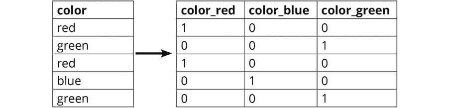

#### 第七章：6\. 集成建模

#### 概述

本章讨论了执行集成建模的不同方法及其优缺点。通过本章内容的学习，你将能够识别机器学习模型中的欠拟合和过拟合问题。你还将能够使用决策树设计一个袋装分类器，并实现自适应提升和梯度提升模型。最后，你将能够利用多个分类器构建一个堆叠集成模型。

#### 介绍

在前面的章节中，我们讨论了两种类型的监督学习问题：回归和分类。我们研究了每种类型的若干算法，并深入了解了这些算法是如何工作的。

但有时这些算法，无论多么复杂，似乎都无法在我们拥有的数据上表现良好。这可能有多种原因——也许数据不够好，也许我们试图找到的趋势根本不存在，或者模型本身过于复杂。

等等，什么？！模型过于复杂怎么会是问题？如果一个模型过于复杂，并且数据不足，那么模型可能会非常拟合数据，甚至学习到噪声和异常值，这正是我们不希望发生的。

通常情况下，当一个复杂的单一算法给出的结果与实际结果相差甚远时，将多个模型的结果进行聚合可以得到一个更接近实际情况的结果。这是因为考虑所有模型的结果时，单个模型的误差很可能会相互抵消。

将多个算法组合在一起以给出综合预测的这种方法是集成建模的基础。集成方法的最终目标是以某种方式将多个表现不佳的基础估计器（即单个算法）组合起来，从而提高系统的整体性能，并使得算法的集成模型比单个算法更为健壮，能够更好地进行泛化。

本章的前半部分，我们将讨论如何通过构建集成模型来帮助我们建立一个健壮的系统，该系统能够做出准确的预测，而不会增加方差。我们将首先讨论模型表现不佳的一些原因，然后介绍偏差和方差的概念，以及过拟合和欠拟合问题。我们将把集成建模作为解决这些性能问题的一种方案，并讨论可用于解决不同类型问题的集成方法，尤其是针对表现不佳的模型。

我们将讨论三种集成方法；即：bagging、boosting 和 stacking。每种方法将从基本理论讲起，并讨论每种方法适合解决的用例，以及哪些用例可能不适合该方法。我们还将通过一些练习，使用 Python 中的 scikit-learn 库来实现这些模型。

在深入探讨这些主题之前，我们首先要熟悉一个数据集，使用这个数据集来演示和理解本章将要涉及的不同概念。接下来的练习将帮助我们做到这一点。在进入练习之前，有必要先了解一下独热编码的概念。

#### 独热编码

那么，什么是独热编码呢？在机器学习中，我们有时会遇到分类输入特征，比如姓名、性别和颜色。这些特征包含的是标签值，而非数值，例如姓名中的 John 和 Tom，性别中的 male 和 female，颜色中的 red、blue 和 green。在这里，blue 就是分类特征——颜色的一个标签。所有机器学习模型都可以处理数值数据，但许多机器学习模型无法处理分类数据，因为它们的基础算法设计方式不支持这种数据。例如，决策树可以处理分类数据，但逻辑回归不能。

为了在使用像逻辑回归这样的模型时仍能利用分类特征，我们将这些特征转化为可用的数值格式。图 6.1 显示了这种转换的样子：

图 6.1：独热编码

图 6.2 显示了应用独热编码后数据集的变化：

图 6.2：应用独热编码

基本上，在这个例子中，有三种颜色类别——红色、蓝色和绿色，因此需要三个二元变量——color_red、color_blue 和 color_green。使用 1 来表示该颜色的二元变量，其他颜色使用 0 表示。这些二元变量——color_red、color_blue 和 color_green——也被称为虚拟变量。有了这些信息，我们可以继续进行我们的练习。

#### 练习 6.01：导入模块并准备数据集

在这个练习中，我们将导入本章所需的所有模块，并将数据集整理好，以便进行接下来的练习：

导入所有需要的模块来操作数据和评估模型：

import pandas as pd

import numpy as np

%matplotlib inline

import matplotlib.pyplot as plt

from sklearn.model_selection import train_test_split

from sklearn.metrics import accuracy_score

from sklearn.model_selection import KFold

我们在本次练习中使用的数据集是 Titanic 数据集，它在前几章中已经介绍过。

读取数据集并打印前五行：

data = pd.read_csv('titanic.csv')

data.head()

#### 注意

上述代码假设数据集存储在与本次练习的 Jupyter Notebook 相同的文件夹中。如果数据集保存在 Datasets 文件夹中，则需要使用以下代码：`data = pd.read_csv('../Datasets/titanic.csv')`

输出如下：

图 6.3: 前五行

为了使数据集准备好使用，我们将添加一个 `preprocess` 函数，该函数将预处理数据集，并将其转换为 scikit-learn 库可以接受的格式。

首先，我们创建一个 `fix_age` 函数来预处理年龄列并获取整数值。如果年龄为 null，该函数返回 -1，以区分其他有效值，否则返回实际值。然后，我们将此函数应用于年龄列。

接着，我们将性别（Gender）列转换为二元变量，女性为 1，男性为 0，然后使用 pandas 的 `get_dummies` 函数为登船港口（Embarked）列创建虚拟二元列。之后，我们将包含虚拟列的 DataFrame 与其余的数值列结合，生成最终的 DataFrame，该函数将返回该 DataFrame：

def preprocess(data):

def fix_age(age):

if np.isnan(age):

return -1

else:

return age

data.loc[:, 'Age'] = data.Age.apply(fix_age)

data.loc[:, 'Gender'] = data.Gender.apply(lambda s: \

int(s == 'female'))

embarked = pd.get_dummies(data.Embarked, \

prefix='Emb')[['Emb_C',\

'Emb_Q','Emb_S']]

cols = ['Pclass','Gender','Age','SibSp','Parch','Fare']

return pd.concat([data[cols], embarked], axis=1).values

将数据集拆分为训练集和验证集。

我们将数据集拆分为两部分——一个用于在练习过程中训练模型（train），另一个用于进行预测并评估每个模型的性能（val）。我们将使用之前编写的函数分别预处理训练集和验证集数据。

在这里，`Survived` 二元变量是目标变量，用于确定每行数据中的个体是否在泰坦尼克号沉船中幸存。因此，我们将创建 `y_train` 和 `y_val` 作为从两个数据子集拆分出的因变量列：

train, val = train_test_split(data, test_size=0.2, random_state=11)

x_train = preprocess(train)

y_train = train['Survived'].values

x_val = preprocess(val)

y_val = val['Survived'].values

print(x_train.shape)

print(y_train.shape)

print(x_val.shape)

print(y_val.shape)

您应该得到如下输出：

(712, 9)

(712,)

(179, 9)

(179,)

如我们所见，数据集现在已分为两部分，训练集包含 712 个数据点，验证集包含 179 个数据点。

#### 注意

要访问该特定部分的源代码，请参阅 [`packt.live/2Nm6KHM`](https://packt.live/2Nm6KHM)。

您也可以在线运行此示例，访问 [`packt.live/2YWh9zg`](https://packt.live/2YWh9zg)。您必须执行整个 Notebook 才能获得预期结果。

在这个练习中，我们首先加载了数据并导入了必要的 Python 模块。然后，我们对数据集的不同列进行了预处理，使其可以用于训练机器学习模型。最后，我们将数据集分为两个子集。现在，在对数据集进行进一步操作之前，我们将尝试理解机器学习中的两个重要概念——过拟合和欠拟合。

#### 过拟合与欠拟合

假设我们将一个有监督学习算法拟合到我们的数据上，然后使用该模型对一个独立的验证集进行预测。根据模型的泛化能力——即它对独立验证集中的数据点进行预测的能力——来评估其性能。

有时候，我们会发现模型无法做出准确的预测，并且在验证数据上表现较差。这种差劲的表现可能是因为模型过于简单，无法适当地建模数据，或者模型过于复杂，无法对验证数据集进行泛化。在前一种情况下，模型具有高偏差，导致欠拟合；在后一种情况下，模型具有高方差，导致过拟合。

偏差

机器学习模型预测中的偏差表示预测的目标值与数据点的真实目标值之间的差异。如果平均预测值与真实值相差较远，则模型被认为具有高偏差；反之，如果平均预测值接近真实值，则模型被认为具有低偏差。

高偏差表示模型无法捕捉数据中的复杂性，无法识别输入和输出之间的相关关系。

方差

机器学习模型预测中的方差表示预测值与真实值之间的分散程度。如果预测值分散且不稳定，则模型被认为具有高方差；反之，如果预测值一致且不太分散，则模型被认为具有低方差。

高方差表明模型无法泛化，并且在模型之前未见过的数据点上无法做出准确的预测。如图所示，这些圆的中心表示数据点的真实目标值，圆点表示数据点的预测目标值：

](img/image-9XB2XBIW.jpg)

图 6.4：具有高偏差和低偏差的数据显示点的视觉表示

#### 欠拟合

假设我们在训练数据集上拟合一个简单的模型，比如一个简单的线性模型。我们拟合了一个能够在一定程度上表示训练数据中 X（输入数据）和 Y（目标输出）数据点之间关系的函数，但我们发现训练误差依然很高：

图 6.5：回归中的欠拟合与理想拟合

例如，看看图 6.5 中显示的两张回归图。第一张图展示了一个将直线拟合到数据的模型，而第二张图展示了一个尝试将相对复杂的多项式拟合到数据的模型，它似乎很好地表示了 X 和 Y 之间的映射关系。

如果我们仔细观察第一个模型（图中左侧），直线通常远离个别数据点，而第二个模型中的数据点则紧密贴合曲线。根据我们在上一节中定义的偏差，我们可以说第一个模型具有较高的偏差。而如果参考模型的方差定义，第一个模型的预测相对一致，因为它对给定输入总是预测一个固定的直线输出。因此，第一个模型具有较低的方差，我们可以说它展示了欠拟合的特征，因为它具有高偏差和低方差的特征；也就是说，尽管它无法捕捉到输入与输出之间的复杂映射，但它在预测上保持一致。该模型在训练数据和验证数据上的预测误差较大。

#### 过拟合

假设我们训练了一个非常复杂的模型，它几乎能够完美地预测训练数据集上的数据。我们已经成功地拟合了一个函数来表示训练数据中 X 和 Y 数据点之间的关系，使得训练数据上的预测误差极低：

图 6.6：回归中的理想拟合与过拟合

通过查看图 6.6 中的两张图，我们可以看到第二张图展示了一个试图将一个高度复杂的函数拟合到数据点上的模型，而左侧的图表示了给定数据的理想拟合。

很明显，当我们尝试使用第二张图中的模型预测在训练集未出现的 X 数据点对应的 Y 值时，我们会发现预测值与真实值相差甚远。这就是过拟合的表现，模型对数据的拟合过于完美，以至于无法对新数据点进行泛化，因为模型学到了训练数据中的随机噪声和离群点。该模型表现出高方差和低偏差的特征：尽管平均预测值与真实值接近，但与真实值相比，它们的分散性较大。

过拟合可能发生的另一种情况是当数据点的数量小于或等于我们尝试拟合到模型的多项式的阶数时。因此，我们应该避免使用以下类型的模型：

多项式的阶数 > 数据点的数量

在数据集极其小的情况下，甚至尝试拟合一个简单的模型也可能导致过拟合。

#### 克服欠拟合与过拟合的问题

从前面的章节中我们可以看到，当我们从过于简单的模型走向过于复杂的模型时，我们会从一个具有高偏差、低方差的欠拟合模型过渡到一个具有低偏差、高方差的过拟合模型。监督学习算法的目标是实现低偏差和低方差，达到欠拟合与过拟合之间的平衡。这也有助于算法从训练数据到验证数据的良好泛化，从而在模型从未见过的数据上表现出色。

当模型欠拟合数据时，提高模型复杂度是改善性能的最佳方式，从而识别数据中的相关关系。这可以通过添加新特征或创建高偏差模型的集成来实现。然而，在这种情况下，增加更多的训练数据并不会有帮助，因为限制因素是模型复杂度，更多的数据并不能减少模型的偏差。

然而，过拟合问题更难解决。以下是一些常用的技术，用于克服过拟合带来的问题：

获取更多数据：一个高度复杂的模型很容易在小数据集上发生过拟合，但在更大的数据集上则不容易发生。

降维：减少特征数量有助于使模型更简单。

正则化：在成本函数中添加一个新的项，以调整系数（特别是在线性回归中，高次项系数）向较低的值逼近。

集成建模：聚合多个过拟合模型的预测可以有效消除预测中的高方差，表现得比单个过拟合训练数据的模型更好。

我们将在本章的后续部分详细讨论集成建模技术。常见的集成类型包括：

袋装法：Bootstrap 聚合法的简称，该技术也用于减少模型的方差并避免过拟合。它涉及一次取出特征和数据点的一个子集，在每个子集上训练一个模型，并随后将所有模型的结果聚合成最终的预测。

提升法：该技术用于减少偏差，而不是减少方差，涉及逐步训练新的模型，重点关注前一个模型中分类错误的数据点。

堆叠法：该技术的目标是提高分类器的预测能力，因为它涉及训练多个模型，然后使用组合算法通过利用所有这些模型的预测输入来进行最终预测。

让我们从袋装法开始，然后再介绍提升法和堆叠法。

#### 袋装法

术语“bagging”来源于一种叫做自助法聚合（bootstrap aggregation）的方法。为了实现一个成功的预测模型，了解在什么情况下我们可以通过使用自助法方法来构建集成模型是很重要的。这类模型在工业界和学术界都得到了广泛应用。

其中一个应用是，这些模型可以用于维基百科文章的质量评估。诸如文章长度、参考文献数量、标题数量和图片数量等特征被用来构建分类器，将维基百科文章分为低质量或高质量文章。在为此任务尝试的多个模型中，随机森林模型——一种我们将在下一节讨论的基于 bagging 的集成分类器——优于其他所有模型，如 SVM、逻辑回归甚至神经网络，其最佳精度和召回率分别为 87.3%和 87.2%。这展示了这类模型的强大能力以及它们在实际应用中的潜力。

在这一节中，我们将讨论如何使用自助法方法创建一个最小化方差的集成模型，并看看我们如何构建一个决策树集成模型，也就是随机森林算法。但什么是自助法，它如何帮助我们构建稳健的集成模型呢？

#### 自助法

自助法方法本质上是指从包含随机选择数据点的数据集中绘取多个样本（每个样本称为重采样），其中每个重采样中的数据点可能会有重叠，并且每个数据点被从整个数据集中选择的概率是相等的：

图 6.7：随机选择数据点

从前面的图示中，我们可以看到，从主数据集中取出的五个重采样样本各不相同，并具有不同的特征。因此，在这些重采样上训练模型将会得出不同的预测结果。

以下是自助法的优点：

每个重采样可能包含与整个数据集不同的特征，从而为我们提供了不同的视角来观察数据的行为。

使用自助法的算法具有强大的构建能力，能够更好地处理未见过的数据，尤其是在较小的数据集上，这类数据集往往会导致过拟合。

自助法方法可以通过使用具有不同变异性和特征的数据集测试模型的稳定性，从而得出一个更加稳健的模型。

现在我们已经了解了什么是自助抽样，那么袋装集成究竟是做什么的呢？简单来说，袋装意味着聚合并行模型的输出，每个模型都是通过自助抽样数据构建的。它本质上是一个集成模型，在每次重采样时生成多个预测器版本，并利用这些版本得到一个聚合的预测器。聚合步骤为我们提供了一个元预测，这个过程涉及对回归问题时的连续数值预测进行求平均，而在分类问题中，则是进行投票。投票可以分为两种类型：

硬投票（基于类别的投票）

软投票（概率投票）

在硬投票中，我们考虑由基础估计器预测的各个类别的多数意见，而在软投票中，我们首先平均各类别的概率值，然后再做出预测。

下图为我们提供了一个可视化的示意，展示了如何通过图 6.7 中所示的自助抽样构建袋装估计器：

图 6.8：通过自助抽样构建的袋装估计器

由于每个模型本质上是独立的，因此所有基础模型可以并行训练，这大大加快了训练过程，因为重采样的数据集比原始数据集小，从而使我们能够充分利用当前计算能力。

袋装本质上有助于减少整个集成的方差。它通过引入随机化到其构建过程中来实现这一点，通常用于那些容易对训练数据过拟合的基础预测器。在这里需要考虑的主要因素是训练数据集的稳定性（或缺乏稳定性）：袋装在数据轻微扰动会导致模型结果显著变化的情况下表现有效，也就是高方差的模型。这就是袋装如何帮助减少方差的方式。

scikit-learn 使用 BaggingClassifier 和 BaggingRegressor 来分别实现用于分类和回归任务的通用袋装集成方法。这些方法的主要输入是用于每次重采样的基础估计器，以及要使用的估计器数量（即重采样次数）。

#### 练习 6.02：使用袋装分类器

在这个练习中，我们将使用 scikit-learn 的袋装分类器作为我们的集成方法，并使用决策树分类器作为基础估计器。我们知道决策树容易发生过拟合，因此它们具有高方差和低偏差，这两者都是用于袋装集成中的基础估计器的重要特征。

我们将在这个练习中使用 Titanic 数据集。请在开始本练习之前，先完成练习 6.01：导入模块并准备数据集：

导入基础分类器和集成分类器：

从 sklearn.tree 导入决策树分类器（DecisionTreeClassifier）

from sklearn.ensemble import BaggingClassifier

指定超参数并初始化模型。

在这里，我们将首先指定基础估计器的超参数，我们使用决策树分类器，并将熵或信息增益作为分裂准则。我们不会对树的深度或每棵树的叶子数量/大小设置任何限制，以便它完全生长。接下来，我们将为 Bagging 分类器定义超参数，并将基础估计器对象作为超参数传递给分类器。

我们将以 50 个基础估计器作为示例，这些估计器将并行运行，并利用机器上可用的所有进程（通过指定 n_jobs=-1 实现）。此外，我们将指定 max_samples 为 0.5，表示引导法中的数据点数量应为总数据集的一半。我们还将设置一个随机状态（为任意值，且在整个过程中保持不变）以确保结果的可重复性：

dt_params = {'criterion': 'entropy', 'random_state': 11}

dt = DecisionTreeClassifier(**dt_params)

bc_params = {'base_estimator': dt, 'n_estimators': 50, \

'max_samples': 0.5, 'random_state': 11, 'n_jobs': -1}

bc = BaggingClassifier(**bc_params)

将 Bagging 分类器模型拟合到训练数据上并计算预测准确率。

现在让我们拟合 Bagging 分类器，并找出训练集和验证集的元预测值。接下来，我们计算训练集和验证数据集的预测准确率：

bc.fit(x_train, y_train)

bc_preds_train = bc.predict(x_train)

bc_preds_val = bc.predict(x_val)

print('Bagging 分类器:\n> 训练数据上的准确率 = {:.4f}'\

'\n> 验证数据上的准确率 = {:.4f}'\

.format(accuracy_score(y_true=y_train, \

y_pred=bc_preds_train)，\

accuracy_score(y_true=y_val, y_pred=bc_preds_val)))

输出如下：

Bagging 分类器：

> 训练数据上的准确率 = 0.9270
> 
> 验证数据上的准确率 = 0.8659

将决策树模型拟合到训练数据上，以比较预测准确率。

现在让我们也拟合决策树（来自步骤 2 中初始化的对象），这样我们就可以比较集成模型和基础预测器的预测准确率：

dt.fit(x_train, y_train)

dt_preds_train = dt.predict(x_train)

dt_preds_val = dt.predict(x_val)

print('决策树:\n> 训练数据上的准确率 = {:.4f}'\

'\n> 验证数据上的准确率 = {:.4f}'\

.format(accuracy_score(y_true=y_train, \

y_pred=dt_preds_train)，\

accuracy_score(y_true=y_val, y_pred=dt_preds_val)))

输出如下：

决策树：

> 训练数据上的准确率 = 0.9831
> 
> 验证数据上的准确率 = 0.7709

在这里，我们可以看到，尽管决策树的训练准确率远高于袋装分类器，但其在验证数据集上的准确率较低，这清楚地表明决策树对训练数据进行了过拟合。而袋装集成方法则通过减少整体方差，产生了更为准确的预测。

#### 注意

要访问这一特定部分的源代码，请参阅 https://packt.live/37O6735。

你也可以在 https://packt.live/2Nh3ayB 上在线运行这个示例。你必须执行整个 Notebook 才能得到预期的结果。

接下来，我们将讨论可能是最广为人知的基于袋装的机器学习模型——随机森林模型。随机森林是一个袋装集成模型，使用决策树作为基础估计器。

#### 随机森林

决策树常面临的一个问题是，在每个节点上的分割是通过贪婪算法完成的，旨在最小化叶节点的熵。考虑到这一点，袋装分类器中的基础估计器决策树在分割特征时仍然可能非常相似，因此它们的预测也可能非常相似。然而，袋装方法只有在基础模型的预测不相关时，才有助于减少预测的方差。

随机森林算法通过不仅对整体训练数据集中的数据点进行自助抽样，还对每棵树可分割的特征进行自助抽样，从而试图克服这个问题。这确保了当贪婪算法在寻找最佳分割特征时，整体最佳特征可能并不总是出现在基础估计器的自助抽样特征中，因此不会被选择——这导致基础树具有不同的结构。这个简单的调整使得最好的估计器能够以一种方式进行训练，从而使得森林中每棵树的预测与其他树的预测之间的相关性较低。

随机森林中的每个基础估计器都有一个数据点的随机样本和一个特征的随机样本。由于该集成由决策树组成，因此该算法被称为随机森林。

#### 练习 6.03：使用随机森林构建集成模型

随机森林的两个主要参数是用于训练每个基础决策树的特征的分数和数据点的分数。

在本次练习中，我们将使用 scikit-learn 的随机森林分类器来构建集成模型。

本次练习中，我们将使用泰坦尼克号数据集。这个练习是练习 6.02《使用袋装分类器》的延续：

导入集成分类器：

来自 `sklearn.ensemble` 的 `RandomForestClassifier`

指定超参数并初始化模型。

在这里，我们将使用熵（entropy）作为决策树的分裂标准，森林中包含 100 棵树。与之前一样，我们不会指定树的深度或叶子节点的大小/数量的限制。与袋装分类器不同，袋装分类器在初始化时需要输入 max_samples，而随机森林算法只需要 max_features，表示自助法样本中的特征数量（或比例）。我们将此值设置为 0.5，以便每棵树只考虑六个特征中的三个：

rf_params = {'n_estimators': 100, 'criterion': 'entropy', \

'max_features': 0.5, 'min_samples_leaf': 10, \

'random_state': 11, 'n_jobs': -1}

rf = RandomForestClassifier(**rf_params)

将随机森林分类器模型拟合到训练数据，并计算预测准确度。

现在，我们将拟合随机森林模型，并找到训练集和验证集的元预测。接下来，找出训练和验证数据集的预测准确度：

rf.fit(x_train, y_train)

rf_preds_train = rf.predict(x_train)

rf_preds_val = rf.predict(x_val)

print('随机森林：\n> 训练数据集准确度 = {:.4f}'\

'\n> 验证数据集准确度 = {:.4f}'\

.format(accuracy_score(y_true=y_train, \

y_pred=rf_preds_train), \

accuracy_score(y_true=y_val, y_pred=rf_preds_val)))

输出如下：

随机森林：

> 训练数据集准确度 = 0.8385
> 
> 验证数据集准确度 = 0.8771

如果将随机森林在我们的数据集上的预测准确度与袋装分类器进行比较，我们会发现验证集上的准确度几乎相同，尽管后者在训练数据集上的准确度较高。

#### 注意

若要访问该特定部分的源代码，请参阅 https://packt.live/3dlvGtd。

你也可以在 https://packt.live/2NkSPS5 上在线运行此示例。你必须执行整个 Notebook 才能获得预期结果。

#### 提升

我们接下来要讨论的第二种集成技术是提升（boosting），它通过逐步训练新模型来集中关注上一模型中被误分类的数据点，并利用加权平均将弱模型（具有较高偏差的欠拟合模型）转化为更强的模型。与袋装方法不同，袋装方法中的每个基础估计器可以独立训练，而提升算法中的每个基础估计器的训练依赖于前一个模型。

尽管提升（boosting）也使用了自助法（bootstrapping）概念，但与袋装（bagging）不同，它的实现方式不同，因为每个数据样本都有权重，这意味着某些自助法样本在训练中可能会比其他样本更频繁地被使用。在训练每个模型时，算法会跟踪哪些特征最有用，以及哪些数据样本的预测误差最大；这些样本会被赋予更高的权重，并被认为需要更多的迭代才能正确训练模型。

在预测输出时，提升集成会对每个基础估计器的预测结果进行加权平均，给训练阶段错误较低的预测结果赋予更高的权重。这意味着，对于在某次迭代中被错误分类的数据点，这些数据点的权重会被增加，从而使下一个模型更可能正确分类这些数据点。

与袋装法（bagging）类似，所有提升（boosting）基础估计器的结果被汇总以产生一个元预测。然而，与袋装法不同，提升集成的准确性会随着基础估计器数量的增加而显著提高：

图 6.9：一个提升集成模型

在图示中，我们可以看到，在每次迭代之后，被错误分类的点的权重（以较大的图标表示）增加，以便下一个训练的基础估计器能够集中关注这些点。最终的预测器将每个基础估计器的决策边界进行汇总。

提升在实际应用中被广泛使用。例如，商业化的网页搜索引擎 Yahoo 和 Yandex 在其机器学习排名引擎中使用了提升的变体。排名是根据搜索查询找到最相关文档的任务。特别是对于 Yandex 来说，他们采用了一种基于梯度提升（gradient boosting）的方法来构建集成树模型，该模型通过实现最低的折扣累积增益 4.14123，比其他模型，包括 Yandex 之前使用的模型表现得更好。这显示了基于提升的建模在现实场景中的巨大实用价值。

#### 注意

阅读更多关于 Yandex 的信息，请访问以下链接： http://webmaster.ya.ru/replies.xml?item_no=5707&ncrnd=5118.

#### 自适应提升

现在让我们谈谈一种叫做自适应提升（adaptive boosting）的技术，它最适用于提升决策树桩在二分类问题中的表现。决策树桩本质上是深度为一的决策树（仅对单一特征进行一次分裂），因此是弱学习器。自适应提升工作的主要原理与此相同：通过提高基础估计器无法正确分类的区域，将一组弱学习器转化为强学习器。

首先，首个基学习器从主训练集抽取一个自助法的数据点，并拟合一个决策桩来分类这些样本点，接着，训练过的决策桩会拟合整个训练数据。对于那些被错误分类的样本，增加权重，使这些数据点在下一个基学习器的自助法抽样中被选中的概率更高。然后，再次对新抽样的数据点进行训练，进行分类。接着，由这两个基学习器组成的小型集成模型被用来分类整个训练集中的数据点。第二轮中被错误分类的数据点会被赋予更高的权重，以提高它们被选中的概率，直到集成模型达到它应该包含的基学习器数量的限制。

自适应提升的一个缺点是，算法很容易受到噪声数据点和异常值的影响，因为它尝试完美拟合每一个数据点。因此，如果基学习器数量过多，它容易出现过拟合。

#### 练习 6.04：实现自适应提升

在这个练习中，我们将使用 scikit-learn 的自适应提升算法进行分类，即 AdaBoostClassifier：

我们将再次使用 Titanic 数据集。这个练习是练习 6.03《使用随机森林构建集成模型》的延续：

导入分类器：

from sklearn.ensemble import AdaBoostClassifier

指定超参数并初始化模型。

在这里，我们首先指定基学习器的超参数，使用的是一个最大深度为 1 的决策树分类器，即一个决策桩。接着，我们会定义 AdaBoost 分类器的超参数，并将基学习器对象作为超参数传递给分类器：

dt_params = {'max_depth': 1, 'random_state': 11}

dt = DecisionTreeClassifier(**dt_params)

ab_params = {'n_estimators': 100, 'base_estimator': dt, \

'random_state': 11}

ab = AdaBoostClassifier(**ab_params)

将模型拟合到训练数据上。

现在，让我们拟合 AdaBoost 模型，并计算训练集和验证集的元预测。接着，我们来计算训练集和验证集的数据集上的预测准确度：

ab.fit(x_train, y_train)

ab_preds_train = ab.predict(x_train)

ab_preds_val = ab.predict(x_val)

print('自适应提升：\n> 训练数据的准确率 = {:.4f}'\

'\n> 验证数据的准确率 = {:.4f}'\

.format(accuracy_score(y_true=y_train, \

y_pred=ab_preds_train), \

accuracy_score(y_true=y_val, y_pred=ab_preds_val)

))

输出结果如下：

自适应提升：

> 训练数据的准确率 = 0.8272
> 
> 验证数据的准确率 = 0.8547

计算模型在不同数量的基学习器下，对训练数据和验证数据的预测准确度。

之前我们提到过，准确率随着基本估计器数量的增加而增加，但如果使用的基本估计器过多，模型也有可能出现过拟合。现在让我们计算预测准确率，以便找出模型开始过拟合训练数据的点：

ab_params = {'base_estimator': dt, 'random_state': 11}

n_estimator_values = list(range(10, 210, 10))

train_accuracies, val_accuracies = [], []

对于 n_estimators 中的每个值：

ab = AdaBoostClassifier(n_estimators=n_estimators, **ab_params)

ab.fit(x_train, y_train)

ab_preds_train = ab.predict(x_train)

ab_preds_val = ab.predict(x_val)

train_accuracies.append(accuracy_score(y_true=y_train, \

y_pred=ab_preds_train))

val_accuracies.append(accuracy_score(y_true=y_val, \

y_pred=ab_preds_val))

绘制折线图，以可视化训练和验证数据集上预测准确率的趋势：

plt.figure(figsize=(10,7))

plt.plot(n_estimator_values, train_accuracies, label='训练')

plt.plot(n_estimator_values, val_accuracies, label='验证')

plt.ylabel('准确率')

plt.xlabel('n_estimators')

plt.legend()

plt.show()

输出结果如下：

图 6.10：预测准确率的趋势

正如前面提到的，我们可以看到训练准确率几乎始终随着决策树桩数量的增加（从 10 到 200）而不断提高。然而，验证准确率在 0.84 到 0.86 之间波动，并且随着决策树桩数量的增加而开始下降。这是因为 AdaBoost 算法也在尝试拟合噪声数据点和异常值。

#### 注意

要访问此特定部分的源代码，请参阅 https://packt.live/2V4zB7K。

您也可以在线运行此示例，网址为 https://packt.live/3dhSBpu。您必须执行整个 Notebook 才能获得预期的结果。

#### 梯度提升

梯度提升是提升方法的扩展，它将提升视为一个优化问题。定义了一个损失函数，代表了误差残差（预测值与真实值之间的差异），并使用梯度下降算法来优化损失函数。

在第一步中，添加一个基本估计器（即弱学习器），并在整个训练数据集上进行训练。计算预测的损失，并为减少误差残差，更新损失函数，添加更多的基本估计器，来处理现有估计器表现不佳的数据点。接下来，算法迭代地添加新的基本估计器并计算损失，使得优化算法能够更新模型并最小化残差。

在自适应提升的情况下，决策树桩被用作基础估计器的弱学习器。然而，对于梯度提升方法，可以使用更大的树，但弱学习器仍然需要受到限制，通过设置最大层数、节点数、分裂数或叶节点数的限制。这确保了基础估计器仍然是弱学习器，但它们可以以贪婪的方式构建。

从之前的章节我们知道，梯度下降算法可以用来最小化一组参数，比如回归方程中的系数。然而，在构建集成时，我们使用的是决策树，而不是需要优化的参数。在每一步计算损失后，梯度下降算法必须调整将要加入集成的新树的参数，以减少损失。这种方法更常被称为功能梯度下降。

#### 练习 6.05：实现 GradientBoostingClassifier 来构建集成模型

梯度提升分类器的两个主要参数是用于训练每棵基础决策树的特征的比例和需要进行自助抽样的数据点比例。

在这个练习中，我们将使用 scikit-learn 的梯度提升分类器来构建提升集成模型。

这个练习是练习 6.04：实现自适应提升的延续。

导入集成分类器：

来自 sklearn.ensemble 的导入 GradientBoostingClassifier

指定超参数并初始化模型。

在这里，我们将使用 100 棵决策树作为基础估计器，每棵树的最大深度为 3，并且每个叶节点至少有 5 个样本。尽管我们没有像之前的示例那样使用决策树桩，但树仍然很小，可以认为是一个弱学习器：

gbc_params = {'n_estimators': 100, 'max_depth': 3, \

'min_samples_leaf': 5, 'random_state': 11}

gbc = GradientBoostingClassifier(**gbc_params)

将梯度提升模型拟合到训练数据，并计算预测准确率。

现在，让我们拟合集成模型并找到训练集和验证集的元预测。接下来，我们将计算训练集和验证集上的预测准确率：

gbc.fit(x_train, y_train)

gbc_preds_train = gbc.predict(x_train)

gbc_preds_val = gbc.predict(x_val)

print('梯度提升分类器：'\

'\n> 训练数据的准确率 = {:.4f}'\

'\n> 验证数据的准确率 = {:.4f}'\

.format(accuracy_score(y_true=y_train, \

y_pred=gbc_preds_train), \

accuracy_score(y_true=y_val, y_pred=gbc_preds_val)))

输出如下：

梯度提升分类器：

> 训练数据上的准确率 = 0.8961
> 
> 验证数据上的准确率 = 0.8771

#### 注意

要访问此特定部分的源代码，请参阅 https://packt.live/37QANjZ。

你也可以在线运行这个示例，网址是 https://packt.live/2YljJ2D。你必须执行整个 Notebook 才能获得期望的结果。

我们可以看到，梯度提升集成模型在训练和验证数据集上的准确度都高于自适应提升集成模型。

#### 堆叠

堆叠（Stacking）或堆叠泛化，也叫元集成（meta ensembling），是一种模型集成技术，旨在将多个模型的预测结果合并并作为特征，生成一个新的模型。堆叠模型通常会超越每个单独模型的表现，因为它加入了平滑效应，并且能“选择”在某些情境下表现最好的基础模型。考虑到这一点，堆叠通常在每个基础模型彼此之间有显著差异时最为有效。

堆叠在实际应用中被广泛使用。一个著名的例子来自著名的 Netflix 竞赛，两位顶尖参赛者基于堆叠模型构建了解决方案。Netflix 是一个知名的流媒体平台，这场竞赛的内容是构建最好的推荐引擎。获胜算法基于特征加权线性堆叠（feature-weighted-linear-stacking），其基本上是通过从单个模型/算法（如奇异值分解（SVD）、限制玻尔兹曼机（RBM）和 K 最近邻（KNN））中提取元特征。例如，一个元特征是 60 因子序数 SVD 的标准差。这些元特征被认为是实现获胜模型所必需的，证明了堆叠在实际应用中的强大能力。

堆叠使用基础模型的预测作为训练最终模型时的附加特征——这些被称为元特征。堆叠模型本质上充当一个分类器，确定每个模型在何处表现良好，何处表现较差。

然而，不能简单地将基础模型在完整的训练数据上训练，在完整的验证数据集上生成预测，然后将这些预测用于二级训练。这么做有可能导致你的基础模型预测已经“看到”测试集，因此在输入这些预测时会发生过拟合。

需要注意的是，对于每一行的元特征，其值不能使用包含该行的训练数据中的模型进行预测，因为这样我们就有可能发生过拟合，因为基础预测模型已经“看到”了该行的目标变量。常见的做法是将训练数据分成 k 个子集，这样，在为每个子集寻找元特征时，我们只在剩余数据上训练模型。这样做还避免了模型已经“看到”数据而发生过拟合的问题：

图 6.11：堆叠集成

上面的图示展示了如何执行此操作：我们将训练数据划分为 k 个子集，并通过在其余 k-1 个子集上训练模型来找到每个子集上的基础模型预测值。因此，一旦我们获得了每个子集的元预测值，我们就可以将这些元预测值与原始特征一起用于训练堆叠模型。

#### 练习 6.06：构建堆叠模型

在这个练习中，我们将使用支持向量机（scikit-learn 的 LinearSVC）和 k 近邻（scikit-learn 的 KNeighborsClassifier）作为基础预测器，而堆叠模型将是一个逻辑回归分类器。

这个练习是练习 6.05 的延续，练习 6.05 中实现了 GradientBoostingClassifier 来构建集成模型：

导入基础模型和用于堆叠的模型：

# 基础模型

来自 sklearn.neighbors 的 KNeighborsClassifier

来自 sklearn.svm 的 LinearSVC

# 堆叠模型

来自 sklearn.linear_model 的 LogisticRegression

创建一个新的训练集，新增基础预测器的预测结果列。

我们需要为每个模型的预测值创建两个新列，作为集成模型的特征，分别用于测试集和训练集。由于 NumPy 数组是不可变的，我们将创建一个新的数组，该数组的行数与训练数据集相同，列数比训练数据集多两个。创建完数据集后，我们可以打印它来查看效果：

x_train_with_metapreds = np.zeros((x_train.shape[0], \

x_train.shape[1]+2))

x_train_with_metapreds[:, :-2] = x_train

x_train_with_metapreds[:, -2:] = -1

print(x_train_with_metapreds)

输出结果如下：

图 6.12：预测值的新列

如我们所见，每行的末尾有两个额外的列，填充了-1 值。

使用 k 折交叉验证策略训练基础模型。

设定 k=5\. 对于这五个子集，在其他四个子集上进行训练，并在第五个子集上进行预测。这些预测结果应该被添加到新的 NumPy 数组中用于存放基本预测结果的占位符列中。

首先，我们初始化 KFold 对象，设置 k 值和随机状态以保持可复现性。kf.split()函数接受需要拆分的数据集作为输入，并返回一个迭代器，每个迭代器元素对应于训练和验证子集的索引列表。在每次循环中，这些索引值可以用于划分训练数据，并为每行执行训练和预测。

一旦数据被适当地划分，我们在四分之五的数据上训练两个基础预测器，并在剩余的五分之一行上进行预测。然后，这些预测结果被插入我们在第 2 步初始化时填充为-1 的两个占位符列中：

kf = KFold(n_splits=5, random_state=11)

for train_indices, val_indices in kf.split(x_train):

kfold_x_train, kfold_x_val = x_train[train_indices], \

x_train[val_indices]

kfold_y_train, kfold_y_val = y_train[train_indices], \

y_train[val_indices]

svm = LinearSVC(random_state=11, max_iter=1000)

svm.fit(kfold_x_train, kfold_y_train)

svm_pred = svm.predict(kfold_x_val)

knn = KNeighborsClassifier(n_neighbors=4)

knn.fit(kfold_x_train, kfold_y_train)

knn_pred = knn.predict(kfold_x_val)

x_train_with_metapreds[val_indices, -2] = svm_pred

x_train_with_metapreds[val_indices, -1] = knn_pred

创建一个新的验证集，添加来自基础预测器的预测的附加列。

如同我们在步骤 2 中所做的，我们也将在验证数据集中为基础模型预测添加两列占位符：

x_val_with_metapreds = np.zeros((x_val.shape[0], \

x_val.shape[1]+2))

x_val_with_metapreds[:, :-2] = x_val

x_val_with_metapreds[:, -2:] = -1

print(x_val_with_metapreds)

输出结果如下：

图 6.13：来自基础预测器的预测的附加列

在完整的训练集上拟合基础模型，以获取验证集的元特征。

接下来，我们将在完整的训练数据集上训练两个基础预测器，以获取验证数据集的元预测值。这类似于我们在步骤 3 中为每个折叠所做的工作：

svm = LinearSVC(random_state=11, max_iter=1000)

svm.fit(x_train, y_train)

knn = KNeighborsClassifier(n_neighbors=4)

knn.fit(x_train, y_train)

svm_pred = svm.predict(x_val)

knn_pred = knn.predict(x_val)

x_val_with_metapreds[:, -2] = svm_pred

x_val_with_metapreds[:, -1] = knn_pred

训练堆叠模型并使用最终预测计算准确度。

最后的步骤是使用训练数据集的所有列加上基础估算器的元预测来训练逻辑回归模型。我们使用该模型来计算训练集和验证集的预测准确度：

lr = LogisticRegression(random_state=11)

lr.fit(x_train_with_metapreds, y_train)

lr_preds_train = lr.predict(x_train_with_metapreds)

lr_preds_val = lr.predict(x_val_with_metapreds)

print('堆叠分类器：\n> 训练数据集上的准确度 = {:.4f}'\

'\n> 验证数据集上的准确度 = {:.4f}'\

.format(accuracy_score(y_true=y_train, \

y_pred=lr_preds_train), \

accuracy_score(y_true=y_val, y_pred=lr_preds_val)))

输出结果如下：

堆叠分类器：

> 训练数据集上的准确度 = 0.7837
> 
> 验证数据集上的准确度 = 0.8827

#### 注意

由于随机化，你可能会得到一个与前一步骤中呈现的输出略有不同的结果。

比较与基础模型的准确度。

为了了解堆叠模型带来的性能提升，我们计算基础预测器在训练集和验证集上的准确度，并将其与堆叠模型的准确度进行比较：

print('SVM:\n> 训练数据集上的准确度 = {:.4f}'\

'\n> 验证数据集上的准确度 = {:.4f}'\

.format(accuracy_score(y_true=y_train, \

y_pred=svm.predict(x_train)), \

accuracy_score(y_true=y_val, y_pred=svm_pred)))

print('kNN:\n> 训练数据的准确度 = {:.4f}'\

'\n> 验证数据的准确度 = {:.4f}'\

.format(accuracy_score(y_true=y_train, \

y_pred=knn.predict(x_train)), \

accuracy_score(y_true=y_val, y_pred=knn_pred)))

输出如下：

SVM

> 训练数据的准确度 = 0.7205
> 
> 验证数据的准确度 = 0.7430

kNN:

> 训练数据的准确度 = 0.7921
> 
> 验证数据的准确度 = 0.6816

#### 注意

由于随机化，您可能会得到与前一步骤中呈现的输出略有不同的结果。

如我们所见，堆叠模型不仅给出了比任何基模型显著更高的验证准确度，而且它的准确度几乎达到 89%，是本章讨论的所有集成模型中最高的。

#### 注意

要访问此特定部分的源代码，请参考 [`packt.live/37QANjZ`](https://packt.live/37QANjZ)。

您也可以在 [`packt.live/2YljJ2D`](https://packt.live/2YljJ2D) 上在线运行此示例。您必须执行整个 Notebook 才能获得预期结果。

#### 活动 6.01：使用独立和集成算法的堆叠

在本活动中，我们将使用波士顿房价：高级回归技术数据库（可以在 [`archive.ics.uci.edu/ml/machine-learning-databases/housing/`](https://archive.ics.uci.edu/ml/machine-learning-databases/housing/) 或 GitHub 上的 [`packt.live/2Vk002e`](https://packt.live/2Vk002e) 获得）。

该数据集旨在解决回归问题（即，目标变量具有一系列连续值）。在本活动中，我们将使用决策树、k 最近邻、随机森林和梯度提升算法训练各个回归模型。然后，我们将构建一个堆叠线性回归模型，使用所有这些算法，并比较每个模型的表现。我们将使用平均绝对误差（MAE）作为本活动的评估标准。

#### 注意

MAE 函数（mean_absolute_error()）可以像以前使用的 accuracy_score()度量一样使用。

需要执行的步骤如下：

导入相关库。

读取数据。

预处理数据集以去除空值，并进行独热编码以处理类别变量，为建模准备数据。

将数据集划分为训练和验证 DataFrame。

初始化字典以存储训练和验证的 MAE 值。

使用以下超参数训练一个 DecisionTreeRegressor 模型（dt）并保存分数：

dt_params = {

'criterion': 'mae',

'min_samples_leaf': 15,

'random_state': 11

}

使用以下超参数训练一个 KNeighborsRegressor 模型（knn）并保存分数：

knn_params = {

'n_neighbors': 5

}

使用以下超参数训练一个 RandomForestRegressor 模型（rf）并保存分数：

rf_params = {

'n_estimators': 20,

'criterion': 'mae',

'max_features': 'sqrt',

'min_samples_leaf': 10,

'random_state': 11,

'n_jobs': -1

}

使用以下超参数训练一个 GradientBoostingRegressor 模型（gbr）并保存分数：

gbr_params = {

'n_estimators': 20,

'criterion': 'mae',

'max_features': 'sqrt',

'min_samples_leaf': 10,

'random_state': 11

}

准备训练和验证数据集，四个元估计器的超参数与前面的步骤中使用的超参数相同。

训练一个线性回归模型（lr）作为堆叠模型。

可视化每个单独模型和堆叠模型的训练和验证误差。

输出将如下所示：

图 6.14：训练和验证误差的可视化

#### 注意

这个活动的解决方案可以通过以下链接找到。

因此，我们已经成功演示了堆叠作为一种集成技术，在不同数据集上，相较于任何单一机器学习模型，在验证集准确性方面表现更优。

#### 总结

在本章中，我们首先讨论了过拟合和欠拟合，以及它们如何影响模型在未见数据上的表现。本章探讨了集成建模作为这些模型的解决方案，并进一步讨论了可以使用的不同集成方法，以及它们如何减少在进行预测时遇到的整体偏差或方差。我们首先讨论了袋装算法，并介绍了自助采样的概念。

接着，我们以随机森林作为经典的袋装集成方法的例子，解决了涉及在之前看到的泰坦尼克号数据集上构建袋装分类器和随机森林分类器的练习。然后，我们讨论了提升算法，它们如何成功地减少系统中的偏差，并理解了如何实现自适应提升和梯度提升。我们讨论的最后一种集成方法是堆叠，从练习中我们看到，堆叠在所有实现的集成方法中给出了最佳的准确性得分。虽然构建集成模型是减少偏差和方差的好方法，并且这些模型通常比单一模型表现更好，但它们本身也有各自的问题和使用场景。袋装在避免过拟合时非常有效，而提升方法则能减少偏差和方差，尽管它仍然可能会有过拟合的趋势。堆叠则适用于当一个模型在部分数据上表现良好，而另一个模型在另一部分数据上表现更好时。

在下一章，我们将详细探讨如何通过查看验证技术来克服过拟合和欠拟合的问题，验证技术即是判断我们模型表现的方式，以及如何使用不同的指标作为标志，为我们的使用案例构建最佳模型。
