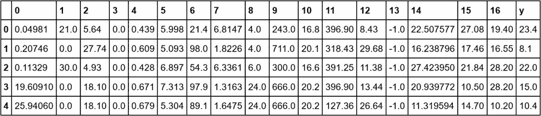
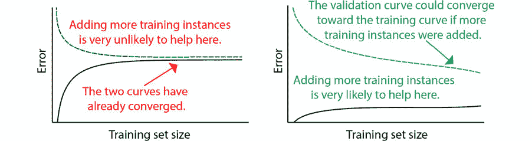

#### 第八章：7\. 模型评估

#### 概述

本章介绍了如何通过使用超参数和模型评估指标来提升模型的性能。你将了解如何使用多种指标评估回归和分类模型，并学习如何选择合适的指标来评估和调优模型。

本章结束时，你将能够实施各种采样技术并进行超参数调整，以找到最佳模型。你还将具备计算特征重要性以进行模型评估的能力。

#### 介绍

在前几章中，我们讨论了两种监督学习问题：回归和分类，然后介绍了集成模型，这些模型是由多个基础模型组合而成。我们构建了多个模型并讨论了它们的工作原理和原因。然而，这些还不足以将模型投入生产。模型开发是一个迭代过程，模型训练步骤之后是验证和更新步骤，如下图所示：

图 7.1：机器学习模型开发过程

本章将解释上图流程图中的外围步骤；我们将讨论如何选择合适的超参数，并如何使用合适的错误指标进行模型验证。提高模型性能是通过迭代执行这两个任务来完成的。那么，为什么评估模型如此重要呢？假设你已经训练好了模型，并提供了一些超参数，做出了预测，并得到了准确度。这就是模型的核心，但你如何确保你的模型能够发挥最佳性能呢？我们需要确保你制定的性能评估标准确实能够代表模型，并且它在未见过的测试数据集上也能表现良好。确保模型是最佳版本的关键步骤发生在初始训练之后：评估和提高模型性能的过程。本章将带你了解这一过程中所需的核心技术。

在本章中，我们将首先讨论为什么模型评估很重要，并介绍几种用于回归任务和分类任务的评估指标，这些指标可以用来量化模型的预测性能。接下来，我们将讨论保留数据集和 k 折交叉验证，并解释为什么必须有一个独立于验证集的测试集。之后，我们将探讨可以用来提高模型性能的策略。在上一章中，我们讨论了高偏差或高方差的模型如何导致次优的性能，以及如何通过构建模型集成来帮助我们建立一个稳健的系统，使预测更加准确，而不会增加整体方差。我们还提到了以下技术来避免将模型过度拟合到训练数据：

获取更多数据：一个高度复杂的模型可能容易在小数据集上过拟合，但在较大数据集上可能不容易过拟合。

降维：减少特征数量可以帮助使模型更简单。

正则化：在代价函数中添加一个新的项，以便将系数（特别是线性回归中的高次项系数）调整到较小的值。

在本章中，我们将介绍学习曲线和验证曲线，这些曲线可以帮助我们查看训练和验证误差的变化，了解模型是否需要更多数据，以及适当的复杂度级别在哪里。接下来我们将讨论超参数调优以提高性能，并简要介绍特征重要性。

#### 注意

本章的所有相关代码可以在这里找到：https://packt.live/2T1fCWM。

#### 导入模块并准备数据集

在前面的练习和活动中，我们使用了诸如平均绝对误差（MAE）和准确率等术语。在机器学习中，这些被称为评估指标，在接下来的部分中，我们将讨论一些有用的评估指标，它们是什么，如何使用以及何时使用它们。

#### 注意

虽然这一部分没有被定位为练习，但我们鼓励你通过执行呈现的代码，仔细跟进这一部分。我们将在接下来的练习中使用这里展示的代码。

我们现在将加载在第六章《集成建模》中训练的数据和模型。我们将使用在活动 6.01《使用独立和集成算法进行堆叠》中创建的堆叠线性回归模型，以及在练习 6.06《使用随机森林构建集成模型》中创建的随机森林分类模型，来预测乘客的生存情况。

首先，我们需要导入相关的库：

import pandas as pd

import numpy as np

import pickle

%matplotlib inline

import matplotlib.pyplot as plt

接下来，加载第六章集成建模中处理过的数据文件。我们将使用 pandas 的 `read_csv()` 方法读取我们准备好的数据集，这些数据集将在本章的练习中使用。首先，我们将读取房价数据：

house_prices_reg = \

pd.read_csv('../Datasets/boston_house_prices_regression.csv')

house_prices_reg.head()

我们将看到以下输出：

图 7.2：房价数据集的前五行

接下来，我们将读取 Titanic 数据：

titanic_clf = pd.read_csv('../Datasets/titanic_classification.csv')

titanic_clf.head()

我们将看到以下输出：

图 7.3：Titanic 数据集的前五行

接下来，使用 pickle 库从二进制文件加载本章练习中将使用的模型文件：

使用`open('../../Saved_Models/titanic_regression.pkl', 'rb')`打开文件：

reg = pickle.load(f)

使用`open('../../Saved_Models/random_forest_clf.pkl', 'rb')`打开文件：

rf = pickle.load(f)

使用`open('../../Saved_Models/stacked_linear_regression.pkl',\`

'rb') as f:

reg = pickle.load(f)

到目前为止，我们已经成功加载了必要的数据集以及从前面的练习和活动中训练好的机器学习模型。在开始使用这些加载的数据集和模型探索评估指标之前，让我们首先了解不同类型的评估指标。

#### 注意

你可以在以下链接找到保存的模型文件：https://packt.live/2vjoSwf。

#### 评估指标

评估机器学习模型是任何项目中的一个关键部分：一旦我们让模型从训练数据中学习，下一步就是衡量模型的性能。我们需要找到一种指标，不仅能够告诉我们模型预测的准确性，还能让我们比较多个模型的性能，从而选择最适合我们用例的模型。

定义一个指标通常是我们在定义问题陈述时要做的第一件事，而且是在开始进行探索性数据分析之前，因为提前规划并思考如何评估我们所构建的任何模型的表现，以及如何判断其是否达到最佳表现，都是一个好主意。最终，计算性能评估指标将成为机器学习管道的一部分。

不用多说，回归任务和分类任务的评估指标是不同的，因为前者的输出值是连续的，而后者的输出值是类别型的。在本节中，我们将探讨可以用来量化模型预测性能的不同指标。

#### 回归指标

对于输入变量 X，回归模型给出了一个预测值，该值可以取一系列不同的值。理想的情况是模型预测的值尽可能接近实际值 y。因此，二者之间的差异越小，模型表现得越好。回归度量通常涉及查看每个数据点的预测值与实际值之间的数值差异（即残差或误差值），然后以某种方式聚合这些差异。

让我们看一下下面的图表，该图展示了每个 X 点的实际值与预测值：

](img/image-R47Y9F4G.jpg)

图 7.4：线性回归问题中实际输出与预测输出之间的残差

然而，我们不能仅仅对所有数据点求平均值，因为可能会有数据点的预测误差为正或负，最终聚合会取消掉许多误差，严重高估模型的性能。

相反，我们可以考虑每个数据点的绝对误差并计算 MAE，公式如下：

](img/image-HF45QXRY.jpg)

图 7.5：平均绝对误差

这里，yi 和 ŷi 分别是第 i 个数据点的实际值和预测值。

MAE 是一个线性评分函数，这意味着在聚合误差时，它对每个残差赋予相等的权重。MAE 可以取从零到无穷大的任何值，且对误差的方向（正或负）不敏感。由于这些是误差指标，通常情况下，较低的值（尽可能接近零）是更可取的。

为了避免误差方向影响性能估计，我们还可以对误差项进行平方处理。对平方误差求平均得到均方误差（MSE）：

](img/image-E2RVLXAK.jpg)

图 7.6：均方误差

虽然 MAE 与目标变量 y 具有相同的单位，但 MSE 的单位将是 y 的平方单位，这可能会使得在实际应用中评估模型时，MSE 的解释性稍差。不过，如果我们取 MSE 的平方根，就得到了均方根误差（RMSE）：

](img/image-TZPF7OIL.jpg)

图 7.7：均方根误差

由于在求平均之前，误差被平方，甚至少数较高的误差值也可能导致 RMSE 值显著增加。这意味着 RMSE 在判断我们希望惩罚大误差的模型时，比 MAE 更有用。

由于 MAE 和 RMSE 与目标变量具有相同的单位，因此很难判断某个特定的 MAE 或 RMSE 值是好还是坏，因为没有可参考的尺度。为了解决这个问题，通常使用一个度量标准，即 R² 得分或 R-squared 得分：

](img/image-BTCJID5U.jpg)

图 7.8：R 平方分数

R2 分数的下限为 -∞，上限为 1。基本模型将目标变量预测为训练数据集目标值的均值 μ，数学表示为：

图 7.9：训练数据集目标值的均值表达式

因此，对于基本模型：

图 7.10：基本模型目标变量的表达式

记住这一点，如果 R2 的值为负，则表示训练模型的预测比简单预测所有数据的均值还差；如果 R2 值接近 1，则表示模型的 MSE 接近 0。

#### 练习 7.01：计算回归指标

在本练习中，我们将使用与第六章“集成建模”中活动 6.01“单一算法与集成算法堆叠”中训练的相同模型和处理后的数据集来计算回归指标。我们将使用 scikit-learn 实现的 MAE 和 MSE：

#### 注意

在开始本练习之前，确保已按照“导入模块和准备数据集”部分列出的方式导入相关库和模型。

此练习的代码可以在这里找到：

导入指标函数：

from sklearn.metrics import mean_absolute_error, \

mean_squared_error, r2_score

from math import sqrt

使用已加载的模型对给定数据进行预测。我们将使用与活动 6.01“单一算法与集成算法堆叠”中相同的特征，在第六章“集成建模”中，并使用该模型对加载的数据集进行预测。我们保存的列 y 是目标变量，我们将相应地创建 X 和 y：

X = house_prices_reg.drop(columns=['y'])

y = house_prices_reg['y'].values

y_pred = reg.predict(X)

计算 MAE、RMSE 和 R2 分数。让我们打印预测值中的 MAE 和 RMSE 的值。同时，打印模型的 R2 分数：

print('平均绝对误差 = {}'\

.format(mean_absolute_error(y, y_pred)))

print('均方根误差 = {}'\

.format(sqrt(mean_squared_error(y, y_pred))))

print('R 平方分数 = {}'.format(r2_score(y, y_pred)))

输出将如下所示：

平均绝对误差 = 2.874084343939712

均方根误差 = 4.50458397908091

R 平方分数 = 0.7634986504091822

我们可以看到，RMSE 高于 MAE。这表明存在一些残差特别高的数据点，较大的 RMSE 值突出了这一点。但是 R2 分数接近 1，表明该模型与基本模型相比，实际上具有接近理想的性能，基本模型会预测目标变量为平均值。

#### 注意

要访问此特定部分的源代码，请参考 https://packt.live/3epdfp3。

你也可以在网上运行这个示例，网址是 [`packt.live/3hMLBnY`](https://packt.live/3hMLBnY)。你必须执行整个笔记本才能获得期望的结果。

#### 分类指标

对于一个输入变量 X，分类任务会给出一个预测值，该值可以取有限的一组值（在二分类问题中为两个值）。由于理想情况下是预测每个数据点的类别与实际类别相同，因此没有衡量预测类别与实际类别之间距离的标准。因此，判断模型性能的标准就简单得多，基本上就是判断模型是否正确预测了类别。

判断分类模型的性能可以通过两种方式进行：使用数值指标，或通过绘制曲线并观察曲线的形状。我们将更详细地探讨这两种方法。

#### 数值指标

判断模型性能最简单、最基本的方法是计算正确预测与总预测数之比，这给出了准确率，如下图所示：

图 7.11：准确率

尽管准确率指标无论类别数目如何都是相同的，接下来的几个指标将在二分类问题的背景下讨论。此外，在许多情况下，准确率可能不是判断分类任务性能的最佳指标。

我们来看一个欺诈检测的示例：假设问题是检测某封邮件是否欺诈。我们的数据集在这种情况下是高度倾斜的（或不平衡的，也就是说，一个类别的数据点比另一个类别的数据点要多得多），其中 10,000 封邮件中有 100 封（占总数的 1%）被标记为欺诈（属于类别 1）。假设我们构建了两个模型：

第一个模型简单地将每封邮件预测为不是欺诈邮件，也就是说，10,000 封邮件中每一封都被分类为类别 0。在这种情况下，10,000 封邮件中的 9,900 封被正确分类，这意味着模型的准确率为 99%。

第二个模型预测了 100 封欺诈邮件为欺诈邮件，但也错误地将另外 100 封邮件预测为欺诈邮件。在这种情况下，100 个数据点在 10,000 个数据中被错误分类，模型的准确率为 99%。

我们如何比较这两个模型呢？构建欺诈检测模型的目的是让我们了解欺诈邮件检测的效果：正确分类欺诈邮件比将非欺诈邮件错误分类为欺诈邮件更为重要。尽管这两个模型的准确率相同，第二个模型实际上比第一个更有效。

由于准确率无法捕捉到这一点，我们需要混淆矩阵，一个具有 n 种不同预测值和实际值组合的表格，其中 n 是类别数。混淆矩阵本质上给出了分类问题预测结果的总结。图 7.12 显示了一个二分类问题的混淆矩阵示例：

图 7.12：混淆矩阵

由于这是一个二分类问题，前面的混淆矩阵可以直接视为一个混淆表，换句话说，它是一个包含真阳性、真阴性、假阳性和假阴性的矩阵，如图 7.13 所示。混淆表的大小始终是 2 x 2，无论是二分类还是多分类。在多分类的情况下，如果我们使用一对多分类方法，那么会有与类数相同数量的混淆表：

图 7.13：混淆表

以下是混淆表中使用的术语的含义：

真阳性和真阴性：这些是分别在正类和负类中正确预测的数据点数量。

假阳性：这也被称为类型 1 错误，指的是实际上属于负类的数据点，但被预测为正类的数量。延续前面的例子，假阳性案例会是如果一封正常的邮件被分类为欺诈邮件。

假阴性：这也被称为类型 2 错误，指的是实际上属于正类的数据点，但被预测为负类的数量。一个假阴性案例的例子是，如果一封欺诈邮件被分类为不是欺诈邮件。

从混淆矩阵中可以得出两个极其重要的指标：精确度和召回率：

图 7.14：精确度

图 7.15：召回率

精确度告诉我们预测为正类的有多少实际上是正类（从模型认为相关的结果中，有多少实际是相关的？），而召回率告诉我们有多少实际的正类被正确预测为正类（从实际相关的结果中，有多少被包括在模型的相关结果列表中？）。这两个指标在两类之间存在不平衡时尤其有用。

通常，模型的精度和召回率之间存在权衡：如果你必须召回所有相关结果，模型会生成更多不准确的结果，从而降低精度。另一方面，如果从生成的结果中获得更高比例的相关结果，则需要尽量减少包含的结果。在大多数情况下，你会优先考虑精度或召回率，这完全取决于问题的具体要求。例如，由于所有欺诈邮件是否被正确分类更为重要，因此召回率将是一个需要最大化的关键指标。

接下来的问题是，我们如何通过一个单一的数字来评估模型，而不是平衡两个独立的指标，既考虑精度又考虑召回率。F1 分数将两者结合为一个单一的数字，能够公平地评判模型，它等于精度和召回率的调和平均数：

图 7.16: F1 分数

F1 分数的值始终介于 0（如果精度或召回率为 0）和 1（如果精度和召回率都为 1）之间。分数越高，表示模型的性能越好。F1 分数对精度和召回率给予相等的权重。它是 Fβ 指标的一个具体实例，其中 β 可以调整，以便对两个参数（召回率或精度分数）中的一个给予更多的权重，公式如下：

图 7.17: F β 分数

当 β < 1 时，更加注重精度，而 β > 1 时，更加注重召回率。F1 分数取 β = 1，给这两个参数相等的权重。

#### 曲线图

有时候，我们不是预测类别，而是得到类别的概率。在二分类任务中，正类（A 类）和负类（B 类）的类别概率总和始终为 1（或 1），这意味着如果我们将分类概率等于 A 类的概率并应用一个阈值，我们实际上可以将其作为一个临界值来进行四舍五入（取 1）或舍去（取 0），从而得出最终的输出类别。

通常，通过改变阈值，我们可以得到一些分类概率接近 0.5 的数据点，这些数据点会从一个类别转换到另一个类别。例如，当阈值为 0.5 时，概率为 0.4 的数据点会被归为 B 类，而概率为 0.6 的数据点会被归为 A 类。但是，如果我们将阈值改为 0.35 或 0.65，这两个数据点就会被归为另一个类别。

事实证明，改变概率阈值会改变精确度和召回率的值，这可以通过绘制精确度-召回率曲线来捕捉。该图的 Y 轴表示精确度，X 轴表示召回率，对于从 0 到 1 的一系列阈值，绘制每个（召回率，精确度）点。连接这些点得到曲线。以下图形提供了一个示例：

图 7.18：精确度-召回率曲线

我们知道，在理想情况下，精确度和召回率的值将是 1。这意味着，当将阈值从 0 增加到 1 时，精确度将保持在 1，但召回率会随着越来越多（相关）数据点被正确分类而从 0 增加到 1。因此，在理想情况下，精确度-召回率曲线本质上会是一个正方形，曲线下面积（AUC）将等于 1。

因此，我们可以看到，和 F1 分数一样，AUC 也是一个由精确度和召回率行为衍生的指标，它结合了这两者的值来评估模型的表现。我们希望模型能够实现尽可能高且接近 1 的 AUC。

接收者操作特征（ROC）曲线是另一种用于可视化分类模型性能的技术。ROC 曲线绘制了 Y 轴上的真正阳性率（TPR）和 X 轴上的假阳性率（FPR）之间的关系，跨越不同的分类概率阈值。TPR 与召回率完全相同（也被称为模型的敏感性），而 FPR 是特异度的补数（即 1 – FPR = 特异度）；这两者都可以通过以下公式从混淆矩阵中得出：

图 7.19：真正阳性率

图 7.20：假阳性率

以下图示显示了 ROC 曲线的示例，通过改变概率阈值，以使曲线上的每个点都代表一个（TPR，FPR）数据点，这些点对应于特定的概率阈值：

图 7.21：ROC 曲线

ROC 曲线在类平衡较好的情况下更为有用，因为它们通过在假阳性率中使用真阴性来表示模型在类别不平衡的数据集上的有利输出（而这一点在精确度-召回率曲线中没有体现）。

#### 练习 7.02：计算分类指标

在本次练习中，我们将使用第六章《集成建模》中训练的随机森林模型，并使用其预测结果生成混淆矩阵，计算精确度、召回率和 F1 分数，以此来评估我们的模型。我们将使用 scikit-learn 的实现来计算这些指标：

#### 注意

在开始这个练习之前，请确保你已经导入了相关的库和模型，详见“导入模块和准备数据集”部分。

导入相关库和函数：

from sklearn.metrics import (accuracy_score, confusion_matrix, \

precision_score, recall_score, f1_score)

使用模型对所有数据点进行类别预测。我们将使用与之前相同的特征，并使用随机森林分类器对加载的数据集进行预测。scikit-learn 中的每个分类器都有一个.predict_proba()函数，我们将在这里与标准的.predict()函数一起使用，分别给出类别概率和类别：

X = titanic_clf.iloc[:, :-1]

y = titanic_clf.iloc[:, -1]

y_pred = rf.predict(X)

y_pred_probs = rf.predict_proba(X)

计算准确率：

print('Accuracy Score = {}'.format(accuracy_score(y, y_pred)))

输出将如下所示：

Accuracy Score = 0.6251402918069585

62.5%的准确率并不是很高，特别是考虑到如果每次猜测输出都像掷硬币一样，那么准确率将是 50%。然而，本次练习的目标是理解指标的作用。因此，在发现我们的分类器在准确率方面表现不佳后，我们将转向其他一些指标，帮助我们更详细地分析模型的表现。

打印混淆矩阵：

print(confusion_matrix(y_pred=y_pred, y_true=y))

输出将如下所示：

](img/image-882W286D.jpg)

图 7.22：混淆矩阵

在这里，我们可以看到模型似乎有很多假阴性，这意味着我们可以预期该模型的召回率极低。同样，由于假阳性的数量只有一个，我们可以预期该模型具有较高的精度。

计算精度和召回率：

print('Precision Score = {}'.format(precision_score(y, y_pred)))

print('Recall Score = {}'.format(recall_score(y, y_pred)))

输出将如下所示：

Precision Score = 0.9

Recall Score = 0.02631578947368421

计算 F1 得分：

print('F1 Score = {}'.format(f1_score(y, y_pred)))

输出将如下所示：

F1 Score = 0.05113636363636364

我们可以看到，由于召回率极低，这也影响了 F1 得分，使得它接近零。

#### 注释

若要访问该特定部分的源代码，请参考 [`packt.live/2V6mbYQ`](https://packt.live/2V6mbYQ)。

你还可以在线运行此示例，网址为 [`packt.live/37XirOr`](https://packt.live/37XirOr)。你必须执行整个 Notebook 才能得到预期结果。

现在我们已经讨论了可以用来衡量模型预测性能的指标，接下来我们将讨论验证策略，在这些策略中，我们将使用某个指标来评估模型在不同情况下的表现。

#### 数据集拆分

在确定一个模型表现如何时，一个常见的错误是计算模型在其训练数据上的预测误差，并基于在训练数据集上高准确度的结果得出模型表现非常好的结论。

这意味着我们正在尝试在模型已经见过的数据上进行测试，也就是说，模型已经学习了训练数据的行为，因为它已经接触过这些数据——如果要求模型再次预测训练数据的行为，它无疑会表现得很好。而且，在训练数据上的表现越好，模型对数据的了解程度可能越高，以至于它甚至学会了数据中的噪声和异常值的行为。

现在，高训练准确度导致模型具有高方差，正如我们在上一章中看到的那样。为了获得模型表现的无偏估计，我们需要找到模型在它没有在训练过程中接触过的数据上的预测准确度。这就是持留数据集发挥作用的地方。

#### 持留数据

持留数据集是指从训练模型时被暂时保留的样本，它本质上对模型来说是“未见过”的。由于噪声是随机的，持留数据点很可能包含与训练数据集中的数据行为不同的异常值和噪声数据点。因此，计算持留数据集上的表现可以帮助我们验证模型是否过拟合，并且为我们提供模型表现的无偏见视角。

我们在上一章开始时将泰坦尼克号数据集分为训练集和验证集。那么，这个验证数据集是什么？它与测试数据集有什么不同？我们经常看到验证集和测试集这两个术语被交替使用——尽管它们都表示一个持留数据集，但它们在目的上有所不同：

验证数据：在模型从训练数据中学习后，它的表现会在验证数据集上进行评估。然而，为了使模型发挥最佳性能，我们需要对模型进行微调，并反复评估更新后的模型表现，这一过程是在验证数据集上完成的。通常，表现最好且通过验证数据集验证过的微调模型会被选为最终模型。

因此，尽管模型本质上没有从数据中学习，但它会在每次改进的迭代中多次接触到验证数据集。可以说，验证集虽然间接，但确实影响了模型。

测试数据：选择的最终模型现在将在测试数据集上进行评估。测量的性能将在此数据集上提供一个无偏的度量，这个度量将作为模型的最终性能指标。这个最终评估是在模型已经在合并的训练和验证数据集上完全训练之后进行的。在计算这个度量值后，不再对模型进行训练或更新。

这意味着模型只在计算最终性能度量时暴露于测试数据集一次。

需要记住的是，验证数据集绝不能用于评估模型的最终性能：如果模型已经看到并且在后续的修改中专门为提高在验证集上的表现而进行过调整，那么我们对模型真实性能的估计将会有正向偏差。

然而，只有一个保留的验证数据集确实存在一些局限性，因为模型在每次改进迭代中只进行一次验证，因此使用这个单一的评估可能很难捕捉到预测的不确定性。

将数据划分为训练集和验证集会减少用于训练模型的数据量，这可能导致模型具有较高的方差。

最终模型可能会过拟合于这个验证集，因为它是为了最大化在这个数据集上的表现而进行调优的。

如果我们使用称为 k 折交叉验证的验证技术，而不是使用单一的验证数据集，那么这些挑战是可以克服的。

#### K 折交叉验证

K 折交叉验证是一种验证技术，它通过本质上将验证集轮换成 k 个折叠，从而帮助我们得到一个无偏的模型性能估计。它是如何工作的：

首先，我们选择 k 的值并将数据划分为 k 个子集。

然后，我们将第一个子集作为验证集，其余数据用于训练模型。

我们在验证子集上测量模型的性能。

然后，我们将第二个子集作为验证子集，重复这一过程。

一旦我们完成了 k 次迭代，我们将所有折叠的性能度量值进行汇总，并呈现最终的度量值。

下图直观地解释了这一点：

图 7.23：K 折交叉验证

尽管这种验证方法计算开销较大，但其好处超过了成本。这种方法确保模型在训练数据集中的每个样本上都被验证一次，并且最终获得的性能估计不会偏向于验证数据集，尤其是在小型数据集的情况下。一个特殊情况是留一交叉验证，其中 k 的值等于数据点的数量。

#### 抽样

现在我们已经讨论了用于拆分数据集以进行模型训练和验证的策略，让我们来讨论如何将数据点分配到这些拆分中。我们可以在拆分中采样数据的方式有两种，分别如下：

随机抽样：这就是从整体数据集中随机分配样本到训练集、验证集和/或测试集中。随机拆分数据仅在所有数据点彼此独立时有效。例如，如果数据以时间序列的形式呈现，随机拆分就不适用了，因为数据点是有序的，并且每个数据点都依赖于前一个数据点。随机拆分数据会破坏这种顺序，并且不会考虑这种依赖关系。一个常见的现实世界示例是手写数字分类任务，因为在这种情况下，所有数据样本（手写数字的图像）彼此独立，且数据在所有 10 个类别（数字）之间大致均匀分布。

分层抽样：这是一种确保每个子集的目标变量值分布与原始数据集相同的方法。例如，如果原始数据集中的两个类别的比例是 3:7，则分层抽样确保每个子集也包含按 3:7 比例分布的两个类别。

分层抽样很重要，因为在一个与模型训练数据集目标值分布不同的数据集上测试模型，可能会给出一个不代表模型实际性能的性能估计。

这种抽样技术的实际应用示例是在金融交易中的欺诈检测。由于欺诈事件发生的频率较低，因此欺诈（FRAUD）和非欺诈（NOT_FRAUD）类别之间的不平衡非常大。例如，假设我们有 1,000 笔金融交易，其中有 5 笔是欺诈性的，我们必须使用分层抽样来将这些交易分成训练集和测试集。如果不使用分层抽样，那么所有 5 笔欺诈交易可能都被分配到训练集（或测试集），这将导致我们无法进行有效的验证。

训练集、验证集和测试集样本的大小在模型评估过程中也起着重要作用。保留一个大数据集用于测试模型的最终性能，将有助于我们获得一个无偏的模型性能估计，并减少预测的方差，但如果测试集太大，以至于由于缺乏训练数据而影响模型的训练能力，这将严重影响模型的效果。这一点在较小的数据集中特别重要。

#### 练习 7.03：使用分层抽样进行 K-折交叉验证

在此练习中，我们将实现基于 scikit-learn 的随机森林分类器的 K 折交叉验证与分层抽样。scikit-learn 中的 StratifiedKFold 类实现了交叉验证和抽样的结合，我们将在本练习中使用它：

#### 注意

在开始此练习之前，请确保已导入《导入模块和准备数据集》部分中列出的相关库和模型。

导入相关类。我们将导入 scikit-learn 的 StratifiedKFold 类，它是 KFold 的变体，返回分层折叠，并与 RandomForestClassifier 一起使用：

from sklearn.metrics import accuracy_score

from sklearn.model_selection import StratifiedKFold

from sklearn.ensemble import RandomForestClassifier

为训练准备数据并初始化 k 折对象。在这里，我们将使用五折来评估模型，因此将 n_splits 参数设置为 5：

X = titanic_clf.iloc[:, :-1].values

y = titanic_clf.iloc[:, -1].values

skf = StratifiedKFold(n_splits=5)

为每个折叠训练一个分类器并记录得分。StratifiedKFold 类的功能类似于我们在上一章中使用的 KFold 类，上一章为第六章《集成建模》中第 6.06 节《构建堆叠模型》中的内容。对于每个五折交叉验证，我们将在其他四折上进行训练，并在第五折上进行预测，然后计算预测结果与第五折之间的准确率。如上一章所示，skf.split() 函数接受要拆分的数据集作为输入，并返回一个迭代器，其中包含用于将训练数据细分为训练和验证的索引值：

scores = []

for train_index, val_index in skf.split(X, y):

X_train, X_val = X[train_index], X[val_index]

y_train, y_val = y[train_index], y[val_index]

rf_skf = RandomForestClassifier(**rf.get_params())

rf_skf.fit(X_train, y_train)

y_pred = rf_skf.predict(X_val)

scores.append(accuracy_score(y_val, y_pred))

scores

输出将如下所示：

图 7.24: 使用随机森林分类器的得分

打印聚合的准确率得分：

print('平均准确率得分 = {}'.format(np.mean(scores)))

输出将如下所示：

平均准确率得分 = 0.7105606912862568

#### 注意

要查看此特定部分的源代码，请参考 https://packt.live/316TUF5。

你也可以在 https://packt.live/2V6JilY 在线运行此示例。你必须执行整个 Notebook，才能获得预期结果。

因此，我们已经演示了如何使用 k 折交叉验证来对模型性能进行稳健评估。我们在前述方法中使用了分层抽样，确保训练集和验证集具有相似的类别分布。接下来，我们将专注于如何提升模型性能。

#### 性能提升策略

监督式机器学习模型的性能提升是一个迭代过程，通常需要不断的更新和评估循环才能得到完美的模型。尽管本章之前的部分讨论了评估策略，本节将讨论模型更新：我们将讨论一些方法，帮助我们确定模型需要什么来提升性能，以及如何对模型进行这些调整。

#### 训练和测试误差的变化

在前一章中，我们介绍了欠拟合和过拟合的概念，并提到了解决这些问题的一些方法，随后引入了集成模型。但我们没有讨论如何识别我们的模型是否在训练数据上出现了欠拟合或过拟合。

通常查看学习曲线和验证曲线是很有帮助的。

#### 学习曲线

学习曲线显示了随着训练数据量增加，训练误差和验证误差的变化。通过观察曲线的形状，我们可以大致判断增加更多数据是否会对建模产生积极影响，并可能提高模型的性能。

我们来看以下图：虚线表示验证误差，实线表示训练误差。左侧的图显示这两条曲线都趋向于一个较高的误差值。这意味着模型具有较高的偏差，增加更多数据不太可能影响模型的表现。因此，我们不必浪费时间和金钱去收集更多数据，而需要做的只是增加模型的复杂性。

另一方面，右侧的图显示了即使训练集中的数据点数量不断增加，训练误差和测试误差之间仍然存在显著差异。这个较大的差距表明系统的方差较高，这意味着模型出现了过拟合。在这种情况下，增加更多的数据点可能有助于模型更好地泛化，正如下图所示：

图 7.25：数据量增加的学习曲线

那么我们如何识别完美的学习曲线呢？当我们的模型具有低偏差和低方差时，我们会看到类似下图的曲线。它显示了低训练误差（低偏差）以及训练曲线和验证曲线之间的低差距（低方差），因为它们会趋于一致。在实践中，我们能看到的最好的学习曲线是那些趋向不可减少的误差值（由于数据集中的噪声和异常值存在），如以下图所示：

图 7.26：低偏差和低方差模型在训练数据量增加时，训练误差和验证误差的变化

#### 验证曲线

正如我们之前讨论的，机器学习模型的目标是能够对未见过的数据进行泛化。验证曲线帮助我们找到一个理想的点，这个点介于欠拟合和过拟合的模型之间，在这里模型能够很好地进行泛化。在前一章中，我们谈到了模型复杂度如何影响预测性能：我们说过，随着我们从一个过于简单的模型到一个过于复杂的模型，我们会从一个欠拟合的高偏差低方差模型，过渡到一个过拟合的低偏差高方差模型。

验证曲线展示了随着模型参数值变化，训练和验证误差的变化，其中该模型参数在某种程度上控制着模型的复杂度——这可以是线性回归中的多项式度数，或者是决策树分类器的深度：

](img/image-1MWNFP2X.jpg)

图 7.27：随着模型复杂度增加，训练和验证的变化

前面的图示展示了随着模型复杂度（其模型参数是一个指标）变化，验证和训练误差是如何变化的。我们还可以看到，阴影区域之间的点就是总误差最小的地方，这正是欠拟合和过拟合之间的最佳点。找到这个点将帮助我们找到模型参数的理想值，从而构建一个低偏差和低方差的模型。

#### 超参数调整

我们之前已经多次讨论了超参数调整。现在，让我们讨论为什么它如此重要。首先，需要注意的是，模型参数与模型超参数是不同的：前者是模型内部的，并且是从数据中学习得来的，而后者则定义了模型本身的架构。

超参数的示例包括以下内容：

用于线性回归的多项式特征的度数

决策树分类器的最大深度

随机森林分类器中要包含的树的数量

梯度下降算法使用的学习率

定义模型架构的设计选择可以对模型的表现产生巨大影响。通常，超参数的默认值是有效的，但找到超参数的完美组合可以大大提升模型的预测能力，因为默认值可能完全不适合我们正在尝试建模的问题。

在下面的图示中，我们可以看到改变两个超参数的值如何导致模型得分的巨大差异：

](img/image-2PLE7KLZ.jpg)

图 7.28：随着两个模型参数（X 轴和 Y 轴）值的变化，模型得分（Z 轴）的变化

通过探索一系列可能的值来找到完美的组合，这就是所谓的超参数调优。由于没有可用于最大化模型表现的损失函数，超参数调优通常只是通过实验不同的组合，并选择在验证过程中表现最好的组合。

我们有几种方法可以进行模型的超参数调优：

手动调优：当我们手动选择超参数的值时，这被称为手动调优。它通常效率低下，因为通过手工解决高维度优化问题不仅会很慢，而且也无法让模型达到最佳性能，因为我们可能不会尝试每一种超参数值的组合。

网格搜索：网格搜索涉及对每一个超参数值的组合进行模型训练和评估，并选择表现最佳的组合。由于这需要对超参数空间进行详尽的采样，因此从计算角度来看，它是相当低效的。

随机搜索：虽然第一种方法因为尝试的组合太少被认为效率低下，但第二种方法因为尝试的组合太多也被认为低效。随机搜索通过从之前定义的网格中随机选择一个超参数组合的子集，然后只对这些组合进行训练和评估，从而解决了这一问题。或者，我们还可以为每个超参数提供一个统计分布，从中随机抽取值。

随机搜索的逻辑由 Bergstra 和 Bengio 提出，指出如果网格中至少 5% 的点能提供接近最优的解，那么通过 60 次试验，随机搜索能够以 95% 的概率找到这一区域。

#### 注意：

你可以阅读 Bergstra 和 Bengio 的论文，网址是 [`www.jmlr.org/papers/v13/bergstra12a.html`](http://www.jmlr.org/papers/v13/bergstra12a.html)。

贝叶斯优化：前两种方法涉及独立地尝试超参数值的组合，并记录每个组合的模型表现。然而，贝叶斯优化通过顺序地进行实验并利用前一个实验的结果来改善下一个实验的采样方法。

#### 练习 7.04：使用随机搜索进行超参数调优

在本练习中，我们将使用随机搜索方法进行超参数调优。我们将定义一个超参数范围的网格，并使用 RandomizedSearchCV 方法从该网格中随机采样。我们还将对每个组合的值进行 K 折交叉验证。本练习是练习 7.03“使用分层抽样执行 K 折交叉验证”的延续：

导入随机搜索的类：

from sklearn.ensemble import RandomForestClassifier

from sklearn.model_selection import RandomizedSearchCV

准备训练数据并初始化分类器。这里，我们将初始化我们的随机森林分类器而不传递任何参数，因为这只是一个基础对象，将为每个网格点实例化进行随机搜索：

X = titanic_clf.iloc[:, :-1].values

y = titanic_clf.iloc[:, -1].values

rf_rand = 随机森林分类器()

def report(results, max_rank=3):

for rank in range(1, max_rank+1):

results_at_rank = np.flatnonzero\

(results['rank_test_score'] == i)

def report(results, n_top=3):

for i in range(1, n_top + 1):

candidates = np.flatnonzero\

(results['rank_test_score'] == i)

for candidate in candidates:

print("排名模型：{0}".format(i))

print("平均验证得分：{0:.3f}（标准差：{1:.3f}）"\

.format(results['mean_test_score'][candidate], \

results['std_test_score'][candidate]))

print("参数：{0}".format(results['params']\

[candidate]))

print("")

指定要采样的参数。这里，我们将列出每个超参数在网格中需要的不同值：

param_dist = {"n_estimators": list(range(10,210,10)), \

"max_depth": list(range(3,20)), \

"max_features": list(range(1, 10)), \

"min_samples_split": list(range(2, 11)), \

"bootstrap": [True, False], \

"criterion": ["gini", "entropy"]}

执行随机搜索。我们初始化随机搜索对象，指定我们要运行的试验总数、参数值字典、评分函数以及 K 折交叉验证的折数。然后，我们调用 .fit() 函数执行搜索：

n_iter_search = 60

random_search = RandomizedSearchCV(rf_rand, \

param_distributions=param_dist, \

scoring='accuracy', \

n_iter=n_iter_search, cv=5)

random_search.fit(X, y)

输出结果将如下所示：

](img/image-VHCZRJC2.jpg)

图 7.29：随机搜索 CV 输出

打印前五名模型的得分和超参数。将结果字典转换为 pandas DataFrame，并按 rank_test_score 排序。然后，对于前五行，打印排名、平均验证得分和超参数：

results = pd.DataFrame(random_search.cv_results_)\

.sort_values('rank_test_score')

for i, row in results.head().iterrows():

print("模型排名：{}".format(row.rank_test_score))

print("平均验证得分：{:.3f}（标准差：{:.3f}）"\

.format(row.mean_test_score, row.std_test_score))

print("模型超参数：{}\n".format(row.params))

输出结果将如下所示：

](img/image-AFPFRK4C.jpg)

图 7.30：前五名模型的得分和超参数

生成随机搜索 CV 结果的报告

report(random_search.cv_results_)

输出结果将如下所示：

](img/image-ZKVL6UYV.jpg)

图 7.31：随机搜索 CV 结果报告

#### 注：

要访问该部分的源代码，请参阅 https://packt.live/314tqUX。

你也可以在 https://packt.live/2V3YC2z 在线运行这个示例。你必须执行整个 Notebook 才能获得预期的结果。

我们可以看到，表现最佳的模型只有 70 棵树，而排名第 2 到第 7 的模型有 160 多棵树。此外，排名第 5 的模型只有 10 棵树，仍然表现得与更复杂的模型相当。这表明，随机森林模型中的树木数量并不完全能反映模型的表现。

一个模型的表现会受到其他因素的影响，包括以下几点：

每棵树使用的最大特征数（max_features）

每棵树选择的特征有多具描述性

这些特征集在树间的区别有多大

用于训练每棵树的数据样本数

数据实例在决策树中经过多少次决策（max_depth）

树叶中允许的最小样本数（min_samples_split）等等。

#### 特征重要性

尽管关注模型性能至关重要，但理解模型中各特征如何对预测结果产生影响也是很重要的：

我们需要能够向相关利益相关者解释模型及其不同变量如何影响预测，以便他们了解为什么我们的模型是成功的。

数据可能存在偏差，在这些数据上训练模型可能会影响模型的表现，并导致模型评估结果偏颇，在这种情况下，通过找到重要特征并分析它们来解释模型的能力将有助于调试模型的性能。

除了前一点之外，还必须注意到某些模型偏差可能是社会上或法律上不可接受的。例如，如果一个模型的表现良好，因为它隐式地对基于种族的特征赋予了很高的权重，这可能会引发问题。

除了这些点，寻找特征重要性还可以帮助进行特征选择。如果数据具有高维度并且训练后的模型具有较高的方差，去除那些重要性低的特征是一种通过降维来降低方差的方式。

#### 练习 7.05：使用随机森林进行特征重要性分析

在这个练习中，我们将从之前加载的随机森林模型中找出特征的重要性。这个练习是练习 7.04 “使用随机搜索进行超参数调优”的延续。

找到特征重要性。让我们找到特征的重要性并将其保存在一个 pandas DataFrame 中，索引设置为列名，并按降序对该 DataFrame 进行排序：

feat_imps = pd.DataFrame({'importance': rf.feature_importances_}, \

index=titanic_clf.columns[:-1])

feat_imps.sort_values(by='importance', ascending=False, \

inplace=True)

绘制特征重要性柱状图：

feat_imps.plot(kind='bar', figsize=(10,7))

plt.legend()

plt.show()

输出将如下所示：

图 7.32：特征直方图

在这里，我们可以看到，性别、票价和舱位特征似乎具有最高的重要性；也就是说，它们对目标变量的影响最大。

#### 注意

要访问此特定部分的源代码，请参考 https://packt.live/2YYnxWz。

你也可以在 https://packt.live/2Yo896Y 在线运行这个示例。你必须执行整个 Notebook 才能获得所需的结果。

#### 活动 7.01：最终测试项目

在本活动中，我们将使用在第五章《分类技术》中使用的乳腺癌诊断数据集（有关数据集的详细信息，请参见活动 5.04，使用人工神经网络进行乳腺癌诊断分类），来解决一个二分类问题，其中我们必须预测乳腺细胞是良性还是恶性，给定的特征。在这个问题中，我们希望最大化我们的召回率；也就是说，我们希望能够识别所有恶性细胞，因为如果错过其中任何一个，我们可能会误判没有癌症，而实际上有癌症。而且，我们不希望发生这种情况。

我们将使用 scikit-learn 中的梯度提升分类器来训练模型。本活动作为一个最终项目，旨在帮助巩固本书中学到的概念的实践方面，特别是在本章中。

我们将使用随机搜索与交叉验证来为模型找到最优的超参数组合。然后，我们将使用梯度提升算法在数据集的一部分上构建最终分类器，并使用我们在数据集的剩余部分上学到的分类度量来评估其性能。我们将使用精确度和召回率作为此活动的评估标准。

执行的步骤如下：

导入相关库。

读取 breast-cancer-data.csv 数据集。

将数据集分成训练集和测试集。

选择一个基础模型，并定义与该模型对应的超参数值范围，以进行超参数调优。

定义初始化 RandomizedSearchCV 对象的参数，并使用 K 折交叉验证找到最佳的模型超参数。

将训练数据集进一步划分为训练集和验证集，并在划分后的训练数据集上使用最终超参数训练一个新模型。

计算与验证集相关的预测的准确性、精确度和召回率，并打印混淆矩阵。

尝试不同的阈值，以找到具有高召回率的最优点。绘制精确度-召回率曲线。

输出将如下所示：

图 7.33：精确度召回率曲线

确定一个阈值，用于与测试数据集相关的预测。

输出将如下所示：

图 7.34：随着阈值增加而变化的精确度和召回率

预测测试数据集的最终数值。

输出如下：

图 7.35：癌症数据集的预测结果

#### 注意：

可通过此链接找到此活动的解决方案。

#### 概要

本章讨论了为什么在监督学习中模型评估很重要，并查看了用于评估回归和分类任务的几个重要指标。我们看到，虽然回归模型评估相对直接，但分类模型的性能可以用多种方式衡量，具体取决于我们希望模型优先考虑的内容。除了数值指标外，我们还看了如何绘制精确率-召回率曲线和 ROC 曲线，以更好地解释和评估模型性能。在此之后，我们讨论了为什么通过计算模型在训练数据上的预测误差来评估模型是个坏主意，以及如何在模型已经看到的数据上测试模型会导致模型具有很高的方差。因此，我们引入了保留数据集的概念，并演示了为什么 K 折交叉验证是一种有用的策略，以及确保模型训练和评估过程保持无偏的抽样技术。性能改进策略的最后一部分从讨论学习曲线和验证曲线开始，以及如何解释它们以推动模型开发过程朝着找到性能更好的模型方向发展。接着是一节关于通过调整超参数来提升性能的讨论，并简要介绍了特征重要性的概念。

从监督学习和回归分类模型的基本原理到集成学习和模型性能评估的概念，我们现在已经为我们的监督学习工具包添加了所有必要的工具。这意味着我们已经准备好开始处理真实的监督学习项目，并应用我们通过这个研讨会获得的所有知识和技能。
