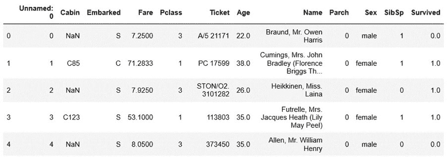
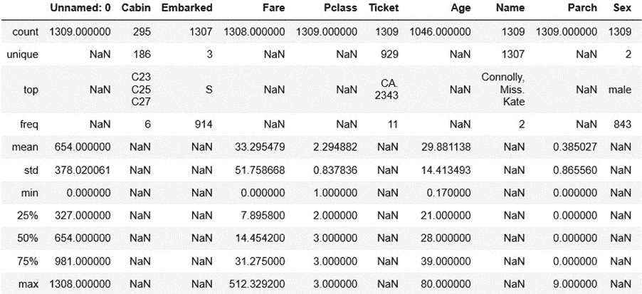
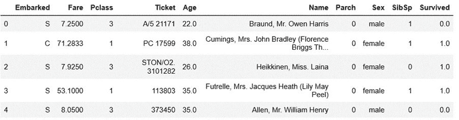
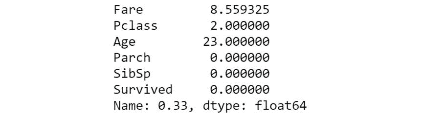
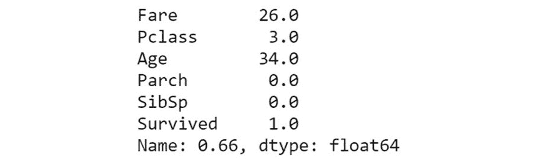
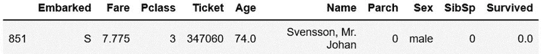
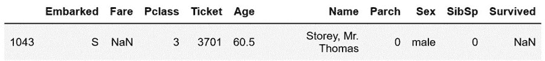
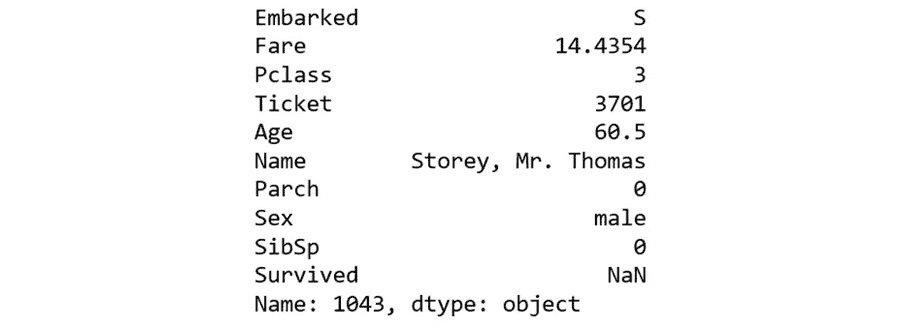

1\. 基础知识

#### 第十章：活动 1.01：实现 Pandas 函数

打开一个新的 Jupyter notebook。

使用 pandas 加载 Titanic 数据集：

import pandas as pd

df = pd.read_csv(r'../Datasets/titanic.csv')

使用以下方法在数据集上调用 head 函数：

# 查看数据的前五个样本

df.head()

输出将如下所示：

图 1.26：前五行

使用以下方法调用 describe 函数：

df.describe(include='all')

输出将如下所示：

图 1.27：describe()的输出

我们不需要 Unnamed: 0 列。可以通过以下方法删除该列，而无需使用 del 命令：

del df['Unnamed: 0']

df = df[df.columns[1:]] # 使用列

df.head()

输出将如下所示：

图 1.28：删除 Unnamed: 0 列后的前五行

计算数据框列的平均值、标准差、最小值和最大值，无需使用 describe：

df.mean()

输出将如下所示：

图 1.29：mean()的输出

现在，计算标准差：

df.std()

输出将如下所示：

图 1.30：std()的输出

计算列的最小值：

df.min()

输出将如下所示：

图 1.31：min()的输出

接下来，计算数据框中列的最大值。

df.max()

输出将如下所示：

图 1.32：max()的输出

使用 33%、66%和 99%的分位数方法，如下所示代码片段：

df.quantile(0.33)

输出将如下所示：

图 1.33：33%分位数的输出

类似地，使用 66%的分位数方法：

df.quantile(0.66)

输出将如下所示：

图 1.34：66%分位数的输出

使用相同的方法处理 99%：

df.quantile(0.99)

输出将如下所示：

图 1.35：99%分位数的输出

使用 groupby 方法查找每个类别的乘客数量：

class_groups = df.groupby('Pclass')

for name, index in class_groups:

print(f'类别: {name}: {len(index)}')

输出将如下所示：

类别：1：323

类别：2：277

类别：3：709

使用选择/索引方法找出每个类别的乘客数量：

for clsGrp in df.Pclass.unique():

num_class = len(df[df.Pclass == clsGrp])

print(f'类别 {clsGrp}: {num_class}')

结果将如下所示：

类别 3：709

类别 1：323

类别 2：277

第 6 步和第 7 步的答案是匹配的。

确定第三类中最年长的乘客：

third_class = df.loc[(df.Pclass == 3)]

third_class.loc[(third_class.Age == third_class.Age.max())]

输出结果如下：

图 1.36：第三类中最年长的乘客

对于许多机器学习问题，将数值缩放至 0 和 1 之间是非常常见的做法。使用 agg 方法和 Lambda 函数将 Fare 和 Age 列缩放到 0 和 1 之间：

fare_max = df.Fare.max()

age_max = df.Age.max()

df.agg({'Fare': lambda x: x / fare_max, \

'Age': lambda x: x / age_max,}).head()

输出结果如下：

图 1.37：将数值缩放至 0 和 1 之间

确定数据集中没有列出票价的个人条目：

df_nan_fare = df.loc[(df.Fare.isna())]

df_nan_fare

输出结果如下：

图 1.38：没有列出票价的个人

使用 groupby 方法将此行的 NaN 值替换为与相同舱位和登船地点对应的平均票价值：

embarked_class_groups = df.groupby(['Embarked', 'Pclass'])

indices = embarked_class_groups\

.groups[(df_nan_fare.Embarked.values[0], \

df_nan_fare.Pclass.values[0])]

mean_fare = df.iloc[indices].Fare.mean()

df.loc[(df.index == 1043), 'Fare'] = mean_fare

df.iloc[1043]

输出结果如下：

图 1.39：没有列出票价详细信息的个人输出

#### 注

要访问此部分的源代码，请参阅 https://packt.live/2AWHbu0。

您也可以在线运行此示例，网址是 https://packt.live/2NmAnse。您必须执行整个笔记本才能获得期望的结果。
