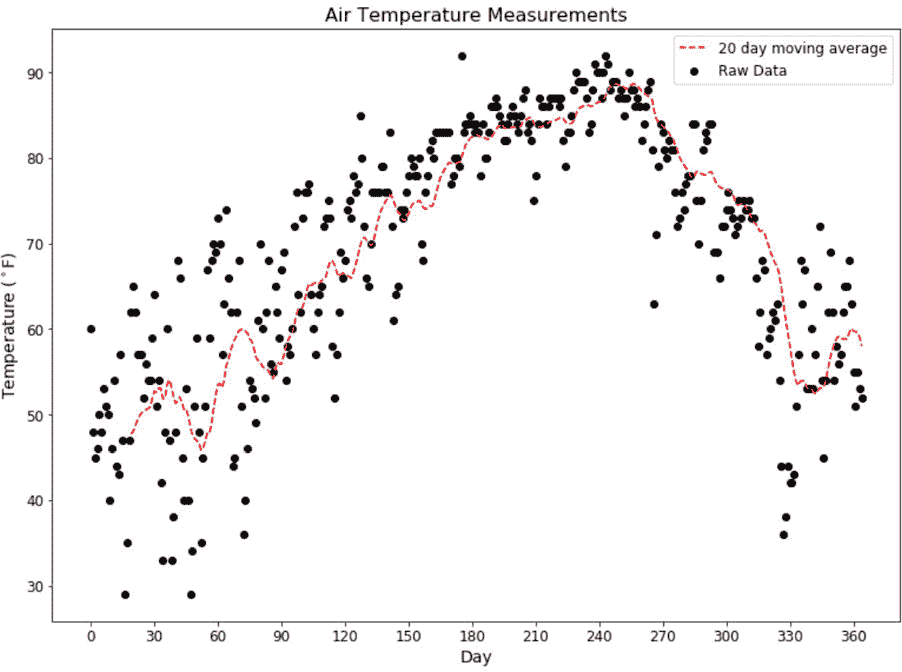
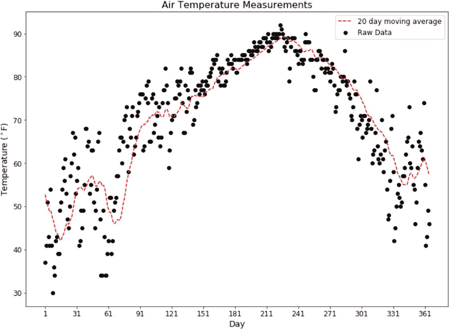

3\. 线性回归

#### 第十二章：活动 3.01：使用移动平均绘制数据

加载所需的两个包：

import pandas as pd

import matplotlib.pyplot as plt

从 CSV 文件将数据集加载到 pandas 数据框中：

df = pd.read_csv('../Datasets/austin_weather.csv')

df.head()

输出将显示 austin_weather.csv 文件的前五行：

图 3.61：奥斯丁天气数据的前五行（请注意右侧的附加列未显示）

由于我们只需要日期和温度列，我们将从数据集中删除所有其他列：

df = df.loc[:, ['Date', 'TempAvgF']]

df.head()

输出将如下所示：

图 3.62：奥斯丁天气数据的日期和温度列

最初，我们只关心第一年的数据，因此我们需要仅提取该信息。在数据框中为年份创建一列，从日期列中的字符串提取年份值作为整数，并将这些值赋给年份列（请注意，温度是按天记录的）。重复此过程以创建月份和日期列，然后提取第一年的数据：

df.loc[:, 'Year'] = df.loc[:, 'Date'].str.slice(0, 4).astype('int')

df.loc[:, 'Month'] = df.loc[:, 'Date'].str.slice(5, 7).astype('int')

df.loc[:, 'Day'] = df.loc[:, 'Date'].str.slice(8, 10).astype('int')

df = df.loc[df.index < 365]

print(df.head())

print(df.tail())

输出将如下所示：

图 3.63：包含一年数据的新数据框

使用 rolling() 方法计算 20 天移动平均：

window = 20

rolling = df.TempAvgF.rolling(window).mean()

print(rolling.head())

print(rolling.tail())

输出将如下所示：

图 3.64：带有移动平均数据的数据框

绘制原始数据和移动平均数据，x 轴为年份中的天数：

fig = plt.figure(figsize=(10, 7))

ax = fig.add_axes([1, 1, 1, 1]);

# 原始数据

ax.scatter(df.index, df.TempAvgF, \

label = '原始数据', c = 'k')

# 移动平均

ax.plot(rolling.index, rolling, c = 'r', \

linestyle = '--', label = f'{window} 天移动平均')

ax.set_title('空气温度测量', fontsize = 16)

ax.set_xlabel('天数', fontsize = 14)

ax.set_ylabel('温度 ($^\circ$F)', fontsize = 14)

ax.set_xticks(range(df.index.min(), df.index.max(), 30))

ax.tick_params(labelsize = 12)

ax.legend(fontsize = 12)

plt.show()

输出将如下所示：

图 3.65：带有 20 天移动平均线的数据

#### 注意

要访问此特定部分的源代码，请参考 https://packt.live/2Nl5m85。

你也可以在 https://packt.live/3epJvs6 上在线运行这个例子。你必须执行整个笔记本才能得到期望的结果。

#### 活动 3.02：使用最小二乘法的线性回归

导入所需的包和类：

import pandas as pd

import matplotlib.pyplot as plt

from sklearn.linear_model import LinearRegression

从 CSV 文件（austin_weather.csv）加载数据并检查数据（使用 head() 和 tail() 方法）：

# 加载数据并检查

df = pd.read_csv('../Datasets/austin_weather.csv')

print(df.head())

print(df.tail())

df.head() 的输出将如下所示：

图 3.66：df.head() 的输出

df.tail() 的输出将如下所示：

图 3.67：df.tail() 的输出

删除除了 Date 和 TempAvgF 列以外的所有列：

df = df.loc[:, ['Date', 'TempAvgF']]

df.head()

输出将如下所示：

图 3.68：用于活动 3.02 的两列

创建新的 Year、Month 和 Day 列，并通过解析 Date 列来填充它们：

# 添加一些有用的列

df.loc[:, 'Year'] = df.loc[:, 'Date']\

.str.slice(0, 4).astype('int')

df.loc[:, 'Month'] = df.loc[:, 'Date']\

.str.slice(5, 7).astype('int')

df.loc[:, 'Day'] = df.loc[:, 'Date']\

.str.slice(8, 10).astype('int')

print(df.head())

print(df.tail())

输出将如下所示：

图 3.69：增强数据

创建一个新的列用于移动平均，并用 TempAvgF 列的 20 天移动平均填充它：

"""

设置 20 天窗口，然后使用它来平滑温度并填充到新列中

"""

window = 20

df['20_d_mov_avg'] = df.TempAvgF.rolling(window).mean()

print(df.head())

print(df.tail())

输出将如下所示：

图 3.70：添加 20 天移动平均线

切割出一整年的数据用于模型。确保该年份没有因移动平均而缺失数据。同时创建一个 Day_of_Year 列（它应该从 1 开始）：

"""

现在让我们精确切割出一年时间的数据

日历的开始和结束日期

从之前的输出中我们可以看到

2014 年是第一个拥有完整数据的年份，

然而，它仍然会有 NaN 值

移动平均，所以我们将使用 2015 年

"""

df_one_year = df.loc[df.Year == 2015, :].reset_index()

df_one_year['Day_of_Year'] = df_one_year.index + 1

print(df_one_year.head())

print(df_one_year.tail())

输出将如下所示：

图 3.71：一年的数据

创建原始数据（原始 TempAvgF 列）的散点图，并叠加 20 天移动平均线：

fig = plt.figure(figsize=(10, 7))

ax = fig.add_axes([1, 1, 1, 1]);

# 原始数据

ax.scatter(df_one_year.Day_of_Year, df_one_year.TempAvgF, \

label = '原始数据', c = 'k')

# 移动平均

ax.plot(df_one_year.Day_of_Year, df_one_year['20_d_mov_avg'], \

c = 'r', linestyle = '--', \

label = f'{window}天移动平均')

ax.set_title('空气温度测量', fontsize = 16)

ax.set_xlabel('天数', fontsize = 14)

ax.set_ylabel('温度 ($^\circ$F)', fontsize = 14)

ax.set_xticks(range(df_one_year.Day_of_Year.min(), \

df_one_year.Day_of_Year.max(), 30))

ax.tick_params(labelsize = 12)

ax.legend(fontsize = 12)

plt.show()

输出将如下所示：

图 3.72：叠加了 20 天移动平均的原始数据

使用默认参数创建一个线性回归模型，即为模型计算一个 y 截距，并且不对数据进行归一化。年份的天数（1 到 365）构成输入数据，平均温度构成输出数据。打印模型的参数和 r²值：

# 拟合线性模型

linear_model = LinearRegression(fit_intercept = True)

linear_model.fit(df_one_year['Day_of_Year']\

.values.reshape((-1, 1)), \

df_one_year.TempAvgF)

print('模型斜率：', linear_model.coef_)

print('模型截距：', linear_model.intercept_)

print('模型 r²值：', \

linear_model.score(df_one_year['Day_of_Year']\

.values.reshape((-1, 1)), \

df_one_year.TempAvgF))

结果应如下所示：

模型斜率：[0.04304568]

模型截距：62.23496914044859

模型 r²值：0.09549593659736466

请注意，r²值非常低，这并不令人惊讶，因为数据的斜率随时间有显著变化，而我们拟合的是一个具有常数斜率的单一线性模型。

使用相同的 x 数据从模型生成预测值：

# 使用训练数据进行预测

y_pred = linear_model.predict(df_one_year['Day_of_Year']\

.values.reshape((-1, 1)))

x_pred = df_one_year.Day_of_Year

如之前一样，创建一个新的散点图，并叠加模型的预测结果：

fig = plt.figure(figsize=(10, 7))

ax = fig.add_axes([1, 1, 1, 1]);

# 原始数据

ax.scatter(df_one_year.Day_of_Year, df_one_year.TempAvgF, \

label = '原始数据', c = 'k')

# 移动平均

ax.plot(df_one_year.Day_of_Year, df_one_year['20_d_mov_avg'], \

c = 'r', linestyle = '--', \

label = f'{window}天移动平均')

# 线性模型

ax.plot(x_pred, y_pred, c = "blue", linestyle = '-.', \

label = '线性模型')

ax.set_title('空气温度测量', fontsize = 16)

ax.set_xlabel('天数', fontsize = 14)

ax.set_ylabel('温度 ($^\circ$F)', fontsize = 14)

ax.set_xticks(range(df_one_year.Day_of_Year.min(), \

df_one_year.Day_of_Year.max(), 30))

ax.tick_params(labelsize = 12)

ax.legend(fontsize = 12)

plt.show()

输出将如下所示：

图 3.73：原始数据，20 天滑动平均和线性拟合

#### 注意

要访问本节的源代码，请参阅 https://packt.live/2CwEKyT.

你也可以在 https://packt.live/3hKJSzD 在线运行这个示例。你必须执行整个 Notebook 才能得到预期的结果。

#### 活动 3.03：虚拟变量

导入所需的包和类：

import pandas as pd

import matplotlib.pyplot as plt

from sklearn.linear_model import LinearRegression

加载并检查数据：

# 加载数据并检查

df = pd.read_csv('../Datasets/austin_weather.csv')

print(df.head())

print(df.tail())

df.head()的输出应如下所示：

图 3.74：df.head()函数的输出

df.tail()的输出应如下所示：

图 3.75：df.tail()函数的输出

执行与之前相同的预处理。去除除 Date 和 TempAvgF 列外的所有列。添加 Year、Month 和 Day 列。创建一个包含 20 天滑动平均的新列。切出第一个完整年份（2015 年）：

df = df.loc[:, ['Date', 'TempAvgF']]

# 添加一些有用的列

df.loc[:, 'Year'] = df.loc[:, 'Date'].str.slice(0, 4).astype('int')

df.loc[:, 'Month'] = df.loc[:, 'Date'].str.slice(5, 7).astype('int')

df.loc[:, 'Day'] = df.loc[:, 'Date'].str.slice(8, 10).astype('int')

"""

设置一个 20 天的滑动窗口，然后用它来平滑数据

在新列中存储温度

"""

window = 20

df['20_d_mov_avg'] = df.TempAvgF.rolling(window).mean()

"""

现在让我们切片出完整的一年

日历的开始和结束日期

我们从之前的输出中看到

2014 年是第一个完整的数据年份，

然而，它仍然会有 NaN 值

滑动平均，因此我们将使用 2015 年数据

"""

df_one_year = df.loc[df.Year == 2015, :].reset_index()

df_one_year['Day_of_Year'] = df_one_year.index + 1

print(df_one_year.head())

print(df_one_year.tail())

数据应该如下所示：

图 3.76：预处理数据

可视化结果：

fig = plt.figure(figsize=(10, 7))

ax = fig.add_axes([1, 1, 1, 1]);

# 原始数据

ax.scatter(df_one_year.Day_of_Year, df_one_year.TempAvgF, \

label = '原始数据', c = 'k')

# 滑动平均

ax.plot(df_one_year.Day_of_Year, df_one_year['20_d_mov_avg'], \

c = 'r', linestyle = '--', \

label = f'{window}天滑动平均')

ax.set_title('空气温度测量', fontsize = 16)

ax.set_xlabel('天数', fontsize = 14)

ax.set_ylabel('温度 ($^\circ$F)', fontsize = 14)

ax.set_xticks(range(df_one_year.Day_of_Year.min(), \

df_one_year.Day_of_Year.max(), 30))

ax.tick_params(labelsize = 12)

ax.legend(fontsize = 12)

plt.show()

图表应该如下所示：

图 3.77：奥斯丁温度及其滑动平均

我们可以看到温度从一月开始上升，直到九月左右，然后再次下降。这是一个明显的季节性循环。作为第一次改进，我们可以在模型中加入月份。如同在虚拟变量介绍中所述，如果我们仅将月份编码为 1 到 12 的整数，模型可能会认为 12 月（12）比 1 月（1）更重要。所以，我们将月份编码为虚拟变量来避免这一问题：

# 使用月份作为虚拟变量

dummy_vars = pd.get_dummies(df_one_year['Month'], drop_first = True)

dummy_vars.columns = ['Feb', 'Mar', 'Apr', 'May', 'Jun', \

'Jul', 'Aug', 'Sep', 'Oct', 'Nov', 'Dec']

df_one_year = pd.concat([df_one_year, dummy_vars], \

axis = 1).drop('Month', axis = 1)

df_one_year

数据应如下所示：

图 3.78：使用虚拟变量增强的月份数据

现在，使用 Day_of_Year 和虚拟变量拟合一个线性模型，并打印模型系数和 R² 值：

# 使用月份虚拟变量拟合模型

linear_model = LinearRegression(fit_intercept = True)

linear_model.fit(pd.concat([df_one_year.Day_of_Year, \

df_one_year.loc[:, 'Feb':'Dec']], \

axis = 1),

df_one_year['TempAvgF'])

print('模型系数：', linear_model.coef_)

print('模型截距：', linear_model.intercept_)

print('模型 R 平方：', \

linear_model.score(pd.concat([df_one_year.Day_of_Year, \

df_one_year.loc[:, 'Feb':'Dec']], \

axis = 1),

df_one_year['TempAvgF']))

结果应如下所示：

模型系数：[ 0.03719346 1.57445204 9.35397321 19.16903518 22.02065629 26.80023439

30.17121033 30.82466482 25.6117698 15.71715435 1.542969 -4.06777548]

模型截距：48.34038858048261

模型 R 平方：0.7834805472165678

注意系数的符号——第一个值与 Day_of_Year 相关，接下来是 1 月到 12 月的值。1 月、2 月、3 月、11 月和 12 月的系数为负，而 6 月到 9 月的系数为正。这对德州的季节来说是合理的。

现在，使用单年数据进行预测，并可视化结果：

# 使用数据进行预测

y_pred = \

linear_model.predict(pd.concat([df_one_year.Day_of_Year, \

df_one_year.loc[:, 'Feb':'Dec']], \

axis = 1))

x_pred = df_one_year.Day_of_Year

fig = plt.figure(figsize=(10, 7))

ax = fig.add_axes([1, 1, 1, 1]);

# 原始数据

ax.scatter(df_one_year.Day_of_Year, df_one_year.TempAvgF, \

标签 = '原始数据', c = 'k')

# 移动平均

ax.plot(df_one_year.Day_of_Year, df_one_year['20_d_mov_avg'], \

c = 'r', linestyle = '--', \

标签 = f'{window}天移动平均')

# 回归预测

ax.plot(x_pred, y_pred, c = "blue", linestyle = '-.', \

标签 = '线性模型 w/虚拟变量'

ax.set_title('空气温度测量', fontsize = 16)

ax.set_xlabel('天数', fontsize = 14)

ax.set_ylabel('温度 ($^\circ$F)', fontsize = 14)

ax.set_xticks(range(df_one_year.Day_of_Year.min(), \

df_one_year.Day_of_Year.max(), 30))

ax.tick_params(labelsize = 12)

ax.legend(fontsize = 12, loc = 'upper left')

plt.show()

输出应如下所示：

图 3.79：带有月份虚拟变量的线性回归结果

#### 注意

要访问该特定部分的源代码，请参阅 https://packt.live/3enegOg。

你也可以在 https://packt.live/2V4VgMM 在线运行这个例子。你必须执行整个 Notebook 才能得到期望的结果。

#### 活动 3.04：线性回归特征工程

加载所需的包和类：

import pandas as pd

import numpy as np

import matplotlib.pyplot as plt

from sklearn.linear_model import LinearRegression

加载数据并进行预处理，直到添加 Day_of_Year 为止：

# 加载数据

df = pd.read_csv('../Datasets/austin_weather.csv')

df = df.loc[:, ['Date', 'TempAvgF']]

# 添加一些有用的列

df.loc[:, 'Year'] = df.loc[:, 'Date'].str.slice(0, 4).astype('int')

df.loc[:, 'Month'] = df.loc[:, 'Date'].str.slice(5, 7).astype('int')

df.loc[:, 'Day'] = df.loc[:, 'Date'].str.slice(8, 10).astype('int')

"""

设置一个 20 天窗口，然后使用它进行平滑处理

新列中的温度

"""

window = 20

df['20_d_mov_avg'] = df.TempAvgF.rolling(window).mean()

"""

现在让我们准确地切割出一年

日历的开始和结束日期

我们从之前的输出中可以看到

2014 年是第一个有完整数据的年份，

然而，它仍然会有 NaN 值

移动平均值，因此我们将使用 2015 年的数据

"""

df_one_year = df.loc[df.Year == 2015, :].reset_index()

df_one_year['Day_of_Year'] = df_one_year.index + 1

现在，进行特征工程，我们构建 Day_of_Year 的正弦和余弦，周期为 365 天：

# 为 Day_of_Year 添加两个列，分别表示其正弦和余弦值

df_one_year['sine_Day'] = np.sin(2 * np.pi \

* df_one_year['Day_of_Year'] / 365)

df_one_year['cosine_Day'] = np.cos(2 * np.pi \

* df_one_year['Day_of_Year'] / 365)

df_one_year

数据应如下所示：

图 3.80：包含新特征 sine_Day 和 cosine_Day 的奥斯丁天气数据

我们现在可以使用 scikit-learn 的 LinearRegression 类拟合模型，并打印系数和 R² 值：

# 使用 Day_of_Year 和 sin/cos 拟合模型

linear_model = LinearRegression(fit_intercept = True)

linear_model.fit(df_one_year[['Day_of_Year', 'sine_Day', \

'cosine_Day']]，\

df_one_year['TempAvgF'])

print('模型系数：', linear_model.coef_)

print('模型截距：', linear_model.intercept_)

print('模型 R 平方值：', \

linear_model.score(df_one_year[['Day_of_Year', 'sine_Day', \

'cosine_Day']]，\

df_one_year['TempAvgF']))

输出应如下所示：

模型系数： [ 1.46396364e-02 -5.57332499e+00 -1.67824174e+01]

模型截距：67.43327530313064

模型 R 平方值：0.779745650129063

请注意，r2 值与我们通过虚拟变量得到的结果差不多。然而，我们来看看预测结果，看看这个模型是否比以前更合适或更不合适。

使用增强数据生成预测：

# 使用数据进行预测

y_pred = \

linear_model.predict(df_one_year[['Day_of_Year', 'sine_Day', \

'cosine_Day']])

x_pred = df_one_year.Day_of_Year

现在，查看结果：

fig = plt.figure(figsize=(10, 7))

ax = fig.add_axes([1, 1, 1, 1])

# 原始数据

ax.scatter(df_one_year.Day_of_Year, df_one_year.TempAvgF, \

label = '原始数据', c = 'k')

# 移动平均

ax.plot(df_one_year.Day_of_Year, df_one_year['20_d_mov_avg'], \

c = 'r', linestyle = '--', \

label = f'{window} 天移动平均')

# 回归预测

ax.plot(x_pred, y_pred, c = "blue", linestyle = '-.', \

label = '线性模型带正余弦拟合')

ax.set_title('空气温度测量', fontsize = 16)

ax.set_xlabel('天', fontsize = 14)

ax.set_ylabel('温度 ($^\circ$F)', fontsize = 14)

ax.set_xticks(range(df_one_year.Day_of_Year.min(), \

df_one_year.Day_of_Year.max(), 30))

ax.tick_params(labelsize = 12)

ax.legend(fontsize = 12, loc = 'upper left')

输出结果如下：

图 3.81：奥斯丁温度数据，带有移动平均叠加和周期性特征拟合叠加

#### 注意

要访问此特定部分的源代码，请参见 https://packt.live/3dvkmet.

您还可以在线运行此示例，网址：https://packt.live/3epnOIJ。您必须执行整个笔记本才能获得预期的结果。

#### Activity 3.05: 梯度下降

导入模块和类：

import pandas as pd

import numpy as np

import matplotlib.pyplot as plt

from sklearn.metrics import r2_score

from sklearn.linear_model import SGDRegressor

加载数据（austin_weather.csv）并进行预处理，直到创建 Day_of_Year 列并切割出完整的一年数据（2015 年）：

# 加载数据并检查

df = pd.read_csv('../Datasets/austin_weather.csv')

df = df.loc[:, ['Date', 'TempAvgF']]

# 添加基于时间的列

df.loc[:, 'Year'] = df.loc[:, 'Date'].str.slice(0, 4).astype('int')

df.loc[:, 'Month'] = df.loc[:, 'Date'].str.slice(5, 7).astype('int')

df.loc[:, 'Day'] = df.loc[:, 'Date'].str.slice(8, 10).astype('int')

"""

设置一个 20 天窗口，然后使用该窗口进行平滑

温度放在一个新的列中

"""

window = 20

df['20_d_mov_avg'] = df.TempAvgF.rolling(window).mean()

"""

现在让我们精确切割出一年的数据

日历开始和结束日期

从之前的输出可以看到

2014 年是第一个完整数据的年份，

但是，它仍然会对某些值产生 NaN

移动平均，因此我们将使用 2015 年数据

"""

df_one_year = df.loc[df.Year == 2015, :].reset_index()

df_one_year['Day_of_Year'] = df_one_year.index + 1

print(df_one_year.head())

print(df_one_year.tail())

输出结果如下：

图 3.82：缩放前的预处理数据

缩放数据以进行训练：

# 缩放数据

X_min = df_one_year.Day_of_Year.min()

X_range = df_one_year.Day_of_Year.max() \

- df_one_year.Day_of_Year.min()

Y_min = df_one_year.TempAvgF.min()

Y_range = df_one_year.TempAvgF.max() \

- df_one_year.TempAvgF.min()

scale_X = (df_one_year.Day_of_Year - X_min) / X_range

train_X = scale_X.ravel()

train_Y = ((df_one_year.TempAvgF - Y_min) / Y_range).ravel()

设置随机种子，实例化 SGDRegressor 模型对象，并拟合模型到训练数据：

# 创建模型对象

np.random.seed(42)

model = SGDRegressor(loss = 'squared_loss', max_iter = 100, \

learning_rate = 'constant', eta0 = 0.0005, \

tol = 0.00009, penalty = 'none')

# 拟合模型

model.fit(train_X.reshape((-1, 1)), train_Y)

输出应如下所示：

图 3.83：使用 SGDRegressor 的模型对象

提取模型系数并重新缩放：

Beta0 = (Y_min + Y_range * model.intercept_[0] \

- Y_range * model.coef_[0] * X_min / X_range)

Beta1 = Y_range * model.coef_[0] / X_range

print(Beta0)

print(Beta1)

输出应类似于以下内容：

61.45512325422412

0.04533603293003107

使用缩放后的数据生成预测值，然后获取 r2 值：

# 生成预测

pred_X = df_one_year['Day_of_Year']

pred_Y = model.predict(train_X.reshape((-1, 1)))

# 计算 r 平方值

r2 = r2_score(train_Y, pred_Y)

print('r 平方 = ', r2)

结果应类似于以下内容：

r 平方 = 0.09462157379706759

将预测结果缩放回实际值并可视化结果：

# 将预测值缩放回实际值

pred_Y = (pred_Y * Y_range) + Y_min

fig = plt.figure(figsize = (10, 7))

ax = fig.add_axes([1, 1, 1, 1])

# 原始数据

ax.scatter(df_one_year.Day_of_Year, df_one_year.TempAvgF, \

label = '原始数据', c = 'k')

# 移动平均

ax.plot(df_one_year.Day_of_Year, df_one_year['20_d_mov_avg'], \

c = 'r', linestyle = '--', \

label = f'{window} 日移动平均')

# 回归预测

ax.plot(pred_X, pred_Y, c = "blue", linestyle = '-.', \

linewidth = 4, label = '线性拟合（来自 SGD）')

# 将模型添加到图表上

ax.text(1, 85, 'Temp = ' + str(round(Beta0, 2)) + ' + ' \

+ str(round(Beta1, 4)) + ' * 日期', fontsize = 16)#

ax.set_title('空气温度测量', fontsize = 16)

ax.set_xlabel('日期', fontsize = 16)

ax.set_ylabel('温度 ($^\circ$F)', fontsize = 14)

ax.set_xticks(range(df_one_year.Day_of_Year.min(), \

df_one_year.Day_of_Year.max(), 30))

ax.tick_params(labelsize = 12)

ax.legend(fontsize = 12)

plt.show()

输出结果如下：

图 3.84：使用 SGDRegressor 进行线性回归的结果

#### 注意

若要访问此特定部分的源代码，请参阅 https://packt.live/2AY1bMZ。

你也可以在 https://packt.live/2NgCI86 上在线运行这个示例。你必须执行整个 Notebook 才能得到预期的结果。
