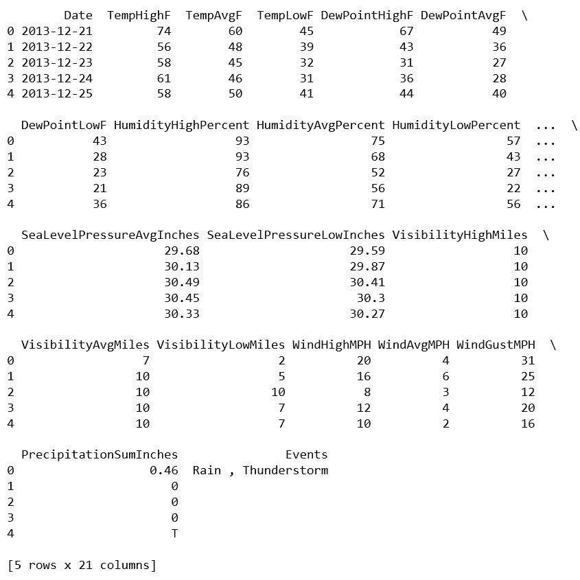
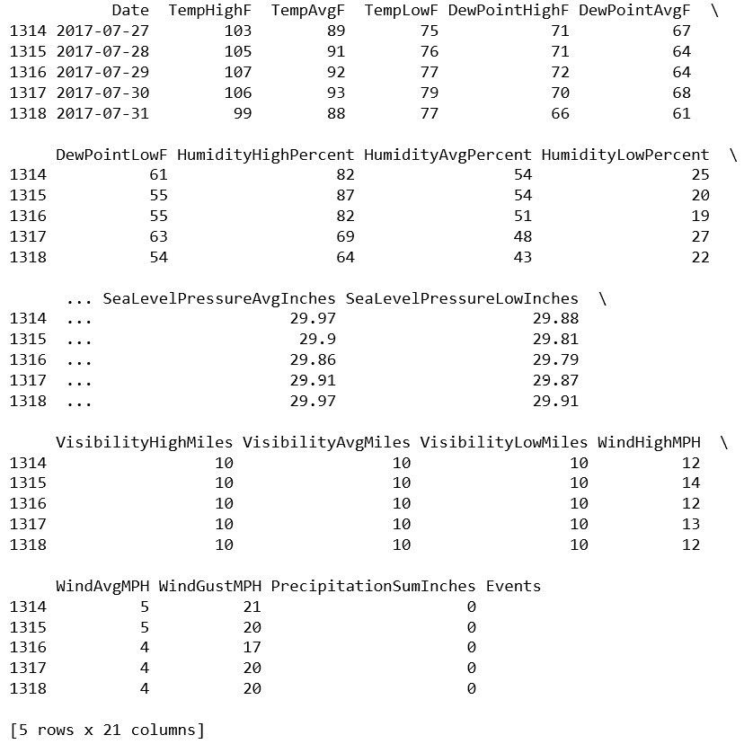
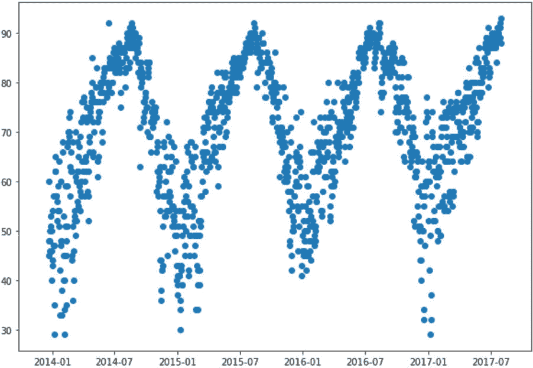
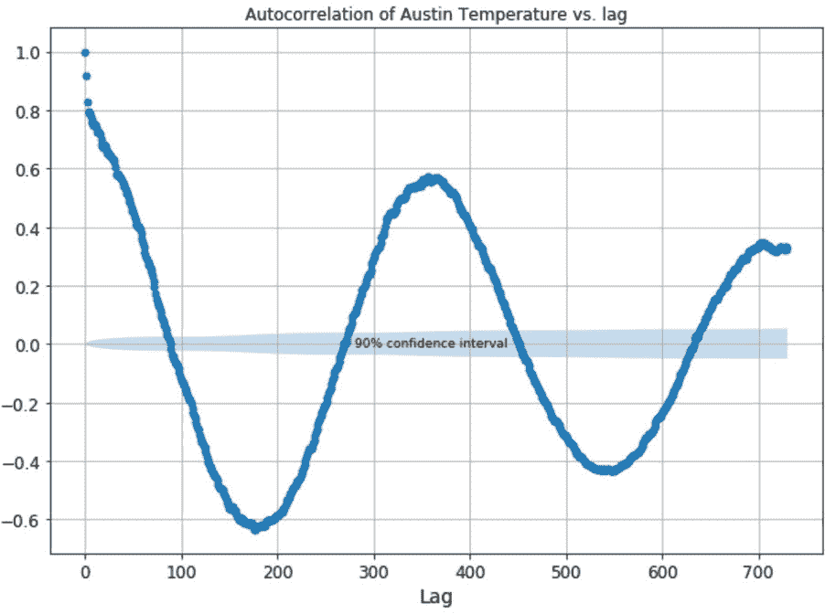
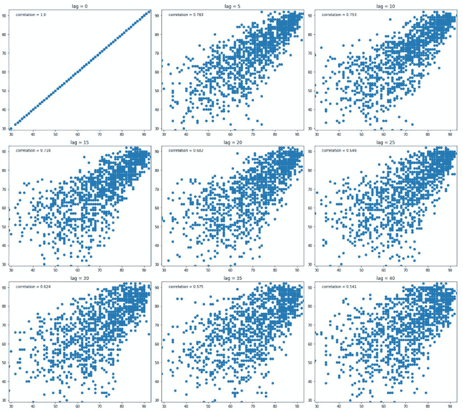
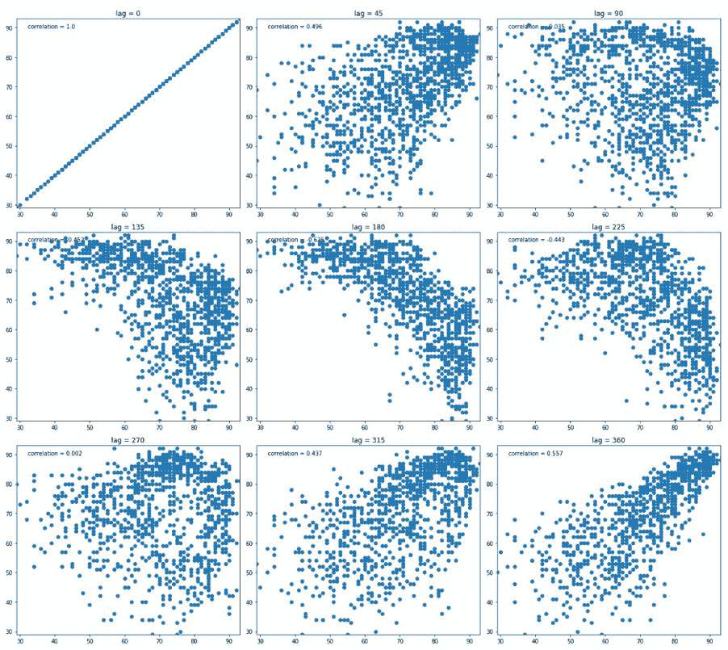
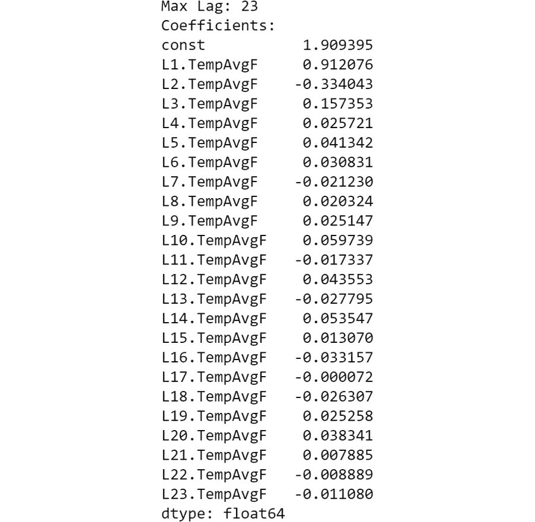
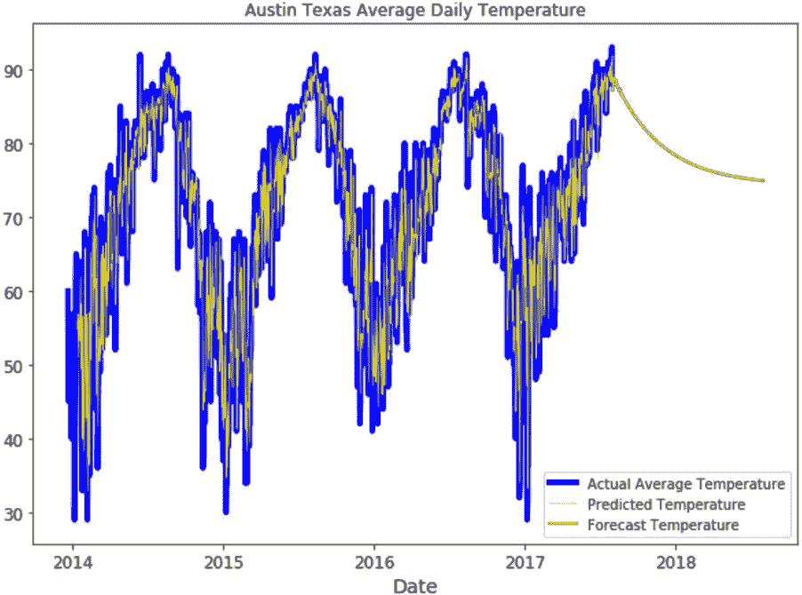
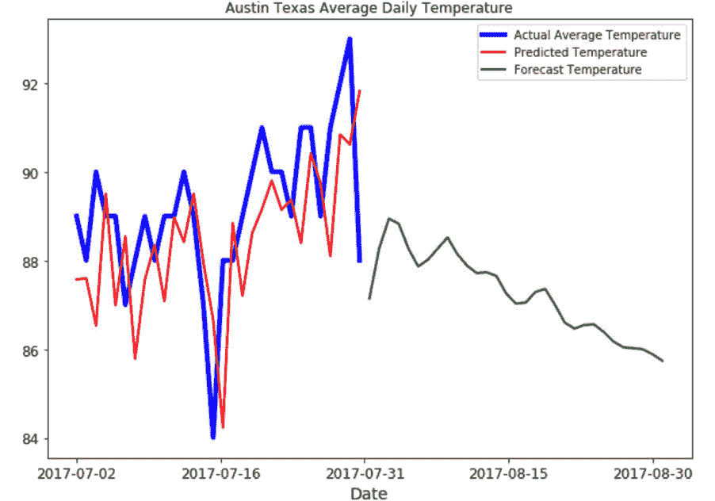

4\. 自回归

#### 第十三章：活动 4.01：基于周期数据的自回归模型

导入必要的包、类和库。

#### 注意

该活动将使用早期版本的 pandas，请确保使用以下命令降级 pandas 版本：

pip install pandas==0.24.2

代码如下：

import pandas as pd

import numpy as np

from statsmodels.tsa.ar_model import AR

from statsmodels.graphics.tsaplots import plot_acf

import matplotlib.pyplot as plt

加载数据并将 Date 列转换为 datetime 类型：

df = pd.read_csv('../Datasets/austin_weather.csv')

df.Date = pd.to_datetime(df.Date)

print(df.head())

print(df.tail())

df.head()的输出应如下所示：

图 4.22：df.head()的输出

df.tail()的输出应如下所示：

图 4.23：df.tail()的输出

绘制完整的平均温度值集（df.TempAvgF），以 Date 为 x 轴：

fig, ax = plt.subplots(figsize = (10, 7))

ax.scatter(df.Date, df.TempAvgF)

plt.show()

输出如下所示：

图 4.24：奥斯汀温度数据的多年变化图

注意数据的周期性行为。考虑到温度随年度天气周期变化，这是合理的。

构建一个自相关图（使用 statsmodels），以查看是否可以使用自回归模型来预测平均温度。自回归模型的滞后期在哪些地方是可接受的，哪些地方则不可接受？请查看以下代码：

max_lag = 730

fig, ax = plt.subplots(figsize = (10, 7))

acf_plot = plot_acf(x = df.TempAvgF, ax = ax, lags = max_lag, \

use_vlines = False, alpha = 0.9, \

title = '奥斯汀温度的自相关'

'vs. 滞后')

ax.grid(True)

ax.text(280, -0.01, '90%置信区间', fontsize = 9)

ax.set_xlabel('滞后', fontsize = 14)

ax.tick_params(axis = 'both', labelsize = 12)

图表应如下所示：

图 4.25：自相关与滞后（天数）的关系

只有当自相关线位于 90%置信区间之外时，滞后期才是可接受的，置信区间以阴影区域表示。请注意，在这种情况下，我们看到的是峰值和谷值，而不是稳定下降的 ACF 值。这应该符合你的直觉，因为原始数据展示了周期性模式。另外，请注意，存在非常强的正相关和负相关。在大约 180 天（半年）左右，可能会利用强烈的负相关，但那是一个更高级的时间序列话题，超出了我们这里的讨论范围。从图 4.25 中可以得出的主要结论是，在短滞后期后，ACF 有一个非常陡峭的下降。现在，使用与之前相同的方法查看滞后图与 ACF 的关系。

获取实际的 ACF 值：

corr0 = np.correlate(df.TempAvgF[0: ] - df.TempAvgF.mean(), \

df.TempAvgF[0: ] - df.TempAvgF.mean(), mode = 'valid')

corrs = [np.correlate(df.TempAvgF[:(df.TempAvgF.shape[0] - i)] \

- df.TempAvgF.mean(), df.TempAvgF[i: ] \

- df.TempAvgF.mean(), mode = 'valid')

for i in range(max_lag)] / corr0

我们需要在练习 4.01 中开发的相同实用网格绘图函数，用于创建自回归模型：

"""

用于绘制一系列滞后图的实用函数

展示自相关的图

"""

def plot_lag_grid(series, corrs, axis_min, axis_max, \

num_plots, total_lag, n_rows, n_cols):

lag_step = int(total_lag / num_plots)

fig = plt.figure(figsize = (18, 16))

for i, var_name in enumerate(range(num_plots)):

corr = corrs[lag_step * i]

ax = fig.add_subplot(n_rows, n_cols, i + 1)

ax.scatter(series, series.shift(lag_step * i))

ax.set_xlim(axis_min, axis_max)

ax.set_ylim(axis_min, axis_max)

ax.set_title('lag = ' + str(lag_step * i))

ax.text(axis_min + 0.05 * (axis_max - axis_min), \

axis_max - 0.05 * (axis_max - axis_min), \

'相关性 = ' + str(round(corr[0], 3)))

fig.tight_layout()

plt.show()

现在，既然我们已经有迹象表明我们对短滞后感兴趣，但也发现半年和一年附近有强相关性，让我们看看两个时间尺度：

plot_lag_grid(df.TempAvgF, corrs, df.TempAvgF.min(), \

df.TempAvgF.max(), 9, 45, 3, 3)

plot_lag_grid(df.TempAvgF, corrs, df.TempAvgF.min(), \

df.TempAvgF.max(), 9, 405, 3, 3)

短滞后的输出结果如下：

图 4.26：短滞后的滞后图

较长滞后的输出结果如下：

图 4.27：较长滞后的滞后图

我们可以从图 4.26 看出，相关性从滞后 5 到 40 一直在下降。随着时间尺度的延长，图 4.27 显示相关性快速下降，然后随着滞后接近一年时逐渐改善。这与原始数据的图表直觉相吻合（附注——这应该加强 EDA 的重要性）。

我们从初步分析中预期，自回归模型将专注于相对短的滞后。让我们使用 statsmodelsAR 函数来构建一个模型并查看结果：

"""

statsmodels AR 函数构建自回归模型

使用所有默认设置，它将确定最大滞后

并提供所有模型系数

"""

model = AR(df.TempAvgF)

model_fit = model.fit()

# 模型拟合现在包含了所有模型信息

max_lag = model_fit.k_ar

"""

请注意，使用默认设置时，最大滞后是

计算方法为 round(12*(nobs/100.)**(1/4.))

请参见 [`www.statsmodels.org/devel/generated/statsmodels.tsa.ar_model.AR.fit.html#statsmodels.tsa.ar_model.AR.fit`](https://www.statsmodels.org/devel/generated/statsmodels.tsa.ar_model.AR.fit.html#statsmodels.tsa.ar_model.AR.fit)

"""

print('最大滞后：' + str(max_lag))

print('系数：\n' + str(model_fit.params))

# 我们想预测多远的未来

max_forecast = 365

# 从模型生成预测值

pred_temp = pd.DataFrame({'pred_temp': \

model_fit.predict(start = max_lag, \

end = df.shape[0] \

+ max_forecast - 1)})

# 附加日期以便可视化

pred_temp['Date'] = df.loc[pred_temp.index, 'Date'].reindex()

pred_temp.loc[(max(df.index) + 1):, 'Date'] = \

pd.to_datetime([max(df.Date) \

+ pd.Timedelta(days = i)

for i in range(1, max_forecast + 1)])

结果是一个具有最多 23 天滞后的模型：

图 4.28：奥斯汀温度数据的 AR 模型

在同一图表上绘制预测、预报和原始数据：

"""

可视化叠加在实际数据上的预测

以及对未来的外推

"""

fig, ax = plt.subplots(figsize = (10, 7))

ax.plot(df.Date, df.TempAvgF, c = "blue", \

linewidth = 4, label = '实际平均温度')

ax.plot(pred_temp.loc[0 : len(df.TempAvgF), 'Date'], \

pred_temp.loc[0 : len(df.TempAvgF), 'pred_temp'], \

c = "yellow", linewidth = 0.5, \

label = '预测温度')

ax.plot(pred_temp.loc[len(df.TempAvgF):, 'Date'], \

pred_temp.loc[len(df.TempAvgF):, 'pred_temp'], \

c = "red", linewidth = 2, \

label = '预测温度')

ax.set_xlabel('日期', fontsize = 14)

ax.tick_params(axis = 'both', labelsize = 12)

ax.set_title('奥斯汀德克萨斯州每日平均温度')

ax.tick_params(axis = 'both', labelsize = 12)

ax.legend()

plt.show()

输出结果如下：

图 4.29：奥斯汀温度预测与预报

让我们放大查看数据的最后 30 天，以及前 30 个预测值：

# 放大查看原始数据末端附近的窗口

window = 30

fig, ax = plt.subplots(figsize = (10, 7))

ax.plot(df.Date[(len(df.TempAvgF) - window) : len(df.TempAvgF)], \

df.TempAvgF[(len(df.TempAvgF) - window) : \

len(df.TempAvgF)], \

c = "blue", linewidth = 4, \

label = '实际平均温度')

ax.plot(pred_temp.Date.iloc[(-max_forecast \

- window):(-max_forecast)], \

pred_temp.pred_temp.iloc[(-max_forecast \

- window):(-max_forecast)], \

c = "red", linewidth = 2, label = '预测温度')

ax.plot(pred_temp.loc[len(df.TempAvgF):\

(len(df.TempAvgF) + window), 'Date'], \

pred_temp.loc[len(df.TempAvgF):\

(len(df.TempAvgF) + window), 'pred_temp'], \

c = "green", linewidth = 2, label = '预测温度')

ax.set_xlabel('日期', fontsize = 14)

ax.tick_params(axis = 'both', labelsize = 12)

ax.set_title('奥斯汀德克萨斯州每日平均温度')

ax.tick_params(axis = 'both', labelsize = 12)

ax.set_xticks(pd.date_range(df.Date[len(df.TempAvgF) - window], \

df.Date[len(df.TempAvgF) - 1] \

+ pd.Timedelta(days = window), 5))

ax.legend()

plt.show()

我们将得到以下输出：

图 4.30：数据末端预测的详细情况

#### 注释

若要访问此特定部分的源代码，请参考 https://packt.live/3hOXUQL.

你也可以在 https://packt.live/313Vmbl 在线运行这个示例。你必须执行整个 Notebook 才能得到预期的结果。

现在活动已成功完成，升级 pandas 的版本，以便顺利运行书中其余部分的练习和活动。要升级 pandas，运行：

pip install pandas==1.0.3
