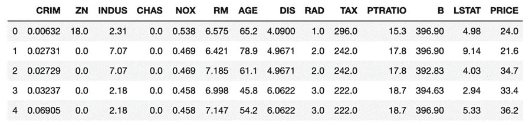
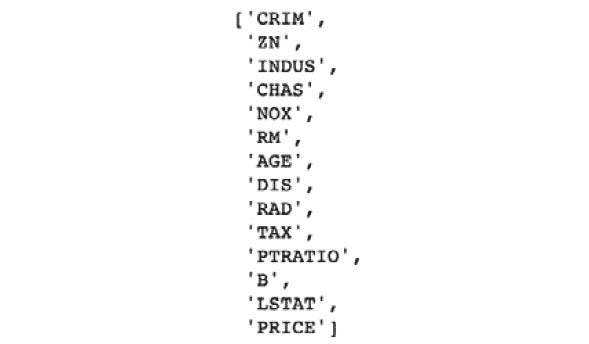
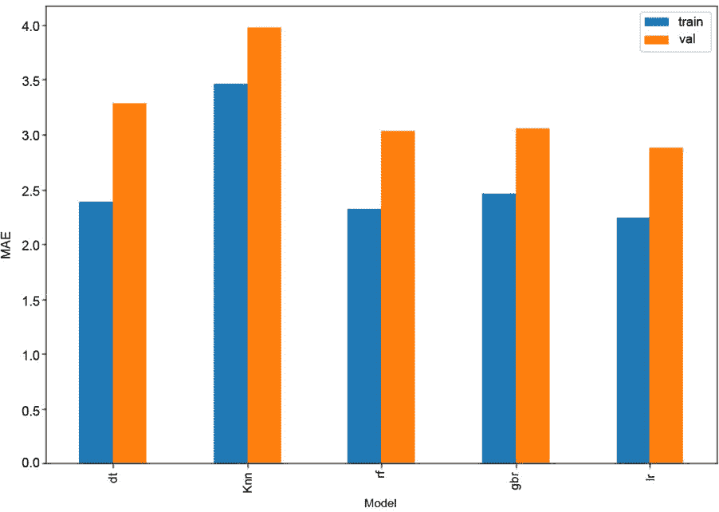

6\. 集成建模

#### 第十五章：活动 6.01：使用独立算法和集成算法的堆叠

解决方案

导入相关库：

导入 pandas 库为 pd

导入 numpy 为 np

导入 seaborn 为 sns

%matplotlib inline

导入 matplotlib.pyplot 为 plt

来自 sklearn.model_selection 导入 train_test_split

来自 sklearn.metrics 导入 mean_absolute_error

来自 sklearn.model_selection 导入 KFold

来自 sklearn.linear_model 导入 LinearRegression

来自 sklearn.tree 导入 DecisionTreeRegressor

来自 sklearn.neighbors 导入 KNeighborsRegressor

来自 sklearn.ensemble 导入 GradientBoostingRegressor, \

RandomForestRegressor

读取数据：

data = pd.read_csv('boston_house_prices.csv')

data.head()

#### 注意

上面的代码片段假设数据集与练习笔记本在同一文件夹中。然而，如果您的数据集位于 Datasets 文件夹中，您需要使用以下代码：data = pd.read_csv('../Datasets/boston_house_prices.csv')

您将获得以下输出：

图 6.15：波士顿房价数据集的顶部几行

对数据集进行预处理，删除空值，为建模准备数据：

# 检查有多少列的空值比例小于 10%

perc_missing = data.isnull().mean()*100

cols = perc_missing[perc_missing < 10].index.tolist()

列

您将获得以下输出：

图 6.16：列的数量

然后填补缺失值（如果有的话）：

data_final = data.fillna(-1)

将数据集划分为训练集和验证集 DataFrame：

train, val = train, val = train_test_split(data_final, \

test_size=0.2, \

random_state=11)

x_train = train.drop(columns=['PRICE'])

y_train = train['PRICE'].values

x_val = val.drop(columns=['PRICE'])

y_val = val['PRICE'].values

初始化字典以存储训练集和验证集的 MAE 值：

train_mae_values, val_mae_values = {}, {}

使用以下超参数训练决策树（dt）模型并保存分数：

dt_params = {'criterion': 'mae', 'min_samples_leaf': 15, \

'random_state': 11}

dt = DecisionTreeRegressor(**dt_params)

dt.fit(x_train, y_train)

dt_preds_train = dt.predict(x_train)

dt_preds_val = dt.predict(x_val)

train_mae_values['dt'] = mean_absolute_error(y_true=y_train, \

y_pred=dt_preds_train)

val_mae_values['dt'] = mean_absolute_error(y_true=y_val, \

y_pred=dt_preds_val)

使用以下超参数训练 k-近邻（knn）模型并保存分数：

knn_params = {'n_neighbors': 5}

knn = KNeighborsRegressor(**knn_params)

knn.fit(x_train, y_train)

knn_preds_train = knn.predict(x_train)

knn_preds_val = knn.predict(x_val)

train_mae_values['knn'] = mean_absolute_error(y_true=y_train, \

y_pred=knn_preds_train)

val_mae_values['knn'] = mean_absolute_error(y_true=y_val, \

y_pred=knn_preds_val)

使用以下超参数训练随机森林（rf）模型并保存分数：

rf_params = {'n_estimators': 20, 'criterion': 'mae', \

'max_features': 'sqrt', 'min_samples_leaf': 10, \

'random_state': 11, 'n_jobs': -1}

rf = RandomForestRegressor(**rf_params)

rf.fit(x_train, y_train)

rf_preds_train = rf.predict(x_train)

rf_preds_val = rf.predict(x_val)

train_mae_values['rf'] = mean_absolute_error(y_true=y_train, \

y_pred=rf_preds_train)

val_mae_values['rf'] = mean_absolute_error(y_true=y_val, \

y_pred=rf_preds_val)

训练一个梯度提升回归（gbr）模型，使用以下超参数并保存评分：

gbr_params = {'n_estimators': 20, 'criterion': 'mae', \

'max_features': 'sqrt', 'min_samples_leaf': 10, \

'random_state': 11}

gbr = GradientBoostingRegressor(**gbr_params)

gbr.fit(x_train, y_train)

gbr_preds_train = gbr.predict(x_train)

gbr_preds_val = gbr.predict(x_val)

train_mae_values['gbr'] = mean_absolute_error(y_true=y_train, \

y_pred=gbr_preds_train)

val_mae_values['gbr'] = mean_absolute_error(y_true=y_val, \

y_pred=gbr_preds_val)

准备训练和验证数据集，其中四个元估计器使用与之前步骤相同的超参数。首先，构建训练集：

num_base_predictors = len(train_mae_values) # 4

x_train_with_metapreds = np.zeros((x_train.shape[0], \

x_train.shape[1]+num_base_predictors))

x_train_with_metapreds[:, :-num_base_predictors] = x_train

x_train_with_metapreds[:, -num_base_predictors:] = -1

kf = KFold(n_splits=5, random_state=11)

for train_indices, val_indices in kf.split(x_train):

kfold_x_train, kfold_x_val = x_train.iloc[train_indices], \

x_train.iloc[val_indices]

kfold_y_train, kfold_y_val = y_train[train_indices], \

y_train[val_indices]

predictions = []

dt = DecisionTreeRegressor(**dt_params)

dt.fit(kfold_x_train, kfold_y_train)

predictions.append(dt.predict(kfold_x_val))

knn = KNeighborsRegressor(**knn_params)

knn.fit(kfold_x_train, kfold_y_train)

predictions.append(knn.predict(kfold_x_val))

gbr = GradientBoostingRegressor(**gbr_params)

rf.fit(kfold_x_train, kfold_y_train)

predictions.append(rf.predict(kfold_x_val))

gbr = GradientBoostingRegressor(**gbr_params)

gbr.fit(kfold_x_train, kfold_y_train)

predictions.append(gbr.predict(kfold_x_val))

for i, preds in enumerate(predictions):

x_train_with_metapreds[val_indices, -(i+1)] = preds

准备验证集：

x_val_with_metapreds = np.zeros((x_val.shape[0], \

x_val.shape[1]+num_base_predictors))

x_val_with_metapreds[:, :-num_base_predictors] = x_val

x_val_with_metapreds[:, -num_base_predictors:] = -1

predictions = []

dt = DecisionTreeRegressor(**dt_params)

dt.fit(x_train, y_train)

predictions.append(dt.predict(x_val))

knn = KNeighborsRegressor(**knn_params)

knn.fit(x_train, y_train)

predictions.append(knn.predict(x_val))

gbr = GradientBoostingRegressor(**gbr_params)

rf.fit(x_train, y_train)

predictions.append(rf.predict(x_val))

gbr = GradientBoostingRegressor(**gbr_params)

gbr.fit(x_train, y_train)

predictions.append(gbr.predict(x_val))

for i, preds in enumerate(predictions):

x_val_with_metapreds[:, -(i+1)] = preds

训练一个线性回归（lr）模型作为堆叠模型：

lr = LinearRegression(normalize=True)

lr.fit(x_train_with_metapreds, y_train)

lr_preds_train = lr.predict(x_train_with_metapreds)

lr_preds_val = lr.predict(x_val_with_metapreds)

train_mae_values['lr'] = mean_absolute_error(y_true=y_train, \

y_pred=lr_preds_train)

val_mae_values['lr'] = mean_absolute_error(y_true=y_val, \

y_pred=lr_preds_val)

可视化每个单独模型和堆叠模型的训练和验证误差：

mae_scores = pd.concat([pd.Series(train_mae_values, name='train'), \

pd.Series(val_mae_values, name='val')], \

axis=1)

mae_scores

首先，你会得到以下输出：

图 6.17：训练和验证误差的值

现在，使用以下代码绘制 MAE 分数的条形图：

mae_scores.plot(kind='bar', figsize=(10,7))

plt.ylabel('MAE')

plt.xlabel('模型')

plt.show()

最终输出将如下所示：

图 6.18：训练和验证误差的可视化

#### 注意

要访问此特定部分的源代码，请参考 https://packt.live/3fNqtMG。

你也可以在 https://packt.live/2Yn2VIl 在线运行这个示例。你必须执行整个笔记本才能获得预期的结果。
