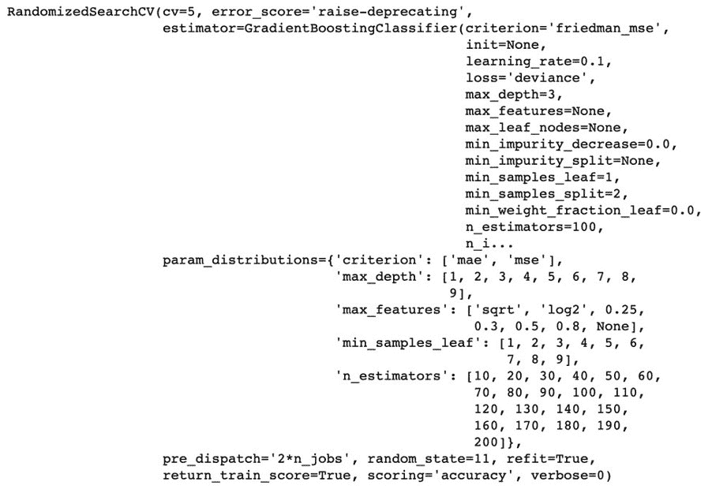
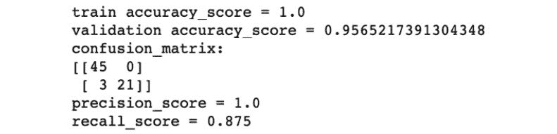
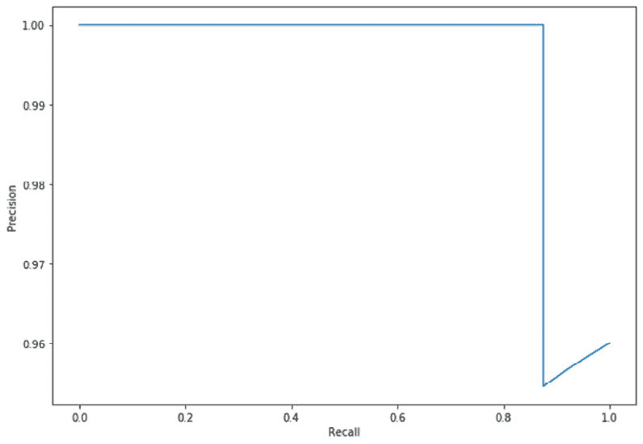
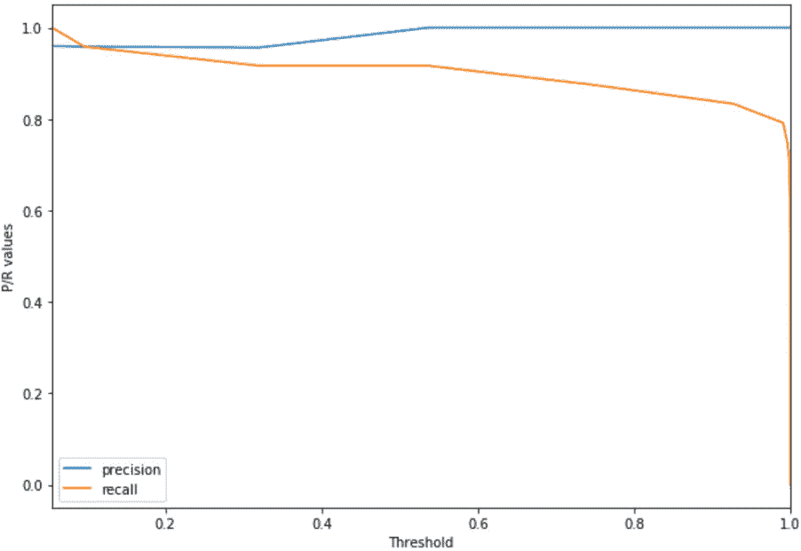
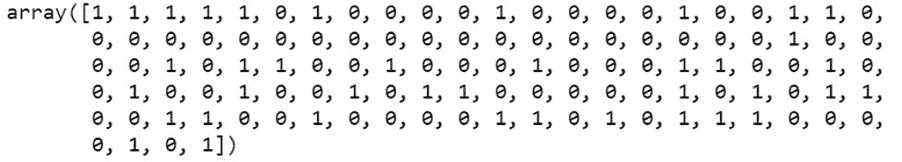
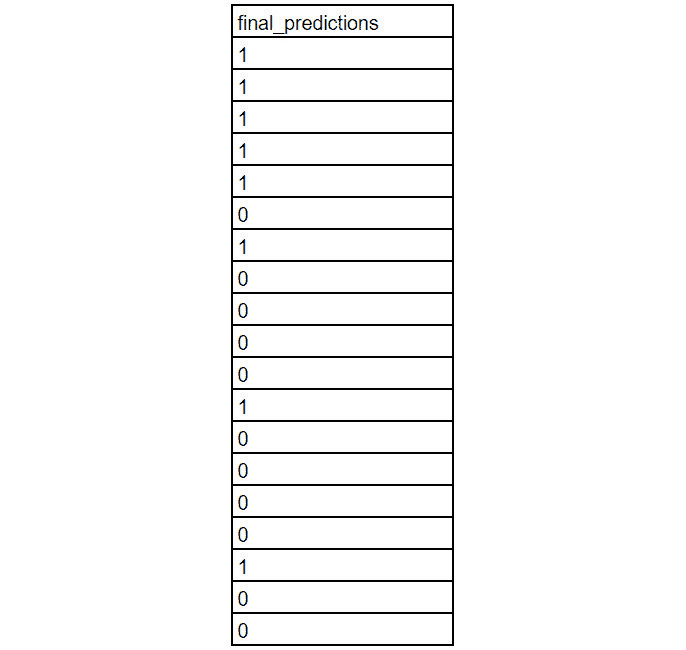

7\. 模型评估

#### 第十六章：活动 7.01：最终测试项目

导入相关库：

import pandas as pd

import numpy as np

import json

%matplotlib inline

import matplotlib.pyplot as plt

from sklearn.preprocessing import OneHotEncoder

from sklearn.model_selection import RandomizedSearchCV, train_test_split

from sklearn.ensemble import GradientBoostingClassifier

from sklearn.metrics import (accuracy_score, precision_score, \

recall_score, confusion_matrix, precision_recall_curve)

读取 breast-cancer-data.csv 数据集：

data = pd.read_csv('../Datasets/breast-cancer-data.csv')

data.info()

让我们将输入数据（X）和目标（y）分开：

X = data.drop(columns=['diagnosis'])

y = data['diagnosis'].map({'malignant': 1, 'benign': 0}.get).values

将数据集分割为训练集和测试集：

X_train, X_test, \

y_train, y_test = train_test_split(X, y, \

test_size=0.2, random_state=11)

print(X_train.shape)

print(y_train.shape)

print(X_test.shape)

print(y_test.shape)

应该得到以下输出：

(455, 30)

(455,)

(114, 30)

(114,)

选择一个基础模型，并定义要搜索超参数调整的模型的超参数值范围。让我们使用梯度提升分类器作为我们的模型。然后，以字典形式定义要调整的所有超参数的值范围：

meta_gbc = GradientBoostingClassifier()

param_dist = {'n_estimators': list(range(10, 210, 10)), \

'criterion': ['mae', 'mse'],\

'max_features': ['sqrt', 'log2', 0.25, 0.3, \

0.5, 0.8, None], \

'max_depth': list(range(1, 10)), \

'min_samples_leaf': list(range(1, 10))}

定义参数以初始化 RandomizedSearchCV 对象，并使用 K 折交叉验证来识别最佳模型超参数。定义随机搜索所需的参数，包括 cv 设为 5，表示使用 5 折交叉验证来选择超参数。然后初始化 RandomizedSearchCV 对象，并使用 .fit() 方法启动优化：

rand_search_params = {'param_distributions': param_dist, \

'scoring': 'accuracy', 'n_iter': 100, \

'cv': 5, 'return_train_score': True, \

'n_jobs': -1, 'random_state': 11 }

random_search = RandomizedSearchCV(meta_gbc, **rand_search_params)

random_search.fit(X_train, y_train)

应该得到以下输出：

图 7.36：RandomizedSearchCSV 对象

调整完成后，找到获得最高平均测试分数的位置（迭代次数）。找到相应的超参数并保存到字典中：

idx = np.argmax(random_search.cv_results_['mean_test_score'])

final_params = random_search.cv_results_['params'][idx]

final_params

应该得到以下输出：

图 7.37：超参数

将训练数据集进一步拆分为训练集和验证集，并在训练数据集上使用最终的超参数训练一个新模型。使用 scikit-learn 的 train_test_split() 方法将 X 和 y 拆分为训练集和验证集，验证集占数据集的 15%：

train_X, val_X, \

train_y, val_y = train_test_split(X_train, y_train, \

test_size=0.15, random_state=11)

train_X.shape, train_y.shape, val_X.shape, val_y.shape

你应该得到以下输出：

((386, 30), (386,), (69, 30), (69,))

使用最终的超参数训练梯度增强分类模型，并根据训练和验证集进行预测。同时，计算验证集的概率：

gbc = GradientBoostingClassifier(**final_params)

gbc.fit(train_X, train_y)

preds_train = gbc.predict(train_X)

preds_val = gbc.predict(val_X)

pred_probs_val = np.array([each[1] \

for each in gbc.predict_proba(val_X)])

计算预测的准确度、精度和召回率，并打印混淆矩阵：

print('train accuracy_score = {}'\

.format(accuracy_score(y_true=train_y, y_pred=preds_train)))

print('validation accuracy_score = {}'\

.format(accuracy_score(y_true=val_y, y_pred=preds_val)))

print('confusion_matrix: \n{}'\

.format(confusion_matrix(y_true=val_y, y_pred=preds_val)))

print('precision_score = {}'\

.format(precision_score(y_true=val_y, y_pred=preds_val)))

print('recall_score = {}'\

.format(recall_score(y_true=val_y, y_pred=preds_val)))

你应该得到以下输出：

图 7.38: 评估得分和混淆矩阵

尝试不同的阈值，找到具有较高召回率的最佳点。

绘制精度-召回率曲线：

plt.figure(figsize=(10,7))

精度, 召回率, \

thresholds = precision_recall_curve(val_y, \

pred_probs_val)

plt.plot(recall, precision)

plt.xlabel('召回率')

plt.ylabel('精度')

plt.show()

输出将如下所示：

图 7.39: 精度-召回率曲线

"""

绘制精度和召回率随阈值增加的变化。

"""

PR_variation_df = pd.DataFrame({'precision': precision, \

'recall': recall}, \

index=list(thresholds)+[1])

PR_variation_df.plot(figsize=(10,7))

plt.xlabel('阈值')

plt.ylabel('P/R 值')

plt.show()

你应该得到以下输出：

图 7.40: 精度和召回率随阈值增加的变化

最终确定一个阈值，用于根据测试数据集进行预测。我们设定一个值，例如 0.05。该值完全取决于你在前一步探索中认为最合适的值：

final_threshold = 0.05

根据测试数据集预测最终值并将其保存到文件中。使用第 10 步中确定的最终阈值，找出训练集中每个值的类别。然后，将最终预测写入 final_predictions.csv 文件：

pred_probs_test = np.array([每个值[1] \

对于每个值 in gbc.predict_proba(X_test)])

preds_test = (pred_probs_test > final_threshold).astype(int)

preds_test

输出将如下所示：

图 7.41：测试数据集的最终值预测

或者，您也可以以 CSV 格式获取输出：

使用 `open('final_predictions.csv', 'w')` 打开文件：

f.writelines([str(val)+'\n' for val in preds_test])

输出将是如下的 CSV 文件：

图 7.42：最终值的输出

#### 注意

要访问此特定部分的源代码，请参阅 https://packt.live/2Ynw6Lt。

您也可以在 https://packt.live/3erAajt 在线运行此示例。必须执行整个 Notebook 才能得到期望的结果。
