# 第一章：向监督学习迈出的第一步

在本书中，我们将学习实现许多你在日常生活中接触到的常见机器学习算法。这里将有大量的数学、理论和具体的代码示例，足以满足任何机器学习爱好者的需求，并且希望你在此过程中能学到一些有用的 Python 技巧和实践。我们将从简要介绍监督学习开始，展示一个真实的机器学习示范；完成 Anaconda 环境的设置；学习如何衡量曲线的斜率、Nd-曲线和多个函数；最后，我们将讨论如何判断一个模型是否优秀。在本章中，我们将涵盖以下主题：

+   监督学习应用示例

+   设置环境

+   监督学习

+   爬山法与损失函数

+   模型评估与数据分割

# 技术要求

本章中，如果你还没有安装以下软件，你需要进行安装：

+   Jupyter Notebook

+   Anaconda

+   Python

本章的代码文件可以在[https:/​/​github.​com/​PacktPublishing/](https://github.com/PacktPublishing/)找到。

[Supervised-Machine-Learning-with-Python](https://github.com/PacktPublishing/Supervised-Machine-Learning-with-Python)

# 监督学习应用示例

首先，我们将看看可以通过监督机器学习做些什么。通过以下终端提示符，我们将启动一个新的 Jupyter Notebook：

```py
jupyter notebook
```

一旦我们进入这个顶级目录`Hands-on-Supervised-Machine-Learning-with-Python-master`，我们将直接进入`examples`目录：

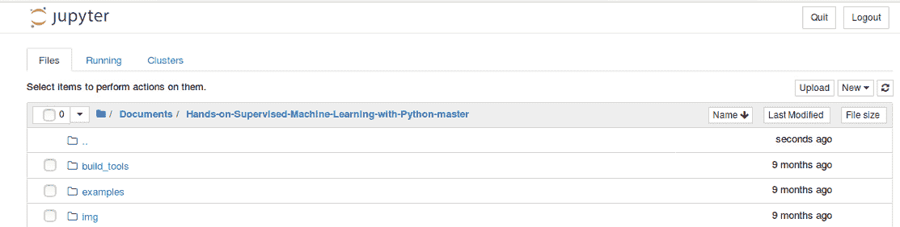

你可以看到我们这里唯一的 Notebook 是`1.1 Supervised Learning Demo.ipynb`：

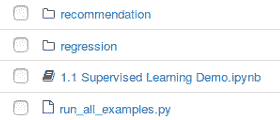

我们有一个监督学习示范的 Jupyter Notebook。我们将使用一个名为`Spam`的 UCI 数据集。这个数据集包含了不同的电子邮件，并且每封邮件都有不同的特征，这些特征对应于是否是垃圾邮件。我们希望构建一个机器学习算法，能够预测即将收到的电子邮件是否是垃圾邮件。如果你正在运行自己的电子邮件服务器，这将对你非常有帮助。

所以下面的代码中的第一个函数只是一个请求的 get 函数。你应该已经拥有数据集，它已经在`examples`目录中了。但如果没有，你可以继续运行以下代码。你可以看到我们已经有了`spam.csv`，所以我们不需要重新下载：

```py
from urllib.request import urlretrieve, ProxyHandler, build_opener, install_opener
import requests
import os
pfx = "https://archive.ics.uci.edu/ml/machine-learning databases/spambase/"
data_dir = "data"
# We might need to set a proxy handler...
try:
    proxies = {"http": os.environ['http_proxy'],
               "https": os.environ['https_proxy']}
    print("Found proxy settings")
    #create the proxy object, assign it to a variable
    proxy = ProxyHandler(proxies)
    # construct a new opener using your proxy settings
    opener = build_opener(proxy)
    # install the opener on the module-level
    install_opener(opener)

except KeyError:
    pass
# The following will download the data if you don't already have it...
def get_data(link, where):
    # Append the prefix
    link = pfx + link
```

接下来，我们将使用`pandas`库。它是一个来自 Python 的数据分析库。在我们进行下一阶段的环境设置时，你可以安装它。这个库提供了数据框结构，是一种原生的 Python 数据结构，我们将如下使用它：

```py
import pandas as pd
names = ["word_freq_make", "word_freq_address", "word_freq_all", 
         "word_freq_3d", "word_freq_our", "word_freq_over", 
         "word_freq_remove", "word_freq_internet", "word_freq_order",
         "word_freq_mail", "word_freq_receive", "word_freq_will", 
         "word_freq_people", "word_freq_report", "word_freq_addresses", 
         "word_freq_free", "word_freq_business", "word_freq_email", 
         "word_freq_you", "word_freq_credit", "word_freq_your", 
         "word_freq_font", "word_freq_000", "word_freq_money", 
         "word_freq_hp", "word_freq_hpl", "word_freq_george", 
         "word_freq_650", "word_freq_lab", "word_freq_labs", 
         "word_freq_telnet", "word_freq_857", "word_freq_data", 
         "word_freq_415", "word_freq_85", "word_freq_technology", 
         "word_freq_1999", "word_freq_parts", "word_freq_pm", 
         "word_freq_direct", "word_freq_cs", "word_freq_meeting", 
         "word_freq_original", "word_freq_project", "word_freq_re", 
         "word_freq_edu", "word_freq_table", "word_freq_conference", 
         "char_freq_;", "char_freq_(", "char_freq_[", "char_freq_!", 
         "char_freq_$", "char_freq_#", "capital_run_length_average", 
         "capital_run_length_longest", "capital_run_length_total",
         "is_spam"]
df = pd.read_csv(os.path.join("data", "spam.csv"), header=None, names=names)
# pop off the target
y = df.pop("is_spam")
df.head()
```

这允许我们将数据以如下格式呈现。我们可以使用各种统计函数，这些函数在进行机器学习时非常实用：

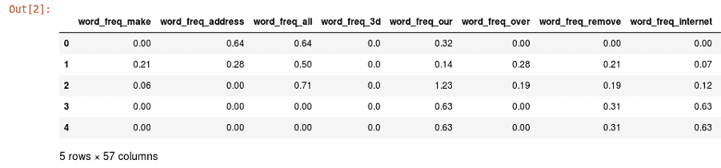

如果一些术语你不太熟悉，别着急——我们将在本书中详细学习这些术语。

对于`train_test_split`，我们将使用`df`数据集并将其分为两个部分：训练集和测试集。此外，我们还会有目标变量，它是一个`01`变量，表示是否为垃圾邮件的真假。我们也会分割这个目标变量，包括相应的真假标签向量。通过划分标签，我们得到`3680`个训练样本和`921`个测试样本，文件如以下代码片段所示：

```py
from sklearn.model_selection import train_test_split
X_train, X_test, y_train, y_test = train_test_split(df, y, test_size=0.2, random_state=42, stratify=y)
print("Num training samples: %i" % X_train.shape[0])
print("Num test samples: %i" % X_test.shape[0])
```

前述代码的输出如下：

```py
Num training samples: 3680
Num test samples: 921
```

请注意，我们的训练样本比测试样本多，这对于调整我们的模型非常重要。我们将在本书后面学习到这一点。所以，暂时不用太担心这里发生了什么，这些内容仅仅是为了演示目的。

在以下代码中，我们使用了`packtml`库。这是我们正在构建的实际包，是一个分类和回归树分类器。`CARTClassifier`实际上是决策树的一个泛化版本，用于回归和分类目的。我们在这里拟合的所有内容都是我们从头开始构建的监督学习算法。这是我们将在本书中构建的分类器之一。我们还提供了这个用于绘制学习曲线的实用函数。这个函数将接收我们的训练集并将其分成不同的折叠进行交叉验证。我们将在不同阶段拟合训练集中的样本数量，以便我们可以看到学习曲线在训练集和验证集折叠之间的收敛情况，这本质上决定了我们的算法如何学习：

```py
from packtml.utils.plotting import plot_learning_curve
from packtml.decision_tree import CARTClassifier
from sklearn.metrics import accuracy_score
import numpy as np
import matplotlib.pyplot as plt
%matplotlib inline

# very basic decision tree
plot_learning_curve(
        CARTClassifier, metric=accuracy_score,
        X=X_train, y=y_train, n_folds=3, seed=21, trace=True,
        train_sizes=(np.linspace(.25, .75, 4) * X_train.shape[0]).astype(int),
        max_depth=8, random_state=42)\
    .show()
```

我们将继续运行前面的代码，并绘制算法在不同训练集大小下的学习情况。你可以看到，我们将为四种不同的训练集大小进行拟合，并使用三折交叉验证。

所以，实际上我们是在拟合 12 个独立的模型，这需要几秒钟的时间：

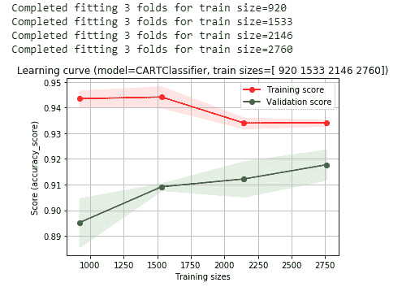

在前面的输出中，我们可以看到我们的**训练得分**和**验证得分**。**训练得分**在学习如何泛化时会减少，而我们的**验证得分**随着算法从训练集泛化到验证集而提高。所以，在我们的验证集中，准确率大约徘徊在 92%到 93%之间。

我们将在这里使用来自最优模型的超参数：

```py
decision_tree = CARTClassifier(X_train, y_train, random_state=42, max_depth=8)
```

# 逻辑回归

在本节中，我们将学习逻辑回归，这是我们将从头开始构建的另一个分类模型。我们将继续拟合以下代码：

```py
from packtml.regression import SimpleLogisticRegression
# simple logistic regression classifier
plot_learning_curve(
        SimpleLogisticRegression, metric=accuracy_score,
        X=X_train, y=y_train, n_folds=3, seed=21, trace=True,
        train_sizes=(np.linspace(.25, .8, 4) *     X_train.shape[0]).astype(int),
        n_steps=250, learning_rate=0.0025, loglik_interval=100)\
    .show()
```

这比决策树要快得多。在下面的输出中，你可以看到我们在 92.5%区间附近聚集得更多。这看起来比我们的决策树更一致，但在验证集上的表现还是不够好：

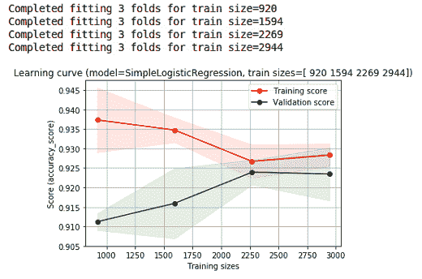

在下方的截图中，有垃圾邮件的编码记录。我们将看到这种编码在我们可以读取并验证的邮件上的表现。所以，如果你访问了顶部 Jupyter Notebook 中包含的 UCI 链接，它将提供数据集中所有特征的描述。这里有很多不同的特征，它们计算特定词汇与整个邮件中的词汇总数的比例。其中一些词汇可能是免费的，一些是受信的。我们还有其他几个特征，计算字符频率、感叹号的数量以及连续大写字母序列的数量。

所以，如果你有一组高度资本化的词汇，我们有这些特征：

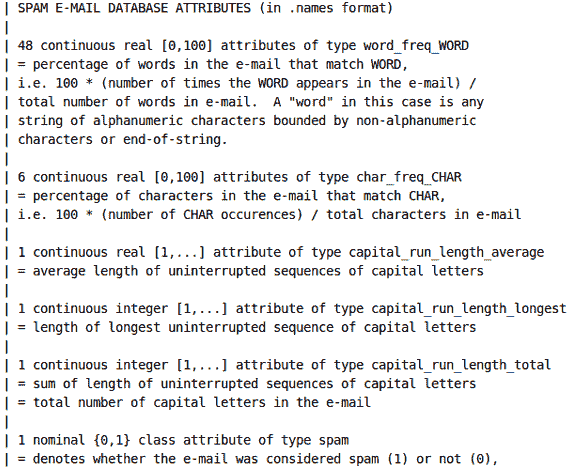

在下方的截图中，我们将创建两封电子邮件。第一封邮件显然是垃圾邮件。即使有人收到这封邮件，也不会有人回应：

```py
spam_email = """
Dear small business owner,

This email is to inform you that for $0 down, you can receive a 
FREE CREDIT REPORT!!! Your money is important; PROTECT YOUR CREDIT and 
reply direct to us for assistance!
"""

print(spam_email)
```

上述代码片段的输出结果如下：

```py
Dear small business owner,

This email is to inform you that for $0 down, you can receive a 
FREE CREDIT REPORT!!! Your money is important; PROTECT YOUR CREDIT and 
reply direct to us for assistance!
```

第二封邮件看起来不像垃圾邮件：

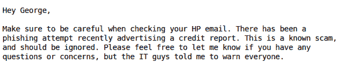

我们刚刚拟合的模型将查看这两封邮件并编码这些特征，然后会分类哪些是垃圾邮件，哪些不是垃圾邮件。

以下函数将把这些电子邮件编码成我们讨论过的特征。最初，我们将使用一个`Counter`函数作为对象，并对电子邮件进行分词。我们所做的就是将电子邮件拆分成一个词汇列表，然后这些词汇可以被拆分成一个字符列表。稍后，我们将计算这些字符和单词的数量，以便生成我们的特征：

```py
from collections import Counter
import numpy as np
def encode_email(email):
    # tokenize the email
    tokens = email.split()

    # easiest way to count characters will be to join everything
    # up and split them into chars, then use a counter to count them
    # all ONE time.
    chars = list("".join(tokens))
    char_counts = Counter(chars)
    n_chars = len(chars)

    # we can do the same thing with "tokens" to get counts of words
    # (but we want them to be lowercase!)
    word_counts = Counter([t.lower() for t in tokens])

    # Of the names above, the ones that start with "word" are
    # percentages of frequencies of words. Let's get the words
    # in question
    freq_words = [ 
        name.split("_")[-1]
        for name in names 
        if name.startswith("word")
    ]

    # compile the first 48 values using the words in question
    word_freq_encodings = [100\. * (word_counts.get(t, 0) / len(tokens))
                           for t in freq_words]
```

所以，开始时我们提到的所有特征告诉我们我们感兴趣的词汇是什么。我们可以看到，原始数据集关注的词汇包括地址、电子邮件、商业和信用，而对于我们的字符，我们寻找的是打开和关闭的括号以及美元符号（这些与垃圾邮件非常相关）。所以，我们将统计所有这些特征，具体如下：

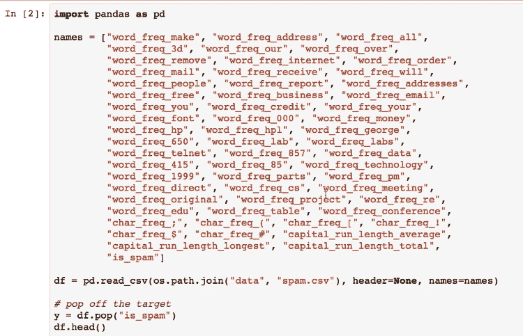

应用比例并跟踪`capital_runs`的总数，计算平均值、最大值和最小值：

```py
 # make a np array to compute the next few stats quickly
capital_runs = np.asarray(capital_runs)
    capital_stats = [capital_runs.mean(), 
                     capital_runs.max(), 
                     capital_runs.sum()]

```

当我们运行之前的代码时，我们得到以下输出。这将编码我们的电子邮件。这只是一个包含所有不同特征的向量。它大约应该有 50 个字符长：

```py
# get the email vectors
fake_email = encode_email(spam_email)
real_email = encode_email(not_spam)
# this is what they look like:
print("Spam email:")
print(fake_email)
print("\nReal email:")
print(real_email)
```

上述代码的输出结果如下：

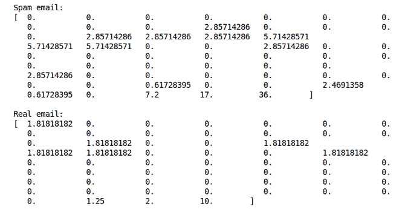

当我们将前面的值输入到我们的模型中时，我们将看到模型的效果如何。理想情况下，我们会看到实际的假邮件被预测为假，实际的真实邮件被预测为真实。因此，如果邮件被预测为假，我们的垃圾邮件预测确实为垃圾邮件，无论是在决策树还是逻辑回归模型中。我们的真实邮件不是垃圾邮件，这一点可能更为重要，因为我们不想将真实邮件误筛入垃圾邮件文件夹。所以，你可以看到我们在这里拟合了一些非常不错的模型，这些模型可以应用于我们直观判断是否为垃圾邮件的情景：

```py
predict = (lambda rec, mod: "SPAM!" if mod.predict([rec])[0] == 1 else "Not spam")

print("Decision tree predictions:")
print("Spam email prediction: %r" % predict(fake_email, decision_tree))
print("Real email prediction: %r" % predict(real_email, decision_tree))

print("\nLogistic regression predictions:")
print("Spam email prediction: %r" % predict(fake_email, logistic_regression))
print("Real email prediction: %r" % predict(real_email, logistic_regression))
```

上述代码的输出如下：

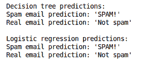

这是我们将在本书中从零开始构建的实际算法的演示，可以应用于真实世界的问题。

# 设置环境

我们将继续进行环境设置。现在我们已经完成了前面的示例，让我们开始设置我们的 Anaconda 环境。Anaconda 除了其他功能外，还是一个依赖管理工具，它能帮助我们控制我们想要使用的每个包的特定版本。我们将通过这个链接，[`www.anaconda.com/download/`](https://www.anaconda.com/download/)，访问 Anaconda 官网，并点击“Download”标签页。

我们正在构建的这个包将无法与 Python 2.7 兼容。所以，一旦你有了 Anaconda，我们将进行一个实际的编码示例，展示如何设置包以及`.yml`文件中的环境设置。

一旦你在主目录中设置好了 Anaconda，我们将使用`environment.yml`文件。你可以看到我们将要创建的环境名称是`packt-sml`，用于有监督的机器学习。我们将需要 NumPy、SciPy、scikit-learn 和 pandas。这些都是科学计算和数据分析的库。Matplotlib 是我们在 Jupyter Notebook 中用于绘制图表的工具，因此你需要这些图表。`conda`包使得构建这个环境变得非常简单。我们只需输入`conda env create`，然后使用`-f`参数指定文件，进入`Hands-on-Supervised-Machine-Learning-with-Python-master`目录，我们将使用如下命令中的`environment.yml`：

```py
cat environment.yml conda env create -f environment.yml
```

由于这是你第一次创建这个环境，它会创建一个大型脚本，下载你所需的所有内容。一旦创建了环境，你需要激活它。因此，在 macOS 或 Linux 机器上，我们将输入`source activate packt-sml`。

如果你使用的是 Windows 系统，只需输入`activate packt-sml`，这将激活该环境：

```py
 source activate packt-sml
```

输出如下：

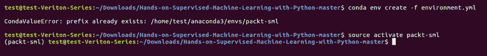

为了构建这个包，我们将输入`cat setup.py`命令。我们可以快速检查一下：

```py
cat setup.py
```

看看这个 `setup.py`。基本上，这是使用 setup 工具安装包的方式。在下面的截图中，我们可以看到所有不同的子模块：

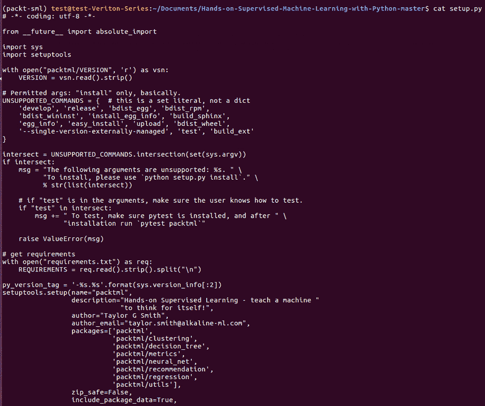

我们将通过键入 `python setup.py install` 命令来构建这个包。现在，当我们进入 Python 并尝试导入 `packtml` 时，我们将看到以下输出：

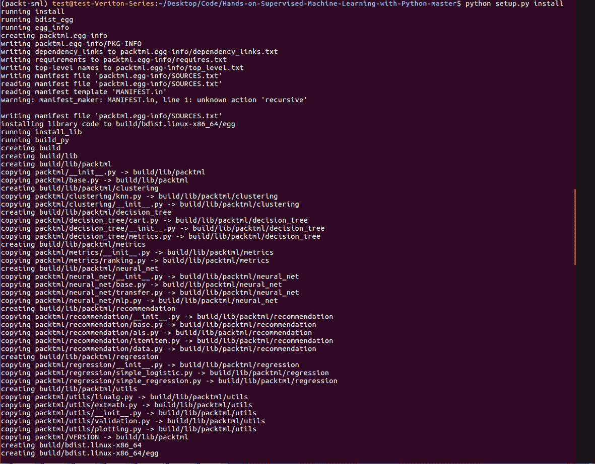

在这一部分中，我们已经安装了环境并构建了包。在下一部分中，我们将开始讨论监督学习背后的一些理论。

# 监督学习

在这一部分，我们将正式定义什么是机器学习，特别是什么是监督学习。

在 AI 的早期，所有的东西都是规则引擎。程序员编写函数和规则，计算机简单地遵循这些规则。现代 AI 更符合机器学习的理念，它教计算机自己编写函数。有人可能会认为这是一种过于简单化的说法，但从本质上讲，这正是机器学习的核心内容。

我们将通过一个简单的例子来展示什么是机器学习，什么不是机器学习。在这里，我们使用 scikit-learn 的 datasets 子模块创建两个对象和变量，这些对象和变量也叫做协方差或特征，沿着列轴排列。`y` 是一个向量，它的值的数量与 `X` 中的行数相同。在这个例子中，`y` 是一个类别标签。为了举例说明，`y` 这里可能是一个二分类标签，表示一个实际的情况，比如肿瘤的恶性程度。接着，`X` 是一个描述 `y` 的属性矩阵。一个特征可能是肿瘤的直径，另一个特征可能表示肿瘤的密度。前面的解释可以通过以下代码来体现：

```py
import numpy as np
from sklearn.datasets import make_classification

rs = np.random.RandomState(42)
X,y = make_classification(n_samples=10, random_state=rs)
```

根据我们的定义，规则引擎只是业务逻辑。它可以简单也可以复杂，完全取决于你的需求，但规则是由程序员定义的。在这个函数中，我们将通过返回 `1` 或 `true` 来评估我们的 `X` 矩阵，当行的和大于 `0` 时。尽管这里涉及了一些数学运算，但仍然可以看作是一个规则引擎，因为我们（程序员）定义了规则。因此，我们理论上可以进入一个灰色区域，其中规则本身是通过机器学习发现的。但为了便于讨论，假设主刀医生随意选择 `0` 作为阈值，任何超过该值的都被认为是癌症：

```py
def make_life_alterning_decision(X):
    """Determine whether something big happens"""
    row_sums = X.sum(axis=1)
    return (row_sums > 0).astype(int)
make_life_alterning_decision(X)
```

前面代码片段的输出如下：

```py
array([0, 1, 0, 0, 1, 1, 1, 0, 1, 0])
```

如前所述，我们的规则引擎可以简单也可以复杂。在这里，我们不仅仅关注 `row_sums`，我们还有多个标准来判断某样东西是否为癌症。行中的最小值必须小于 `-1.5`，并且还需要满足以下三个标准之一或多个：

+   行和超过 `0`

+   行和能被 `0.5` 整除

+   行的最大值大于`1.5`

因此，尽管我们的数学这里有些复杂，但我们仍然只是在构建一个规则引擎：

```py
def make_more_complex_life_alterning_decision(X):
    """Make a more complicated decision about something big"""   
    row_sums = X.sum(axis=1)
      return ((X.min(axis=1) < -1.5) &
              ((row_sums >= 0.) |
               (row_sums % 0.5 == 0) |
               (X.max(axis=1) > 1.5))).astype(int)

make_more_complex_life_alterning_decision(X) 
```

前面代码的输出如下：

```py
array([0, 1, 1, 1, 1, 1, 0, 1, 1, 0])
```

现在，假设我们的外科医生意识到他们并不是自己认为的那种数学或编程天才。于是，他们雇佣程序员为他们构建机器学习模型。该模型本身是一个函数，发现补充决策函数的参数，而决策函数本质上就是机器自己学习到的函数。所以，参数是我们将在接下来的第二章《实现参数化模型》中讨论的内容，它们是参数化模型。因此，当我们调用`fit`方法时，背后发生的事情是模型学习数据的特征和模式，以及`X`矩阵如何描述`y`向量。然后，当我们调用`predict`函数时，它会将学习到的决策函数应用于输入数据，从而做出合理的猜测：

```py
from sklearn.linear_model import LogisticRegression

def learn_life_lession(X, y):
    """Learn a lesson abd apply it in a future situation"""
    model = LogisticRegression().fit(X, y)
    return (lambda X: model.predict(X))
educated_decision = learn_life_lession(X, y)(X)
educated_decision
```

前面代码的输出如下：

```py
array([1, 1, 0, 0, 0, 1, 1, 0, 1, 0])
```

所以，现在我们到了需要明确界定有监督学习到底是什么的时刻。有监督学习正是我们刚才描述的那个例子。给定我们的样本矩阵*X*，以及对应标签的向量*y*，它学习一个函数，近似*y*的值或！[](img/ec167647-fd63-4575-af06-3c72ac2af74b.png)：

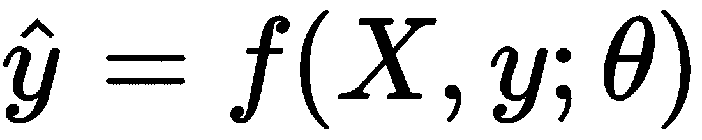

还有一些其他形式的机器学习不是有监督的，称为**无监督学习**。这些没有标签，更侧重于模式识别任务。所以，决定是否有监督的标志就是数据是否有标签。

回到我们之前的例子，当我们调用`fit`方法时，我们学习了新的决策函数，然后当我们调用`predict`时，我们正在近似新的`y`值。所以，输出就是我们刚才看到的这个！[](img/68d94b46-bc5d-4c32-9c89-4805452ca273.png)

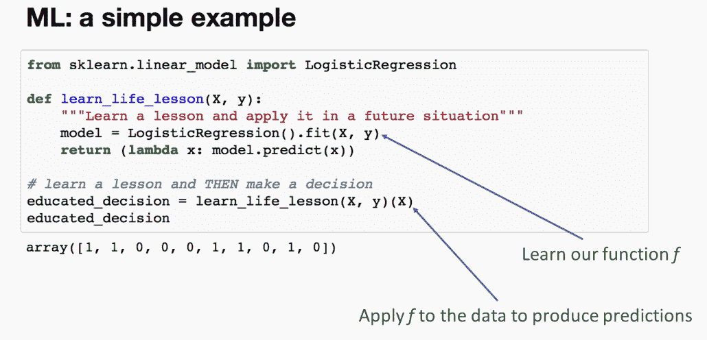

有监督学习从标记样本中学习一个函数，该函数近似未来的`y`值。在这一点上，你应该能够清楚地解释这个抽象概念——也就是有监督机器学习的高层次概念。

# 攀升法和损失函数

在上一节中，我们已经熟悉了有监督机器学习的概念。现在，我们将学习机器如何在幕后进行学习。本节将探讨许多机器学习算法使用的常见优化技术——**爬山法**。它基于这样一个事实：每个问题都有一个理想状态，并且有一种方法来衡量我们离这个理想状态有多近或多远。需要注意的是，并不是所有的机器学习算法都使用这种方法。

# 损失函数

首先，我们将介绍损失函数，然后，在深入了解爬山法和下降法之前，我们将进行一个简短的数学复习。

这节课会涉及一些数学内容，虽然我们尽量避免纯理论的概念，但这正是我们必须要了解的内容，以便理解大多数这些算法的核心。课程结束时会有一个简短的应用部分。如果你无法记住某些微积分内容，不必恐慌；只要尽量理解黑盒背后发生的事情。

如前所述，机器学习算法必须衡量它与某个目标的接近程度。我们将此定义为成本函数或损失函数。有时，我们也听到它被称为目标函数。虽然并不是所有机器学习算法都旨在直接最小化损失函数，但我们将在这里学习规则而不是例外。损失函数的目的是确定模型拟合的好坏。它通常会在模型的学习过程中进行评估，并在模型最大化其学习能力时收敛。

一个典型的损失函数计算一个标量值，该值由真实标签和预测标签给出。也就是说，给定我们的实际*y*和预测的*y*，即。这个符号可能有点难懂，但它的意思是，某个函数*L*，我们将其称为损失函数，将接受真实值*y*和预测值，并返回一个标量值。损失函数的典型公式如下：

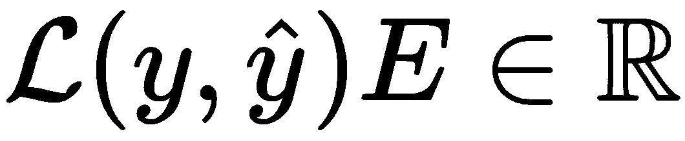

所以，我列出了几个常见的损失函数，它们可能看起来熟悉，也可能不熟悉。**平方误差和**（**SSE**）是我们将在回归模型中使用的度量：

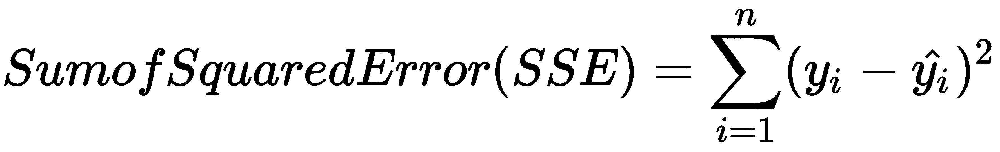

交叉熵是一个非常常用的分类度量：

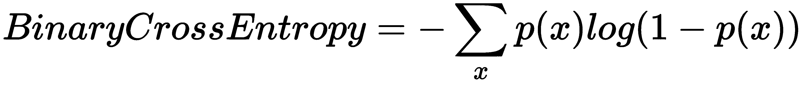

在下面的图示中，左侧的*L*函数仅仅表示它是关于*y*的损失函数，并且是给定参数 theta 的。因此，对于任何算法，我们都希望找到一组 theta 参数，使得损失最小化。也就是说，如果我们在预测房价时，我们可能希望尽可能准确地估算每平方英尺的价格，以最小化我们的预测误差。

参数通常存在于一个比视觉上能够表示的更高维的空间中。因此，我们关注的一个大问题是：如何最小化成本？通常情况下，我们不可能尝试所有可能的值来确定问题的真实最小值。所以，我们必须找到一种方法来下降这个模糊的损失山丘。困难的部分在于，在任何给定的点上，我们都不知道曲线是上升还是下降，除非进行某种评估。这正是我们要避免的，因为这样做非常昂贵：

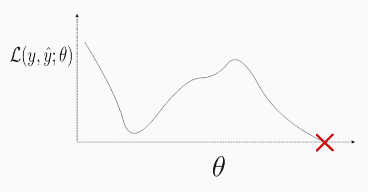

我们可以将这个问题描述为在一个漆黑的房间里醒来，房间的地板不平，试图找到房间的最低点。你不知道房间有多大，也不知道它有多深或多高。你首先该在哪里踩？我们可以做的一件事是检查我们站立的位置，确定周围哪个方向是向下倾斜的。为此，我们需要测量曲线的坡度。

# 测量曲线的坡度

以下是标量导数的快速复习。为了计算任何给定点的坡度，标准的方式通常是测量我们感兴趣的点与某个割线点之间的坡度，我们称这个点为 delta *x*：

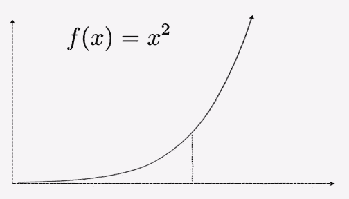

当*x*与其邻近值 delta *x*之间的距离趋近于*0*，或者当我们的极限趋近于*0*时，我们就能得到曲线的坡度。这个坡度由以下公式给出：

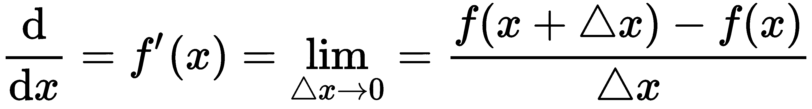

有几种你可能熟悉的符号。其中一个是*f*对*x*的导数。常数的坡度是*0*。因此，如果*f(x)*是*9*，换句话说，如果*y*仅仅是*9*，它永远不变。没有坡度。所以，坡度是*0*，如图所示：

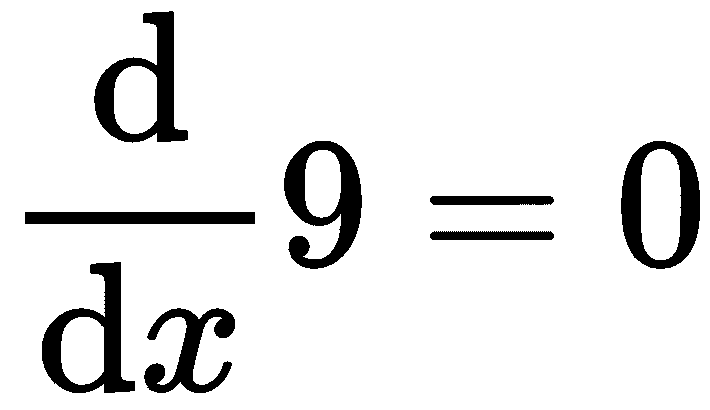

我们也可以在第二个例子中看到幂律的作用。这在之后会非常有用。如果我们将变量乘以幂，并将幂减去一，我们得到以下结果：

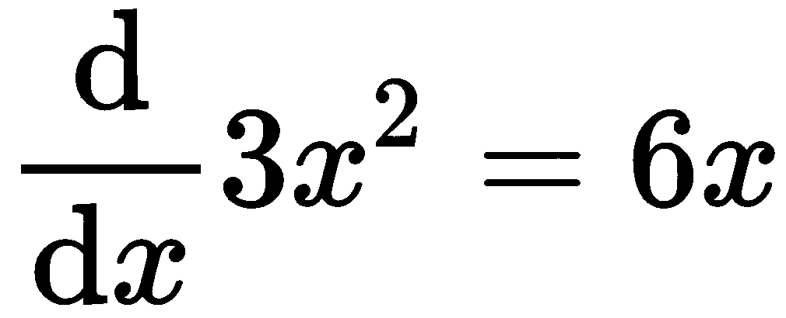

# 测量 Nd 曲线的坡度

为了测量一个向量或多维曲面的坡度，我们将引入偏导数的概念，偏导数就是对某一变量求导数，而将所有其他变量视为常数。因此，我们的解是一个维度为*k*的向量，其中*k*是我们函数所涉及的变量的数量。在这种情况下，我们有*x*和*y*。我们求解的向量中每个相应的位置都是对相应函数的定位变量求导的结果。

从概念层面来看，我们所做的是保持一个变量不变，同时改变周围的其他变量，看看坡度如何变化。我们分母的符号表示我们正在测量哪个变量的坡度，并且是相对于该点进行的。因此，在这种情况下，第一个位置，*d(x)*，表示我们正在对函数*f*进行关于*x*的偏导数，保持*y*不变。同样，第二个位置，我们对函数*f*进行关于*y*的导数，保持*x*不变。因此，最终得到的是一个梯度，它是一个非常重要的关键词。它只是一个偏导数的向量：

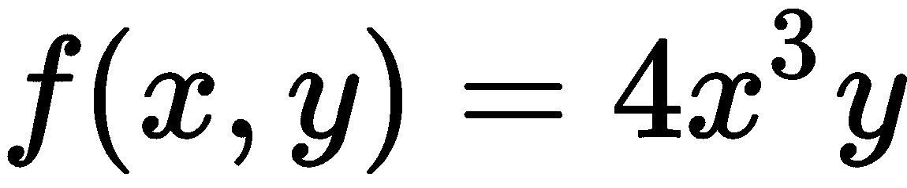

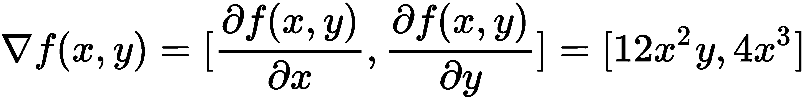

# 测量多个函数的坡度

然而，我们想要变得更复杂，计算多个函数在同一时间的斜率。我们最终得到的只是一个沿着行的梯度矩阵。在下面的公式中，我们可以看到之前示例中我们刚刚解出的结果：


在下一个公式中，我们引入了这个新的函数，称为*g*。我们看到了函数*g*的梯度，每个位置对应于相对于变量*x*和*y*的偏导数：

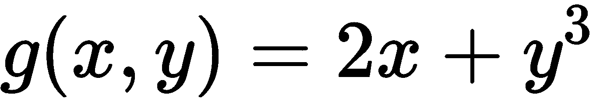

当我们将这些组合成一个矩阵时，得到的就是雅可比矩阵。你不需要解这个矩阵，但你应该理解我们所做的是计算一个多维表面的斜率。只要理解这一点，你可以把它当作一个黑盒。我们就是这样计算梯度和雅可比矩阵的：

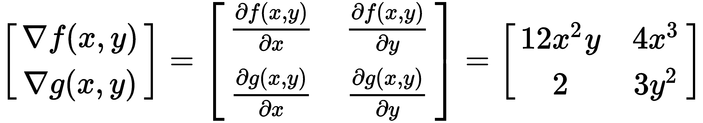

# 爬山与下坡

我们将回到之前的例子——我们观察过的失落的山丘。我们想找到一组能够最小化我们的损失函数*L*的 theta 参数。正如我们已经确定的那样，我们需要爬山或者下山，并且了解自己在相对于邻近点的位置，而不必计算所有的内容。为了做到这一点，我们需要能够测量曲线相对于 theta 参数的斜率。所以，回到之前的房屋例子，我们希望知道每平方英尺成本增量的正确值是多少。一旦知道了这个，我们就可以开始朝着找到最佳估计的方向迈出步伐。如果你做出了一个错误的猜测，你可以转身并朝着完全相反的方向前进。所以，我们可以根据我们的度量标准爬山或下山，这使得我们能够优化我们想要学习的函数的参数，而不管该函数本身的表现如何。这是一层抽象。这个优化过程称为梯度下降，它支持我们在本书中将讨论的许多机器学习算法。

以下代码展示了一个如何计算矩阵相对于 theta 的梯度的简单示例。这个示例实际上是逻辑回归学习部分的简化代码：

```py
import numpy as np

seed = (42)

X = np.random.RandomState(seed).rand(5, 3).round(4)

y = np.array([1, 1, 0, 1, 0])

h = (lambda X: 1\. / (1\. + np.exp(-X)))

theta = np.zeros(3)

lam = 0.05

def iteration(theta):

    y_hat = h(X.dot(theta))

    residuals = y - y_hat

    gradient = X.T.dot(residuals)
    theta += gradient * lam
    print("y hat: %r" % y_hat.round(3).tolist())
    print("Gradient: %r" % gradient.round(3).tolist())
    print("New theta: %r\n" % theta.round(3).tolist())

iteration(theta)
iteration(theta)
```

在最开始，我们随机初始化了`X`和`y`，这并不是算法的一部分。所以，这里的`x`是 sigmoid 函数，也叫做**逻辑函数**。逻辑这个词来源于逻辑进展。这是逻辑回归中应用的必要变换。只需要理解我们必须应用它；这是函数的一部分。所以，我们初始化我们的`theta`向量，用来计算梯度，初始值是零。再强调一次，所有的值都是零。它们是我们的参数。现在，对于每次迭代，我们会得到我们的 ，也就是我们估计的`y`，如果你还记得的话。我们通过将`X`矩阵与我们的 theta 参数做点积，并通过那个逻辑函数`h`，也就是我们的 ，来得到这个值。

现在，我们想计算残差和预测器输入矩阵`X`之间的点积的梯度。我们计算残差的方式是将`y`减去 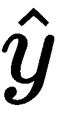，这就得到了残差。现在，我们得到了我们的 。我们怎么得到梯度呢？梯度就是输入矩阵`X`和这些残差之间的点积。我们将利用这个梯度来确定我们需要朝哪个方向迈步。我们做的方式是将梯度加到我们的 theta 向量中。Lambda 调节我们在梯度上向上或向下迈步的速度。所以，它是我们的学习率。如果你把它当作步长——回到那个黑暗房间的例子——如果步长太大，很容易越过最低点。但如果步长太小，你会在房间里不停地绕圈子。所以，这是一种平衡，但它使我们能够调节更新 theta 值和下降梯度的速度。再次强调，这个算法将在下一章中讲解。

我们得到前面代码的输出如下：

```py
y hat: [0.5, 0.5, 0.5, 0.5, 0.5]
Gradient: [0.395, 0.024, 0.538]
New theta: [0.02, 0.001, 0.027]

y hat: [0.507, 0.504, 0.505, 0.51, 0.505]
Gradient: [0.378, 0.012, 0.518]
New theta: [0.039, 0.002, 0.053]

```

这个例子展示了当我们调整系数时，梯度或斜率是如何变化的，反之亦然。

在下一节中，我们将学习如何评估我们的模型，并了解神秘的`train_test_split`。

# 模型评估与数据划分

在这一章中，我们将定义评估模型的意义、评估模型效果的最佳实践、如何划分数据，以及在准备数据划分时你需要考虑的若干事项。

理解一些机器学习的核心最佳实践非常重要。作为机器学习从业者，我们的主要任务之一是创建一个能够有效预测新数据的模型。那么我们如何知道一个模型是否优秀呢？如果你回想一下上一部分，我们将监督学习定义为从标注数据中学习一个函数，以便能够近似新数据的目标。因此，我们可以测试模型的有效性。我们可以评估它在从未见过的数据上的表现——就像它在参加考试一样。

# 样本外评估与样本内评估

假设我们正在训练一台小型机器，这是一个简单的分类任务。这里有一些你需要了解的术语：样本内数据是模型从中学习的数据，而样本外数据是模型以前从未见过的数据。许多新手数据科学家的一个常见错误是，他们在模型学习的同一数据上评估模型的效果。这样做的结果是奖励模型的记忆能力，而不是其概括能力，这两者有着巨大的区别。

如果你看这里的两个例子，第一个展示了模型从中学习的样本，我们可以合理地相信它将预测出一个正确的结果。第二个例子展示了一个新的样本，看起来更像是零类。当然，模型并不知道这一点。但一个好的模型应该能够识别并概括这种模式，如下所示：

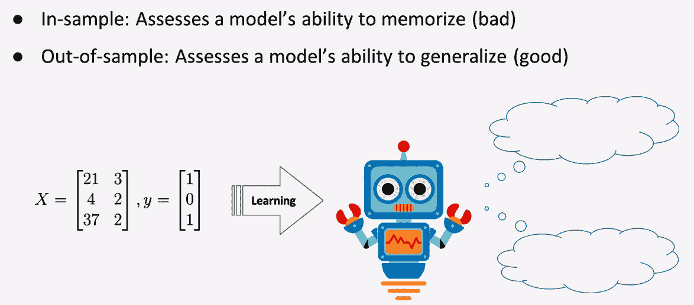

所以，现在的问题是如何确保模型的**样本内数据**和**样本外数据**能够证明其有效性。更精确地说，我们的样本外数据需要被标注。新的或未标注的数据是不够的，因为我们必须知道实际答案，以便确定模型的准确性。因此，机器学习中应对这种情况的一种方式是将数据分为两部分：训练集和测试集。训练集是模型将从中学习的数据；测试集是模型将接受评估的数据。你拥有的数据量非常重要。实际上，在接下来的部分中，当我们讨论偏差-方差权衡时，你会看到一些模型需要比其他模型更多的数据来进行学习。

另一点需要记住的是，如果某些变量的分布高度偏斜，或者你的数据中嵌入了稀有的类别水平，甚至你的`y`向量中存在类别不平衡，你可能会得到一个不理想的划分。举个例子，假设在你的`X`矩阵中有一个二元特征，表示某个事件的传感器是否存在，而该事件每 10,000 次发生才会触发一次。如果你随机划分数据，所有正向的传感器事件都在测试集里，那么你的模型会从训练数据中学到传感器从未被触发，可能会认为它是一个不重要的变量，而实际上，它可能是一个非常重要、且具有很强预测能力的变量。所以，你可以通过分层抽样来控制这些类型的问题。

# 划分变得简单

这里有一段简单的代码示例，演示了如何使用 scikit-learn 库将数据划分为训练集和测试集。我们从 datasets 模块加载数据，并将`X`和`y`传递给划分函数。我们应该熟悉数据的加载。我们使用了`sklearn`中的`model_selection`子模块的`train_test_split`函数。这个函数可以接受任意数量的数组。所以，20%将作为`test_size`，剩余的 80%作为训练集。我们定义了`random_state`，以便如果需要证明我们是如何得到这个划分的，它可以被重现。这里还有一个`stratify`关键词，虽然我们没有使用它，它可以用于针对稀有特征或不平衡的`y`向量进行分层抽样。

```py
from sklearn.datasets import load_boston

from sklearn.model_selection import train_test_split

boston_housing = load_boston() # load data

X, y = boston_housing.data, boston_housing.target # get X, y

X_train, X_test, y_train, y_test = train_test_split(X, y, test_size=0.2,

                                                                                                              random_state=42)

# show num samples (there are no duplicates in either set!)
print("Num train samples: %i" % X_train.shape[0])

print("Num test samples: %i" % X_test.shape[0])
```

上述代码的输出如下：

```py
Num train samples: 404
Num test samples: 102
```

# 总结

在本章中，我们介绍了监督学习，搭建了我们的环境，并学习了爬山法和模型评估。到目前为止，你应该理解了机器学习背后的抽象概念基础。这一切都与优化多个损失函数有关。在下一章，我们将深入探讨参数化模型，甚至从零开始编写一些流行算法的代码。
