# 第二章：实现参数化模型

在上一章中，我们学习了监督式机器学习的基础知识。在本章中，我们将深入探讨几个流行的监督学习算法，这些算法属于参数化建模范畴。我们将从正式介绍参数化模型开始。然后，我们将介绍两个非常流行的参数化模型：线性回归和逻辑回归。我们将花些时间了解它们的内部工作原理，然后跳进 Python，实际编写这些工作原理的代码，从零开始实现。

在本章中，我们将涵盖以下主题：

+   参数化模型

+   从零开始实现线性回归

+   逻辑回归模型

+   从零开始实现逻辑回归

+   参数化模型的优缺点

# 技术要求

对于本章内容，如果你还没有安装以下软件，请安装：

+   Jupyter Notebook

+   Anaconda

+   Python

本章的代码文件可以在 https:/​/​github.​com/​PacktPublishing/找到。

Supervised-Machine-Learning-with-Python.

# 参数化模型

在监督学习中，有两类学习算法：**参数化**和**非参数化**。这一领域也恰好是关于哪种方法更好的门槛和基于观点的猜测的热议话题。基本上，参数化模型是有限维度的，这意味着它们只能学习有限数量的模型参数。它们的学习阶段通常是通过学习一些向量θ来进行的，这个向量也叫做**系数**。最后，学习函数通常是已知的形式，我们将在本节稍后做出解释。

# 有限维度模型

如果我们回顾一下监督学习的定义，记住我们需要学习某个函数，*f*。一个参数化模型将通过有限数量的总结点来概括*X*（我们的矩阵）与*y*（我们的目标）之间的映射关系。总结点的数量通常与输入数据中的特征数量相关。因此，如果有三个变量，*f*将尝试在θ中给定三个值的情况下，总结*X*和*y*之间的关系。这些被称为**模型参数** *f: y=f(X)*。

让我们回顾一下并解释一些参数化模型的特性。

# 参数化学习算法的特性

现在我们将介绍参数化学习算法的不同特点：

+   模型参数通常被限制在与输入空间相同的维度

+   你可以指向一个变量及其相应的参数值，通常可以了解该变量的重要性或它与*y*（我们的目标）的关系

+   最后，传统上它们运行速度较快，并且不需要太多数据

# 参数化模型示例

假设我们被要求根据房屋的面积和浴室数量来估算房屋的价格。我们需要学习多少个参数？在我们的例子中，我们将需要学习多少个参数？

好吧，给定面积和浴室数量，我们将需要学习两个参数。因此，我们的函数可以表示为给定两个变量——面积和浴室数量——的估计价格——*P1*和*P2*。*P1*表示面积与价格之间的关系。*P2*表示浴室数量与价格之间的关系。

以下代码展示了在 Python 中设置的问题。`x1`是我们的第一个变量——房屋的面积。你可以看到它的范围从最小的`1200`到最高的`4000`，我们的价格范围从`200000`到`500000`。在`x2`中，我们有浴室的数量。这个范围从最少的`1`到最多的`4`：

```py
import numpy as np
from numpy import linalg

x1 = np.array([2500, 2250, 3500, 4000, 1890, 1200, 2630])
x2 = np.array([3, 2, 4, 3, 2, 1, 2])
y = np.array([260000, 285000, 425000, 482500, 205000, 220000, 320000])
```

现在，你可以从我们的图表中看到，这里似乎有一个正相关的趋势，这很有道理。但我们会随着深入这个例子而发现更多：

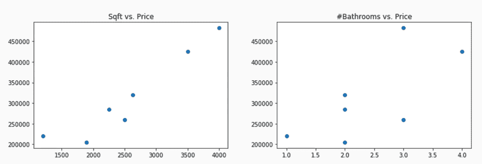

现在，我们要学习一个估算价格的函数，这个函数实际上就是我们数据中每一行向量的估计参数的内积。因此，我们在这里执行的是线性回归。线性回归可以通过最小二乘法方程方便地求解。由于我们技术上有无数个可能的解，最小二乘法将找到一个解，该解最小化平方误差的和。

在这里，我们对`X`完成了最小二乘法，并在第一个单元格中学习了我们的参数。然后，在下一个单元格中，我们将`X`与我们刚学习的 theta 参数相乘以得到预测结果。因此，如果你深入研究，你会发现只有一个房子我们严重低估了它的价值：倒数第二个房子，它的面积是`1200`平方英尺，只有一个浴室。所以，它可能是一个公寓，而且可能位于市区的一个非常热门的地方，这就是为什么它最初被定价这么高的原因：

```py
# solve for the values of theta
from numpy import linalg
X = np.hstack((x1.reshape(x1.shape[0], 1), x2.reshape(x2.shape[0], 1)))
linalg.lstsq(X, y)[0]

# get the estimated y values
X.dot(linalg.lstsq(X,y)[0])
```

上述代码片段的输出结果如下：

```py
array([   142.58050018, -23629.43252307])

array([285562.95287566, 273547.26035425, 404514.02053054, 499433.70314259,
       222218.28029018, 147467.16769047, 327727.85042187])
```

现在，来分析我们的参数。每增加一平方英尺，估算价格将上涨 142.58 美元，这在直观上是有道理的。然而，每增加一个浴室，我们的房子价值将减少 24,000 美元：*Price = 142.58 *sqft + -23629.43*bathrooms*。

这里有另一个难题。根据这个逻辑，如果我们有一座 3000 平方英尺且没有浴室的房子，它的价格应该和一座 4000 平方英尺、拥有四个浴室的房子差不多。所以显然，我们的模型存在一些局限性。当我们尝试用少量特征和数据来总结映射关系时，肯定会出现一些不合逻辑的情况。但是，还有一些我们未曾考虑的因素可以在拟合线性回归时帮助我们。首先，我们没有拟合截距，也没有对特征进行中心化。所以，如果你回忆起初中的代数，或者甚至早期高中的代数，你会记得，当你在笛卡尔坐标图上拟合最优直线时，截距是线与*y*轴的交点，而我们没有拟合这样的截距。

在下面的代码中，我们在求解最小二乘法之前已对数据进行了中心化，并估计了截距，该截距实际上是`y`的平均值，实际价格减去`X`变量的内积，`X`的列均值与估计的参数的内积：

```py
X_means = X.mean(axis=0) # compute column (variable) name
X_center = X - X_means  # center our data
theta = linalg.lstsq(X_center, y)[0]  # solve lstsq
print ("Theta: %r" % theta)

intercept = y.mean() -np.dot(X_means, theta.T) # find the intercept
print("Intercept: %.2f" % intercept)
print("Preds: %r" % (X.dot(theta.T) + intercept))
```

上述代码片段的输出如下：

```py
Theta: array([ 128.90596161, -28362.07260241])
Intercept: 51887.87
Preds: array([289066.55823365, 285202.14043457, 389610.44723722, 482425.50064261,
 238795.99425642, 178212.9533507 , 334186.40584484])
```

这就总结了线性回归背后的数学和概念介绍，以及参数化学习的概念。在线性回归中，我们只是在一组数据点上拟合一条最佳直线，试图最小化平方误差的和。在接下来的部分，我们将了解 PyCharm，并逐步演示如何从头开始编写一个线性回归类。

# 从头实现线性回归

线性回归通过求解最小二乘方程来发现参数向量 theta。在本节中，我们将逐步讲解`packtml` Python 库中线性回归类的源代码，并简要介绍`examples`目录中的图形示例。

在我们查看代码之前，我们将介绍书中所有估计器背后的接口。它被称为`BaseSimpleEstimator`，是一个抽象类。它将强制执行唯一的一个方法，即`predict`。不同的子类层将强制执行其他方法，以适应不同的模型家族。但这个层次支持我们将构建的所有模型，因为我们正在构建的所有内容都是监督学习的，所以它们都需要具备预测能力。你会注意到，这个签名在`dock`字符串中有明确规定。每个模型的签名都会接受`X`和`y`，以及其他任何模型超参数：

```py
class BaseSimpleEstimator(six.with_metaclass(ABCMeta)):
 """Base class for packt estimators.
 The estimators in the Packt package do not behave exactly like 
 scikit-learn
 estimators (by design). They are made to perform the model fit 
 immediately upon class instantiation. Moreover, many of the hyper
 parameter options are limited to promote readability and avoid
 confusion.
 The constructor of every Packt estimator should resemble the 
 following::
 def __init__(self, X, y, *args, **kwargs):
 ...
 where ``X`` is the training matrix, ``y`` is the training target
 variable,
 and ``*args`` and ``**kwargs`` are varargs that will differ for each
 estimator.
 """
 @abstractmethod
 def predict(self, X):
 """Form predictions based on new data.
 This function must be implemented by subclasses to generate
 predictions given the model fit.
 Parameters
 ----------
 X : array-like, shape=(n_samples, n_features)
 The test array. Should be only finite values.
 """
```

# BaseSimpleEstimator 接口

第一次刷洗（flush）与 scikit-learn 的基础估计器接口类似。但也有几个不同之处。首先，当我们构建模型时，我们不会允许太多选项。此外，模型在实例化时立即开始训练。这与 scikit-learn 不同，因为我们没有`fit`方法。scikit-learn 有一个`fit`方法来允许网格搜索和超参数调优。因此，这也是我们与它们的签名不同的另一个原因。好了，接下来让我们看一下线性回归：

1.  如果你有 PyCharm，赶快打开它。我们将位于`packtml`的`Hands-on-Supervised-Machine-Learning-with-Python`库中，如下所示的代码所示。你可以看到这是在 PyCharm 中。这只是项目的根目录，而我们将要使用的包是`packtml`。我们将逐步讲解`simple_regression.py`文件代码的工作原理。如果你没有使用 PyCharm，Sublime 是一个替代选择，或者你可以使用任何你喜欢的文本编辑器：

```py
from __future__ import absolute_import

from sklearn.utils.validation import check_X_y, check_array

import numpy as np
from numpy.linalg import lstsq

from packtml.base import BaseSimpleEstimator

__all__ = [
 'SimpleLinearRegression'
]

class SimpleLinearRegression(BaseSimpleEstimator):
 """Simple linear regression.

 This class provides a very simple example of straight forward OLS
 regression with an intercept. There are no tunable parameters, and
 the model fit happens directly on class instantiation.

 Parameters
 ----------
 X : array-like, shape=(n_samples, n_features)
 The array of predictor variables. This is the array we will use
 to regress on ``y``.
```

`base.py`，它位于我们的包级别内，将提供`BaseSimpleEstimator`的接口，我们将在整个包中使用。唯一将在抽象级别强制执行的方法是`predict`函数。该函数将接受一个参数，即`X`。我们已经提到过，监督学习意味着我们将学习一个函数，*f*，给定`X`和`y`，从而能够近似！[](img/05adbda5-3f19-428e-b0da-e3beccb26ed9.png)，给定！[](img/634ff51a-a39a-4a3c-a23a-a3cdc1e4313c.png)，或者在这种情况下的`X`测试。由于每个子类将实现不同的`predict`方法，我们将使用抽象方法，即`base`，如下所示的代码片段：

```py
@abstractmethod
   def predict(self, X):
       """Form predictions based on new data.
       This function must be implemented by subclasses to generate
       predictions given the model fit.
       Parameters
       ----------
       X : array-like, shape=(n_samples, n_features)
       The test array. Should be only finite values.
      """
```

1.  接下来，在`regression`子模块内，我们将打开`simple_regression.py`文件。这个文件将实现一个名为`SimpleLinearRegression`的类。我们称它为“简单”，是为了避免与 scikit-learn 的线性回归混淆：

```py
from __future__ import absolute_import

from sklearn.utils.validation import check_X_y, check_array

import numpy as np
from numpy.linalg import lstsq

from ..base import BaseSimpleEstimator

__all__ = [
    'SimpleLinearRegression'
]

class SimpleLinearRegression(BaseSimpleEstimator):
    """Simple linear regression.

    This class provides a very simple example of straight forward OLS
    regression with an intercept. There are no tunable parameters, and
    the model fit happens directly on class instantiation.

    Parameters
    ----------
    X : array-like, shape=(n_samples, n_features)
        The array of predictor variables. This is the array we will use
        to regress on ``y``.
```

`SimpleLinearRegression`将接受两个参数。`X`，即我们的协方差矩阵，和`y`，即训练目标，具体解释如下：

```py
Parameters
    ----------
    X : array-like, shape=(n_samples, n_features)
        The array of predictor variables. This is the array we will use
        to regress on ``y``.

    y : array-like, shape=(n_samples,)
        This is the target array on which we will regress to build
        our model.
    Attributes
    ----------
    theta : array-like, shape=(n_features,)
        The least-squares solution (the coefficients)

    rank : int
        The rank of the predictor matrix, ``X``

    singular_values : array-like, shape=(n_features,)
        The singular values of ``X``

    X_means : array-like, shape=(n_features,)
        The column means of the predictor matrix, ``X``

    y_mean : float
        The mean of the target variable, ``y``

    intercept : float
        The intercept term
    """
    def __init__(self, X, y):
        # First check X, y and make sure they are of equal length, no
        NaNs
        # and that they are numeric
        X, y = check_X_y(X, y, y_numeric=True,
                         accept_sparse=False) # keep it simple
```

1.  现在，在我们的签名中，我们将在`init`函数内做的第一件事是通过 scikit-learn 的`check_X_y`运行它。我们将确保`X`和`y`之间的维度匹配，因为如果传递的训练目标向量小于`X`中的样本数或反之，将无法正常工作。我们还强制要求`y`中的所有内容都是数值型的。

1.  接下来我们需要做的是计算`X`中每列的均值，以便我们可以对所有数据进行中心化，同时计算`y`中值的均值，以便我们也可以对其进行中心化。在这个整个函数中，我们提取自 NumPy 库的最小二乘优化函数。因此，我们只需要输入现在已经中心化的`X`和`y`，并传递给`lstsq`。我们将返回三样东西，其中第一项是 theta，这是学习得到的参数。所以，`X.theta`将是`y`的最佳近似值。接下来我们将得到秩，这就是`matrix`的秩，以及`singular_values`，如果你想深入研究实际解的分解过程。正如上一节所讨论的关于房屋平均成本的问题，如果我们计算一栋房子价值减去`X_means`的内积，列均值是一个向量乘以 theta，另一个向量。因此，在这里我们将得到一个标量值作为截距，并将分配一些`self`属性：

```py

# We will do the same with our target variable, y
X_means = np.average(X, axis=0)
y_mean = y.mean(axis=0)

# don't do in place, so we get a copy
X = X - X_means
y = y - y_mean

# Let's compute the least squares on X wrt y
# Least squares solves the equation `a x = b` by computing a
# vector `x` that minimizes the Euclidean 2-norm `|| b - a x ||²`.
theta, _, rank, singular_values = lstsq(X, y, rcond=None)

# finally, we compute the intercept values as the mean of the target
# variable MINUS the inner product of the X_means and the coefficients
intercept = y_mean - np.dot(X_means, theta.T)

# ... and set everything as an instance attribute
self.theta = theta
self.rank = rank
self.singular_values = singular_values

# we have to retain some of the statistics around the data too
self.X_means = X_means
self.y_mean = y_mean
self.intercept = intercept
```

一旦你实例化了一个类，你就完成了线性回归的拟合。然而，我们必须重写`BaseSimpleEstimator`超类中的`predict`函数。为了进行预测，所要做的就是计算`X`和`theta`的内积，以及我们已经学习到的参数，再加上截距。与构造函数中看到的不同之处在于，我们不需要重新中心化`X`。如果一个`X`测试数据进来，唯一需要中心化数据的时刻是在学习参数时，而不是在应用它们时。然后，我们将用`X`乘以参数，计算内积，再加上截距。现在我们得到了一个预测值的向量！[](img/77b9e227-5b76-4859-9918-cf731a200011.png)：

```py
def predict(self, X):
        """Compute new predictions for X"""
        # copy, make sure numeric, etc...
        X = check_array(X, accept_sparse=False, copy=False) # type: np.ndarray

        # make sure dims match
        theta = self.theta
        if theta.shape[0] != X.shape[1]:
            raise ValueError("Dim mismatch in predictors!")

        # creates a copy
        return np.dot(X, theta.T) + self.intercept

```

1.  现在，我们可以继续查看我们的一个示例。在项目级别打开`examples`目录，然后打开`regression`目录。我们将查看`example_linear_regression.py`文件，如下所示：


让我们逐步走过这里发生的过程，向你展示如何将它应用于真实数据。我们将加载刚才创建的线性回归，并导入 scikit-learn 的线性回归，以便进行结果比较。我们要做的第一件事是创建一个包含`500`个样本和`2`个维度的随机值`X`矩阵。然后我们将创建`y`矩阵，它将是第一个`X`变量和`0`的线性组合，即第一个列的`2`倍加上第二列的`1.5`倍。我们这么做是为了展示我们的线性回归类将学习到这些确切的参数，`2`和`1.5`，如以下代码片段所示：

```py
from packtml.regression import SimpleLinearRegression
from sklearn.linear_model import LinearRegression
from sklearn.model_selection import train_test_split
from matplotlib import pyplot as plt
import numpy as np
import sys

# #############################################################################
# Create a data-set that perfectly models the linear relationship:
# y = 2a + 1.5b + 0
random_state = np.random.RandomState(42)
X = random_state.rand(500, 2)
y = 2\. * X[:, 0] + 1.5 * X[:, 1]

```

正如我们之前讨论过的，我们需要分割数据。你绝不应该仅仅对样本数据进行评估和拟合；否则，你容易发生过拟合：

```py
# split the data
X_train, X_test, y_train, y_test = train_test_split(X, y,

                                                   random_state=random_state)
```

1.  接下来，我们将拟合我们的线性回归并计算我们的预测结果。因此，我们还可以通过我们的断言来显示我们学习到的θ与我们期望的实际θ非常接近，即`2`和`1.5`。因此，我们的预测应该与`y`训练输入相似：

```py
# Fit a simple linear regression, produce predictions
lm = SimpleLinearRegression(X_train, y_train)
predictions = lm.predict(X_test)
print("Test sum of residuals: %.3f" % (y_test - predictions).sum())
assert np.allclose(lm.theta, [2., 1.5])

```

1.  接下来，我们将拟合一个 scikit-learn 回归模型，展示我们获得的结果与之前的相似，如果不是完全相同的话。我们将展示我们刚刚创建的类中的θ与 scikit-learn 生成的系数相匹配。scikit-learn 是一个经过充分测试和广泛使用的库。因此，它们匹配的事实表明我们走在正确的道路上。最后，我们可以展示我们的预测结果非常接近 scikit-learn 的解决方案：

```py
# Show that our solution is similar to scikit-learn's

lr = LinearRegression(fit_intercept=True)
lr.fit(X_train, y_train)
assert np.allclose(lm.theta, lr.coef_)
assert np.allclose(predictions, lr.predict(X_test))
```

1.  接下来，我们将在一个类上进行线性回归拟合，这样我们就可以查看图表。为此，请运行以下示例：

```py
# Fit another on ONE feature so we can show the plot
X_train = X_train[:, np.newaxis, 0]
X_test = X_test[:, np.newaxis, 0]
lm = SimpleLinearRegression(X_train, y_train)

# create the predictions & plot them as the line
preds = lm.predict(X_test)
plt.scatter(X_test[:, 0], y_test, color='black')
plt.plot(X_test[:, 0], preds, linewidth=3)

# if we're supposed to save it, do so INSTEAD OF showing it
if len(sys.argv) > 1:
    plt.savefig(sys.argv[1])
else:
    plt.show()
```

1.  进入`Hands-on-Supervised-Machine-Learning-with-Python-master`的顶部项目目录下的终端：即项目级别。记得激活环境。如果还没有激活环境，Unix 用户需要输入`source activate`，或者直接通过输入以下命令激活：

```py
source activate packt-sml
```

1.  通过输入文件名运行此示例，即`examples/regression/example_linear_regression.py`：

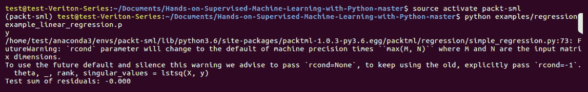

当我们运行前面的代码时，我们应该会看到我们的图表，如下图所示：

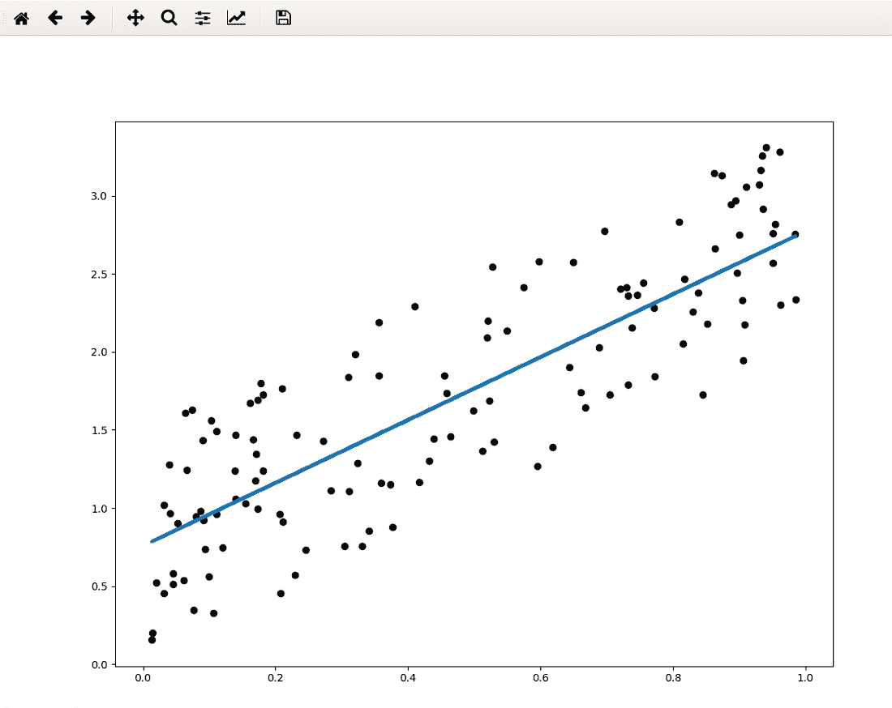

我们可以看到残差的总和基本为零，这意味着我们的预测非常准确。这个情况比较简单，因为我们创建了一个可以学习到确切θ值的场景。你可以看到这里我们正在对一个变量进行拟合。由于我们仅在一个变量上进行学习，所以这是一个更为近似的结果。从定性和定量上看，这与我们通过 scikit-learn 的预测和系数所期望的结果相匹配。

在下一节中，我们将学习逻辑回归模型。

# 逻辑回归模型

在本节中，我们将介绍逻辑回归，它是我们将要覆盖的第一个爬坡算法，并简要回顾线性回归。我们还将看看逻辑回归在数学上和概念上的不同之处。最后，我们将学习核心算法并解释它是如何进行预测的。

# 概念

逻辑回归在概念上是线性回归的逆。如果我们想要的是离散值或类别，而不是一个真实值呢？我们已经看到过这种类型的问题的一个例子，早期我们曾想预测一封电子邮件是否是垃圾邮件。因此，使用逻辑回归时，我们可以预测类别成员的概率，也就是所谓的分类。

# 数学原理

在数学上，逻辑回归与线性回归非常相似。我们参数和*X*的内积表示类别成员的对数几率，这实际上是概率除以 1 减去概率的自然对数：

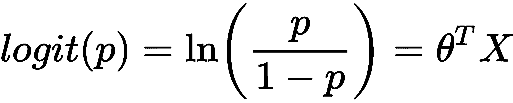

我们真正想要的是类别成员的概率。我们可以从对数几率中反推出概率，并使用 sigmoid 或逻辑函数来确定这些概率。

# 逻辑（sigmoid）变换

在接下来的代码中，我们将创建一个`X`向量，其值介于`-10`和`10`之间，然后应用逻辑变换得到`y`，然后我们可以将其绘制出来：

```py
import numpy as np
import matplotlib.pyplot as plt
%matplotlib inline

x = np.linspace(-10, 10, 10000)
y = 1\. / (1 + np.exp(-x)) # sigmoid transformation
plt.plot(x, y)
```

如你所见，我们得到一个 S 形曲线，原始的`X`值在*x*轴上，`y`值在*y*轴上。请注意，所有的值都被映射到*y*轴上的 0 到 1 之间。现在，这些可以被解释为概率：

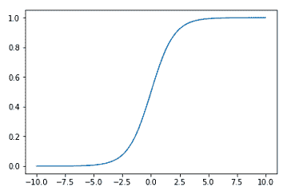

# 算法

现在，我们已经简要介绍了前面章节中的逻辑回归算法。这里是我们如何学习参数的回顾：

1.  我们首先将 theta 初始化为零向量：

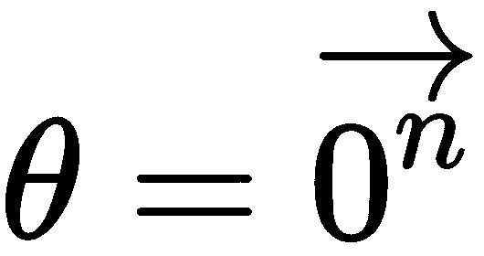

1.  由于这是一个爬坡算法，它是迭代的。因此，对于每次迭代，我们计算对数几率，即 theta 转置乘以*X*，然后通过逻辑变换进行转换：

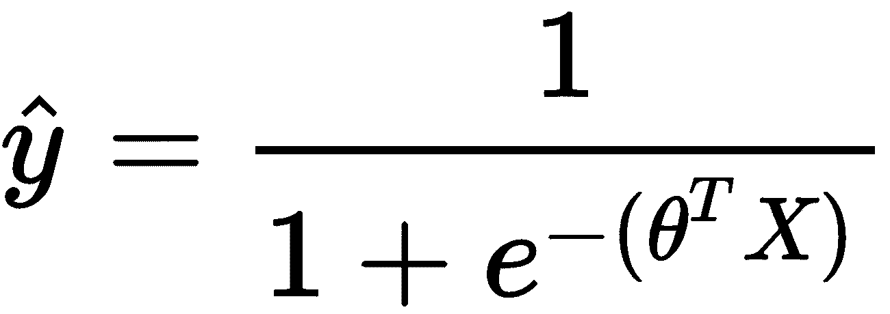

1.  接下来，我们计算梯度，这是我们函数斜率的偏导数向量，这在上一节中已经介绍过。我们只需要计算这个值为*X*转置乘以残差，*y - 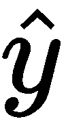.* 请记住，**现在是经过逻辑变换后的概率：

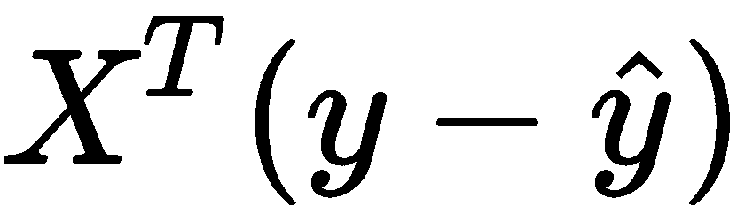

1.  最后，我们可以通过将 theta 加上梯度来更新我们的系数。你还可以看到一个！[](img/1185d50d-f929-492f-8fb9-57e0a9b27bd5.png)参数，这仅仅是一个学习率参数。它控制我们在每一步中允许系数增长的幅度：

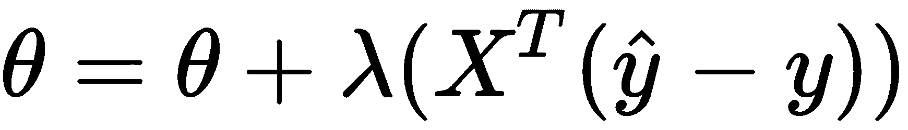

# 创建预测

我们最终使梯度收敛，梯度不再更新我们的系数，最终留下的是一堆类别概率。那么，我们该如何生成预测呢？我们只需要超越一个给定的阈值，就能得到类别。因此，在本节中，我们将使用一个二分类问题。但是，对于多分类问题，我们只需对每个类别使用 argmax 函数。现在，我们将生成离散预测，如以下代码所示：

```py
sigmoid = (lambda x: 1\. / (1 + np.exp(-x)))
log_odds = np.array([-5.6, 8.9, 3.7, 0.6, 0.])
probas = sigmoid(log_odds)
classes = np.round(probas).astype(int)
print("Log odds: %r\nProbas: %r\nClasses: %r"
      % (log_odds, probas, classes))
```

前面代码的输出如下：

```py
Log odds: array([-5.6, 8.9, 3.7, 0.6, 0\. ])
Probas: array([0.00368424, 0.99986363, 0.97587298, 0.64565631, 0.5 ])
Classes: array([0, 1, 1, 1, 0])
```

在下一节中，我们将展示如何从头开始在`packtml`包中实现逻辑回归。

# 从头开始实现逻辑回归

在本节中，我们将逐步讲解在`packtml`包中使用 Python 实现逻辑回归的过程。我们将简要回顾一下逻辑回归的目标，然后讲解源代码并查看一个示例。

回想一下，逻辑回归旨在将一个样本分类到一个离散的类别中，也称为**分类**。逻辑转换使我们能够将从参数和`X`的内积中得到的对数赔率转换过来。

注意，我们打开了三个 Python 文件。一个是`extmath.py`，位于`packtml`中的`utils`目录下；另一个是`simple_logistic.py`，位于`packtml`中的`regression`库下；最后一个是`example_logistic_regression.py`文件，位于`examples`目录和`regression`文件夹中。

我们将通过以下步骤直接进入代码库：

1.  我们将从`extmath.py`文件开始。这里有两个函数我们将使用。第一个是`log_likelihood`，这是我们希望在逻辑回归中最大化的目标函数：

```py
def log_likelihood(X, y, w):
    """Compute the log-likelihood function.

    Computes the log-likelihood function over the training data.
    The key to the log-likelihood is that the log of the product of
    likelihoods becomes the sum of logs. That is (in pseudo-code),

        np.log(np.product([f(i) for i in range(N)]))

    is equivalent to:

        np.sum([np.log(f(i)) for i in range(N)])

    The log-likelihood function is used in computing the gradient for
    our loss function since the derivative of the sum (of logs) is equivalent
    to the sum of derivatives, which simplifies all of our math.
```

1.  `log_likelihood`函数的具体实现并不是理解逻辑回归工作原理的关键。但本质上，你可以看到我们将对`y`与对数赔率的乘积求和，再减去`1`加上对数赔率指数的对数。这里加权的实际上是对数赔率，即`X.dot(w)`，其中`w`是我们正在学习的θ。这就是目标函数。所以，我们在对这些对数进行求和：

```py
 weighted = X.dot(w)
 return (y * weighted - np.log(1\. + np.exp(weighted))).sum()
```

1.  第二个是`logistic_sigmoid`函数，我们将深入学习它。这是我们如何从对数赔率中反推得到类别概率的方法，它的计算方式是`1`除以`1`加上对数赔率的指数，其中`x`在这里是对数赔率：

```py
def logistic_sigmoid(x):
    """The logistic function.

    Compute the logistic (sigmoid) function over a vector, ``x``.

    Parameters
    ----------
    x : np.ndarray, shape=(n_samples,)
        A vector to transform.
    """
    return 1\. / (1\. + np.exp(-x))
```

1.  我们将在逻辑回归类中使用这两个函数。因此，在`simple_logistic.py`中，你将看到一个类似于我们在上一节中使用的线性回归类的类：

```py
# -*- coding: utf-8 -*-

from __future__ import absolute_import

from sklearn.utils.validation import check_X_y, check_array

import numpy as np
from packtml.utils.extmath import log_likelihood, logistic_sigmoid
from packtml.utils.validation import assert_is_binary
from packtml.base import BaseSimpleEstimator

__all__ = [
    'SimpleLogisticRegression'
]

try:
    xrange
except NameError: # py 3 doesn't have an xrange
    xrange = range

class SimpleLogisticRegression(BaseSimpleEstimator):
    """Simple logistic regression.

    This class provides a very simple example of straight forward logistic
    regression with an intercept. There are few tunable parameters aside from
    the number of iterations, & learning rate, and the model is fit upon
    class initialization.
```

1.  现在，这个函数或类扩展了`BaseSimpleEstimator`。我们将稍后重写`predict`函数，构造函数将拟合模型并学习参数。因此，这个类有四个超参数。第一个是`X`，即我们的训练数据；然后是`y`，作为我们的训练标签；`n_steps`回忆一下，逻辑回归是一个迭代模型。所以，`n_steps`是我们将执行的迭代次数，`learning_rate`是我们的λ。如果你回顾一下算法本身，这控制着我们如何根据梯度快速更新θ；最后是`loglik_interval`，这是一个辅助参数。计算对数似然可能非常昂贵。我们可以在下面的代码片段中看到这个解释：

```py
Parameters
    ----------
X : array-like, shape=(n_samples, n_features)
        The array of predictor variables. This is the array we will use
        to regress on ``y``.

y : array-like, shape=(n_samples,)
        This is the target array on which we will regress to build
        our model. It should be binary (0, 1).

n_steps : int, optional (default=100)
        The number of iterations to perform.

learning_rate : float, optional (default=0.001)
        The learning rate.

loglik_interval : int, optional (default=5)
        How frequently to compute the log likelihood. This is an expensive
        operation--computing too frequently will be very expensive.
```

1.  最后，我们得到`theta`、参数、`intercept`以及`log_likelihood`，后者只是每个区间计算出的对数似然值的列表。我们将首先检查我们的`X`和`y`是否符合预期，即`0, 1`。我们不会做接近 scikit-learn 能够完成的事情。我们也不会允许不同的字符串类别：

```py
def __init__(self, X, y, n_steps=100, learning_rate=0.001,
                 loglik_interval=5):
        X, y = check_X_y(X, y, accept_sparse=False, # keep dense for example
                         y_numeric=True)

        # we want to make sure y is binary since that's all our example covers
        assert_is_binary(y)

        # X should be centered/scaled for logistic regression, much like
        # with linear regression
        means, stds = X.mean(axis=0), X.std(axis=0)
        X = (X - means) / stds
```

1.  接下来，我们想要确保它实际上是二值的。这是因为我们正在执行逻辑回归，这是一个在`0`和`1`之间离散的过程。回归有一个广义的形式，叫做**softmax 回归**，它允许我们使用多个类别进行分类。这是一个多分类问题。当我们深入神经网络时，会讨论到这个。现在，我们将这个问题限制为二分类问题。

1.  接下来，我们想要对`X`矩阵进行中心化和标准化。这意味着我们将从`X`中减去列的`均值`并将其除以标准差。所以，我们有均值为`0`，标准差为`1`：

```py
# since we're going to learn an intercept, we can cheat and set the
# intercept to be a new feature that we'll learn with everything else
X_w_intercept = np.hstack((np.ones((X.shape[0], 1)), X))
```

1.  现在，我们可以在学习线性回归参数或逻辑回归参数时做一些巧妙的事情，这是线性回归中无法做到的。我们可以在学习时将截距添加到矩阵中，而不是事后计算它。我们将在`X`矩阵上创建一个全为 1 的向量，作为新的特征，如下所示：

```py
 # initialize the coefficients as zeros
 theta = np.zeros(X_w_intercept.shape[1])
```

1.  正如我们在算法中定义的那样，我们从定义θ等于零开始。参数的数量等于`X`中的列数。对于每次迭代，我们将在这里计算对数几率。然后，我们使用逻辑 sigmoid 对其进行转换。我们将计算我们的残差为`y - preds`。所以，在这一点上，`preds`是概率。`y`可以视为二分类问题中的类别概率，其中`1`表示某事属于类别`1`的概率为 100%，而`0`表示某事属于类别`1`的概率为 0%：

```py
 # now for each step, we compute the inner product of X and the
 # coefficients, transform the predictions with the sigmoid function,
 # and adjust the weights by the gradient
 ll = []
 for iteration in xrange(n_steps):
     preds = logistic_sigmoid(X_w_intercept.dot(theta))
     residuals = y - preds # The error term
     gradient = X_w_intercept.T.dot(residuals)
```

所以，我们可以从`y`中减去概率来得到我们的残差。为了得到我们的梯度，我们将进行`X`与残差的乘法，即那里的内积。请记住，梯度是我们函数的斜率的偏导数向量。

1.  我们将通过将梯度乘以学习率来更新`theta`和参数。学习率是一个控制学习速度的 lambda 函数。你可能记得，如果我们学习得太快，可能会越过全局最优解，最终得到一个非最优解。如果我们学习得太慢，那我们将需要很长时间来拟合。逻辑回归是一个有趣的案例；因为它实际上是一个凸优化问题，我们将有足够的迭代次数来达到全局最优解。所以，这里的`learning_rate`有点讽刺意味，但一般来说，爬坡函数是通过使用`learning_rate`来工作的：

```py
# update the coefficients
theta += learning_rate * gradient

# you may not always want to do this, since it's expensive. Tune
# the error_interval to increase/reduce this
if (iteration + 1) % loglik_interval == 0:
    ll.append(log_likelihood(X_w_intercept, y, theta))
```

1.  最后一步是，如果我们处于适当的间隔，我们将计算`log_likelihood`。现在，虽然你可以在每次迭代时都计算这个函数，但那样会花费很长时间。我们可以选择每 5 分钟或 10 分钟计算一次，这样可以让我们看到我们正在优化这个函数。但同时，这也意味着我们不需要在每次迭代时都计算它。

1.  最后，我们将把所有这些作为类的实例参数保存。注意，我们正在去掉截距，并从`1`开始保留参数。这些是我们将在内积中计算的非截距参数，用于预测：

```py
# recall that our theta includes the intercept, so we need to  pop
# that off and store it
self.intercept = theta[0]
self.theta = theta[1:]
self.log_likelihood = ll
self.column_means = means
self.column_std = stds
```

所以，我们对`X`乘以`theta.T`进行逻辑变换，然后在居中和标准化输入`X`后加上`intercept`，这将给我们带来概率：

```py
# scale the data appropriately
X = (X - self.column_means) / self.column_std

# creates a copy
return logistic_sigmoid(np.dot(X, theta.T) + self.intercept)
```

但为了获得实际的预测，我们只需将概率四舍五入。所以，在`predict`函数中，我们将使用`predict_proba`并将其四舍五入为 0 或 1，返回类型为`int`，这将给我们类别 0 和 1：

```py
 def predict(self, X):
     return np.round(self.predict_proba(X)).astype(int)
```

# 逻辑回归示例

现在，作为一个例子，我们将查看我们的`example_logistic_regression.py`脚本。我们将比较我们`simple_logistic_regression.py`文件的输出与 scikit-learn 的输出，并证明我们得到的参数是相似的，如果不是完全相等的话。我们使用 scikit-learn 的`make_classification`函数创建`100`个样本和两个特征，并进行`train_test_split`。首先，我们将用我们刚刚讲解过的模型拟合我们自己的`SimpleLogisticRegression`并进行`50`步训练，这是一个`50`次迭代，如以下代码所示：

```py
# -*- coding: utf-8 -*-

from __future__ import absolute_import

from packtml.regression import SimpleLogisticRegression
from packtml.utils.plotting import add_decision_boundary_to_axis
from sklearn.linear_model import LogisticRegression
from sklearn.datasets import make_classification
from sklearn.model_selection import train_test_split
from sklearn.metrics import accuracy_score
from matplotlib import pyplot as plt
import sys

# #############################################################################
# Create an almost perfectly linearly-separable classification set
X, y = make_classification(n_samples=100, n_features=2, random_state=42,
                           n_redundant=0, n_repeated=0, n_classes=2,
                           class_sep=1.0)

# split data
X_train, X_test, y_train, y_test = train_test_split(X, y, random_state=42)

# #############################################################################
# Fit a simple logistic regression, produce predictions
lm = SimpleLogisticRegression(X_train, y_train, n_steps=50)

predictions = lm.predict(X_test)
acc = accuracy_score(y_test, predictions)
print("Test accuracy: %.3f" % acc)
```

接下来，我们将计算 scikit-learn 的`LogisticRegression`，几乎没有正则化，并按照如下方式进行拟合：

```py
# Show that our solution is similar to scikit-learn's
lr = LogisticRegression(fit_intercept=True, C=1e16) # almost no regularization
lr.fit(X_train, y_train)
print("Sklearn test accuracy: %.3f" % accuracy_score(y_test, 
                                                   lr.predict(X_test)))
```

我们将运行这段代码。确保你已经通过输入`source activate packt-sml`激活了你的 Anaconda 环境。

如果你使用的是 Windows 系统，这只需要输入`activate packt-sml`。

我们看到我们的测试准确率为 96%，这与`Sklearn`的 100%非常接近。Scikit-learn 进行更多的迭代，因此它获得了更好的准确率。如果我们进行更多的迭代，理论上我们可以得到完美的准确率。在以下输出中，你可以看到一个完美的线性可分界限。但由于我们没有进行那么多迭代，我们还没有达到这个结果。所以，在这个图中你可以看到我们有一个线性边界，这就是我们学习到的决策函数，分隔了这两个类别。左边是一个类别，右边是另一个类别，如下所示：

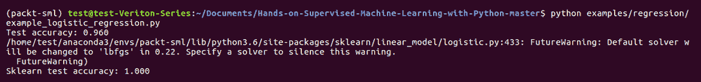

上述代码的输出如下：

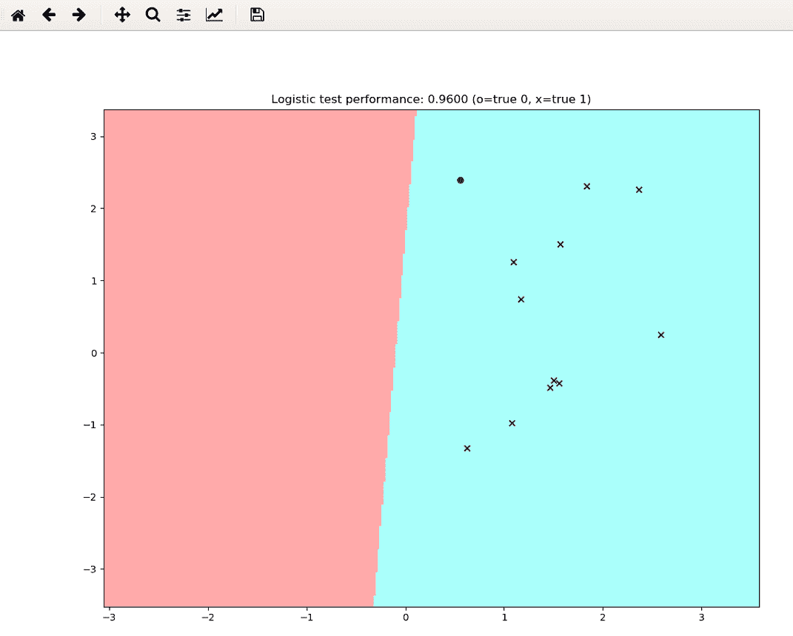

假设我们对这段代码进行一百次甚至更多次的迭代，我们可以得到一个完美的线性可分平面，从而保证一个线性可分的类别，因为逻辑回归总是能够达到全局最优。我们也知道，我们的公式与 scikit-learn 的完全相同。因此，这只取决于我们在这里进行了多少次迭代。

在下一节中，我们将探讨参数模型的优缺点。

# 参数模型的优缺点

参数模型具有一些非常方便的特点。即，它们拟合速度快、不需要太多数据，并且可以很容易地解释。在线性和逻辑回归的情况下，我们可以轻松查看系数并直接解释单个变量变化的影响。在金融或保险等受监管行业中，参数模型往往占据主导地位，因为它们可以很容易地向监管机构解释。业务合作伙伴通常非常依赖系数所提供的见解。然而，正如我们迄今所看到的那样，它们往往过于简化。因此，作为一个例子，我们在上一节中看到的逻辑回归决策边界假设了两个类别之间有一个完美的线性边界。

现实世界很少能够被限制为线性关系。话虽如此，模型仍然非常简单。它们并不总能捕捉到变量之间关系的真正细微差别，这有点像双刃剑。此外，它们受异常值和数据规模的影响很大。所以，你必须非常小心地处理数据。这也是我们在拟合之前必须确保对数据进行中心化和标准化的原因之一。最后，如果你向模型中添加数据，模型的表现也不太可能会大幅提升。这引入了一个新的概念，我们称之为偏差。

偏差导致的误差是我们将在后续章节中讨论的一个概念。这是一个模型过于简化的结果。在下面的图示中，我们的模型通过将 `logit` 函数视为线性，过度简化了该函数：

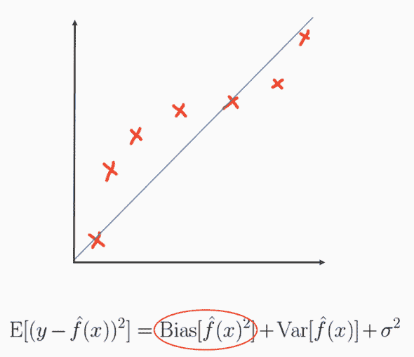

这也被称为**欠拟合**，这是参数模型家族中常见的问题。应对高偏差有几种方法，我们将在下一章介绍其中的大部分。但在探讨参数模型的缺点时，在这里指出其中一些是值得的。如前所述，在高偏差的情况下，我们无法通过增加更多数据来学习更好的函数。如果我们以之前的例子为例，假设你沿着 logit 线增加更多样本，我们学习到的或者蓝色的那条线不会比已经得到的更接近真实函数，因为它是线性的。它不够复杂，无法建模真实的基础函数，这是许多参数模型简化性的一个不幸后果。更多的模型复杂性和复杂的非线性特征通常有助于纠正高偏差。

# 总结

在这一章中，我们介绍了参数化模型。接着，我们详细讲解了线性逻辑回归的基础数学内容，然后转向了 Python 中的实现。现在我们已经讨论了一些参数化模型的优缺点，在下一章中，我们将看看一些非参数化模型。
