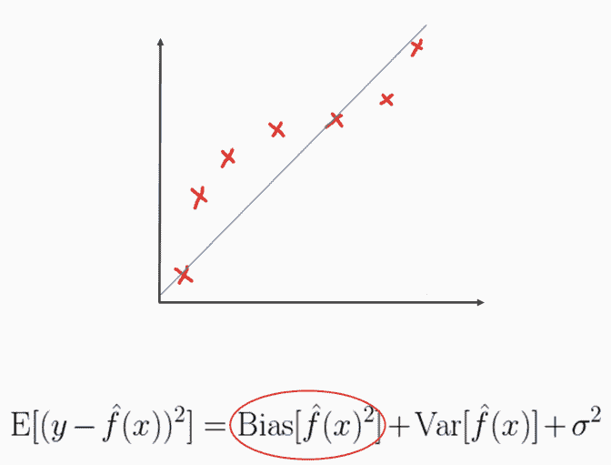
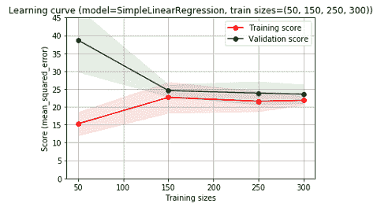
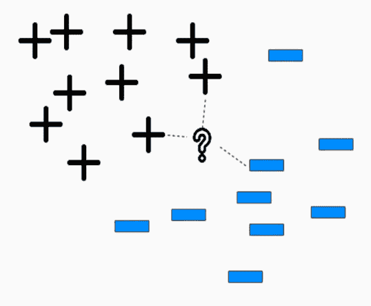

# 第三章：使用非参数模型

在上一章中，我们介绍了参数模型并探讨了如何实现线性回归和逻辑回归。在本章中，我们将讨论非参数模型系列。我们将从讨论偏差-方差权衡开始，并解释参数模型和非参数模型在基本层面上的不同。稍后，我们将深入探讨决策树和聚类方法。最后，我们将讨论非参数模型的一些优缺点。

在本章中，我们将涵盖以下主题：

+   偏差/方差权衡

+   非参数模型和决策树简介

+   决策树

+   从零开始实现决策树

+   各种聚类方法

+   从零开始实现**K-最近邻**（**KNN**）

+   非参数模型——优缺点

# 技术要求

本章中，如果你尚未安装以下软件，你需要先安装：

+   Jupyter Notebook

+   Anaconda

+   Python

本章的代码文件可以在 https:/​/​github.​com/​PacktPublishing/找到。

监督式机器学习与 Python

# 偏差/方差权衡

在本节中，我们将继续讨论由**偏差**引起的误差，并介绍一种新的误差来源——**方差**。我们将首先澄清误差项的含义，然后剖析建模误差的各种来源。

# 误差项

模型构建的核心主题之一是减少误差。然而，误差有多种类型，其中有两种是我们在某种程度上可以控制的。这两种被称为**偏差**和**方差**。模型在减少偏差或方差的能力上存在权衡，这被称为**偏差-方差权衡**或**偏差-方差困境**。

一些模型在一定程度上能很好地控制这两者。然而，这个困境在大多数情况下总会出现在你的建模过程中。

# 由偏差引起的误差

高偏差也可以称为欠拟合或过度泛化。高偏差通常会导致模型缺乏灵活性，错过我们正在建模的目标函数中特征与特征之间的真实关系。在下图中，*x*与*y*之间的真实关系被过于简化，错过了真实的* f(x) *函数，它本质上是一个逻辑函数：



参数模型往往比非参数模型更容易受到高偏差问题的影响。线性回归和逻辑回归就是这类问题的例子，我们将在本章的最后一部分更详细地探讨这些内容。

# 由方差引起的误差

相比之下，对于你现在已经熟悉的高偏差，方差引起的误差可以看作是模型对于给定样本预测的变化性。想象你多次重复建模过程；方差就是不同模型推导下，对于给定样本的预测结果的波动。高方差模型通常被称为过拟合，且正好与高偏差相反。也就是说，它们的泛化能力不足。高方差通常源于模型对信号的敏感性不足，而对噪声的过度敏感。一般而言，随着模型复杂度的增加，方差成为我们主要关注的问题。请注意，在图表中，多项式项导致了一个过度拟合的模型，而一个简单的**logit**函数就足够了：


与高偏差问题不同，高方差问题可以通过更多的训练数据来解决，这有助于模型更好地学习和泛化。所以，尚未覆盖的高方差模型的例子有决策树和 KNN。我们将在本章中介绍这两者。

# 学习曲线

在本节中，我们将研究一种方便的方式来诊断高偏差或高方差，称为**学习曲线**。在这个 Python 示例代码中，我们将利用`packtml.utils`子模块中的`plot_learning_curve`函数，如下所示：

```py
from sklearn.datasets import load_boston
from sklearn.metrics import mean_squared_error
from packtml.utils.plotting import plot_learning_curve
from packtml.regression import SimpleLinearRegression
%matplotlib inline

boston = load_boston()
plot_learning_curve(
        model=SimpleLinearRegression, X=boston.data, y=boston.target,
        metric=mean_squared_error, n_folds=3,
        train_sizes=(50, 150, 250, 300),
        seed=42, y_lim=(0, 45))\
    .show
```

这个函数将接受一个估计器，并将其在`train_sizes`参数定义的不同训练数据集大小上进行拟合。显示的是每次增量模型拟合后的训练集和对应验证集的模型性能。因此，这个示例使用我们的线性回归类来建模波士顿房价数据，这是一个回归问题，且显示出高偏差的症状。注意到我们的误差在训练集和验证集之间非常相似。它迅速达到了某个值，但仍然相对较高。随着训练集的增长，它们并没有得到改善。我们得到的输出如下：



或者，如果我们使用决策树回归器来建模相同的数据，我们会注意到高方差或过拟合的症状：

```py
from sklearn.datasets import load_boston
from sklearn.metrics import mean_squared_error
from packtml.utils.plotting import plot_learning_curve
from packtml.decision_tree import CARTRegressor
%matplotlib inline

boston = load_boston()
plot_learning_curve(
        model=CARTRegressor, X=boston.data, y=boston.target,
        metric=mean_squared_error, n_folds=3,
        train_sizes=(25, 150, 225, 350),
        seed=42, random_state=21, max_depth=50)\
    .show
```

**训练得分**和**验证得分**之间存在巨大的差异，尽管随着数据量的增加，得分有所改善，但始终没有完全收敛。我们得到如下输出：


# 处理高偏差的策略

如果你确定自己正在遭遇高偏差问题，你可以通过构造更多富有信息的信号特征来使模型变得更复杂。例如，在这里，你可以尝试创建新的特征，这些特征是 *x1* 的多项式组合，这样，你就可以创建 *x1* 的对数几率函数，从而完美地建模我们的函数。你还可以尝试调整一些超参数，例如 KNN，尽管它是一个高方差模型，但随着 *k* 超参数的增加，它可能会迅速变得高度偏差，反之亦然：


# 处理高方差的策略

如果你面临的是高方差问题，我们已经看到更多的训练数据在一定程度上能有所帮助。你还可以进行一些特征选择，以减少模型的复杂性。最稳健的解决方案是袋装法或集成方法，它将多个小模型的输出结合起来，所有这些模型都会对每个样本的标签或回归分数进行投票：


在下一节中，我们将更加正式地定义非参数学习算法，并介绍决策树。

# 非参数模型和决策树简介

在本节中，我们将正式定义什么是非参数学习算法，并介绍我们第一个算法——**决策树**背后的某些概念和数学原理。

# 非参数学习

非参数模型不学习参数。它们确实学习数据的特征或属性，但不是在正式意义上学习参数。我们最终不会提取一个系数向量。最简单的例子是决策树。决策树会学习如何递归地划分数据，以便它的叶子尽可能纯净。因此，从这个意义上来说，决策函数是每个叶子的划分点，而不是参数。

# 非参数学习算法的特点

非参数模型通常更加灵活，并且不会对数据的底层结构做出过多假设。例如，许多线性模型或参数化模型假设每个特征都需要满足正态分布，并且它们相互独立。然而，大多数非参数模型并不这样假设。正如我们在上一节中讨论的，偏差-方差权衡也表明，非参数模型需要更多的数据来训练，以避免高方差问题的困扰。

# 一个模型是参数化的还是非参数化的？

如果你在想，是否一个模型是参数化的，这可能不是最重要的问题。你应该选择最适合你数据的建模技术。不过，一个好的经验法则是，模型学习了多少特征或参数。如果它与特征空间或维度有关，那么它很可能是参数化的，例如，学习线性回归中的系数θ。如果它与样本数有关，那么它很可能是非参数化的，例如，决策树的深度或聚类中的邻居数。

# 一个直观的例子——决策树

决策树将从所有数据开始，迭代地进行分裂，直到每个叶子节点的纯度最大化或满足其他停止标准。在这个例子中，我们从三个样本开始。树学习到，在颜色特征上进行分裂将是我们最有信息量的一步，有助于最大化叶子节点的纯度。所以，第一个需要注意的点是，第一次分裂是最有信息量的分裂，它能最好地将数据分成两部分。如下面的图所示，土豆类别通过颜色分裂被隔离在左边。我们已经完美地分类了土豆。然而，另外两个样本仍然需要进一步分裂。于是，决策树学到，如果是橙色且圆形的，它就是一个甘薯；否则，如果它只是橙色且不圆，它就是胡萝卜，然后再向左分裂一次。在这里，我们可以看到所有类别的完美分裂：


# 决策树——简介

我们对决策树感兴趣的，是定义一个灵活且可扩展的算法，能够实现决策树。这里，**分类与回归树**（**CART**）算法发挥了作用。CART 算法可以广泛应用于这两类任务，基本上是通过向数据提问来学习。在每一个分裂点，CART 会扫描整个特征空间，从每个特征中抽取值，以确定最佳的特征和分裂值。它通过评估信息增益公式来实现这一点，该公式旨在最大化分裂中纯度的增益，这一点是相当直观的。*基尼不纯度*在叶子节点级别进行计算，它是衡量叶子节点纯度或不纯度的一种方式；其公式如下：


底部的*IG*是我们的信息增益，它是根节点的基尼指数，如下所示：


# 决策树是如何做出决策的？

我们将首先处理目标，然后再看数学部分。我们将计算一个拆分的**信息增益**，以确定最佳拆分点。如果信息增益为正，这意味着我们从该拆分中学到了东西，这可能是最佳点。如果信息增益为负，这意味着我们实际上走错了方向。我们所做的就是创建了一个没有信息的拆分。树中的每个拆分将选择最大化信息增益的点。

那么，下面是设置：


基尼不纯度为 0 时表示特别纯净。较高的不纯度本质上意味着在该叶子节点中找到了更多随机的类别。所以，我们的根节点相当不纯。现在我们的树将扫描整个特征空间，从每个特征中采样值。它将评估如果在这里进行拆分，信息增益会如何。假设我们的树选择了*x12*，我们将沿着样本值拆分该变量。我们想知道的是，如果通过这个拆分我们得到更纯净的叶子节点，我们将计算信息增益。为此，我们必须计算刚刚创建的每个叶子节点的基尼不纯度。

我们将通过使用`packtml`库来查看这个问题的示例。我们有`example_information_gain.py`文件，它位于`examples/decision_tree`目录下：

```py
# -*- coding: utf-8 -*-

from __future__ import absolute_import

from packtml.decision_tree.metrics import gini_impurity, InformationGain
import numpy as np

# #############################################################################
# Build the example from the slides
y = np.array([0, 0, 0, 1, 1, 1, 1])
uncertainty = gini_impurity(y)
print("Initial gini impurity: %.4f" % uncertainty)

# now get the information gain of the split from the slides
directions = np.array(["right", "left", "left", "left",
                       "right", "right", "right"])
mask = directions == "left"
print("Information gain from the split we created: %.4f"
      % InformationGain("gini")(target=y, mask=mask, uncertainty=uncertainty))
```

接下来，我们将使用`packtml.decision_tree.metrics`中的`InformationGain`类来计算信息增益：

```py
from packtml.decision_tree.metrics import gini_impurity, InformationGain
import numpy as np
```

当我们运行`example_information_gain.py`时，将得到以下输出：


在接下来的部分，我们将更深入地了解并学习决策树是如何生成候选拆分供我们评估的。

# 决策树

在前一部分中，我们计算了给定拆分的**信息增益**。回想一下，它是通过计算每个`LeafNode`中的父节点的基尼不纯度来计算的。较高的信息增益更好，这意味着我们通过拆分成功地减少了子节点的杂质。然而，我们需要知道如何生成候选拆分，以便进行评估。

对于每个拆分，从根节点开始，算法将扫描数据中的所有特征，为每个特征选择一个随机值。选择这些值的策略有很多种。对于一般的使用案例，我们将描述并选择一个*k*随机方法：

+   对于每个特征中的每个样本值，我们模拟一个候选拆分。

+   高于采样值的值会朝一个方向，比如左侧，超过该值的会朝另一个方向，即右侧。

+   现在，对于每个候选拆分，我们将计算信息增益，并选择产生最高信息增益的特征值组合，即最佳拆分。

+   从最佳拆分开始，我们将递归向下遍历每个拆分，直到满足停止标准。

现在，关于在哪里以及何时停止划分标准，我们可以使用多种方法来实现。一个常见的方法是最大树深度。如果树深度过大，我们会开始过拟合。例如，当树生长到五层深时，我们可能会进行剪枝。另一个方法是每个叶子的最小样本数。如果我们有 100 万个训练样本，我们会继续生长树，直到每个叶子只有一个样本；这也可能会过拟合。因此，最小样本数叶子参数可以让我们在划分后，如果每个叶子剩余的样本数，比如说 50 个，便停止划分。这是一个可以调节的超参数，你可以在交叉验证过程中进行调整。

# 手动划分决策树

现在我们来进行一个练习。假设我们有如下的训练集：


从前面的数据来看，最佳的划分点在哪里？我们应该使用什么特征或值的组合来定义我们的规则？

# 如果我们在 x1 上划分

首先，我们将计算根节点的基尼不纯度，这就是未划分的状态。我们得到*0.444*，如图所示：


算法的下一步是遍历每个特征。下面是三种情况。使用我们的*IG*公式，我们可以计算出哪个是这个特征的最佳划分点。第一种情况恰好是最佳的：


在第二种情况下，*x1*大于等于*4*时进行划分并不是一个好主意，因为结果与根节点的状态没有不同。因此，我们的信息增益是*0*：


在最后一种情况下，当*x1*大于等于*37*时，的确产生了正的信息增益，因为我们成功地将一个正类样本与其他样本分开：


# 如果我们在 x2 上划分

然而，我们还不确定是否已经完成。因此，我们将迭代到*x2*，看看是否有更好的划分点：


候选划分点显示，当我们与当前在*x1*中识别到的最佳划分点进行比较时，两个潜在的划分都不是最佳划分。

因此，最佳的划分是*x1*大于等于*21*，这将完美地分离我们的类别标签。你可以在这个决策树中看到，当我们进行这个划分时，确实能够得到完全分离的类别：


然而，在更大的例子中，我们可能无法完全分离我们的类别，如果我们有数百万个样本的话。例如，在这种情况下，我们会在此时递归，找到每个节点的新划分点，直到满足停止标准。此时，我们可以使用我们的`packtml`库来运行这个例子，并展示我们确实能够识别出相同的最佳划分点，从而证明这不是手段上的巧妙操作。

在 PyCharm 中，`example_classification_split.py` 文件已经打开。这个文件位于你的 `examples` 目录下，并且在 `decision_tree` 示例目录内。你可以看到我们将从 `packtml` 中导入两个东西，它们恰好都在 `decision_tree` 子模块内，你会找到 `RandomSplitter`：

```py
from __future__ import absolute_import

from packtml.decision_tree.cart import RandomSplitter
from packtml.decision_tree.metrics import InformationGain
import numpy as np
```

我们在上一节中已经稍微看过 `InformationGain`，用来计算我们的信息增益候选拆分。这里，我们将看到我们如何实际创建候选拆分。我们得到如下数据和相应的类别标签：

```py
# Build the example from the slides (3.3)
X = np.array([[21, 3], [ 4, 2], [37, 2]])
y = np.array([1, 0, 1])
```

`RandomSplitter` 会评估前面提到的每个值，因为 `n_val_sample` 是 `3`。所以，它将为每个特征计算三个候选拆分点，我们将找出其中哪个是最好的：

```py
# this is the splitting class; we'll use gini as the criteria
random_state = np.random.RandomState(42)
splitter = RandomSplitter(random_state=random_state,
                          criterion=InformationGain('gini'),
                          n_val_sample=3)
# find the best:
best_feature, best_value, best_gain = splitter.find_best(X, y)
print("Best feature=%i, best value=%r, information gain: %.3f"
      % (best_feature, best_value, best_gain))
```

当我们运行前面的代码时，我们看到 `best_feature` 是 `0`，`best_value` 是 `21`，这意味着在特征 `0` 中，任何大于或等于 `21` 的值将走左侧，而其他值则走右侧。我们得到的 `InformationGain` 是 `0.444`，这确实是我们手动计算时得到的结果，正是我们预期的：


在下一节中，我们将讨论如何在 `packtml` 库中从零开始实现决策树。

# 从头开始实现决策树

我们将从查看拆分度量的实现开始。然后我们会覆盖一些拆分逻辑，最后，我们将看到如何包装树，以便能够从分类和回归任务中进行泛化。

# 分类树

让我们继续看一个分类树的例子。我们将使用信息增益准则。在 PyCharm 中打开了三个脚本，其中两个是 `metrics.py` 和 `cart.py`，它们都位于 `packtml/decision_tree` 子模块内。然后我们还有一个 `example_classification_decision_tree.py` 文件，它在 `examples/decision_tree` 目录下。让我们从度量开始。

如果你打开 `cart.py` 文件，我们有一个顺序步骤，以帮助你理解决策树类如何工作：

```py
# 1\. metrics.InformationGain & metrics.VarianceReduction
# 2\. RandomSplitter
# 3\. LeafNode
# 4\. BaseCART
```

从 `metrics.py` 文件的顶部开始，你可以看到 `_all_` 将包括四个不同的度量：

```py
__all__ = [
    'entropy',
    'gini_impurity',
    'InformationGain',
    'VarianceReduction'
]
```

`entropy` 和 `gini_impurity` 都是分类度量。我们已经讨论过 `gini_impurity`。你可以看到这里它们都在调用 `clf_metric` 私有函数，如下所示：

```py
def entropy(y):
    """Compute the entropy of class labels.

    This computes the entropy of training samples. A high entropy means
    a relatively uniform distribution, while low entropy indicates a
    varying distribution (many peaks and valleys).

    References
    ----------
    .. [1] http://www.cs.csi.cuny.edu/~imberman/ai/Entropy%20and%20Information%20Gain.htm
    """
    return _clf_metric(y, 'entropy')

def gini_impurity(y):
    """Compute the Gini index on a target variable.

    The Gini index gives an idea of how mixed two classes are within a leaf
    node. A perfect class separation will result in a Gini impurity of 0 (that is,
    "perfectly pure").
    """
    return _clf_metric(y, 'gini')
```

现在，`gini` 和 `entropy` 基本上是以相同的方式起作用，除了最后，`gini` 基本上是计算其自身的范数，而 `entropy` 是计算 `log2`：

```py
def _clf_metric(y, metric):
    """Internal helper. Since this is internal, so no validation performed"""
    # get unique classes in y
    y = np.asarray(y)
    C, cts = np.unique(y, return_counts=True)

    # a base case is that there is only one class label
    if C.shape[0] == 1:
        return 0.

    pr_C = cts.astype(float) / y.shape[0] # P(Ci)

    # 1 - sum(P(Ci)²)
    if metric == 'gini':
        return 1\. - pr_C.dot(pr_C) # np.sum(pr_C ** 2)
    elif metric == 'entropy':
        return np.sum(-pr_C * np.log2(pr_C))

    # shouldn't ever get to this point since it is internal
    else:
        raise ValueError("metric should be one of ('gini', 'entropy'), "
                         "but encountered %s" % metric)
```

这里需要注意的一点是，熵和基尼指数将对决策树的表现产生巨大的影响。基尼指数实际上是 CART 算法的标准，但我们在这里加入了熵，以便你能看到这是你在需要时可以使用的内容。

`BaseCriterion`是我们的分裂标准的基类。我们有两个分裂标准，`InformationGain`和`VarianceReduction`。它们都会实现`compute_uncertainty`：

```py
class BaseCriterion(object):
    """Splitting criterion.

    Base class for InformationGain and VarianceReduction. WARNING - do
    not invoke this class directly. Use derived classes only! This is a
    loosely-defined abstract class used to prescribe a common interface
    for sub-classes.
    """
    def compute_uncertainty(self, y):
        """Compute the uncertainty for a vector.

        A subclass should override this function to compute the uncertainty
        (that is, entropy or gini) of a vector.
        """

class InformationGain(BaseCriterion):
    """Compute the information gain after a split.

    The information gain metric is used by CART trees in a classification
    context. It measures the difference in the gini or entropy before and
    after a split to determine whether the split "taught" us anything.
```

如果你还记得上一节，`uncertainty`本质上是由分裂引起的不纯度或熵。当我们使用`gini`或`entropy`计算`InformationGain`时，我们的`uncertainty`将是分裂前的`metric`：

```py
def __init__(self, metric):
        # let fail out with a KeyError if an improper metric
        self.crit = {'gini': gini_impurity,
                     'entropy': entropy}[metric]
```

如果我们计算`uncertainty`，我们会传入一个节点，并在分割之前，计算节点内所有样本的基尼系数（Gini），然后当我们实际调用计算`InformationGain`时，我们传入`mask`，用来表示某个样本是去`left`还是去`right`。我们将在左右两侧分别计算基尼系数，并返回`InformationGain`：

```py
def __call__(self, target, mask, uncertainty):
        """Compute the information gain of a split.

        Parameters
        ----------
        target : np.ndarray
            The target feature

        mask : np.ndarray
            The value mask

        uncertainty : float
            The gini or entropy of rows pre-split
        """
        left, right = target[mask], target[~mask]
        p = float(left.shape[0]) / float(target.shape[0])

        crit = self.crit # type: callable
        return uncertainty - p * crit(left) - (1 - p) * crit(right)
```

这就是我们计算`InformationGain`的方法，而这只是我们构建的包装类。`VarianceReduction`非常相似，不同的是`compute_uncertainty`函数将简单地返回*y*的方差。当我们调用时，我们将前分裂节点的不确定性减去左右分裂后的不确定性之和。我们在这里所做的就是最大化每次分裂之间方差的减少。这样，我们就可以知道一个分裂是否是好的。它沿着相对直观的线进行分割，如下所示：

```py
class VarianceReduction(BaseCriterion):
    """Compute the variance reduction after a split.

    Variance reduction is a splitting criterion used by CART trees in the
    context of regression. It examines the variance in a target before and
    after a split to determine whether we've reduced the variability in the
    target.
    """
    def compute_uncertainty(self, y):
        """Compute the variance of a target."""
        return np.var(y)

    def __call__(self, target, mask, uncertainty):
        left, right = target[mask], target[~mask]
        return uncertainty - (self.compute_uncertainty(left) +
                              self.compute_uncertainty(right))
```

这是我们的两个分裂标准：`InformationGain`和`VarianceReduction`。我们将使用`InformationGain`进行分类，使用`VarianceReduction`进行回归。既然我们现在讨论的是分类，让我们集中讨论`InformationGain`。接下来在`cart.py`文件中，我们看到下一个要讨论的内容是`RandomSplitter`。

在之前的一个部分中，我们了解了一种生成候选分裂的策略。这本质上就是`RandomSplitter`。这里有很多不同的策略可以使用。我们将使用一些熵（entropy），这样我们可以相对快速地完成这个类和算法，而无需深入细节。

`RandomSplitter`将接受几个参数。我们需要`random_state`，以便以后可以重复此分裂。标准（criterion）是`InformationGain`或`VarianceReduction`的实例，以及我们希望从每个特征中采样的值的数量：

```py
 def __init__(self, random_state, criterion, n_val_sample=25):
        self.random_state = random_state
        self.criterion = criterion # BaseCriterion from metrics
        self.n_val_sample = n_val_sample
```

所以，我们的`find_best`函数将扫描整个特征空间，按每个分裂或每个特征采样值的数量，并确定`best_value`和`best_feature`作为分裂的依据。这将产生我们在当时的最佳分裂。所以，`best_gain`将从`0`开始。如果是负值，则表示不好，我们不想进行分裂。如果是正值，则意味着它比当前的最佳分裂更好，我们就采用它并继续寻找最佳分裂。我们要找到我们的`best_feature`和`best_value`：

```py
def find_best(self, X, y):
        criterion = self.criterion
        rs = self.random_state

        # keep track of the best info gain
        best_gain = 0.

        # keep track of best feature and best value on which to split
        best_feature = None
        best_value = None

        # get the current state of the uncertainty (gini or entropy)
        uncertainty = criterion.compute_uncertainty(y)
```

现在，对于我们数据集的每一列，我们将提取出特征。这只是一个 NumPy 数组，一个一维的 NumPy 数组：

```py
# iterate over each feature
for col in xrange(X.shape[1]):
    feature = X[:, col]
```

我们将创建一个集合，以便跟踪我们已经看到的值，以防我们不断重复抽样相同的值。我们会对该特征进行排列，以便可以将其打乱并扫描特征中的每个值。你会注意到的一点是，我们本可以仅收集特征的唯一值。但首先，获取唯一值的成本相对较高。其次，这样会丢失关于该特征的所有分布信息。通过这种方式，我们实际上会有更多某个值，或者有更多值更加紧密地聚集在一起。这将使我们能够得到该特征更真实的样本：

```py
 # For each of n_val_sample iterations, select a random value
 # from the feature and create a split. We store whether we've seen
 # the value before; if we have, continue. Continue until we've seen
 # n_vals unique values. This allows us to more likely select values
 # that are high frequency (retains distributional data implicitly)
 for v in rs.permutation(feature):
```

如果我们集合中的`seen_values`的数量等于我们想要抽样的值的数量，那么我们将退出循环。所以，如果我们说有`100`个唯一值，但我们已经看到了`25`个，那么我们将退出。否则，如果我们在该集合中已经看到了这个值，我们将继续。我们不想对已经计算过的值再做重复计算。因此，在这里，我们会将该值添加到集合中，并为是否划分为左或右创建我们的掩码：

```py
# if we've hit the limit of the number of values we wanted to
# examine, break out
if len(seen_values) == n_vals:
   break
# if we've already tried this value, continue
elif v in seen_values: # O(1) lookup
     continue
# otherwise, it's a new value we've never tried splitting on.
# add it to the set.
seen_values.add(v)

# create the mask (these values "go left")
mask = feature >= v # type: np.ndarray
```

现在，还有一个特殊情况。如果我们已经抓取了最小值，那么我们的掩码将把所有东西都划分到一个方向，这正是我们正在检查的内容。我们不希望这样，因为否则我们就没有创建一个真实的划分。所以，如果是这种情况，我们就`continue`，重新进行抽样：

```py
# skip this step if this doesn't divide the dataset
if np.unique(mask).shape[0] == 1: # all True or all False
    continue
```

现在让我们计算增益，计算`InformationGain`或`VarianceReduction`，它会计算左侧和右侧的基尼指数，并从原始不确定性中减去它。如果`gain`很好，也就是说，如果它比我们看到的当前最佳值更好，那么我们就有了一个新的`best_feature`和新的`best_value`，并且我们会存储它。所以，我们会循环遍历这个过程，检查每个特征内随机抽样的值，并确定要划分的`best_feature`和在该特征中要划分的`best_value`。如果我们没有找到，这意味着我们没有找到一个有效的划分，这种情况发生在少数几种情况下：

```py
# compute how good this split was
gain = criterion(y, mask, uncertainty=uncertainty)

# if the gain is better, we keep this feature & value &
# update the best gain we've seen so far
if gain > best_gain:
    best_feature = col
    best_value = v
    best_gain = gain

# if best feature is None, it means we never found a viable split...
# this is likely because all of our labels were perfect. In this case,
# we could select any feature and the first value and define that as
# our left split and nothing will go right.
if best_feature is None:
    best_feature = 0
    best_value = np.squeeze(X[:, best_feature])[0]
    best_gain = 0.

# we need to know the best feature, the best value, and the best gain
return best_feature, best_value, best_gain
```

接下来，我们将查看`LeafNode`。如果你之前构建过二叉树，那么你应该熟悉`LeafNode`的概念。`LeafNode`将存储一个左指针和一个右指针，这两个指针通常都初始化为 null，表示那里没有内容。因此，在这种情况下，叶节点将是我们决策树的核心部分。它提供了一个骨架，而树本身仅仅是一个外壳：

```py
class LeafNode(object):
    """A tree node class.

    Tree node that store the column on which to split and the value above
    which to go left vs. right. Additionally, it stores the target statistic
    related to this node. For instance, in a classification scenario:

        >>> X = np.array([[ 1, 1.5 ],
        ...               [ 2, 0.5 ],
        ...               [ 3, 0.75]])
        >>> y = np.array([0, 1, 1])
        >>> node = LeafNode(split_col=0, split_val=2,
        ...                 class_statistic=_most_common(y))
```

`LeafNode`将存储`split_col`，即我们正在分割的特征，`split_val`和`split_gain`，以及`class_statistic`。因此，分类问题中的`class_statistic`将是节点，在这里我们投票选出最常见的值；而在回归问题中，它将是均值。如果你想要做得更复杂，可以使用中位数或其他回归策略。不过，我们在这里保持简单，使用均值即可。所以，构造函数将存储这些值，并再次将左节点和右节点初始化为 null：

```py
   def __init__(self, split_col, split_val, split_gain, class_statistic):

        self.split_col = split_col
        self.split_val = split_val
        self.split_gain = split_gain

        # the class statistic is the mode or the mean of the targets for
        # this split
        self.class_statistic = class_statistic

        # if these remain None, it's a terminal node
        self.left = None
        self.right = None

    def create_split(self, X, y):
        """Split the next X, y.
```

现在在`create_split`函数中，我们实际上开始处理树的结构。但这实际上是将节点进行分割，并创建新的左节点和右节点。因此，它从终端节点开始，向下进行下一个分割，我们可以对其进行递归操作。我们将从`X`和`y`的分割中获取当前数据集的当前集合。由于我们已经初始化的特征值将创建用于左侧和右侧的掩码，如果我们是全左或全右，它就会存储在这里。否则，它将进行分割，将左侧的行和右侧的行区分开来，或者如果没有行，它就不进行分割。如果左侧/右侧没有分割，我们只使用`none`，然后返回`X_left`、`X_right`、`y_left`和`y_right`：

```py
# If values in the split column are greater than or equal to the
# split value, we go left.
left_mask = X[:, self.split_col] >= self.split_val

# Otherwise we go to the right
right_mask = ~left_mask # type: np.ndarray

# If the left mask is all False or all True, it means we've achieved
# a perfect split.
all_left = left_mask.all()
all_right = right_mask.all()

# create the left split. If it's all right side, we'll return None
X_left = X[left_mask, :] if not all_right else None
y_left = y[left_mask] if not all_right else None

# create the right split. If it's all left side, we'll return None.
X_right = X[right_mask, :] if not all_left else None
y_right = y[right_mask] if not all_left else None

return X_left, X_right, y_left, y_right
```

终端节点只是左节点和右节点的快捷方式。如果我们有任一节点，那么它就不是终端节点。但如果左右节点都为 null，那它就是一个终端节点：

```py
def is_terminal(self):
     """Determine whether the node is terminal.

     If there is no left node and no right node, it's a terminal node.
     If either is non-None, it is a parent to something.
     """
     return self.left is None and self.right is None
```

我们将使用`predict_record`函数在`LeafNode`内部进行预测。这个函数将使用我们已有的`class_statistic`函数。`class_statistic`对于分类问题是众数，对于回归问题是均值。为了预测一个记录是向左还是向右，我们将递归操作，而这正是`predict`函数所做的，我们稍后会讲解，并查看如何生成预测：

```py
   def predict_record(self, record):
        """Find the terminal node in the tree and return the class statistic"""
        # First base case, this is a terminal node:
        has_left = self.left is not None
        has_right = self.right is not None
        if not has_left and not has_right:
            return self.class_statistic

        # Otherwise, determine whether the record goes right or left
        go_left = record[self.split_col] >= self.split_val

        # if we go left and there is a left node, delegate the recursion to the
        # left side
        if go_left and has_left:
            return self.left.predict_record(record)

        # if we go right, delegate to the right
        if not go_left and has_right:
            return self.right.predict_record(record)

        # if we get here, it means one of two things:
        # 1\. we were supposed to go left and didn't have a left
        # 2\. we were supposed to go right and didn't have a right
        # for both of these, we return THIS class statistic
        return self.class_statistic
```

现在，树本身有两个类别。我们有`CARTRegressor`和`CARTClassifier`。这两者都将封装`BaseCART`类，我们现在就来讲解这个类。`BaseCART`，和我们之前讲解过的大多数基本估计器一样，必定会接受两个参数，分别是`X`和`y`——我们的训练数据和训练标签。它还会接受我们的标准（criterion），我们会在后面传入它。标准可以是用于分类的`InformationGain`，用于回归的`VarianceReduction`，`min_samples_split`，以及我们已经讨论过的其他超参数。我们首先要做的，和往常一样，是检查我们的`X`和`y`，确保它们都是连续值，并且没有缺失数据。这只是为超参数分配`self`属性，我们将创建一个`splitter`，它是`RandomSplitter`，我们将在这个过程中使用它。这就是我们生长树的方式，所有操作都发生在`find_next_split`中。这个函数将接受三个参数：`X`，`y`，和样本计数：

```py
class _BaseCART(BaseSimpleEstimator):
    def __init__(self, X, y, criterion, min_samples_split, max_depth,
                 n_val_sample, random_state):
        # make sure max_depth > 1
        if max_depth < 2:
            raise ValueError("max depth must be > 1")

        # check the input arrays, and if it's classification validate the
        # target values in y
        X, y = check_X_y(X, y, accept_sparse=False, dtype=None, copy=True)
        if is_classifier(self):
            check_classification_targets(y)

        # hyper parameters so we can later inspect attributes of the model
        self.min_samples_split = min_samples_split
        self.max_depth = max_depth
        self.n_val_sample = n_val_sample
        self.random_state = random_state

        # create the splitting class
        random_state = check_random_state(random_state)
        self.splitter = RandomSplitter(random_state, criterion, n_val_sample)

        # grow the tree depth first
        self.tree = self._find_next_split(X, y, 0)
```

本质上，我们将递归地调用`find_next_split`函数，直到树完全生长或修剪完毕。由于我们在递归，我们始终首先设置我们的基本情况。如果`current_depth`等于我们希望树生长的最大深度，或者`X`中样本的大小小于或等于`min_samples_split`，这两个条件都是我们的终止标准，这时我们将返回`None`：

```py
    def _find_next_split(self, X, y, current_depth):
        # base case 1: current depth is the limit, the parent node should
        # be a terminal node (child = None)
        # base case 2: n samples in X <= min_samples_split
        if current_depth == self.max_depth or \
                X.shape[0] <= self.min_samples_split:
            return None
```

否则，我们将获取我们的`splitter`，并在`X`和`y`之间找到最佳分裂，这将给我们带来`best_feature`，`best_value`和增益`gain`，增益可以是`VarianceReduction`或`InformationGain`。接下来，我们刚刚找到了第一个分裂。那么，现在我们将创建一个对应于该分裂的节点。该节点将接受所有这些相同的参数，外加目标统计信息。当我们为节点生成预测时，如果它是终端节点，我们将返回该标签的节点；否则，我们将返回训练标签的均值。这就是我们在此处分配预测的方式。现在我们有了节点，并且希望创建分裂。因此，我们获得`X_right`和`X_left`，我们可以递归地处理树的两侧。我们将使用该节点来在`X`和`Y`上创建分裂。所以，如果`X`是`None`，`X_left`是`None`，意味着我们将不再向左递归。如果它不是`None`，那么我们可以将一个节点分配给左侧，这样它就会递归调用`find_next_split`。如果`X_right`是`None`，那么意味着我们不再继续在右侧生长。如果它不是`None`，我们可以做同样的事情。因此，我们将通过递归调用`find_next_split`来为右侧分配节点。我们会继续递归这个过程，不断地增加`current_depth + 1`，直到一侧达到了最大深度。否则，分裂的大小不足以满足`min_sample_split`，我们就停止生长。因此，我们到达了停止生长的临界点：

```py
# create the next split
split_feature, split_value, gain = \
     self.splitter.find_best(X, y)

# create the next node based on the best split feature and value
# that we just found. Also compute the "target stat" (mode of y for
# classification problems or mean of y for regression problems) and
# pass that to the node in case it is the terminal node (that is, the
# decision maker)
node = LeafNode(split_feature, split_value, gain, self._target_stat(y))
# Create the splits based on the criteria we just determined, and then
# recurse down left, right sides
X_left, X_right, y_left, y_right = node.create_split(X, y)

# if either the left or right is None, it means we've achieved a
# perfect split. It is then a terminal node and will remain None.
if X_left is not None:
node.left = self._find_next_split(X_left, y_left,
                                  current_depth + 1)
```

现在，对于预测，我们将沿着树遍历，直到找到记录所属的节点。所以，对于`X`中的每一行，我们将预测一行，这在`LeafNode`类中已经看过，通过左右遍历，直到找到该行所属的节点。然后我们将返回`class_statistics`。因此，如果该行到达某个节点，它会说这个行属于这里。如果该类的节点，分类时为`1`，那么我们返回`1`。否则，如果均值是，例如，`5.6`，那么我们返回相同的值。这就是我们如何生成这些预测，我们将其打包成一个 NumPy 数组：

```py
def predict(self, X):
    # Check the array
    X = check_array(X, dtype=np.float32) # type: np.ndarray

    # For each record in X, find its leaf node in the tree (O(log N))
    # to get the predictions. This makes the prediction operation
    # O(N log N) runtime complexity
    predictions = [self.tree.predict_record(row) for row in X]
    return np.asarray(predictions)
```

那么，让我们看看分类决策树如何在一些真实数据上表现。在下面的示例脚本中，我们将导入`CARTClassifier`：

```py
from packtml.decision_tree import CARTClassifier
from packtml.utils.plotting import add_decision_boundary_to_axis
from sklearn.metrics import accuracy_score
from sklearn.model_selection import train_test_split
import matplotlib.pyplot as plt
import numpy as np
import sys
```

我们将在`multivariate_normal`的 2D 空间中创建两个不同的气泡。使用`RandomState`中的`multivariate_normal`，我们将它们全部堆叠在一起，并像往常一样生成`train_test_split`：

```py
# Create a classification dataset
rs = np.random.RandomState(42)
covariance = [[1, .75], [.75, 1]]
n_obs = 500
x1 = rs.multivariate_normal(mean=[0, 0], cov=covariance, size=n_obs)
x2 = rs.multivariate_normal(mean=[1, 3], cov=covariance, size=n_obs)

X = np.vstack((x1, x2)).astype(np.float32)
y = np.hstack((np.zeros(n_obs), np.ones(n_obs)))

# split the data
X_train, X_test, y_train, y_test = train_test_split(X, y, random_state=42)
```

我们将拟合`CARTClassifier`并执行两种不同的分类器。我们将首先进行第一个。现在你已经了解了方差和偏差，你知道分类器或非参数模型，特别是决策树，具有很高的方差：它们很容易发生过拟合。所以，如果我们使用非常浅的深度，那么我们更有可能不会过拟合。在第二个中，我们将尽可能地进行过拟合，最大深度设为`25`。由于我们拥有一个相对较小的数据集，我们可以合理地确定这可能会发生过拟合。我们将在查看这个示例的实际输出时看到这一点：

```py
# Fit a simple decision tree classifier and get predictions
shallow_depth = 2
clf = CARTClassifier(X_train, y_train, max_depth=shallow_depth, criterion='gini',
                     random_state=42)
pred = clf.predict(X_test)
clf_accuracy = accuracy_score(y_test, pred)
print("Test accuracy (depth=%i): %.3f" % (shallow_depth, clf_accuracy))

# Fit a deeper tree and show accuracy increases
clf2 = CARTClassifier(X_train, y_train, max_depth=25, criterion='gini',
                      random_state=42)
pred2 = clf2.predict(X_test)
clf2_accuracy = accuracy_score(y_test, pred2)
print("Test accuracy (depth=25): %.3f" % clf2_accuracy)
```

所以，我们拟合这两棵树，查看准确性并绘制它们。让我们继续运行代码，看看结果如何：


如果你运行前面的代码，我们得到的是在我们欠拟合的树上的 95%测试准确率，如下所示：


# 回归树

现在让我们看看回归树如何表现。我们走过了回归树的完全相同的实现，只不过我们这次将使用方差减少。与其使用模式投票来生成预测，我们将使用均值。

在`examples`目录下，我们有`example_regression_decision_tree.py`文件。因此，在这里我们将导入`CARTRegressor`并使用`mean_squared_error`作为我们的损失函数，以确定我们的表现如何：

```py
from packtml.decision_tree import CARTRegressor
from sklearn.metrics import mean_squared_error
from sklearn.model_selection import train_test_split
import matplotlib.pyplot as plt
import numpy as np
import sys
```

我们将在这里生成一个正弦波的随机值。这就是我们希望作为输出的函数：

```py
# Create a classification dataset
rs = np.random.RandomState(42)
X = np.sort(5 * rs.rand(80, 1), axis=0)
y = np.sin(X).ravel()

# split the data
X_train, X_test, y_train, y_test = train_test_split(X, y, random_state=42)
```

我们将做与分类树中相同的事情。我们将拟合一个简单的`max_depth=3`的回归树，然后拟合一个`max_depth=10`的树作为第二个。它不会过拟合那么多，但它会展示随着我们加深模型，预测能力如何增加：

```py
# Fit a simple decision tree regressor and get predictions
clf = CARTRegressor(X_train, y_train, max_depth=3, random_state=42)
pred = clf.predict(X_test)
clf_mse = mean_squared_error(y_test, pred)
print("Test MSE (depth=3): %.3f" % clf_mse)

# Fit a deeper tree and show accuracy increases
clf2 = CARTRegressor(X_train, y_train, max_depth=10, random_state=42)
pred2 = clf2.predict(X_test)
clf2_mse = mean_squared_error(y_test, pred2)
print("Test MSE (depth=10): %.3f" % clf2_mse)
```

这里，我们只是绘制输出：

```py
x = X_train.ravel()
xte = X_test.ravel()

fig, axes = plt.subplots(1, 2, figsize=(12, 8))
axes[0].scatter(x, y_train, alpha=0.25, c='r')
axes[0].scatter(xte, pred, alpha=1.)
axes[0].set_title("Shallow tree (depth=3) test MSE: %.3f" % clf_mse)

axes[1].scatter(x, y_train, alpha=0.4, c='r')
axes[1].scatter(xte, pred2, alpha=1.)
axes[1].set_title("Deeper tree (depth=10) test MSE: %.3f" % clf2_mse)

# if we're supposed to save it, do so INSTEAD OF showing it
if len(sys.argv) > 1:
    plt.savefig(sys.argv[1])
else:
    plt.show()
```

让我们开始运行这个。与其运行`example_classification_decision_tree.py`，我们将运行`example_regression_decision_tree.py`：


所以，首先，你可以看到我们的均方误差随着`max_depth`的增加而减小，这是一个好现象。你还可以看到，随着深度的增加，我们的结果开始很好地模拟这个正弦波，而且我们能够很好地学习这个非线性函数：


在下一部分，我们将讨论聚类方法并从决策树开始。

# 各种聚类方法

在这一部分中，我们将介绍不同的聚类方法。首先，我们来看看什么是聚类。然后，我们将解释一些在聚类中可以使用的数学技巧。最后，我们将介绍我们最新的非参数算法 KNN。

# 什么是聚类？

聚类是机器学习模型中最直观的一个。其思想是，我们可以根据样本之间的接近程度将其分组。假设前提是，距离较近的样本在某些方面更为相似。因此，我们可能想进行聚类的原因有两个。第一个是为了发现目的，通常在我们对数据的基础结构没有假设，或没有标签时，我们会这么做。因此，这通常是完全无监督的做法。但由于这是一本显然是监督学习的书籍，我们将关注第二个用途，即将聚类作为分类技术。

# 距离度量

所以，在进入算法之前，我想谈一谈一些数学上的深奥概念。当你有两个点，或者任意数量的点，在二维空间中时，它相当容易理解。基本上，这是计算直角三角形中的斜边长度，用来测量距离。然而，当你有一个非常高维的空间时，会发生什么呢？这就是我们将要讨论的内容，我们有很多聚类问题。

所以，最常见的距离度量是欧几里得距离。它本质上是二维方法的推广。它是两个向量之间平方差和的平方根，可以用于任何维度的空间。还有很多其他方法我们暂时不涉及，其中有两种是**曼哈顿距离**和**马氏距离**。曼哈顿距离与欧几里得距离相似，但它不是平方差，而是取差值的绝对值。

# KNN – 介绍

KNN 是一种非常简单直观的聚类分类方法。其思想是，给定一组标记样本，当一个新样本被引入时，我们会查看其 k 个最近的点，并根据周围点的多数决定其类别。所以，在下图中，我们会将这个新的问号标记为正样本，因为它的大多数邻居是正样本：



# KNN – 考虑因素

在这里，你应该考虑一些因素。KNN 算法比较有趣，可能会因为超参数*K*的不同而在高偏差和高方差之间波动。如果*K*太大，而你将新样本与整个训练集进行比较，那么它就会偏向多数类。实际上，不管哪个类别多，我们就投票支持那个类别。这会导致模型严重欠拟合。如果*K*太小，它会更倾向于给紧邻的样本更高的优先级，这样模型就会极度过拟合。除了*K*的考虑外，你还可能需要对数据进行中心化和标准化。否则，你的距离度量对小规模特征的敏感性会较低。例如，如果一个特征是房屋价格（几千美元），另一个特征是浴室数量（比如*1.5*到*3.5*），你就会在隐式上更关注价格而忽略浴室数量。因此，你可能需要对数据进行中心化和标准化。

# 经典的 KNN 算法

经典的 KNN 算法会计算训练样本之间的距离，并将其存储在一个距离分区堆结构中，如**KDTree**或球树，它们本质上是排序堆的二叉树。然后我们查询树来获取测试样本。在本课程中，我们将采用稍微不同的方法，以便更直观、更易读。

在下一节中，我们将讨论如何从零实现 KNN。

# 从零实现 KNN

在本节中，我们将深入探讨`packtml`代码库，并了解如何从零开始实现它。我们将从回顾上一节中讨论的经典算法开始，然后查看实际的 Python 代码，看看它有哪些实现上的变化。

回想一下典型的 KNN 算法。高效的实现方法是预先计算距离并将其存储在一个特殊的堆中。当然，计算机科学中总有两种方式，一种是巧妙的方式，另一种是容易阅读的方式。我们会稍微不同一点，努力提高代码的可读性，但它本质上是相同的基本算法。

# KNN 聚类

我们有两个文件需要查看。第一个是`packtml` Python 包中的源代码。第二个是一个将 KNN 应用于`iris`数据集的示例。现在，让我们跳转到 PyCharm，在那里打开了两个文件。在`clustering`子模块中，我们打开了`knn.py`文件。在这个文件中，我们可以找到 KNN 类和所有的实现细节。然后，在`examples`目录下的`clustering`子目录中，我们也打开了`example_knn_classifier.py`文件。在我们完成实现细节的讨论后，再一起走一遍这个文件。

现在，关于其他库，我们将使用 scikit-learn 的 utils 来验证`X`、`y`和分类目标。然而，我们还将使用`metrics.pairwise`子模块来使用`euclidean_distances`：

```py
from __future__ import absolute_import

from sklearn.metrics.pairwise import euclidean_distances
from sklearn.utils.validation import check_X_y
from sklearn.utils.multiclass import check_classification_targets
```

如果我们想使用不同的距离度量，我们还可以导入曼哈顿距离，正如之前部分所提到的。但是对于这个例子，我们将使用欧几里得距离。所以，如果以后你想调整这个，可以随时更改。我们的 KNN 类将接受三个参数。和`BaseSimpleEstimator`一样，我们将获取`X`和`y`，它们分别是我们的训练向量和训练标签，然后是`k`，它是我们希望计算的邻居数的调优参数：

```py
 Parameters
 ----------
 X : array-like, shape=(n_samples, n_features)
     The training array. Should be a numpy array or array-like structure
     with only finite values.

y : array-like, shape=(n_samples,)
    The target vector.
k : int, optional (default=10)
    The number of neighbors to identify. The higher the ``k`` parameter,
    the more likely you are to *under*-fit your data. The lower the ``k``
    parameter, the more likely you are to *over*-fit your model.
```

所以，我们的构造函数非常简单。我们将检查我们的`X`和`y`并基本存储它们。然后我们将`k`分配给`self`属性。在其他实现中，我们可能会继续计算我们的 KDTree 或我们的球树：

```py
    def __init__(self, X, y, k=10):
        # check the input array
        X, y = check_X_y(X, y, accept_sparse=False, dtype=np.float32,
                         copy=True)

        # make sure we're performing classification here
        check_classification_targets(y)

        # Save the K hyper-parameter so we can use it later
        self.k = k

        # kNN is a special case where we have to save the training data in
        # order to make predictions in the future
        self.X = X
        self.y = y
```

所以，我们将使用一种暴力法，在预测之前不计算距离。这是对距离的懒惰计算。在我们的预测函数中，我们将获取我们的`X`，它是我们的测试数组。`X`是在构造函数中分配的。我们将计算训练数组和测试数组之间的`euclidean_distances`。在这里，我们得到一个`M`乘以`M`的矩阵，其中`M`是测试数组中样本的数量：

```py
def predict(self, X):
    # Compute the pairwise distances between each observation in
    # the dataset and the training data. This can be relatively expensive
    # for very large datasets!!
    train = self.X
    dists = euclidean_distances(X, train)
```

为了找到最近的距离，我们将通过列对距离进行`argsort`，以显示哪些样本最接近。接下来是距离数组，我们将沿着`axis`列对它进行`argsort`，这样我们就能基于距离找到最接近的样本：

```py
# Arg sort to find the shortest distance for each row. This sorts
# elements in each row (independent of other rows) to determine the
# order required to sort the rows.
# that is:
# >>> P = np.array([[4, 5, 1], [3, 1, 6]])
# >>> np.argsort(P, axis=1)
# array([[2, 0, 1],
# [1, 0, 2]])
nearest = np.argsort(dists, axis=1)
```

我们将根据`top_k`在`y`上切片标签。这些基本上是类标签：

```py

 # We only care about the top K, really, so get sorted and then truncate
 # that is:
 # array([[1, 2, 1],
 # ...
 # [0, 0, 0]])
 predicted_labels = self.y[nearest][:, :self.k]
```

由于这是一个分类问题，我们关注的是`mode`。使用`mode`函数沿着该`axis`获取众数，并将其转换为 NumPy 数组：

```py
 # We want the most common along the rows as the predictions
 # that is:
 # array([1, ..., 0])
 return mode(predicted_labels, axis=1)[0].ravel()
```

因此，我们只是为预测函数计算距离，进行`argsort`以找出最接近的距离，然后找到相应的标签，并获取众数。现在，在`examples/clustering`目录下，进入`example_knn_classifier.py`。我们将使用 scikit-learn 中的`load_iris`函数：

```py
from __future__ import absolute_import

from packtml.clustering import KNNClassifier
from packtml.utils.plotting import add_decision_boundary_to_axis
from sklearn.model_selection import train_test_split
from sklearn.preprocessing import StandardScaler
from sklearn.metrics import accuracy_score
from sklearn.datasets import load_iris
from matplotlib import pyplot as plt
from matplotlib.colors import ListedColormap
import sys
```

我们只使用前两个维度，这样我们就可以以相对直观的方式进行可视化。执行训练集划分，然后使用`StandardScaler`进行标准化和缩放：

```py
# Create a classification sub-dataset using iris
iris = load_iris()
X = iris.data[:, :2] # just use the first two dimensions
y = iris.target

# split data
X_train, X_test, y_train, y_test = train_test_split(X, y, random_state=42)

# scale the data
scaler = StandardScaler()
X_train = scaler.fit_transform(X_train)
X_test = scaler.transform(X_test)

```

使用`k=10`来拟合`KNNClassifier`：

```py
# Fit a k-nearest neighbor model and get predictions
k=10
clf = KNNClassifier(X_train, y_train, k=k)
pred = clf.predict(X_test)
clf_accuracy = accuracy_score(y_test, pred)
print("Test accuracy: %.3f" % clf_accuracy)
```

最后，我们将通过输入以下命令来绘制图形。确保你的环境已经激活，和往常一样：


对于`k = 10`，输出结果为大约 73-74%的测试准确度。请注意，我们只使用了两个维度：


所以，现在你已经是 KNN 专家了，你可以从零开始构建一个。接下来的部分，我们将比较非参数模型与参数模型。

# 非参数模型 – 优缺点

在本节中，我们将讨论每个统计学家最喜欢的哲学辩论，即非参数模型与参数模型的优缺点。

# 非参数模型的优点

非参数模型能够学习预测变量与输出变量之间一些非常复杂的关系，这使得它们在处理复杂建模问题时非常强大。就像我们在决策树中建模的回归正弦波一样，许多非参数模型对数据规模也相当宽容。唯一的主要例外是聚类技术，但这些技术对诸如决策树之类的模型可能具有显著优势，因为这些模型不需要像参数模型那样进行大量的预处理。最后，如果你发现自己面临高方差问题，你总是可以通过增加更多的训练数据来改善模型性能。

# 非参数模型的缺点

非参数模型也有一些不太好的地方。我们已经讨论过其中的一些。正如你所知道的，它们可能在拟合或预测时更慢，并且在许多情况下比许多参数模型更不直观。如果速度比准确性更不重要，非参数模型可能是你模型的一个好选择。同样，在可解释性方面，这些模型可能过于复杂，难以理解。最后，非参数模型的一个优势是随着数据增多会变得更好，这在数据难以获取时可能成为弱点。它们通常需要比参数模型更多的数据才能有效训练。

# 使用哪个模型？

我们已经讨论过的参数模型具有一些非常出色且便捷的特点。你可能会选择参数模型而非非参数模型的原因有很多。尤其是在受监管的行业中，我们需要更容易地解释模型。另一方面，非参数模型可能会创建更好、更复杂的模型。但如果你没有足够的数据，它的表现可能不太理想。最好不要过于哲学化地考虑该使用哪个模型。只需使用最适合你数据并满足业务需求的模型即可。

# 总结

在这一章中，我们首先介绍了非参数模型，然后我们走过了决策树。在接下来的部分中，我们学习了分裂标准及其如何生成分裂。我们还了解了偏差-方差权衡，以及非参数模型通常倾向于偏好更高方差的误差集，而参数模型则偏好高偏差。接着，我们研究了聚类方法，甚至从零开始编写了一个 KNN 类。最后，我们总结了非参数方法的优缺点。

在下一章中，我们将深入探讨监督学习中的一些更高级话题，包括推荐系统和神经网络。
