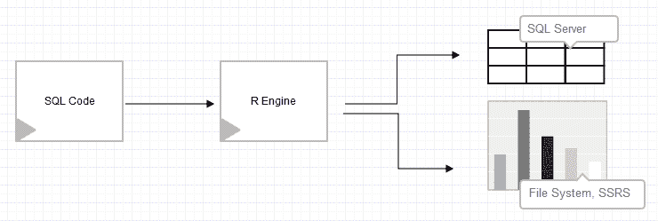

# 第一章：R 和 SQL Server 简介

SQL Server 2016 带来了许多新功能，其中之一是将 R 集成到 SQL Server 中，部分是为了高级分析，部分是为了新的可编程能力。Microsoft R Services for SQL Server 是新扩展性家族的一部分，旨在实现高度可扩展和并行的高级分析。R Services 允许您在数据库中存储的大量数据上执行高级分析（统计、多元统计、预测分析、机器学习和深度学习）。Microsoft 将 R Services 作为**Microsoft R Server**（**MRS**）的一部分发布，该服务器专门设计用于在相同的 SQL Server 计算环境中直接从 SQL Server 数据库读取数据。

在本章中，我们将涵盖以下方面：

+   在 SQL Server 2016 之前使用 R

+   微软对开源 R 语言的承诺

+   利用 SQL Server R 集成增强分析

+   本书概要

# 在 SQL Server 2016 之前使用 R

R 语言自 90 年代以来就在社区中（尽管它是在十年前开发的）。凭借其开源 GNU 许可证，R 因其无需麻烦的安装和能够调用任何可用的包以提供额外的统计学习功能而受到欢迎。这对于 R 来说是一个明显的优势，因为在 80 年代和 90 年代，市场上可用的统计程序并不多；此外，大多数都不是免费的。与核心 R 引擎的新包的扩展性为更广泛的社区和用户提供了更多使用 R 语言的多用途能力，除了其强大的统计分析能力和预测建模能力。

SQL Server 2005 引入了**SQL Server Analysis Services**（**SSAS**）数据挖掘功能，以便应用于存储在 SQL Server 和 SSAS OLAP 立方体中的客户现有丰富数据。此功能允许用户使用**数据挖掘表达式**（**DMX**）来创建预测查询。在接下来的几年里，在 SQL 论坛、博客和社区网站上出现了许多关于额外统计和预测方法和方法的疑问、请求和想法。

回到 2011 年，我开始着手扩展 SQL Server 2008 R2 中统计分析功能的想法，这得益于开源 R 语言。做出这一决定的一个原因是希望能够灵活地运行统计分析（从数据提供到多元分析），而无需首先将数据输入到 OLAP 立方体中，另一个原因是更偏向于商业，需要从所有参与数据准备、数据整理和数据清洗的人员那里获得更快、更深入的统计洞察。

我开始着手构建一个基于 T-SQL 存储过程和 R 包 RODBC（[`cran.r-project.org/web/packages/RODBC`](https://cran.r-project.org/web/packages/RODBC)）的框架。这个想法很简单；获取事务或 OLAP 数据，选择你想要进行分析的列，以及分析本身（从简单的预测分析到超越 SSAS、T-SQL 或 CLR 能力的分析）：



图 1：框架的处理流程

这个框架远非简单，调用该过程相当于调用 R 代码、T-SQL 选择语句和配置 R 引擎的混合体。

包含所有参数的存储过程看起来是这样的：

```py
EXECUTE AdventureWorks2012.dbo.sp_getStatistics
 @TargetTable = '[vStoreWithAddresses]'
 ,@Variables = 'Name'
 ,@Statistics = '8'
 ,@ServerName = 'WORKSTATION-31'
 ,@DatabaseName = 'AdventureWorks2012'
            ,@WorkingDirectory = 'C:\DataTK'
            ,@RPath = 'C:\Program Files\R\R-3.0.3\bin'; 
```

对于这个框架的“螺丝和螺母”解释超出了本书的范围，并且已在[`www.sqlservercentral.com/articles/R+Language/106760/`](http://www.sqlservercentral.com/articles/R+Language/106760/)上进行了很好的记录。

回顾这个框架以及社区和论坛上人们的反馈，它得到了积极的接受，许多人评论说他们需要类似的东西来处理日常业务。

总体而言，这个框架除了开创性的想法和将 R 引擎更近一步地引入 SQL Server 之外，还有很多缺陷。最主要的是安全问题。因为它需要访问一个工作本地目录来生成由 vanilla R 引擎运行的 R 文件，所以它需要启用`xp_cmdshell`。以下重新配置是强制性的，许多系统管理员可能不会同意：

```py
EXECUTE SP_CONFIGURE 'xp_cmdshell', 1;
GO
RECONFIGURE;
GO

EXECUTE SP_CONFIGURE 'Ole Automation Procedures', 1;
GO
RECONFIGURE;
GO  
```

此外，框架需要访问 R 引擎安装，以及执行所需代码的 R 包。安装开源程序并提供读写访问在安全性和企业软件决策方面又是一个缺点。尽管如此，更大的问题之一——在所有东西都安装并投入生产后——是性能和内存问题。R 是基于内存的，这意味着所有的计算都是在内存中完成的。所以，如果你的数据集大小超过了可用内存的大小，你将得到的唯一结果将是错误信息。性能问题的另一个方面也是速度。由于没有并行和分布式计算，框架的性能取决于包作者的灵活性。例如，如果包是用 C 或 C++编写的，而不是 Fortran，那么框架的性能会更好。

这个框架的亮点在于能够更快地提供统计分析或预测建模的结果，因为它可以处理需要统计分析的 OLTP 或任何其他数据。此外，统计学家和数据科学家可以准备存储在表中的 R 代码，这些代码随后由数据整理者、数据分析师或数据管理员运行。因此，可以保持一个版本的真相，因为没有必要移动或复制数据，所有用户都在读取相同的数据源。在预测建模方面，该框架还使用户能够利用各种额外的预测算法（例如，决策森林、glm、CNN、SVM 和词云）的优势，这些算法当时并不属于 SSAS 数据挖掘。

除了优点和缺点之外，该框架是成功尝试获取更多易于在不同业务单元之间分发的数据洞察的初步尝试，通过在 SQL Server 报告服务中推送可视化。在 SQL Server 2016 发布之前的那几年里，我遇到了来自 SQL Server 社区的开发类似框架的人，目的是将预测推送到 SQL Server 数据库以支持业务应用和解决方案。随着 SQL Server 2016 的推出，许多类似的解决方案被内部化，并更接近 SQL Server 引擎以实现更好的性能，并解决许多问题和缺点。

# 微软对开源 R 语言的承诺

随着其日益增长的受欢迎程度和社区规模，R 已经成为并在继续成为高级分析和数据可视化领域的重要参与者。R 和机器学习服务器（或服务）不仅仅是下一个 SQL Server 周期中会被遗忘的流行语，它们正在越来越多地渗透到开源和公司软件的不同层次。在过去五年中，许多大型分析公司都引入了 R 集成、解释器和 R 语言的包装，因为这种语言的实用性、可用性以及跨学科和开源导向。随着微软大胆且战略性地向开源友好型转变，将 R 集成到 SQL Server 中的用例正在增长，这使得这一举措更加自然，并且是在正确的时间点。这一举措在 SQL 社区和商业界都受到了高度赞赏。

与其他大型分析工具相比，微软对集成非常重视。它解决了语言本身的许多问题和限制，并创建了 R 与 SQL Server 的完整集成，以提供最佳的用户体验。许多竞争对手（如 SAS、IBM、SAP 和 Oracle）已经进行了类似的集成，但未能考虑到许多对整体用户体验有贡献的方面。微软宣布加入 R 联盟将使他们能够帮助 R 语言的开发并支持未来的发展。此外，微软还创建了自己的软件包仓库，称为 MRAN（来自 CRAN，其中 M 代表微软），并为 R 提供支持和 SLA 协议，尽管语言和引擎基于 Open R（一个免费、开源的版本）。所有这些步骤都告诉我们微软在将开源、统计和编程语言引入 SQL Server 环境中的承诺。

我们只能期待 R 集成将更多地融入其他服务。例如，Power BI 自 2016 年 10 月起支持原生 R 可视化（[`powerbi.microsoft.com/en-us/blog/r-powered-custom-visuals`](https://powerbi.microsoft.com/en-us/blog/r-powered-custom-visuals)），自 2015 年 12 月起支持 R 语言。因此，我坚信 R 将很快成为整个 SQL Server 生态系统（如 SSAS、SSIS 和 SSRS）的组成部分，并且以原生方式集成。随着 Azure Analysis Services 的推出，R 又向分析服务迈进了一步。

# 利用 SQL Server R 集成增强分析

数据科学是 SQL Server 和 R 集成的最前沿。DBA、系统管理员、分析师、数据整理员或任何其他与 SQL Server 一起工作的角色执行的任务都可以通过任何类型的统计、数据相关性、数据分析或数据预测得到支持。R 集成不应仅限于数据科学领域。相反，它应该在所有任务中探索和使用。DBA 可以通过从监控任务切换到理解和预测可能或将要发生的事情来从 R 集成中受益。同样，这个想法可以应用到系统管理员、数据整理员等等。R 集成还使不同角色的个人更接近理解统计、指标、度量，并学习如何通过统计分析预测来改进它们。

除了将孤立的个体团队合作转变为更加协调和紧密的团队之外，R 集成还减少了数据移动，因为现在不同的用户可以在 R 代码的帮助下执行、深入挖掘并感受数据，而不是等待首先准备、导出和再次导入数据。随着工作流程的更加顺畅，部署时间也更快，无论是简单的报告、预测模型还是分析。这使得数据所有权的边界转移到洞察力所有权，这是对业务需求更快反应的积极方面。

在过去的一年里，我们也看到了对微软数据科学栈中数据科学的高度兴趣。随着 R 的集成、Azure 机器学习和 Power BI，所有想要学习新技能和美德的用户都有很多起点，可以从现有的产品中选择。

# 摘要

从 SQL Server 2016 开始，R 的集成成为了 SQL Server 平台的一个重要部分。自从 SQL Server 2016 公开发布以来，直到 2018 年 2 月（撰写本文时），社区已经很好地接纳了 R 和 Python，使数据探索和数据分析成为一般数据库任务的一部分。微软解决了许多问题，并扩大了 SQL Server 作为产品的范围。在 SQL Server 2017 中，Python 被添加为次要分析语言，使更多的社区和企业受益，同时，也关注数据的可扩展性、性能和安全。

在下一章中，我们将介绍不同的 R 发行版和 IDE 工具，用于将 R 作为独立工具或 SQL Server 内部使用，以及在选择时它们之间的区别。
