# 第九章：为 DBAs 提供的 R 机器学习服务

R 集成（以及 SQL Server 2017 中的 Python 集成）提供了一系列可以使用的机会。而且，使用 R 服务的人群在人数（工作角色或部门）方面已经增加。DBAs（以及系统管理员）肯定会从中受益良多。R 和统计学不仅为他们发现和深入了解他们捕获的数据提供了额外的动力，而且也可能帮助他们找到他们之前可能错过的隐藏宝藏。不同语言的混合——我不仅是在谈论 R，还包括其他语言——无疑为跟踪、捕捉和分析捕获数据带来了新的能力。

一件事很清楚，如果你有 R（任何 Python）如此接近数据库，那么几个人可以从监控任务切换到预测任务。这实际上意味着人们现在可以诊断和预测可能会发生的事情，而不仅仅是当事情已经发生时采取行动。我并不是说这是一项容易的任务，因为我们都知道，例如，一个查询突然运行缓慢的复杂性可能有一个或多个隐藏的原因，这些原因可能不会立即被发现，R 在数据库中的集成将肯定有助于在近实时中找到这个隐藏的原因。与 SSAS 中的数据挖掘相比，在我看来，它仍然是一个非常强大和好的工具，但与通过 R 引擎发送和分析数据相比，可能会有更多的延迟。

本章将概述如何帮助 DBAs（或其他角色处理类似问题）获取 R 的优势的重要步骤：

+   收集对数据库管理员（DBAs）相关的数据

+   探索和分析数据

+   使用 R 服务创建预测

+   通过预测改进监控

# 收集相关数据

收集数据——尽管这可能很简单——是一项需要精心设计的任务。这有几个原因。首先也是最重要的原因是，我们希望以对生产环境影响最小或零的方式收集数据。这意味着收集和存储数据的过程不应干扰任何正在进行的流程。第二重要的是存储。你希望在何处以及如何存储数据，以及存储数据的保留策略？一开始，这可能会显得非常微不足道，但随着时间的推移，存储本身将扮演一个重要的角色。第三，也是绝对重要的，是你想要收集哪些数据。当然，我们都希望拥有智能数据，也就是说，拥有所有与解决或改进我们的业务流程相关的数据。但在现实中，收集智能数据既不困难也不容易。首先，必须理解数据库功能的概念，而且还要了解如何捕捉相关指标以及这个特定功能将如何运作。

让我们看看在哪里以及如何可以看到性能改进，如果你知道如何寻找它们的话。

例如，延迟耐久性是自 SQL Server 2014 以来 SQL Server 就有的一个功能，但在某些场景下可以帮助提高性能，但会牺牲耐久性（耐久性是 ACID（原子性、一致性、隔离性和耐久性）的一部分，防止在发生故障或系统重启时，已提交的数据没有被保存或保存到错误的状态）。**写入前日志（WAL**）是 SQL Server 使用的一个系统，这意味着所有更改首先写入日志，然后才允许它们提交到数据库表。

对于这个快速演示，我们将创建一个空数据库，将`DELAYED_DURABILITY`设置为允许，并设置为`NO_WAIT`。这个测试的一个重要步骤是将数据库的备份设置为`NUL`，这与`with truncate_only`命令类似。这个语句丢弃任何非活动日志（当数据库处于完全或批量日志恢复模式时；对于简单恢复模式，这并不适用）以及从数据库完成完全备份的那一刻起，任何非活动日志记录都会被丢弃（删除）。这可以被模拟。当检查点运行时，尝试备份日志将导致错误消息。换句话说，数据库可能正在以简单恢复模式运行。本质上，`NUL`命令只是存储和丢弃日志：

```py
USE [master];
GO
CREATE DATABASE [DelayedDurability];
GO

ALTER DATABASE [DelayedDurability] SET DELAYED_DURABILITY = ALLOWED    
WITH NO_WAIT;
GO
BACKUP DATABASE [DelayedDurability] TO DISK = N'nul'
GO  
```

我将创建一个示例表来进行插入：

```py
USE [DelayedDurability];
GO

DROP TABLE IF EXISTS TestDDTable;
GO

CREATE TABLE TestDDTable
(ID INT IDENTITY(1,1) PRIMARY KEY
,R_num INT
,Class CHAR(10) 
,InsertTime DATETIME DEFAULT(GETDATE())
);
GO  
```

创建了表之后，我们现在可以测试两种类型的插入，带有延迟耐久性和不带延迟耐久性：

```py
EXECUTE sys.sp_flush_log;
GO

DECLARE @count INT = 0
DECLARE @start1 DATETIME = GETDATE()
WHILE (@count <= 250000)
          BEGIN
                BEGIN TRAN
                      INSERT INTO TestDDTable(R_num, class) VALUES(@count, 'WITHOUT_DD')
                      SET @count += 1
                COMMIT
          END

SET @count = 0
DECLARE @start2 DATETIME = GETDATE()
WHILE (@count <= 250000)
          BEGIN
                BEGIN TRAN
                      INSERT INTO TestDDTable(R_num, class) VALUES(@count, 'WITH_DD')
                      SET @count += 1
                COMMIT WITH (DELAYED_DURABILITY = ON)
          END

SELECT 
DATEDIFF(SECOND, @start1, GETDATE()) AS With_DD_OFF
,DATEDIFF(SECOND, @start2, GETDATE()) AS With_DD_ON
```

结果很明显：将延迟耐久性设置为开启时，在进行大量插入时可以提高性能：

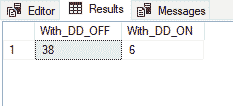

我也可以使用查询压力来模拟多个线程，每个线程执行相同数量的插入：

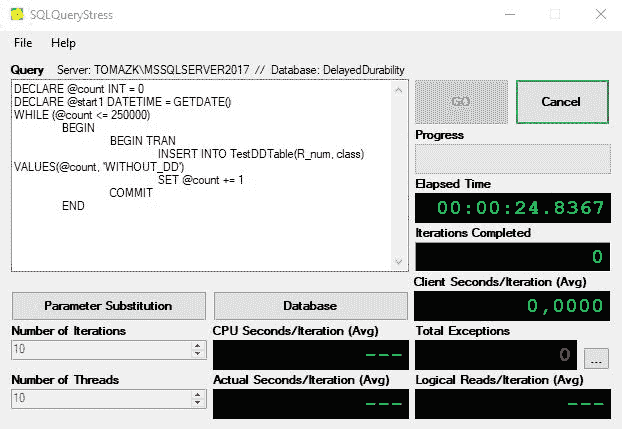

在这种重压下的工具测试中，问题是，我们如何监控和跟踪延迟耐久性的行为？一个人可以通过性能监控器来测试性能：

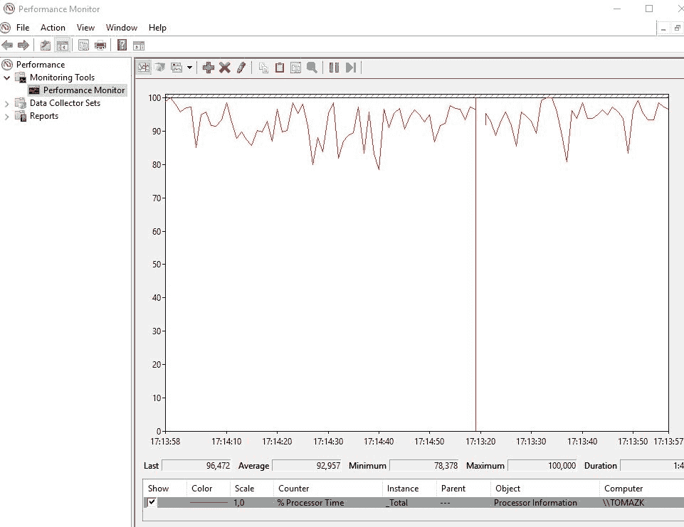

或者，你可以使用活动监控器来测试性能：

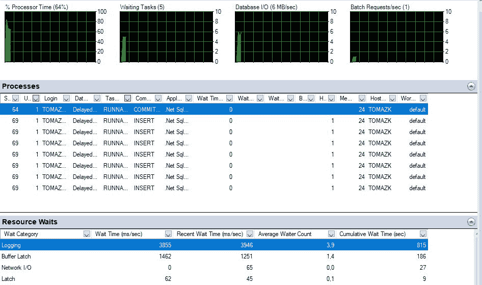

但很快你就会意识到，你可能需要存储这些信息以供后续分析，或者你需要获取一些额外的知识，了解在这种情况下哪些性能指标或扩展事件值得监控。

因此，在这种情况下，你需要在登录时检查等待资源：

```py
SELECT * FROM sys.dm_os_wait_stats
WHERE wait_type IN ('WRITELOG');
GO 
```

你还需要添加一些机制来捕获这些等待统计信息到一个表中，以供后续分析，或者捕获性能监控器或使用分析器、XE 等。在运行时查询数据并捕获统计信息是一项相当繁琐的工作；想象一下将`sys.dm_os_wait_stats`中的统计信息合并并与`sys.dm_io_virtual_file_stats`结合。总的来说，你试图收集的数据越多，查询这些统计信息可能就越复杂。

使用性能监控器捕获之前两个查询的结果，截图如下所示：

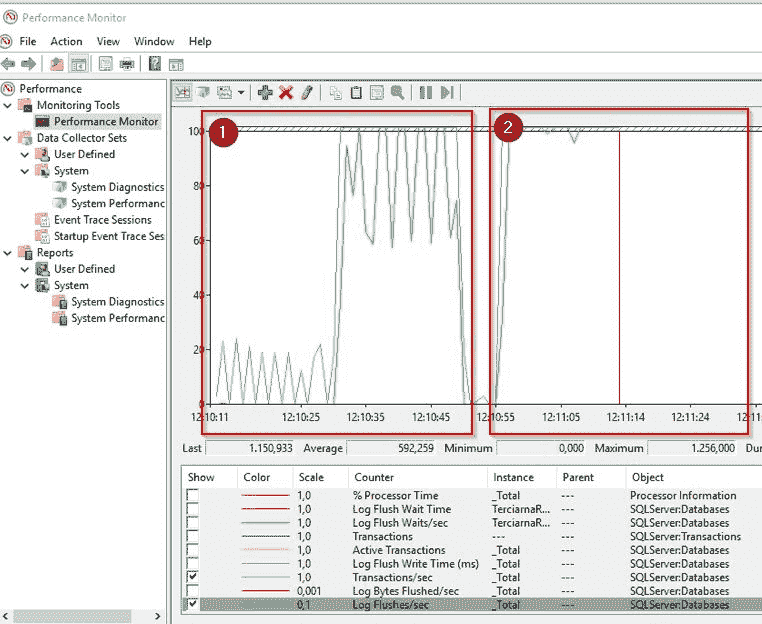

上述截图显示了左侧（1）延迟持久性如何工作以及日志刷新如何在一段时间内按顺序发生。与右侧（2）相比，我们可以看到延迟持久性被关闭且日志刷新不活跃。

从性能监视器中提取原始数据可能不是正确的方法，但通过扩展事件存储相同的数据集对系统以及用户来说将更加轻量，便于后续分析。

设置您分析所需的扩展事件可以快速且轻松完成。但与其选择过多的事件，不如专注于真正需要的那些，因为日志文件可能会很快变得很大：

```py
-- creating extended event

IF EXISTS(SELECT * FROM sys.server_event_sessions WHERE name='DelayDurab_Log_flush') 
DROP EVENT session DelayDurab_Log_flush ON SERVER; 

-- Get DelayedDurability database ID
SELECT db_id()

CREATE EVENT SESSION DelayDurab_Log_flush ON SERVER
ADD EVENT sqlserver.log_flush_start
 (WHERE  (database_id=40)),
ADD EVENT sqlserver.databases_log_flush 
 (WHERE (database_id =40)),
ADD EVENT sqlserver.transaction_log
 (WHERE (database_id =40))
-- maybe add batchrequests/second

 ADD TARGET package0.event_file
(
 SET filename     ='C:\CH09\MonitorDelayDurability.xel'
 ,metadatafile ='C:\CH09\MonitorDelayDurability.xem'
)
WITH (MAX_MEMORY=4096KB
 ,EVENT_RETENTION_MODE=ALLOW_SINGLE_EVENT_LOSS
 ,MAX_DISPATCH_LATENCY=30 SECONDS
 ,MEMORY_PARTITION_MODE=NONE
 ,STARTUP_STATE=ON);
GO  
```

在启动事件后，通过分解 XML 结构来读取文件内容：

```py
SELECT 
      CAST(event_data AS XML) AS event_data
FROM sys.fn_xe_file_target_read_file('C:\CH09\MonitorDelayDurability*.xel', 'C:\CH09\MonitorDelayDurability*.xem', null, null) 
```

此外，从 XML 中获取信息也是正确处理扩展事件的重要任务：

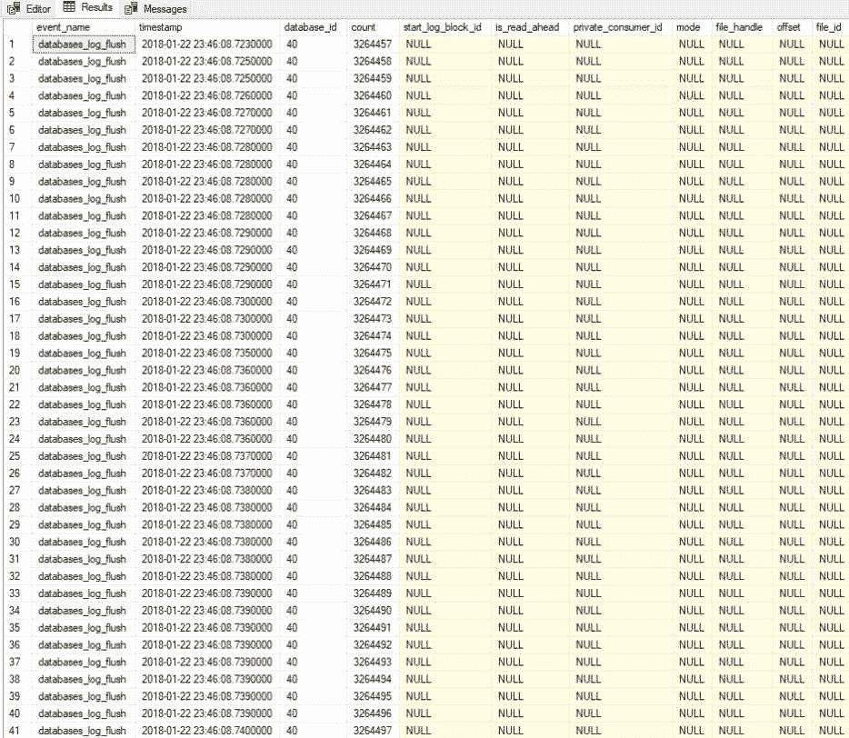

回到起点，为数据库管理员和进一步分析收集数据至关重要。从这个例子中还可以看出：如果我们也添加到日志文件的增长，其中一个日志需要通过添加新的 VLF 文件来额外增长。与关闭延迟持久性的事务相比，添加延迟持久性可以提供更快的插入。有时添加新的`XE`或度量可以显著增加日志文件，其中数据正在被收集。使用统计分析，我们可以优化度量选择，或者稍后发现它们为我们提供了额外的洞察信息。在探索和后续分析数据方面的工作可以带来巨大的回报，无论是在工作负载方面还是在收集到的不同数据方面。

# 探索和分析数据

以类似的方式，使用事件特征收集数据可以为您提供丰富的方式来获取大量系统信息数据。从之前的示例中，通过以下演示，我们将看到如何使用服务器的度量值进行高级统计分析，以及如何帮助减少不同信息量，并精确定位相关度量。将创建一个特定的数据库和一个阶段表：

```py
CREATE DATABASE ServerInfo;
GO

USE [ServerInfo]
GO

DROP TABLE IF EXISTS server_info;
GO

CREATE TABLE [dbo].server_info ON [PRIMARY];
GO  
```

然后，导入附带的代码文件中可以找到的度量。有 433 个测量点来自 32 个不同的扩展事件，目的是理解服务器及其环境设置。

在初始加载后，表将填充不同扩展事件的度量值，这些度量值也已经过离散化和清理，以便进行进一步的数据分析：

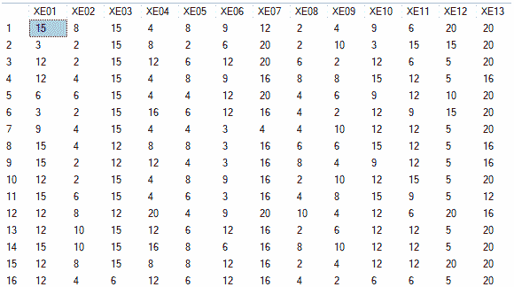

`boxplot`函数使用户能够探索每个度量的分布并找到潜在的异常值。仅使用 R 代码来探索数据：

```py
dbConn <- odbcDriverConnect('driver={SQL Server};server=TOMAZK\\MSSQLSERVER2017;database=ServerInfo;trusted_connection=true') 
server.feature <- sqlQuery(dbConn, 'SELECT * FROM Server_info') 
close(dbConn) 
boxplot(server.feature) 
```

下面的图表提供了一个快速概述：

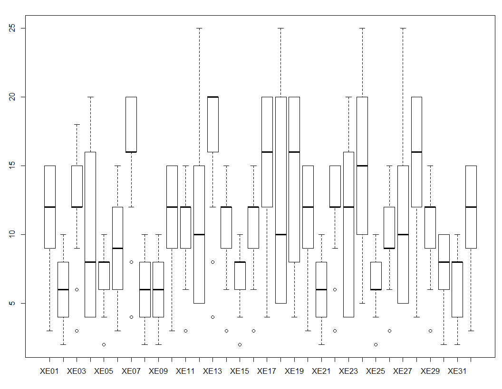

箱线图显示有四个事件，其值远远超过平均值和第三四分位数。清理这些异常值将使数据更容易阅读，并且不会导致异常分布和偏斜结果。请注意，有一些特定的分析处理异常值并寻找这样的值。对于这个演示，我们将这些值重新编码为 N/A。

在清理、添加汇总统计量和相关性之后，这是一个相关的方法来查看所有事件是如何相互关联的：

```py
# replace value 25 with N/A
server.feature$XE12[server.feature$XE12=="25"]<-NA
server.feature$XE18[server.feature$XE18=="25"]<-NA
server.feature$XE24[server.feature$XE24=="25"]<-NA
server.feature$XE27[server.feature$XE27=="25"]<-NA

cor.plot(server.feature,numbers=TRUE,main="Server Features")  
```

服务器特征的关联矩阵是表示哪些事件相关以及如何不相关的一种很好的方式：

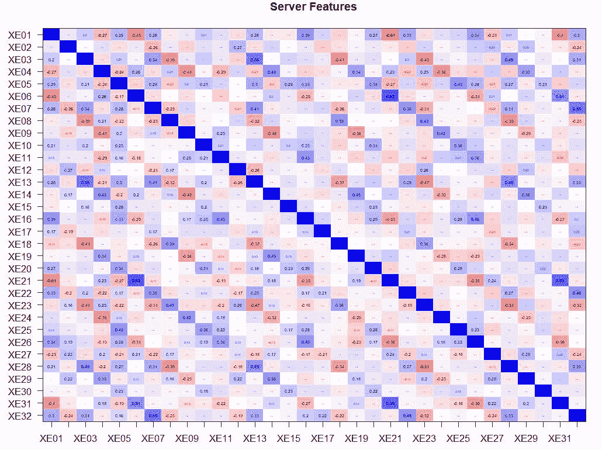

进一步来说，让我们减少这些扩展事件度量，因为很明显，并非所有都在扮演重要角色，有些可能只是额外开销。从前面的热图中，很难看出某些度量之间的相关性是否不起作用；因此，我们将使用因子分析。这种分析观察变量之间的相关性，以反映更少的潜在变量。因子是一个潜在变量，即基于观察和相关性变量的结构化变量。结构是通过每个因子加载响应变量来创建的。这意味着因子 1 可以是，例如，变量`A`加载 25%，变量`B`加载 65%，变量`C`加载 10%。因此，因子 1 将主要（65%）从变量`A`中提取特征，依此类推。

以这种方式，因子分析将尝试减少原始相关变量的数量（我们扩展事件的度量），并尝试创建新的结构化变量。

使用 R 代码探索数据，简单的探索性因子分析可以揭示多个因子：

```py
fa.parallel(server.feature, fa="fa")  
```

以下屏幕截图显示有七个因子可用于提取：

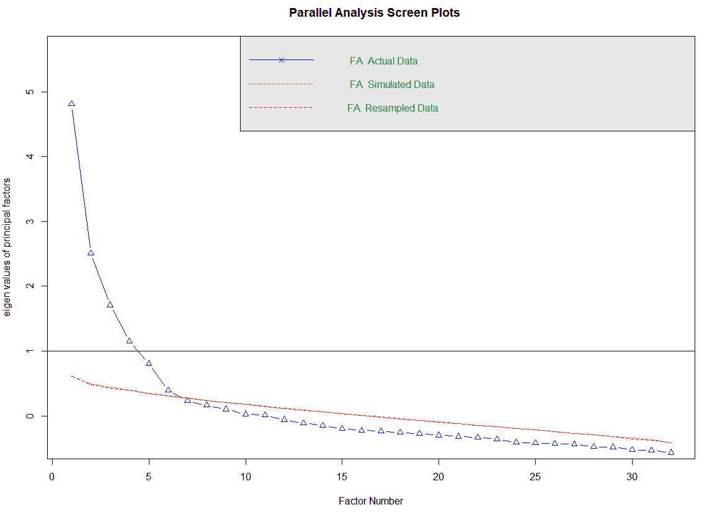

以以下方式，这也会揭示因子的加载情况；只需调用 R 函数：

```py
fa.model <- fa(server.feature,7,n.obs = 459,fm="pa",scores="regression", use="pairwise",rotate="varimax") #can use WLS - weighted least squares
fa.model.r <- target.rot(fa.model)
fa.diagram(fa.model.r) 
```

以下图表显示了加载构建每个因子的方式：

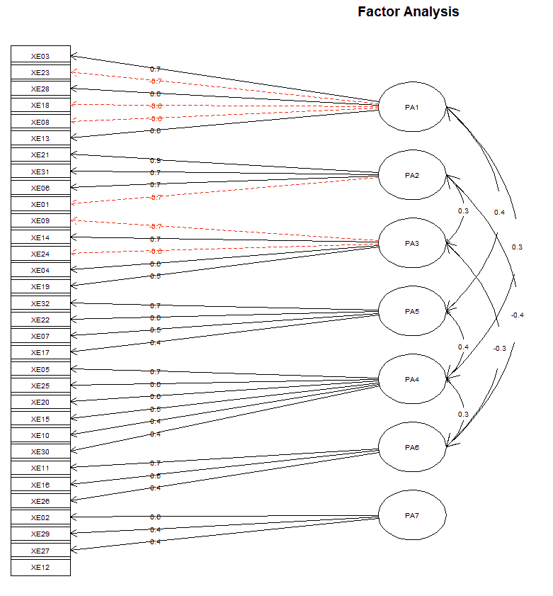

将加载存储回数据库以进行进一步分析和因子命名是一种常见做法，并且考虑到可以将因子纳入任何进一步的分析（例如：分类或聚类方法）。现在我们知道因子的数量，我们可以将加载存储到数据库中：

```py
-- Factor Analysis
-- extract factor loadings

DECLARE @Rcode NVARCHAR(MAX)
SET @Rcode = N'
 ## with actual FA funcitons
 library(psych)
 library(Hmisc)
 ## for data munching and visualization
 library(ggplot2)
 library(plyr)
 library(pastecs)

 server.feature <- InputDataSet

 server.feature$XE12[server.feature$XE12=="25"]<-NA
 server.feature$XE18[server.feature$XE18=="25"]<-NA
 server.feature$XE24[server.feature$XE24=="25"]<-NA
 server.feature$XE27[server.feature$XE27=="25"]<-NA

 fa.model <- fa(server.feature
 ,7
 ,fm="pa"
               ,scores="regression"
 ,use="pairwise"
 ,rotate="varimax") #can use WLS - weighted least squares

 fa.loadings <- as.list.data.frame(fa.model$loadings)
      OutputDataSet <- data.frame(fa.loadings)'

 EXEC sp_execute_external_script
 @language = N'R'
 ,@script = @Rcode
      ,@input_data_1 = N'SELECT * FROM server_info'
WITH RESULT SETS
((
 PA1 NUMERIC(16,3)
 ,PA2 NUMERIC(16,3)
 ,PA3 NUMERIC(16,3)
 ,PA4 NUMERIC(16,3)
 ,PA5 NUMERIC(16,3)
 ,PA6 NUMERIC(16,3)
 ,PA7 NUMERIC(16,3)
 ))  
```

结果可以解释为：值（正或负）越高，特定度量与伴随因子的加载就越多：

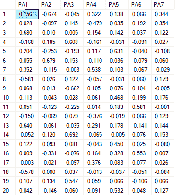

因子 1，`PA1`，主要加载了 XE03 (`0.680`)、XE13 (`0.640`)、XE18 (`-0.578`)和 XE28 (`0.652`)。这四个都是测量查询交易，如下面的截图所示：

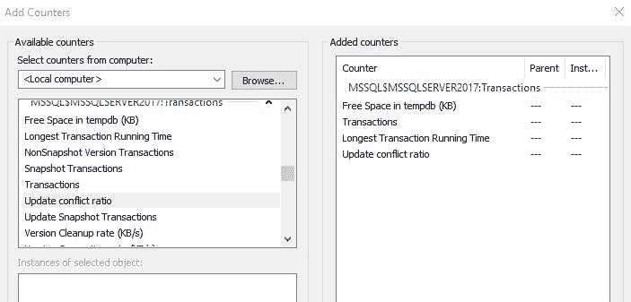

在这里，负值是 tempdb 中的空闲空间（KB），它是负负载的，并且仅表示与因素的关系。但是，能够减少扩展事件的数目，并通过高级统计分析将它们结合起来，是一种处理潜在复杂问题的非常整洁的方法。

在数据库负载中，我还可以通过散点图表示这些因素是如何分布的。我已经将先前查询的结果导出到 Power BI，并使用了聚类视觉。此外，您可以看到这些因素负载的集群以及相似的集群。红色组（在左侧）又是 DBA 和数据科学家应该一起进一步检查的内容：

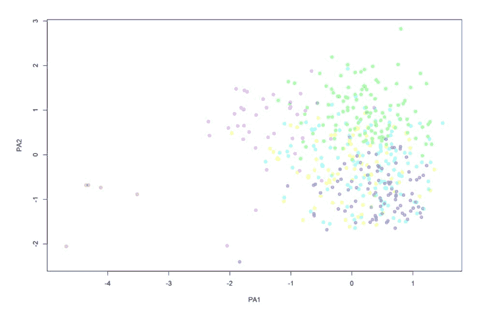

# 创建基线和负载，并重新播放

给定减少和创建针对您特定服务器或环境的定制和适应性的新度量标准的能力，现在我们想了解在所有其他参数保持不变的情况下（拉丁语，*ceteris paribus*）系统是如何表现的。这是基线。有了基线，我们确定了什么是正常的，换句话说，在正常条件下的性能。基线用于比较可能或看似异常或不寻常的情况。它还可以作为任何未来测试的控制组（这在新补丁推出或特定环境/服务器的升级需要执行时尤其有效）。

典型的企业基线可以描述为以下一天（24 小时）内用户或机器发起的数据库请求数量：

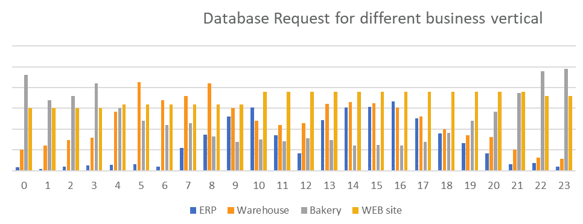

当所有请求都表示为每个企业流程的细分时，可以立即看到模式。

企业资源规划（ERP）系统通常在人们在工作场所时达到峰值——在正常工作日的上午 8:00 至下午 5:00 之间，有两个明显的峰值，以及从上午 11:00 至下午 1:00 的非常明显的午餐休息时间：

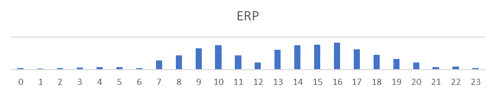

在日常 ERP 系统维护中添加 ETL 作业，很明显 DBA 和系统管理员通常在哪里以及何时尝试压缩这些重要作业，以及这如何也受到日常 ERP 工作负载的限制和描述：

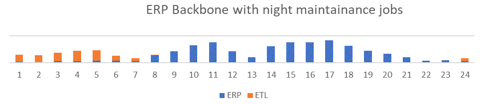

仓库具有完全不同的行为模式，这意味着它通常在早晨 4:00 AM 和 5:00 AM 达到最高的请求，并且直到傍晚时分保持某种程度的稳定：

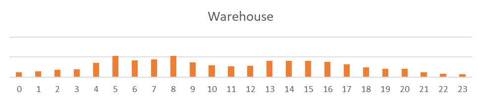

相反，面包店对数据库的请求是相反的，因为他们的大多数活动都是从晚上 9:00 开始，直到凌晨 3:00，这样顾客就能在早上得到新鲜面包：

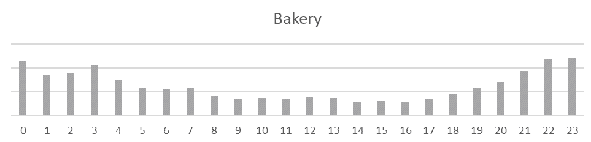

最后，网站可以被视为一个恒定的数据库请求资源，相对而言，每天的变动很小：

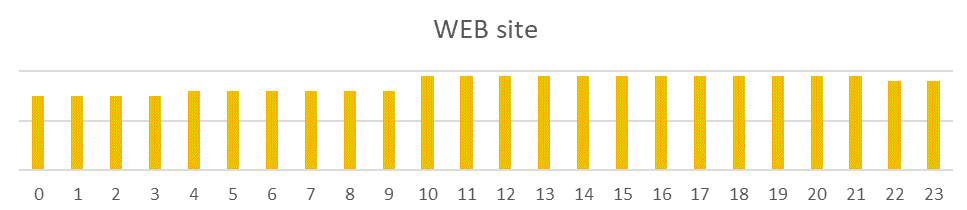

所有这些都可以理解为日常基线，当然，如果按月度来考虑，事情会变得更加复杂。同时，模式会立即出现。在周末（第 7 天、第 14 天和第 21 天）请求减少，而在月底结束时，需要关闭财务周期；因此，数据库上有额外的负载：

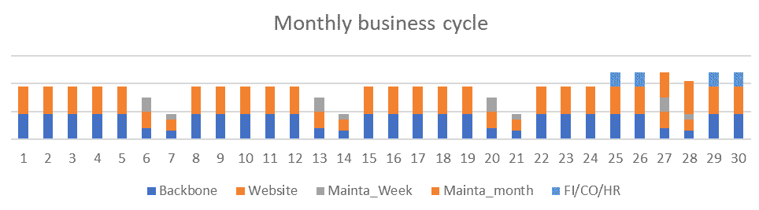

展示所有这些对于理解系统（或环境）基线必须如何理解至关重要。这些数据可以通过性能计数器、许多 DMV、使用查询存储和其他工具收集。我们通常收集的是我们稍后要监控和预测的内容。因此，明智地选择是最重要的任务，因为通过这些措施、计数器和值，您将定义系统何时健康以及何时不健康。但通常，关于系统和数据库的一般信息至关重要。此外，还需要存储 SQL Server 信息、许多可配置参数、与查询相关的信息、数据库-I/O 和与 RAM 相关的信息。

在建立基线后，我们需要创建工作负载。通常，工作负载是在生产服务器上针对基线捕获的，并在测试服务器/环境中回放捕获的统计信息。可以通过在测试环境中回放从生产环境中捕获的工作负载，通过交替更改特定参数的值来改变数据库调整或配置更改。下一个演示是表示通过两个参数表达的工作负载，当相同的工作负载被回放时，这些参数已被更改：

```py
USE [master];
GO

CREATE DATABASE Workloads;
GO

USE Workloads;
GO  
```

查询表 `[dbo].[WLD]` 实质上只是重复相同的工作负载，但其中一个或另一个参数有所变化：

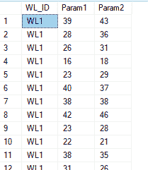

首先，我们需要对每次有变化时的工作负载进行异常值分析。带有 R 的 T-SQL 代码可以生成一个*马氏距离*图，清楚地显示异常值所在的位置：

```py
EXEC sp_execute_external_script 
 @language = N'R' 
,@script = N' 
               library(car) 
               library(ggplot2) 
               dataset <- InputDataSet 
               dataset$WL_ID <- as.numeric(recode(dataset$WL_ID, "''WL1''=1; ''WL2''=2;''WL3''=3")) 
               dataset$Param1 <- as.numeric(dataset$Param1) 
               dataset$Param2 <- as.numeric(dataset$Param2) 

               m.dist <- mahalanobis(dataset, colMeans(dataset), cov(dataset)) 
               dataset$maha_dist <- round(m.dist) 

               # Mahalanobis Outliers - Threshold set to 7 
               dataset$outlier_mah <- "No" 
               dataset$outlier_mah[dataset$maha_dist > 7] <- "Yes" 

                image_file = tempfile();   
               jpeg(filename = image_file);   

               # Scatterplot for checking outliers using Mahalanobis  
               ggplot(dataset, aes(x = Param1, y = Param2, color = outlier_mah)) + 
                 geom_point(size = 5, alpha = 0.6) + 
                 labs(title = "Mahalanobis distances for multivariate regression outliers", 
                        subtitle = "Comparison on 1 parameter for three synthetic Workloads") + 
                 xlab("Parameter 1") + 
                 ylab("Parameter 2") + 
                 scale_x_continuous(breaks = seq(5, 55, 5)) + 
                 scale_y_continuous(breaks = seq(0, 70, 5))    + geom_abline(aes(intercept = 12.5607 , slope = 0.5727)) 

                 dev.off();  
               OutputDataSet <- data.frame(data=readBin(file(image_file, "rb"), what=raw(), n=1e6))' 
,@input_data_1 = N'SELECT * FROM WLD' 
```

该图表已插入 Power BI 中，可以在两个参数中更改工作负载。因此，数据库管理员不仅可以更改工作负载，还可以在回放恢复的工作负载时看到哪些异常值引起了额外关注：

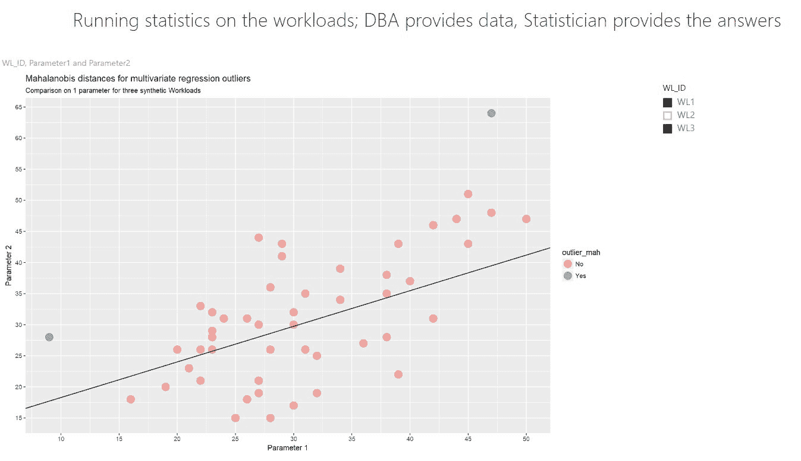

ANOVA 或 MANOVA 也可以执行，以查看工作负载中的特定变化。R 代码可以做到这一点：

```py
dataset$Param1 <- as.numeric(dataset$Param1)
dataset$Param2 <- as.numeric(dataset$Param2)
dataset$WL_ID <- as.numeric(recode(dataset$WL_ID, "'WL1'=1; 'WL2'=2;'WL3'=3"))

LM.man <- Anova(lm(cbind(Param1, Param2) ~ WL_ID, data=dataset))
summary(LM.man)    
```

ANOVA 统计显示工作负载及其参数设置变化之间的差异：

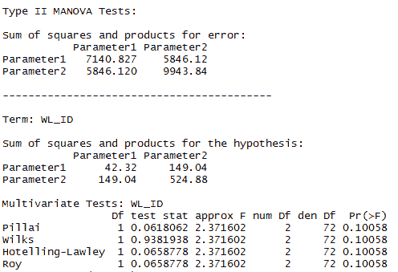

# 使用 R 创建预测 - 磁盘使用情况

预测涉及发现任何未计划、不希望的活动或异常的系统行为，尤其是与基线相比时。以这种方式，拉响警报将导致更少的误报状态。

此外，我们总是遇到磁盘大小问题。基于这个问题，我们将演示数据库增长，存储数据，然后对收集到的数据进行预测，以便最终能够预测 DBA 何时可以期待磁盘空间问题。

为了说明这个场景，我将创建一个 8MB 的小型数据库，没有增长的可能性。我将创建两个表。一个将作为基线，`DataPack_Info_SMALL`，另一个将作为所谓的日常日志，其中将存储所有意外情况或不良行为。这将持久保存在`DataPack_Info_LARGE`表中。

首先，创建一个数据库：

```py
USE [master];
GO

CREATE DATABASE FixSizeDB
CONTAINMENT = NONE
ON  PRIMARY
( NAME = N'FixSizeDB', FILENAME = N'C:\Program Files\Microsoft SQL Server\MSSQL14.MSSQLSERVER2017\MSSQL\DATA\FixSizeDB_2.mdf' , 
SIZE = 8192KB , FILEGROWTH = 0)
LOG ON
( NAME = N'FixSizeDB_log', FILENAME = N'C:\Program Files\Microsoft SQL Server\MSSQL14.MSSQLSERVER2017\MSSQL\DATA\FixSizeDB_2_log.ldf',
SIZE = 8192KB , FILEGROWTH = 0)
GO
ALTER DATABASE [FixSizeDB] SET COMPATIBILITY_LEVEL = 140
GO
ALTER DATABASE [FixSizeDB] SET RECOVERY SIMPLE
GO  
```

`DataPack`表将作为所有生成的插入和后续删除的存储位置：

```py
CREATE TABLE DataPack
 (
 DataPackID BIGINT IDENTITY NOT NULL
 ,col1 VARCHAR(1000) NOT NULL
 ,col2 VARCHAR(1000) NOT NULL
 )  
```

使用以下简单的`WHILE`循环填充`DataPack`表：

```py
DECLARE @i INT = 1;
BEGIN TRAN
 WHILE @i <= 1000
 BEGIN
 INSERT dbo.DataPack(col1, col2)
 SELECT
 REPLICATE('A',200)
 ,REPLICATE('B',300);
 SET @i = @i + 1;
 END
COMMIT;
GO  
```

使用以下查询捕获磁盘空间变化对于任务来说非常重要：

```py
SELECT
 t.NAME AS TableName
 ,s.Name AS SchemaName
 ,p.rows AS RowCounts
 ,SUM(a.total_pages) * 8 AS TotalSpaceKB
 ,SUM(a.used_pages) * 8 AS UsedSpaceKB
 ,(SUM(a.total_pages) - SUM(a.used_pages)) * 8 AS UnusedSpaceKB
FROM
 sys.tables t
INNER JOIN sys.indexes AS i
 ON t.OBJECT_ID = i.object_id
INNER JOIN sys.partitions AS p
 ON i.object_id = p.OBJECT_ID
 AND i.index_id = p.index_id
INNER JOIN sys.allocation_units AS a
 ON p.partition_id = a.container_id
LEFT OUTER JOIN sys.schemas AS s
 ON t.schema_id = s.schema_id
WHERE
 t.NAME NOT LIKE 'dt%'
 AND t.is_ms_shipped = 0
 AND i.OBJECT_ID > 255
 AND t.Name = 'DataPack'
GROUP BY t.Name, s.Name, p.Rows  
```

`Log`表将与`DataPack`表一起填充，以便收集磁盘空间的即时变化：

```py
DECLARE @nof_steps INT = 0
WHILE @nof_steps < 15
BEGIN
 BEGIN TRAN
 -- insert some data
 DECLARE @i INT = 1;
              WHILE @i <= 1000 -- step is 100 rows
 BEGIN
                                         INSERT dbo.DataPack(col1, col2)
 SELECT
                                                             REPLICATE('A',FLOOR(RAND()*200))
                                                            ,REPLICATE('B',FLOOR(RAND()*300));
 SET @i = @i + 1;
 END
 -- run statistics on table
 INSERT INTO dbo.DataPack
 SELECT
                     t.NAME AS TableName
                     ,s.Name AS SchemaName
                     ,p.rows AS RowCounts
                     ,SUM(a.total_pages) * 8 AS TotalSpaceKB
                     ,SUM(a.used_pages) * 8 AS UsedSpaceKB
                     ,(SUM(a.total_pages) - SUM(a.used_pages)) * 8 AS UnusedSpaceKB
 ,GETDATE() AS TimeMeasure
 FROM 
 sys.tables AS t
                     INNER JOIN sys.indexes AS i
                     ON t.OBJECT_ID = i.object_id
                     INNER JOIN sys.partitions AS p
                     ON i.object_id = p.OBJECT_ID
                     AND i.index_id = p.index_id
                     INNER JOIN sys.allocation_units AS a
                     ON p.partition_id = a.container_id
                     LEFT OUTER JOIN sys.schemas AS s
                     ON t.schema_id = s.schema_id
              WHERE
                            t.NAME NOT LIKE 'dt%'
                     AND t.is_ms_shipped = 0
                     AND t.name = 'DataPack'
                     AND i.OBJECT_ID > 255
              GROUP BY t.Name, s.Name, p.Rows
              WAITFOR DELAY '00:00:02'
       COMMIT;
END
```

这将作为我们比较结果的基础。当我们查询`DataPack_Log_Small`表时，结果如下：

```py
DECLARE @RScript nvarchar(max)
SET @RScript = N'
 library(Hmisc) 
 mydata <- InputDataSet
 all_sub <- mydata[2:3]
 c <- cor(all_sub, use="complete.obs", method="pearson")
 t <- rcorr(as.matrix(all_sub), type="pearson")
 c <- cor(all_sub, use="complete.obs", method="pearson")
 c <- data.frame(c)
 OutputDataSet <- c'
DECLARE @SQLScript nvarchar(max)
SET @SQLScript = N'SELECT
 TableName
 ,RowCounts
 ,UsedSpaceKB
 ,TimeMeasure
 FROM DataPack_Info_SMALL'
EXECUTE sp_execute_external_script
 @language = N'R'
 ,@script = @RScript
 ,@input_data_1 = @SQLScript
 WITH result SETS ((RowCounts VARCHAR(100)
 ,UsedSpaceKB  VARCHAR(100)));
GO  
```

结果，我们在`RowCounts`和`UsedSpaceKB`列之间得到了一个强烈和正的相关性。这可以很容易地解释为：当`RowCounts`的值增加时，`UsedSpaceKB`的值也增加。这是唯一的逻辑解释。出现负相关性会有些奇怪。现在，我们将尝试模拟随机的删除和插入，并使用以下代码观察类似的行为：

```py
DECLARE @nof_steps INT = 0
WHILE @nof_steps < 15
BEGIN
 BEGIN TRAN
 -- insert some data
 DECLARE @i INT = 1;
 DECLARE @insertedRows INT = 0;
              DECLARE @deletedRows INT = 0;
 DECLARE @Rand DECIMAL(10,2) = RAND()*10
 IF @Rand < 5
 BEGIN
 WHILE @i <= 1000 -- step is 100 rows
 BEGIN
                                                                  INSERT dbo.DataPack(col1, col2)
                                                                         SELECT
                                                                                 REPLICATE('A',FLOOR(RAND()*200))  -- pages are filling up differently
                                                                                ,REPLICATE('B',FLOOR(RAND()*300));
                                                               SET @i = @i + 1;
                                                           END
 SET @insertedRows = 1000 
                     END

               IF @Rand  >= 5
 BEGIN 
                                  SET @deletedRows = (SELECT COUNT(*) FROM dbo.DataPack WHERE DataPackID % 3 = 0)
                                  DELETE FROM dbo.DataPack
                                                    WHERE
                                  DataPackID % 3 = 0 OR DataPackID % 5 = 0

                     END
              -- run statistics on table
              INSERT INTO dbo.DataPack_Info_LARGE
              SELECT
                     t.NAME AS TableName
                     ,s.Name AS SchemaName
                     ,p.rows AS RowCounts
                     ,SUM(a.total_pages) * 8 AS TotalSpaceKB
                     ,SUM(a.used_pages) * 8 AS UsedSpaceKB
                     ,(SUM(a.total_pages) - SUM(a.used_pages)) * 8 AS UnusedSpaceKB
                     ,GETDATE() AS TimeMeasure
                     ,CASE WHEN @Rand < 5 THEN 'Insert'
                             WHEN @Rand >= 5 THEN 'Delete'
                             ELSE 'meeeh' END AS Operation
                     ,CASE WHEN @Rand < 5 THEN @insertedRows
                             WHEN @Rand >= 5 THEN @deletedRows
                             ELSE 0 END AS NofRowsOperation
 FROM 
                           sys.tables AS t
                     INNER JOIN sys.indexes AS i
                     ON t.OBJECT_ID = i.object_id
                     INNER JOIN sys.partitions AS p
                     ON i.object_id = p.OBJECT_ID
                     AND i.index_id = p.index_id
                     INNER JOIN sys.allocation_units AS a
                     ON p.partition_id = a.container_id
                     LEFT OUTER JOIN sys.schemas AS s
                     ON t.schema_id = s.schema_id

              WHERE
                            t.NAME NOT LIKE 'dt%'
                     AND t.is_ms_shipped = 0
                     AND t.name = 'DataPack'
                     AND i.OBJECT_ID > 255
              GROUP BY t.Name, s.Name, p.Rows
              WAITFOR DELAY '00:00:01'
       COMMIT;
END  
```

我们添加了一个`DELETE`语句，以及`RowCounts`，这样演示就不会那么直接。通过计算相关系数，很明显，我们再次得到了一个非常强烈和正的相关性。

现在，我们将通过在不同的数据集上运行相同的相关系数来比较我们的`LARGE`测试与基线。第一个是在我们的基线（`DataPack_Info_SMALL`）上，第二个是从我们的测试表（`DataPack_Info_LARGE`）上：

```py
DECLARE @RScript1 nvarchar(max)
SET @RScript1 = N'
    library(Hmisc) 
                                mydata <- InputDataSet
                                all_sub <- mydata[4:5]
                                c <- cor(all_sub, use="complete.obs", method="pearson")
                                c <- data.frame(c)
                                OutputDataSet <- c'

DECLARE @SQLScript1 nvarchar(max)
SET @SQLScript1 = N'SELECT

                                              TableName
                                             ,RowCounts
                                             ,TimeMeasure
    ,UsedSpaceKB 
                                             ,UnusedSpaceKB
                                             FROM DataPack_Info_SMALL
                                             WHERE RowCounts <> 0'
EXECUTE sp_execute_external_script
 @language = N'R'
 ,@script = @RScript1
 ,@input_data_1 = @SQLScript1
       WITH result SETS ( (
                                          RowCounts VARCHAR(100)
                                         ,UsedSpaceKB  VARCHAR(100)
                                         ));

DECLARE @RScript2 nvarchar(max)
SET @RScript2 = N'
    library(Hmisc) 
                            mydata <- InputDataSet
                            all_sub <- mydata[4:5]
                            c <- cor(all_sub, use="complete.obs", method="pearson")
                            c <- data.frame(c)
                            OutputDataSet <- c'
DECLARE @SQLScript2 nvarchar(max)
SET @SQLScript2 = N'SELECT
                                          TableName
                                         ,RowCounts
                                         ,TimeMeasure
    ,UsedSpaceKB 
                                         ,UnusedSpaceKB
                                         FROM DataPack_Info_LARGE
                                         WHERE NofRowsOperation <> 0
                                         AND RowCounts <> 0'

EXECUTE sp_execute_external_script
 @language = N'R'
 ,@script = @RScript2
 ,@input_data_1 = @SQLScript2
 WITH result SETS ( (
 RowCounts VARCHAR(100)
 ,UsedSpaceKB  VARCHAR(100)
                                         )
                                   );
GO  
```

结果非常有趣。基线显示`UsedSpaceKB`和`UnusedSpaceKB`之间没有相关性（它是`-0.049`），而我们的测试显示几乎 3 倍更强的负相关性（它是`-0.109`）。关于这个相关性的几点说明：这表明`UsedSpaceKB`与`UnUsedSpaceKB`呈负相关；这虽然还不足以得出任何具体的结论，但它显示了轻微的变化如何导致简单相关性中的差异。

您可以使用 T-SQL、通过 PowerShell、通过实现.NET 组件或创建 SQL Server 作业，或者任何其他方式来收集磁盘空间使用信息。重要的是，最大的优势是，使用 R 和收集到的数据，现在您不仅能够监控和反应过去的数据，而且还能预测将要发生的事情。

让我们更进一步，假设以下查询和从我们的样本创建的数据集：

```py
SELECT
 TableName
 ,Operation
 ,NofRowsOperation
 ,UsedSpaceKB
 ,UnusedSpaceKB
FROM dbo.DataPack_Info_LARGE
```

我们将基于历史数据预测 `usedSpaceKB` 的大小。我们的输入将是用于预测的给定数字的 `TableName`、`Operation` 和 `NofRowsOperation`。我将使用通用线性模型（GLM 算法）来预测 `usedDiskSpace`！在你们所有人开始说这是荒谬的，由于 DBCC 缓存、页面中断、索引、停滞统计和许多其他参数，无法完成之前，我想指出，所有这些信息都可以添加到算法中，从而使预测更加准确。由于我的查询非常简单，是 `INSERT` 和 `DELETE` 语句，你们也应该知道你正在预测哪些类型的查询。此外，这种方法在部署前的代码测试、单元测试和压力测试中也可能很有用。

使用以下 R 代码，我们可以开始创建预测：

```py
-- GLM prediction
DECLARE @SQL_input AS NVARCHAR(MAX)
SET @SQL_input = N'SELECT
 TableName
                                  ,CASE WHEN Operation = ''Insert'' THEN 1 ELSE 0 END AS Operation
 ,NofRowsOperation
 ,UsedSpaceKB
 ,UnusedSpaceKB
 FROM dbo.DataPack_Info_LARGE
 WHERE
 NofRowsOperation <> 0';

DECLARE @R_code AS NVARCHAR(MAX)
SET @R_code = N'library(RevoScaleR)
 library(dplyr)
                DPLogR <- rxGlm(UsedSpaceKB ~ Operation + NofRowsOperation + UnusedSpaceKB, data = DataPack_info, family = Gamma)
                df_predict <- data.frame(TableName=("DataPack"), Operation=(1), NofRowsOperation=(451), UnusedSpaceKB=(20))
 predictions <- rxPredict(modelObject = DPLogR, data = df_predict, outData = NULL, 
                                predVarNames = "UsedSpaceKB", type = "response",checkFactorLevels=FALSE);
                OutputDataSet <- predictions'

EXEC sys.sp_execute_external_script
 @language = N'R'
    ,@script = @R_code
    ,@input_data_1 = @SQL_input
 ,@input_data_1_name = N'DataPack_info'
       WITH RESULT SETS ((
                         UsedSpaceKB_predict INT
                         ));
GO 
```

现在，我们可以根据以下数据预测 `UsedSpaceKB` 的大小：

```py
df_predict <- data.frame(TableName=("DataPack"), Operation=(1), NofRowsOperation=(451), UnusedSpaceKB=(20))
```

我们首先需要澄清一些事情。以下使用 `xp_execute_external_script` 的 R 代码，作为一个存储过程，对于这些列（`TableName`、`Operation`、`NofRowsOperation` 和 `UnusedSpaceKB`）的输入参数会工作得更好。此外，为了避免在模型构建过程中不必要的计算时间，通常的做法是将序列化的模型存储在 SQL 表中，并在运行预测时进行反序列化。最后，由于这只是一个演示，请确保用于预测的数字是有意义的。正如我们在示例中看到的，如果绝对计算，`UsedSpaceKB` 的预测会更好，而不是使用累积值。只有后来才会计算累积值。

总结这个相当长的演示，让我们创建一个过程并运行一些预测，看看这是多么高效。存储过程如下：

```py
CREATE PROCEDURE Predict_UsedSpace
    (
     @TableName NVARCHAR(100)
    ,@Operation CHAR(1)  -- 1  = Insert; 0 = Delete
    ,@NofRowsOperation NVARCHAR(10)
    ,@UnusedSpaceKB NVARCHAR(10)
    )
    AS
    DECLARE @SQL_input AS NVARCHAR(MAX)
    SET @SQL_input = N'SELECT
                                      TableName
                                      ,CASE WHEN Operation = ''Insert'' THEN 1 ELSE 0 END AS Operation
                                      ,NofRowsOperation
                                      ,UsedSpaceKB
                                      ,UnusedSpaceKB
                                       FROM dbo.DataPack_Info_LARGE
                                       WHERE
                                             NofRowsOperation <> 0';
    DECLARE @R_code AS NVARCHAR(MAX)
    SET @R_code = N'library(RevoScaleR)
                    DPLogR <- rxGlm(UsedSpaceKB ~ Operation + NofRowsOperation + UnusedSpaceKB, data = DataPack_info, family = Gamma)
    df_predict <- data.frame(TableName=("'+@TableName+'"), Operation=('+@Operation+'), 
                              NofRowsOperation=('+@NofRowsOperation+'), UnusedSpaceKB=('+@UnusedSpaceKB+'))
                    predictions <- rxPredict(modelObject = DPLogR, data = df_predict, outData = NULL,  predVarNames = "UsedSpaceKB", type = "response",checkFactorLevels=FALSE);
                    OutputDataSet <- predictions'

    EXEC sys.sp_execute_external_script
         @language = N'R'
        ,@script = @R_code
        ,@input_data_1 = @SQL_input
        ,@input_data_1_name = N'DataPack_info'

    WITH RESULT SETS ((
                                        UsedSpaceKB_predict INT
                                       ));
    GO

```

现在我们需要连续运行该过程两次：

```py
EXECUTE Predict_UsedSpace
 @TableName = 'DataPack'
                     ,@Operation = 1
                     ,@NofRowsOperation = 120
                     ,@UnusedSpaceKB = 2;
GO

EXECUTE Predict_UsedSpace
                     @TableName = 'DataPack'
                     ,@Operation = 1
                     ,@NofRowsOperation = 500
                     ,@UnusedSpaceKB = 12;
GO  
```

对使用空间磁盘的预测都基于我们的演示数据，但也可以用于更大规模和预测。当然，为了获得更好的预测，也可以包括一些基线统计信息。对于每个模型，我们还需要测试预测，看看它们有多好。

# 摘要

使用 SQL Server R 进行任何类型的 DBA 任务，正如我们在这里所看到的，并不总是涉及核心统计或预测分析；我们可能还需要了解一些简单的统计知识，这些知识隐藏在属性查询、收集的统计信息和索引之间的连接和关系之中。例如，预测和预测执行计划中的信息，以便更好地理解查询覆盖缺失索引，这是一个关键点。参数嗅探或基数估计器也是一项很好的任务，可以与常规统计一起解决。

但我们已经看到，预测通常只有监控的事件可以给 DBA 带来巨大优势，并且对于核心系统来说是一个非常受欢迎的功能。

通过将 R 集成到 SQL Server 中，这些日常、每周或每月的任务可以自动化到以前未曾使用过的不同程度。因此，它可以帮助数据库管理员以及负责系统维护的人员获得不同的见解。

在下一章中，我们将介绍如何扩展 R 外部过程的功能以及如何使用它们。
