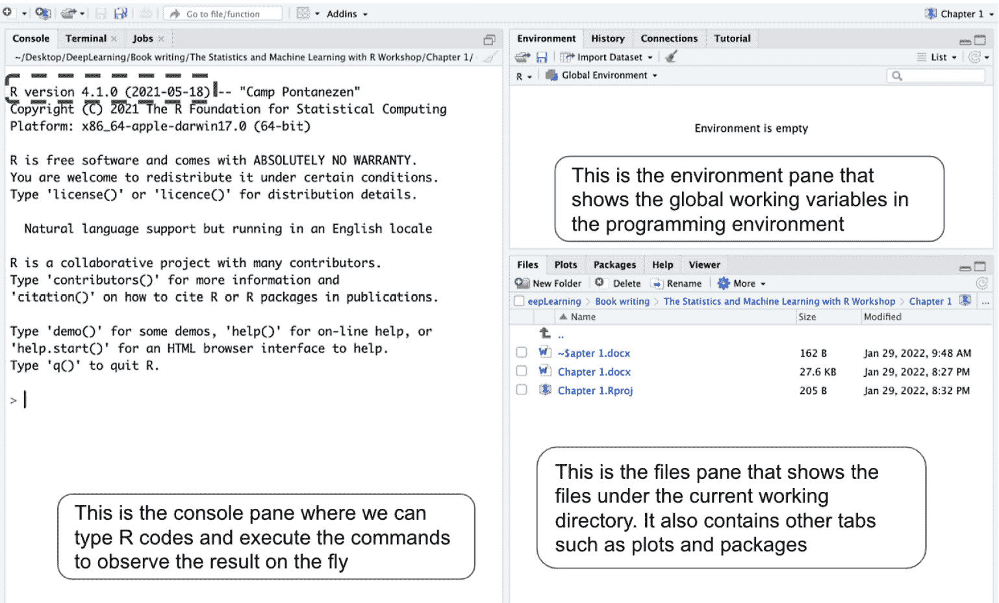
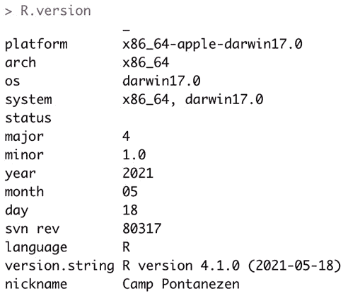
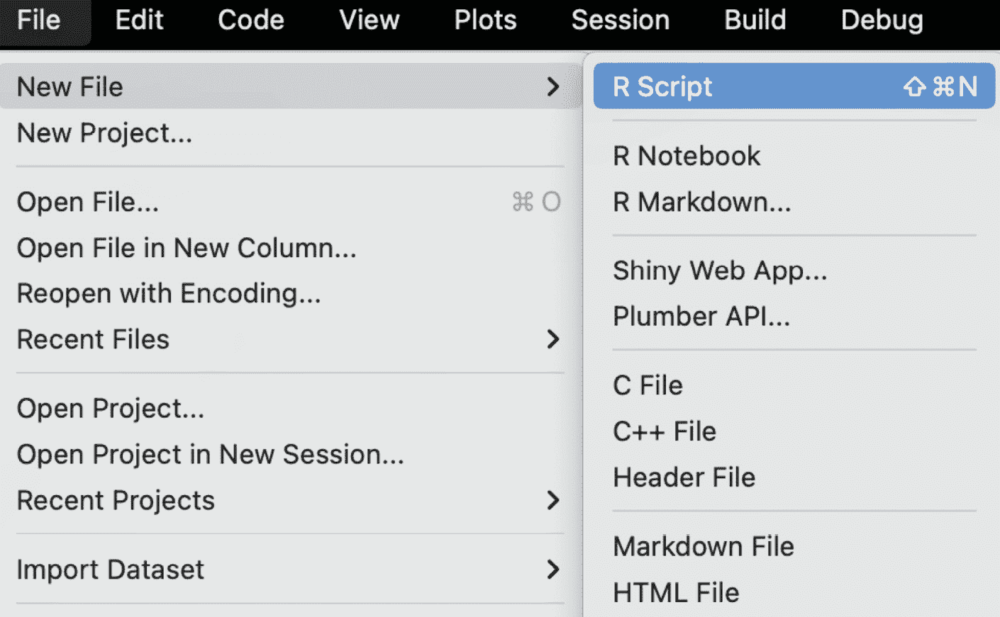
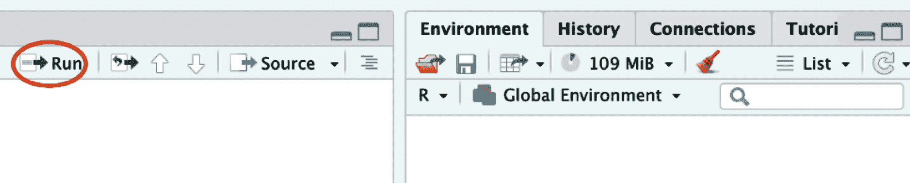
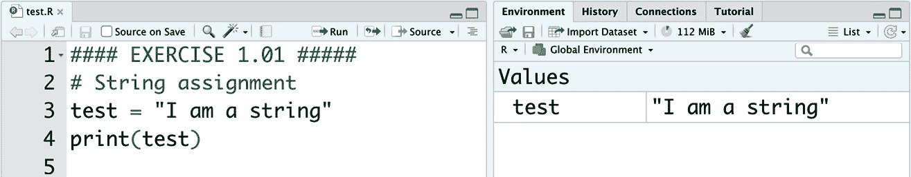
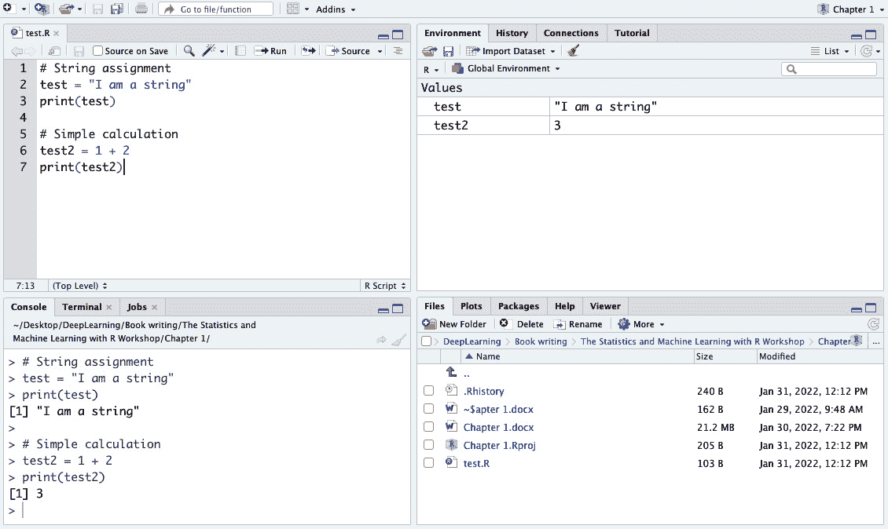
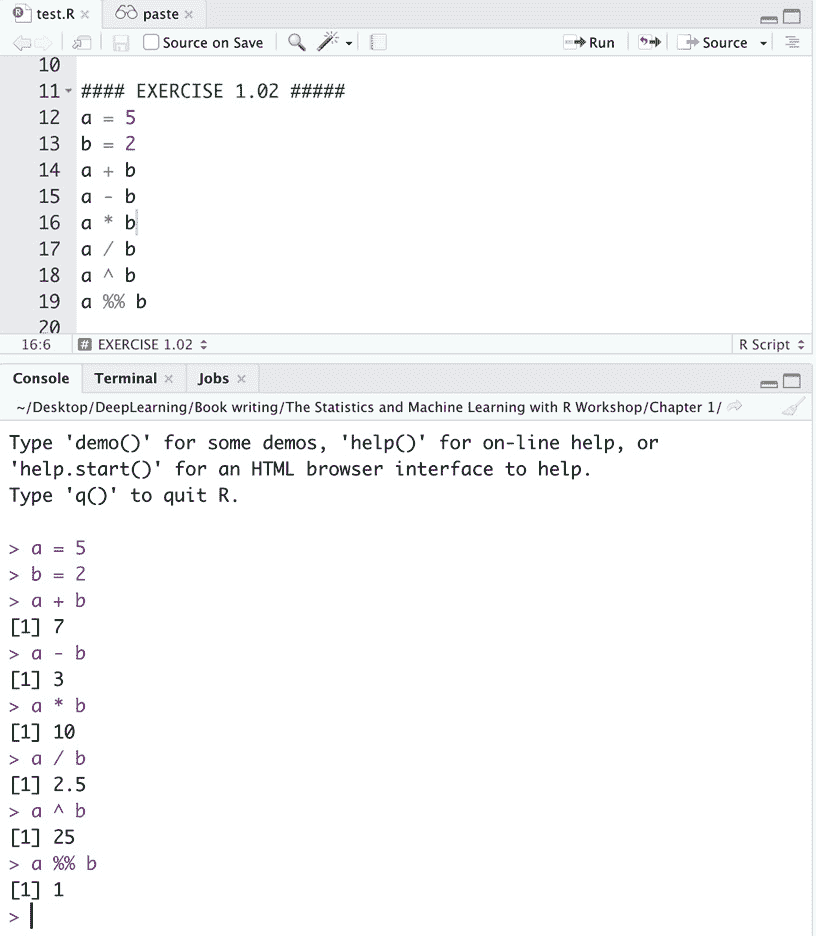
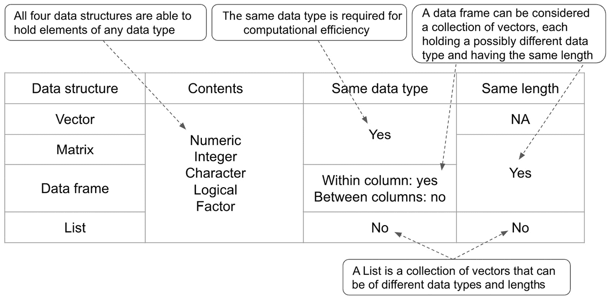
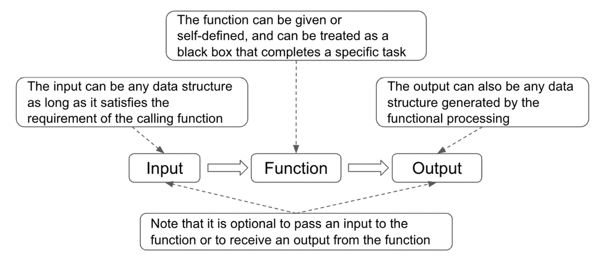

# 第一章：R 语言入门

在本章中，我们将介绍 R 的基础知识，这是最广泛使用的开源统计分析和建模语言。我们将从 RStudio 的介绍开始，如何进行简单的计算，常见的数组和控制逻辑，以及如何在 R 中编写函数。

到本章结束时，您将能够使用 RStudio 中的常见数据结构（如向量、列表和数据框）进行基本的计算，并能够使用不同的方法将这些计算封装在函数中。

在本章中，我们将涵盖以下内容：

+   介绍 R

+   涵盖 R 和 RStudio 的基础知识

+   R 中的常见数据结构

+   R 中的控制逻辑

+   探索 R 中的函数

# 技术要求

要完成本章的练习，您需要具备以下条件：

+   编写本书时 R 的最新版本，即 4.1.2

+   RStudio 桌面版的最新版本，即 2021.09.2+382

本章的所有代码均可在[`github.com/PacktPublishing/The-Statistics-and-Machine-Learning-with-R-Workshop/blob/main/Chapter_1/Chapter_1.R`](https://github.com/PacktPublishing/The-Statistics-and-Machine-Learning-with-R-Workshop/blob/main/Chapter_1/Chapter_1.R)找到。

# 介绍 R

R 是一种流行的开源语言，支持统计分析和建模，它被统计学家广泛用于开发统计模型和进行数据分析。学习者常问的一个问题是如何在 Python 和 R 之间进行选择。对于那些对两者都较新，并且需要一个简单的模型来处理不太大的数据集的人来说，R 会是一个更好的选择。它拥有丰富的资源来支持建模和绘图任务，这些任务是在 Python 出现之前由统计学家开发的。除了其许多现成的图形和统计建模产品外，R 社区也在追赶目前由 Python 社区主导的高级机器学习，如深度学习。

两种语言之间有许多差异，近年来在许多方面也见证了越来越多的趋同。本书旨在为您提供理解和使用 R 语言进行统计和微积分的基本知识。我们希望有一天，您能够从语言本身的内部运作中提取信息，并在进行某些分析时从方法论层面进行思考。在从基础知识培养基本技能之后，具体使用哪种语言将只是个人偏好的问题。为此，R 提供了专门的实用函数，可以自动“转换”Python 代码以在 R 环境中使用，这又给我们提供了一个不必担心选择特定语言的理由。

# 涵盖 R 和 RStudio 的基础知识

如果你是一个初学者，很容易将 R 与 **RStudio** 混淆。简而言之，R 是支持各种后端计算的动力引擎，而 RStudio 是一个方便的工具，用于导航和管理相关的编码和参考资源。具体来说，RStudio 是一个 **IDE**，用户在其中编写 R 代码、执行分析和开发模型，无需过多担心 R 引擎所需的底层物流。RStudio 提供的界面使得开发工作比原始 R 界面更加方便和用户友好。

首先，我们需要在我们的计算机上安装 R，因为 RStudio 在安装时会附带计算能力。我们可以根据所使用的特定操作系统类型，在 [`cloud.r-project.org/`](https://cloud.r-project.org/) 选择相应的 R 版本。然后可以在 [`www.rstudio.com/products/rstudio/download/`](https://www.rstudio.com/products/rstudio/download/) 下载 RStudio 并相应地安装。在安装了这两种软件后启动 RStudio 应用程序，R 引擎将自动检测并使用。让我们通过一个练习来熟悉界面。

### 练习 1.01 – 探索 RStudio

RStudio 提供了一个全面的环境，用于同时处理 R 脚本和探索数据。在这个练习中，我们将查看一个基本示例，说明如何使用 RStudio 编写一个简单的脚本来存储字符串并执行简单的计算。

执行以下步骤以完成此练习：

1.  启动 RStudio 应用程序并观察三个面板：

    +   **控制台** 面板用于执行 R 命令并显示即时结果。

    +   **环境** 面板存储当前 **会话** 中所有的全局变量。

    +   **文件** 面板列出了当前工作目录中的所有文件以及其他标签页，如图 *图 1**.1* 所示。

        注意，R 版本会以消息的形式打印在控制台中（用虚线框突出显示）：



图 1.1 – 首次启动 RStudio 的截图

我们也可以在控制台中输入 `R.version` 来检索有关正在使用的 R 引擎版本的更详细信息，如图 *图 1**.2* 所示。检查 R 版本至关重要，因为不同的版本在运行相同代码时可能会产生不同的结果。



图 1.2 – 在控制台中输入命令以检查 R 版本

1.  在保存文件后构建一个新的 `test.R`。以下图示说明了这一点：



图 1.3 – 创建新的 R 脚本

1.  运行脚本可以通过将光标放在当前行并按 *Cmd* + *Enter*（macOS）或 *Ctrl* + *Enter*（Windows）来实现；或者，可以点击 R 脚本面板顶部的 **运行** 按钮，如图所示：



图 1.4 – 点击运行按钮执行脚本

1.  在脚本编辑面板中输入以下命令，并在控制台以及其他面板中观察输出。首先，我们通过分配 `"I am a string"` 创建一个 `test`。一个变量可以用来存储一个对象，它可以是字符串、数字、数据框，甚至是函数（稍后会有更多介绍）。字符串由字符组成，是 R 中的一种常见数据类型。在脚本中创建的 `test` 变量也会反映在 **环境** 面板中，这是一个方便的检查点，因为我们也可以观察变量中的内容。参见 *图 1**.5* 的说明：

    ```py

    # String assignment
    test = "I am a string"
    print(test)
    ```



图 1.5 – 创建字符串类型变量

我们还把一个简单的加法操作分配给 `test2` 并在控制台中打印出来。这些命令也通过 `#` 符号进行了注释，其中符号后面的内容不会执行，仅用于解释下面的代码。参见 *图 1**.6* 的说明：

```py

# Simple calculation
test2 = 1 + 2
print(test2)
```



图 1.6 – 分配字符串并执行基本计算

1.  我们也可以通过 `ls()` 函数检查环境工作区的内容：

    ```py

    >>> ls()
    "test"  "test2"
    ```

此外，请注意，新创建的 R 脚本也反映在 **文件** 面板中。RStudio 是一个用于处理 R 的优秀一站式 IDE，并将成为本书的编程接口。我们将在更具体的上下文中介绍 RStudio 的更多功能。

注意

将一些值分配给变量的规范方式是通过 `<-` 运算符，而不是像示例中那样使用 `=` 符号。然而，作者选择使用 `=` 符号，因为它在屏幕上输入更快，并且在大多数情况下与 `<-` 符号有相同的效果。

此外，请注意 `[1]` 标记中的输出消息，它表示结果是一个一维输出。除非另有说明，否则我们将忽略这个标记。

上一节的练习提供了一个额外的例子，这是 R 中的一个基本操作。与其他现代编程语言一样，R 也提供了许多标准算术运算符，包括减法 `(-)`、乘法 `(*)`、除法 `(/)`、指数 `(^)` 和取模 `(%%)` 运算符。取模运算符返回除法操作中分子的余数。

让我们通过一个练习来了解一些常见的算术运算。

### 练习 1.02 – R 中的常见算术运算

这个练习将在两个数字之间执行不同的算术运算（加法、减法、乘法、除法、指数和取模）：5 和 2。

在`print()`函数下输入命令，因为直接执行命令也会在控制台高亮显示结果：



图 1.7 – 在 R 中执行常见的算术运算

注意，这些基本的算术运算可以联合形成复杂的运算。在评估由多个运算符组成的复杂运算时，一般规则是使用括号来强制执行特定组件，以符合所需的顺序。这在大多数使用任何编程语言的数值分析中都是适用的。

但是，我们可以在 R 中期望数据采取哪些形式？

## R 中的常见数据类型

R 中有五种最基本的数据类型：**数值型**、**整型**、**字符型**、**逻辑型**和**因子型**。任何复杂的 R 对象都可以分解为属于这五种数据类型之一的单个元素，因此包含一个或多个数据类型。这五种数据类型的定义如下：

+   `1.23`。即使我们最初将其赋值为整数值，变量也被视为数值型。

+   **整型**是一个整数，因此是数值数据类型的一个子集。

+   **字符型**是用于存储字符序列（包括字母、符号甚至数字）以形成字符串或文本的数据类型，由双引号或单引号包围。

+   `TRUE`或`FALSE`。它通常用于条件语句中，以确定条件之后的特定代码是否应该执行。

+   **因子型**是一种特殊的数据类型，用于存储包含有限数量类别（或**水平**）的分类变量，可以是有序或无序的。例如，将学生身高分类为矮、中、高可以表示为因子类型，以编码固有的顺序，这在作为字符类型表示时是不可用的。另一方面，无序列表，如男性和女性，也可以表示为因子类型。

让我们通过一个例子来了解这些不同的数据类型。

### 练习 1.03 – 理解 R 中的数据类型

R 在执行算术运算时对数据类型有严格的规定。一般来说，在评估特定**语句**（一段代码）时，所有变量的数据类型应该相同。对不同数据类型执行算术运算可能会产生错误。在这个练习中，我们将探讨如何检查数据类型以确保类型一致性，以及将数据类型从一种转换为另一种的不同方法：

1.  我们首先创建五个变量，每个变量属于不同的数据类型。使用`class()`函数检查数据类型。注意，我们可以使用分号来分隔不同的操作：

    ```py

    >>> a = 1.0; b = 1; c = "test"; d = TRUE; e = factor("test")
    >>> class(a); class(b); class(c); class(d); class(e)
    "numeric"
    "numeric"
    "character"
    "logical"
    "factor"
    ```

    如预期的那样，即使 `b` 变量最初被分配了一个整数值，它的数据类型也被转换为数值。

1.  对变量进行加法运算。让我们从 `a` 和 `b` 变量开始：

    ```py

    >>> a + b
    2
    >>> class(a + b)
    "numeric"
    ```

    注意，在显示加法结果时忽略了小数点，结果仍然是数值，这可以通过 `class()` 函数验证。

    现在，让我们看看 `a` 和 `c` 之间的加法：

    ```py
    >>> a + c
    Error in a + c : non-numeric argument to binary operator
    ```

    这次，我们在评估加法运算时由于数据类型不匹配而收到了一个错误信息。这是因为 R 中的 `+` 加法运算符是一个二元运算符，它需要接受两个值（操作数）并产生另一个值，所有这些都需要是数值（包括整数）。当两个输入参数中的任何一个不是数值时，错误就会发生。

1.  让我们尝试将 `a` 和 `d` 相加：

    ```py

    >>> a + d
    2
    >>> class(a + d)
    "numeric"
    ```

    令人惊讶的是，结果是和 `a + b` 一样的，这表明布尔变量 `b` 在底层被转换成了一个数值。相应地，通过在变量前添加感叹号得到的布尔值 `FALSE`，在进行与数字的算术运算时会被视为零：

    ```py
    >>> a + !d
    1
    ```

    注意，在需要此类转换以在特定语句中继续进行时，会隐式进行布尔转换。例如，在评估 `a` 是否等于 `d` 时，`d` 被转换为数值 `1`：

    ```py
    >>> a == d
    TRUE
    ```

1.  使用 R 中的 `as.(datatype)` 函数系列转换数据类型。

    例如，`as.numeric()` 函数将输入参数转换为数值，`as.integer()` 返回输入小数的整数部分，`as.character()` 将所有输入（包括数值和布尔值）转换为字符串，而 `as.logical()` 将任何非零数值转换为 `TRUE`，将零转换为 `FALSE`。让我们看几个例子：

    ```py

    >>> class(as.numeric(b))
    "numeric"
    ```

    这表明 `b` 变量已成功转换为数值。请注意，类型转换是 R 中的标准数据处理操作，类型不兼容是常见的错误来源，可能难以追踪：

    ```py
    >>> as.integer(1.8)
    1
    >>> round(1.8)
    2
    ```

    由于 `as.integer()` 只返回输入的整数部分，结果总是“向下取整”到较小的整数。我们可以使用 `round()` 函数将其向上或向下取整，具体取决于小数点后第一位数字的值：

    ```py
    >>> as.character(a)
    "1"
    >>> as.character(d)
    "TRUE"
    ```

    `as.character()` 函数将所有输入参数转换为字符串，如双引号所示，包括数值和布尔值。转换后的值不再保持原始的算术属性。例如，转换为字符的数值不会进行加法运算。同样，转换为字符的布尔值将不再通过逻辑语句进行评估，而是被视为字符：

    ```py
    >>> as.factor(a)
    1
    Levels: 1
    >>> as.factor(c)
    test
    Levels: test
    ```

    由于输入参数中只有一个元素，因此结果的级别数只有 `1`，意味着原始输入本身。

注意

一个被称为 `high`、`medium` 或 `low` 的分类变量在自然中具有固有的顺序，而一个值作为 `male` 或 `female` 的性别变量则没有顺序。

# R 中的常见数据结构

数据结构提供了一种有组织的方式来存储遵循相同或不同类型的数据点。本节将探讨 R 中使用的典型数据结构，包括向量、矩阵、数据框和列表。

## 向量

使用 `c()`。两个向量之间的算术运算与前面早些时候的单个元素示例类似，前提是它们的长度相等。两个向量的元素之间需要有逐个对应关系；如果不是，计算可能会出错。让我们看看一个练习。

### 练习 1.04 – 处理向量

在这个练习中，我们将创建两个长度相同的向量并将它们相加。作为扩展，我们还将尝试使用不同长度的向量进行相同的加法。我们还将对两个向量进行成对比较：

1.  创建两个名为 `vec_a` 和 `vec_b` 的向量，并提取简单的统计摘要，如 `mean` 和 `sum`：

    ```py

    >>> vec_a = c(1,2,3)
    >>> vec_b = c(1,1,1)
    >>> sum(vec_a)
    6
    >>> mean(vec_a)
    2
    ```

    向量的总和和平均值可以使用 `sum()` 和 `mean()` 函数分别生成。我们将在后面介绍更多总结向量的方法。

1.  将 `vec_a` 和 `vec_b` 相加：

    ```py

    >>> vec_a + vec_b
    2 3 4
    ```

    两个向量的加法是逐元素进行的。结果也可以保存到另一个变量中，以便进行进一步处理。那么，向一个向量中添加一个单个元素呢？

1.  将 `vec_a` 和 `1` 相加：

    ```py

    >>> vec_a + 1
    2 3 4
    ```

    在底层，第一个元素被广播到长度由 `vec_a` 决定的向量 `c(1,1,1)` 中，`vec_a` 和 `c(1,1)`：

    ```py

    >>> vec_a + c(1,1)
    2 3 4
    Warning message:
    In vec_a + c(1, 1) :
    longer object length is not a multiple of shorter object length
    ```

    我们仍然得到相同的结果，只是多了一个警告信息，说明较长向量的长度为三不是较短向量长度为二的倍数。请注意这个警告信息。不建议这样做，因为警告可能会变成显式错误，或者在大型程序中成为潜在错误的隐含原因。

1.  接下来，我们将对两个向量进行成对比较：

    ```py

    vec_a > vec_b
    FALSE  TRUE  TRUE
    vec_a == vec_b
    TRUE FALSE FALSE
    ```

    在这里，我们使用了评估运算符，如 `>`（大于）和 `==`（等于），为每一对返回逻辑结果（`TRUE` 或 `FALSE`）。

    注意，R 中有多个逻辑比较运算符。常见的一些包括以下内容：

    +   `<` 表示小于

    +   `<=` 表示小于或等于

    +   `>` 表示大于

    +   `>=` 表示大于或等于

    +   `==` 表示等于

    +   `!=` 表示不等于

除了常见的算术运算外，我们还可能对向量的选定部分感兴趣。我们可以使用方括号来选择向量的特定元素，这与在矩阵或数据框等其他数据结构中选择元素的方式相同。方括号之间是索引，表示要选择哪些元素。例如，我们可以使用 `vec_a[1]` 来选择 `vec_a` 的第一个元素。让我们通过一个练习来看看如何以不同的方式对向量进行子集化。

### 练习 1.05 – 向量子集选择

我们可以将选择索引（从`1`开始）传递进去，以选择向量中的相应元素。我们可以通过`c()`组合函数包装索引，并传递到方括号中以选择多个元素。通过在第一个和最后一个索引之间写冒号，也可以通过简写符号选择多个连续索引。让我们运行不同的向量子集选择方法：

1.  选择`vec_a`中的第一个元素：

    ```py

    >>> vec_a[1]
    1
    ```

1.  选择`vec_a`中的第一个和第三个元素：

    ```py

    >>> vec_a[c(1,3)]
    1 3
    ```

1.  选择`vec_a`中的所有三个元素：

    ```py

    >>> vec_a[c(1,2,3)]
    1 2 3
    ```

    以这种方式选择多个元素不太方便，因为我们需要输入每个索引。当索引是连续的时，一个很好的简写技巧是使用由冒号分隔的起始和结束索引。例如，`1:3`与`c(1,2,3)`相同：

    ```py
    >>> vec_a[1:3]
    1 2 3
    ```

    我们还可以通过在方括号内添加条件语句作为选择条件来执行更复杂的子集选择。例如，前面引入的逻辑评估返回`True`或`False`。在方括号中标记为`true`的索引的元素将被选中。让我们看一个例子。

1.  在`vec_a`中选择大于`vec_b`中相应元素的元素：

    ```py

    >>> vec_a[vec_a > vec_b]
    2 3
    ```

    结果包含最后两个元素，因为只有第二个和第三个索引被设置为`true`。

## 矩阵

与向量一样，**矩阵**是一个二维数组，由相同数据类型的元素集合组成，这些元素按固定数量的行和列排列。使用仅包含相同数据类型的数据结构通常更快，因为程序不需要区分不同类型的数据。这使得矩阵在科学计算中成为一种流行的数据结构，尤其是在涉及大量计算的优化过程中。让我们熟悉矩阵，包括创建、索引、子集和扩展矩阵的不同方法。

### 练习 1.06 – 创建矩阵

在 R 中创建矩阵的标准方法是调用`matrix()`函数，我们需要提供三个输入参数：

+   需要填充到矩阵中的元素

+   矩阵的行数

+   填充方向（按行或按列）

我们还将重命名矩阵的行和列：

1.  使用`vec_a`和`vec_b`创建一个名为`mtx_a`的矩阵：

    ```py

    >>> mtx_a = matrix(c(vec_a,vec_b), nrow=2, byrow=TRUE)
    >>> mtx_a
         [,1] [,2] [,3]
    [1,]    1    2    3
    [2,]    1    1    1
    ```

    首先，通过`c()`函数将输入向量`vec_a`和`vec_b`组合成一个长向量，然后按顺序排列成两行（`nrow=2`），按行排列（`byrow=TRUE`）。您可以自由尝试不同的维度配置，例如在创建矩阵时设置三行两列。

    注意输出中的行和列名称。行通过方括号中的第一个索引进行索引，而第二个索引列。我们还可以按如下方式重命名矩阵。

1.  通过`rownames()`和`colnames()`函数重命名矩阵`mtx_a`：

    ```py

    >>> rownames(mtx_a) = c("r1", "r2")
    >>> colnames(mtx_a) = c("c1", "c2", "c3")
    >>> mtx_a
       c1 c2 c3
    r1  1  2  3
    r2  1  1  1
    ```

让我们看看如何从矩阵中选择元素。

### 练习 1.07 – 矩阵的子集

我们仍然可以使用方括号来选择一个或多个矩阵元素。冒号简写技巧也适用于矩阵子集：

1.  选择`mtx_a`矩阵的第一行和第二列的元素：

    ```py

    >>> mtx_a[1,2]
    2
    ```

1.  选择`mtx_a`矩阵中所有行的最后两列的所有元素：

    ```py

    >>> mtx_a[1:2,c(2,3)]
       c2 c3
    r1  2  3
    r2  1  1
    ```

1.  选择`mtx_a`矩阵第二行的所有元素：

    ```py

    >>> mtx_a[2,]
    c1 c2 c3
     1  1  1
    Selecting elements by matching the row name using a conditional evaluation statement offers a more precise way of subsetting the matrix, especially when counting the exact index becomes troublesome. Name-based indexing also applies to columns.
    ```

1.  选择`mtx_a`矩阵的第三行：

    ```py

    >>> mtx_a[,3]
    r1 r2
     3  1
    >>> mtx_a[,colnames(mtx_a)=="c3"]
    r1 r2
     3  1
    ```

    因此，我们有多种方法从矩阵中选择感兴趣的特定元素。

与向量相比，处理矩阵需要类似的算术运算。在下一个练习中，我们将探讨按行和列总结矩阵以及执行基本操作，如加法和乘法。

### 练习 1.08 – 矩阵的算术运算

让我们从创建一个新的矩阵开始：

1.  创建另一个名为`mtx_b`的矩阵，其元素是`mtx_a`中元素的两倍：

    ```py

    >>> mtx_b = mtx_a * 2
    >>> mtx_b
       c1 c2 c3
    r1  2  4  6
    r2  2  2  2
    ```

    除了乘法之外，所有标准算术运算符（如`+`、`-`和`/`）都以类似元素级的方式应用于矩阵，并依赖于相同的广播机制。相同大小的两个矩阵之间的操作也是按元素进行的。

1.  将`mtx_a`除以`mtx_b`：

    ```py

    >>> mtx_a / mtx_b
        c1  c2  c3
    r1 0.5 0.5 0.5
    r2 0.5 0.5 0.5
    ```

1.  使用`rowSums()`、`colSums()`、`rowMeans()`和`colMeans()`分别计算`mtx_a`的行和列总和以及平均值：

    ```py

    >>> rowSums(mtx_a)
    r1 r2
     6  3
    >>> colSums(mtx_a)
    c1 c2 c3
     2  3  4
    >>> rowMeans(mtx_a)
    r1 r2
     2  1
    >>> colMeans(mtx_a)
    c1  c2  c3
    1.0 1.5 2.0
    ```

在运行优化过程时，我们经常需要保存一些中间指标，如模型损失和准确度，以进行诊断。这些指标可以通过逐渐将新数据附加到当前矩阵中保存为矩阵形式。让我们看看如何按行和列扩展矩阵。

### 练习 1.09 – 扩展矩阵

通过`cbind()`函数向矩阵中添加一个或多个列，该函数按列合并新的矩阵或向量列。同样，可以通过`rbind()`函数按行连接额外的矩阵或向量：

1.  按列将`mtx_b`附加到`mtx_a`：

    ```py

    >>> cbind(mtx_a, mtx_b)
       c1 c2 c3 c1 c2 c3
    r1  1  2  3  2  4  6
    r2  1  1  1  2  2  2
    ```

    我们可能需要重命名列，因为其中一些列有重叠。这同样适用于以下按行连接。

1.  按行将`mtx_b`附加到`mtx_a`：

    ```py

    >>> rbind(mtx_a, mtx_b)
       c1 c2 c3
    r1  1  2  3
    r2  1  1  1
    r1  2  4  6
    r2  2  2  2
    ```

所以，我们已经看到了矩阵的操作。接下来是数据框如何？

## 数据框

**数据框**是一种标准的数据结构，其中变量存储为列，观测值存储为对象中的行。它是矩阵的高级版本，因为每个列的元素可以有不同的数据类型。

R 引擎自带一些默认数据集，存储为数据框。在下一个练习中，我们将探讨不同的方法来检查和理解数据框的结构。

### 练习 1.10 – 理解数据框

数据框是一种著名的矩形形状数据结构，类似于 Excel。让我们以 R 中的默认数据集为例进行考察：

1.  加载`iris`数据集：

    ```py

    >>> data("iris")
    >>> dim(iris)
    150   5
    ```

    使用 `dim()` 函数检查维度表明 `iris` 数据集包含 150 行和五列。我们可以通过查看数据集的前几行和最后几行（观测值）来初步了解其内容。

1.  使用 `head()` 和 `tail()` 查看前五行和后五行：

    ```py

    >>> head(iris)
      Sepal.Length Sepal.Width Petal.Length Petal.Width Species
    1          5.1         3.5          1.4         0.2  setosa
    2          4.9         3.0          1.4         0.2  setosa
    3          4.7         3.2          1.3         0.2  setosa
    4          4.6         3.1          1.5         0.2  setosa
    5          5.0         3.6          1.4         0.2  setosa
    6          5.4         3.9          1.7         0.4  setosa
    >>> tail(iris)
        Sepal.Length Sepal.Width Petal.Length Petal.Width   Species
    145          6.7         3.3          5.7         2.5 virginica
    146          6.7         3.0          5.2         2.3 virginica
    147          6.3         2.5          5.0         1.9 virginica
    148          6.5         3.0          5.2         2.0 virginica
    149          6.2         3.4          5.4         2.3 virginica
    150          5.9         3.0          5.1         1.8 virginica
    ```

    注意，行名默认按整数顺序索引，从一开始。前四列是数值型，最后一列是字符型（或因子）。我们可以更系统地查看数据框的结构。

1.  使用 `str()` 查看数据集 `iris` 的结构：

    ```py

    >>> str(iris)
    'data.frame':    150 obs. of  5 variables:
     $ Sepal.Length: num  5.1 4.9 4.7 4.6 5 5.4 4.6 5 4.4 4.9 ...
     $ Sepal.Width : num  3.5 3 3.2 3.1 3.6 3.9 3.4 3.4 2.9 3.1 ...
     $ Petal.Length: num  1.4 1.4 1.3 1.5 1.4 1.7 1.4 1.5 1.4 1.5 ...
     $ Petal.Width : num  0.2 0.2 0.2 0.2 0.2 0.4 0.3 0.2 0.2 0.1 ...
     $ Species     : Factor w/ 3 levels "setosa","versicolor",..: 1 1 1 1 1 1 1 1 1 1 ...
    ```

    `str()` 函数总结了数据框的结构，包括观测值和变量的总数，变量名称的完整列表，数据类型，以及前几行观测值。如果列是因子，还会显示类别（水平）的数量。

    我们也可以通过将相同长度的向量作为列传递给 `data.frame()` 函数来创建数据框。

1.  创建一个名为 `df_a` 的数据框，其中包含两列，分别对应 `vec_a` 和 `vec_b`：

    ```py

    >>> df_a = data.frame("a"=vec_a, "b"=vec_b)
    >>> df_a
      a b
    1 1 1
    2 2 1
    3 3 1
    ```

选择数据框的元素可以与矩阵选择类似的方式进行。其他如 `subset()` 函数等使选择更加灵活。让我们通过一个例子来了解。

### 练习 1.11 – 在数据框中选择元素

在这个练习中，我们将首先查看选择特定元素集的不同方法，然后介绍 `subset()` 函数以执行自定义条件选择：

1.  选择 `df_a` 数据框的第二列：

    ```py

    >>> df_a[,2]
    1 1 1
    ```

    行级索引留空表示将选择所有行。我们也可以通过引用所有行级索引来明确表示：

    ```py
    >>> df_a[1:3,2]
    1 1 1
    Alternatively, we can use the shortcut `$` sign to reference the column name directly:

    ```

    >>> df_a$b

    1 1 1

    ```py

    The `subset()` function provides an easy and structured way to perform row-level filtering and column-level selection. Let’s see how it works in practice.
    ```

1.  选择 `df_a` 中列 `a` 大于两的行：

    ```py

    >>> subset(df_a, a>2)
      a b
    3 3 1
    ```

    注意，行索引三也显示为输出的一部分。

    我们可以直接在 `subset()` 函数的上下文中使用列 `a`，这样我们就不需要使用 `$` 符号了。我们也可以通过传递列名给 `select` 参数来选择列。

1.  在 `df_a` 中选择列 `a` 大于两的列 `b`：

    ```py

    >>> subset(df_a, a>2, select="b")
      b
    3 1
    ```

数据分析中的另一个典型操作是对数据框的一个或多个变量进行排序。让我们看看在 R 中它是如何工作的。

### 练习 1.12 – 排序向量和数据框

`order()` 函数可以用来返回输入向量中元素的排名位置，然后可以通过更新索引对这些元素进行排序：

1.  在 `vec_c` 中创建 `c(5,1,10)` 向量，并按升序排序：

    ```py

    >>> vec_c = c(5,1,10)
    >>> order(vec_c)
    2 1 3
    >>> vec_c[order(vec_c)]
    1  5 10
    ```

    由于 `vec_c` 中的最小元素是 `1`，相应的排名位置是 `1`。同样，`5` 被设置为第二排名，`10` 被设置为第三和最高排名。然后使用排名位置重新排列和排序原始向量，就像我们通过 `order()` 函数按默认升序对元素进行排序一样。如果我们想按降序排序呢？我们只需在输入向量中添加一个负号即可。

1.  按列 `a` 降序排序 `df_a` 数据框：

    ```py

    >>> df_a[order(-df_a$a),]
      a b
    3 3 1
    2 2 1
    1 1 1
    ```

数据框将是我们在本书中将主要使用的数据结构。让我们看看最后一个也是最复杂的数据结构：列表。

## 列表

**列表**是一种灵活的数据结构，可以容纳不同类型的数据（数值、整数、字符、逻辑、因子，甚至列表本身），每个可能具有不同的长度。这是我们迄今为止引入的最复杂结构，以结构化的方式收集各种对象。为了回顾，让我们在 *图 1**.8* 中比较四种数据结构的内容、数据类型和长度。一般来说，所有四种结构都可以存储任何数据类型的元素。向量（一维数组）和矩阵（二维数组）要求内容是同质数据类型。数据框包含一个或多个数据类型可能不同的向量，而列表可以包含不同数据类型的条目。矩阵和数据框遵循矩形形状，因此要求每列的长度相同。然而，列表中的条目可以具有任意长度（受内存限制），彼此不同。



图 1.8 – 比较四种不同数据结构的内容、数据类型和长度

让我们看看如何创建一个列表。

### 练习 1.13 – 创建列表

在这个练习中，我们将通过不同的方式操作列表，包括创建和重命名列表，以及访问、添加和删除列表中的元素：

1.  使用之前的 `a`、`vec_a` 和 `df_a` 变量创建一个列表：

    ```py

    >>> ls_a = list(a, vec_a, df_a)
    >>> ls_a
    [[1]]
    [1] 1
    [[2]]
    [1] 1 2 3
    [[3]]
      a b
    1 1 1
    2 2 1
    3 3 1
    ```

    输出显示列表元素通过双方括号索引，可以用来访问列表中的条目。

1.  访问列表 `ls_a` 中的第二个条目：

    ```py

    >>> ls_a[[2]]
    1 2 3
    ```

    默认索引也可以重命名，以便通过名称选择条目。

1.  根据原始名称重命名列表并访问 `vec_a` 变量：

    ```py

    >>> names(ls_a) <- c("a", "vec_a", "df_a")
    ls_a
    $a
    [1] 1
    $vec_a
    [1] 1 2 3
    $df_a
      a b
    1 1 1
    2 2 1
    3 3 1
    >>> ls_a[['vec_a']]
    1 2 3
    >>> ls_a$vec_a
    1 2 3
    ```

    我们可以通过使用方括号或 `$` 符号中的名称来访问列表中的特定条目。

1.  在 `ls_a` 列表中添加一个名为 `new_entry` 的新条目，内容为 `"test"`：

    ```py

    >>> ls_a[['new_entry']] = "test"
    >>> ls_a
    $a
    [1] 1
    $vec_a
    [1] 1 2 3
    $df_a
      a b
    1 1 1
    2 2 1
    3 3 1
    $new_entry
    [1] "test"
    ```

    结果显示 `"test"` 现已添加到 `ls_a` 的最后一个条目。我们还可以通过将其赋值为 `NULL` 来删除特定的条目。

1.  从 `ls_a` 中删除名为 `df_a` 的条目：

    ```py

    >>> ls_a[['df_a']] = NULL
    >>> ls_a
    $a
    [1] 1
    $vec_a
    [1] 1 2 3
    $new_entry
    [1] "test"
    ```

    命名为 `df_a` 的条目现在已成功从列表中删除。我们还可以更新列表中的现有条目。

1.  将名为 `vec_a` 的条目更新为 `c(1,2)`：

    ```py

    >>> ls_a[['vec_a']] = c(1,2)
    >>> ls_a
    $a
    [1] 1
    $vec_a
    [1] 1 2
    $new_entry
    [1] "test"
    ```

    命名为 `vec_a` 的条目现在已成功更新。

列表结构的灵活性和可扩展性使其成为存储异构数据元素的流行选择，类似于 Python 中的字典。在下一节中，我们将通过了解 R 中的控制逻辑来扩展我们的知识库，这使我们编写长程序时具有更大的灵活性和精确度。

# R 中的控制逻辑

关系和逻辑运算符帮助我们比较语句，当我们向程序添加逻辑时。我们还可以通过通过循环重复遍历一系列操作来评估多个条件语句，从而增加复杂性。本节将介绍构成条件语句构建块的基本关系和逻辑运算符。

## 关系运算符

我们之前简要介绍了几个关系运算符，如`>=`和`==`。本节将详细介绍标准关系运算符的使用。让我们看看一些例子。

### 练习 1.14 – 练习使用标准关系运算符

关系运算符允许我们比较两个量，并获得比较的单个结果。我们将学习以下步骤，了解如何在 R 中表达和使用标准关系运算符：

1.  使用等式运算符（`==`）执行以下评估并观察输出：

    ```py

    >>> 1 == 2
    FALSE
    >>> "statistics" == "calculus"
    FALSE
    >>> TRUE == TRUE
    TRUE
    >>> TRUE == FALSE
    FALSE
    ```

    等式运算符通过严格评估两侧（包括逻辑数据）的两个输入参数来执行，只有当它们相等时才返回`TRUE`。

1.  使用不等式运算符（`!=`）执行相同的评估并观察输出：

    ```py

    >>> 1 != 2
    TRUE
    >>> "statistics" != "calculus"
    TRUE
    >>> TRUE != TRUE
    FALSE
    >>> TRUE != FALSE
    TRUE
    ```

    不等式运算符与等式运算符正好相反。

1.  使用大于和小于运算符（`>`和`<`）执行以下评估并观察输出：

    ```py

    >>> 1 < 2
    TRUE
    >>> "statistics" > "calculus"
    TRUE
    >>> TRUE > FALSE
    TRUE
    ```

    在第二次评估中，字符数据之间的比较遵循从最左侧字符开始的两个字符串的成对字母顺序。在这种情况下，字母`s`排在`c`之后，并且被编码为更高数值的数字。在第三个例子中，`TRUE`被转换为 1，`FALSE`被转换为 0，因此返回一个逻辑值`TRUE`。

1.  使用大于等于运算符（`>=`）和小于等于运算符（`<=`）执行以下评估并观察输出：

    ```py

    >>> 1 >= 2
    FALSE
    >>> 2 <= 2
    TRUE
    ```

    注意，这些运算符由两个条件评估通过`OR`运算符（`|`）连接而成。因此，我们可以将其分解为括号中的两个评估，从而得到与之前相同的输出：

    ```py
    >>> (1 > 2) | (1 == 2)
    FALSE
    >>> (2 < 2) | (2 == 2)
    TRUE
    ```

    关系运算符也适用于我们之前遇到的向量，例如行级筛选以子集化数据框。

1.  使用大于运算符比较`vec_a`与`1`：

    ```py

    >>> vec_a > 1
    FALSE  TRUE  TRUE
    ```

    我们可以通过分别比较每个元素并使用`c()`函数组合结果来得到相同的结果。

## 逻辑运算符

`AND`（`&`）、`OR`（`|`）和`NOT`（`!`）。`AND`运算符仅在两个操作数都为`TRUE`时返回`TRUE`，而`OR`运算符如果至少有一个操作数为`TRUE`就返回`TRUE`。另一方面，`NOT`运算符将评估结果翻转至相反。

让我们通过一个练习来了解这些逻辑运算符的使用。

### 练习 1.15 – 练习使用标准逻辑运算符

我们将从最广泛使用的控制逻辑`AND`运算符开始，确保只有在多个条件同时满足时才会执行特定操作：

1.  使用 `AND` 运算符执行以下评估并观察输出：

    ```py

    >>> TRUE & FALSE
    FALSE
    >>> TRUE & TRUE
    TRUE
    >>> FALSE & FALSE
    FALSE
    >>> 1 > 0 & 1 < 2
    TRUE
    ```

    结果显示，需要满足两个条件才能获得 `TRUE` 输出。

1.  使用 `OR` 运算符执行以下评估并观察输出：

    ```py

    >>> TRUE | FALSE
    TRUE
    >>> TRUE | TRUE
    TRUE
    >>> FALSE | FALSE
    FALSE
    >>> 1 < 0 | 1 < 2
    TRUE
    ```

    结果显示，如果至少有一个条件评估为 `TRUE`，则输出为 `TRUE`。

1.  使用 `NOT` 运算符执行以下评估并观察输出：

    ```py

    >>> !TRUE
    FALSE
    >>> !FALSE
    TRUE
    >>> !(1<0)
    TRUE
    ```

    在第三个例子中，评估与 `1 >= 0` 相同，返回 `TRUE`。因此，`NOT` 运算符在感叹号之后反转评估结果。

    这些运算符也可以用于在向量中执行成对逻辑评估。

1.  执行以下评估并观察输出：

    ```py

    >>> c(TRUE, FALSE) & c(TRUE, TRUE)
    TRUE FALSE
    >>> c(TRUE, FALSE) | c(TRUE, TRUE)
    TRUE TRUE
    >>> !c(TRUE, FALSE)
    FALSE  TRUE
    ```

此外，`AND` (`&&`) 和 `OR` (`||`) 逻辑运算符也有长格式。与之前短格式中的逐元素比较不同，长格式仅用于评估每个输入向量的第一个元素，并且这种评估仅继续到结果确定为止。换句话说，长格式在评估包含多个元素的向量时仅返回单个结果。它在现代 R 编程控制流中应用最广泛，尤其是在条件 `if` 语句中。

让我们看看以下示例：

```py

>>> c(TRUE, FALSE) && c(FALSE, TRUE)
FALSE
>>> c(TRUE, FALSE) || c(FALSE, TRUE)
TRUE
```

两次评估都基于每个向量的第一个元素。也就是说，在两次评估中，每个向量的第二个元素都被忽略。这提供了计算上的好处，尤其是在向量很大时。由于如果可以通过评估第一个元素获得最终结果，就没有必要继续评估，因此我们可以安全地丢弃其余部分。

在第一次使用 `&&` 进行评估时，比较两个向量的第一个元素（`TRUE` 和 `FALSE`）返回 `FALSE`，而继续比较第二个元素也将返回 `FALSE`，因此第二次比较是不必要的。在第二次使用 `||` 进行评估时，比较第一个元素（`TRUE | FALSE`）给出 `TRUE`，这样就无需进行第二次比较，因为结果始终会被评估为 `TRUE`。

## 条件语句

`if-else` 语句用于组合多个逻辑运算符的结果并决定后续动作的流程。它通常用于增加大型 R 程序的复杂性。`if-else` 语句遵循以下一般结构，其中首先验证评估条件。如果验证返回 `TRUE`，则执行 `if` 子句中的花括号内的表达式，其余代码将被忽略。否则，将执行 `else` 子句中的表达式：

```py

if(evaluation condition){
some expression
} else {
other expression
}
```

让我们通过一项练习来看看如何使用 `if-else` 控制语句。

### 练习 1.16 – 练习使用条件语句

时间进行另一项练习！让我们练习使用条件语句：

1.  初始化一个值为 `1` 的 `x` 变量，并编写一个 `if-else` 条件来决定输出消息。如果 `x` 大于零，则打印出 `"positive"`，否则打印 `"not positive"`：

    ```py

    >>> x = 1
    >>> if(x > 0){
    >>>	print("positive")
    >>> } else {
    >>> 	print("not positive")
    >>> }
    "positive"
    ```

    `if` 子句中的条件评估为 `TRUE`，并且其中的代码被执行，在控制台打印出 `"positive"`。注意，`else` 分支是可选的，并且如果只想对输入进行一个检查，则可以将其删除。额外的 `if-else` 控制也可以嵌入到一个分支中。

    我们还可以使用 `if-else` 条件控制语句添加额外的分支，其中中间部分可以重复多次。

1.  初始化一个值为 `0` 的 `x` 变量，并编写一个控制流程来确定并打印其符号：

    ```py

    >>> x = 0
    >>> if(x > 0){
    >>>  print("positive")
    >>> } else if(x == 0){
    >>>  print("zero")
    >>> } else {
    >>>  print("negative")
    >>> }
    "zero"
    ```

    由于条件是依次评估的，第二个语句返回 `TRUE` 并因此打印出 `"zero"`。

## 循环

一个 `if` 语句；只有当条件评估为 `TRUE` 时，代码才会被执行。唯一的区别是，循环会继续迭代执行代码，只要条件为 `TRUE`。有两种类型的循环：`while` 循环和 `for` 循环。`while` 循环用于迭代次数未知的情况，其终止依赖于评估条件或使用 `break` 控制语句在运行表达式中的分离条件。`for` 循环用于迭代次数已知的情况。

`while` 循环遵循以下一般结构，其中首先评估 `condition 1` 以确定应该执行的外部花括号内的表达式。有一个（可选的）`if` 语句来决定是否根据 `condition 2` 需要终止 `while` 循环。这两个条件控制 `while` 循环的终止，只要任一条件评估为 `TRUE`，循环就会退出执行。在 `if` 子句中，`condition 2` 可以放置在 `while` 块内的任何位置：

```py

while(condition 1){
some expression
if(condition 2){
        break
}
}
```

注意，`while` 语句中的 `condition 1` 需要在某个时刻为 `FALSE`；否则，循环将无限期地继续，这可能导致 RStudio 中的会话过期错误。

让我们通过一个练习来看看如何使用 `while` 循环。

### 练习 1.17 – 练习 while 循环

让我们尝试一下 `while` 循环：

1.  初始化一个值为 `2` 的 `x` 变量，并编写一个 `while` 循环。如果 `x` 小于 `10`，则平方它并打印其值：

    ```py

    >>> x = 2
    >>> while(x < 10){
    >>>   x = x²
    >>>   print(x)
    >>> }
    4
    16
    ```

    `while` 循环执行了两次，将 `x` 的值从 `2` 增加到 `16`。在第三次评估中，`x` 大于 10，条件语句评估为 `FALSE`，因此退出循环。我们也可以打印出 `x` 来双重检查其值：

    ```py
    >>> x
    16
    ```

1.  在平方之后添加一个条件，如果 `x` 大于 `10` 则退出循环：

    ```py

    >>> x = 2
    >>> while(x < 10){
    >>>   x = x²
    >>>   if(x > 10){
    >>>     break
    >>>  }
    >>>   print(x)
    >>> }
    4
    ```

    这次只打印出一个数字。原因是当`x`变为`16`时，`if`条件评估为`TRUE`，从而触发`break`语句退出`while`循环并忽略`print()`语句。让我们验证`x`的值：

    ```py
    >>> x
    16
    ```

让我们看看`for`循环，它假设以下一般结构。在这里，`var`是一个用于按顺序引用`sequence`内容的占位符，`sequence`可以是一个向量、一个列表或其他数据结构：

```py

for(var in sequence){
some expression
}
```

对于`sequence`中的每个唯一变量，相同的表达式将被评估，除非触发一个显式的`if`条件，使用`break`退出循环，或者跳过剩余的代码并立即跳转到下一个迭代使用`next`。让我们通过一个练习来了解这些概念。

### 练习 1.18 – 练习使用 for 循环

接下来，让我们尝试`for`循环：

1.  创建一个向量来存储三个字符串（`statistics`、`and`和`calculus`），并打印出每个元素：

    ```py

    >>> string_a = c("statistics","and","calculus")
    >>> for(i in string_a){
    >>>   print(i)
    >>> }
    "statistics"
    "and"
    "calculus"
    ```

    在这里，`for`循环通过在每个迭代中将元素值按顺序分配给`i`变量来遍历`string_a`向量中的每个元素。我们也可以选择使用向量索引进行迭代，如下所示：

    ```py
    >>> for(i in 1:length(string_a)){
    >>>   print(string_a[i])
    >>> }
    "statistics"
    "and"
    "calculus"
    ```

    在这里，我们创建了一系列从`1`到向量长度的整数索引，并将它们分配给每个迭代的`i`变量，然后使用它来引用`string_a`向量中的元素。这是一种更灵活和多变的方式来引用向量中的元素，因为我们也可以使用相同的索引来引用其他向量。直接引用元素，如前一种方法，更简洁、更易读。然而，它缺乏没有循环索引的控制和灵活性。

1.  添加一个条件，如果当前元素是`"and"`，则退出循环：

    ```py

    >>> for(i in string_a){
    >>>   if(i == "and"){
    >>>     break
    >>>   }
    >>>   print(i)
    >>> }
    "statistics"
    ```

    当`i`的当前值是`"and"`时，满足`if`条件将退出循环。

1.  添加一个条件，如果当前元素是`"and"`，则跳到下一个迭代：

    ```py

    >>> for(i in string_a){
    >>>   if(i == "and"){
    >>>    next
    >>>   }
    >>>  print(i)
    >>> }
    "statistics"
    "calculus"
    ```

    当下一个语句被评估时，下面的`print()`函数将被忽略，程序跳到下一个迭代，只打印出`"statistics"`和`"calculus"`以及`"``and"`元素。

到目前为止，我们已经涵盖了 R 语言中最基础的构建块。现在，我们准备进入最后一个也是最广泛使用的构建块：函数。

# 探索 R 语言中的函数

我们在之前的练习中使用过的`sum()`和`mean()`函数。我们也可以定义自己的函数，作为处理给定输入信号并产生输出的接口。参见*图 1**.9*以了解说明：



图 1.9 – 函数工作流程的说明

可以使用`function`关键字创建一个函数，其格式如下：

```py

function_name = function(argument_1, argument_2, …){
  some statements
}
```

一个函数可以分解为以下部分：

+   **函数名**：在 R 环境中注册并存储的函数对象的名称。我们使用此名称后跟一对括号，并在括号内（可选）输入参数来调用函数。

+   **输入参数**：在调用函数时用于接收输入值的占位符。参数可以是可选的（已分配默认值）或必选的（未分配默认值）。将所有参数都设置为可选的等同于函数不需要必选输入参数。然而，我们需要向必选参数传递一个特定值才能调用函数。此外，如果有的话，可选参数也可以出现在必选参数之后。

+   **函数体**：这是执行主要语句以完成特定操作并实现函数目的的区域。

+   `return()` 函数。

让我们通过一个创建用户定义函数的练习来了解。

### 练习 1.19 – 创建用户定义的函数

现在，让我们试试看：

1.  创建一个名为 `test_func` 的函数，用于接收输入并打印出 `"(input) is fun"`。允许选择将消息打印为大写：

    ```py

    test_func = function(x, cap=FALSE){
      msg = paste(x,"is fun!")
      if(cap){
        msg = toupper(msg)
      }
      return(msg)
    }
    ```

    注意，我们使用 `=` 符号而不是 `<-` 来将函数对象赋值给 `test_func` 变量。然而，在 R 中创建函数时，后者更为常见。在输入中，我们创建了两个参数：必选参数 `x`，用于接收要打印的消息，以及可选参数 `cap`，用于确定消息是否需要转换为大写。可选参数意味着用户可以选择不提供任何内容给此参数，以使用默认设置（即小写消息），或者通过显式传递一个值来覆盖默认行为。

    在函数体中，我们首先创建一个 `msg` 变量，并通过调用 `paste()` 函数（一个用于连接两个输入参数的内置函数）来分配消息内容。如果 `cap` 参数为 `FALSE`，则 `if` 语句将评估为 `FALSE`，`msg` 将直接作为函数的输出返回。否则，将触发 `if` 子句中的语句，使用 `toupper()` 函数（R 中的另一个内置函数）将 `msg` 变量转换为大写。

1.  让我们看看以不同方式调用函数后会发生什么：

    ```py

    >>> test_func("r")
    "r is fun!"
    >>> test_func("r",cap=TRUE)
    "R IS FUN!"
    >>> test_func()
    Error in paste(x, "is fun!") : argument "x" is missing, with no default
    ```

    前两种情况按预期工作。在第三种情况下，我们没有为定义为必选参数的 `x` 参数提供任何值。这导致错误，并未能调用函数。

# 摘要

在本章中，我们介绍了 R 语言的基本构建块，包括如何利用和导航 RStudio IDE，基本的算术运算（加法、减法、乘法、除法、指数和取模），常见的数据结构（向量、矩阵、数据框和列表），控制逻辑，包括关系运算符（`>`、`==`、`<`、`>=`、`<=`和`!=`）和逻辑运算符（`&`、`|`、`!`、`&&`和`||`），使用`ifelse`的条件语句，`for`和`while`循环，以及最后，R 语言中的函数。理解这些基本方面将极大地促进我们在后续章节中的学习，因为我们将逐渐引入更具挑战性的主题。

在下一章中，我们将介绍`dplyr`，这是数据处理和操作中最广泛使用的库之一。利用`dplyr`提供的各种实用函数将使处理大多数数据处理任务变得更加容易。
