# 第六章：使用 R Markdown 进行有效报告

上一章介绍了不同的绘图技术，所有这些都是静态的。在本章中，我们将更进一步，讨论如何使用 **R** **Markdown** 一致地生成图表和表格。

到本章结束时，您将学习到 R Markdown 报告的基础知识，包括如何添加、微调和自定义图表和表格以制作交互式和有效的报告。您还将了解如何生成有效的 R Markdown 报告，这可以为您的演示增添色彩。

本章将涵盖以下主题：

+   R Markdown 基础

+   生成财务分析报告

+   自定义 R Markdown 报告

# 技术要求

要完成本章的练习，您需要拥有以下软件包的最新版本：

+   `rmarkdown`, 版本 2.17

+   `quantmod`, 版本 0.4.20

+   `lubridate`, 版本 1.8.0

请注意，前面提到的软件包版本是在我编写本书时的最新版本。本章的所有代码和数据均可在以下网址找到：[`github.com/PacktPublishing/The-Statistics-and-Machine-Learning-with-R-Workshop/tree/main/Chapter_6`](https://github.com/PacktPublishing/The-Statistics-and-Machine-Learning-with-R-Workshop/tree/main/Chapter_6)。

# R Markdown 基础

R Markdown 是一种格式化语言，可以帮助您有效地动态地从数据中揭示洞察力，并以 PDF、HTML 文件或网络应用程序的形式生成报告。它允许您通过本书前面介绍的各种图表和表格形式整理您的分析，并以一致、整洁、透明的方式展示，便于其他分析师轻松复制。无论是在学术界还是工业界，证明您分析的可重复性是您工作的一个基本品质。当其他人可以轻松复制并理解您在分析中所做的工作时，这会使沟通更加容易，并使您的工作更加值得信赖。由于所有输出都是基于代码的，因此您在展示初步工作并返回进行进一步修改时，可以轻松地微调分析，这是现实数据分析中常见的迭代过程。

使用 R Markdown，您可以将代码及其输出（包括图表和表格）一起展示，并添加周围文本作为上下文。它与使用 Python 的 Jupyter Notebook 类似，但它在 tidyverse 生态系统支持下具有优势。

R Markdown 基于 Markdown 语法，这是一种易于遵循的标记语言，允许用户从纯文本文件创建类似网页的文件。让我们先下载 R Markdown 软件包，并创建一个简单的起始文件。

## 开始使用 R Markdown

R Markdown 允许我们创建高效的报告来总结我们的分析，并将结果传达给最终用户。要在 RStudio 中启动 R Markdown，我们首先需要下载 `rmarkdown` 包并将其加载到控制台，这可以通过以下命令完成：

```py

>>> install.packages("rmarkdown")
>>> library(rmarkdown)
```

R Markdown 有一种专门的文件类型，以 `.Rmd` 结尾。要创建 R Markdown 文件，我们可以在 RStudio 中选择 **文件** | **新建文件** | **R Markdown**；这将显示 *图 6**.1* 中的窗口。左侧面板包含我们可以选择的不同格式，其中 **文档** 是一组常见的文件类型，如 HTML、PDF 和 Word，**演示** 以类似 PowerPoint 的演示模式呈现 R Markdown 文件，**Shiny** 在 R Markdown 文件中添加交互式 **Shiny** 组件（交互式小部件），**从模板** 提供了一系列启动模板以加速报告生成：

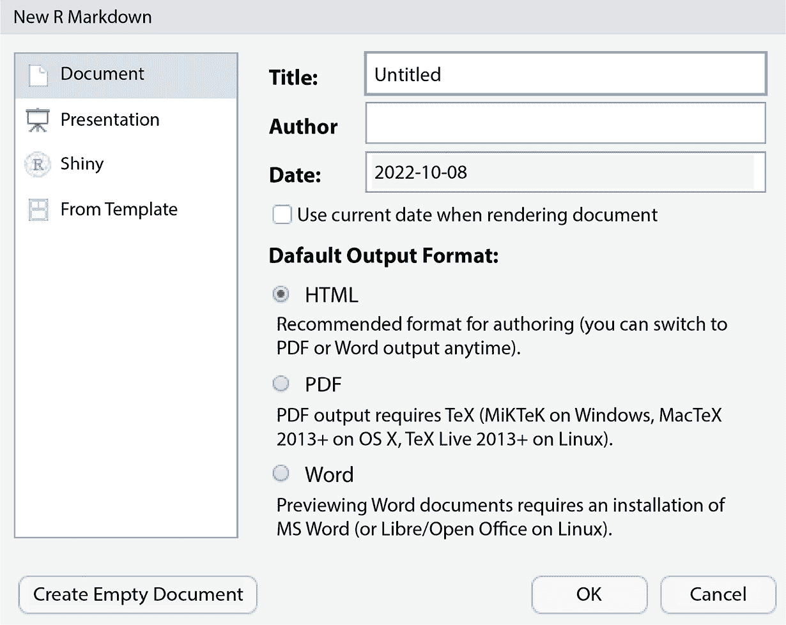

图 6.1 – 创建 R Markdown 文件

让我们从 `my first rmarkdown` 开始，并点击 `.Rmd` 文件，将创建一个包含基本指令的文件。并非所有这些信息都会被使用，因此熟悉常见组件后，您可以自由删除脚本中的不必要代码。

R Markdown 文档由三个组件组成：文件的元数据、报告的文本和分析的代码。我们将在以下各节中查看这些组件。

## 了解 YAML 标题

如 *图 6**.2* 所示，R Markdown 脚本的顶部是一组由两组三个连字符 `---` 包裹的元数据标题信息，并包含在 YAML 标题中。YAML，一种人类可读的数据序列化语言，是用于配置文件中分层数据结构的语法。在这种情况下，默认信息包括标题、输出格式和日期，以键值对的形式表示。标题中的信息会影响整个文档。例如，要生成 PDF 文件，我们只需在输出配置中将 `html_document` 切换为 `pdf_document`。这是标题中所需的最小信息集，尽管鼓励您添加作者信息（通过 *图 6**.2* 中的相同初始窗口）以显示您的工作版权：

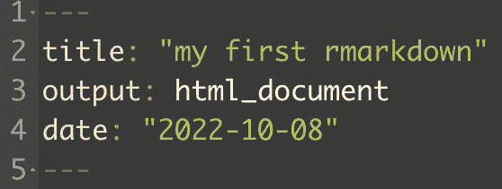

图 6.2 – 默认 R Markdown 脚本的 YAML 标题

在设置好标题信息并假设所有额外的代码都已删除后，我们可以通过点击 `test.Rmd` 来编译 R Markdown 文件为 HTML 文件：

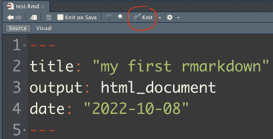

图 6.3 – 使用 Knit 按钮将 R Markdown 文件转换为 HTML 文件

编译 R Markdown 文件将生成一个在单独的预览窗口中打开的 HTML 文件。它还会在同一文件夹中保存一个名为`test.html`的 HTML 文件。

接下来，我们将学习更多关于 R Markdown 文件主体结构和语法的知识，包括文本格式化和处理代码块。

## 格式化文本信息

文本信息的重要性与您为分析和建模编写的代码相当，甚至更高。好的代码通常有很好的文档，当您的最终用户是非技术性的时，这一点尤为重要。在适当的位置放置背景信息、假设、上下文和决策过程是您技术分析的重要伴侣，除了分析的透明性和一致性之外。在本节中，我们将回顾我们可以用来格式化文本的常用命令。

### 练习 6.1 – 在 R Markdown 中格式化文本

在这个练习中，我们将使用 R Markdown 生成*图 6.4*中显示的文本：

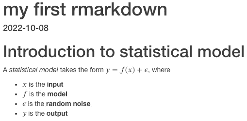

图 6.4 – 使用 R Markdown 生成的 HTML 文件示例文本

文本包括标题、一些斜体或粗体的单词、一个数学表达式和四个无序列表项。让我们看看如何生成这个文本：

1.  使用`#`符号编写一级标题：

    ```py

    # Introduction to statistical model
    ```

    注意，我们使用的井号越多，标题就会越小。请记住，在井号和文本之间添加一个空格。

1.  通过将文本包裹在`* *`中以实现斜体和`$$`以实现数学表达式，来编写中间句子：

    ```py

    A *statistical model* takes the form $y=f(x)+\epsilon$, where
    ```

1.  通过在每个项目前使用`*`并使用`** **`将文本包裹起来以实现粗体，来生成无序列表：

    ```py

    * $x$ is the **input**
    * $f$ is the **model**
    * $\epsilon$ is the **random noise**
    * $y$ is the **output**
    ```

    注意，我们可以轻松地将输出文件从 HTML 切换到 PDF，只需将`output: html_document`更改为`output: pdf_document`。结果输出显示在*图 6.5*中：

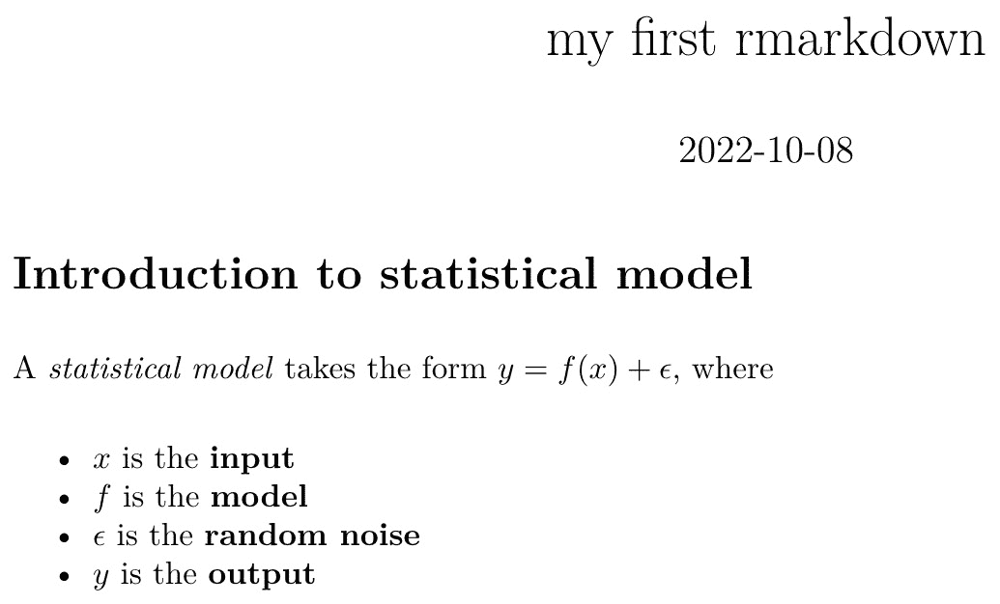

图 6.5 – 使用 R Markdown 生成的 PDF 文件示例文本

将 R Markdown 文件编译成 PDF 文档可能需要您安装额外的包，例如 LaTeX。当出现错误提示说该包不可用时，只需在控制台中安装此包，然后再进行编译。我们还可以使用**编译**按钮的下拉菜单来选择所需的输出格式。

此外，YAML 标题中日期键的值是一个字符串。如果您想自动显示当前日期，可以将字符串替换为````py`r Sys.Date()`"``.

These are some of the common commands that we can use in a `.Rmd` file to format the texts in the resulting HTML file. Next, we will look at how to write R code in R Markdown.

## Writing R code

In R Markdown, the R code is contained inside code chunks enclosed by three backticks, ```` ```py ```，这在 R Markdown 文件中用于将代码与文本分开。代码块还伴随着对应于所使用语言和其他配置的规则和规范，这些规则和规范位于花括号`{}`内。代码块允许我们渲染基于代码的输出或在报告中显示代码。

下面的代码片段展示了示例代码块，其中我们指定语言类型为 R 并执行赋值操作：

```py

```{r}

a = 1

```py
```

除了输入代码块的命令外，我们还可以在工具栏中点击代码图标（以字母`c`开头）并选择 R 语言的选项，如图*图 6.6*所示。请注意，您还可以使用其他语言，如 Python，从而使 R Markdown 成为一个多功能的工具，允许我们在一个工作文件中使用不同的编程语言：

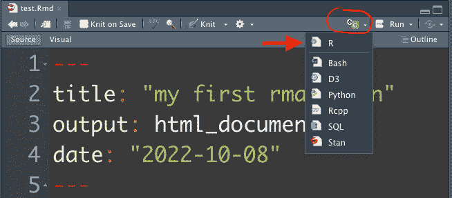

图 6.6 – 插入 R 代码块

每个代码块都可以通过点击每个代码块右侧的绿色箭头来执行，结果将显示在代码块下方。例如，*图 6.7*显示了执行赋值和打印变量后的输出：


图 6.7 – 执行代码块

我们还可以在代码块的大括号中指定其他选项。例如，我们可能不希望在生成的 HTML 文件输出中包含特定的代码块。为了隐藏代码本身并只显示代码的输出，我们可以在代码块的相关配置中添加`echo=FALSE`，如下面的代码块所示：

```py

```{r echo=FALSE}

a = 1

a

```py
```

*图 6.8*显示了生成的 HTML 文件中的两种不同类型的输出：

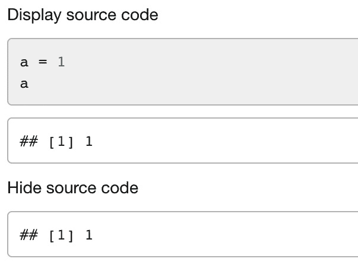

图 6.8 – 在 HTML 文件中显示和隐藏源代码

此外，当我们加载当前会话中的包时，我们可能在控制台得到一个警告消息。在 R Markdown 中，这样的警告消息也会出现在生成的 HTML 中。要隐藏警告消息，我们可以在配置中添加`warning=FALSE`。例如，在下面的代码片段中，我们在加载`dplyr`包时隐藏了警告消息：

```py

```{r warning=FALSE}

library(dplyr)

```py
```

*图 6.9*比较了加载包时显示或隐藏警告消息的两个场景：

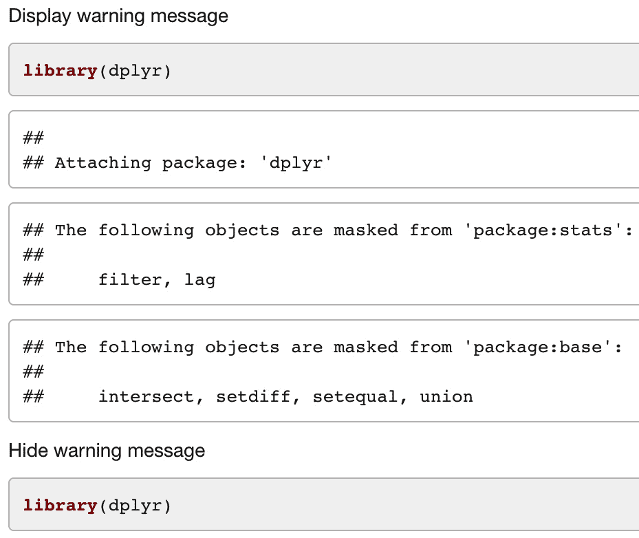

图 6.9 – 加载包时隐藏警告消息

在这些构建块介绍完毕后，我们将在下一节进行案例研究，使用谷歌股票价格数据生成财务分析报告。

# 生成财务分析报告

在本节中，我们将分析来自 Yahoo! Finance 的谷歌股票数据。为了方便数据下载和分析，我们将使用`quantmod`包，该包旨在帮助量化交易者开发、测试和部署基于统计的贸易模型。让我们安装这个包并将其加载到控制台：

```py

>>> install.packages("quantmod")
>>> library(quantmod)
```

接下来，我们将使用 R Markdown 生成 HTML 报告，并介绍数据查询和分析的基础知识。

## 获取和显示数据

让我们通过一个练习来生成一个初始报告，该报告会自动从 Yahoo! Finance 查询股票数据，并显示数据集中的基本信息。

### 练习 6.2 – 生成基本报告

在这个练习中，我们将设置一个 R Markdown 文件，下载谷歌的股价数据，并显示数据集的一般信息：

1.  创建一个名为`Financial analysis`的空 R Markdown 文件，并在 YAML 文件中设置相应的`output`、`date`和`author`：

    ```py

    ---
    title: "Financial analysis"
    output: html_document
    date: "2022-10-12"
    author: "Liu Peng"
    ---
    ```

1.  创建一个代码块来加载`quantmod`包并使用`getSymbols()`函数查询谷歌的股价数据。将结果数据存储在`df`中。同时隐藏结果 HTML 文件中的所有消息，并添加必要的文本说明：

    ```py

    # Analyzing Google's stock data since 2007
    Getting Google's stock data
    ```{r warning=FALSE, message=FALSE}

    library(quantmod)

    df = getSymbols("GOOG", auto.assign=FALSE)

    ```py
    ```

    在这里，我们指定`warning=FALSE`以隐藏加载包时的警告消息，`message=FALSE`以隐藏调用`getSymbols()`函数时生成的消息。我们还指定`auto.assign=FALSE`将结果 DataFrame 分配给`df`变量。另外，请注意，我们可以在代码块内添加文本作为注释，这些注释将被视为以井号`#`开头的典型注释。

1.  通过三个单独的代码块计算总行数并显示 DataFrame 的前两行和最后两行。为代码添加相应的文本作为文档：

    ```py

    Total number of observations of `df`
    ```{r}

    nrow(df)

    ```py
    Displaying the first two rows of `df`
    ```{r}

    head(df, 2)

    ```py
    Displaying the last two rows of `df`
    ```{r}

    tail(df, 2)

    ```py
    ```

    注意，我们使用`` ` ` ``来表示文本中的内联代码。

    到目前为止，我们可以编织 R Markdown 文件以观察生成的 HTML 文件，如图*图 6.10*所示。经常检查输出是一个好习惯，这样就可以及时纠正任何潜在的不期望的错误：

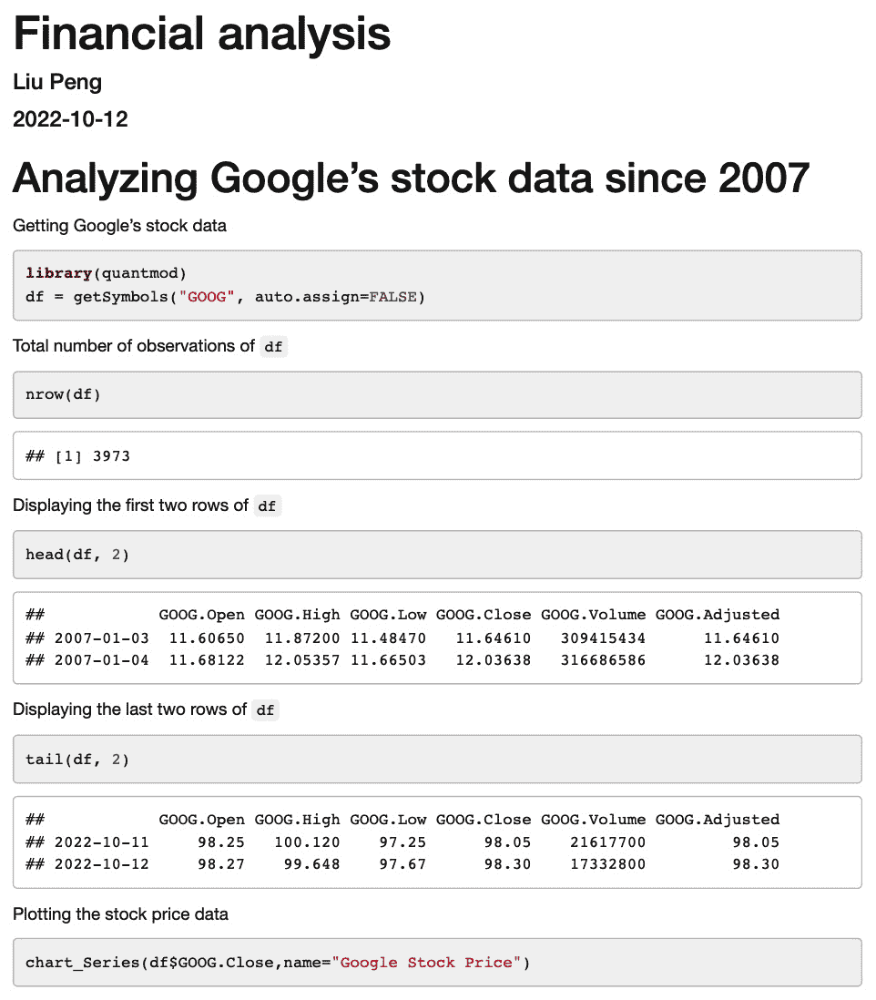

图 6.10 – 显示 HTML 输出

1.  使用`chart_Series()`函数绘制每日收盘价的时间序列图：

    ```py

    Plotting the stock price data
    ```{r}

    chart_Series(df$GOOG.Close,name="Google Stock Price")

    ```py
    ```

    将此代码块添加到 R Markdown 文档中并编织它，将生成与*图 6.11*中所示相同的输出文件，并增加一个额外的图形。`chart_Series()`函数是`quantmod`提供的用于绘图的实用函数。我们也可以根据前一章讨论的`ggplot`包来绘制它：

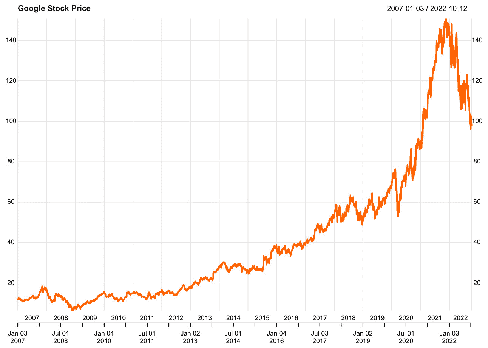

图 6.11 – 自 2017 年以来谷歌的每日股价

除了从代码生成图形外，我们还可以将链接和图片包含在输出中。此图片可以从本地驱动器或从网络加载。在下面的代码片段中，我们添加了一行带有超链接的文本，指向一个示例图片，并在下一行直接从 GitHub 读取显示该图片：

```py

The following image can be accessed [here](https://github.com/PacktPublishing/The-Statistics-and-Machine-Learning-with-R-Workshop/blob/main/Chapter_6/Image.png).

```

注意，我们通过将单词 `here` 放在方括号内并跟在括号中的超链接后面来添加一个超链接。要添加图片，我们可以在方括号前添加一个感叹号。我们还可以通过在图片链接后添加 `{width=250px}` 来指定图片的大小。

在 R Markdown 中编译前面的代码生成 *图 6**.12*：


图 6.12 – 从 GitHub 可视化图像

接下来，我们将执行数据分析并将结果以文本形式显示。

## 执行数据分析

加载数据集后，我们可以在生成的输出文档中执行数据分析并展示洞察力，所有这些都是自动且一致的。例如，我们可以展示特定时期内股票价格的高级统计数据，如平均、最大和最小价格。这些统计数据可以嵌入到文本中，使演示风格更加自然和自包含。

### 练习 6.3 – 执行简单的数据分析

在这个练习中，我们将提取 Google 的年度最高、平均和最低股价。为此，我们首先将数据集从其原始的 `xts` 格式转换为 `tibble` 对象，然后使用 `dplyr` 总结这些统计量。最后，我们将在 HTML 文档的文本中显示这些信息：

1.  加载 `dplyr` 和 `tibble` 包，并将 `df` 从 `xts` 格式转换为 `tibble` 格式。将生成的 `tibble` 对象存储在 `df_tbl` 中：

    ```py

    library(dplyr)
    library(tibble)
    df_tbl = df %>%
      as_tibble() %>%
      add_column(date = index(df), .before = 1)
    ```

    在这里，我们将使用 `as_tibble()` 函数将 `xts` 对象转换为 `tibble` 格式，然后使用 `add_column()` 函数在 DataFrame 的开头插入一个日期列。日期信息作为索引存在于原始的 `xts` 对象中。

1.  存储自 2022 年以来的年度最高、平均和最低收盘价，分别存储在 `max_ytd`、`avg_ytd` 和 `min_ytd` 中：

    ```py

    max_ytd = df_tbl %>%
      filter(date >= as.Date("2022-01-01")) %>%
      summarise(price = max(GOOG.Close)) %>%
      .$price
    avg_ytd = df_tbl %>%
      filter(date >= as.Date("2022-01-01")) %>%
      summarise(price = mean(GOOG.Close)) %>%
      .$price
    min_ytd = df_tbl %>%
      filter(date >= as.Date("2022-01-01")) %>%
      summarise(price = min(GOOG.Close)) %>%
      .$price
    ```

    对于每个统计量，我们首先按日期过滤，然后根据 `GOOG.Close` 列提取相关统计量。最后，我们将结果作为单个标量值返回，而不是 DataFrame。

1.  以文本形式显示这些统计量：

    ```py

    Google's **highest** year-to-date stock price is `r max_ytd`.
    Google's **average** year-to-date stock price is `r avg_ytd`.
    Google's **lowest** year-to-date stock price is `r min_ytd`.
    ```

    如 *图 6**.13* 所示，编译文档将统计量输出到 HTML 文件中，这使得我们可以在 HTML 报告中引用代码结果：

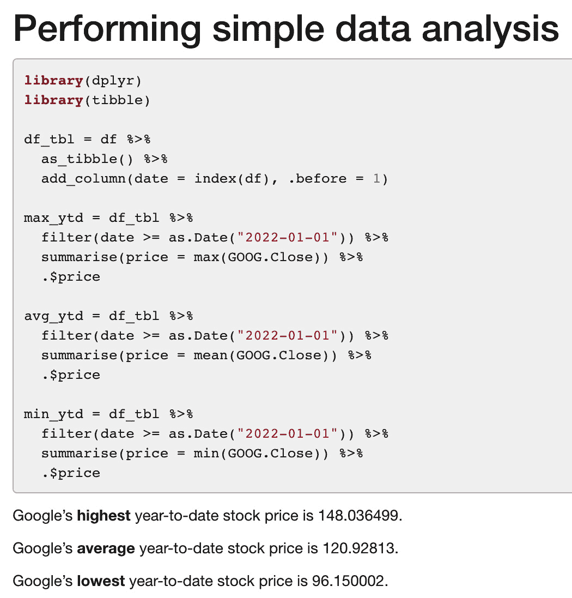

图 6.13 – 提取简单统计量并在 HTML 格式中显示

在下一节中，我们将探讨如何在 HTML 报告中添加图表。

## 在报告中添加图表

在 HTML 报告中添加图表的方式与在 RStudio 控制台中相同。我们只需在代码块中编写绘图代码，然后编译 R Markdown 文件后，图表就会出现在生成的报告中。让我们通过一个练习来可视化使用上一章中介绍的 `ggplot2` 包的股票价格。

### 练习 6.4 – 使用 ggplot2 添加图表

在这个练习中，我们将通过线形图可视化过去三年的平均月收盘价。我们还将探索报告中图表的不同配置选项：

1.  创建一个包含 2019 年至 2021 年间月度平均收盘价的数据库：

    ```py

    library(ggplot2)
    library(lubridate)
    df_tbl = df_tbl %>%
      mutate(Month = factor(month(date), levels = as.character(1:12)),
             Year = as.character(year(date)))
    tmp_df = df_tbl %>%
      filter(Year %in% c(2019, 2020, 2021)) %>%
      group_by(Year, Month) %>%
      summarise(avg_close_price = mean(GOOG.Close)) %>%
      ungroup()
    ```

    在这里，我们首先创建两个额外的列，分别称为`Month`和`Year`，这些列是基于日期列通过`lubridate`包中的`month()`和`year()`函数派生出来的。我们还把`Month`列转换为因子类型的列，其级别在 1 到 12 之间，这样当我们在后面绘制月度价格图时，这个列可以遵循特定的顺序。同样，我们将`Year`列设置为字符类型的列，以确保它不会被`ggplot2`解释为数值变量。

    接下来，我们通过`Year`对`df_tbl`变量进行筛选，按`Year`和`Month`分组，并计算`GOOG.Close`的平均值，然后使用`ungroup()`函数从保存在`tmp_df`中的结果 DataFrame 中移除分组结构。

1.  在线形图中将每年的月度平均收盘价作为单独的线条绘制。更改相应的图表标签和文本大小：

    ```py

    p = ggplot(tmp_df,
           aes(x = Month, y = avg_close_price,
               group = Year,
               color = Year)) +
      geom_line() +
      theme(axis.text=element_text(size=16),
            axis.title=element_text(size=16,face="bold"),
            legend.text=element_text(size=20)) +
      labs(titel = "Monthly average closing price between 2019 and 2021",
          x = "Month of the year",
          y = "Average closing price")
    p
    ```

    在代码块中运行前面的命令将生成*图 6**.14*中显示的输出。请注意，我们还添加了标题和一些文本，以指出代码的目的和上下文。在编织 R Markdown 文件后，代码和输出会自动显示，这使得 R Markdown 成为生成透明、吸引人和可重复的技术报告的绝佳选择：

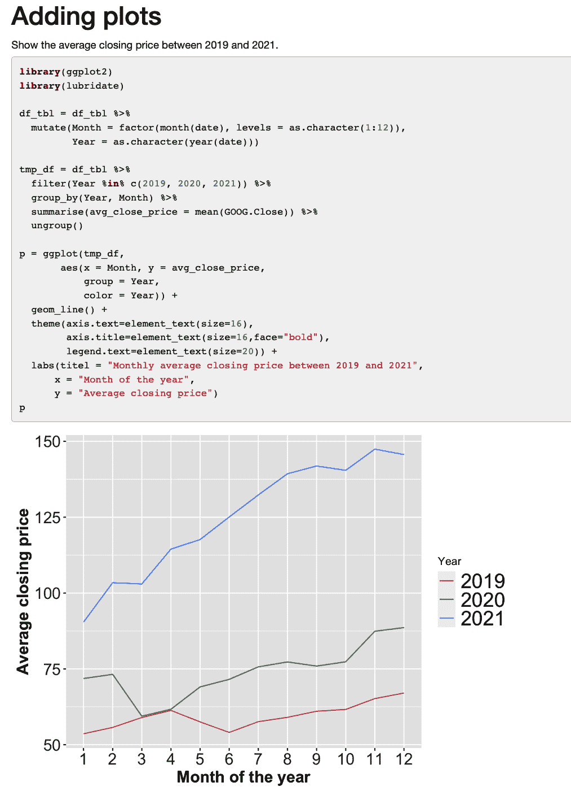

图 6.14 – 添加图表以显示过去三年的月度平均收盘价

我们还可以配置图表的大小和位置。

1.  通过在代码块的配置部分设置`fig.width=5`和`fig.height=3`来缩小图表的大小，并显示输出图形：

    ```py

    Control the figure size via the `fig.width` and `fig.height` parameters.
    ```{r fig.width=5, fig.height=3}

    p

    ```py
    ```

    使用这些添加的命令编织文档会产生**图 6**.15：

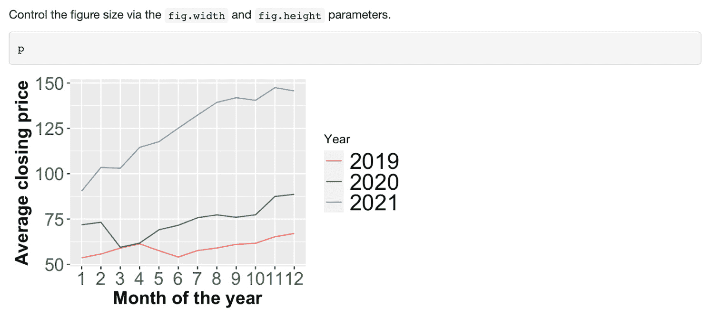

图 6.15 – 改变图表的大小

1.  将图表的位置对齐，使其位于文档的中心：

    ```py

    Align the figure using the `fig.align` parameter.
    ```{r fig.width=5, fig.height=3, fig.align='center'}

    p

    ```py
    ```

    使用这些添加的命令编织文档会产生**图 6**.16：

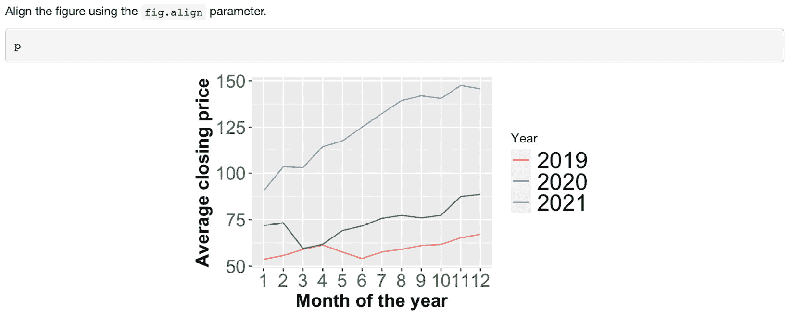

图 6.16 – 改变图表的位置

1.  为图表添加标题：

    ```py

    Add figure caption via the `fig.cap` parameter.
    ```{r fig.width=5, fig.height=3, fig.align='center', fig.cap='图 1.1 2019 年至 2021 年间的月度平均收盘价'}

    p

    ```py
    ```

    使用这些添加的命令编织文档会产生**图 6**.17：


图 6.17 – 为图表添加标题

除了图形外，表格也是报告中常用的一种用于呈现和总结信息的方式。我们将在下一节中探讨如何生成表格。

## 向报告中添加表格

当报告用户对深入了解细节或进一步分析感兴趣时，以表格形式呈现信息是图形对应物的良好补充。对于最终用户来说，能够访问和使用报告中的数据起着关键作用，因为这给了他们更多控制权，可以控制报告中已经预处理好的信息。换句话说，基于 R Markdown 的 HTML 报告不仅以图形形式总结信息以便于消化，还提供了关于特定数据源的详细信息作为表格，以促进即席分析。

我们可以使用 `knitr` 包中的 `kable()` 函数添加表格，该函数是支持在每个代码块中执行代码的核心引擎，然后在对 R Markdown 文档进行编织时进行动态报告生成。请注意，在通过 `kable()` 将数据作为表格展示之前进行预处理和清理数据是一个好的实践；这项任务应该只涉及展示一个干净且有序的表格。

让我们通过一个练习来看看如何向报告中添加干净的表格。

### 练习 6.5 – 使用 kable() 添加表格

在这个练习中，我们将以表格形式展示 `tmp_df` 变量的前五行，然后演示不同的表格显示配置选项：

1.  使用 `knitr` 包中的 `kable()` 函数显示 `tmp_df` 的前五行：

    ```py

    # Adding tables
    Printing `tmp_df` as a static summary table via the `kable()` function.
    ```{r}

    library(knitr)

    kable(tmp_df[1:5,])

    ```py
    ```

    使用这些添加的命令编织文档会产生 *图 6**.18*：

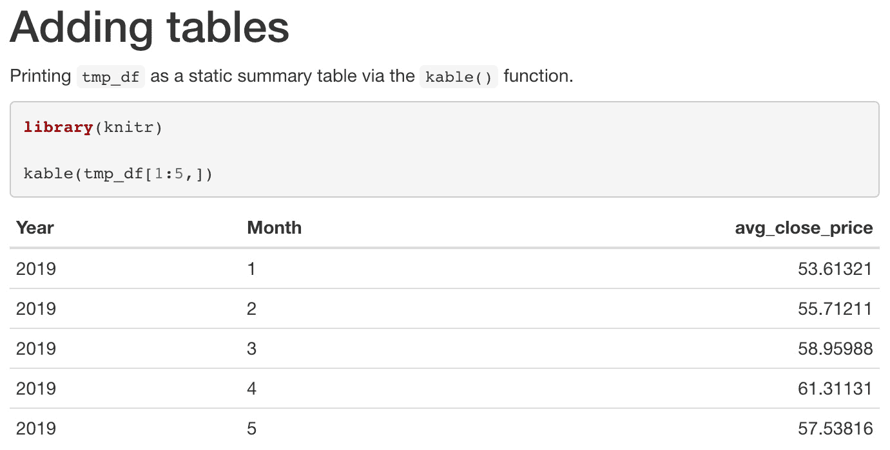

图 6.18 – 向报告中添加表格

1.  使用 `col.names` 参数更改表格的列名：

    ```py

    Changing column names via the `col.names` parameter.
    ```{r}

    kable(tmp_df[1:5,], col.names=c("Year", "Month", "Average closing price"))

    ```py
    ```

    使用这些添加的命令编织文档会产生 *图 6**.19*：

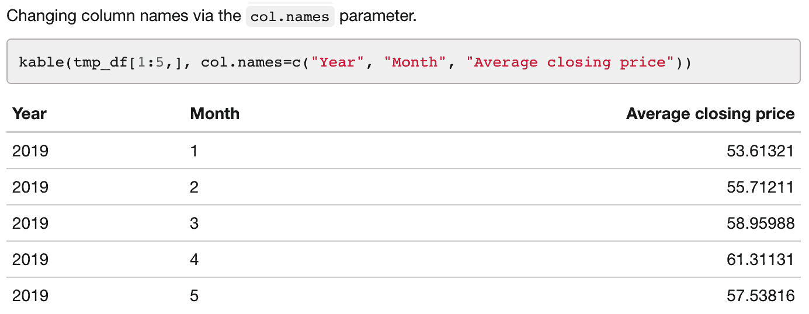

图 6.19 – 更改表格中的列名

我们还可以使用 `align` 参数修改表格内的列对齐方式。默认情况下，数值列的列对齐在右侧，其他所有类型的列对齐在左侧。如 *图 6**.19* 所示，`Year`（字符类型）和 `Month`（因子类型）列左对齐，而 `Average closing price`（数值）列右对齐。对齐方式按列指定，使用单个字母表示，其中 `"l"` 表示左对齐，`"c"` 表示居中对齐，`"r"` 表示右对齐。

1.  使用 `align` 参数将所有列对齐到中心：

    ```py

    Align the table via the `align` argument.
    ```{r}

    kable(tmp_df[1:5,], col.names=c("Year", "Month", "Average closing price"), align="ccc")

    ```py
    ```

    在这里，我们指定 `align="ccc"` 以将所有列对齐到中心。使用这些添加的命令编织文档会产生 *图 6**.20*：

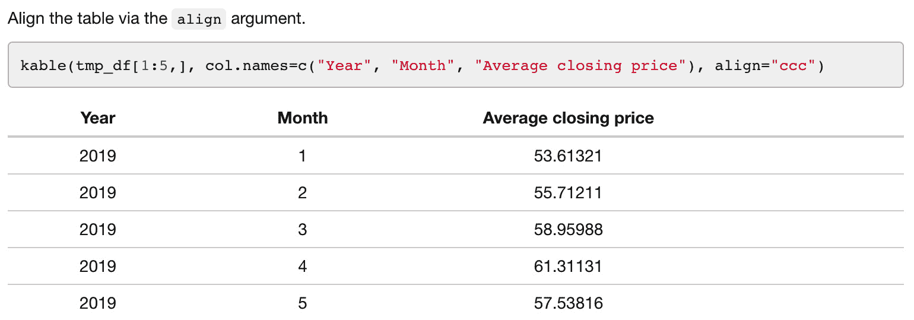

图 6.20 – 使表格的所有列居中

最后，我们还可以为表格添加一个标题。

1.  <style>

    ```py

    Add table caption via the `caption` parameter.
    ```{r}

    date: "2022-10-12"

    ```py

    Knitting the document with these added commands produces *Figure 6**.21*:

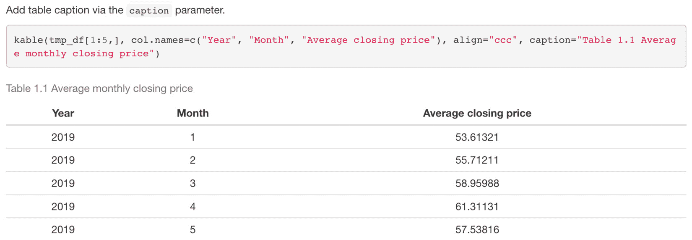

Figure 6.21 – Adding a caption to the table

In the next section, we will discuss some common options we can use to modify the code chunk outputs after knitting the R Markdown document.

## Configuring code chunks

We have seen several options from previous exercises that we can use to control the output style of a code chunk. For example, by setting `warning=FALSE` and `message=FALSE`, we could hide potential warnings and messages in the resulting output document.

There are other commonly used options. For example, we can use the `include` option to decide whether the code and results appear in the output report or not. In other words, setting `include=FALSE` will hide the code and results of the specific code chunk in the report, although the code will still be executed upon knitting the R Markdown document. By default, we have `include=TRUE` and all the code and execution results will appear in the report.

Another related option is `echo`, where setting `echo=FALSE` hides the code and only shows the execution outputs in the report. We can consider this option when we’re generating plots in the report since most users are more interested in the graphical analysis compared to the process that generates the graph. Again, by default, we have `echo=TRUE`, which displays the code in the report before the plots.

Besides this, we may only be interested in showing some code instead of executing all of it. In this case, we can set `eval=FALSE` to make sure that the code in the code chunk does not impact the overall execution and result of the report. This is in contrast to setting `include=FALSE`, which hides the code but still executes it in the backend, thus bearing an effect on the subsequent code. By default, we have `eval=FALSE`, which evaluates all the code in the code chunk. *Figure 6**.22* summarizes these three options:

|  | **Code execution** | **Code appearance** | **Result appearance** |
| `include=FALSE` | Yes | No | No |
| `echo=FALSE` | Yes | No | Yes |
| `eval=FALSE` | No | Yes | No |

Figure 6.22 – Common options for configuring code chunks

Next, we will go over an exercise to practice different options.

### Exercise 6.6 – configuring code chunks

In this exercise, we will go through a few ways to configure the code chunks we covered previously:

1.  Display the maximum closing price for the past five years in a table. Show both the code and the result in the report:

    ```

    # author: "刘鹏"

    html_document:

    ```py{r}
    tmp_df = df_tbl %>%
      mutate(Year = as.integer(Year)) %>%
      filter(Year >= max(Year)-5,
             Year < max(Year)) %>%
      group_by(Year) %>%
      summarise(max_closing = max(GOOG.Close))
    kable(tmp_df)
    ```

    ```py

    Here, we first convert `Year` into an integer-typed variable, then subset the DataFrame to keep only the last five years of data, followed by extracting the maximum closing price for each year. The result is then shown via the `kable()` function.

    Knitting the document with these added commands produces *Figure 6**.23*. The result shows that Google has been making new highs over the years:

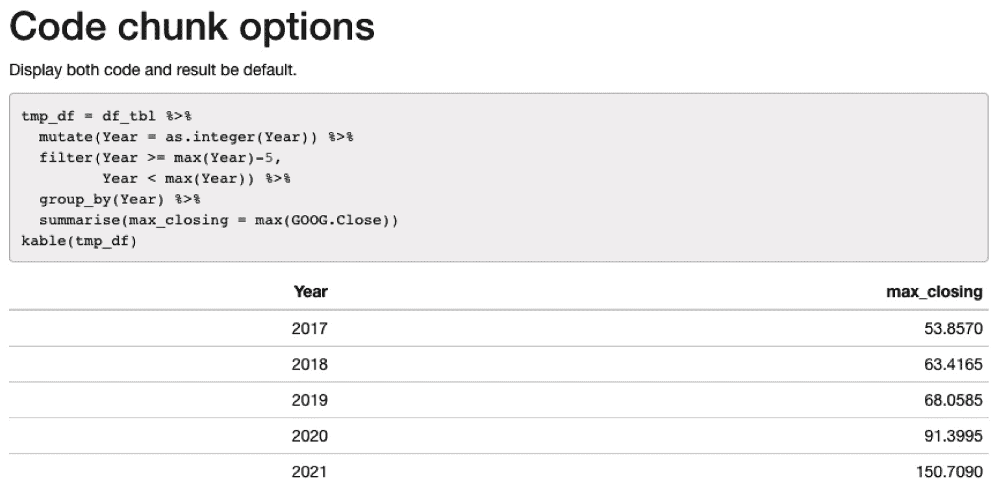

Figure 6.23 – Displaying the maximum closing price for the past five years

1.  Obtain the highest closing price in a code chunk with the code and result hidden in the report by setting `include=FALSE`. Display the result in a new code chunk:

    ```

    执行代码块，但通过设置`include=FALSE`在输出中隐藏代码和结果。

    ```py{r include=FALSE}
    total_max_price = max(df_tbl$GOOG.Close)
    ```

    author: "刘鹏"

    ```py{r}
    total_max_price
    ```

    ```py

    Knitting the document with these commands produces *Figure 6**.24*:

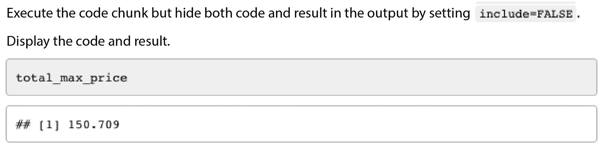

Figure 6.24 – Hiding the code and result in one code chunk and displaying the result separately

1.  For the running table, hide the code chunk and only display the result in the report by setting `echo=FALSE`:

    ```

    ---

    ```py{r echo=FALSE}
    kable(tmp_df)
    ```

    ```py

    Knitting the document with these commands produces *Figure 6**.25*:

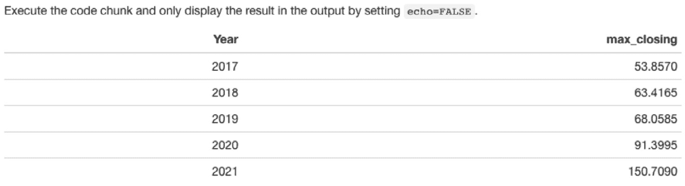

Figure 6.25 – Hiding the code chunk and displaying the result in the report

1.  Only display the code on table generation in the code chunk and do not execute it in the report by setting `eval=FALSE`:

    ```

    不执行代码块，并通过设置`eval=FALSE`在输出中仅显示代码。

    ```py{r eval=FALSE}
    kable(tmp_df)
    ```

    ```py

    Knitting the document with these commands produces *Figure 6**.26*:

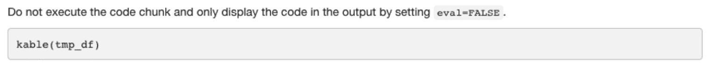

Figure 6.26 – Displaying the code chunk without executing it in the report

1.  Print a test message and a warning message in separate blocks. Then, put the same contents in a single block by setting `collapse=TRUE`:

    ```

    使用这些命令编织文档会产生*图 6.37**。37*：

    ```py{r}
    print("This is a test message")
    warning("This is a test message")
    ```

    在本章中，我们介绍了 R Markdown，这是一个灵活、透明且一致的报告生成工具。我们首先回顾了 R Markdown 的基础知识，包括 YAML 标题和代码块等基本构建块，然后介绍了文本格式化技巧。

    ```py{r collapse=TRUE}
    print("This is a test message")
    warning("This is a test message")
    ```

    ```py

    Knitting the document with these commands produces *Figure 6**.27*, which shows that both the printed and warning messages are shown in a single block together with the code:

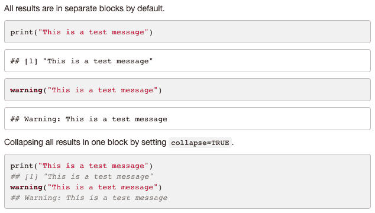

Figure 6.27 – Displaying the code and results in one block

In addition, we can hide the warning by configuring the `warning` attribute in the code chunk.

1.  Hide the warning by setting `warning=FALSE`:

    ```

    body {

    ```py{r collapse=TRUE, warning=FALSE}
    print("This is a test message")
    warning("This is a test message")
    ```

    ```py

    Knitting the document with these commands produces *Figure 6**.28*, where the warning has now been removed from the report:

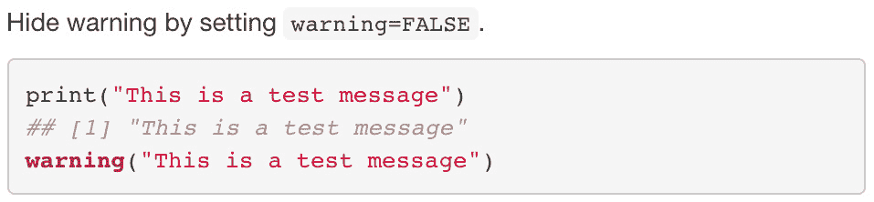

Figure 6.28 – Hiding the warning in the report

Setting the display parameters for each code chunk becomes troublesome when we need to repeat the same operation for many chunks. Instead, we can make a global configuration that applies to all chunks in the R Markdown document by using the `knitr::opts_chunk()` function at the beginning of the document. For example, the following code snippet hides the warnings for all following code chunks:

```

显示代码和结果。

```py{r include=FALSE}
knitr::opts_chunk$set(warning=FALSE)
```

```py

In the next section, we will look at how to customize R Markdown reports, such as by adding a table of contents and changing the report style.

# Customizing R Markdown reports

In this section, we will look at adding metadata such as a table of contents to the report, followed by introducing more options for changing the report style.

## Adding a table of contents

When reading a report for the first time, a table of contents provides an overview of the report and thus helps readers quickly navigate the different sections of the report.

To add a table of contents, we can append a colon to the `html_document` field in the YAML header and set `toc: true` as a separate line with one more indentation than the `html_document` field. This is shown in the following code snippet:

```

---

}

代码块选项

font-size: 20px;

执行代码块，并通过设置`echo=FALSE`在输出中仅显示结果。

date: "2022-10-12"

设置全局选项。

---

```py

Knitting the document with these commands produces *Figure 6**.29*, where a table of contents is now displayed at the top of the report. Note that when you click on a header in the table of contents, the report will directly jump to that section, which is a nice and user-friendly feature:

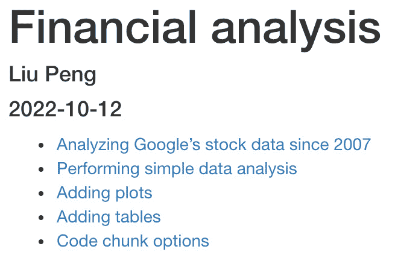

Figure 6.29 – Adding a table of contents to the report

We can also set `toc_float=true` to make the table of contents float. With this property specified, the table of contents will remain visible as the user scrolls through the report. The following code snippet includes this property in the YAML header:

```

body {

}

background-color: #F5F5F5;

params:

通过设置`warning=FALSE`隐藏警告。

toc_float: true

date: "2022-10-12"

output:

pre {

```py

Knitting the document with these commands produces *Figure 6**.30*, where the table of contents appears on the left-hand side and remains visible as the user navigates different sections:

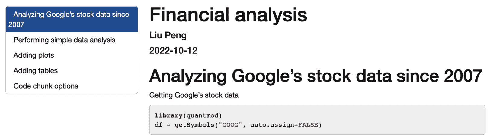

Figure 6.30 – Setting up a floating table of contents in the report

Next, we will look at creating a report with parameters in the YAML header.

## Creating a report with parameters

Recall that our running dataset contains the daily stock prices of Google since 2007\. Imagine that we need to create a separate annual report for each year; we may need to manually edit the `year` parameter for each report, which would be a repetitive process. Instead, we can set an input parameter in the YAML header as a global variable that’s accessible to all code chunks. When generating other similar reports, we could simply change this parameter and rerun the same R Markdown file.

We can set a parameter input by adding the `params` field, followed by a colon in the YAML header. Then, we must add another line, indent it, and add the key and value of the parameter setting, which are separated by a colon. Note that the value of the parameter is not wrapped in quotations.

Let’s go through an exercise to illustrate this.

### Exercise 6.7 – generating reports using parameters

In this exercise, we will configure parameters to generate reports that are similar and only differ in the parameter setting:

1.  Add a `year` parameter to the YAML header and set its value to `2020`:

    ```

    ---

    html_document:

    background-color: #F5F5F5;

    html_document:

    toc: true

    toc_float: true

    date: "2022-10-12"

    }

    params:

    year: 2020

    ---

    ```py

    Here, we use the `params` field to initiate the parameter setting and add `year: 2020` as a key-value pair.

2.  Extract the summary of the closing price using the `summary()` function for 2020:

    ```

    # 使用参数生成报告

    ```

    ```py{r}
    df_tbl %>%
      filter(Year == params$year) %>%
      select(GOOG.Close) %>%
      summary()
    ```

    ```py

    Knitting the document with these commands produces *Figure 6**.31*, where we use `Year` `== params$year` as a filtering condition in the `filter()` function:

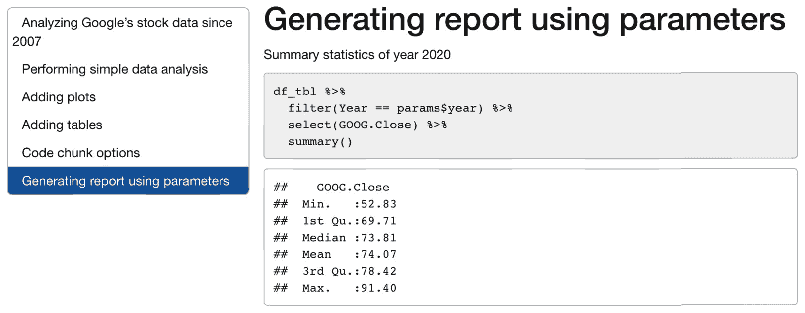

Figure 6.31 – Generating summary statistics of the closing price for 2020 using parameters

1.  Change the parameter setting and generate the same statistics for 2021:

    ```

    ---

    ---

    output:

    color: blue;

    toc: true

    默认情况下，所有结果都在单独的块中。

    title: "财务分析"

    author: "刘鹏"

    author: "刘鹏"

    year: 2021

    }

    ```py

    Knitting the document with these commands produces *Figure 6**.32*. With a simple change of value in the parameters, we can generate a report for a different year without editing the contents following the YAML header:

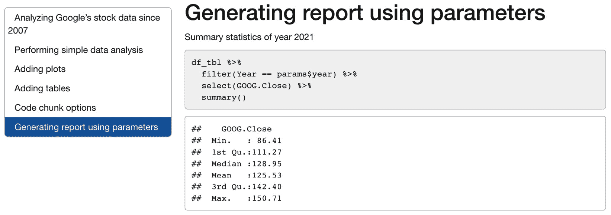

Figure 6.32 – Generating summary statistics of the closing price for 2021 using parameters

We can also create a report based on multiple parameters, which can be appended as key-value pairs in the YAML header.

1.  Generate the same statistics for the closing price for Q1 2021:

    ```

    年份`r params$year`和季度`r params$quarter`的摘要统计

    ```py{r}
    df_tbl %>%
      mutate(Qter = quarters(date)) %>%
      filter(Year == params$year,
             Qter == params$quarter) %>%
      select(GOOG.Close) %>%
      summary()
    ```

    ```py

    Here, we create a new column to represent the quarter using the `quarters()` function based on the date, followed by filtering using the `year` and `the` `quarter` parameters set in the YAML header. Knitting the document with these commands produces *Figure 6**.33*:

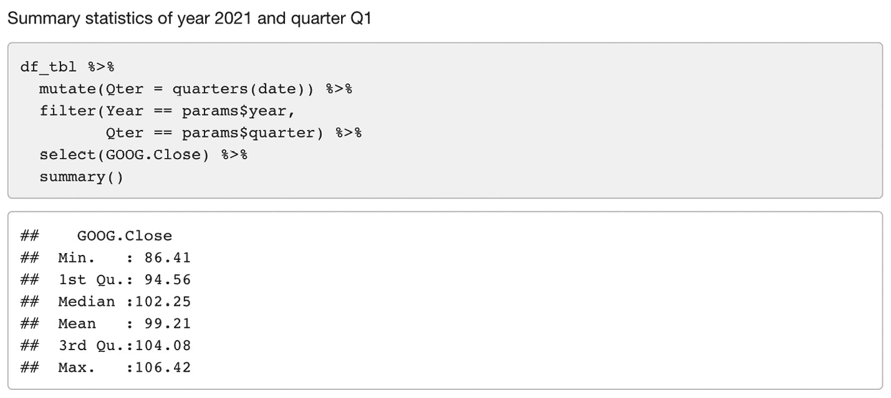

Figure 6.33 – Generating summary statistics of the closing price for 2021 Q1 using multiple parameters

In the following section, we will look at the style of the report using **Cascading Style Sheets** (**CSS**), a commonly used web programming language to adjust the style of web pages.

## Customizing the report style

The report style includes details such as the color and font of text in the report. Like any web programming framework, R Markdown offers controls that allow attentive users to make granular adjustments to the report’s details. The adjustable components include most HTML elements in the report, such as the title, body text, code, and more. Let’s go through an exercise to learn about different types of style control.

### Exercise 6.8 – customizing the report style

In this exercise, we will customize the report style by adding relevant configurations within the `<style>` and `</style>` flags. The specification starts by choosing the element(s) to be configured, such as the main body (using the `body` identifier) or code chunk (using the `pre` identifier). Each property should start with a new line, have the same level of indentation, and have one more level of indentation than the preceding HTML element.

In addition, all contents to be specified are key-value pairs that end with a semicolon and are wrapped within curly braces, `{}`. The style configuration can also exist anywhere after the YAML header. Let’s look at a few examples of specifying the report style:

1.  Change the color of the text in the main body to red and the background color to `#F5F5F5`, the hex code that corresponds to gray:

    ```

    # 自定义报告样式

    <style>

    body {

    ---

    color: orange;

    图 6.37 – 改变报告标题的颜色、字体大小和透明度

    </style>

    ```py

    Here, we directly use the word `blue` to set the color attribute of the text in the body and the hex code to set its background color; these two approaches are equivalent. Knitting the document with these commands produces *Figure 6**.34*:

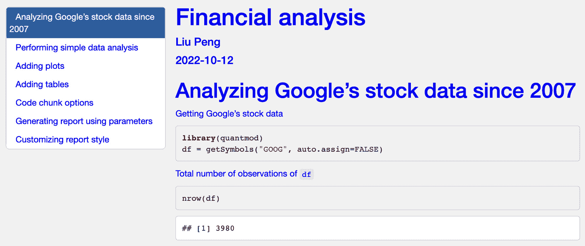

Figure 6.34 – Changing the color of the text in the body of the report

1.  Change the color of the code in the code chunks to red by specifying `color: red` in the `pre` attribute:

    ```

    # 自定义报告样式

    <style>

    默认显示代码和结果。

    color: blue;

    title: "财务分析"

    color: green;

    使用`caption`参数为表格添加标题：

    kable(tmp_df[1:5,], col.names=c("Year", "Month", "Average closing price"), align="ccc", caption="表 1.1 平均收盘价")

    color: red;

    </style>

    ```py

    Knitting the document with these commands produces *Figure 6**.35*:

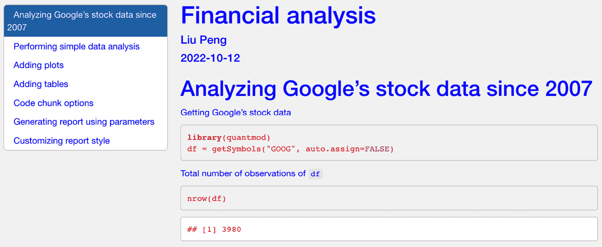

Figure 6.35 – Changing the color of the code in the report

1.  For the table of contents, change the color of the text and border to `green`, and set the font size to `16px`:

    ```

    # 自定义报告样式

    <style>

    body {

    color: blue;

    }

    }

    border-color: green;

    color: red;

    background-color: #F5F5F5;

    #TOC {

    pre {

    font-size: 16px;

    border-color: green;

    年份`r params$year`的摘要统计

    output:

    ```py

    Note that the style for the table of contents is specified using `#TOC` without any space in between. Knitting the document with these commands produces *Figure 6**.36*:

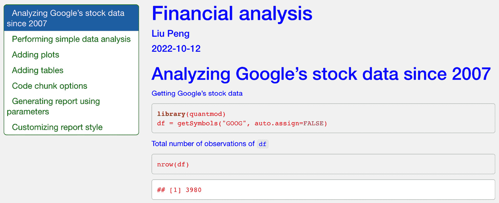

Figure 6.36 – Changing the color and font size of the table of contents in the report

1.  For the header, change the color to `orange`, the opacity to `0.9`, and the font size to `20px`:

    ```

    # 自定义报告样式

    title: "财务分析"

    </style>

    color: blue;

    background-color: #F5F5F5;

    }

    output:

    color: red;

    }

    html_document:

    color: green;

    font-size: 16px;

    toc: true

    toc: true

    #header {

    toc_float: true

    opacity: 0.8;

    通过设置`collapse=TRUE`将所有结果合并到一个块中。

    }

    </style>

    }

    注意，标题的样式是通过使用`#header`来指定的，其中没有任何空格。

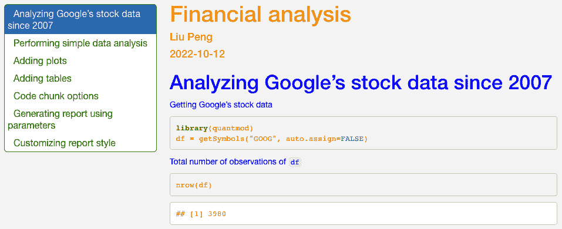

#TOC {

这项练习到此结束。现在，让我们总结本章内容。

# 摘要

title: "财务分析"

接下来，我们通过使用谷歌的股票数据进行了案例研究。在从网络下载股票数据后，我们生成了一份报告来总结每日收盘价的统计数据，向报告中添加了图表和表格，进行了数据处理，并使用不同的样式选项展示了结果。我们还探索了几种配置代码块的不同方法。

最后，我们讨论了如何自定义 R Markdown 报告。我们涵盖的主题包括在报告中添加目录，使用 YAML 标头中的参数创建重复的报告，以及通过编辑不同组件的视觉属性来更改报告的视觉风格，使用 CSS 进行编辑。

在下一章中，我们将开始本书的**第二部分**，并使用 R 语言介绍线性代数和微积分的基础知识。
