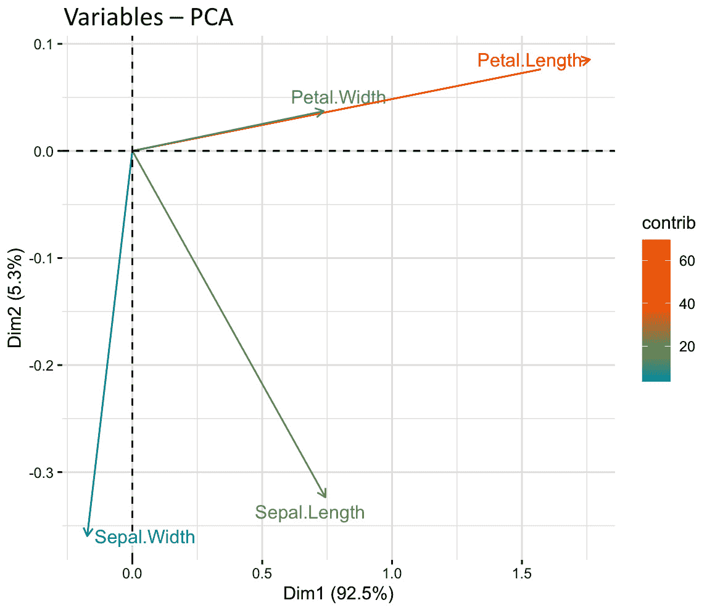

# 第八章：R 中的中级线性代数

上一章介绍了线性代数的基础及其在 R 中的计算。本章将进一步扩展到中级线性代数，并涵盖行列式、秩和迹、特征值和特征向量以及**主成分分析**（**PCA**）等主题。除了提供对这些抽象但重要的数学概念的直观理解外，我们还将涵盖在 R 中计算这些量的实际应用。

到本章结束时，你将掌握重要的矩阵性质，如行列式和秩，并在计算这些量方面获得实践经验。

在本章中，我们将涵盖以下主题：

+   介绍矩阵行列式

+   介绍矩阵迹

+   理解矩阵范数

+   了解特征值和特征向量

+   介绍主成分分析

# 技术要求

要运行本章中的代码，你需要以下要求：

+   `Matrix`包的最新版本，写作时为 1.5.1

+   `factoextra`包的最新版本，写作时为 1.0.7

本章的所有代码和数据均可在[`github.com/PacktPublishing/The-Statistics-and-Machine-Learning-with-R-Workshop/blob/main/Chapter_8/working.R`](https://github.com/PacktPublishing/The-Statistics-and-Machine-Learning-with-R-Workshop/blob/main/Chapter_8/working.R)找到。

# 介绍矩阵行列式

矩阵的**行列式**是一个可以从矩阵中计算出的特殊标量值。在这里，矩阵必须是方阵，即行数和列数相等。对于一个 2x2 的方阵，行列式简单地计算为对角线元素乘积与非对角线元素乘积的差。

从数学上讲，假设我们的 2x2 矩阵是 A = [a b c d ]。因此，其行列式|A|的计算如下：

det(A) = |A| = ad − bc

请不要将这些垂直线与绝对值操作符混淆。它们代表矩阵上下文中的行列式，矩阵的行列式也可以是负数。

假设我们的 2x2 矩阵是 A = [2 6 1 8]。我们可以这样找到它的行列式：

|A| = 2 * 8 − 6 * 1 = 10

计算矩阵的行列式是容易的部分，但理解其用途同样重要。在我们介绍其性质之前，首先，我们将回顾在 R 中的计算方法，以获得对标量输出值的直观理解。

在下面的代码片段中，我们从一个向量创建矩阵 A，并使用适当的配置（两行，按行填充）。像往常一样，我们通过在控制台打印矩阵内容来验证其内容。然后我们调用`det()`函数来计算其行列式：

```py

A <- matrix(c(2, 6, 1, 8), nrow=2, byrow=TRUE)
>>> A
     [,1] [,2]
[1,]    2    6
[2,]    1    8
>>> det(A)
[1] 10
```

对于 3x3 矩阵或更高维度的矩阵，也有相应的公式来计算行列式。在这里，我们不会讨论这些情况，因为在这个阶段，理解行列式的性质更为重要。

## 行列式的解释

回想一下，任何矩阵都可以被视为一种变换或投影，它将输入从一种空间变换到另一种空间。对于这种变化，有两点需要注意：*数量*和*方向*。数量衡量的是矩阵原始尺寸大小的百分比变化，而方向表示变换的符号，可以是正数或负数。在这里，矩阵大小可以被认为是 2x2 矩阵的面积或 3x3 矩阵的体积。

矩阵中的列代表了一组线性变换，这些变换要么拉伸要么压缩原始输入空间，从而改变矩阵的大小。因此，行列式衡量了这组线性变换拉伸或压缩输入的程度。它给出了一个因子，表示区域面积或体积的增加或减少。此外，由于方向性很重要，变化可能会导致输入翻转，如负行列式所示。

让我们来看一个例子。假设我们有一个 2x2 的输入矩阵[1 0 0 1]，我们希望通过另一个 2x2 的矩阵[3 0 0 2]对其进行变换。直接相乘得到输出[3 0 0 2]，这可以通过执行矩阵乘法规则来验证：

[1 0 0 1][3 0 0 2] = [3 0 0 2]

输出没有变化，因为输入矩阵本质上是一个单位矩阵，我们知道任何矩阵乘以单位矩阵都不会改变。这并不奇怪。然而，当我们把[1 0 0 1]看作输入矩阵，将[3 0 0 2]作为左边的变换矩阵，将[3 0 0 2]作为右边的输出矩阵时，我们可以看到变换矩阵将输入矩阵的面积增加了六倍。

要看到这一点，想象一下输入矩阵[1 0 0 1]在二维坐标系上。输入矩阵的面积是 1 * 1 = 1，而输出矩阵的面积是 3 * 2 = 6，这恰好是变换矩阵的行列式。

这不是巧合。变换矩阵的净效应是将输入矩阵的面积放大 6 倍，保持相同的方向。当将变换矩阵改为[− 3 0 0 2]或[3 0 0 − 2]时，也不难获得相同面积的增加，但方向相反：


图 8.1 – 阐述矩阵行列式在确定输入矩阵面积变化中的作用

*图 8**.1* 总结了这个重要的性质。

## 与矩阵秩的联系

矩阵 A 的秩是矩阵中线性无关列的最大数量。这个数字与矩阵的行列式有关。具体来说，秩是 A 中最大的平方子矩阵的行数（或列数），其行列式不为零。

让我们看看一个例子。假设 A 是一个 2x3 矩阵，[1 2 3 3 2 4]。首先，我们找到最大的平方子矩阵，即[1 2 3 2]或[2 3 2 4]。这两个矩阵的行列式都不为零。因此，A 的秩是。这意味着我们可以使用这种技术来找到矩阵的秩。*图 8**.2*总结了这种方法：


图 8.2 – 使用行列式推导矩阵的秩

让我们看看如何计算矩阵的秩：

1.  为了做到这一点，我们需要在 R 中加载`Matrix`包并调用`rankMatrix()`函数。

1.  如以下代码片段所示，首先，我们创建 3x2 矩阵 A 并打印出来。在设计这个矩阵时，我们只是简单地填充一个由 A 的行拼接而成的向量：

    ```py

    library(Matrix)
    A = matrix(c(1,2,3,3,2,4), nrow=2, byrow=TRUE)
    >>> A
         [,1] [,2] [,3]
    [1,]    1    2    3
    [2,]    3    2    4
    ```

1.  接下来，我们调用`rankMatrix()`函数来获取它的秩：

    ```py

    >>> rankMatrix(A)
    [1] 2
    attr(,"method")
    [1] "tolNorm2"
    attr(,"useGrad")
    [1] FALSE
    attr(,"tol")
    [1] 6.661338e-16
    ```

1.  返回多个属性。我们可以如下访问第一个属性：

    ```py

    >>> rankMatrix(A)[1]
    [1] 2
    ```

在下一节中，我们将探讨矩阵的另一个重要属性：迹。

# 矩阵迹的介绍

**迹**只适用于方阵，例如在机器学习中经常遇到的协方差矩阵。它用 tr(A)表示一个方阵 A，并计算为方阵中所有对角元素的和。让我们看看：

1.  在下面的代码片段中，我们创建了一个 3x3 矩阵 A，并使用`diag()`函数提取对角元素并将它们相加以获得矩阵的迹。请注意，我们首先创建一个包含三个列，每列有三个元素的 DataFrame，然后将它转换为矩阵格式存储在`A`中：

    ```py

    A = as.matrix(data.frame("c1"=c(1,2,3),"c2"=c(2,5,2),"c3"=c(-1,8,3)))
    >>> A
         c1 c2 c3
    [1,]  1  2 -1
    [2,]  2  5  8
    [3,]  3  2  3
    >>> diag(A)
    [1] 1 5 3
    >>> sum(diag(A))
    [1] 9
    ```

1.  由于没有内置函数可以一次性计算迹，我们可以构建一个自定义函数来执行此任务。如下面的代码片段所示，自定义函数`trace()`本质上遍历输入方阵的所有对角元素并将它们相加作为返回值：

    ```py

    trace <- function(A) {
      # get matrix dimension
      n = dim(A)[1]
      # track trace value
      tr = 0
      # add diagonal elements to trace
      for(k in 1:n) {
        l = A[k,k]
        tr = tr + l
      }
      return(tr[[1]])
    }
    ```

1.  测试这个函数给出了与之前相同的迹：

    ```py

    >>> trace(A)
    9
    ```

关于矩阵的迹有一些有趣的属性，我们将在下一节中看到。

## 矩阵迹的特殊属性

为了说明这些属性，我们首先创建另一个矩阵 B：

```py

B = as.matrix(data.frame("c1"=c(1,0,1),"c2"=c(1,1,2),"c3"=c(-1,2,0)))
>>> B
     c1 c2 c3
[1,]  1  1 -1
[2,]  0  1  2
[3,]  1  2  0
```

我们将介绍五个在统计建模中常用到的属性。所有这些属性都将通过我们用矩阵 A 和 B 的例子进行验证：

+   **属性 1**：两个平方矩阵之和的迹是这两个矩阵迹的和：

tr(A + B) = tr(A) + tr(B)

```py

>>> trace(A + B) == trace(A) + trace(B)
[1] TRUE
```

这里，我们使用等号来检查左边是否等于右边。返回 `TRUE` 表示属性已被验证。

+   **属性 2**：矩阵的迹等于矩阵转置的迹：

tr(A) = tr(A T)

```py

>>> trace(A) == trace(t(A))
[1] TRUE
```

注意我们在使用 `t()` 函数来获取矩阵的转置时：

```py

>>> t(A)
   [,1] [,2] [,3]
c1    1    2    3
c2    2    5    2
c3   -1    8    3
```

+   **属性 3**：对于一个乘以标量值的矩阵，其迹与原始迹乘以相同的标量相同：

tr(αA) = αtr(A)

```py

>>> trace(2*A) == 2*trace(A)
[1] TRUE
```

这里，我们选择了一个标量系数 `2`。您可以随意更改此值并验证属性是否仍然成立。

+   **属性 4**：迹是循环的：

tr(AB) = tr(BA)

```py

>>> trace(A %*% B) == trace(B %*% A)
[1] TRUE
```

这个属性表明，当我们乘以 A 和 B 时，结果矩阵的迹与乘以 B 和 A 的迹相同。

注意在执行矩阵乘法时使用 `%*%` 符号。

+   **属性 5**：迹是不变的：

tr(A) = tr(BA B −1)

```py

>>> trace(A) == trace(crossprod(crossprod(B,A),solve(B)))
[1] TRUE
```

这个属性表明，如果我们先乘以 B 和 A，然后乘以逆矩阵 B −1，结果矩阵的迹与矩阵 A 的迹相同。*图 8**.3* 总结了这五个属性：


图 8.3 – 矩阵迹的五个属性

在下一节中，我们将介绍矩阵的另一个重要汇总度量：矩阵范数。

# 理解矩阵范数

矩阵的**范数**是一个标量值，用于衡量矩阵的大小。因此，范数是衡量向量或矩阵的大小或长度的方法。例如，深度神经网络的权重存储在矩阵中，我们通常会约束权重的范数以保持较小，以防止过拟合。这使我们能够量化大小，这在比较由多个元素组成的不同向量或矩阵时很有用。由于它从向量范数推广而来，我们将首先介绍向量范数的基本知识。

## 理解向量范数

假设我们有一个向量，a = [1,0, − 1]，另一个向量，b = [1,2,0]。为了评估这两个向量之间的相似性，我们可以认为它们在第一个元素上是相同的，而在剩余的两个元素上不同。为了全面比较这两个向量，我们需要一个单一的度量标准——一个可以总结整个向量的度量标准。范数是前进的一种方式。

对于长度为 n 的任意向量，有不同的范数。所有形式都来自以下 L p-范数的广义形式：

‖x‖ p = (∑ i=1 n |x i| p) 1/p

这里，双竖线表示范数。这被称为 L p-范数，因为 p 用作占位符来表示特定的范数类型。p 的常见值包括 1、2 和 ∞，尽管理论上它可以取任何正整数值。例如，为了计算向量的 L 1-范数，我们可以简单地将在公式中 p = 1。

我们将在接下来的几节中介绍这些常见的范数。

## 计算向量的 L 1-范数

将前一个方程中的 p 替换为 1，我们得到 L1-范数：

\(||x||_1 = \sum_{i=1}^{n} |x_i|\)

这可以被认为是向量 x 的总长度，它是向量中所有项的绝对值之和。当我们有一个二维向量，\(x = [x_1, x_2]\)，L1-范数将是\(||x||_1 = |x_1| + |x_2|\)。

首先，让我们创建一个 3x1 矩阵来表示一个列向量：

```py

a = as.matrix(c(1,2,3))
>>> a
     [,1]
[1,]    1
[2,]    2
[3,]    3
```

我们可以在 R 中使用`norm()`函数来计算 L1-范数，如下所示：

```py

>>> norm(a)
[1] 6
```

注意，`norm()`函数默认计算 L1-范数。要明确设置范数类型，我们可以传递`type="1"`参数，如下所示：

```py

>>> norm(a, type="1")
[1] 6
```

接下来，我们将继续讨论 L2-范数。

## 计算向量的 L2-范数

L2-范数是我们通常使用的最常见范数。也称为欧几里得范数，L2-范数衡量两点之间的通常距离。将 p 替换为 2 到前一个公式中，我们得到以下 L2-范数的定义：

\(||x||_2 = \sqrt{\sum_{i=1}^{n} |x_i|²} = \sqrt{\sum_{i=1}^{n} x_i²}\)

计算过程涉及对每个元素进行平方，将它们相加，然后取平方根。同样，当我们有一个二维向量，\(x = [x_1, x_2]\)，L2-范数将是\(||x||_2 = \sqrt{x_1² + x_2²}\)。

我们可以通过指定`type="2"`来计算向量的 L2-范数，如下所示：

```py

>>> norm(a, type="2")
[1] 3.741657
```

接下来是最大范数。

## 计算向量的 L∞-范数

L∞-范数，或称为**最大范数**，找出向量中所有元素的最大绝对值。这种范数常用于最坏情况场景——例如，表示信号中注入的最大噪声。其定义如下：

\(||x||_{\infty} = \max_{1 \leq i \leq n} |x_i|\)

因此，计算过程涉及成对比较绝对值以寻找最大值。

要计算 L∞-范数，我们可以指定`type="2"`，如下所示：

```py

>>> norm(a, type="I")
3
```

现在，我们将继续讨论矩阵范数。

## 理解矩阵范数

`norm()`函数来完成这项工作。我们将使用 X 表示一个 m×n 的一般矩阵，其中\(X_{ij}\)表示位于第 i 行第 j 列的元素。所有矩阵范数形式都来源于以下 Lp-范数的推广形式：

\(||X||_p = \left(\sum_{i=1}^{m} \sum_{j=1}^{n} |X_{ij}|^p\right)^{1/p}\)

首先，让我们创建一个 3x3 矩阵：

```py

X = as.matrix(data.frame("c1"=c(1,2,3),"c2"=c(2,5,2),"c3"=c(-1,8,3)))
>>> X
     c1 c2 c3
[1,]  1  2 -1
[2,]  2  5  8
[3,]  3  2  3
```

接下来，我们将查看 X 矩阵的 L1-范数。

## 计算矩阵的 L1-范数

矩阵的 L1-范数与其向量形式类似，但略有不同。如图所示，为了计算矩阵的 L1-范数，我们必须首先对每一列的绝对值进行求和，然后将最大的求和值作为 L1-范数：

\(||X||_1 = \max_{1 \leq j \leq n} \sum_{i=1}^{m} |X_{ij}|\)

由于求和是按列进行的，因此矩阵的 L1-范数也称为列和范数。

我们可以使用之前使用的相同命令来计算 L1-范数：

```py

>>> norm(X, type="1")
[1] 12
```

通过视觉检查，我们可以看到第三列给出了绝对值求和的最大值 12。我们也可以快速检查矩阵的列绝对值求和，如下所示：

```py

>>> colSums(abs(X))
c1 c2 c3
 6  9 12
```

## 计算矩阵的 Frobenius 范数

矩阵的 L2 范数在这个阶段更为复杂，所以我们将关注一个在实践中广泛使用的类似概念：**Frobenius 范数**。Frobenius 范数是通过计算矩阵中所有元素的平方和然后取平方根得到的：

‖X‖F = √∑ i=1 m ∑ j=1 n |Xij|²

我们可以通过设置`type="f"`来计算 Frobenius 范数，如下所示：

```py

>>> norm(X, type="f")
[1] 11
```

让我们通过手动平方所有项、求和并取平方根的过程来验证计算：

```py

>>> sqrt(sum(X²))
[1] 11
```

现在，我们将研究矩阵的无限范数。

## 计算矩阵的无限范数

矩阵的**无限范数**与矩阵的 L1 范数类似，尽管序列的顺序不同。特别是，我们将对每一行的绝对值进行求和，然后返回最大的求和值：

‖X‖∞ = max 1≤j≤m ∑ i=1 n |Xij|

因此，无限范数也被称为`norm()`函数中的`type="I"`：

```py

>>> norm(X, type="I")
[1] 15
```

再次强调，手动执行计算过程以验证结果是一个好习惯：

```py

>>> max(rowSums(abs(X)))
[1] 15
```

*图 8.4* 总结了这些三种范数，包括向量和矩阵：


图 8.4 – 向量和矩阵的常见范数

在了解了这些基础知识之后，让我们继续下一个重要主题：特征值和特征向量。

# 了解特征值和特征向量

**特征值**，通常用标量λ表示，和**特征向量**，通常用 v 表示，是方阵 A 的基本属性。理解特征值和特征向量的目的需要两个核心思想。第一个思想是矩阵 A 是一个将一个输入向量映射到另一个输出向量的变换，这可能会改变方向。第二个思想是特征向量是一个特殊的向量，在经过 A 诱导的变换后不会改变方向。相反，特征向量沿着原始方向被相应的标量特征值的倍数缩放。以下方程总结了这一点：

Av = λv

这两点概括了**特征分解**的精髓，它用特征值和特征向量来表示原始矩阵 A，从而在许多情况下简化矩阵运算。让我们从一个简单的案例开始理解：**标量-向量乘法**。

## 理解标量-向量乘法

矩阵-向量乘法可以导致多种形式的变换，如旋转、反射、膨胀、收缩、投影以及这些操作的组合。有了特征值和特征向量，我们可以将这些操作分解成一系列更简单的操作。对于标量-向量乘法的案例，当标量值在 0 和 1 之间时，这将使向量的元素变小，从而*收缩*向量。

假设我们想要将一个向量 v 乘以一个标量λ，得到λv。由于 v 包含一个或多个元素，乘法本质上应用于向量的每个元素。以下代码片段显示了标量乘以向量的结果，其中每个元素都加倍：

```py

v = c(1,2,3)
lambda = 2
>>> lambda * v
[1] 2 4 6
```

现在介绍一个关键技术：引入单位矩阵 I。由于向量有三个元素，我们可以将一个 3x3 的单位矩阵引入方程中。在上一章中，我们了解到乘以单位矩阵不会改变结果，因此我们可以继续这样做：

λv = λIv

在这里，我们首先使用`diag()`函数创建一个 3x3 的单位矩阵 I，如下所示：

```py

I = diag(3)
>>> I
     [,1] [,2] [,3]
[1,]    1    0    0
[2,]    0    1    0
[3,]    0    0    1
```

乘以标量λ，将λI 的对角线元素都变为 2：

```py

>>> lambda * I
     [,1] [,2] [,3]
[1,]    2    0    0
[2,]    0    2    0
[3,]    0    0    2
```

由于λI 是一个 3x3 矩阵，之前的标量-向量乘法现在变成了矩阵-向量乘法。这意味着我们需要切换到`%*%`符号来执行内积运算：

```py

>>> (lambda * I) %*% v
     [,1]
[1,]    2
[2,]    4
[3,]    6
```

结果与之前的标量-向量积相同，尽管现在它被表示为一个列向量而不是行向量。从矩阵-向量乘法的角度来看，矩阵通过将向量中的每个元素加倍来*变换*向量。

接下来，我们将正式定义特征值和特征向量的概念。

## 定义特征值和特征向量

通过引入单位矩阵，我们成功地将标量-向量乘法λv 转换成了矩阵-向量乘法λIv。这使理解关键方程 Av = λv 变得至关重要，其中左侧是矩阵-向量乘法，右侧是标量-向量乘法。通过写成 Av = λIv，这个方程突然在两侧具有相同类型的操作，因此更有意义。

现在，我们必须定义λ和 v，给它们合适的名字。对于一个方阵 A，我们说标量λ是 A 的特征值，与一个相关的特征向量 v ≠ 0 相关联，如果 Av = λv 成立。这个方程说明矩阵-向量乘法在 Av 中产生的向量与标量-向量乘法相同。λ和 v 一起被称为特征对。

我们可以快速验证 Av = λv 中提到的等式。假设 A = [2 3 0 1]，λ = 2，v T = [1,0]。左侧的计算给出以下结果：

Av = [2 3 0 1][1 0] = [2 0]

右侧的计算给出以下结果：

λv = 2[1 0] = [2 0]

因此，等式成立。

几何上，特征向量是在我们对矩阵 A 应用矩阵变换时保持其原始方向的向量。它在同一直线上，并且在乘法后保持不变。对于方阵，通常有一组这样的特征向量（以及相应的特征值）。

以下代码片段验证了相同的结果：

```py

A = matrix(c(2,3,0,1), byrow=TRUE, nrow=2)
lambda = 2
v = c(1,0)
>>> A%*%v
     [,1]
[1,]    2
[2,]    0
>>> lambda*v
[1] 2 0
```

注意，特征向量完全关注于变换不变向量的**方向**，而不是其大小。为了看到这一点，我们可以将特征向量加倍，并发现等式仍然成立：

Av = [2 3 0 1][2 0] = [4 0]

λv = 2[2 0] = [4 0]

我们可以通过取它们的差来验证等式：

```py

>>> A%*%v - lambda*v
     [,1]
[1,]    0
[2,]    0
```

*图 8**.5* 总结了我们到目前为止的理解：


图 8.5 – 总结我们对特征值和特征向量的理解

接下来，我们将探讨如何计算方阵的特征值和特征向量。

## 计算特征值和特征向量

之前的例子假设我们能够访问特征值和特征向量。在实践中，这些需要从原始方阵中计算出来。本节重点介绍如何获得特征值和特征向量的解。

让我们从我们上次停止的地方开始。通过引入单位矩阵，我们设法获得了 Av = λIv。重新排列这些项，我们得到 Av − λIv = 0。根据定义，我们知道 v ≠ 0。根据矩阵的可逆性，如果一个矩阵的零空间（所有最终变为零的向量的集合）中存在非零向量，那么这个矩阵是不可逆的。因此，A − λI 是不可逆的。

存在一个方便的性质将矩阵的行列式与可逆性联系起来——那就是，当一个矩阵不可逆时，它的行列式必须为零。同样，如果一个矩阵是可逆的，它的行列式不能为零。因此，我们有以下结果：

det(A − λI) = 0

这给我们一个线性方程组，我们可以使用它来求解λ的值，正如前一章所示。让我们看一个具体的例子。

假设我们有一个 2x2 的方阵，A = [ 0 1 − 2 − 3]。将这个值代入前面的方程，我们得到以下结果：

det([ 0 1 − 2 − 3] − λ[1 0 0 1]) = 0

通过将标量λ乘以单位矩阵，我们得到以下结果：

det([ 0 1 − 2 − 3] − [ λ 0 0 λ ]) = 0

将两个矩阵相加得到以下结果：

det([ − λ 1 − 2 − 3 − λ]) = 0

通过应用矩阵行列式的定义，我们得到以下结果：

− λ(− 3 − λ) − 1 *(− 2) = 0

λ 2 + 3λ + 2 = 0

(λ + 1)(λ + 2) = 0

λ = − 1, − 2

因此，我们有两个解：λ = − 1 和 λ = − 2。下一步是找到这两个对应的特征向量；在接下来的阐述中，我们将关注 λ = − 1。

由于方阵 A 是 2x2 的，我们知道特征向量 v 需要是二维的。通过表示 v T = [ v 1, v 2] 并将 λ = − 1 和 A = [ 0 1 − 2 − 3] 代入 Av = λIv，我们得到以下结果：

[ 0 1 − 2 − 3][v 1 v 2] = [− v 1 − v 2]

这给我们以下方程组：

{ v 2 = − v 1  − 2 v 1 − 3 v 2 = − v 2

解这个方程组给出 v2 = − v1，这对应于无限多个解。这是有意义的，因为特征向量更关注方向而不是绝对大小。在这种情况下，方向由二维坐标系中的一条线，y = − x，表示。*图 8**.6*总结了寻找方阵特征值和特征向量的过程：


图 8.6 – 推导方阵的特征值和特征向量的过程

假设我们取 v1 = 1。得到的特征向量变为 vT = [1, − 1]。当 v1 = 2 时，我们得到 vT = [2, − 2]。要使用特征值分解计算特征值和特征向量，我们可以在 R 中简单地调用`eigen()`函数，如下面的代码片段所示：

```py

>>> eigen(A)
eigen() decomposition
$values
[1] 2 1
$vectors
     [,1]       [,2]
[1,]    1 -0.9486833
[2,]    0  0.3162278
```

`values`属性中有两个条目，`vectors`属性中有两个列向量，表明矩阵中总共有两个特征对。我们可以如下访问第一个特征值：

```py

>>> eigen(A)$values[1]
[1] 2
```

同样，特征向量作为一组成列向量返回。因此，我们可以如下访问第一个特征向量：

```py

>>> eigen(A)$vectors[,1]
[1] 1 0
```

我们可以从特征值分解中得出一些有用的性质。以一个 n × n 的方阵 A 为例。不同的特征值的数量最多是 n。

我们也可以通过使用之前推导出的条件来验证所得特征值和特征向量的正确性：det(A − λI) = 0。对于第一个特征值和特征向量，以下代码片段进行了验证：

```py

>>> det(eigen_rst$values[1] * diag(2) - A)
[1] 0
The second eigenpair can also be verified:
>>> det(eigen_rst$values[2] * diag(2) - A)
[1] 0
```

我们还可以根据原始方程验证特征值分解 – 即，Av = λv：

```py

>>> A%*%eigen_rst$vector[,1] - eigen_rst$values[1]*eigen_rst$vector[,1]
     [,1]
[1,]    0
[2,]    0
>>> A%*%eigen_rst$vector[,2] - eigen_rst$values[2]*eigen_rst$vector[,2]
              [,1]
[1,] -1.110223e-16
[2,]  0.000000e+00
```

在这里，第二个命令返回一个非常小的数字，这是由于数值近似造成的，可以认为是零。再次注意，标量-向量乘法符号`*`和矩阵-向量乘法符号`%*%`的使用。

现在我们对特征值和特征向量有了更好的理解，让我们看看一个流行的应用：主成分分析（PCA）。

# 介绍主成分分析

当构建机器学习模型时，用于训练模型的训练集可能包含预测变量中的冗余信息。数据集中预测变量/列的冗余来自特征的相关性，在使用某些类模型时需要加以注意。在这种情况下，主成分分析（PCA）是一种流行的技术，可以解决这类挑战，因为它减少了数据集的特征维度，从而减少了冗余。**共线性**问题，即模型中两个或多个预测变量线性相关，可以通过使用 PCA 进行降维来缓解。

在构建机器学习模型时，预测变量之间的共线性通常被认为是一个大问题。使用皮尔逊相关系数，它是一个介于 -1 和 1 之间的数字，其中接近 0 的系数表示两个变量线性独立，而接近 -1 或 1 的系数表示两个变量线性相关。

当两个独立变量线性相关时，例如 x₂ = 2x₁，x₂ 不提供额外信息。x₁ 和 x₂ 之间的完美相关性使得 x₂ 在解释结果变量方面变得无用。一个自然的选择是从独立变量集中删除 x₂。然而，当相关性不是完美的时候，由于删除，我们将失去一些信息。

PCA 为我们提供了一种对抗预测变量之间相关性的另一种方法。它允许我们从原始数据集中提取有意义的、不相关的信息。具体来说，它揭示了数据集背后的隐藏的低维特征。这些低维隐藏特征使得可视化解释变得方便。

为了帮助我们理解这一技术，我们将首先介绍方差-协方差矩阵的概念。

## 理解方差-协方差矩阵

所有机器学习模型都建立在训练数据集之上。在监督学习的背景下，数据集由输入-输出对组成。输入也称为设计矩阵，包含 n 行观测值和 p 列特征。这个 n × p 的设计矩阵 X 是我们在主成分分析（PCA）中的研究对象。

假设我们想了解每对特征之间的相关性。相关系数的范围在 -1 到 1 之间，它是基于两个变量的协方差计算的。协方差是一个标量值，用于衡量两个变量共同运动的强度。因此，设计矩阵的协方差矩阵衡量了每对独特特征之间共同运动的强度。它是一个 p × p 的方阵，cov(X)，其中位于第 i 行、第 j 列的项表示 x_i 和 x_j 特征之间的协方差值。

为了获得这个协方差矩阵，我们必须对所有特征进行均值化处理——也就是说，从给定列的每个元素中减去列均值。这消除了中心趋势，并表明了相对于均值的相对偏差量。这导致了一个均值化后的 n × p 设计矩阵 (X − μ_X)。我们必须执行以下操作：

1.  将均值化后的设计矩阵转置，以获得一个 p × n 的矩阵，(X − μ_X)ᵀ。

1.  将均值化后的设计矩阵的转置与原始设计矩阵相乘，两者都进行了均值化处理，以获得一个 p × p 的方阵，(X − μ_X)ᵀ(X − μ_X)。

1.  将结果除以 n - 1 以对矩阵中的项进行归一化（而不是在总体协方差中使用的 n）。

完成这些操作后，将生成一个 p × p 的方差-协方差矩阵 (X − μ_X)ᵀ(X − μ_X) / (n − 1)，其中第 i 个对角元素是原始设计矩阵中第 i 列的方差。

让我们简要说明方差-协方差矩阵 (X − _ X) T(X − _ X) _ n − 1 的内容。我们将首先展示该矩阵中的项，如下所示：

(X − _ X) T(X − _ X) ____________ n − 1  = ⎡ ⎢ ⎣ ∑ (x 1 − _ x 1) 2 / (n − 1)  ⋯ ∑ ( x 1 − _ x 1)( x p − _ x p) / (n − 1)    ⋮ ⋱ ⋮    ∑ ( x p − _ x p)( x 1 − _ x 1) / (n − 1) ⋯ ∑ (x p − _ x p) 2 / (n − 1)  ⎤ ⎥ ⎦

第一项，即 ∑ (x 1 − _ x 1) 2 / (n − 1)，是 x 1 特征的样本方差的定义。这来自于两个长度为 n 的变量的点积，后来除以 n − 1。因此，求和作用于两列向量中的所有 n 个元素。

移动到第一行的最右侧，我们有 ∑ ( x 1 − _ x 1)( x p − _ x p) / (n − 1) 作为 x 1 和 x p 变量之间的协方差。这正是我们计算这两个变量样本协方差的方式，其中求和应用于两列向量中的所有 n 个元素。*图 8.7* 展示了计算过程：


图 8.7 – 基于训练数据集中设计矩阵计算方差-协方差矩阵的计算过程总结

注意，虽然 n × p 设计矩阵 X 不一定是方阵，但我们设法通过将转置去均值 p × n 矩阵 (X − _ X) T 与去均值 n × p 矩阵 (X − _ X) 相乘，得到了一个 p × p 的方阵。

让我们计算给定矩阵的方差-协方差：

1.  在以下代码片段中，我们首先生成一个虚拟矩阵，其中第二列是第一列的两倍：

    ```py

    X = matrix(c(1:5,2*(1:5)), byrow=FALSE, nrow=5)
    >>> X
         [,1] [,2]
    [1,]    1    2
    [2,]    2    4
    [3,]    3    6
    [4,]    4    8
    [5,]    5   10
    ```

1.  接下来，我们对两列进行去均值处理：

    ```py

    X[,1] = X[,1] - mean(X[,1])
    X[,2] = X[,2] - mean(X[,2])
    >>> X
         [,1] [,2]
    [1,]   -2   -4
    [2,]   -1   -2
    [3,]    0    0
    [4,]    1    2
    [5,]    2    4
    ```

1.  最后，我们可以这样计算方差-协方差矩阵：

    ```py

    >>> t(X)%*%X / (nrow(X)-1)
         [,1] [,2]
    [1,]  2.5    5
    [2,]  5.0   10
    ```

结果是一个 2x2 矩阵，这与我们之前的讨论一致。

注意，我们还可以手动计算特定的方差或协方差项。例如，以下命令计算第二个变量的方差：

```py

>>> var(X[,2])
[1] 10
```

我们还可以计算两个变量之间的协方差：

```py

>>> cov(X[,1], X[,2])
[1] 5
```

在下一节中，我们将把方差-协方差矩阵与主成分分析（PCA）联系起来。

## 与 PCA 的联系

从上一节中得到的方差-协方差矩阵 (X − _ X) T(X − _ X) _ n − 1 可以用于特征值分解，这将生成一系列特征值以及相关的特征向量。注意，这些特征值将是实数标量，相关的特征向量将彼此正交，每个都指向一个不同的方向。

让我们看看与这些特征值和特征向量相关的 PCA 的一些性质。首先，数据集的总方差是这些特征值的和。因此，我们可以按降序排列这些特征值，只保留前几个，并将相关的特征向量作为下游建模的隐藏特征集。通过这样做，我们可以实现降维。

此外，这些特征向量被称为**主成分**，并指向特定的方向。因此，对于特定的特征向量 v i，它指向的方向可以解释数据集总方差的λ i。因此，我们可以通过累加相应的特征值，并决定保留隐藏变量的数量和解释的总方差百分比之间的权衡来解释累积方差（作为百分比）。

现在，让我们对之前的方差-协方差矩阵进行特征分解：

```py

>>> eigen(t(X)%*%X / (nrow(X)-1))
eigen() decomposition
$values
[1] 1.250000e+01 1.110223e-16
$vectors
          [,1]       [,2]
[1,] 0.4472136 -0.8944272
[2,] 0.8944272  0.4472136
```

结果显示，第一个特征值在输出值方面显著主导第二个特征值，这表明第一个特征向量足以解释原始设计矩阵的总方差。这是有意义的，因为第二个变量只是第一个变量的两倍，因此没有提供额外的信息。尽管数据集有两个列，但它只有一个列的信息量，第二个列是完全冗余的。第二个特征向量也位于第一个特征向量所在的同一线上，因此在特征空间中没有变异性。

在下一节中，我们将介绍一个用于执行 PCA 的函数。

## 执行 PCA

我们可以使用`prcomp()`函数执行 PCA。在我们的练习中，我们将使用 Iris 数据集的前四列来执行 PCA：

1.  首先，让我们加载数据集：

    ```py

    X = iris[,c(1:4)]
    >>> head(X)
      Sepal.Length Sepal.Width Petal.Length Petal.Width
    1          5.1         3.5          1.4         0.2
    2          4.9         3.0          1.4         0.2
    3          4.7         3.2          1.3         0.2
    4          4.6         3.1          1.5         0.2
    5          5.0         3.6          1.4         0.2
    6          5.4         3.9          1.7         0.4
    ```

1.  `prcomp()`函数将自动执行所有上述涉及特征分解的步骤：

    ```py

    X_pca = prcomp(X)
    >>> X_pca
    Standard deviations (1, .., p=4):
    [1] 2.0562689 0.4926162 0.2796596 0.1543862
    Rotation (n x k) = (4 x 4):
                         PC1         PC2         PC3        PC4
    Sepal.Length  0.36138659 -0.65658877  0.58202985  0.3154872
    Sepal.Width  -0.08452251 -0.73016143 -0.59791083 -0.3197231
    Petal.Length  0.85667061  0.17337266 -0.07623608 -0.4798390
    Petal.Width   0.35828920  0.07548102 -0.54583143  0.7536574
    ```

    注意，所解释的方差（换句话说，特征值）是以标准差而不是方差的形式表示的。

    现在我们已经可以访问 PCA 结果，我们可以将这些结果可视化，使其更直观。为此，我们将使用`factoextra`包。请记住，首先安装并加载此包。

1.  我们将要使用的第一个函数是`fviz_eig()`函数，它在散点图中显示了每个主成分解释的方差百分比：

    ```py

    >>> fviz_eig(X_pca)
    ```

    执行此命令生成**图 8.8**：


图 8.8 – 在散点图中可视化 PCA 结果

1.  我们还可以使用`fviz_pca_ind()`函数显示单个观测值的图表，其中具有相似轮廓的个体被分组：

    ```py

    >>> fviz_pca_ind(X_pca,
                 col.ind = "cos2", # Color by the quality of representation
                 gradient.cols = c("#00AFBB", "#E7B800", "#FC4E07"),
                 repel = TRUE     # Avoid text overlapping
    )
    ```

    执行此命令生成**图 8.9**。请注意，质量较低（解释的方差较少）的观测值被分配到调色板的下半部分：


图 8.9 – 可视化解释总方差的个体贡献

1.  最后，我们还可以可视化变量的方向。正相关变量将指向图表的同一侧，而负相关变量将指向图表的相对两侧：

    ```py

    >>> fviz_pca_var(X_pca,
                 col.var = "contrib", # Color by contributions to the PC
                 gradient.cols = c("#00AFBB", "#E7B800", "#FC4E07"),
                 repel = TRUE     # Avoid text overlapping
    )
    ```

    执行此命令生成**图 8.10**：



图 8.10 – 可视化变量方向

图表显示`Petal.Width`和`Petal.Length`几乎指向重叠的方向。

# 摘要

在本章中，我们介绍了中级线性代数及其在 R 中的实现。我们首先介绍了矩阵行列式，这是数值分析中广泛使用的属性。我们强调了矩阵行列式的直觉及其与矩阵秩的联系。

我们还介绍了额外的属性，包括矩阵迹和范数。特别是，我们介绍了三种流行的范数：L 1-范数、L 2-范数和 L ∞-范数。我们详细介绍了它们的数学结构和计算过程。

接下来，我们介绍了特征分解，它导致一个平方矩阵的特征值和特征向量集合。我们提供了核心方程的逐步推导和分析，以及计算它们的途径。

最后，我们介绍了 PCA，这是一种用于降维的流行技术。具体来说，我们强调了它在去除数据集中的共线性中的作用，并提供了计算和可视化 PCA 结果的一些方法。

在下一章中，我们将转换方向，介绍数学的另一个关键分支：微积分。
