# 第十章：概率基础

**概率分布**是统计学和机器学习中的一个基本概念。它描述了控制实验或随机过程中潜在结果或事件生成的潜在分布。根据特定领域和数据的特点，存在不同类型的概率分布。一个合适的概率分布是理解和建模随机过程和事件行为的有用工具，在开发数据驱动的预测和优化模型时，提供了方便的工具进行决策和预测。

到本章结束时，你将理解常见的概率分布及其参数。你还将能够使用这些概率分布来执行常规任务，如 R 中的抽样和概率计算，以及常见的抽样分布和顺序统计量。

在本章中，我们将涵盖以下主题：

+   介绍概率分布

+   探索常见离散分布

+   发现常见连续分布

+   理解常见抽样分布

+   理解顺序统计量

# 技术要求

要运行本章中的代码，你需要拥有以下软件包的最新版本：

+   `ggplot2`, 3.4.0

+   `dplyr`, 1.0.10

请注意，前面提到的软件包版本是编写本章时的最新版本。

本章的代码和数据可在[`github.com/PacktPublishing/The-Statistics-and-Machine-Learning-with-R-Workshop/blob/main/Chapter_10/working.R`](https://github.com/PacktPublishing/The-Statistics-and-Machine-Learning-with-R-Workshop/blob/main/Chapter_10/working.R)找到。

# 介绍概率分布

概率分布提供了一个理解和预测随机变量行为的框架。一旦我们知道了数据生成的潜在概率分布，我们就可以更明智地决定事物可能出现的可能性，无论是在预测还是优化环境中。换句话说，如果选定的概率分布可以很好地模拟观察到的数据，我们就有了一个强大的工具来预测潜在的未来值，以及这种发生的不确定性。

在这里，一个随机变量是一个值不固定且可能假设多个或无限多个可能值的变量，它代表了随机事件的结果（或实现）。概率分布使我们能够表示和分析这些结果的可能性，为各种场景下潜在的不确定性提供了一个全面的视角。概率分布将随机变量，表示为 x，转换为概率，P(x)，这是一个介于 0 和 1 之间的浮点数。概率分布可以是**概率密度函数**（**PDF**）或**概率质量函数**（**PMF**），它指定了观察到一个结果对于连续变量（或离散变量）的概率，或者是一个**累积分布函数**（**CDF**），它提供了随机变量小于或等于给定固定数量的总概率。

在以下示例中，我们使用 f(x) 来表示 x 的概率密度函数，并使用 F(x) 来表示 CDF。

概率分布主要有两大类：离散概率分布和连续概率分布。离散概率分布处理离散变量，这些是只能假设有限或可数个可能值的随机变量。例如，如果我们有一个概率分布，指定了一周内下雨天的概率，那么潜在的随机变量是星期几，只能取 1 到 7 之间的整数。假设离散随机变量有 C 个可能值。对于给定的可能值，x_i，其中 i ∈ {1, … , C}，相应的 PMF 是 f(x_i) ∈ [0,1]，并且所有概率的总和应为 1，即 ∑_i=1^C f(x_i) = 1。我们可以将 PMF f(x) 视为一个条形图，它指定了每个离散输入的概率输出。

我们将介绍一些常见的离散分布。例如，二项分布模型了在固定数量的具有相同成功概率的**伯努利**试验中成功的次数，**泊松**分布模型了在固定时间或空间间隔内的事件数量，几何分布模型了在一系列伯努利试验中第一次成功所需的试验次数。这些将在本章后面进行介绍。

相反，连续概率分布涉及连续变量，这些变量可以在指定的范围内取无限多个值，表示为 𝒳。随机变量 x ∈ 𝒳 现在是连续的，相应的 PDF f(x) ∈ [0,1] 满足 ∫ f(x)dx = 1，其中 x ∈ 𝒳，我们将求和符号改为积分，以考虑连续变量 x 的无限多个可能值。我们可以将 PDF f(x) 视为一个线形图，它指定了每个连续输入的概率输出。

我们将介绍一些广泛使用的连续分布，从正态分布（或高斯分布）开始，它描述了许多自然量的分布。其他连续分布的例子包括指数分布，它模拟泊松过程中独立事件之间的时间，以及均匀分布，它将等概率分配给指定范围内的所有结果。

*图 10*.1 总结了这两种类型的概率分布：

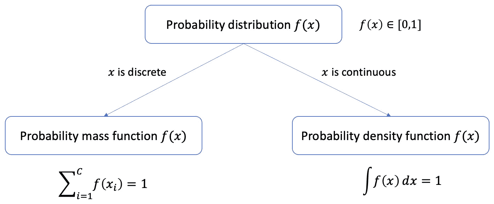

图 10.1 – 总结两种概率分布的分类。两种分布的总和为 1

注意，每个概率分布都有一个与之相关的闭式表达式和一组相应的参数。我们将在下一部分突出显示每个分布的表达式和参数，从离散分布开始。

# 探索常见的离散概率分布

离散概率分布以其对应的概率质量函数（PMF）为特征，为输入随机变量的每个可能结果分配一个概率。离散分布中所有可能结果的概率之和等于 1，导致 ∑ i=1 C f(x_i) = 1。这也意味着其中一个结果*必须*发生，即 f(x_i) > 0，∀ i = 1, … , C。

离散概率分布在各个领域都至关重要，例如金融。它们常用于统计分析，包括假设检验、参数估计和预测建模。我们可以使用离散概率分布来量化不确定性，进行预测，并深入了解观察到的结果背后的数据生成过程。

让我们从最基本的离散分布开始：伯努利分布。

## 伯努利分布

**伯努利分布**是一种基本的离散概率分布，它指定了在单个伯努利试验中二元随机变量的行为。在这里，**伯努利试验**是一个只有两种可能结果的单一实验，这些结果也可以标记为“成功”和“失败”。它是最简单的离散概率分布，并作为更复杂分布（如二项分布和几何分布）的基础。

伯努利分布广泛应用于具有二元结果的建模场景中，例如抛硬币、是/否调查问题，或在数据集中存在/不存在特定特征的场景。例如，在统计假设检验中，伯努利分布常用于比较两种治疗某种医疗状况的成功率。在金融领域，伯努利分布可以用来模拟二元结果，例如股票价格上升或下降。

按照惯例，伯努利分布中的两种结果通常编码为成功为 `1`，失败为 `0`。伯努利分布由一个参数 p 表示，它代表成功的概率。换句话说，我们有 f(x = 1) = p。同样，由于总概率加起来为 `1`，失败的概率由 1 − p 给出，即 f(x = 0) = 1 − p。

我们可以将伯努利分布的概率质量函数（PMF）表示如下：

f(x) = {p, if x = 1 1 − p, if x = 0

或者，我们可以将 f(x) 以更紧凑的形式表示，如下所示。很容易验证这两种表示是等价的：

f(x = i) = p^i (1 − p)^(1−i) 对于 i ∈ {0,1}

注意到 p ∈ [0,1]。

对于伯努利分布的均值，μ（第一矩）和方差，σ²（第二矩），我们有以下结果：

μ = p

σ² = p(1 − p)

在下面的练习中，我们将使用 R 模拟和分析伯努利分布的随机变量。

### 练习 10.1 – 模拟和分析伯努利分布的随机变量

在这个练习中，我们将使用 `rbinom()` 函数模拟和分析伯努利分布的随机变量：

1.  模拟一个成功概率为 `0.6` 的单个伯努利试验：

    ```py

    # The probability of success
    p = 0.6
    # Produce a random Bernoulli outcome
    outcome = rbinom(1, size = 1, prob = p)
    >>> print(outcome)
    0
    ```

    这里，结果将显示为 `0` 或 `1`。我们可以控制随机种子以确保结果的再现性：

    ```py
    set.seed(8)
    >>> rbinom(1, size = 1, prob = p)
    1
    ```

1.  生成五个具有相同成功概率的随机伯努利结果：

    ```py

    # Number of experiments
    n = 5
    # Generate corresponding outcomes
    outcomes = rbinom(n, size = 1, prob = p)
    >>> print(outcomes)
    1 0 0 1 0
    ```

1.  计算伯努利分布的均值和方差：

    ```py

    # Get mean and variance
    mean_bernoulli = p
    var_bernoulli = p * (1 - p)
    >>> cat("Mean:", mean_bernoulli, "\nVariance:", var_bernoulli)
    Mean: 0.6
    Variance: 0.24
    ```

    在这里，我们使用 `cat()` 函数连接并打印结果。

1.  从观察/实证成功的概率来分析多次伯努利试验的结果：

    ```py

    # Number of successes
    num_successes = sum(outcomes)
    # Empirical probability of success
    empirical_p = num_successes / n
    >>> cat("Number of successes:", num_successes, "\nEmpirical probability of success:", empirical_p)
    Number of successes: 2
    Empirical probability of success: 0.4
    ```

    由于我们只采样了 5 次，成功的结果的实证概率 (`0.4`) 与真实概率 (`0.6`) 相差甚远。我们可以增加随机试验的规模以获得更可靠的估计：

    ```py
    n = 1000
    num_successes = sum(rbinom(n, size = 1, prob = p))
    empirical_p = num_successes / n
    >>> cat("Number of successes:", num_successes, "\nEmpirical probability of success:", empirical_p)
    Number of successes: 600
    Empirical probability of success: 0.6
    ```

    使用总共 `1000` 次试验，我们现在可以重现成功的确切概率。

下一个部分回顾了二项分布。

## 二项分布

`1` 或 `0`。具体来说，它是一个离散概率分布，指定了在给定数量的伯努利试验中的成功次数。这些试验是独立的，并且具有相同成功的概率。

二项分布 PMF 有两个参数：

+   试验次数，n

+   每次试验中成功的概率，p

注意

我们仍然假设只有两种可能的结果：成功 (`1`) 或失败 (`0`)。失败的概率也可以表示为 q，其中 q = 1 − p。

总共有 k 次成功的二项分布的 PMF 如下公式给出：

P(x = k) = C(n, k) p^k (1 − p)^(n−1)

这里，C(n, k) 表示从 n 次试验中选择 k 次成功的组合数，可以使用二项式系数公式计算：

C(n, k) = n! / (k! * (n − k)!)

前两个矩如下：

μ = np

σ² = np(1 − p)

使用二项分布的 PMF，我们可以计算在特定次数的试验中观察特定次数成功的概率。

二项分布与其他概率分布有一些重要关系。例如，当 n 趋向于无穷大且 p 保持不变时，二项分布收敛到正态分布，这是一种将在后面介绍的连续概率分布。

让我们通过一个练习来熟悉与二项分布相关的函数。

### 练习 10.2 – 模拟和分析二项随机变量

在这个练习中，我们将使用 `dbinom()` 和 `pbinom()` 函数模拟和分析二项分布的随机变量：

1.  使用 `dbinom()` 函数根据成功概率为 `0.5` 和总共 10 次试验的二项分布计算观察 0 到 10 次成功的概率：

    ```py

    n = 10 # Number of trials
    p = 0.5 # Probability of success
    # Get binomial probabilities for different occurrences of successes
    binom_probs = dbinom(0:n, n, p)
    >>> binom_probs
    [1] 0.0009765625 0.0097656250 0.0439453125 0.1171875000
     [5] 0.2050781250 0.2460937500 0.2050781250 0.1171875000
     [9] 0.0439453125 0.0097656250 0.0009765625
    ```

    在这里，我们使用 `0:n` 来创建一个从 0 到 10 的整数列表，每个整数随后将传递给 `dbinom()` 函数以评估相应的概率。

1.  使用 `barplot()` 函数创建二项概率的条形图：

    ```py

    >>> barplot(binom_probs, names.arg = 0:n, xlab = "Number of Successes", ylab = "Probability", main = "Binomial Distribution (n = 10, p = 0.5)")
    ```

    运行此代码生成 *图 10**.2*，显示中间发生 5 次的概率最高：

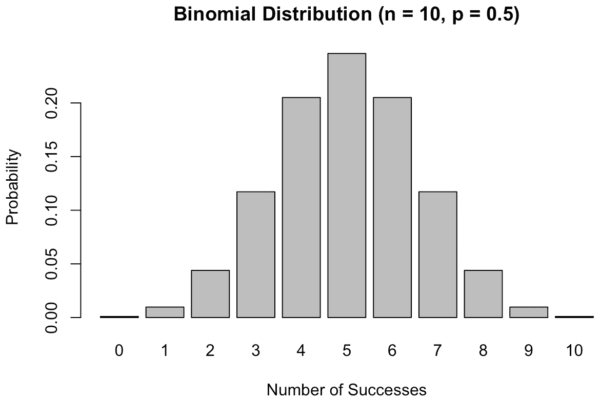

图 10.2 – 使用 n=10 和 p=0.5 可视化二项分布

1.  使用 `pbinom()` 函数计算累积二项概率：

    ```py

    cum_binom_probs <- pbinom(0:n, n, p)
    >>> cum_binom_probs
    [1] 0.0009765625 0.0107421875 0.0546875000 0.1718750000
     [5] 0.3769531250 0.6230468750 0.8281250000 0.9453125000
     [9] 0.9892578125 0.9990234375 1.0000000000
    ```

    结果显示，累积二项概率是从 CDF 中计算出来的，它是 PMF 中前一个元素概率的累积和。

    我们还可以使用 CDF 来计算观察特定值或更高的概率。

1.  计算至少获得七次成功的概率：

    ```py

    prob_at_least_7_successes = 1 - pbinom(6, n, p)
    >>> prob_at_least_7_successes
    0.171875
    ```

    在这里，通过观察 6 次或更少的成功来计算至少获得 7 次成功的概率，即我们有 P(X ≥ 7) = 1 − P(X ≤ 6)。

让我们通过另一个与实际应用相关的练习来将这些计算置于适当的背景中。

### 练习 10.3 – 计算获胜概率

在这个练习中，我们将计算体育队的获胜概率：

1.  假设体育队赢得比赛的概率为 80%。如果总共有五场比赛，那么赢得至少四场比赛的概率是多少？

    ```py

    n = 5
    p = 0.8
    prob_at_least_4_wins = 1 - pbinom(3, n, p)
    >>> prob_at_least_4_wins
    0.73728
    ```

1.  计算最多赢得三场比赛的概率：

    ```py

    prob_at_most_3_wins = pbinom(3, n, p)
    >>> prob_at_most_3_wins
    0.26272
    ```

    注意，这个概率是赢得至少四场比赛的前一个概率的补数。我们可以如下验证这个关系：

    ```py
    >>> prob_at_most_3_wins == 1 – prob_at_least_4_wins
    TRUE
    ```

在下一节中，我们将暂停讨论二项分布的正态近似。这种关系在统计分析中得到广泛应用，其根源在于中心极限定理。

### 二项分布的正态近似

正态分布（或**高斯分布**）对二项分布的近似表明，二项分布可以被一个具有相同均值（μ = np）和方差值（σ² = np(1 - p)）的正态分布所近似。这种正态近似随着实验次数（n）的增加和成功概率（p）不接近 0 或 1 而变得更加准确。作为一个经验法则，我们通常在 np ≥ 10 和 nq ≥ 10 时使用正态近似。

要使用正态近似，我们需要通过以下公式将二项随机变量 x 标准化，将其转换为标准正态变量 z 的形式：

z = x - μ / σ

这里，μ = np，σ = √np(1 - p)。这也被称为**z 分数**。在尝试将不同数量比较在相同尺度上时，进行这种标准化是一种常见做法。我们可以利用标准正态分布（稍后介绍）来处理相应的 PDF 或 CDF，具体取决于具体任务。在这种情况下，我们可以使用标准正态分布（即 N(0,1)）来近似与二项分布相关的概率。

让我们来看一个具体的例子。假设我们抛掷一枚硬币 100 次（假设是公平的硬币，正面和反面的概率相等）并希望计算得到 40 到 60 个头（包括两端）的概率。令 x 表示头数。我们知道 x 服从参数为 n = 100 和 p = 0.5 的二项分布。

为了检查正态近似是否合适，我们计算 np = 100 * 0.5 = 50 > 10 和 np(1 - p) = 100 * 0.5 * 0.5 = 25 > 10。我们还可以使用 R 进行验证，如下面的代码片段所示：

```py

n = 100
p = 0.5
# check conditions for normal approximation
>>> n*p > 10
TRUE
>>> n*p*(1-p) > 10
TRUE
```

两个条件都评估为`TRUE`。现在，我们可以将上限和下限（分别为`60`和`40`）标准化，将它们转换为标准化分数。为此，我们需要获得二项分布的参数，然后应用标准化公式，z = x - μ / σ，以获得 z 分数。以下代码片段完成了标准化：

```py

# compute mean and std
mu = n*p
>>> mu
50
std = sqrt(n*p*(1-p))
>>> std
5
# compute P(lower_limit <= X <= upper_limit)
lower_limit = 40
upper_limit = 60
# Using z score
standard_lower_limit = (lower_limit – mu) / std
standard_upper_limit = (upper_limit – mu) / std
>>> standard_lower_limit
-2
>>> standard_upper_limit
2
```

使用标准化后的 z 分数，我们现在可以仅基于标准正态分布来计算原始概率。换句话说，我们有以下：

P(40 ≤ x ≤ 60) = P(40 - 50 / 5 ≤ x - 50 / 5 ≤ 60 - 50 / 5) = P(-2 ≤ z ≤ 2)

如以下代码片段所示，我们现在可以调用`pnorm()`函数来计算 z = -2 和 z = 2 处的累积分布函数（CDF），它们的差值给出了最终的概率：

```py

# approximate using standard normal cdf
>>> pnorm(standard_upper_limit) - pnorm(standard_lower_limit)
0.9544997
```

让我们也计算使用二项分布对应的概率，看看正态近似有多接近。以下代码片段使用`pbino()`函数在两个极限处获得二项分布的 CDF，然后取差值给出在这个范围内的观察结果的总体概率：

```py

# use binomial distribution
>>> pbinom(upper_limit, n, p) - pbinom(lower_limit, n, p)
0.9539559
```

结果显示，近似值精确到小数点后第二位。因此，归一化近似法为计算概率提供了一种替代方法，如果直接使用二项分布不方便的话。然而，尽管正态近似是一个强大的工具，我们仍然需要检查所需条件以确保良好的近似。

*图 10.3* 总结了计算观察特定值范围的总体概率的两种方法。我们可以通过计算范围两个边界之间的累积分布函数（CDF）的差来计算它。或者，我们可以依赖正态分布来近似二项分布，并在满足条件的情况下，根据这些参数获得标准化的 z 分数后计算总体概率：

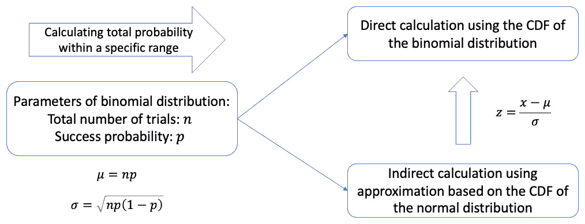

图 10.3 – 总结在计算观察特定值范围的总体概率时对二项分布的正态近似

我们将在下一节回顾泊松分布。

## 泊松分布

另一个流行的离散概率分布也是泊松分布，它描述了在固定时间或空间区间内的事件数量。它有一个单一常数参数，指定了发生平均速率。具体来说，我们必须将λ表示为给定区间内事件发生的平均速率。我们可以将泊松分布的概率质量函数（PMF）表示如下：

P(x = k) = λ^k e^(-λ) / k!

在这里，P(x = k)表示在固定区间内经历总共 k 次发生的概率，e 是欧拉数（约等于 2.71），而 k!是 k 的阶乘（所有正整数乘积到 k）。

使用这个公式，我们可以计算在给定固定区间内观察到任何（整数）事件数量的概率。我们还可以进一步计算泊松分布的均值和方差如下：

μ = λ

σ² = λ

泊松分布通常用于模拟独立发生且平均发生速率恒定的事件。泊松过程的一些实际应用包括每小时前台收到的酒店预订数量和一天内收到的电子邮件数量。

让我们通过一个练习来熟悉与泊松分布相关的常见概率计算。

### 练习 10.4 – 模拟和分析泊松分布的随机变量

在这个练习中，我们将使用 R 来处理泊松分布，包括计算概率（使用概率质量函数 PMF）、绘制分布图和生成随机样本。具体来说，我们将计算平均发生率为每间隔 5 个事件的泊松概率（λ = 5），绘制概率质量函数 PMF，并计算累积概率。我们还将从这个泊松分布中生成 100 个观察值的随机样本：

1.  根据λ = 5 的泊松分布参数，使用 `dpois()` 函数计算每个间隔内观察到 0 到 15 个发生/事件的概率：

    ```py

    lambda = 5 # distribution parameter
    # Calculate probabilities for each scenario
    pois_probs = dpois(0:15, lambda)
    >>> pois_probs
    [1] 0.0067379470 0.0336897350 0.0842243375 0.1403738958
     [5] 0.1754673698 0.1754673698 0.1462228081 0.1044448630
     [9] 0.0652780393 0.0362655774 0.0181327887 0.0082421767
    [13] 0.0034342403 0.0013208616 0.0004717363 0.0001572454
    ```

1.  创建泊松概率的条形图：

    ```py

    >>> barplot(pois_probs, names.arg = 0:15, xlab = "Number of Events", ylab = "Probability", main = "Poisson Distribution (lambda = 5)")
    ```

    运行此代码生成 *图 10**.4*。如预期，峰值概率出现在 5 次左右：

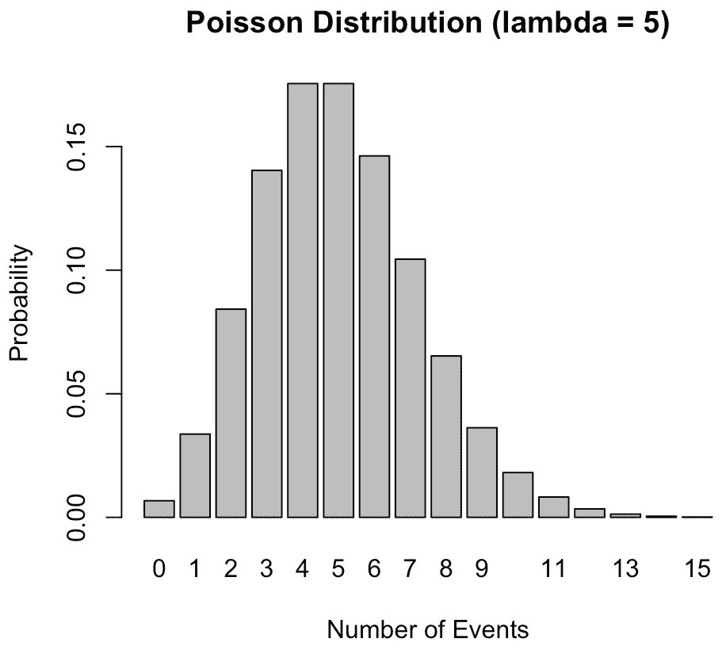

图 10.4 – 将泊松分布的概率质量函数 PMF 以条形图的形式可视化

1.  使用 `ppois()` 函数计算每个事件数（0 到 15）的累积泊松概率：

    ```py

    cum_pois_probs = ppois(0:15, lambda)
    >>> cum_pois_probs
    [1] 0.006737947 0.040427682 0.124652019 0.265025915
     [5] 0.440493285 0.615960655 0.762183463 0.866628326
     [9] 0.931906365 0.968171943 0.986304731 0.994546908
    [13] 0.997981148 0.999302010 0.999773746 0.999930992
    >>> barplot(cum_pois_probs, names.arg = 0:15, xlab = "Number of Events", ylab = "Cumulative Probability", main = "CDF of Poisson Distribution (lambda = 5)")
    ```

    运行此代码生成 *图 10**.5*。注意，CDF 曲线在平均发生 5 次附近急剧上升，并向图形的右侧逐渐饱和：

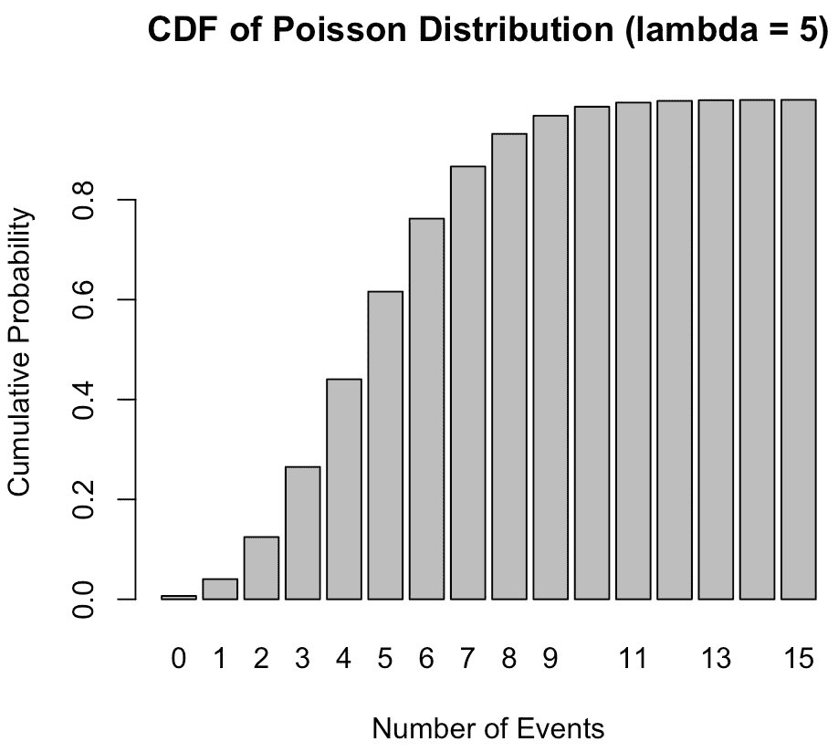

图 10.5 – 将泊松分布的累积分布函数 CDF 以条形图的形式可视化

1.  使用 `rpois()` 函数从这个泊松分布中生成 `100` 个随机样本：

    ```py

    pois_samples = rpois(100, lambda)
    >>> pois_samples
      [1]  8  5  8  4  3  4  6  2  5  6  3  3  7  8  8  7
     [17]  5  9  6  1  4  2  7  7  5  5  5  2  7  4  6  5
     [33]  4  4  3  0  8  5  4  4  7  5 11  6  5  4  8  8
     [49]  2  5  6  2  3  4  6  4  6  2  5  3  6  0  5  8
     [65]  7  1  8  4  4  4  4  5  4  4  4  5  5  6  3  4
     [81]  3  0  8  9  2  3  4 13  2  6  8  9  6  4  7  7
     [97]  8  6  3  5
    ```

    如预期，大多数发生次数都在 5 次左右。

## 泊松分布对二项分布的近似

结果表明，我们还可以在特定条件下使用泊松分布来近似二项分布。例如，当二项分布中的试验次数（n）很大且成功概率（p）很小时，二项分布可以被近似为λ = np 的泊松分布。

让我们用一个例子来演示如何将泊松近似应用于二项分布。假设我们有一个 n = 1000 和 p = 0.01 的二项分布。我们想找到观察到恰好 15 次成功的概率：

1.  我们可以从二项概率开始，指定参数后使用 `dbinom()` 函数计算相应的概率：

```py

# Binomial parameters
n = 1000
p = 0.01
# Probability of observing 15 successes
binom_prob = dbinom(15, n, p)
>>> binom_prob
0.03454173
```

接下来，我们必须计算近似的泊松参数，λ = np:

```py

lambda_approx = n * p
>>> lambda_approx
10
```

现在，我们可以计算观察到 15 次成功的泊松概率：

```py

pois_approx_prob <- dpois(15, lambda_approx)
>>> pois_approx_prob
0.03471807
```

结果表明，近似值在第三位小数点处相当准确。

另一个有趣的性质是，将几个独立的泊松分布随机变量相加也会产生泊松分布，其参数为相应单个λ值的总和。例如，如果 x₁和 x₂是分别具有λ₁和λ₂的独立泊松随机变量，它们的和（y = x₁ + x₂）也遵循λ = λ₁ + λ₂的泊松分布。这在处理多个泊松分布随机变量的和时提供了一个方便的性质。

在下一节中，我们将介绍另一个广泛使用的离散分布：几何分布。

## 几何分布

几何分布是一种离散概率分布，描述了在一系列独立伯努利试验中，每个试验具有相同的成功概率，第一次成功所需的试验次数。与二项分布类似，几何分布是多个独立伯努利试验的集合，尽管感兴趣的是试验序列中成功的第一次发生。在这里，成功的第一次发生意味着所有之前的试验都需要是非成功，而当前试验是在迄今为止进行的多个试验中第一次成功。

它通常用于模拟事件发生前的等待时间或达到期望结果所需的尝试次数。例如，包括通过驾驶考试所需的尝试次数直到成功、连续晴天观察的次数以及获得第一次正面所需的抛硬币次数。在模拟一系列独立伯努利试验中第一次成功所需的等待时间或尝试次数时，几何分布非常有用。

几何分布由一个参数 p 定义，该参数代表每次伯努利试验成功的概率。几何分布的概率质量函数（PMF）由以下公式给出：

P(x = k) = (1 − p)^(k−1) * p

此公式指定了在 k 次试验中观察到第一次成功的概率。因此，该概率是通过观察 k 个独立事件的联合概率来计算的，其中前 k-1 个事件是非成功，联合概率为(1 − p)^(k−1)，最后一个事件是成功，概率为 p。

几何分布的均值和方差参数可以表示如下：

μ = 1 / p

σ² = (1 − p) / p²

注意，几何分布是**无记忆的**，这意味着下一次试验成功的概率不依赖于过去的试验。换句话说，直到第一次成功所需的等待时间不会因已经进行的过去试验的数量而改变。

让我们通过一个练习来模拟和分析一个遵循几何分布的随机变量。

### 练习 10.5 – 模拟和分析几何分布的随机变量

在这个练习中，我们将使用 R 来处理几何分布，包括计算概率质量函数（PMF）和累积分布函数（CDF）概率，绘制分布，并生成随机样本：

1.  对于成功概率为 p = 0.25 的几何分布，使用 `dgeom()` 函数计算每个试验次数（从 1 到 10）的几何概率：

    ```py

    # Parameters
    p = 0.25 # Probability of success
    # Get geometric probabilities
    geom_probs = dgeom(0:9, p)
    >>> geom_probs
    [1] 0.25000000 0.18750000 0.14062500 0.10546875 0.07910156 0.05932617
     [7] 0.04449463 0.03337097 0.02502823 0.01877117
    ```

    注意，`0:9` 参数表示 `dgeom()` 函数中的失败次数。

1.  为这些几何概率创建条形图：

    ```py

    >>> barplot(geom_probs, names.arg = 1:10, xlab = "Number of Trials", ylab = "Probability", main = "Geometric Distribution (p = 0.25)")
    ```

    运行此代码生成**图 10**.6*. 如预期，随着试验次数的增加，获得更长的连续失败序列的概率降低：

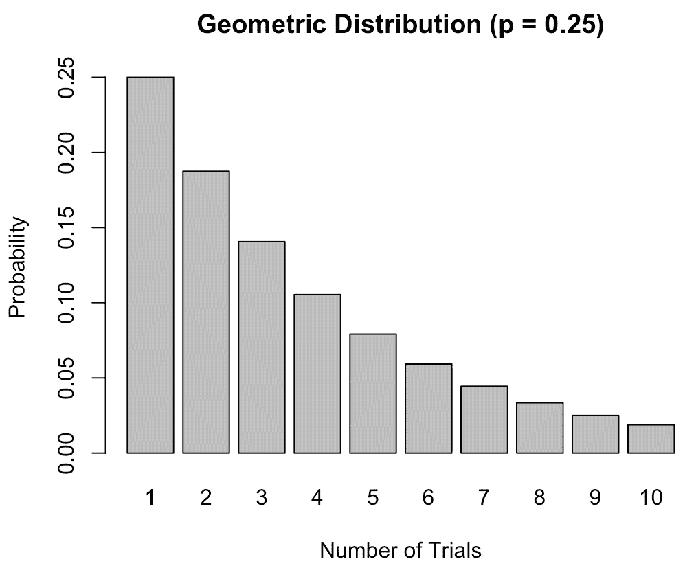

图 10.6 – 将几何分布的概率质量函数（PMF）作为条形图可视化

1.  使用 `pgeom()` 函数计算之前试验的累积几何概率：

    ```py

    cum_geom_probs = pgeom(0:9, p)
    >>> cum_geom_probs
    [1] 0.2500000 0.4375000 0.5781250 0.6835938 0.7626953
     [6] 0.8220215 0.8665161 0.8998871 0.9249153 0.9436865
    ```

1.  使用 `rgeom()` 函数从这个几何分布中生成 100 个随机样本：

    ```py

    geom_samples = rgeom(100, p)
    >>> geom_samples
      [1]  0  0  0  2 10  1  1 10  0  0  1  1  5  3  1  0  2  0  0
     [20]  4  0  1  4  2  3  2  2  2  4  1  6 12  4  1  7  3  1  1
     [39]  0  2  1  2  3  0  8  0  0  2 10  3  2  8  0  3  1  2  3
     [58]  0  0  1  7  0  0  3  4 11  8  8  2  0  5  1  1  1  3  1
     [77]  3  1  3  3  6  0  0  7  1  0  0  1  0  1  0  0  0  3  0
     [96]  0  4 25  0  3
    ```

    结果显示，随着数字增大，频率逐渐降低，这与几何分布的概率质量函数（PMF）相匹配。

让我们通过另一个与概率相关的练习来查找计算机程序中的错误。

### 练习 10.6 – 模拟和分析几何分布的随机变量

在这个练习中，我们将访问一个涉及软件测试员尝试在计算机程序中查找错误的现实世界示例。在这个例子中，软件测试员每次尝试找到错误的概率为 `0.1`，且尝试是独立的。公司想知道在第一次五次尝试内找到第一个错误的概率，以及找到第一个错误所需的预期尝试次数：

1.  使用 `pgeom()` 函数计算在第一次五次尝试内找到第一个错误的概率：

    ```py

    p = 0.1 # Probability of finding a bug on each attempt
    # Calculate the CDF for up to 5 attempts
    prob_within_5_attempts = pgeom(4, p)
    >>> prob_within_5_attempts
    0.40951
    ```

    这里，请注意我们使用 `4`，因为 `dgeom()` 函数使用零基索引。

    由于 `pgeom()` 函数返回特定输入的累积分布函数（CDF），我们可以通过将所有之前的概率加到当前输入上等效地计算这个概率，如下所示：

    ```py
    >>> sum(dgeom(0:4, p))
    0.40951
    ```

1.  使用几何分布的均值（期望值）计算找到第一个错误所需的预期尝试次数：

    ```py

    mean_attempts <- 1 / p
    >>> mean_attempts
    10
    ```

1.  在条形图中可视化在不同尝试次数（从 `1` 到 `20`）内找到第一个错误的概率：

    ```py

    geom_probs <- dgeom(0:19, p)
    # Create a bar plot of probabilities
    barplot(geom_probs, names.arg = 1:20, xlab = "Number of Attempts", ylab = "Probability", main = "Geometric Distribution (p = 0.1)")
    ```

    运行此代码生成**图 10**.7*. 此图表明，随着我们向右移动，需要连续失败流的事件（那些具有较低概率的事件）的概率更低：

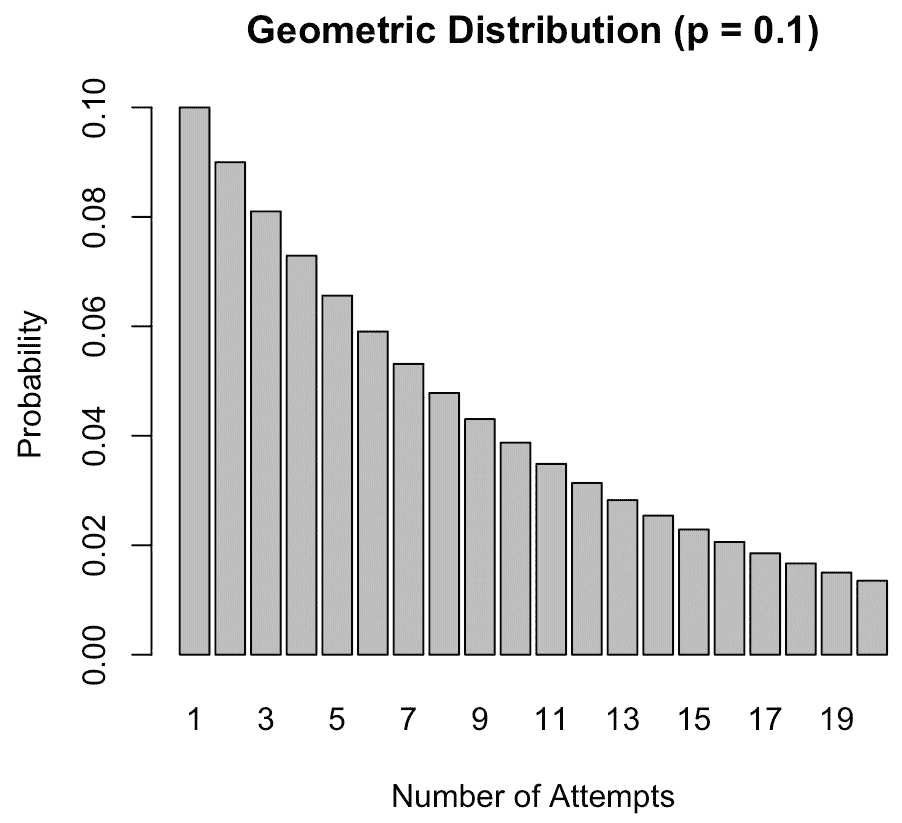

图 10.7 – 在不同尝试次数内可视化找到第一个错误的概率

如此图表所示，观察到第一个错误的概率随着尝试次数的增加而降低。

## 比较不同的离散概率分布

本章迄今为止介绍的离散概率分布是模拟结果变量取离散值场景的必要工具。每个离散分布都有特定的假设、属性和应用。*图 10.8* 通过比较二项分布、泊松分布和几何分布的主要特征提供了总结和解析：

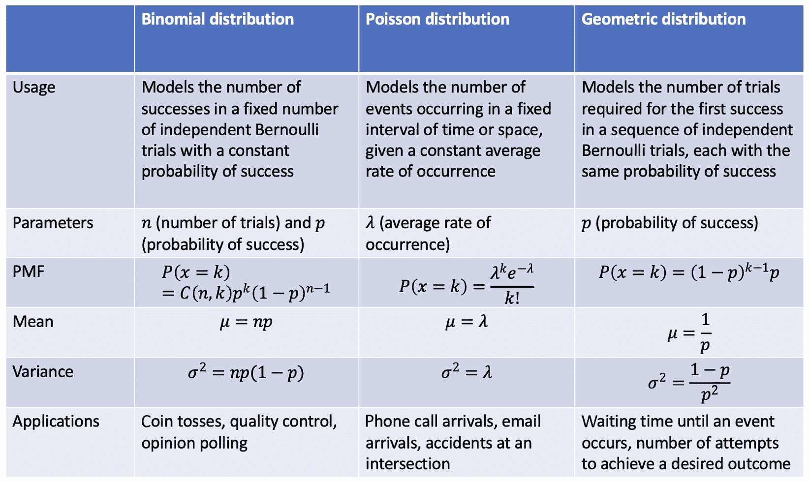

图 10.8 – 总结和比较不同的离散分布

在手头有不同离散分布的情况下，了解每个分布的具体假设和要求，对于选择给定问题的合适分布非常重要。例如，二项分布适用于模拟在给定次数的实验中成功的次数，泊松分布适用于模拟在固定期间内发生的事件数，几何分布通常用于模拟达到第一次成功所需的试验次数。

在实践中，这些离散概率分布可以用来分析各种现实世界场景，进行预测和优化流程。了解每个分布的特征和应用，可以帮助你为特定问题选择合适的分布，并使用 R 进行相关分析。

下一个部分介绍了连续分布，包括正态分布、指数分布和均匀分布。

# 发现常见的连续概率分布

连续概率分布用于模拟随机变量在特定连续范围内取任何值的概率。换句话说，基础随机变量是连续的而不是离散的。这些分布描述了观察到的值落在连续区间内的概率，而不是在离散概率分布中等于单个离散结果的概率。具体来说，在连续概率分布中，随机变量等于任何特定值的概率通常为零，因为可能的结果是不可数的。相反，连续分布的概率是针对区间或值范围的。

我们可以使用 PDF 来描述连续分布。这对应于离散概率分布的 PMF。PDF 定义了在给定点周围无限小间隔内观察到一个值的概率。PDF 曲线在特定范围内的面积代表随机变量落在该范围内的概率——也就是说，通过在所需范围内对 PDF 进行积分来计算区间或值范围的概率。相比之下，PMF 为单个点分配概率，通过将它们的个别概率相加来计算一组离散值的概率。

此外，连续概率分布的可视化也有所不同。与用于离散概率分布 PMF 的条形图相比，连续分布的 PDF 以称为密度图的平滑曲线绘制。曲线在特定范围内的面积代表随机变量落在该范围内的概率。

*图 10.9*总结了离散和连续概率分布之间的主要差异：

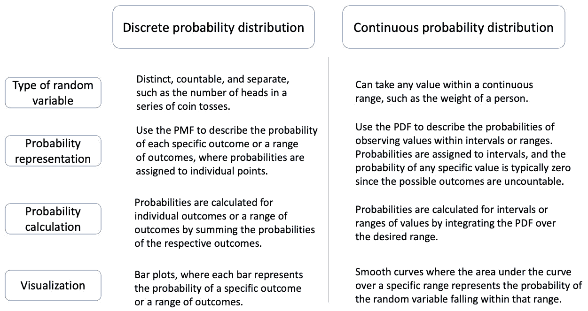

图 10.9 – 总结离散和连续概率分布之间的差异

总结来说，离散和连续概率分布模型不同类型的随机变量。离散概率分布表示可数的输出结果，而连续分布表示在连续范围内不可数的可能性。这两种分布类型之间的差异决定了我们如何为特定问题选择合适的分布并执行相关分析。

在下一节中，我们将介绍最广泛使用的连续概率分布：正态概率分布。

## 正态分布

**正态概率分布**，也称为**高斯分布**，是一种连续概率分布，它模拟了连续结果围绕均值对称分布的场景。由于许多自然和社会现象由于中心极限定理的结果往往遵循正态分布，因此它是实践中最广泛使用的概率分布。

两个参数用于描述正态分布：均值（μ）和标准差（σ）。均值代表分布的中心趋势或平均值。分布中心的值获得最高的概率。标准差描述数据从均值的离散程度，作为分布变异性的度量。

正态分布的概率密度函数（PDF）如下所示：

f(x) = 1 / √(2πσ) e^(-(x−μ)² / (2σ²))

我们也可以写成 x ∼ N(μ, σ²)，这表示随机变量 x 遵循由 μ 和 σ² 参数化的正态分布。

从图形上看，正态分布看起来像钟形曲线，大多数值集中在均值附近，两端极端的值较少。一个经验法则，称为 68-95-99.7 规则，表示大约 68% 的值位于均值加减一个标准差范围内，95% 在加减两个标准差范围内，99.7% 在加减三个标准差范围内。

一种常用的特定正态分布是标准正态分布，表示为 z ∼ N(0, 1) – 即，标准正态分布具有 μ = 0 和 σ = 0。一个特殊性质是我们可以使用以下公式将任何正态分布的随机变量转换为标准正态变量：

z = x − μ / σ

然后，我们可以使用标准正态分布表（称为 Z 表）来找到感兴趣的概率和分位数。

让我们通过一个练习来练习与正态分布相关的计算。

### 练习 10.7 – 模拟和分析正态随机变量

在这个练习中，我们将模拟和分析正态分布的随机变量：

1.  使用 `dnorm()` 函数计算标准正态分布从 `-4` 到 `4` 的概率密度，步长为 `0.1`：

    ```py

    # Parameters
    mu = 0      # Mean
    sigma = 1   # Standard deviation
    # Get the probability density for different x
    x = seq(-4, 4, by = 0.1)
    normal_density = dnorm(x, mu, sigma)
    ```

    在这里，我们使用 `seq()` 函数创建一个等间距的值向量，并使用 `dnorm()` 函数提取每个输入值的对应概率。

1.  使用 `plot()` 函数将正态分布绘制为连续曲线：

    ```py

    # Plot the normal distribution
    >>> plot(x, normal_density, type = "l", xlab = "x", ylab = "Probability Density", main = "Normal Distribution (μ = 0, σ = 1)")
    ```

    运行此代码生成 *图 10**.10*，它显示 PDF 以均值 `0` 为中心，具有标准差 `1` 的分布范围：

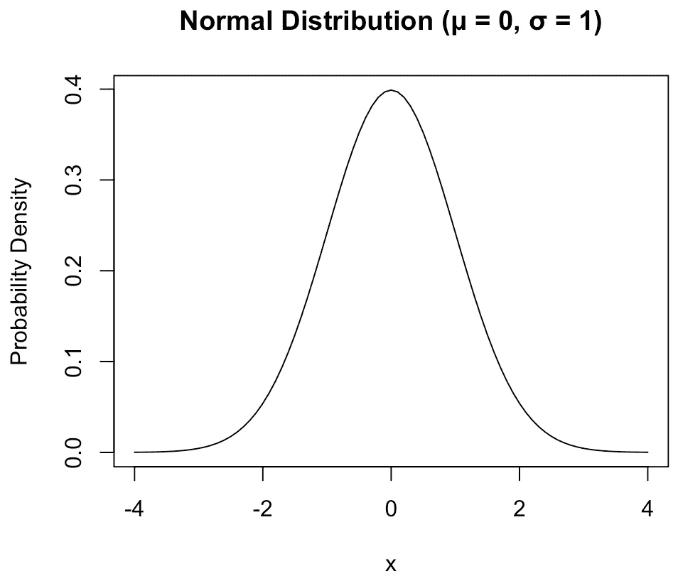

图 10.10 – 标准正态分布密度图的可视化

1.  使用 `pnorm()` 函数计算正态分布的累积概率：

    ```py

    # Get cumulative probabilities for different x
    normal_cum_prob <- pnorm(x, mu, sigma)
    >>> plot(x, normal_cum_prob, type = "l", xlab = "x", ylab = "Cumulative Probability Density", main = "Cumulative Normal Distribution (μ = 0, σ = 1)")
    ```

    运行此代码生成 *图 10**.11*：

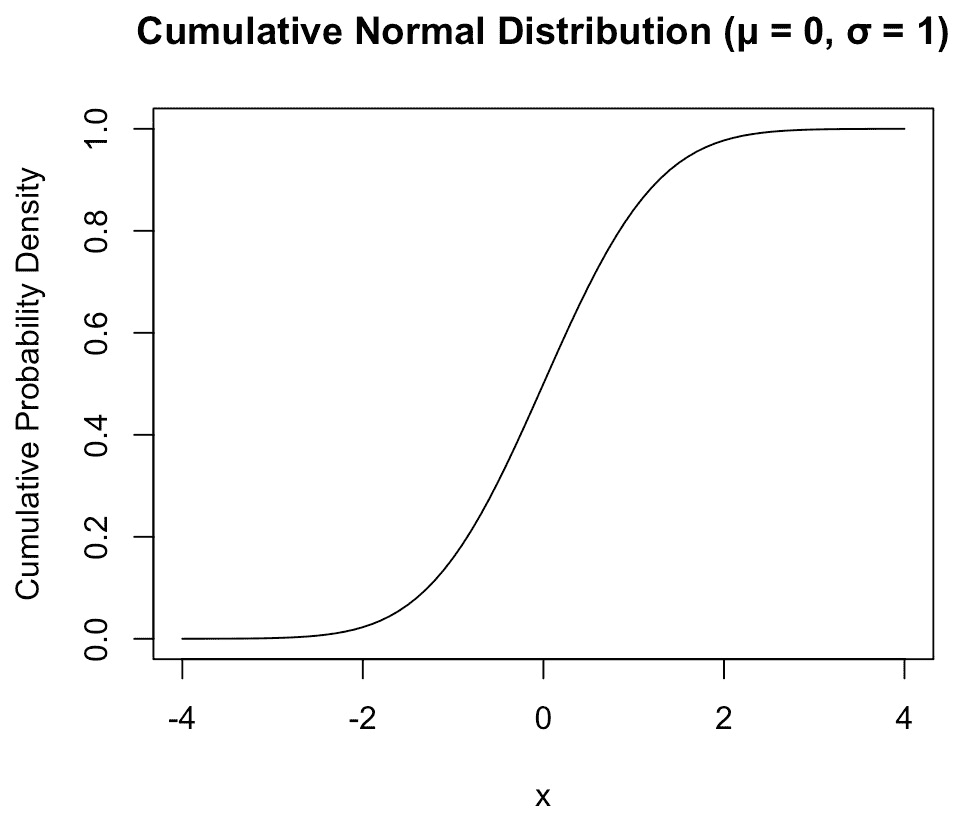

图 10.11 – 标准正态分布累积密度函数的可视化

1.  使用 `rnorm()` 函数从正态分布中生成随机样本：

    ```py

    # Generate 100 random samples from a normal distribution with μ = 0 and σ = 1
    normal_samples <- rnorm(100, mu, sigma)
    ```

1.  使用 `qnorm()` 函数找到一个给定概率的 90% 分位数（逆累积概率）：

    ```py

    # Find the quantile corresponding to the 90th percentile
    quantile_90 <- qnorm(0.9, mu, sigma)
    >>> quantile_90
    1.281552
    ```

让我们看看另一个使用正态分布解决实际问题的练习。

### 练习 10.8 – 使用正态分布计算概率

假设一家公司生产的电池平均寿命为 100 小时，标准差为 10 小时。假设电池的寿命遵循正态分布：

1.  模拟一个包含 1,000 个电池的数据集：

    ```py

    set.seed(8)
    mean_lifespan = 100
    sd_lifespan = 10
    n = 1000
    lifespans = rnorm(n, mean_lifespan, sd_lifespan)
    ```

    在这里，我们使用`rnorm()`函数从给定的正态分布中随机抽样。我们还指定了随机种子以确保可重复性。

1.  计算随机选择的一块电池使用时间超过 120 小时的概率：

    ```py

    threshold = 120
    probability = 1 - pnorm(threshold, mean_lifespan, sd_lifespan)
    >>> probability
    0.02275013
    ```

    在这里，我们使用`pnorm()`函数计算小于`120`的总概率，然后取补数以获得大于`120`的概率。

    如预期，偏离平均值两个标准差外的概率相当小。

1.  绘制寿命概率密度函数，曲线下方的面积大于`120`小时的区域进行阴影处理：

    ```py

    df <- data.frame(lifespan = lifespans)
    df_density <- density(lifespans)
    df_shaded <- data.frame(x = df_density$x, y = df_density$y)
    df_shaded <- df_shaded[df_shaded$x > threshold,]
    ggplot(df, aes(x=lifespan)) +
      geom_density(fill="lightblue") +
      geom_vline(xintercept = threshold, linetype="dashed", color="red") +
      geom_area(data = df_shaded, aes(x=x, y=y), fill="orange", alpha=0.5) +
      theme_minimal() +
      labs(title="Lifespan of batteries", x="Lifespan (hours)", y="Probability Density")
    ```

    在这里，我们构建一个 DataFrame，`df`，用于存储样本值和通过`density()`函数获得的相应密度。然后我们子集以获取要阴影处理的区域的相应 DataFrame，`df_shaded`。在`ggplot`中，我们使用`geom_density()`函数绘制密度曲线，`geom_vline()`添加表示阈值的垂直线，以及`geom_area()`对右侧区域进行阴影处理。

    运行此代码将生成**图 10.12**：

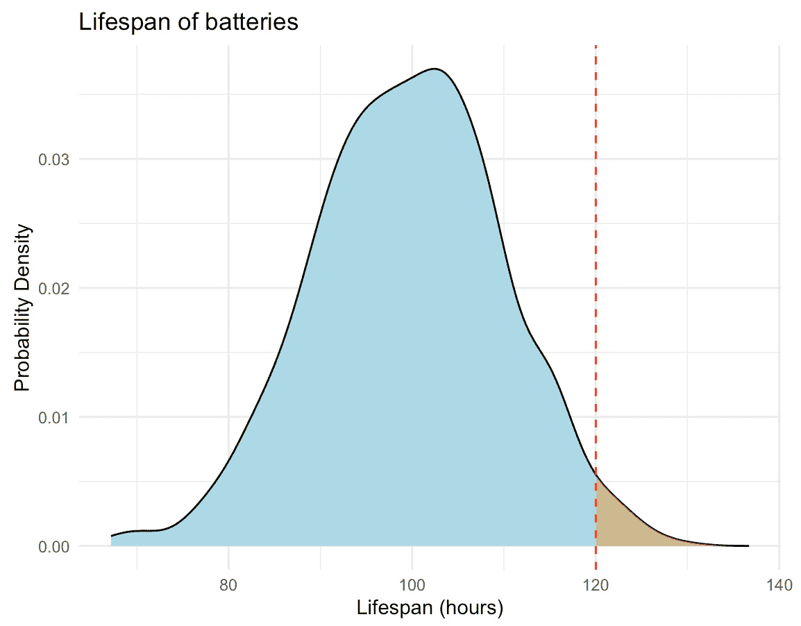

图 10.12 – 使用阴影区域可视化经验正态分布的概率密度函数

下一节将介绍另一种连续概率分布：指数分布。

## 指数分布

**指数分布**是一种连续概率分布，常用于模拟泊松过程中事件之间的时间或空间。如前所述，泊松过程模拟独立且以恒定平均速率发生的事件。指数分布常用于描述罕见事件之间的等待时间，例如呼叫中心的电话之间的时间。

指数分布的概率密度函数由以下公式给出：

f(x) = λ e^(-λx), x ≥ 0

在这里，λ是速率参数，表示每单位时间或空间发生的事件的平均数量，e 是自然对数的底数。

指数分布的一个定义特征是记忆性属性，它表明未来事件发生的概率与自上次事件以来已经过去的时间无关。这使得指数分布适合用于模拟独立且罕见事件之间的等待时间。

指数分布的均值和标准差如下：

μ = 1 / λ

σ² = 1 / λ²

指数分布包含一个参数 λ，并模拟事件之间等待时间每单位时间或空间发生的平均事件数。在模拟泊松过程的情况下，相同的参数 λ 指的是在固定间隔内（无论是时间还是空间）发生的平均事件数。这两个分布都用于模拟泊松过程的各个方面。

现在，让我们通过一个练习来复习与指数分布相关的概率计算。

### 练习 10.9 – 使用指数分布计算概率

在这个练习中，我们将探讨在遵循指数分布的同时生成随机样本，并计算和可视化超过某个阈值的总概率：

1.  使用 `rexp()` 函数从具有速率参数 `0.01` 的指数分布中生成 1,000 个数据点的随机样本：

    ```py

    set.seed(8) # Set seed for reproducibility
    lambda = 0.01
    sample_size = 1000
    exponential_sample = rexp(sample_size, rate = lambda)
    ```

1.  使用 `pexp()` 函数计算事件之间的等待时间超过 150 个单位时的概率：

    ```py

    threshold = 150
    probability_above_threshold = 1 - pexp(threshold, rate = lambda)
    >>> probability_above_threshold
    0.2231302
    ```

1.  绘制 PDF 并阴影表示超过阈值的等待时间下的曲线区域：

    ```py

    # Create a data frame for the waiting times
    waiting_times = seq(0, max(exponential_sample), length.out = 1000)
    density_values = dexp(waiting_times, rate = lambda)
    df = data.frame(waiting_times, density_values)
    # Filter data for the shaded region
    df_shaded = df[df$waiting_times > threshold,]
    # Plot the PDF of the exponential distribution
    ggplot(df, aes(x = waiting_times, y = density_values)) +
      geom_line() +
      geom_area(data = df_shaded, aes(x = waiting_times, y = density_values), fill = "orange", alpha = 0.5) +
      geom_vline(xintercept = threshold, linetype = "dashed", color = "red") +
      theme_minimal() +
      labs(title = "Exponential Distribution ( = 0.01)", x = "Waiting Time", y = "Probability Density")
    ```

    在这里，我们创建一个用于存储在随机样本中生成的不同等待时间的 DataFrame，使用 `dexp()` 函数获取相应的密度，并构建 `df` 和 `df_shaded` DataFrame 以供 `ggplot` 使用。

    运行此代码生成 *图 10**.13*：

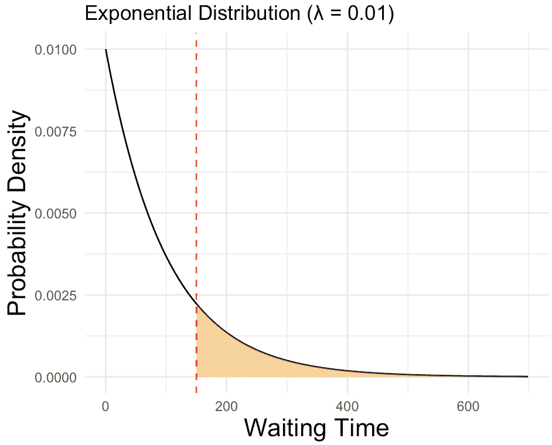

图 10.13 – 以阴影表示阈值以上的区域来可视化指数分布的经验概率密度函数

下一节将介绍均匀分布。

## 均匀分布

如其名所示，均匀分布是一种连续概率分布，其中给定范围内的所有结果出现的可能性相同。PDF（如图所示为一条直线）由两个参数定义，即下限（a）和上限（b），它们定义了可能值的范围。此范围内的所有值具有相同的发生概率，而范围外的值具有零概率。

均匀分布的 PDF 由以下公式给出：

f(x) = { 1 _ b − a , if x ∈ [a, b]  0, otherwise

均匀分布的参数如下：

μ =  a + b _ 2

σ 2 =  (b − a) 2 _ 12

让我们通过一个类似的练习来分析均匀分布的随机变量。

### 练习 10.10 – 使用均匀分布计算概率

在这个练习中，我们将探讨生成随机样本、计算概率和绘制均匀分布的 PDF：

1.  使用 `runif()` 函数从下限 (`a`) 为 `2` 和上限 (`b`) 为 `10` 的均匀分布中生成 10,000 个数据点的随机样本：

    ```py

    set.seed(8) # Set seed for reproducibility
    a = 2
    b = 10
    sample_size = 10000
    uniform_sample = runif(sample_size, min = a, max = b)
    ```

1.  使用`punif()`函数计算从均匀分布中选出的值大于`7`的概率：

    ```py

    threshold = 7
    probability = 1 - punif(threshold, min = a, max = b)
    >>> probability
    0.375
    ```

    在这里，我们使用`punif()`函数计算`a`和`threshold`之间的 CDF。我们也可以使用经验样本来近似这个概率：

    ```py
    probability2 = sum(uniform_sample > t
    hreshold) / length(uniform_sample)
    >>> probability2
    0.3771
    ```

    我们可以看到，近似相当接近，并且当样本量增大时，它将更加接近。

1.  使用`ggplot()`绘制其 PDF：

    ```py

    library(ggplot2)
    # Create a data frame for the distribution
    x_values = seq(a, b, length.out = 1000)
    density_values = dunif(x_values, min = a, max = b)
    df = data.frame(x_values, density_values)
    # Plot the PDF of the uniform distribution
    ggplot(df, aes(x = x_values, y = density_values)) +
      geom_line() +
      theme_minimal() +
      labs(title = "Uniform Distribution (a = 2, b = 10)", x = "Value", y = "Probability Density")
    ```

    在这里，我们在*x*轴上构建一系列占位符。然后，我们获得相应的密度并将它们组合成一个 DataFrame 进行绘图。运行此代码生成*图 10.14*：

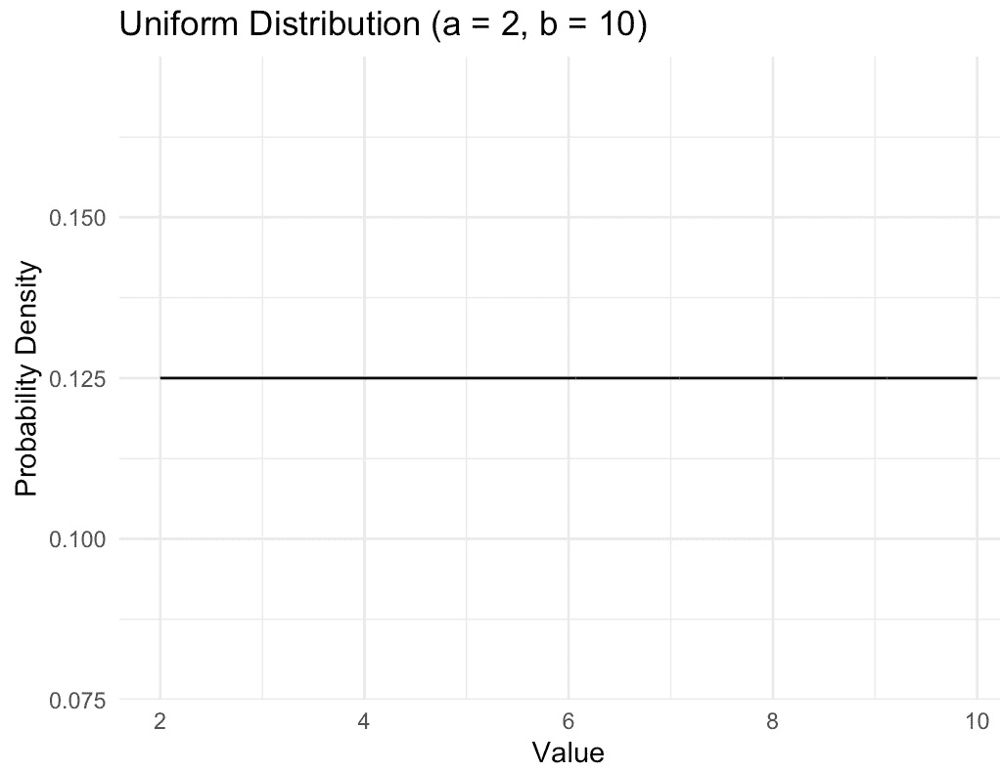

图 10.14 – 绘制均匀分布的 PDF

均匀分布可以用来生成正态分布的随机样本。让我们看看这是如何实现的。

## 生成正态分布的随机样本

到目前为止，我们已经学习了如何使用`rnorm()`函数从高斯分布中采样。这有助于了解这些随机样本是如何在幕后生成的。这种特定的技术被称为逆变换法，它依赖于目标分布（在这种情况下，正态分布）的逆 CDF 或分位数函数。

此过程涉及三个步骤。首先，我们将从均匀分布中生成随机样本，通常是 U(0,1)，其中`0`和`1`之间的所有值都是等可能的。接下来，对于每个均匀随机样本，我们将使用标准正态分布的逆 CDF（分位数函数）在目标分布中定位相应的值。最后，我们将应用缩放-定位变换将标准正态随机样本转换为目标正态分布的随机样本。

此方法依赖于连续随机变量的 CDF 是一个将样本空间（PDF 的定义域）映射到[0, 1]范围的函数。逆 CDF 是 CDF 的逆函数，将区间[0, 1]映射回样本空间。通过将均匀随机样本传递给逆 CDF，我们反转映射并得到遵循目标分布的随机样本，前提是进行额外的变换。

让我们更详细地看看这个过程。假设我们想要从正态分布 N(μ, σ²)中采样。我们如何从这个特定的分布中生成随机样本？一种方法是从标准正态分布 N(0,1)中生成一个随机样本 x，然后应用缩放-定位变换以获得最终的样本σx + μ。通过基于σ缩放样本，然后加上μ，得到的样本将遵循具有均值μ和方差σ²的正态分布。

从标准正态分布中采样的第一步是关键，而第二步是一个简单且确定的变换。我们之前介绍的方法是使用标准正态分布的逆 CDF 将均匀分布的变量进行变换。例如，如果 U 在[0,1]区间上均匀分布，那么Φ −1(U)遵循 N(0,1)，其中Φ −1 是标准正态分布累积函数的逆。

一个说明性的例子在*图 10**.15*中展示。首先，我们从[0,1]区间上的均匀分布中随机采样一个点。接下来，我们使用标准正态分布的逆累积分布函数（CDF）来获得 CDF 空间中的对应样本，考虑到 CDF 单调地将任意输入值映射到[0,1]区间的输出。从数学上讲，标准正态分布的随机样本由 x = Φ −1(U) 给出。考虑到标准正态分布的 PDF 和 CDF 之间的一一映射关系，我们也可以在 PDF 空间中获得相同的输入，x。我们还会期望大多数样本都集中在均值附近。最后，我们应用尺度-位置变换来转换为具有所需均值和方差的正态分布的随机样本：

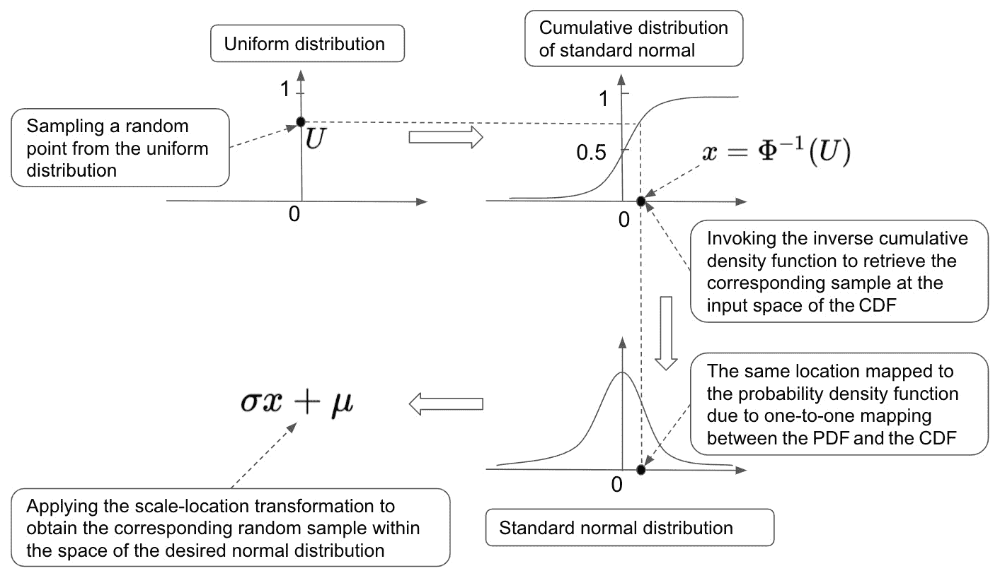

图 10.15 – 从所需的单变量高斯分布中获得随机样本

让我们通过一个具体的例子来看如何使用逆变换方法生成正态分布的随机样本。在下面的代码片段中，我们首先设置种子以实现可重复性，并定义目标正态分布的参数。然后，我们在 0 和 1 之间遵循均匀分布生成 5 个样本。最后，我们使用正态分布的逆 CDF（分位数函数，`qnorm()`）计算均匀样本的对应分位数：

```py

set.seed(8) # Set seed for reproducibility
# Define the target normal distribution parameters
mu = 5
sigma = 2
# Generate uniform random variables
n = 5
uniform_sample = runif(n)
# Calculate the corresponding quantiles for the uniform sample using the inverse CDF (quantile function) of the normal distribution
normal_sample = qnorm(uniform_sample, mean = mu, sd = sigma)
>>> normal_sample
[1] 4.830828 3.372006 6.680800 5.780755 4.073034
```

我们也可以应用尺度-位置变换来获得相同的随机样本，如下面的代码片段所示：

```py

normal_sample2 = qnorm(uniform_sample, mean = 0, sd = 1)
>>> normal_sample2 * sigma + mu
[1] 4.830828 3.372006 6.680800 5.780755 4.073034
```

下一个部分将涵盖采样分布。

# 理解常见的采样分布

采样分布是基于从总体中抽取的许多样本的样本统计量的概率分布。换句话说，它是从同一总体的多个样本集中计算出的特定统计量（如均值、中位数或比例）的分布，其中每个集合的大小相同。这里有两点需要注意。首先，采样分布不是关于从 PDF 中抽取的随机样本。相反，它是由来自另一个分布的聚合统计量构成的分布，该分布是从 PDF 中抽取的。其次，我们需要在多个回合中从 PDF 中采样以创建采样分布，其中每个回合包括从 PDF 中抽取的多个样本。

让我们通过 R 中的练习来展示使用样本均值作为感兴趣统计量的抽样分布的概念。我们将从给定分布的总体中生成样本，并计算样本均值。然后，我们将创建样本均值的直方图来可视化样本均值的抽样分布。

### 练习 10.11 – 生成抽样分布

在这个练习中，我们首先从正态分布生成一个样本总体。然后，我们将从该总体中多次抽取样本，每次抽取包含多个样本。最后，我们将提取每轮样本的均值并将它们一起绘制在直方图中：

1.  从 N(50,10)生成 100,000 个样本。使用`summary()`检查样本的摘要：

    ```py

    set.seed(8) # Set seed for reproducibility
    # Define the population parameters
    population_mean = 50
    population_sd = 10
    population_size = 100000
    # Generate the population using a normal distribution
    population <- rnorm(population_size, mean = population_mean, sd = population_sd)
    >>> summary(population)
       Min. 1st Qu.  Median    Mean 3rd Qu.    Max.
      7.597  43.261  50.051  50.027  56.781  89.365
    ```

1.  定义一个函数，从之前的总体中抽取 50 个数字并返回样本的平均值：

    ```py

    # Define the sample size in each round
    sample_size_per_round = 50
    # Function to draw a sample and calculate its mean
    get_sample_mean <- function(population, sample_size_per_round) {
      sample <- sample(population, size = sample_size_per_round, replace = FALSE)
      return(mean(sample))
    }
    ```

    在这里，我们使用`sample()`函数从之前创建的样本总体中抽取 50 个数字，不进行替换。我们可以测试这个函数，并观察到每次运行都会得到不同的返回值，这些值也接近于总体均值`50`：

    ```py
    >>> get_sample_mean(population, sample_size_per_round)
    50.30953
    >>> get_sample_mean(population, sample_size_per_round)
    48.9098
    ```

1.  将此函数重复 1,000 次以获得相应的 1,000 个样本均值：

    ```py

    # Generate multiple rounds of sample means
    num_rounds = 1000 # the number of rounds to sample
    sample_means = replicate(num_rounds, get_sample_mean(population, sample_size))
    >>> summary(sample_means)
       Min. 1st Qu.  Median    Mean 3rd Qu.    Max.
      49.76   49.96   50.02   50.03   50.09   50.34
    ```

    在这里，我们使用`replicate()`函数重复应用`get_sample_mean()`函数指定次数。它常用于模拟、重抽样方法或任何需要多次执行相同操作并收集结果的情况。

    结果显示，样本均值从抽样分布中得到的值非常接近总体均值。

1.  使用直方图可视化样本均值的抽样分布：

    ```py

    library(ggplot2)
    sampling_distribution_df = data.frame(sample_means)
    ggplot(sampling_distribution_df, aes(x = sample_means)) +
      geom_histogram(aes(y = after_stat(density)), bins = 30, color = "black", fill = "lightblue") +
      geom_density(color = "red", lwd = 1.2) +
      theme_minimal() +
      labs(title = "Sampling Distribution of the Sample Mean",
           x = "Sample Mean",
           y = "Density")
    ```

    运行此代码生成*图 10.16*：

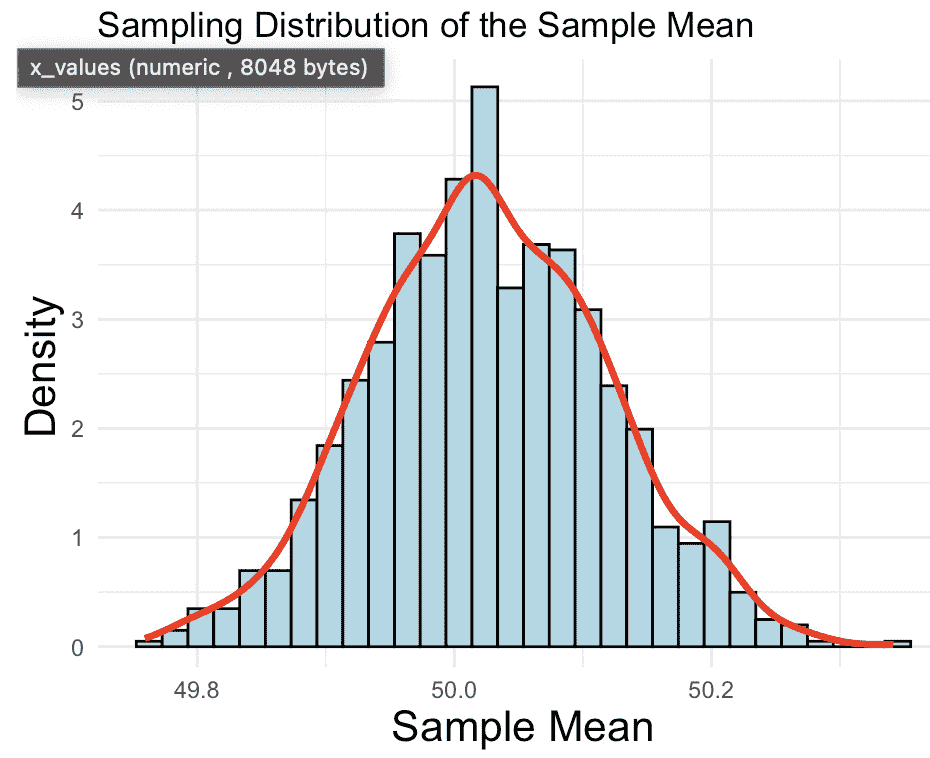

图 10.16 – 使用直方图可视化样本均值的抽样分布

在下一节中，我们将介绍在统计估计和假设检验中常用的抽样分布。

## 常见的抽样分布

几种常见的抽样分布广泛应用于统计推断。这些分布源于从总体中抽取的随机样本计算出的不同统计量的特性。以下是一些最重要的抽样分布：

+   当`n > 30`时，样本均值的抽样分布趋近于正态分布，即使原始的总体分布不一定呈正态分布。这一特性允许我们使用正态分布对样本均值进行推断，例如假设检验和置信区间构建。

+   **样本比例的抽样分布**：在大量独立的伯努利试验（二元结果）中，样本比例（样本组中成功的比例）的分布遵循正态分布，前提是样本量足够大，成功概率不太接近 0 或 1。在这种情况下，均值保持不变，标准差是经过样本量调整的转换后的总体比例。特别是，在一定的条件下（np > 10 和 n(1 − p) > 10，基于我们之前关于通过正态分布近似二项分布的介绍），样本比例的抽样分布可以近似为具有相同均值和标准差σ = √p(1 − p) / n 的正态分布。

+   **t 分布**：**t 分布**也称为**学生 t 分布**。当从正态分布的总体中抽取小样本（通常 n<30）估计总体均值，且未提供标准差时使用。t 分布的形状与正态分布相似，但尾部更厚，其确切形状由自由度（*df*）决定，通常等于 n − 1。t 分布可用于计算 t 分数，当未提供总体标准差时，t 分数用于假设检验和置信区间构建。

+   **卡方分布**：**卡方分布**用于假设检验和构建总体方差的置信区间。它还可以用于检验列联表的独立性。它是一族由自由度定义的右偏分布。在检验总体方差的假设检验背景下，检验统计量假设具有 n − 1 个自由度的卡方分布。在列联表的背景下，检验统计量遵循具有(r − 1)(c − 1)个自由度的卡方分布，其中 r 表示表中的行数，c 表示列数。

+   **F 分布**：**F 分布**用于方差分析（ANOVA）中检验多个组均值相等的零假设。它是一族右偏分布，由两个参数定义，分子（*df1*）和分母（*df2*）的自由度。例如，在一元方差分析（ANOVA）的背景下，检验统计量遵循具有*df1=k - 1*和*df2=N - k*的 F 分布。

总体而言，这些抽样分布是各种推断过程的重要工具，例如，通过假设检验或构建置信区间，基于样本数据对总体分布的参数进行统计推断。四种类型的抽样分布也是统计推断策略中的更大列表的一个子集，每个都考察不同的假设、样本统计量和推断程序。

让我们看看一个关于使用 t 分布构建总体均值置信区间的练习。

### 练习 10.12 – 使用 t 分布估计总体均值

在这个练习中，我们将使用一个小样本来估计总体均值，并使用 R 中的 t 分布构建估计的置信区间：

1.  使用`rnorm()`函数从正态分布 N(50,10)中生成 10 个样本：

    ```py

    sample_size = 10
    mu = 50
    sigma = 10
    samples = rnorm(sample_size, mean = mu, sd = sigma)
    >>> samples
    [1] 41.57424 39.61629 59.86689 58.94655 43.43934 28.41854 67.05759 50.36661 51.61680 37.71842
    ```

1.  计算样本均值和标准差：

    ```py

    sample_mean = mean(samples)
    sample_sd = sd(samples)
    >>> sample_mean
    47.86213
    >>> sample_sd
    11.85024
    ```

    现在，我们将使用样本均值和标准差来估计总体均值。

1.  使用 t 分布计算 95%置信区间：

    ```py

    alpha = 0.05
    t_critical = qt(1 - alpha/2, df = sample_size - 1)  # t-value for a two-tailed test with alpha = 0.05 and df = n - 1
    margin_of_error_t = t_critical * (sample_sd / sqrt(sample_size))
    ci_t = c(sample_mean - margin_of_error_t, sample_mean + margin_of_error_t)
    >>> ci_t
    39.38497 56.33928
    ```

    在这里，我们使用`qt()`函数找到对应于显著性水平为`0.05`和自由度 n - 1 的双尾检验的临界 t 值。然后，我们通过将临界 t 值乘以样本均值的标准误差（注意我们需要除以样本大小的平方根）来计算误差范围，并通过从样本均值中加减误差范围来构建置信区间。

我们将在下一章更详细地介绍围绕样本估计构建置信区间的过程。目前，只需了解如何推导和利用抽样分布来产生关于总体分布特征的估计即可。

下一节将介绍另一个有趣且重要的主题：顺序统计量。

# 理解顺序统计量

**顺序统计量**是在将样本按升序或降序排列后，样本集合中的值。这些有序样本提供了有关样本数据分布和特征的有用信息。通常，第 k 个顺序统计量是排序样本中的第 k 个最小值。

例如，对于大小为 n 的样本集合，顺序统计量表示为 X1, X2, … , Xn，其中 X1 是最小值（最小值），Xn 是最大值（最大值），而 Xk 代表排序样本中的第 k 个最小值。

让我们看看如何在 R 中提取顺序统计量。

## 提取顺序统计量

从样本集合中提取顺序统计量可能涉及两种类型的任务。我们可能对以有序方式收集样本感兴趣，这可以通过使用`sort()`函数实现。或者，我们可能对从有序样本集合中提取特定的顺序统计量感兴趣，例如找到集合中的第三个最大样本或计算集合的特定分位数。

让我们看看在 R 中如何进行此类提取的例子。

### 练习 10.13 – 提取顺序统计量

在这个练习中，我们将生成一组正态分布的随机样本，并查看对这些样本进行排序以及从中提取特定的顺序统计量：

1.  从均值为`50`和标准差为`10`的正态分布中生成 10 个随机样本：

    ```py

    set.seed(8)
    samples = rnorm(10, mean = 50, sd = 10)
    >>> samples
    [1] 49.15414 58.40400 45.36517 44.49165 57.36040 48.92119 48.29711 39.11668 19.88948 44.06826
    ```

1.  使用`sort()`函数按升序排序：

    ```py

    sorted_samples = sort(samples)
    >>> sorted_samples
    [1] 19.88948 39.11668 44.06826 44.49165 45.36517 48.29711 48.92119 49.15414 57.36040 58.40400
    ```

    我们可以看到，这些样本现在是按升序排列的。我们可以通过在`sort()`函数中设置`decreasing = T`来切换到降序：

    ```py
    >>> sort(samples, decreasing = T)
    [1] 58.40400 57.36040 49.15414 48.92119 48.29711 45.36517 44.49165 44.06826 39.11668 19.88948
    ```

1.  找到最小值（第一阶统计量）：

    ```py

    min_value = sorted_samples[1]
    >>> min_value
    19.88948
    ```

1.  找到最大值（最后一个顺序统计量）：

    ```py

    max_value = sorted_samples[length(sorted_samples)]
    >>> max_value
    58.404
    ```

    这里，我们使用样本集合的长度来获取最后一个条目的索引。

1.  找到第三阶统计量（即`k =` `3`）：

    ```py

    k = 3
    kth_order_stat = sorted_samples[k]
    >>> kth_order_stat
    44.06826
    ```

1.  计算中位数（50 百分位数）：

    ```py

    median_value = median(samples)
    >>> median_value
    46.83114
    ```

    注意，中位数（或任何其他顺序统计量）在原始样本或排序后的样本中保持不变：

    ```py
    >>> median(sorted_samples)
    46.83114
    ```

1.  使用`quantile()`函数计算第 25 和第 75 百分位数（第一和第三四分位数）：

    ```py

    quartiles = quantile(samples, probs = c(0.25, 0.75))
    >>> quartiles
        25%     75%
    44.1741 49.0959
    ```

    再次，将相同的函数应用于有序样本会得到相同的结果：

    ```py
    >>> quantile(sorted_samples, probs = c(0.25, 0.75))
        25%     75%
    44.1741 49.0959
    ```

在下一节中，我们将介绍顺序统计量在金融中的一个非常重要的用途：风险价值。

## 计算风险价值

**风险价值**（**VaR**）是金融中广泛使用的风险管理指标，它估计在给定置信水平（如 95%或 99%）下，在指定期间内投资组合或投资的潜在损失。它用于量化下行风险并据此分配资本。在这里，置信水平表示潜在损失不会超过计算出的 VaR 的概率。更高的置信水平表示对风险的更保守估计。

计算 VaR 有不同的方法。我们将关注最简单的方法——即使用**历史模拟**。这种方法使用历史数据来模拟潜在损失。首先，我们必须按升序排序历史回报。然后，VaR 被计算为对应于指定置信水平的回报分位数。这是一个简单直观的方法，尽管它假设历史回报行为代表未来。

让我们通过一个练习来说明如何计算 VaR。

### 练习 10.14 – 计算 VaR

在这个练习中，我们将讨论如何计算 VaR，这是在给定置信水平下，特定时期内投资组合价值潜在损失的一个度量：

1.  从均值为`0.08`和标准差为`0.05`的正态分布中生成一年的每日回报率（252 个交易日）：

    ```py

    # Set a seed for reproducibility
    set.seed(8)
    # Generate a random sample of daily returns from a normal distribution
    sample_size = 252  # Number of trading days in a year
    mu = 0.08          # Mean daily return
    sigma = 0.05       # Standard deviation of daily returns
    daily_returns = rnorm(sample_size, mean = mu, sd = sigma)
    ```

    我们可以如下检查每日回报率的摘要，它显示每日回报率可能高达 20%，也可能低至-7%。这意味着尽管基础资产平均来说是有利可图的（预期回报率为 8%），但在每日波动方面仍然存在显著风险。VaR 为我们提供了一个衡量在极端情况下风险大小的度量：

    ```py
    >>> summary(daily_returns)
        Min.  1st Qu.   Median     Mean  3rd Qu.     Max.
    -0.07073  0.04480  0.07926  0.07799  0.11424  0.20195
    ```

1.  计算总投资组合价值为 100 万美元时的 95%置信水平 VaR：

    ```py

    confidence_level = 0.95
    portfolio_value = 1000000  # Portfolio value in USD
    sorted_returns = sort(daily_returns)
    VaR_index = ceiling(sample_size * (1 - confidence_level))
    VaR = sorted_returns[VaR_index]
    VaR_amount = portfolio_value * (1 - (1 + VaR))
    >>> VaR
    -0.006301223
    >>> VaR_amount
    6301.223
    ```

    在这里，我们将每日回报率按升序排序，并存储在`sorted_returns`中。然后，我们在`VaR_index`中获取底部 5%分位数的索引，然后使用它来检索相应的每日回报率 VaR。最后，我们将百分比回报率转换为投资组合价值的损失`VaR_amount`。请注意，尽管结果是负数，但我们通常将其报告为正数，以表示在极端情况下可能发生的潜在损失（甚至更多）。

1.  将每日回报率可视化为一个密度图，并阴影 VaR 区域：

    ```py

    library(dplyr)
    daily_returns_df <- data.frame(DailyReturns = daily_returns)
    # Create the density plot
    density_plot <- ggplot(daily_returns_df, aes(x = DailyReturns)) +
      geom_density(fill = "blue", alpha = 0.5) +
      geom_vline(aes(xintercept = VaR), linetype = "dashed", color = "red") +
      labs(x = "Daily Returns", y = "Density", title = "Density Plot of Daily Returns with VaR") +
      theme_minimal()
    # Add shaded area below the VaR to the density plot
    density_data <- ggplot_build(density_plot)$data[[1]] %>%
      as.data.frame() %>%
      filter(x < VaR)
    density_plot +
      geom_ribbon(data = density_data, aes(x = x, ymin = 0, ymax = y), fill = "red", alpha = 0.5)
    ```

    在这里，我们首先将每日回报率转换为 DataFrame，该 DataFrame 由`ggplot()`使用`geom_density()`绘制密度曲线。我们还添加了一条表示 VaR 的垂直线，使用`geom_vline()`。为了阴影 VaR 下方的区域，我们使用`ggplot_build()`来过滤数据，并使用`geom_ribbon()`来着色满足过滤条件的区域。

    运行此代码将生成**图 10.17**：

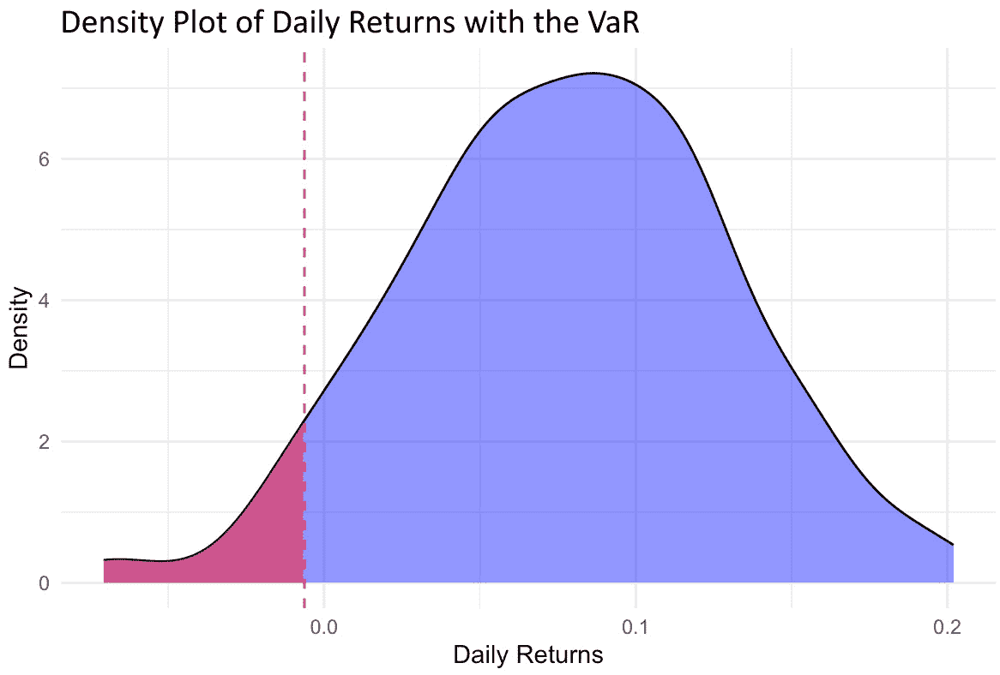

图 10.17 – 可视化每日回报率和 VaR 区域

因此，我们可以根据观察到的每日回报率的经验分布来量化 VaR。

# 摘要

在本章中，我们介绍了常见的概率分布。我们首先介绍了离散概率分布，包括伯努利分布、二项分布、泊松分布和几何分布。然后，我们介绍了常见的连续概率分布，包括正态分布、指数分布和均匀分布。接下来，我们介绍了常见的抽样分布及其在统计推断中对总体统计的应用。最后，我们介绍了顺序统计及其在每日股票回报率 VaR 计算中的应用。

在下一章中，我们将介绍统计估计程序，包括点估计、中心极限定理和置信区间。
