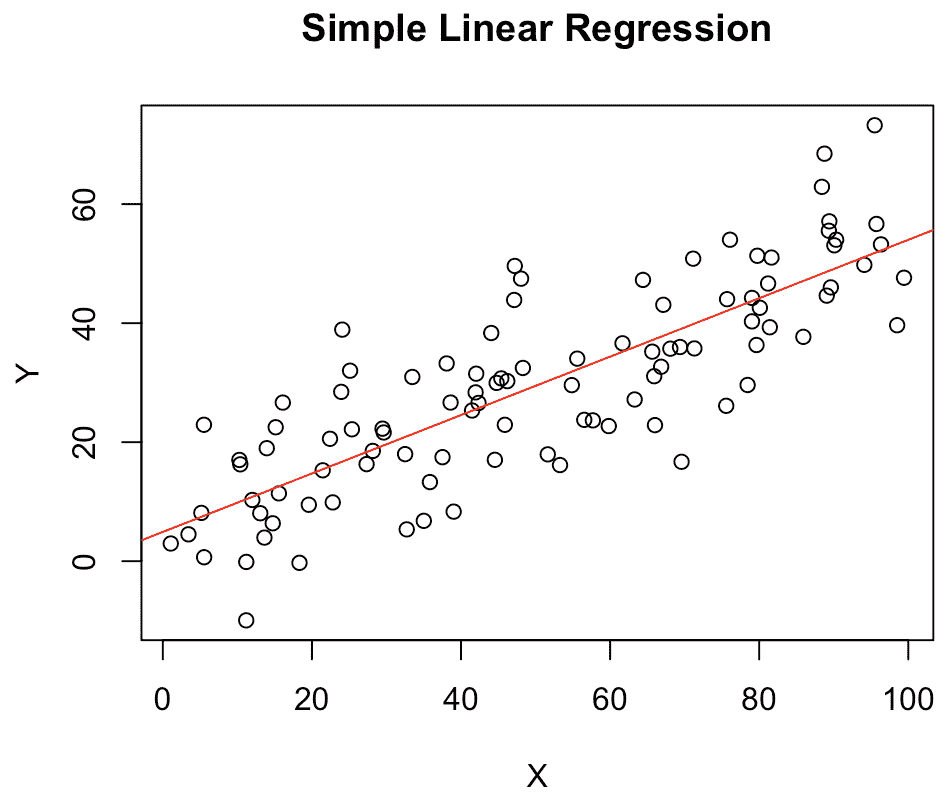

# 第十二章：R 中的线性回归

在本章中，我们将介绍线性回归，这是一种基本的统计方法，用于建模目标变量与多个解释变量（也称为独立变量）之间的关系。我们将从简单线性回归开始，然后扩展到多元线性回归的概念。我们将学习如何估计模型系数，评估拟合优度，并使用假设检验测试系数的显著性。此外，我们还将讨论线性回归背后的假设，并探讨解决潜在问题（如非线性、交互效应、多重共线性异方差性）的技术。我们还将介绍两种广泛使用的正则化技术：岭回归和**最小绝对收缩和选择算子**（**lasso**）惩罚。

到本章结束时，您将学习线性回归的核心原则，其扩展到正则化线性回归，以及涉及的实现细节。

在本章中，我们将涵盖以下主题：

+   介绍线性回归

+   介绍惩罚线性回归

+   使用岭回归进行工作

+   使用 lasso 回归进行工作

要运行本章中的代码，您需要拥有以下包的最新版本：

+   `ggplot2`, 3.4.0

+   `tidyr`, 1.2.1

+   `dplyr`, 1.0.10

+   `car`, 3.1.1

+   `lmtest`, 0.9.40

+   `glmnet`, 4.1.7

请注意，前面提到的包的版本是在编写本章时的最新版本。本章的所有代码和数据均可在[`github.com/PacktPublishing/The-Statistics-and-Machine-Learning-with-R-Workshop/blob/main/Chapter_12/working.R`](https://github.com/PacktPublishing/The-Statistics-and-Machine-Learning-with-R-Workshop/blob/main/Chapter_12/working.R)找到。

# 介绍线性回归

线性回归的核心是拟合一条直线——或者更一般地说，一个超平面——到数据点。这种拟合旨在最小化观察值和预测值之间的偏差。对于简单线性回归，一个目标变量由一个预测变量回归，目标是拟合一条最佳模拟两个变量之间关系的直线。对于多元线性回归，存在多个预测变量，目标是拟合一个最佳描述变量之间关系的超平面。这两个任务都可以通过最小化预测值和相应目标之间的偏差度量来实现。

在线性回归中，获得最佳模型意味着识别定义目标变量和输入预测变量之间关系的最佳系数。这些系数代表与相关预测变量的单位变化相关的目标变量的变化，假设其他所有变量保持不变。这使我们能够量化变量之间关系的大小（系数的大小）和方向（系数的符号），这些可以用于推断（强调可解释性）和预测。

当涉及到推断时，我们通常会观察输入变量单位变化对目标变量的相对影响。此类解释建模的例子包括营销支出如何影响季度销售额、吸烟状态如何影响保险费率、以及教育如何影响收入。另一方面，预测建模侧重于预测目标量。例如，根据营销支出预测季度销售额、根据投保人的个人资料信息（如年龄和性别）预测保险费率，以及根据某人的教育、年龄、工作经验和行业预测收入。

在线性回归中，预期的结果被建模为所有输入变量的加权总和。它还假设输出的变化与任何输入变量的变化成线性比例。这是回归方法的最简单形式。

让我们从**简单线性** **回归**（**SLR**）开始。

## 理解简单线性回归

SLR（简单线性回归）是一种强大且广泛使用的统计模型，它规定了两个连续变量之间的关系，包括一个输入和一个输出。它使我们能够理解响应变量（也称为因变量或目标变量）如何随着解释变量（也称为自变量或输入变量）的变化而变化。通过将一条直线拟合到观察到的数据，SLR 量化了两个变量之间线性关联的强度和方向。这条直线被称为 SLR **模型**。它使我们能够进行预测并推断预测变量对目标变量的影响。

具体来说，在 SLR 模型中，我们假设目标变量（y）和输入变量（x）之间存在线性关系。该模型可以用以下数学公式表示：

y = β 0 + β 1 x + ϵ

在这里，y 被称为响应变量、因变量、解释变量、预测变量、目标变量或回归量。x 被称为解释变量、自变量、控制变量、预测变量或回归变量。β 0 是线性线的截距，表示当 x 为 0 时 y 的期望值。β 1 是斜率，表示 x 增加一个单位时 y 的变化。最后，ϵ是随机误差项，它解释了目标变量 y 中预测变量 x 无法解释的变异性。

线性回归模型（SLR）的主要目标是估计 β₀ 和 β₁ 参数。一组最优的 β₀ 和 β₁ 参数将最小化观测目标值 y 和预测值 ˆy 之间的总平方偏差。这被称为**最小二乘法**，我们寻求最优的 β₀ 和 β₁ 参数，它们对应于最小**平方误差和**（SSR）：

minSSR = min∑i=1nui² = min(yi − ˆyi)²

在这里，每个残差 ui 是观测值 yi 和其拟合值 ˆyi 之间的差异。简单来说，目标是找到最接近数据点的直线。*图 12**.1* 展示了一组数据点（蓝色）和线性模型（红色）：


图 12.1 – 线性回归模型，其中线性模型以线的形式出现，并通过最小化 SSR 进行训练

一旦我们估计了模型系数 β₀ 和 β₁，我们就可以使用该模型对变量之间线性关系的强度进行预测和推断。这种线性关系表明了拟合优度，通常使用确定系数，或 R² 来衡量。R² 的范围从 `0` 到 `1`，并量化了 y 的总变异中可以由 x 解释的部分。它定义如下：

R² = 1 − ∑i(yi − ˆyi)² / ∑i(yi −  _y)²

这里，_y 表示观测目标变量 y 的平均值。

此外，我们还可以使用假设检验来检验得到的系数 β₀ 和 β₁ 的显著性，从而帮助我们确定变量之间的观测关系是否具有统计学意义。

让我们通过一个使用模拟数据集构建简单线性模型的例子来进行分析。

### 练习 12.1 – 构建线性回归模型

在这个练习中，我们将演示在 R 中实现线性回归模型。我们将使用内置函数和包的组合，使用模拟数据集来完成这项任务：

1.  模拟一个数据集，使得响应变量 `Y` 线性依赖于解释变量 `X`，并添加了一些噪声：

    ```py

    # Set seed for reproducibility
    set.seed(123)
    # Generate independent variable X
    X = runif(100, min = 1, max = 100) # 100 random uniform numbers between 1 and 100
    # Generate some noise
    noise = rnorm(100, mean = 0, sd = 10) # 100 random normal numbers with mean 0 and standard deviation 10
    # Generate dependent variable Y
    Y = 5 + 0.5 * X + noise
    # Combine X and Y into a data frame
    data = data.frame(X, Y)
    ```

    在这里，我们使用 `runif()` 函数生成自变量 `X`，它是一个随机均匀数的向量。然后，我们在因变量 `Y` 上添加一些“噪声”，使观测数据更真实，且不那么完美地线性。这是通过使用 `rnorm()` 函数实现的，它创建了一个随机正态数的向量。然后，目标变量 `Y` 被创建为 `X` 的函数，加上噪声。

    此外，我们在开始时使用了一个种子（`set.seed(123)`）来确保可重复性。这意味着每次运行此代码时，我们都会得到相同的一组随机数。如果我们不设置种子，每次运行都会产生不同的随机数列表。

    在这个模拟中，真实的截距（β 0）是 5，真实的斜率（β 1）是 0.5，噪声是均值为 0、标准差为 10 的正态分布。

1.  使用`lm()`函数基于模拟数据集训练线性回归模型：

    ```py

    # Fit a simple linear regression model
    model = lm(Y ~ X, data = data)
    # Print the model summary
    >>> summary(model)
    Call:
    lm(formula = Y ~ X, data = data)
    Residuals:
         Min       1Q   Median       3Q      Max
    -22.3797  -6.1323  -0.1973   5.9633  22.1723
    Coefficients:
                Estimate Std. Error t value Pr(>|t|)
    (Intercept)  4.91948    1.99064   2.471   0.0152 *
    X            0.49093    0.03453  14.218   <2e-16 ***
    ---
    Signif. codes:
    0 '***' 0.001 '**' 0.01 '*' 0.05 '.' 0.1 ' ' 1
    Residual standard error: 9.693 on 98 degrees of freedom
    Multiple R-squared:  0.6735,  Adjusted R-squared:  0.6702
    F-statistic: 202.2 on 1 and 98 DF,  p-value: < 2.2e-16
    ```

    在这里，我们使用`lm()`函数来拟合数据，其中`lm`代表“线性模型”。此函数创建我们的简单线性回归（SLR）模型。`Y ~ X`语法是我们指定模型的方式：它告诉函数`Y`被建模为`X`的函数。

    `summary()`函数提供了模型的全面概述，包括估计系数、标准误差、t 值和 p 值等统计量。由于得到的 p 值极低，我们可以得出结论，输入变量具有强烈的统计显著性。

1.  使用`plot()`和`abline()`函数可视化数据和拟合的回归线：

    ```py

    # Plot the data
    plot(data$X, data$Y, main = "Simple Linear Regression", xlab = "X", ylab = "Y")
    # Add the fitted regression line
    abline(model, col = "red")
    ```

    运行此代码生成*图 12.2*：



图 12.2 – 可视化数据和拟合的回归线

在这里，`plot()`函数创建了我们数据的散点图，而`abline()`函数将回归线添加到该图上。这种视觉表示对于理解拟合的质量非常有用。

在下一节中，我们将继续介绍**多元线性回归**（**MLR**）模型。

## 介绍多元线性回归

MLR 将 SLR 中的单个预测因子扩展到基于多个预测变量预测目标结果。在这里，MLR 中的“多个”一词指的是模型中的多个预测因子，其中每个特征都被赋予一个系数。特定的系数β代表在相关预测变量单位变化的情况下，假设所有其他预测变量保持不变，结果变量的变化。

MLR（多元线性回归）的一个显著优点是它能够包含多个预测因子，从而允许对现实世界进行更复杂和真实的（线性）表示。它可以提供对目标变量与所有输入变量之间关系的整体视角。这在结果变量可能受多个预测变量影响的领域中特别有用。它通过以下公式进行建模：

y = β 0 + β 1 x 1 + β 2 x 2 + … + β p x p + ϵ

在这里，我们总共有 p 个特征，因此由于截距项，有(p + 1)个系数。ϵ是表示未解释部分的常规噪声项。换句话说，我们使用 MLR 的预测如下：

ˆ y  = β 0 + β 1 x 1 + β 2 x 2 + … + β p x p

我们可以使用此公式进行 ceteris paribus 分析，这是一种拉丁语表达方式，意思是所有其他事物都相等，我们只改变一个输入变量以评估其对结果变量的影响。换句话说，MLR 允许我们明确控制（即保持不变）许多同时影响目标变量的其他因素，并观察仅一个因素的影响。

例如，假设我们向特征 x_j 添加一个小的增量Δx_j，并保持所有其他特征不变。新的预测ˆy_new 是通过以下公式获得的：

ˆy_new = β_0 + β_1 x_1 + … + β_j( x_j + Δx_j) + … + β_p x_p

我们知道原始预测如下：

ˆy_old = β_0 + β_1 x_1 + … + β_j x_j + … + β_p x_p

这两个之间的差异给我们带来了输出变量的变化：

Δˆy = ˆy_new − ˆy_old = β_j Δx_j

我们在这里做的实质上是控制所有其他输入变量，但只提高 x_j 以观察对预测ˆy 的影响。因此，系数β_j 衡量结果对特定特征的敏感性。当我们有一个单位变化，Δx_j = 1 时，变化正好是系数本身，给我们Δˆy = β_j。

下一节讨论了 MLR 模型的预测性度量。

## 寻求更高的确定系数

MLR 由于模型中使用的多个预测因子（例如更高的确定系数 R²）而往往比 SLR 表现更好。然而，具有更多输入变量和更高 R²的回归模型并不一定意味着模型拟合得更好，并且可以更好地预测测试集。

由于更多输入特征，更高的 R²可能是因为过拟合。过拟合发生在模型过于复杂，包括过多的预测因子甚至预测因子之间的交互项。在这种情况下，模型可能很好地拟合观察到的数据（从而导致高 R²），但当应用于新的、未见过的测试数据时，它可能表现不佳。这是因为模型可能不仅学会了训练数据的潜在结构，还学会了特定于数据集的随机噪声。

让我们更仔细地看看 R²的度量。虽然 R²衡量模型解释结果变量方差的好坏，但它有一个主要限制：随着更多预测因子的进入，它往往会变得更大，即使这些预测因子是不相关的。作为一种补救措施，我们可以使用调整后的 R²。与 R²不同，调整后的 R²明确考虑了预测因子的数量，并相应地调整了结果统计量。如果一个预测因子显著提高了模型，调整后的 R²将增加，但如果一个预测因子没有通过显著的数量提高模型，调整后的 R²甚至可能减少。

在构建统计模型时，当简单模型与更复杂的模型表现相似时，通常更倾向于选择简单模型。这个简约原则，也称为奥卡姆剃刀，表明在具有相似预测能力的模型中，应该选择最简单的一个。换句话说，向模型中添加更多的预测器会使模型更加复杂，更难以解释，并且更有可能过拟合。

## 更多关于调整后的 R²

调整后的 R²通过调整所选模型中的特征数量来改进 R²。具体来说，只有当添加这个特征所带来的价值超过添加随机特征所期望的价值时，调整后的 R²的值才会增加。本质上，添加到模型中的额外预测器必须是具有意义和预测性的，以导致调整后的 R²更高。然而，这些额外的预测器在添加到模型中时，总是会提高 R²。

调整后的 R²通过包含模型的自由度来解决这一问题。在这里，自由度指的是在统计计算中可以自由变化的值的数量。在回归模型的背景下，这通常意味着预测器的数量。调整后的 R²可以表示如下：

调整后的 R² = 1 − (1 − R²) × (n − 1) × (n − p − 1)

在这里，n 表示观测值的数量，p 表示模型中的特征数量。

该公式通过根据观测值和预测器的数量调整 R²的尺度来工作。术语(n − 1) × (n − p − 1)是一个反映模型中自由度的比率，其中(n − 1)代表模型中的总自由度。我们减去 1 是因为我们是从数据中估计因变量的均值。而(n − p − 1)代表误差的自由度，它反过来代表在估计模型参数后剩余的观测值数量。整个术语(1 − R²) × (n − 1) × (n − p − 1)表示调整了预测器数量的误差方差。

从 1 中减去这个值，得到的是模型解释的总方差的比例，这是在调整了模型中预测器的数量之后的结果。换句话说，它是一种 R²的版本，惩罚了不必要的预测器的添加。这有助于防止过拟合，使得调整后的 R²在比较具有不同预测器数量的模型时，成为一个更平衡的解释力度量。

让我们看看如何在 R 中开发一个多元线性回归（MLR）模型。

## 开发一个 MLR 模型

在本节中，我们将使用 R 中的相同`lm()`函数，基于预加载的`mtcars`数据集来开发一个 MLR 模型，该数据集在之前的练习中使用过。再次强调，`mtcars`数据集包含了 1974 年《汽车趋势》杂志中 32 辆汽车的测量数据。这些测量包括诸如每加仑英里数（`mpg`）、汽缸数（`cyl`）、马力（`hp`）和重量（`wt`）等属性。

### 练习 12.2 – 构建一个 MLR 模型

在这个练习中，我们将开发一个 MLR 模型，使用`cyl`、`hp`和`wt`预测`mpg`。然后我们将解释模型结果：

1.  加载`mtcars`数据集并构建一个基于`cyl`、`hp`和`wt`预测`mpg`的 MLR 模型：

    ```py

    # Load the data
    data(mtcars)
    # Build the model
    model = lm(mpg ~ cyl + hp + wt, data = mtcars)
    ```

    在这里，我们首先使用`data()`函数加载`mtcars`数据集，然后使用`lm()`函数构建 MLR 模型。`mpg ~ cyl + hp + wt`公式用于指定模型。这个公式告诉 R，我们想要将`mpg`建模为`cyl`、`hp`和`wt`的函数。`data = mtcars`参数告诉 R 在`mtcars`数据集中寻找这些变量。`lm()`函数将模型拟合到数据，并返回一个模型对象，我们将其存储在变量 model 中。

1.  查看模型的摘要：

    ```py

    # Print the summary of the model
    >>> summary(model)
    Call:
    lm(formula = mpg ~ cyl + hp + wt, data = mtcars)
    Residuals:
        Min      1Q  Median      3Q     Max
    -3.9290 -1.5598 -0.5311  1.1850  5.8986
    Coefficients:
                Estimate Std. Error t value Pr(>|t|)
    (Intercept) 38.75179    1.78686  21.687  < 2e-16 ***
    cyl         -0.94162    0.55092  -1.709 0.098480 .
    hp          -0.01804    0.01188  -1.519 0.140015
    wt          -3.16697    0.74058  -4.276 0.000199 ***
    ---
    Signif. codes:  0 '***' 0.001 '**' 0.01 '*' 0.05 '.' 0.1 ' ' 1
    Residual standard error: 2.512 on 28 degrees of freedom
    Multiple R-squared:  0.8431,  Adjusted R-squared:  0.8263
    F-statistic: 50.17 on 3 and 28 DF,  p-value: 2.184e-11
    ```

    摘要包括模型的系数（每个预测变量的截距和斜率）、残差（实际观察值与目标预测值之间的差异），以及一些统计量，告诉我们模型如何拟合数据，包括 R²和调整 R²。

    让我们解释输出结果。每个系数代表在相关预测变量增加一个单位时，`mpg`的预期变化，假设其他所有预测变量保持不变。R²值，即`0.8431`，表示`mpg`中可由预测变量共同解释的方差比例（超过 84%）。再次强调，调整 R²值，即`0.8263`，是一个经过修改的 R²，它考虑了模型中的特征数量。

    此外，每个预测变量的 p 值测试了系数真实值为零的零假设。如果一个预测变量的 p 值小于预设的显著性水平（如 0.05），我们会拒绝这个零假设，并得出结论说该预测变量具有统计学意义。在这种情况下，与使用 5%显著性水平比较的其他因素相比，`wt`是唯一具有统计学意义的因素。

在 MLR 模型中，所有系数都是负数，表明输入变量和目标变量之间存在反向的旅行方向。然而，我们不能得出所有预测变量都与目标变量负相关的结论。在 SLR 中，单个预测变量与目标变量的相关性可能是正的或负的。

下一节将提供更多关于这一现象的背景信息。

## 介绍辛普森悖论

辛普森悖论指出，趋势在不同数据组中显现，但在合并时消失或改变。在回归分析的情况下，当控制其他变量时，一个看似与结果正相关的变量可能具有负相关性，辛普森悖论就可能出现。

实质上，这个悖论说明了考虑混杂变量的重要性，以及在未理解背景的情况下，不要从汇总数据中得出结论。混杂变量是那些不在考虑的解释变量中，但与目标变量和预测变量都相关的变量。

让我们通过以下练习来考虑一个简单的例子。

### 练习 12.3 – 说明辛普森悖论

在这个练习中，我们将观察两个场景，在 SLR 和 MLR 中，相同特征的系数值符号相反：

1.  创建一个包含两个预测变量和一个输出变量的虚拟数据集：

    ```py

    set.seed(123)
    x1 = rnorm(100)
    x2 = -3 * x1 + rnorm(100)
    y = 2 + x1 + x2 + rnorm(100)
    df = data.frame(y = y, x1 = x1, x2 = x2)
    ```

    在这里，`x1`是一组从标准正态分布中随机生成的 100 个数字。`x2`是`x1`的线性函数，但具有负相关性，并添加了一些随机噪声（通过`rnorm(100)`）。然后，`y`作为`x1`和`x2`的线性函数生成，同样添加了一些随机噪声。所有三个变量都编译到一个 DataFrame，`df`中。

1.  使用`y`作为结果变量和`x1`作为输入特征来训练一个简单线性回归（SLR）模型。检查模型的摘要：

    ```py

    # Single linear regression
    single_reg = lm(y ~ x1, data = df)
    >>> summary(single_reg)
    Call:
    lm(formula = y ~ x1, data = df)
    Residuals:
        Min      1Q  Median      3Q     Max
    -2.7595 -0.8365 -0.0564  0.8597  4.3211
    Coefficients:
                Estimate Std. Error t value Pr(>|t|)
    (Intercept)   2.0298     0.1379   14.72   <2e-16 ***
    x1           -2.1869     0.1511  -14.47   <2e-16 ***
    ---
    Signif. codes:  0 '***' 0.001 '**' 0.01 '*' 0.05 '.' 0.1 ' ' 1
    Residual standard error: 1.372 on 98 degrees of freedom
    Multiple R-squared:  0.6813,  Adjusted R-squared:  0.678
    F-statistic: 209.5 on 1 and 98 DF,  p-value: < 2.2e-16
    ```

    结果显示，由于系数为`-2.1869`，`x1`与`y`呈负相关。

1.  使用`y`作为目标变量，`x1`和`x2`作为输入特征来训练一个 SLR 模型。检查模型的摘要：

    ```py

    # Multiple linear regression
    multi_reg = lm(y ~ x1 + x2, data = df)
    >>> summary(multi_reg)
    Call:
    lm(formula = y ~ x1 + x2, data = df)
    Residuals:
        Min      1Q  Median      3Q     Max
    -1.8730 -0.6607 -0.1245  0.6214  2.0798
    Coefficients:
                Estimate Std. Error t value Pr(>|t|)
    (Intercept)  2.13507    0.09614  22.208  < 2e-16 ***
    x1           0.93826    0.31982   2.934  0.00418 **
    x2           1.02381    0.09899  10.342  < 2e-16 ***
    ---
    Signif. codes:  0 '***' 0.001 '**' 0.01 '*' 0.05 '.' 0.1 ' ' 1
    Residual standard error: 0.9513 on 97 degrees of freedom
    Multiple R-squared:  0.8484,  Adjusted R-squared:  0.8453
    F-statistic: 271.4 on 2 and 97 DF,  p-value: < 2.2e-16
    ```

    结果显示，`x1`的估计系数现在是一个正数。这表明`x1`突然与`y`呈正相关吗？不，因为可能存在其他导致系数为正的混杂变量。

关键的启示是，我们只能在 SLR 设置中（正或负）对预测变量和目标结果之间的相关性进行推断。例如，如果我们构建一个 SLR 模型来对`y`进行回归，如果得到的系数是正的（β > 0），我们可以得出结论，`x`和`y`是正相关的。同样，如果β > 0，我们可以得出结论，`x`和`y`是正相关的。同样适用于负相关的情况。

然而，在多元线性回归（MLR）设置中，这样的推断会失效 – 也就是说，如果我们有β > 0，我们不能得出正相关的结论，反之亦然。

让我们利用这个机会来解释结果。`Estimate`列显示了估计的回归系数。这些值表示当相应的预测变量增加一个单位，同时保持所有其他特征不变时，`y`变量预期会增加多少。在这种情况下，对于`x1`每增加一个单位，`y`预计会增加大约`0.93826`个单位，对于`x2`每增加一个单位，`y`预计会增加大约`1.02381`个单位。`(Intercept)`行显示了当模型中的所有预测变量都为零时`y`的估计值。在这个模型中，估计的截距是`2.13507`。

`标准误差`表示估计的标准误差。这里的值越小，表示估计越精确。`t 值`列显示了假设检验的 t 统计量，即给定其他预测变量在模型中，对应的总体回归系数为零。t 统计量绝对值越大，表明对零假设的证据越强。`Pr(>|t|)`列给出了假设检验的 p 值。在这种情况下，`x1` 和 `x2` 的 p 值都低于 `0.05`，表明在 5% 的显著性水平下，两者都是 y 的统计显著预测变量。

最后，多重 R 平方和调整 R 平方值提供了模型拟合数据的度量。多重 R 平方值为 `0.8484`，表明该模型解释了 y 的变异性约 84.84%。调整 R 平方值对此度量进行了模型中特征数量的调整。如前所述，当比较具有不同数量预测变量的模型时，这是一个更好的度量。这里的调整 R 平方值为 `0.8453`。F 统计量及其相关的 p 值用于检验所有总体回归系数为零的假设。小的 p 值（小于 `0.05`）表明我们可以拒绝这个假设，并得出结论，至少有一个预测变量在预测 y 时是有用的。

下一个部分将探讨在 MLR 模型中有一个分类预测变量的情况。

## 与分类变量一起工作

在多元线性回归（MLR）中，包含一个二元预测变量的过程与包含一个数值预测变量的过程类似。然而，解释不同。考虑一个数据集，其中 y 是目标变量，x 1 是数值预测变量，x 2 是二元预测变量：

y = β 0 + β 1 x 1 + β 2 x 2 + ϵ

在这个模型中，x 2 被编码为 0 和 1，其对应的系数 β 2 代表了由 x 2 识别的两个组之间 y 的均值差异。

例如，如果 x 2 是一个表示性别的二元变量（男性为 0，女性为 1），y 是工资，那么 β 2 代表在考虑 x 1 的值后，女性和男性之间的平均工资差异。

注意，二元预测变量的系数解释依赖于模型中的其他变量。因此，在前面的例子中，β 2 是在给定 x 1 的值时，女性和男性之间的工资差异。

在实现方面，当在回归模型中使用因子时，R 会自动创建虚拟变量。因此，如果 x 2 是一个具有“男性”和“女性”级别的因子，R 将在拟合模型时内部处理将其转换为 0 和 1。

让我们看看一个具体的例子。在下面的代码中，我们正在构建一个 MLR 模型，使用 `qsec` 和 `am` 来预测 `mpg`：

```py

# Fit the model
model <- lm(mpg ~ qsec + am, data = mtcars)
# Display the summary of the model
>>> summary(model)
Call:
lm(formula = mpg ~ qsec + am, data = mtcars)
Residuals:
    Min      1Q  Median      3Q     Max
-6.3447 -2.7699  0.2938  2.0947  6.9194
Coefficients:
            Estimate Std. Error t value Pr(>|t|)
(Intercept) -18.8893     6.5970  -2.863  0.00771 **
qsec          1.9819     0.3601   5.503 6.27e-06 ***
am            8.8763     1.2897   6.883 1.46e-07 ***
---
Signif. codes:  0 '***' 0.001 '**' 0.01 '*' 0.05 '.' 0.1 ' ' 1
Residual standard error: 3.487 on 29 degrees of freedom
Multiple R-squared:  0.6868,  Adjusted R-squared:  0.6652
F-statistic:  31.8 on 2 and 29 DF,  p-value: 4.882e-08
```

注意，`am` 变量被当作数值变量处理。因为它代表汽车中的传动类型（`0` = 自动，`1` = 手动），它本应被当作分类变量处理。这可以通过将其转换为因子来实现，如下所示：

```py

# Convert am to categorical var
mtcars$am_cat = as.factor(mtcars$am)
# Fit the model
model <- lm(mpg ~ qsec + am_cat, data = mtcars)
# Display the summary of the model
>>> summary(model)
Call:
lm(formula = mpg ~ qsec + am_cat, data = mtcars)
Residuals:
    Min      1Q  Median      3Q     Max
-6.3447 -2.7699  0.2938  2.0947  6.9194
Coefficients:
            Estimate Std. Error t value Pr(>|t|)
(Intercept) -18.8893     6.5970  -2.863  0.00771 **
qsec          1.9819     0.3601   5.503 6.27e-06 ***
am_cat1       8.8763     1.2897   6.883 1.46e-07 ***
---
Signif. codes:  0 '***' 0.001 '**' 0.01 '*' 0.05 '.' 0.1 ' ' 1
Residual standard error: 3.487 on 29 degrees of freedom
Multiple R-squared:  0.6868,  Adjusted R-squared:  0.6652
F-statistic:  31.8 on 2 and 29 DF,  p-value: 4.882e-08
```

注意，只为分类变量 `am_cat` 创建了一个变量 `am_cat1`。这是因为 `am_cat` 是二元的，因此我们只需要一个虚拟列（在这种情况下保留 `am_cat1` 并删除 `am_cat0`）来表示原始分类变量。一般来说，对于一个有 k 个分类的分类变量，R 将在模型中自动创建 (k − 1) 个虚拟变量。

这个过程被称为 `am` 等于相应的水平，否则为 0。这实际上创建了一组指标，捕捉每个类别的存在或不存在。最后，由于我们可以根据前一个（`k-1`）虚拟变量的值推断最后一个虚拟变量，因此我们可以从结果中删除最后一个虚拟变量。

使用分类变量会给模型估计引入一个垂直位移，如以下章节所述。为了看到这一点，让我们更仔细地看看分类变量 `am_cat1` 的影响。我们的 MLR 模型现在假设以下形式：

ˆ y  = β 0 + β 1 x qsec + β 2 x am_cat

我们知道 x am_cat 是一个二元变量。当 x am_cat = 0 时，预测如下：

ˆ y  = β 0 + β 1 x qsec

当 x am_cat = 1 时，预测如下：

ˆ y  = β 0 + β 1 x qsec + β 2 = (β 0 + β 2) + β 1 x qsec

通过比较这两个量，我们可以看出它们是两个相互平行的线性模型，因为斜率相同，唯一的区别是截距项中的 β 2。

一个视觉说明在这里很有帮助。在下面的代码片段中，我们首先创建一个新的 DataFrame，`newdata`，它覆盖了原始数据中 `qsec` 值的范围，对于每个 `am_cat` 值（0 和 1）。然后，我们使用 `predict()` 函数从模型中获取新数据的预测 `mpg` 值。接下来，我们使用 `geom_point()` 绘制原始数据点，并使用 `geom_line()` 添加两条回归线，其中线基于 `newdata` 中的预测值。`color = am_cat` 美学设置为不同的 `am_cat` 值添加不同的颜色，并在 `scale_color_discrete()` 中调整标签，以便 0 对应于“自动”，1 对应于“手动”：

```py

# Load required library
library(ggplot2)
# Create new data frame for the predictions
newdata = data.frame(qsec = seq(min(mtcars$qsec), max(mtcars$qsec), length.out = 100),
                      am_cat = c(rep(0, 100), rep(1, 100)))
newdata$am_cat = as.factor(newdata$am_cat)
# Get predictions
newdata$mpg_pred = predict(model, newdata)
# Plot the data and the regression lines
ggplot(data = mtcars, aes(x = qsec, y = mpg, color = am_cat)) +
  geom_point() +
  geom_line(data = newdata, aes(y = mpg_pred)) +
  labs(title = "mpg vs qsec by Transmission Type",
       x = "Quarter Mile Time (qsec)",
       y = "Miles per Gallon (mpg)",
       color = "Transmission Type") +
  scale_color_discrete(labels = c("Automatic", "Manual")) +
  theme(text = element_text(size = 16),  # Default text size
        title = element_text(size = 15),  # Title size
        axis.title = element_text(size = 18),  # Axis title size
        legend.title = element_text(size = 16),  # Legend title size
        legend.text = element_text(size = 16), # Legend text size
        legend.position = "bottom")  # Legend position
```

运行此代码生成 *图 12**.3*：


图 12.3 – 基于不同传动类型的两个线性回归模型的可视化。由于截距项的位移，这两条线是平行的

这个图表明，在相同的四分之一英里时间（`qsec`）下，手动变速汽车比自动变速汽车的每加仑英里数（`mpg`）相同。然而，在实际情况中，由于不同类型的汽车（手动与自动）可能具有不同的四分之一英里时间，这不太可能。换句话说，这两个变量之间存在交互作用。

下一个部分将介绍交互项作为这种情况的补救措施。

## 引入交互项

在回归分析中，当一个预测变量的影响因另一个预测变量的水平而不同时，就会发生交互作用。在我们的运行示例中，我们实际上是在查看`mpg`和`qsec`之间的关系是否因`am`的不同值而不同。换句话说，我们正在测试将`mpg`和`qsec`联系起来的线的斜率是否因手动（`am`=1）和自动（`am`=0）变速而不同。

例如，如果没有交互作用，那么`qsec`对`mpg`的影响是相同的，无论汽车是手动还是自动。这意味着描述手动和自动汽车之间`mpg`与`qsec`关系的线条将是平行的。

如果存在交互作用，那么`qsec`对`mpg`的影响在手动和自动汽车之间是不同的。这意味着描述手动和自动汽车之间`mpg`与`qsec`关系的线条不会平行。它们可能相交，或者更常见的是，具有不同的斜率。

为了描绘这些关系中的差异，我们可以在模型中添加一个交互项，这可以通过`*`运算符来完成。例如，具有`qsec`和`am_cat`之间交互的回归模型的公式将是`mpg ~ qsec * am_cat`。这相当于`mpg ~ qsec + am``_cat + qsec:am_cat`，其中`qsec:am_cat`代表交互项。以下代码显示了详细信息：

```py

# Adding interaction term
model_interaction <- lm(mpg ~ qsec * am_cat, data = mtcars)
# Print model summary
>>> summary(model_interaction)
Call:
lm(formula = mpg ~ qsec * am_cat, data = mtcars)
Residuals:
    Min      1Q  Median      3Q     Max
-6.4551 -1.4331  0.1918  2.2493  7.2773
Coefficient s:
             Estimate Std. Error t value Pr(>|t|)
(Intercept)   -9.0099     8.2179  -1.096  0.28226
qsec           1.4385     0.4500   3.197  0.00343 **
am_cat1      -14.5107    12.4812  -1.163  0.25481
qsec:am_cat1   1.3214     0.7017   1.883  0.07012 .
Signif. code s:  0 '***' 0.001 '**' 0.01 '*' 0.05 '.' 0.1 ' ' 1
Residual standard error: 3.343 on 28 degrees of freedom
Multiple R-squared:  0.722,  Adjusted R-squared:  0.6923
F-statistic: 24.24 on 3 and 28 DF,  p-value: 6.129e-08
```

让我们再绘制一个更新后的模型，该模型由由于交互作用而产生的两条相交线组成。在以下代码片段中，使用`geom_smooth(method =""l"", se = FALSE)`为每组点（自动和手动汽车）拟合不同的线性线。`as.factor(am_cat)`用于将`am_cat`视为一个因子（分类）变量，以便为每个类别拟合一条单独的线：

```py

# Create scatter plot with two intersecting lines
ggplot(mtcars, aes(x = qsec, y = mpg, color = as.factor(am_cat))) +
  geom_point() +
  geom_smooth(method =""l"", se = FALSE) + # fit separate regression lines per group
  scale_color_discrete(name =""Transmission Typ"",
                       labels = c""Automati"",""Manua"")) +
  labs(x =""Quarter mile time (seconds"",
       y =""Miles per gallo"",
       title =""Separate regression lines fit for automatic and manual car"") +
  theme(text = element_text(size = 16),
        title = element_text(size = 15),
        axis.title = element_text(size = 20),
        legend.title = element_text(size = 16),
        legend.text = element_text(size = 16))
```

运行此代码生成*图 12*.4：


图 12.4 – 由于四分之一英里时间和变速类型之间的交叉项而产生的两条相交线

下一个部分将关注另一个相关主题：非线性项。

## 处理非线性项

线性回归是理解响应变量和解释变量之间线性关系的一个广泛使用的模型。然而，数据中的所有潜在关系并不都是线性的。在许多情况下，特征和响应变量可能没有直线关系，因此需要在线性回归模型中处理非线性项以增加其灵活性。

将非线性引入的最简单方法，即构建曲线而不是直线，是在回归模型中包含预测变量的多项式项。在多项式回归中，一些或所有预测变量被提升到特定的多项式项 – 例如，将特征 x 转换为 x²或 x³。

让我们通过一个练习来了解向线性回归模型添加多项式特征的影响。

### 练习 12.4 – 向线性回归模型添加多项式特征

在这个练习中，我们将创建一个简单的数据集，其中输入特征 x 和目标变量 y 之间的关系不是线性的，而是二次的。首先，我们将拟合一个简单线性回归（SLR）模型，然后添加二次项并比较结果：

1.  生成一个从-10 到 10 的`x`值序列。对于每个`x`，计算相应的`y`作为`x`的平方，并添加一些随机噪声以显示（有噪声的）二次关系。将`x`和`y`放入 DataFrame 中：

    ```py

    # Create a quadratic dataset
    set.seed(1)
    x = seq(-10, 10, by = 0.5)
    y = x² + rnorm(length(x), sd = 5)
    # Put it in a dataframe
    df = data.frame(x = x, y = y)
    Fit a simple linear regression to the data and print the summary.
    lm1 <- lm(y ~ x, data = df)
    >>> summary(lm1)
    Call:
    lm(formula = y ~ x, data = df)
    Residuals:
        Min      1Q  Median      3Q     Max
    -43.060 -29.350  -5.451  19.075  64.187
    Coefficient s:
                Estimate Std. Error t value Pr(>|t|)
    (Intercept) 35.42884    5.04627   7.021 2.01e-08 ***
    x           -0.04389    0.85298  -0.051    0.959
    Signif. code s:  0 '***' 0.001 '**' 0.01 '*' 0.05 '.' 0.1 ' ' 1
    Residual standard error: 32.31 on 39 degrees of freedom
    Multiple R-squared:  6.787e-05,  Adjusted R-squared:  -0.02557
    F-statistic: 0.002647 on 1 and 39 DF,  p-value: 0.9592
    ```

    结果表明，模型对数据的拟合度不佳，数据具有非线性关系。

1.  使用`I()`函数将 x²作为预测变量包括在内，对数据进行二次模型拟合。打印模型的摘要：

    ```py

    lm2 <- lm(y ~ x + I(x²), data = df)
    >>> summary(lm2)
    Call:
    lm(formula = y ~ x + I(x²), data = df)
    Residuals:
        Min      1Q  Median      3Q     Max
    -11.700  -2.134  -0.078   2.992   7.247
    Coefficients:
                Estimate Std. Error t value Pr(>|t|)
    (Intercept)  0.49663    1.05176   0.472    0.639
    x           -0.04389    0.11846  -0.370    0.713
    I(x²)       0.99806    0.02241  44.543   <2e-16 ***
    Signif. code s:  0 '***' 0.001 '**' 0.01 '*' 0.05 '.' 0.1 ' ' 1
    Residual standard error: 4.487 on 38 degrees of freedom
    Multiple R-squared:  0.9812,  Adjusted R-squared:  0.9802
    F-statistic: 992.1 on 2 and 38 DF,  p-value: < 2.2e-16
    ```

    结果显示，多项式模型比简单线性模型更好地拟合数据。因此，当预测变量和响应变量之间的关系不是严格线性时，添加非线性项可以提高模型拟合度。

1.  将线性模型和二次模型与数据一起绘制：

    ```py

    ggplot(df, aes(x = x, y = y)) +
      geom_point() +
      geom_line(aes(y = linear_pred), color =""blu"", linetype =""dashe"") +
      geom_line(aes(y = quadratic_pred), color =""re"") +
      labs(title =""Scatter plot with linear and quadratic fit"",
           x ="""",
           y ="""") +
      theme(text = element_text(size = 15)) +
      scale_color_discrete(name =""Mode"",
                           labels = c"«Linear Mode"»,"«Quadratic Mode"»)) +
      annotate""tex"", x = 0, y = 40, label =""Linear Mode"", color =""blu"") +
      annotate""tex"", x = 6, y = 80, label =""Quadratic Mode"", color =""re"")
    ```

    在这里，我们首先计算两个模型的预测值并将它们添加到 DataFrame 中。然后，我们创建一个散点图来表示数据，并添加两条线来表示线性模型（蓝色）和二次模型（红色）的预测值。

    运行此代码生成**图 12.5**。结果表明，添加多项式特征可以扩展线性模型的灵活性：


图 12.5 – 非线性数据的线性与二次拟合可视化

引入非线性的一些其他常见方法包括对数变换（logx）或平方根变换（√x）。这些变换也可以应用于目标变量 y，我们可以在同一个线性模型中有多个转换特征。

注意，具有转换特征的模型仍然是一个线性模型。如果系数有非线性转换，则模型将是非线性模型。

下一节将更详细地介绍一种广泛使用的变换类型：对数变换。

## 更多关于对数变换的内容

对数变换，或称对数转换，基于对数函数将输入映射到相应的输出，即 y = logx。使用这种变换的一个流行原因是向线性回归模型中引入非线性。当输入特征与目标输出之间的关系是非线性时，应用变换有时可以使关系线性化，从而可以使用线性回归模型来建模这种关系。对于对数变换，当预测变量的值增加时，结果变量的变化率增加或减少时，它可以帮助实现这一点。

具体来说，当输入变得更为极端时，变化率会降低。这种变换的自然结果是，输入数据中的潜在异常值被压缩，使得它们在变换后的列中看起来不那么极端。换句话说，由此产生的线性回归模型将由于对数变换而对原始异常值不那么敏感。

使用对数变换的另一个副作用是它能够处理异方差性。异方差性是指回归模型中误差项的变异性在预测变量的所有水平上并不恒定。这违反了线性回归模型的一个假设，可能导致效率低下和有偏的估计。在这种情况下，通过对数变换可以缩小潜在的大的误差项，使得误差项的方差在不同预测变量的水平上更加恒定。

最后，当预测变量与结果之间的关系是乘法而非加法时，对预测变量和/或结果变量取对数可以将关系转换为加法关系，这可以使用线性回归进行建模。

让我们考虑一个例子，其中我们预测每加仑英里数（`mpg`）从马力（`hp`）。我们将比较直接从`hp`预测`mpg`的模型，以及从`hp`预测`mpg`的对数的模型，如下面的代码片段所示：

```py

# Fit the original model
model_original = lm(mpg ~ hp, data = mtcars)
# Fit the log-transformed model
mtcars$log_mpg = log(mtcars$mpg)
model_log = lm(log_mpg ~ hp, data = mtcars)
# Predictions from the original model
mtcars$pred_original = predict(model_original, newdata = mtcars)
# Predictions from the log-transformed model (back-transformed to the original scale using exp)
mtcars$pred_log = exp(predict(model_log, newdata = mtcars))
library(tidyr)
library(dplyr)
# Reshape data to long format
df_long <- mtcars %>%
  gather(key =""Mode"", value =""Predictio"", pred_original, pred_log)
# Create plot
ggplot(df_long, aes(x = hp, y = mpg)) +
  geom_point(data = mtcars, aes(x = hp, y = mpg)) +
  geom_line(aes(y = Prediction, color = Model)) +
  labs(
    x =""Horsepower (hp"",
    y =""Miles per gallon (mpg"",
    color =""Mode""
  ) +
  scale_color_manual(values = c""pred_origina"" =""blu"",""pred_lo"" =""re"")) +
  theme(
    legend.position =""botto"",
    text = element_text(size = 16),
    legend.title = element_text(size = 16),
    axis.text = element_text(size = 16),  # control the font size of axis labels
    legend.text = element_text(size = 16)  # control the font size of legend text
  )
```

运行此代码生成*图 12*.6，其中我们可以看到蓝色线有轻微的弯曲：


图 12.6 – 可视化原始和对数变换后的模型

注意，对数变换只能应用于正数数据。在`mtcars$mpg`的情况下，所有值都是正数，因此我们可以安全地应用对数变换。如果变量包含零或负值，我们需要考虑不同的变换或方法。

下一节将重点介绍推导和使用线性回归模型的闭式解。

## 使用闭式解

在开发线性回归模型时，已知的训练集（X, y）被给出，唯一未知的参数是系数，β。在这里，粗体小写字母表示向量（例如 β 和 y），而粗体大写字母表示矩阵（例如 X）。结果证明，线性回归模型的闭式解可以通过使用**普通最小二乘法**（**OLS**）估计的概念来推导，该估计法旨在最小化模型中残差的平方和。拥有闭式解意味着我们可以简单地插入所需元素（在这种情况下，X 和 y）并执行计算以获得解，而无需求助于任何优化过程。

具体来说，给定一个数据矩阵，X（其中包含一个用于截距项的列，并用粗体表示表示有多个特征），其维度为 n × p（其中 n 是观测数，p 是预测数）和一个长度为 n 的响应向量，y，OLS 对系数向量 β 的估计由以下公式给出：

β = (X T X) −1 X T y

这个解假设项 (X T X) 是可逆的，这意味着它应该是一个满秩矩阵。如果不是这种情况，解可能不存在或不唯一。

现在，让我们看看如何推导这个解。我们从最小二乘法的最小化问题开始：最小化 (y − Xβ) T(y − Xβ) 关于 β。这个二次型可以展开为 y T y − β T X T y − y T Xβ + β T X T Xβ。注意 β T X T y = y T Xβ，因为这两个项都是标量，因此在转置操作后它们相等。我们可以将**残差平方和**（**RSS**）表达式写为 y T y − 2 β T X T y + β T X T Xβ。

在这里，我们应用一阶条件来求解使此表达式最小化的 β 值（回想一下，图形上最小化或最大化的点具有导数为 0）。这意味着我们会将其一阶导数设为零，从而得到以下公式：

∂ ( y T y − 2 β T X T y + β T X T Xβ)  ____________________  ∂ β  = − 2 X T y + 2 X T Xβ = 0

X T Xβ = X T y

β = (X T X) −1 X T y

因此，我们已经推导出 β 的闭式解，该解最小化了残差平方和。让我们通过一个示例来看看它是如何实现的。

### 实现闭式解

让我们看看如何在 R 中实现线性回归模型的 OLS 估计。以下代码片段展示了使用合成数据的示例：

```py

# Set seed for reproducibility
set.seed(123)
# Generate synthetic data
n = 100 # number of observations
x = runif(n, -10, 10) # predictors
beta0 = 2 # intercept
beta1 = 3 # slope
epsilon = rnorm(n, 0, 2) # random error term
y = beta0 + beta1*x + epsilon # response variable
# Design matrix X
X = cbind(1, x)
```

在这里，我们生成具有单个输入特征的 100 个观测值，观测值受到噪声扰动，并遵循 y = β 0 + β 1 x + ϵ 的过程。误差项假设为具有均值为 0 和标准差为 2 的正态分布。

在进行估计之前，请注意，我们在输入特征`x`的左侧也添加了一个 1 的列，以形成一个矩阵`X`。这个 1 的列用于表示截距项，通常被称为偏差技巧。也就是说，截距项的系数β0 将是系数向量的一部分，因此不需要为截距创建一个单独的系数。

让我们使用闭式解来计算结果：

```py

beta_hat = solve(t(X) %*% X) %*% t(X) %*% y
>>> print(beta_hat)
       [,1]
  1.985344
x 3.053152
```

在这里，`%*%`用于矩阵乘法，`t(X)`是`X`的转置，`solve()`用于计算矩阵的逆。

我们也可以使用`lm()`函数运行线性回归过程进行比较：

```py

# Fit linear regression model for comparison
model = lm(y ~ x)
>>> print(coef(model))
(Intercept)           x
   1.985344    3.053152
```

结果与通过手动方法获得的结果相同。

下两节涵盖了线性回归设置中的两个常见问题：共线性和非同方差性。

## 处理共线性

共线性指的是在多元回归模型中，两个（或更多）预测变量高度相关的情况。这意味着一个自变量可以以很高的精度从其他变量线性预测出来。这是我们不想陷入的情况。换句话说，我们希望看到预测变量与目标变量之间有高度的相关性，而预测变量之间本身的相关性较低。

面对线性回归模型中的共线性，得到的模型往往会生成不可靠和不稳定的回归系数估计。它可能会膨胀参数的系数，使它们在统计上不显著，尽管它们可能具有实质性的重要性。此外，共线性使得难以评估每个自变量对因变量的影响，因为影响是交织在一起的。然而，它不会影响模型的预测能力或可解释性；相反，它只改变了单个特征的计算。

检测预测变量之间是否存在潜在的共线性可以通过检查成对的相关性来完成。或者，我们可以求助于一个特定的统计量，称为**方差膨胀因子**（**VIF**），它量化了由于共线性导致方差增加的程度。VIF 值为 1 表示两个变量不相关，而 VIF 值大于 5（在许多领域）则表明存在问题的共线性程度。

当线性回归模型中存在共线性时，我们可以选择只保留一个预测变量，并移除所有其他高度相关的预测变量。我们还可以通过**主成分分析**（**PCA**），这是一种广泛用于降维的技术，将这些相关变量组合成几个不相关的变量。此外，我们可以求助于岭回归来控制系数的大小；这将在本章后面介绍。

要使用 VIF 检查多重共线性，我们可以使用`car`包中的`vif()`函数，如下面的代码片段所示：

```py

# install the package if not already installed
if(!require(car)) install.packages('car')
# load the package
library(car)
# fit a linear model
model = lm(mpg ~ hp + wt + disp, data = mtcars)
# calculate VIF
vif_values = vif(model)
>>> print(vif_values)
      hp       wt     disp
2.736633 4.844618 7.324517
```

从结果来看，`disp`似乎具有高度的多重共线性（VIF = 7.32 > 5），这表明它与`hp`和`wt`有很强的相关性。这意味着`disp`并没有提供其他两个预测变量中已经包含的信息。

为了处理这里的多重共线性问题，我们可以考虑从模型中移除`disp`，因为它具有最高的 VIF 值，应用 PCA 来合并三个预测变量，或者使用岭回归或 Lasso 回归（关于这一点，请参阅本章的最后两部分）。

下一节将重点讨论异方差性的问题。

## 处理异方差性

异方差性（或异方差性）指的是误差项或残差的变异性在不同独立变量的所有水平上并不相同的情况。这违反了 OLS 线性回归的一个关键假设，即假设残差具有恒定的方差——换句话说，残差是同方差的。违反这个假设可能导致对系数的统计显著性推断不正确，因为回归系数的估计标准误差可能比应有的更大或更小。

处理异方差性的方法有几种。首先，我们可以使用之前介绍的对数函数对结果变量进行转换。其他函数，如取原始结果变量的平方根或倒数，也可能有助于减少异方差性。探索高级回归模型，如**加权最小二乘法**（WLS）或**广义最小二乘法**（GLS），也可能有助于减少异方差性的影响。

为了正式检验异方差性，我们可以使用`lmtest`包中的`bptest()`函数进行 Breusch-Pagan 检验。在下面的代码片段中，我们拟合了一个 MLR 模型，使用`wt`和`hp`预测`mpg`，然后执行 Breusch-Pagan 检验：

```py

# Load library
library(lmtest)
# Fit a simple linear regression model on mtcars dataset
model = lm(mpg ~ wt + hp, data = mtcars)
# Perform a Breusch-Pagan test to formally check for heteroskedasticity
>>> bptest(model)
  studentized Breusch-Pagan test
data:  model
BP = 0.88072, df = 2, p-value = 0.6438
```

由于 p 值（`0.6438`）大于 0.05，我们不能拒绝 Breusch-Pagan 检验的零假设。这表明没有足够的证据表明回归模型中存在异方差性。因此，我们可以得出结论，残差的方差与恒定的方差没有显著差异，或者说，残差是同方差的。

下一节将转向查看正则化线性回归模型和岭回归和 Lasso 惩罚。

# 引入惩罚线性回归

惩罚回归模型，如岭回归和 Lasso，是用于处理多重共线性、减少过拟合甚至进行变量选择的技术，尤其是在处理具有多个输入特征的高维数据时。

岭回归（也称为 L2 正则化）是一种方法，它添加了一个与系数幅度的平方相当的惩罚。我们会在加权一个额外的超参数后，通常表示为 λ，将其添加到损失函数中，以控制惩罚项的强度。

另一方面，Lasso 回归（L1 正则化）是一种方法，类似于岭回归，它对非零系数添加惩罚，但与岭回归不同，当惩罚调整参数足够大时，它可以强制某些系数精确等于零。超参数 λ 的值越大，收缩量就越大。对系数大小的惩罚有助于减少模型复杂性和多重共线性，从而使得模型在未见数据上具有更好的泛化能力。然而，岭回归包括最终模型中的所有特征，因此不会产生任何稀疏性。因此，它对变量选择并不特别有用。

总结来说，岭回归和 Lasso 回归都是惩罚线性回归方法，它们在模型优化过程中添加了对估计系数幅度的约束，这有助于防止过度拟合、管理多重共线性并减少模型复杂度。然而，岭回归倾向于将所有预测变量包含在模型中并帮助减少它们的影响，而 Lasso 可以完全排除模型中的预测变量，从而得到更简单、更可解释的模型。

让我们从岭回归开始，更仔细地看看它的损失函数。

# 使用岭回归

岭回归，也称为 L2 正则化，是一种常用的技术，通过惩罚线性回归模型中估计系数的幅度来减轻过度拟合。

回想一下，在简单线性回归（SLR）模型中，我们试图最小化预测值和实际值之间平方差的和，这被称为最小二乘法。我们希望最小化的损失函数是均方误差（RSS）：

RSS = ∑_i=1^n (y_i - (β_0 + ∑_j=1^p β_j x_ij))²

在这里，y_i 是实际的目标值，β_0 是截距项，{β_j} 是每个预测变量 x_ij 的系数估计，求和是总的观测值和预测变量。

仅最小化 RSS 会导致过度拟合的模型，如结果系数的高幅度所示。作为补救措施，我们可以通过向这个损失函数添加惩罚项来应用岭回归。这个惩罚项是每个系数的平方和乘以一个调整参数 λ。因此，岭回归损失函数（也称为**成本函数**）如下：

L_ridge = RSS + λ∑_j=1^p β_j²

在这里，λ参数是一个用户定义的调整参数。较大的λ意味着更高的惩罚，较小的λ意味着更少的正则化效果。λ = 0 给出普通最小二乘回归结果，而当λ接近无穷大时，惩罚项的影响占主导地位，系数估计接近零。

通过添加这个惩罚项，岭回归倾向于减小系数的大小，这有助于缓解多重共线性问题（预测变量高度相关）。它是通过将相关预测变量的系数估计分散到彼此之间来实现的，这可能导致一个更稳定且可解释的模型。

然而，需要注意的是，岭回归通常不会产生稀疏解，并且不执行变量选择。换句话说，它不会导致某些系数恰好为零的模型（除非λ是无穷大），因此所有预测变量都包含在模型中。如果特征选择很重要，那么 lasso（L1 正则化）或弹性网络（L1 和 L2 正则化的组合）等方法可能更合适。

注意，我们通常会惩罚截距，β 0。

让我们通过一个练习来学习如何开发岭回归模型。

### 练习 12.5 – 实现岭回归

在这个练习中，我们将实现一个岭回归模型，并将估计系数与 OLS 模型进行比较。我们的实现将基于`glmnet`包：

1.  安装并加载`glmnet`包：

    ```py

    # install the package if not already installed
    if(!require(glmnet)) install.packages('glmnet')
    library(glmnet)
    ```

    在这里，我们使用`if-else`语句来检测`glmnet`包是否已安装。

1.  将除`mpg`之外的所有列作为预测变量存储在`X`中，将`mpg`作为目标变量存储在`y`中：

    ```py

    # Prepare data
    data(mtcars)
    X = as.matrix(mtcars[, -1]) # predictors
    y = mtcars[, 1] # response
    ```

1.  使用`glmnet()`函数拟合岭回归模型：

    ```py

    # Fit ridge regression model
    set.seed(123) # for reproducibility
    ridge_model = glmnet(X, y, alpha = 0)
    ```

    在这里，`alpha` 参数控制着我们拟合的模型类型。`alpha = 0` 拟合岭回归模型，`alpha = 1` 拟合 lasso 模型，而介于两者之间的任何值都会拟合弹性网络模型。

1.  使用交叉验证选择最佳的`lambda`值：

    ```py

    # Use cross-validation to find the optimal lambda
    cv_ridge = cv.glmnet(X, y, alpha = 0)
    best_lambda = cv_ridge$lambda.min
    >>> best_lambda
    2.746789
    ```

    在这里，我们使用交叉验证方法来识别平均误差最低的`lambda`值。所有重复的交叉验证步骤都是通过`cv.glmnet()`函数完成的。

1.  使用最优`lambda`拟合一个新的岭回归模型，并提取没有截距的系数：

    ```py

    # Fit a new ridge regression model using the optimal lambda
    opt_ridge_model = glmnet(X, y, alpha = 0, lambda = best_lambda)
    # Get coefficients
    ridge_coefs = coef(opt_ridge_model)[-1]  # remove intercept
    >>> ridge_coefs
    [1] -0.371840170 -0.005260088 -0.011611491  1.054511975 -1.233657799  0.162231830
     [7]  0.771141047  1.623031037  0.544153807 -0.547436697
    ```

1.  拟合线性回归模型并提取其系数：

    ```py

    # Ordinary least squares regression
    ols_model = lm(mpg ~ ., data = mtcars)
    # Get coefficients
    ols_coefs = coef(ols_model)[-1] # remove intercept
    >>> ols_coefs
            cyl        disp          hp        drat          wt        qsec          vs
    -0.11144048  0.01333524 -0.02148212  0.78711097 -3.71530393  0.82104075  0.31776281
             am        gear        carb
     2.52022689  0.65541302 -0.19941925
    ```

1.  在同一张图上绘制两个模型的系数：

    ```py

    plot(1:length(ols_coefs), ols_coefs, type="b", col="blue", pch=19, xlab="Coefficient", ylab="Value", ylim=c(min(ols_coefs, ridge_coefs), max(ols_coefs, ridge_coefs)))
    lines(1:length(ridge_coefs), ridge_coefs, type="b", col="red", pch=19)
    legend("bottomright", legend=c("OLS", "Ridge"), col=c("blue", "red"), pch=19)
    ```

    运行此代码生成*图 12**.7*：


图 12.7 – 可视化岭回归和 OLS 模型的估计系数

此图显示，岭回归模型的估计系数通常小于 OLS 模型的估计系数。

下一个部分将重点介绍 lasso 回归。

# 使用 lasso 回归进行工作

Lasso 回归是另一种正则化线性回归。它与岭回归相似，但在计算系数大小具体过程上有所不同。具体来说，它使用系数的 L1 范数，即系数绝对值总和的总和，作为添加到 OLS 损失函数中的惩罚项。

Lasso 回归的成本函数可以写成如下形式：

L lasso = RSS + λ∑ j=1 p | β j|

Lasso 回归的关键特性是它可以精确地将一些系数减少到 0，从而有效地执行变量选择。这是 L1 惩罚项的结果，而岭回归只能将系数缩小到接近 0。因此，当我们认为只有预测变量的一部分对预测结果有影响时，Lasso 回归特别有用。

此外，与岭回归不同，岭回归无法执行变量选择，因此可能不太容易解释，而 Lasso 回归自动选择最重要的特征并丢弃其余特征，这使得最终模型更容易解释。

与岭回归一样，Lasso 回归的惩罚项也受一个调整参数λ的影响。最佳λ参数通常通过交叉验证或更智能的搜索策略，如贝叶斯优化来选择。

让我们通过一个练习来了解如何开发 Lasso 回归模型。

### 练习 12.6 – 实现 Lasso 回归

要实现 Lasso 回归模型，我们可以遵循与岭回归模型类似的过程：

1.  要拟合 Lasso 回归模型，在`glmnet()`函数中将`alpha`设置为`1`：

    ```py

    lasso_model = glmnet(X, y, alpha = 1)
    ```

1.  使用相同的交叉验证过程来识别`lambda`的最佳值：

    ```py

    # Use cross-validation to find the optimal lambda
    cv_lasso = cv.glmnet(X, y, alpha = 1)
    best_lambda = cv_lasso$lambda.min
    >>> best_lambda
    0.8007036
    ```

1.  使用最佳`lambda`值拟合一个新的 Lasso 回归模型：

    ```py

    # Fit a new lasso regression model using the optimal lambda
    opt_lasso_model = glmnet(X, y, alpha = 1, lambda = best_lambda)
    ```

    也可以使用`coef()`函数提取结果系数，然后跟`[-1]`以移除截距项：

    ```py
    # Get coefficients
    lasso_coefs = coef(opt_lasso_model)[-1]  # remove intercept
    >>> lasso_coefs
    [1] -0.88547684  0.00000000 -0.01169485  0.00000000 -2.70853300  0.00000000  0.00000000
     [8]  0.00000000  0.00000000  0.00000000
    ```

1.  将估计系数与前面两个模型一起绘制：

    ```py

    plot(1:length(ols_coefs), ols_coefs, type="b", col="blue", pch=19, xlab="Coefficient", ylab="Value", ylim=c(min(ols_coefs, ridge_coefs), max(ols_coefs, ridge_coefs)))
    lines(1:length(ridge_coefs), ridge_coefs, type="b", col="red", pch=19)
    lines(1:length(lasso_coefs), lasso_coefs, type="b", col="green", pch=19)
    legend("bottomright", legend=c("OLS", "Ridge", "Lasso"), col=c("blue", "red", "green"), pch=19)
    ```

    运行此代码生成*图 12*.8，这表明结果模型中只保留了两个变量。因此，Lasso 回归模型可以通过将某些特征的系数设置为 0 来生成稀疏解：


图 12.8 – 可视化岭回归、Lasso 回归和 OLS 回归模型的估计系数

总结，Lasso 回归模型通过将非显著变量的系数设置为 0，从而实现特征选择和模型估计。

# 概述

在本章中，我们介绍了线性回归模型的基本原理。我们首先介绍了单变量线性回归模型（SLR），它只包含一个输入变量和一个目标变量，然后扩展到多变量线性回归模型（MLR），它包含两个或更多预测变量。这两个模型都可以使用 R²来评估，或者更偏好使用调整后的 R²指标。接下来，我们讨论了特定场景，例如处理分类变量和交互项，通过变换处理非线性项，使用闭式解，以及处理多重共线性异方差性。最后，我们介绍了广泛使用的正则化技术，如岭回归和 Lasso 惩罚，这些技术可以作为损失函数中的惩罚项被纳入，生成正则化模型，在 Lasso 回归的情况下，还可以生成稀疏解。

在下一章中，我们将介绍另一种广泛使用的线性模型：逻辑回归模型。
