# 第十四章：贝叶斯统计学

在本章中，我们将介绍贝叶斯推断框架，涵盖其核心组件和实现细节。贝叶斯推断引入了一个有用的框架，它提供了对目标结果预测的合理猜测以及量化的不确定性估计。从包含领域专业知识的先验分布开始，贝叶斯推断方法允许我们从数据中持续学习更新信息，并更新后验分布，以形成对潜在参数的更现实的观点。

在本章结束时，你将掌握使用贝叶斯推断框架的基本技能。你将学习贝叶斯定理的核心理论和它在贝叶斯线性回归模型中的应用。

本章我们将涵盖以下主要内容：

+   介绍贝叶斯统计学

+   深入了解贝叶斯推断

+   完整的贝叶斯推断过程

+   带有分类变量的贝叶斯线性回归

# 技术要求

要运行本章中的代码，你需要拥有以下软件包的最新版本：

+   `ggplot2`, 3.4.0

+   `ggridges`, 0.5.4

+   `rjags`, 4.13

+   `coda`, 0.19.4

请注意，前面提到的软件包版本是在我撰写本章时的最新版本。

本章的所有代码和数据均可在[`github.com/PacktPublishing/The-Statistics-and-Machine-Learning-with-R-Workshop/blob/main/Chapter_14/working.R`](https://github.com/PacktPublishing/The-Statistics-and-Machine-Learning-with-R-Workshop/blob/main/Chapter_14/working.R)找到。

# 介绍贝叶斯统计学

贝叶斯方法在统计学和**机器学习**（**ML**）中提供了一个逻辑清晰、透明且可解释的框架。这是一个统一的框架，可以为统计推断和预测构建特定问题的模型。特别是，贝叶斯推断提供了一种方法，在已知事实（观察数据）的情况下，通过概率描述未知量的可能值的不确定性——即感兴趣的随机变量。

使用贝叶斯统计学，我们能够表达我们对未知量的先验假设，并根据观察数据调整这一假设。它提供了常见的统计程序（如假设检验和线性回归）的贝叶斯版本，这些内容在*第十一章*，*统计估计*和*第十二章*，*R 中的线性回归*中有所涉及。与迄今为止我们采用的频率主义方法相比，贝叶斯方法还允许我们构建特定问题的模型，以连续学习的方式（通过贝叶斯后验更新，将在下一节中介绍）充分利用数据。

例如，未知量对应于我们在线性或逻辑回归模型中试图估计的参数。我们不是将它们视为固定量，并使用最大似然原理来估计它们的值，而是贝叶斯方法将它们视为具有各自可能值概率分布的移动变量。

让我们首先了解一下著名的贝叶斯定理。

## 初探贝叶斯定理

贝叶斯定理描述了统计量条件概率之间的关系。在线性回归的背景下，我们会将参数 β 视为一个随机变量，而不是像我们在*第十二章*中处理线性回归那样将其视为固定量。例如，在一个简单的线性回归模型 y = βx 中，我们不会通过最小化给定数据 (x, y) 的**普通最小二乘法**（**OLS**）来获得单个最佳参数 β，而是将 β 视为一个遵循特定分布的随机变量。

做这件事涉及到关于 β 的两个分布，即感兴趣的参数，如下所示：

+   第一个分布是**先验分布** P(β)，这对应于我们在观察任何数据之前分配给 β 的主观分布。这个分布封装了我们在观察任何实际数据之前对 β 可能值概率的先验信念。

+   第二个分布是**后验分布** P(β|x, y)，这对应于观察数据后我们对该分布更新的信念。这是我们希望通过更新来估计的分布。这种更新是为了使我们的先验信念与我们在现实中实际观察到的相符合。

自然地，我们希望随着训练规模的增大，后验分布 P(β|x, y) 越来越接近数据反映的内容，并且相应地越来越远离先验信念。在这里，数据指的是 (x, y)。为了进行更新，数据将以我们所说的似然函数 P(y|x, β) 的形式进入，也被称为**生成模型**。也就是说，P(y|x, β) 表示在给定输入特征 x 和参数值 β 的情况下观察目标 y 的似然（类似于概率，尽管是非归一化的方式），我们将 β 视为一个特定的值而不是一个随机变量。换句话说，我们首先从分布 P(β) 中采样以获得 β 的具体值，然后根据特定的观察模型，在给定输入特征 x 的情况下获得实际数据点 y。例如，如果我们假设误差遵循正态分布，我们会假设观察模型为正态分布。

现在，我们准备通过以下贝叶斯定理将这些三个量一起编译：

P(β | x, y) =  P(y|x, β)P(β) _ P(y|x)

在这里，P(y|x) 被称为证据，它作为归一化常数，确保后验分布是一个有效的概率分布，这意味着每个概率都是非负的，并且总和（或积分）为 1。

*图 14.1* 展示了贝叶斯定理：

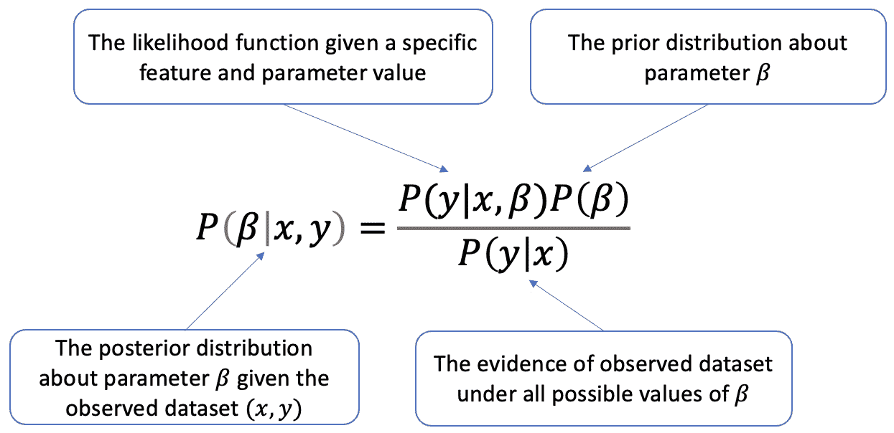

图 14.1 – 说明贝叶斯定理计算后验分布 P(𝜷 | x, y)

注意，贝叶斯线性回归中的先验分布 P(β) 可以选择来模拟我们对参数 β 的先验信念，这在使用基于 OLS 的线性回归的频率派框架时是不可用的。在实践中，我们通常采用正态先验分布，但它可以是任何在观察任何数据之前捕捉 β 可能值概率的先验信念的分布。因此，贝叶斯框架允许我们以原则性的方式将先验知识纳入建模中。例如，如果我们认为所有特征应该有相似的影响，我们就可以配置系数的先验分布以围绕相同的值为中心。

由于参数 β 遵循后验分布 P(β | x, y)，给定新的输入数据 x 的结果预测 y 将不会是一个单一的数字，正如频率派方法中的情况。相反，我们将获得一系列可能的 y 值，这些值遵循后验预测分布 P( y*| x*, β)。也就是说，由于参数 β 的随机性，预测 y 被视为一个随机变量。然后我们可以使用这个分布来理解结果预测的不确定性。例如，如果后验预测分布 P( y*| x*, β) 较宽，那么从 P( y*| x*, β) 中采样的结果预测将包含更高的不确定性。另一方面，如果分布较窄，结果预测将更加集中，因此更加自信。随着新数据的出现，后验分布 P(β | x, y) 也将继续演变。

下一个部分将介绍更多关于生成模型的内容。

## 理解生成模型

在贝叶斯推理中，生成模型指定了控制数据如何生成的概率分布。例如，当可用的目标数据是二进制时，我们可以假设它是按照参数 p 的伯努利分布生成的，其中 p 代表成功的概率。为了得到一系列的二进制结果，我们首先为 p 分配一个概率值，然后使用这个伯努利分布通过从这个分布中重复采样来生成二进制标签。

让我们通过一个练习来理解生成过程。

### 练习 14.1 – 生成二进制结果

在这个练习中，我们将根据伯努利分布生成一系列二进制结果。这涉及到将来自均匀分布的 `0` 到 `1` 之间的随机样本与预设的成功概率进行比较。遵循以下步骤：

1.  我们首先使用均匀分布生成一个介于 `0` 和 `1` 范围内的随机数：

    ```py

    set.seed(1)
    random_prob = runif(1, min = 0, max = 1)
    >>> random_prob
    0.2655087
    ```

    再次提醒，为了可重复性，请设置随机种子。

1.  接下来，我们将数字与预设的概率 `0.2` 进行比较：

    ```py

    prop_success = 0.2
    >>> random_prob < prop_success
    FALSE
    ```

    这完成了单个二进制数的生成。现在，让我们将其扩展到 10 个数字。

1.  在以下代码的帮助下，我们将生成 10 个二进制数：

    ```py

    n_samples = 10
    data = c()
    for(sample_idx in 1:n_samples) {
      data[sample_idx] <- runif(1, min = 0, max = 1) < prop_success
    }
    >>> data
    FALSE FALSE FALSE FALSE FALSE FALSE FALSE FALSE  TRUE FALSE
    ```

    在这里，我们使用 `for` 循环重复生成均匀随机数，将其与预设的成功概率进行比较，然后将结果存储在向量中。

1.  将向量转换为 `0` 和 `1` 数字，如下所示：

    ```py

    data = as.numeric(data)
    >>> data
    0 0 0 0 0 0 0 0 1 0
    ```

    注意，尽管成功的概率为 20%，但我们观察到 10 次抽取中有 1 次成功。随着样本量的增加，我们预计成功的经验概率（本例中为 10%）将接近理论值（20%）。

结果表明，这个生成模型对应于二项过程或二项分布，这允许我们一次性生成二进制结果。具体来说，我们可以使用 `rbinom()` 函数来模拟二项分布的数据，如下面的代码片段所示：

```py

set.seed(1)
>>> rbinom(n = n_samples, size = 1, prob = prop_success)
```

在这里，`n` 是从生成模型中生成的样本数量，`size` 是要运行的试验次数，`prob` 是介于 `0.0` 和 `1.0` 之间的成功基础概率。

注意，我们本质上是在处理一个已知的参数 p，即成功的概率。在实践中，这将是未知参数，是我们从数据中感兴趣估计的东西。贝叶斯推理将允许我们这样做，在下一节中介绍的先验分布和似然函数的帮助下。

## 理解先验分布

先验分布，贝叶斯推理的一个基本组成部分，表示在我们观察实际数据之前对潜在参数的先验知识或信念。它本质上基于特定领域的偏好或专业知识指定参数的概率分布。如果我们有合理的理由相信某些参数值更有可能，我们可以选择一个反映这种偏好的先验分布。

先验分布，表示为 P(β)，将β视为一个随机变量并指定其概率分布。也就是说，它告诉我们哪些β的值比其他值更有可能。在我们关于贝叶斯线性回归的运行示例中，β的先验分布通常选择为多元高斯分布。这主要是出于数学上的便利，因为高斯分布具有一些良好的性质，使得它更容易处理。然而，如果我们没有先验偏好，均匀分布（对所有可能的选择给予相同的概率，因此是无信息的）可能是一个好的候选者。

注意，我们也可以使用先验对模型施加一种正则化的形式。通过选择一个偏好较小参数值的先验分布（例如，以`0`为中心的高斯分布），我们可以阻止模型找到具有大系数的解，从而防止过拟合。

在下面的代码片段中，我们随机生成 10 个 P(β)样本，这些样本遵循在`0`和`0.2`之间的均匀分布：

```py

set.seed(1)
prop_successes = runif(n_samples, min = 0.0, max = 0.2)
>>> prop_successes
0.05310173 0.07442478 0.11457067 0.18164156 0.04033639 0.17967794 0.18893505 0.13215956 0.12582281 0.01235725
```

当我们将成功的概率 p ∈ [0,1]建模为一个随机变量时，我们通常将贝塔分布作为先验分布。例如，在下面的代码片段中，我们使用`rbeta()`函数从贝塔分布 p ∼ Beta(35,55)中生成 1,000 个 p 的样本，然后将其转换为 DataFrame 格式后展示其密度图：

```py

library(ggplot2)
# Sample 1000 draws from Beta(35,55) prior
prior_A = rbeta(n = 1000, shape1 = 35, shape2 = 55)
# Store the results in a data frame
prior_sim = data.frame(prior_A)
# Construct a density plot of the prior sample
ggplot(prior_sim, aes(x = prior_A)) +
  geom_density()
```

运行前面的代码将生成*图 14.2*所示的输出。它显示了成功概率在`0`和`1`范围内的`0.4`附近的先验集中：

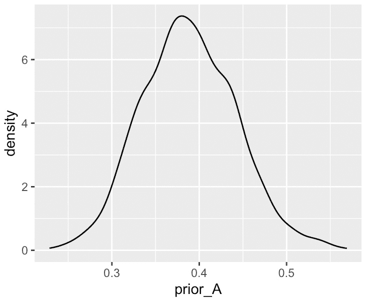

图 14.2 – 可视化先验分布的密度图

Beta(a, b)分布定义在从`0`到`1`的区间上，因此为概率随机变量提供了一个自然且灵活的先验。我们可以调整`Beta`形状参数 a 和 b 以产生不同的先验模型。在下面的代码片段中，我们比较了原始`Beta(35,55)`先验分布与两种替代方案：`Beta(1,1)`和`Beta(100,100)`。然后我们将所有三个先验分布一起绘制出来：

```py

# Sample draws from the Beta(1,1) prior
prior_B = rbeta(n = 1000, shape1 = 1, shape2 = 1)
# Sample draws from the Beta(100,100) prior
prior_C = rbeta(n = 1000, shape1 = 100, shape2 = 100)
# Combine the results in a single data frame
prior_all = data.frame(samples = c(prior_A, prior_B, prior_C),
                        priors = rep(c("A","B","C"), each = 1000))
# Plot the 3 priors
ggplot(prior_all, aes(x = samples, fill = priors)) +
  geom_density(alpha = 0.5)
```

前面的代码返回*图 14.3*所示的输出。每个先验分布都有一个不同的偏好区域。例如，分布 B 接近均匀分布，没有特定的偏好，而分布 C 对`0.5`有强烈的偏好，如峰值在`0.5`附近和狭窄的分布所指示：

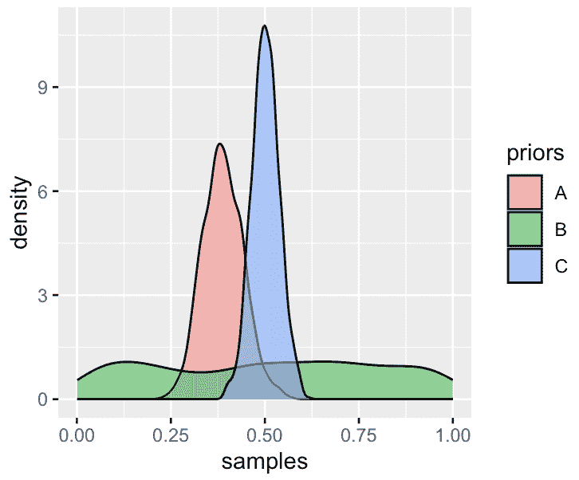

图 14.3 – 可视化三种不同的先验分布

在下一节中，我们将向您介绍似然函数。

## 介绍似然函数

似然函数描述了在给定一组固定模型参数的情况下，观察到的数据有多可能。在参数模型（假设一组特定参数的模型）中，似然是观察数据的概率作为参数的函数。似然函数的具体形式取决于数据所假设的分布（更具体地说，是观测模型）。例如，如果我们假设数据遵循正态分布，似然函数将采用正态概率密度函数的形式。

让我们来看一个具体的例子。假设我们正在开发一个具有标准正态误差的简单线性回归模型，表示为 y = βx + ϵ，其中 ϵ ∼ N(0,1)。在这里，我们忽略了截距项，只考虑了斜率。对于特定的数据点 (x_i, y_i)，我们可以将似然 l_i 表示为在误差项的概率密度函数上的概率评估：

l_i = 1 / √2π e^(-(y_i−βx_i)² / 2)

由于数据集由总共 n 个输入输出对组成，所有数据点的联合似然可以表示如下：

L = Π i=1 n l_i = (1 / √2π)^n e^−∑ i=1 n (y_i−βx_i)² / 2

在实践中，我们通常会引入对数变换后处理对数似然，如下所示：

logL = log(1 / √2π)^n e^−∑ i=1 n (y_i−βx_i)² / 2 = −0.5nlog2π − 0.5∑ i=1 n (y_i − β x_i)²

与基于 OLS 的线性回归中使用的目标函数相比，我们发现指数项 ∑ i=1 n (y_i − β x_i)² 正好是平方误差的总和。当使用最大似然估计过程时，这两个不同的目标函数变得彼此等价。换句话说，我们有以下：

logL ≈ − ∑ i=1 n (y_i − β x_i)²

在最后一步，我们忽略了常数项 (1 / √2π)^n。

让我们通过一个例子来了解如何计算一组观察数据的联合似然。在下面的代码列表中，我们创建了一个包含数据点 `x` 和 `y` 的列表，以及一个具有系数 `b` 的简单线性回归模型，以生成预测值 `y_pred`，以及残差项 `residuals`：

```py

# observed data
x = c(1, 2, 3, 4, 5)
y = c(2, 3, 5, 6, 7)
# parameter value
b = 0.8
# calculate the predicted values
y_pred = b * x
# calculate the residuals
residuals = y - y_pred
```

然后，我们可以将联合似然的闭式表达式代入，并计算总对数似然，如下所示：

```py

log_likelihood = -0.5 * length(y) * log(2 * pi) - 0.5 * sum(residuals²)
log_likelihood
-18.09469
```

让我们看看二项模型的另一个例子。如前所述，当潜在参数 p 代表成功的概率时，我们可以使用 `rbinom()` 函数来获得在总抽取次数中观察到特定结果（成功次数）的概率。在下面的代码片段中，我们首先创建一个概率向量来表示不同的成功概率，并计算从二项模型 Bin(p, 10)（其中 10 是总抽取次数）中抽取的 1,000 次试验中的对应似然。最后，我们使用 `ggridges` 包中的 `geom_density_ridges()` 函数通过堆叠密度图可视化所有似然函数：

```py

library(ggridges)
# Define a vector of 1000 p values
p_grid = seq(from = 0, to = 1, length.out = 1000)
# Simulate 10 trials for each p in p_grid, each trial has 1000 samples
sim_result = rbinom(n = 1000, size = 10, prob = p_grid)
# Collect results in a data frame
likelihood_sim = data.frame(p_grid, sim_result)
# Density plots of p_grid grouped by sim_result
ggplot(likelihood_sim, aes(x = p_grid, y = sim_result, group = sim_result)) +
  geom_density_ridges()
```

上述代码产生以下输出：

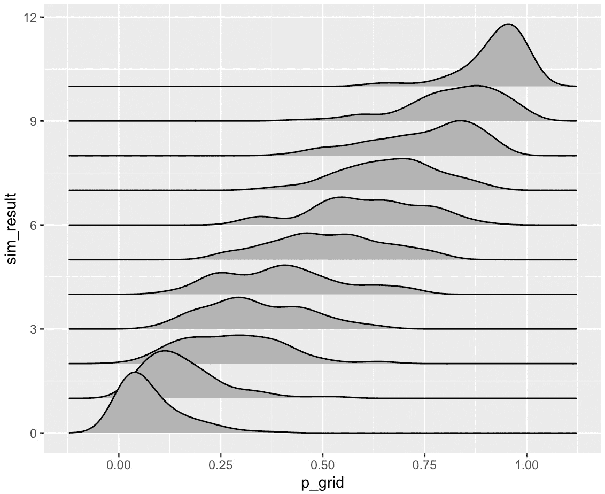

图 14.4 – 可视化堆叠密度图作为来自二项分布不同抽样的似然函数

下一个部分介绍了后验模型。

## 引入后验模型

后验分布代表了观察可用数据后我们对未知参数的了解。它结合了通过先验分布表达的前验信念和数据通过似然函数提供的证据，形成一个新分布，覆盖可能的参数值，这些值可以是离散的或连续的。

基于贝叶斯定理，后验分布与先验分布和似然函数的乘积成比例：

P(β | x, y) ∝ P(y|x, β)P(β)

注意，在求解参数 β 的最优值时，我们不需要知道分母中的证据项，因为 P(y|x) 与 β 完全独立。随着我们收集更多数据并更新我们的信念，后验分布通常会围绕真实参数值变得更加尖锐，这表明置信度有所提高。

然而，当我们需要知道 P(y|x) 以计算 P(β | x, y) 时，任务并不那么直接，因为可能没有封闭形式的解，或者参数是多维的，这阻止了直接计算嵌套积分。在这种情况下，我们通常会求助于数值方法，如**马尔可夫链蒙特卡洛**（**MCMC**）或近似方法，如变分推断。

让我们通过一个练习来了解整体推理过程。我们将使用 `rjags` 包根据我们的运行示例进行计算。

### 练习 14.2 – 获取后验分布

在这个练习中，我们将使用 `rjags` 包进行贝叶斯推理，包括指定模型架构和获取潜在参数的后验分布。按照以下步骤进行：

1.  我们首先定义似然函数为一个二项分布（使用`dbin`），参数`p`代表成功概率，`n`代表样本总数。我们还将定义参数`p`的先验分布为一个贝塔分布（使用`dbeta`），参数为`a`和`b`：

    ```py

    library(rjags)
    # define the model
    bayes_model = "model{
        # Likelihood model for X
        X ~ dbin(p, n)
        # Prior model for p
        p ~ dbeta(a, b)
    }"
    Compile the model using the bayes.model() function.
    # compile the model
    bayes_jags = jags.model(textConnection(bayes_model),
                            data = list(a = 1, b = 1, X = 3, n = 10))
    ```

    这里，我们指定`textConnection(bayes_model)`将模型规范字符串传递给`jags`。数据参数是一个列表，指定了观察到的数据和先验分布的参数。

1.  接下来，我们从后验分布中抽取样本：

    ```py

    # simulate the posterior
    bayes_sim = coda.samples(model = bayes_jags, variable.names = c("p"), n.iter = 10000)
    ```

    这里，使用`coda.samples()`函数运行 MCMC 模拟并抽取参数样本。`n.iter`参数指定了 MCMC 模拟的迭代次数。

1.  最后，我们绘制后验分布图：

    ```py

    # plot the posterior
    plot(bayes_sim, trace = FALSE, xlim = c(0,1), ylim = c(0,3))
    ```

    运行前面的代码将产生*图 14.5*中显示的输出：

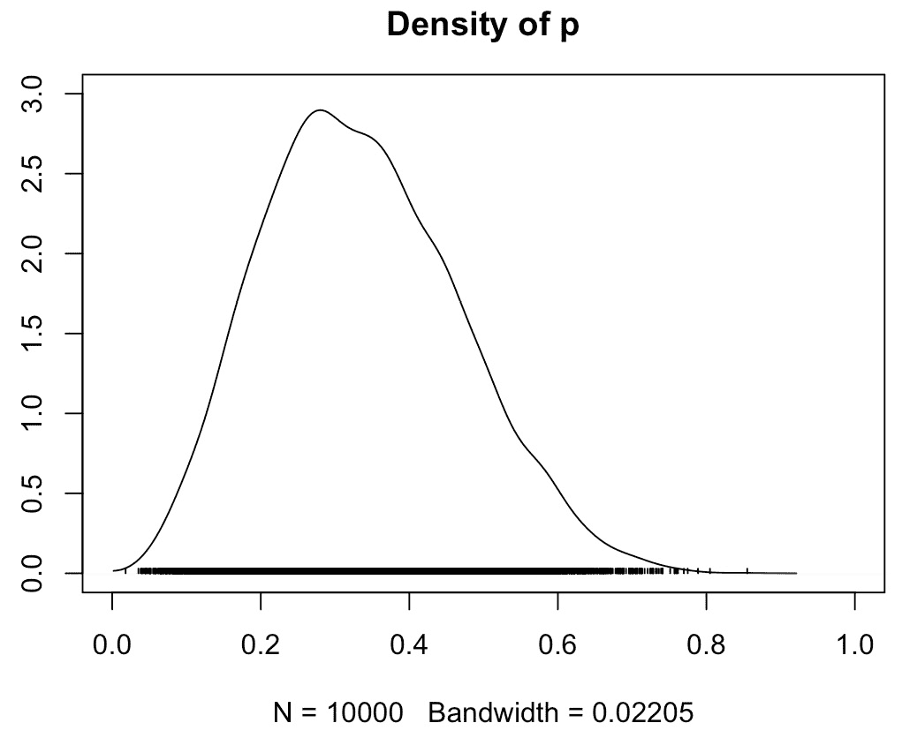

图 14.5 – 可视化基础参数（成功概率）的后验分布

在下一节中，我们将更深入地探讨贝叶斯推理，首先介绍正态-正态模型，这是贝叶斯推理中常用的一种模型类型。

# 深入贝叶斯推理

贝叶斯推理是一种统计方法，它利用条件概率来更新关于统计模型参数的先验信念，基于观察到的数据。贝叶斯推理的输出是一个后验分布，它表示我们在观察数据后对参数更新的信念。

当计算精确的后验分布很困难时，我们通常会求助于 MCMC，这是一种估计随机变量分布的技术。它是贝叶斯推理中从后验分布中生成样本的常用方法，尤其是在模型参数的维度很高时，使得解析解变得不可行。

在下一节中，我们将介绍正态-正态模型，并使用 MCMC 来估计其后验分布。

## 介绍正态-正态模型

正态-正态模型是贝叶斯推理中的另一个基础模型。它指的是当似然函数和先验分布都是正态分布，且都遵循钟形曲线的情况。这类模型在贝叶斯统计中经常被使用，因为它对后验分布有封闭形式的解，而这个解恰好也是正态分布。

让我们通过一个基于 MCMC 的贝叶斯推理的 normal-normal 模型的具体练习来观察。

### 练习 14.3 – 使用正态-正态模型

在这个练习中，我们将定义一个正态似然函数，其均值遵循正态先验分布，而标准差遵循均匀先验分布。然后我们将使用`rjags`来获取均值和标准差的后验估计。请按照以下步骤操作：

1.  让我们从模拟 100 个遵循具有真实均值`2`和真实标准差`1`的正态分布的数据点开始：

    ```py

    library(coda)
    set.seed(1)
    mu_true = 2
    sd_true = 1
    n = 100
    data = rnorm(n, mean = mu_true, sd = sd_true)
    ```

1.  现在，我们指定模型架构，包括数据的一个正态似然函数、均值变量的正态先验分布和标准差变量的均匀先验。正态先验由`0`和`0.1`分别参数化均值和标准差，而均匀先验的范围从`0`到`10`：

    ```py

    model_string = "model {
        for (i in 1:n) {
            y[i] ~ dnorm(mu, prec)
        }
        mu ~ dnorm(0, 0.1)
        sigma ~ dunif(0, 10)
        prec <- pow(sigma, -2)
    }"
    ```

    前面的模型表明，我们数据中的每个观测值（`y[i]`）遵循一个具有均值`mu`和精度`prec`的正态分布（定义为方差的倒数，因此`prec <- pow(sigma, -2)`）。均值`mu`遵循一个具有均值`0`和接近`0`的精度的正态分布，这对应于相对较大的方差，因此对`mu`的先验信念较弱。标准差`sigma`遵循一个从`0`到`10`的均匀分布，这表达了在这两个界限之间对其值的完全不确定性。

1.  接下来，在`jags`中编译模型并烧尽马尔可夫链，如下所示：

    ```py

    data_jags = list(y = data, n = n)
    model = jags.model(textConnection(model_string), data = data_jags)
    update(model, 1000)  # burn-in
    ```

    在这里，`burn-in`期是一系列初始迭代次数，我们在进行贝叶斯推理时将其丢弃，假设在此期间产生的链可能没有收敛。想法是让马尔可夫链烧尽，直到它达到一个稳定且能反映我们感兴趣的后续分布的分布。在这种情况下，我们将丢弃马尔可夫链的前 1,000 次迭代，这些迭代在后续分析中不被使用。

1.  在这里，我们从后验分布中生成样本：

    ```py

    params = c("mu", "sigma")
    samples = coda.samples(model, params, n.iter = 10000)
    # print summary statistics for the posterior samples
    >>> summary(samples)
    Iterations = 2001:12000
    Thinning interval = 1
    Number of chains = 1
    Sample size per chain = 10000
    1\. Empirical mean and standard deviation for each variable,
       plus standard error of the mean:
            Mean      SD  Naive SE Time-series SE
    mu    2.1066 0.09108 0.0009108      0.0009108
    sigma 0.9097 0.06496 0.0006496      0.0008996
    2\. Quantiles for each variable:
           2.5%    25%    50%    75% 97.5%
    mu    1.929 2.0453 2.1064 2.1666 2.287
    sigma 0.792 0.8652 0.9055 0.9513 1.046
    ```

    在这里，`summary()`函数为`mu`和`sigma`的后验样本提供了有用的汇总统计信息，包括它们的均值、中位数和可信区间。

1.  最后，通过运行以下命令来可视化结果：

    ```py

    >>> plot(samples)
    ```

    运行前面的代码行将生成如*图 14*.6 所示的输出，该图显示了`mu`和`sigma`的后验样本的轨迹图和密度图：

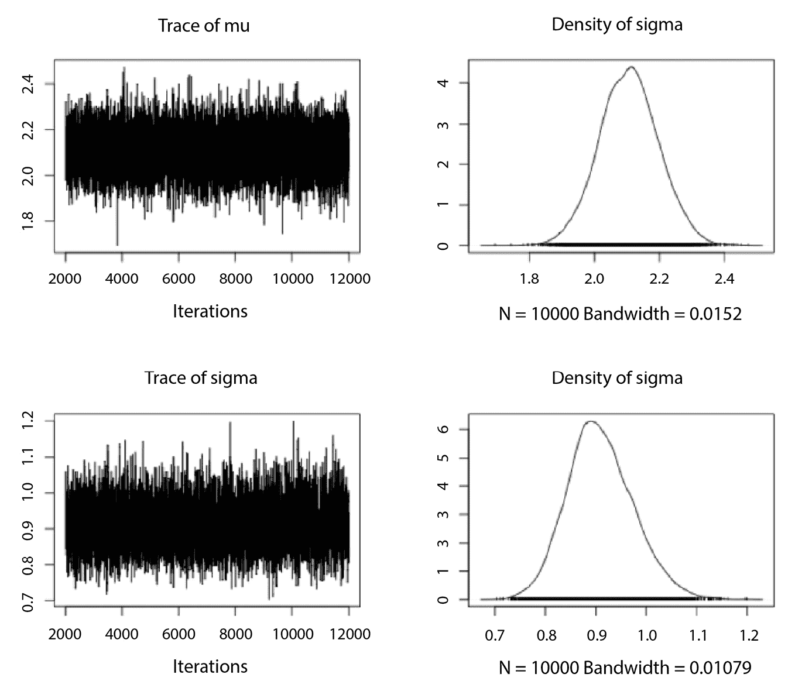

图 14.6 – 可视化后验样本的轨迹图和密度图

在下一节中，我们将进一步讨论 MCMC。

## 介绍 MCMC

马尔可夫链是一个数学模型，在有限或可数的可能状态之间从一个状态过渡到另一个状态。它是一系列随机变量，其中未来的状态只取决于当前状态，而不取决于它之前的事件序列。这个特性被称为**马尔可夫性质**，或**无记忆性**。

在统计推断的背景下，我们可以从复杂的概率分布中进行采样，并通过蒙特卡洛模拟创建序列数据的模型，因此术语 MCMC。MCMC 算法构建参数值的马尔可夫链，其中链的平稳分布是潜在参数的后验分布。链是通过迭代提出新的参数值并根据预设规则接受或拒绝这些候选值来生成的，确保样本收敛到后验分布。

让我们分析之前 MCMC 链的细节。在下面的代码片段中，我们将链转换为 DataFrame 并打印其前几行：

```py

# Store the chains in a data frame
mcmc_chains <- data.frame(samples[[1]], iter = 1:10000)
# Check out the head
>>> head(mcmc_chains)
        mu     sigma iter
1 2.159540 0.8678513    1
2 2.141280 0.8719263    2
3 1.975057 0.8568497    3
4 2.054670 0.9313297    4
5 2.144810 1.0349093    5
6 2.001104 1.0597861    6
```

这些是生成以近似 `mu` 和 `sigma` 的后验分布的 MCMC 样本。每个样本仅依赖于前一个样本，与其他先验样本无关。我们可以将这些样本绘制在称为迹图的线图中，如下代码片段所示：

```py

# Use plot() to construct trace plots
>>> plot(samples, density = FALSE)
```

运行上述代码生成 *图 14.7* 中显示的输出。迹图是 MCMC 中常用的诊断工具。它是 MCMC 算法每次迭代或步骤中样本值的图形表示。在这种情况下，迹图没有明显的趋势，表明两条链都稳定收敛：

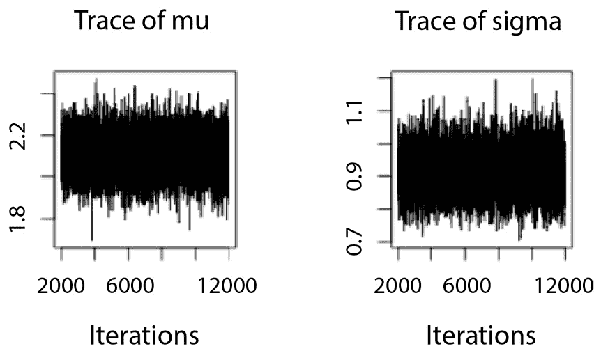

图 14.7 – 显示 MCMC 链的迹图

让我们使用 `ggplot()` 观察 `mu` 的前 100 个样本：

```py

# Trace plot the first 100 iterations of the mu chain
>>> ggplot(mcmc_chains[1:100, ], aes(x = iter, y = mu)) +
  geom_line() +
  theme(axis.title.x = element_text(size = 20),  # Increase x-axis label size
        axis.title.y = element_text(size = 20))  # Increase y-axis label size
```

运行上述代码生成 *图 14.8* 中显示的输出。我们可以看到采样器在充分探索了前一个区域后移动到了另一个区域：

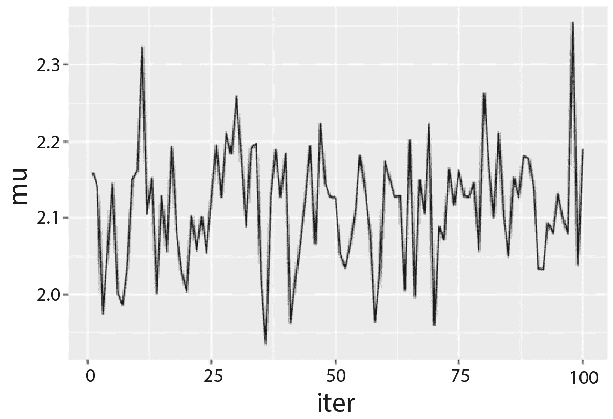

图 14.8 – 显示 mu 链的前 100 次迭代

注意，我们也可以仅通过设置 `trace = FALSE` 来显示密度图，如下所示：

```py

# Use plot() to construct density plots
>>> plot(samples, trace = FALSE)
```

上述代码返回了 *图 14.9* 中显示的输出：

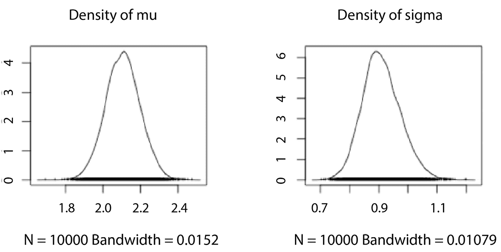

图 14.9 – 显示两条链的密度图

在实践中，我们通常会运行多个 MCMC 链。这允许我们检查所有链是否收敛到相同的分布，这是确保 MCMC 采样正确执行的关键步骤。由于 MCMC 中的每个链都是从不同的初始点开始的，运行多个链可以帮助检查后验分布是否依赖于起始值。当所有链无论初始点如何都收敛到相同的分布时，我们对 MCMC 过程的稳定性和鲁棒性有更高的信心。

以下代码片段在四个链上运行 MCMC：

```py

model2 = jags.model(textConnection(model_string), data = data_jags, n.chains = 4)
# simulate the posterior
samples2 <- coda.samples(model = model2, variable.names = params, n.iter = 1000)
```

我们可以如下检查迹图：

```py

# Construct trace plots
>>> plot(samples2, density = FALSE)
```

如 *图 14.10* 所示，所有四个链或多或少都收敛到了一个稳定状态：

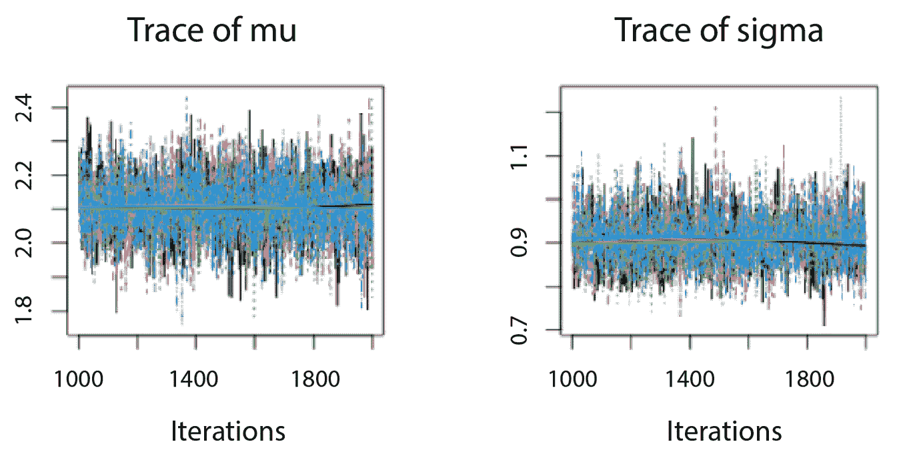

图 14.10 – 可视化两个链的密度图

最后，我们可以检查 MCMC 样本的摘要，如下所示：

```py

>>> summary(samples2)
Iterations = 1001:2000
Thinning interval = 1
Number of chains = 4
Sample size per chain = 1000
1\. Empirical mean and standard deviation for each variable,
   plus standard error of the mean:
        Mean      SD Naive SE Time-series SE
mu    2.1052 0.09046  0.00143        0.00144
sigma 0.9089 0.06454  0.00102        0.00134
2\. Quantiles for each variable:
        2.5%    25%   50%    75% 97.5%
mu    1.9282 2.0456 2.104 2.1655 2.282
sigma 0.7952 0.8626 0.906 0.9522 1.041
```

在下一节中，我们将介绍完整的贝叶斯推理过程，包括量化后验不确定性和基于参数后验分布进行预测。

# 完整的贝叶斯推理过程

完整的贝叶斯推理首先需要指定模型架构，包括未知（未观测）参数的先验分布以及确定数据生成方式的似然函数。然后，我们可以执行 MCMC 来推断给定观测数据集的这些参数的后验分布。最后，我们可以使用后验分布来量化这些参数的不确定性，或者对新输入数据进行预测，并量化预测的不确定性。

以下练习使用 `mtcars` 数据集说明了这个过程。

### 练习 14.4 – 执行完整贝叶斯推理

在这个练习中，我们将使用单个特征和两个未知参数（`intercept` 和 `slope`）执行贝叶斯线性回归。该模型研究 `mtcars` 数据集中汽车重量 (`wt`) 和马力 (`hp`) 之间的关系。按照以下步骤进行：

1.  指定一个贝叶斯推理模型，其中每个目标 `wt` 被建模为服从正态分布的随机变量的实现。`mean` 参数是两个参数（`a` 为 `intercept`，`b` 为 `slope`）与相应输入特征的线性组合。`a` 和 `b` 都服从正态分布，而 `variance` 参数服从均匀分布。以下代码片段展示了代码：

    ```py

    # load the necessary libraries
    library(rjags)
    library(coda)
    # define the model
    model = "model{
        # Define model for data Y[i]
        for(i in 1:length(Y)) {
          Y[i] ~ dnorm(m[i], s^(-2))
          m[i] <- a + b * X[i]
        }
        # Define the a, b, s priors
        a ~ dnorm(0, 0.5^(-2))
        b ~ dnorm(1, 0.5^(-2))
        s ~ dunif(0, 20)
    }"
    ```

1.  使用三个链编译模型，并控制随机种子以实现模型的可重复性：

    ```py

    # compile the model
    model = jags.model(textConnection(model),
                        data = list(Y = mtcars$wt, X = mtcars$hp),
                        n.chains = 3,
                        inits = list(.RNG.name = "base::Wichmann-Hill", .RNG.seed = 100))
    ```

1.  运行`三次`迭代的预热期：

    ```py

    # burn-in
    update(model, 1000)
    ```

1.  参数后验分布的 MCMC 样本，如图所示：

    ```py

    # generate MCMC samples
    samples = coda.samples(model, variable.names = c("a", "b", "s"), n.iter = 5000)
    ```

1.  创建 MCMC 样本的迹图以评估收敛性，如下所示：

    ```py

    # check convergence using trace plot
    >>> plot(samples)
    ```

    运行前面的代码生成如图 *14*.11 所示的输出，表明所有三个参数都有良好的收敛性：

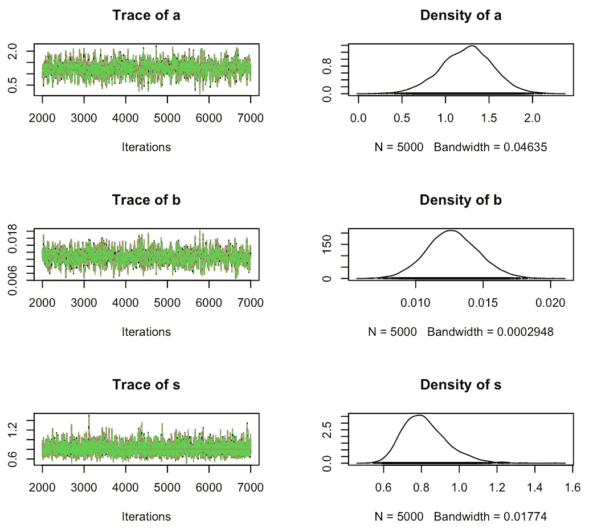

图 14.11 – 可视化所有三个参数的迹图

1.  计算参数 `a` 和 `b` 的后验分布的均值，并使用这些均值进行点预测，并在数据的散点图上绘制预测线，如下所示：

    ```py

    # Get the posterior estimates
    posterior_estimates = summary(samples)
    # Calculate the mean for each parameter
    a_mean = posterior_estimates$statistics["a", "Mean"]
    b_mean = posterior_estimates$statistics["b", "Mean"]
    # Plot the prediction line
    ggplot(mtcars, aes(x = hp, y = wt)) +
      geom_point() +
      geom_abline(intercept = a_mean, slope = b_mean) +
      labs(title = "Bayesian Linear Regression",
           x = "Horsepower",
           y = "Weight") +
      theme(plot.title = element_text(hjust = 0.5))
    ```

    在这里，我们使用后验分布的均值作为参数值，对每个输入特征进行点预测。生成的输出如图 *14*.12 所示：

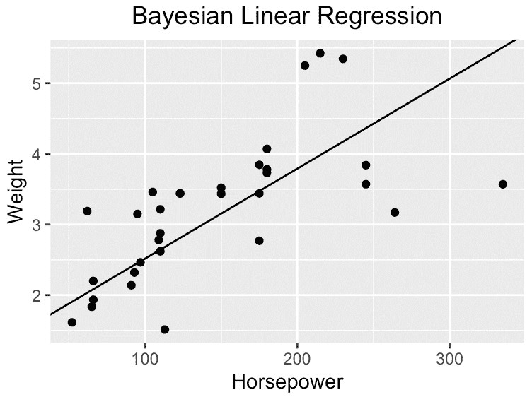

图 14.12 – 使用每个参数的后验分布的均值进行点预测

值得注意的是，与之前章节中介绍的频率主义线性回归相比，贝叶斯线性回归提供了量化的不确定性。这种不确定性以可信区间（credible intervals）的形式出现，与置信区间不同。具体来说，我们通过将参数视为随机变量，将数据视为固定量来获得可信区间，这在大多数情况下我们只能观察一次数据时更有意义。

1.  使用`HPDinterval()`函数计算`a`和`b`，并在直方图中绘制置信区间，如下所示：

    ```py

    # Extract samples
    a_samples = as.matrix(samples[, "a"])
    b_samples = as.matrix(samples[, "b"])
    # Calculate credible intervals
    a_hpd = coda::HPDinterval(coda::as.mcmc(a_samples))
    b_hpd = coda::HPDinterval(coda::as.mcmc(b_samples))
    # Plot histograms and credible intervals
    par(mfrow=c(2,1))  # Create 2 subplots
    # Parameter a
    hist(a_samples, freq=FALSE, xlab="a", main="Posterior distribution of a", col="lightgray")
    abline(v=a_hpd[1,1], col="red", lwd=2)  # Lower limit of the credible interval
    abline(v=a_hpd[1,2], col="red", lwd=2)  # Upper limit of the credible interval
    # Parameter b
    hist(b_samples, freq=FALSE, xlab="b", main="Posterior distribution of b", col="lightgray")
    abline(v=b_hpd[1,1], col="red", lwd=2)  # Lower limit of the credible interval
    abline(v=b_hpd[1,2], col="red", lwd=2)  # Upper limit of the credible interval
    ```

    运行命令生成*图 14.13*所示的输出。在这里，我们默认计算 95%的可信区间：

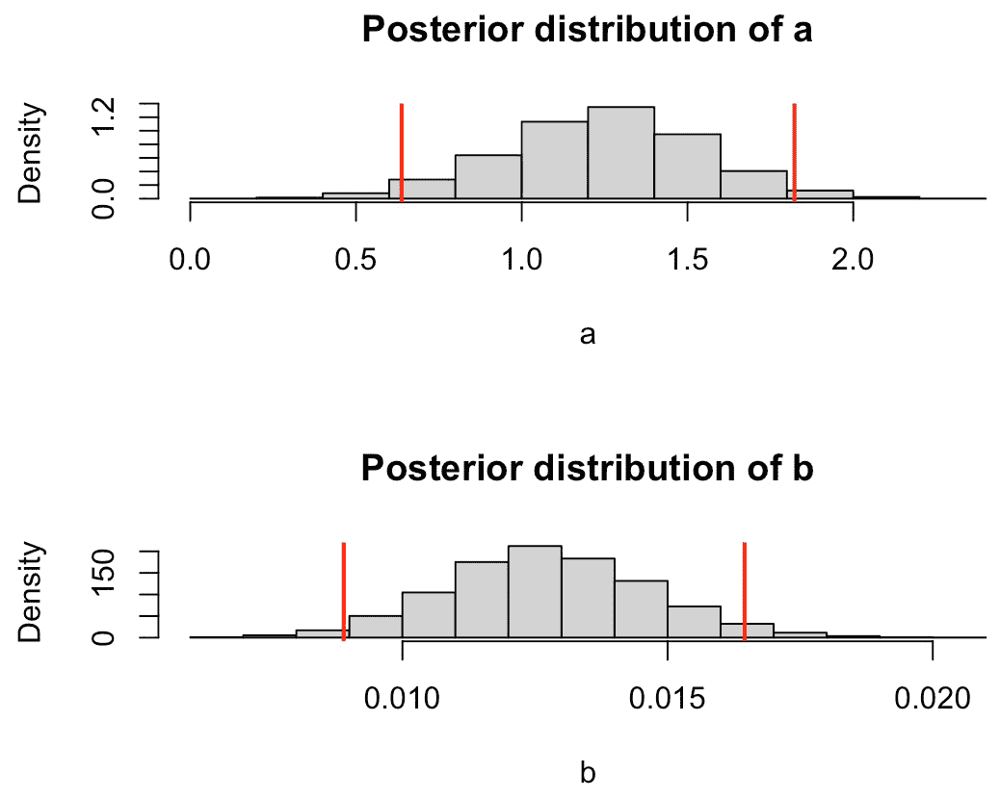

图 14.13 – 可视化模型参数的后验分布和可信区间

1.  最后，对新输入值 120 进行后验预测，并基于参数的后验样本列表绘制后验预测分布，如下所示：

    ```py

    # make posterior predictions
    # Obtain the mean values of the MCMC samples for each parameter
    a_mean = mean(samples[[1]][,"a"])
    b_mean = mean(samples[[1]][,"b"])
    # New input (e.g., horsepower = 120)
    new_input = 120
    # Prediction
    predicted_weight = a_mean + b_mean * new_input
    print(predicted_weight)
    # Predictive distribution
    predicted_weights = samples[[1]][,"a"] + samples[[1]][,"b"] * new_input
    # Plot the predictive distribution
    >>> hist(predicted_weights, breaks = 30, main = "Posterior predictive distribution", xlab = "Predicted weight")
    ```

    运行命令生成*图 14.14*所示的输出。此后的验预测分布捕捉了模型对预测的不确定性：

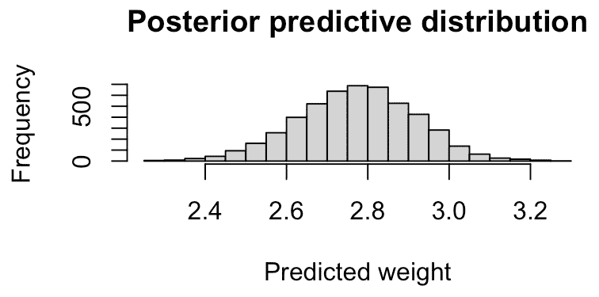

图 14.14 – 可视化新输入特征的后验预测分布

下一节将介绍使用分类输入变量的贝叶斯线性回归模型。

# 带有分类变量的贝叶斯线性回归

当预测变量是分类变量，例如二元特征时，我们会对每个对应的类别设置一个参数。以下练习演示了这样一个例子。

### 练习 14.5 – 使用分类变量进行贝叶斯推理

在这个练习中，我们将检查`am`（自动或手动变速，一个分类变量）与`mpg`（每加仑英里数，一个连续变量）之间的关系。我们将定义`mpg`的正态似然均值作为`am`的函数，每个`am`级别有不同的均值`mu[i]`。我们还将给`mu`一个正态先验，给标准差`s`一个均匀先验。按照以下步骤进行：

1.  按照以下方式指定上述模型架构：

    ```py

    # define the model
    model = "model{
        # Define model for data Y[i]
        for(i in 1:length(Y)) {
          Y[i] ~ dnorm(mu[am[i]+1], s^(-2))
        }
        # Define the mu, s priors
        for(j in 1:2){
          mu[j] ~ dnorm(20, 10^(-2))
        }
        s ~ dunif(0, 20)
    }"
    ```

1.  编译模型，生成后验样本，并显示收敛图：

    ```py

    # compile the model
    model = jags.model(textConnection(model),
                        data = list(Y = mtcars$mpg, am = mtcars$am),
                        n.chains = 3,
                        inits = list(.RNG.name = "base::Wichmann-Hill", .RNG.seed = 100))
    # burn-in
    update(model, 1000)
    # generate MCMC samples
    samples = coda.samples(model, variable.names = c("mu", "s"), n.iter = 5000)
    # check convergence using trace plot
    >>> plot(samples)
    ```

    运行前面的代码生成*图 14.15*所示的输出，表明所有模型参数的收敛性良好：


图 14.15 – 可视化收敛图

1.  按照以下方式绘制数据集的分布以及分类变量两个级别的参数均值估计：

    ```py

    # Get the posterior estimates
    posterior_estimates = summary(samples)
    # Calculate the mean for each parameter
    mu1_mean = posterior_estimates$statistics["mu[1]", "Mean"]
    mu2_mean = posterior_estimates$statistics["mu[2]", "Mean"]
    # Plot the prediction line
    ggplot(mtcars, aes(x = as.factor(am), y = mpg)) +
      geom_jitter(width = 0.2) +
      geom_hline(aes(yintercept = mu1_mean, color = "Automatic"), linetype = "dashed") +
      geom_hline(aes(yintercept = mu2_mean, color = "Manual"), linetype = "dashed") +
      scale_color_manual(name = "Transmission", values = c("Automatic" = "red", "Manual" = "blue")) +
      labs(title = "Bayesian Linear Regression",
           x = "Transmission (0 = automatic, 1 = manual)",
           y = "Miles Per Gallon (mpg)") +
      theme(plot.title = element_text(hjust = 0.5),
            legend.position = "bottom")
    ```

    上述代码将生成*图 14.16*中所示的结果：

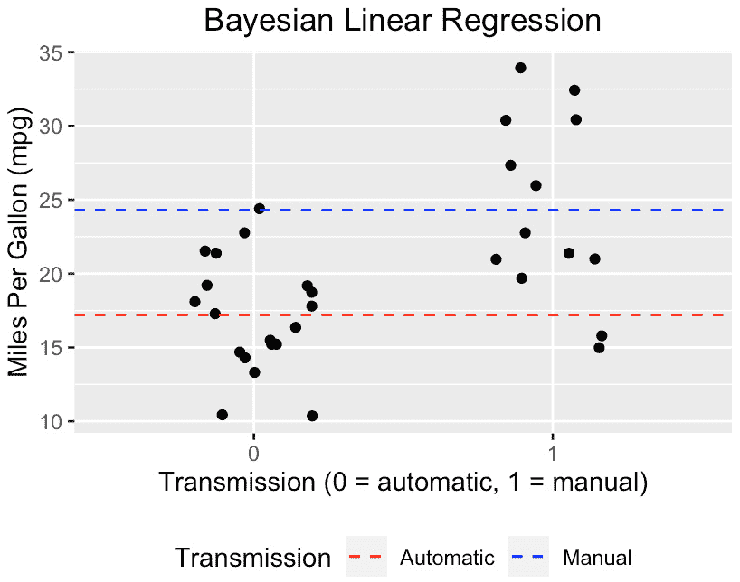

图 14.16 – 可视化数据集的分布和均值估计

# 摘要

本章全面介绍了贝叶斯统计，从对贝叶斯定理的基本探讨开始。我们深入研究了其组成部分，从理解生成模型开始，这有助于我们模拟数据并检查参数变化如何影响数据生成过程。

然后，我们专注于理解先验分布，这是贝叶斯统计的一个基本组成部分，它代表了我们对于一个不确定参数的先验知识。随后，我们介绍了似然函数，这是一个统计函数，它决定了在给定的参数值下，一组观测值发生的可能性。

接下来，我们介绍了后验模型的概念。这结合了我们的先验分布和似然函数，给出一个新的概率分布，它代表了在看到数据后的更新信念。我们还探讨了更复杂的模型，例如正态-正态模型，其中似然和先验都是正态分布的。我们进一步通过 MCMC 方法研究了贝叶斯推理的机制，这是一种强大的工具，用于估计参数分布和进行预测。完整的贝叶斯推理过程的详细说明伴随着这一部分。

最后，我们讨论了具有分类变量的贝叶斯线性回归，这扩展了方法到包括分类预测因子的模型。

恭喜！您已成功到达本书的结尾，这是您奉献和努力的证明。这次旅程，希望对您来说富有成效，对我而言当然也是如此，标志着您在动态的统计学和机器学习领域持续探索中的一个重要里程碑。我很荣幸您选择这本书作为这次航行的伴侣，我相信它为您的未来追求奠定了坚实的基础。
