# 第一章：亚马逊 Redshift 无服务器简介

*“嗨，什么是数据仓库？”* 约翰·多伊，虚构的葡萄酒电子商务公司 Red.wines 的 CEO 和联合创始人，问塔西亚·维什莱斯克，公司的 CTO。拥有精品酒庄的约翰与塔西亚合作了这个项目。公司在疫情期间的成功得益于社交媒体和居家趋势。约翰希望进行详细的数据分析，以调整库存和客户接触。然而，有一个问题——产生这种分析正在减缓他们的**在线事务处理**（**OLTP**）数据库。

*“数据仓库就像一个大型数据库，我们在这里长期存储不同的数据，以便发现洞察和做出决策，”塔西亚解释道。*

约翰有所顾虑，*“听起来很贵；我们已经在为未使用的仓库空间付费了。我们负担得起吗？”*

塔西亚安慰他说，*“你说得对，但是有像亚马逊 Redshift 无服务器这样的云数据仓库，让你按使用付费。”*

在此基础上，本章介绍了数据仓库和亚马逊 Redshift。我们将涵盖亚马逊 Redshift 无服务器基础，例如命名空间和工作组，并指导您创建数据仓库。亚马逊 Redshift 可以从各种来源收集数据，主要是亚马逊**简单存储服务**（**S3**）。

在我们阅读本章的过程中，您将了解这一关键方面，即从 S3 加载数据所需的 AWS **身份和访问管理**（**IAM**）角色。此角色连接到您的无服务器命名空间，以便顺利传输数据。您还将了解如何使用亚马逊 Redshift 查询编辑器加载数据样本并运行查询。我们的目标是使其简单易行，以便您在这次旅程中充满信心。

Tathya Vishleshak

“Tathya Vishleshak”这个短语可以大致理解为梵文/印地语中数据分析师的概念。然而，重要的是要注意，这并不是一个精确或已建立的翻译，而是一种尝试，基于梵文中“Tathya”和“Vishleshak”的个别含义传达相似的意义。

此外，亚马逊 Redshift 用于分析数据仓库、操作数据库和数据湖中的结构化和非结构化数据。它用于传统数据仓库、商业智能、实时分析和机器学习/预测分析。数据分析师和开发人员使用带有**机器学习**（**ML**）模型的 Redshift 数据执行预测客户行为等任务。亚马逊 Redshift ML 通过使用熟悉的 SQL 命令简化了这一过程。

本书深入探讨机器学习（ML），解释了监督学习和无监督学习。您将通过实际案例学习如何使用二分类、多分类和回归进行问题解决。您还将了解如何使用 XGBoost 创建深度学习模型和自定义模型，以及如何使用时间序列预测。本书还涵盖了使用现有模型在数据库和远程进行推理，应用机器学习进行预测分析，以及实现机器学习模型。

本章将涵盖以下主题：

+   什么是 Amazon Redshift？

+   开始使用 Amazon Redshift Serverless

+   连接到您的数据仓库

本章需要网络浏览器和 AWS 账户访问权限。

# 什么是 Amazon Redshift？

组织会产生大量客户数据，以及这些客户与业务互动的见解。这些数据被导入各种应用程序并存储在孤立的系统中。当试图解读这些数据孤岛时，会出现一个难题——这是一个巨大的挑战，阻碍了获取对组织清晰度至关重要的有意义的见解。更复杂的是，安全和性能考虑通常使商业分析师无法访问 OLTP 系统中的数据。

但问题是复杂的分析查询会拖累 OLTP 数据库，给其核心操作蒙上阴影。在这里，解决方案是**数据仓库**，这是一个经过精心整理的数据中心，由商业分析师和数据科学家使用，他们通过利用可用的商业智能和机器学习工具来做出明智的决策。这些用户利用**结构化查询语言**（**SQL**）从这些数据宝库中提取洞察。从运营系统、应用程序日志和社交媒体流到物联网设备生成数据的涌入，客户将结构化和半结构化数据导入组织的数据库仓库，如图*图 1.1*所示，展示了传统数据仓库的经典架构。

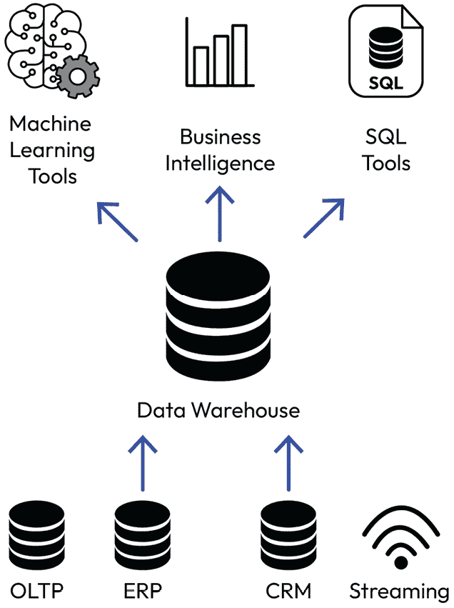

图 1.1 – 数据仓库

正是在这里，Amazon Redshift Serverless 发挥了作用。它是 Amazon Redshift 中的一个关键选项，由**亚马逊网络服务**（**AWS**）提供的由云管理的数据仓库。凭借基于云的便捷性，Amazon Redshift Serverless 让您无需基础设施烦恼或成本担忧即可设置数据存储。您根据使用的计算和存储付费。

Amazon Redshift Serverless 不仅提供了便利，还推动了现代数据应用，这些应用可以无缝连接到数据湖。进入数据湖——一个结构，它将所有数据流汇聚在一起，提供无限空间以任何规模、经济高效地存储数据。与其他数据存储库，如数据仓库一样，数据湖重新定义了组织处理数据的方式。这正是所有这一切汇聚的地方——以下图表显示了 Amazon Redshift Serverless 如何将 SQL 驱动的查询注入数据湖，驱动动态数据流：


图 1.2 – 数据湖和数据仓库

那么，让我们开始创建我们第一个云数据仓库吧！

# 开始使用 Amazon Redshift Serverless

您可以使用顶栏中的`Redshift`创建您的数据仓库，如图*图 1.3*所示：

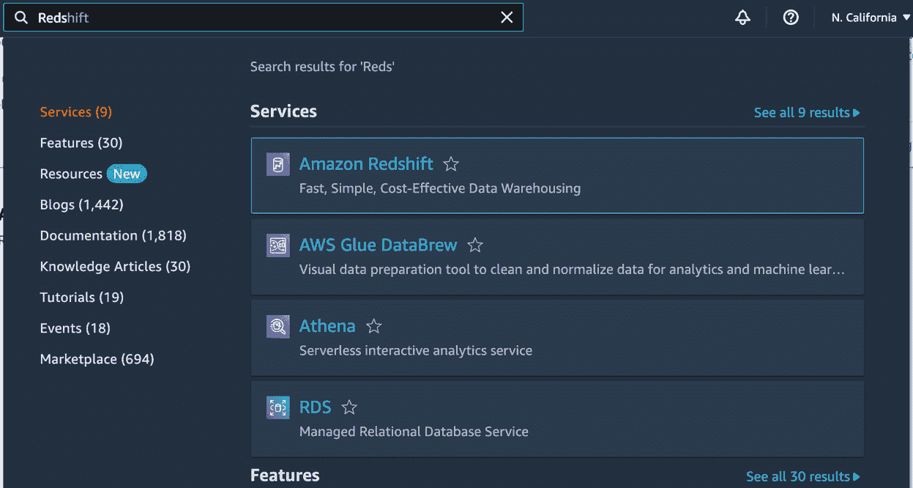

图 1.3 – AWS 控制台页面显示通过我们的 Redshift 搜索过滤出的服务

点击**Amazon Redshift**，这将带您到 Amazon Redshift 控制台的主页，如图*图 1.4*所示。为了帮助您开始，Amazon 为首次使用 Redshift Serverless 的客户提供免费信用额度。因此，让我们通过点击**尝试 Amazon Redshift Serverless**来开始创建您的试用数据仓库。如果您或您的组织之前已经尝试过 Amazon Redshift Serverless，您将需要根据您的使用情况支付服务费用：

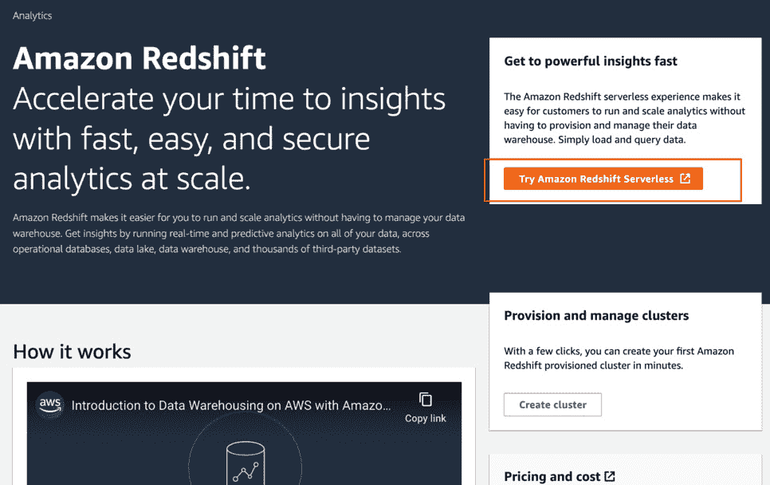

图 1.4 – AWS 控制台中的 Amazon Redshift 服务页面

如果你有可用的免费信用额度，它将在屏幕顶部显示，如图*图 1.5*所示：

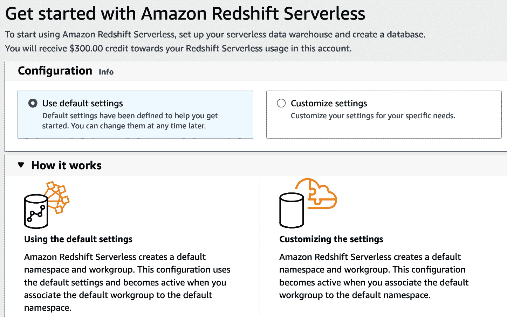

图 1.5 – AWS 控制台显示 Redshift Serverless 入门页面

您可以选择默认设置或使用自定义设置来创建您的数据仓库。自定义设置为您提供更多控制权，允许您为计算配置指定许多其他参数，包括工作组、与数据相关的设置，如命名空间，以及高级安全设置。我们将使用自定义设置，这将帮助我们自定义 Serverless 数据仓库的命名空间设置。命名空间与工作组的结合是 Redshift Serverless 数据仓库的要素，正如我们现在将更详细地看到的那样。

## 命名空间是什么？

Amazon Redshift Serverless 为数据仓库提供了存储和计算的分离。**命名空间** 是您在数据库中存储的所有数据的集合，例如您的表、视图、数据库用户及其权限。您将根据存储在您的数据仓库中数据的存储大小分别计费。对于计算，您将根据在 **Redshift 处理小时**（**RPU**）中使用的容量按秒计费。存储容量按 **Redshift 管理存储**（**RMS**）计费，并按 GB/月计费。您可以在 [`aws.amazon.com/redshift/pricing/`](https://aws.amazon.com/redshift/pricing/) 查看您 AWS 区域的详细定价信息。

作为数据仓库管理员，您可以在创建命名空间时更改您的数据仓库命名空间名称。您还可以更改您的加密设置、审计日志和 AWS IAM 权限，如图 *图 1**.6* 所示。我们将使用自定义设置的主要原因是为了将 IAM 角色与命名空间关联：

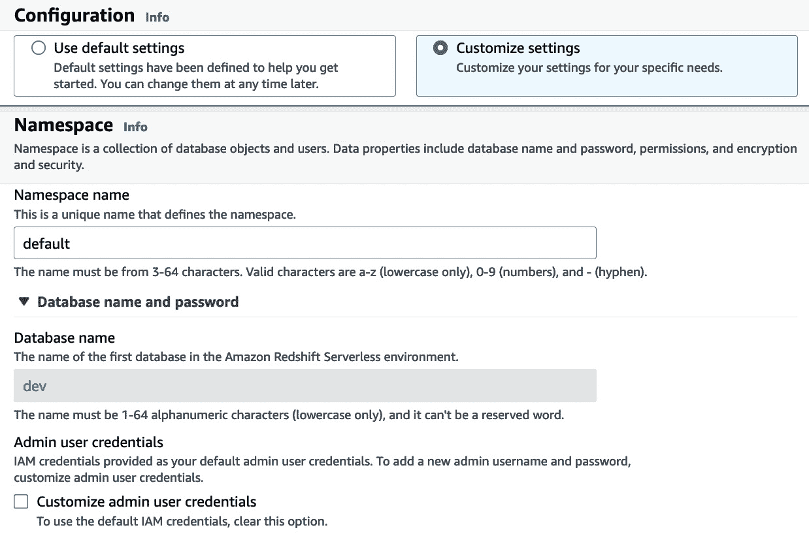

图 1.6 – 命名空间配置

AWS IAM 允许您指定哪些用户或服务可以访问 AWS 中的其他服务和资源。我们将使用该角色从 **S3** 加载数据，并使用 Redshift ML 训练机器学习模型，该模型访问 **Amazon SageMaker**。

如果您之前已经创建了一个 IAM 角色，您可以将它关联到该 IAM 角色。如果您还没有创建 IAM 角色，请现在通过选择如图 *图 1**.7* 所示的 **“管理 IAM 角色”** 选项来创建它：


图 1.7 – 通过 AWS 控制台创建 IAM 角色并将其关联

然后，选择如图 *图 1**.8* 所示的 **“创建 IAM 角色”** 选项：

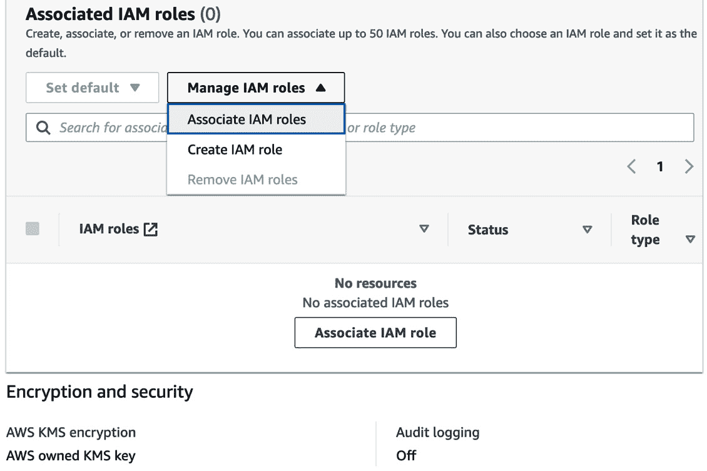

图 1.8 – 选择“创建 IAM 角色”选项

然后，您可以创建一个默认 IAM 角色并为 IAM 角色提供适当的权限，以便它能够访问 S3 存储桶，如图 *图 1**.9* 所示：

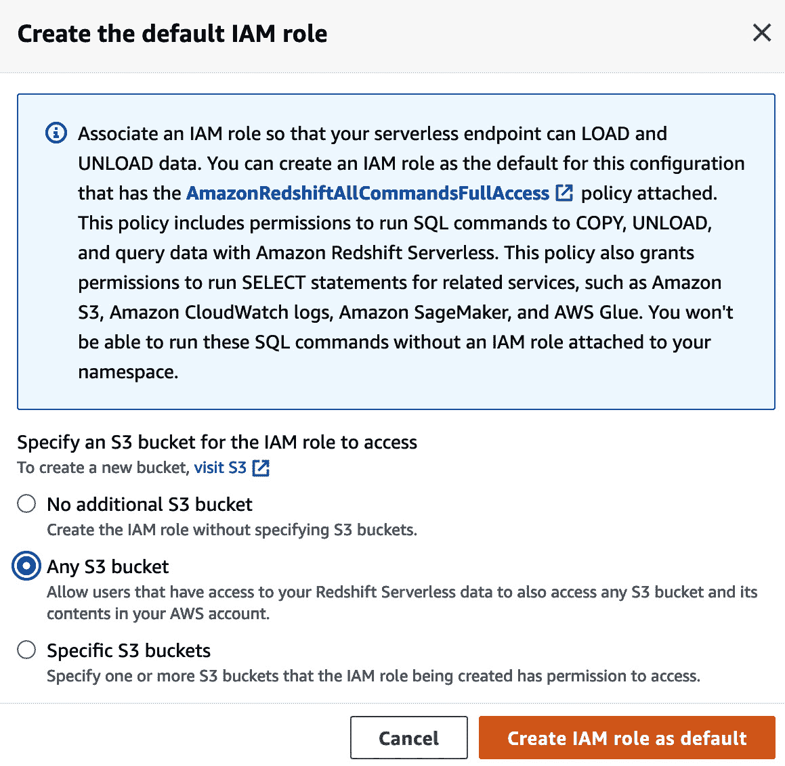

图 1.9 – 授予 IAM 角色 S3 权限

如前图所示，选择 **任何 S3 存储桶** 以启用 Redshift 从您创建的所有 S3 存储桶中读取和写入数据。然后，选择 **创建 IAM 角色作为默认角色** 以创建角色并将其设置为默认 IAM 角色。

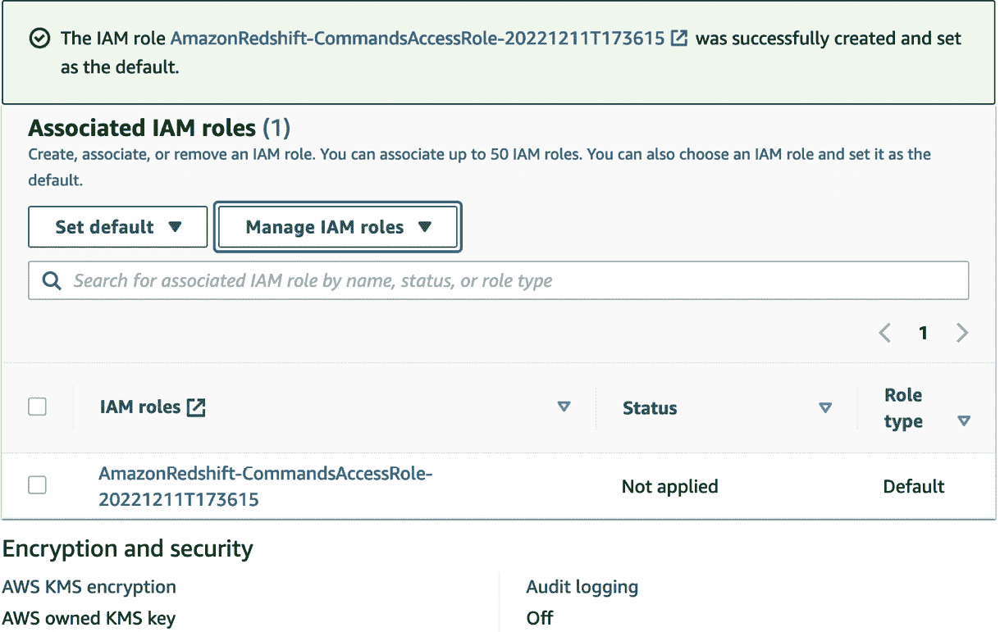

图 1.10 – 已创建 IAM 角色，但尚未应用

如 *图 1**.10* 所示，我们已创建 IAM 角色并将其作为默认角色关联到命名空间。接下来，我们将继续创建一个工作组，在该工作组中我们将设置数据仓库的计算配置。

## 工作组是什么？

如我们之前讨论的，命名空间与工作组的组合构成了 Redshift Serverless 数据仓库。**工作组**提供了处理您的数据所需的计算资源。它还提供了您连接到仓库的端点。作为管理员，您需要配置工作组的计算设置，例如网络和安全配置。

我们现在不会进行任何自定义，而是简单地选择默认设置，包括工作组的 VPC 和相关子网，如图所示：

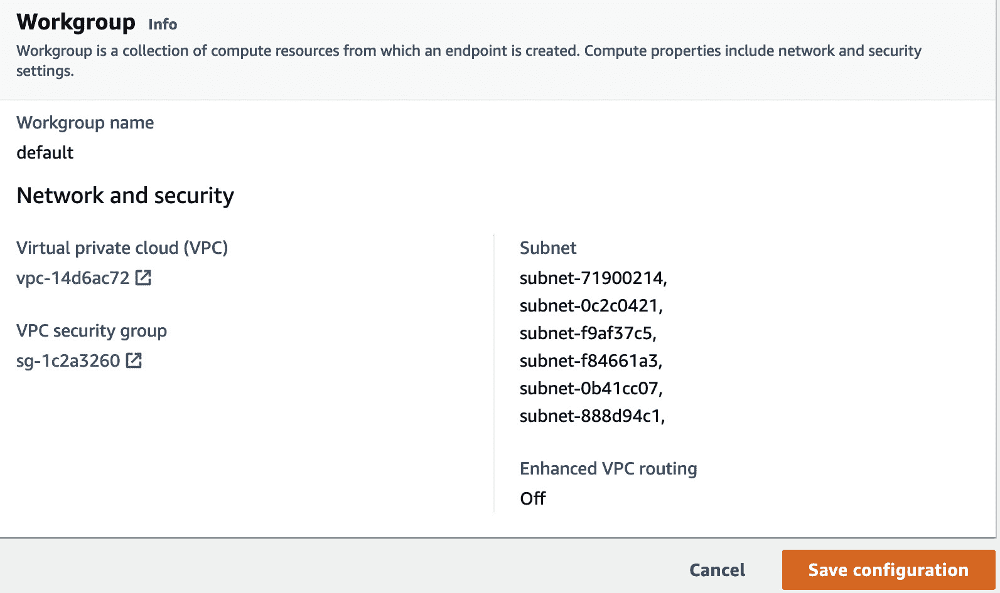

图 1.11 – 工作组默认设置和相关子网

点击 **保存配置** 按钮以创建您的 Redshift Serverless 实例，您的第一个数据仓库将在几分钟内准备就绪：

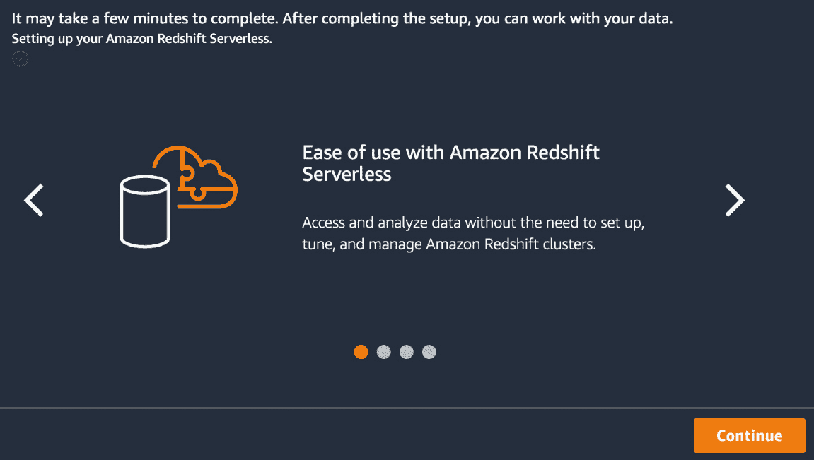

图 1.12 – Redshift Serverless 创建进度

一旦您的数据仓库准备就绪，您将被重定向到您的 Serverless 仪表板，如图 *图 1**.13* 所示：

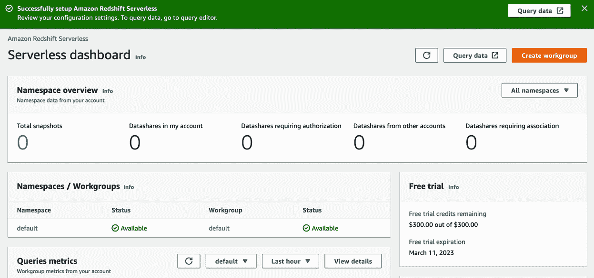

图 1.13 – 显示您的命名空间和工作组的服务器无仪表板

现在我们已经创建了我们的数据仓库，我们将连接到数据仓库，加载一些示例数据，并运行一些查询。

# 连接到您的数据仓库

使用 Redshift Serverless 的您的数据仓库现在已准备就绪。您可以通过 JDBC/ODBC/Python 驱动程序使用第三方工具连接到您的数据仓库。其他选项包括 **数据 API** 或内嵌的 **Redshift 查询编辑器 v2**。

## 使用 Amazon Redshift 查询编辑器 v2

现在您的数据仓库已准备就绪；让我们导航到查询编辑器，加载一些示例数据并运行一些查询。从您的仪表板中选择 **查询数据** 选项，如图 *图 1**.13* 所示，您将被导航到查询编辑器，如图 *图 1**.14* 所示。

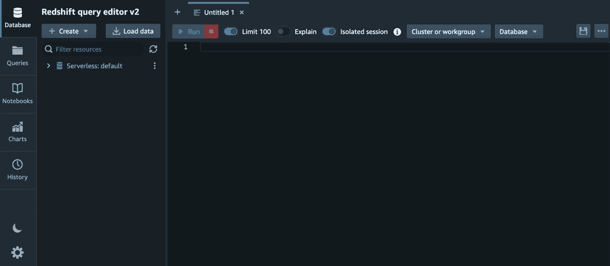

图 1.14 – 查询编辑器

在 Redshift 查询编辑器 v2 控制台中，在左侧面板中，您将看到您有权访问的数据仓库，例如 **Serverless:default** 工作组。点击工作组（**Serverless:default**）以连接到数据仓库。

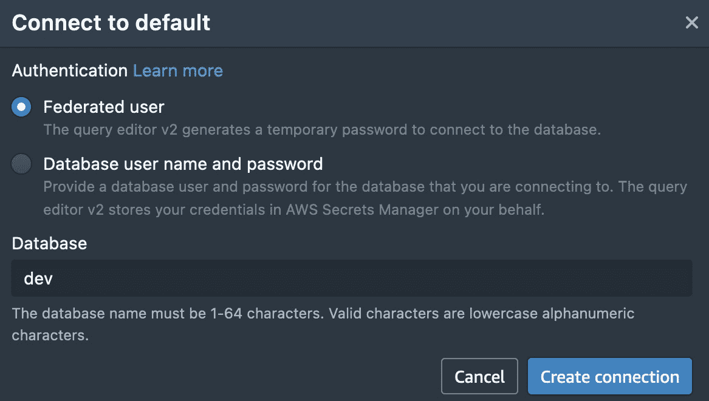

图 1.15 – 创建到您工作组的连接

如前述截图所示，如果在创建命名空间时未指定任何数据库凭据，请选择**联邦用户**，然后点击**创建连接**。您可以将数据库名称保留为**dev**。您只需在首次连接到数据仓库时创建连接。如果您已创建连接，则在点击工作组时将自动连接。一旦连接，您将在导航器中看到数据库，如图 *图 1**.16* 所示：

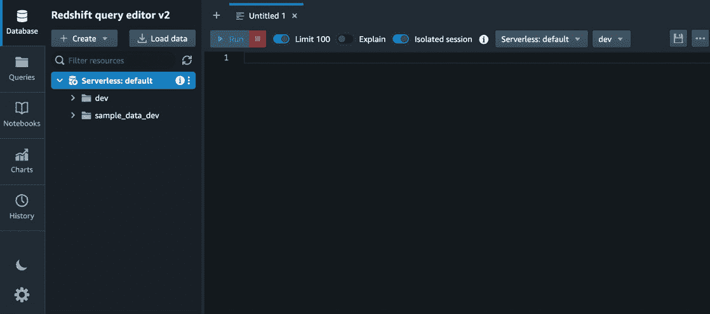

图 1.16 – 数据库列表

由于我们刚刚首次创建了数据仓库，其中没有数据，所以现在让我们将一些样例数据加载到数据仓库中。

## 加载样例数据

在左侧面板中，单击**sample_data_dev**数据库以展开可用的数据库：

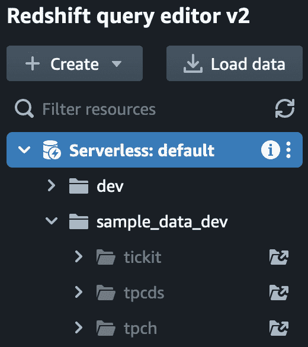

图 1.17 – 显示可用样例数据的 Redshift 查询编辑器 v2 导航器

如前述截图所示，有三个样例数据集可供您加载到您的数据仓库中。单击您选择的样例数据笔记本右侧带有箭头的文件夹图标以加载和打开它，如图 *图 1**.18* 所示：

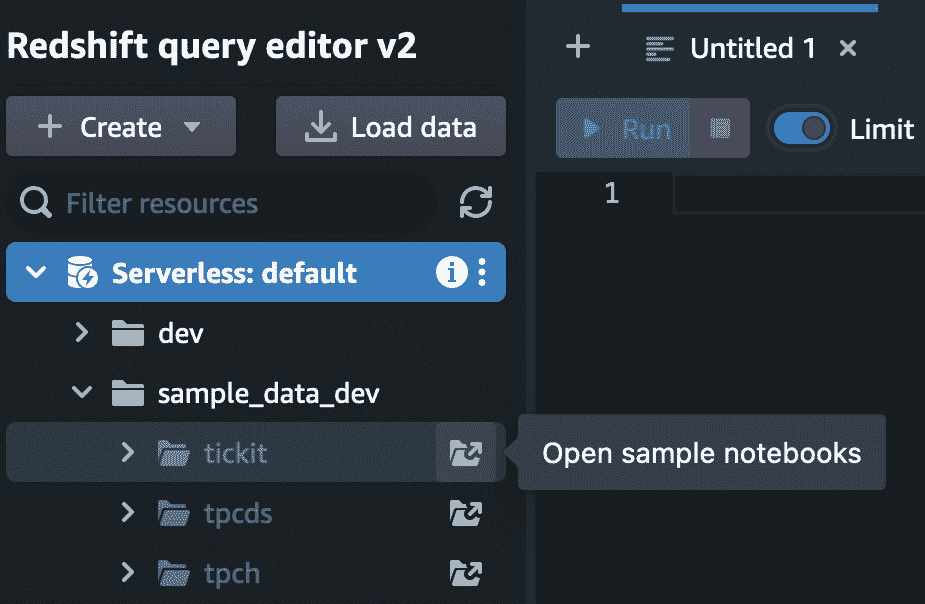

图 1.18 – 样例数据库列表

您将被提示创建您的样例数据库。单击**创建**以开始，如图 *图 1**.19* 所示：

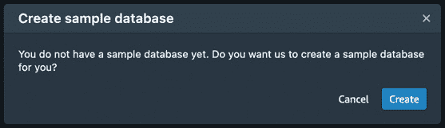

图 1.19 – 创建样例数据库

样例数据将在几秒钟内加载，并以 SQL 查询笔记本的形式呈现，您可以探索数据集，如图 *图 1**.20* 所示：

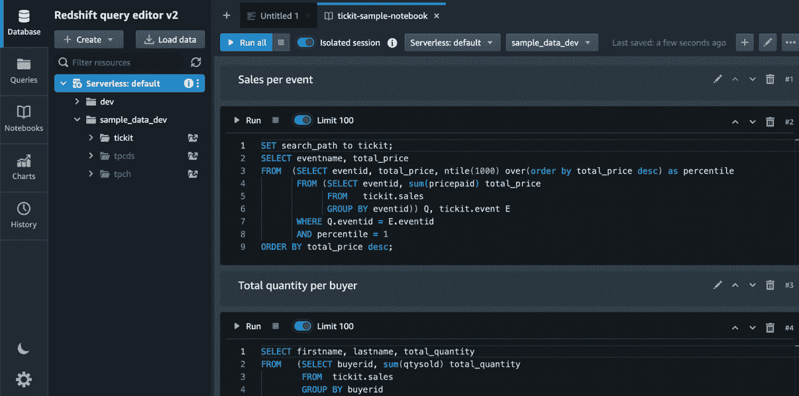

图 1.20 – tickit 数据库的样例查询笔记本

您可以展开查询编辑器左侧的导航树以查看架构和数据库对象，例如您架构中的表和视图，如图 *图 1**.21* 所示。

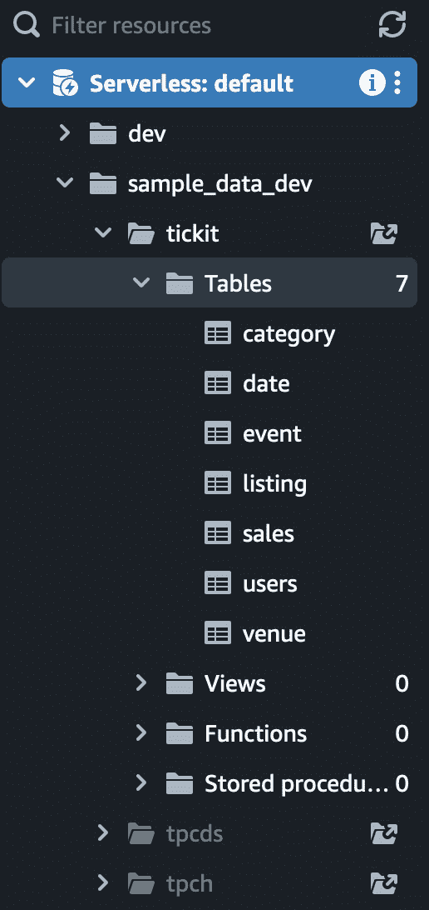

图 1.21 – 展开导航树以查看架构和数据库对象

您可以单击表以查看表定义，如图 *图 1**.22* 所示：

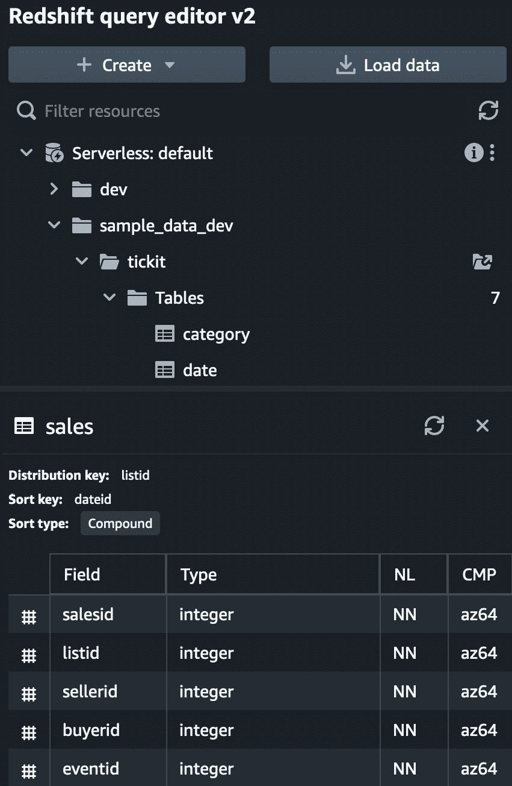

图 1.22 – 表定义

右键单击表提供额外的**选择表**、**显示表定义**和**删除**选项，如图 *图 1**.23* 所示：

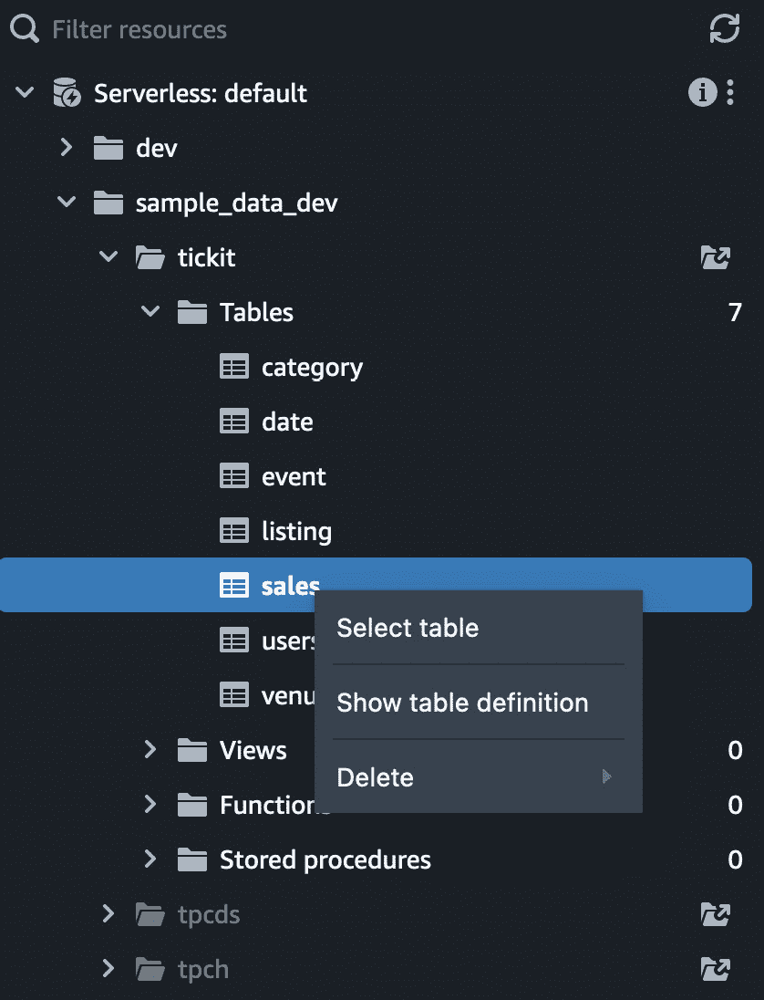

图 1.23 – 右键单击表以查看更多选项

你可以点击**运行全部**，如图*图 1.24*所示，来运行示例笔记本中的所有查询。查询编辑器提供了一个笔记本界面来添加注释，SQL 单元格将你的查询组织在一个文档中。你可以用于文档目的的注释。

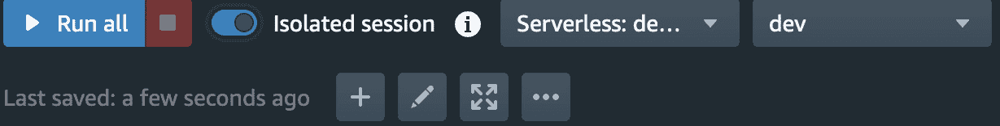

图 1.24 – “运行全部”选项

你将看到每个单元格的查询结果。你可以将结果下载为 JSON 或 CSV 文件到你的桌面，如图*图 1.25*所示：

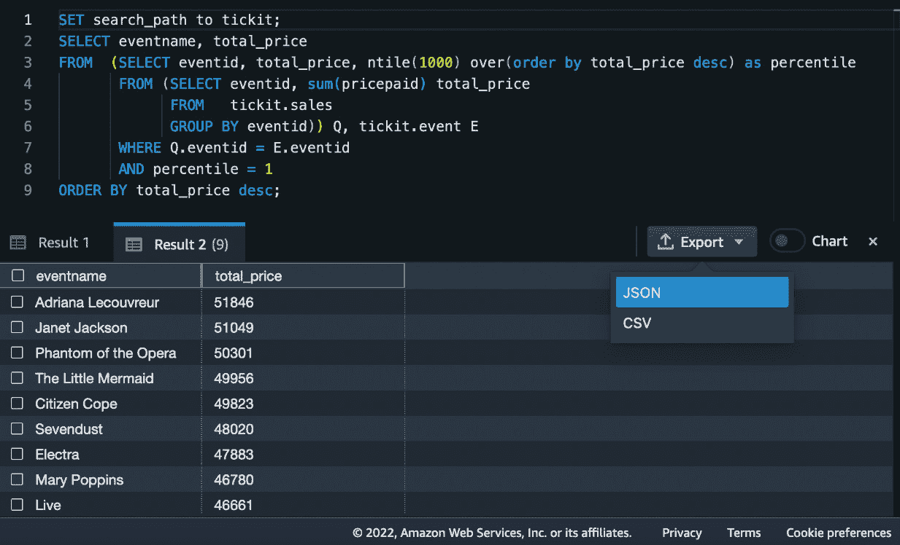

图 1.25 – 下载查询结果选项

让我们编写我们的第一个查询。

## 运行你的第一个查询

我们想要找出`tickit`数据库中按销售额排名前 10 的事件。我们将在数据仓库中运行以下 SQL 语句：

```py
SELECT eventname, total_price
FROM  (SELECT eventid, total_price, ntile(1000) over(order by total_price desc) as percentile
       FROM (SELECT eventid, sum(pricepaid) total_price
             FROM   tickit.sales
             GROUP BY eventid)) Q, tickit.event E
       WHERE Q.eventid = E.eventid
       AND percentile = 1
ORDER BY total_price desc
limit 10;
```

在查询编辑器中，通过点击**+**符号并从出现的菜单中选择**编辑器**来添加一个新的查询。如果你想要创建一个新的笔记本，你可以点击**笔记本**，如图*图 1.26*所示：

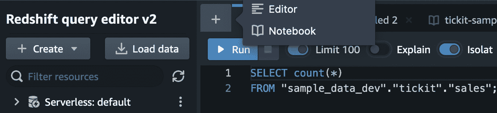

图 1.26 – 创建新查询

现在，在编辑器中输入前面的 SQL 查询，然后点击**运行**。你将得到以下截图所示的结果：

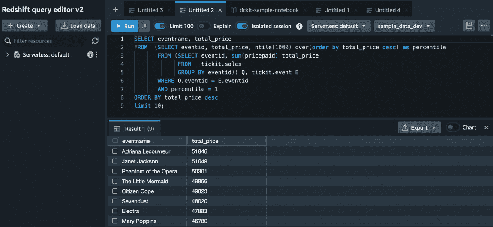

图 1.27 – 带结果的查询

正如俗话所说，“一图胜千言”，查询编辑器允许你可视化结果以获得更快的洞察。你可以通过点击**图表**选项然后选择你想要的图表来轻松创建图表。让我们选择一个散点图，如图*图 1.28*所示：

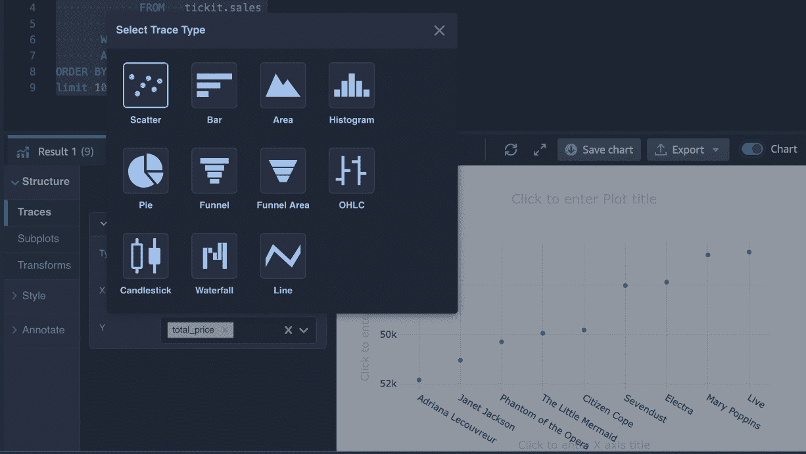

图 1.28 – 在 Redshift 查询编辑器 v2 中使用图表

你可以为 X 轴和 Y 轴添加图表名称和注释，并将图表导出为 PNG 或 JPG 格式，用于演示文稿或与业务伙伴分享：

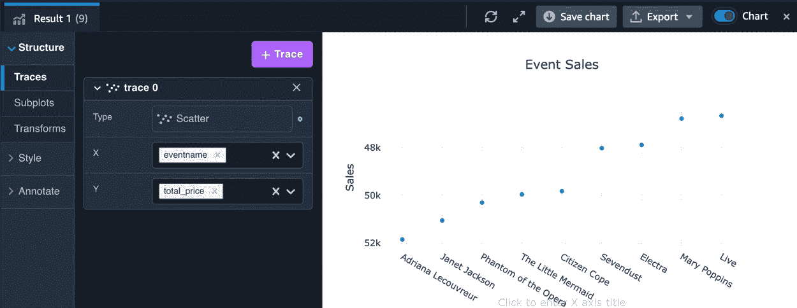

图 1.29 – 查询编辑器 v2 中的图表选项

如你所见，你可以使用 Redshift 查询编辑器 v2 创建自己的数据库，创建表，加载数据，运行和编写查询和笔记本。你可以与团队成员分享你的查询和笔记本。

# 摘要

在本章中，你学习了关于云数据仓库和 Amazon Redshift Serverless 的内容。你创建了第一个由 Redshift Serverless 提供动力的数据仓库，并使用查询编辑器加载了一些示例数据。你还学习了如何使用查询编辑器运行查询和可视化数据以产生洞察。

在*第二章*中，你将学习在 Amazon Redshift Serverless 数据仓库中加载数据和执行分析的最佳技术。
