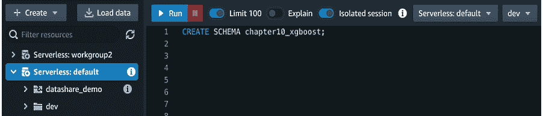
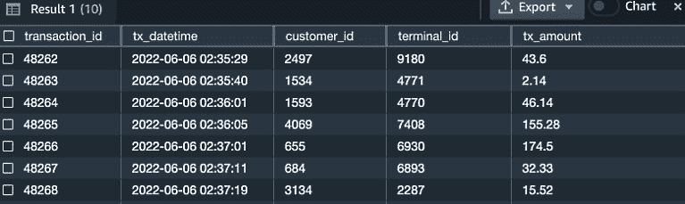
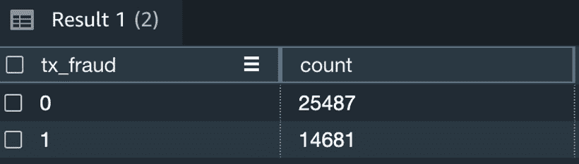
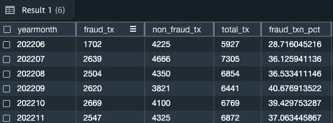
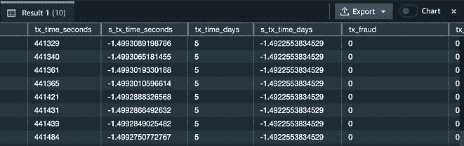
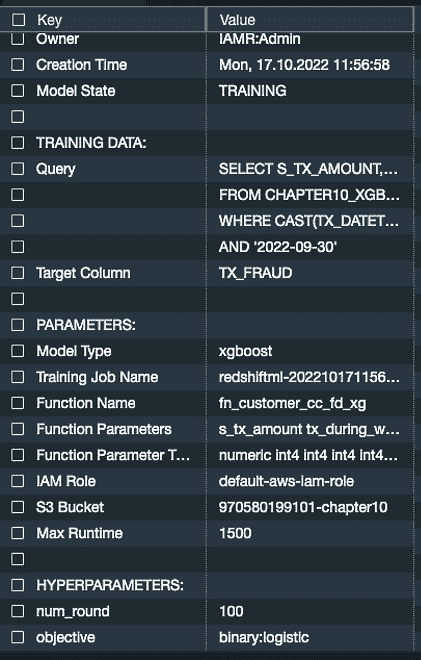
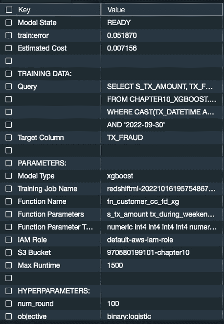
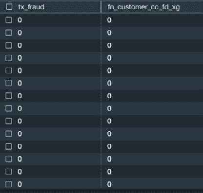
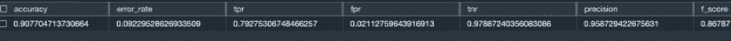
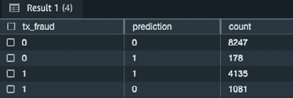

# 第十章：使用 XGBoost 创建自定义 ML 模型

到目前为止，我们探索的所有监督学习模型都使用了**Amazon Redshift Auto ML**功能，该功能在幕后使用**Amazon SageMaker Autopilot**。在本章中，我们将探讨如何创建自定义**机器学习**（**ML**）模型。训练自定义模型让你有选择模型类型和使用超参数的灵活性。本章将提供这种建模技术的示例。到本章结束时，你将知道如何创建自定义 XGBoost 模型以及如何使用 Redshift SQL 准备训练模型的数据。

在本章中，我们将讨论以下主要主题：

+   介绍 XGBoost

+   介绍 XGBoost 用例

+   带有自动关闭功能的 XGBoost 模型

# 技术要求

本章需要网络浏览器以及访问以下内容：

+   一个 AWS 账户

+   Amazon Redshift 无服务器端点

+   Amazon Redshift 查询编辑器 v2

你可以在此处找到本章使用的代码：

[`github.com/PacktPublishing/Serverless-Machine-Learning-with-Amazon-Redshift/blob/main/CodeFiles/chapter10/chapter10.sql`](https://github.com/PacktPublishing/Serverless-Machine-Learning-with-Amazon-Redshift/blob/main/CodeFiles/chapter10/chapter10.sql)

# 介绍 XGBoost

**XGBoost**之所以得名，是因为它是建立在**梯度提升**框架之上的。使用树提升技术为解决 ML 问题提供了一种快速方法。正如你在前面的章节中看到的，你可以指定模型类型，这有助于加快模型训练，因为**SageMaker Autopilot**不需要确定使用哪种模型类型。

你可以在此处了解更多关于 XGBoost 的信息：[`docs.aws.amazon.com/sagemaker/latest/dg/xgboost.html`](https://docs.aws.amazon.com/sagemaker/latest/dg/xgboost.html)。

当你使用 Redshift ML 创建一个模型，并指定 XGBoost 作为模型类型，并且可选地指定 AUTO OFF 时，这将关闭 SageMaker Autopilot，并让你对模型调优有更多的控制。例如，你可以指定你希望使用的超参数。你将在*使用 XGBoost 创建二元分类模型*部分看到这个示例。

当你将**AUTO**设置为**OFF**时，你将需要进行预处理。执行预处理确保我们将获得最佳模型，并且由于当你将**AUTO**设置为**OFF**时，所有输入都必须是数值型的，这也是必要的，例如，确保数据被清理，分类变量被编码，数值变量被标准化。你还需要确定你遇到的问题类型，并选择一个合适的模型进行训练。你将能够创建训练和测试数据集，并自行评估模型。你还有能力调整超参数。总之，你将获得对端到端 ML 模型训练和构建的完全控制。

通过使用 Amazon Redshift ML 的 XGBoost，你可以解决回归和分类问题。你还可以指定你模型的训练目标。例如，如果你正在解决一个二元分类问题，你会选择`binary:logistic`作为你的目标，或者对于多类分类问题使用`multi:softmax`。

在撰写本书时，支持的训练目标包括`reg:squarederror`、`reg:squaredlogerror`、`reg:logistic`、`reg:pseudohubererror`、`reg:tweedie`、`binary:logistic`、`binary:hinge`和`multi:softmax`。

有关这些目标的更多信息，请参阅 XGBoost 文档中的*学习任务参数*部分：[`xgboost.readthedocs.io/en/latest/parameter.html#learning-task-parameters`](https://xgboost.readthedocs.io/en/latest/parameter.html#learning-task-parameters)。

现在你已经了解了 XGBoost 是什么，我们将看看一个用例，其中我们可以应用 XGBoost 并使用二元分类解决一个常见的业务问题。

# 介绍 XGBoost 用例

在本节中，我们将讨论一个用例，其中我们想要预测信用卡交易是否为欺诈。我们将进行以下步骤：

+   定义业务问题

+   上传、分析和准备训练数据

+   将数据分为训练集和测试集

+   预处理输入变量

## 定义业务问题

在本节中，我们将使用信用卡支付交易数据集，在 Redshift ML 中使用 XGBoost 构建一个二元分类模型。此数据集包含客户和终端信息，以及与交易相关的日期和金额。此数据集还有一些基于**最近性**、**频率**和**货币**数值特征的派生字段，以及一些分类变量，例如交易是否发生在周末或夜间。我们的目标是识别交易是否为欺诈或非欺诈。此用例来自[`github.com/Fraud-Detection-Handbook/fraud-detection-handbook`](https://github.com/Fraud-Detection-Handbook/fraud-detection-handbook)。请参阅 GitHub 存储库以了解更多关于此数据生成过程的信息。

数据集引用

*可重复的机器学习用于信用卡欺诈检测 - 实用手册*，Le Borgne, Yann-Aël 和 Siblini, Wissam 以及 Lebichot, Bertrand 和 Bontempi, Gianluca，[`github.com/Fraud-Detection-Handbook/fraud-detection-handbook`](https://github.com/Fraud-Detection-Handbook/fraud-detection-handbook)，2022，布鲁塞尔自由大学

现在，我们将我们的数据集加载到 Amazon Redshift ML 中，并为其模型训练做准备。

## 上传、分析和准备训练数据

在我们开始之前，让我们首先以管理员或数据库开发者的身份连接到 Redshift，然后将数据加载到 Amazon Redshift 中。

在以下步骤中，您将创建所有需要的表和对象的模式，这包括创建所有需要的表、加载数据以及创建用于数据转换的视图。

导航到查询编辑器 v2，连接到无服务器端点，然后连接到 **dev** 数据库，如下截图所示：



图 10.1 – 连接到查询编辑器 v2

1.  执行以下步骤以创建模式。此模式将用于本章中创建的所有对象和模型：

    ```py
    CREATE SCHEMA  chapter10_xgboost;
    ```

1.  接下来，将以下 SQL 语句复制到查询编辑器 v2 中以创建用于托管客户支付交易历史的表，我们将在后续步骤中加载数据：

    ```py
    create table chapter10_xgboost.cust_payment_tx_history
    ```

    ```py
    (
    ```

    ```py
    transaction_id integer,
    ```

    ```py
    tx_datetime timestamp,
    ```

    ```py
    customer_id integer,
    ```

    ```py
    terminal_id integer,
    ```

    ```py
    tx_amount decimal(9,2),
    ```

    ```py
    tx_time_seconds integer,
    ```

    ```py
    tx_time_days integer,
    ```

    ```py
    tx_fraud integer,
    ```

    ```py
    tx_fraud_scenario integer,
    ```

    ```py
    tx_during_weekend integer,
    ```

    ```py
    tx_during_night integer,
    ```

    ```py
    customer_id_nb_tx_1day_window decimal(9,2),
    ```

    ```py
    customer_id_avg_amount_1day_window decimal(9,2),
    ```

    ```py
    customer_id_nb_tx_7day_window decimal(9,2),
    ```

    ```py
    customer_id_avg_amount_7day_window decimal(9,2),
    ```

    ```py
    customer_id_nb_tx_30day_window decimal(9,2),
    ```

    ```py
    customer_id_avg_amount_30day_window decimal(9,2),
    ```

    ```py
    terminal_id_nb_tx_1day_window decimal(9,2),
    ```

    ```py
    terminal_id_risk_1day_window decimal(9,2),
    ```

    ```py
    terminal_id_nb_tx_7day_window decimal(9,2),
    ```

    ```py
    terminal_id_risk_7day_window decimal(9,2),
    ```

    ```py
    terminal_id_nb_tx_30day_window decimal(9,2),
    ```

    ```py
    terminal_id_risk_30day_window decimal(9,2)
    ```

    ```py
    )
    ```

    ```py
    ;
    ```

1.  现在您已经创建了表，您可以在查询编辑器 v2 中执行以下命令来加载数据表：

    ```py
    copy chapter10_xgboost.cust_payment_tx_history
    ```

    ```py
    from 's3://packt-serverless-ml-redshift/chapter10/credit_card_transactions_transformed_balanced.csv'
    ```

    ```py
    iam_role default
    ```

    ```py
    ignoreheader 1
    ```

    ```py
    csv region 'eu-west-1';
    ```

1.  现在您已经加载数据，一个好的做法是采样一些数据以确保我们的数据加载正确。运行以下查询以采样 10 条记录：

    ```py
    select * from
    ```

    ```py
    chapter10_xgboost.cust_payment_tx_history
    ```

    ```py
    limit 10;
    ```

在以下截图中，我们可以看到我们已经正确加载了数据，并采样了不同的交易 ID：



图 10.2 – 数据样本

如前几章所述，目标变量是我们试图在模型中预测的值。在我们的用例中，我们试图预测交易是否为欺诈。在我们的数据集中，这是 `tx_fraud` 属性，即我们的目标。让我们检查我们的表以查看有多少笔交易被标记为欺诈。

在查询编辑器 v2 中运行以下命令：

```py
select tx_fraud, count(*)
from chapter10_xgboost.cust_payment_tx_history
group by 1;
```

我们将数据集中的欺诈交易识别为 `tx_fraud` 值为 `1` 的交易。我们在数据集中已识别出 14,681 笔欺诈交易。相反，`tx_fraud` 值为 `0` 表示交易不是欺诈：



图 10.3 – 欺诈交易

让我们查看欺诈和非欺诈交易在几个月内的趋势。我们想要分析是否存在任何欺诈交易的不寻常峰值。

在查询编辑器 v2 中运行以下 SQL 命令：

```py
select to_char(tx_datetime, 'yyyymm') as yearmonth,
sum(case when tx_fraud = 1 then 1 else 0 end) fraud_tx,
sum(case when tx_fraud = 0 then 1 else 0 end) non_fraud_tx,
count(*) as total_tx,
(fraud_tx::decimal(10,2 ) / total_tx::decimal(10,2) ) *100 as fraud_txn_pct
from chapter10_xgboost.cust_payment_tx_history
group by yearmonth
order by yearmonth
```

注意到欺诈交易在 202207 相比 202206 增加了近 8%：



图 10.4 – 欺诈交易趋势

现在我们已经加载数据，让我们通过将数据分割成训练集和测试集来准备我们的数据以供模型训练。训练数据用于训练模型，测试数据用于运行我们的预测查询。

## 将数据分割成训练集和测试集

为了训练模型，我们将使用 `2022-10-01` 之前的交易，这大约占交易总数的 80%。

为了测试模型，我们将使用 `2022-09-30` 之后的交易数据，这占交易总数的 20%。

## 预处理输入变量

在我们的输入字段中，我们有数值和分类变量的组合。我们需要将分类变量预处理为独热编码值并标准化数值变量。由于我们将使用 **自动关闭**，SageMaker 不会自动预处理数据。因此，转换各种数值、日期和时间特征非常重要。

**分类特征**（也称为名义变量）具有不同的类别或级别。这些可以是没有任何顺序的类别，例如国家或性别。或者它们可以有顺序，例如教育水平（也称为有序变量）。

由于机器学习模型需要在 **数值变量** 上操作，我们需要应用有序编码或独热编码。

为了使事情更简单，我们创建了一个视图来处理转换逻辑。这个视图有点长，但实际上，视图所做的是相当简单的：

+   计算交易时间（以秒和天为单位）

+   通过分配 `0` 或 `1` 来进行独热编码，以将交易分类为工作日、周末、白天或夜间（例如 `TX_DURING_WEEKEND` 或 `TX_DURING_NIGHT`）

+   对交易应用窗口函数，以便我们可以在 1 天、7 天和 30 天的时间间隔内轻松可视化数据

在 Query Editor v2 中执行以下 SQL 命令以通过应用转换逻辑创建视图：

```py
create view chapter10_xgboost.credit_payment_tx_history_scaled
as
select
transaction_id, tx_datetime, customer_id, terminal_id,
tx_amount ,
( (tx_amount - avg(tx_amount) over()) /  cast(stddev_pop(tx_amount) over() as dec(14,2)) ) s_tx_amount,
tx_time_seconds ,
  ( (tx_time_seconds - avg(tx_time_seconds) over()) /  cast(stddev_pop(tx_time_seconds) over() as dec(14,2)) ) s_tx_time_seconds,
tx_time_days  ,
  ( (tx_time_days - avg(tx_time_days) over()) /  cast(stddev_pop(tx_time_days) over() as dec(14,2)) ) s_tx_time_days,
tx_fraud  ,
  tx_during_weekend ,
case when tx_during_weekend = 1 then 1 else 0 end as tx_during_weekend_ind,
case when tx_during_weekend = 0 then 1 else 0 end tx_during_weekday_ind,
tx_during_night,
case when tx_during_night = 1 then 1 else 0 end as tx_during_night_ind,
case when tx_during_night = 0 then 1 else 0 end as tx_during_day_ind,
customer_id_nb_tx_1day_window ,
  ( (customer_id_nb_tx_1day_window - avg(customer_id_nb_tx_1day_window) over()) /  cast(stddev_pop(customer_id_nb_tx_1day_window) over() as dec(14,2)) ) s_customer_id_nb_tx_1day_window,
customer_id_avg_amount_1day_window  ,
  ( (customer_id_avg_amount_1day_window - avg(customer_id_avg_amount_1day_window) over()) /  cast(stddev_pop(customer_id_avg_amount_1day_window) over() as dec(14,2)) ) s_customer_id_avg_amount_1day_window,
customer_id_nb_tx_7day_window ,
  ( (customer_id_nb_tx_7day_window - avg(customer_id_nb_tx_7day_window) over()) /  cast(stddev_pop(customer_id_nb_tx_7day_window) over() as dec(14,2)) ) s_customer_id_nb_tx_7day_window,
customer_id_avg_amount_7day_window  ,
  ( (customer_id_avg_amount_7day_window - avg(customer_id_avg_amount_7day_window) over()) /  cast(stddev_pop(customer_id_avg_amount_7day_window) over() as dec(14,2)) ) s_customer_id_avg_amount_7day_window,
customer_id_nb_tx_30day_window  ,
  ( (customer_id_nb_tx_30day_window - avg(customer_id_nb_tx_30day_window) over()) /  cast(stddev_pop(customer_id_nb_tx_30day_window) over() as dec(14,2)) ) s_customer_id_nb_tx_30day_window,
customer_id_avg_amount_30day_window ,
  ( (customer_id_avg_amount_30day_window - avg(customer_id_avg_amount_30day_window) over()) /  cast(stddev_pop(customer_id_avg_amount_30day_window) over() as dec(14,2)) ) s_customer_id_avg_amount_30day_window,
terminal_id_nb_tx_1day_window ,
  ( (terminal_id_nb_tx_1day_window - avg(terminal_id_nb_tx_1day_window) over()) /  cast(stddev_pop(terminal_id_nb_tx_1day_window) over() as dec(14,2)) ) s_terminal_id_nb_tx_1day_window,
terminal_id_risk_1day_window  ,
  ( (terminal_id_risk_1day_window - avg(terminal_id_risk_1day_window) over()) /  cast(stddev_pop(terminal_id_risk_1day_window) over() as dec(14,2)) ) s_terminal_id_risk_1day_window,
terminal_id_nb_tx_7day_window ,
  ( (terminal_id_nb_tx_7day_window - avg(terminal_id_nb_tx_7day_window) over()) /  cast(stddev_pop(terminal_id_nb_tx_7day_window) over() as dec(14,2)) ) s_terminal_id_nb_tx_7day_window,
terminal_id_risk_7day_window  ,
  ( (terminal_id_risk_7day_window - avg(terminal_id_risk_7day_window) over()) /  cast(stddev_pop(terminal_id_risk_7day_window) over() as dec(14,2)) ) s_terminal_id_risk_7day_window,
terminal_id_nb_tx_30day_window  ,
  ( (terminal_id_nb_tx_30day_window - avg(terminal_id_nb_tx_30day_window) over()) /  cast(stddev_pop(terminal_id_nb_tx_30day_window) over() as dec(14,2)) ) s_terminal_id_nb_tx_30day_window,
terminal_id_risk_30day_window ,
  ( (terminal_id_risk_30day_window - avg(terminal_id_risk_30day_window) over()) /  cast(stddev_pop(terminal_id_risk_30day_window) over() as dec(14,2)) ) s_terminal_id_risk_30day_window
from
chapter10_xgboost.cust_payment_tx_history;
```

现在视图已创建，让我们采样 10 条记录。

在 Query Editor v2 中执行以下命令：

```py
SELECT * from chapter10_XGBoost.credit_payment_tx_history_scaled limit 10;
```

我们可以在以下屏幕截图中看到一些我们的转换值，例如 `tx_time_seconds` 和 `txn_time_days`：



图 10.5 – 转换后的数据

现在，让我们快速回顾一下为什么我们需要创建这个视图：

+   由于我们使用 XGBoost 与自动关闭，我们必须自己进行数据预处理和特征工程

+   我们对分类变量应用了独热编码

+   我们对数值变量进行了缩放

这里是视图逻辑的摘要：

+   我们使用的目标变量是 `TX_FRAUD`

+   我们使用的分类变量是 `TX_DURING_WEEKEND_IND`, `TX_DURING_WEEKDAY_IND`, `TX_DURING_NIGHT_IND`, 和 `TX_DURING_DAY_IND`

+   缩放后的数值变量是 `s_customer_id_nb_tx_1day_window`, `s_customer_id_avg_amount_1day_window`, `s_customer_id_nb_tx_7day_window`, `s_customer_id_avg_amount_7day_window`, `s_customer_id_nb_tx_30day_window`, `s_customer_id_avg_amount_30day_window`, `s_terminal_id_nb_tx_1day_window`, `s_terminal_id_risk_1day_window`, `s_terminal_id_nb_tx_7day_window`, `s_terminal_id_risk_7day_window`, `s_terminal_id_nb_tx_30day_window`, 和 `s_terminal_id_risk_30day_window`

你现在已经完成了数据准备，并准备好创建你的模型！

# 使用 XGBoost 自动关闭创建模型

在这个练习中，我们将使用 XGBoost 算法创建一个自定义的二进制分类模型。你可以通过设置 **自动关闭** 来实现这一点。以下是可用的参数：

+   **自动关闭**

+   **模型类型**

+   **目标**

+   **超参数**

关于可用的超参数值及其默认值的完整列表，请阅读以下文档：

[`docs.aws.amazon.com/redshift/latest/dg/r_create_model_use_cases.html#r_auto_off_create_model`](https://docs.aws.amazon.com/redshift/latest/dg/r_create_model_use_cases.html#r_auto_off_create_model)

现在你已经了解了 XGBoost 提供的参数，你可以创建模型。

## 使用 XGBoost 创建二元分类模型

让我们创建一个模型来预测交易是欺诈还是非欺诈。正如你在前面的章节中学到的，使用 Amazon Redshift ML 创建模型只需运行一个创建函数的 SQL 命令。作为输入（或特征），你将使用你在上一节中创建的视图中的属性。你将指定`tx_fraud`作为目标，并给出函数名称，你将在后续的预测查询中使用它。此外，你将指定超参数以进行自己的模型调优。让我们开始吧！

在查询编辑器 v2 中执行以下命令。以下是一个代码片段；你可以从以下 URL 获取完整的代码：

[`github.com/PacktPublishing/Serverless-Machine-Learning-with-Amazon-Redshift/blob/main/chapter10.sql`](https://github.com/PacktPublishing/Serverless-Machine-Learning-with-Amazon-Redshift/blob/main/chapter10.sql)

```py
drop model chapter10_XGBoost.cust_cc_txn_fd_xg;
 create model chapter10_xgboost.cust_cc_txn_fd_xg
from (
select
  s_tx_amount,
tx_fraud,
…
  from chapter10_xgboost.payment_tx_history_scaled
  where cast(tx_datetime as date) between '2022-06-01' and '2022-09-30'
)
target tx_fraud
function fn_customer_cc_fd_xg
iam_role default
auto off
model_type xgboost
objective 'binary:logistic'
preprocessors 'none'
hyperparameters default except (num_round '100')
settings (
  s3_bucket '<<your-s3-bucket>>',
            s3_garbage_collect off,
            max_runtime 1500
                   );
```

`CREATE MODEL`函数将调用 XGBoost 算法并训练一个二元分类模型。我们将`num_round`超参数值设置为`100`，这是训练运行的轮数。

现在，让我们运行 `SHOW MODEL` 来查看模型训练是否完成。在查询编辑器 v2 中运行以下命令：

```py
SHOW MODEL  chapter10_XGBoost.cust_cc_txn_fd_xg;
```

注意以下截图中的**模型状态**，它显示你的模型仍在训练中：



图 10.6 – 显示模型输出

从前面的截图，我们注意到`CREATE MODEL`语句的值**模型类型**设置为**xgboost**。**objective**设置为**binary:logistic**，而**num_round**参数设置为**100**。

当你有一个**自动关闭**的自定义模型并指定超参数时，模型可以训练得更快。这个模型通常在 10 分钟内完成。

10 分钟后再次运行`SHOW MODEL`命令来检查模型训练是否完成。如以下截图所示，模型训练已完成，**train:error**字段报告了错误率。大多数数据集的阈值是*.5*，所以我们的**0.051870**值非常好，如以下截图所示：



图 10.7 – SHOW MODEL 输出

现在，你的模型已经完成，并且基于`score – train_error`的得分很好，为`0.051870`。你现在可以使用它进行预测。

## 生成预测和评估模型性能

在查询编辑器 v2 中运行以下查询，该查询将比较实际的 `tx_fraud` 值与 `predicted_tx_fraud` 值：

```py
select
tx_fraud ,
fn_customer_cc_fd_xg(
s_tx_amount,
tx_during_weekend_ind,
tx_during_weekday_ind,
tx_during_night_ind,
tx_during_day_ind,
s_customer_id_nb_tx_1day_window,
s_customer_id_avg_amount_1day_window,
s_customer_id_nb_tx_7day_window,
s_customer_id_avg_amount_7day_window,
s_customer_id_nb_tx_30day_window,
s_customer_id_avg_amount_30day_window,
s_terminal_id_nb_tx_1day_window,
s_terminal_id_risk_1day_window,
s_terminal_id_nb_tx_7day_window,
s_terminal_id_risk_7day_window,
s_terminal_id_nb_tx_30day_window,
s_terminal_id_risk_30day_window)
from chapter10_xgboost.credit_payment_tx_history_scaled
where cast(tx_datetime as date) >= '2022-10-01'
;
```

以下截图显示了样本输出。在此截图中，我们的预测值与实际值相同：



图 10.8 – 推理查询输出

由于我们没有从 Redshift ML 获取我们模型的 F1 值，让我们来计算它。我们将创建一个包含完成此逻辑的视图：

```py
--drop view if exists chapter10_xgboost.fraud_tx_conf_matrix;
create or replace view chapter10_xgboost.fraud_tx_conf_matrix
as
select
transaction_id,tx_datetime,customer_id,tx_amount,terminal_id, tx_fraud,
  fn_customer_cc_fd_xg(
  s_tx_amount,
tx_during_weekend_ind,
tx_during_weekday_ind,
tx_during_night_ind,
tx_during_day_ind,
s_customer_id_nb_tx_1day_window,
s_customer_id_avg_amount_1day_window,
s_customer_id_nb_tx_7day_window,
s_customer_id_avg_amount_7day_window,
s_customer_id_nb_tx_30day_window,
s_customer_id_avg_amount_30day_window,
s_terminal_id_nb_tx_1day_window,
s_terminal_id_risk_1day_window,
s_terminal_id_nb_tx_7day_window,
s_terminal_id_risk_7day_window,
s_terminal_id_nb_tx_30day_window,
s_terminal_id_risk_30day_window)
as prediction,
case when tx_fraud  =1 and prediction = 1 then 1 else 0 end truepositives,
case when tx_fraud =0 and prediction = 0 then 1 else 0 end truenegatives,
case when tx_fraud =0 and prediction = 1 then 1 else 0 end falsepositives,
case when tx_fraud =1 and prediction = 0 then 1 else 0 end falsenegatives
  from chapter10_xgboost.credit_payment_tx_history_scaled
  where cast(tx_datetime as date) >= '2022-10-01';
```

在查询编辑器 v2 中运行以下 SQL 命令以检查我们在视图中计算的 F1 分数：

```py
select
sum(truepositives+truenegatives)*1.00/(count(*)*1.00) as accuracy,--accuracy of the model,
sum(falsepositives+falsenegatives)*1.00/count(*)*1.00 as error_rate, --how often model is wrong,
sum(truepositives)*1.00/sum (truepositives+falsenegatives) *1.00 as tpr, --or recall how often corrects are rights,
sum(falsepositives)*1.00/sum (falsepositives+truenegatives )*1.00 fpr, --or fall-out how often model said yes when it is no,
sum(truenegatives)*1.00/sum (falsepositives+truenegatives)*1.00 tnr, --or specificity, how often model said no when it is yes,
sum(truepositives)*1.00 / (sum (truepositives+falsepositives)*1.00) as precision, -- when said yes how it is correct,
2*((tpr*precision)/ (tpr+precision) ) as f_score --weighted avg of tpr & fpr
from chapter10_xgboost.fraud_tx_conf_matrix
;
```

你可以看到我们的准确率是 90%，F1 分数是 87%，这两个指标都非常出色。此外，我们的混淆矩阵值告诉我们我们正确预测 `True` 和正确预测 `False` 的次数：



图 10.9 – F1 分数

现在，让我们检查实际与预测计数。在查询编辑器 v2 中运行以下查询：

```py
select tx_fraud,prediction, count(*)
from chapter10_xgboost.fraud_tx_conf_matrix
group by tx_fraud,prediction;
```

以下截图的输出显示了对于给定值，我们的预测值与实际值以及这些记录的数量相比。我们的模型错误地预测了 178 次欺诈交易，错误地预测了 1,081 次非欺诈交易：



图 10.10 – 混淆矩阵

这展示了 Redshift ML 如何帮助你自信地预测一笔交易是否为欺诈。

# 摘要

在本章中，你学习了 XGBoost 是什么以及如何将其应用于商业问题。你学习了在使用 **Auto Off** 选项时如何指定自己的超参数，以及如何为二分类问题指定目标。此外，你还学习了如何进行自己的数据预处理并计算 F1 分数以验证模型性能。

在下一章中，你将学习如何将你的模型从 Amazon SageMaker 带入数据库或远程推理。
