# 第十三章：实施和优化 Amazon Redshift 机器学习模型

现在您已经学会了如何创建许多不同类型的机器学习模型，我们将向您展示如何实施您的模型训练管道。一旦您的模型投入生产，您希望定期刷新模型并自动化此过程。此外，定期评估您的模型以维护和提升其准确性也很重要。

在本章中，我们将讨论以下主要主题：

+   实施您的机器学习模型

+   优化 Redshift 模型以提高准确性

# 技术要求

本章需要网络浏览器以及访问以下内容：

+   一个 AWS 账户

+   一个 Amazon Redshift 无服务器端点

+   Amazon Redshift 查询编辑器 v2

+   一个 Amazon EC2 Linux 实例（可选）

您可以在此处找到本章中使用的代码：[`github.com/PacktPublishing/Serverless-Machine-Learning-with-Amazon-Redshift/`](https://github.com/PacktPublishing/Serverless-Machine-Learning-with-Amazon-Redshift/).

# 实施您的机器学习模型

一旦模型经过验证并定期用于运行预测，它应该被实施。这样做的原因是消除重新训练模型的手动任务，并确保在数据分布随时间变化后，您的模型仍然保持高精度，也称为**数据漂移**。当发生数据漂移时，您需要使用更新的训练集重新训练模型。

在以下章节中，我们将进行简单的模型重新训练，然后向您展示如何从现有模型创建版本。

## 无版本控制的模型重新训练过程

为了演示重新训练过程，我们将使用我们之前使用的一个模型。

在*第七章*中，我们讨论了不同的回归模型，因此让我们使用 `chapter7_regressionmodel.predict_ticket_price_auto` 模型。该模型解决了一个多输入回归问题，**SageMaker Autopilot** 选择了 **XGBoost 算法**。

假设这个模型表现良好，并且根据我们的数据加载过程，我们希望每周重新训练此模型。

要重新训练此模型，我们必须首先删除现有模型，然后按照以下方式重新执行 `CREATE MODEL` 命令：

```py
DROP MODEL chapter7_RegressionMOdel.predict_ticket_price_auto;
CREATE MODEL chapter7_RegressionMOdel.predict_ticket_price_auto from
chapter7_RegressionModel.sporting_event_ticket_info_training
TARGET final_ticket_price
FUNCTION predict_ticket_price_auto
IAM_ROLE default
PROBLEM_TYPE regression
OBJECTIVE 'mse'
SETTINGS (s3_bucket <<'your-S3-bucket>>',
s3_garbage_collect off,
max_runtime 9600);
```

您可以使用各种技术设置定期运行，这包括使用查询编辑器 v2 的调度功能或运行脚本。有关使用查询编辑器 v2 调度查询的更多信息，请参阅以下内容：

[`docs.aws.amazon.com/redshift/latest/mgmt/query-editor-v2-schedule-query.html`](https://docs.aws.amazon.com/redshift/latest/mgmt/query-editor-v2-schedule-query.html).

## 带版本控制的模型重新训练过程

这种简单地删除和重新创建模型的方法在某些情况下可能可行，但由于我们只是删除和重新创建模型，因此没有模型历史记录。这使得将新训练的模型与之前的版本进行比较变得非常困难，甚至不可能。

在撰写本文时，Redshift ML 没有原生版本控制功能。然而，您仍然可以通过实现一些简单的 SQL 技巧并利用**自带模型**（**BYOM**）功能来进行版本控制，这些内容您可以在*第十一章*中了解到。

BYOM 非常适合利用预构建的 Amazon SageMaker 模型，以便在 Amazon Redshift 中运行推理查询，您还可以使用 BYOM 对使用 Redshift ML 构建的模型进行操作，这意味着我们可以创建一个由 Redshift ML 创建的现有模型的 *版本*。

让我们快速回顾一下 BYOM 的语法，用于本地推理：

```py
CREATE MODEL model_name
    FROM ('job_name' | 's3_path' )
    FUNCTION function_name ( data_type [, ...] )
    RETURNS data_type
    IAM_ROLE { default }
    [ SETTINGS (
      S3_BUCKET 'bucket', | --required
      KMS_KEY_ID 'kms_string') --optional
    ];
```

我们需要作业名称、模型输入的数据类型和输出。我们可以通过在现有模型上运行 `SHOW MODEL` 语句来获取 `CREATE MODEL` 语句所需的信息。在 Query Editor v2 中运行以下命令：

```py
SHOW MODEL chapter7_regressionmodel.predict_ticket_price_auto;
```

结果如下：

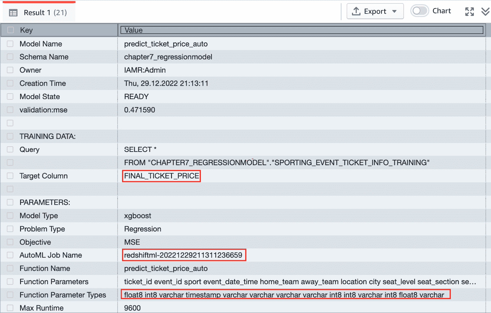

图 13.1 – SHOW MODEL 输出

下面的 `CREATE MODEL` 语句用于使用 `SHOW MODEL` 命令创建当前模型的版本。您还需要在 `FUNCTION` 中包含来自 *图 13*.1 的函数参数类型，并包含 `Target Column`（`FINAL_TICKET_PRICE`）的数据类型。请注意，我们将日期（`YYYYMMDD`）附加到模型名称和函数名称的末尾以创建我们的版本。您可以在 Query Editor v2 中运行以下代码以创建模型的版本：

```py
CREATE MODEL chapter7_regressionmodel.predict_ticket_price_auto_20230624
    FROM 'redshiftml-20221229211311236659'
    FUNCTION predict_ticket_price_auto_20230624 (float8,
        int8, varchar, timestamp, varchar, varchar,
        varchar, varchar, int8, int8, varchar, int8,
        float8, varchar)
    RETURNS float8
    IAM_ROLE default
    SETTINGS (
      S3_BUCKET '<<your S3 Bucket>>');
```

执行以下 `SHOW MODEL` 命令：

```py
SHOW MODEL chapter7_regressionmodel.predict_ticket_price_auto_20230624;
```

在 *图 13*.2 中，请注意**推理类型**显示为**本地**，这表明这是带有本地推理的 BYOM：

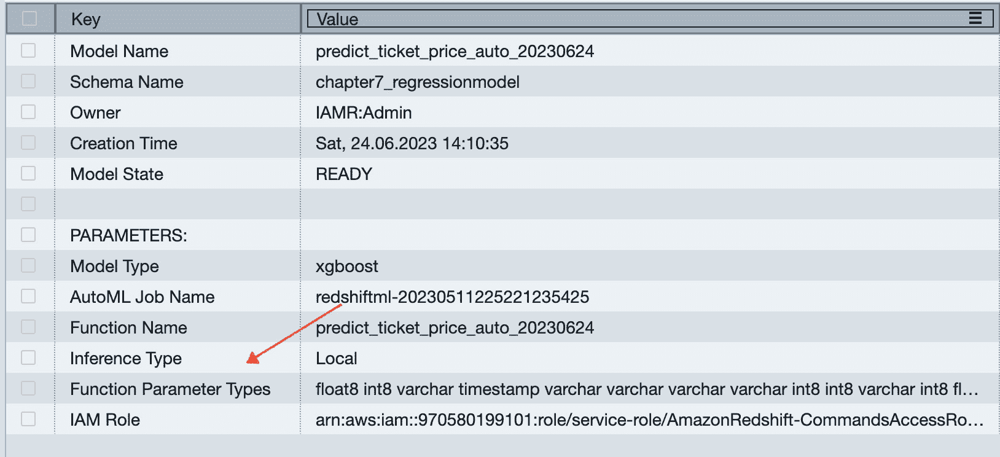

图 13.2 – SHOW MODEL 输出

现在您已经学会了如何创建之前训练的 Redshift ML 模型的版本，我们将向您展示如何自动化此过程。

## 自动化创建模型语句进行版本控制

我们在此处包含了脚本：[`github.com/PacktPublishing/Serverless-Machine-Learning-with-Amazon-Redshift/tree/main/CodeFiles/chapter13.`](https://github.com/PacktPublishing/Serverless-Machine-Learning-with-Amazon-Redshift/tree/main/CodeFiles/chapter13\. )

您可以使用这些脚本并根据需要对其进行自定义。这些脚本包含自动化模型版本控制过程所需的所有组件。本章的示例使用在 EC2 实例上运行的 Bash 脚本和 RSQL。如果您愿意，您也可以在 Windows 或 macOS 上安装 RSQL。

您可以在以下位置找到有关使用 RSQL 与 Amazon Redshift 交互的更多信息：[`docs.aws.amazon.com/redshift/latest/mgmt/rsql-query-tool-getting-started.html`](https://docs.aws.amazon.com/redshift/latest/mgmt/rsql-query-tool-getting-started.html)。

要下载本书的所有代码，您可以在运行 Linux 或 Windows 的 EC2 实例或您本地的 Windows 或 Mac 机器上运行以下链接中给出的命令：

[`github.com/PacktPublishing/Serverless-Machine-Learning-with-Amazon-Redshift.git`](https://github.com/PacktPublishing/Serverless-Machine-Learning-with-Amazon-Redshift.git)。

在运行脚本之前，我们需要创建用于生成模型版本`CREATE MODEL`命令所需的模式和表。您可以在查询编辑器 v2 中执行以下步骤：

1.  创建模式：

    ```py
    Create schema chapter13;
    ```

1.  创建包含自动生成`CREATE MODEL`命令所需元数据的表：

    ```py
    create table chapter13.local_inf_ml_model_components
    ```

    ```py
    (model_name varchar(500),
    ```

    ```py
    schema_name varchar(500),
    ```

    ```py
    automlJobName varchar(500),
    ```

    ```py
    functionName varchar(500),
    ```

    ```py
    inputs_data_type varchar(500),
    ```

    ```py
    target_column varchar(50),
    ```

    ```py
    returns_data_type varchar(50),
    ```

    ```py
    model_arn varchar (500),
    ```

    ```py
    S3_Bucket varchar (200) );
    ```

1.  初始化`local_inf_ml_components`表。

注意，您只需初始化此表一次，包括模型名称、模式名称、我们预测的目标值的类型、IAM 角色的**Amazon 资源名称**（**ARN**）以及用于 Redshift ML 工件要使用的 S3 存储桶。该表将随着自动化脚本所需额外数据的更新而更新：

```py
insert into chapter13.local_inf_ml_model_components
values
(
'predict_ticket_price_auto',
'chapter7_regressionmodel',
' ',' ',' ',' ','float8',
'<arn of your IAM ROLE>'
'<your S3 Bucket>)';
```

现在，我们已经准备好运行自动化脚本。*图 13.3*使用我们的`predict_ticket_price_auto`模型说明了此流程，该模型来自*第七章*。**步骤 1**通过使用 BYOM 并附加时间戳创建模型版本，**步骤 2**删除并创建新的模型：

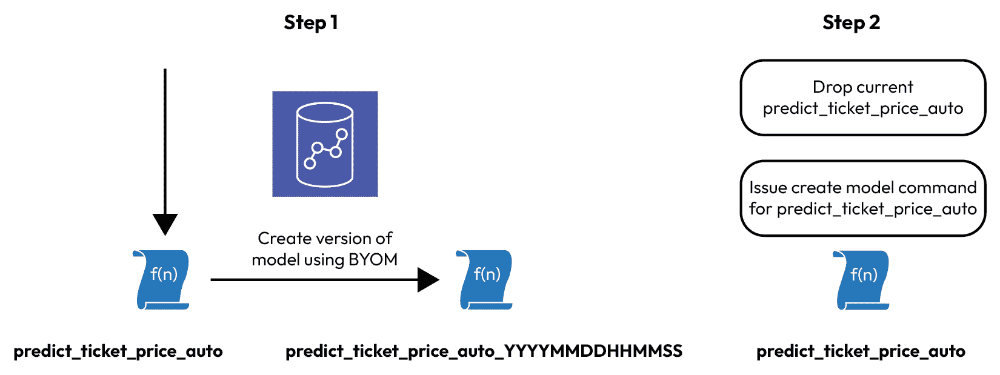

图 13.3 – 自动化脚本步骤 1 和 2

让我们通过*图 13.3*中的步骤进行说明。

### 步骤 1 – 从现有模型创建版本

您可以参考位于[`github.com/PacktPublishing/Serverless-Machine-Learning-with-Amazon-Redshift/tree/main/CodeFiles/chapter13`](https://github.com/PacktPublishing/Serverless-Machine-Learning-with-Amazon-Redshift/tree/main/CodeFiles/chapter13)或您在运行`git clone`命令后放置文件的位置的`step1_create_model_version.sh`脚本。

`step1_create_model_version.sh`脚本的内容也显示在以下代码片段中。如您所见，它调用其他脚本和命令如下：

```py
#! /bin/bash
# create SHOW MODEL sql command
./generate_show_model_sql.sh  'chapter7_regressionmodel.predict_ticket_price_auto'
#Read SHOW MODEL output and write to file
./show_model.sh
#copy SHOW MODEL output to the model info table
aws s3 cp create_model.txt s3://<your-s3-bucket>>
#load SHOW MODEL output and prep table to generate create model
./prep_create_model.sh
#generate sql to create model version
./generate_create_model_version_sql.sh
#execute the sql to create model verson
./execute_create_model_version.sh
```

在执行此脚本之前，请阅读以下子节，因为它们包含一些设置步骤的说明。

#### 创建 show_model_sql 命令

我们有一个名为`generate_show_model_sql.sh`的简单脚本，其代码如下所示：

```py
#!/bin/bash
modelname=$1
echo $1
echo SHOW MODEL $1 ';' > show_model.sql
```

此脚本将模型名称作为输入。在提供的脚本中，我们已经在`step1_create_model_version.sh`驱动脚本中提供了模型名称。您可以根据需要修改它。

该脚本创建一个写入名为`show_model.sql`的文件的`SHOW MODEL`命令，以便在`show_model.sh`脚本中读取。

#### 读取 SHOW MODEL 输出并将其写入文件。

此步骤执行一个名为`show_model.sh`的 Amazon Redshift RSQL 脚本，该脚本读取`show_model.sql`文件并将输出写入名为`create_model.txt`的文件。

#### 将 SHOW MODEL 输出复制到模型信息表中。

这将`create_model.txt`文件复制到 S3 存储桶中。

#### 加载 SHOW MODEL 输出并准备表以生成`CREATE MODEL`。

此步骤执行另一个名为`prep_create_model.sh`的 Amazon Redshift RSQL 脚本，该脚本执行以下操作：

+   创建并加载`model_info`表。

+   从`model_info`表中更新`local_inf_ml_model_components`，以便可以生成用于模型版本的`CREATE MODEL`语句。

+   将生成的`CREATE MODEL`语句插入到`create_model_sql`表中。

#### 生成创建模型版本的 SQL 语句。

此步骤调用一个名为`generate_create_model_version_sql.sh`的 Amazon Redshift RSQL 脚本，该脚本读取`create_model`表并将 SQL 写入名为`model_version.txt`的文本文件。

#### 执行 SQL 以创建模型版本。

此步骤调用一个名为`execute_create_model_version.sh`的 Amazon Redshift RSQL 脚本，该脚本创建我们之前创建的模型的版本。

现在您可以根据模型版本删除和创建模型。

### 步骤 2 – 重新训练您的 Redshift ML 模型以从现有模型创建版本

此步骤调用一个名为`retrain_model.sh`的 Amazon Redshift RSQL 脚本，该脚本删除并创建我们的模型。它引用`retrain_model.sql`，您可以根据需要修改它。

现在您已经学会了如何自动化重新训练 Redshift ML 模型的过程，让我们讨论如何优化模型准确性。

# 优化 Redshift 模型准确性

在本节中，我们将回顾维护您模型最佳准确性的最佳实践。

您需要持续监控您的模型，以确保在模型训练运行之间分数保持稳定。考虑我们在这里创建的模型的新版本：

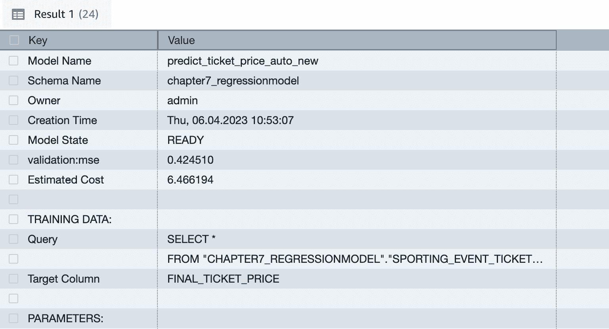

图 13.4 – 新模型输出

创建一个类似此表，并跟踪每周的均方误差（MSE）分数，从 SHOW MODEL 输出中获取：

```py
CREATE TABLE chapter13.model_score_history (
    model_name character varying(500),
    schema_name character varying(500),
    score integer,
    variance integer,
    training_date date
)
DISTSTYLE AUTO;
```

方差将是模型连续版本分数的差异。

通过编写类似此查询来检查您的模型趋势：

```py
Select model_name, score, variance, training_date
Order by model_name, training_date desc;
```

如果方差不在合理的范围内，您需要寻找提高模型分数的方法。

让我们探讨如何通过使用更多数据和尝试不同的模型类型和算法来提高模型质量。

## 模型质量

第一项最佳实践是使用更多数据来提高模型的质量。您还可以通过增加`MAX_RUNTIME`参数来为模型增加更多训练时间。

确保您使用的是具有代表性的训练数据集，并为验证创建至少 10%的样本。

尝试不同的模型类型和算法以获得最佳模型。例如，在第*第七章*中，我们为多输入回归模型尝试了两种不同的算法。在第一个中，我们尝试了线性学习，并得到了 MSE 分数为 701：

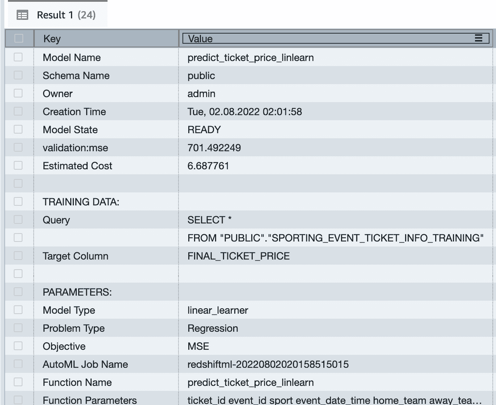

图 13.5 – 线性学习模型类型的 MSE 分数

当我们再次运行它而没有指定模型类型时，SageMaker Autopilot 选择了 XGBoost 作为模型类型，并给出了更好的 MSE 分数**0.711260**：


图 13.6 – XGBoost 模型类型的 MSE 分数

## 模型可解释性

第二个最佳实践是使用可解释性报告来更好地了解哪些输入到你的模型中承载了最多的权重。

在 Query Editor v2 中运行以下 SQL 命令：

```py
select EXPLAIN_MODEL ('chapter7_regressionmodel.predict_ticket_price_auto')
```

这返回了用于训练模型的输入的 Shapley 值：

```py
{"explanations":{"kernel_shap":{"label0":{"expected_value":23.878915786743165,"global_shap_values":
{"away_team":0.050692683450484,"city":0.004979335962039937,"event_date_time":0.05925819534780525,"event_id":0.31961543069587136,"home_team":0.04245607437910639,"list_ticket_price":36.364129559427869,"location":0.005178670063000977,"seat":0.011496876723927165,"seat_level":0.011342097571256795,"seat_row":0.011987498536296578,"seat_section":12.15498245617505,"sport":0.0029737602051575346,"ticket_id":0.3184045531012407,"ticketholder":0.005226471657467846}}}},
"version":"1.0"}
```

你会注意到`list_ticket_price`具有最高的值**36.364** – 这意味着它是权重最高的输入。你可以通过移除模型训练中权重非常低的输入列来实验。检查通过移除不必要的训练输入列是否仍然得到相同的近似模型分数，并有助于提高训练时间。

## 概率

对于分类问题，利用生成的内置函数，你可以看到给定预测的概率。有关此功能的详细示例，请参阅*第五章*。

现在我们来看看由 Amazon SageMaker Autopilot 生成的有用笔记本。

## 使用 SageMaker Autopilot 笔记本

你的 Autopilot 作业生成一个数据探索笔记本和一个候选定义笔记本。要查看这些笔记本，请按照以下步骤操作：

1.  在 AWS 控制台中，搜索`SageMaker`，然后选择**Amazon SageMaker**：

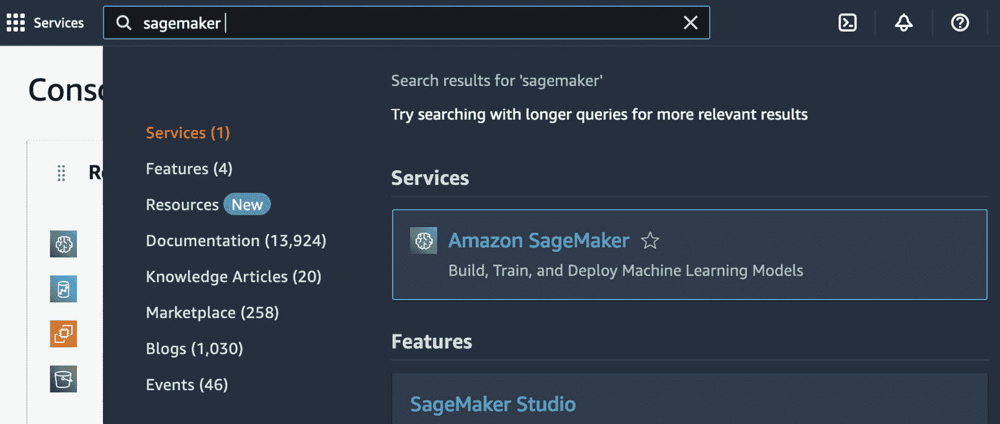

图 13.7 – 选择 Amazon SageMaker

1.  然后，选择**Studio**：

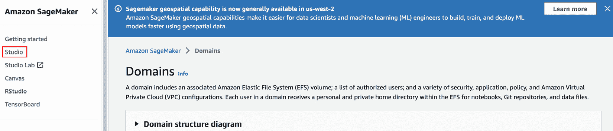

图 13.8 – 选择 Studio

1.  接下来，选择**Open Studio**：

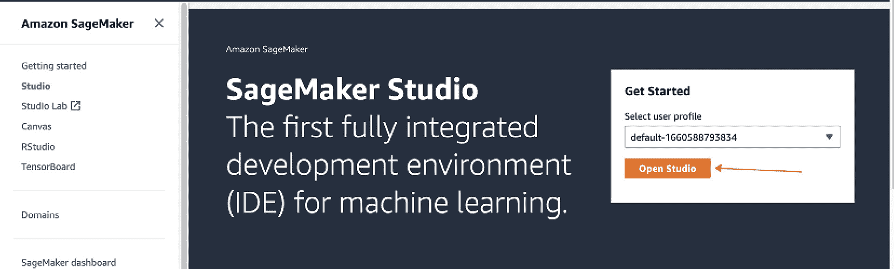

图 13.9 – 选择 Open Studio

1.  接下来，选择**AutoML**：

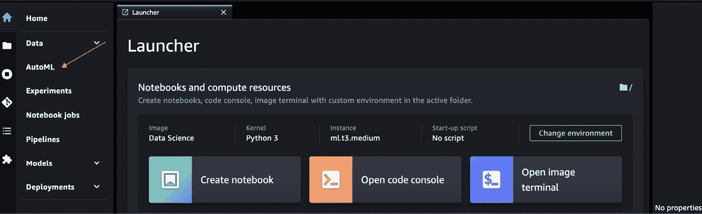

图 13.10 – 选择 AutoML

选择**AutoML**后，以下屏幕将显示：

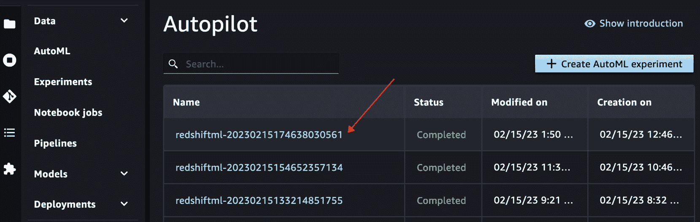

图 13.11 – 模型名称列表

1.  选择你想要评估的模型名称。你可以通过使用`SHOW MODEL`输出的 AutoML 作业名称来获取它。在这个例子中，我在`predict_ticket_price_auto`模型上使用了`SHOW MODEL`：

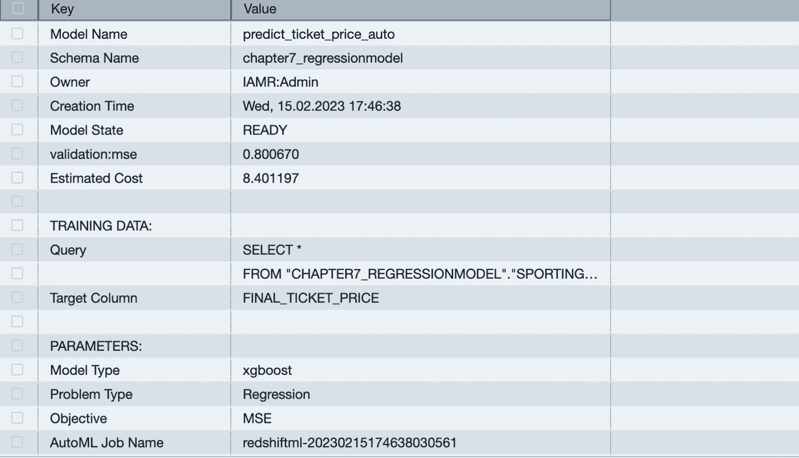

图 13.12 – SHOW MODEL 输出

你将看到如下输出：

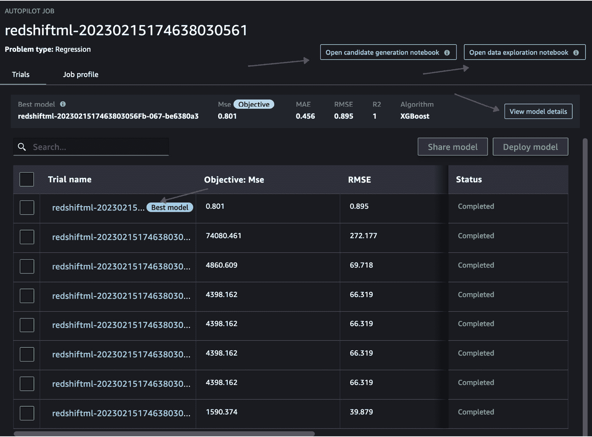

图 13.13 – AutoML 最佳模型

在**图 13**.13 中，您可以查看已训练的模型列表，其中*最佳*模型被突出显示。这还显示了**Mse**的目标、值以及所使用的算法，并且有链接可以查看模型详情、候选生成笔记本和数据探索笔记本。

1.  点击**查看模型详情** – 这是您查看特征重要性或可解释性的另一种方式：

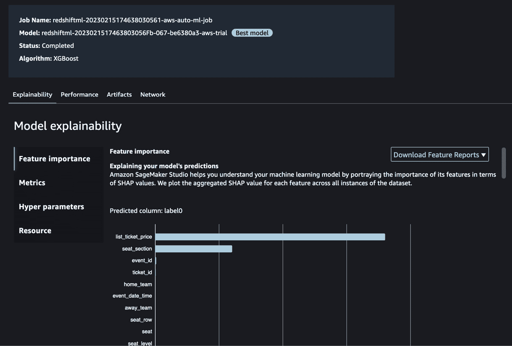

图 13.14 – 特征重要性

您还可以查看 SageMaker Autopilot 使用的超参数：

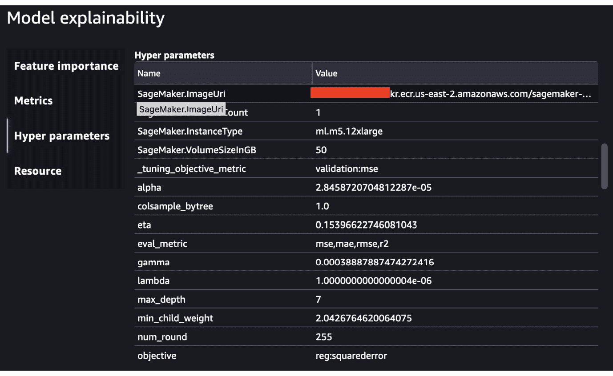

图 13.15 – 超参数

1.  现在，尝试点击**打开数据** **探索笔记本**：

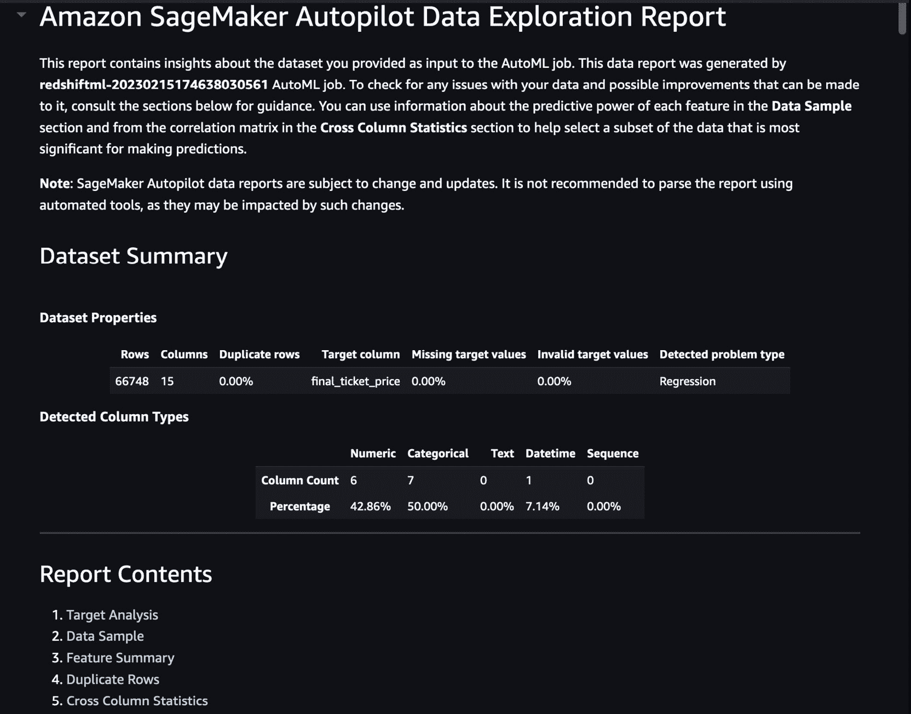

图 13.16 – 数据探索报告

这将向您展示数据探索报告，您可以看到诸如**目标分析**、**特征摘要**、**重复行**和其他统计数据。

这是`predict_ticket_price_auto`模型：

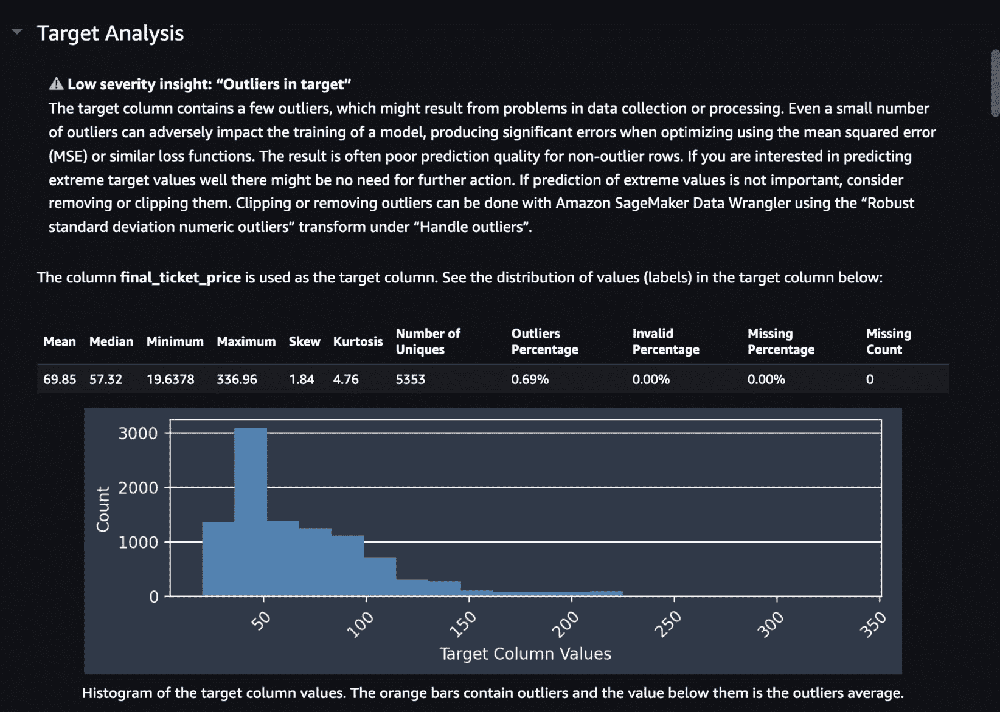

图 13.17 – 目标分析

要了解更多关于数据探索笔记本的信息，您可以参考此链接：[`docs.aws.amazon.com/sagemaker/latest/dg/autopilot-data-exploration-report.html`](https://docs.aws.amazon.com/sagemaker/latest/dg/autopilot-data-exploration-report.html)。

1.  现在，点击**打开候选** **生成笔记本**：

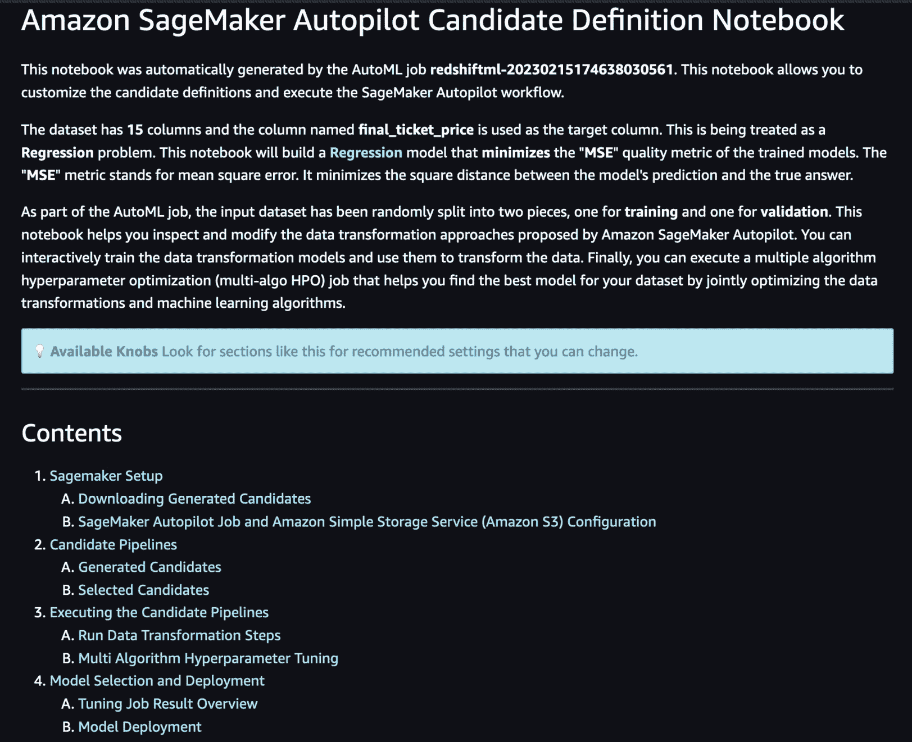

图 13.18 – 候选定义笔记本

这个笔记本包含了处理步骤、算法和超参数的信息。要了解更多关于使用候选生成笔记本的信息，请参阅[`docs.aws.amazon.com/sagemaker/latest/dg/autopilot-candidate-generation-notebook.html`](https://docs.aws.amazon.com/sagemaker/latest/dg/autopilot-candidate-generation-notebook.html)。

# 摘要

在本章中，您学习了在 Amazon Redshift ML 中实现模型的技术。

我们讨论了您如何创建模型的一个版本。这很重要，可以跟踪您模型的质量随时间的变化，并能够使用不同版本进行推理。

我们向您展示了如何优化您的 Redshift ML 模型以提高准确性，以及您如何使用 Amazon SageMaker Autopilot 生成的笔记本来加深对 Autopilot 执行的任务的理解。

我们希望您觉得这本书有用。我们开始写这本书的目标是帮助您在这些主要领域获得信心：

+   深入了解机器学习以及如何将其用于解决日常业务问题。

+   使用 Redshift Serverless 和 Redshift ML 实现端到端的无服务器架构，用于数据摄取、分析和机器学习。

+   创建监督和非监督模型，以及各种影响您模型的技术

+   在 Redshift 中进行大规模推理查询，以使用 Redshift ML 或直接在 Amazon SageMaker 中创建的模型解决各种商业问题

我们非常感谢您花时间阅读这本书，并欢迎您就如何使 Redshift 和 Redshift ML 变得更好提供反馈。您可以在 LinkedIn 上找到我们。
