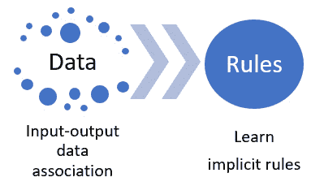
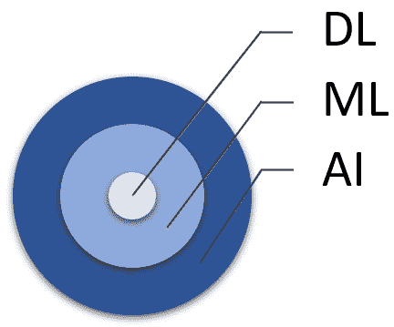
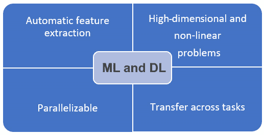
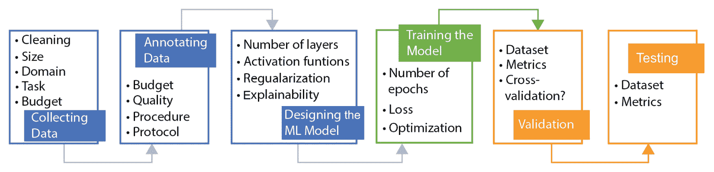

# 第一章：机器学习和数据需求

**机器学习**（**ML**）是**人工智能**（**AI**）的瑰宝，它永远地改变了我们的生活。我们无法想象没有 ML 工具和服务（如 Siri、Tesla 等）的日常生活。

在本章中，您将了解机器学习（ML）。您将理解非学习型解决方案与基于学习型解决方案之间的主要区别。然后，您将了解到为什么**深度学习**（**DL**）模型通常能取得最先进的结果。在此之后，您将简要了解训练过程是如何进行的，以及为什么在机器学习中需要大规模的训练数据。

在本章中，我们将涵盖以下主要主题：

+   人工智能、机器学习和深度学习

+   为什么机器学习和深度学习如此强大？

+   训练机器学习模型

# 技术要求

本章中使用的任何代码都将可在本书 GitHub 仓库的相应章节文件夹中找到：[`github.com/PacktPublishing/Synthetic-Data-for-Machine-Learning`](https://github.com/PacktPublishing/Synthetic-Data-for-Machine-Learning)。

我们将使用**PyTorch**，这是一个由 Meta AI 开发的强大机器学习框架。

# 人工智能、机器学习和深度学习

在本节中，我们将学习机器学习究竟是什么。我们将学习区分学习和非学习人工智能。然而，在那之前，我们将先介绍人工智能、机器学习和深度学习。

## 人工智能（AI）

人工智能有各种各样的定义。然而，其中最好的一个是约翰·麦卡锡的定义。麦卡锡是第一个在 1956 年达特茅斯会议上的一项提案中提出“人工智能”这一术语的人。他通过诸如 Lisp 编程语言、效用计算和分时等许多重大贡献来勾勒出这一领域的轮廓。根据人工智能之父在《什么是人工智能？》([`www-formal.stanford.edu/jmc/whatisai.pdf`](https://www-formal.stanford.edu/jmc/whatisai.pdf))中的说法：

它是制造智能机器的科学和工程，特别是智能计算机程序。它与使用计算机理解人类智能的类似任务相关，但人工智能不必局限于生物可观察的方法。

人工智能是关于使计算机、程序、机器或其他事物模仿或模拟人类智能的学科。作为人类，我们感知世界，这是一个非常复杂的任务，我们推理、归纳、规划和与周围环境互动。尽管在童年几年内掌握这些任务令人着迷，但我们的智能最有趣的一面是能够通过经验改进学习过程并优化性能！

不幸的是，我们对自己大脑、智能以及其他相关功能（如视觉和推理）的了解仍然非常有限。因此，在文明和书写历史中，创建“智能”机器的旅程才刚刚开始。人工智能最繁荣的方向之一就是基于学习的 AI。

AI 可以被视为一个涵盖两种智能的伞状概念：学习和非学习 AI。区分随着经验提高的 AI 和不提高的 AI 非常重要！

例如，假设你想使用 AI 来提高医生识别某种疾病准确性的能力，给定一组症状。你可以通过询问领域专家（资深医生）来创建一个基于一些通用案例的简单推荐系统。以下代码块展示了这样一个系统的伪代码：

```py
//Example of Non-learning AI (My AI Doctor!)
Patient.age //get the patient age
Patient. temperature //get the patient temperature
Patient.night_sweats //get if the patient has night sweats
Paitent.Cough //get if the patient cough
// AI program starts
if Patient.age > 70:
    if Patient.temperature > 39 and Paitent.Cough:
        print("Recommend Disease A")
        return
elif Patient.age < 10:
    if Patient.tempreture > 37 and not Paitent.Cough:
        if Patient.night_sweats:
                print("Recommend Disease B")
                return
else:
    print("I cannot resolve this case!")
    return
```

这个程序模拟了医生可能对类似场景进行推理的方式。通过使用简单的`if-else`语句和几行代码，我们可以给我们的程序带来“智能”。

重要提示

这是一个非学习型 AI 的例子。正如你所预期的那样，程序不会随着经验的积累而进化。换句话说，逻辑不会因为更多的患者而提高，尽管程序仍然代表了一种清晰的 AI 形式。

在本节中，我们了解了 AI，并探讨了如何区分基于学习和非学习型 AI。在下一节中，我们将探讨 ML。

## 机器学习（ML）

ML 是 AI 的一个子集。ML 的关键思想是使计算机程序能够从经验中学习。目标是让程序能够在不依赖人类制定规则的情况下学习。在前一节中我们看到的 AI 医生例子中，主要问题是创建规则。这个过程非常困难、耗时且容易出错。为了让程序正常工作，你需要让经验丰富的/资深医生表达他们通常用来处理类似患者的逻辑。在其他情况下，我们并不知道确切的规则以及涉及的过程机制，例如物体识别和物体跟踪。

ML 通过探索为这项任务收集的特殊训练数据来学习控制过程的规则（参见*图 1**.1*）：



图 1.1 – ML 从数据中学习隐含规则

ML 有三种主要类型：**监督学习**、**无监督学习**和**强化学习**。它们之间的主要区别来自于所使用的训练数据的性质和学习过程本身。这通常与问题和可用的训练数据有关。

## 深度学习（DL）

深度学习是机器学习的一个子集，它可以被视为机器学习的核心（见图 1.2）。大多数机器学习的惊人应用都是由于深度学习才成为可能的。深度学习通过使用由多层或太多层（10 层或更多）组成的**人工神经网络（ANNs**）来学习并发现训练数据中的复杂模式和结构，这些模式和结构通常难以使用其他机器学习方法（如**决策树**）来完成。深度学习通过模仿人脑的灵感，使用**人工神经网络**（ANNs）进行学习；因此，名字中的“神经”。它有三种类型的层：输入层、输出层和隐藏层。输入层接收输入，而输出层给出 ANN 的预测。隐藏层负责发现训练数据中的隐藏模式。一般来说，每一层（从输入层到输出层）都会学习数据的一个更抽象的表示，前提是前一层给出了输出。你的 ANN 有越多的隐藏层，ANN 就越复杂和非线性。因此，ANN 将有更多的自由度来更好地逼近输入和输出之间的关系，或者学习你的训练数据。例如，AlexNet 由 8 层组成，VGGNet 由 16 到 19 层组成，ResNet-50 由 50 层组成：



图 1.2 – 深度学习、机器学习和人工智能之间的关系

深度学习的主要问题是它需要一个大规模的训练数据集才能收敛，因为我们通常有大量的参数（权重）需要调整以最小化损失。在机器学习中，损失是一种惩罚错误预测的方法。同时，它也是模型学习训练数据的良好指示。收集和注释如此大规模的数据集非常困难且成本高昂。

现在，使用合成数据作为真实数据的替代品或补充是一个热门话题。它在研究和行业中都是一个趋势话题。像谷歌（谷歌的 Waymo 利用合成数据来训练自动驾驶汽车）和微软（他们使用合成数据来处理敏感数据的隐私问题）这样的许多公司最近开始投资使用合成数据来训练下一代机器学习模型。

# 为什么机器学习和深度学习如此强大？

尽管最近大多数人工智能领域都在蓬勃发展并受到更多关注，但机器学习（ML）和深度学习（DL）一直是人工智能中最有影响力的领域。这是因为几个因素使它们在准确性、性能和适用性方面明显优于其他解决方案。在本节中，我们将探讨这些基本因素之一。

## 特征工程

在传统人工智能中，必须手动为任务设计特征。这个过程非常困难、耗时且与任务/问题相关。如果你想编写一个程序，比如识别汽车轮胎，你可能需要使用一些过滤器来提取边缘和角落。然后，你需要利用这些提取的特征来识别目标对象。正如你可能预料的，知道选择或忽略哪些特征并不总是容易。想象一下，在疫情初期，基于一组症状来预测患者是否患有 COVID-19 的基于人工智能的解决方案。当时，人类专家不知道如何回答这样的问题。机器学习和深度学习可以解决这样的问题。

深度学习模型通过学习训练数据中的隐藏模式、结构和关联来*自动*提取有用的特征。**损失**用于指导学习过程并帮助模型实现训练过程的目标。然而，为了使模型收敛，它需要接触到足够多样化的训练数据。

## 任务迁移

深度学习的一个显著优势是，与传统的机器学习方法相比，它更独立于任务。迁移学习是深度学习的一个神奇而强大的特性。你不需要从头开始训练模型，而是可以使用在类似任务上训练的不同模型开始训练过程。这在计算机视觉和自然语言处理等领域非常常见。通常，你有一个自己目标任务的小数据集，如果你的模型只使用这个小的数据集，那么它可能不会收敛。因此，在接近领域（或任务）但更加多样化、更大的数据集上训练模型，然后在特定任务的数据集上进行微调，可以得到更好的结果。这个想法允许你的模型在任务和领域之间迁移学习：



图 1.3 – 机器学习和深度学习的优势

重要提示

如果问题简单或者有明确的数学解决方案，那么你可能不需要使用机器学习！不幸的是，对于已经有明确数学解决方案的问题，提出基于机器学习的解决方案是很常见的！同时，如果简单基于规则的解决方案已经足够解决你的问题，那么不建议使用机器学习。

# 训练机器学习模型

开发机器学习模型通常需要执行以下基本步骤：

1.  收集数据。

1.  标注数据。

1.  设计机器学习模型。

1.  训练模型。

1.  测试模型。

这些步骤在以下图中展示：



图 1.4 – 开发机器学习模型过程

现在，让我们更详细地看看每个步骤，以便更好地理解我们如何开发机器学习模型。

## 收集和标注数据

开发机器学习模型的过程中的第一步是收集所需的训练数据。你需要决定需要哪些训练数据：

+   **使用现有数据集进行训练**：在这种情况下，不需要收集训练数据。因此，你可以跳过收集和标注数据。然而，你应该确保你的目标任务或领域与计划部署的可用数据集非常相似。否则，你的模型可能在数据集上训练得很好，但在测试新任务或领域时表现不佳。

+   **在现有数据集上训练并在新数据集上微调**：这是当今机器学习中最常见的情况。你可以在一个大的现有数据集上预训练你的模型，然后在新数据集上对其进行微调。关于新数据集，它不需要非常大，因为你已经在利用其他现有的数据集。对于要收集的数据集，你需要确定模型需要学习什么，以及你计划如何实现这一点。在收集训练数据后，你将开始标注过程。

+   **在新数据上从头开始训练**：在某些情况下，你的任务或领域可能远离任何可用的数据集。因此，你需要收集大规模数据。收集大规模数据集并不简单。为此，你需要确定模型将学习什么，以及你希望它如何做到这一点。对计划进行任何修改可能需要你重新收集更多数据，甚至可能需要从头开始重新开始数据收集过程。随后，你需要决定提取哪些真实值、预算以及你希望的质量。

接下来，我们将探讨机器学习模型开发过程中最基本的一个要素。那么，让我们学习如何设计和训练一个典型的机器学习模型。

## 设计和训练机器学习模型

为手头的问题选择合适的机器学习模型取决于问题本身、任何约束以及机器学习工程师。有时，同一个问题可以通过不同的机器学习算法来解决，但在其他情况下，使用特定的机器学习模型是强制性的。基于问题和机器学习模型，应该收集和标注数据。

每个机器学习算法都将有一组不同的超参数、各种设计和在整个过程中需要做出的决策。建议你进行试点或初步实验，以确定针对你问题的最佳方法。

当设计过程最终确定后，训练过程就可以开始了。对于某些机器学习模型，训练过程可能只需要几分钟，而对于其他模型，可能需要几周、几个月甚至更长时间！你可能需要执行不同的训练实验来决定你将继续使用哪些训练超参数——例如，训练轮数或优化技术。通常，损失函数将是一个有助于判断训练过程进行得如何的有用指标。在深度学习中，使用了两种损失函数：训练损失和验证损失。前者告诉我们模型学习训练数据的效果如何，而后者描述了模型泛化到新数据的能力。

## 验证和测试机器学习模型

在机器学习中，我们应该区分三个不同的数据集/分区/集合：训练集、验证集和测试集。*训练集*用于教授模型关于任务的知识并评估模型在训练过程中的表现。*验证集*是测试集的代理，用于告诉我们模型在新数据上的预期性能。然而，*测试集*是实际世界的代理——也就是说，我们的模型将在那里接受测试。这个数据集应该仅用于部署，以便我们知道模型在实际应用中的表现。使用这个数据集来改变超参数或设计选项被认为是作弊，因为它会误导你对模型在现实世界中的表现或泛化能力的理解。在现实世界中，一旦你的模型被部署，比如在工业界，你将无法根据其性能调整模型的参数！

## 机器学习开发过程中的迭代

在实践中，开发一个机器学习模型将需要在验证、测试以及其他流程阶段之间进行多次迭代。可能验证或测试结果不尽如人意，你决定改变数据收集、标注、设计或训练的一些方面。

# 摘要

在本章中，我们讨论了人工智能（AI）、机器学习（ML）和深度学习（DL）等术语。我们揭示了机器学习和深度学习的一些优势。同时，我们学习了开发和管理机器学习模型的基本步骤。最后，我们学习了为什么我们需要大规模的训练数据。

在下一章中，我们将探讨标注大规模数据集时遇到的主要问题。这将使我们更好地理解为什么合成数据是机器学习（ML）的未来！
