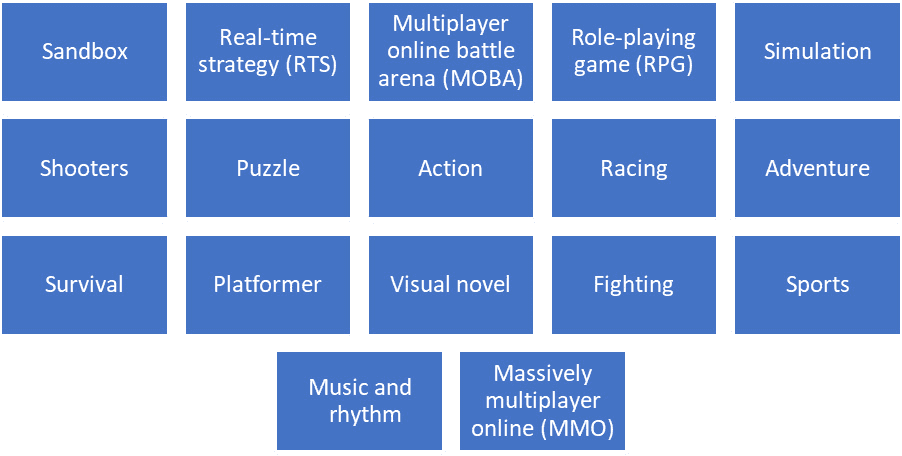

# 第八章：电子游戏作为合成数据来源

在本章中，你将学习如何以及为什么使用电子游戏进行合成数据生成。我们将讨论当前的研究，并突出在这个领域取得的成果。同时，我们将深入研究利用这种方法进行合成数据生成的主要挑战。本章的总体目标是帮助你全面理解利用电子游戏进行合成数据生成的方法。它将为你提供必要的知识，以了解这种有希望的合成数据生成方法的潜力和局限性。

在本章中，我们将讨论以下主要主题：

+   电子游戏与合成数据

+   使用电子游戏生成合成数据

+   挑战与限制

# 游戏产业的影响

在本节中，我们将了解为什么电子游戏是合成数据生成的理想媒介。

电子游戏是主要用于娱乐的交互式电子游戏。玩家通常通过与游戏元素互动来实现目标。近年来，每年发布的游戏数量、质量和数量呈指数级增长。现在，电子游戏在教育、培训、康复、个人发展和最近在**机器学习**（**ML**）研究中也得到了应用。具体来说，它们被展示为训练和测试 ML 模型的一个丰富而优秀的合成数据资源。

模拟器和 GANs 等合成数据生成方法具有前景，并为生成大规模和自动标注的数据集提供了一种巧妙的解决方案；请参阅*第六章*和*第七章*。然而，由于设置数据生成系统所需的复杂性、时间和努力，它们仍然存在一些限制。以下是一些这些限制的总结：

+   超逼真效果和领域迁移

+   时间、努力和成本

接下来，让我们逐一更详细地讨论这些限制。

## 超逼真效果与真实-合成领域迁移

为了使合成数据有用，通常需要它具有超逼真效果。然而，达到高水平的超逼真效果并不简单。如果你还记得，我们在*第六章*中简要讨论了这些观点。这需要熟练的工程师、艺术家、设计师、照明和动画专家以及其他人员来实现这一目标。此外，运行这些最先进游戏引擎的硬件、游戏引擎本身、构建丰富和逼真虚拟世界的工具和资产都很昂贵，并且需要广泛的培训。例如，*Wacom Cintiq Pro 24”*的价格超过 2200 英镑，并且需要数月的培训。这些和类似的设备对于创建游戏中的 3D 内容是必不可少的。请参阅*图 8**.1*。

图 8.1 – 游戏中 3D 或 2D 工作流程所需工具的示例

运行 Unreal Engine 的系统要求如下：

+   Windows 10 64 位，四核英特尔或 AMD，2.5 GHz 或更快，8 GB RAM

+   macOS Big Sur，四核英特尔，2.5 GHz 或更快，8 GB RAM

+   Linux Ubuntu 18.04，四核英特尔或 AMD，2.5 GHz 或更快，32 GB RAM

为创建合成数据生成系统所需的软件、硬件和专家进行预算可能对小型公司和研究小组来说不可行。无法维持所需的逼真度会导致机器学习模型在从合成数据泛化到真实数据时遇到困难。因此，这限制了生成的合成数据在现实世界应用中的可用性。

## 时间、努力和成本

创建多用途模拟器 *CARLA* ([`carla.org`](https://carla.org)) 需要 40-50 名研究人员、开发人员和艺术家。为了开发这个用于合成数据生成的有用系统，需要多年的持续工作。同样，GANs 的设计和训练也需要相当多的时间和精力。此外，训练还需要大量的计算和数据存储资源。合成数据生成方法的伦理考量也是其他问题。知识产权问题和偏见是这些担忧的例子。

寻找一个理想的合成数据生成方法仍然是热门话题，并且是部分解决的问题。游戏行业的最新进展激励研究人员探索使用视频游戏生成合成数据的潜力。预计到 2027 年，视频游戏行业的用户数量将达到 31 亿。预计到 2027 年，市场规模预计将超过 3800 亿英镑。更多详情请参阅 *Statista Video Games* *Worldwide* ([`www.statista.com/outlook/dmo/digital-media/video-games/worldwide`](https://www.statista.com/outlook/dmo/digital-media/video-games/worldwide))。

全球市场、技术的巨大进步以及对于更加逼真和吸引人的游戏需求的增加，为研究人员、游戏开发者、游戏工作室、投资者和游戏发行商打开了创造前所未有的、突破性的、逼真且多样化的虚拟世界和游戏的新大门。现在，你明白了为什么视频游戏是生成合成数据的一个优雅解决方案。在下一节中，我们将更详细地介绍如何利用视频游戏进行合成数据生成。

# 使用视频游戏生成合成数据

这种合成数据生成方法将问题从创建虚拟世界以生成合成数据转变为操纵视频游戏以生成合成数据。这种方法提供了一种方便且高效的方式来生成合成数据。以下列出了已经用于此目的的视频游戏示例：

+   《侠盗猎车手 V：*数据游戏：计算机游戏中的真实信息*》（[`arxiv.org/pdf/1608.02192v1.pdf`](https://arxiv.org/pdf/1608.02192v1.pdf)）

+   Minecraft: *使用 MineNavi 从数据集到单目深度估计（MDE）模型的影响探索* ([`arxiv.org/pdf/2008.08454.pdf`](https://arxiv.org/pdf/2008.08454.pdf))

+   Half-Life 2: *OVVV: 使用虚拟世界设计和评估监控系统* ([`www.computer.org/csdl/proceedings-article/cvpr/2007/04270516/12OmNyRg4Dv`](https://www.computer.org/csdl/proceedings-article/cvpr/2007/04270516/12OmNyRg4Dv))

下图展示了视频游戏的各种类型：

图 8.2 – 视频游戏类型的示例

如*图 8.2*所示的视频游戏类型多样性，使得通过利用视频游戏生成各种丰富的合成数据对研究人员来说更具吸引力。在机器学习应用中，可以利用视频游戏的各种方式，如下所示：

+   利用游戏进行一般数据收集

+   利用游戏进行社会科学研究

+   利用模拟游戏进行数据生成

让我们详细讨论这些内容。

## 利用游戏进行一般数据收集

现代视频游戏出于各种原因收集玩家的数据，例如控制游戏难度、定制游戏体验以及根据用户数据个性化广告。这些游戏收集的数据可以用于游戏本身以外的其他目的。收集的数据可能包括以下内容：

+   生物统计数据

+   人口统计数据

+   游戏玩法数据

让我们看看这些数据如何被使用。

### 生物统计数据

游戏开发者可能会收集玩家的生物统计数据以评估他们的参与度，并根据玩家的情绪、兴奋和困惑来控制游戏的一些方面。一些现代视频游戏收集的生物统计数据可能包括眼球运动、心率、头部和手部运动，以及**脑电图**（**EEG**）信号。EEG 信号是在进行注意、阅读和睡眠等活动时大脑产生的电波。这包括像*Nevermind*、*Far Cry 6*和*X-Plane 12*这样的视频游戏。*Nevermind* ([`nevermindgame.com`](https://nevermindgame.com))是第一个生理生物反馈冒险视频游戏。它使用心率传感器捕捉玩家的心率，以评估游戏过程中的恐惧、焦虑和压力。收集的数据可以用于广泛的实验，例如*视频游戏与压力：压力评估和游戏内容如何影响心血管和情绪结果* ([`www.frontiersin.org/articles/10.3389/fpsyg.2019.00967/full`](https://www.frontiersin.org/articles/10.3389/fpsyg.2019.00967/full))和*通过 EEG 节律测量的动作实时策略游戏体验与特质焦虑对大脑功能的影响交互作用* ([`www.tandfonline.com/doi/full/10.1080/27706710.2023.2176004`](https://www.tandfonline.com/doi/full/10.1080/27706710.2023.2176004))。

### 人口统计数据

电子游戏可以被视为人口数据的丰富来源。广泛的全球玩家提供了关于他们年龄、性别、位置、语言、职业以及其他有价值的信息，例如**个人可识别信息**（**PII**）。一些电子游戏，如 *《我的世界》* 和 *《模拟人生 4》*，利用收集到的人口数据来改善玩家体验并增强参与度。因此，一些电子游戏可能为 7 岁以下的玩家移除暴力、血腥和成人语言。他们可能会根据收集到的人口数据激活或停用某些功能，例如游戏内的聊天和购买以及成熟度过滤器。

### 游戏玩法数据

游戏可以通过向用户提问或使用传感器来明确收集数据，也可以通过观察玩家在虚拟世界中的行为（包括互动、选择、学习和进步）来隐式收集数据。游戏玩法数据为定制游戏和提升整体游戏玩法及用户体验提供了宝贵的资源。这些游戏的例子包括 *《使命召唤：黑色行动 III》*，*《堡垒之夜》*，*《英雄联盟》* 和 *《魔兽世界》*。游戏开发者利用游戏过程中的收集数据来平衡游戏机制和难度，并识别弱点、问题和错误。

## 利用游戏进行社会科学研究

游戏已被用作社会科学领域的合成数据来源。例如，研究人员部署了教育游戏来了解更多的学习体验，比较和对比教学方法，以及分析学习环境和学习工具。有关在社会科学中利用游戏的更多信息，请参阅 *《用游戏教授社会科学》* ([`www.igi-global.com/article/teaching-social-studies-with-games/201873`](https://www.igi-global.com/article/teaching-social-studies-with-games/201873))。

在一些游戏中，例如 *《文明 V》* ([`civilization.com/en-GB/civilization-5`](https://civilization.com/en-GB/civilization-5))，玩家构建并控制一个文明。他们需要做出决策、规划、进行外交和制定未来计划。观察和记录玩家的行为，并将其与从玩家那里收集到的人口数据相结合，为社会科学研究人员提供了一个优秀且丰富的数据来源。其他类似的游戏，如 *《Spent》* ([`playspent.org`](https://playspent.org))，也提供了关于玩家如何应对挑战以及他们如何在有限的预算下做出决策的有价值合成数据。

如预期的那样，收集社会科学数据的标准方法是调查和访谈。它们难以设计，耗时且昂贵。除此之外，它们并不愉快，也不容易享受。因此，预计会有错误或不准确的反馈或数据。另一方面，游戏提供了一个互动、真实且令人愉悦的体验，这使得生成的反馈和数据更加准确、详细和有价值。

## 利用模拟游戏进行数据生成

模拟游戏创建出可以用来教授玩家某些东西、装备他们新技能或磨练他们的知识和技能的真实世界的部分。模拟器从两个来源生成合成数据：模拟游戏中的环境和玩家的行为。模拟环境提供了诸如对象语义标签、天气条件和场景拥挤度等有价值的信息。另一方面，玩家的行为包括玩家如何处理问题、花费的时间、利用的资源、做出的决策以及与其他玩家的游戏中的交流。

如您现在所理解，视频游戏内部收集的数据可以用于许多目的，例如训练机器学习模型。然而，游戏开发者必须考虑数据法规，以确保他们不会违反或违反这些法规。在下一节中，您将了解这种合成数据生成方法的主要限制。

# 挑战和限制

在本节中，我们探讨这种合成数据生成方法的主要挑战。

与其他合成数据生成方法类似，利用视频游戏进行此目的存在一些挑战。主要挑战和缺点可以总结如下。

## 可控性

使用合成数据的主要优势是能够定制并完全控制此过程中的每个方面。然而，由于视频游戏并非用于研究目的而部署，3D 虚拟世界和场景元素已经创建、固定且难以更改。因此，添加或删除某些对象和动作并不容易。

## 游戏类型和合成数据生成的限制

根据游戏市场，某些游戏类型比其他游戏类型更受欢迎。例如，*动作*、*体育*、*角色扮演* 和 *第一人称射击* 游戏比 *文本冒险* 和 *音乐* 以及 *节奏* 游戏更受欢迎。因此，在适合的视频游戏有限可用的情况下，为某些应用生成合成数据可能不可行。

## 现实主义

正如我们之前提到的，现实主义对于弥合合成领域与现实领域之间的差距至关重要。许多最先进和畅销的游戏远非现实主义游戏。这些游戏的例子包括 *PUBG*、*Minecraft* 和 *Red Dead Redemption*。玩家通常更重视游戏玩法、剧情和叙事，而不是游戏中的照片级真实感。在视频游戏中实现现实主义图形是一个极具挑战性的过程，可能对游戏工作室来说并不划算。

## 伦理问题

利用视频游戏进行合成数据生成是一个复杂的话题。将玩家在游戏之外的数据用于研究或商业项目可能会引发隐私问题。在由视频游戏生成的合成数据上训练将使基于此数据源训练的机器学习模型在通常玩视频游戏的群体中更准确，而在其他不玩视频游戏的群体中则不那么准确。例如，仅使用由视频游戏生成的合成数据进行训练的面部识别系统可能在年轻人中表现良好，但可能难以应对通常不玩视频游戏的老年人。请参阅*2022 年美国视频游戏玩家按年龄* *群体* *分布* ([`www.statista.com/statistics/189582/age-of-us-video-game-players`](https://www.statista.com/statistics/189582/age-of-us-video-game-players))。

## 知识产权

没有游戏创作者的许可，我们不能利用视频游戏进行合成数据生成，因为游戏创作者通常拥有复制游戏的独家权利。如果我们修改游戏并将其用于其他目的，可能会侵犯知识产权和版权。同时，游戏本身生成的数据可能也受到相同的版权或许可约束。

# 摘要

在本章中，我们学习了视频游戏如何成为合成数据的有价值来源。我们了解到可以从视频游戏中收集生物识别、人口统计和游戏数据，并可用于众多基于机器学习的应用。我们深入了解了如何以及为什么可以从视频游戏中收集有关玩家的各种类型的数据。最后，我们讨论了使用视频游戏进行合成数据生成的局限性。

在下一章中，我们将深入探讨另一种生成合成数据的方法，即使用扩散模型。
