# 第九章：探索用于合成数据的扩散模型

本章向您介绍扩散模型，这是合成数据生成的前沿方法。我们将强调这种新颖的合成数据生成方法的优缺点。这将帮助您根据自己的问题做出明智的决定，选择最佳的方法。我们将强调扩散模型的机会和挑战。此外，本章还包含一个全面的实践示例，提供生成和有效利用合成数据用于实际机器学习应用的动手经验。随着您对扩散模型的了解，您将了解在实践中使用这种合成数据方法的主要道德问题和关注点。此外，我们还将回顾一些关于这个主题的最新研究。因此，本章将为您提供必要的知识，以彻底理解这种新颖的合成数据生成方法。

在本章中，我们将涵盖以下主要主题：

+   扩散模型简介

+   扩散模型 – 优点与缺点

+   实践中的动手扩散模型

+   扩散模型 – 道德问题

# 技术要求

本章中使用的任何代码都将可在本书 GitHub 仓库的相应章节文件夹中找到：[`github.com/PacktPublishing/Synthetic-Data-for-Machine-Learning`](https://github.com/PacktPublishing/Synthetic-Data-for-Machine-Learning)。

# 扩散模型简介

在本节中，我们将探讨扩散模型。我们将将其与我们在*第七章*中介绍过的**变分自编码器**（**VAEs**）和**生成对抗网络**（**GANs**）进行比较。这将帮助您获得对生成模型的全面和综合理解。此外，这将使比较和对比这些方法的架构、训练过程和数据流变得简单。此外，我们还将学习如何训练一个典型的扩散模型。

**扩散模型**（**DMs**）是一种生成模型，最近被提出作为一种聪明的解决方案来生成图像、音频、视频、时间序列和文本。DMs 在建模复杂概率分布、数据结构、时间依赖性和相关性方面表现出色。DMs 背后的初始数学模型最初是在统计力学领域提出的，并应用于研究气体和液体中粒子的随机运动。正如我们稍后将看到的，了解 DMs 至关重要，因为它们是强大的生成模型，通常可以生成比其他方法更高质量和更保护隐私的合成数据。此外，DMs 依赖于强大的数学和理论基础。

首先展示 DMs 可以用于生成逼真图像的工作之一是*去噪扩散概率模型*([`arxiv.org/abs/2006.11239`](https://arxiv.org/abs/2006.11239))，该模型由加州大学伯克利分校的研究者提出。这项开创性工作随后被 OpenAI 的另一篇工作所跟进，题为*扩散模型在图像合成上击败 GANs*([`arxiv.org/pdf/2105.05233.pdf`](https://arxiv.org/pdf/2105.05233.pdf))，表明 DMs 在生成逼真的合成图像方面更胜一筹。然后，其他研究者开始探索这些 DMs 在不同领域的潜力，并将它们与 VAEs 和 GANs 进行比较。

**变分自编码器**（**VAEs**）是生成合成数据最早的解决方案之一。它们基于使用编码器将数据从高维空间（如 RGB 图像）编码到潜在的低维空间。然后，解码器用于将这些编码样本从潜在空间重建到原始的高维空间。在训练过程中，VAE 被强制通过解码器最小化原始训练样本与重建样本之间的损失。假设模型在足够的训练样本上进行了训练，那么它可以用来通过从潜在空间采样点并使用解码器将它们解码到高维空间来生成新的合成数据，如图*图 9**.1*所示。

## DMs 的训练过程

DMs（数据生成模型）用于生成与训练数据概率分布接近的合成数据。因此，一个重要的任务是学习我们训练数据的分布，然后利用我们对真实数据的了解来生成无限数量的合成数据样本。通常，我们希望使用快速生成方法生成高质量且多样化的合成数据。然而，每种生成方法都有其自身的优缺点，正如我们稍后将看到的。

如*图 9**.1*所示，给定一个训练图像，来自真实数据，DM 向该图像添加**高斯噪声**以形成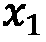。这个过程会重复进行，直到图像仅仅变成随机噪声的图像，。这个过程被称为**正向扩散**。随后，模型开始去噪过程，在这个过程中，DM 接受随机噪声，，并逆转之前的过程（即正向扩散）以重建训练图像。这个过程被称为**反向扩散**。

图 9.1 – 主要生成模型（VAEs、GANs 和 DMs）的训练过程和架构

如*图 9**.1*所示，前向扩散过程是一个**马尔可夫链**。过程的每一步都是一个随机事件，每个事件只依赖于前一个事件或状态。因此，它们形成了一系列随机事件，从而构成了一个马尔可夫链。

DMs 训练过程中的一个关键思想是使用像*U-Net*（[`arxiv.org/abs/1505.04597`](https://arxiv.org/abs/1505.04597)）这样的神经网络来预测添加到给定噪声图像中的噪声量。这对于反转噪声过程并学习如何根据随机噪声生成合成样本至关重要。

在成功训练过程之后，当扩散模型收敛时，我们可以给它添加随机噪声，，然后 DM，通过反向扩散路径，将基于提供的给出一个合成样本。因此，我们现在可以从相同的训练数据概率分布中生成无限数量的新合成样本。

请注意，在噪声/去噪过程中的扩散步骤的数量，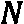，取决于你希望训练过程有多平滑。换句话说，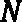的更高值意味着在训练过程中将添加更少突然和更多渐进的噪声。因此，模型的权重将稳步更新，优化损失将平滑下降。然而，的更高值将使过程变慢（通常，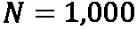）。

## DMs 的应用

DMs 已在计算机视觉、自然语言处理、金融和医疗保健等各个领域的广泛应用中得到利用。让我们简要讨论一些这些应用。

+   **计算机视觉**：

    +   **图像生成**：生成多样化的逼真图像是 DMs 的最终目标之一。然而，多样性和逼真性之间通常存在权衡。因此，为了保持良好的保真度，DMs 通常在文本数据的引导或条件下进行。有关更多信息，请参阅*GLIDE：通过文本引导的扩散模型实现逼真图像生成和编辑*([`arxiv.org/abs/2112.10741`](https://arxiv.org/abs/2112.10741))。正如你可以想象的那样，生成的合成图像可以用于各种应用，包括数据增强、创意艺术、原型设计和可视化。

    +   **视频预测**：预测下一帧有许多有用的应用，因为它有助于预测未来事件，这对于机器人等领域的规划和决策至关重要。同时，它在监控和安全等领域也有巨大的应用。视频预测 ML 模型可以用来预测和预测可能的威胁、危害和潜在风险。此外，准确预测未来帧可以用来生成合成视频，以补充真实训练数据。更多详情，请参阅*扩散模型在视频预测和填充中的应用* ([`arxiv.org/pdf/2206.07696.pdf`](https://arxiv.org/pdf/2206.07696.pdf))、*视频扩散模型* ([`arxiv.org/pdf/2204.03458.pdf`](https://arxiv.org/pdf/2204.03458.pdf))和*Imagen Video：使用扩散模型的超高清视频生成* *模型* ([`arxiv.org/pdf/2210.02303.pdf`](https://arxiv.org/pdf/2210.02303.pdf))。

    +   **图像修复**：这仅仅是填充或恢复图像中缺失或损坏的部分。它在历史存档、隐私保护和娱乐等领域是一个基本任务。此外，它最近也被用于合成数据生成。例如，最近利用 DMs（扩散模型）生成合成脑部 MRI，能够控制肿瘤和非肿瘤组织。研究表明，使用生成的合成数据可以显著提高性能。更多详情，请参阅*使用扩散模型的多任务脑肿瘤修复：方法报告* ([`arxiv.org/ftp/arxiv/papers/2210/2210.12113.pdf`](https://arxiv.org/ftp/arxiv/papers/2210/2210.12113.pdf))和*RePaint：使用去噪扩散概率* *模型* 进行修复 ([`arxiv.org/abs/2201.09865`](https://arxiv.org/abs/2201.09865))。

    +   **图像着色**：这是将灰度图像转换为彩色图像的任务。例如，这对于提高历史或旧照片的逼真度至关重要。添加颜色对于使这些照片更具吸引力并更具情感吸引力很重要。DMs（扩散模型）在此任务中表现出色。更多信息，请阅读*Palette：图像到图像扩散* *模型* ([`arxiv.org/pdf/2111.05826.pdf`](https://arxiv.org/pdf/2111.05826.pdf))。

+   **自然语言处理**：

    +   **文本生成**：虚拟助手、聊天机器人和类似的基于对话的文本系统依赖于文本生成。最近，为了提高质量和多样性，已经利用了 DMs（扩散模型）来完成这项任务，因为它们更能捕捉复杂的分布。例如，请参阅*DiffuSeq：使用扩散模型的序列到序列文本生成* *模型* ([`arxiv.org/abs/2210.08933`](https://arxiv.org/abs/2210.08933))。

    +   **文本到语音合成**：这是将文本转换为音频的过程。虽然它在人机交互（**HCI**）、教育和学习、视频游戏等领域有许多应用，但最近它被用来使文本内容对视力受损者可访问。有关扩散模型和文本到语音合成的更多详细信息，请参阅*Diff-TTS：用于文本到语音的降噪扩散模型* ([`arxiv.org/pdf/2104.01409.pdf`](https://arxiv.org/pdf/2104.01409.pdf))和*Prodiff：用于高质量文本到语音的渐进式快速扩散模型* ([`dl.acm.org/doi/abs/10.1145/3503161.3547855`](https://dl.acm.org/doi/abs/10.1145/3503161.3547855))。此外，关于基于文本到语音扩散模型的近期方法的综述，请参阅*A Survey on Audio Diffusion Models: Text to Speech Synthesis and Enhancement in Generative AI* ([`arxiv.org/pdf/2303.13336.pdf`](https://arxiv.org/pdf/2303.13336.pdf))。

    +   **文本驱动图像生成**：这是另一个有前景的领域，其目标是根据文本输入生成视觉内容，例如图像。它在内容生成、营销、数据增强和辅助数据标注工具等方面有各种应用。正如预期的那样，扩散模型（DMs）在建模复杂数据分布方面表现出色，并且在生成多样化和吸引人的图像方面非常强大。因此，它们被用于文本驱动图像生成。有关更多详细信息，请参阅*Text2Human：文本驱动的可控人类图像生成* ([`dl.acm.org/doi/abs/10.1145/3528223.3530104`](https://dl.acm.org/doi/abs/10.1145/3528223.3530104))。

+   **其他应用**：

    +   **医疗保健中的隐私**：患者的真实**电子健康记录**（**EHRs**）包含丰富且非常有用的信息，这些信息可以被机器学习模型利用，以帮助疾病诊断、预测分析、决策制定以及资源和管理的优化。扩散模型已被证明可以生成高质量和大规模的 EHRs，这些 EHRs 可以在包括机器学习模型训练、医疗保健研究和医学教育在内的巨大应用中发挥作用。要深入了解更多细节，请阅读*MedDiff：使用加速降噪扩散模型生成电子健康记录* ([`arxiv.org/pdf/2302.04355.pdf`](https://arxiv.org/pdf/2302.04355.pdf))。

    +   **异常检测**：这是检测或识别不符合预期行为和分布的模式和实例的任务。它在网络安全、欺诈检测、电信和制造等领域有无数的应用。扩散模型通常对噪声具有鲁棒性且更稳定，这使得它们非常适合这些应用。有关利用扩散模型进行医疗异常检测的示例和更多详细信息，请参阅*Diffusion models for medical anomaly detection* ([`link.springer.com/chapter/10.1007/978-3-031-16452-1_4`](https://link.springer.com/chapter/10.1007/978-3-031-16452-1_4))。

    +   **文本到运动**：从文本输入生成动画或运动在培训、教育、媒体和娱乐领域有许多应用。DMs 通过生成高质量的人体运动动画显示出有希望的结果。更多详情请参阅*Human Motion Diffusion* *模型* ([`arxiv.org/abs/2209.14916`](https://arxiv.org/abs/2209.14916))。

既然我们已经了解了扩散模型应用的一些领域，在下一节中，我们将仔细检查 DMs 的优缺点。

# 扩散模型——优缺点

在本节中，您将了解并检查使用 DMs 进行合成数据生成的主要优缺点。这将帮助您权衡每种合成数据生成方法的优缺点。因此，这将为您选择最适合您自己问题的最佳方法提供智慧。

正如我们在*第七章*中学到的，GANs 在特定应用（如风格迁移和图像到图像翻译）中表现良好，但它们通常很难训练且不稳定。此外，生成的合成样本通常多样性较低且不够逼真。相反，最近的研究表明，基于 DM 的合成数据生成方法在许多基准测试上超过了 GANs。更多详情请参阅*Diffusion Models Beat GANs on Image Synthesis* ([`arxiv.org/pdf/2105.05233.pdf`](https://arxiv.org/pdf/2105.05233.pdf))。像任何其他合成数据生成方法一样，DMs 也有其优缺点。因此，您需要仔细考虑它们对您特定应用或问题的影响。然后，您可以选择最佳方法来生成您想要的合成数据。带着这个目标，我们将检查使用 DMs 的关键优势和劣势。

## 使用 DMs 的优点

通常，DMs 在建模复杂数据概率分布、捕捉时间依赖性和隐藏模式方面表现出色。这是可能的，因为它们使用扩散过程来建模数据分布，使用一系列条件分布。因此，我们可以强调 DMs 的主要优势和优点如下：

+   **泛化能力和广泛适用性**：与其他仅限于图像和视频生成的生成方法不同，DMs 可以用于生成图像、音频、视频、文本、分子结构以及许多其他数据类型和模态

+   **训练过程中的稳定性**：DMs 的架构、训练过程和优化技术使它们比其他生成模型（如 GANs）更稳定

+   **高质量合成数据生成**：由于它们独特的架构和创新性的逐步和迭代训练过程，DMs 生成的高质量合成数据超越了其他生成模型，如 VAEs 和 GANs

## 使用 DMS 的缺点

使用 DMs 的两大主要局限和不足可以从训练和推理过程的计算复杂度以及 DMs 所需的大规模训练数据集来描述：

+   **计算复杂度**：DMs 计算量大。与其他生成模型相比，它们通常较慢，因为正向和反向扩散过程由数百个步骤组成（通常，步骤数，，接近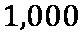）。

+   **需要更多训练数据**：DMs 需要大规模的训练数据集才能收敛。获取此类数据集对于某些领域来说并不合适，这限制了 DMs 在某些应用中的实用性。

现在，我们可以清楚地识别出使用 DMs 进行合成数据生成时的优缺点。让我们练习利用 DMs 生成合成数据以训练机器学习模型。

# 在实践中使用手头的扩散模型

让我们研究一个实际例子，以展示合成数据在计算机视觉领域的实用性。为此，我们将生成和准备我们的数据集，从头开始构建我们的机器学习模型，对其进行训练，并评估其性能。数据集可在 *Kaggle* 上找到（[`www.kaggle.com/datasets/abdulrahmankerim/crash-car-image-hybrid-dataset-ccih`](https://www.kaggle.com/datasets/abdulrahmankerim/crash-car-image-hybrid-dataset-ccih)）。完整的代码、训练好的模型和结果可在 GitHub 上找到，位于书籍仓库中相应章节的文件夹下。

## 上下文

我们希望构建一个机器学习模型，能够将汽车图像分类为两个不同的类别——描绘交通事故的图像和那些不描绘交通事故的图像。正如你可以想象的那样，精心制作这样一个真实的数据集既耗时又容易出错。收集没有事故的汽车图像可能很容易。然而，收集发生事故、碰撞、火灾和其他危险场景的汽车图像则极为困难。为了解决这个问题并证明合成数据的实用性，让我们首先生成我们的训练数据集。为此，我们可以使用单一合成数据生成方法。然而，让我们结合不同的方法和工具来收集更多样化的数据，并实践不同的方法。在这个例子中，我们将使用以下方法：

+   DALL·E 2 图像生成器

+   DeepAI 文本到图像生成器

+   使用游戏引擎（如 Silver）构建的模拟器

## 数据集

首先，让我们利用最近生成的模型（如 *DALL·E 2* [`openai.com/dall-e-2`](https://openai.com/dall-e-2)）的显著能力来生成一些交通事故图像。

图 9.2 – 使用 DALL·E 2 网络应用程序生成合成图像

我们可以使用以下提示简单地生成这些图像（参见 *图 9.2*）：

+   `交通事故`

+   `白色` `交通事故`

+   `红色` `交通事故`

+   `蓝色` `交通事故`

+   `救护车` `交通事故`

如您从 *图 9.3* 中所见，生成的图像看起来非常逼真且多样化，这正是我们训练我们的机器学习模型所需要的。

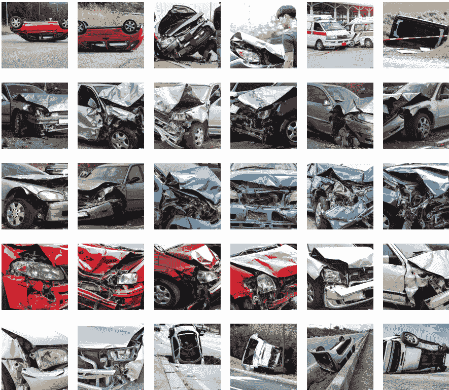

图 9.3 – 使用 DALL·E 2 生成的汽车事故图像

我们还使用从 *car-accident(resnet)* 数据集中收集的图像，该数据集获得 CC BY 4.0 许可（[`universe.roboflow.com/resnet-car-accident/car-accident-resnet-n7jei`](https://universe.roboflow.com/resnet-car-accident/car-accident-resnet-n7jei)），使用 Roboflow ([`roboflow.com`](https://roboflow.com)）。我们选择这个数据集，因为图像与从视频游戏（如 *BeamNG Drive Crashes* [`www.beamng.com/game`](https://www.beamng.com/game)）中获取的图像相似。我们将将这些图像添加到我们的数据集中，以进一步提高其多样性。这些图像的样本在 *图 9.4* 中展示。

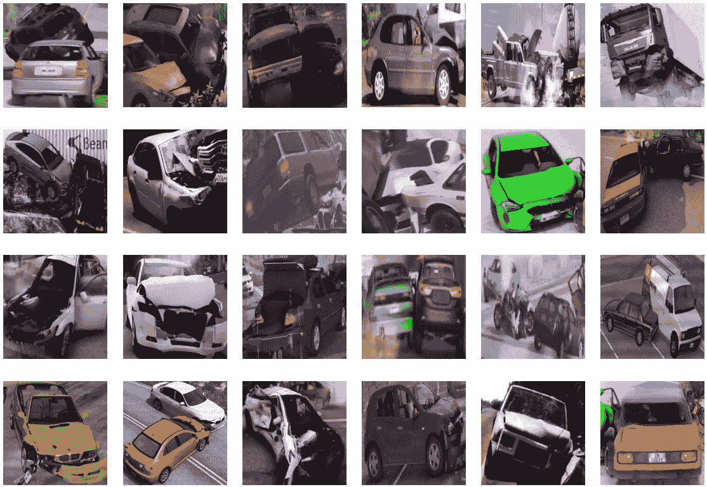

图 9.4 – 从视频游戏中收集的汽车事故图像

然后，我们需要为其他类别生成类似的图像，即无事故的汽车图像。这次，让我们使用 *DeepAI* 工具生成这些图像。与之前一样，我们可以简单地使用以下提示来获取所需的图像：

+   `雨中的汽车`

+   `白色汽车`

+   `雾中的汽车`

+   `蓝色汽车`

正如我们在 *图 9.5* 中所见，我们轻松地获得了另外 30 张无事故的汽车图像。

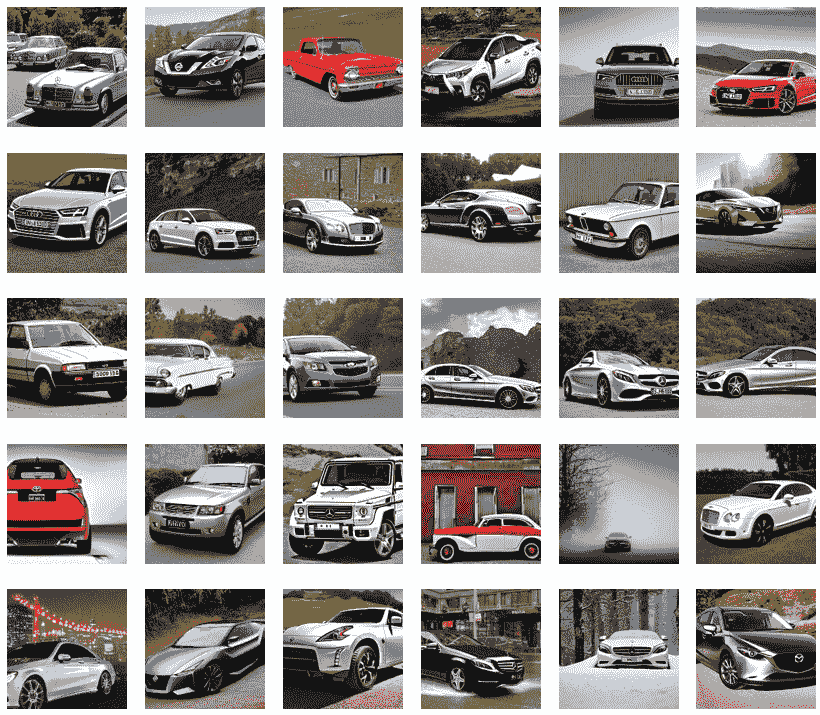

图 9.5 – 使用 DeepAI 生成的完整汽车图像

现在，我们有 60 张合成图像，但我们仍然需要更多图像来适当地训练我们的机器学习模型。我们可以使用之前的生成模型生成任意数量的图像，但让我们探索另一种方法 – 使用 *Silver* 模拟器 ([`github.com/lsmcolab/Silver`](https://github.com/lsmcolab/Silver))。

通过指定我们想要的图像数量，我们可以为这个类别生成以下图像（*图 9.6*）。

图 9.6 – 使用 Silver 生成的完整汽车图像

到目前为止，我们已经收集了 `600` 张合成图像。现在，为了评估我们训练的模型性能，我们应该在真实汽车图像上对其进行测试。让我们使用 *Unsplash* 网站收集真实图像（[`unsplash.com`](https://unsplash.com)）。为了进一步提高我们的数据集，我们还可以使用 Roboflow 手动添加图像。*图 9.7* 展示了这些图像的样本。

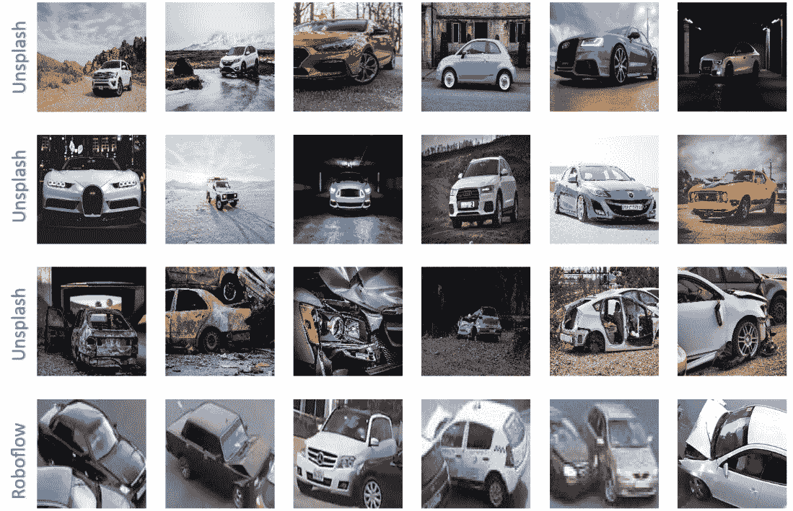

图 9.7 – 我们真实数据集的样本图像

最后，我们的数据集由 `600` 张合成图像和 `250` 张真实图像组成，如 *表 9.1* 所示。

| **分割** | **合成** | **真实** |
| --- | --- | --- |
| 训练 | 540 | - |
| 验证 | 60 | 62 |
| 测试 | - | 188 |
| 总计 | 600 | 250 |

表 9.1 – 我们最终数据集的分割和图像数量

注意，我们将在合成数据上训练，并在真实数据上测试。此外，注意在验证分割中，我们使用了合成和真实数据，因为我们正在两个不同的领域（合成和真实）进行训练和测试。因此，需要从这两个领域的数据中取得平衡混合，以便更好地理解我们的模型对合成数据的理解和泛化到真实领域的能力。

## 机器学习模型

我们的机器学习模型由四个卷积层和三个全连接层、最大池化、dropout 和批量归一化组成。我们将使用书中 GitHub 仓库相应章节文件夹中的`train.py`文件。

## 培训

我们在图 9.1 所示的训练分割上从头开始训练我们的模型`30`个 epoch。然后，我们将使用验证分割选择最佳模型。训练损失如图 9.8 所示。损失值如预期的那样平滑下降，这意味着我们的模型在我们的合成训练数据集上训练得很好。

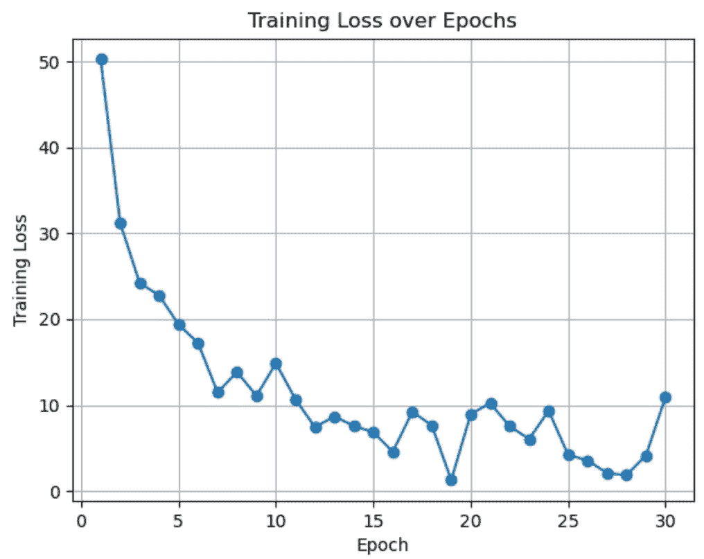

图 9.8 – 训练阶段的训练损失

从图 9.9 所示的验证准确率中，我们可以看到我们的模型在第 27 个 epoch 时在验证集上取得了最佳结果。因此，我们将使用这个模型进行测试。

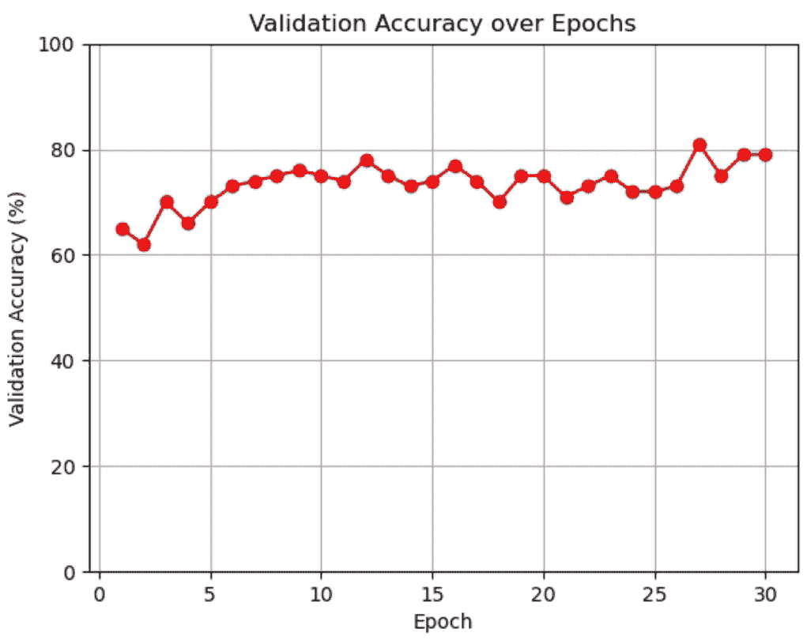

图 9.9 – 训练阶段的验证准确率

## 测试

让我们看看我们的最佳模型在测试集上的表现。如图 9.10 所示的混淆矩阵所示，我们的模型以 84%的准确率对无事故车辆进行分类，而以 74%的准确率对事故进行分类。我们的模型的总准确率为 80%，考虑到我们的模型仅使用合成数据进行训练，这是一个非常出色的成绩。

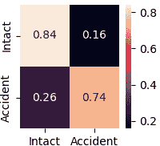

图 9.10 – 展示分类结果的混淆矩阵

我们提供了一个详细的示例，说明如何生成和利用合成数据来训练机器学习模型。现在，让我们深入了解数据生成模型（DMs）及其主要伦理问题。

# 扩散模型 – 伦理问题

在本节中，你将了解与使用 DMs 进行合成数据生成相关的伦理问题。

基于扩散的生成模型是新兴且强大的技术。因此，它们的优缺点需要仔细考虑。它们对商业、工业和研究具有巨大的优势。然而，它们具有可能被利用来对个人、企业、社会等造成伤害的危险能力。

让我们列出通常与生成模型，尤其是 DMs 相关的伦理问题：

+   版权

+   偏差

+   不适当的内容

+   责任问题

+   隐私问题

+   欺诈和身份盗窃

现在，让我们深入了解使用 DMs 实践中的一些主要伦理问题。

## 版权

DMs 通常在大规模真实数据集上进行训练。例如，DALL E 2 在超过 6.5 亿个文本-图像对上进行了训练。因此，从这些数据样本的所有者，如图像、艺术品、视频片段等，那里获得许可是不切实际的。此外，DMs 可能会通过细微的修改来错误地表示或表示受版权和知识产权保护的内容。例如，*环球音乐*要求流媒体服务和公司阻止 AI/ML 公司访问他们的歌曲进行训练（[`www.billboard.com/pro/universal-music-asks-spotify-apple-stop-ai-access-songs`](https://www.billboard.com/pro/universal-music-asks-spotify-apple-stop-ai-access-songs)）。因此，这给监管机构解决和公司遵守的法规带来了许多难题。考虑到这一领域的巨大、快速进步，法规可能无法提供一个道德框架来控制版权问题。

## 偏见

正如我们在本章中概述的那样，DMs 学习生成与训练数据具有相同分布的合成数据。因此，如果训练数据存在偏见，DM 也会生成偏见的合成数据。与检查原始训练数据（如图像和视频）相比，评估这种偏见更为困难。当这些模型被非专家用于决策时，问题变得更加复杂和严重。例如，一位专业漫画艺术家可能能在漫画书中识别出性别、政治和年龄偏见。然而，在数百万本漫画书上训练 DM，然后使用该模型评估生成的漫画书的偏见可能是不可能的！

## 不适当的内容

DMs 可能在未经用户同意的情况下生成不适当的内容。这可能包括不适当的语言、色情和暴力内容、仇恨言论和种族主义。因此，DMs 需要利用有效的过滤机制来丢弃不合适的数据。同时，他们需要利用保护程序来防止生成不适当的内容。

## 责任

在未来，利用如 DMs（决策模型）等生成模型进行决策几乎不可避免。然而，使用当前的 DMs，我们无法理解为什么做出了某个特定的决策。因此，理解谁应对 DMs 做出的可能导致死亡、伤害或财产损失的错误决策负责是具有挑战性的。因此，我们需要开发合适的机制来确保决策过程中的透明度、问责制和追踪。

## 隐私

由于生成的合成数据仍然遵循原始真实训练数据的统计特性，DMs 可能会泄露关于个人和组织的敏感信息。这些模型可能会披露第三方可能利用的信息，造成损害、损失或不良后果。例如，由于隐私问题，ChatGPT 在意大利被禁止使用。

## 欺诈和身份盗窃

生成式模型（DMs）功能强大，能够模仿人类的声音、照片和视频。因此，生成的虚假媒体可以用于许多欺诈目的，例如获取个人信息、洗钱、信用卡欺诈和网络犯罪。此外，DMs 还可以用来冒充名人、活动家或政治家，以获取私人信息、机密材料和文件。

# 摘要

在本章中，我们介绍了一种新颖且强大的生成合成数据的方法——使用 DMs。我们比较了 DMs 与其他最先进的生成模型，然后强调了 DMs 的训练过程。此外，我们讨论了利用 DMs 的优缺点。此外，我们学习了如何在实践中生成和利用合成数据。我们还考察了在部署 DMs 进行合成数据生成时通常提出的主要伦理考量。您对生成模型有了全面的理解，并学习了标准 DM 架构、训练过程以及在实际应用中利用 DMs 的主要优势、益处和局限性。在下一章中，我们将探讨几个案例研究，突出合成数据如何成功应用于实践中改善计算机视觉解决方案。本章旨在激发和激励您探索合成数据在您自己的应用中的潜力。

# 第四部分：案例研究和最佳实践

在本部分，您将了解机器学习领域三个前沿领域的丰富多样的案例研究：**计算机视觉**（CV）、**自然语言处理**（NLP）和**预测分析**（PA）。您将理解在这些领域中采用合成数据的益处，并识别主要挑战和问题。随后，您将学习提高合成数据在实际应用中可用性的最佳实践。

本部分包含以下章节：

+   *第十章*，*案例研究 1 – 计算机视觉*

+   *第十一章*，*案例研究 2 – 自然语言处理*

+   *第十二章*，*案例研究 3 – 预测分析*

+   *第十三章*，*应用合成数据的最佳实践*
