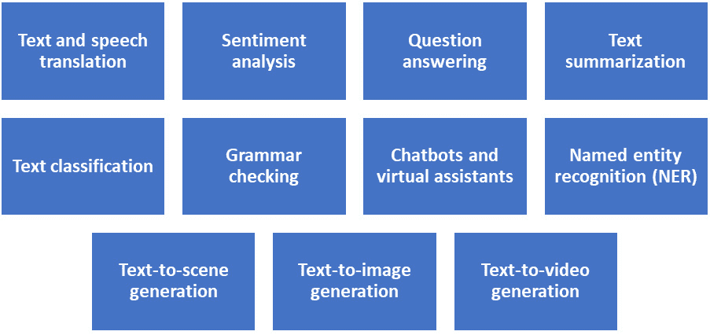

# 第十一章：案例研究 2 – 自然语言处理

本章向您介绍**自然语言处理**（**NLP**），其中合成数据是关键角色。您将探索 NLP 模型的多种应用。此外，您将了解为什么这些模型通常需要大规模训练数据集才能收敛并在实践中表现良好。同时，您将理解为什么合成数据是 NLP 的未来。讨论将基于一个实际、动手的示例，以及来自研究和行业领域的许多有趣的案例研究。

在本章中，我们将涵盖以下主要主题：

+   NLP 简介

+   NLP 中大规模训练数据集的需求

+   使用 ChatGPT 的动手实践示例

+   合成数据作为 NLP 问题的解决方案

# NLP 简介

NLP 是一个跨学科领域，结合了计算机科学、机器学习和语言学。它使计算机能够理解、分析和响应用户的自然语言文本，无论是书面还是口头。NLP 领域正在因许多原因而不断发展，包括大数据的可用性和强大的计算资源，如**图形****处理单元**（**GPUs**）和**张量处理单元**（**TPUs**）。最先进的 NLP 模型示例包括 *BERT: 用于语言理解的深度双向变换器预训练* ([`arxiv.org/abs/1810.04805`](https://arxiv.org/abs/1810.04805))、*ChatGPT* ([`openai.com/blog/ChatGPT`](https://openai.com/blog/ChatGPT)) 和 *Google Bard* ([`bard.google.com`](https://bard.google.com))。接下来，让我们探讨一些 NLP 模型在实践中的关键应用。

## NLP 在实践中的应用

NLP 模型的一些常见应用在 *图 11.1* 中展示。 

图 11.1 – NLP 模型在实践中的关键应用样本

现在我们将更详细地讨论一些这些应用。

### 文本和语音翻译

这是将文本或语音从一种语言翻译成另一种语言的任务。通常，一个大规模的文本语料库，由大量从一种语言翻译成另一种语言的句子组成，用于训练此类模型。*Google Translate* ([`translate.google.co.uk`](https://translate.google.co.uk))、*Microsoft Translator* ([`translator.microsoft.com`](https://translator.microsoft.com)) 和 *iTranslate* ([`itranslate.com`](https://itranslate.com)) 都是通用翻译 NLP 模型的例子。还有一些特定于领域或行业的基于 NLP 的翻译器，例如 *Lingua Custodia* ([`www.linguacustodia.finance`](https://www.linguacustodia.finance)) 和 *Trados* ([`www.trados.com`](https://www.trados.com))，它们更专注于金融领域。

### 情感分析

这是 NLP 领域的一项主要任务。它的目标是根据文本中嵌入的情感或情绪来分析和分类文本。它通常被公司用来理解客户反馈，评估他们的服务，并识别问题。例如，它通常被用来将商品或服务的客户评论分类为*正面*、*负面*或*中性*。此外，它还常用于识别文本中的情感，如愤怒、悲伤、不满、挫败和快乐。例如，*Medallia 文本分析*利用 NLP 提供市场趋势和客户对服务和产品的反馈及评论的快速总结。更多详情，请参阅 Medallia 文本分析网站 ([`www.medallia.com/resource/text-analytics-solution-brochure`](https://www.medallia.com/resource/text-analytics-solution-brochure))。此外，对于使用情感分析的实际案例的最新例子，请参阅*使用航空公司乘客评论的情感分析识别意见趋势* ([`doi.org/10.1016/j.jairtraman.2022.102232`](https://doi.org/10.1016/j.jairtraman.2022.102232)) 和 *社交媒体推文的情感分析和意见挖掘的新方法* ([`link.springer.com/chapter/10.1007/978-981-19-2358-6_15`](https://link.springer.com/chapter/10.1007/978-981-19-2358-6_15))。

### 文本摘要

这是一项以人类方式生成文本或文档摘要的任务，通过捕捉本质或要点。这是一个复杂的过程，因为 NLP 模型需要学习如何关注文本的精华部分，这是一个依赖于上下文的任务。然而，NLP 模型最近在这个领域取得了显著的进步。有许多 NLP 模型可以总结大量文本的例子，例如*plnia 文本摘要 API* ([`www.plnia.com/products/text-summarization-api`](https://www.plnia.com/products/text-summarization-api)) 和 *NLP Cloud 的摘要 API* ([`nlpcloud.com/nlp-text-summarization-api.xhtml`](https://nlpcloud.com/nlp-text-summarization-api.xhtml))。

### 测试到场景生成

这是一项依赖 NLP 的另一个基本任务。它的目标是根据描述性文本输入生成虚拟场景。它在游戏开发、元宇宙、广告和教育等领域有许多有趣的应用。文本到场景生成的主要优势之一是它允许用户在没有计算机图形、游戏开发和编程背景的情况下生成多样化和逼真的场景。文本到场景方法通常基于 GANs、VAEs、扩散模型和 Transformers。更多信息，请参阅*Text2NeRF：基于神经辐射场的文本驱动 3D 场景生成*([`arxiv.org/pdf/2305.11588.pdf`](https://arxiv.org/pdf/2305.11588.pdf))和*SceneSeer：使用自然语言进行 3D 场景设计*([`arxiv.org/pdf/1703.00050.pdf`](https://arxiv.org/pdf/1703.00050.pdf))。

### 文本到图像生成

在这个任务中，NLP 模型根据用户提供的文本描述生成图像。在这个任务中，模型的目标是创建受文本输入控制的视觉表示。从文本生成图像的任务有许多吸引人的应用，如数据增强、内容生成、电子商务和广告。您可以以*DALL-E2*([`openai.com/product/dall-e-2`](https://openai.com/product/dall-e-2))和*Stable Diffusion*([`stablediffusionweb.com`](https://stablediffusionweb.com))为例。它们可以根据描述性文本生成逼真的图像。

在下一节中，我们将了解为什么我们需要大规模数据集才能成功训练 NLP 模型。

# NLP 中大规模训练数据集的需求

NLP 模型需要在实践中表现良好，需要大规模的训练数据集。在本节中，您将了解为什么 NLP 模型需要大量的训练数据才能收敛。

通用机器学习模型在实践中需要大量的训练样本。与其它机器学习领域相比，NLP 模型需要更多的训练数据。这有很多原因。接下来，让我们讨论主要原因，如下：

+   人类语言复杂性

+   上下文依赖

+   泛化

## 人类语言复杂性

最近的研究表明，我们大脑中很大一部分用于语言理解。同时，了解不同的脑区在阅读、写作或进行其他与语言相关的活动时如何相互沟通仍然是一个研究问题。更多信息，请参阅*关于听到的言语、口语和阅读的前 20 年 PET 和 fMRI 研究的综述和综合* ([`doi.org/10.1016/j.neuroimage.2012.04.062`](https://doi.org/10.1016/j.neuroimage.2012.04.062))。此外，婴儿的基本语音和视觉功能在 8 到 12 个月大时就已经形成。然而，他们需要几年时间才能适当地使用口头或书面交流。因此，语言处理不仅对计算机来说是困难的，对人类也是如此。使这个问题对机器来说更加困难的是需要学习语法、表达和隐喻。因此，NLP 模型需要大量的训练数据来学习这些隐藏的规则和模式。

## 上下文依赖性

尽管大多数机器学习（ML）任务仍然是上下文相关的，例如计算机视觉，但在自然语言处理（NLP）问题中，上下文依赖性更为严重和强烈。例如，一个句子的意义可以根据说话者的语调从陈述句变为疑问句。单词的顺序以及前后的几句话也可能改变意义并暗示不同的解释。即使是相同的单词有时也会根据上下文有不同的含义。例如，“light”可以用作名词表示“照明”或用作形容词表示“轻微的重量”。因此，为了掌握这些场景，NLP 模型需要在包含足够示例以涵盖这些上下文的多样化数据集上进行训练。

## 泛化

另一个使得自然语言处理（NLP）任务变得更加困难的因素是语言、方言和变体的数量庞大。例如，英国英语在某些方面与美国英语不同。它不仅在拼写上不同，而且在所使用的单词、习语和表达方式上也有所不同。即使在同一国家的同一种语言中，不同城市的人们也会使用不同的方言。为了使 NLP 模型具有实用性和有效性，它们应该适应这些大多数变化。因此，通常需要大规模的训练数据来捕捉这些变化。

在下一节中，我们将学习如何为 NLP 的一个实际例子生成合成数据。

# 使用 ChatGPT 的动手实践示例

让我们设想我们想要训练一个 NLP 模型来识别关于机器学习（ML）书籍的正面和负面评论。我们将使用**ChatGPT** ([`chat.openai.com`](https://chat.openai.com))来生成正面和负面评论的列表。然后，我们将部署这些评论来增强我们的真实训练数据集。

要获得 10 条正面评论，我们可以简单地使用以下提示：`给我 10 条关于机器学习书籍的好评`。ChatGPT 将生成以下评论：

+   《精通机器学习》是一本适合初学者和资深专业人士的杰出书籍。作者的清晰简洁的解释使得复杂的概念变得容易掌握，确保了任何进入机器学习世界的人都能打下坚实的基础。

+   这本书在理论与实践实施之间取得了完美的平衡。动手练习和现实世界案例提供了宝贵的见解，使其成为任何希望在其项目中应用机器学习的人不可或缺的资源。

+   我赞赏作者涵盖了广泛的机器学习算法和技术，超越了常规的怀疑对象。这是一本全面的指南，真正为读者提供了应对各种机器学习挑战所需的知识。

+   作者的写作风格引人入胜且易于接近，感觉像是一位友好的导师在引导你通过机器学习之旅。复杂的话题被分解成可管理的部分，使学习过程变得愉快。

+   这本书强调理解机器学习算法背后的数学，使其与其他书籍区别开来。它建立了坚实的数学基础，而没有让读者感到压倒，这对于有志于成为机器学习实践者的人来说至关重要。

+   这本书的代码示例有良好的文档记录，易于复制。实践练习是巩固学习和以动手方式实验机器学习概念的绝佳方式。

+   这本书的一个亮点是它关于模型选择和超参数调整的实用建议。这些见解节省了时间，并有助于避免机器学习项目中常见的陷阱。

+   作为一名非技术背景的人，我发现这本书非常易于理解。作者花时间以任何人都能够理解的方式解释了甚至是最复杂的概念。

+   这本书紧跟机器学习领域的最新趋势和进步。它涵盖了最近的突破和当代应用，使其成为一个相关且前瞻的资源。

+   这本书是渴望成为数据科学家和机器学习爱好者的真正瑰宝。它不仅教授机器学习技术，还传授解决问题的思维方式，使读者能够自信地应对现实世界的数据挑战。

同样，为了获得负面评价，我们可能使用“给我 10 条关于机器学习书籍的负面评价”的提示。我们得到了以下负面评价：

+   这本书让我大失所望。解释复杂难懂，作者似乎更感兴趣于展示他们的知识，而不是帮助读者理解概念。在整个阅读过程中，我都感到迷茫。

+   这本书声称是为初学者而写，但它假设了我在先前的知识水平，而这正是我所缺乏的。缺乏清晰的解释和实践示例，使我几乎无法跟上。

+   我在提供的代码示例中发现了许多错误。当我本应学习时，花费数小时尝试调试示例令人沮丧。粗心的编辑和糟糕的代码质量是主要的缺点。

+   由于机器学习领域的快速发展，这本书的内容感觉已经过时。我原本期待学习前沿技术，但结果却只是重复了网上容易找到的旧材料。

+   这本书开头很有希望，但很快变得过于技术化，难以消化。作者似乎假设读者拥有数学博士学位，这使得没有高级背景的人难以理解。

+   我本期待看到实用的练习，但本书中的练习解释和执行都做得不好。缺乏逐步指导使得无法有效地应用这些概念。

+   这本书的组织结构混乱，在主题之间跳跃，没有任何清晰的进展。这让我感到困惑，难以在章节之间建立联系。

+   提供的例子不切实际，并不能反映现实世界的场景。我很难将概念与实际应用联系起来，这违背了最初学习机器学习的目的。

+   这本书承诺将提供全面的内容，但在关键领域如神经网络和深度学习方面却缺乏深度。我原本希望获得全面的理解，但结果却发现内容中存在巨大的空白。

+   写作风格枯燥乏味，使得读者难以保持对主题的兴趣。我在本应令人兴奋的机器学习世界中的主题上打起了瞌睡。

这些正面和负面的合成评论可以用来增强我们的训练数据集。正如您所看到的，生成无限数量的训练样本来增强和补充我们的训练数据非常简单。生成的样本多样化、相关、准确、详细且结构化。因此，将这些样本包含在我们的训练数据集中可以提高我们的 NLP 模型性能。

接下来，让我们深入探讨在工业界使用 NLP 模型的三个实际例子。

# 合成数据作为解决 NLP 问题的方案

在本节中，您将了解公司如何利用合成数据作为解决其基于自然语言处理（NLP）问题的方案。我们将探讨四个案例研究：

+   SYSTRAN Soft 的合成数据应用

+   Telefónica 的合成数据应用

+   利用合成数据进行临床文本挖掘

+   亚马逊虚拟助手模型

## SYSTRAN Soft 的合成数据应用

**神经机器翻译（NMT**）是 NLP 中一个有前景的方法。它利用神经网络来学习统计模型，从而执行翻译任务。典型的架构由编码器-解码器组成，通常在大规模训练数据集上训练。这些模型在实践中被证明取得了优异的结果。然而，它们也有一些局限性，正如我们在 SYSTRAN 案例研究中将看到的。

SYSTRAN 是机器翻译技术领域的少数先驱公司之一([`www.systransoft.com`](https://www.systransoft.com))。虽然他们的标准和传统 NLP 模型实现了最先进的结果，但在两种主要场景下遇到了挑战：翻译长句和翻译短标题，例如新闻文章的标题。为了解决这些问题，他们探索了通过为该目的特别生成的合成数据来增强他们的真实训练数据。他们能够解决这些问题并提高整体性能。更多信息，请参阅*SYSTRAN 纯神经机器翻译*系统([`blog.systransoft.com/wp-content/uploads/2016/10/SystranNMTReport.pdf`](https://blog.systransoft.com/wp-content/uploads/2016/10/SystranNMTReport.pdf))。

## 泰尔斐卡公司对合成数据的利用

在电信行业，收集有关客户的数据以分析他们的需求、识别问题并定制提供的服务是至关重要的。这有助于这些公司建立更强的声誉，从而在市场上更加成功。问题通常不是数据可用性，而是限制利用客户数据来训练 NLP 或 ML 模型的一般规定。

泰尔斐卡公司部署了一个优雅的解决方案来解决这些问题。他们使用了*MOSTLY AI*合成数据平台，从原始客户数据集*泰尔斐卡 CRM 数据集市*中合成一个新的数据集。新生成的合成数据现在符合 GDPR 的要求，因为它不包含任何关于客户的真实信息。同时，合成数据集具有与原始真实数据集中可见的模式、相关性和统计特性。因此，它可以作为真实数据集的副本来训练 NLP 模型。这使得公司能够使用高达 85%的客户数据，这在基于真实数据的 NLP 模型中是不可能的。

## 利用合成数据进行临床文本挖掘

最近，莱斯大学和德克萨斯 A&M 大学的研究人员以及其他合作者进行的一项研究，调查了合成数据生成模型（如 ChatGPT）在临床文本挖掘中的可用性。他们的目标是利用**大型语言模型**（**LLMs**）来帮助进行临床文本挖掘。他们将 LLMs 部署以从非结构化的医疗健康文本数据中识别生物命名实体。他们有趣地发现，直接针对这项任务在真实数据上训练的 ChatGPT 并没有达到令人满意的表现。开发合成数据生成管道并生成必要的合成数据显著提高了他们模型的表现。F1 分数从 23.37%提高到 63.99%，这是一个显著的增长。此外，他们强调，与基于真实数据的模型相比，他们基于合成数据的模型现在更好地解决并减轻了隐私问题。更多信息，请参阅*LLMs 的合成数据生成对临床文本挖掘有何帮助*（[`arxiv.org/pdf/2303.04360.pdf`](https://arxiv.org/pdf/2303.04360.pdf)）。

## Alexa 虚拟助手模型

虚拟助手模型，如亚马逊的 Alexa、苹果的 Siri 和谷歌的 Google Assistant，正成为我们现代生活的重要组成部分。它们提供了巨大的服务，例如订购产品、控制家用电器和语音搜索。为了使这些工具对更广泛的受众有益，它们需要支持许多语言和方言，这需要大规模的训练数据集。

亚马逊在推出针对三种新语言（印地语、美国西班牙语和巴西葡萄牙语）的模型时，Alexa 虚拟助手遇到的主要问题之一是真实训练数据的稀缺。作为解决方案，亚马逊利用可用的有限真实数据创建“模板”。然后，他们将模板部署以生成补充和增强真实数据的合成数据。例如，他们利用这些语言中可用的真实数据来学习这些语言的必要语法和句法。然后，他们利用训练好的模型生成一个足够大的合成训练数据集，该数据集包含遵循这些语言语法和句法的创新句子。这个基于合成数据的优雅解决方案帮助亚马逊减轻了真实数据不足的问题，从而帮助公司为更广泛的受众提供更准确的虚拟助手，并具有更好的性能。因此，亚马逊成功获得了更多订单和更高的盈利能力。更多信息，请参阅*生成合成数据的工具帮助 Alexa 的新语言发布*（[`www.amazon.science/blog/tools-for-generating-synthetic-data-helped-bootstrap-alexas-new-language-releases`](https://www.amazon.science/blog/tools-for-generating-synthetic-data-helped-bootstrap-alexas-new-language-releases)）。

# 摘要

在本章中，我们介绍了自然语言处理（NLP）模型，并探讨了这些模型在实际应用中的主要用途。此外，我们还了解到 NLP 模型需要大规模数据集。然后，我们详细讨论了这一需求的主要原因。在此之后，我们研究了几个行业和研究领域的例子，其中合成数据被成功部署。在下一章中，我们将深入探讨另一组有趣的案例研究，其中合成数据在预测分析领域得到了成功应用。
