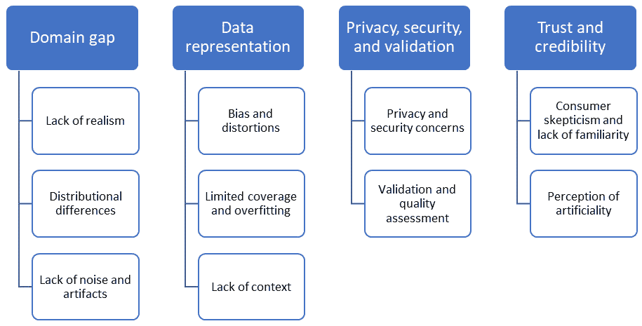

# 第十三章：应用合成数据的最佳实践

合成数据确实具有许多优势，并且最近在各个领域和应用程序中得到了成功和广泛的应用。然而，许多普遍问题限制了合成数据的可用性。在本章中，你将了解这些问题，这些问题是合成数据的瓶颈。然后，我们将深入探讨与领域相关的问题，这些问题使得部署合成数据更具挑战性。你将在医疗保健、金融和自动驾驶汽车等各个领域探索这些问题。随后，你将了解到一套优秀的良好实践，这些实践可以提高合成数据在实际应用中的可用性。

在本章中，我们将涵盖以下主要主题：

+   揭示生成和利用合成数据所面临的挑战

+   限制合成数据可用性的领域特定问题

+   有效利用合成数据的最佳实践

# 揭示生成和利用合成数据所面临的挑战

在本节中，你将了解不同领域通常看到的主要常见问题，这些问题限制了合成数据的好处和可用性。

我们可以将这些限制因素大致分为四个主要类别：

+   领域差距

+   数据表示

+   隐私、安全和验证

+   信任和可信度

它们可以表示如图 *图 13.1* 所示：

图 13.1 – 限制合成数据在实际应用中可用性的主要因素

接下来，让我们更详细地探讨这些类别的每一个。

## 领域差距

虽然神经网络在从大型数据集中学习隐藏模式、相关性和结构方面非常成功，但它们可能会遭受领域差距问题。**领域差距**通常指的是源领域和目标领域数据之间的差异。源领域指的是训练数据所在的领域，在该领域上训练了机器学习（ML）模型。另一方面，目标领域指的是模型将要被测试、评估或实际应用的领域。

在许多场景中，你可能在某个数据集上取得优异的结果，但在另一个数据集上却表现出令人不满意的表现。这两个数据集可以是真实的、合成的，或者两者的混合。然而，我们在这里关注的是合成源领域和真实目标领域，因为这通常是主要且最常见的情况。在大型合成数据集上训练你的机器学习（ML）模型并在合成领域取得优异性能，并不一定保证在真实数据集上也能取得相同的表现。因此，通常建议你在目标领域收集的数据集上验证你的 ML 模型。

现在，让我们深入探讨合成领域和真实领域之间领域差距的主要原因。一般来说，我们可以识别以下主要因素：

+   缺乏现实性

+   分布差异

+   缺乏噪声和伪影

### 缺乏现实感

使用模拟器、游戏引擎或生成模型可能会生成吸引人且半真实的合成数据，但并非完全真实的数据。合成数据生成器无法捕捉复杂真实世界的所有细节。对于机器学习模型来说，没有必要在捕捉所有真实世界细微差别的数据上训练。然而，它需要在捕捉和反映基本和辅助任务相关细节的合成数据上训练。承认这两种场景之间的实质性差异至关重要。此外，确定与你的机器学习任务相关的内容可能不是一个简单的过程。因此，一般来说，如果你没有在足够真实的数据上训练你的机器学习模型，你最终会在你的训练数据和现实世界之间出现领域差距。因此，你的模型在实际应用中可能表现不佳。

### 分布差异

深度学习（**DL**）和机器学习模型的训练过程本质上是学习如何建立输入特征和输出标签之间的关联。换句话说，对于分类问题，机器学习模型学习将像素颜色和位置中的某些模式与目标类别标签联系起来。因此，当机器学习模型接收到一张新图像时，它可能会根据在训练阶段学习的模式正确地对其进行分类。正如你所看到的，有一个明确的假设，即源域和目标域之间的数据分布是相同的或彼此非常接近。如果合成数据的分布与真实数据不够接近，这将使得从合成数据中学习到的关联、模式和相关性不适用于真实数据。

为了演示，让我们设想一个能够捕捉主要思想的场景，尽管它可能并不完全反映现实。如果你训练你的机器学习模型在从《*宠物大机密*》动画电影收集的合成标记图像上执行猫狗分类任务，你不会期望你的模型在真实数据上表现良好，因为存在分布差异问题。例如，电影中猫和狗的尺寸、颜色、变化和场景中其他对象的密度可能与真实数据集中的不完全匹配，尽管它们可能看起来部分真实。重要的是要认识到，这里的问题不是照片的真实性，而是分布差异。

### 缺乏噪声和伪影

尽管可以通过生成合成数据来近似或表示真实数据，但通常对复杂真实世界数据的噪声和伪影（异常和不完美）进行建模极具挑战性。现实世界充满了不完美、异常、噪声和伪影。这有多种原因，例如随机事件的发生、复杂过程中的相互作用和涌现，传感器和测量程序的限制和错误，甚至由于人为干预而产生的错误。因此，合成数据可能成功地呈现分布的中心部分，但它可能无法捕捉到异常、离群值和伪影。因此，当机器学习模型在训练过程中没有观察到这些场景时，它将在遇到现实世界中的类似情况时直接失败。

关于如何弥合合成域和真实域之间差距的更多详细信息，请参阅*第十四章*。

现在让我们探索下一个主要类别，该类别限制了合成数据的可用性。

## 数据表示

训练数据通常被收集或生成，以作为现实世界的代理。在这个过程中，人的因素始终存在。因此，在某种程度上，我们的决策、假设和偏见会明确或隐性地反映在我们选择如何表示现实世界以供机器学习模型使用的方式中。尽管在真实数据中这也是一个问题，但在合成数据中，它更为重要和复杂，正如我们接下来将要看到的。

### 偏差和扭曲

如我们所知，生成合成数据的主要方法之一是使用生成模型，这些模型是在真实数据上训练的（更多详细信息，请参阅*第七章*）。如果生成模型是在有偏差和扭曲的真实数据上训练的，它也会生成有偏差的数据。然后，当机器学习模型在这组数据上训练时，决策也将是有偏差的。因此，在我们生成合成数据时，彻底理解和关注我们的决策方法论和假设的质量和程序非常重要。

### 覆盖范围有限和过度拟合

在这一类别下的第二个主要问题是合成数据的多样性。想象一下，你想使用游戏引擎来生成合成数据，为语义分割问题构建一个 3D 虚拟世界。为了使你的合成数据有用，你需要多样化场景元素，如 3D 模型、材料、纹理、光照和相机参数。否则，你的机器学习模型将过度拟合到少数几种变化，并在真实数据测试时无法很好地泛化。需要注意的是，多样化这些场景元素需要购买或设计更多的 3D 资产，更多的劳动和努力，更多的预算支出，以及更多的工程师、设计师和程序员。

### 缺乏上下文

与由现实世界过程生成的真实数据不同，合成数据是通过算法或系统人工生成的。因此，它缺乏对于学习所考虑的现象或任务可能至关重要的上下文信息。

例如，假设我们创建了一个用于生成猫狗分类问题合成数据的系统。确实，我们可以在各种属性下生成成千上万的有标签的猫和狗图像，例如光照条件、背景和天气条件。然而，用合成数据捕捉到的至关重要的信息是上下文——换句话说，狗和猫通常在现实世界中何时、何地以及如何出现。例如，我们通常可以在公园、街道和住宅区看到它们。另一方面，在医院和实验室看到它们的可能性不大。因此，正如你所看到的，如果我们没有完全意识到问题的上下文，我们可能会最终生成缺乏上下文的合成训练数据。在这个简单场景中，理解上下文可能很容易，但在其他场景中，上下文可能并不清晰和直接。

## 隐私、安全和验证

如我们之前所见，真实数据的主要问题之一是隐私（更多信息，请参阅*第三章*）。不幸的是，即使对于合成数据，这仍然是一个问题。

在处理敏感数据时，通常在数据的有用性和隐私之间有一个权衡。用于医疗保健和金融等领域某些问题的合成数据生成器通常是在敏感数据上训练的。因此，生成的合成数据可能泄露敏感信息的机会。

虽然生成合成数据是主要挑战，但在部署合成数据用于你的机器学习问题之前，还有其他任务需要执行。合成数据需要评估和验证。因此，应该执行有效的风险评估程序，以确保合成数据是匿名的，并且仍然代表所考虑的现象。随着隐私攻击的发展，合成数据生成过程需要持续评估和监控，以确保生成的合成数据不会违反规定或泄露敏感信息。

接下来，让我们探讨另一个有趣的因素，它与客户的社会学有关。

## 信任和可信度

机器学习总体上仍然是一个新兴的新兴领域，合成数据最近才被利用。因此，公司、客户和机器学习从业者需要时间来理解和信任合成数据。让我们讨论这个类别下的主要两个元素，它们通常限制了合成数据在实际中的可用性。

### 消费者怀疑和缺乏熟悉感

随着公司刚刚开始部署更多基于合成数据的机器学习解决方案，客户也开始质疑这种新方法的可用性。背后的一个主要原因是他们对合成数据生成方法的不理解或对其不熟悉。

### 对人工性的感知

合成数据并非来自现实世界，而是人工生成的。其合成性质导致客户对其可用性和真实性产生疑问。因此，他们可能会质疑并不相信这个新的数据源或基于它的任何机器学习解决方案。

现在你已经了解了限制合成数据可用性的关键一般性问题，让我们考察在某些领域（如医疗保健和金融）中常见的广泛领域特定问题。

# 限制合成数据可用性的领域特定问题

除了限制合成数据在实际中可用性的一般性问题之外，还有一些与特定领域相关的特定问题。在本节中，我们探讨这些常见的领域特定问题，限制合成数据的可用性。让我们研究以下三个领域的合成数据可用性问题：医疗保健、金融和自动驾驶汽车。

## 医疗保健

医疗保健中的机器学习需要大规模的训练数据。通常，这些数据是非结构化的，来自不同的传感器和来源，是纵向的（在长时间内收集的数据），高度不平衡，并且包含敏感信息。患者所患的疾病和病症种类繁多且复杂，并依赖于众多因素，如基因、地理位置、医疗状况和职业。因此，为了在医疗保健领域生成有用的合成训练数据，通常需要领域专家来评估生成的训练数据的质量以及机器学习工程师所做假设的有效性。更多信息，请参阅*在临床数据管道中增强领域专业知识* (*Pipelines*) ([`www.ncbi.nlm.nih.gov/pmc/articles/PMC7677017`](https://www.ncbi.nlm.nih.gov/pmc/articles/PMC7677017))。

## 金融

这个领域通常与快速变化相关，受到大量通常很难预测的因素和元素的影响，例如政治、法规、竞争、新技术和自然灾害。因此，生成考虑市场动态和其他因素的合成数据并不容易。因此，将领域知识应用于合成生成管道可能会显著提高生成的合成数据在该领域的可用性。更多详情，请参阅*数据驱动和机器驱动金融中的期望、能力和领域知识* (*finance*) ([`www.tandfonline.com/doi/full/10.1080/03085147.2023.2216601`](https://www.tandfonline.com/doi/full/10.1080/03085147.2023.2216601))。

## 自动驾驶汽车

模拟 3D 虚拟世界是一项艰巨的任务。然而，更具挑战性的是模拟驾驶员和行人的行为。在现实世界中，人类行为复杂，难以预测，并且高度依赖于环境和情境。例如，在自然灾害和疏散事件中，驾驶员和行人可能不会遵守交通规则和规则。生成包含并预测类似场景的合成数据非常复杂，并且不容易实现。此外，模拟器通常需要做出许多假设以简化计算。然而，这些假设的后果可能并不总是清晰的，并可能导致机器学习模型在关键和罕见情况下失败。

接下来，让我们学习一些最佳实践，以充分发挥合成数据潜力。

# 合成数据有效利用的最佳实践

在本节中，我们将学习一些常见的良好实践，这些实践可以提高您基于合成数据的机器学习解决方案在实际应用中的可用性：

+   **理解问题**：在开始部署合成数据之前，您需要了解您的机器学习模型和数据的问题是什么，以及为什么可用的真实数据集不适合。如果您对问题以及基于可用的真实数据集的解决方案的限制没有完全了解，请不要直接跳到合成数据解决方案。

+   **理解合成数据生成流程**：我们不应将合成数据生成流程视为黑盒。然而，我们需要对生成过程有一个良好的理解，以避免偏差和伪影。例如，假设我们正在为标记欺诈交易的应用程序生成合成数据。如果我们的合成数据生成器经常生成具有某些属性的大多数欺诈交易，例如交易金额在 10K 到 12K 之间，并且交易地点是某些特定国家，那么在这个有偏差的数据上训练的机器学习模型将倾向于错误地将具有这些属性的任何交易识别为欺诈，无论其他关键属性如何！正如预期的那样，这将使我们的机器学习模型在实际中表现不佳。

+   **多样性、可变性和现实性**：为了在实际中发挥作用，合成数据通常应该是多样化的、丰富的和现实的，并且与真实数据集的分布相匹配。请参阅*机器学习中的多样性*([`arxiv.org/pdf/1807.01477.pdf`](https://arxiv.org/pdf/1807.01477.pdf))和*增强照片逼真度*([`arxiv.org/abs/2105.04619`](https://arxiv.org/abs/2105.04619))。始终建议您分析可用的真实数据（如果有的话），并确定您希望您的合成数据集解决的关键可变性和属性。

+   **持续验证和评估**：你应该始终并且频繁地比较和评估生成合成数据的质量，以确保数据生成管道按预期工作。例如，如果你正在处理敏感数据，你应该持续评估生成的合成数据，以确保它不会泄露任何敏感信息，并确保高质量的匿名化过程。

+   **结合合成数据和真实数据**：通常建议结合合成数据和真实数据以获得最佳结果。在两种数据的混合上训练或先在合成数据上预训练然后在真实数据上微调都是提高合成数据可用性的已知方法。请参阅*在不利条件下进行语义分割：基于天气和夜间感知的合成数据方法*([`bmvc2022.mpi-inf.mpg.de/0977.pdf`](https://bmvc2022.mpi-inf.mpg.de/0977.pdf))和*在不利天气条件下使用合成数据进行人员跟踪*([`doi.org/10.1016/j.imavis.2021.104187`](https://doi.org/10.1016/j.imavis.2021.104187))。

+   **噪声和异常值**：在生成合成数据时，一个主要常见的问题是忽略或低估异常值和罕见场景的益处。尽量始终包括这些情况，因为它们对于确保你的机器学习模型在现实世界中的这些情况下不会失败是至关重要的。

# 摘要

在本章中，我们讨论了部署合成数据的主要挑战。然后，我们深入探讨了特定领域的问题。我们了解到为什么合成数据在本质上具有挑战性，尤其是在医疗保健和金融等领域。最后，我们探索了一系列最佳实践，以提高你在实践中使用合成数据的可操作性。接下来，我们将更详细地关注通过合成到真实领域的适应技术来增强和改进合成数据的使用性。

# 第五部分：当前挑战和未来展望

在本部分中，你将了解一个通常限制合成数据可用性的知名问题。你将了解领域差距问题以及多样性和逼真度为什么是生成有用和大规模合成数据的主要挑战之一。你将了解各种方法来弥合领域差距并提高你合成数据的多样性和逼真度。然后，我们将回顾基于合成数据解决方案的益处、挑战和局限性。最后，我们将强调一些有趣的未来视角。

本部分包含以下章节：

+   *第十四章*，*合成到真实领域适应*

+   *第十五章*，*合成数据中的多样性问题*

+   *第十六章*，*计算机视觉中的逼真度*

+   *第十七章*，*结论*
