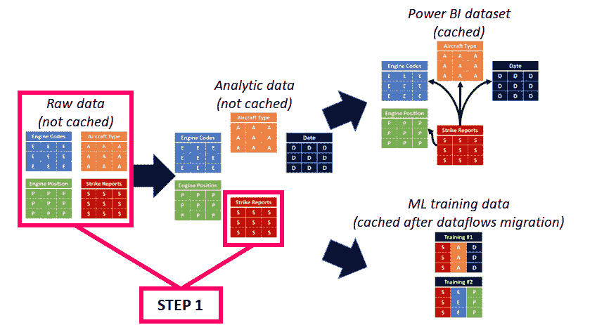
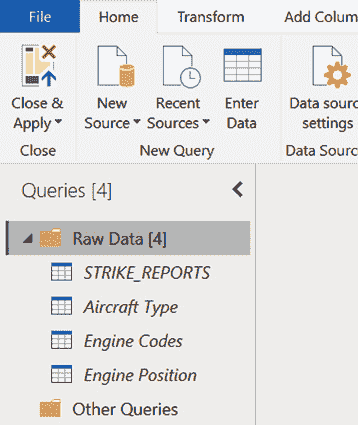
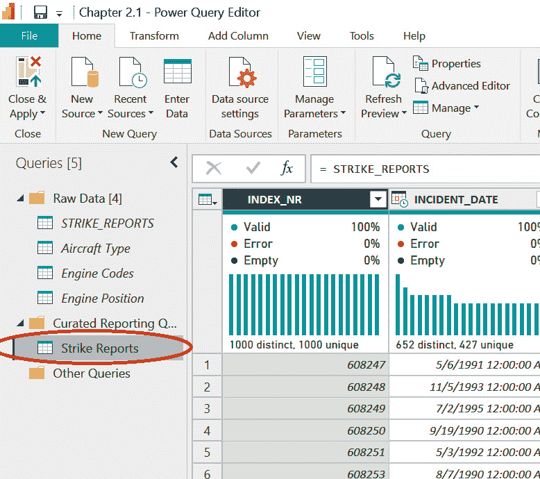
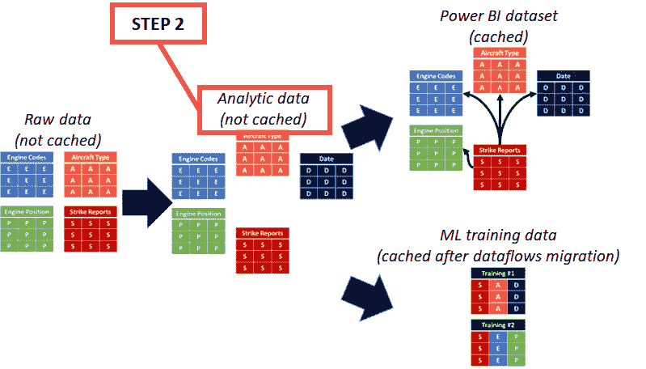
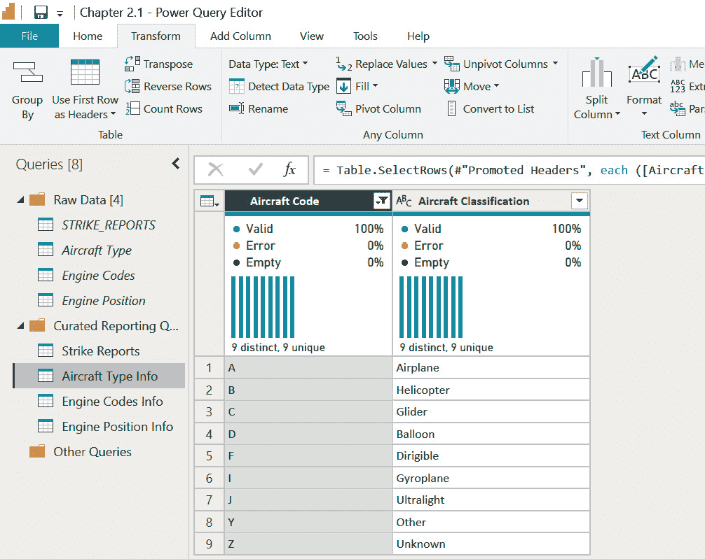
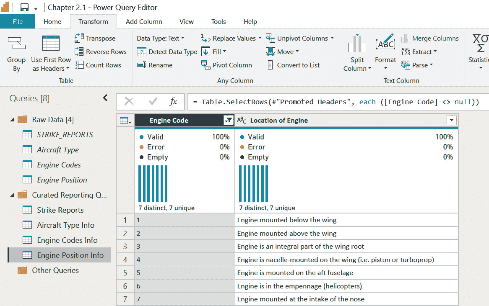
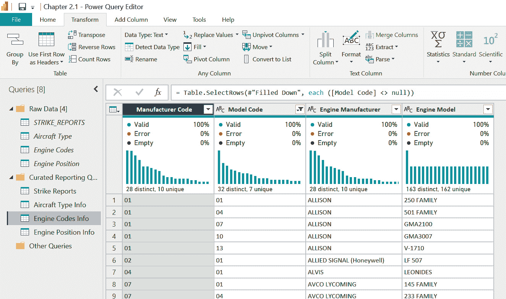
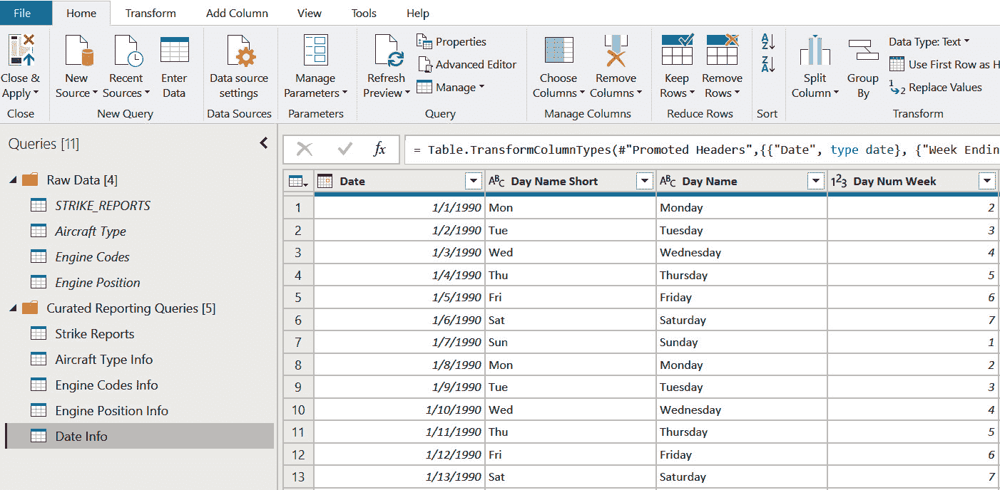

# 第二章：使用 Power Query 准备和摄取数据

在本书的*第一章*中，你启动了一个项目，旨在设计一个可以帮助跟踪和预测飞机撞击野生动物的高度和结果的相关解决方案。你从项目利益相关者那里收集了需求，深入研究了 FAA 野生动物撞击数据，将需求映射到可用数据，并制定了一个初步的数据模型设计，这将成为你使用 Power BI ML 模型进行报告和预测分析的基础。

创建用于机器学习的数据表需要清晰地理解 FAA 野生动物撞击数据，并需要一个允许你发现数据中特征的架构。在本章中，你将开始准备查询你在*第一章*中探索的数据，使用你的初步数据模型作为指南来对该数据进行建模，并创建精选查询，这些查询将成为 Power BI 中数据集和机器学习训练数据集的基础。

# 技术要求

本章节基于*第一章*中开始的工作。所有数据都可以在[`github.com/PacktPublishing/Unleashing-Your-Data-with-Power-BI-Machine-Learning-and-OpenAI/tree/main/Chapter-02`](https://github.com/PacktPublishing/Unleashing-Your-Data-with-Power-BI-Machine-Learning-and-OpenAI/tree/main/Chapter-02)找到。

对于本章，你需要以下内容：

+   Power BI 桌面版 2023 年 4 月或更高版本（无需许可证）

+   来自 FAA 网站或 Packt GitHub 站点的 FAA 野生动物撞击数据文件：[`github.com/PacktPublishing/Unleashing-Your-Data-with-Power-BI-Machine-Learning-and-OpenAI/tree/main/Chapter-02`](https://github.com/PacktPublishing/Unleashing-Your-Data-with-Power-BI-Machine-Learning-and-OpenAI/tree/main/Chapter-02)

如果你希望使用本章内容的完成版而不是逐步构建，你可以从 Packt GitHub 站点的*第二章*文件夹中下载完成的 PBIT 文件版本：[`github.com/PacktPublishing/Unleashing-Your-Data-with-Power-BI-Machine-Learning-and-OpenAI/tree/main/Chapter-02`](https://github.com/PacktPublishing/Unleashing-Your-Data-with-Power-BI-Machine-Learning-and-OpenAI/tree/main/Chapter-02)。

# 准备主要数据表

你决定通过从 FAA 野生动物撞击数据库的主要数据表开始建模，来启动构建数据集设计的过程。你首先打开在*第一章*中创建的`Chapter 1.pbix` Power BI 桌面文件。你也可以从本书的 Packt GitHub 网站下载文件的干净副本，该链接作为 PBIT 文件，可以使用在*第一章*中下载的数据填充为 PBIX 文件：[`github.com/PacktPublishing/Unleashing-Your-Data-with-Power-BI-Machine-Learning-and-OpenAI/tree/main/Chapter-01`](https://github.com/PacktPublishing/Unleashing-Your-Data-with-Power-BI-Machine-Learning-and-OpenAI/tree/main/Chapter-01)。

在 Power BI 中打开 Power Query，你会看到构成 FAA 原始数据的四个数据表：

+   **STRIKE_REPORTS**

+   **飞机类型**

+   **引擎代码**

+   **引擎位置**

检查你在*第一章*中创建的初步数据模型。第一步，你将现有的原始数据查询组织到一个文件夹中，这样你就可以在创建修改后的数据模型查询时进行引用：

图 2.1 – Power Query 文件夹包含转换阶段

接下来，你需要对原始数据进行一些处理。Power Query 允许你将查询组织成组，这些组作为逻辑分组，类似于 SharePoint 或 OneDrive 中的文件夹。

在 Power Query 中，根据上下文，“查询”和“表”这两个术语可以互换使用。在本书的其余部分，“查询”一词将用于指代未缓存的或用于生成表的逻辑，而“表”将指代已缓存在 Power BI 数据集或 Power BI 服务中的数据流中的数据。

## 对原始数据进行分组

你为原始数据查询创建了一个组，该组可以在项目后期作为原始数据的视图进行引用。在数据湖或数据湖屋架构的示例中，你经常会看到青铜/银/金或原始、精炼、优化层，这些层既作为数据转换过程中的参考点，也作为可能被称为旧数据仓库术语中的临时表的参考数据。虽然 Power BI Power Query 和数据流与数据湖屋架构不同，但将你的查询和表分组到不同的阶段可以帮助理解逻辑，也有助于扩展解决方案的未来迭代。无论数据下游发生什么，Power BI 开发者都可以返回到**原始数据**文件夹，查看数据在源中的样子：

1.  在`原始数据`中，添加以下描述：`原始 FAA 野生动物撞击`数据表。

1.  右键单击每个查询，并将它们各自移动到新的组中，**原始数据**。

1.  右键单击每个查询，并*禁用* **启用加载**。为什么需要这一步？通过禁用**启用加载**，这些查询将仅是源数据的简单预览，不会加载到你的数据集中并消耗存储空间。

该组是一个逻辑容器，它存在是为了组织你的查询。查询表示了从源数据中存在的原始数据，并且可以通过你在 Power Query 中创建的新查询进行引用。随着你的数据模型和机器学习用例随时间演变，你可以迭代地以未修改的形式引用源数据，以评估变化并为未来的机器学习模型创建新的训练数据。现在，*图 2.1*中的**步骤 1**的左侧部分已经完成！你的 Power Query 中的**查询**面板现在应该如下所示：

图 2.2 – 表示未修改原始数据的查询

接下来，你需要设计表格。

## 设计主**STRIKE_REPORTS**数据的精选表格

现在，你已准备好开始构建数据集的精选表格，这些表格首先可以用于填充 Power BI 数据集，然后可以用于填充数据表，用于机器学习。在 Power BI 出现之前，每一点数据都占据着宝贵的空间，运行查询时是喝咖啡的好时机，架构师们通常会先构建维度表，然后再填充简单的事实表，这些事实表由整数键和用于计算度量值的数值字段组成。

如果你正在构建包含数千万行或更多行的 Power BI 数据集，遵循最佳实践处理大量数据仍然是一个好主意。对于这个包含不到 30 万行 FAA 野生动物撞击数据的解决方案，在*第一章*中，为了实用性和易用性，决定构建一个混合设计，它包含星型模式和扁平化数据设计元素。采用混合方法，你决定从主要的**STRIKE_REPORTS**数据表开始，这主要是一个事实表，但也包含描述性文本列——这些本可以分解为维度，但将用作退化维度。

评估**STRIKE_REPORTS**表的数据将是一项繁琐、重复且耗时的努力。你意识到，你付出的这部分努力可能是这本书中最不愉快的一部分，但你同时也知道，坚持下去将导致更好的数据，这将导致更有效的分析和机器学习之旅。

你决定将**STRIKE_REPORTS**表的评估分为七个步骤，以便你能够理解数据并稍作休息：

1.  评估维度表以获取必要的键值。

1.  评估**STRIKE_REPORTS**表中的日期和时间列。

1.  评估**STRIKE_REPORTS**表中的地理和位置列。

1.  评估**STRIKE_REPORTS**表中的飞机和运营商描述列。

1.  评估**STRIKE_REPORTS**表中的物种和动物列。

1.  评估**STRIKE_REPORTS**表中的天气、航班详情和罢工损害列。

1.  查看来自**STRIKE_REPORTS**表的其它列。

接下来，您将详细地走过每个步骤。

### 评估维度表所需的键值

在您开始整理**STRIKE_REPORTS**表之前，您将回顾将作为您解决方案一部分的其他（维度）表。您需要确定这些表中的主键列。当您在**STRIKE_REPORTS**表上工作时，您需要确保存在一个外键来将该表映射到其他表中：

+   **飞机类型**：对于这个表，您可以看到**飞机代码**是表中每个选项的唯一字母。这些值与**STRIKE_REPORTS**中的**AC_CLASS**列中的值相匹配。您希望将**AC_CLASS**保留为您的整理表中的外键，指向**飞机** **类型**表。

+   **引擎代码**：这个表有点棘手。您需要使用**制造商代码**和**型号代码**列来识别一个唯一的行。这被称为复合键。根据**read_me.xls**文件，**STRIKE_REPORTS**中的**AMA**和**AMO**列映射到这些列。

+   `read_me.xls`定义列表。**ENG_1_POS**、**ENG_2_POS**、**ENG_3_POS**和**ENG_4_POS**都是**引擎位置**表的外键。这种场景将提出一些有趣的架构选项，您需要考虑。

+   `原始数据`文件夹。根据您的初步数据模型，您需要一个**日期**表来在周、月、季度和年度级别进行聚合。您将在本章后面添加一个**日期**表，但您还需要评估**STRIKE_REPORTS**表中的列以确定合适的外键。

### 评估**STRIKE_REPORTS**表上的日期和时间列

在商业智能和分析领域工作足够长的时间的人都知道，有一个`read_me.xls`文件，以及 Power Query 的`原始数据`文件夹。您为每个数据列的以下标准做笔记：

+   **列名**：**STRIKE_REPORTS**表中的列名。

+   **初始数据类型**：在**Microsoft** **Access**文件中检测到的数据类型，或者由 Power BI 自动检测的数据类型是什么？

+   **备注**：您对每个列的备注。

+   **保留？**：是/否，表示您是否保留此列。如果您改变主意，您将来可以将其添加回来。

+   **新数据类型**：新整理的表版本的数据类型应该是什么？

+   **键**：这是一个外键列吗？如果是，它将整合到哪个表中？

+   **报告名称**：该列的用户友好名称，在报告中看起来很好，反映报告用户的语言，并且与 Power BI 自然语言查询等工具很好地协同工作。

| **列名** | **初始数据类型** | **备注** | **保留？** | **新数据类型** | **键？** | **报告名称** |
| --- | --- | --- | --- | --- | --- | --- |
| **事故日期** | **日期/时间** | 这是野生动物撞击事件发生的日期。数据的时间部分未被使用。 | 是 | **日期** | 是 – 链接到**日期**表 | 事故日期 |
| **事故月份** | **十进制** | 由于它存在于**事故日期**中，该列不需要，它将链接到包含月份值的**日期**表。 | 否 |  |  |  |
| **事故年份** | **十进制** | 由于它存在于**事故日期**中，该列不需要，它将链接到包含年份值的**日期**表。 | 否 |  |  |  |
| **时间** | **文本** | 这列有缺失数据，但您可能在未来重新考虑它。 | 否 |  |  |  |
| **白天时间** | **文本** | 这列比**时间**列更频繁地被填充，可能很有价值。 | 是 | **文本** | 否 | 白天时间 |
| **LUPDATE** | **日期/时间** | 关于报告更新时间的信息不需要成为您初始工作的部分。 | 否 |  |  |  |

图 2.3 – 与日期和时间相关的 STRIKE_REPORTS 列的表格

接下来，您需要处理位置列。

### 评估 STRIKE_REPORTS 表中的地理和位置列

地理和位置列将提供有关野生动物撞击事件在世界各地 FAA 覆盖区域发生的信息。这类信息可能对区分基于当地气候和野生动物种群的不同趋势、模式和频率具有潜在价值。

再次深入到**STRIKE_REPORTS**数据中，并列出地理或与位置相关的列：

| **列名** | **初始数据类型** | **备注** | **保留？** | **新数据类型** | **键？** | **报告名称** |
| --- | --- | --- | --- | --- | --- | --- |
| **机场 ID** | **文本** | 机场的唯一标识符。 | 是 | **文本** | 否 | 机场 ID |
| **机场** | **文本** | 机场的名称。 | 是 | **文本** | 否 | 机场名称 |
| **州** | **文本** | 州的缩写。 | 是 | **文本** | 否 | 州 |
| **中转州** | **文本** | 目的州的缩写。 | 是 | **文本** | 否 | 州 |
| **FAA 区域** | **文本** | 报告中列出的 FAA 区域。 | 是 | **文本** | 否 | FAA 区域 |
| **跑道** | **文本** | 飞行的跑道。 | 是 | **文本** | 否 | 跑道 |
| **位置** | **文本** | 关于位置的文本注释。您决定在第一轮开发中省略它，因为它有 96%是空的。 | 否 | **文本** | 否 |  |
| **纬度** | **十进制** | 报告中列出的纬度。 | 是 | **十进制** | 否 | 纬度 |
| **经度** | **十进制** | 报告中列出的经度 | 是 | **十进制** | 否 | 经度 |

图 2.4 – 与地理和位置相关的 STRIKE_REPORTS 列的表格

注意，在真正的星型模式设计中，一个 **地理** 表通常是一个独立的维度。再次强调，你正在采用混合方法，以最小化你第一轮开发中的复杂性。你可以在未来开发迭代中随时将地理维度拆分出来。

### 评估 STRIKE_REPORTS 表中的飞机和运营商描述列

飞机和飞机运营商的信息也包含在来自 FAA 野生动物撞击数据的 **STRIKE_REPORTS** 表中。你对这些列执行了类似的分析：

| **列名** | **初始数据类型** | **备注** | **保留？** | **新数据类型** | **键？** | **报告名称** |
| --- | --- | --- | --- | --- | --- | --- |
| **OPID** | **Text** | 运营商的 ID。 | 是 | **Text** | 否 | 运营商 ID |
| **OPERATOR** | **Text** | 运营商的名称。 | 是 | **Text** | 否 | 运营商 |
| **REG** | **Text** | 飞机注册号。 | 否 |  |  |  |
| **AIRCRAFT** | **Text** | 飞机描述。 | 是 | **Text** | 否 | 飞机 |
| **AMA** | **Text** | 飞机制造商代码。 | 是 | **Text** | 是 – **发动机代码** | AMA |
| **AMO** | **Text** | 飞机型号代码。 | 是 | **Text** | 是 – **发动机代码** | AMO |
| **EMA** | **Text** | 报告中列出的纬度。 | 是 | **Text** | 否 | EMA |
| **EMO** | **Text** | 报告中列出的经度。 | 是 | **Text** | 否 | EMO |
| **AC_CLASS** | **Text** | 飞机类别。 | 是 | **Text** | 是 – **飞机类型** | 飞机类别代码 |
| **AC_MASS** | **Text** | 飞机质量键；也包含一些 `NULL` 的文本条目。你将需要在以后添加一些描述。 | 是 | **Text** | 否 | 飞机质量代码 |
| **TYPE_ENG** | **Text** | 发动机键的类型；还需要添加描述。 | 是 | **Text** | 否 | 发动机类型代码 |
| **NUM_ENGS** | **Text** | 一些条目是 `NULL`（文本）而其他的是整数或空值。你决定现在将其保留为文本值，但在设计数据集时将重新考虑。 | 是 | **Text** | 否 | 发动机数量 |
| **ENG_1_POS** | **Text** | 这四个列的 `NULL` 文本条目将暂时保留为文本。 | 是 | **Text** | 是 –**发动机位置** | 发动机 1 位置代码 |
| **ENG_2_POS** | **Text** | 是 | **Text** | 是 – **发动机位置** | 发动机 2 位置代码 |
| **ENG_3_POS** | **Text** | 是 | **Text** | 是 – **发动机位置** | 发动机 3 位置代码 |
| **ENG_4_POS** | **Text** | 是 | **Text** | 是 –**发动机位置** | 发动机 4 位置代码 |

图 2.5 – 与飞机和运营商描述相关的 STRIKE_REPORTS 表的列表

接下来，你将查看记录涉及动物的列。

### 评估 STRIKE_REPORTS 表中的物种和动物列

关于撞击飞机的不同野生动物物种、它们的大小以及撞击结果的信息，也可能有助于预测与野生动物撞击相关的成本和损害。您将查看与野生动物相关的数据列：

| **列名** | **初始数据类型** | 备注 | **保留？** | **新数据类型** | **键？** | **报告名称** |
| --- | --- | --- | --- | --- | --- | --- |
| **鸟带编号** | **文本** | 主要为空 | 否 |  |  |  |
| **SPECIES_ID** | **文本** | 物种 ID | 是 | **文本** | 否 | 物种 ID |
| **物种** | **文本** | 物种名称 | 是 | **文本** | 否 | 物种 |
| **剩余收集** | **真/假** | 项目不需要 | 否 |  | 否 |  |
| **剩余发送** | **真/假** | 项目不需要 | 否 |  |  |  |
| **警告** | **文本** | 是否有警告？ | 是 | **文本** | 否 | 警告 |
| **NUM_SEEN** | **文本** | 看到的动物数量 | 是 | **文本** | 否 | 看到的数量 |
| **NUM_STRUCK** | **文本** | 被撞击的动物数量 | 是 | **文本** | 否 | 被撞击的数量 |
| **大小** | **文本** | 动物的大小 | 是 | **文本** | 否 | 大小 |

图 2.6 – 与物种和动物描述相关的 STRIKE_REPORTS 表的列表

在下一节中，您将查看更多列。

### 评估 STRIKE_REPORTS 表中的天气、飞行细节和撞击损害列

飞行状态信息，如飞机的高度和速度，也可能是有趣和有用的数据。您还可以查看与野生动物撞击相关的损害、成本和伤害信息：

| **列名** | **初始数据类型** | 备注 | **保留？** | **新类型** | **键？** | **报告名称** |
| --- | --- | --- | --- | --- | --- | --- |
| **飞行阶段** | **文本** | 注意阶段，如起飞和巡航 | 是 | **文本** | 否 | 飞行阶段 |
| **高度** | **十进制** | 碰撞时飞机的高度 | 是 | **整数** | 否 | 高度 |
| **速度** | **十进制** | 碰撞时飞机的速度 | 是 | **整数** | 否 | 速度 |
| **距离** | **十进制** | 机场距离 | 是 | **十进制** | 否 | 距离 |
| **天空** | **文本** | 可视性注释 | 是 | **文本** | 否 | 天空 |
| **降水量** | **文本** | 关于雨、雪等的注释 | 是 | **文本** | 否 | 降水量 |
| **AOS** | **十进制** | 飞机停机时间 | 是 | **十进制** | 否 | AOS |
| **成本修复** | **固定十进制数** | 修复成本 | 是 | **固定十进制数** | 否 | 修复成本 |
| **其他成本** | **固定十进制数** | 其他成本 | 是 | **固定十进制数** | 否 | 其他成本 |
| **成本修复通胀调整** | **固定十进制数** | 成本（通胀调整后） | 是 | **固定十进制数** | 否 | 修复成本（调整后） |
| **COST_OTHER_INFL_ADJ** | **Fixed Decimal Number** | 其他成本（通货膨胀调整后） | 是 | **Fixed Decimal Number** | 否 | 其他成本（调整后） |
| **DAMAGE_LEVEL** | **Text** | 损坏程度 | 是 | **Text** | 否 | 损坏程度 |
| **OTHER_SPECIFY** | **Text** | 96% 空白和自由文本，因此现在跳过它 | 否 |  |  |  |
| **EFFECT** | **Text** | 对飞行的影响 | 是 | **Text** | 否 | 飞行影响 |
| **EFFECT_OTHER** | **Text** | 其他影响，98% 空白 | 否 |  |  |  |
| **REMARKS** | **Text** | 关于事件的各项备注 | 是 | **Text** | 否 | 备注 |
| **NR_INJURIES** | **Decimal** | 受伤人数 | 是 | **Integer** | 否 | 受伤人数 |
| **NR_FATALITIES** | **Decimal** | 死亡人数 | 是 | **Integer** | 否 | 死亡人数 |
| **COMMENTS** | **Text** | 自由文本中的评论 | 否 |  |  |  |

图 2.7 – 与天气、飞行和损坏描述相关的 STRIKE_REPORTS 表的列表

你还发现了与撞击和相关损坏相关的 34 个 **True/False** 列。真/假列通常对用于机器学习来说很容易评估，因此你决定包括这些列。其中大部分以 **ING**（摄入）、**DAM**（损坏）或 **STR**（撞击）开头：

| **Additional True/False** **columns included** |
| --- |
| **INGESTED_OTHER** | **STR_NOSE** | **STR_ENG2** | **STR_ENG3** | **STR_ENG4** |
| **INDICATED_DAMAGE** | **DAM_NOSE** | **DAM_ENG2** | **DAM_ENG3** | **DAM_ENG4** |
| **DAM_OTHER** | **STR_ENG1** | **ING_ENG2** | **ING_ENG3** | **ING_ENG4** |
| **STR_RAD** | **DAM_ENG1** | **STR_WING_ROT** | **STR_LG** | **STR_LGHTS** |
| **DAM_RAD** | **ING_ENG1** | **DAM_WING_ROT** | **DAM_LG** | **DAM_LGHTS** |
| **STR_WINDSHLD** | **STR_PROP** | **STR_FUSE** | **STR_TAIL** | **STR_OTHER** |
| **DAM_WINDSHLD** | **DAM_PROP** | **DAM_FUSE** | **DAM_TAIL** |  |

图 2.8 – 标记 STRIKE_REPORTS 表中特定野生动物撞击事件的真/假列

### STRIKE_REPORTS 表中的其他列

你决定从精选的 **STRIKE_REPORTS** 表中省略其他列，因为你怀疑它们不会为你的初始分析阶段增加价值。不必要的列还会增加最终用户对元数据浏览体验的负担，并增加数据集的大小，因为它们需要额外的存储空间。如果需要，以下列可以随时添加：**INDEX_NR**、**REPORTED_NAME**、**REPORTED_TITLE**、**SOURCE**、**PERSON** 和 **TRANSFER**。

你已经决定了要保留的列、数据类型以及列的用户友好名称。现在，你可以继续构建精选层，这将成为你的 Power BI 数据集和 Power BI 中的机器学习模型的基础。

# 构建一个精选的 STRIKE_REPORTS 主要数据列表

现在，你可以开始构建 STRIKE_REPORTS 元数据和查询逻辑的精选版本，在 Power Query 中进行。你将遵循以下步骤：

1.  参考原始表以创建新的查询。

1.  只保留你需要的列。

1.  进行数据类型更改。

1.  修改列名。

让我们开始吧。

## 引用原始表创建新的查询

你将你的新查询放入 Power Query 中的一个新的组，命名为 **Curated Reporting Queries**：

1.  在 Power Query 中创建一个新的组，命名为 **Curated Reporting Queries**，使用与创建 **Raw Data** 组相同的方法。

1.  右键点击 `wildlife.accdb` 源文件。这样，你可以在 Power Query 中修改元数据和查询逻辑，同时保持源文件的不变视图。

1.  右键点击 **STRIKE_REPORTS (2)** 表，并将查询移动到 **Curated Reporting Queries**。

1.  在右侧面板中，在 `Strike Reports`。这样，你的表将有一个干净且用户友好的名称。

你的 Power Query 中的 **Queries** 面板现在应该看起来像这样：

图 2.9 – 一个用于数据集和 ML 查询的整理后的数据表

接下来，你需要删除不必要的列。

## 只保留你需要的列

现在你已经开始你的新查询，你可以选择你想要保留的列。基于你完成的七个评估批次，你可以删除不必要的列。在 Power Query 的 **Home** 选项卡下，在 **Manage Columns** 部分中，你可以选择 **Choose Columns**。你可以取消选择以下列：

| **INCIDENT_NR** | **EFFECT_OTHER** | **SOURCE** |
| --- | --- | --- |
| **INCIDENT_MONTH** | **COMMENTS** | **PERSON** |
| **INCIDENT_YEAR** | **REMAINS_COLLECTED** | **LUPDATE** |
| **LOCATION** | **REMAINS_SENT** | **TRANSFER** |
| **REG** | **REPORTED_NAME** | **BIRD_BAND_NUMBER** |
| **OTHER_SPECIFY** | **REPORTED_TITLE** | **TIME** |

图 2.10 – 从 Strike Reports 查询中删除的列

现在，你的查询只包含你计划用于分析的列。

## 数据类型更改

根据你对 **STRIKE_REPORTS** 数据的评估，你决定更改一些列的数据类型。在 Power Query 的 **Transform** 选项卡下，在 **any columns** 部分中，你可以为每个你高亮的列选择 **Data Type**：

| **Column** | **Existing data type** | **New data type** | **Reason** |
| --- | --- | --- | --- |
| **INCIDENT_DATE** | **Date/Time** | **Date** | **Time** 部分未使用；也作为一个好的外键作为 **Date** 类型。 |
| **HEIGHT** | **Decimal** | **Integer** | 所有值要么为空，要么为整数。 |
| **SPEED** | **Decimal** | **Integer** | 所有值要么为空，要么为整数。 |
| **NR_INJURIES** | **Decimal** | **Integer** | 未以小数测量。 |
| **NR_FATALITIES** | **Decimal** | **Integer** | 未以小数测量。 |

图 2.11 – 在查询中更改数据类型以准备数据集和 ML 查询

## 列名更改

高质量的元数据对分析有多个好处，尤其是在最终用户不熟悉源数据命名约定的情况下。除了可以通过搜索工具发现之外，良好的命名约定还将使 Power BI Q&A 等工具更加直观和有价值。根据您的评估，您可以通过右键单击每个列并选择**重命名…**来对列名进行以下更改：

| **列名** | 报告名称 | **列名** | 报告名称 |
| --- | --- | --- | --- |
| **事故日期** | 事故日期 | **COST_OTHER_INFL_AD****J** | 其他成本（调整后） |
| **白天时间** | 白天时间 | **DAMAGE_LEVEL** | 损伤程度 |
| **AIRPORT_ID** | 机场 ID | **EFFECT** | 对飞行的影响 |
| **AIRPORT** | 机场名称 | **REMARKS** | 备注 |
| **状态** | 状态 | **NR_INJURIES** | 受伤人数 |
| **飞行状态** | 飞行状态 | **NR_FATALITIES** | 死亡人数 |
| **FAAREGION** | FAA 区域 | **INGESTED_OTHER** | 吞入其他 |
| **跑道** | 跑道 | **INDICATED_DAMAGE** | 指示的损伤 |
| **纬度** | 纬度 | **STR_RAD** | 随机撞击 |
| **经度** | 经度 | **DAM_RAD** | 损坏随机 |
| **OPID** | 操作员 ID | **STR_WINDSHLD** | 撞击挡风玻璃 |
| **操作员** | 操作员 | **DAM_WINDSHLD** | 损坏挡风玻璃 |
| **飞机** | 飞机 | **STR_NOSE** | 撞击机头 |
| **AMA** | AMA | **DAM_NOSE** | 损坏机头 |
| **AMO** | AMO | **STR_ENG1** | 撞击发动机 1 |
| **EMA** | EMA | **DAM_ENG1** | 损坏发动机 1 |
| **EMO** | EMO | **ING_ENG1** | 吞入发动机 1 |
| **AC_CLASS** | 飞机类别代码 | **STR_PROP** | 撞击螺旋桨 |
| **AC_MASS** | 飞机质量代码 | **DAM_PROP** | 损坏螺旋桨 |
| **发动机类型代码** | 发动机类型代码 | **STR_ENG2** | 撞击发动机 2 |
| **NUM_ENGS** | 发动机数量 | **DAM_ENG2** | 损坏发动机 2 |
| **ENG_1_POS** | 发动机 1 位置代码 | **ING_ENG2** | 吞入发动机 2 |
| **ENG_2_POS** | 发动机 2 位置代码 | **STR_WING_ROT** | 撞击机翼或旋翼 |
| **ENG_3_POS** | 发动机 3 位置代码 | **DAM_WING_ROT** | 损坏机翼或旋翼 |
| **ENG_4_POS** | 发动机 4 位置代码 | **STR_FUSE** | 撞击机身 |
| **物种 ID** | 物种 ID | **DAM_FUSE** | 损坏机身 |
| **物种** | 物种 | **STR_ENG3** | 撞击发动机 3 |
| **警告** | 警告 | **DAM_ENG3** | 损坏发动机 3 |
| **目击数量** | 目击数量 | **ING_ENG3** | 吞入发动机 3 |
| **NUM_STRUCK** | 撞击数量 | **STR_LG** | 撞击起落架 |
| **尺寸** | 尺寸 | **DAM_LG** | 损坏起落架 |
| **飞行阶段** | 飞行阶段 | **STR_TAIL** | 撞击尾部 |
| **高度** | 高度 | **DAM_TAIL** | 损坏尾部 |
| **速度** | 速度 | **STR_ENG4** | 撞击发动机 4 |
| **距离** | 距离 | **DAM_ENG4** | 损坏发动机 4 |
| **天空** | 天空 | **ING_ENG4** | 吞入发动机 4 |
| **降水** | 降水 | **STR_LGHTS** | 撞击灯光 |
| **AOS** | AOS | **DAM_LGHTS** | 损坏的灯光 |
| **COST_REPAIRS** | 维修成本 | **STR_OTHER** | 碰撞其他 |
| **COST_OTHER** | 其他成本 | **DAM_OTHER** | 损坏的其他 |
| **COST_REPAIRS_INFL_ADJ** | 调整后的维修成本 |  |  |

图 2.12 – 野生动物碰撞查询的名称更改

现在，您已经重命名了将用于碰撞报告查询的列，您可以继续填充其他描述性数据的精炼版本。

# 构建飞机型号、发动机代码和发动机位置查询的精炼版本

接下来，您将创建 Power Query 的**精炼报告查询**组中引用（维度）表的新版本查询。在开始这些任务之前，您还应该考虑**日期**表。**日期**表将是 Power BI 数据集的一个基本组成部分，但它是一个在数据集中不存在的架构组件。因此，它将在本章后面的下游组中添加到数据集层。您已经进入到了工作的另一个阶段：

图 2.13 – 移动到分析数据的引用表查询

对于**原始数据**组中的三个表，**飞机型号**、**发动机代码**和**发动机位置**，右键单击它，选择**引用**，将生成的查询移动到**精炼报告查询**组，并将其重命名为在名称末尾包含**信息**，以便它们具有唯一名称。您的 Power Query 查询应如下所示：

图 2.14 – 精炼报告级别的新的查询

现在，您可以开始清理和修改每个查询，以便它们适合构建维度表和机器学习查询。在这些步骤中，作为一名经验丰富的 Power BI 用户，您可能拥有丰富的清理数据表的经验，您可以利用这些经验快速进行更改。您与微软合作伙伴一起参加的“一天之内构建 Power BI 仪表板”课程非常有帮助！

## 飞机型号信息查询

您会注意到在**飞机型号信息**表中，Power BI 显示列名作为第一行，并且有一个空行。在 Power Query 的选项卡上，在**转换**选项卡下，在**表**部分，您可以选择**使用第一行作为标题**。接下来，左键单击**飞机代码**列旁边的箭头并取消选择**（null）**。现在，您的**飞机型号信息**表应如下所示：

图 2.15 – 添加到飞机型号信息的列名

接下来，您需要查询发动机位置。

## 发动机位置信息查询

**发动机位置信息**需要与**飞机类型信息**完全相同的转换步骤。有时，标题会自动提升，这取决于您 Power BI 的版本。您重复上一节的步骤，您的表应如下所示：

图 2.16 – 查询的精选版本，用于发动机位置描述信息

接下来，您需要查询发动机代码。

## 发动机代码信息查询

**发动机代码信息**查询需要更多的工作：

1.  从查询视图的左上角选择下拉菜单，并删除前两行。

1.  选择**使用第一行**作为**标题**。

1.  突出显示**Column5**和**Column6**然后**删除列**。

1.  突出显示**制造商代码**和**发动机制造商**列。右键单击并选择**填充**和**向下**。

1.  左键单击**模型代码**旁边的箭头，取消选择**（null）**。

您的**发动机代码信息**查询应如下所示：

图 2.17 – 精选查询，用于涉及野生动物撞击的飞机上的发动机信息

让我们构建一个精选查询！

# 构建精选查询以填充日期表

日期聚合是 Power BI 和整体商业智能工具的重要组件。在周、月、季度和年的层面上理解和重新计算趋势，增加了强大的分析能力。日期表甚至可以用来按周末、假日、财政日历等切片和切块数据。Power BI 甚至具有将表指定为**日期表**的能力，以启用特殊的时间智能功能。

在 Packt GitHub 网站链接[`github.com/PacktPublishing/Unleashing-Your-Data-with-Power-BI-Machine-Learning-and-OpenAI/tree/main/Chapter-02`](https://github.com/PacktPublishing/Unleashing-Your-Data-with-Power-BI-Machine-Learning-and-OpenAI/tree/main/Chapter-02)上可获取**日期**数据的 `.csv` 文件。按照以下步骤将其导入 Power Query：

1.  复制[`raw.githubusercontent.com/PacktPublishing/Unleashing-Your-Data-with-Power-BI-Machine-Learning-and-OpenAI/main/Chapter-02/date.csv`](https://raw.githubusercontent.com/PacktPublishing/Unleashing-Your-Data-with-Power-BI-Machine-Learning-and-OpenAI/main/Chapter-02/date.csv)。

1.  在 Power Query 中，选择**新建源**然后选择**网页**。粘贴 URL 并点击**确定**。

1.  当预览显示时，选择**确定**。

1.  将查询重命名为`Date Info`并将其移动到 Power Query 中的**精选报告查询**组。

1.  选择**使用第一行**作为**标题**。

1.  更改以下列的数据类型：

| **列名** | **数据类型** | **列名** | **数据类型** |
| --- | --- | --- | --- |
| 日期 | 日期 | 月份编号 | 整数 |
| 日期编号 周数 | 整数 | 月份 年份 订单 | 整数 |
| 年内天数 | 整数 | 月日编号 | 整数 |
| 周编号 | 整数 | 季度编号 | 整数 |
| 周结束日期 | 日期 | 季度年份订单 | 整数 |
| 年份周订单 | 整数 | 年份 | 整数 |

图 2.18 – 日期信息表的数据类型更改

您的**日期**表查询现在应如下所示：

图 2.19 – 日期数据现在可在 Power Query 中使用，以在 Power BI 数据集中创建日期表

您现在已成功构建了 Power BI 数据集和 ML 查询的定制查询层。这些查询尚未准备好用于数据集，因为它们仍然需要外键和主键值，以及处理任何潜在数据问题的维护任务。现在您已准备好开始构建 Power BI 数据集的步骤！

# 摘要

在本章中，您创建了来自 FAA 野生动物撞击数据的查询，这些查询将作为 Power BI 数据集和 ML 训练数据集的基础。在整个章节中，您移除了不必要的列，清理了列名，并格式化了查询，以便它们可以作为数据表使用。

在下一章中，您将探索这些查询中的数据，并在 Power BI 数据集中创建一个语义模型，该模型将所有数据关联起来，用于创建 Power BI 报告 – 这将启动对 FAA 野生动物撞击数据的分析。
