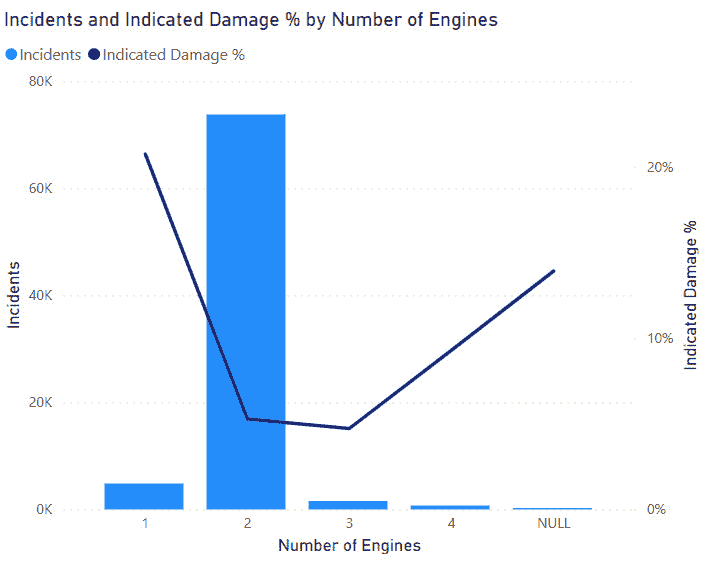

# 第五章：使用分析和 AI 可视化发现特征

在*第四章*中，你发现了 FAA 野生动物撞击数据中的特征，并使用 Power BI ML 进行测试，以查看它们是否是好的预测特征，在 Power Query 中构建查询以将这些特征结构化为表格，并完成了你高级数据架构的基础。你现在可以深入分析并准备在 Power BI 中进行机器学习。

在本章中，你将继续构建 Power BI 分析报告，同时探索数据和发现趋势。你还将尝试一些 Power BI AI 可视化，看看你是否可以揭示可以添加到你的机器学习努力中的额外特征。在本章结束时，你将拥有一个更完整的分析报告和更丰富的数据，用于构建、训练和测试你的 Power BI ML 模型。

# 技术要求

对于本章，你需要以下内容：

+   Power BI 桌面版 2023 年 4 月或更高版本（无需许可证）

+   从 FAA 网站或此链接的 Packt GitHub 站点获取 FAA 野生动物撞击数据文件：[`github.com/PacktPublishing/Unleashing-Your-Data-with-Power-BI-Machine-Learning-and-OpenAI`](https://github.com/PacktPublishing/Unleashing-Your-Data-with-Power-BI-Machine-Learning-and-OpenAI)

# 使用报告在 Power BI 中识别特征

现在你已经为预测损坏、预测大小和预测高度构建了基础查询，你可以在每个查询中添加额外的特征来评估，这些特征将被用于 Power BI ML。评估 ML 模型的特征将被添加到每个 ML 查询中。在 Power BI 中构建 ML 模型将允许你缩小特征列表，使其包含最有用的特征。为了使章节易于阅读，你可以逐个查看与 Power BI ML 的三个查询相关的潜在新特征。在 Power BI 中训练和测试你的 ML 模型时，每个特征的预测价值将在构建 ML 模型时进行评估。因此，如果一个特征存在问题，你最好将其保留在查询中，然后在它显示出提供很少价值时再将其删除。

注意，如果你不希望在本书的旅程中构建所有这些 Power BI 报告页面，完整的 PBIT 模板可在以下链接获取：[`github.com/PacktPublishing/Unleashing-Your-Data-with-Power-BI-Machine-Learning-and-OpenAI/tree/main/Chapter-05`](https://github.com/PacktPublishing/Unleashing-Your-Data-with-Power-BI-Machine-Learning-and-OpenAI/tree/main/Chapter-05)。

## 受击数量

**撞击次数**是一列数据，代表每次野生动物撞击事件中涉及的动物数量的五种选择：**1**，**2-10**，**11-100**，**超过 100**，或文本值**NULL**。您将**折线图和堆积柱状图**复制粘贴到**预测损伤**页面，并将**年份**在**x**轴上替换为**撞击次数**。文本值**NULL**可能包含代表其他四个类别所有事件的案例。除了**NULL**之外，随着**撞击次数**的增加，损伤的可能性似乎也在增加，这可能代表了动物撞击次数与损伤可能性之间的相关性。随着动物撞击次数的增加，事件数量也在增加：


图 5.1 – 撞击可能性随撞击次数增加而增加

现在看看**撞击次数**与**预测大小**用例之间的关系。记住，**大小**指的是撞击飞机的动物的大小。将**折线图和堆积柱状图**复制粘贴到该页面，将**月份编号**在**x**轴上替换为**撞击次数**，并将图表更改为**100%堆积柱状图**。您在**NULL**列中发现了一个意外的分布。许多这些事件被归类为**大型**。您不知道这个发现的原因，但这里有一些可能性：

+   如果一只大型动物撞击了飞机，那么**撞击次数**字段有时可能被跳过。

+   如果撞击未被目击，那么**NULL**实际上可能意味着未知。

+   飞行后发现的撞击损伤可能被认为是大型动物造成的，但具体数量并不清楚。


图 5.2 – 当按撞击次数分解时，野生动物撞击的大小分布不同

最后，您查看**预测高度**页面，看看**撞击次数**是否有任何有趣的模式。您将**预测损伤**页面上的**折线图和堆积柱状图**复制粘贴到**预测高度**页面，并在**x**轴上将**年份**替换为**撞击次数**。将**平均高度**和**中位数高度**添加到**y**轴。动物数量较少的事件似乎发生在较高的高度：


图 5.3 – 单一动物的撞击似乎具有更高的高度指标

您通过分析验证了**撞击次数**可能为所有三个机器学习特征集提供价值。在本章的后面部分，您将将其添加到查询中。

## 飞机质量代码

根据`read_me.xls`文档，飞机质量代码值表示参与野生动物撞击的飞机的以下质量值：

+   **1**: 2,250 公斤或以下

+   **2**: 2,251–5,700 公斤

+   **3**: 5,701–27,000 公斤

+   **4**：27,001–272,000 kg

+   **5**：超过 272,000 kg

文本值 `NULL` 不在文档中，但很可能表示飞机的大小未知。您可以为 **飞机质量代码** 创建一个与上面用于 **被击中数量** 的相同的 **100% 堆积柱状图**，用于 **预测损坏** 页面。您可以从 *图 5**.4* 中看到，较小的飞机似乎比较大的飞机有更高的损坏百分比，这在常识角度上是合理的。


图 5.4 – 较小的飞机似乎有更高的损坏率

现在，您可以通过复制和粘贴 **100% 堆积柱状图** 并将 **被击中数量** 替换为 **飞机质量代码** 来查看 **预测大小** 的 **飞机质量代码**。差异是明显的，但并不突出：


图 5.5 – 由于飞机质量代码导致的尺寸略有差异

使用 **折线图和堆积柱状图** 对 **预测高度** 页面上的 **飞机质量代码** 重复相同的操作。**平均高度** 和 **中位数高度** 是 *y* 轴上的线条：


图 5.6 – 高度指标似乎随着飞机尺寸的增大而略有上升

**飞机质量代码** 将在本章的 *在 Power Query 中添加新特征到机器学习查询* 部分中添加到所有三个机器学习查询中。

## 月份编号（数字）

**月份编号**，即月份的数值表示，在上章中添加到 **预测大小机器学习** 查询中。您决定对其他两个机器学习查询进行评估，从 **预测损坏** 开始。在 **预测损坏** 页面上，执行以下操作：

1.  高亮显示现有的 **按年分的** **事故和指示损坏百分比** 图表。

1.  将 **月份编号** 拖到 **可视化** **| X 轴**，在 **年份** 之下。

1.  您现在可以深入到 **按年分的** **事故和指示损坏百分比** 图表，并在 *x* 轴上查看 **月份编号**。

注意到在夏季月份（北美的六月到九月）损坏可能性似乎有所下降：


图 5.7 – 损坏可能性似乎呈季节性波动

您将在本章末尾将 **月份编号** 作为特征添加到 **预测损坏** 机器学习查询中。

## 发动机数量

与前面的例子一样，您查看其他两个机器学习查询的 **发动机数量**，从 **预测损坏** 开始。复制并粘贴一个 **折线图和堆积柱状图**，然后在 *x* 轴上添加 **发动机数量**。似乎单引擎飞机在遭受打击后有更高的报告损坏的可能性：



图 5.8 – 单发动机飞机在撞击后似乎有更高的损坏可能性

现在从**预测规模**页面复制粘贴一个 100%堆叠条形图，并将**发动机数量**放在*x*轴上。虽然不是特别深刻，但似乎根据发动机数量动物大小的分布存在差异：


图 5.9 – 根据发动机数量动物大小分布的微小变化

你会注意到根据`read_me.xls`文档，确定撞击规模大小的变量还有其他一些。这种分类是一个主观值，飞行员经验、地理文化差异等因素可能导致变化。特别是，这张图表让你怀疑私人飞行员是否可能比为大型航空公司工作的经验丰富的专业飞行员描述野生动物撞击的方式不同。也许这是数据科学家可以在另一天进行的研究。尽管如此，你将把**发动机数量**添加到**预测损坏**和**预测规模**的机器学习查询中。

## 被击中、吞入野生动物和损坏的发动机百分比

虽然**发动机数量**是源数据库中的一列，但你还需要做一些工作来找出有多少发动机被击中、吞入野生动物以及被击中损坏。考虑到**发动机数量**，两台发动机被击中对于双发动机飞机和四发动机飞机来说可能是一个非常不同的场景。**发动机数量**将是你的机器学习查询中的一个特征，但分别针对被击中、吞入野生动物和损坏的发动机百分比的独立特征也可能很有趣。

将`TRUE`，然后除以**发动机数量**。打开 Power Query 并按照以下步骤添加一个用于**被击中发动机数量**的新列：

1.  在**定制报告查询**组中突出显示**撞击报告**。

1.  从 Power Query 功能区添加一个新的自定义列，并将其命名为**被击中发动机数量**。

1.  添加以下 M 代码：

    ```py
    (if [Struck Engine 1] = true then 1 else 0) +
    ```

    ```py
    (if [Struck Engine 2] = true then 1 else 0) +
    ```

    ```py
    (if [Struck Engine 3] = true then 1 else 0) +
    ```

    ```py
    (if [Struck Engine 4] = true then 1 else 0)
    ```

1.  当你的屏幕看起来像以下截图时，点击**确定**：


图 5.10 – 新列用于计算每次野生动物撞击中发动机被击中的数量

现在创建另一个列来计算每次事件中被击中发动机的百分比。

1.  在**定制报告查询**组中突出显示**撞击报告**。

1.  从 Power Query 功能区添加一个新的自定义列，并将其命名为**发动机被击中百分比**。

1.  添加以下 M 代码（注意，这里使用`NULL`而不是数字，因此需要进行转换）：

    ```py
    if [Number of Engines] = "NULL" then 0 else
    ```

    ```py
    Value.Divide([Number of Engines Struck],Number.From([Number of Engines]))
    ```

您的**打击报告**查询现在应该看起来像这样：


图 5.11 – 新增的两列将传播到 Power BI 数据集和 ML 查询的层中

将**被击中发动机的数量**的数据类型更改为**整数**，将**被击中发动机的百分比**更改为**百分比**。

为吸入发动机数量、吸入发动机百分比、损坏发动机数量和损坏发动机百分比添加新列将遵循完全相同的模式：

+   使用**吸入发动机 1**、**吸入发动机 2**、**吸入发动机 3**和**吸入发动机 4**来表示**吸入发动机的数量**和**吸入发动机的百分比**。

+   使用**损坏发动机 1**、**损坏发动机 2**、**损坏发动机 3**和**损坏发动机 4**来表示**损坏发动机的数量**和**损坏发动机的百分比**。

这是打击报告查询中所有六个新列的快照：


图 5.12 – 新增六列以分析被击中、吸入和损坏的发动机数量和百分比

现在您可以点击**关闭并应用**，并使用新列刷新数据集。

对于**预测损坏**页面，您添加一个新的矩阵视觉，其中**发动机数量**在行上，**被击中发动机的百分比**在列上，**指示损坏百分比**在值中。损坏的可能性似乎会根据总发动机数量和被击中发动机的数量而变化：


图 5.13 – 根据发动机总数和被击中发动机的百分比，损坏的可能性变化

您决定将所有这些新功能添加到`TRUE`表示已经观察到损坏。

# 使用 Power BI 中的关键影响因素视觉识别其他特征

Power BI 有一个内置的 AI 视觉称为**关键影响因素**，可以用来发现数据中的有趣模式。您现在将查看一些来自 FAA 野生动物打击数据的附加列，并探索它们如何影响损坏的可能性和动物的大小。

首先，复制**预测损坏**页面，并将复制的版本重命名为**预测损坏关键影响因素**。通过添加一个副本页面，您保留了**筛选器**面板中的筛选器。删除页面上的所有视觉元素。在**可视化**面板中，将**关键影响因素**视觉添加到页面。现在按照以下步骤操作：

1.  当**关键影响因素**视觉突出显示时，将**指示损坏**字段添加到**分析**中。

1.  将**飞行阶段**、**降水**、**天空**和**对飞行的影响**字段添加到**解释**中。

1.  将视觉上方的选择设置为`True`。

您会注意到许多来自这些字段的选项似乎与损坏相关，并且过滤器上下文得到保持：


图 5.14 – 不同字段选择与损坏结果相关

您甚至可以向页面添加额外的过滤器，并且过滤器选择将导致重新计算的关键影响因素视觉。您可以深入了解数据以及不同特征之间的关系。

由于特征发现，您将以下功能添加到机器学习查询中：

| **特征** | **预测损坏** | **预测大小** | **预测高度** |
| --- | --- | --- | --- |
| 被击中数量 | 是 | 是 | 是 |
| 飞机质量代码 | 是 | 是 | 是 |
| 月份编号 | 是 | 已存在 | 是 |
| 发动机数量 | 是 | 是 | 是 |
| 被击中发动机数量 | 是 | 是 | 是 |
| 被击中发动机百分比 | 是 | 是 | 是 |
| 吞入发动机数量 | 是 | 是 | 是 |
| 吞入发动机百分比 | 是 | 是 | 是 |
| 损坏发动机数量 | 否 | 是 | 是 |
| 发动机损坏百分比 | 否 | 是 | 是 |
| 飞行阶段 | 是 | 是 | 是 |
| 降水 | 是 | 是 | 是 |
| 天空 | 是 | 是 | 是 |
| 对飞行的影响 | 是 | 是 | 是 |

图 5.15 – 要添加到 Power Query 中机器学习查询的功能

在发现了许多新的机器学习查询功能之后，您现在可以将它们添加到 Power Query 中！

# 向 Power Query 中的机器学习查询添加新功能

在 Power Query 中，您现在将添加本章讨论的新功能到机器学习查询中。查看列表，`Date.Month([Incident Date])` M 代码用于自定义列。

从突出显示在组机器学习查询中的**预测损坏**开始，按照以下步骤操作：

1.  在**应用步骤**下双击**移除其他列**。

1.  在**图 5**.16 中显示的表格中的每个功能都要添加。16*（包括需要转换为**月份编号**的**事故日期**）。

您的屏幕应该看起来像这样：


图 5.16 – 选择要添加到机器学习查询的列

1.  点击**确定**。

1.  `empty`。

1.  在添加新的**月份编号**列之后，您可以删除**事故** **日期**列。

重复这些步骤为**预测大小**和**预测高度**机器学习查询以及**图 5**.16 中的新功能。现在，您的机器学习查询正在变得更具鲁棒性，因为您有理由相信这些数据与 Power BI ML 结合使用时可能具有预测价值。

# 摘要

在本章中，你发现了新的功能并将它们添加到了你的 Power BI 报告的页面中。你还使用了 Power BI 的关键影响因素视觉工具来探索 FAA 野生动物撞击数据，以寻找有趣的关联。然后，你将这些新功能添加到了你的 **预测损害**、**预测大小** 和 **预测高度** 机器学习查询中。最后，你确保了机器学习查询已经清理完毕，并准备好用于 Power BI 机器学习。

在下一章中，你将继续使用 Power BI 中的不同类型功能，如 R 和 Python 视觉工具，来探索 FAA 野生动物撞击数据。在你完成它们并准备迁移到 Power BI 云服务时，新发现的功能将被添加到你的机器学习查询中。
