# 第十一章：应用 Power BI 机器学习模型

在*第十章*中，我们回顾了训练和测试您所有三个机器学习模型的结果。我们审查并讨论了您未来迭代和机器学习模型的计划。预测损坏 ML 和预测高度 ML 模型在测试中表现出良好的结果，而预测尺寸 ML 模型还有改进的空间。对于您所有的模型，最佳下一步是审查结果与您的利益相关者，并在可能的情况下与您的数据科学团队会面，以确定是否更高级的工具和技术可以改进您最初的工作。

对于本章，您将应用您构建的机器学习模型来处理来自 FAA 野生动物撞击数据库的新数据。本书到目前为止使用的数据截止到 2022 年 10 月 16 日。本章的新数据将是自该日期至 2023 年 3 月 11 日之间添加到公开数据中的报告。本章的目的将是回顾您可以通过哪些流程引入新数据，并自动化评分过程以及使用机器学习模型进行预测的过程。最后，您将审查新评分数据的成果，以查看结果是否与 Power BI 对机器学习模型进行的测试结果相似。

# 技术要求

如往常一样，请确保您有权访问以下内容：

+   来自 FAA 网站或 Packt GitHub 站点的 FAA 野生动物撞击数据文件

+   Power BI Pro 许可证

+   以下 Power BI 许可选项之一用于访问 Power BI 数据流：

    +   Power BI Premium

    +   Power BI Premium 按用户许可

+   以下选项之一用于将数据导入 Power BI 云服务：

    +   Microsoft OneDrive（与 Power BI 云服务连接）

    +   Microsoft Access + Power BI 网关

    +   Azure Data Lake（与 Power BI 云服务连接）

+   Power BI 桌面版 2023 年 4 月或更高版本（无需许可证）

# 将新的 FAA 野生动物撞击数据引入 Power BI

与项目利益相关者和数据科学团队的会议将确定您的 Power BI 机器学习模型的最佳下一步。在此期间，您可以将这些机器学习模型应用于新数据，然后比较预测与实际结果。采取这些步骤将帮助您学习如何将您的机器学习模型添加到 Power BI 的自动刷新过程中。

## 下载和配置新的 FAA 野生动物撞击数据

如*第一章*中所述，您应该首先下载 FAA 野生动物打击数据的新副本。您迄今为止为此书使用的数据包含到 2022 年 10 月 16 日的数据。现在，您将拉入新的数据，以便与使用历史数据训练和测试的 Power BI ML 模型进行评分。新文件包含到 2023 年 3 月 1 日的数据。您可以在 Packt GitHub 网站上下载用于本书此部分的文本文件的副本，链接如下：[`github.com/PacktPublishing/Unleashing-Your-Data-with-Power-BI-Machine-Learning-and-OpenAI/tree/main/Chapter-11/STRIKE_REPORTS_new.txt`](https://github.com/PacktPublishing/Unleashing-Your-Data-with-Power-BI-Machine-Learning-and-OpenAI/tree/main/Chapter-11/STRIKE_REPORTS_new.txt)。

在现实世界的数据项目中，最常见的行动路径是更新源文件以使用文件的较新版本，或者根据计划自动增量刷新从源数据的数据。由于我们只是使用这些数据来测试您的 ML 模型，并且由于这是一个简单的研讨会，本书的说明将作为单独的查询在数据流中提取新数据。作为一个单独的查询，原始源数据将保持不变，以防需要为 ML 模型进行源到目标的比较。

Power BI 可以从许多来源自动提取数据，但 FAA 野生动物打击数据的来源是一个 zip 文件中的 Access 数据库，无法轻松自动将其拉入 Power BI。如果您想自动化从网络下载 FAA 野生动物打击数据的过程以供您未来使用，您需要使用 Azure Data Factory 等工具配置夜间提取。Azure Data Factory 和其他数据移动工具超出了本书的范围，但大量的在线文档应该能够指导您完成夜间提取的过程，该过程提供用于在 Azure Data Lake 或 Azure SQL 数据库等目的地存储的文件。

就书中提供的示例而言，将假设从 Packt GitHub 网站下载并添加到 OneDrive 中的文本文件。如果您使用其他方法，您应该能够轻松调整后续说明中 Power BI 数据流的源。

## 将新的 FAA 野生动物打击数据添加到打击报告数据流中

一旦新的 FAA 野生动物打击数据文件存入 OneDrive，您就可以使用数据流将其添加到 Power BI 云服务中。首先，打开名为**打击报告**的数据流，导航到**编辑表**屏幕。按照以下步骤将新数据添加到**原始数据**组：

1.  前往**获取数据** | **文本/CSV**。

1.  `STRIKE_REPORTS_new.txt`文件。

1.  点击**选择**，然后点击**下一步**。

1.  点击**创建**。

1.  将查询移动到**原始数据**组。

1.  如果**应用步骤**中添加了**更改列类型**，请将其移除。

1.  将查询重命名为**打击报告 新**。

现在，你可以将新打击报告查询的一个版本添加到**Curated Queries**组，该组将准备用于 ML 查询。

1.  右键点击**Strike Reports New**并选择**Reference**。

1.  将新文件移动到**Curated Report Queries**组。

1.  重命名文件`Strike Reports Curated New`。

接下来，从 Packt GitHub 网站上的此链接复制`02 Curated Data – Strike Reports Curated New.M`的逻辑：[`github.com/PacktPublishing/Unleashing-Your-Data-with-Power-BI-Machine-Learning-and-OpenAI/tree/main/Chapter-11`](https://github.com/PacktPublishing/Unleashing-Your-Data-with-Power-BI-Machine-Learning-and-OpenAI/tree/main/Chapter-11)。

你的**Strike Reports**数据流现在应该看起来像这样：

图 11.1 – 添加了新数据查询的 Strike Reports 数据流

一旦添加了新查询，继续处理数据流。现在你已准备好进入**ML Queries**数据流，该数据流将用于准备 Power BI ML 的数据。在运行 ML 模型进行评分之前，你将对新数据应用相同的过滤和转换标准。

## 将新数据转换为准备与 Power BI ML 查询评分

为了准备新的 FAA 野生动物打击数据，以便由三个 Power BI ML 模型进行评分，首先打开**ML Queries**数据流的**Edit Tables**视图。一旦打开，请按照以下步骤操作：

1.  选择**Get data** | **Dataflows**，并点击**Next**。

1.  选择**Strike Reports Curated New**，并点击**Create**。

1.  将新查询移动到**Sources**组。

1.  右键点击**Strike Reports Curated New**并取消勾选**Enable load**，这样你就不存储数据的副本。

现在你已准备好创建新的查询，这些查询将被转换和过滤以满足你的 Power BI ML 模型的标准！

你的下一步是重新创建为三个 ML 模型创建的逻辑，然后将该逻辑应用于新的 FAA 野生动物打击数据。ML 模型是针对 2022 年 10 月 16 日之前应用于数据行的特定过滤和转换标准进行训练的。你将对 2022 年 10 月 16 日之后添加到数据库中的数据进行相同的过滤和转换步骤，以便它们可以通过 ML 模型进行评分。

而不是从现有查询中剪切和粘贴过程，你可以使用此链接的 Packt GitHub 存储库中的 M 查询：[`github.com/PacktPublishing/Unleashing-Your-Data-with-Power-BI-Machine-Learning-and-OpenAI/tree/main/Chapter-11`](https://github.com/PacktPublishing/Unleashing-Your-Data-with-Power-BI-Machine-Learning-and-OpenAI/tree/main/Chapter-11)。按照以下步骤操作：

1.  在**ML Queries**数据流中创建一个新的组，命名为**ML Scoring Queries**。

1.  选择**Get data** | **Blank query**。

1.  从 Packt GitHub 网站上标题为 `03 ML 评分查询 - 预测损坏` `ML 评分.M` 的查询中复制 M 代码。

1.  将该代码粘贴到空白查询字段中并点击**下一步**。

1.  重命名查询 `预测损坏 ML 评分` 并将其移动到**ML 评分** **查询**组。

1.  对 Packt GitHub 网站上名为 `04 ML 评分查询 - 预测大小 ML 评分.M` 的查询重复*步骤 2-5*，并将查询命名为 `预测大小` `ML 评分`。

1.  对 Packt GitHub 网站上名为 `05 ML 评分查询 - 预测高度 ML 评分.M` 的查询重复*步骤 2-5*，并将查询命名为 `预测高度` `ML 评分`。

1.  点击**保存并关闭**以保存并关闭您的数据流。

您的**ML 查询**数据流现在应该看起来像这样：

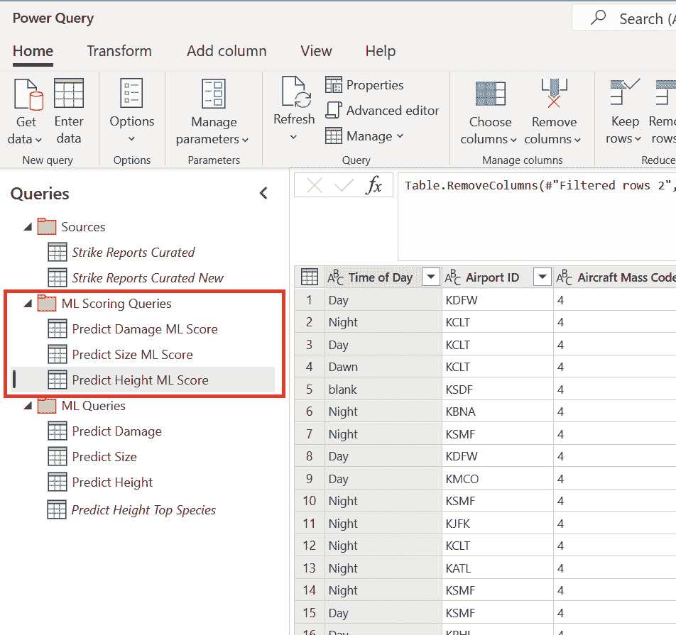

图 11.2 – 将用于使用 Power BI ML 模型评分新数据的查询组添加到新查询

现在您已经有了准备使用 Power BI ML 模型评分的新 FAA 野生动物撞击数据！这些新数据未用于训练或测试原始 ML 模型，且是在原始数据之后添加到源数据库中的，现在已准备好评分，以便您可以在使用新生成数据时评估您的 ML 模型的效用。

# 将 Power BI ML 模型应用于评分新的 FAA 野生动物撞击数据

经过 11 章的工作，您终于准备好将新数据通过您的 Power BI ML 模型运行并评估产生的预测！您将运行将每个 ML 模型应用于新数据的过程，然后浏览评分结果以比较预测与实际结果。

## 在 Power BI 中应用预测损坏 ML 模型

您现在将引用来自**ML 查询**数据流的**预测损坏 ML 评分**数据与**预测损坏 ML**模型进行对比，以便进行评分。*图 11*.3 是您用于训练、测试和现在应用**预测损坏** **ML 模型**的数据的快速总结：

|  | **训练** | **测试** | **应用（新）** |
| --- | --- | --- | --- |
| 行数 | 10,165 | 4,326 | 653 |
| 日期范围 | >= 1/1/2014 & <= 10/16/2022 | >= 1/1/2014 & <= 10/16/2022 | > 10/16/2022 & <= 3/1/2023 |

图 11.3 – 用于训练、测试和将新数据应用于预测损坏 ML 的数据的详细信息

按照以下步骤将新数据添加到**预测损坏** **ML**数据流的**编辑表**视图：

1.  选择**获取数据** | **数据流**，然后点击**下一步**。

1.  从**ML 查询**数据流中选择**预测损坏 ML 评分**并点击**创建**。

1.  点击**保存并** **关闭**。

1.  刷新**预测损坏** **ML**数据流。

现在您可以将**预测损坏 ML**模型应用于评分新数据。首先，导航到 ML 模型并点击应用模型的图标：

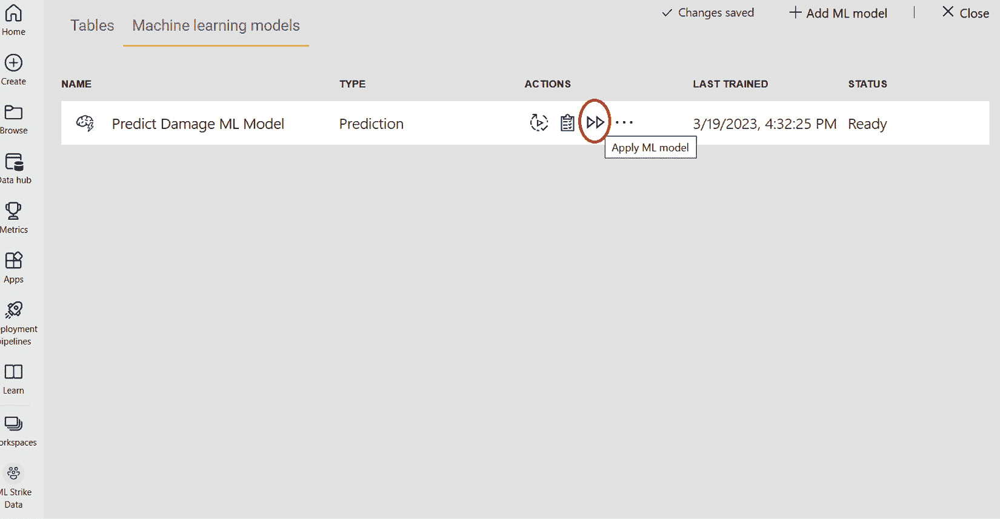

图 11.4 – 应用 ML 模型的图标

接下来，选择要评分的新数据的查询，并输入你希望用作预测损伤截止值的阈值。如你从 *第九章* 回忆的那样，最大利润的概率阈值是 0.74，但你可以在 **0** 和 **1** 之间选择任何值。以下示例显示 **0.5**：

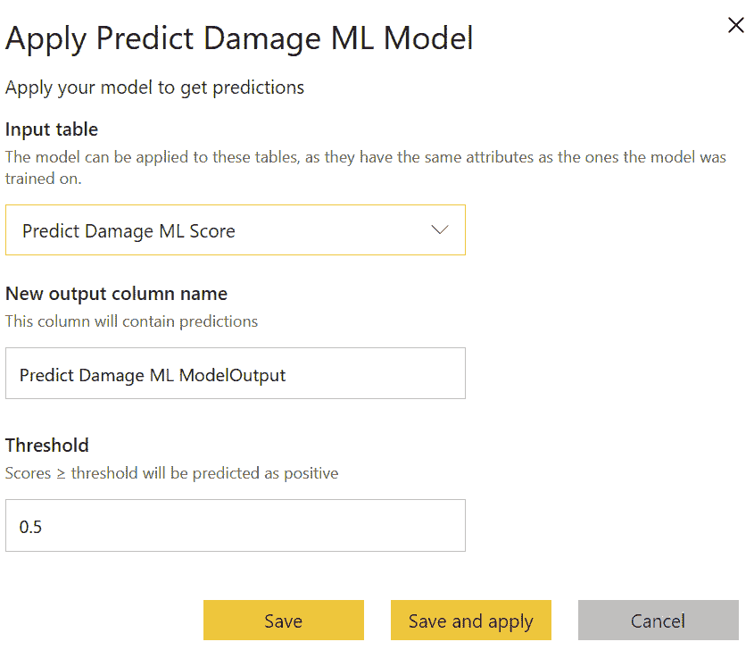

图 11.5 – 选择应用 ML 模型的输入表和阈值

当你点击 **保存并应用** 时，**Predict Power BI ML** 模型将被用于对新数据进行预测！如果新数据以一定的节奏变化，你可以设置数据流以刷新，它将自动按计划评分新数据。

一旦完成数据流的评分，你将能够访问 **Predict Damage ML** 数据流中的两个新表。在撰写本书的过程中，一些查询需要重新验证。如果你遇到错误，你可能需要遵循带有黄色警告图标的查询中的提示，并再次保存你的凭据。其中一张表将包含新评分的数据，另一张表将包含用于做出预测的特征的解释。从 Power BI Desktop 连接到这些数据流表，你可以看到第一个名为 **Predict Damage ML Score enriched Predict Damage ML** 的表包含评分的行，基于概率阈值的预测结果，用于与概率阈值比较的评分，关于预测的解释，以及一个索引列，它是第二个表的外键：

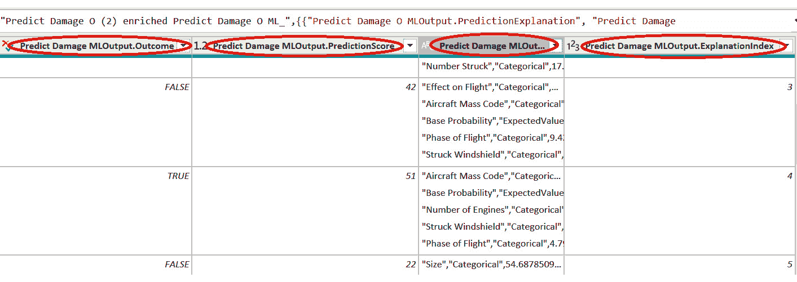

图 11.6 – 添加了预测和解释的评分新数据表

第二张表名为 **Predict Damage ML Score enriched Predict Damage ML explanations**，并为每个用于做出预测的特征包含一个单独的行。在本书的编写过程中，Power BI 服务偶尔会出现一个错误，导致此表在数据流中显示为空白。如果你遇到这个错误，使用 Power BI Desktop 连接到此表将允许你看到数据。**贡献**字段被加起来以计算第一个表的预测评分值，该值与概率阈值进行比较。负分会降低最终评分，而正分会增加评分：

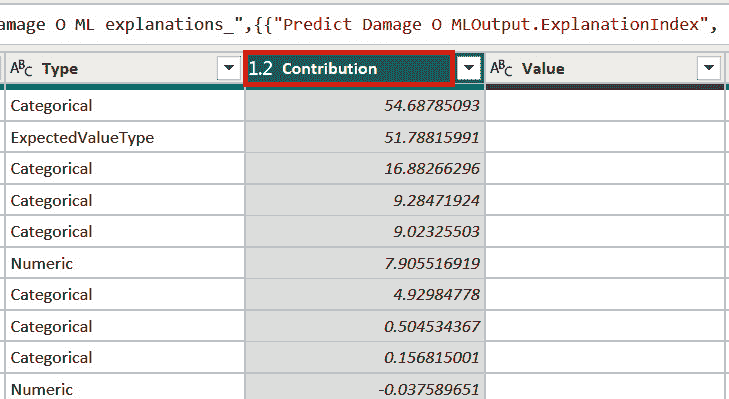

图 11.7 – 解释每个评分行的特征表

在 **Power BI Desktop 模型视图** 中，你可以看到这些表之间存在一对一的关系：

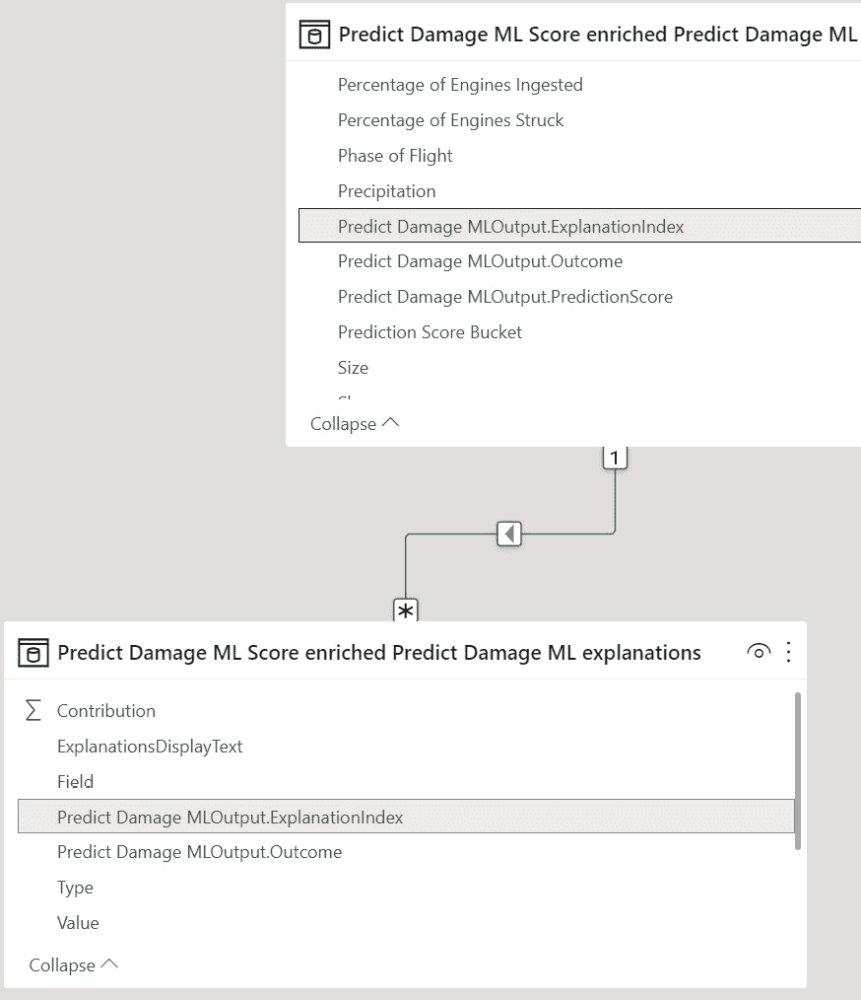

图 11.8 – 评分数据和解释之间存在一对一的关系

你可以使用 Power BI 创建交互式报告来探索新数据的 ML 模型评分结果。首先，你审查单行评分数据的各个特征的解释。为了澄清，以下截图是针对一个单一事件，由 **索引** 7 表示，该事件被赋予了预测分数 **18.00**，并记录为预测 **无损伤**，因为预测分数 18 小于 50% 的概率阈值。你可以看到预测分数 18 是通过将表格（右下角）和水下图表（左下角）中的所有 **贡献** 值相加得到的：

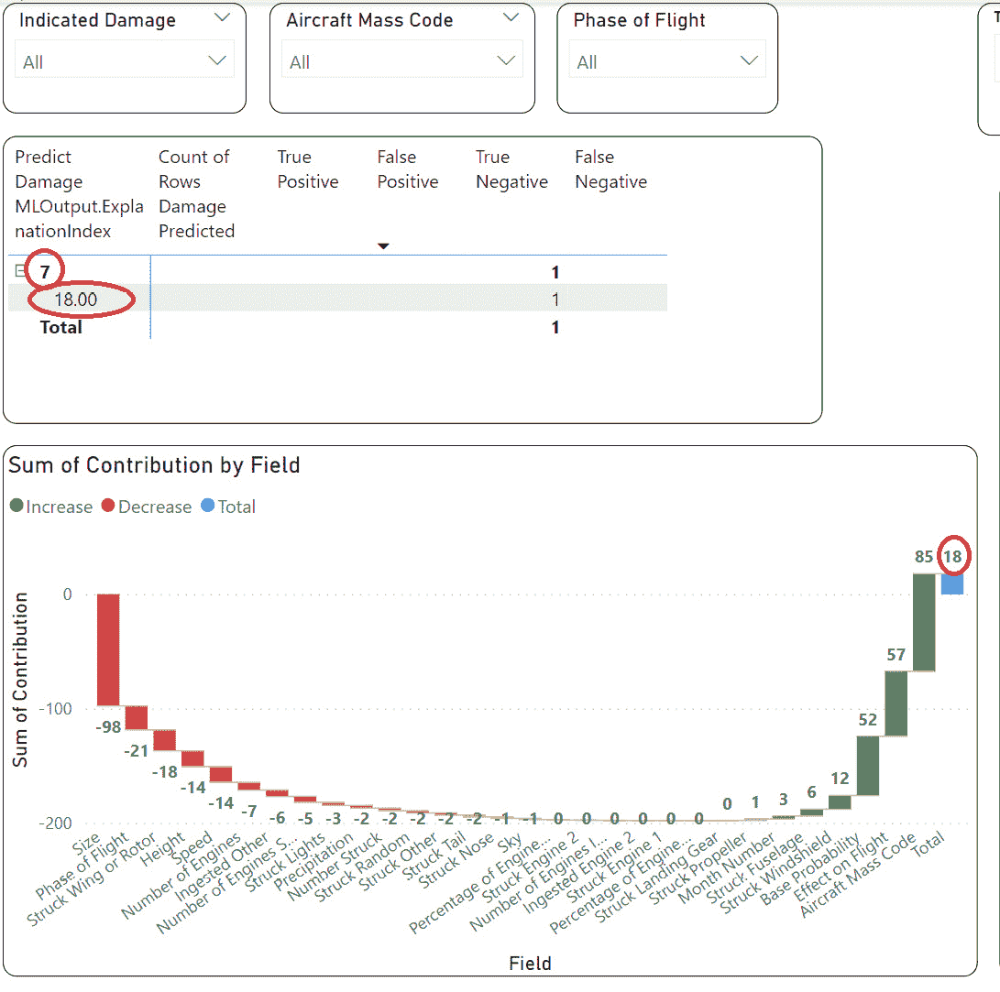

图 11.9 – 左半部分 – 用于预测单一野生动物撞击事件的损伤特征贡献

这张截图已被分成两个图，以确保你可以阅读。

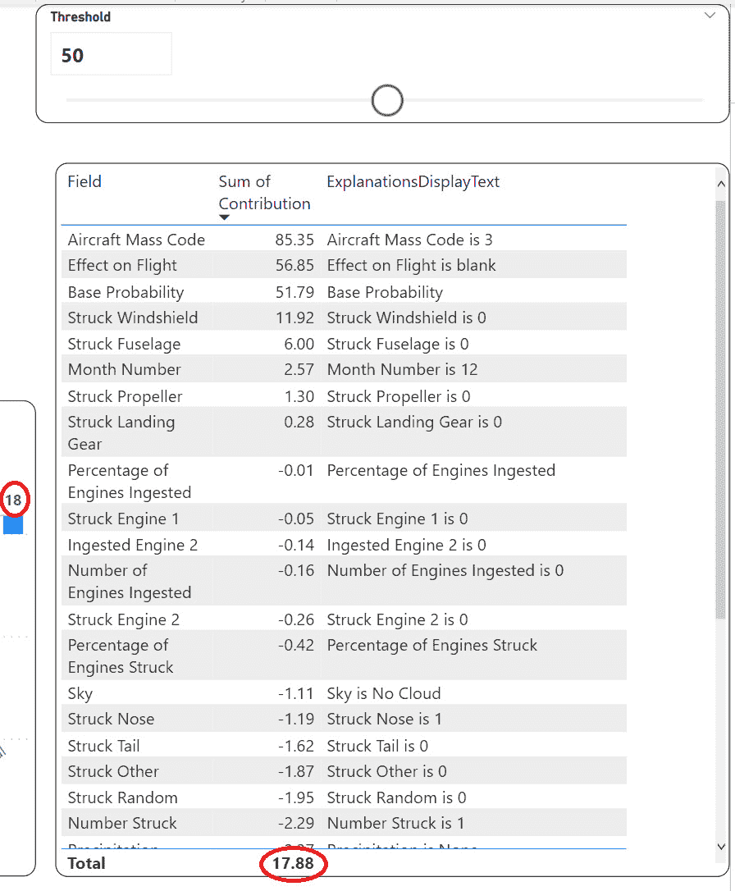

图 11.10 – 右半部分 – 用于预测单一野生动物撞击事件的损伤特征贡献

在分成 *图 11*.*9* 和 *图 11*.*10* 的瀑布图中，你可以放大查看，可以看到左侧的特征有助于保持预测分数低，而右侧的特征增加了结果：

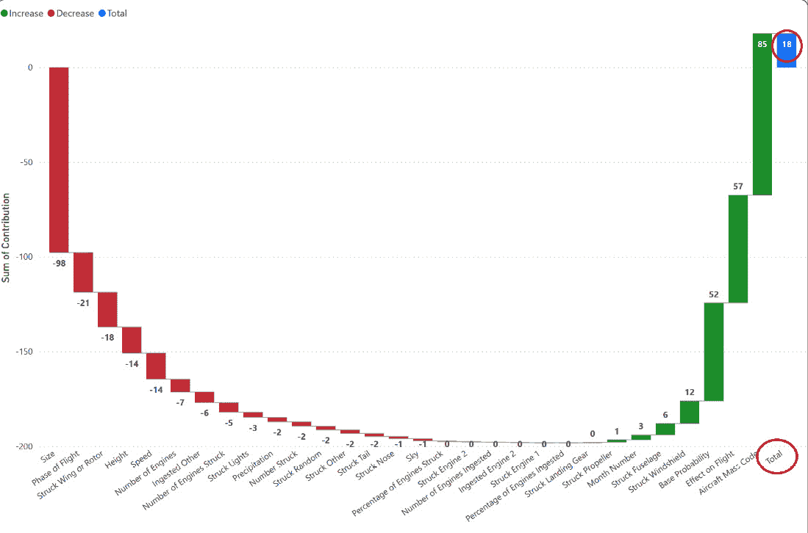

图 11.11 – 对事件预测分数 18 有贡献的特征

当给定 **索引** 值为 **2** 的另一个事件时，你会看到预测是错误的，因为它预测了损伤，但实际上没有报告。在预测得分为 85 的预测分数中，权重较强的特征可以排序到表格的顶部。这种分析可以帮助你识别可能对预测不准确有贡献的特征或特征组合，或者对预测影响较小的特征。例如，查看解释，你可以看到撞击 2-10 只大型动物对高预测分数有贡献：

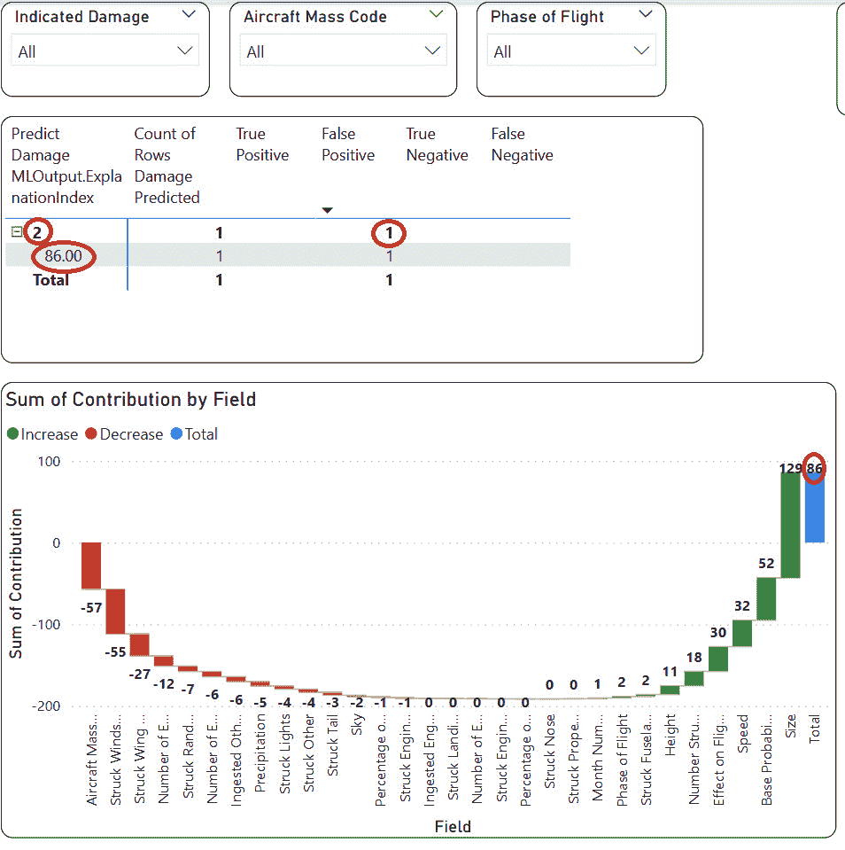

图 11.12 – 左半部分 – 预测到事件有损伤，但实际上没有

*图 11*.*12* 和 *图 11*.*13* 各自显示了屏幕的一半，以便更容易阅读。

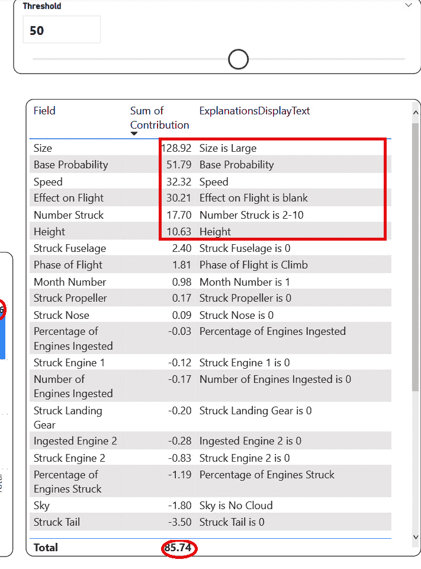

图 11.13 – 右半部分 – 预测到事件有损伤，但实际上没有

在 Power BI 中使用这些表格，您还可以汇总结果以了解规模差异。例如，在以下报告中，您可以看到按 **Size** 分解的 **Precision %** 和 **Accuracy** 指标，具有可调整的概率阈值，预测分数的分布桶，以及特征解释的汇总值：

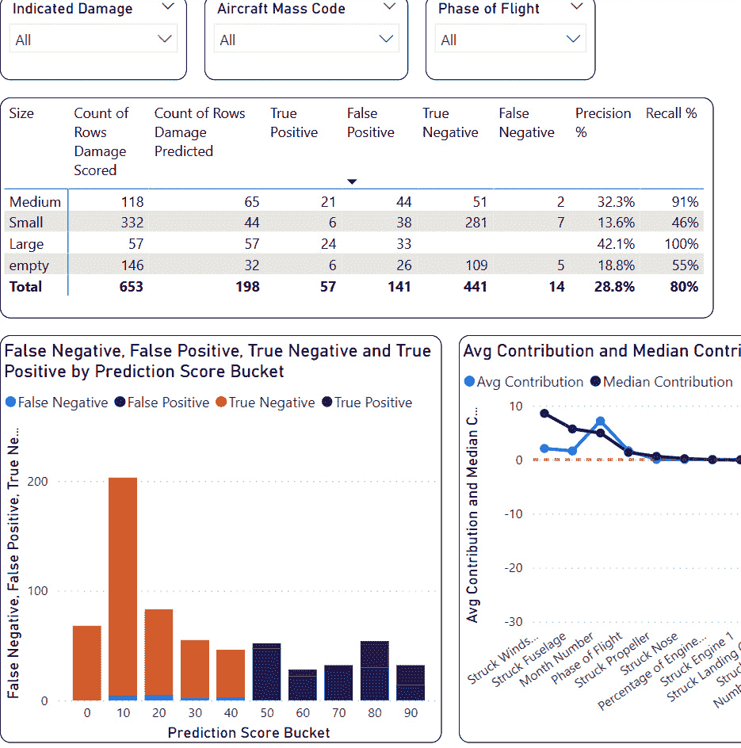

图 11.14 – 左半部分 – 新数据行的汇总评分结果

屏幕的另一部分在 *图 11*.*15* 中显示。

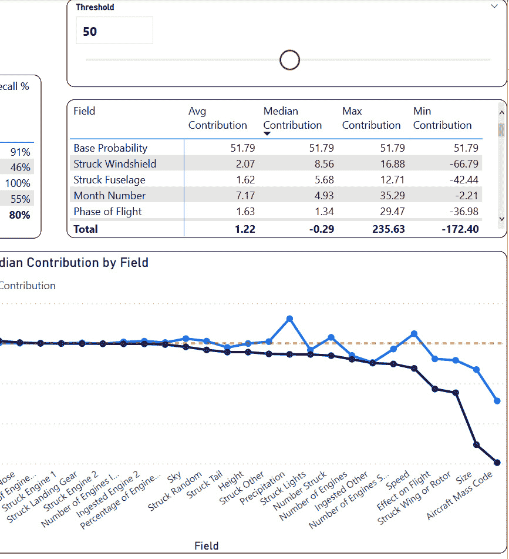

图 11.15 – 右半部分 – 新数据行的汇总评分结果

点击 **Size** 下的 **Small** 以过滤整个页面，您可以看到从平均值和中位数的角度来看，**Size** 为 **Small** 强烈地导致预测分数降低：

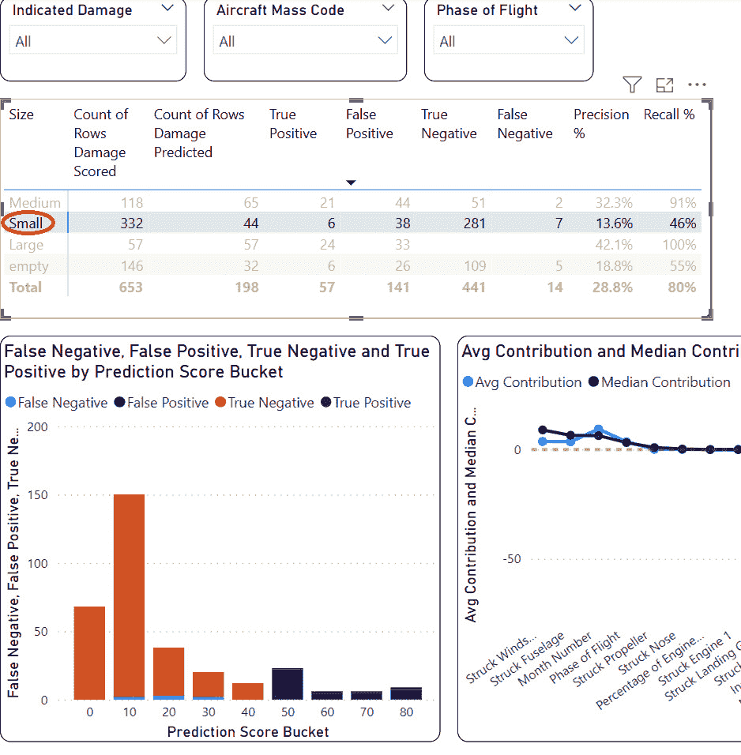

图 11.16 – 左半部分 – 将 Size 设置为 Small 的报告过滤结果

*图 11*.*17* 显示了屏幕的另一部分。

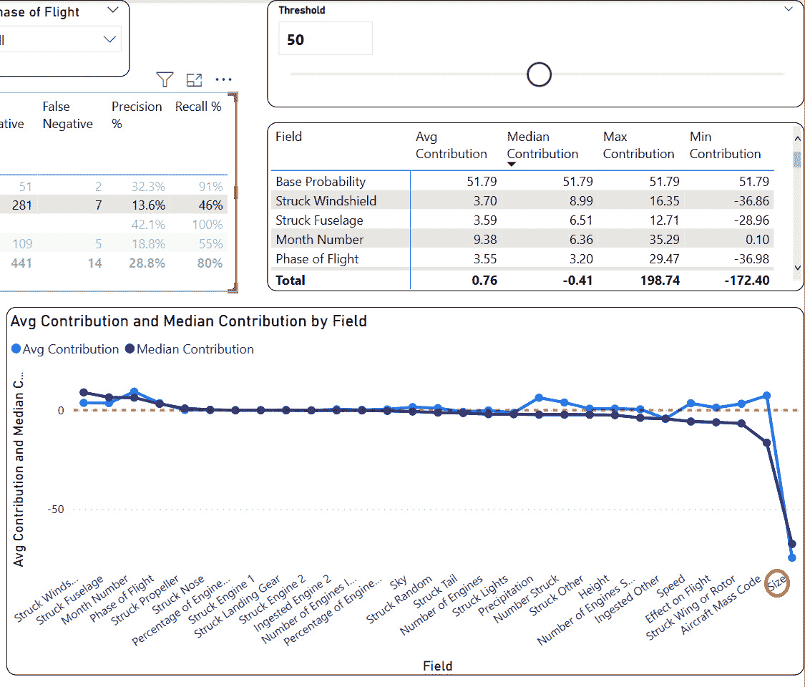

图 11.17 – 右半部分 – 对 Size 为 Small 的报告进行过滤

您可以将一些指标与已审查的模型性能报告中的值进行比较，该报告在 *第九章* 中已审查。记住，*召回率* 是可能预测为有损坏的损坏事件的百分比，而 *精度* 是预测为有损坏且实际上确实有损坏的记录数：

|  | **测试** | **新数据评分** |
| --- | --- | --- |
| 概率阈值 .5 下的召回率 | 88% | 80% |
| 概率阈值 .5 下的精度 | 30% | 29% |
| 概率阈值 .74 下的召回率 | 67% | 59% |
| 概率阈值 .74 下的精度 | 49% | 49% |

图 11.18 – 新数据召回率和精度与原始测试结果比较

新数据的结果似乎与测试结果基本一致，但现在您可以深入数据并自行判断！您现在可以继续进行到 **Predict Size ML** 模型，以在新数据上对其进行测试。

## 在 Power BI 中应用 Predict Size ML 模型

将新数据应用于 **Predict Size ML** 模型将与之前为 **Predict Damage ML** 所做的操作相比是一个重复的任务。如您从 *第十章* 中回忆的那样，**Predict Size ML** 模型在测试期间没有取得很好的结果，AUC 为 61%。ML 模型可能需要数据科学团队的重新评估或进行大量工作以提高 AUC。对新数据进行评分仍然是一项有价值的练习，有助于确定改进领域。

为了减少重复，以下是将新数据添加并应用 ML 模型的步骤摘要。按照以下步骤将新数据添加到 **Predict Size** **ML** 数据流的 **编辑表格** 视图中：

1.  选择 **获取数据** | **数据流**，然后点击 **下一步**。

1.  从 **ML 查询** 数据流中选择 **Predict Size ML Score** 并点击 **创建**。

1.  点击 **保存并关闭**。

1.  刷新 **Predict Size** **ML** 数据流。

1.  导航到 **Predict Size ML 模型** 屏幕，并点击 **应用** **ML 模型**。

1.  选择 **Predict Size ML Score** 输入表并点击 **保存并应用**。

评分完成后，你可以将评分数据和相关的特征贡献表拖入 Power BI Desktop 以查看结果。你可以为 **尺寸** 预测构建一个与 **损害** 预测类似的报告：

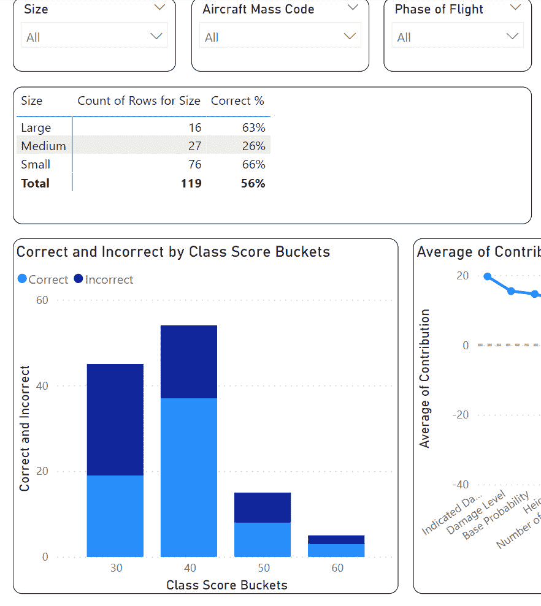

图 11.19 – 左半部分 – 新数据 Predict Size ML 评分的评估

为了便于查看，*图 11*.*19* 展示了屏幕的左半部分，而 *图 11*.*20* 展示了右侧。

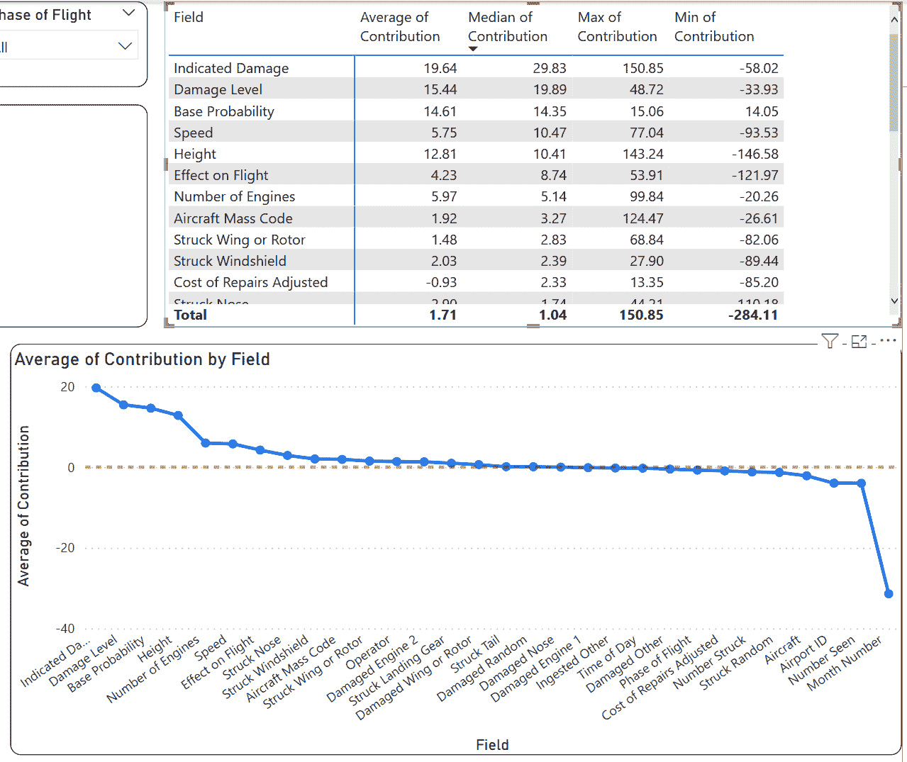

图 11.20 – 右半部分 – 新数据 Predict Size ML 评分的评估

与该 ML 模型的原始测试一样，结果几乎与随机猜测一样好。只有 119 行数据符合测试标准，这可能是结果不佳的原因之一。你可以将正确分类的结果与原始测试结果进行比较：

| **尺寸** | **测试** | **新数据评分** |
| --- | --- | --- |
| 小型 | 70% | 66% |
| 中等 | 36% | 26% |
| 大型 | 61% | 63% |

图 11.21 – 比较原始测试结果与 Predict Size ML 新评分数据

虽然新的结果仍然不是很好，但它们似乎与原始测试结果处于同一范围内。你现在可以继续对新数据进行评分，以构建最终的 ML 模型，**Predict** **Height ML**！

## 在 Power BI 中应用 Predict Height ML 模型

正如你对新数据的 **Predict Size ML** 模型评分所做的那样，你可以从 **Predict Height ML** 数据流的 **编辑表格** 视图开始，遵循类似的步骤对新数据进行评分：

1.  选择 **获取数据** | **数据流**，然后点击 **下一步**。

1.  从 **ML 查询** 数据流中选择 **Predict Height ML Score** 并点击 **创建**。

1.  点击 **保存并关闭**。

1.  刷新 **Predict Height** **ML** 数据流。

1.  导航到 **Predict Height ML** 模型屏幕，并点击 **应用** **ML 模型**。

1.  选择 **Predict Height ML Score** 输入表并点击 **保存并应用**。

与前两个机器学习模型一样，你可以将评分数据和相关的特征贡献表拖入 Power BI 桌面以查看结果。在使用回归机器学习模型时，你不是在预测是/否或分类值，而是在预测可以与实际值进行比较的数值。在回归中，不一定有正确或错误答案，而是可以比较预测数值与现实的接近程度。例如，你可以预测飞机在离地面 2,000 英尺处撞到了一只鸟，但如果实际上是在 2,052 英尺处发生，这还是一个好的预测吗？这个问题在现实世界中的答案取决于利益相关者和最终用户的要求！

下图展示了使用**预测高度**机器学习模型对新数据进行评分的预测高度、实际高度和特征贡献信息：

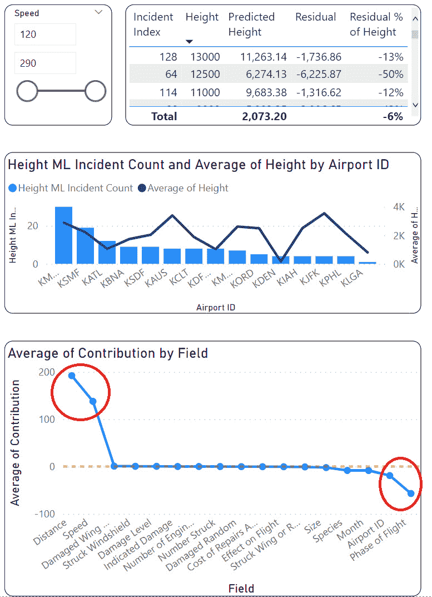

图 11.22 – 左半部分 – 比较预测高度与实际高度

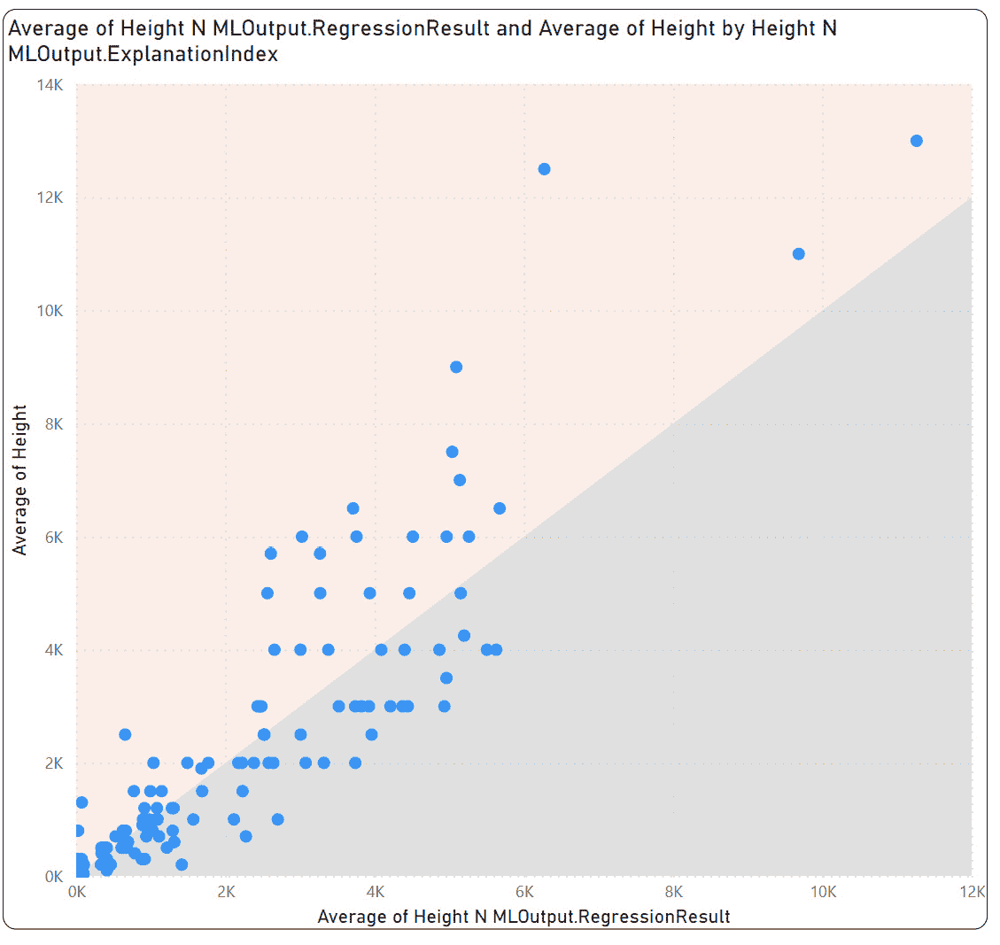

图 11.23 – 右半部分 – 比较预测高度与实际高度

如本书之前所述，实际**高度**值往往落在百位或千位的整数上。例如，这里展示的新数据中有 8 份报告记录在 4,000 英尺。这是由于报告提交者的四舍五入吗？是由于靠近机场的飞机的标准高度吗？还是有其他原因？没有更多信息，无法知道原因。在页面左下角的**按字段平均贡献**图表中，你注意到在汇总级别和筛选级别，**距离**、**速度**、**机场 ID**和**飞行阶段**特征往往有最大的贡献。

在*图 11.24*中展开列出每个单个事件的表格，你可以看到预测高度与实际高度之间的**残差**值：

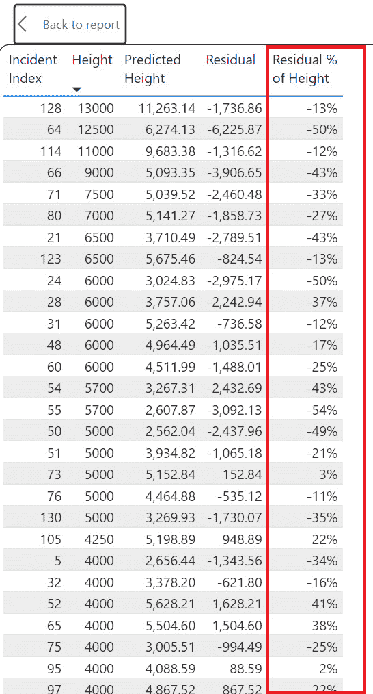

图 11.24 – 单个事件的预测高度、实际高度和残差值

在*图 11.24*中，注意预测的准确性范围在事件之间有相当大的变化。可能有许多不同的因素导致了不准确。预测能否更好？或者，由于事件性质和数据记录过程，数据中存在自然变异性？与项目利益相关者、负责记录数据的人员和数据科学专家的对话可以帮助你了解更多关于这个特定用例的信息。

您的项目已经达到一个阶段，您在 Power BI 中设计了 ML 模型，训练了它们，测试了它们，然后将它们应用到 Power BI 中新的数据上，这种方式可以与 Power BI 中的自动化流程协同工作。

# 摘要

在本章中，您将新的 FAA 野生动物撞击数据引入 Power BI，并将数据转换为与您原始架构设计相匹配。然后，您将数据转换为满足用于训练和测试您的**预测损伤 ML**、**预测尺寸 ML**和**预测高度 ML**模型的数据的过滤和转换要求。接着，您通过应用训练好的 Power BI ML 模型对新数据进行预测。最后，您回顾了预测结果，并将它们与实际结果进行了比较。

*第十二章*将为您的项目增添一个特别的转折！对于那些身处现实世界中的您，数据项目中的范围和期望的改变是经常发生的事情。当本书正在编写时，**OpenAI**和**微软 OpenAI**正迅速成为媒体 sensation。您的利益相关者要求您在项目中找到一些 OpenAI 的应用案例。这是您项目范围的一次改变，但将是一次激动人心的冒险！*第十二章*将回顾 OpenAI 和微软 OpenAI 的提供内容，因为它们可以应用于此项目以增加价值。

# 第四部分：将 OpenAI 与 Power BI 集成

在本书的最后一部分，您将了解如何利用 Open AI 和 Azure OpenAI 来增强您的 BI 工作。在最后一章中，您将回顾本书中涵盖的一些关键思想和经验教训，并思考如何将它们应用到您自己的工作中。

以下三个章节构成了*第四部分*：

+   *第十二章*, *OpenAI 的应用案例*

+   *第十三章*, *在 Power BI 数据流中使用 OpenAI 和 Azure OpenAI*

+   *第十四章*, *项目回顾与展望*
