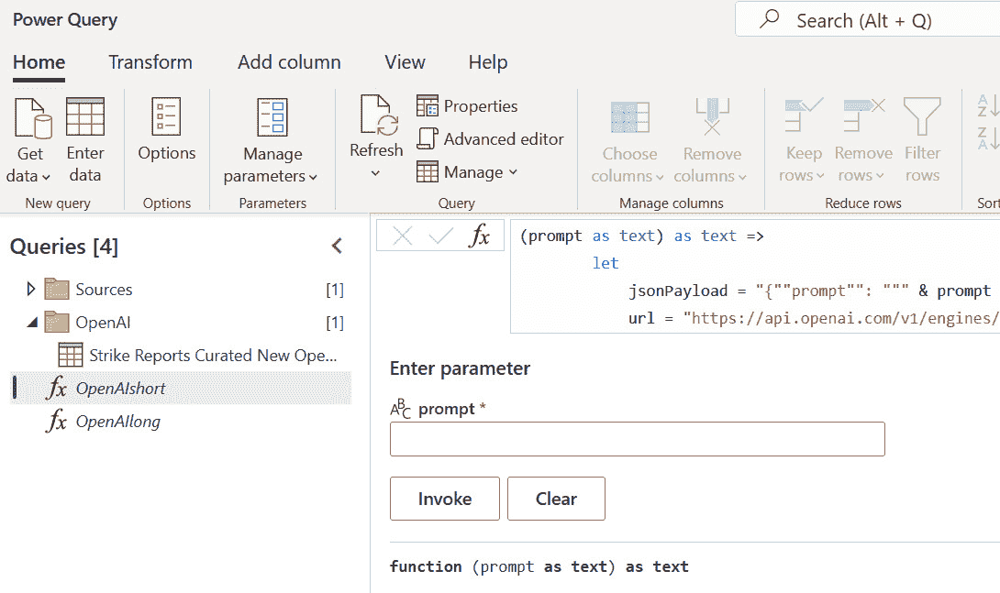
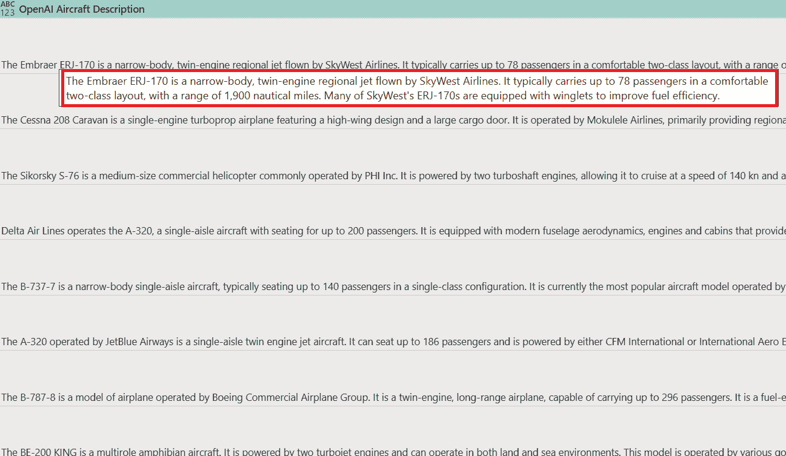
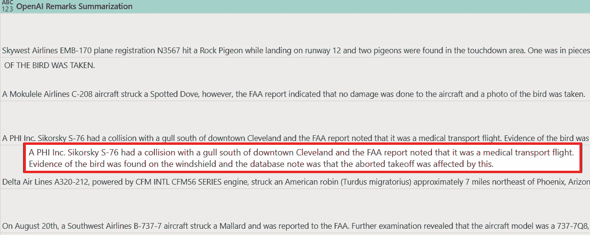
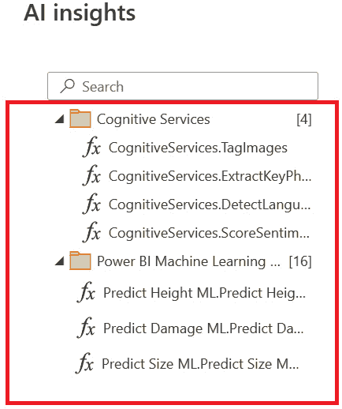
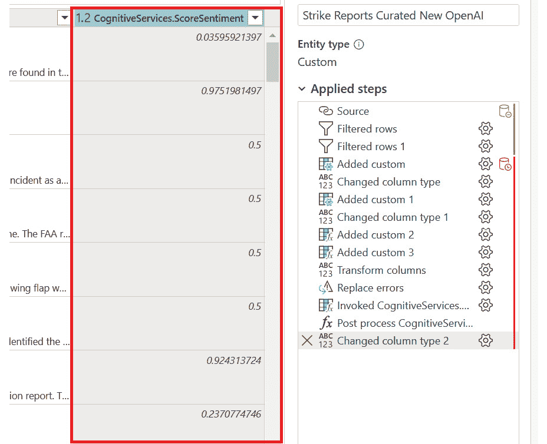
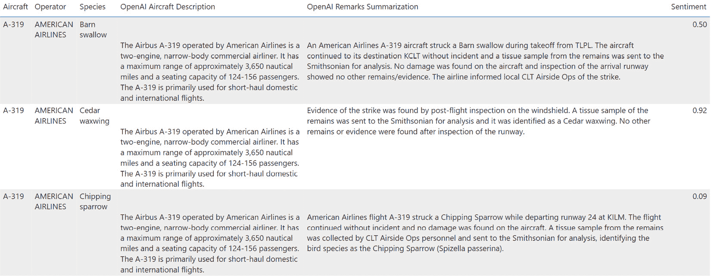
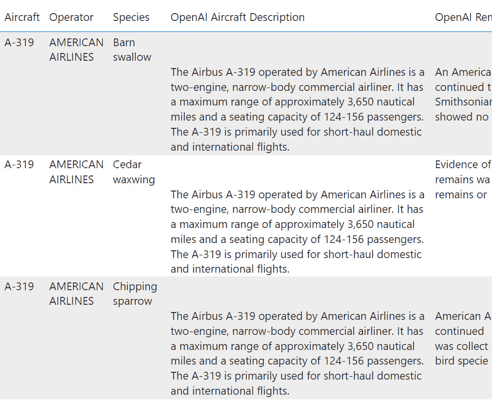
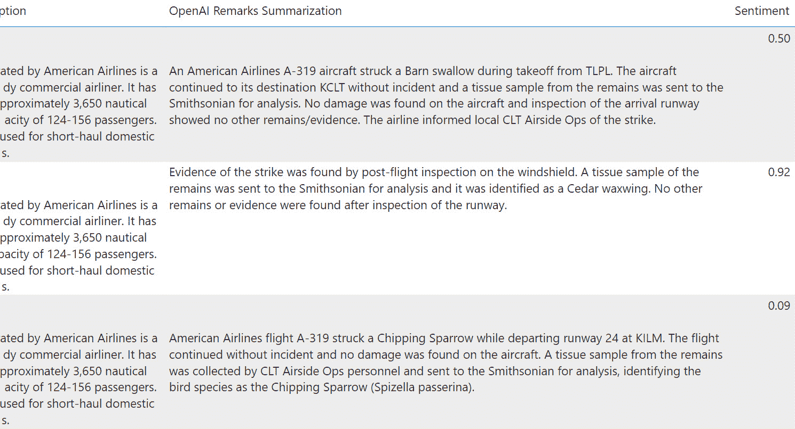

# 第十三章：在 Power BI 数据流中使用 OpenAI 和 Azure OpenAI

本书*第十二章*概述了 OpenAI 和 Azure OpenAI 技术。该章节还探讨了使用 FAA 野生动物撞击数据将这些前沿 AI 技术融入您用例的方法。为了提高*第十二章*的内容质量，使用了 OpenAI ChatGPT 生成更好的文本。展望未来，ChatGPT 将偶尔作为提高本书其他部分写作质量的工具使用。

此外，本章详细讨论了 OpenAI 和 Azure OpenAI 技术的两个用例。具体来说，您将关注它们在摘要和描述性内容生成中的应用，如*第十二章*所述。为了说明这些用例，本章包含了一个项目。

在本章中，您将了解如何将 OpenAI（或 Azure OpenAI）集成到您的 Power BI 解决方案中，用于处理 FAA 野生动物撞击数据。通过这种集成，您可以通过向 Power BI 数据流添加新功能来利用 GPT 模型 API。这些功能将使您能够为解决方案中每行的数据生成新的内容。您还将使用 Power BI 中的 **认知服务**，这是一种在 Power Query 和数据流中存在了几年的 AI 功能。

到本章结束时，您将获得应用 GPT REST API 到 OpenAI 或 Azure OpenAI 以 Power BI 数据流的知识。这些数据流可以按照预定义的日程进行刷新。这种能力将为您提供一套强大的工具集，以最小的努力从数据中生成新的内容和见解。本章提供的逐步说明和示例将使您具备在您自己的项目中实施此解决方案的必要技能。

# 技术要求

对于本章，您需要以下内容：

+   原始开源 OpenAI 的账户：[`openai.com/`](https://openai.com/)。

+   可选 – 作为您 Azure 订阅的一部分的 Azure OpenAI：[`azure.microsoft.com/en-us/products/cognitive-services/openai-service`](https://azure.microsoft.com/en-us/products/cognitive-services/openai-service)。本书编写时将其设置为可选，因为并非所有人都可以在出版时使用。

+   来自 FAA 网站或 Packt GitHub 网站的 FAA 野生动物撞击数据文件。

+   Power BI Pro 许可证。

+   以下 Power BI 许可证选项之一用于访问 Power BI 数据流：

    +   Power BI Premium

    +   Power BI Premium Per User

+   将数据输入 Power BI 云服务的以下选项之一：

    +   Microsoft OneDrive（与 Power BI 云服务连接）

    +   Microsoft Access + Power BI 网关

    +   Azure Data Lake（与 Power BI 云服务连接）

# 配置 OpenAI 和 Azure OpenAI 以在您的 Power BI 解决方案中使用

在进行 OpenAI 和 Azure OpenAI 的配置之前，重要的是要注意，截至本书编写时，OpenAI 仍是一种新兴技术。随着技术的进步，OpenAI 与 Power BI 的集成可能会变得更加技术化。然而，本章将演示的使用案例将保持适用。

因此，本章提供的说明将展示如何利用这种集成来增强你在 Power BI 上下文中的数据分析能力。

## 配置 OpenAI

你可以从此链接创建 OpenAI 账户（如果你还没有的话）：[`chat.openai.com/auth/login`](https://chat.openai.com/auth/login)。截至本书编写时，新账户将获得试用积分以开始使用 OpenAI。如果你用完了试用积分，或者本书编写后不再提供试用，你可能需要为使用 OpenAI 支付费用。定价详情可以在此链接找到：[`openai.com/pricing`](https://openai.com/pricing)。

一旦你拥有 OpenAI 账户，你需要创建一个 API 密钥，该密钥将用于验证你的 API 调用。API 密钥可以在此链接轻松创建：[`platform.openai.com/account/api-keys`](https://platform.openai.com/account/api-keys)。例如，点击 `abc123xyz` 作为示例密钥用于示例代码。请确保使用 OpenAI 的实际**密钥**，而不是**密钥名称**。

一旦你拥有账户和 API 密钥，你就可以为本书使用 OpenAI 了！

## 配置 Microsoft Azure OpenAI

OpenAI 也可作为 Microsoft Azure 的一项服务。通过使用 Microsoft Azure OpenAI 服务，用户可以利用 Azure 的优势，例如基于角色的访问安全、私有网络和与 Azure 中的其他 Microsoft 工具集成的全面安全工具，来利用大规模 AI 模型。对于大型组织，账单和治理可以集中化，以确保 AI 的负责任使用。

在本书的范围内，Azure OpenAI 作为原始 OpenAI 的替代品是可选的。由于它是一种需求量大的新技术，Azure OpenAI 可能并非对所有人可用。研讨会中的所有内容都可以使用 OpenAI 或 Azure OpenAI 完成。

设置 Azure OpenAI 的说明可以在以下链接中找到：[`learn.microsoft.com/en-us/azure/cognitive-services/openai/how-to/create-resource/`](https://learn.microsoft.com/en-us/azure/cognitive-services/openai/how-to/create-resource/)。创建资源后，您也可以根据该链接的说明部署模型。如*第十二章*中所述，您将使用`text-davinci-003`模型进行本章相关的工作坊。OpenAI 正在快速发展，您在阅读本书时可能能够选择不同的模型。在执行以下步骤时请注意以下值；它们将在本章的后续部分中需要：

+   本章的示例使用`PBI_OpenAI_project`。

+   `text-davinci-003`模型部署。本书将使用`davinci-PBIML`作为代码示例中部署的名称。

接下来，您需要为您的 Azure OpenAI API 调用创建一个密钥。以本书为例，从您的 Azure OpenAI 资源，命名为`PBI_OpenAI_project`，使用`abc123xyz`作为示例密钥。

一旦您已经设置并准备好 OpenAI 或 Azure OpenAI，您可以使用 FAA 野生动物打击数据为您的项目添加一些新的生成文本功能！

# 准备 Power BI 数据流以用于 OpenAI 和 Azure OpenAI。

在*第十二章*中，您决定使用 OpenAI 为您与 FAA 野生动物打击数据库项目相关的两个用例：

+   为每个事件生成飞机型号和飞机操作员的描述。

+   概括报告中每个事件提供的自由文本备注。

由于 OpenAI 在撰写本书时仍处于起步阶段，Power BI 尚未在产品中内置连接器。但您仍然可以使用自定义 M 脚本从 Power Query 和 Power BI 数据流中调用 OpenAI 和 Azure OpenAI API。让我们开始吧！

首先，您将为 Power BI 中的 OpenAI 和认知服务创建一个新的数据流：

1.  从您的 Power BI 工作区，在功能区选择**新建** | **数据流**。

1.  选择**定义新表** | **从其他数据流链接表**。

1.  登录并点击**下一步**。

1.  扩展您的 workspace。

1.  扩展**打击报告**数据流并检查**打击报告****精选新**。

1.  点击**转换数据**。

1.  创建一个名为**来源**的组，并将**打击报告精选新**移动到该组。

1.  右键单击**打击报告精选新**并取消选择**启用加载**。

接下来，您将创建一个用于与 OpenAI 和认知服务一起使用的查询版本：

1.  右键单击**打击报告精选新**并选择**引用**。

1.  将新查询重命名为`打击报告精选` `New OpenAI`。

1.  创建一个名为**OpenAI**的组，并将**打击报告精选新 OpenAI**移动到该组。

在*第十二章*中，您决定使用 FAA 野生动物打击`UNKNOWN`：

1.  对于`UNKNOWN`、`UNKNOWN COMMERCIAL`、`BUSINESS`和`PRIVATELY` `OWNED`值。

1.  对于 `未知`。

1.  对于 `未知鸟类`、`未知鸟类 - 大型`、`未知鸟类 - 中型`、`未知鸟类 - 小型` 和 `未知鸟类或蝙蝠`。

对于 `(空白)`。

最后——这是一个可选步骤——您可以根据测试目的过滤行数。OpenAI 和 Azure OpenAI 都可能产生费用，因此限制此研讨会中的调用次数是有意义的。在本书的示例中，**Strike Reports Curated New OpenAI** 表将过滤到 2022 年 12 月或之后发生的事件，可以使用 **事件** **日期** 列进行过滤。

现在您已经准备好将 OpenAI 和认知服务内容添加到您的数据中！

# 在 Power BI 数据流中创建 OpenAI 和 Azure OpenAI 函数

如前所述，将 OpenAI 和 Azure OpenAI 与 Power Query 或数据流集成目前需要自定义 M 代码。为了简化此过程，我们已为 OpenAI 和 Azure OpenAI 提供了 M 代码，让您可以根据具体需求和需求选择要使用的版本。

通过利用提供的 M 代码，您可以无缝地将 OpenAI 或 Azure OpenAI 集成到现有的 Power BI 解决方案中。这将使您能够利用这些强大 AI 技术的独特功能和能力，同时轻松地从数据中获得见解并生成新内容。

## OpenAI 和 Azure OpenAI 函数

OpenAI 提供了一个用户友好的 API，可以轻松地从 Power Query 或 Power BI 中的数据流中访问和使用。有关 API 的具体信息，我们建议您查阅官方 OpenAI 文档，该文档可通过以下链接获取：[`platform.openai.com/docs/introduction/overview`](https://platform.openai.com/docs/introduction/overview)。

值得注意的是，优化和调整 OpenAI API 很可能在明年成为一个热门话题。包括 **提示工程**、**最佳令牌使用**、微调、嵌入、插件以及修改响应创造性的参数（如温度和 top *p*）在内的各种概念，都可以进行测试和微调以获得最佳结果。

虽然这些主题很复杂，可能在未来的作品中进行更详细的探讨，但本书将主要关注在 OpenAI 和 Power BI 之间建立连接。具体来说，我们将探讨提示工程和令牌限制，这些是确保最佳性能的关键考虑因素，并将被纳入 API 调用中：

+   `[操作员]` 和 `[飞机]` 作为没有上下文的值，在前一章中添加到请求中的文本，以便 API 能够接收 `告诉我关于由 [操作员] 运行的飞机型号 [飞机] 的三个句子:`。这个提示为传递给 OpenAI 模型的值添加了上下文。

+   **令牌**：发送到 OpenAI 模型的单词被分成称为令牌的块。根据 OpenAI 网站的信息，一个令牌包含大约四个英语字符。查看 Power BI 数据集中的 **备注** 列可以揭示大多数条目最多有 2,000 个字符。（2000 / 4）= 500，因此您将指定 500 作为令牌限制。这是正确的数字吗？您需要做大量的测试来回答这个问题，但这超出了本书的范围。

让我们开始构建您的 OpenAI 和 Azure OpenAI API 调用，用于 Power BI 数据流！

## 为 Power BI 数据流创建 OpenAI 和 Azure OpenAI 函数

您将在数据流中为 OpenAI 创建两个函数，命名为 **OpenAI**。这两个函数之间的唯一区别将是令牌限制。设置不同令牌限制的主要目的是为了节省成本，因为更大的令牌限制可能会产生更高的账单。按照以下步骤创建一个名为 **OpenAIshort** 的新函数：

1.  选择 **获取数据** | **空白查询**。

1.  将以下 M 代码粘贴进去，并使用您的 OpenAI API 密钥选择 `abc123xyz`。

下面是这个函数的代码。该代码也可以在 Packt GitHub 仓库的 [`github.com/PacktPublishing/Unleashing-Your-Data-with-Power-BI-Machine-Learning-and-OpenAI/tree/main/Chapter-13`](https://github.com/PacktPublishing/Unleashing-Your-Data-with-Power-BI-Machine-Learning-and-OpenAI/tree/main/Chapter-13) 中的 `01 OpenAIshortFunction.M` 文件找到：

```py
let
    callOpenAI = (prompt as text) as text =>
        let
            jsonPayload = "{""prompt"": """ & prompt & """,            ""max_tokens"": " & Text.From(120) & "}",
            url = "https://api.openai.com/v1/engines/            text-davinci-003/completions",
            headers = [#"Content-Type"="application/json",             #"Authorization"="Bearer abc123xyz"],
            response = Web.Contents(url, [Headers=headers,             Content=Text.ToBinary(jsonPayload)]),
            jsonResponse = Json.Document(response),
            choices = jsonResponse[choices],
            text = choices{0}[text]
        in
            text
in
    callOpenAI
```

1.  现在，您可以重命名函数 `OpenAIshort`。在 **查询** 面板中右键单击函数并复制它。新函数将具有更大的令牌限制。

1.  将此新函数重命名为 `OpenAIlong`。

1.  右键单击 **OpenAIlong** 并选择 **高级编辑器**。

1.  将读取 `Text.From(120)` 的代码部分更改为 `Text.From(500)`。

1.  点击 **确定**。

您的屏幕现在应该看起来像这样：



图 13.1 – 添加到 Power BI 数据流的 OpenAI 函数

这两个函数可以用来完成本章剩余部分的研讨会。如果您想使用 Azure OpenAI，请使用带有您的 Azure 资源名称 `PBI_OpenAI_project`、部署名称 `davinci-PBIML` 和 API 密钥 `abc123xyz` 的 M 代码：

```py
let
    callAzureOpenAI = (prompt as text) as text =>
        let
            jsonPayload = "{""prompt"": """ & prompt & """,             ""max_tokens"": " & Text.From(120) & "}"
            url = "https://" & "PBI_OpenAI_project" & ".openai.azure.            com" & "/openai/deployments/" & "davinci-PBIML" & "/            completions?api-version=2022-12-01",
            headers = [#"Content-Type"="application/json",             #"api-key"="abc123xyz"],
            response = Web.Contents(url, [Headers=headers,             Content=Text.ToBinary(jsonPayload)]),
            jsonResponse = Json.Document(response),
            choices = jsonResponse[choices],
            text = choices{0}[text]
        in
            text
in
    callAzureOpenAI
```

与前一个示例一样，将 `Text.From(120)` 的令牌限制更改为 `Text.From(500)`，这就是创建一个 500 令牌而不是 120 令牌的 Azure OpenAI 函数所需做的全部工作。创建您的 OpenAI 函数数据流的 M 代码也可以在 Packt GitHub 网站上的此链接找到：[`github.com/PacktPublishing/Unleashing-Your-Data-with-Power-BI-Machine-Learning-and-OpenAI/tree/main/Chapter-13`](https://github.com/PacktPublishing/Unleashing-Your-Data-with-Power-BI-Machine-Learning-and-OpenAI/tree/main/Chapter-13)。

现在，您已经在 Power BI 数据流中准备好了 OpenAI 和 Azure OpenAI 函数，您可以在 FAA 野生动物撞击数据上测试它们！

# 在 Power BI 数据流中使用 OpenAI 和 Azure OpenAI 函数

你的下一步是准备 FAA 野生动物撞击数据，以便 OpenAI 或 Azure OpenAI 函数进行内容生成和摘要。如前所述，你需要构建有效的提示，为 OpenAI 模型提供处理上下文。**“新整理的 OpenAI 报告”**的完成查询，可以复制并粘贴到 Power BI 中，也可在 Packt GitHub 仓库中找到：[`github.com/PacktPublishing/Unleashing-Your-Data-with-Power-BI-Machine-Learning-and-OpenAI/tree/main/Chapter-13`](https://github.com/PacktPublishing/Unleashing-Your-Data-with-Power-BI-Machine-Learning-and-OpenAI/tree/main/Chapter-13)。

回顾*第十二章*，你决定使用以下组合的新文本与 FAA 野生动物撞击数据库的行级内容：

+   生成有关飞机和载具的新信息：`告诉我关于由[运营商]在[操作]的飞机型号[Aircraft]的三个句子：`

+   摘要每个报告中的备注，包括运营商、飞机和物种：`总结以下内容：一架[运营商] [飞机型号]撞击了一只[物种]。FAA 报告中的备注是：[备注]`

你现在可以向**新整理的打击报告**查询中添加两个新列。首先，添加一个用于提示文本生成的列：

1.  选择**添加列**|**自定义列**。

1.  设置`文本``生成提示`。

1.  粘贴以下文本：“告诉我关于由" & [飞机型号] & " " & [运营商] & "操作的飞机型号在三个句子中的情况：”。然后，选择**确定**。

1.  将数据类型更改为`文本`。

1.  验证新列创建的文本，这些文本将作为带有内置提示的信息使用，看起来如下：


图 13.2 – 与 OpenAI 一起使用的新列

现在创建一个第二列，该列将用于文本摘要，并且包含内置提示：

1.  选择**添加列**|**自定义列**。

1.  设置`文本``摘要提示`。

1.  粘贴以下文本：“总结以下内容：一架" & [运营商] & " " & [飞机型号] & "撞击了一只" & [物种] & "。FAA 报告中的备注是：" & [备注]。

1.  将数据类型更改为`文本`。

1.  验证带有内置提示的摘要新列看起来如下：


图 13.3 – 带内置提示的摘要新列

现在你已经在 Power BI 数据流查询中创建了两个列，它们已准备好用于 OpenAI 函数！首先，使用`OpenAIshort`函数调用 OpenAI 进行文本生成：

1.  选择**添加列**|**自定义列**。

1.  设置`OpenAI``飞机描述`。

1.  将以下文本粘贴到`OpenAIshort([Text` `Generation Prompt])`。

1.  点击**确定**。

1.  验证 OpenAI 为新的列生成了文本。你可以在新列的字段上悬停以阅读全文：



图 13.4 – OpenAI 使用来自 FAA 野生动物撞击数据库之外的新数据为该运营商生成飞机描述

重复前面的步骤，对 `OpenAIlong` 函数进行文本摘要：

1.  选择 **添加列** | **自定义列**。

1.  设置 `OpenAI` `备注摘要`。

1.  将以下文本粘贴到 `OpenAIlong([文本摘要提示])` 中。

1.  点击 **确定**。

1.  验证 OpenAI 为新列生成了文本，并且你还可以将鼠标悬停在字段上以查看完整的摘要：



图 13.5 – 关于飞机撞击野生动物的备注文本摘要

你成功了！OpenAI 成功用于生成有关飞机的新信息，并总结野生动物撞击事件的自由文本备注。你可能想在此时保存你的数据流，以免丢失任何工作。

# 将认知服务功能添加到解决方案中

最后，你决定通过展示 Power BI 中的认知服务功能来为交付成果增加更多价值。在 Power BI Desktop 和 Power BI 数据流中，认知服务作为 SaaS 工具的一部分内置。有关在 Power BI 中使用认知服务的详细信息，请参阅此链接：[`learn.microsoft.com/en-us/power-bi/connect-data/service-tutorial-use-cognitive-services`](https://learn.microsoft.com/en-us/power-bi/connect-data/service-tutorial-use-cognitive-services)。

认知服务是指可以使用 API 调用并使用标准 ML 模型评分数据的 Azure 服务。这些工具可以评分文本的情感，识别图像，提取关键短语，检测图片中的情绪等。以下认知服务功能在撰写本书时是 Power BI 的原生功能：

+   **检测语言**

+   **标记图像**

+   **评分情感**

+   **提取** **关键短语**

对于这个项目的最终补充，你将使用 `0` 到 `1` 的 `Score Sentiment` 函数，其中 `0` 表示负面，`0.5` 表示中性，`1` 表示正面。

打开你的 **OpenAI** 数据流，导航到 **Strike Reports Curated New OpenAI** 的查询，并按照以下步骤操作：

1.  高亮显示 **备注** 列。

1.  导航到 **主页** | **洞察** | **AI 洞察**。

1.  登录后，将弹出 **AI 洞察** 窗口。

1.  注意，认知服务可用，以及你创建的 Power BI ML 模型！你还可以使用此功能来在不同数据流中重复使用你的 Power BI ML 模型来评分多个数据列。



图 13.6 – 认知服务和 Power BI ML 模型可以作为函数调用

1.  选择 **CognitiveServices.ScoreSentiment**。

1.  从下拉菜单中选择**备注**列，然后点击**应用**。

1.  将数据类型更改为**小数**。

1.  验证情感分数已被评分并添加为新的列：



图 13.7 – 备注列的情感分数

你现在可以保存并刷新你的数据流，任务完成！当数据流刷新后，你可以从 Power BI Desktop 连接并浏览你的工作结果：



图 13.8 – 在 Power BI 中查看的 OpenAI 和认知服务的结果

为了便于阅读，*图 13.8* 被拆分为两张图片。*图 13.9* 展示了左侧的列。



图 13.9 – 在 Power BI 中查看的 OpenAI 和认知服务的结果

右侧的列在 *图 13.10* 中展示。



图 13.10 – 在 Power BI 中查看的 OpenAI 和认知服务的结果

一旦你掌握了如何在 Power BI 中实现各种工具和服务的使用方法，例如 OpenAI 或 Azure OpenAI 提供的认知服务，你就可以尝试不同的提示策略，并探索广泛的附加功能。

通过利用本书中获得的知识和技能，你将能够测试新想法，微调你的方法，并优化解决方案的性能。有了这些工具在手，你在 Power BI 中增强数据分析和内容生成能力的可能性几乎是无限的。所以，不要害怕深入探索这些强大技术所能提供的一切！

# 摘要

本章介绍了 OpenAI 或 Azure OpenAI 与 Power BI 的集成，以及 Power BI 认知服务的用例。通过利用这些高级工具，你能够使用外部数据和 GPT 模型生成飞机的新描述，总结关于野生动物撞击的备注，甚至对备注进行情感分析评分。

接下来，下一章和最后一章将提供一个机会来回顾和反思本书及配套研讨会中完成的工作。我们还将开始探索增强和扩展现有项目的新策略，因为我们认识到，如果仍有实现额外价值的潜力，项目就永远不会真正完成。
