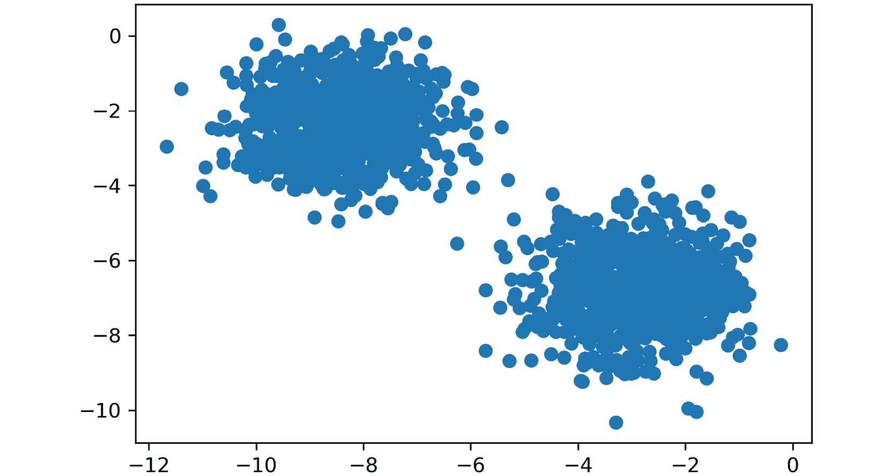
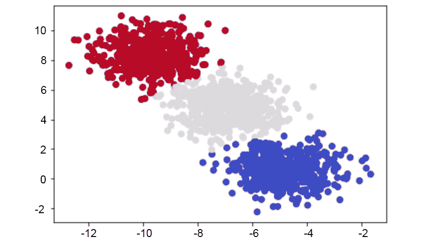
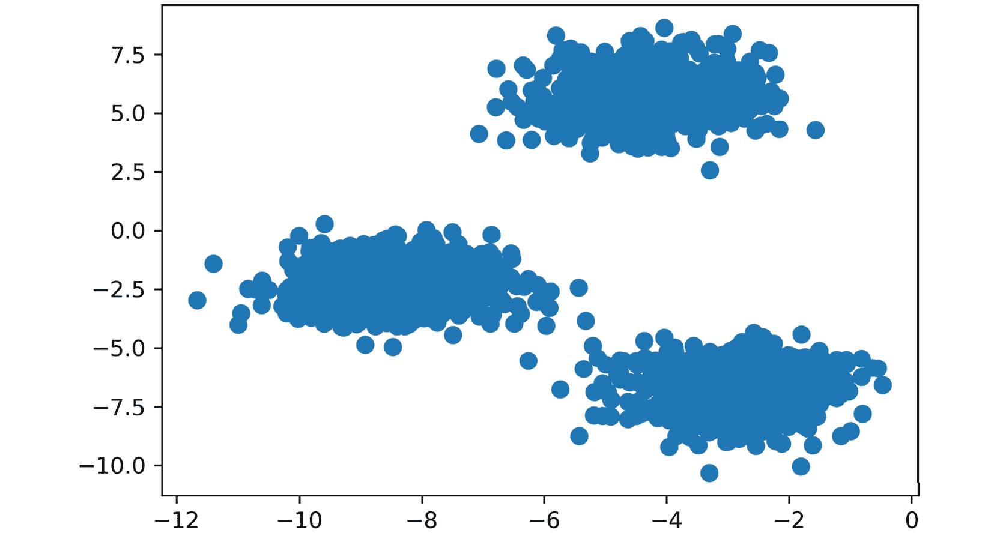

# 第二章：1\. 聚类介绍

概述

在数据中寻找洞察和价值是机器学习崛起时所承诺的雄心壮志。在机器学习中，有些方法是通过预测性方式深入理解密集信息，还有一些方法则是根据输入的变化来预测结果。在本章中，我们将了解监督学习和无监督学习是什么，以及它们如何应用于不同的使用场景。一旦你对无监督学习的应用领域有了更深入的理解，我们将逐步介绍一些能快速提供价值的基础技术。

到本章结束时，你将能够使用内置的 Python 包实现 k-means 聚类算法，并计算轮廓系数。

# 介绍

你有没有被要求查看一些数据，但最终一无所获？也许你对数据集不熟悉，或者甚至不知道从哪里开始。这可能让你感到非常沮丧，甚至尴尬，尤其是如果是别人要求你负责这项任务的话。

你不是孤单的，有趣的是，数据本身有时也太混乱，无法理清。当你试图弄清楚电子表格中那些数字的意义时，你很可能是在模仿许多无监督算法的做法，它们试图从数据中找到意义。现实情况是，许多未经处理的真实世界数据集可能没有任何有用的见解。一个值得考虑的例子是，现如今，个人每天都会生成大量的细粒度数据——无论是他们在网站上的行为、购买历史，还是他们手机上使用的应用程序。如果你仅仅从表面上查看这些信息，它会是一团大杂烩，完全没有任何明确的意义。但别担心；本书将帮助你准备好应对这些繁重的任务，让你在处理数据探索任务时不再感到沮丧，无论数据有多庞大。

本书中，我们开发了一些最佳的内容，帮助你理解无监督算法如何工作以及如何使用它们。我们将涵盖如何在数据中找到聚类的基础知识，如何减少数据的大小以便更容易理解，以及无监督学习的这些方面如何应用于现实世界。我们希望你能从本书中收获关于无监督学习的扎实实际理解，了解它能解决的问题以及无法解决的问题。

# 无监督学习与监督学习

**无监督学习**是帮助在杂乱数据中寻找模式的领域，是当前机器学习中最令人兴奋的一个发展方向。如果你曾经研究过机器学习的书籍，你大概熟悉问题通常会分为监督学习或无监督学习这两种类型。**监督学习**涵盖了有标记数据集的问题集，数据集可以用于对数据进行分类（例如，在分析肺部健康数据集时预测吸烟者和非吸烟者）或在明确定义的数据中寻找模式（例如，根据房屋的卧室数量预测房屋的售价）。该模型最接近人类直观的学习方式。

例如，如果你想学习如何在基本的烹饪知识下避免烧焦食物，你可以通过将食物放在炉灶上并观察食物烧焦所需的时间（输入），来构建一个数据集（输出）。随着你不断地烧焦食物，你将建立一个心理模型，了解何时会发生烧焦并学会如何避免将来再发生。监督学习的发展曾经是快速且有价值的，但近年来已经逐渐平稳。许多关于了解数据的障碍已经得到解决，并在以下图片中列出：


](img/B15923_01_01.jpg)

图 1.1：无监督学习和监督学习的区别

相反，**无监督学习**涵盖了拥有大量未标记数据的问题集。在这种情况下，标记数据是指具有给定“目标”结果的数据，你需要通过提供的数据找出与之相关的关系。例如，在前面的例子中，你知道你的“目标结果”是食物是否烧焦；这就是标记数据的一个例子。未标记数据则是你不知道“目标”结果是什么，只提供了输入数据。

基于前面的例子，假设你被放到地球上，完全不知道烹饪是怎么回事。你被给了 100 天时间，一个炉灶，以及一冰箱满满的食物，却没有任何指导说明该做什么。你初次探索厨房的过程可能会走向无数个方向。第 10 天，你可能终于学会如何打开冰箱；第 30 天，你可能学会了食物可以放到炉灶上；而经过更多的时间，你可能会不小心做出一顿可以食用的饭菜。正如你所看到的，试图在没有足够信息结构的厨房里找到意义，往往会导致产生非常杂乱无序的数据，这些数据对于实际做饭完全没有用处。

无监督学习可能是解决此问题的答案。回顾你的 100 天数据，你可以使用**聚类**来找出各天之间相似属性的模式，并推断哪些食物相似，可能会导致一顿“好”饭。然而，无监督学习并不是一种神奇的解决方案。仅仅找到聚类，同样可能帮助你发现一些相似却最终没有用的数据。以烹饪为例，我们可以通过“第三变量”的概念来说明这一缺点。仅仅因为你有一个很好的菜谱聚类，并不意味着它们是无懈可击的。在你的研究过程中，你可能发现一个统一的因素，所有的好饭菜都是在炉子上做的。这并不意味着每一顿在炉子上做的饭菜都会是好饭菜，而且你不能轻易地把这个结论套用到所有未来的场景中。

这正是使无监督学习如此令人兴奋的挑战。我们如何找到更智能的技术，加速找到对最终目标有益的信息聚类的过程？以下章节将帮助我们回答这个问题。

# 聚类

聚类是一个涉及在数据集中找到相似数据组的总体过程，如果你试图发现数据的潜在含义，它可以非常有价值。如果你是一个商店老板，想要了解哪些顾客更有价值，但又没有确切的价值定义，聚类是一个很好的起点，可以帮助你在数据中找出模式。你可能有一些关于什么是有价值顾客的高层次想法，但在面对大量可用数据时，你并不完全确定。通过聚类，你可以发现数据中相似群体之间的共性。例如，如果你深入观察一个相似群体的聚类，你可能会发现这个群体的每个人在你的网站上停留的时间都比其他人长。这可以帮助你了解什么是价值，并为未来的监督学习实验提供干净的样本数据。

## 确定聚类

以下图像显示了两个散点图：



图 1.2：两个不同的散点图

以下图像将这两个散点图分成了两个不同的聚类：


图 1.3：清晰显示提供的数据集中存在聚类的散点图

*图 1.2* 和 *图 1.3* 显示了从两个不同位置的高斯分布中随机生成的数对（x 和 y 坐标）。仅通过看第一张图，应该很容易看出数据中存在的聚类；但在现实中，情况绝不会如此简单。现在你已经知道数据可以清晰地分成两个聚类，你可以开始理解这两个群体之间存在的差异。

从无监督学习在更大机器学习环境中的定位开始，让我们先了解聚类的基本构建块。最基本的定义将聚类视为一个较大数据集的子集，即相似数据的分组。举个例子，假设你有一个房间，里面有 10 个人，每个人的工作要么是在金融领域，要么是科学家。如果你让所有金融工作者站到一起，所有科学家也站在一起，你就已经根据职业类型有效地形成了两个聚类。寻找聚类可以在识别相似的项时非常有价值，而在另一端，它也能帮助识别出彼此间有较大差异的项。

## 二维数据

为了理解这一点，假设你从雇主那里获得了一个简单的 1,000 行数据集，包含两列数值数据，如下所示：


图 1.4：二维原始数据在数组中的表示

初看之下，这个数据集没有提供任何实际的结构或理解。

数据集中的**维度**是另一种简单的方式，用来计数可用特征的数量。在大多数有组织的数据表中，你可以通过列数来查看特征的数量。因此，使用一个 1,000 行的数据集示例，大小为(1,000 x 2)，你将有 1,000 个观测值，跨越两个维度。请注意，数据集的维度不应与数组的维度混淆。

你可以通过将第一列与第二列进行绘图，以便更好地了解数据结构。会有很多时候，组之间差异的原因可能显得微不足道；然而，能够采取行动的那些差异会极具回报。

## 练习 1.01：识别数据中的聚类

你会得到两个维度的数据图表，怀疑这些数据可能存在相似的聚类。请查看练习中提供的二维图表，并识别数据点的分组，目的是强调机器学习的重要性。在不使用任何算法方法的情况下，识别这些聚类在数据中的位置。

这个练习将帮助你建立直觉，了解我们如何使用自己的眼睛和思维过程来识别聚类。在完成这个练习时，思考为什么一组数据点应该被视为一个聚类，而另一组数据点则不应被视为聚类。按照以下步骤完成这个练习：

1.  在以下散点图中识别聚类：

    图 1.5：二维散点图

    聚类如下：

    

    图 1.6：散点图中的聚类

1.  在以下散点图中识别聚类：

    图 1.7：二维散点图

    聚类如下：

    

    图 1.8：散点图中的聚类

1.  在下图中识别聚类：

图 1.9：二维散点图

聚类如下：


图 1.10：散点图中的聚类

这些例子大多数对你来说应该非常容易理解，这正是重点。人类的大脑和眼睛在发现现实世界中的模式方面非常出色。在看到每个图表的毫秒内，你就能分辨出哪些是匹配的，哪些不是。虽然对你来说很容易，但计算机并不具备像我们一样查看和处理图表的能力。

然而，这并不总是坏事。回顾前面的散点图。你能仅通过查看该图就找到数据中的六个离散聚类吗？你可能只找到了三到四个聚类，而计算机能够看到所有六个。人类的大脑非常强大，但它也缺乏基于严格逻辑的方法所带来的细节。通过算法聚类，你将学会如何建立一个比人类更擅长完成这些任务的模型。

我们将在下一节中介绍聚类算法。

# k-means 聚类简介

希望到现在为止，你能看到在机器学习工作流中，寻找聚类是非常有价值的。但是，你如何实际找到这些聚类呢？一种最基本但又非常流行的方法是使用一种叫做 **k-means 聚类** 的聚类分析技术。k-means 聚类通过在数据中寻找 k 个聚类来工作，这个工作流实际上非常直观。我们将从无数学推导的 k-means 介绍开始，然后进行 Python 实现。**聚类成员**是指在算法处理数据时，点被分配到哪里。你可以将其看作是为一支运动队挑选队员，其中所有队员都在一个池中，但每一次运行后，队员会被分配到某个队伍（在这里是某个聚类）。

## 无数学推导的 k-means 算法演示

无数学推导的 k-means 聚类算法非常简单：

1.  首先，我们会选择“k”个质心，其中“k”是我们预期的聚类数量。k 的值由我们选择，决定了我们得到的聚类类型。

1.  然后，我们会将“k”个质心随机放置在现有的训练数据中。

1.  接下来，将计算每个质心到训练数据中所有点的距离。我们稍后会详细讲解距离函数，但现在，我们先把它当作是点与点之间的距离。

1.  现在，所有的训练点将与其最近的质心分组。

1.  将分组的训练点与各自的质心分开，计算该组中的均值数据点，并将之前的质心移动到均值位置。

1.  这个过程需要重复，直到收敛或达到最大迭代次数。

就是这样。下面的图像表示原始原始数据：


图 1.11：原始原始数据在 x 和 y 坐标上的图示

根据前面图像中的原始数据，我们可以通过展示每一步的预测聚类来可视化 k-means 的迭代过程：


图 1.12：从左到右读取，红色点是随机初始化的质心，并将最近的数据点分配给每个质心的分组

## K-means 聚类深入讲解

为了更深入地理解 k-means，我们再通过引言中提供的示例，并结合一些支持 k-means 的数学原理进行讲解。支撑这个算法的最重要的数学公式是距离函数。距离函数基本上是任何能够定量地表示一个物体距离另一个物体有多远的公式，其中最常用的是欧几里得距离公式。这个公式通过相减每个点的相应组件并平方以去除负值，然后将结果的距离加起来并开平方：


图 1.13：欧几里得距离公式

如果你注意到，前面的公式适用于只有二维数据点（坐标数）的情况。表示高维数据点的一般方式如下：


图 1.14：高维点的欧几里得距离公式

让我们来看一下在高维空间中计算两点 *p* 和 *q* 之间欧几里得距离时涉及的术语。这里，*n* 是这两个点的维度数。我们计算点 *p* 和 *q* 的相应组件之间的差异（*p*i 和 *q*i 分别是点 *p* 和 *q* 的第 *i* 组件），并将每个差值平方。然后，将所有 *n* 维度的平方差值相加，再对这个和开平方。这个值表示点 *p* 和 *q* 之间的欧几里得距离。如果你将 n = 2 代入前面的公式，它将分解为图 1.13 中表示的公式。

现在再次回到我们关于 k-means 的讨论。质心在开始时会随机设置为你 n 维空间中的点。这些质心中的每一个都作为 (*a*, *b*) 输入到前面的公式中，而空间中的一个点则作为 (*x*, *y*) 输入。然后计算每个点与每个质心坐标之间的距离，选择距离最短的质心作为该点的分组。

举个例子，我们选择三个随机质心，一个任意点，并使用欧几里得距离公式，计算从每个点到质心的距离：

+   随机质心：[ (2,5), (8,3), (4,5) ]。

+   任意点 x：（0, 8）。

+   从点到每个质心的距离：[ 3.61, 9.43, 5.00 ]。

由于任意点 x 最接近第一个质心，它将被分配给第一个质心。

## 曼哈顿距离：替代距离度量

欧几里得距离是许多机器学习应用中最常用的距离度量，并且通常被俗称为距离度量；然而，它并不是唯一的，甚至在某些情况下也不是最佳的距离度量。另一个流行的可以用于聚类的距离度量是**曼哈顿距离**。

曼哈顿距离之所以叫这个名字，是因为它类似于在拥有许多方形街区的大城市（例如纽约市）中旅行的概念。欧几里得距离由于基于勾股定理而依赖于对角线，而曼哈顿距离则将距离限制为仅在直角之间。曼哈顿距离的公式如下：


图 1.15：曼哈顿距离公式

这里 *p*i 和 *q*i 分别是点 *p* 和 *q* 的第 *i* 个分量。基于我们之前讨论的欧几里得距离的例子，如果我们想找到两个点之间的距离，假设这两个点分别是 (1,2) 和 (2,3)，那么曼哈顿距离将等于 `|1-2| + |2-3| = 1 + 1 = 2`。这种功能可以扩展到任何维度。在实践中，当处理高维数据时，曼哈顿距离可能会优于欧几里得距离。

## 更高维度

当数据只有二维时，前面的示例可以清晰地可视化。这是为了方便起见，帮助阐明 k-means 的工作原理，同时可能会导致你误解聚类的容易程度。在你自己的许多应用中，数据可能会大得多，以至于无法通过可视化来感知（超过三维的数据对于人类来说是不可感知的）。在前面的示例中，你可以通过脑中计算几个二维的线条来将数据分成不同的组。在更高维度的情况下，你需要借助计算机来找到一个 n 维超平面，合理地分隔数据集。实际上，这就是 k-means 等聚类方法提供显著价值的地方。下图展示了二维、三维和 n 维的图形：


图 1.16：二维、三维和 n 维图形

在下一个练习中，我们将计算欧几里得距离。我们将通过使用 `NumPy` 和 `Math` Python 包来构建工具集。`NumPy` 是一个用于 Python 的科学计算包，它将常见的数学函数预先打包为高度优化的格式。

顾名思义，`Math` 包是一个基础库，它使实现基础数学构件（如指数和平方根）变得更加容易。通过使用像 `NumPy` 或 `Math` 这样的包，我们可以减少从头开始创建自定义数学函数的时间，而是专注于开发解决方案。你将在接下来的练习中看到如何实际使用这些包。

## 练习 1.02：在 Python 中计算欧几里得距离

在这个练习中，我们将创建一个示例点，以及三个示例质心，帮助说明欧几里得距离的工作原理。理解这个距离公式是我们在聚类中工作的基础。

执行以下步骤以完成此练习：

1.  打开 Jupyter notebook，并创建一个简单的公式，直接计算欧几里得距离，如下所示：

    ```py
    import math
    import numpy as np
    def dist(a, b):
        return math.sqrt(math.pow(a[0]-b[0],2) \
                         + math.pow(a[1]-b[1],2))
    \ ) to split the logic across multiple lines. When the code is executed, Python will ignore the backslash, and treat the code on the next line as a direct continuation of the current line.
    ```

    这种方法被认为是幼稚的，因为它对数据点进行逐元素计算（较慢），与使用向量和矩阵数学的更现实的实现相比，后者可以显著提高性能。

1.  在 Python 中创建数据点，如下所示：

    ```py
    centroids = [ (2, 5), (8, 3), (4,5) ]
    x = (0, 8)
    ```

1.  使用你创建的公式来计算 *步骤 1* 中的欧几里得距离：

    ```py
    # Calculating Euclidean Distance between x and centroid
    centroid_distances =[]
    for centroid in centroids:
        print("Euclidean Distance between x {} and centroid {} is {}"\
              .format(x ,centroid, dist(x,centroid)))
        centroid_distances.append(dist(x,centroid))
    Euclidean Distance between x (0, 8) and centroid (2, 5) 
    is 3.605551275463989
    Euclidean Distance between x (0, 8) and centroid (8, 3) 
    is 9.433981132056603
    Euclidean Distance between x (0, 8) and centroid (4, 5) is 5.0
    ```

    我们的点 `x` 与质心之间的最短距离是 `3.61`，相当于 `(0, 8)` 和 `(2, 5)` 之间的距离。由于这是最小距离，我们的示例点 `x` 将被分配到第一个质心所在的组。

在这个例子中，我们的公式应用于一个单独的点 x (0, 8)。在这个单点之后，相同的过程将对数据集中的每个剩余点重复，直到每个点都被分配到一个簇。每分配一个点后，都会计算该簇内所有点的均值。计算这些点的均值与计算单个整数的均值是一样的。

虽然这个示例中只有一个点，但通过完成这个过程，你实际上已经使用欧几里得距离将一个点分配到了它的第一个簇。我们将在下一个练习中使用多个点来扩展这个方法。

注意

要访问该特定部分的源代码，请参考[`packt.live/2VUvCuz`](https://packt.live/2VUvCuz)。

你也可以在线运行这个示例，网址是[`packt.live/3ebDwpZ`](https://packt.live/3ebDwpZ)。

## 练习 1.03：使用距离的概念形成簇

对我们人类的大脑来说，看到图中的点组并判断哪些点属于不同的簇是非常直观的。然而，如何让计算机重复执行这一任务呢？在这个练习中，你将帮助计算机学习如何使用“距离”的概念来形成自己的簇。我们将在下一个练习中进一步探讨如何使用这些距离度量：

1.  创建一个点的列表，[ (0,8), (3,8), (3,4) ]，它们被分配到第一个簇：

    ```py
    cluster_1_points =[ (0,8), (3,8), (3,4) ]
    ```

1.  要在点集列表中找到新的质心，计算所有点的平均点。均值的计算适用于无限个点，你只需将每个位置的整数相加并除以点的总数。例如，如果你的两个点是(0,1,2)和(3,4,5)，那么均值计算为[ (0+3)/2, (1+4)/2, (2+5)/2 ]：

    ```py
    mean =[ (0+3+3)/3, (8+8+4)/3 ]
    print(mean)
    ```

    输出结果如下：

    ```py
    [2.0, 6.666666666666667]
    ```

    计算出新的质心后，重复我们在*练习 1.02*中看到的簇成员计算，*在 Python 中计算欧几里得距离*，然后重复前面两个步骤以找到新的簇质心。最终，新的簇质心将与簇成员计算之前的质心相同，练习将完成。这个过程重复多少次取决于你正在聚类的数据。

    一旦你将质心位置移动到新的均值点(2, 6.67)，你可以将其与最初输入问题时的质心列表进行比较。如果新的均值点与当前列表中的质心不同，你将需要再次执行前面两个练习的迭代过程。一旦你计算出的新均值点与开始时的质心相同，就意味着你完成了一次 k-means 运行，并达到了一个叫做**收敛**的点。然而，在实际操作中，达到收敛所需的迭代次数可能非常大，这种大规模计算在实践中可能不可行。在这种情况下，我们需要设定一个最大迭代次数限制。一旦达到这个迭代限制，我们就停止进一步处理。

    注意

    要获取本节的源代码，请参考[`packt.live/3iJ3JiT`](https://packt.live/3iJ3JiT)。

    你还可以在线运行此示例，访问链接：[`packt.live/38CCpOG`](https://packt.live/38CCpOG)。

在下一个练习中，我们将从头实现 k-means。为此，我们将开始使用 Python 生态系统中的常见包，这些包将作为你职业生涯中其他部分的构建模块。最受欢迎的机器学习库之一是 scikit-learn（[`scikit-learn.org/stable/user_guide.html`](https://scikit-learn.org/stable/user_guide.html)），它包含许多内置的算法和函数，支持你理解算法的工作原理。我们还将使用 SciPy（[`docs.scipy.org/doc/scipy/reference/`](https://docs.scipy.org/doc/scipy/reference/)）中的函数，它是一个类似 NumPy 的包，抽象出基本的科学数学函数，从而实现更高效的部署。最后，下一个练习将介绍`matplotlib`（[`matplotlib.org/3.1.1/contents.html`](https://matplotlib.org/3.1.1/contents.html)），这是一个绘图库，可以创建你所处理数据的图形表示。

## 练习 1.04：从头实现 K-means – 第一部分：数据生成

接下来的两个练习将专注于生成练习数据和从头实现 k-means 算法。这个练习依赖于 scikit-learn，一个开源的 Python 包，能够快速原型化流行的机器学习模型。在 scikit-learn 中，我们将使用`datasets`功能来创建一个合成的 blob 数据集。除了利用 scikit-learn 的强大功能，我们还将依赖于 Matplotlib，这是一个流行的 Python 绘图库，使我们能够轻松地可视化数据。为此，按照以下步骤操作：

1.  导入必要的库：

    ```py
    from sklearn.datasets import make_blobs
    from sklearn.cluster import KMeans
    import matplotlib.pyplot as plt
    import numpy as np
    import math
    np.random.seed(0)
    %matplotlib inline
    ```

    注意

    你可以在`KMeans`库的官方文档中找到更多细节：[`scikit-learn.org/stable/modules/clustering.html#k-means`](https://scikit-learn.org/stable/modules/clustering.html#k-means)。

1.  生成一个随机的聚类数据集来进行实验，X = 坐标点，y = 聚类标签，并定义随机的质心。我们将使用从`sklearn.datasets`导入的`make_blobs`函数来实现，正如其名字所示，它生成数据点的簇。

    ```py
    X, y = make_blobs(n_samples=1500, centers=3, \
                      n_features=2, random_state=800)
    centroids = [[-6,2],[3,-4],[-5,10]]
    ```

    这里，`n_samples`参数决定了由数据点簇生成的总数据点数量。`centers`参数决定了数据簇的质心数量。`n_feature`属性定义了数据集生成的维度数量。这里，数据将是二维的。

    为了在所有迭代中生成相同的数据点（这些数据点是随机生成的），以保证结果的可复现性，我们将`random_state`参数设置为`800`。`random_state`参数的不同值会产生不同的结果。如果不设置`random_state`参数，每次执行时都会获得不同的结果。

1.  打印数据：

    ```py
    X
    ```

    输出如下：

    ```py
    array([[-3.83458347,  6.09210705],
           [-4.62571831,  5.54296865],
           [-2.87807159, -7.48754592],
           ...,
           [-3.709726  , -7.77993633],
           [-8.44553266, -1.83519866],
           [-4.68308431,  6.91780744]])
    ```

1.  使用从`matplotlib.pyplot`导入的散点图功能绘制坐标点。此函数接受坐标点的输入列表，并将其图形化展示，以便更容易理解。如果您想更深入地了解该函数提供的参数，请查阅`matplotlib`文档：

    ```py
    plt.scatter(X[:, 0], X[:, 1], s=50, cmap='tab20b')
    plt.show()
    ```

    绘图如下所示：

    

    图 1.17：坐标图

1.  打印`y`数组，该数组是由 scikit-learn 提供的标签，并作为比较的基准真值。

    ```py
    y
    ```

    输出如下：

    ```py
    array([2, 2, 1, ..., 1, 0, 2])
    ```

1.  使用正确的聚类标签绘制坐标点：

    ```py
    plt.scatter(X[:, 0], X[:, 1], c=y,s=50, cmap='tab20b')
    plt.show()
    ```

    绘图如下所示：

    

图 1.18：带有正确聚类标签的坐标图

通过完成前面的步骤，您已经生成了数据，并通过可视化了解了数据的构成。通过可视化基准真值，您为算法准确性提供了一个相对度量的基准。

注意

要访问该特定部分的源代码，请参考[`packt.live/2JM8Q1S`](https://packt.live/2JM8Q1S)。

您还可以在[`packt.live/3ecjKdT`](https://packt.live/3ecjKdT)在线运行此示例。

拥有数据后，在接下来的练习中，我们将继续构建无监督学习工具集，使用从`SciPy`包中优化过的欧几里得距离函数`cdist`。您将比较一个非向量化的、易于理解的版本和`cdist`，后者经过特别优化，以实现最佳性能。

## 练习 1.05：从头开始实现 K-means 算法——第二部分：实现 K-means

让我们自己重现这些结果。我们将通过一个示例进行讲解，并进行一些优化。

注意

本练习是上一练习的延续，应在同一个 Jupyter notebook 中进行。

本次练习，我们将依赖于 SciPy，这是一个 Python 包，允许轻松访问高效优化的科学计算版本。特别地，我们将使用 `cdist` 实现欧几里得距离，其功能在更高效的方式下复制了我们度量距离的基本实现。请按照以下步骤完成此练习：

1.  本练习的基础将是将一个基本的欧几里得距离实现与 SciPy 提供的优化版本进行比较。首先，导入优化的欧几里得距离参考：

    ```py
    from scipy.spatial.distance import cdist
    ```

1.  确定您想要探索的 `X` 子集。对于本例，我们仅选择了五个点以使讲解更清晰；然而，这种方法适用于任意数量的点。我们选择了点 105-109（包括 105 和 109）：

    ```py
    X[105:110]
    ```

    输出结果如下：

    ```py
    array([[-3.09897933,  4.79407445],
           [-3.37295914, -7.36901393],
           [-3.372895  ,  5.10433846],
           [-5.90267987, -3.28352194],
           [-3.52067739,  7.7841276 ]])
    ```

1.  计算距离并选择最短距离的索引作为一个簇：

    ```py
    """
    Finds distances from each of 5 sampled points to all of the centroids
    """
    for x in X[105:110]:
        calcs = cdist(x.reshape([1,-1]),centroids).squeeze()
        print(calcs, "Cluster Membership: ", np.argmin(calcs))
    [4.027750355981394, 10.70202290628413, 5.542160268055164] 
     Cluster Membership:  0
    [9.73035280174993, 7.208665829113462, 17.44505393393603] 
     Cluster Membership:  1
    [4.066767506545852, 11.113179986633003, 5.1589701124301515] 
     Cluster Membership:  0
    [5.284418164665783, 8.931464028407861, 13.314157359115697] 
     Cluster Membership:  0
    [6.293105164930943, 13.467921029846712, 2.664298385076878] 
     Cluster Membership:  2
    ```

1.  如下所示定义 `k_means` 函数并随机初始化 k-中心。重复此过程，直到新旧 `centroids` 之间的差异为 `0`，使用 `while` 循环：

    ```py
    Exercise1.04-Exercise1.05.ipynb
    def k_means(X, K):
        # Keep track of history so you can see K-Means in action
        centroids_history = []
        labels_history = []
        rand_index = np.random.choice(X.shape[0], K)  
        centroids = X[rand_index]
        centroids_history.append(centroids)
    The complete code for this step can be found at https://packt.live/2JM8Q1S.
    ```

    注意

    请不要中断此代码，因为这可能会导致错误。

1.  将历史步骤的中心和它们的标签捆绑在一起：

    ```py
    history = zip(centers_hist, labels_hist)
    for x, y in history:
        plt.figure(figsize=(4,3))
        plt.scatter(X[:, 0], X[:, 1], c=y, s=50, cmap='tab20b');
        plt.scatter(x[:, 0], x[:, 1], c='red')
        plt.show()
    ```

    如果没有设置随机种子，以下图可能会与您看到的不同。第一个图如下所示：

    

图 1.19：第一个散点图

第二个图如下所示：


图 1.20：第二个散点图

第三个图如下所示：


图 1.21：第三个散点图

第四个图如下所示：


图 1.22：第四个散点图

第五个图如下所示：


图 1.23：第五个散点图

如前面图片所示，k-means 使用迭代方法根据距离优化集群。该算法从随机初始化中心开始，并根据数据的复杂度，迅速找到最合理的分割。

注意

要访问此特定部分的源代码，请参考 [`packt.live/2JM8Q1S`](https://packt.live/2JM8Q1S)。

您也可以在线运行此示例，网址是 [`packt.live/3ecjKdT`](https://packt.live/3ecjKdT)。

## 聚类性能 – 轮廓分数

理解无监督学习方法的表现本质上比监督学习方法要困难得多，因为没有可用的真实标签。对于监督学习，有许多强健的性能指标，其中最直接的就是通过比较模型预测的标签与实际标签，看看模型预测对了多少个。不幸的是，对于聚类，我们没有标签可依赖，需要建立对我们的簇有多“不同”的理解。我们通过轮廓得分指标来实现这一点。我们还可以使用轮廓得分来找到无监督学习方法的最佳“K”值。

轮廓指标通过分析一个点在其簇内的拟合程度来工作。该指标的范围从-1 到 1。如果你的聚类的平均轮廓得分为 1，那么你将获得完美的簇，并且对于每个点属于哪个簇几乎没有任何混淆。在前面的练习中的图形中，轮廓得分将接近 1，因为这些簇紧密聚集，并且每个簇之间有相当大的距离。然而，这种情况非常罕见；轮廓得分应该被视为尽力而为的一个尝试，因为得到 1 是非常不可能的。如果轮廓得分为正，意味着该点离其分配的簇比离邻近的簇更近。如果轮廓得分为 0，则表示该点位于分配的簇和下一个最接近簇之间的边界上。如果轮廓得分为负，则表示该点被分配到了错误的簇，实际上该点可能属于邻近的簇。

从数学上讲，轮廓得分的计算相当简单，可以通过**简化轮廓指数**（**SSI**）来获得：

```py
SSIi = bi - ai/ max(ai, bi)
```

这里的*a*i 是点*i*到其自身簇质心的距离，bi 是点*i*到最近簇质心的距离。

这里捕捉到的直觉是，ai 表示点*i*所在簇的凝聚力，即它作为一个清晰簇的程度，而 bi 表示各簇之间的距离。我们将在*活动 1.01*中使用 scikit-learn 中`silhouette_score`的优化实现，*实现 k-means 聚类*。使用这个方法很简单，只需要传入特征数组和来自 k-means 聚类方法的预测簇标签。

在下一个练习中，我们将使用`pandas`库（[`pandas.pydata.org/pandas-docs/stable/`](https://pandas.pydata.org/pandas-docs/stable/)）来读取 CSV 文件。Pandas 是一个 Python 库，通过 DataFrame 简化数据处理。如果回顾您使用 NumPy 构建的数组，您可能会注意到，最终的数据结构相当笨重。为了从数据中提取子集，您需要使用方括号和特定的行号进行索引。与这种方法不同，pandas 提供了一种更易于理解的数据操作方法，使得将数据移到适合无监督学习及其他机器学习技术所需的格式变得更加简单。

注意

要在 Python 中读取数据，您将使用`variable_name = pd.read_csv('file_name.csv', header=None)`

这里，参数`header = None`明确表示没有列名。如果您的文件包含列名，则保留这些默认值。此外，如果您的文件包含列名，但您指定了`header = None`，Pandas 将把包含列名的行当作数据行处理。

## 练习 1.06：计算轮廓系数

在这个练习中，我们将计算一个固定聚类数的数据集的轮廓系数。为此，我们将使用种子数据集，数据集可在[`packt.live/2UQA79z`](https://packt.live/2UQA79z)获得。以下说明提供了关于此数据集的更多信息，并将在下一个活动中进行进一步探索。为了完成此练习，请忽略该数据集具体包含哪些内容，因为学习轮廓系数更为重要。在下一个活动中，您将根据需要获得更多的背景知识，以创建智能的机器学习系统。按照以下步骤完成此练习：

注意

此数据集来自[`archive.ics.uci.edu/ml/datasets/seeds`](https://archive.ics.uci.edu/ml/datasets/seeds)。它可以通过[`packt.live/2UQA79z`](https://packt.live/2UQA79z)访问。

引用：贡献者衷心感谢波兰科学院农业物理研究所（位于卢布林）对他们工作的支持。

1.  使用 pandas 加载种子数据文件，pandas 是一个通过 DataFrame 简化数据处理的包：

    ```py
    import pandas as pd
    import numpy as np
    import matplotlib.pyplot as plt
    from sklearn.metrics import silhouette_score
    from scipy.spatial.distance import cdist
    np.random.seed(0)
    seeds = pd.read_csv('Seed_Data.csv')
    ```

1.  分离`X`特征，因为我们希望将其视为无监督学习问题：

    ```py
    X = seeds[['A','P','C','LK','WK','A_Coef','LKG']]
    ```

1.  带回我们之前制作的`k_means`函数供参考：

    ```py
    Exercise 1.06.ipynb
    def k_means(X, K):
        # Keep track of history so you can see K-Means in action
        centroids_history = []
        labels_history = []
        rand_index = np.random.choice(X.shape[0], K)  
        centroids = X[rand_index]
        centroids_history.append(centroids)
    The complete code for this step can be found at https://packt.live/2UOqW9H.
    ```

1.  将我们的种子`X`特征 DataFrame 转换为`NumPy`矩阵：

    ```py
    X_mat = X.values
    ```

1.  在种子矩阵上运行我们的`k_means`函数：

    ```py
    centroids, labels, centroids_history, labels_history = \
    k_means(X_mat, 3)
    ```

1.  计算`Area ('A')`和`Length of Kernel ('LK')`列的轮廓系数：

    ```py
    silhouette_score(X[['A','LK']], labels)
    ```

    输出应该类似于以下内容：

    ```py
    0.5875704550892767
    ```

在这个练习中，我们计算了`Area ('A')`和`Length of Kernel ('LK')`列的轮廓系数。我们将在下一个活动中使用这一技术来确定我们 k-means 聚类算法的性能。

注意

要访问此特定部分的源代码，请参考[`packt.live/2UOqW9H`](https://packt.live/2UOqW9H)。

您还可以在[`packt.live/3fbtJ4y`](https://packt.live/3fbtJ4y)在线运行此示例。

## 活动 1.01：实现 k-means 聚类

您正在从头实现一个 k-means 聚类算法，以证明您理解其工作原理。您将使用 UCI ML 库提供的种子数据集。种子数据集在数据科学界是经典之作，包含了小麦种子特征，用于预测三种不同类型的小麦品种。下载位置将在本活动中后续提供。

在本活动中，您应该使用 Matplotlib、NumPy、scikit-learn 指标和 pandas。

通过轻松加载和重塑数据，您可以将更多精力集中在学习 k-means 上，而不是编写数据加载器功能。

提供以下种子数据特征供参考：

```py
1\. area (A), 
2\. perimeter (P)
3\. compactness (C) 
4\. length of kernel (LK)
5\. width of kernel (WK)
6\. asymmetry coefficient (A_Coef)
7\. length of kernel groove (LKG)
```

这里的目标是深入理解 k-means 是如何工作的。为此，您需要将前面章节中学到的知识付诸实践，在 Python 中从头实现 k-means。

请打开您喜欢的编辑平台，尝试以下步骤：

1.  使用`NumPy`或`math`包和欧几里得距离公式，编写一个函数，计算两个坐标之间的距离。

1.  编写一个函数，计算数据集中每个点到质心的距离，并返回聚类成员关系。

1.  编写一个 k-means 函数，该函数接受数据集和聚类数（K）作为输入，返回最终的聚类质心以及组成该聚类的成员数据点。在从头实现 k-means 之后，将您的自定义算法应用于种子数据集，数据集位于：[`packt.live/2Xh2FdS`](https://packt.live/2Xh2FdS)。

    注意

    本数据集来源于[`archive.ics.uci.edu/ml/datasets/seeds`](https://archive.ics.uci.edu/ml/datasets/seeds)，可以通过[`packt.live/2Xh2FdS`](https://packt.live/2Xh2FdS)访问。

    UCI 机器学习库 [[`archive.ics.uci.edu/ml`](http://archive.ics.uci.edu/ml)]。加利福尼亚州尔湾：加利福尼亚大学信息与计算机科学学院。

    引用：贡献者衷心感谢波兰科学院农业物理研究所对其工作的支持。

1.  移除此数据集中提供的类别，并查看您的 k-means 算法是否能仅凭植物特征将不同的小麦品种分组到正确的类别中！

1.  使用 scikit-learn 实现计算轮廓系数。

完成本练习后，你已获得了在真实世界数据集上调优 k-means 聚类算法的实践经验。种子数据集被视为数据科学领域中的经典“hello world”问题，有助于测试基础技术。你的最终聚类算法应能有效地识别数据中存在的三种小麦物种类型，如下所示：


图 1.24：预期的三种小麦物种聚类图

注意

本活动的解决方案可以在第 418 页找到。

# 总结

在本章中，我们探讨了什么是聚类及其在各种数据挑战中的重要性。在掌握聚类知识的基础上，你实现了 k-means，这是最简单但也是最受欢迎的无监督学习方法之一。如果你已经阅读了本总结，并能逐步向朋友解释 k-means 的工作原理，那么你已经准备好进入更复杂的聚类形式。

接下来，我们将介绍层次聚类，在某种配置下，它重用了我们在 k-means 中使用的质心学习方法。我们将在下一章通过概述更多的聚类方法和技术，进一步发展这一方法。
