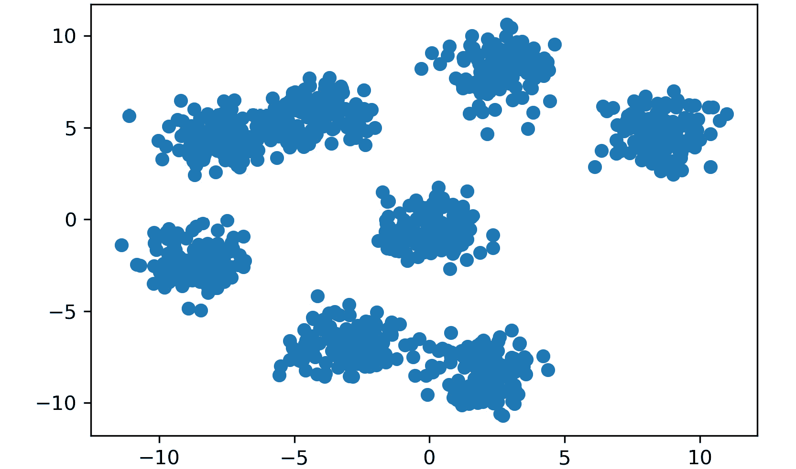

# 第三章：2. 层次聚类

概述

在本章中，我们将使用常见的 Python 包从头实现层次聚类算法，并进行凝聚层次聚类。我们还将比较 k-means 和层次聚类。我们将利用层次聚类构建更强的、更有逻辑性的分组。在本章结束时，我们将能够使用层次聚类构建更强的、更有逻辑性的分组。

# 引言

在本章中，我们将在第*1 章*，*聚类简介*的基础概念上展开，通过相似度的概念来围绕聚类展开。我们将再次实现欧几里得距离的不同形式，以捕捉相似性的概念。需要牢记的是，欧几里得距离只是最常用的距离度量之一，并非唯一的度量。通过这些距离度量，我们将在前一章探索的简单邻居计算基础上引入层次结构的概念。通过使用层次结构来传达聚类信息，我们可以构建更强的、更有逻辑性的分组。与 k-means 类似，层次聚类对于客户细分或识别相似产品类型等场景非常有帮助。然而，层次聚类的一个小优势是，它能够以更清晰的方式解释结果。在本章中，我们将概述一些层次聚类可能是你所需要的解决方案的情况。

# 聚类复习

*第一章*，*聚类简介*，讲解了最基本的聚类算法之一：k-means 的高层概念和深入细节。尽管它确实是一个简单的方法，但不要小看它；它将成为你继续探索无监督学习世界时非常有价值的工具。在许多实际应用场景中，公司通过最简单的方法，如 k-means 或线性回归（用于有监督学习），获得了宝贵的发现。一个例子是评估大量的客户数据——如果直接在表格中评估这些数据，通常难以发现有价值的信息。然而，即使是一个简单的聚类算法，也能够识别数据中哪些组是相似的，哪些是不同的。为了复习一下，我们来快速回顾一下什么是聚类，以及 k-means 如何找到这些聚类：


图 2.1：区分有监督与无监督问题的属性

如果你得到了一组随机的数据，没有任何指导方针，你可能会用基本的统计方法开始探索——例如，计算每个特征的均值、中位数和众数。给定一个数据集，选择监督学习或无监督学习作为推导洞察的方法，取决于你为自己设定的数据目标。如果你确定其中一个特征实际上是标签，并且你想要查看数据集中的其他特征如何影响它，那么这将成为一个监督学习问题。然而，如果在初步探索后，你意识到你拥有的数据仅仅是一组没有目标的特征（例如一组健康指标、网上商店的购买发票等），那么你可以通过无监督方法进行分析。

无监督学习的经典例子是通过分析来自网上商店的一组发票，找到类似客户的聚类。你的假设是，通过找到最相似的人群，你可以创建更具针对性的营销活动，吸引每个聚类的兴趣。实现这些相似用户聚类的一种方法是使用 k-means。

## k-means 复习

k-means 聚类通过找到数据中“k”个聚类来工作，采用某些距离计算方法，如欧几里得距离、曼哈顿距离、汉明距离、明科夫斯基距离等。“K”个点（也称为质心）在数据中随机初始化，然后计算每个数据点到每个质心的距离。这些距离中的最小值决定了某个数据点属于哪个聚类。每个点被分配到一个聚类后，计算该聚类内的数据点的均值作为新的质心。这个过程会重复进行，直到新计算出的聚类质心的位置不再变化，或者达到最大迭代次数。

# 层级结构的组织

无论是自然界还是人造世界，都有许多将系统组织成层级结构的例子，并且大多数情况下，这样做是非常有意义的。从这些层级结构中发展出来的一个常见表示法可以在基于树的结构中看到。想象你有一个父节点，下面有若干子节点，子节点可以进一步成为父节点。通过将信息组织成树形结构，你可以构建一个信息密集型的图表，清晰地显示事物之间与同类及其更大的抽象概念的关系。

从自然界中有一个例子可以帮助说明这个概念，即我们如何看待动物的层级结构，从父类到各个物种：


图 2.2：动物物种在层级树结构中的关系

在前面的示意图中，你可以看到一个例子，展示了动物品种之间的关系信息是如何以既节省空间又能传达大量信息的方式进行映射的。这个示例既可以看作是一棵独立的树（展示了猫和狗的区别，但它们都是家养动物），也可以看作是一个更大树的一部分，展示了家养与非家养动物的分类。

作为一个面向商业的示例，让我们回到一个销售产品的在线商店的概念。如果你售卖种类繁多的产品，那么你可能会想为客户创建一个层级导航系统。通过避免一次性展示所有的产品目录信息，客户只会看到与他们兴趣相匹配的树形路径。下面的示意图展示了一个层级导航系统的示例：


图 2.3：层级树结构中的产品分类

显然，层级导航系统在提升客户体验方面的好处不容小觑。通过将信息组织成层级结构，你可以为数据构建一个直观的结构，展示明确的嵌套关系。如果这听起来像是另一种在数据中寻找簇的方法，那么你肯定走在了正确的道路上。通过使用类似的距离度量，例如 k-means 的欧氏距离，我们可以开发出一棵树，展示许多数据切割，让用户可以根据自己的需求主观地创建簇。

# 层次聚类简介

到目前为止，我们已经展示了层级结构如何成为组织信息的优秀方式，能够清晰地显示数据点之间的嵌套关系。虽然这有助于我们理解项目之间的父子关系，但在形成簇时也非常实用。以前一节中的动物示例为基础，假设你仅仅得到了两种动物的特征：它们的身高（从鼻尖到尾部的长度）和体重。使用这些信息，你需要重新创建一个层级结构，以便识别数据集中哪些记录对应的是狗和猫，以及它们相对的亚种。

由于你只给出了动物的身高和体重，无法推断每个物种的具体名称。然而，通过分析你所提供的特征，你可以在数据中构建一个结构，近似于数据中存在哪些动物物种。这为无监督学习问题奠定了基础，而层次聚类是解决此类问题的理想方法。在以下图表中，你可以看到我们在左侧创建的两个特征，左列为动物身高，右列为动物体重。然后，这些数据被绘制在一个二维坐标图上，X 轴为身高，Y 轴为体重：


图 2.4：一个包含动物身高和动物体重的双特征数据集示例

一种处理层次聚类的方法是从每个数据点开始，将其视为自己的簇，并递归地将相似的点组合在一起形成簇——这就是**聚合**层次聚类。在*聚合与分裂聚类*章节中，我们将详细介绍不同的层次聚类方法。

在聚合层次聚类方法中，数据点相似度的概念可以借鉴我们在 k-means 中看到的范式。在 k-means 中，我们使用欧几里得距离来计算每个数据点到期望的“k”个簇的质心的距离。在层次聚类方法中，我们将重新使用相同的距离度量来确定数据集中记录之间的相似性。

最终，通过递归地将数据中的单个记录与其最相似的记录组合在一起，你将从底部向上构建一个层次结构。最终，单独的单一成员簇将合并成一个位于层次结构顶部的单一簇。

## 执行层次聚类的步骤

为了理解聚合层次聚类的工作原理，我们可以跟踪一个简单的示例程序，它是如何通过合并形成层次结构的：

1.  给定 n 个样本数据点，将每个点视为一个单独的“簇”，其中只有该点作为成员（质心）。

1.  计算数据集中所有簇的质心之间的成对欧几里得距离。（在此，簇之间的最小距离、最大距离、平均距离或两个质心之间的距离也可以考虑。在这个示例中，我们考虑的是两个簇质心之间的距离）。

1.  将最接近的簇/点组合在一起。

1.  重复*步骤 2*和*步骤 3*，直到你得到一个包含所有数据的单一簇。

1.  绘制树状图以展示数据如何在层次结构中聚合。树状图只是用于表示树状结构的图示，显示簇从上到下的排列。我们将在接下来的演示中详细讨论这如何有助于理解数据的结构。

1.  决定你希望在哪个层级创建簇。

## 层次聚类的示例演示

尽管比 k-means 稍微复杂一些，层次聚类在逻辑上实际上与它非常相似。这里有一个简单的示例，稍微详细地介绍了前面的步骤：

1.  给定四个样本数据点的列表，将每个点视为一个质心，它也是其自身的簇，点的索引从 0 到 3：

    ```py
    Clusters (4): [ (1,7) ], [ (-5,9) ], [ (-9,4) ] , [ (4, -2) ]
    Centroids (4): [ (1,7) ], [ (-5,9) ], [ (-9,4) ] , [ (4, -2) ]
    ```

1.  计算所有簇的质心之间的成对欧几里得距离。

    注

    请参考*第一章*中*K-means 聚类深入演练*部分，复习欧几里得距离的计算方法。

    在*图 2.5*中显示的矩阵里，点的索引在水平方向和垂直方向上都是 0 到 3，表示各个点之间的距离。注意，数值在对角线两侧是镜像对称的——这是因为你在比较每个点与其他所有点的距离，所以只需要关注对角线一侧的数值：

    

    图 2.5：一个距离数组

1.  将距离最短的点对组合在一起。

    在这种情况下，点 [1,7] 和 [-5,9] 因为距离最近而合并成一个簇，其余两个点作为单成员簇保留：

    

    ```py
    [ [1,7], [-5,9] ]
    [-9,4]
    [4,-2] 
    ```

1.  计算两个成员簇的点之间的均值，以找到新的质心：

    ```py
    mean([ [1,7], [-5,9] ]) = [-2,8]
    ```

1.  将质心添加到两个单成员质心中，并重新计算距离：

    ```py
    Clusters (3): 
    [ [1,7], [-5,9] ]
    [-9,4]
    [4,-2] 
    ```

    质心（3）：

    ```py
    [-2,8]
    [-9,4]
    [4,-2]
    ```

    再次，我们将计算点与质心之间的欧几里得距离：

    

    图 2.7：一个距离数组

1.  如前图所示，点 [-9,4] 是距离质心最近的点，因此它被添加到簇 1。现在，簇列表更新为以下内容：

    ```py
    Clusters (2): 
    [ [1,7], [-5,9], [-9,4] ]
    [4,-2] 
    ```

1.  只剩下点 [4,-2] 作为距离其邻近点最远的点，你可以将它直接加入簇 1 来统一所有簇：

    ```py
    Clusters (1): 
    [ [ [1,7], [-5,9], [-9,4], [4,-2] ] ]
    ```

1.  绘制一个树状图以展示数据点与簇之间的关系：

图 2.8：显示数据点与簇之间关系的树状图

树状图展示了数据点之间的相似性，并且与我们之前讨论的层次树结构非常相似。与任何可视化技术一样，它会丢失一些信息；然而，当确定你希望形成多少个聚类时，树状图是非常有帮助的。在前面的示例中，你可以在 X 轴上看到四个潜在的聚类，如果每个点都是一个独立的聚类。当你垂直查看时，可以看到哪些点距离最接近，可能会被归为同一聚类。例如，在前面的树状图中，索引 0 和 1 的点最接近，可以形成一个聚类，而索引 2 仍然是一个单独的聚类。

回顾前面的动物分类示例，其中涉及狗和猫物种，假设你看到了以下树状图：


图 2.9：动物分类树状图

如果你只对将物种数据集分为狗和猫感兴趣，你可以在第一个分组层级停止聚类。然而，如果你想将所有物种分为家养动物和非家养动物，你可以在第二个层级停止聚类。层次聚类和树状图的一个优点是，你可以看到潜在聚类的完整划分，以供选择。

## 练习 2.01：构建层级结构

让我们在 Python 中实现前述的层次聚类方法。通过概述直观的框架，我们现在可以使用 `SciPy` 提供的一些辅助函数来探索构建层次聚类的过程。SciPy（[`www.scipy.org/docs.html`](https://www.scipy.org/docs.html)）是一个开源库，提供了对科学计算和技术计算有用的函数。它的示例包括线性代数和微积分相关方法的简单实现。在这个练习中，我们将专门使用 `SciPy` 中`cluster`子模块的有用函数。除了 `scipy`，我们还将使用 `matplotlib` 来完成这个练习。按照以下步骤完成这个练习：

1.  生成一些虚拟数据，如下所示：

    ```py
    from scipy.cluster.hierarchy import linkage, dendrogram, fcluster
    from sklearn.datasets import make_blobs
    import matplotlib.pyplot as plt
    %matplotlib inline
    ```

1.  生成一个随机的聚类数据集进行实验。`X` = 坐标点，`y` = 聚类标签（不需要）：

    ```py
    X, y = make_blobs(n_samples=1000, centers=8, \
                      n_features=2, random_state=800)
    ```

1.  可视化数据，如下所示：

    ```py
    plt.scatter(X[:,0], X[:,1])
    plt.show()
    ```

    输出如下：

    

    图 2.10：虚拟数据的绘图

    在绘制这个简单的玩具示例后，应该能清楚地看到我们的虚拟数据包含了八个聚类。

1.  我们可以使用内置的`SciPy`包中的`linkage`轻松生成距离矩阵。稍后我们将深入了解`linkage`函数的原理；但是，目前了解有现成的工具可以计算点与点之间的距离是非常重要的：

    ```py
    # Generate distance matrix with 'linkage' function
    distances = linkage(X, method="centroid", metric="euclidean")
    print(distances)
    ```

    输出如下：

    

    图 2.11：距离矩阵

    如果你尝试通过自动填写 `linkage` 函数的 `method` 超参数进行不同的方法实验，你会看到它们如何影响整体性能。链接方法通过简单地计算每个数据点之间的距离来工作。我们将在 *Linkage* 主题中详细讲解它具体计算的内容。在 `linkage` 函数中，我们可以选择度量和方法（稍后会详细介绍）。

    在确定链接矩阵后，我们可以轻松地通过 `SciPy` 提供的 `dendrogram` 函数进行传递。顾名思义，`dendrogram` 函数利用 *步骤 4* 中计算的距离生成一种直观简洁的方式来解析分组信息。

1.  我们将使用一个自定义函数来清理原始输出的样式（请注意，以下代码片段中的函数使用的是 `SciPy` 的基础树状图实现，唯一的自定义代码是用来清理视觉输出的）：

    ```py
    # Take normal dendrogram output and stylize in cleaner way
    def annotated_dendrogram(*args, **kwargs):
        # Standard dendrogram from SciPy
        scipy_dendro = dendrogram(*args, truncate_mode='lastp', \
                                  show_contracted=True,\
                                  leaf_rotation=90.)
        plt.title('Blob Data Dendrogram')
        plt.xlabel('cluster size')
        plt.ylabel('distance')
        for i, d, c in zip(scipy_dendro['icoord'], \
                           scipy_dendro['dcoord'], \
                           scipy_dendro['color_list']):
            x = 0.5 * sum(i[1:3])
            y = d[1]
            if y > 10:
                plt.plot(x, y, 'o', c=c)
                plt.annotate("%.3g" % y, (x, y), xytext=(0, -5), \
                             textcoords='offset points', \
                             va='top', ha='center')
        return scipy_dendro
    dn = annotated_dendrogram(distances)
    plt.show()
    ```

    输出如下：

    

    图 2.12：距离的树状图

    这个图形将帮助我们从数据潜在的分群角度获取一些见解。基于之前步骤计算的距离，它展示了一个潜在路径，我们可以用它来创建三个独立的群组，距离为七，且这些群组足够独特，能够独立存在。

1.  利用这些信息，我们可以通过使用 `SciPy` 中的 `fcluster` 函数来结束我们的层次聚类练习：

    ```py
    scipy_clusters = fcluster(distances, 3, criterion="distance")
    plt.scatter(X[:,0], X[:,1], c=scipy_clusters)
    plt.show()
    ```

    `fcluster` 函数利用来自树状图的距离和信息，根据指定的阈值将数据分组。前面示例中的数字 `3` 代表你可以设置的最大聚类间距离阈值超参数。这个超参数可以根据你正在处理的数据集进行调整；然而，在本练习中，它被设定为 `3`。最终的输出如下：

    

图 2.13：距离的散点图

在前面的图中，你可以看到通过使用我们的阈值超参数，我们已经识别出八个不同的聚类。只需调用 `SciPy` 提供的几个辅助函数，你就能轻松地在几行代码中实现聚合聚类。尽管 `SciPy` 确实帮助处理了许多中间步骤，但这个示例仍然相对冗长，可能不完全符合你日常工作中的精简代码。我们稍后会介绍更简化的实现方式。

注意

要访问此部分的源代码，请参考 [`packt.live/2VTRp5K`](https://packt.live/2VTRp5K)。

你也可以在线运行这个示例，访问 [`packt.live/2Cdyiww`](https://packt.live/2Cdyiww)。

# 链接

在*练习 2.01*，*建立层次结构* 中，你使用被称为**质心连接**的方法实现了层次聚类。连接是确定如何计算聚类之间距离的概念，并且依赖于你面临的问题类型。选择质心连接用于*练习 2.02*，*应用连接准则*，因为它基本上镜像了我们在 k-means 中使用的新质心搜索。然而，这并不是聚类数据点时唯一的选项。确定聚类之间距离的另外两个常见选择是单一连接和完全连接。

**单一连接** 通过找到两聚类之间一对点之间的最小距离作为连接的标准。简单来说，它基本上通过根据两个聚类之间最接近的点来组合聚类。数学上表示如下：

```py
dist(a,b) = min( dist( a[i]), b[j] ) )
```

在前面的代码中，`a[i]` 是第一个聚类中的 *i* 点，而 `b[j]` 是第二个聚类中的 *j* 点。

**完全连接** 是单一连接的对立面，它通过找到两聚类之间一对点之间的最大距离作为连接的标准。简单来说，它通过根据两个聚类之间最远的点来组合聚类。数学上表示如下：

```py
dist(a,b) = max( dist( a[i]), b[j] ) )
```

在前面的代码中，`a[i]` 和 `b[j]` 分别是第一个和第二个聚类中的 *i* 和 *j* 点。确定哪种连接准则最适合你的问题既是艺术也是科学，而且它在很大程度上依赖于你的特定数据集。选择单一连接的一个原因是如果你的数据在最近邻的意义上相似；因此，当存在差异时，数据将非常不相似。由于单一连接通过寻找最接近的点来工作，它不会受到这些遥远异常值的影响。然而，由于单一连接通过寻找一对点之间的最小距离来工作，它很容易受到分布在聚类之间的噪声影响。相反，如果你的数据在聚类间的状态上相距较远，那么完全连接可能是更好的选择；当聚类的空间分布不平衡时，完全连接会导致错误的分割。质心连接具有类似的优点，但如果数据非常嘈杂且聚类的“中心”不够明显，它就会失效。通常，最佳的方法是尝试几种不同的连接准则选项，看看哪种最适合你的数据，并以对你的目标最相关的方式进行操作。

## 练习 2.02：应用连接准则

回忆我们在前一个练习中生成的八个聚类的虚拟数据。在现实世界中，你可能会得到类似于离散高斯簇的真实数据。假设这些虚拟数据代表了某个商店中不同购物群体的情况。商店经理要求你分析这些购物者数据，以便将客户分为不同的群体，进而为每个群体量身定制营销材料。

使用我们在前一个练习中生成的数据，或者生成新数据，你将分析哪些连接方法能更好地将客户分组到不同的聚类中。

一旦生成数据，查看通过 SciPy 提供的文档，了解在 `linkage` 函数中有哪些连接类型可用。然后，通过将它们应用于你的数据来评估这些连接类型。你应测试的连接类型在以下列表中展示：

```py
['centroid', 'single', 'complete', 'average', 'weighted']
```

我们尚未覆盖所有之前提到的连接类型——这项活动的关键部分是学习如何解析使用包提供的文档字符串，以探索它们的所有功能。请按照以下步骤完成本练习：

1.  可视化我们在 *练习 2.01* 中创建的 `x` 数据集，*构建层次结构*：

    ```py
    from scipy.cluster.hierarchy import linkage, dendrogram, fcluster
    from sklearn.datasets import make_blobs
    import matplotlib.pyplot as plt
    %matplotlib inline
    ```

1.  生成一个随机的聚类数据集进行实验。`X` = 坐标点，`y` = 聚类标签（不需要）：

    ```py
    X, y = make_blobs(n_samples=1000, centers=8, \
                      n_features=2, random_state=800)
    ```

1.  如下所示可视化数据：

    ```py
    plt.scatter(X[:,0], X[:,1])
    plt.show()
    ```

    输出如下：

    

    图 2.14: 生成的聚类数据集的散点图

1.  创建一个包含所有可能连接方法超参数的列表：

    ```py
    methods = ['centroid', 'single', 'complete', \
               'average', 'weighted']
    ```

1.  遍历你刚创建的列表中的每个方法，并显示它们对相同数据集的影响：

    ```py
    for method in methods:
        distances = linkage(X, method=method, metric="euclidean")
        clusters = fcluster(distances, 3, criterion="distance") 
        plt.title('linkage: ' + method)
        plt.scatter(X[:,0], X[:,1], c=clusters, cmap='tab20b')
        plt.show()
    ```

    重心连接法的图示如下：

    

图 2.15: 重心连接方法的散点图

单连接法的图示如下：


图 2.16: 单连接方法的散点图

完全连接法的图示如下：


图 2.17: 完全连接方法的散点图

平均连接法的图示如下：


图 2.18: 平均连接方法的散点图

加权连接法的图示如下：


图 2.19: 加权连接方法的散点图

如前面的图所示，通过简单地改变连接准则，你可以显著改变聚类的效果。在这个数据集中，质心和平均连接在找到有意义的离散聚类方面效果最好。从我们生成的包含八个聚类的数据集来看，质心和平均连接是唯一能够显示出用八种不同颜色表示的聚类的连接方式。其他连接类型效果较差，最明显的是单一连接。单一连接的效果较差，因为它假设数据是以细长的“链”格式存在，而不是聚类的形式。其他连接方法更优秀，因为它们假设数据是以聚集组的形式呈现。

注意

要访问此特定部分的源代码，请参考[`packt.live/2VWwbEv`](https://packt.live/2VWwbEv)。

你也可以在在线运行这个示例：[`packt.live/2Zb4zgN`](https://packt.live/2Zb4zgN)。

# 聚合型与分裂型聚类

到目前为止，我们的层次聚类实例都是聚合型的——也就是说，它们是从底部向上构建的。虽然这是这种聚类类型最常见的方法，但重要的是要知道，这并不是创建层次结构的唯一方式。相反的层次方法——即从顶部向下构建，也可以用于创建你的分类法。这种方法称为**分裂型**层次聚类，它通过将数据集中的所有数据点放入一个大的聚类中来工作。分裂型方法的许多内部机制与聚合型方法非常相似：


图 2.20：聚合型与分裂型层次聚类

与大多数无监督学习中的问题一样，决定最佳方法通常高度依赖于你所面临的具体问题。

想象一下，你是一位刚刚购买了一家新杂货店的创业者，现需要为店铺备货。你收到了一大批食品和饮料的运输箱，但你已经失去了所有的运输信息。为了有效地销售你的产品，你必须将相似的产品归为一类（如果你把所有东西随便放到货架上，店铺会变得一团糟）。为了实现这个组织目标，你可以采取自下而上或自上而下的方法。在自下而上的方法中，你会仔细查看运输箱里的物品，并认为一切都是杂乱无章的——然后，你会拿起一个随机物品，找出最相似的产品。例如，你可能拿起苹果汁，意识到将其与橙汁放在一起是有道理的。在自上而下的方法中，你会认为所有物品一开始就已按某种方式组织成一个大类。然后，你会逐步检查库存，并根据相似度的最大差异将其拆分成多个组。例如，如果你正在组织一家杂货店，你可能一开始认为苹果和苹果汁是属于同一类，但再想想，它们其实是相当不同的。因此，你会将它们拆分成更小的、不相似的组。

一般来说，可以将凝聚聚类看作自下而上的方法，将分裂聚类看作自上而下的方法——但它们在性能上有何权衡？这种立刻抓住最接近的物品的行为被称为“贪婪学习”；它有可能被局部邻居所欺骗，无法看到它在任何给定时刻所形成的簇的更大影响。另一方面，分裂方法的优势在于它从一开始就能看到整个数据分布作为一个整体，并选择最好的方式来拆分簇。对整个数据集外观的这种洞察对于创建更精确的簇非常有帮助，不容忽视。不幸的是，自上而下的方法通常会以牺牲更高的准确性为代价，换来更深的复杂性。在实践中，凝聚方法大多数情况下效果较好，应当作为层次聚类的首选起点。如果在查看层次结构后，你对结果不满意，尝试使用分裂方法可能会有所帮助。

## 练习 2.03：使用 scikit-learn 实现凝聚聚类

在大多数商业应用场景中，你很可能会使用一个抽象了所有内容的包来实现层次聚类，比如 scikit-learn。Scikit-learn 是一个免费包，是 Python 中进行机器学习时不可或缺的工具。它便捷地提供了最流行算法（如回归、分类和聚类）的高度优化版本。通过使用像 scikit-learn 这样的优化包，你的工作变得更加轻松。然而，只有在你完全理解层次聚类的工作原理之后，才应该使用它，正如我们在前面的章节中讨论的那样。这个练习将比较使用 SciPy 和 scikit-learn 进行聚类的两种潜在路线。通过完成此练习，你将了解它们各自的优缺点，以及从用户角度来看哪个最适合你。请按照以下步骤完成此练习：

1.  Scikit-learn 使得实现变得轻松，仅需几行代码。首先，导入必要的包并将模型分配给 `ac` 变量。然后，创建如前述练习中所示的 blob 数据：

    ```py
    from sklearn.cluster import AgglomerativeClustering
    from sklearn.datasets import make_blobs
    import matplotlib.pyplot as plt
    from scipy.cluster.hierarchy import linkage, dendrogram, fcluster
    ac = AgglomerativeClustering(n_clusters = 8, \
                                 affinity="euclidean", \
                                 linkage="average")
    X, y = make_blobs(n_samples=1000, centers=8, \
                      n_features=2, random_state=800)
    ```

    首先，我们通过传入熟悉的参数（如 `affinity`（距离函数）和 `linkage`）将模型分配给 `ac` 变量。

1.  然后重用我们在之前练习中使用的 `linkage` 函数和 `fcluster` 对象：

    ```py
    distances = linkage(X, method="centroid", metric="euclidean")
    sklearn_clusters = ac.fit_predict(X)
    scipy_clusters = fcluster(distances, 3, criterion="distance")
    ```

    在将模型实例化为一个变量后，我们可以简单地使用 `.fit_predict()` 将数据集拟合到所需模型，并将其赋值给另一个变量。这将为我们提供有关理想聚类的信息，作为模型拟合过程的一部分。

1.  然后，我们可以通过绘图比较每种方法的最终聚类结果。让我们来看一下 scikit-learn 方法的聚类结果：

    ```py
    plt.figure(figsize=(6,4))
    plt.title("Clusters from Sci-Kit Learn Approach")
    plt.scatter(X[:, 0], X[:, 1], c = sklearn_clusters ,\
                s=50, cmap='tab20b')
    plt.show()
    ```

    这是 scikit-learn 方法的聚类结果输出：

    

图 2.21：scikit-learn 方法的图示

来看看 SciPy 方法的聚类结果：

```py
plt.figure(figsize=(6,4))
plt.title("Clusters from SciPy Approach")
plt.scatter(X[:, 0], X[:, 1], c = scipy_clusters ,\
            s=50, cmap='tab20b')
plt.show()
```

输出如下：


图 2.22：SciPy 方法的图示

如你所见，两个方法基本上汇聚到了相同的聚类结果。

注意

要访问此部分的源代码，请参考 [`packt.live/2DngJuz`](https://packt.live/2DngJuz)。

你还可以在网上运行此示例，网址为 [`packt.live/3f5PRgy`](https://packt.live/3f5PRgy)。

虽然这对于玩具问题来说很棒，但在下一次活动中，你将了解到，输入参数的微小变化可能会导致截然不同的结果。

## 活动 2.01：比较 K-means 和层次聚类

您正在管理一家商店的库存，并收到了大量葡萄酒货物，但品牌标签在运输过程中从瓶子上脱落。幸运的是，您的供应商为每瓶酒提供了化学成分数据，并附上了各自的序列号。不幸的是，您无法打开每瓶酒进行品尝测试——您必须找到一种方法，根据化学成分数据将未贴标签的酒瓶重新分组。您从订单单上知道，您订购了三种不同类型的葡萄酒，并且只提供了两种葡萄酒属性来重新分组这些酒。在此活动中，我们将使用葡萄酒数据集。该数据集包含三种不同类型葡萄酒的化学成分数据，根据 UCI 机器学习库中的来源，包含以下特征：

+   酒精

+   苹果酸

+   灰分

+   灰分的碱度

+   镁

+   总酚类

+   黄酮类

+   非黄酮类酚

+   原花青素

+   颜色强度

+   色调

+   稀释葡萄酒的 OD280/OD315

+   前花青素

    注意

    该葡萄酒数据集来源于[`archive.ics.uci.edu/ml/machine-learning-databases/wine/`](https://archive.ics.uci.edu/ml/machine-learning-databases/wine/)。[UCI 机器学习库[[`archive.ics.uci.edu/ml`](http://archive.ics.uci.edu/ml)]。美国加利福尼亚州尔湾市：加利福尼亚大学信息与计算机科学学院]。它也可以通过[`packt.live/3aP8Tpv`](https://packt.live/3aP8Tpv)访问。

本活动的目的是在葡萄酒数据集上实现 k-means 和层次聚类，并确定哪种方法在为每种葡萄酒类型形成三个独立的聚类时更加准确。您可以尝试不同的 scikit-learn 实现组合，并使用 SciPy 和 NumPy 中的辅助函数。您还可以使用轮廓系数来比较不同的聚类方法，并在图表上可视化聚类结果。

完成此活动后，您将亲眼看到两种不同的聚类算法在同一数据集上的表现，从而便于在超参数调优和整体性能评估时进行比较。您可能会注意到，根据数据的形状，一种方法的表现优于另一种方法。此活动的另一个关键结果是理解超参数在任何给定用例中的重要性。

以下是完成此活动的步骤：

1.  从 scikit-learn 导入必要的包（`KMeans`、`AgglomerativeClustering`和`silhouette_score`）。

1.  将葡萄酒数据集读取到 pandas DataFrame 中并打印一个小样本。

1.  通过绘制 OD 读取特征与前花青素特征的关系，来可视化数据集中的一些特征。

1.  使用`sklearn`实现的 k-means 算法对葡萄酒数据集进行聚类，知道数据集中有三种葡萄酒类型。

1.  使用`sklearn`实现的层次聚类对葡萄酒数据集进行聚类。

1.  绘制 k-means 算法预测的聚类。

1.  绘制层次聚类算法预测的聚类。

1.  比较每种聚类方法的轮廓系数。

完成此活动后，你应该已经绘制出了从 k-means 获得的预测簇，如下所示：


图 2.23：来自 k-means 方法的预期簇

对于层次聚类预测的簇，也应获得类似的图，如下所示：


图 2.24：来自聚合方法的预期簇

注意

此活动的解决方案可以在第 423 页找到。

# k-means 与层次聚类

在上一章中，我们探讨了 k-means 聚类的优点。现在，了解层次聚类在其中的作用是非常重要的。正如我们在*连接*部分提到的那样，当使用质心对数据点进行分组时，可能存在一些直接的重叠。到目前为止，我们提到的所有方法都普遍使用了距离函数来确定相似性。由于我们在上一章的深入探讨，我们在这里使用了欧几里得距离，但我们理解任何距离函数都可以用来确定相似性。

实际上，选择一种聚类方法而非另一种时，可以参考以下几点：

+   层次聚类的优势在于不需要预先传入明确的“k”簇数。这意味着你可以找到所有潜在的簇，并在算法完成后决定哪些簇最有意义。

+   从简便性角度来看，k-means 聚类具有优势——在商业用例中，通常面临一个挑战：如何找到既能向非技术观众解释又能生成高质量结果的方法。k-means 可以轻松填补这一空缺。

+   层次聚类在处理形状异常的数据时，调整的参数比 k-means 聚类更多。虽然 k-means 在发现离散簇方面表现优秀，但在处理混合簇时可能会遇到困难。通过调整层次聚类中的参数，你可能会得到更好的结果。

+   基本的 k-means 聚类通过实例化随机质心并找到与这些质心最接近的点来工作。如果它们被随机实例化在特征空间中远离数据的区域，那么可能需要相当长的时间才能收敛，或者可能根本无法达到收敛点。层次聚类则较不容易受到这种缺陷的影响。

# 总结

本章中，我们讨论了层次聚类的工作原理以及它可能的最佳应用场景。特别是，我们讨论了如何通过评估树状图来主观地选择簇的各个方面。如果你完全不知道在数据中寻找什么，这比 k 均值聚类有一个巨大的优势。我们还讨论了两个推动层次聚类成功的关键参数：合并方法和分裂方法，以及聚类标准。合并聚类采用自下而上的方法，通过递归地将邻近的数据合并在一起，直到结果为一个大簇。分裂聚类采用自上而下的方法，从一个大簇开始，递归地将其拆分，直到每个数据点都进入其自己的簇。分裂聚类由于从一开始就可以全面查看数据，因此有可能更准确；然而，它增加了一层复杂性，这可能会降低稳定性并增加运行时间。

聚类标准涉及如何计算候选簇之间的距离。我们已经探讨了质心如何在 k 均值聚类之外再次出现，以及单一链接和完全链接标准。单一链接通过比较每个簇中最近的点来计算簇间距离，而完全链接通过比较每个簇中较远的点来计算簇间距离。通过本章所学的知识，你现在能够评估 k 均值聚类和层次聚类如何最好地适应你正在处理的挑战。

虽然由于层次聚类的复杂性增加，它可能比 k 均值聚类表现更好，但请记住，更多的复杂性并不总是好的。作为无监督学习的从业者，你的职责是探索所有选项，并确定既高效又具有性能的解决方案。在下一章中，我们将介绍一种在处理高度复杂和噪声数据时最适用的聚类方法：**基于密度的空间聚类应用与噪声**。
