# 第四章：3. 邻域方法与 DBSCAN

概述

在本章中，我们将展示基于邻域的聚类方法如何从头到尾工作，并通过使用软件包从零开始实现**基于密度的空间聚类算法（带噪声）**（**DBSCAN**）算法。我们还将从 k-means、层次聚类和 DBSCAN 中识别出最适合解决您问题的算法。到本章结束时，我们将看到 DBSCAN 聚类方法如何在处理高度复杂数据时为我们提供最佳服务。

# 引言

在前面的章节中，我们评估了多种不同的数据聚类方法，包括 k-means 和层次聚类。虽然 k-means 是最简单的聚类形式，但在适当的场景中，它仍然非常强大。在 k-means 无法捕捉数据集复杂性的情况下，层次聚类证明是一个强有力的替代方法。

无监督学习的关键挑战之一是，您会获得一组特征数据，但没有额外的标签告诉您目标状态是什么。虽然您可能无法明确知道目标标签是什么，但通过将相似的群体聚集在一起并观察群体内的相似性，您可以从数据中提取出一些结构。我们首先介绍的聚类相似数据点的方法是 k-means。K-means 聚类最适合处理那些速度至关重要的简单数据问题。只需查看最接近的数据点（聚类中心），就不需要太多计算开销；然而，当面对高维数据集时，也会面临更大的挑战。如果您不知道需要查找的聚类数目，k-means 也不是理想选择。我们在*第二章*《*层次聚类*》中探讨的一个例子是，通过分析化学特征来确定哪些葡萄酒在一次杂乱的运输中属于同一类。之所以能够顺利进行，是因为我们知道有三种葡萄酒类型已被订购；然而，如果您不知道原始顺序是什么，k-means 可能就不会那么成功。

我们探索的第二种聚类方法是层次聚类。该方法有两种工作方式——聚合性（agglomerative）或分裂性（divisive）。聚合性聚类采用自下而上的方法，将每个数据点视为自己的簇，并根据链接标准递归地将它们组合在一起。分裂性聚类则采用相反的方式，将所有数据点视为一个大类，并递归地将它们分解成更小的簇。该方法的优点在于能够全面理解数据的分布，因为它计算了分割潜力；然而，由于其复杂性较高，通常在实践中不被采用。层次聚类对于当你对数据一无所知时是一个很有竞争力的选择。通过使用树状图（dendrogram），你可以可视化数据中的所有分割，并考虑事后哪个聚类数最合理。这在特定的使用场景中非常有用，但它的计算成本高于 k-means。

在本章中，我们将介绍一种在处理高度复杂数据时最适合的聚类方法：**基于密度的空间聚类应用与噪声（DBSCAN）**。传统上，这种方法在具有大量密集交错数据的数据库中一直被认为是一种高效的聚类方法。让我们一起看看它为什么在这些应用场景中表现得如此出色。

# 作为邻域的簇

到目前为止，我们探讨的相似性概念是通过欧几里得距离来描述的——距离某一点较近的数据点可以看作是相似的，而在欧几里得空间中距离较远的数据点则被视为不相似。这个概念在 DBSCAN 算法中再次出现。如同其冗长的名字所暗示的那样，DBSCAN 方法不仅基于距离度量评估，还引入了密度的概念。如果有一些数据点聚集在同一区域内，它们可以视为同一簇的成员：

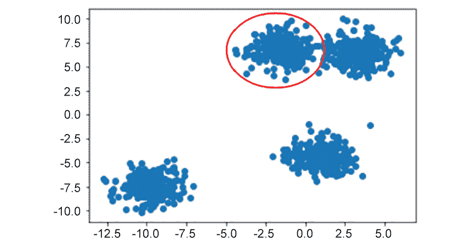

图 3.1：邻居与簇之间有直接联系

在前面的图中，我们可以看到四个邻域。与我们之前讨论的仅仅基于距离的方法相比，基于密度的方法有很多优势。如果你只关注距离作为聚类的阈值，那么在面对稀疏特征空间和离群点时，你可能会发现聚类结果毫无意义。无论是 k-means 还是层次聚类，都会自动将空间中的所有数据点分组，直到没有剩余的点。

尽管层次聚类在一定程度上提供了解决此问题的途径，因为你可以在聚类运行后使用树状图来确定聚类的形成位置，但 k-means 作为聚类的最简单方法，最容易失败。当我们开始评估基于邻域的聚类方法时，这些陷阱就不那么明显了。在下面的树状图中，你可以看到一个典型的陷阱，其中所有数据点都被归为一类。显然，当你沿着树状图向下走时，许多具有潜在差异的数据点被聚在一起，因为每个点都必须属于一个聚类。使用基于邻域的聚类时，这个问题要少得多：

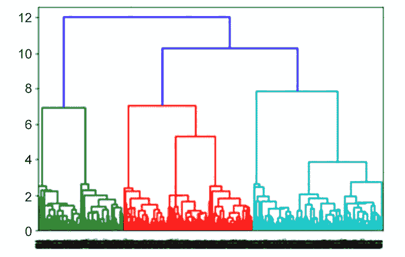

图 3.2：示例树状图

通过在 DBSCAN 中引入邻居密度的概念，我们可以选择性地将异常值排除在聚类之外，具体取决于我们在运行时选择的超参数。只有那些具有相近邻居的数据点才会被视为同一聚类中的成员，而那些距离较远的点则会被视为未聚类的异常值。

# DBSCAN 简介

在 DBSCAN 中，密度是通过邻域半径和在被认为是一个聚类的邻域内找到的最小点数的组合来评估的。如果我们重新考虑一下你负责为商店整理一批未标记的葡萄酒货物的场景，这个概念就会变得更清晰。在前面的例子中，已经明确了我们可以根据葡萄酒的特征，如化学特性，来找到相似的葡萄酒。知道这些信息后，我们可以更容易地将相似的葡萄酒归为一类，迅速地将我们的产品整理好，准备好销售。然而，在现实世界中，你为商店订购的产品将反映出真实的购买模式。为了在库存中促使多样性，同时保证最受欢迎的葡萄酒有足够的存货，你的产品种类会呈现出极为不均衡的分布。大多数人喜欢经典的葡萄酒，如白葡萄酒和红葡萄酒；然而，你可能还会为喜欢昂贵酒款的客户提供一些更为独特的葡萄酒。这使得聚类变得更加困难，因为不同类别的分布不均（例如，你不会为每种葡萄酒都订购 10 瓶）。

DBSCAN 与 k-means 和层次聚类的不同之处在于，你可以将这种直觉融入到我们评估所关注的客户聚类中。它能够更轻松地去除噪声，仅指向那些在营销活动中具有最高再营销潜力的客户。

通过利用邻域的概念进行聚类，我们可以将那些一次性光顾的客户（可以看作是随机噪声）与那些反复光顾我们商店的更有价值的客户区分开来。这种方法让我们重新思考在确定邻域半径和每个邻域的最小点数时，如何建立最佳数值。

作为一种高级启发式方法，我们希望邻域半径较小，但又不能过小。在一个极端情况下，邻域半径可以非常大——这可能会将特征空间中的所有点都视为一个庞大的簇。在另一个极端情况下，邻域半径可以非常小。过小的邻域半径可能导致没有点被聚类在一起，从而产生大量单一成员的簇。

类似的逻辑适用于构成簇的最小点数。最小点数可以看作是一个次要阈值，它根据你的数据空间中的数据来调整邻域半径。如果特征空间中的所有数据都非常稀疏，最小点数就变得非常重要，与邻域半径一起工作，确保你不会只得到大量不相关的数据点。当你拥有非常密集的数据时，最小点数阈值就不像邻域半径那样成为一个主导因素。

正如你从这两个超参数规则中看到的，最佳选项通常依赖于数据集的具体情况。通常，你会希望找到一个完美的“黄金中介”区域，既不过小，也不过大。

## DBSCAN 详细介绍

为了了解 DBSCAN 如何工作，我们可以通过一个简单的示例程序的路径，查看它如何将数据点合并成不同的簇和噪声标签的数据点：

1.  从 *n* 个未访问的样本数据点中，我们首先通过每个点并标记它为已访问。

1.  从每个点出发，我们将查看到数据集中每个其他点的距离。

1.  所有位于邻域半径超参数范围内的点都应视为邻居。

1.  邻居的数量应至少与所需的最小点数相等。

1.  如果达到了最小点阈值，点应被归为一个簇，否则标记为噪声。

1.  这个过程应该重复进行，直到所有数据点都被分类为簇或噪声。

在某些方面，DBSCAN 相当简单——尽管有邻域半径和最小点的新概念，但本质上，它仍然只是使用距离度量来进行评估。

## DBSCAN 算法演示

以下步骤将更详细地引导你完成此路径：

1.  给定六个样本数据点，将每个点视为其自己的簇：[ (1,3) ]， [ (-8,6) ]， [ (-6,4) ]， [ (4,-2) ]， [ (2,5) ]， [ (-2,0) ]: 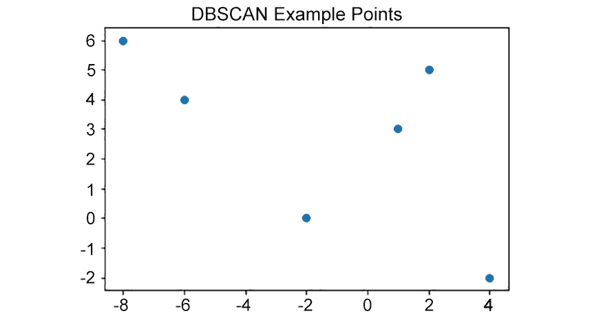

    图 3.3：样本数据点的绘图

1.  计算每两个点之间的欧几里得距离：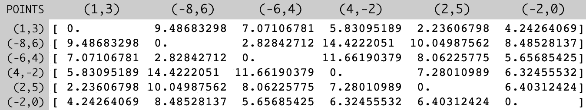

    图 3.4：点之间的距离

1.  从每个点出发，向外扩展邻域大小并形成簇。为了方便理解，假设你通过一个半径为五的邻域。这意味着，如果两点之间的距离小于五个单位，它们就会成为邻居。例如，点 (1,3) 有点 (2,5) 和 (-2,0) 作为邻居。

    根据给定点邻域中点的数量，该点可以被分类为以下三类：

    **核心点**：如果观察点在其邻域中拥有比最低点数要求更多的数据点，这些点构成了一个簇，则该点被称为该簇的核心点。所有核心点所在的邻域中的其他核心点都属于同一簇。然而，所有不在同一邻域内的核心点属于另一个簇。

    **边界点**：如果观察点周围没有足够的邻居（数据点），但至少有一个核心点（在其邻域内），则该点表示该簇的边界点。边界点属于其最近核心点的同一簇。

    **噪声点**：如果数据点在其邻域内没有满足要求的最小数据点数量，并且与任何核心点无关，则该点被视为噪声点，并从聚类中排除。

1.  拥有邻居的点将进行评估，以查看它们是否通过最小点数的阈值。在这个例子中，如果我们通过了最小点数阈值为二，那么点 (1,3)，(2,5)，和 (-2,0) 可以正式归为同一簇。如果我们通过最小点数阈值为四，那么这三个数据点将被视为多余的噪声。

1.  拥有比邻域内所需最小邻居数量更少邻居，并且其邻域不包含核心点的点被标记为噪声点，且不参与聚类。因此，点 (-6,4)，(4,-2)，和 (-8,6) 属于这一类别。然而，像 (2,5) 和 (2,0) 这样的点，尽管它们不满足邻域内最小点数的标准，但它们确实包含一个核心点作为邻居，因此被标记为边界点。

1.  以下表格总结了某个特定点的邻居，并将其分类为核心点、边界点和噪声数据点（如前述步骤所提到），邻域半径为 5，最小邻居标准为 2。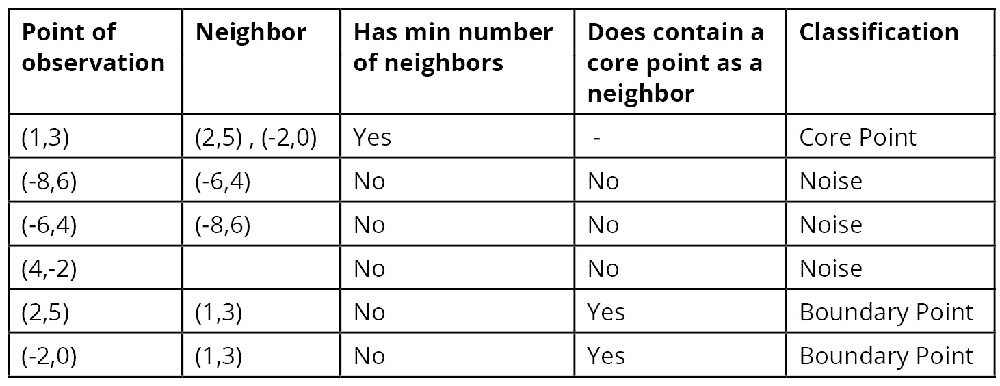

    图 3.5：表格展示了给定点的邻居详细信息

1.  对任何剩余的未访问数据点重复此过程。

在此过程结束时，你将把整个数据集划分为聚类或无关的噪声。DBSCAN 的性能在很大程度上取决于你选择的阈值超参数。这意味着你可能需要多次运行 DBSCAN，并使用不同的超参数选项，以了解它们如何影响整体性能。

注意，DBSCAN 不需要我们在 k-means 和以质心为中心的层次聚类实现中看到的质心。这个特点使得 DBSCAN 对于复杂数据集更有效，因为大多数数据并不是像干净的块状物一样的形状。与 k-means 或层次聚类相比，DBSCAN 在应对离群点和噪声方面也更有效。

现在让我们看看随着邻域半径大小的变化，DBSCAN 的性能如何变化。

## 练习 3.01: 评估邻域半径大小的影响

在本次练习中，我们将颠倒我们通常在前面示例中看到的顺序，首先查看 scikit-learn 中的 DBSCAN 打包实现，然后再自己实现它。这是故意的，目的是充分探索不同邻域半径大小如何显著影响 DBSCAN 的性能。

完成这个练习后，你将熟悉调整邻域半径大小如何改变 DBSCAN 的性能。了解 DBSCAN 的这些方面非常重要，因为它们可以通过高效排查聚类算法问题，为你节省未来的时间：

1.  导入 scikit-learn 和 matplotlib 中本次练习所需的包：

    ```py
    from sklearn.cluster import DBSCAN
    from sklearn.datasets import make_blobs
    import matplotlib.pyplot as plt
    %matplotlib inline
    ```

1.  生成一个随机聚类数据集来进行实验；X = 坐标点，y = 聚类标签（不需要）：

    ```py
    X, y = make_blobs(n_samples=1000, centers=8, \
                      n_features=2, random_state=800)
    # Visualize the data
    plt.scatter(X[:,0], X[:,1])
    plt.show()
    ```

    输出结果如下：

    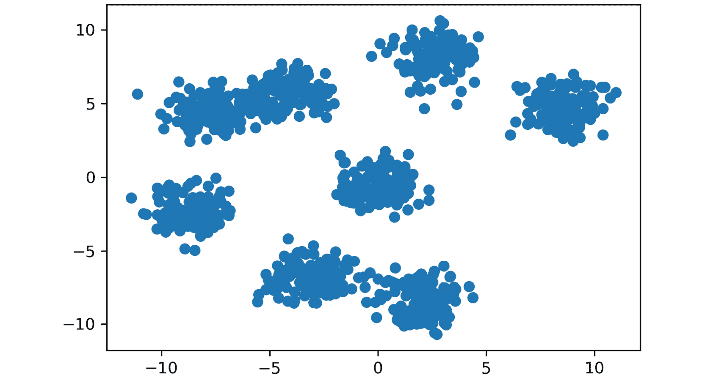

    图 3.6: 可视化的玩具数据示例

1.  在为这个玩具问题绘制虚拟数据之后，你将看到数据集有两个特征，大约七到八个聚类。要使用 scikit-learn 实现 DBSCAN，你需要实例化一个新的 scikit-learn 类：

    ```py
    db = DBSCAN(eps=0.5, min_samples=10, metric='euclidean')
    ```

    我们的示例 DBSCAN 实例存储在 `db` 变量中，并且我们的超参数在创建时传入。为了本示例，你可以看到邻域半径（`eps`）被设置为 `0.5`，而最小点数设置为 `10`。为了与我们之前的章节保持一致，我们将再次使用欧几里得距离作为我们的距离度量。

    注意

    `eps` 代表 epsilon，是你的算法在查找邻居时会搜索的邻域半径。

1.  让我们设置一个循环，允许我们交互式地探索潜在的邻域半径大小选项：

    ```py
    eps = [0.2,0.7,4]
    for ep in eps:
        db = DBSCAN(eps=ep, min_samples=10, metric='euclidean')
        plt.scatter(X[:,0], X[:,1], c=db.fit_predict(X))
        plt.title('Toy Problem with eps: ' + str(ep))
        plt.show()
    ```

    上述代码产生了以下图表：

    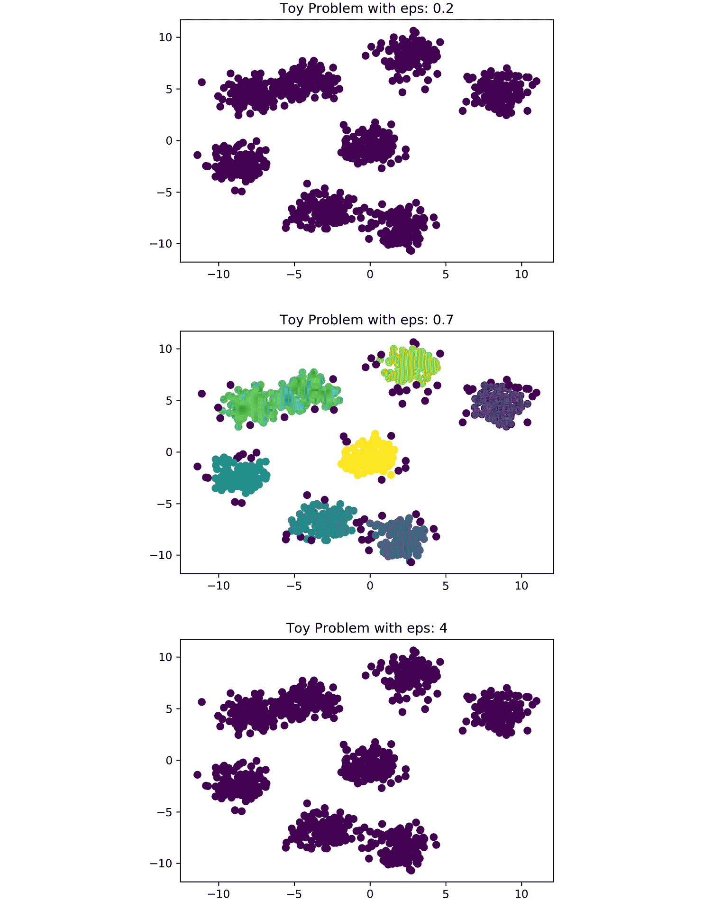

图 3.7: 结果图

从图中可以看出，将邻域大小设置得过小会导致所有内容都被视为随机噪声（紫色点）。稍微增加邻域大小后，我们能够形成更有意义的簇。再大的 epsilon 值会将整个数据集合并为一个簇（紫色数据点）。尝试重新创建前面的图并实验不同的 `eps` 大小。

注意

要访问这一部分的源代码，请参考 [`packt.live/3gEijGC`](https://packt.live/3gEijGC)。

你也可以在 [`packt.live/2ZPBfeJ`](https://packt.live/2ZPBfeJ) 在线运行这个例子。

## DBSCAN 属性 – 邻域半径

在前面的练习中，你看到设置合适的邻域半径对 DBSCAN 实现性能的影响。如果你的邻域设置得太小，那么所有数据都会被当作噪声处理，无法聚类。如果将邻域设置得过大，所有数据也会被归为一个簇，无法提供任何价值。如果你用自己的 `eps` 值进一步探索了前面的练习，你可能会注意到，单纯依靠邻域大小进行有效聚类是非常困难的。这时，最小点数阈值就派上了用场。我们稍后会讲到这个话题。

为了更深入地理解 DBSCAN 的邻域概念，我们来看一下在实例化时传入的 `eps` 超参数。这个 epsilon 值会被转换为一个半径，围绕任意给定的数据点以圆形方式进行扫描，作为邻域的定义：

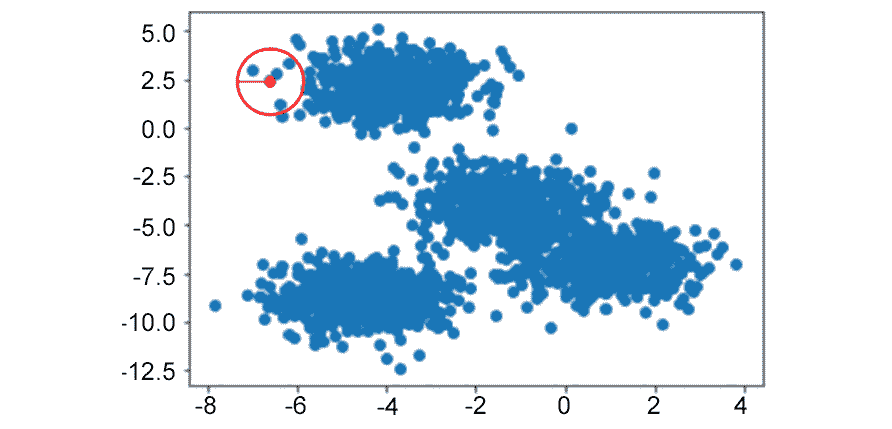

图 3.8：邻域半径的可视化；红色圆圈表示邻域

在这个例子中，中心点会有四个邻居，正如前面的图中所示。

这里需要观察的一个关键点是，你的邻域搜索形成的形状在二维空间中是圆形的，在三维空间中是球形的。这可能会根据数据的结构影响你模型的性能。再一次，簇可能看起来像是直观的结构，但这不一定总是如此。幸运的是，DBSCAN 很好地解决了这类簇的问题，虽然这些簇可能是你感兴趣的，但并不符合显式的簇结构：

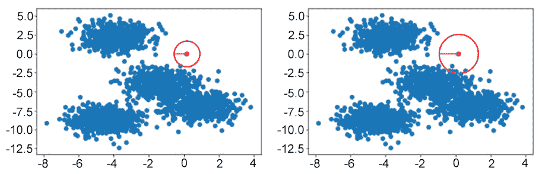

图 3.9：邻域半径大小变化的影响

左侧的数据点将被分类为随机噪声。右侧的数据点有多个邻居，可能会形成一个自己的簇。

## 活动 3.01：从零开始实现 DBSCAN

在面试中，你被要求使用生成的二维数据集从零开始创建 DBSCAN 算法。为此，你需要将邻域搜索的理论转化为生产代码，并通过递归调用来添加邻居。正如前一节所解释的，你将使用距离扫描，在指定点周围的空间内添加这些邻居。

根据你在前几章中学到的关于 DBSCAN 和距离度量的知识，从零开始用 Python 实现 DBSCAN。你可以自由使用 NumPy 和 SciPy 来评估距离。

以下步骤将帮助你完成此活动：

1.  生成一个随机聚类数据集。

1.  可视化数据。

1.  从零开始创建函数，允许你在数据集上调用 DBSCAN。

1.  使用你创建的 DBSCAN 实现来找到生成数据集中的聚类。根据需要调整超参数，依据其性能来调优。

1.  可视化你从零开始实现的 DBSCAN 聚类性能。

这个练习的目标是让你在使用 scikit-learn 中的完整实现之前，从零开始实现 DBSCAN 的工作原理。通过这种方式从零开始处理任何机器学习算法是非常重要的，它帮助你“赚取”使用更简便实现的能力，同时仍然能够在未来深入讨论 DBSCAN：

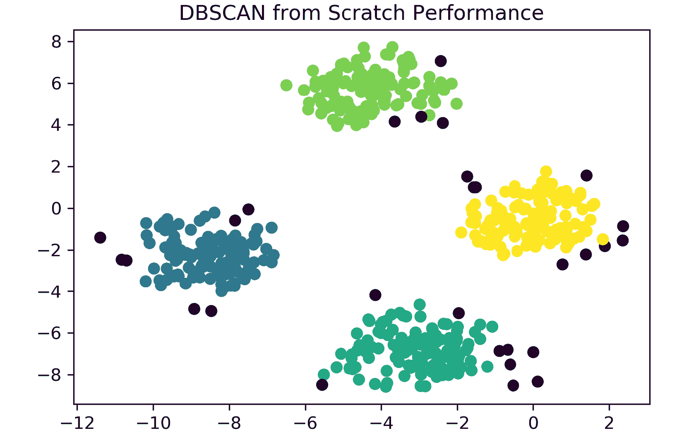

图 3.10：预期结果

注意

此活动的解决方案可以在第 428 页找到。

## DBSCAN 属性 – 最小点数

除了邻域半径外，成功实现 DBSCAN 的另一个核心组成部分是聚类内所需的最小数据点数，以证明数据点属于该聚类。如前所述，较低的阈值在稀疏数据集上对算法的优化非常明显。这并不意味着它在密集数据中没有用处；然而，虽然将单个随机分布的数据点轻松归类为噪声，但当我们有两个到三个点随机分布时，就变得模糊不清。例如，这些数据点应该是自己的聚类，还是也应该被分类为噪声？最小点数阈值有助于解决这个问题。

在 scikit-learn 实现的 DBSCAN 中，这个超参数出现在创建 DBSCAN 实例时传递的 `min_samples` 字段。这个字段与邻域半径大小超参数一起非常有价值，能够完善你的基于密度的聚类方法：

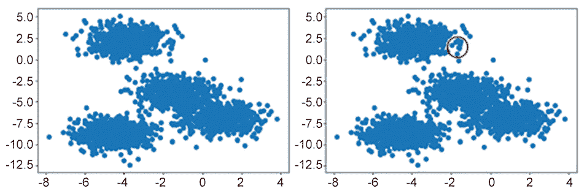

图 3.11：决定数据点是否为噪声或聚类的最小点数阈值

如果最小点数阈值为 10 个点，则它将在该邻域内将数据归类为噪声。

在实际应用中，当你有大量数据时，最小点数会产生很大的影响。回到葡萄酒聚类的例子，如果你的商店实际上是一个大型葡萄酒仓库，你可能有成千上万瓶酒，其中只有一两瓶酒可以被视为一个单独的聚类。根据你的用例，这可能是有用的；然而，需要牢记的是，数据中的主观量级。如果你有数百万个数据点，随机噪声很容易被视为数百甚至数千个单独的销售记录。然而，如果你的数据规模是几百或几千个数据点，单个数据点也可能被视为随机噪声。

## 练习 3.02：评估最小点数阈值的影响

类似于*练习 3.01*，*评估邻域半径大小的影响*，我们探讨了设置合适邻域半径大小的值，本次我们将重复该练习，但改为在各种数据集上改变最小点数阈值。

使用我们当前的 DBSCAN 实现，我们可以轻松调整最小点数阈值。调整此超参数，并观察它在生成数据上的表现。

通过调整 DBSCAN 的最小点数阈值，你将了解它如何影响你的聚类预测质量。

再次，我们从随机生成的数据开始：

1.  生成一个随机聚类数据集，如下所示：

    ```py
    from sklearn.cluster import DBSCAN
    from sklearn.datasets import make_blobs
    import matplotlib.pyplot as plt
    %matplotlib inline
    X, y = make_blobs(n_samples=1000, centers=8,\
                      n_features=2, random_state=800)
    ```

1.  如下所示，可视化数据：

    ```py
    # Visualize the data
    plt.scatter(X[:,0], X[:,1])
    plt.show()
    ```

    输出结果如下：

    

    图 3.12：生成数据的图表

1.  使用与之前相同的绘图数据，让我们选取*练习 3.01*，*评估邻域半径大小的影响*中的一个表现更好的邻域半径大小——`eps = 0.7`：

    ```py
    db = DBSCAN(eps=0.7, min_samples=10, metric='euclidean')
    ```

    注意

    `eps`是一个可调的超参数。在前一个练习的*步骤 3*中，我们使用了`0.5`的值。在这一步，我们根据对该参数的实验使用了`eps = 0.7`。

1.  实例化 DBSCAN 聚类算法后，我们将`min_samples`超参数视为我们希望调整的变量。我们可以循环遍历，找到适合我们用例的最小点数：

    ```py
    num_samples = [10,19,20]
    for min_num in num_samples:
        db = DBSCAN(eps=0.7, min_samples=min_num, metric='euclidean')
        plt.scatter(X[:,0], X[:,1], c=db.fit_predict(X))
        plt.title('Toy Problem with Minimum Points: ' + str(min_num))
        plt.show()
    ```

    查看生成的第一个图表，我们可以看到如果你严格按照*练习 3.01*，*评估邻域半径大小的影响*的要求，用 10 个最小点作为聚类成员资格的阈值，你会得到的结果：

    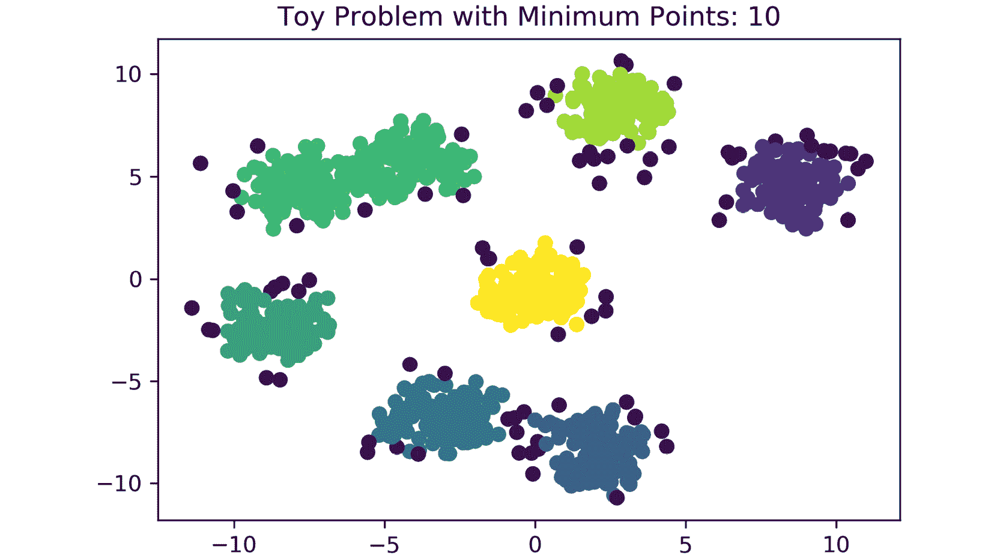

图 3.13：具有最小 10 个点的玩具问题图

剩余的两个超参数选项可以明显影响你的 DBSCAN 聚类算法的性能，并展示了数字的微小变化如何极大地影响性能：

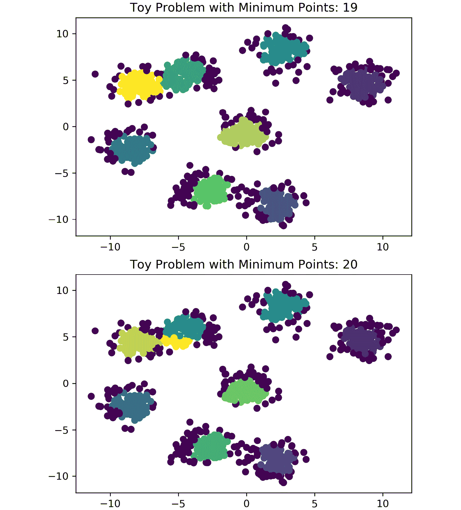

图 3.14：玩具问题的图表

正如您所看到的，仅仅将最小点数从 19 改为 20 就会在我们的特征空间中增加一个额外（不正确的！）的聚类。通过本练习学到的关于最小点数的知识，您现在可以调整 scikit-learn 实现中的 epsilon 和最小点数阈值，以达到最佳聚类数。

注意

在我们原始生成的数据中，我们创建了八个聚类。这表明最小点数的微小变化可能会添加完全不应存在的新聚类。

要访问此特定部分的源代码，请参阅[`packt.live/3fa4L5F`](https://packt.live/3fa4L5F)。

您还可以在[`packt.live/31XUeqi`](https://packt.live/31XUeqi)上在线运行此示例。

## 活动 3.02：比较 DBSCAN 与 k-means 和层次聚类

在前面的章节中，我们尝试使用层次聚类将不同的葡萄酒分组在一起。让我们再次尝试使用 DBSCAN 这种方法，看看邻域搜索是否能取得更好的效果。作为提醒，您正在管理商店的库存，并收到了大量葡萄酒的运输过程中标签掉落的情况。幸运的是，您的供应商提供了每瓶酒的化学读数及其对应的序列号。不幸的是，您无法打开每瓶酒品尝其差异 - 您必须找到一种方法将未贴标签的酒重新按照其化学读数分组！您从订单列表中知道，您订购了三种不同类型的葡萄酒，并且只给出了两种葡萄酒属性来将酒类重新分组。

在之前的章节中，我们能够看到 k-means 和层次聚类在葡萄酒数据集上的表现。在我们的最佳情况下，我们能够实现 0.59 的轮廓分数。使用 scikit-learn 的 DBSCAN 实现，让我们看看是否可以获得更好的聚类效果。

这些步骤将帮助您完成活动：

1.  导入必要的包。

1.  加载葡萄酒数据集并检查数据的外观。

1.  可视化数据。

1.  使用 k-means、凝聚聚类和 DBSCAN 生成聚类。

1.  评估几种不同的 DSBSCAN 超参数选项及其对轮廓分数的影响。

1.  基于最高轮廓分数生成最终的聚类。

1.  可视化使用三种方法生成的聚类。

    注意

    我们从[`archive.ics.uci.edu/ml/datasets/wine`](https://archive.ics.uci.edu/ml/datasets/wine)获取了此数据集。[引用：Dua, D. and Graff, C. (2019). UCI Machine Learning Repository [[`archive.ics.uci.edu/ml`](http://archive.ics.uci.edu/ml)]。Irvine, CA: 加利福尼亚大学，信息与计算机科学学院]。您还可以在[`packt.live/3bW8NME`](https://packt.live/3bW8NME)上访问它。

完成此活动后，你将重新构建一个完整的聚类问题工作流程。你已经在*第二章*、*层次聚类*中熟悉了数据，并且在本活动结束时，你将进行模型选择，找到适合你数据集的最佳模型和超参数。你将为每种聚类类型获得酒类数据集的轮廓系数。

注意

本活动的解决方案可以在第 431 页找到。

# DBSCAN 与 k 均值和层次聚类

现在你已经理解了 DBSCAN 的实现方式，以及可以调整的多个超参数来驱动性能，让我们来看看它与我们之前介绍的聚类方法——k 均值聚类和层次聚类——有何不同。

你可能在*活动 3.02*、*比较 DBSCAN 与 k 均值和层次聚类*中注意到，DBSCAN 在通过轮廓系数找到最优簇时可能有些挑剔。这是邻域方法的一个缺点——当你对数据中簇的数量有一些了解时，k 均值和层次聚类的表现通常非常好。在大多数情况下，这个簇的数量较少，你可以通过多次尝试不同的数量来观察其表现。相比之下，DBSCAN 采取了一种自下而上的方法，通过调整超参数并找到它认为重要的簇。在实际操作中，当前两种方法失败时，考虑使用 DBSCAN 会很有帮助，因为它需要较多的调整才能正常工作。尽管如此，当你的 DBSCAN 实现正常工作时，它通常会远远优于 k 均值和层次聚类（在实际中，这通常发生在高度交织但仍然离散的数据中，例如包含两个半月形的特征空间）。

与 k 均值和层次聚类相比，DBSCAN 可能更高效，因为它只需要查看每个数据点一次。与多次迭代寻找新质心并评估其最近邻的过程不同，在 DBSCAN 中，一旦一个点被分配到某个簇，它的簇成员关系就不会再发生变化。DBSCAN 与层次聚类相比，另一大关键特点是，它不需要在创建时显式地传递期望的簇数量，而 k 均值却需要。这一点在你没有外部指导如何拆分数据集时非常有帮助。

# 总结

在本章中，我们讨论了层次聚类和 DBSCAN，以及它们最适合应用的情况。虽然层次聚类在某些方面可以被看作是 k-means 中最近邻方法的扩展，但 DBSCAN 通过应用密度的概念来解决寻找邻居的问题。当数据非常复杂且交织在一起时，这种方法可能非常有用。虽然 DBSCAN 非常强大，但它并不是万无一失的，具体效果也取决于原始数据的表现，有时甚至可能显得过于复杂。

然而，结合了 k-means 和层次聚类，DBSCAN 在聚类任务中为无监督学习提供了一个强大的工具箱。在面对该领域的任何问题时，比较每种方法的表现并观察哪种方法效果最佳是非常值得的。

在探索了聚类后，我们将进入无监督学习中另一个关键技能：降维。通过智能地减少维度，我们可以使聚类更加易于理解，并能够与利益相关者进行沟通。降维对于以最有效的方式创建各种机器学习模型也至关重要。在下一章，我们将深入研究主题模型，并查看在这些章节中学习的聚类方面如何应用于自然语言处理（NLP）类型的问题。
