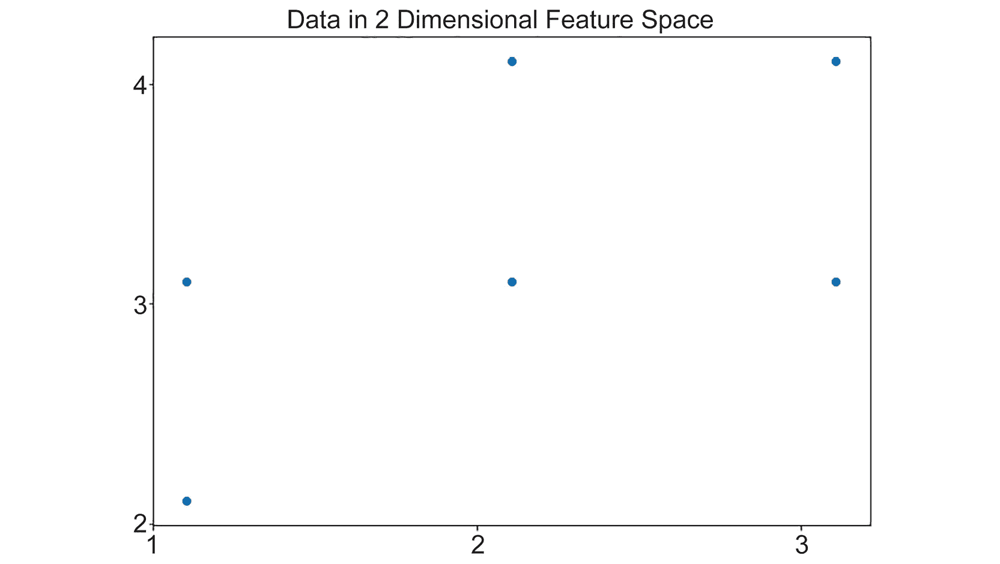
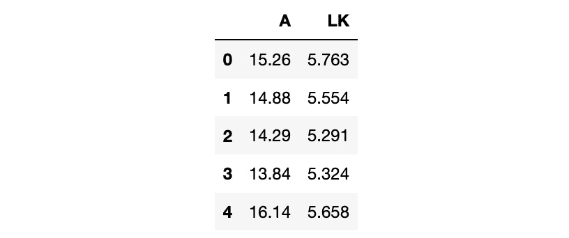

# 第五章：4. 降维技术与 PCA

概述

在本章中，我们将应用降维技术，并描述主成分和降维背后的概念。在使用 scikit-learn 解决问题时，我们将应用**主成分分析**（**PCA**）。我们还将比较手动 PCA 与 scikit-learn 的实现。到本章结束时，你将能够通过提取数据中最重要的方差成分，来减小数据集的规模。

# 介绍

在上一章，我们讨论了聚类算法及其在从大量数据中提取潜在意义方面的应用。本章将探讨在无监督学习算法中使用不同特征集（或特征空间），我们将从讨论降维开始，特别是**主成分分析**（**PCA**）。接着，我们将通过探索两种独立强大的机器学习架构——基于神经网络的自动编码器，来扩展我们对不同特征空间优势的理解。神经网络无疑在监督学习问题中享有强大的声誉。此外，通过使用自动编码器阶段，神经网络已经被证明在无监督学习问题中具有足够的灵活性。最后，我们将基于神经网络实现和降维进行扩展，介绍在*第六章*中涵盖的 t-分布最近邻方法，*t-分布随机邻居嵌入*。这些技术在处理高维数据时非常有用，如图像处理或包含多个特征的数据集。一些降维技术的一个重要商业优势是，它有助于去除那些对最终输出影响不大的特征。这为提升算法效率创造了机会，而不损失性能。

# 什么是降维？

降维是数据科学家工具箱中的一项重要工具，由于其广泛的应用场景，几乎已成为该领域的基本知识。因此，在我们考虑降维及其降维的原因之前，我们必须首先清楚理解“维度”是什么。简单来说，维度是与数据样本相关的维度、特征或变量的数量。通常，可以将其视为电子表格中的列数，其中每个样本占一行，每列描述样本的一个属性。以下表格就是一个例子：


图 4.1：具有三种不同特征的两组数据样本

在上表中，我们有两个数据样本，每个样本有三个独立的特征或维度。根据正在解决的问题或数据集的来源，我们可能希望减少每个样本的维度数量，而不丢失提供的信息。这就是降维可以帮助我们的地方。但是降维究竟如何帮助我们解决问题呢？我们将在接下来的部分详细介绍其应用。然而，假设我们有一个非常大的时间序列数据集，比如心电图或心电图（在某些国家也称为心电图），如下图所示：


图 4.2：心电图（ECG 或 EKG）

这些信号是从贵公司新款手表中捕获的，我们需要寻找心脏病发作或中风的迹象。在查看数据集后，我们可以得出一些观察结果：

+   大多数单独的心跳非常相似。

+   数据中存在来自记录系统或患者在记录期间移动时的一些噪声。

+   尽管存在噪声，心跳信号仍然可见。

+   数据量非常大 - 使用手表上可用的硬件无法处理太多数据。

正是在这种情况下，降维技术真正发挥了作用。通过使用降维，我们能够从信号中去除大部分噪声，这反过来将有助于算法对数据的性能以及减小数据集大小以满足更低的硬件要求。本章中要讨论的技术，特别是 PCA 和自编码器，已在研究和工业中得到了有效地应用，以有效地处理、聚类和分类这类数据集。

## 降维的应用场景

在我们开始详细研究降维和 PCA 之前，我们将讨论这些技术的一些常见应用：

+   **预处理/特征工程**：最常见的应用之一是在开发机器学习解决方案的预处理或特征工程阶段。在算法开发过程中提供的信息质量，以及输入数据与期望结果之间的相关性，对于设计出高性能的解决方案至关重要。在这种情况下，PCA 可以提供帮助，因为我们能够从数据中分离出最重要的信息成分，并将其提供给模型，以便仅提供最相关的信息。这也有一个次要的好处，即我们减少了提供给模型的特征数量，从而可以减少需要完成的计算量。这可以减少系统的整体训练时间。这个特征工程的一个典型应用案例是预测某笔交易是否存在信用卡盗刷风险。在这种情况下，您可能会面临数百万笔交易，每笔交易有几十个甚至上百个特征。这将是资源密集型的，甚至在实时运行预测算法时都几乎不可能；然而，通过使用特征预处理，我们可以将许多特征提炼成仅仅是最重要的 3-4 个特征，从而减少运行时间。

+   **降噪**：降维也可以作为一种有效的降噪/过滤技术。预期信号或数据集中的噪音并不占据数据变化的主要部分。因此，我们可以通过去除较小的变化成分来去除信号中的一些噪音，然后将数据恢复到原始的数据空间。在下面的示例中，左侧的图像已经过滤到前 20 个最重要的数据源，这为我们提供了右侧的图像。我们可以看到图像的质量有所降低，但关键信息仍然存在：

    ](img/B15923_04_03.jpg)

图 4.3：使用降维过滤的图像

注意

这张照片由 Arthur Brognoli 拍摄，来自 Pexels，并根据[`www.pexels.com/photo-license/`](https://www.pexels.com/photo-license/)提供免费下载。在这种情况下，左侧是原始图像，右侧是经过过滤的图像。

+   **生成合理的人工数据集**：由于主成分分析（PCA）将数据集分解为信息（或变化）的组件，我们可以研究每个组件的影响，或者通过调整特征值之间的比例来生成新的数据集样本。本章稍后会详细介绍特征值。我们可以对这些组件进行缩放，这实际上是增加或减少该特定组件的重要性。这也被称为**统计形状建模**，因为一个常见的方法是使用它来创建合理的形状变体。它还用于在**主动形状建模**过程中检测图像中的面部标志点。

+   **金融建模/风险分析**：降维为金融行业提供了一个有用的工具包，因为能够将大量的市场指标或信号合并成较少的几个组件，可以加快计算速度并提高效率。类似地，这些组件可以用于突出那些风险较高的产品/公司。

## 高维灾难

在我们理解使用降维技术的好处之前，我们必须首先理解为什么需要减少特征集的维度。**高维灾难**是一个常用术语，用来描述在处理具有高维特征空间的数据时所遇到的问题；例如，为每个样本收集的属性数量。考虑一下《吃豆人》游戏中的点位置数据集。你的角色，吃豆人，处于一个由两个维度或坐标（*x*, *y*）定义的虚拟世界中的某个位置。假设我们正在创建一个新的电脑敌人：一个由人工智能驱动的鬼怪，用来对抗玩家，它需要一些关于玩家角色的信息来做出自己的游戏逻辑决策。为了让这个机器人有效，我们需要玩家的位置信息（*x*, *y*）和他们在各个方向上的速度（*vx*, *vy*），以及玩家最近五个（*x*, *y*）位置的数据，剩余的心数和迷宫中剩余的能量豆数量（能量豆暂时允许吃豆人吃掉鬼怪）。因此，在每个时刻，我们的机器人需要 16 个单独的特征（或维度）来做出决策。这 16 个特征对应于 5 个先前的位置数据乘以 2 个*x*和*y*坐标 + 当前玩家位置的 2 个*x*和*y*坐标 + 玩家速度的 2 个*x*和*y*坐标 + 1 个心数特征 + 1 个能量豆特征 = 16。这显然比单纯由位置提供的两个维度要多得多：


图 4.4：吃豆人游戏中的维度

为了解释降维的概念，我们将考虑一个虚构的数据集（参见*图 4.5*），其中*x*和*y*坐标作为特征，构成了特征空间中的两个维度。需要注意的是，这个例子绝不是数学证明，而是旨在提供一种可视化增加维度效果的方法。在这个数据集中，我们有六个单独的样本（或点），我们可以在特征空间中可视化目前占据的体积，约为*(3 – 1) x (4 – 2) = 2 x 2 = 4*平方单位：



图 4.5：二维特征空间中的数据

假设数据集包含相同数量的点，但每个样本增加了一个特征（*z*坐标）。现在，占据的数据体积大约是*2 x 2 x 2 = 8*立方单位。因此，我们现在有相同数量的样本，但数据集所包围的空间变大了。因此，数据在可用空间中的相对体积变小，变得更加稀疏。这就是维度的诅咒；随着我们增加可用特征的数量，数据的稀疏性增加，从而使得统计相关性更难以识别。回到我们创建一个视频游戏机器人与人类玩家对战的例子，我们有 16 个特征，这些特征是不同类型的混合：位置、速度、能量道具和生命值。根据每个特征的可能取值范围以及每个特征对数据集的方差，这些数据可能会变得非常稀疏。即使在受限的吃豆人世界中，每个特征的潜在方差也可能非常大，有些特征的方差甚至比其他特征大得多。

因此，在不处理数据集稀疏性的情况下，额外的特征提供了更多的信息，但可能无法提高我们机器学习模型的性能，因为统计相关性更难以识别。我们希望做的是保留额外特征提供的有用信息，同时最小化稀疏性的负面影响。这正是降维技术的设计目的，这些技术在提高机器学习模型性能方面可以非常强大。

在本章中，我们将讨论多种不同的降维技术，并将更加详细地介绍其中最重要和最有用的方法——主成分分析（PCA），并提供一个例子。

# 降维技术概述

任何降维技术的目标都是管理数据集的稀疏性，同时保留其中提供的有用信息。在我们的分类案例中，降维通常作为一个重要的预处理步骤，在实际分类之前进行。大多数降维技术的目标是通过**特征投影**的过程来完成这一任务，将数据从高维空间调整到低维空间，以去除数据的稀疏性。同样，为了可视化投影过程，考虑一个三维空间中的球体。我们可以将球体投影到低维的二维空间，得到一个圆形，尽管丢失了一些信息（*z*坐标的值），但保留了描述其原始形状的大部分信息。我们仍然知道球体的原点、半径和流形（轮廓），并且仍然非常清楚它是一个圆。因此，根据我们要解决的问题，我们可能已经在保留重要信息的同时降低了维度：


图 4.6：3D 球体投影到 2D 空间

通过在数据集上进行降维预处理，可以获得的第二个好处是改进的计算性能。由于数据已经被投影到低维空间，它将包含更少的但可能更强大的特征。特征较少意味着，在后续的分类或回归阶段，处理的数据集规模显著更小。这可能会减少分类/回归所需的系统资源和处理时间，并且在某些情况下，降维技术还可以直接用于完成分析。

这个类比还引入了降维中的一个重要考虑因素。我们总是在尝试平衡由于投影到低维空间而导致的信息丢失，同时减少数据的稀疏性。根据问题的性质和使用的数据集，正确的平衡可能会显现出来，并且相对简单。在一些应用中，这个决策可能依赖于额外验证方法的结果，比如交叉验证（特别是在监督学习问题中）或领域专家的评估。在这种情况下，交叉验证指的是将数据集的滚动部分划分出来进行测试，而其余部分作为训练集，直到数据集的所有部分都被使用。此方法有助于减少机器学习问题中的偏差。

我们喜欢以一种方式思考降维中的权衡：考虑在计算机上传输文件或图像时进行压缩。降维技术，如 PCA，本质上是将信息压缩到更小的尺寸以便传输的方法，在许多压缩方法中，压缩过程中会发生一些损失。有时，这些损失是可以接受的；例如，如果我们需要将一个 50 MB 的图像缩小到 5 MB 以进行传输，我们仍然可以看到图像的主要内容，但可能一些较小的背景细节会变得模糊不清。我们也不会期望能够从压缩后的版本恢复出原始图像的像素完美表示，但我们可以期待恢复时会有一些额外的伪影，例如模糊。

## 降维

降维技术在机器学习中有许多应用，因为提取数据集中的有用信息能够在许多机器学习问题中提供性能提升。它们在无监督学习中尤为有用，因为无监督学习方法的数据集不包含任何真实标签或目标。无监督学习中，训练环境被用来以适合解决问题的方式组织数据（例如，通过聚类进行分类），这通常是基于数据集中的最重要信息。降维提供了一种有效的提取重要信息的方法，并且由于我们可以使用多种不同的方法，因此回顾一些可用的选项是有益的：

+   **线性判别分析** (**LDA**)：这是一种特别实用的技术，既可以用于分类，也可以用于降维。LDA 将在*第七章*，*主题建模*中进行详细介绍。

+   **非负矩阵分解** (**NMF**)：像许多降维技术一样，这依赖于线性代数的性质来减少数据集中的特征数。NMF 也将在*第七章*，*主题建模*中进行详细介绍。

+   **奇异值分解** (**SVD**)：这与 PCA（本章将详细介绍）有些相关，也是一个矩阵分解过程，与 NMF 没有太大区别。

+   **独立成分分析** (**ICA**)：这与 SVD 和 PCA 有一些相似之处，但通过放宽数据为高斯分布的假设，使得非高斯数据也能被分离出来。

迄今为止所描述的每种方法都使用线性变换来减少数据在原始实现中的稀疏性。这些方法中的一些还有使用非线性核函数进行分离过程的变体，提供了以非线性方式减少稀疏性的能力。根据所使用的数据集，非线性核可能在从信号中提取最有用的信息时更为有效。

# 主成分分析（PCA）

如前所述，PCA 是一种常用且非常有效的降维技术，它通常是许多机器学习模型和技术的预处理阶段。因此，我们将把本书的这一部分专门用来详细探讨 PCA，而不仅仅是其他方法。PCA 通过将数据分离成一系列组件来减少数据集的稀疏性，其中每个组件代表数据中的一个信息源。正如其名称所示，PCA 生成的第一个组件，即**主成分**，包含了数据中大部分的信息或方差。主成分通常可以被认为是在均值之外，贡献最多的有趣信息。随着每个后续组件的生成，贡献的信息虽然减少，但压缩数据中的微妙之处也增多。如果我们将所有这些组件放在一起使用，那么 PCA 将没有任何好处，因为它会还原回原始数据集。为了澄清这个过程以及 PCA 返回的信息，我们将通过一个实际的例子，手动完成 PCA 的计算。但首先，我们必须复习一些执行 PCA 计算所需的基础统计概念。

## 均值

均值，或称平均值，就是将所有值相加并除以数据集中的值的数量。

## 标准差

通常被称为数据的分布，并与方差相关，标准差是衡量数据有多少接近均值的一个指标。在正态分布的数据集中，约 68%的数据位于均值的一个标准差内（即在（均值 - 1*std）到（均值 + 1*std）之间，如果数据是正态分布的，你可以找到 68%的数据）。

方差和标准差之间的关系相当简单——方差是标准差的平方。

## 协方差

当标准差或方差是基于单一维度计算的数据的分布时，协方差则是一个维度（或特征）相对于另一个维度的方差。当计算某一维度相对于自身的协方差时，结果与简单计算该维度的方差相同。

## 协方差矩阵

协方差矩阵是数据集可能计算出的协方差值的矩阵表示。除了在数据探索中非常有用，协方差矩阵在执行数据集的主成分分析（PCA）时也是必需的。要确定一个特征相对于另一个特征的方差，我们只需在协方差矩阵中查找对应的值。在下图中，我们可以看到，在第 1 列第 2 行的值是特征或数据集 *Y* 相对于 *X* 的方差（*cov(Y, X))*）。我们还可以看到，协方差矩阵的对角线列包含了对相同特征或数据集计算的协方差值；例如，*cov(X, X)*。在这种情况下，值就是 *X* 的方差：


图 4.7：协方差矩阵

通常，每个协方差的确切值并不像查看协方差矩阵中每个协方差的大小和相对大小那样有趣。一个特征相对于另一个特征的协方差值很大，意味着一个特征相对于另一个特征的变化显著，而接近零的值则意味着变化很小。协方差中另一个值得注意的方面是其符号；正值表示随着一个特征的增加或减少，另一个特征也会增加或减少，而负协方差则表示两个特征相互背离，一个特征增加时另一个特征减少，反之亦然。

幸运的是，`numpy` 和 `scipy` 提供了高效执行这些计算的函数。在接下来的练习中，我们将在 Python 中计算这些值。

## 练习 4.01：使用 pandas 库计算均值、标准差和方差

在这个练习中，我们将简要回顾如何使用 `numpy` 和 `pandas` Python 库计算一些基础的统计概念。在本练习中，我们将使用一个包含不同品种小麦种子测量数据的数据库，该数据集是通过 X 射线成像创建的。这个数据集可以在附带的源代码中找到，包含了来自三种不同小麦品种：Kama、Rosa 和 Canadian 的七个独立测量值（`area A`、`perimeter P`、`compactness C`、`length of kernel LK`、`width of kernel WK`、`asymmetry coefficient` `A_Coef` 和 `length of kernel groove LKG`）。

注意

这个数据集来源于 [`archive.ics.uci.edu/ml/datasets/seed`](https://archive.ics.uci.edu/ml/datasets/seed)（UCI 机器学习库 [[`archive.ics.uci.edu/ml`](http://archive.ics.uci.edu/ml)]）。加利福尼亚大学尔湾分校信息与计算机科学学院。引用：贡献者感激地感谢波兰科学院农物理研究所（Institute of Agrophysics of the Polish Academy of Sciences in Lublin）对其工作的支持。数据集也可以从 [`packt.live/2RjpDxk`](https://packt.live/2RjpDxk) 下载。

要执行的步骤如下：

1.  导入`pandas`、`numpy`和`matplotlib`包以供使用：

    ```py
    import pandas as pd
    import numpy as np
    import matplotlib.pyplot as plt
    ```

1.  加载数据集并预览前五行数据：

    ```py
    df = pd.read_csv('../Seed_Data.csv')
    df.head()
    ```

    输出如下：

    

    图 4.8：数据头

1.  我们只需要面积`A`和内核长度`LK`特征，因此删除其他列：

    ```py
    df = df[['A', 'LK']]
    df.head()
    ```

    输出如下：

    

    图 4.9：清洗数据后的数据头

1.  通过绘制`A`与`LK`的值来可视化数据集：

    ```py
    plt.figure(figsize=(10, 7))
    plt.scatter(df['A'], df['LK'])
    plt.xlabel('Area of Kernel')
    plt.ylabel('Length of Kernel')
    plt.title('Kernel Area versus Length')
    plt.show()
    ```

    输出如下：

    

    图 4.10：数据的绘图

1.  使用`pandas`方法计算均值：

    ```py
    df.mean()
    ```

    输出如下：

    ```py
    A     14.847524
    LK     5.628533
    dtype: float64
    ```

1.  使用`numpy`方法计算均值：

    ```py
    np.mean(df.values, axis=0)
    ```

    输出如下：

    ```py
    array([14.84752381,  5.62853333])
    ```

1.  使用`pandas`方法计算标准差值：

    ```py
    df.std()
    ```

    输出如下：

    ```py
    A     2.909699
    LK    0.443063
    dtype: float64
    ```

1.  使用`numpy`方法计算标准差值：

    ```py
    np.std(df.values, axis=0)
    ```

    输出如下：

    ```py
    array([2.90276331, 0.44200731])
    ```

1.  使用`pandas`方法计算方差值：

    ```py
    df.var()
    ```

    输出如下：

    ```py
    A     8.466351
    LK    0.196305
    dtype: float64
    ```

1.  使用`numpy`方法计算方差值：

    ```py
    np.var(df.values, axis=0)
    ```

    输出如下：

    ```py
    array([8.42603482, 0.19537046])
    ```

1.  使用`pandas`方法计算协方差矩阵：

    ```py
    df.cov()
    ```

    输出如下：

    

    图 4.11：使用 pandas 方法的协方差矩阵

1.  使用`numpy`方法计算协方差矩阵：

    ```py
    np.cov(df.values.T)
    ```

    输出如下：

    ```py
    array([[8.46635078, 1.22470367],
           [1.22470367, 0.19630525]])
    ```

现在我们已经知道如何计算基础的统计值，我们将把注意力转向 PCA 的其他组成部分。

注意

要查看本节的源代码，请参考[`packt.live/2BHiLFz`](https://packt.live/2BHiLFz)。

你也可以在线运行此示例，访问[`packt.live/2O80UtW`](https://packt.live/2O80UtW)。

## 特征值和特征向量

特征值和特征向量是物理学和工程学领域中非常重要的数学概念，它们也是计算数据集主成分的最后步骤。特征值和特征向量的准确数学定义超出了本书的范围，因为它涉及较多的内容，并且需要对线性代数有一定的理解。任何一个*大小为 n x n*的方阵*A*，都存在一个形状为*n x 1*的向量*x*，使得它满足以下关系：


图 4.12：表示 PCA 的方程

这里，术语是一个数值，表示特征值，而*x*表示相应的特征向量。*N*表示矩阵*A*的阶数。矩阵*A*将有*n*个特征值和特征向量。我们不深入探讨 PCA 的数学细节，接下来让我们看一下另一种表示前述方程的方式，如下所示：


图 4.13：表示 PCA 的替代方程式

简单来说，将其应用于 PCA，我们可以推导出以下结论：

+   **协方差矩阵** (*A*)：如前一节所述，在进行特征值分解之前，矩阵*A*应该是方阵。由于在我们的数据集中，行数大于列数（假设数据集的形状是*m x n*，其中*m*是行数，*n*是列数），因此我们无法直接进行特征值分解。为了对矩形矩阵执行特征值分解，首先需要通过计算其协方差矩阵将其转换为方阵。协方差矩阵的形状为*n x n*，即它是一个*n*阶的方阵。

+   **特征向量** (*U*) 是对数据集贡献信息的组成部分，如本节第一段中所述的主成分称为特征向量。每个特征向量描述数据集中的某些变化性。这种变化性由相应的特征值表示。特征值越大，贡献越大。特征向量矩阵的形状为*n x n*。

+   **特征值** () 是描述每个特征向量对数据集贡献大小的单个值。如前所述，描述最大贡献的特征向量称为主成分，因此具有最大的特征值。相应地，具有最小特征值的特征向量对数据的方差或信息贡献最小。特征值是对角矩阵，其中对角元素表示特征值。

请注意，即使是数据的协方差矩阵的 SVD 也会产生特征值分解，我们将在*练习 4.04*中看到，*scikit-learn PCA*。然而，SVD 使用不同的过程来分解矩阵。请记住，特征值分解仅适用于方阵，而 SVD 也可以应用于矩阵。

注意

**方阵**：方阵的行数和列数相等。方阵的行数被称为矩阵的阶数。行列数不等的矩阵称为矩形矩阵。

**对角矩阵**：对角矩阵的非对角元素全为零。

## 练习 4.02：计算特征值和特征向量

如前所述，手动推导和计算特征值和特征向量有些复杂，超出了本书的范围。幸运的是，`numpy`为我们提供了计算这些值的所有功能。再次，我们将使用 Seeds 数据集作为示例：

注意

该数据集来源于[`archive.ics.uci.edu/ml/datasets/seeds`](https://archive.ics.uci.edu/ml/datasets/seeds)。（UCI 机器学习库 [[`archive.ics.uci.edu/ml`](http://archive.ics.uci.edu/ml)]。加利福尼亚州尔湾：加利福尼亚大学信息与计算机科学学院。）引用：贡献者由衷感谢波兰科学院农业物理研究所（位于卢布林）对其工作的支持。该数据集还可以从[`packt.live/34gOQ0B`](https://packt.live/34gOQ0B)下载。

1.  导入 `pandas` 和 `numpy` 包：

    ```py
    import pandas as pd
    import numpy as np
    ```

1.  加载数据集：

    ```py
    df = pd.read_csv('../Seed_Data.csv')
    df.head()
    ```

    输出如下：

    

    图 4.14：数据集的前五行

1.  再次，我们只需要 `A` 和 `LK` 特征，所以删除其他列：

    ```py
    df = df[['A', 'LK']]
    df.head()
    ```

    输出如下：

    

    图 4.15：核特征的面积和长度

1.  从 `numpy` 的线性代数模块中，使用 `eig` 函数计算 `eigenvalues` 和 `eigenvectors` 特征向量。注意此处使用了数据的协方差矩阵：

    ```py
    eigenvalues, eigenvectors = np.linalg.eig(np.cov(df.T))
    ```

    注意

    `numpy` 函数 `cov` 可以用来计算数据的协方差矩阵。它产生一个与数据特征数相等的方阵。

1.  看一下特征值；我们可以看到第一个值是最大的，所以第一个特征向量贡献了最多的信息：

    ```py
    eigenvalues
    ```

    输出如下：

    ```py
    array([8.64390408, 0.01875194])
    ```

1.  观察特征值作为数据集总方差百分比是很方便的。我们将使用一个累积和函数来实现这一点：

    ```py
    eigenvalues = np.cumsum(eigenvalues)
    eigenvalues
    ```

    输出如下：

    ```py
    array([8.64390408, 8.66265602])
    ```

1.  除以最后一个或最大值，将特征值转换为百分比：

    ```py
    eigenvalues /= eigenvalues.max()
    eigenvalues
    ```

    输出如下：

    ```py
    array([0.99783531, 1.])
    ```

    我们可以看到，第一个（或主）成分包含了数据中 99%的变化，因此，包含了大部分信息。

1.  现在，让我们来看看 `eigenvectors`：

    ```py
    eigenvectors
    ```

    输出的部分如下：

    ```py
    array([[ 0.98965371, -0.14347657],
           [ 0.14347657,  0.98965371]])
    ```

1.  确认特征向量矩阵的形状是（`n x n`）格式；即 `2` x `2`：

    ```py
    eigenvectors.shape
    ```

    输出如下：

    ```py
    (2, 2)
    ```

1.  所以，从特征值中，我们看到主成分是第一个特征向量。看看第一个特征向量的值：

    ```py
    P = eigenvectors[0]
    P
    ```

    输出如下：

    ```py
    array([0.98965371, -0.14347657])
    ```

我们已将数据集分解为主成分，并通过特征向量进一步降低了数据的维度。

注意

要访问此特定部分的源代码，请参阅[`packt.live/3e5x3N3`](https://packt.live/3e5x3N3)。

你也可以在线运行这个例子，访问[`packt.live/3f5Skrk`](https://packt.live/3f5Skrk)。

在后续示例中，我们将考虑 PCA，并将此技术应用于一个示例数据集。

## PCA 过程

现在，我们已经准备好所有的部分来完成 PCA，以减少数据集中的维度。

完成 PCA 的整体算法如下：

1.  导入所需的 Python 包（`numpy` 和 `pandas`）。

1.  加载整个数据集。

1.  从可用的数据中，选择您希望在降维中使用的特征。

    注意

    如果数据集中的特征之间存在显著的规模差异；例如，一个特征的值范围在 0 和 1 之间，另一个特征的值范围在 100 和 1000 之间，您可能需要对其中一个特征进行归一化，因为这种量级差异可能会消除较小特征的影响。在这种情况下，您可能需要将较大的特征除以其最大值。

    作为示例，看看这个：

    `x1 = [0.1, 0.23, 0.54, 0.76, 0.78]`

    `x2 = [121, 125, 167, 104, 192]`

    `# 将 x2 归一化到 0 到 1 之间`

    `x2 = (x2-np.min(x2)) / (np.max(x2)-np.min(x2))`

1.  计算所选（并可能归一化后的）数据的`协方差`矩阵。

1.  计算`协方差`矩阵的特征值和特征向量。

1.  将特征值（及其对应的特征向量）从大到小排序。

1.  计算特征值占数据集中总方差的百分比。

1.  选择特征值和对应特征向量的数量。它们将被要求组成一个预定值的最小成分方差。

    注意

    在此阶段，排序后的特征值表示数据集总方差的百分比。因此，我们可以使用这些值来选择所需的特征向量数量，无论是用于解决问题，还是充分减少应用于模型的数据集的大小。例如，假设我们要求在 PCA 的输出中至少占有 90% 的方差。我们就会选择那些至少占有 90% 方差的特征值（及其对应的特征向量）。

1.  将数据集与选定的特征向量相乘，您就完成了 PCA，从而减少了表示数据的特征数量。

1.  绘制结果。

在进行下一个练习之前，请注意，**转置**是线性代数中的一个术语，指的是将矩阵的行和列互换。假设我们

有一个矩阵`X=[1, 2, 3]`，那么，*X*的转置就是。

## 练习 4.03：手动执行 PCA

对于本练习，我们将手动完成 PCA，再次使用 Seeds 数据集。对于这个例子，我们希望足够减少数据集中的维度，以包含至少 75% 的可用方差：

注意

该数据集来源于[`archive.ics.uci.edu/ml/datasets/seeds`](https://archive.ics.uci.edu/ml/datasets/seeds)。 （UCI 机器学习数据集 [[`archive.ics.uci.edu/ml`](http://archive.ics.uci.edu/ml)]。加利福尼亚大学，信息与计算机科学学院。）引用：贡献者感谢波兰科学院农物理研究所对其工作的支持。该数据集也可以从[`packt.live/2Xe7cxO`](https://packt.live/2Xe7cxO)下载。

1.  导入`pandas`和`numpy`包：

    ```py
    import pandas as pd
    import numpy as np
    import matplotlib.pyplot as plt
    ```

1.  加载数据集：

    ```py
    df = pd.read_csv('../Seed_Data.csv')
    df.head()
    ```

    输出如下：

    

    图 4.16：数据集的前五行

1.  由于我们只需要`A`和`LK`特征，因此删除其他列。在此示例中，我们没有对所选数据集进行归一化：

    ```py
    df = df[['A', 'LK']]
    df.head()
    ```

    输出如下：

    

    图 4.17：核特征的面积和长度

1.  计算所选数据的`协方差`矩阵。请注意，我们需要对`协方差`矩阵进行转置，以确保其基于特征数量（2），而不是样本数量（150）：

    ```py
    data = np.cov(df.values.T)
    """
    The transpose is required to ensure the covariance matrix is 
    based on features, not samples data
    """
    data
    ```

    输出如下：

    ```py
    array([[8.46635078, 1.22470367],
           [1.22470367, 0.19630525]])
    ```

1.  计算协方差矩阵的特征向量和特征值。同样，使用`full_matrices`函数参数：

    ```py
    eigenvectors, eigenvalues, _ = np.linalg\
                                   .svd(data, full_matrices=False)
    ```

1.  特征值按从大到小排序返回：

    ```py
    eigenvalues
    ```

    输出如下：

    ```py
    array([8.64390408, 0.01875194])
    ```

1.  特征向量作为矩阵返回：

    ```py
    eigenvectors
    ```

    输出如下：

    ```py
    array([[-0.98965371, -0.14347657],
           [-0.14347657,  0.98965371]])
    ```

1.  计算数据集内方差占比的特征值：

    ```py
    eigenvalues = np.cumsum(eigenvalues)
    eigenvalues /= eigenvalues.max()
    eigenvalues
    ```

    输出如下：

    ```py
    array([0\. 99783531, 1\.        ])
    ```

1.  根据练习的介绍，我们需要描述至少包含 75% 可用方差的数据。如*步骤 7*所述，主成分包含了 99% 的可用方差。因此，我们只需要数据集中的主成分。什么是主成分？让我们来看看：

    ```py
    P = eigenvectors[0]
    P
    ```

    输出如下：

    ```py
    array([-0.98965371, -0.14347657])
    ```

    现在，我们可以应用降维过程。执行主成分与数据集转置的矩阵乘法。

    注意

    降维过程是将所选特征向量与需要转换的数据进行矩阵乘法。

1.  如果不对`df.values`矩阵进行转置，将无法进行乘法运算：

    ```py
    x_t_p = P.dot(df.values.T)
    x_t_p
    ```

    输出的一部分如下：

    

    图 4.18：矩阵乘法的结果

    注意

    为了执行矩阵乘法，需要对数据集进行转置，因为**矩阵的内维度必须相同**才能进行矩阵乘法。对于**A**（“A 点 B”）有效，**A**必须具有*m x n*的形状，**B**必须具有*n x p*的形状。在此示例中，**A**和**B**的内维度均为*n*。得到的矩阵将具有*m x p*的维度。

    在以下示例中，PCA 的输出是一个单列的 210 样本数据集。因此，我们已将初始数据集的大小减少了一半，涵盖了大约 99%的数据方差。

1.  绘制主成分的值：

    ```py
    plt.figure(figsize=(10, 7))
    plt.plot(x_t_p)
    plt.title('Principal Component of Selected Seeds Dataset')
    plt.xlabel('Sample')
    plt.ylabel('Component Value')
    plt.show() 
    ```

    输出结果如下，显示了 210 样本数据集的新组件值，正如前一步中打印出来的所示：

    

图 4.19：使用手动 PCA 转换的 Seeds 数据集

在本练习中，我们仅计算了数据集的协方差矩阵，而未事先对数据集进行任何变换。如果两个特征的均值和标准差大致相同，这是完全可以的。然而，如果一个特征的值远大于另一个特征（并且均值有所不同），那么在分解成组件时，该特征可能会主导另一个特征。这可能会导致小特征所提供的信息完全丢失。一个简单的归一化技术是在计算协方差矩阵之前从特征中减去各自的均值，从而使数据集以零为中心。我们将在*练习 4.05*，*使用手动 PCA 可视化方差减少*中演示这一点。

注意

若要访问此特定部分的源代码，请参考[`packt.live/3fa8X57`](https://packt.live/3fa8X57)。

你也可以在[`packt.live/3iOvg2P`](https://packt.live/3iOvg2P)上在线运行此示例。

## 练习 4.04：scikit-learn PCA

通常，我们不会手动完成 PCA，特别是当 scikit-learn 提供了一个优化过的 API，包含方便的方法，可以让我们轻松地将数据转换到降维空间并从中还原。在本练习中，我们将更详细地使用 scikit-learn 的 PCA 来处理 Seeds 数据集：

注意

该数据集来源于[`archive.ics.uci.edu/ml/datasets/seeds`](https://archive.ics.uci.edu/ml/datasets/seeds)。（UCI 机器学习库[[`archive.ics.uci.edu/ml`](http://archive.ics.uci.edu/ml)]。加利福尼亚大学欧文分校，信息与计算机科学学院。）引用：贡献者在此感谢波兰科学院农物理研究所（位于卢布林）对其工作的支持。该数据集也可以从[`packt.live/2Ri6VGk`](https://packt.live/2Ri6VGk)下载。

1.  从`sklearn`包中导入`pandas`、`numpy`和`PCA`模块：

    ```py
    import pandas as pd
    import numpy as np
    import matplotlib.pyplot as plt
    from sklearn.decomposition import PCA
    ```

1.  加载数据集：

    ```py
    df = pd.read_csv('../Seed_Data.csv')
    df.head()
    ```

    输出结果如下：

    

    图 4.20：数据集的前五行

1.  再次说明，我们只需要`A`和`LK`特征，因此需要删除其他列。在此示例中，我们不会对选择的数据集进行归一化：

    ```py
    df = df[['A', 'LK']]
    df.head()
    ```

    输出结果如下：

    

    图 4.21：种子特征的面积和长度

1.  将数据拟合到 scikit-learn 的 PCA 模型中，使用的是协方差数据。使用我们在此处的默认值，将为数据集生成最大数量的特征值和特征向量：

    ```py
    model = PCA()
    model.fit(df.values)
    ```

    输出如下：

    ```py
    PCA(copy=True, iterated_power='auto', n_components=None, 
        random_state=None, 
        svd_solver='auto', tol=0.0, whiten=False)
    ```

    这里，`copy`表示在应用任何计算之前，数据适配到模型中时会被复制。如果将`copy`设置为`False`，则传递给 PCA 的数据将被覆盖。`iterated_power`表示`A`和`LK`特征是要保留的主成分的数量。默认值为`None`，它选择的组件数为样本数和特征数中较小值减一。`random_state`允许用户为 SVD 求解器使用的随机数生成器指定种子。`svd_solver`指定在 PCA 过程中使用的 SVD 求解器。`tol`是 SVD 求解器使用的容忍度值。使用`whiten`时，组件向量会乘以样本数的平方根。这会移除一些信息，但可以提高某些下游估计器的性能。

1.  由组件（特征值）描述的方差百分比包含在`explained_variance_ratio_`属性中。显示`explained_variance_ratio_`的值：

    ```py
    model.explained_variance_ratio_
    ```

    输出如下：

    ```py
    array([0.99783531, 0.00216469])
    ```

1.  通过`components_`属性显示特征向量：

    ```py
    model.components_
    ```

    输出如下：

    ```py
    array([[0.98965371, 0.14347657]])
    ```

1.  在本次练习中，我们将仅使用主成分，因此我们将创建一个新的`PCA`模型，这次指定组件数（特征向量/特征值）为`1`：

    ```py
    model = PCA(n_components=1)
    ```

1.  使用`fit`方法将`covariance`矩阵拟合到`PCA`模型中，并生成相应的特征值/特征向量：

    ```py
    model.fit(df.values)
    ```

    输出如下：

    ```py
    PCA(copy=True, iterated_power='auto', n_components=1, 
        random_state=None,
        svd_solver='auto', tol=0.0, whiten=False)
    ```

    该模型是使用多个默认参数拟合的，如前面输出所示。`copy = True`表示传递给`fit`方法的数据会在应用 PCA 之前被复制。`iterated_power='auto'`用于定义内部 SVD 求解器的迭代次数。`n_components=1`指定 PCA 模型只返回一个主成分。`random_state=None`指定在需要时由内部 SVD 求解器使用的随机数生成器。`svd_solver='auto'`指定使用的 SVD 求解器类型。`tol=0.0`是 SVD 求解器的容忍度值。`whiten=False`表示特征向量不会被修改。如果设置为`True`，则白化会通过乘以样本数的平方根并除以奇异值进一步修改组件。这有助于提高后续算法步骤的性能。

    通常，除了`n_components`（组件数量）外，您无需担心调整任何其他参数，`n_components`可以在声明 PCA 对象时传递，例如`model = PCA(n_components=1)`。

1.  使用`components_`属性显示特征向量：

    ```py
    model.components_
    ```

    输出如下：

    ```py
    array([[0.98965371, 0.14347657]])
    ```

1.  使用模型的`fit_transform`方法将 Seeds 数据集转换到低维空间。将转换后的值赋给`data_t`变量：

    ```py
    data_t = model.fit_transform(df.values)
    ```

1.  绘制转换后的值以可视化结果：

    ```py
    plt.figure(figsize=(10, 7))
    plt.plot(data_t)
    plt.xlabel('Sample') 
    plt.ylabel('Transformed Data')
    plt.title('The dataset transformed by the principal component')
    plt.show()
    ```

    输出如下：

    

图 4.22：使用 scikit-learn PCA 转换后的 seeds 数据集

你刚刚使用手动 PCA 和 scikit-learn API 将 Seeds 数据集的维度降低了。但是，在我们过早庆祝之前，请比较*图 4.19*和*图 4.22*；这两张图应该是相同的，对吧？我们使用了两种不同的方法在相同的数据集上完成 PCA，并且都选择了主成分。在接下来的活动中，我们将探讨为什么这两者之间会有差异。

注意

要访问此特定章节的源代码，请参考[`packt.live/2ZQV85c`](https://packt.live/2ZQV85c)。

你也可以在[`packt.live/2VSG99R`](https://packt.live/2VSG99R)上在线运行此示例。

## 活动 4.01：手动 PCA 与 scikit-learn

假设你被要求将一个旧应用程序中手动执行 PCA 的遗留代码移植到一个使用 scikit-learn 的新应用程序中。在移植过程中，你注意到手动 PCA 和移植后输出之间有一些差异。为什么我们的手动 PCA 和 scikit-learn 输出之间会有差异？比较两种方法在 Seeds 数据集上的结果。它们之间的差异是什么？

本活动的目的是通过从头开始实现 PCA，深入理解其工作原理，然后将你的实现与 scikit-learn 中包含的实现进行比较，以查看是否存在重大差异：

注意

该数据集来自[`archive.ics.uci.edu/ml/datasets/seeds`](https://archive.ics.uci.edu/ml/datasets/seeds)。 (UCI 机器学习库[[`archive.ics.uci.edu/ml`](http://archive.ics.uci.edu/ml)]。加利福尼亚大学欧文分校信息与计算机科学学院)。引用：贡献者感谢波兰科学院农物理研究所（位于卢布林）对他们工作的支持。该数据集也可以从[`packt.live/2JIH1qT`](https://packt.live/2JIH1qT)下载。

1.  导入`pandas`、`numpy`和`matplotlib`绘图库，以及 scikit-learn 的`PCA`模型。

1.  加载数据集，并根据之前的练习选择仅包含核心特征的数据。显示数据的前五行。

1.  计算数据的`covariance`矩阵。

1.  使用 scikit-learn API 并仅使用第一个主成分转换数据。将转换后的数据存储在`sklearn_pca`变量中。

1.  使用手动 PCA 并仅使用第一个主成分来转换数据。将转换后的数据存储在`manual_pca`变量中。

1.  注意

1.  请注意，这两张图几乎看起来相同，但有一些关键区别。这些区别是什么？

1.  查看是否可以修改手动 PCA 过程的输出，使其与 scikit-learn 版本一致。

    这张图将展示两种方法完成的降维结果实际上是相同的。

    提示：scikit-learn 的 API 在变换前会减去数据的均值。

将`sklearn_pca`和`manual_pca`的值绘制在同一图表上，以可视化差异。


注意到这两张图几乎完全相同，但有一些关键的区别。这些区别是什么？

图 4.23：预期的最终图

这张图将演示两种方法完成的降维结果实际上是相同的。

注意

本活动的解决方案可以在第 437 页找到。

## 恢复压缩后的数据集

现在我们已经涵盖了将数据集转换为低维空间的几个不同示例，我们应该考虑这种转换对数据产生了什么实际影响。使用 PCA 作为预处理步骤来减少数据中的特征数量将导致部分方差被丢弃。以下练习将引导我们完成这一过程，让我们看到转换丢弃了多少信息。

## 练习 4.05：使用手动 PCA 可视化方差减少

降维的一个最重要方面是理解由于降维过程从数据集中去除了多少信息。去除过多的信息将给后续处理带来额外的挑战，而去除的信息不足则违背了 PCA 或其他技术的目的。在本练习中，我们将可视化通过 PCA 从 Seeds 数据集中去除的信息量：

注意

图 4.24：核特征

1.  导入`pandas`、`numpy`和`matplotlib`绘图库：

    ```py
    import pandas as pd
    import numpy as np
    import matplotlib.pyplot as plt
    ```

1.  从 Seeds 数据集中读取`wheat kernel`特征：

    ```py
    df = pd.read_csv('../Seed_Data.csv')[['A', 'LK']]
    df.head()
    ```

    输出如下：

    

    该数据集来源于[`archive.ics.uci.edu/ml/datasets/seeds`](https://archive.ics.uci.edu/ml/datasets/seeds)。 （UCI 机器学习库[[`archive.ics.uci.edu/ml`](http://archive.ics.uci.edu/ml)]。加利福尼亚大学尔湾分校信息与计算机科学学院。）引用：贡献者感谢波兰科学院农业物理研究所（位于卢布林）对他们工作的支持。该数据集也可以从[`packt.live/2RhnDFS`](https://packt.live/2RhnDFS)下载。

    **预期输出**：在本活动结束时，您将使用手动 PCA 方法和 scikit-learn PCA 方法分别转换数据集。您将生成一个图表，展示这两个降维后的数据集实际上是相同的，并且您应该能够理解它们最初看起来非常不同的原因。最终图应类似于以下内容：

1.  通过减去各自的均值，将数据集居中于零。

    ```py
    means = np.mean(df.values, axis=0)
    means
    ```

    输出如下：

    ```py
    array([14.84752381,  5.62853333])
    ```

1.  要计算数据并打印结果，使用以下代码：

    ```py
    data = df.values - means
    data
    ```

    输出的一部分如下：

    

    图 4.25：输出的一部分

1.  使用手动 PCA 对数据进行转换，基于第一个主成分：

    ```py
    eigenvectors, eigenvalues, _ = np.linalg.svd(np.cov(data.T), \
                                   full_matrices=False)
    P = eigenvectors[0]
    P
    ```

    输出结果如下：

    ```py
    array([-0.98965371, -0.14347657])
    ```

1.  通过将之前的`P`与数据矩阵的转置版本进行点积，将数据转换为低维空间：

    ```py
    data_transformed = P.dot(data.T)
    ```

1.  重新塑造主成分以供后续使用：

    ```py
    P = P.reshape((-1, 1))
    ```

1.  要计算降维数据集的逆转换，我们需要将选定的特征向量恢复到高维空间。为此，我们将对矩阵进行求逆。矩阵求逆是另一种线性代数技术，我们将只简要介绍。一个方阵，*A*，如果存在另一个方阵*B*，并且*AB=BA=I*，其中*I*是一个特殊的矩阵，称为单位矩阵，它的对角线只有值`1`：

    ```py
    P_transformed = np.linalg.pinv(P)
    P_transformed
    ```

    输出结果如下：

    ```py
    array([[-0.98965371, -0.14347657]])
    ```

1.  准备转换后的数据以供矩阵乘法使用：

    ```py
    data_transformed = data_transformed.reshape((-1, 1))
    ```

1.  计算降维数据的逆转换并绘制结果，以可视化去除数据方差的效果：

    ```py
    data_restored = data_transformed.dot(P_transformed)
    data_restored
    ```

    输出的一部分如下：

    

    图 4.26：降维数据的逆转换

1.  将`means`数组添加回转换后的数据：

    ```py
    data_restored += means
    ```

1.  通过绘制原始数据集和转换后数据集的图形来可视化结果：

    ```py
    plt.figure(figsize=(10, 7))
    plt.plot(data_restored[:,0], data_restored[:,1], \
             linestyle=':', label='PCA restoration')
    plt.scatter(df['A'], df['LK'], marker='*', label='Original')
    plt.legend()
    plt.xlabel('Area of Kernel')
    plt.ylabel('Length of Kernel')
    plt.title('Inverse transform after removing variance')
    plt.show()
    ```

    输出结果如下：

    

    图 4.27：去除方差后的逆转换

1.  该数据集只有两个变异成分。如果我们不移除任何成分，逆转换的结果会是什么？再次将数据转换为低维空间，但这次使用所有的特征向量：

    ```py
    P = eigenvectors
    data_transformed = P.dot(data.T)
    ```

1.  转置`data_transformed`，以便将其放入适合矩阵乘法的正确形状：

    ```py
    data_transformed = data_transformed.T
    ```

1.  现在，将数据恢复到高维空间：

    ```py
    data_restored = data_transformed.dot(P)
    data_restored
    ```

    输出的一部分如下：

    

    图 4.28：恢复的数据

1.  将均值添加回恢复的数据：

    ```py
    data_restored += means
    ```

1.  在原始数据集的背景下可视化恢复的数据：

    ```py
    plt.figure(figsize=(10, 7))
    plt.scatter(data_restored[:,0], data_restored[:,1], \
                marker='d', label='PCA restoration', c='k')
    plt.scatter(df['A'], df['LK'], marker='o', \
                label='Original', c='#1f77b4')
    plt.legend()
    plt.xlabel('Area of Kernel')
    plt.ylabel('Length of Kernel')
    plt.title('Inverse transform after removing variance')
    plt.show()
    ```

    输出结果如下：

    

图 4.29：去除方差后的逆转换

如果我们比较在本次练习中生成的两个图，我们可以看到 PCA 降维后的结果，恢复的数据集基本上是两组特征之间的负线性趋势线。我们可以将其与从所有可用成分恢复的数据集进行比较，在该数据集中，我们已经整体重建了原始数据集。

注意

要访问此特定部分的源代码，请参考[`packt.live/38EztBu`](https://packt.live/38EztBu)。

你还可以在[`packt.live/3f8LDVC`](https://packt.live/3f8LDVC)在线运行这个示例。

## 练习 4.06：使用 scikit-learn 可视化方差减少

在这个练习中，我们将再次可视化数据集降维的效果；然而，这次我们将使用 scikit-learn API。由于 scikit-learn 模型的强大和简便性，这是你在实际应用中常用的方法：

注意

该数据集来源于[`archive.ics.uci.edu/ml/datasets/seeds`](https://archive.ics.uci.edu/ml/datasets/seeds)。 (UCI 机器学习库 [[`archive.ics.uci.edu/ml`](http://archive.ics.uci.edu/ml)]。美国加利福尼亚州欧文市：加利福尼亚大学信息与计算机科学学院。) 引用：贡献者衷心感谢波兰科学院农业物理研究所（位于卢布林）对其工作的支持。该数据集也可以从[`packt.live/3bVlJm4`](https://packt.live/3bVlJm4)下载。

1.  导入 `pandas`、`numpy`、`matplotlib` 绘图库和 scikit-learn 中的 `PCA` 模型：

    ```py
    import pandas as pd
    import numpy as np
    import matplotlib.pyplot as plt
    from sklearn.decomposition import PCA
    ```

1.  从 Seeds 数据集中读取 `Wheat Kernel` 特征：

    ```py
    df = pd.read_csv('../Seed_Data.csv')[['A', 'LK']]
    df.head()
    ```

    输出如下：

    

    图 4.30：来自 Seeds 数据集的小麦种子特征

1.  使用 scikit-learn API 基于第一个主成分对数据进行变换：

    ```py
    model = PCA(n_components=1)
    data_p = model.fit_transform(df.values)
    ```

1.  计算降维数据的逆变换并绘制结果，以可视化从数据中去除方差的效果：

    ```py
    data = model.inverse_transform(data_p)
    plt.figure(figsize=(10, 7))
    plt.plot(data[:,0], data[:,1], linestyle=':', \
             label='PCA restoration')
    plt.scatter(df['A'], df['LK'], marker='*', label='Original')
    plt.legend()
    plt.xlabel('Area of Kernel')
    plt.ylabel('Length of Kernel')
    plt.title('Inverse transform after removing variance')
    plt.show()
    ```

    输出如下：

    

    图 4.31：去除方差后的逆变换

1.  该数据集中只有两个变异成分。如果我们不移除任何成分，那么逆变换的结果会是什么？我们通过计算逆变换并观察在不移除任何成分的情况下结果如何变化来找出答案：

    ```py
    model = PCA()
    data_p = model.fit_transform(df.values)
    data = model.inverse_transform(data_p)
    plt.figure(figsize=(10, 7))
    plt.scatter(data[:,0], data[:,1], marker='d', \
                label='PCA restoration', c='k')
    plt.scatter(df['A'], df['LK'], marker='o', \
                label='Original', c='#1f77b4')
    plt.legend()
    plt.xlabel('Area of Kernel')
    plt.ylabel('Length of Kernel')
    plt.title('Inverse transform after removing variance')
    plt.show()
    ```

    输出如下：

    

图 4.32：去除方差后的逆变换

正如我们在这里看到的，如果我们不移除 PCA 中的任何成分，进行逆变换时它将重建原始数据。我们已经演示了从数据集中去除信息的效果，并展示了使用所有可用特征向量重建原始数据的能力。

注意

要访问此特定部分的源代码，请参考[`packt.live/2O362zv`](https://packt.live/2O362zv)。

你还可以在[`packt.live/3fdWYDU`](https://packt.live/3fdWYDU)在线运行这个示例。

先前的练习指定了使用 PCA 将维度减少到两维，部分目的是为了便于结果的可视化。然而，我们可以使用 PCA 将维度减少到小于原始数据集的任何值。以下示例演示了如何使用 PCA 将数据集减少到三维，从而实现可视化。

## 练习 4.07：在 Matplotlib 中绘制 3D 图

在`matplotlib`中创建 3D 散点图，遗憾的是不像提供一系列(*x*, *y*, *z*)坐标那样简单。在本练习中，我们将使用种子数据集进行一个简单的 3D 绘图示例：

注意

这个数据集来自于[`archive.ics.uci.edu/ml/datasets/seeds`](https://archive.ics.uci.edu/ml/datasets/seeds)。 （UCI 机器学习库[[`archive.ics.uci.edu/ml`](http://archive.ics.uci.edu/ml)]。美国加利福尼亚州欧文市：加利福尼亚大学信息与计算机科学学院。）

引用：贡献者感谢波兰科学院农物理研究所（位于卢布林）对他们工作的支持。该数据集也可以从[`packt.live/3c2tAhT`](https://packt.live/3c2tAhT)下载。

1.  导入`pandas`和`matplotlib`。为了启用 3D 绘图，您还需要导入`Axes3D`：

    ```py
    from mpl_toolkits.mplot3d import Axes3D
    import pandas as pd
    import matplotlib.pyplot as plt
    ```

1.  读取数据集并选择`A`、`LK`和`C`列：

    ```py
    df = pd.read_csv('../Seed_Data.csv')[['A', 'LK', 'C']]
    df.head()
    ```

    输出结果如下：

    

    图 4.33：数据的前五行

1.  在三维空间中绘制数据，并使用`projection='3d'`参数与`add_subplot`方法一起创建 3D 图：

    ```py
    fig = plt.figure(figsize=(10, 7))
    # Where Axes3D is required
    ax = fig.add_subplot(111, projection='3d')
    ax.scatter(df['A'], df['LK'], df['C'])
    ax.set_xlabel('Area of Kernel')
    ax.set_ylabel('Length of Kernel')
    ax.set_zlabel('Compactness of Kernel')
    ax.set_title('Expanded Seeds Dataset')
    plt.show()
    ```

    绘图将如下所示：

    

图 4.34：扩展的种子数据集

注意

尽管`Axes3D`库已导入但未直接使用，它对于配置三维绘图窗口是必需的。如果省略了`Axes3D`的导入，`projection='3d'`参数将会返回一个`AttributeError`异常。

要访问此特定部分的源代码，请参考[`packt.live/3gPM1J9`](https://packt.live/3gPM1J9)。

您也可以在[`packt.live/2AFVXFr`](https://packt.live/2AFVXFr)上在线运行此示例。

## 活动 4.02：使用扩展的种子数据集进行 PCA

在此活动中，我们将使用完整的种子数据集，观察在 PCA 分解中选择不同数量的组件的影响。此活动旨在模拟在实际问题中通常完成的过程，我们尝试确定选择的最佳组件数量，平衡维度减少和信息丢失的程度。因此，我们将使用 scikit-learn 的 PCA 模型：

注意

该数据集来自[`archive.ics.uci.edu/ml/datasets/seeds`](https://archive.ics.uci.edu/ml/datasets/seeds)。 （UCI 机器学习库 [[`archive.ics.uci.edu/ml`](http://archive.ics.uci.edu/ml)]。加利福尼亚州欧文市：加利福尼亚大学信息与计算机科学学院。）引用：贡献者感激波兰科学院农业物理研究所（位于卢布林）对其工作的支持。该数据集也可以从[`packt.live/3aPY0nj`](https://packt.live/3aPY0nj)下载。

以下步骤将帮助你完成该活动：

1.  导入`pandas`和`matplotlib`。为了启用三维绘图，你还需要导入`Axes3D`。

1.  读取数据集并选择`Area of Kernel`、`Length of Kernel`和`Compactness of Kernel`列。

1.  在三维中绘制数据。

1.  创建一个不指定成分数的`PCA`模型。

1.  将模型拟合到数据集。

1.  显示特征值或`explained_variance_ratio_`。

1.  我们希望减少数据集的维度，但仍保持至少 90% 的方差。为了保持 90% 方差，所需的最小成分数是多少？

1.  创建一个新的`PCA`模型，这次指定需要保持至少 90% 方差的成分数。

1.  使用新模型转换数据。

1.  绘制转换后的数据。

1.  将转换后的数据恢复到原始数据空间。

1.  在一个子图中绘制恢复后的三维数据，在第二个子图中绘制原始数据，以可视化去除部分方差的效果：

    ```py
    fig = plt.figure(figsize=(10, 14))
    # Original Data
    ax = fig.add_subplot(211, projection='3d')
    # Transformed Data
    ax = fig.add_subplot(212, projection='3d')
    ```

**预期输出**：最终图将如下所示：


图 4.35：预期图

注意

本活动的解决方案可以在第 443 页找到。

# 总结

本章我们介绍了降维和 PCA 的过程。我们完成了一些练习，并掌握了通过提取数据中最重要的方差成分来减少数据集大小的技巧，使用了手动的 PCA 过程和 scikit-learn 提供的模型。在本章中，我们还将降维后的数据集恢复到原始数据空间，并观察去除方差对原始数据的影响。最后，我们讨论了 PCA 和其他降维过程的多种潜在应用。在下一章中，我们将介绍基于神经网络的自动编码器，并使用 Keras 包实现它们。
