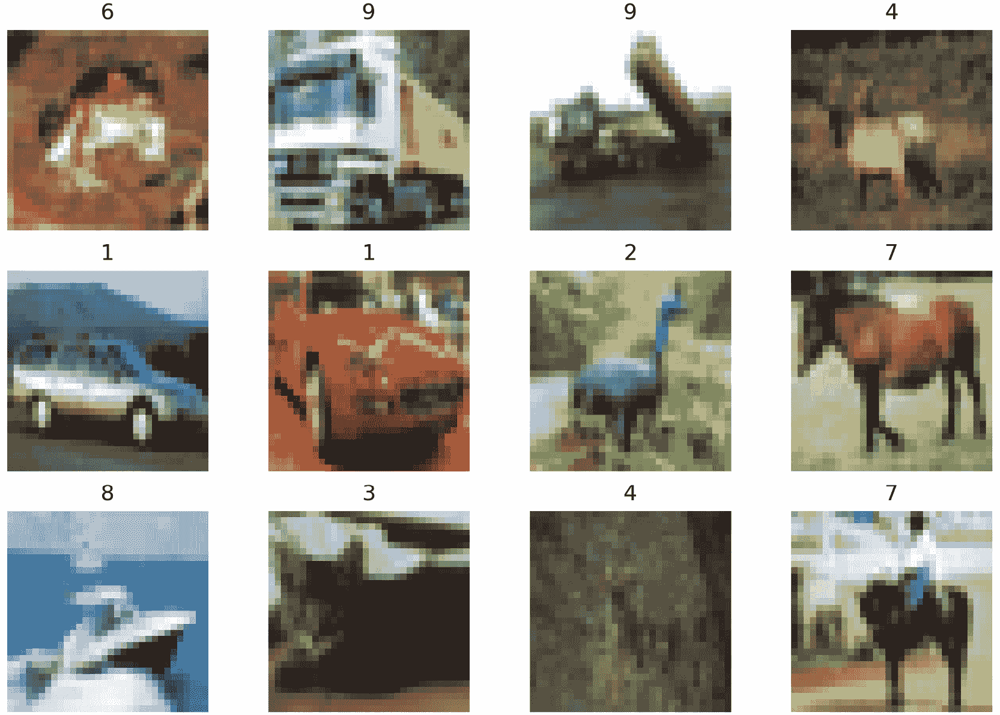
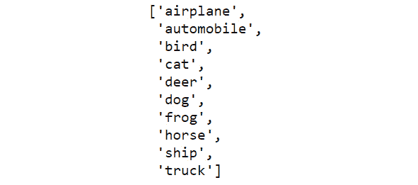
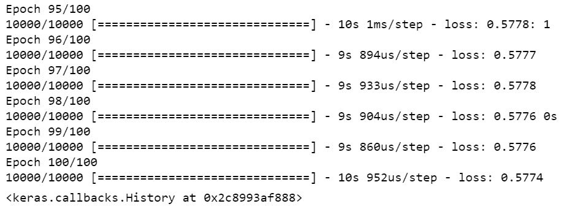
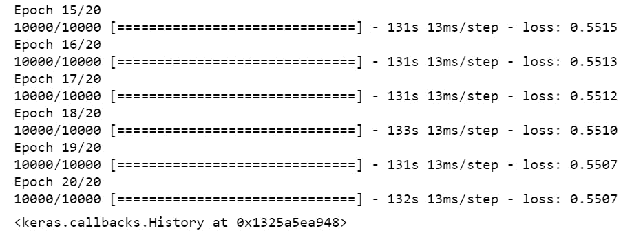
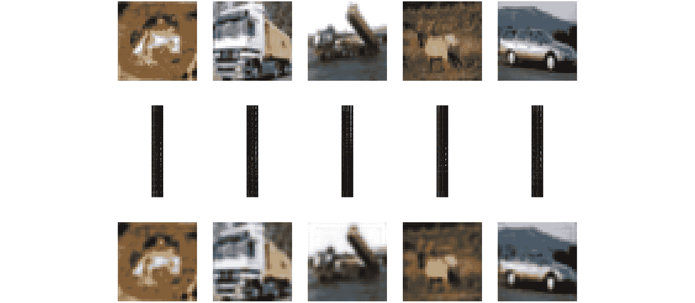

# 第六章：5. 自编码器

概述

在本章中，我们将讨论自编码器及其应用。我们将了解自编码器如何用于降维和去噪。我们将使用 Keras 框架实现一个人工神经网络和自编码器。到本章结束时，你将能够使用卷积神经网络实现一个自编码器模型。

# 引言

当我们将注意力转向自编码器时，我们将继续讨论降维技术。自编码器是一个特别有趣的研究领域，因为它提供了一种基于人工神经网络的监督学习方法，但在无监督的环境下使用。自编码器基于人工神经网络，是执行降维的极为有效的手段，同时也提供了额外的好处。随着数据、处理能力和网络连接的不断增加，自编码器在使用和研究上迎来了复兴，这种现象自 1980 年代末自编码器起源以来未曾见过。这与人工神经网络的研究是一致的，后者最早在 1960 年代被描述和实现为一种概念。目前，你只需进行简单的互联网搜索，就能发现神经网络的普及和强大功能。

自编码器可以与其他方法结合使用，如递归神经网络或**长短期记忆网络**（**LSTM**）架构，用于去噪图像和生成人工数据样本，以预测数据序列。使用人工神经网络所带来的灵活性和强大功能，使得自编码器能够形成非常高效的数据表示，这些表示可以直接作为极其高效的搜索方法，或作为后续处理的特征向量使用。

考虑在图像去噪应用中使用自编码器，我们看到左边的图像（图 5.1），它受到了某些随机噪声的影响。我们可以使用专门训练的自编码器去除这些噪声，如下图右侧所示。通过学习如何去除噪声，自编码器还学会了如何编码组成图像的关键信息，并如何将这些信息解码（或重构）为更清晰的原始图像版本：


图 5.1：自编码器去噪

注意

这张图片已从[`www.freenzphotos.com/free-photos-of-bay-of-plenty/stormy-fishermen/`](http://www.freenzphotos.com/free-photos-of-bay-of-plenty/stormy-fishermen/)在 CC0 授权下修改。

这个例子展示了自编码器的一个方面，使其在无监督学习（编码阶段）中非常有用，并且另一个方面使其在生成新图像时（解码阶段）也很有用。我们将进一步探讨自编码器的这两个有用阶段，并将自编码器的输出应用于 CIFAR-10 数据集的聚类（[`www.cs.toronto.edu/~kriz/cifar.html`](https://www.cs.toronto.edu/~kriz/cifar.html)）。

下面是编码器和解码器的表示：


图 5.2：编码器/解码器表示

# 人工神经网络基础

由于自编码器基于人工神经网络，因此理解神经网络对理解自编码器也至关重要。本章的这一部分将简要回顾人工神经网络的基础知识。需要注意的是，神经网络有许多方面超出了本书的范围。神经网络的主题很容易填满，并且已经填满了许多书籍，这一部分并不打算成为该主题的详尽讨论。

如前所述，人工神经网络主要用于监督学习问题，在这些问题中，我们有一组输入信息，比如一系列图像，我们正在训练一个算法，将这些信息映射到期望的输出，比如类别或分类。以*图 5.3*中的 CIFAR-10 数据集为例，它包含 10 个不同类别（飞机、汽车、鸟、猫、鹿、狗、青蛙、马、船和卡车）的图像，每个类别有 6000 张图像。


图 5.3：CIFAR-10 数据集

当神经网络用于监督学习时，图像被输入到网络中，网络的期望输出是对应类别标签的表示。

然后，网络将被训练以最大化其推断或预测给定图像的正确标签的能力。

注意

这张图来自[`www.cs.toronto.edu/~kriz/cifar.html`](https://www.cs.toronto.edu/~kriz/cifar.html)，出自*《从微小图像中学习多个特征层》*([`www.cs.toronto.edu/~kriz/learning-features-2009-TR.pdf`](https://www.cs.toronto.edu/~kriz/learning-features-2009-TR.pdf))，Alex Krizhevsky，2009 年。

## 神经元

人工神经网络得名于大脑中常见的生物神经网络。虽然这种类比的准确性确实值得商榷，但它是一个有用的隐喻，可以帮助我们理解人工神经网络的概念。与生物神经网络一样，神经元是所有神经网络的构建块，通过不同的配置连接多个神经元，形成更强大的结构。在*图 5.4*中，每个神经元由四个部分组成：一个输入值、一个可调权重（theta）、一个作用于权重与输入值乘积的激活函数，以及由此产生的输出值：


图 5.4：神经元的解剖结构

激活函数的选择取决于神经网络设计的目标，常见的函数包括**tanh**、**sigmoid**、**linear**和**ReLU**（修正线性单元）。在本章中，我们将使用**sigmoid**和**ReLU**激活函数，因此我们可以稍微深入了解它们。

## Sigmoid 函数

由于 sigmoid 激活函数能够将输入值转换为接近二进制的输出，因此它在神经网络分类中的输出中被广泛使用。Sigmoid 函数产生以下输出：


图 5.5：Sigmoid 函数的输出

我们可以在前面的图中看到，随着*x*的增加，sigmoid 函数的输出渐近于 1（趋近但永远无法达到），而当*x*向负方向远离 0 时，输出渐近于 0。该函数常用于分类任务，因为它提供接近二进制的输出。

我们可以看到，sigmoid 具有渐近性质。由于这一特性，当输入值接近极限时，训练过程会变得缓慢（称为**梯度消失**）。这是训练中的瓶颈。因此，为了加速训练过程，神经网络的中间阶段使用**修正线性单元**（**ReLU**）。然而，ReLU 也有一定的局限性，因为它存在死神经元和偏置问题。

## 修正线性单元（ReLU）

修正线性单元（ReLU）是一种非常有用的激活函数，通常在神经网络的中间阶段使用。简而言之，对于小于 0 的输入值，ReLU 将其输出为 0，而对于大于 0 的输入值，则返回实际值。


图 5.6：ReLU 的输出

## 练习 5.01：建模人工神经网络中的神经元

在本练习中，我们将实际介绍如何在`NumPy`中以编程方式表示神经元，并使用`sigmoid`函数。我们将固定输入，调整可调权重，以研究其对神经元的影响。为了将这一框架与监督学习中的常见模型关联起来，我们在本练习中的方法与逻辑回归相同。执行以下步骤：

1.  导入`numpy`和`matplotlib`包：

    ```py
    import numpy as np
    import matplotlib.pyplot as plt
    ```

1.  将`sigmoid`函数定义为 Python 函数：

    ```py
    def sigmoid(z):
        return np.exp(z) / (np.exp(z) + 1)
    ```

    注意

    在这里，我们使用的是`sigmoid`函数。你也可以使用`ReLU`函数。`ReLU`激活函数在人工神经网络中虽然非常强大，但其定义非常简单。它只需要在输入大于 0 时返回输入值；否则，返回 0：

    `def relu(x):`

    `return np.max(0, x)`

1.  定义神经元的输入（`x`）和可调权重（`theta`）。在本例中，输入（`x`）将是`-5`到`5`之间线性间隔的`100`个数字。设置`theta = 1`：

    ```py
    theta = 1
    x = np.linspace(-5, 5, 100)
    x
    ```

    输出结果如下：

    

    图 5.7：打印输入

1.  计算神经元的输出（`y`）：

    ```py
    y = sigmoid(x * theta)
    ```

1.  绘制神经元输出与输入的关系图：

    ```py
    fig = plt.figure(figsize=(10, 7))
    ax = fig.add_subplot(111)
    ax.plot(x, y)
    ax.set_xlabel('$x$', fontsize=22)
    ax.set_ylabel('$h(x\Theta)$', fontsize=22)
    ax.spines['left'].set_position(('data', 0))
    ax.spines['top'].set_visible(False)
    ax.spines['right'].set_visible(False)
    ax.tick_params(axis='both', which='major', labelsize=22)
    plt.show()
    ```

    在以下输出中，您可以看到绘制的`sigmoid`函数——请注意，它通过原点并在`0.5`处交叉。

    

    图 5.8：神经元与输入的关系图

1.  将可调参数`theta`设置为`5`，然后重新计算并存储神经元的输出：

    ```py
    theta = 5
    y_2 = sigmoid(x * theta)
    ```

1.  将可调参数`theta`改为`0.2`，然后重新计算并存储神经元的输出：

    ```py
    theta = 0.2
    y_3 = sigmoid(x * theta)
    ```

1.  在一个图表中绘制三条不同的神经元输出曲线（`theta = 1`、`theta = 5`和`theta = 0.2`）：

    ```py
    fig = plt.figure(figsize=(10, 7))
    ax = fig.add_subplot(111)
    ax.plot(x, y, label='$\Theta=1$')
    ax.plot(x, y_2, label='$\Theta=5$', linestyle=':')
    ax.plot(x, y_3, label='$\Theta=0.2$', linestyle='--')
    ax.set_xlabel('$x\Theta$', fontsize=22)
    ax.set_ylabel('$h(x\Theta)$', fontsize=22)
    ax.spines['left'].set_position(('data', 0))
    ax.spines['top'].set_visible(False)
    ax.spines['right'].set_visible(False)
    ax.tick_params(axis='both', which='major', labelsize=22)
    ax.legend(fontsize=22)
    plt.show()
    ```

    输出结果如下：

    

图 5.9：神经元的输出曲线

在本练习中，我们用`sigmoid`激活函数模拟了人工神经网络的基本构建块。我们可以看到，使用`sigmoid`函数增加了梯度的陡峭度，这意味着只有小的*x*值才会将输出推向接近 1 或 0。同样，减小`theta`会降低神经元对非零值的敏感度，导致需要极端的输入值才能将输出结果推向 0 或 1，从而调节神经元的输出。

注意

要访问此特定部分的源代码，请参考[`packt.live/2AE9Kwc`](https://packt.live/2AE9Kwc)。

您还可以在[`packt.live/3e59UdK`](https://packt.live/3e59UdK)在线运行此示例。

## 练习 5.02：使用 ReLU 激活函数建模神经元

类似于 *练习 5.01*，*人工神经网络神经元建模*，我们将再次建模一个网络，这次使用 ReLU 激活函数。在这个练习中，我们将为 ReLU 激活的神经元开发一系列响应曲线，并描述改变 theta 值对神经元输出的影响：

1.  导入 `numpy` 和 `matplotlib`：

    ```py
    import numpy as np
    import matplotlib.pyplot as plt
    ```

1.  将 ReLU 激活函数定义为 Python 函数：

    ```py
    def relu(x):
        return np.max((0, x))
    ```

1.  定义神经元的输入（`x`）和可调权重（`theta`）。在这个示例中，输入（`x`）将是线性间隔在`-5`和`5`之间的 100 个数字。设置 `theta = 1`：

    ```py
    theta = 1
    x = np.linspace(-5, 5, 100)
    x
    ```

    输出如下：

    

    图 5.10：打印输入

1.  计算输出（`y`）：

    ```py
    y = [relu(_x * theta) for _x in x]
    ```

1.  绘制神经元输出与输入的关系图：

    ```py
    fig = plt.figure(figsize=(10, 7))
    ax = fig.add_subplot(111)
    ax.plot(x, y)
    ax.set_xlabel('$x$', fontsize=22)
    ax.set_ylabel('$h(x\Theta)$', fontsize=22)
    ax.spines['left'].set_position(('data', 0))
    ax.spines['top'].set_visible(False)
    ax.spines['right'].set_visible(False)
    ax.tick_params(axis='both', which='major', labelsize=22)
    plt.show()
    ```

    输出如下：

    

    图 5.11：神经元与输入的关系图

1.  现在，设置 `theta = 5`，重新计算并保存神经元的输出：

    ```py
    theta = 5
    y_2 = [relu(_x * theta) for _x in x]
    ```

1.  现在，设置 `theta = 0.2`，重新计算并保存神经元的输出：

    ```py
    theta = 0.2
    y_3 = [relu(_x * theta) for _x in x]
    ```

1.  在同一张图表上绘制神经元的三条不同输出曲线（`theta = 1`，`theta = 5`，和 `theta = 0.2`）：

    ```py
    fig = plt.figure(figsize=(10, 7))
    ax = fig.add_subplot(111)
    ax.plot(x, y, label='$\Theta=1$')
    ax.plot(x, y_2, label='$\Theta=5$', linestyle=':')
    ax.plot(x, y_3, label='$\Theta=0.2$', linestyle='--')
    ax.set_xlabel('$x\Theta$', fontsize=22)
    ax.set_ylabel('$h(x\Theta)$', fontsize=22)
    ax.spines['left'].set_position(('data', 0))
    ax.spines['top'].set_visible(False)
    ax.spines['right'].set_visible(False)
    ax.tick_params(axis='both', which='major', labelsize=22)
    ax.legend(fontsize=22)
    plt.show()
    ```

    输出如下：

    

图 5.12：神经元的三条输出曲线

在这个练习中，我们创建了一个基于 ReLU 的人工神经网络神经元模型。我们可以看到，这个神经元的输出与 sigmoid 激活函数的输出有很大不同。对于大于 0 的值，没有饱和区域，因为它仅仅返回函数的输入值。在负方向上，当输入小于 0 时，存在饱和区域，只有 0 会被返回。ReLU 函数是一种非常强大且常用的激活函数，在某些情况下，它比 sigmoid 函数更强大。ReLU 经常是首选的激活函数。

注意

要访问此特定章节的源代码，请参考 [`packt.live/2O5rnIn`](https://packt.live/2O5rnIn)。

你也可以在 [`packt.live/3iJ2Kzu`](https://packt.live/3iJ2Kzu) 上在线运行此示例。

## 神经网络：架构定义

单个神经元在孤立状态下并不是特别有用；它提供了激活函数和调节输出的手段，但单个神经元的学习能力是有限的。当多个神经元结合并在网络结构中连接在一起时，神经元的功能就变得更加强大。通过使用多个不同的神经元并结合各个神经元的输出，可以建立更复杂的关系，并构建更强大的学习算法。在本节中，我们将简要讨论神经网络的结构，并使用 Keras 机器学习框架实现一个简单的神经网络（[`keras.io/`](https://keras.io/)）。Keras 是一个高层次的神经网络 API，基于现有的库（如 TensorFlow 或 Theano）之上。Keras 使得在低层框架之间切换变得容易，因为它提供的高层接口在不同的底层库之间保持不变。在本书中，我们将使用 TensorFlow 作为底层库。

以下是一个具有隐藏层的神经网络的简化表示：


图 5.13：神经网络的简化表示

上图展示了一个两层完全连接的神经网络结构。我们可以做出的第一个观察是，这个结构包含了大量的信息，并且具有高度的连接性，箭头表示了每个节点之间的连接。我们从图像的左侧开始，可以看到神经网络的输入值，由（*x*）值表示。在这个示例中，每个样本有*m*个输入值，因此，从*x*11 到*x*1m 的值代表这些输入值。每个样本的这些值被称为数据的属性或特征，并且每次仅输入一个样本到网络中。然后，这些值会与神经网络第一层对应的权重相乘 ()，然后传入对应神经元的激活函数。这被称为**前馈神经网络**。在上图中，用来标识权重的符号是，其中*i*是权重所属的层，*j*是输入节点的编号（从顶部开始为 1），而*k*是后续层中该权重连接的节点。

观察第一层（也叫做**隐藏层**）输出与输出层输入之间的互联关系，我们可以看到有大量可调节的参数（权重），这些参数可以用来将输入映射到期望的输出。前图的网络代表了一个 *n* 类神经网络分类器，其中每个 *n* 个节点的输出表示输入属于相应类别的概率。

每一层都可以使用不同的激活函数，如 *h*1 和 *h*2 所示，因此允许不同的激活函数混合使用，例如第一层可以使用 ReLU，第二层可以使用 tanh，第三层可以使用 sigmoid。最终输出是通过将前一层输出与相应的权重相乘，并通过激活函数计算结果来获得的。

如果我们考虑第一层第一节点的输出，它可以通过将输入与相应的权重相乘，求和结果并通过激活函数来计算：


图 5.14：计算最后一个节点的输出

随着输入和输出之间的层数增加，我们增加了网络的深度。深度的增加意味着可训练参数的增加，以及网络描述数据内在关系的复杂度增加。此外，当我们在每一层添加更多神经元时，我们增加了神经网络的高度。通过增加神经元，网络对数据集的描述能力增强，同时可训练参数也增多。如果增加了过多的神经元，网络可能会记住数据集的内容，但无法对新样本进行泛化。构建神经网络的诀窍在于找到一个平衡点，既能充分描述数据内在关系，又不会过于复杂以至于记住训练样本。

## 练习 5.03：定义一个 Keras 模型

在本练习中，我们将使用 Keras 机器学习框架定义一个神经网络架构（类似于*图 5.13*），用于分类 CIFAR-10 数据集的图像。由于每个输入图像的大小为 32 x 32 像素，输入向量将由 32*32 = 1,024 个值组成。CIFAR-10 有 10 个类别，神经网络的输出将由 10 个值组成，每个值表示输入数据属于相应类别的概率。

注意

CIFAR-10 数据集 ([`www.cs.toronto.edu/~kriz/cifar.html`](https://www.cs.toronto.edu/~kriz/cifar.html)) 由 60,000 张图像组成，涵盖 10 个类别。这 10 个类别包括飞机、汽车、鸟、猫、鹿、狗、青蛙、马、船和卡车，每个类别有 6,000 张图像。通过前面的链接了解更多关于这个数据集的信息。

1.  对于本练习，我们将需要 Keras 机器学习框架。如果您还没有安装 Keras 和 TensorFlow，请在 Jupyter 笔记本中使用`conda`进行安装：

    ```py
    !conda install tensorflow keras
    ```

    或者，您也可以通过`pip`安装：

    ```py
    !pip install tensorflow keras
    ```

1.  我们将需要分别从`keras.models`和`keras.layers`导入`Sequential`和`Dense`类。导入这些类：

    ```py
    from keras.models import Sequential
    from keras.layers import Dense
    ```

    如前所述，输入层将接收 1,024 个值。第二层（层 1）将包含 500 个单元，并且由于该网络需要分类 10 个不同的类别，输出层将有 10 个单元。在 Keras 中，通过将有序的层列表传递给`Sequential`模型类来定义模型。

1.  本示例使用了`Dense`层类，这是一个全连接神经网络层。第一层将使用 ReLU 激活函数，而输出层将使用`softmax`函数来确定每个类别的概率。定义模型：

    ```py
    model = Sequential\
            ([Dense(500, input_shape=(1024,), activation='relu'),\
              Dense(10, activation='softmax')])
    ```

1.  定义好模型后，我们可以使用`summary`方法确认模型的结构以及模型中的可训练参数（或权重）数量：

    ```py
    model.summary()
    ```

    输出如下：

    

图 5.15：模型中可训练参数的结构和数量

该表总结了神经网络的结构。我们可以看到，我们指定的两个层，其中第一个层有 500 个单元，第二个层有 10 个输出单元。`Param #`列告诉我们该特定层中有多少个可训练的权重。该表还告诉我们，网络中总共有 517,510 个可训练的权重。

注意

要访问本节的源代码，请参考[`packt.live/31WaTdR`](https://packt.live/31WaTdR)。

您还可以在[`packt.live/3gGEtbA`](https://packt.live/3gGEtbA)上在线运行此示例。

在本练习中，我们创建了一个 Keras 神经网络模型，包含超过 500,000 个权重，可用于分类 CIFAR-10 图像。在接下来的章节中，我们将训练这个模型。

## 神经网络：训练

定义好神经网络模型后，我们可以开始训练过程；在此阶段，我们将以监督方式训练模型，以便在开始训练自编码器之前对 Keras 框架有所了解。监督学习模型通过提供输入信息和已知输出进行训练；训练的目标是构建一个网络，使其仅使用模型的参数，接受输入信息并返回已知的输出。

在像 CIFAR-10 这样的有监督分类示例中，输入信息是图像，而已知的输出是该图像所属的类别。在训练过程中，对于每个样本的预测，使用指定的误差函数计算前馈网络预测中的误差。然后，模型中的每个权重都会被调整，试图减少误差。这个调整过程被称为**反向传播**，因为误差从输出反向传播通过网络，直到网络的起始部分。

在反向传播过程中，每个可训练的权重都会根据其对总误差的贡献进行调整，调整的幅度与一个被称为**学习率**的值成比例，学习率控制着可训练权重变化的速度。观察下图，我们可以看到，增大学习率的值可以加快误差减少的速度，但也存在不能收敛到最小误差的风险，因为我们可能会越过最小值。学习率过小可能导致我们失去耐心，或者根本没有足够的时间找到全局最小值。在神经网络训练中，我们的目标是找到误差的全局最小值——基本上就是训练过程中，权重调节到一个无法再进一步减少错误的点。因此，找到合适的学习率是一个试错的过程，虽然从较大的学习率开始并逐渐减小它通常是一个有效的方法。下图表示选择学习率对成本函数优化的影响。


图 5.16：选择正确的学习率

在前面的图中，您可以看到一个周期内的学习误差，在这种情况下是随着时间的推移变化的。一个周期对应着训练数据集中的完整循环。训练会反复进行，直到预测误差不再减少，或者开发者等待结果时耐心耗尽。为了完成训练过程，我们首先需要做出一些设计决策，其中最重要的是选择最合适的误差函数。可供使用的误差函数种类繁多，从简单的均方差到更复杂的选项都有。分类交叉熵（在接下来的练习中使用）是一个非常有用的误差函数，尤其适用于多类分类问题。

定义了误差函数后，我们需要选择更新可训练参数的方法。最节省内存且有效的更新方法之一是**随机梯度下降**（**SGD**）。SGD 有多种变体，所有变体都涉及根据每个权重对计算误差的贡献来调整权重。最终的训练设计决策是选择评估模型的性能指标，并选择最佳架构；在分类问题中，这可能是模型的分类准确率，或者在回归问题中，可能是产生最低误差得分的模型。这些比较通常使用交叉验证方法进行。

## 练习 5.04：训练一个 Keras 神经网络模型

感谢我们不需要手动编程神经网络的组件，如反向传播，因为 Keras 框架会为我们管理这些。在本次练习中，我们将使用 Keras 训练一个神经网络，使用前一练习中定义的模型架构对 CIFAR-10 数据集的一个小子集进行分类。与所有机器学习问题一样，第一步也是最重要的一步是尽可能多地了解数据集，这将是本次练习的初步重点：

注意

你可以从[`packt.live/3eexo1s`](https://packt.live/3eexo1s)下载`data_batch_1`和`batches.meta`文件。

1.  导入`pickle`、`numpy`、`matplotlib`以及`keras.models`中的`Sequential`类，和`keras.layers`中的`Dense`。我们将在本练习中使用`pickle`来序列化 Python 对象，以便传输或存储：

    ```py
    import pickle
    import numpy as np
    import matplotlib.pyplot as plt
    from keras.models import Sequential
    from keras.layers import Dense
    import tensorflow.python.util.deprecation as deprecation
    deprecation._PRINT_DEPRECATION_WARNINGS = False
    ```

1.  加载随附源代码提供的 CIFAR-10 数据集样本，该样本位于`data_batch_1`文件中：

    ```py
    with open('data_batch_1', 'rb') as f:
        batch_1 = pickle.load(f, encoding='bytes')
    ```

1.  数据以字典形式加载。显示字典的键：

    ```py
    batch_1.keys()
    ```

    输出如下：

    ```py
    dict_keys([b'batch_label', b'labels', b'data', b'filenames'])
    ```

1.  请注意，键是以二进制字符串形式存储的，表示为`b'`。我们关注的是数据和标签的内容。首先查看标签：

    ```py
    labels = batch_1[b'labels']
    labels
    ```

    一部分输出如下，每个类别号对应一个文本标签（飞机、汽车等）：

    

    图 5.17：显示标签

1.  我们可以看到，标签是一个值为 0-9 的列表，表示每个样本所属的类别。现在，查看`data`键的内容：

    ```py
    batch_1[b'data']
    ```

    输出如下：

    

    图 5.18：数据键的内容

1.  数据键提供了一个 NumPy 数组，其中存储了所有图像数据。图像数据的形状是什么？

    ```py
    batch_1[b'data'].shape
    ```

    输出如下：

    ```py
    (10000, 3072)
    ```

1.  我们可以看到我们有 1,000 个样本，但每个样本是一个维度为 3,072 的向量。难道这些图片不是应该是 32 x 32 像素吗？是的，它们是，但因为这些图像是彩色的或 RGB 图像，它们包含三个通道（红色、绿色和蓝色），这意味着图像是 32 x 32 x 3 的大小。它们也被展开，提供 3,072 长度的向量。所以，我们可以重新调整数组形状，然后可视化一部分样本图像。根据 CIFAR-10 的文档，前 1,024 个样本是红色，第二个 1,024 个是绿色，第三个 1,024 个是蓝色：

    ```py
    images = np.zeros((10000, 32, 32, 3), dtype='uint8')
    """
    Breaking the 3,072 samples of each single image into thirds, 
    which correspond to Red, Green, Blue channels
    """
    for idx, img in enumerate(dat[b'data']):
        images[idx, :, :, 0] = img[:1024].reshape((32, 32)) # Red
        images[idx, :, :, 1] = img[1024:2048]\
                               .reshape((32, 32)) # Green
        images[idx, :, :, 2] = img[2048:].reshape((32, 32)) # Blue
    ```

1.  显示前 12 张图片及其标签：

    ```py
    plt.figure(figsize=(10, 7))
    for i in range(12):
        plt.subplot(3, 4, i + 1)
        plt.imshow(images[i])
        plt.title(labels[i])
        plt.axis('off')
    ```

    以下输出显示了我们数据集中低分辨率图像的一个样本——这是由于我们最初收到的 32 x 32 分辨率图像所导致的：

    

    图 5.19：前 12 张图片

    标签的实际含义是什么？我们将在下一步中找到答案。

1.  使用以下代码加载 `batches.meta` 文件：

    ```py
    with open('batches.meta', 'rb') as f:
        label_strings = pickle.load(f, encoding='bytes')
    label_strings
    ```

    输出如下：

    

    图 5.20：标签的含义

1.  解码二进制字符串以获得实际标签：

    ```py
    actual_labels = [label.decode() for label in \
                     label_strings[b'label_names']]
    actual_labels
    ```

    输出如下：

    

    图 5.21：打印实际标签

1.  打印前 12 张图片的标签：

    ```py
    for lab in labels[:12]:
        print(actual_labels[lab], end=', ')
    ```

    输出如下：

    ```py
    frog, truck, truck, deer, automobile, automobile, 
    bird, horse, ship, cat, deer, horse, 
    ```

1.  现在我们需要准备数据来训练模型。第一步是准备输出。目前，输出是一个包含数字 0-9 的列表，但我们需要每个样本表示为一个包含 10 个单元的向量，按照之前的模型来处理。

    ```py
    one_hot_labels = np.zeros((images.shape[0], 10))
    for idx, lab in enumerate(labels):
        one_hot_labels[idx, lab] = 1
    ```

1.  显示前 12 个样本的 one-hot 编码值：

    ```py
    one_hot_labels[:12]
    ```

    输出如下：

    

    图 5.22：前 12 个样本的 one-hot 编码值

1.  该模型有 1,024 个输入，因为它期望一个 32 x 32 的灰度图像。对于每张图像，取三个通道的平均值将其转换为 RGB：

    ```py
    images = images.mean(axis=-1)
    ```

1.  再次显示前 12 张图片：

    ```py
    plt.figure(figsize=(10, 7))
    for i in range(12):
        plt.subplot(3, 4, i + 1)
        plt.imshow(images[i], cmap='gray')
        plt.title(labels[i])
        plt.axis('off')
    ```

    输出如下：

    

    图 5.23：再次显示前 12 张图片。

1.  最后，将图像缩放到 0 到 1 之间，这是神经网络输入所要求的。由于图像中的最大值是 255，我们将其直接除以 255：

    ```py
    images /= 255.
    ```

1.  我们还需要将图像调整为 10,000 x 1,024 的形状。我们将选择前 7,000 个样本进行训练，最后 3,000 个样本用于评估模型：

    ```py
    images = images.reshape((-1, 32 ** 2))
    x_train = images[:7000]
    y_train = one_hot_labels[:7000]
    x_test = images[7000:]
    y_test = one_hot_labels[7000:]
    ```

1.  使用与 *练习 5.03*、*定义一个 Keras 模型* 相同的架构重新定义模型：

    ```py
    model = Sequential\
            ([Dense(500, input_shape=(1024,), activation='relu'),\
              Dense(10, activation='softmax')])
    ```

1.  现在我们可以在 Keras 中训练模型。我们首先需要编译方法来指定训练参数。我们将使用类别交叉熵、Adam 优化器和分类准确度作为性能度量：

    ```py
    model.compile(loss='categorical_crossentropy',\
                  optimizer='adam',\
                  metrics=['accuracy'])
    ```

1.  使用反向传播训练模型 100 个周期，并使用模型的 `fit` 方法：

    ```py
    model.fit(x_train, y_train, epochs=100, \
              validation_data=(x_test, y_test), \
              shuffle = False)
    ```

    输出结果如下。请注意，由于神经网络训练的随机性，你的结果可能会略有不同：

    

    图 5.24：训练模型

    注意

    这里，我们使用 Keras 来训练我们的神经网络模型。Keras 层中的权重初始化是随机进行的，无法通过任何随机种子来控制。因此，每次运行代码时，结果可能会有所不同。

1.  使用这个网络，我们在训练数据上达到了大约 75.67%的分类准确率，在验证数据上达到了 32.47%的分类准确率（在*图 5.24*中显示为`acc: 0.7567`和`val_acc: 0.3247`），该网络处理了 10,000 个样本。再次检查前 12 个样本的预测结果：

    ```py
    predictions = model.predict(images[:12])
    predictions
    ```

    输出结果如下：

    

    图 5.25：打印预测结果

1.  我们可以使用`argmax`方法来确定每个样本的最可能类别：

    ```py
    np.argmax(predictions, axis=1)
    ```

    输出结果如下：

    ```py
    array([6, 9, 9, 4, 1, 1, 2, 7, 8, 3, 4, 7], dtype=int64)
    ```

1.  与标签进行比较：

    ```py
    labels[:12]
    ```

    输出结果如下：

    ```py
    [6, 9, 9, 4, 1, 1, 2, 7, 8, 3, 4, 7]
    ```

    注意

    要访问此特定部分的源代码，请参考[`packt.live/2CgH25b`](https://packt.live/2CgH25b)。

    你也可以在[`packt.live/38CKwuD`](https://packt.live/38CKwuD)在线运行这个示例。

我们现在已经在 Keras 中训练了一个神经网络模型。完成下一个活动以进一步强化你在训练神经网络方面的技能。

## 活动 5.01：MNIST 神经网络

在这个活动中，你将训练一个神经网络来识别 MNIST 数据集中的图像，并强化你在训练神经网络方面的技能。这个活动是许多神经网络架构的基础，尤其是在计算机视觉中的分类问题。从物体检测与识别到分类，这种通用结构在各种应用中得到了使用。

这些步骤将帮助你完成该活动：

1.  导入`pickle`、`numpy`、`matplotlib`以及 Keras 中的`Sequential`和`Dense`类。

1.  加载`mnist.pkl`文件，它包含来自 MNIST 数据集的前 10,000 张图像及其对应的标签，源代码中提供了这些数据。MNIST 数据集是一个包含 0 到 9 手写数字的 28x28 灰度图像系列。提取图像和标签。

    注意

    你可以在[`packt.live/2JOLAQB`](https://packt.live/2JOLAQB)找到`mnist.pkl`文件。

1.  绘制前 10 个样本及其对应的标签。

1.  使用独热编码对标签进行编码。

1.  准备将图像输入到神经网络中。作为提示，这个过程包含**两个**独立的步骤。

1.  在 Keras 中构建一个神经网络模型，该模型接受准备好的图像，并具有 600 个单元的隐藏层，使用 ReLU 激活函数，输出层的单元数与类别数相同。输出层使用`softmax`激活函数。

1.  使用多类交叉熵、随机梯度下降和准确性度量来编译模型。

1.  训练模型。需要多少个周期才能在训练数据上达到至少 95%的分类准确率？

完成这个任务后，你将训练一个简单的神经网络来识别手写数字 0 到 9。你还将开发一个通用框架，用于构建分类问题的神经网络。借助这个框架，你可以扩展和修改网络来处理其他各种任务。你将要分类的数字的预览图像如下所示：


图 5.26：待分类数字的预览

注意

该活动的解决方案可以在第 449 页找到。

# 自编码器

自编码器是一种专门设计的神经网络架构，旨在以高效且描述性强的方式将输入信息压缩到较低的维度空间中。自编码器网络可以分解为两个独立的子网络或阶段：**编码**阶段和**解码**阶段。

以下是一个简化的自编码器模型，使用 CIFAR-10 数据集：


图 5.27：简单的自编码器网络架构

第一个阶段，即编码阶段，将输入信息压缩到一个比输入样本大小更小的后续层中。后续的解码阶段则会扩展压缩后的图像数据，并尝试将其恢复为原始形式。因此，网络的输入和期望输出是相同的；网络输入，例如 CIFAR-10 数据集中的一张图像，并试图恢复成相同的图像。这个网络架构如上图所示；在这张图中，我们可以看到自编码器的编码阶段减少了表示信息的神经元数量，而解码阶段则将压缩格式恢复为原始状态。使用解码阶段有助于确保编码器正确表示了信息，因为恢复图像所需的仅仅是压缩后的表示。

## 练习 5.05：简单自编码器

在本次练习中，我们将为 CIFAR-10 数据集样本构建一个简单的自编码器，压缩图像中的信息以供后续使用。

注意

在本次练习中，我们将使用`data_batch_1`文件，它是 CIFAR-10 数据集的一个样本。该文件可以从[`packt.live/3bYi5I8`](https://packt.live/3bYi5I8)下载。

1.  导入`pickle`、`numpy`和`matplotlib`，以及从`keras.models`导入`Model`类，从`keras.layers`导入`Input`和`Dense`：

    ```py
    import pickle
    import numpy as np
    import matplotlib.pyplot as plt
    from keras.models import Model
    from keras.layers import Input, Dense
    import tensorflow.python.util.deprecation as deprecation
    deprecation._PRINT_DEPRECATION_WARNINGS = False
    ```

1.  加载数据：

    ```py
    with open('data_batch_1', 'rb') as f:
        batch_1 = pickle.load(f, encoding='bytes')
    ```

1.  由于这是一个无监督学习方法，我们只关注图像数据。加载图像数据：

    ```py
    images = np.zeros((10000, 32, 32, 3), dtype='uint8')
    for idx, img in enumerate(batch_1[b'data']):
        images[idx, :, :, 0] = img[:1024].reshape((32, 32)) # Red
        images[idx, :, :, 1] = img[1024:2048]\
                               .reshape((32, 32)) # Green
        images[idx, :, :, 2] = img[2048:].reshape((32, 32)) # Blue
    ```

1.  将图像转换为灰度图，缩放到 0 到 1 之间，并将每张图像展平为一个长度为 1,024 的向量：

    ```py
    images = images.mean(axis=-1)
    images = images / 255.0
    images = images.reshape((-1, 32 ** 2))
    images
    ```

    输出结果如下：

    

    图 5.28：缩放后的图像

1.  定义自编码器模型。由于我们需要访问编码器阶段的输出，因此我们将采用一种与之前略有不同的方法来定义模型。定义一个包含`1024`个单元的输入层：

    ```py
    input_layer = Input(shape=(1024,))
    ```

1.  定义一个后续的`Dense`层，包含`256`个单元（压缩比为 1024/256 = 4），并使用 ReLU 激活函数作为编码阶段。注意，我们已将该层分配给一个变量，并通过`call`方法将前一层传递给该类：

    ```py
    encoding_stage = Dense(256, activation='relu')(input_layer)
    ```

1.  使用 sigmoid 函数作为激活函数，并与输入层相同的形状定义一个后续的解码器层。选择 sigmoid 函数是因为输入值仅介于 0 和 1 之间：

    ```py
    decoding_stage = Dense(1024, activation='sigmoid')\
                          (encoding_stage)
    ```

1.  通过将网络的第一层和最后一层传递给`Model`类来构建模型：

    ```py
    autoencoder = Model(input_layer, decoding_stage)
    ```

1.  使用二元交叉熵损失函数和`adadelta`梯度下降编译自编码器：

    ```py
    autoencoder.compile(loss='binary_crossentropy',\
                        optimizer='adadelta')
    ```

    注意

    `adadelta`是一种更为复杂的随机梯度下降版本，其中学习率基于最近的梯度更新窗口进行调整。与其他调整学习率的方法相比，它可以防止非常旧的周期梯度影响学习率。

1.  现在，让我们开始训练模型；同样，我们将图像作为训练数据并作为期望的输出。训练 100 个周期：

    ```py
    autoencoder.fit(images, images, epochs=100)
    ```

    输出如下：

    

    图 5.29：训练模型

1.  计算并存储前五个样本的编码阶段输出：

    ```py
    encoder_output = Model(input_layer, encoding_stage)\
                    .predict(images[:5])
    ```

1.  将编码器输出重新调整为 16 x 16（16 x 16 = 256）像素，并乘以 255：

    ```py
    encoder_output = encoder_output.reshape((-1, 16, 16)) * 255
    ```

1.  计算并存储前五个样本的解码阶段输出：

    ```py
    decoder_output = autoencoder.predict(images[:5])
    ```

1.  将解码器的输出重新调整为 32 x 32 并乘以 255：

    ```py
    decoder_output = decoder_output.reshape((-1, 32,32)) * 255
    ```

1.  重新调整原始图像：

    ```py
    images = images.reshape((-1, 32, 32))
    plt.figure(figsize=(10, 7))
    for i in range(5):
        # Plot the original images  
        plt.subplot(3, 5, i + 1)
        plt.imshow(images[i], cmap='gray')
        plt.axis('off')
        # Plot the encoder output
        plt.subplot(3, 5, i + 6)
        plt.imshow(encoder_output[i], cmap='gray')
        plt.axis('off')   
        # Plot the decoder output
        plt.subplot(3, 5, i + 11)
        plt.imshow(decoder_output[i], cmap='gray')
        plt.axis('off')
    ```

    输出如下：

    

图 5.30：简单自编码器的输出

在前面的图中，我们可以看到三行图像。第一行是原始的灰度图像，第二行是对应的自编码器输出，第三行是从编码输入中重构的原始图像。我们可以看到第三行解码后的图像包含了图像基本形状的信息；我们可以看到青蛙和鹿的主体，以及样本中卡车和汽车的轮廓。由于我们只训练了 100 个样本，因此增加训练周期的数量将有助于进一步提升编码器和解码器的性能。现在，我们已经得到了训练好的自编码器阶段的输出，可以将其作为其他无监督算法（如 K 均值或 K 近邻）的特征向量。

注意

要访问此特定部分的源代码，请参考[`packt.live/2BQH03R`](https://packt.live/2BQH03R)。

你也可以在[`packt.live/2Z9CMgI`](https://packt.live/2Z9CMgI)在线运行此示例。

## 活动 5.02：简单的 MNIST 自动编码器

在本活动中，您将为随附源代码中的 MNIST 数据集创建一个自动编码器网络。像本活动中构建的自动编码器网络在无监督学习的预处理阶段非常有用。网络生成的编码信息可以用于聚类或分割分析，例如基于图像的网页搜索：

1.  导入`pickle`、`numpy`和`matplotlib`，以及 Keras 中的`Model`、`Input`和`Dense`类。

1.  从随附源代码中提供的 MNIST 数据集样本中加载图像（`mnist.pkl`）。

    注意

    你可以从[`packt.live/2wmpyl5`](https://packt.live/2wmpyl5)下载`mnist.pkl`文件。

1.  为神经网络准备图像。作为提示，整个过程有**两个**独立的步骤。

1.  构建一个简单的自动编码器网络，将图像大小减少到编码阶段后的 10 x 10。

1.  使用二元交叉熵损失函数和`adadelta`梯度下降法编译自动编码器。

1.  适配编码器模型。

1.  计算并存储前五个样本的编码阶段输出。

1.  将编码器输出重塑为 10 x 10（10 x 10 = 100）像素，并乘以 255。

1.  计算并存储解码阶段前五个样本的输出。

1.  将解码器的输出重塑为 28 x 28 并乘以 255。

1.  绘制原始图像、编码器输出和解码器的图像。

完成此活动后，您将成功训练一个自动编码器网络，从数据集中提取关键信息，为后续处理做好准备。输出将类似于以下内容：

![图 5.31：原始图像、编码器输出和解码器的预期图]

](img/B15923_05_31.jpg)

图 5.31：原始图像、编码器输出和解码器的预期图

注意

该活动的解决方案可以在第 452 页找到。

## 练习 5.06：多层自动编码器

在本练习中，我们将为 CIFAR-10 数据集样本构建一个多层自动编码器，将图像中存储的信息压缩，以便后续使用：

注意

你可以从[`packt.live/2VcY0a9`](https://packt.live/2VcY0a9)下载`data_batch_1`文件。

1.  导入`pickle`、`numpy`和`matplotlib`，以及`keras.models`中的`Model`类，导入`keras.layers`中的`Input`和`Dense`：

    ```py
    import pickle
    import numpy as np
    import matplotlib.pyplot as plt
    from keras.models import Model
    from keras.layers import Input, Dense
    import tensorflow.python.util.deprecation as deprecation
    deprecation._PRINT_DEPRECATION_WARNINGS = False
    ```

1.  加载数据：

    ```py
    with open('data_batch_1', 'rb') as f:
        dat = pickle.load(f, encoding='bytes')
    ```

1.  由于这是一个无监督学习方法，我们只关心图像数据。请按照前面的练习加载图像数据：

    ```py
    images = np.zeros((10000, 32, 32, 3), dtype='uint8')
    for idx, img in enumerate(dat[b'data']):
        images[idx, :, :, 0] = img[:1024].reshape((32, 32)) # Red
        images[idx, :, :, 1] = img[1024:2048]\
                               .reshape((32, 32)) # Green
        images[idx, :, :, 2] = img[2048:].reshape((32, 32)) # Blue
    ```

1.  将图像转换为灰度图，缩放到 0 和 1 之间，并将每个图像展平为一个长度为 1,024 的向量：

    ```py
    images = images.mean(axis=-1)
    images = images / 255.0
    images = images.reshape((-1, 32 ** 2))
    images
    ```

    输出如下：

    ![图 5.32：缩放后的图像]

    ](img/B15923_05_32.jpg)

    图 5.32：缩放图像

1.  定义多层自动编码器模型。我们将使用与简单自动编码器模型相同的输入形状：

    ```py
    input_layer = Input(shape=(1024,))
    ```

1.  我们将在 256 自动编码器阶段之前添加另一个层——这次使用 512 个神经元：

    ```py
    hidden_encoding = Dense(512, activation='relu')(input_layer)
    ```

1.  我们使用与*练习 5.05*、*简单自动编码器*相同大小的自动编码器，但这次层的输入是`hidden_encoding`层：

    ```py
    encoding_stage = Dense(256, activation='relu')(hidden_encoding)
    ```

1.  添加解码隐藏层：

    ```py
    hidden_decoding = Dense(512, activation='relu')(encoding_stage)
    ```

1.  使用与上一练习相同的输出阶段，这次连接到隐藏解码阶段：

    ```py
    decoding_stage = Dense(1024, activation='sigmoid')\
                          (hidden_decoding)
    ```

1.  通过将网络的第一个和最后一个层传递给`Model`类来构建模型：

    ```py
    autoencoder = Model(input_layer, decoding_stage)
    ```

1.  使用二进制交叉熵损失函数和`adadelta`梯度下降编译自动编码器：

    ```py
    autoencoder.compile(loss='binary_crossentropy',\
                        optimizer='adadelta')
    ```

1.  现在，让我们拟合模型；再次将图像作为训练数据和期望的输出。训练 100 epochs：

    ```py
    autoencoder.fit(images, images, epochs=100)
    ```

    输出如下：

    

    图 5.33：训练模型

1.  计算并存储编码阶段前五个样本的输出：

    ```py
    encoder_output = Model(input_stage, encoding_stage)\
                     .predict(images[:5])
    ```

1.  将编码器的输出调整为 16 x 16（16 x 16 = 256）像素并乘以 255：

    ```py
    encoder_output = encoder_output.reshape((-1, 16, 16)) * 255
    ```

1.  计算并存储解码阶段前五个样本的输出：

    ```py
    decoder_output = autoencoder.predict(images[:5])
    ```

1.  将解码器的输出调整为 32 x 32 并乘以 255：

    ```py
    decoder_output = decoder_output.reshape((-1, 32, 32)) * 255
    ```

1.  绘制原始图像、编码器输出和解码器：

    ```py
    images = images.reshape((-1, 32, 32))
    plt.figure(figsize=(10, 7))
    for i in range(5):
        # Plot original images
        plt.subplot(3, 5, i + 1)
        plt.imshow(images[i], cmap='gray')
        plt.axis('off')
        # Plot encoder output
        plt.subplot(3, 5, i + 6)
        plt.imshow(encoder_output[i], cmap='gray')
        plt.axis('off')
        # Plot decoder output 
        plt.subplot(3, 5, i + 11)
        plt.imshow(decoder_output[i], cmap='gray')
        plt.axis('off')
    ```

    输出如下：

    

图 5.34：多层自动编码器的输出

通过查看简单自动编码器和多层自动编码器产生的误差得分，并比较*图 5.30*和*图 5.34*，我们可以看到两种编码器结构的输出几乎没有差别。两张图的中间行显示出这两种模型学到的特征实际上是不同的。我们可以使用许多方法来改善这两种模型，例如训练更多的 epochs、使用不同数量的单元或神经元，或使用不同数量的层。本练习的目的是展示如何构建和使用自动编码器，但优化通常是一个系统性的试错过程。我们鼓励你调整一些模型参数，并自己探索不同的结果。

注意

若要访问此特定部分的源代码，请参阅[`packt.live/2ZbaT81`](https://packt.live/2ZbaT81)。

你也可以在[`packt.live/2ZHvOyo`](https://packt.live/2ZHvOyo)在线运行此示例。

## 卷积神经网络

在构建所有以前的神经网络模型时，您可能已经注意到，在将图像转换为灰度图像并将每个图像展平为长度为 1,024 的单一向量时，我们移除了所有颜色信息。这样做实质上丢失了很多可能对我们有用的信息。图像中的颜色可能与图像中的类或对象特定相关；此外，我们还丢失了关于图像的空间信息，例如卡车图像中拖车相对驾驶室的位置或鹿的腿相对头部的位置。卷积神经网络不会遭受这种信息丢失。这是因为它们不是使用可训练参数的平面结构，而是将权重存储在网格或矩阵中，这意味着每组参数可以在其结构中有多层。通过将权重组织在网格中，我们可以防止空间信息的丢失，因为权重是以滑动方式应用于图像的。此外，通过具有多个层，我们可以保留与图像相关的颜色通道。

在开发基于卷积神经网络的自编码器时，MaxPooling2D 和 Upsampling2D 层非常重要。MaxPooling 2D 层通过在输入的窗口内选择最大值来在两个维度上减少或缩小输入矩阵的大小。假设我们有一个 2 x 2 的矩阵，其中三个单元格的值为 1，一个单元格的值为 2：


图 5.35：示例矩阵演示

如果提供给 MaxPooling2D 层，则该矩阵将返回一个值为 2 的单个值，从而在两个方向上将输入的大小减少一半。

UpSampling2D 层的作用与 MaxPooling2D 层相反，它增加输入的大小而不是减小它。上采样过程重复数据的行和列，从而使输入矩阵的大小加倍。对于前面的例子，您将把一个 2 x 2 的矩阵转换成一个 4 x 4 的矩阵，其中右下角的 4 个像素值为 2，其余为 1。

## 练习 5.07：卷积自编码器

在这个练习中，我们将开发基于卷积神经网络的自编码器，并与之前的全连接神经网络自编码器性能进行比较：

注意

您可以从 [`packt.live/2x31ww3`](https://packt.live/2x31ww3) 下载 `data_batch_1` 文件。

1.  导入 `pickle`、`numpy` 和 `matplotlib`，以及从 `keras.models` 导入 `Model` 类，从 `keras.layers` 导入 `Input`、`Conv2D`、`MaxPooling2D` 和 `UpSampling2D`：

    ```py
    import pickle
    import numpy as np
    import matplotlib.pyplot as plt
    from keras.models import Model
    from keras.layers import Input, Conv2D, MaxPooling2D, UpSampling2D
    import tensorflow.python.util.deprecation as deprecation
    deprecation._PRINT_DEPRECATION_WARNINGS = False
    ```

1.  加载数据：

    ```py
    with open('data_batch_1', 'rb') as f:
        batch_1 = pickle.load(f, encoding='bytes')
    ```

1.  由于这是一种无监督学习方法，我们只对图像数据感兴趣。按照前面的练习加载图像数据：

    ```py
    images = np.zeros((10000, 32, 32, 3), dtype='uint8')
    for idx, img in enumerate(batch_1[b'data']):
        images[idx, :, :, 0] = img[:1024].reshape((32, 32)) # Red
        images[idx, :, :, 1] = img[1024:2048]\
                               .reshape((32, 32)) # Green
        images[idx, :, :, 2] = img[2048:].reshape((32, 32)) # Blue
    ```

1.  由于我们使用卷积网络，我们可以仅对图像进行重新缩放使用：

    ```py
    images = images / 255.
    ```

1.  定义卷积自编码器模型。我们将使用与图像相同的形状输入：

    ```py
    input_layer = Input(shape=(32, 32, 3,))
    ```

1.  添加一个包含 32 层或滤波器的卷积阶段，使用 3 x 3 的权重矩阵，ReLU 激活函数，并使用相同的填充，这意味着输出的长度与输入图像相同。

    ```py
    hidden_encoding = Conv2D\
                      (32, # Number of filters in the weight matrix
                      (3, 3), # Shape of the weight matrix
                       activation='relu', padding='same', \
                       # Retaining dimensions between input and output \
                       )(input_layer)
    ```

1.  向编码器中添加一个 2 x 2 核的最大池化层。`MaxPooling`会查看图像中的所有值，使用 2 x 2 矩阵进行扫描。在每个 2 x 2 区域中返回最大值，从而将编码层的大小减少一半：

    ```py
    encoded = MaxPooling2D((2, 2))(hidden_encoding)
    ```

1.  添加一个解码卷积层（该层应该与之前的卷积层相同）：

    ```py
    hidden_decoding = \
    Conv2D(32, # Number of filters in the weight matrix \
           (3, 3), # Shape of the weight matrix \
           activation='relu', \
           # Retaining dimensions between input and output \
           padding='same', \
           )(encoded)
    ```

1.  现在我们需要将图像恢复到原始大小，方法是将上采样设置为与`MaxPooling2D`相同的大小：

    ```py
    upsample_decoding = UpSampling2D((2, 2))(hidden_decoding)
    ```

1.  添加最后的卷积阶段，使用三层来处理图像的 RGB 通道：

    ```py
    decoded = \
    Conv2D(3, # Number of filters in the weight matrix \
           (3, 3), # Shape of the weight matrix \
           activation='sigmoid', \
           # Retaining dimensions between input and output \
           padding='same', \
           )(upsample_decoding)
    ```

1.  通过将网络的第一层和最后一层传递给`Model`类来构建模型：

    ```py
    autoencoder = Model(input_layer, decoded)
    ```

1.  显示模型的结构：

    ```py
    autoencoder.summary()
    ```

    输出如下：

    

    图 5.36：模型结构

    注意

    与之前的自编码器示例相比，我们的可训练参数要少得多。这是一个特定的设计决策，旨在确保该示例能在各种硬件上运行。卷积网络通常需要更多的处理能力，并且常常需要像图形处理单元（GPU）这样的特殊硬件。

1.  使用二元交叉熵损失函数和`adadelta`梯度下降编译自编码器：

    ```py
    autoencoder.compile(loss='binary_crossentropy',\
                        optimizer='adadelta')
    ```

1.  现在，让我们拟合模型；再次地，我们将图像作为训练数据和期望输出传递。与之前训练 100 个周期不同，这次我们将使用 20 个周期，因为卷积网络的计算时间要长得多：

    ```py
    autoencoder.fit(images, images, epochs=20)
    ```

    输出如下：

    

    图 5.37：训练模型

    注意，在第二个周期后，误差已经比之前的自编码器练习更小，这表明编码/解码模型更好。这个误差减少主要归功于卷积神经网络没有丢弃大量数据，且编码后的图像为 16 x 16 x 32，比之前的 16 x 16 尺寸要大得多。此外，我们没有压缩图像*本身*，因为它们现在包含的像素较少（16 x 16 x 32 = 8,192），但比之前有更多的深度（32 x 32 x 3 = 3,072）。这些信息已经重新排列，以便进行更有效的编码/解码处理。

1.  计算并存储前五个样本的编码阶段输出：

    ```py
    encoder_output = Model(input_layer, encoded).predict(images[:5])
    ```

1.  每个编码后的图像的形状为 16 x 16 x 32，这是由于为卷积阶段选择的滤波器数量。因此，在没有修改的情况下，我们无法对其进行可视化。我们将其重塑为 256 x 32 的大小，以便进行可视化：

    ```py
    encoder_output = encoder_output.reshape((-1, 256, 32))
    ```

1.  获取前五张图像的解码器输出：

    ```py
    decoder_output = autoencoder.predict(images[:5])
    ```

1.  绘制原始图像、平均编码器输出和解码器：

    ```py
    plt.figure(figsize=(10, 7))
    for i in range(5):
        # Plot original images
        plt.subplot(3, 5, i + 1)
        plt.imshow(images[i], cmap='gray')
        plt.axis('off')
        # Plot encoder output
        plt.subplot(3, 5, i + 6)
        plt.imshow(encoder_output[i], cmap='gray')
        plt.axis('off')
        # Plot decoder output
        plt.subplot(3, 5, i + 11)
        plt.imshow(decoder_output[i])
        plt.axis('off')
    ```

    输出如下：

    

图 5.38：原始图像、编码器输出和解码器输出

注意

要获取此特定部分的源代码，请参考[`packt.live/2VYprpq`](https://packt.live/2VYprpq)。

你也可以在线运行此示例，网址为[`packt.live/38EDgic`](https://packt.live/38EDgic)。

## 活动 5.03：MNIST 卷积自编码器

在这个活动中，我们将通过 MNIST 数据集加强卷积自编码器的知识。卷积自编码器通常在处理大小适中的基于图像的数据集时能够显著提高性能。这在使用自编码器生成人工图像样本时特别有用：

1.  导入`pickle`、`numpy`和`matplotlib`，以及从`keras.models`导入`Model`类，并从`keras.layers`导入`Input`、`Conv2D`、`MaxPooling2D`和`UpSampling2D`。

1.  加载包含前 10,000 个图像及其对应标签的`mnist.pkl`文件，这些数据可以在附带的源代码中找到。

    注意

    你可以从[`packt.live/3e4HOR1`](https://packt.live/3e4HOR1)下载`mnist.pkl`文件。

1.  将图像重新缩放，使其值介于 0 和 1 之间。

1.  我们需要重塑图像，增加一个单一的深度通道以供卷积阶段使用。将图像重塑为 28 x 28 x 1 的形状。

1.  定义一个输入层。我们将使用与图像相同的输入形状。

1.  添加一个卷积阶段，包含 16 层或滤波器，一个 3 x 3 的权重矩阵，一个 ReLU 激活函数，并使用相同的填充方式，这意味着输出图像的尺寸与输入图像相同。

1.  向编码器添加一个最大池化层，使用 2 x 2 的核。

1.  添加一个解码卷积层。

1.  添加一个上采样层。

1.  根据初始图像深度，添加最终的卷积阶段，使用一层。

1.  通过将网络的第一层和最后一层传递给`Model`类来构建模型。

1.  显示模型的结构。

1.  使用二进制交叉熵损失函数和`adadelta`梯度下降来编译自编码器。

1.  现在，让我们开始拟合模型；我们再次将图像作为训练数据并作为期望的输出。训练 20 个周期，因为卷积神经网络需要更长的计算时间。

1.  计算并存储前五个样本的编码阶段输出。

1.  为了可视化，重新调整编码器输出的形状，使每个图像为`X*Y`大小。

1.  获取前五个图像的解码器输出。

1.  将解码器输出重塑为`28 x 28`的大小。

1.  将原始图像重塑为`28 x 28`的大小。

1.  绘制原始图像、平均编码器输出和解码器输出。

在本次活动结束时，你将开发出一个包含卷积层的自编码器神经网络。请注意，解码器表示中所做的改进。输出将类似于以下内容：


图 5.39：预期的原始图像、编码器输出和解码器

注释

本活动的解决方案可以在第 455 页找到。

# 总结

在本章中，我们首先介绍了人工神经网络的基本概念，讲解了它们的结构以及它们是如何学习完成特定任务的。以一个有监督学习的例子为起点，我们构建了一个人工神经网络分类器来识别 CIFAR-10 数据集中的物体。接着，我们探讨了神经网络的自编码器架构，并学习了如何使用这些网络来准备数据集，以便在无监督学习问题中使用。最后，我们通过自编码器的研究，进一步了解了卷积神经网络，并探讨了这些额外层能够带来的好处。本章为我们最终探讨降维问题做好了准备，我们将在降维过程中学习如何使用和可视化编码后的数据，使用 t 分布最近邻（t-SNE）算法。t-SNE 提供了一种极其有效的可视化高维数据的方法，即便在应用了诸如 PCA 等降维技术之后。t-SNE 在无监督学习中尤其有用。在下一章中，我们将进一步探讨嵌入技术，它们是处理高维数据的重要工具。正如你在本章中的 CIFAR-10 数据集中看到的那样，彩色图像文件的大小可能会迅速增大，从而减慢任何神经网络算法的性能。通过使用降维技术，我们可以最小化高维数据的影响。
