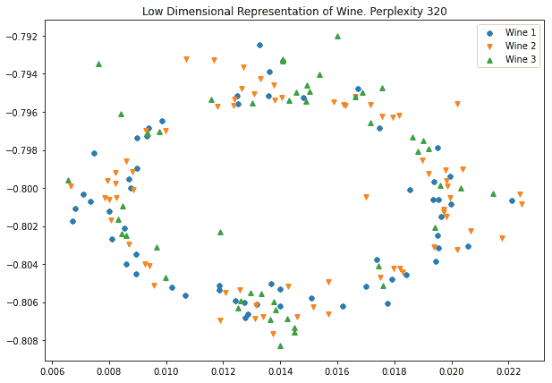

# 第七章：6\. t-分布随机邻域嵌入

概述

在本章中，我们将讨论**随机邻域嵌入**（**SNE**）和**t-分布随机邻域嵌入**（**t-SNE**）作为可视化高维数据集的一种方法。我们将实现 t-SNE 模型并解释 t-SNE 的局限性。能够将高维信息提取到低维空间将有助于可视化和探索性分析，同时也能与我们在前几章中探讨的聚类算法相结合。到本章结束时，我们将能够在低维空间中找到高维数据的聚类，例如用户级别信息或图像。

# 介绍

到目前为止，我们已经描述了多种不同的方法来减少数据集的维度，作为清洗数据、减少计算效率所需的大小或提取数据集中最重要信息的手段。虽然我们已经展示了许多减少高维数据集的方法，但在许多情况下，我们无法将维度的数量减少到可以可视化的大小，也就是二维或三维，而不会过度降低数据质量。考虑我们之前在本书中使用的 MNIST 数据集，这是一个包含数字 0 到 9 的手写数字图像的集合。每个图像的大小为 28 x 28 像素，提供 784 个独立的维度或特征。如果我们将这 784 个维度减少到 2 或 3 个以便进行可视化，我们几乎会失去所有可用的信息。

在本章中，我们将讨论 SNE 和 t-SNE 作为可视化高维数据集的一种手段。这些技术在无监督学习和机器学习系统设计中非常有用，因为能够可视化数据是一件强大的事情。能够可视化数据可以探索关系、识别群体并验证结果。t-SNE 技术已被用于可视化癌细胞核，这些细胞核具有超过 30 个特征，而文档中的数据可能具有上千维，有时即使在应用了像 PCA 这样的技术后也是如此。

# MNIST 数据集

现在，我们将使用附带源代码提供的 MNIST 数据集作为实际示例，探索 SNE 和 t-SNE。在继续之前，我们将快速回顾一下 MNIST 及其中的数据。完整的 MNIST 数据集包含 60,000 个训练样本和 10,000 个测试样本，这些样本是手写数字 0 到 9，表示为黑白（或灰度）图像，大小为 28 x 28 像素（即 784 个维度或特征），每个数字类别的样本数量相等。由于数据集的大小和数据质量，MNIST 已经成为机器学习中最具代表性的数据集之一，通常被作为许多机器学习研究论文中的参考数据集。与其他数据集相比，使用 MNIST 探索 SNE 和 t-SNE 的一个优势是，虽然样本包含大量维度，但即使在降维后，仍然可以将其可视化，因为它们可以表示为图像。*图 6.1*展示了 MNIST 数据集的一个样本：


图 6.1：MNIST 数据样本

下图展示了通过 PCA 将相同样本降至 30 个主成分：


图 6.2：通过 PCA 将 MNIST 数据集降至 30 个主成分

# 随机邻居嵌入（SNE）

SNE 是多种**流形学习**方法中的一种，旨在描述低维流形或有界区域中的高维空间。乍一看，这似乎是一个不可能完成的任务；如果我们有一个至少包含 30 个特征的数据集，如何合理地在二维空间中表示数据呢？随着我们逐步推导 SNE 的过程，希望你能够看到这是如何可能的。别担心——我们不会在这一章中深入探讨这个过程的数学细节，因为那超出了本章的范围。构建 SNE 可以分为以下几个步骤：

1.  将高维空间中数据点之间的距离转换为条件概率。假设我们有两个点，*x*i 和*x*j，位于高维空间中，并且我们想要确定*x*j 作为*x*i 邻居的概率（*p*i|j）。为了定义这个概率，我们使用高斯曲线。这样，我们可以看到，对于附近的点，概率较高，而对于远离的点，概率非常低。

1.  我们需要确定高斯曲线的宽度，因为它控制着概率选择的速率。宽曲线意味着许多邻近点相距较远，而窄曲线则意味着它们紧密地聚集在一起。

1.  一旦我们将数据投影到低维空间，我们还可以确定相应低维数据之间的概率（*q*i|j），即*y*i 和*y*j 之间的概率。

1.  SNE 的目标是通过使用成本函数(C)最小化所有数据点之间的*p*i|j 和*q*i|j 之间的差异，将数据放置到低维空间中。这被称为**Kullback-Leibler** (**KL**)散度：

图 6.3：KL 散度

注

要构建高斯分布的 Python 代码，请参考`GaussianDist.ipynb` Jupyter 笔记本，链接为[`packt.live/2UMVubU`](https://packt.live/2UMVubU)。

当在 SNE 中使用高斯分布时，它通过保持局部模式来减少数据的维度。为了实现这一点，SNE 使用梯度下降过程来最小化 C，使用学习率和训练周期等标准参数，正如我们在前一章中讨论神经网络和自编码器时所提到的那样。SNE 在训练过程中实现了一个额外的项——**困惑度**。困惑度是在比较中选择有效邻居数量的一个参数，对于困惑度值在 5 到 50 之间时，它相对稳定。实际上，建议在这一范围内使用困惑度值进行反复试验。

注

本章后面将详细讨论困惑度。

SNE 提供了一种有效的方式，将高维数据可视化到低维空间，尽管它仍然存在一个被称为**拥挤问题**的问题。拥挤问题可能出现在我们有一些点大致等距地分布在一个点周围的区域内，*i*。当这些点在低维空间中被可视化时，它们会相互拥挤，导致可视化困难。如果我们试图在这些拥挤的点之间留出更多空间，问题会加剧，因为任何距离更远的点会在低维空间中被放置得非常远。实质上，我们是在努力平衡既能可视化近距离点，又不失去远离点所提供的信息。

# t-分布 SNE

t-SNE 旨在通过修改后的 KL 散度成本函数，使用学生 t 分布替代低维空间中的高斯分布，从而解决拥挤问题。学生 t 分布是一种概率分布，类似于高斯分布，通常用于样本量较小且总体标准差未知的情况。它常用于学生 t 检验中。

修改后的 KL 成本函数在低维空间中对每对数据点的距离给予相等的权重，而学生分布在低维空间中采用较重的尾部以避免拥挤问题。在高维概率计算中，仍然使用高斯分布，以确保在高维空间中适度的距离在低维空间中也能得到忠实的表示。不同分布在各自空间中的组合，允许忠实地表示由小距离和适度距离分开的数据点。

注意

若需要一些关于如何在 Python 中重现学生 t 分布的示例代码，请参考 [`packt.live/2UMVubU`](https://packt.live/2UMVubU) 中的 Jupyter notebook。

幸运的是，我们不需要手动实现 t-SNE，因为 scikit-learn 提供了一个非常有效的实现，且其 API 非常简洁。我们需要记住的是，SNE 和 t-SNE 都是通过计算两个点在高维空间和低维空间中作为邻居的概率，并尽量最小化两个空间之间概率的差异。

## 练习 6.01：t-SNE MNIST

在本练习中，我们将使用 MNIST 数据集（随附源代码提供）来探索 scikit-learn 中 t-SNE 的实现。正如我们之前描述的那样，使用 MNIST 让我们能够以其他数据集（如波士顿房价数据集或鸢尾花数据集）无法实现的方式来可视化高维空间。请执行以下步骤：

1.  对于本练习，导入 `pickle`、`numpy`、`PCA` 和 `TSNE`（来自 scikit-learn），以及 `matplotlib`：

    ```py
    import pickle
    import numpy as np
    import matplotlib.pyplot as plt
    from sklearn.decomposition import PCA
    from sklearn.manifold import TSNE
    np.random.seed(2)
    ```

1.  加载并可视化提供的 MNIST 数据集及随附源代码：

    ```py
    with open('mnist.pkl', 'rb') as f:
        mnist = pickle.load(f)
    plt.figure(figsize=(10, 7))
    for i in range(9):
        plt.subplot(3, 3, i + 1)
        plt.imshow(mnist['images'][i], cmap='gray')
        plt.title(mnist['labels'][i])
        plt.axis('off')
    plt.show()
    ```

    输出结果如下：

    

    图 6.4：加载数据集后的输出

    这表明 MNIST 数据集已成功加载。

1.  在本练习中，我们将对数据集应用 PCA，提取前 30 个主成分。

    ```py
    model_pca = PCA(n_components=30)
    mnist_pca = model_pca.fit(mnist['images'].reshape((-1, 28 ** 2)))
    ```

1.  可视化将数据集降至 30 个主成分后的效果。为此，我们必须将数据集转换到低维空间，然后使用 `inverse_transform` 方法将数据恢复到原始大小，以便进行绘图。当然，在转换前后，我们需要对数据进行重塑：

    ```py
    mnist_30comp = model_pca.transform\
                   (mnist['images'].reshape((-1, 28 ** 2)))
    mnist_30comp_vis = model_pca.inverse_transform(mnist_30comp)
    mnist_30comp_vis = mnist_30comp_vis.reshape((-1, 28, 28))
    plt.figure(figsize=(10, 7))
    for i in range(9):
        plt.subplot(3, 3, i + 1)
        plt.imshow(mnist_30comp_vis[i], cmap='gray')
        plt.title(mnist['labels'][i])
        plt.axis('off')
    plt.show()
    ```

    输出结果如下：

    

    图 6.5：可视化数据集降维的效果

    请注意，尽管图像清晰度有所下降，但由于降维过程，大部分数字仍然清晰可见。值得注意的是，数字 4 似乎受此过程的影响最大。也许 PCA 过程中丢弃的大部分信息都包含了与数字 4 特有样本相关的信息。

1.  现在，我们将应用 t-SNE 算法对 PCA 变换后的数据进行处理，以在二维空间中可视化 30 个主成分。我们可以通过 scikit-learn 中的标准模型 API 接口来构建一个 t-SNE 模型。我们将从使用默认值开始，这些值指定了我们将在二维空间中嵌入 30 个维度进行可视化，使用的困惑度为 30，学习率为 200，迭代次数为 1,000。我们将设置`random_state`为 0，并将`verbose`设置为 1：

    ```py
    model_tsne = TSNE(random_state=0, verbose=1)
    model_tsne
    ```

    输出结果如下：

    

    图 6.6：应用 t-SNE 到 PCA 变换后的数据

    在上述截图中，我们可以看到 t-SNE 模型提供了多个配置选项，其中一些比其他选项更为重要。我们将重点关注`learning_rate`、`n_components`、`n_iter`、`perplexity`、`random_state`和`verbose`的值。对于`learning_rate`，正如我们之前所讨论的，t-SNE 使用随机梯度下降将高维数据投影到低维空间。学习率控制该过程执行的速度。如果学习率太高，模型可能无法收敛到一个解；如果太低，可能需要很长时间才能得到结果（如果能得到的话）。一个好的经验法则是从默认值开始；如果你发现模型产生了 NaN（非数值）结果，可能需要降低学习率。一旦对模型的结果满意，最好降低学习率并让其运行更长时间（增加`n_iter`），这样可能会得到稍微更好的结果。`n_components`是嵌入空间（或可视化空间）的维度数。通常情况下，你会希望数据的可视化是二维图，所以只需要使用默认值`2`。`n_iter`是梯度下降的最大迭代次数。`perplexity`是可视化数据时使用的邻居数量。

    通常，5 到 50 之间的值是合适的，考虑到较大的数据集通常需要比较小的数据集更多的困惑度。`random_state`是任何模型或算法中的一个重要变量，它会在训练开始时初始化其值。计算机硬件和软件工具中提供的随机数生成器实际上并不是真正的随机数生成器；它们实际上是伪随机数生成器。它们提供了接近随机性的良好近似，但并不是真正的随机。计算机中的随机数从一个称为种子的值开始，然后以复杂的方式生成。通过在过程开始时提供相同的种子，每次运行该过程时都会生成相同的“随机数”。虽然这听起来违反直觉，但它对于再现机器学习实验非常有用，因为你不会看到仅由于训练开始时参数初始化的不同而导致的性能差异。这可以提供更多信心，表明性能的变化是由于对模型或训练的有意改变；例如，神经网络的架构。

    注意

    生成真正的随机序列实际上是用计算机完成的最困难的任务之一。计算机软件和硬件的设计方式是，提供的指令每次执行时都完全相同，以便你获得相同的结果。执行中的随机差异，虽然在生成随机数字序列时理想，但在自动化任务和调试问题时将是噩梦。

    `verbose`是模型的详细程度，描述了在模型拟合过程中打印到屏幕上的信息量。值为 0 表示没有输出，而值为 1 或更大表示输出中详细程度的增加。

1.  使用 t-SNE 转换 MNIST 的分解数据集：

    ```py
    mnist_tsne = model_tsne.fit_transform(mnist_30comp)
    ```

    输出如下：

    

    图 6.7：转换分解后的数据集

    在拟合过程中提供的输出提供了对 scikit-learn 所完成计算的洞察。我们可以看到它正在为所有样本建立索引并计算邻居，然后以批次为 10 的数据来确定邻居的条件概率。在过程结束时，它提供了一个均值标准差值`304.9988`，并且在 250 次和 1,000 次梯度下降迭代后，给出了 KL 散度。

1.  现在，视觉化返回数据集中的维度数量：

    ```py
    mnist_tsne.shape
    ```

    输出如下：

    ```py
    10000,2
    ```

    我们已经成功地将 784 个维度降到 2 维以便可视化，那么它看起来怎么样呢？

1.  创建由模型生成的二维数据的散点图：

    ```py
    plt.figure(figsize=(10, 7))
    plt.scatter(mnist_tsne[:,0], mnist_tsne[:,1], s=5)
    plt.title('Low Dimensional Representation of MNIST');
    ```

    输出如下：

    

    图 6.8：MNIST 的二维表示（无标签）

    在上面的图中，我们可以看到已经将 MNIST 数据表示为二维形式，但也可以看到它似乎被聚集在一起。数据集中有许多不同的簇或数据块聚集在一起，并且通过一些空白区域与其他簇分开。似乎有大约九个不同的数据组。所有这些观察结果表明，在各个簇内部和它们之间存在某种关系。

1.  绘制按相应图像标签分组的二维数据，并使用标记将各个标签分开。

    ```py
    MARKER = ['o', 'v', '1', 'p' ,'*', '+', 'x', 'd', '4', '.']
    plt.figure(figsize=(10, 7))
    plt.title('Low Dimensional Representation of MNIST');
    for i in range(10):
        selections = mnist_tsne[mnist['labels'] == i]
        plt.scatter(selections[:,0], selections[:,1], alpha=0.2, \
                    marker=MARKER[i], s=5);
        x, y = selections.mean(axis=0)
        plt.text(x, y, str(i), fontdict={'weight': 'bold', \
                                         'size': 30})
    plt.show()
    ```

    输出如下：

    

    图 6.9：带标签的 MNIST 二维表示

    上面的图非常有趣。在这里，我们可以看到各个簇与数据集中的不同图像类别（从零到九）对应。通过无监督的方式，也就是不提前提供标签，结合 PCA 和 t-SNE，已经能够将 MNIST 数据集中的各个类别分离并归类。特别有趣的是，数据中似乎存在一些混淆，尤其是数字四与数字九的图像，五和三的图像之间也有一定重叠；这两个簇部分重合。如果我们查看在*步骤 4*中的数字九和数字四的 PCA 图像，*t-SNE MNIST*，这一点就更有意义了：

    

    图 6.10：九的 PCA 图像

    它们确实看起来非常相似；也许这与数字四的形状的不确定性有关。观察接下来的图像，我们可以从左侧的四中看到，两条垂直线几乎相交，而右侧的四则是两条线平行：

    

    图 6.11：数字四的形状

    在*图 6.9*中另一个有趣的特征是边缘情况，这些在 Jupyter 笔记本中以不同颜色显示。在每个簇的边缘，我们可以看到一些样本在传统的监督学习中会被错误分类，但它们代表的是与其他簇更相似的样本，而不是它们自己的簇。我们来看一个例子；有一些数字三的样本距离正确的簇非常远。

1.  获取数据集中所有数字三的索引：

    ```py
    threes = np.where(mnist['labels'] == 3)[0]
    threes
    ```

    输出如下：

    ```py
     array([   7,   10,   12, ..., 9974, 9977, 9991], dtype=int64)
    ```

1.  查找 x 值小于 0 的数字三：

    ```py
    tsne_threes = mnist_tsne[threes]
    far_threes = np.where(tsne_threes[:,0]< -30)[0]
    far_threes
    ```

    输出如下：

    

    图 6.12：x 值小于零的三

1.  显示坐标，找到一个与三类簇相距较远的点：

    ```py
    tsne_threes[far_threes]
    ```

    输出如下：

    

    图 6.13：远离三类簇的坐标

1.  选择一个具有合理高负值作为 `x` 坐标的样本。在本例中，我们将选择第二个样本，即样本 `11`。

    ```py
    plt.imshow(mnist['images'][11], cmap='gray')
    plt.axis('off');
    plt.show()
    ```

    输出如下：

    

图 6.14：样本 11 的图像

查看这个示例图像及其对应的 t-SNE 坐标，即大约 (-33, 26)，并不奇怪，因为这个样本位于数字 8 和 5 的群集附近，这些数字在这幅图像中有许多共同特征。在这个例子中，我们应用了简化的 SNE，展示了它的一些效率以及可能的混淆来源和无监督学习的输出。

注意

要访问此特定部分的源代码，请参阅 [`packt.live/3iDsCNf`](https://packt.live/3iDsCNf)

您还可以在 [`packt.live/3gBdrSK`](https://packt.live/3gBdrSK) 上在线运行此示例。

## 活动 6.01：葡萄酒 t-SNE

在这个活动中，我们将通过使用葡萄酒数据集加强我们对 t-SNE 的了解。通过完成此活动，您将能够为自己的定制应用程序构建 t-SNE 模型。葡萄酒数据集（[`archive.ics.uci.edu/ml/datasets/Wine`](https://archive.ics.uci.edu/ml/datasets/Wine)）收集了关于意大利葡萄酒化学分析的属性，来自三个不同生产商，但每个生产商都是同一种类型的葡萄酒。这些信息可以用作验证特定意大利地区葡萄酒制成的瓶子的有效性的示例。13 个属性包括酒精、苹果酸、灰分、灰的碱性、镁、总酚、类黄酮、非黄烷类酚、前花青素、颜色强度、色调、稀释酒的 OD280/OD315 和 脯氨酸。

每个样本包含一个类别标识符（1 - 3）。

注意

此数据集来源于 [`archive.ics.uci.edu/ml/machine-learning-databases/wine/`](https://archive.ics.uci.edu/ml/machine-learning-databases/wine/)（UCI 机器学习库 [[`archive.ics.uci.edu/ml`](http://archive.ics.uci.edu/ml)]。尔湾，加利福尼亚：加利福尼亚大学信息与计算机科学学院）。也可以从 [`packt.live/3e1JOcY`](https://packt.live/3e1JOcY) 下载。

这些步骤将帮助您完成此活动：

1.  导入 `pandas`、`numpy` 和 `matplotlib`，以及从 scikit-learn 导入的 `t-SNE` 和 `PCA` 模型。

1.  使用附带源代码中包含的 `wine.data` 文件加载 Wine 数据集，并显示前五行数据。

    注意

    您可以使用 `del` 关键字在 pandas DataFrames 中删除列。只需将 `del` 关键字传递给数据帧和在平方根内选择的列即可。

1.  第一列包含标签；提取此列并从数据集中删除。

1.  执行 PCA 将数据集减少到前六个组件。

1.  确定描述这六个组件的数据中的方差量。

1.  使用指定的随机状态创建 t-SNE 模型，并将 `verbose` 值设置为 1。

1.  将 PCA 数据拟合到 t-SNE 模型。

1.  确认 t-SNE 拟合数据的形状是二维的。

1.  创建二维数据的散点图。

1.  创建一个带有类标签的二维数据散点图，以可视化可能存在的任何聚类。

到本活动结束时，你将使用 Wine 数据集的六个成分构建一个 t-SNE 可视化图，并在图中的数据位置识别一些关系。最终的图形将类似于以下内容：


图 6.15：预期的绘图

注意

该活动的解决方案可以在第 460 页找到。

# 解释 t-SNE 图

现在我们可以使用 t 分布的 SNE 可视化高维数据，重要的是要理解此类图表的局限性以及在解读和生成这些图表时需要关注哪些方面。在本节中，我们将重点介绍 t-SNE 的一些重要特性，并演示在使用这种可视化技术时需要小心的地方。

## 困惑度

正如我们在 t-SNE 的介绍中所描述的，困惑度值指定了计算条件概率时要使用的最近邻居数量。选择该值会对最终结果产生重大影响；当困惑度值较低时，数据中的局部变化主导，因为计算中只使用了少量样本。相反，困惑度值较大时，会考虑更多的全局变化，因为计算中使用了更多的样本。通常，尝试一系列不同的值来研究困惑度的效果是值得的。再次强调，困惑度值在 5 到 50 之间通常效果不错。

## 练习 6.02：t-SNE MNIST 和困惑度

在这个练习中，我们将尝试不同的困惑度值，并观察其在可视化图中的效果：

1.  导入 `pickle`、`numpy` 和 `matplotlib`，以及从 scikit-learn 中导入 `PCA` 和 `t-SNE`：

    ```py
    import pickle
    import numpy as np
    import matplotlib.pyplot as plt
    from sklearn.decomposition import PCA
    from sklearn.manifold import TSNE
    np.random.seed(2)
    ```

1.  加载 MNIST 数据集。

    ```py
    with open('mnist.pkl', 'rb') as f:
        mnist = pickle.load(f)
    ```

1.  使用 PCA，只选择图像数据的前 30 个方差成分：

    ```py
    model_pca = PCA(n_components=30)
    mnist_pca = model_pca.fit_transform\
                (mnist['images'].reshape((-1, 28 ** 2)))
    ```

1.  在本练习中，我们正在研究困惑度对 t-SNE 流形的影响。以困惑度 3、30 和 300 进行模型/图形循环：

    ```py
    MARKER = ['o', 'v', '1', 'p' ,'*', '+', 'x', 'd', '4', '.']
    for perp in [3, 30, 300]:
        model_tsne = TSNE(random_state=0, verbose=1, perplexity=perp)
        mnist_tsne = model_tsne.fit_transform(mnist_pca)
        plt.figure(figsize=(10, 7))
        plt.title(f'Low Dimensional Representation of MNIST \
    (perplexity = {perp})')
        for i in range(10):
            selections = mnist_tsne[mnist['labels'] == i]
            plt.scatter(selections[:,0], selections[:,1],\
                        alpha=0.2, marker=MARKER[i], s=5)
            x, y = selections.mean(axis=0)
            plt.text(x, y, str(i), \
                     fontdict={'weight': 'bold', 'size': 30})
    plt.show()
    ```

    输出如下：

    

图 6.16：迭代模型

注意

前面的输出已被截断以便展示。像这样的标准输出通常会更长。不过，还是将其包含在内，因为在模型训练时，保持关注此类输出非常重要。

注意在三种不同困惑度值下的 KL 散度，以及平均标准差（方差）的增加。通过查看以下带有类别标签的 t-SNE 图，我们可以看到，在较低困惑度值下，聚类被很好地包含，重叠较少。然而，聚类之间几乎没有空间。随着困惑度的增加，聚类之间的空间得到改善，并且在困惑度为 30 时，区分相对清晰。随着困惑度增加到 300，我们可以看到，8 和 5 号聚类以及 9、4 和 7 号聚类开始趋于合并。

让我们从一个较低的困惑度值开始：


图 6.17：低困惑度值的图表

注意

*第 4 步*中的绘图函数将生成此图。接下来的输出是不同困惑度值下的图表。

将困惑度增加 10 倍后，聚类变得更加清晰：


图 6.18：将困惑度增加 10 倍后的图表

通过将困惑度增加到 300，我们开始将更多标签合并在一起：


图 6.19：将困惑度值增加到 300

在这个练习中，我们加深了对困惑度影响的理解，并了解了该值对整体结果的敏感性。较小的困惑度值可能导致位置之间空间非常小的更均匀混合。增加困惑度可以更有效地分离聚类，但过高的值会导致聚类重叠。

注意

要访问此特定部分的源代码，请参阅 [`packt.live/3gI0zdp`](https://packt.live/3gI0zdp)

你还可以在网上运行这个示例，访问 [`packt.live/3gDcjxR`](https://packt.live/3gDcjxR)

## 活动 6.02：t-SNE 葡萄酒与困惑度

在本活动中，我们将使用 Wine 数据集进一步强化困惑度对 t-SNE 可视化过程的影响。在本活动中，我们将尝试根据葡萄酒的化学成分来判断其来源。t-SNE 过程提供了一种有效的手段来表示并可能识别来源。

注意

这个数据集来源于 [`archive.ics.uci.edu/ml/machine-learning-databases/wine/`](https://archive.ics.uci.edu/ml/machine-learning-databases/wine/) （UCI 机器学习库 [[`archive.ics.uci.edu/ml`](http://archive.ics.uci.edu/ml)]）。它可以从 [`packt.live/3aPOmRJ`](https://packt.live/3aPOmRJ) 下载。

1.  导入 `pandas`、`numpy` 和 `matplotlib`，以及来自 scikit-learn 的 `t-SNE` 和 `PCA` 模型。

1.  加载 Wine 数据集并检查前五行数据。

1.  第一列提供标签；从 DataFrame 中提取这些标签，并将它们存储在一个单独的变量中。确保从 DataFrame 中删除该列。

1.  对数据集执行 PCA，并提取前六个成分。

1.  构建一个循环，遍历困惑度值（1、5、20、30、80、160、320）。在每次循环中，生成一个具有相应困惑度的 t-SNE 模型，并绘制标记的葡萄酒类别的散点图。注意不同困惑度值的影响。

在本活动结束时，你将生成 Wine 数据集的二维表示，并检查生成的图形，以查找数据的簇或分组。困惑度值 320 的图形如下所示：



图 6.20：预期输出

注意

该活动的解决方案可以在第 464 页找到。

## 迭代次数

我们将要实验的最后一个参数是迭代次数，正如我们在自编码器中的研究所示，它实际上就是应用于梯度下降的训练周期数。幸运的是，迭代次数是一个相对简单的参数，通常只需要一定的耐心，因为低维空间中点的位置会稳定在最终位置。

## 练习 6.03：t-SNE MNIST 与迭代次数

在本练习中，我们将观察不同迭代参数对 t-SNE 模型的影响，并突出显示一些指标，表明可能需要更多的训练。再次强调，这些参数的值高度依赖于数据集和可用于训练的数据量。在这个例子中，我们将使用 MNIST：

1.  导入`pickle`、`numpy`和`matplotlib`，以及从 scikit-learn 导入`PCA`和`t-SNE`：

    ```py
    import pickle
    import numpy as np
    import matplotlib.pyplot as plt
    from sklearn.decomposition import PCA
    from sklearn.manifold import TSNE
    np.random.seed(2)
    ```

1.  加载 MNIST 数据集：

    ```py
    with open('mnist.pkl', 'rb') as f:
        mnist = pickle.load(f)
    ```

1.  使用 PCA，从图像数据中选择前 30 个方差成分：

    ```py
    model_pca = PCA(n_components=30)
    mnist_pca = model_pca.fit_transform(mnist['images']\
                                        .reshape((-1, 28 ** 2)))
    ```

1.  在本练习中，我们正在研究迭代对 t-SNE 流形的影响。通过迭代模型/绘图循环，使用迭代进度值`250`、`500`和`1000`：

    ```py
    MARKER = ['o', 'v', '1', 'p' ,'*', '+', 'x', 'd', '4', '.']
    for iterations in [250, 500, 1000]:
        model_tsne = TSNE(random_state=0, verbose=1, \
                          n_iter=iterations, \
                          n_iter_without_progress=iterations)
        mnist_tsne = model_tsne.fit_transform(mnist_pca)
    ```

    输出结果如下：

    

    图 6.21：遍历模型

1.  绘制结果：

    ```py
        plt.figure(figsize=(10, 7))
        plt.title(f'Low Dimensional Representation of MNIST \
    (iterations = {iterations})')
        for i in range(10):
            selections = mnist_tsne[mnist['labels'] == i]
            plt.scatter(selections[:,0], selections[:,1], \
                        alpha=0.2, marker=MARKER[i], s=5);
            x, y = selections.mean(axis=0)
            plt.text(x, y, str(i), fontdict={'weight': 'bold', \
                                             'size': 30})
    plt.show()
    ```

    迭代次数减少会限制算法找到相关邻居的能力，导致簇的定义不清：

    

图 6.22：250 次迭代后的图形

增加迭代次数为算法提供了足够的时间来充分投影数据：


图 6.23：将迭代次数增加到 500 后的图形

一旦簇稳定下来，增加迭代次数的影响极小，实际上只是增加了训练时间：


图 6.24：1,000 次迭代后的图形

从之前的图表来看，我们可以看到迭代值为 500 和 1,000 的聚类位置是稳定的，并且在不同的图表之间几乎没有变化。最有趣的图表是迭代值为 250 的那一张，似乎聚类仍处于运动过程中，正朝着最终位置移动。因此，有足够的证据表明迭代值 500 已经足够。

注意

若要访问此特定部分的源代码，请参见[`packt.live/2Zaw1uZ`](https://packt.live/2Zaw1uZ)

你还可以在线运行这个示例，网址为[`packt.live/3gCOiHf`](https://packt.live/3gCOiHf)

## 活动 6.03：t-SNE 酒类数据与迭代

在这个活动中，我们将研究迭代次数对酒类数据集可视化效果的影响。这个过程在数据处理、清理和理解数据关系的探索阶段中非常常见。根据数据集和分析类型，我们可能需要尝试多种不同的迭代次数，就像我们在本活动中将要看的那样。

正如我们之前提到的，这个过程对于将高维数据降维到更低且更易理解的维度非常有帮助。在这个例子中，我们的数据集有 13 个特征；然而，在现实世界中，你可能会遇到具有数百甚至数千个特征的数据集。一个常见的例子是个人级别的数据，它可能包含任何数量的与人口统计或行为相关的特征，这使得常规的现成分析变得不可能。t-SNE 是一个有助于将高维数据转化为更直观状态的工具。

注意

该数据集来源于[`archive.ics.uci.edu/ml/machine-learning-databases/wine/`](https://archive.ics.uci.edu/ml/machine-learning-databases/wine/)（UCI 机器学习库[[`archive.ics.uci.edu/ml`](http://archive.ics.uci.edu/ml)]。加利福尼亚州尔湾：加利福尼亚大学信息与计算机科学学院）。它可以从[`packt.live/2xXgHXo`](https://packt.live/2xXgHXo)下载。

这些步骤将帮助你完成此活动：

1.  导入`pandas`、`numpy`、`matplotlib`，以及来自 scikit-learn 的`t-SNE`和`PCA`模型。

1.  加载酒类数据集并检查前五行。

1.  第一列提供了标签；从 DataFrame 中提取这些标签，并将它们存储在一个单独的变量中。确保该列已从 DataFrame 中移除。

1.  在数据集上执行 PCA 并提取前六个主成分。

1.  构建一个循环，迭代不同的迭代值（`250`，`500`，`1000`）。对于每次循环，生成一个具有相应迭代次数的 t-SNE 模型，以及一个没有进度值的相同迭代次数。

1.  构建一个带有标签的酒类散点图。注意不同迭代值的效果。

完成本活动后，我们将看到修改模型迭代参数的效果。这是一个重要的参数，确保数据在低维空间中已经稳定到一个相对最终的位置。

注意

本活动的解答可以在第 473 页找到。

## 关于可视化的最终思考

在本章结束时，有几个关于可视化的重要方面需要注意。第一个是聚类的大小或聚类之间的相对空间，可能并不能真正反映它们的接近程度。正如本章前面所讨论的，SNE 通过组合高斯分布和 Student's t 分布来将高维数据表示在低维空间中。因此，由于 t-SNE 平衡了局部数据结构和全局数据结构的位置，距离之间没有线性关系的保证。在局部结构中的点之间的实际距离，可能在可视化中看起来非常接近，但在高维空间中可能仍然有一定的距离。

这一特性还有其他后果，即有时随机数据可能看起来像是具有某种结构，通常需要使用不同的困惑度、学习率、迭代次数和随机种子值来生成多个可视化图。

# 总结

本章介绍了 t-分布 SNE（t-distributed SNE）作为一种可视化高维信息的方法，这些信息可能来自于先前的处理过程，例如 PCA 或自动编码器。我们讨论了 t-SNE 如何生成这种表示，并使用 MNIST 和 Wine 数据集以及 scikit-learn 生成了多个可视化结果。在本章中，我们能够看到无监督学习的一些强大之处，因为 PCA 和 t-SNE 能够在不知道真实标签的情况下，将每个图像的类别进行聚类。在下一章中，我们将通过研究无监督学习的应用（包括篮子分析和主题建模）来基于这一实践经验进行进一步探讨。
