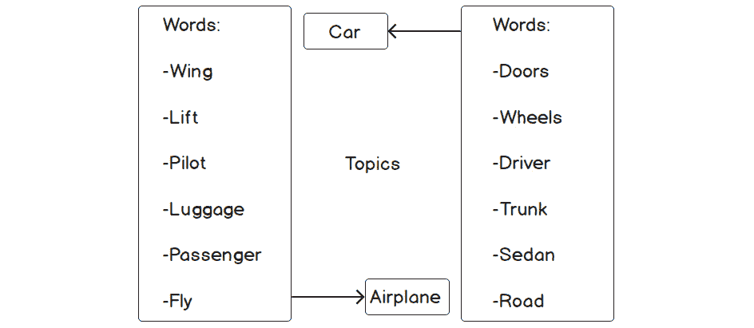
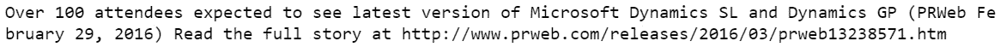
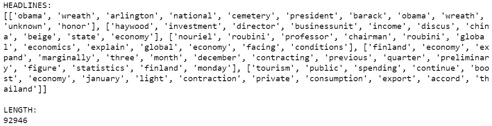
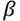
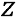
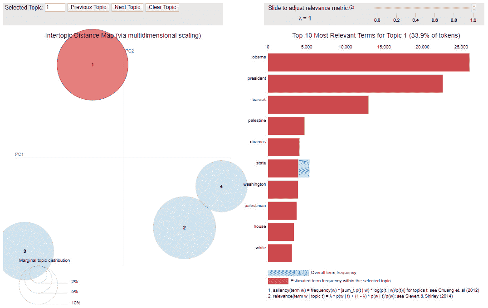

# 第八章：7. 主题建模

概述

在这一章中，我们将对文本数据进行基本的清洗技术，然后对清洗后的数据进行建模，以推导出相关主题。你将评估**潜在狄利克雷分配**（**LDA**）模型，并执行**非负矩阵分解**（**NMF**）模型。最后，你将解释主题模型的结果，并为给定场景识别最佳的主题模型。我们将看到主题建模如何为文档的潜在结构提供洞察力。在本章结束时，你将能够构建完整的主题模型，为你的业务提供价值和洞察。

# 介绍

在上一章中，讨论重点是使用降维和自编码技术为建模准备数据。大规模特征集在建模时可能会带来问题，因为多重共线性和大量计算可能会阻碍实时预测。使用主成分分析的降维方法是解决这一问题的一种方法。同样，自编码器旨在找到最佳的特征编码。你可以把自编码器看作是识别数据集中优质交互项的一种手段。现在，让我们超越降维，看看一些实际的建模技术。

主题建模是**自然语言处理**（**NLP**）的一部分，NLP 是计算机科学领域，研究自然语言的句法和语义分析，随着文本数据集的增加而越来越受欢迎。NLP 几乎可以处理任何形式的语言，包括文本、语音和图像。除了主题建模之外，情感分析、实体识别和对象字符识别也是值得注意的 NLP 应用。

目前，收集和分析的数据不再是以标准表格形式出现，而是更多以不太结构化的形式，如文档、图像和音频文件。因此，成功的数据科学从业者需要精通处理这些多样化数据集的方法。

下面是一个识别文本中的单词并将其分配到主题的示范：


图 7.1：在文本中识别单词并将其分配到主题的示例

你立刻想到的问题可能是*什么是主题？* 让我们通过一个例子来回答这个问题。你可以想象，或者可能已经注意到，在发生重大事件的日子里（例如国家选举、自然灾害或体育赛事冠军），社交媒体网站上的帖子通常会集中讨论这些事件。帖子通常以某种方式反映当天的事件，并且会以不同的方式呈现。这些帖子可以并且会有多个不同的观点，这些观点可以被归类为高层次的主题。如果我们有关于世界杯决赛的推文，这些推文的主题可能涵盖从裁判质量到球迷行为的不同观点。在美国，总统会在每年 1 月中下旬发表一次国情咨文演讲。通过足够数量的社交媒体帖子，我们可以通过使用帖子中的特定关键词来对社交媒体社区对演讲的高层次反应（主题）进行推断或预测。主题模型之所以重要，是因为它们在文本数据中起到的作用类似于经典的统计汇总在数值数据中的作用。也就是说，它们提供了数据的有意义总结。让我们回到国情咨文的例子。快速浏览的目标是确认演讲中的主要观点，这些观点要么引起了观众的共鸣，要么被观众忽视。

# 主题模型

主题模型属于无监督学习范畴，因为几乎总是，所识别的主题在事先是未知的。因此，没有目标可以进行回归或分类建模。从无监督学习的角度来看，主题模型与聚类算法最为相似，特别是 k 均值聚类。你可能还记得，在 k 均值聚类中，首先确定聚类的数量，然后模型将每个数据点分配到预定数量的聚类中。主题模型通常也是如此。我们在开始时选择主题的数量，然后模型会隔离出形成这些主题的词汇。这是进行高层次主题建模概述的一个很好的起点。

在此之前，让我们检查一下是否已安装并准备好使用正确的环境和库。下表列出了所需的库及其主要用途：


图 7.2：显示不同库及其用途的表格

如果当前未安装这些库中的任何一个或全部，请通过命令行使用`pip`安装所需的包；例如，`pip install langdetect`。

即将进行的练习的*第 3 步*涵盖了从`nltk`包安装词典。词典只是为特定用途整理的单词集合。下面安装的停用词词典包含了英语中常见的词，这些词无法澄清上下文、含义或意图。这些常见词可能包括*the*、*an*、*a*和*in*等。WordNet 词典提供了帮助词形还原过程的单词映射——如下所述。这些单词映射将诸如*run*、*running*和*ran*等词汇联系在一起，所有这些词基本上意味着相同的意思。从高层次来看，词典为数据科学家提供了一种准备文本数据以供分析的方式，无需深入了解语言学或花费大量时间定义单词列表或单词映射。

注意

在下面的练习和活动中，由于支持拉普拉斯·狄利希雷分配（Latent Dirichlet Allocation）和非负矩阵分解（Non-negative Matrix Factorization）的优化算法，结果可能会与显示的略有不同。许多函数没有设置种子功能。

## 练习 7.01：环境设置

为了检查环境是否准备好进行主题建模，我们将执行几个步骤。其中第一步是加载本章所需的所有库：

1.  打开一个新的 Jupyter 笔记本。

1.  导入所需的库：

    ```py
    import langdetect
    import matplotlib.pyplot
    import nltk
    import numpy
    import pandas
    import pyLDAvis
    import pyLDAvis.sklearn
    import regex
    import sklearn
    ```

    请注意，并非所有这些包都是用于清理数据的；其中一些包是在实际建模过程中使用的。但一次性导入所有需要的库是很有用的，因此我们现在就来处理所有库的导入。

    尚未安装的库将返回以下错误：

    

    图 7.3：未安装库错误

    如果返回此错误，请按之前讨论的方式通过命令行安装相关库。安装成功后，使用`import`重新执行库导入过程。

1.  某些文本数据清理和预处理过程需要词典。在这里，我们将安装两个这样的词典。如果已导入`nltk`库，请执行以下代码：

    ```py
    nltk.download('wordnet')
    nltk.download('stopwords')
    ```

    输出如下：

    

    图 7.4：导入库和下载词典

1.  运行`matplotlib`并指定内联，以便图形可以显示在笔记本中：

    ```py
    %matplotlib inline
    ```

笔记本和环境现在已经设置好，可以开始加载数据了。

注意

要访问此部分的源代码，请参考[`packt.live/34gLGKa`](https://packt.live/34gLGKa)。

你也可以在[`packt.live/3fbWQES`](https://packt.live/3fbWQES)上在线运行这个示例。

必须执行整个笔记本才能获得预期的结果。

## 主题模型的高层概述

在分析大量潜在相关的文本数据时，主题模型是一个常用的方法。这里所说的“相关”是指文档描述的是相似的主题。运行任何主题模型所需的唯一数据就是文档本身。不需要额外的数据（无论是元数据还是其他数据）。

简单来说，主题模型通过使用文档中的单词，识别出文档集合（称为**语料库**）中的抽象主题（也称为主题）。也就是说，如果一个句子包含单词*薪水*、*员工*和*会议*，可以合理推测该句子的主题是*工作*。值得注意的是，构成语料库的文档不必是传统意义上的文档——可以是信件或合同。文档可以是任何包含文本的内容，包括推文、新闻标题或转录的语音。

主题模型假设同一文档中的单词是相关的，并利用这一假设通过寻找反复出现在相近位置的单词群体来定义抽象主题。通过这种方式，这些模型是经典的模式识别算法，其中检测到的模式由单词组成。通用的主题建模算法有四个主要步骤：

1.  确定主题的数量。

1.  扫描文档并识别共现的单词或短语。

1.  自动学习描述文档的单词群体（或聚类）。

1.  输出描述语料库的抽象主题，作为单词群体。

正如*步骤 1*所述，主题的数量需要在拟合模型之前选择。选择合适的主题数量可能有点棘手，但就像大多数机器学习模型一样，可以通过使用不同主题数量拟合多个模型并基于性能指标选择最佳模型来优化此参数。我们稍后会再次深入探讨这个过程。

以下是通用主题建模的工作流：


图 7.5：通用主题建模工作流

优化主题数量的参数非常重要，因为这个参数会极大影响主题的连贯性。因为模型在预定义的主题数量约束下，找到最适合语料库的单词群体。如果主题数量过高，主题就会变得不适当的狭窄。过于具体的主题称为**过度处理**。同样，如果主题数量过低，主题就会变得泛化和模糊。这些类型的主题被认为是**欠处理**。过度处理和欠处理的主题有时可以通过分别减少或增加主题数量来解决。实际上，主题模型的一个常见且不可避免的结果是，通常至少会有一个主题存在问题。

主题模型的一个关键方面是，它们不会生成具体的单词或短语作为主题，而是生成一组词，每个词代表一个抽象主题。回想之前关于*工作*的假想句子。构建的主题模型旨在识别该句子所属的假设语料库中的主题时，并不会返回*工作*这个词作为主题。它会返回一组词，例如*薪水单*、*员工*和*老板*——这些词描述了该主题，可以从中推断出单词或短语主题。这是因为主题模型理解词的**接近性**，而不是上下文。模型并不知道*薪水单*、*员工*和*老板*的含义，它只知道这些词通常在出现时，彼此之间会出现在接近的位置：



图 7.6：从词组推断主题

主题模型可以用来预测未知文档所属的主题，但如果你打算进行预测，重要的是要认识到，主题模型只知道用来训练它们的词汇。也就是说，如果未知文档中有训练数据中没有的词，模型将无法处理这些词，即使它们与训练数据中已识别的某个主题相关联。由于这一事实，主题模型往往更多地用于探索性分析和推理，而非预测。

每个主题模型会输出两个矩阵。第一个矩阵包含了词和主题的关系。它列出了与每个主题相关的每个词，并对关系进行了量化。鉴于模型所考虑的词汇数量，每个主题只会用相对较少的词来描述。

词语可以被分配到一个主题，也可以分配到多个主题，并赋予不同的量化值。词语是否被分配到一个或多个主题取决于算法。类似地，第二个矩阵包含了文档和主题的关系。它通过量化文档与主题组合的关系，将每个文档映射到每个主题。

在讨论主题建模时，必须不断强调这样一个事实：代表主题的词组在概念上并不相关，它们仅仅是通过接近性相关。文档中某些词的频繁接近足以定义主题，因为之前提到的假设——同一文档中的所有词都是相关的。

然而，这个假设可能并不成立，或者这些词可能过于通用，无法形成连贯的主题。解释抽象主题涉及平衡文本数据的内在特性与生成的词组。文本数据和语言通常具有高度的变异性、复杂性和上下文性，这意味着任何泛化的结果都需要谨慎对待。

这并不是贬低或无效化模型的结果。在彻底清洗过的文档和适当数量的主题下，词汇组（正如我们将看到的）可以很好地指引我们理解语料库中的内容，并能有效地纳入更大的数据系统。

我们已经讨论了一些主题模型的局限性，但仍有一些额外的要点需要考虑。文本数据的噪声特性可能导致主题模型将与某个主题无关的词语错误地分配到该主题。

再次考虑之前关于*工作*的句子。词语*meeting*可能会出现在表示*工作*主题的词汇组中。也有可能词语*long*出现在这个组中，但*long*并不直接与*工作*相关。*Long*之所以出现在该组中，可能是因为它经常与词语*meeting*相近。因此，*long*可能被错误地（或虚假地）认为与*工作*相关，并且应该尽可能从主题词汇组中移除。词汇组中的虚假相关词语可能会在分析数据时造成重大问题。

这不一定是模型的缺陷。相反，这是一个特性，考虑到数据中的噪声，模型可能会从数据中提取出一些特殊性，这可能会对结果产生负面影响。虚假的相关性可能是由于数据的收集方式、地点或时间所导致的。如果文档仅在某个特定的地理区域收集，那么与该区域相关的词语可能会不正确地（尽管是偶然的）与模型输出的一个或多个词汇组关联起来。

请注意，随着词汇组中词语的增加，我们可能会将更多文档错误地附加到该主题。应该很容易理解的是，如果我们减少属于某个主题的词语数量，那么该主题将会被分配到更少的文档中。请记住，这并不是坏事。我们希望每个词汇组只包含那些合适的词语，以便将适当的主题分配给适当的文档。

有许多主题建模算法，但也许最著名的两种是**潜在狄利克雷分配**（**LDA**）和**非负矩阵分解**（**NMF**）。我们稍后会详细讨论这两种方法。

## 商业应用

尽管存在一些局限性，主题建模仍然可以提供有助于推动商业价值的可操作性洞察，如果正确使用并在合适的情境下应用。现在，让我们回顾一下主题模型的一些最大应用。

其中一个使用场景是在处理新文本数据时进行探索性数据分析，这些数据集的潜在结构尚不清楚。这相当于为一个未见过的数据集绘制图表并计算摘要统计量，其中包括需要理解其特征的数值和分类变量，在进一步的复杂分析能够合理进行之前。这些主题建模的结果可以帮助我们评估该数据集在未来建模工作中的可用性。例如，如果主题模型返回清晰且明确的主题，那么该数据集将是进一步进行聚类类分析的理想候选者。

确定主题会创建一个额外的变量，可以用来对数据进行排序、分类和/或分块。如果我们的主题模型返回“汽车”、“农业”和“电子产品”作为抽象主题，我们可以将大规模文本数据集筛选至仅包含“农业”作为主题的文档。筛选后，我们可以进行进一步的分析，包括情感分析、再一次的主题建模，或任何我们能想到的其他分析。除了定义语料库中存在的主题外，主题建模还间接返回了许多其他信息，这些信息可以用来进一步分解大型数据集并理解其特征。

其中一个特征是主题的普遍性。想象一下，在一个旨在衡量对某个产品反应的开放式问卷调查中进行分析。我们可以设想，主题模型返回的主题形式为情感。一组词可能是*好*、*优秀*、*推荐*和*质量*，而另一组则可能是*垃圾*、*坏掉*、*差劲*和*失望*。

鉴于这种调查方式，主题本身可能并不令人惊讶，但有趣的是，我们可以统计包含每个主题的文档数量，并从中获取有用的见解。通过这些统计数据，我们可以得出这样的结论：例如，x% 的调查参与者对产品持积极反应，而只有 y% 的参与者持消极反应。实际上，我们所做的就是创建了一个粗略版本的情感分析。

当前，主题模型最常见的用途是作为推荐引擎的一部分。今天的重点是个性化——向消费者提供专门为他们设计和策划的产品。以网站为例，无论是新闻网站还是其他，致力于传播文章的公司，例如雅虎和 Medium，需要让客户继续阅读才能保持运营。保持客户阅读的一种方式是向他们推送他们更有可能阅读的文章。这就是主题建模的作用所在。通过使用由个体之前阅读的文章组成的语料库，主题模型基本上可以告诉我们该订阅者喜欢阅读哪些类型的文章。然后，公司可以访问其库存，找到具有相似主题的文章，并通过该用户的账户页面或电子邮件将它们发送给该用户。这是为了简化使用并保持用户参与的定制策划。

在我们开始准备数据以供模型使用之前，让我们快速加载并探索数据。

## 练习 7.02: 数据加载

在本练习中，我们将加载并格式化数据。我们将在与*练习 7.01*，*设置环境*相同的笔记本中执行此练习。尽可能彻底地理解我们将要处理的数据集非常重要。理解的过程从了解数据的大致样貌、数据的大小、存在的列以及识别哪些数据集的方面可能对解决我们要解决的问题有帮助开始。我们将在下面回答这些基本问题。

注意

该数据集来源于[`archive.ics.uci.edu/ml/datasets/News+Popularity+in+Multiple+Social+Media+Platforms`](https://archive.ics.uci.edu/ml/datasets/News+Popularity+in+Multiple+Social+Media+Platforms)（UCI 机器学习库[[`archive.ics.uci.edu/ml`](http://archive.ics.uci.edu/ml)]。加利福尼亚大学欧文分校信息与计算机科学学院）。

引用：Nuno Moniz 和 Luís Torgo. "在线新闻源的多源社交反馈".CoRR [arXiv:1801.07055 [cs.SI]] (2018)。

数据集也可以从[`packt.live/2Xin2HC`](https://packt.live/2Xin2HC)下载。

这是本练习所需的唯一文件。下载并保存到本地后，数据可以加载到笔记本中。

1.  定义数据路径并使用`pandas`加载数据：

    ```py
    path = "News_Final.csv"
    df = pandas.read_csv(path, header=0)
    ```

    注意

    将文件添加到与您打开笔记本的相同文件夹中。

1.  执行以下代码简要检查数据：

    ```py
    def dataframe_quick_look(df, nrows):
        print("SHAPE:\n{shape}\n".format(shape=df.shape))
        print("COLUMN NAMES:\n{names}\n".format(names=df.columns))
        print("HEAD:\n{head}\n".format(head=df.head(nrows)))
    dataframe_quick_look(df, nrows=2)
    ```

    这个用户定义的函数返回数据的形状（行数和列数）、列名以及数据的前两行：

    

    图 7.7: 原始数据

    从特征上讲，这是一个比运行主题模型所需的更大的数据集。

1.  请注意，其中一列名为`Topic`，实际上包含了任何主题模型试图确定的信息。简要查看提供的主题数据，这样当你最终生成自己的主题时，结果可以直接进行比较。运行以下代码打印唯一的主题值及其出现次数：

    ```py
    print("TOPICS:\n{topics}\n".format(topics=df["Topic"]\
          .value_counts()))
    ```

    输出结果如下：

    ```py
    TOPICS:
    economy      33928
    obama        28610
    microsoft    21858
    palestine     8843
    Name: Topic, dtype: int64
    ```

1.  现在，提取标题数据并将提取的数据转换为列表对象。打印列表的前五个元素以及列表的长度，以确认提取是否成功：

    ```py
    raw = df["Headline"].tolist()
    print("HEADLINES:\n{lines}\n".format(lines=raw[:5]))
    print("LENGTH:\n{length}\n".format(length=len(raw)))
    ```

    输出结果如下：

    

图 7.8：标题列表

现在数据已加载并正确格式化，我们来谈谈文本数据清洗，然后进行一些实际的清洗和预处理。出于教学目的，清洗过程最初将在单个标题上进行构建和执行。一旦我们建立了清洗过程并在示例标题上进行了测试，我们将返回并对每个标题运行该过程。

注意

要访问此特定部分的源代码，请参见[`packt.live/34gLGKa`](https://packt.live/34gLGKa)。

你也可以在网上运行这个示例，访问[`packt.live/3fbWQES`](https://packt.live/3fbWQES)。

你必须执行整个 Notebook 才能得到期望的结果。

# 清洗文本数据

所有成功建模练习的一个关键组成部分是一个经过适当和充分预处理的干净数据集，专门为特定的数据类型和分析任务进行预处理。文本数据也不例外，因为它在原始形式下几乎无法使用。无论运行什么算法：如果数据没有经过适当准备，结果最好的情况下是没有意义的，最坏的情况下是误导性的。正如谚语所说，*垃圾进，垃圾出*。对于主题建模，数据清洗的目标是通过去除所有可能干扰的内容，来孤立每个文档中可能相关的词汇。

数据清洗和预处理几乎总是特定于数据集的，这意味着每个数据集都需要一组独特的清洗和预处理步骤，专门用于处理其中的问题。对于文本数据，清洗和预处理步骤可能包括语言过滤、移除网址和屏幕名称、词形还原以及停用词移除等。我们将在接下来的章节中详细探讨这些步骤，并在即将进行的练习中实施这些思想，届时一个包含新闻标题的数据集将被清理用于主题建模。

## 数据清洗技术

重申一下之前的观点，清洗文本以进行主题建模的目标是从每个文档中提取可能与发现语料库抽象主题相关的单词。这意味着需要去除常见词、短词（通常更常见）、数字和标点符号。清洗数据没有固定的流程，因此理解所清洗数据类型中的典型问题点并进行广泛的探索性工作非常重要。

现在，让我们讨论一些我们将在数据清洗中使用的文本清洗技巧。进行任何涉及文本的建模任务时，首先需要做的事情之一是确定文本的语言。在这个数据集中，大多数标题是英文的，因此为了简便起见，我们将删除非英文的标题。构建非英文文本数据的模型需要额外的技能，其中最基本的是对所建模语言的流利掌握。

数据清洗的下一个关键步骤是移除文档中所有与基于单词的模型无关的元素，或者可能成为噪声来源、掩盖结果的元素。需要移除的元素可能包括网站地址、标点符号、数字和停用词。**停用词**基本上是一些简单的、常用的词（包括*we*、*are*和*the*）。需要注意的是，并没有一个权威的停用词词典；每个词典略有不同。尽管如此，每个词典都包含一些常见词，这些词被认为与主题无关。主题模型试图识别那些既频繁又不那么频繁的词，这些词足以描述一个抽象的主题。

移除网站地址有类似的动机。特定的网站地址出现的频率非常低，但即使某个特定网站地址足够多次出现在文档中并且能与某个主题相关联，网站地址的解释方式却不同于单词。去除文档中无关的信息，可以减少那些可能妨碍模型收敛或掩盖结果的噪声。

**词形还原**，像语言检测一样，是所有涉及文本的建模活动中的一个重要组成部分。它是将单词还原为其基本形式的过程，目的是将应该相同但因时态或词性变化而不同的单词归为一类。考虑单词*running*、*runs*和*ran*。这三个单词的基本形式是*run*。词形还原的一个很好的方面是，它会查看句子中的所有单词（换句话说，它会考虑上下文），然后决定如何改变每个单词。词形还原，像大多数前述的清洗技巧一样，简单地减少了数据中的噪声，使我们能够识别出干净且易于解释的主题。

现在，拥有了基本的文本清洗技巧知识，让我们将这些技巧应用于实际数据中。

## 练习 7.03：逐步清洗数据

在本练习中，我们将学习如何实现一些清理文本数据的关键技术。每个技术将在我们进行练习时进行解释。每一步清理后，都会使用`print`输出示例标题，以便我们观察从原始数据到模型数据的演变：

1.  选择第六个标题作为我们构建并测试清理过程的示例。第六个标题并不是随机选择的，它是因为包含了在清理过程中将要处理的特定问题：

    ```py
    example = raw[5]
    print(example)
    ```

    输出如下：

    

    图 7.9：第六个标题

1.  使用 `langdetect` 库来检测每个标题的语言。如果语言不是英语（`en`），则从数据集中删除该标题。`detect` 函数仅仅是检测传入文本的语言。当该函数无法检测出语言时（偶尔会发生），只需将语言设置为 `none`，以便稍后删除：

    ```py
    def do_language_identifying(txt):
        try: the_language = langdetect.detect(txt)
        except: the_language = 'none'
        return the_language
    print("DETECTED LANGUAGE:\n{lang}\n"\
          .format(lang=do_language_identifying(example)))
    ```

    输出如下：

    ```py
    DETECTED LANGUAGE:
    en
    ```

1.  使用空格将包含标题的字符串拆分成片段，称为**标记**。返回的对象是由构成标题的单词和数字组成的列表。将标题字符串拆分成标记，使清理和预处理过程更加简单。市场上有多种类型的标记器。请注意，NLTK 本身提供了多种类型的标记器。每个标记器考虑了将句子拆分成标记的不同方式。最简单的一种是基于空格拆分文本。

    ```py
    example = example.split(" ")
    print(example)
    ```

    输出如下：

    

    图 7.10：使用空格拆分字符串

1.  使用正则表达式搜索包含 `http://` 或 `https://` 的标记来识别所有 URL。将 URL 替换为 `'URL'` 字符串：

    ```py
    example = ['URL' if bool(regex.search("http[s]?://", i)) \
               else i for i in example]
    print(example)
    ```

    输出如下：

    

    图 7.11：将 URL 替换为 URL 字符串

1.  使用正则表达式将所有标点符号和换行符号（`\n`）替换为空字符串：

    ```py
    example = [regex.sub("[^\\w\\s]|\n", "", i) for i in example]
    print(example)
    ```

    输出如下：

    

    图 7.12：使用正则表达式将标点符号替换为空字符串

1.  使用正则表达式将所有数字替换为空字符串：

    ```py
    example = [regex.sub("^[0-9]*$", "", i) for i in example]
    print(example)
    ```

    输出如下：

    

    图 7.13：将数字替换为空字符串

1.  将所有大写字母转换为小写字母。虽然将所有内容转换为小写字母不是强制步骤，但它有助于简化复杂性。将所有内容转换为小写字母后，跟踪的内容较少，因此出错的机会也较小：

    ```py
    example = [i.lower() if i not in ["URL"] else i for i in example]
    print(example)
    ```

    输出如下：

    

    图 7.14：将大写字母转换为小写字母

1.  移除在 *步骤 4* 中添加的 `'URL'` 字符串作为占位符。先前添加的 `'URL'` 字符串实际上在建模中并不需要。如果它似乎无害，留着它也无妨，但要考虑到 `'URL'` 字符串可能自然出现在标题中，我们不希望人为地增加它的出现频率。此外，`'URL'` 字符串并非出现在每个标题中，因此，留下它可能会无意间在 `'URL'` 字符串和某些主题之间建立联系：

    ```py
    example = [i for i in example if i not in ["URL",""]]
    print(example)
    ```

    输出结果如下：

    

    图 7.15：字符串 URL 已移除

1.  从 `nltk` 加载 `stopwords` 字典并打印出来：

    ```py
    list_stop_words = nltk.corpus.stopwords.words("english")
    list_stop_words = [regex.sub("[^\\w\\s]", "", i) \
                       for i in list_stop_words]
    print(list_stop_words)
    ```

    输出结果如下：

    

    图 7.16：停用词列表

    在使用字典之前，重要的是要重新格式化单词，使其与我们标题的格式匹配。这包括确认所有内容都是小写且没有标点符号。

1.  现在我们已经正确格式化了 `stopwords` 字典，使用它从标题中移除所有停用词：

    ```py
    example = [i for i in example if i not in list_stop_words]
    print(example)
    ```

    输出结果如下：

    

    图 7.17：从标题中移除停用词

1.  通过定义一个可以应用于每个标题的函数来执行词形还原。词形还原需要加载 `wordnet` 字典。`morphy` 函数会处理文本中的每个单词，并返回其标准形式（如果识别到的话）。例如，如果输入的单词是 *running* 或 *ran*，`morphy` 函数将返回 *run*：

    ```py
    def do_lemmatizing(wrd):
        out = nltk.corpus.wordnet.morphy(wrd)
        return (wrd if out is None else out)
    example = [do_lemmatizing(i) for i in example]
    print(example)
    ```

    输出结果如下：

    

    图 7.18：执行词形还原后的输出

1.  从词元列表中移除所有长度为四个字符或更少的单词。这个步骤的假设是，短单词通常更为常见，因此不会为我们从主题模型中提取的洞察提供帮助。请注意，移除某些长度的单词并不是一种适用于所有情况的技巧；它仅适用于特定情况。例如，短单词有时可能非常指示某些主题，如识别动物（例如：dog，cat，bird）。

    ```py
    example = [i for i in example if len(i) >= 5]
    print(example)
    ```

    输出结果如下：


图 7.19：第六个标题清理后的结果

现在我们已经逐一完成了清理和预处理步骤，接下来需要将这些步骤应用到接近 100,000 个标题上。最有效的方法是编写一个包含上述所有步骤的函数，并以某种迭代方式将该函数应用于语料库中的每个文档。这个过程将在下一个练习中进行。

注意

要访问此特定部分的源代码，请参考 [`packt.live/34gLGKa`](https://packt.live/34gLGKa)。

您还可以在[`packt.live/3fbWQES`](https://packt.live/3fbWQES)在线运行此示例。

您必须执行整个 Notebook 才能获得所需的结果。

## 练习 7.04：完整数据清洗

在本次练习中，我们将把*步骤 2*到*步骤 12*从*练习 7.03*《逐步清洗数据》整合为一个函数，应用于每个标题。该函数将以字符串格式的标题作为输入，输出将是一个清洗后的标题列表（tokens）。主题模型要求文档格式为字符串，而不是 tokens 的列表，因此在*步骤 4*中，tokens 列表将被转换回字符串：

1.  定义一个函数，包含*练习 7.03*《逐步清洗数据》中的所有独立步骤：

    ```py
    Exercise7.01-Exercise7.12.ipynb
    def do_headline_cleaning(txt):
          # identify language of tweet
          # return null if language not English
        lg = do_language_identifying(txt)
        if lg != 'en': 
            return None
          # split the string on whitespace
        out = txt.split(" ")
          # identify urls
          # replace with URL
        out = ['URL' if bool(regex.search("http[s]?://", i)) \
               else i for i in out]
          # remove all punctuation
        out = [regex.sub("[^\\w\\s]|\n", "", i) for i in out]
          # remove all numerics
        out = [regex.sub("^[0-9]*$", "", i) for i in out]
    The complete code for this step can be found at https://packt.live/34gLGKa.
    ```

1.  在每个标题上执行该函数。Python 中的`map`函数是一种很好的方式，可以将用户定义的函数应用于列表中的每个元素。将`map`对象转换为列表，并将其分配给`clean`变量。`clean`变量是一个列表的列表：

    ```py
    tick = time()
    clean = list(map(do_headline_cleaning, raw))
    print(time()-tick)
    ```

1.  在`do_headline_cleaning`中，如果检测到标题的语言不是英语，则返回`None`。最终清洗后的列表中的元素应仅为列表，而非`None`，因此需要去除所有`None`类型。使用`print`显示前五个清洗后的标题以及`clean`变量的长度：

    ```py
    clean = list(filter(None.__ne__, clean))
    print("HEADLINES:\n{lines}\n".format(lines=clean[:5]))
    print("LENGTH:\n{length}\n".format(length=len(clean)))
    ```

    输出如下：

    

    图 7.20：示例标题及标题列表的长度

1.  对于每个单独的标题，使用空格分隔符连接 tokens。现在这些标题将变成一个无结构的单词集合，对于人类阅读者来说没有意义，但对于主题建模来说是理想的：

    ```py
    clean_sentences = [" ".join(i) for i in clean]
    print(clean_sentences[0:10])
    ```

    清洗后的标题应类似于以下内容：

    

图 7.21：为建模清洗后的标题

注意

要访问此特定部分的源代码，请参考[`packt.live/34gLGKa`](https://packt.live/34gLGKa)。

您还可以在[`packt.live/3fbWQES`](https://packt.live/3fbWQES)在线运行此示例。

您必须执行整个 Notebook 才能获得所需的结果。

总结一下，清洗和预处理的工作实际上是剔除数据中的噪音，以便模型能够专注于数据中可能推动洞察的元素。例如，任何与主题无关的词语不应影响主题，但如果不小心留下这些词，它们可能会干扰。

为了避免我们可以称之为*假信号*的内容，我们会移除这些词语。同样，由于主题模型无法辨别上下文，标点符号是无关的，因此会被移除。即便模型可以在不清洗数据的情况下找到主题，未经清洗的数据可能包含成千上万甚至百万个多余的单词和随机字符（取决于语料库中的文档数量），这可能显著增加计算需求。因此，数据清洗是主题建模的一个重要部分。你将在接下来的活动中练习这个过程。

## 活动 7.01：加载和清洗 Twitter 数据

在本活动中，我们将加载并清洗 Twitter 数据，以便在后续活动中进行建模。我们对头条数据的使用是持续进行的，因此让我们在一个单独的 Jupyter 笔记本中完成此活动，但所有的要求和导入的库保持一致。

目标是处理原始推文数据，清洗它，并生成与前一个练习中*第 4 步*相同的输出。输出应该是一个列表，其长度应该与原始数据文件中的行数相似，但可能不完全相同。这是因为推文在清洗过程中可能会被丢弃，原因可能有很多，比如推文使用了非英语语言。列表中的每个元素应该代表一条推文，并且只包含可能与主题形成相关的推文内容。

以下是完成此活动的步骤：

1.  导入必要的库。

1.  从[`packt.live/2Xje5xF`](https://packt.live/2Xje5xF)加载 LA Times 健康 Twitter 数据(`latimeshealth.txt`)。

    注意

    数据集来源于[`archive.ics.uci.edu/ml/datasets/Health+News+in+Twitter`](https://archive.ics.uci.edu/ml/datasets/Health+News+in+Twitter)（UCI 机器学习库[[`archive.ics.uci.edu/ml`](http://archive.ics.uci.edu/ml)]。加利福尼亚大学欧文分校信息与计算机科学学院）。

    引用：Karami, A., Gangopadhyay, A., Zhou, B., & Kharrazi, H.（2017）。健康和医学语料库中的模糊方法主题发现。《国际模糊系统杂志》，1-12。

    它也可以在 GitHub 上找到，[`packt.live/2Xje5xF`](https://packt.live/2Xje5xF)。

1.  进行快速的探索性分析，确定数据的大小和结构。

1.  提取推文文本并将其转换为列表对象。

1.  编写一个函数，执行语言检测和基于空格的分词，然后分别用`SCREENNAME`和`URL`替换屏幕名称和网址。该函数还应移除标点符号、数字以及`SCREENNAME`和`URL`的替换内容。将所有内容转换为小写字母，除了`SCREENNAME`和`URL`。它应移除所有停用词，执行词形还原，并且只保留长度为五个字母或以上的单词。

1.  将*第 5 步*中定义的函数应用于每一条推文。

1.  移除输出列表中值为`None`的元素。

1.  将每条推文的元素重新转换为字符串。使用空格进行连接。

1.  保持笔记本打开，以便进行未来的活动。

    注意

    本章中的所有活动需要在同一个笔记本中执行。

    输出结果如下：

    

图 7.22：已清洗的推文，用于建模

注意

本活动的解决方案可以在第 478 页找到。

# 潜在狄利克雷分配（Latent Dirichlet Allocation）

2003 年，David Blei、Andrew Ng 和 Michael Jordan 发表了他们关于主题建模算法**潜在狄利克雷分配**（**LDA**）的文章。LDA 是一种生成概率模型。这意味着建模过程从文本开始，反向工作，通过假设生成它的过程，以识别感兴趣的参数。在这种情况下，感兴趣的是生成数据的主题。这里讨论的过程是 LDA 的最基本形式，但对于学习来说，它也是最容易理解的。

语料库中有 M 个可用于主题建模的文档。每个文档可以视为*N*个单词的序列，即序列（*w*1，*w*2… *w*N）。

对于语料库中的每个文档，假设的生成过程是：

1.  选择，其中*N*是单词的数量，λ是控制泊松分布的参数。

1.  选择，其中是主题的分布。

1.  对于每个*N*个单词，*W*n，选择主题，并从中选择单词*W*n，来自。

让我们更详细地了解一下生成过程。前面提到的三个步骤会对语料库中的每个文档重复。初始步骤是通过从大多数情况下的*泊松*分布中采样来选择文档中的单词数。需要注意的是，由于 N 与其他变量是独立的，因此与其生成相关的随机性在算法推导中大多被忽略。

在选择*N*之后，接下来是生成主题混合或主题分布，这对每个文档来说是独特的。可以将其视为每个文档的主题列表，概率表示每个主题所代表的文档部分。考虑三个主题：A、B 和 C。一个示例文档可能是 100%的主题 A，75%的主题 B 和 25%的主题 C，或者是无数其他的组合。

最后，文档中的特定单词是通过概率语句从所选主题及该主题的单词分布中选择的。请注意，文档并不真正以这种方式生成，但它是一个合理的代理方法。

这个过程可以被看作是一个分布上的分布。一个文档从文档集合（分布）中选择出来，然后从该文档的主题概率分布中选择一个主题（通过多项式分布），该分布由 Dirichlet 分布生成。


图 7.23：LDA 的图形表示

构建表示 LDA 解法的公式最直接的方法是通过图形表示。这个特定的表示方法被称为板符号图形模型，因为它使用板块来表示过程中的两个迭代步骤。

你会记得生成过程是针对语料库中的每个文档执行的，因此最外层的板块（标记为*M*）表示对每个文档的迭代。类似地，*步骤 3*中对词汇的迭代通过图中的最内层板块表示，标记为*N*。

圆圈代表参数、分布和结果。阴影部分的圆圈，标记为*w*，是选定的词汇，这是唯一已知的数据，因此用于反向推导生成过程。除了*w*，图中的其他四个变量定义如下：

+   ：主题-文档 Dirichlet 分布的超参数。

+   ：每个主题的词汇分布。

+   ：这是主题的潜在变量。

+   ：这是每个文档主题分布的潜在变量。

 和 控制文档中主题的频率和主题中词汇的频率。如果 增加时，文档变得越来越相似，因为每个文档中的主题数量增加。另一方面，如果 减少时，文档之间的相似度逐渐降低，因为每个文档中的主题数量减少。  参数表现类似。如果 增加时，文档中使用的词汇更多，用来建模一个主题，而较低的导致每个主题所使用的词汇数量较少。鉴于 LDA 中分布的复杂性，没有直接的解决方案，因此需要某种近似算法来生成结果。LDA 的标准近似算法将在下一节中讨论。

## 变分推断

LDA 的一个主要问题是条件概率（分布）的评估难以管理，因此，概率不是直接计算，而是通过近似来得到。变分推断是其中一种较为简单的近似算法，但它有一个广泛的推导过程，需要对概率有深入的理解。为了更多地关注 LDA 的应用，本节将简要介绍变分推断在该背景下的应用，但不会深入探讨该算法。

让我们花点时间直观地理解变分推断算法。从随机地将语料库中每篇文档中的每个单词分配到一个主题开始。然后，分别为每个文档和每个文档中的每个单词计算两个比例。这些比例分别是当前分配给该主题的文档中单词的比例，*P(Topic|Document)*，以及特定单词在所有文档中分配到该主题的比例，*P(Word|Topic)*。将这两个比例相乘，使用得到的比例将该单词分配到一个新的主题。重复这个过程，直到达到一个稳定状态，在这个状态下，主题分配不会发生显著变化。然后，使用这些分配来估计文档内部的主题混合和主题内的单词混合。


图 7.24：变分推断过程

变分推断的思路是，如果实际分布是不可处理的，那么应找到一个更简单的分布，称为变分分布，它非常接近真实分布且是可处理的，从而使得推断成为可能。换句话说，由于由于实际分布的复杂性，推断实际分布是不可能的，我们试图找到一个更简单的分布，它能够很好地近似实际分布。

让我们暂时从理论中休息一下，来看一个例子。变分推断就像是在拥挤的动物园中观察动物。动物园里的动物处于一个封闭的栖息地，在这个例子中，栖息地就是后验分布。游客无法实际进入栖息地，因此他们必须尽可能靠近栖息地观察，这就是后验近似（即栖息地的最佳近似）。如果动物园里有很多人，可能很难找到那个最佳的观察点。人们通常从人群的后面开始，逐步朝着最佳观察点移动。游客从人群后面移动到最佳观察点的路径就是优化路径。变分推断实际上就是在知道无法真正到达期望点的情况下，尽可能接近期望点的过程。

首先，选择一个分布族（即二项分布、高斯分布、指数分布等），*q*，并根据新的变分参数进行条件化。这些参数经过优化，使得原始分布（实际上是后验分布，对于熟悉贝叶斯统计的人来说）和变分分布尽可能接近。变分分布会足够接近原始的后验分布，因此可以作为代理，基于它进行的任何推断都适用于原始后验分布。分布族 *q* 的通用公式如下：


图 7.25：分布族的公式，q

有一大堆潜在的变分分布可以用作后验分布的近似。从这些分布中选择一个初始的变分分布，作为优化过程的起点，该过程会不断接近最佳分布。最佳参数是指最能近似后验分布的分布参数。使用**Kullback-Leibler**（**KL**）散度来衡量这两个分布的相似性。KL 散度表示如果我们用一个分布来近似另一个分布时，所产生的预期误差量。具有最佳参数的分布将具有最小的 KL 散度，并且与真实分布相比。

一旦确定了最佳分布，也就意味着确定了最佳参数，可以利用它来生成输出矩阵并执行任何需要的推断。

## 词袋模型

文本不能直接传递给任何机器学习算法；它首先需要被数值编码。在机器学习中处理文本的一个直接方法是使用词袋模型，它移除了关于单词顺序的所有信息，专注于每个单词的出现程度（即计数或频率）。

Python 的`sklearn`库可以用来将前一个练习中创建的清洗后的向量转换为 LDA 模型所需的结构。由于 LDA 是一个概率模型，我们不希望对单词出现频率进行任何缩放或加权；相反，我们选择仅输入原始计数。

词袋模型的输入将是*练习 7.04*中返回的清洗字符串列表，即*完整数据清理*。输出将是文档编号、单词的数值编码以及该单词在文档中出现的次数。这三个项目将以元组和整数的形式呈现。

元组将类似于(0, 325)，其中 0 是文档编号，325 是数值编码的单词。请注意，325 将是该单词在所有文档中的编码。整数部分将是计数。我们将在本章中运行的词袋模型来自`sklearn`，分别称为`CountVectorizer`和`TfIdfVectorizer`。第一个模型返回原始计数，第二个返回一个缩放值，我们稍后将讨论这一点。

一个重要的注意事项是，本章涵盖的两种主题模型的结果可能会因运行而异，即使数据相同，这也是由于随机性所导致。LDA 中的概率和优化算法都不是确定性的，因此不要惊讶于你的结果与接下来展示的结果有所不同。在下一个练习中，我们将运行计数向量化器，以数值方式编码我们的文档，以便能够继续使用 LDA 进行主题建模。

## 练习 7.05：使用计数向量化器创建词袋模型

在这个练习中，我们将运行`sklearn`中的`CountVectorizer`，将之前创建的清洗后的标题向量转换为词袋数据结构。此外，我们还将定义一些将在建模过程中使用的变量：

1.  定义`number_words`、`number_docs`和`number_features`。前两个变量控制 LDA 结果的可视化。`number_features`变量控制将在特征空间中保留的词汇数量：

    ```py
    number_words = 10
    number_docs = 10
    number_features = 1000
    ```

1.  运行计数向量化器并打印输出。这里有三个关键输入参数：`max_df`、`min_df`和`max_features`。这些参数进一步筛选出语料库中最可能影响模型的词汇。

    在少数文档中出现的词汇太过稀有，无法归因于任何特定主题，因此使用`min_df`来丢弃在指定文档数量以下出现的词汇。出现在过多文档中的词汇不够具体，无法与特定主题相关联，因此使用`max_df`来丢弃在超过指定百分比文档中出现的词汇。

    最后，我们不希望模型出现过拟合，因此用于拟合模型的词汇数量被限制为最频繁出现的指定数量（`max_features`）的词汇：

    ```py
    vectorizer1 = sklearn.feature_extraction.text\
                  .CountVectorizer(analyzer="word",\
                                   max_df=0.5,\
                                   min_df=20,\
                                   max_features=number_features)
    clean_vec1 = vectorizer1.fit_transform(clean_sentences)
    print(clean_vec1[0])
    ```

    输出结果如下：

    

    图 7.26：词袋数据结构

1.  从向量化器中提取特征名称和单词。模型只接收单词的数值编码，因此将特征名称向量与结果合并，将使得解释过程更加容易：

    ```py
    feature_names_vec1 = vectorizer1.get_feature_names()
    ```

这个练习涉及文档的枚举，用于 LDA 模型。所需的格式是词袋模型。也就是说，词袋模型仅仅是列出每个文档中出现的所有词汇，并计算每个词在每个文档中出现的次数。通过使用`sklearn`完成这一任务后，接下来是探索 LDA 模型评估过程。

注意

要访问此特定部分的源代码，请参考[`packt.live/34gLGKa`](https://packt.live/34gLGKa)。

你还可以在网上运行此示例，访问[`packt.live/3fbWQES`](https://packt.live/3fbWQES)。

你必须执行整个 Notebook 才能获得所需的结果。

## 困惑度

模型通常具有可用于评估其性能的指标。主题模型也不例外，尽管在这种情况下，性能的定义稍有不同。在回归和分类中，预测值可以与实际值进行比较，从中可以计算出明确的性能度量。

对于主题模型，预测的可靠性较低，因为模型仅了解它所训练过的词汇，而新文档可能并未包含这些词汇，尽管它们可能包含相同的主题。由于这一差异，主题模型的评估使用了专门针对语言模型的度量指标，称为**困惑度**。

困惑度（Perplexity，缩写为 PP）衡量的是在任何给定词语后平均可以跟随的不同且同样最可能的词汇数量。我们以两个词为例：*the*和*announce*。词*the*可以引出大量同样最可能的词汇，而词*announce*后面可以跟随的同样最可能的词汇数量则明显较少——尽管仍然是一个很大的数字。

其思想是，平均而言，后面能够跟随更少数量的同样最可能出现的单词的单词，越具体，越能够紧密地与主题联系。因此，较低的困惑度分数意味着更好的语言模型。困惑度与熵非常相似，但通常使用困惑度，因为它更容易解释。正如我们稍后将看到的，它可以用于选择最佳的主题数量。假设*m*是单词序列中的单词数，困惑度定义为：


](img/B15923_07_27.jpg)

图 7.27：困惑度公式

在这个公式中，*w*1*，…，w*m 是构成测试数据集中某文档的单词。这些单词的联合概率，*P(w*1*，…，w*m)*，衡量了测试文档与现有模型的契合度。较高的概率意味着模型更强。概率会被提升到*-1/m*的幂，以根据每个文档中的单词数量对分数进行标准化，并使较低的值更优。两者的变化都增加了分数的可解释性。困惑度分数，类似于均方根误差，作为单独的指标意义不大。它通常作为一个比较指标使用。即，构建几个模型，计算它们的困惑度分数并进行比较，以确定最佳的模型，从而继续前进。

如前所述，LDA 有两个必需的输入。第一个是文档本身，第二个是主题数量。选择合适的主题数量可能非常棘手。找到最佳主题数量的一种方法是对多个主题数量进行搜索，并选择与最小困惑度分数对应的主题数量。在机器学习中，这种方法被称为网格搜索。接下来的练习中，我们将使用网格搜索来找到最佳主题数量。

## 练习 7.06：选择主题数量

在本练习中，我们使用适配不同主题数量的 LDA 模型的困惑度分数来确定应该继续使用的主题数量。请记住，原始数据集中的标题已经被分成了四个主题。让我们看看这种方法是否能得到四个主题：

1.  定义一个函数，适配不同主题数量的 LDA 模型并计算困惑度分数。返回两个项：一个数据框，包含主题数量及其困惑度分数，和具有最小困惑度分数的主题数量，作为整数：

    ```py
    def perplexity_by_ntopic(data, ntopics):
        output_dict = {"Number Of Topics": [], \
                       "Perplexity Score": []}
        for t in ntopics:
            lda = sklearn.decomposition.LatentDirichletAllocation(\
                  n_components=t, \
                  learning_method="online", \
                  random_state=0)
            lda.fit(data)
            output_dict["Number Of Topics"].append(t)
            output_dict["Perplexity Score"]\
                       .append(lda.perplexity(data))
            output_df = pandas.DataFrame(output_dict)
            index_min_perplexity = output_df["Perplexity Score"]\
                                   .idxmin()
            output_num_topics = output_df.loc[\
            index_min_perplexity,  # index \
            "Number Of Topics"  # column
            ]
        return (output_df, output_num_topics)
    ```

1.  执行在*步骤 1*中定义的函数。`ntopics`输入是一个包含主题数量的数字列表，列表的长度和数值均可变。打印出数据框：

    ```py
    df_perplexity, optimal_num_topics = \
    perplexity_by_ntopic(clean_vec1, ntopics=[1, 2, 3, 4, 6, 8, 10])
    print(df_perplexity)
    ```

    输出如下：

    

    ](img/B15923_07_28.jpg)

    图 7.28：包含主题数量和困惑度分数的数据框

1.  绘制困惑度分数作为主题数的函数。这只是查看 *步骤 2* 中 DataFrame 中结果的另一种方式：

    ```py
    df_perplexity.plot.line("Number Of Topics", "Perplexity Score")
    ```

    绘图结果如下：

    

图 7.29：主题数与困惑度的线图视图

正如 DataFrame 和绘图所示，使用困惑度得出的最佳主题数为三。将主题数设为四产生了第二低的困惑度。因此，虽然结果与原始数据集中包含的信息并不完全匹配，但这些结果足以让我们对网格搜索方法识别最佳主题数感到满意。关于为何网格搜索返回三个而不是四个结果，我们将在即将进行的练习中深入探讨。

注

要访问本节的源代码，请参阅 [`packt.live/34gLGKa`](https://packt.live/34gLGKa)。

您也可以在 [`packt.live/3fbWQES`](https://packt.live/3fbWQES) 上线运行此示例。

您必须执行整个笔记本才能获得所需的结果。

现在我们已经选择了最佳主题数，将使用该主题数构建我们的官方 LDA 模型。然后，该模型将用于创建可视化效果，并定义语料库中存在的主题列表。

## 练习 7.07：运行 LDA

在本练习中，我们将实施 LDA 并检查结果。LDA 输出两个矩阵。第一个是主题-文档矩阵，第二个是词-主题矩阵。我们将查看这些矩阵，这些矩阵是模型返回的，并且格式化为更易于理解的表格：

1.  使用在 *练习 7.06*，*选择主题数* 中找到的最佳主题数拟合 LDA 模型：

    ```py
    lda = sklearn.decomposition.LatentDirichletAllocation\
          (n_components=optimal_num_topics,\
           learning_method="online",\
           random_state=0)
    lda.fit(clean_vec1)
    ```

    输出如下：

    

    图 7.30：LDA 模型

1.  输出主题-文档矩阵及其形状，以确认其与主题数和文档数的对齐情况。矩阵的每一行是主题的文档分布：

    ```py
    lda_transform = lda.transform(clean_vec1)
    print(lda_transform.shape)
    print(lda_transform)
    ```

    输出如下：

    ```py
    (92946, 3)
    [[0.04761958 0.90419577 0.04818465]
     [0.04258906 0.04751535 0.90989559]
     [0.16656181 0.04309434 0.79034385]
     ...
     [0.0399815  0.51492894 0.44508955]
     [0.06918206 0.86099065 0.06982729]
     [0.48210053 0.30502833 0.21287114]]
    ```

1.  输出词-主题矩阵及其形状，以确认其与 *练习 7.05*，*使用计数向量化器创建词袋模型* 中指定的特征数（词）和输入的主题数的对齐情况。每一行基本上是每个单词分配给该主题的流行度。流行度分数可以转换为每个主题的词分布：

    ```py
    lda_components = lda.components_
    print(lda_components.shape)
    print(lda_components)
    ```

    输出如下：

    ```py
    (3, 1000)
    [[3.35570079e-01 1.98879573e+02 9.82489014e+00 ... 3.35388004e-01
      2.04173562e+02 4.03130268e-01]
     [2.74824227e+02 3.94662558e-01 3.63412044e-01 ... 3.45944379e-01
      1.77517291e+02 4.61625408e+02]
     [3.37041234e-01 7.36749100e+01 2.05707096e+02 ... 2.31714093e+02
      1.21765267e+02 7.71397922e-01]]
    ```

1.  定义一个函数，将两个输出矩阵格式化为易于阅读的表格：

    ```py
    Exercise7.01-Exercise7.12.ipynb
    def get_topics(mod, vec, names, docs, ndocs, nwords):
        # word to topic matrix
        W = mod.components_
        W_norm = W / W.sum(axis=1)[:, numpy.newaxis]
        # topic to document matrix
        H = mod.transform(vec)
        W_dict = {}
        H_dict = {}
    The complete code for this step can be found at https://packt.live/34gLGKa.
    ```

    该函数可能有些难以操作，所以让我们一起逐步分析。首先创建*W*和*H*矩阵，包括将*W*的分配计数转换为每个主题的词汇分布。然后，遍历每个主题。在每次遍历中，识别与每个主题相关的前几个词汇和文档。最后，将结果转换为两个数据框。

1.  执行在*步骤 4*中定义的函数：

    ```py
    W_df, H_df = get_topics(mod=lda, \
                            vec=clean_vec1, \
                            names=feature_names_vec1, \
                            docs=raw, \
                            ndocs=number_docs, \
                            nwords=number_words)
    ```

1.  打印出词汇-主题数据框。它展示了与每个主题相关的前 10 个词汇（按分布值排序）。通过这个数据框，我们可以识别出词汇分组所代表的抽象主题。关于抽象主题的更多内容将在后续介绍：

    ```py
    print(W_df)
    ```

    输出如下：

    

    图 7.31：词汇-主题表

1.  打印出主题-文档数据框。这显示了与每个主题最密切相关的 10 篇文档。其值来自每篇文档的主题分布：

    ```py
    print(H_df)
    ```

    输出如下：

    

图 7.32：主题-文档表

词汇-主题数据框的结果显示，抽象主题包括巴拉克·奥巴马、经济和微软。有趣的是，描述经济的词汇分组中包含了对巴勒斯坦的提及。原始数据集中的四个主题都在词汇-主题数据框的输出中得到了体现，但并没有以预期的完全独立的方式展现出来。我们可能面临两种问题。

首先，引用经济和巴勒斯坦的主题可能还不够成熟，这意味着增加主题的数量可能会解决这个问题。另一个潜在的问题是 LDA 在处理相关主题时效果不佳。在*练习 7.09*中，*尝试四个主题*，我们将尝试扩展主题的数量，这将帮助我们更好地理解为什么其中一个词汇分组似乎是多个主题的混合。

注意

要访问此特定部分的源代码，请参考[`packt.live/34gLGKa`](https://packt.live/34gLGKa)。

你也可以在线运行这个示例，访问[`packt.live/3fbWQES`](https://packt.live/3fbWQES)。

你必须执行整个 Notebook 才能得到预期的结果。

## 可视化

使用`sklearn`的 LDA 模型在 Python 中的输出可能难以直接解读。与大多数建模工作一样，数据可视化在解读和传达模型结果时有很大帮助。一种 Python 库`pyLDAvis`直接与`sklearn`模型对象集成，生成直观的图形。这个可视化工具返回一个直方图，展示与每个主题最紧密相关的词汇，以及一个双变量图（PCA 中常用），每个圆圈代表一个主题。通过双变量图，我们可以了解每个主题在整个语料库中的普遍性，这通过圆圈的面积来反映，以及主题之间的相似性，这通过圆圈的接近程度来体现。

理想的情况是图中的圆圈应均匀分布，且大小合理一致。也就是说，我们希望主题清晰区分，并在语料库中均匀分布。除了 `pyLDAvis` 图形外，我们还将利用前一章节讨论的 t-SNE 模型，生成主题-文档矩阵的二维表示，这个矩阵的每一行表示一个文档，每一列表示该主题描述该文档的概率。

在完成 LDA 模型拟合后，让我们创建一些图形，帮助我们深入理解结果。

## 练习 7.08：可视化 LDA

可视化是探索主题模型结果的有力工具。在本练习中，我们将观察三种不同的可视化方式。它们分别是基本的直方图和使用 t-SNE 及 PCA 的专业可视化：

1.  运行并显示 `pyLDAvis`。此图是交互式的。点击每个圆圈时，直方图会更新，显示与该特定主题相关的顶部词汇。以下是此交互式图的一种视图：

    ```py
    lda_plot = pyLDAvis.sklearn\
              .prepare(lda, clean_vec1, vectorizer1, R=10)
    pyLDAvis.display(lda_plot)
    ```

    绘图结果如下：

    

    图 7.33：LDA 模型的直方图和双变量图

1.  定义一个拟合 t-SNE 模型并绘制结果的函数。定义完该函数后，将详细描述函数的各个部分，以便步骤清晰：

    ```py
    Exercise7.01-Exercise7.12.ipynb
    def plot_tsne(data, threshold):
        # filter data according to threshold
        index_meet_threshold = numpy.amax(data, axis=1) >= threshold
        lda_transform_filt = data[index_meet_threshold]
        # fit tsne model
        # x-d -> 2-d, x = number of topics
        tsne = sklearn.manifold.TSNE(n_components=2, \
                                     verbose=0, \
                                     random_state=0, \
                                     angle=0.5, \
                                     init='pca')
        tsne_fit = tsne.fit_transform(lda_transform_filt)
        # most probable topic for each headline
        most_prob_topic = []
    The complete code for this step can be found at https://packt.live/34gLGKa.
    ```

    **步骤 1**：该函数首先通过输入的阈值过滤主题-文档矩阵。由于有成千上万的标题，包含所有标题的图形会难以阅读，因此不具有帮助性。因此，只有当分布值大于或等于输入阈值时，函数才会绘制该文档：

    ```py
    index_meet_threshold = numpy.amax(data, axis=1) >= threshold
    lda_transform_filt = data[index_meet_threshold]
    ```

    **步骤 2**：数据过滤完成后，运行 t-SNE，其中组件数量为 2，以便我们能够在二维中绘制结果：

    ```py
    tsne = sklearn.manifold.TSNE(n_components=2, \
                                 verbose=0, \
                                 random_state=0, \
                                 angle=0.5, \
                                 init='pca')
    tsne_fit = tsne.fit_transform(lda_transform_filt)
    ```

    **步骤 3**：创建一个向量，用来标示每个文档最相关的主题。该向量将用于根据主题为绘图着色：

    ```py
    most_prob_topic = []
    for i in range(tsne_fit.shape[0]):
        most_prob_topic.append(lda_transform_filt[i].argmax())
    ```

    **步骤 4**：为了了解主题在语料库中的分布以及阈值筛选的影响，该函数返回主题向量的长度，并给出每个主题及其分布值最大文档数：

    ```py
    print("LENGTH:\n{}\n".format(len(most_prob_topic)))
    unique, counts = numpy.unique(numpy.array(most_prob_topic), \
                                  return_counts=True)
    print("COUNTS:\n{}\n".format(numpy.asarray((unique, counts)).T))
    ```

    **步骤 5**：创建并返回绘图：

    ```py
    color_list = ['b', 'g', 'r', 'c', 'm', 'y', 'k']
    for i in list(set(most_prob_topic)):
        indices = [idx for idx, val in enumerate(most_prob_topic) \
                   if val == i]
        matplotlib.pyplot.scatter(x=tsne_fit[indices, 0], \
                                  y=tsne_fit[indices, 1], \
                                  s=0.5, c=color_list[i], \
                                  label='Topic' + str(i), \
                                  alpha=0.25)
    matplotlib.pyplot.xlabel('x-tsne')
    matplotlib.pyplot.ylabel('y-tsne')
    matplotlib.pyplot.legend(markerscale=10)
    ```

1.  执行函数：

    ```py
    plot_tsne(data=lda_transform, threshold=0.75)
    ```

    输出如下：

    

图 7.34：t-SNE 绘图，展示了主题在语料库中的分布指标

可视化结果显示，使用三个主题的 LDA 模型整体产生了良好的结果。在双图中，圆圈的大小适中，表明这些主题在语料库中呈现一致性，且圆圈之间的间隔较好。t-SNE 图显示出明显的聚类，支持双图中圆圈之间的分离。唯一的明显问题，之前已经讨论过，就是其中一个主题包含了似乎与该主题不太相关的词汇。

注意

要访问此特定部分的源代码，请参阅 [`packt.live/34gLGKa`](https://packt.live/34gLGKa)。

你也可以在线运行此示例，网址：[`packt.live/3fbWQES`](https://packt.live/3fbWQES)。

必须执行整个 Notebook 才能获得预期的结果。

在下一个练习中，让我们使用四个主题重新运行 LDA 模型。

## 练习 7.09：尝试四个主题

在这个练习中，LDA 模型的主题数量设置为四。这样做的动机是尝试解决三主题 LDA 模型中可能存在的一个问题，该主题包含与巴勒斯坦和经济相关的词汇。我们首先会执行这些步骤，然后在最后查看结果：

1.  运行一个主题数量为四的 LDA 模型：

    ```py
    lda4 = sklearn.decomposition.LatentDirichletAllocation(\
           n_components=4,  # number of topics data suggests \
           learning_method="online", \
           random_state=0)
    lda4.fit(clean_vec1)
    ```

    输出结果如下：

    

    图 7.35：LDA 模型

1.  执行之前定义的 `get_topics` 函数，生成更易读的词汇-主题和主题-文档表：

    ```py
    W_df4, H_df4 = get_topics(mod=lda4, \
                              vec=clean_vec1, \
                              names=feature_names_vec1, \
                              docs=raw, \
                              ndocs=number_docs, \
                              nwords=number_words)
    ```

1.  打印词汇-主题表：

    ```py
    print(W_df4)
    ```

    输出结果如下：

    

    图 7.36：使用四主题 LDA 模型的词汇-主题表

1.  打印文档-主题表：

    ```py
    print(H_df4)
    ```

    输出结果如下：

    

    图 7.37：使用四主题 LDA 模型的文档-主题表

1.  使用 `pyLDAvis` 显示 LDA 模型的结果：

    ```py
    lda4_plot = pyLDAvis.sklearn\
               .prepare(lda4, clean_vec1, vectorizer1, R=10)
    pyLDAvis.display(lda4_plot)
    ```

    图像如下：

    

图 7.38：描述四主题 LDA 模型的直方图和双图

查看词汇-主题表，我们可以看到这个模型找到的四个主题与原始数据集中的四个主题一致。这些主题分别是巴拉克·奥巴马、巴勒斯坦、微软和经济。现在的问题是，为什么使用四个主题构建的模型具有比使用三个主题的模型更高的困惑度得分？这个答案可以从*步骤 5* 生成的可视化结果中找到。

双变量图有合理大小的圆圈，但其中两个圆圈相距非常近，这表明这两个主题（微软和经济）非常相似。在这种情况下，相似性实际上是直观上有道理的。微软是一家全球性的大公司，影响并受经济的影响。如果我们要进行下一步，那就是运行 t-SNE 图，以检查 t-SNE 图中的簇是否有重叠。

注意

要访问此特定部分的源代码，请参见 [`packt.live/34gLGKa`](https://packt.live/34gLGKa)。

你也可以在网上运行这个例子，访问 [`packt.live/3fbWQES`](https://packt.live/3fbWQES)。

必须执行整个笔记本才能获得期望的结果。

现在让我们将 LDA 的知识应用于另一个数据集。

## 活动 7.02：LDA 和健康推文

在本活动中，我们将应用 LDA 于 *活动 7.01* 中加载和清理过的健康推文数据，*加载并清理 Twitter 数据*。记得使用该活动中使用的同一笔记本。一旦步骤执行完毕，讨论模型的结果。这些单词分组有意义吗？

对于本活动，让我们假设我们有兴趣获得对主要公共卫生话题的高层次理解。也就是说，了解人们在健康领域谈论的内容。我们已经收集了一些数据，可能会揭示这一问题的答案。正如我们所讨论的，识别数据集中主要话题的最简单方法是主题建模。

以下是完成该活动的步骤：

1.  指定 `number_words`、`number_docs` 和 `number_features` 变量。

1.  创建一个词袋模型，并将特征名称分配给另一个变量，以便以后使用。

1.  确定最佳的主题数量。

1.  使用最佳的主题数量来拟合 LDA 模型。

1.  创建并打印出词-主题表。

1.  打印出文档-主题表。

1.  创建一个双变量图可视化。

1.  保持笔记本打开，以便以后进行建模。

    输出将如下：

    

图 7.39：在健康推文上训练的 LDA 模型的直方图和双变量图

注意

本活动的解决方案可以在第 482 页找到。

## 练习 7.10：使用 TF-IDF 创建词袋模型

在本练习中，我们将使用 TF-IDF 创建一个词袋模型：

1.  运行 TF-IDF 向量化器并打印出前几行：

    ```py
    vectorizer2 = sklearn.feature_extraction.text.TfidfVectorizer\
                  (analyzer="word",\
                   max_df=0.5, \
                   min_df=20, \
                   max_features=number_features,\
                   smooth_idf=False)
    clean_vec2 = vectorizer2.fit_transform(clean_sentences)
    print(clean_vec2[0])
    ```

    输出如下：

    

    图 7.40：TF-IDF 向量化器的输出

1.  返回用于分析输出的特征名称（语料库字典中的实际单词）。你会记得我们在执行 `CountVectorizer` 时也做过同样的事情，出现在 *练习 7.05*，*使用 Count Vectorizer 创建词袋模型*：

    ```py
    feature_names_vec2 = vectorizer2.get_feature_names()
    feature_names_vec2
    ```

    输出的一个部分如下：

    ```py
    ['abbas',
     'ability',
     'accelerate',
     'accept',
     'access',
     'accord',
     'account',
     'accused',
     'achieve',
     'acknowledge',
     'acquire',
     'acquisition',
     'across',
     'action',
     'activist',
     'activity',
     'actually',
    ```

在这个练习中，我们以词袋模型的形式总结了语料库。为每个文档-词组合计算了权重。这个词袋输出将在我们下一步的主题模型拟合中再次使用。下一节将介绍 NMF。

注意

要访问此特定部分的源代码，请参阅[`packt.live/34gLGKa`](https://packt.live/34gLGKa)。

你也可以在[`packt.live/3fbWQES`](https://packt.live/3fbWQES)上在线运行此示例。

你必须执行整个笔记本才能获得预期结果。

# 非负矩阵分解

与 LDA 不同，**非负矩阵分解**（**NMF**）不是一个概率模型。相反，正如其名称所示，它是一种涉及线性代数的方法。将矩阵分解作为主题建模的方法由 Daniel D. Lee 和 H. Sebastian Seung 于 1999 年提出。该方法属于模型的分解类，包括 PCA，这是一种在*第四章*中介绍的建模技术，*降维与 PCA 简介*。

PCA 和 NMF 之间的主要区别在于，PCA 要求组件是垂直的，但允许它们是正数或负数。而 NMF 要求矩阵组件是非负的，如果你从数据的角度思考这一要求，这应该是有道理的。主题与文档之间不能是负相关的，词汇与主题之间也不能是负相关的。

如果你还不信服，试着解释将一个负权重与主题和文档关联起来。这就像，主题 T 占文档 D 的-30%；但这是什么意思呢？这毫无意义，因此 NMF 对矩阵分解的每个部分都有非负的要求。

让我们定义要分解的矩阵*X*为术语-文档矩阵，其中行是词汇，列是文档。矩阵*X*的每个元素要么是词* i*（行）在文档*j*（列）中的出现次数，要么是词* i*与文档*j*之间关系的其他量化。矩阵*X*自然是一个稀疏矩阵，因为术语-文档矩阵中的大多数元素将为零，因为每个文档只包含有限数量的词汇。稍后会讲到如何创建这个矩阵并推导量化方法。


图 7.41: 矩阵分解

矩阵分解的形式为 ，其中两个组件矩阵，*W*和*H*，分别表示主题词集合和每个文档的主题权重。更具体地说，*W*nxk 是一个词对主题的矩阵，而*H*kxm 是一个主题对文档的矩阵，正如前面所述，*X*nxm 是一个词对文档的矩阵。

思考这个因式分解的一种好方式是将其看作是定义抽象主题的加权词组的总和。矩阵因式分解公式中的等价符号表明，因式分解*WH*是一个近似值，因此这两个矩阵的乘积不会完全重现原始的术语-文档矩阵。

目标和 LDA 一样，是找到最接近原始矩阵的近似值。像*X*一样，*W*和*H*也是稀疏矩阵，因为每个主题只与少数几个词相关，每个文档仅由少数几个主题组成——在许多情况下是一个主题。

## Frobenius 范数

解决 NMF 的目标与 LDA 相同：找到最佳近似值。为了衡量输入矩阵与近似值之间的距离，NMF 可以使用几乎任何距离度量，但标准是 Frobenius 范数，也称为欧几里得范数。Frobenius 范数是元素平方和的总和。

数学上表示为错误 。

选择好距离度量后，下一步是定义目标函数。最小化 Frobenius 范数将返回最好的原始术语-文档矩阵的近似值，从而得到最合理的主题。请注意，目标函数是相对于*W*和*H*最小化的，以使两个矩阵都

是非负的。它的表达式为 。

## 乘法更新算法

1999 年 Lee 和 Seung 在他们的论文中用于解决 NMF 的优化算法是乘法更新算法，它仍然是最常用的解决方案之一。在本章后面的练习和活动中将会实现该算法。

*W*和*H*的更新规则是通过展开目标函数并对*W*和*H*分别取偏导数得到的。导数并不难，但需要相当广泛的线性代数知识，而且时间较长，所以我们跳过导数，直接给出更新规则。请注意，在更新规则中，*i*是当前的迭代次数，*T*表示矩阵的转置。第一个更新规则如下：


图 7.42：第一个更新规则

第二个更新规则如下：


图 7.43：第二个更新规则

*W*和*H*会迭代更新，直到算法收敛。目标函数也可以被证明是非递减的；即，在每次迭代更新*W*和*H*时，目标函数会更接近最小值。请注意，乘法更新优化器，如果更新规则重新组织，是一种重新缩放的梯度下降算法。

构建成功的 NMF 算法的最后一个组成部分是初始化*W*和*H*矩阵，以确保乘法更新能够快速工作。一种流行的初始化矩阵的方法是**奇异值分解**（**SVD**），它是特征分解的推广。

在接下来的练习中实现的 NMF 方法中，矩阵通过非负双奇异值分解进行初始化，基本上这是 SVD 的一个更高级版本，严格要求非负。关于这些初始化算法的详细信息，对于理解 NMF 并不重要。只需注意，初始化算法是优化算法的起点，能够显著加速收敛过程。

## 练习 7.11：非负矩阵分解

在本练习中，我们将拟合 NMF 算法，并输出与之前使用 LDA 时相同的两个结果表。这些表是词-主题表，显示与每个主题相关的前 10 个词，和文档-主题表，显示与每个主题相关的前 10 个文档。

NMF 算法函数中有两个我们之前没有讨论过的额外参数，分别是`alpha`和`l1_ratio`。如果存在过拟合模型的风险，这些参数控制正则化在目标函数中的应用方式（`l1_ratio`）和程度（`alpha`）：

注意

更多细节可以在 scikit-learn 库的文档中找到（[`scikit-learn.org/stable/modules/generated/sklearn.decomposition.NMF.html`](https://scikit-learn.org/stable/modules/generated/sklearn.decomposition.NMF.html)）。

1.  定义 NMF 模型并使用 TF-IDF 向量化器的输出调用`fit`函数：

    ```py
    nmf = sklearn.decomposition.NMF(n_components=4, \
                                    init="nndsvda", \
                                    solver="mu", \
                                    beta_loss="frobenius", \
                                    random_state=0, \
                                    alpha=0.1, \
                                    l1_ratio=0.5)
    nmf.fit(clean_vec2)
    ```

    输出如下：

    

    图 7.44：定义 NMF 模型

1.  运行`get_topics`函数以生成两个输出表：

    ```py
    W_df, H_df = get_topics(mod=nmf, \
                            vec=clean_vec2, \
                            names=feature_names_vec2, \
                            docs=raw, \
                            ndocs=number_docs, \
                            nwords=number_words)
    ```

1.  打印`W`表：

    ```py
    print(W_df)
    ```

    输出如下：

    

    图 7.45：包含概率的词-主题表

1.  打印`H`表：

    ```py
    print(H_df)
    ```

    输出如下：

    

图 7.46：包含概率的文档-主题表

词-主题表包含词语分组，表明与四主题 LDA 模型在*练习 7.09*《尝试四个主题》中生成的抽象主题相同。然而，比较中有趣的是，这些分组中包含的一些个别词语是新的，或者它们在分组中的位置发生了变化。考虑到这两种方法学是不同的，这并不令人惊讶。鉴于与原始数据集中指定的主题一致性，我们已经证明这两种方法都是提取语料库潜在主题结构的有效工具。

就像我们之前对 LDA 模型的拟合一样，我们将可视化我们的 NMF 模型的结果。

注意

若要访问该部分的源代码，请参考 [`packt.live/34gLGKa`](https://packt.live/34gLGKa)。

你也可以在线运行这个示例，访问链接 [`packt.live/3fbWQES`](https://packt.live/3fbWQES)。

你必须执行整个 Notebook 才能获得期望的结果。

## 练习 7.12：可视化 NMF

这个练习的目的是可视化 NMF 的结果。通过可视化结果，可以深入了解主题的独特性以及每个主题在语料库中的流行度。在这个练习中，我们将使用 t-SNE 来进行可视化，t-SNE 在*第六章*中有详细讨论，*t-分布随机邻域嵌入*：

1.  在清理后的数据上运行 `transform`，以获取主题-文档分配。打印数据的形状和一个示例：

    ```py
    nmf_transform = nmf.transform(clean_vec2)
    print(nmf_transform.shape)
    print(nmf_transform)
    ```

    输出结果如下：

    ```py
    (92946, 4)
    [[5.12653315e-02 3.60582233e-15 3.19729419e-34 8.17267206e-16]
     [7.43734737e-04 2.04138105e-02 6.85552731e-15 2.11679327e-03]
     [2.92397552e-15 1.94083984e-02 4.76691813e-21 1.24269313e-18]
     ...
     [9.83404082e-06 3.41225477e-03 6.14009658e-04 3.23919592e-02]
     [6.51294966e-07 1.32359509e-07 3.32509174e-08 6.14671536e-02]
     [4.53925928e-05 1.16401194e-04 1.84755839e-02 2.00616344e-03]]
    ```

1.  运行 `plot_tsne` 函数来拟合 t-SNE 模型并绘制结果：

    ```py
    plot_tsne(data=nmf_transform, threshold=0)
    ```

    图形显示如下：

    

图 7.47：带有度量的 t-SNE 图，汇总了语料库中的主题分布

注意

结果可能略有不同，因为支持 LDA 和 NMF 的优化算法有所不同。许多函数没有设定种子值的功能。

若要访问该部分的源代码，请参考 [`packt.live/34gLGKa`](https://packt.live/34gLGKa)。

你也可以在线运行这个示例，访问链接 [`packt.live/3fbWQES`](https://packt.live/3fbWQES)。

你必须执行整个 Notebook 才能获得期望的结果。

t-SNE 图没有指定阈值，显示了一些主题重叠，并且语料库中的主题频率存在明显差异。这两点解释了为何在使用困惑度时，最佳的主题数量为三个。似乎存在某些主题之间的关联，模型无法完全处理。即使存在主题之间的关联，当主题数设置为四时，模型仍能找到正确的主题。

总结一下，NMF 是一种非概率主题模型，旨在回答与 LDA 相同的问题。它使用线性代数中的一种常用概念——矩阵分解，即将一个庞大且难以处理的矩阵分解为较小、更易解释的矩阵，从而帮助回答许多与数据相关的问题。请记住，非负性要求并不是数学上的要求，而是数据本身的要求。任何文档的组件不可能为负数。

在许多情况下，NMF 的表现不如 LDA，因为 LDA 包含先验分布，这为主题词组提供了额外的信息层。然而，我们知道在某些情况下，尤其是当主题高度相关时，NMF 的表现更好。正是这种情况发生在所有练习所依据的标题数据上。

现在让我们尝试将新学到的 NMF 知识应用到前面活动中使用的 Twitter 数据集。

## 活动 7.03：非负矩阵分解

本活动总结了在*活动 7.01*，*加载与清理 Twitter 数据*中加载并清理的健康 Twitter 数据上的主题建模分析，以及在*活动 7.02*，*LDA 与健康推文*中进行的 LDA 分析。执行 NMF 非常简单，所需代码有限。我们可以借此机会在思考 NMF 的局限性和优势时调整模型参数。

以下是完成本活动的步骤：

1.  创建适当的词袋模型，并将特征名称输出为另一个变量。

1.  使用*活动 7.02*，*LDA 与健康推文*中的主题数量（`n_components`）值，定义并拟合 NMF 算法。

1.  获取主题-文档和词-主题表格。花几分钟探索词组，并尝试定义抽象的主题。你能量化这些词组的含义吗？这些词组合理吗？与使用 LDA 产生的结果是否相似？

1.  调整模型参数并重新运行*步骤 3*和*步骤 4*。结果如何变化？

    输出结果如下：

    

图 7.48：带有概率的词-主题表格

注意

本活动的解决方案可以在第 487 页找到。

# 总结

当面对从尚未看到的大量文档中提取信息的任务时，主题建模是一个很好的方法，因为它可以提供有关文档潜在结构的洞察。也就是说，主题模型通过接近性而非语境来寻找词组。

在本章中，我们学习了如何应用两种最常见且最有效的主题建模算法：潜在 Dirichlet 分配（LDA）和非负矩阵分解（NMF）。现在你应该能够熟练使用几种不同的技术清理原始文本文档，这些技术可以在许多其他建模场景中使用。接着，我们学习了如何通过应用词袋模型，将清理过的语料库转换为适当的数据结构，即每个文档的原始词频或词权重。

本章的主要内容是拟合这两种主题模型，包括优化主题数量、将输出转换为易于理解的表格，并可视化结果。有了这些信息，你应该能够应用完全功能的主题模型，为你的业务提取价值和洞察。

在下一章，我们将完全改变方向。我们将深入探讨市场篮子分析。
