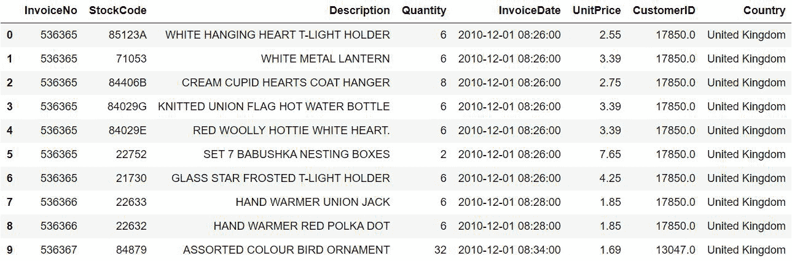
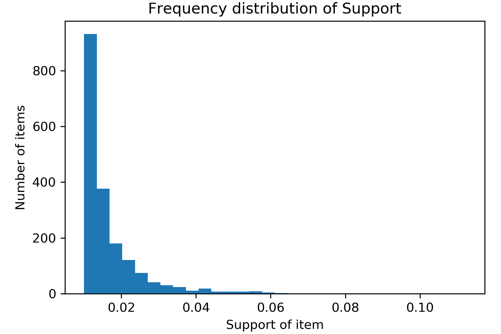

# 第九章：8\. 市场篮子分析

概述

在本章中，我们将探讨市场篮子分析，这是一种最初设计用于帮助零售商了解和改善其业务的算法。然而，正如我们将在本章中讨论的，它并不仅限于零售业。市场篮子分析揭示了顾客购买的商品之间的潜在关系。本章结束时，你应该对交易数据、定义两件商品关系的基本指标、Apriori 算法和关联规则有一个扎实的理解。

# 介绍

大多数数据科学从业者都认为，自然语言处理（包括主题建模）是数据科学的前沿领域，是一个活跃的研究方向。我们现在理解到，主题模型可以并且应该在任何潜在能够提供洞察或推动增长的文本数据中被应用，包括社交媒体分析、推荐引擎和新闻过滤等。上一章探讨了主题模型的基本特征和两种主要算法。在本章中，我们将完全改变方向。

本章带我们进入零售领域，探索一种用于分析交易数据的基础且可靠的算法。虽然这种算法可能不是最前沿的，也不在最流行的机器学习算法目录中，但它在零售领域中无处不在，并且具有不可否认的影响力。它所提供的洞察易于解读、可以立即付诸行动，并且对确定分析的下一步至关重要。如果你在零售领域工作或涉及交易数据的分析，深入学习市场篮子分析将大有裨益。市场篮子分析的重要性在于，它提供了关于为什么人们会将某些商品一起购买的洞察，以及这些商品组合是否能被利用来加速增长或增加盈利。

# 市场篮子分析

假设你为一家零售商工作，卖着数十种产品，你的老板来找你，问你以下问题：

+   哪些产品最常一起购买？

+   产品应该如何在商店中组织和定位？

+   我们如何识别最适合通过优惠券打折的产品？

你可能会完全困惑地回应，因为这些问题非常多样，看起来似乎无法用单一的算法和数据集来回答。然而，所有这些问题以及更多问题的答案都是**市场篮子分析**。市场篮子分析的基本理念是识别和量化哪些商品或商品组合是经常一起购买的，从而深入了解顾客行为和产品关系。

在我们深入分析之前，值得定义一下*市场篮子*这一术语。市场篮子是一个经济系统中的固定产品集合。固定并不一定意味着传统意义上的永久性。它意味着，直到产品从目录中移除之前，它将始终可以购买。上述定义中提到的产品可以是任何商品、服务或某一群体的元素，包括一辆自行车、给房子粉刷，或者一个网站。最后，经济系统可以是一个公司、一组活动或一个国家。市场篮子的最简单例子是一个超市，它是由一系列食品和饮品组成的系统：


](img/B15923_08_01.jpg)

图 8.1: 一个示例市场篮子

即使不使用任何模型或分析，某些产品之间的关系也是显而易见的。我们来看看肉类和蔬菜之间的关系。通常，市场篮子分析模型会返回比肉类和蔬菜更为具体的关系，但为了讨论的方便，我们将其泛化为肉类和蔬菜。好吧，肉类和蔬菜之间有关系。那又怎么样呢？嗯，我们知道这些是常见的主食，通常是一起购买的。我们可以利用这一信息，将蔬菜和肉类放置在商店的两侧，你会发现这两个物品通常就是这样被摆放的，迫使顾客走遍整个商店，这样会增加他们购买更多商品的可能性，哪怕他们原本并没有打算购买那些商品。

零售公司面临的一个挑战是如何有效地打折商品。我们再考虑一个显而易见的关系：花生酱和果冻。在美国，花生酱果冻三明治非常受欢迎，尤其是在孩子们中间。当购物篮里有花生酱时，可以假设果冻也会有很高的可能性。由于我们知道花生酱和果冻通常是一起购买的，因此同时对两者打折并没有意义。如果我们希望顾客购买这两样商品，我们只需对其中一项商品打折，因为如果我们能让顾客购买打折的商品，他们很可能也会购买另一项商品，尽管它是全价的。就像前一章中的主题模型一样，市场篮子分析的核心就是识别频繁出现的组合。下图展示了这样的组合的一个例子：


](img/B15923_08_02.jpg)

图 8.2: 市场篮子分析的可视化

在市场篮子分析中，我们寻找的是频繁出现的产品组合，而在主题模型中，我们寻找的是频繁出现的词汇组合。因此，正如它适用于主题模型一样，*聚类*这个词也可以应用于市场篮子分析。主要的区别在于，市场篮子分析中的聚类是微型的——每个聚类中只有少数几种产品——并且当涉及到计算概率度量时，聚类中项目的顺序非常重要。我们将在本章稍后深入探讨这些度量及其计算方法。

从前两个例子中可以明显看出，在市场篮子分析中，零售商可以发现顾客购买产品之间的关系——无论是显而易见的还是出乎意料的。一旦这些关系被揭示出来，就可以用来指导和改善决策过程。市场篮子分析的一个重要特点是，尽管这一分析方法最初是与零售领域相关开发、讨论和应用的，但它也可以应用于许多不同类型的商业。

执行这种分析的唯一要求是数据必须是项集合的列表。在零售情况下，这将是一个交易列表，其中每个交易都是一组已购买的产品。另一个应用的例子是分析网站流量。在网站流量分析中，我们将产品视为网站，因此列表的每个元素就是一个人在指定时间段内访问的所有网站集合。不用说，市场篮子分析的应用远远超出了最初的零售应用。

## 使用案例

传统零售应用中的三个主要使用案例是：定价优化、优惠券和折扣推荐以及店铺布局。如前所述，通过使用模型揭示的产品关联，零售商可以有策略地将产品放置在商店中，促使顾客购买更多商品，从而花费更多的钱。如果两个或更多产品之间的关联足够强，意味着在数据集中该产品组合出现得很频繁，并且组合中的单独产品很少脱离该组合出现，那么这些产品就可以放置在商店的远离位置，而不会显著影响顾客购买两种产品的几率。通过迫使顾客横跨整个商店去购买这两种产品，零售商增加了顾客注意到并购买更多产品的机会。同样，零售商也可以通过将两种关联较弱或非日常产品放置在一起，增加顾客购买这两种产品的几率。显然，商店布局受到许多因素的影响，但市场篮子分析绝对是其中的一个因素。


](img/B15923_08_03.jpg)

图 8.3：帮助优化高效和有利可图商店布局的产品关联

定价优化和优惠券及折扣推荐是同一枚硬币的两面。它们可以简单地解释为在哪里提高价格，在哪里降低价格。考虑到两个强关联的商品。这两件商品很可能会在同一交易中购买，所以增加交易的利润的一种方式就是提高其中一件商品的价格。如果这两件商品之间的关联足够强，那么价格的提升几乎没有客户不购买两者的风险。类似地，零售商可以通过折扣或优惠券鼓励客户购买一件与另一件商品弱相关的商品。

例如，零售商可以将单个客户的购买历史与基于所有交易的市场篮子分析结果进行比较，找出某些客户购买的商品与他们当前未购买的商品之间的弱关联。通过这种对比，零售商可以为这些客户提供尚未购买商品的折扣，而这些商品是模型建议与他们之前购买的商品相关的。如果你曾在交易结束时收到与收据一同打印的优惠券，那么很可能这些商品就是通过这种方式发现与刚刚完成的交易中涉及的商品相关。

市场篮子分析的一个非传统但可行的应用是增强在线广告和搜索引擎优化。假设我们能够访问个人访问过的网站列表。利用市场篮子分析，我们可以找到网站之间的关系，并利用这些关系来战略性地排列和分组搜索引擎查询结果中的网站。在很多方面，这与商店布局的应用场景相似。

对于市场篮子分析的基本概念和它的应用场景有了大致了解后，让我们深入研究这些模型所使用的数据。

## 重要的概率度量

市场篮子分析建立在多个概率度量的计算基础上。这里涉及的五个主要度量是**支持度**、**置信度**、**提升度**、**杠杆度**和**定罪度**。在深入了解交易数据和具体的市场篮子分析模型（包括**Apriori 算法**和**关联规则**）之前，我们应该花些时间使用一个小型的虚构交易集来定义和探索这些度量。我们首先构建一些数据来使用。

## 练习 8.01：创建示例交易数据

由于这是本章的第一个练习，我们先设置环境。本章将使用与*第七章*、*主题建模*中相同的环境要求。如果任何包无法加载，就像前一章那样，请通过命令行使用`pip`进行安装。我们将使用的一个库是`mlxtend`，这对您来说可能比较陌生。它是一个机器学习扩展库，包含有用的补充工具，包括集成、堆叠，当然还有市场篮子分析模型。这个练习没有实际输出，我们只是创建一个示例交易数据集，以供后续练习使用：

1.  打开一个带有 Python 3 的 Jupyter 笔记本。

1.  安装以下库：`matplotlib.pyplot`，用于绘制模型的结果；`mlxtend.frequent_patterns`，用于运行模型；`mlxtend.preprocessing`，用于编码和准备数据以供模型使用；`numpy`，用于处理数组；`pandas`，用于处理数据框。

    ```py
    import matplotlib.pyplot as plt
    import mlxtend.frequent_patterns
    import mlxtend.preprocessing
    import numpy
    import pandas
    ```

1.  创建 10 个包含杂货店商品的虚拟交易，然后打印出这些交易。数据将以列表的形式呈现，这种数据结构将在后续讨论格式化交易数据时与模型相关：

    ```py
    example = [['milk', 'bread', 'apples', 'cereal', 'jelly', \
                'cookies', 'salad', 'tomatoes'], \
               ['beer', 'milk', 'chips', 'salsa', 'grapes', \
                'wine', 'potatoes', 'eggs', 'carrots'], \
               ['diapers', 'baby formula', 'milk', 'bread', \
                'chicken', 'asparagus', 'cookies'], \
               ['milk', 'cookies', 'chicken', 'asparagus', \
                'broccoli', 'cereal', 'orange juice'], \
               ['steak', 'asparagus', 'broccoli', 'chips', \
                'salsa', 'ketchup', 'potatoes', 'salad'], \
               ['beer', 'salsa', 'asparagus', 'wine', 'cheese', \
                'crackers', 'strawberries', 'cookies'],\
               ['chocolate cake', 'strawberries', 'wine', 'cheese', \
                'beer', 'milk', 'orange juice'],\
               ['chicken', 'peas', 'broccoli', 'milk', 'bread', \
                'eggs', 'potatoes', 'ketchup', 'crackers'],\
               ['eggs', 'bread', 'cheese', 'turkey', 'salad', \
                'tomatoes', 'wine', 'steak', 'carrots'],\
               ['bread', 'milk', 'tomatoes', 'cereal', 'chicken', \
                'turkey', 'chips', 'salsa', 'diapers']]
    print(example)
    ```

    输出结果如下：

    

图 8.4：打印交易

现在我们已经创建了数据集，接下来我们将探讨几种概率度量，量化项目对之间的关系。

注意

要访问此特定部分的源代码，请参考[`packt.live/3fhf9bS`](https://packt.live/3fhf9bS)。

您还可以在[`packt.live/303vIBJ`](https://packt.live/303vIBJ)上在线运行此示例。

您必须执行整个笔记本，以便获得预期的结果。

## 支持度

**支持度**只是给定项集在数据中出现的概率，可以通过计算项集出现的交易次数，并将该次数除以总交易次数来计算。

注意

项集可以是单个项或一组项。

支持度是一个重要的度量，尽管它非常简单，因为它是用来确定项集之间关联的可信度和强度的主要度量之一。例如，可能会有两个只在一起出现的项，表明它们之间的关联非常强，但在包含 100 个交易的数据集中，仅出现两次并不令人印象深刻。因为项集只出现在 2%的交易中，而 2%在出现次数上是较小的，所以该关联不能被认为是显著的，因此可能在决策中无法使用。

请注意，由于支持度是一个概率，因此它的取值范围为 [0,1]。如果商品集是两个商品 X 和 Y，并且 N 是总交易数，则该公式具有以下形式：


图 8.5：支持度公式

在进行市场篮分析时，如果某个商品或商品组合的支持度低于预定义的阈值，那么购买该商品或商品组合的情况就足够少，无法采取行动。让我们暂时回到来自*练习 8.01*，*创建样本交易数据*的虚构数据，并将一个商品集定义为牛奶和面包。我们可以轻松地查看这 10 笔交易，并计算包含此牛奶和面包商品集的交易次数 - 共有 4 次。考虑到总共有 10 笔交易，牛奶和面包的支持度为 4 除以 10，即 0.4\. 支持度是否足够大取决于数据集本身，我们将在后面的章节中详细介绍。

## 置信度

**置信度**指标可以从条件概率的角度来理解，因为它基本上是指购买产品 A 后购买产品 B 的概率。置信度通常表示为 A  B，并且表示包含 A 的交易中也包含 B 的比例。因此，置信度是通过将完整的交易集筛选到包含 A 的交易中，然后计算这些交易中包含 B 的比例来确定的。与支持度一样，置信度是一个概率，因此其范围是 [0,1]。使用与*支持度*部分相同的变量定义，以下是置信度的公式：


图 8.6：置信度公式

为了演示置信度，我们将使用啤酒和葡萄酒这两种商品。具体来说，让我们计算啤酒  葡萄酒的置信度。首先，我们需要确定包含啤酒的交易。有三笔交易，它们是第 2、6 和 7 笔。现在，这些交易中有多少包含葡萄酒？答案是全部。因此，啤酒  葡萄酒的置信度为 1\. 每次客户购买啤酒时，他们也购买了葡萄酒。这可能是显而易见的，但对于识别可操作的关联，较高的置信度值更为有利。

## 提升度和杠杆

我们将同时讨论接下来的两个指标：提升（lift）和杠杆（leverage），因为尽管它们的计算方式不同，但都旨在回答相同的问题。像置信度一样，**提升**和**杠杆**的表示形式是 A  B。我们要回答的问题是，一个项目，比如 A，能否用来推断另一个项目，比如 B？换句话说，如果某个人购买了产品 A，我们能否在某种程度上有信心地说他们是否会购买产品 B？这些问题通过比较 A 和 B 在标准情况下（即假设 A 和 B 不独立时）与假设这两个产品独立时的支持度来回答。提升计算这两种情况的比率，因此它的取值范围是 [0, 无穷大]。当提升值为 1 时，两个产品是独立的，因此在购买产品 A 时，无法得出关于产品 B 的任何结论：


](img/B15923_08_07.jpg)

图 8.7：提升公式

杠杆计算这两种情况的差异，因此它的取值范围是 [-1, 1]。杠杆值为零的解释方式与提升值为 1 时相同：


](img/B15923_08_08.jpg)

图 8.8：杠杆公式

这些指标的值衡量了项目之间关系的程度和方向（换句话说，正向或负向）。当提升值不为 1 时，说明项目之间存在某种依赖关系。当提升值大于 1 时，购买第一个产品时，第二个产品更可能被购买。同样，当提升值小于 1 时，购买第一个产品时，第二个产品的购买可能性较小。如果提升值为 0.1，我们可以说这两个项目之间的关系是强烈的负向关系。也就是说，可以说当购买了一个产品时，购买第二个产品的机会会减少。提升值为 1 表示产品之间是独立的。在杠杆的情况下，正值表示正相关，负值表示负相关。正相关和负相关由独立点分开，正如前面所说，提升的独立点是 1，而杠杆的独立点是 0，值离这些独立点越远，关联越强。

## 确信度

接下来讨论的最后一个度量是信念（conviction），它比其他度量更不直观。信念是指在 X 和 Y 相互独立的情况下，X 发生而 Y 不发生的预期频率与错误预测频率的比率。错误预测频率定义为 1 减去 X 的置信度  Y。请记住，置信度可以定义为 *P(Y|X)*，这意味着 *1 – P(Y|X) = P(Not Y|X)*。分子也可以被理解为 *1 – P(Y|X) = P(Not Y|X)*。这两者之间的唯一区别在于，分子假设 X 和 Y 之间是独立的，而分母则没有这个假设。理想情况下，值大于 1，因为这意味着如果 X 和 Y 之间的关联是随机的（换句话说，X 和 Y 是独立的），则 X 和 Y 之间的关系会更常出现错误。重申一下，这表明 X 和 Y 之间的关联是有意义的。值为 1 时表示独立，值小于 1 则表示随机的 X 和 Y 关系比已定义的 X 和 Y 关系正确的情况更常见。此时，关系可能是反向的（换句话说，Y  X）。信念的取值范围是 [0, 无穷大]，其公式如下：


图 8.9：信念公式

让我们再次回到啤酒和葡萄酒这两个产品，但在本次解释中，我们将考虑葡萄酒  啤酒的反向关联。Support(Y)，或者在这个例子中，Support(Beer) 是 3/10，Confidence X  Y，或者在这个例子中，Confidence(Wine  Beer) 是 3/4。因此，Conviction(Wine  Beer) 是 (1-3/10) / (1-3/4) = (7/10) * (4/1)。我们可以得出结论，如果葡萄酒和啤酒是独立的，那么葡萄酒  啤酒的关联会错误出现 2.8 次。因此，之前所述的葡萄酒和啤酒之间的关联是合法的。

## 练习 8.02：计算度量

在本次练习中，我们将使用 *练习 8.01* 中的虚拟数据，即 *创建样本事务数据*，来计算之前描述的五个度量，这些度量将再次用于 Apriori 算法和关联规则的讲解。将评估这些度量的关联是 Milk  Bread：

注意

本章中的所有练习都需要在同一个 Jupyter notebook 中进行。

1.  定义并打印所有五个度量的基础频率，包括 Frequency(Milk)、Frequency(Bread) 和 Frequency(Milk, Bread)。此外，定义 `N` 为数据集中事务的总数：

    ```py
    # the number of transactions
    N = len(example)
    # the frequency of milk
    f_x = sum(['milk' in i for i in example])
    # the frequency of bread
    f_y = sum(['bread' in i for i in example]) 
    # the frequency of milk and bread
    f_x_y = sum([all(w in i for w in ['milk', 'bread']) \
                 for i in example])
    # print out the metrics computed above
    print("N = {}\n".format(N) + "Freq(x) = {}\n".format(f_x) \
          + "Freq(y) = {}\n".format(f_y) \
          + "Freq(x, y) = {}".format(f_x_y))
    ```

    输出结果如下：

    ```py
    N = 10
    Freq(x) = 7
    Freq(y) = 5
    Freq(x, y) = 4
    ```

1.  计算并打印支持度（Milk  Bread）：

    ```py
    support = f_x_y / N
    print("Support = {}".format(round(support, 4)))
    ```

    `x`到`y`的支持度为`0.4`。根据经验，如果我们处理的是完整的交易数据集，在许多情况下，这个支持度值会被认为是非常大的。

1.  计算并打印置信度（Milk  Bread）：

    ```py
    confidence = support / (f_x / N)
    print("Confidence = {}".format(round(confidence, 4)))
    ```

    `x`到`y`的置信度为`0.5714`。这意味着，给定`x`已购买，Y 被购买的概率仅略高于 50%。

1.  计算并打印提升度（Milk  Bread）：

    ```py
    lift = confidence / (f_y / N)
    print("Lift = {}".format(round(lift, 4)))
    ```

    `x`到`y`的提升度为`1.1429`。

1.  计算并打印杠杆率（Milk  Bread）：

    ```py
    leverage = support - ((f_x / N) * (f_y / N))
    print("Leverage = {}".format(round(leverage, 4)))
    ```

    `x`到`y`的杠杆率为`0.05`。提升度和杠杆率都可以用来表示`x`到`y`的关联是正向的（换句话说，`x`意味着`y`），但关联较弱。提升度和杠杆率的值分别接近 1 和 0。

1.  计算并打印确定度（Milk  Bread）：

    ```py
    conviction = (1 - (f_y / N)) / (1 - confidence)
    print("Conviction = {}".format(round(conviction, 4)))
    ```

    `1.1667`的确定度值可以解释为：如果牛奶和面包是独立的，Milk  Bread 关联会错误地出现`1.1667`倍。

    在这个练习中，我们探索了一系列旨在量化两个项目之间关系的概率度量。五个度量分别是支持度、置信度、提升度、杠杆率和确定度。我们将在后续的 Apriori 算法和关联规则中再次使用这些度量，它们是这两者的基础。

    注意

    要访问本节的源代码，请参考[`packt.live/3fhf9bS`](https://packt.live/3fhf9bS)。

    你还可以在网上运行这个示例，网址是[`packt.live/303vIBJ`](https://packt.live/303vIBJ)。

    你必须执行整个 Notebook 才能获得预期的结果。

在实际进行 Apriori 算法和关联规则学习之前，我们将探索交易数据，并加载一些零售数据，为建模做好准备。

# 交易数据的特点

在市场篮子分析中使用的数据是交易数据或任何类似交易数据的类型。最基本的形式下，交易数据包含某种交易标识符，比如发票或交易号，以及与该标识符关联的产品列表。恰好这两个基本元素就是执行市场篮子分析所需的全部。然而，交易数据很少——甚至可以说从未——以这种最基本的形式存在。交易数据通常包括定价信息、日期和时间、客户标识符等许多其他信息。以下是每个产品如何映射到多个发票的方式：


图 8.10：每个可用的产品都将映射回多个发票号码

由于交易数据的复杂性，数据清洗至关重要。在市场篮子分析的背景下，数据清洗的目标是过滤掉所有不必要的信息，包括删除数据中不相关的变量，并筛选掉有问题的交易。完成这两步清洗的技术方法因具体的交易数据文件而异。为了避免过度陷入数据清洗，本书从此开始使用 UCI 机器学习库中的一个在线零售数据集的子集，活动则会使用整个数据集。这既限制了数据清洗的讨论，也为我们提供了一个机会，讨论数据集大小变化时结果的变化。这一点非常重要，因为如果你在零售商工作并进行市场篮子分析，了解并能够清晰表达一个事实是非常关键的：随着更多数据的接收，产品之间的关系可能会发生变化，而且很可能会发生变化。在讨论此数据集所需的特定清洗过程之前，我们先来加载在线零售数据集。

注意

在接下来的所有练习和活动中，输出结果可能与下面展示的有所不同。这可能是由于以下两种原因之一：数据加载的问题（换句话说，行数据被打乱）或是`mlxtend`没有设置种子选项来确保执行结果的一致性。

## 练习 8.03：加载数据

在本练习中，我们将加载并查看一个示例的在线零售数据集。该数据集最初来自 UCI 机器学习库，可以在[`packt.live/2XeT6ft`](https://packt.live/2XeT6ft)找到。下载数据集后，请保存并记录路径。现在，让我们继续进行练习。此练习的输出是将用于未来建模练习的交易数据，以及一些探索性图形，帮助我们更好地理解我们所使用的数据。

注意

该数据集来源于[`archive.ics.uci.edu/ml/datasets/online+retail#`](http://archive.ics.uci.edu/ml/datasets/online+retail#)（UCI 机器学习库 [[`archive.ics.uci.edu/ml`](http://archive.ics.uci.edu/ml)]。加利福尼亚州尔湾：加利福尼亚大学信息与计算机科学学院）。

引用：这是从 UCI 机器学习库获取的在线零售数据集的一个子集。Daqing Chen, Sai Liang Sain 和 Kun Guo, *在线零售行业的数据挖掘*：*基于 RFM 模型的数据挖掘客户细分案例研究*，《数据库营销与客户战略管理杂志》，第 19 卷，第 3 期，页码 197-208，2012 年。

它可以从[`packt.live/2XeT6ft`](https://packt.live/2XeT6ft)下载。

执行以下步骤：

1.  使用`pandas`中的`read_excel`函数加载数据。注意，我们可以通过在`read_excel`函数中添加`header=0`来定义第一行作为列名：

    ```py
    online = pandas.read_excel(io="./Online Retail.xlsx", \
                               sheet_name="Online Retail", \
                               header=0)
    ```

    注意

    `Online Retail.xlsx`的路径应根据文件在你系统上的位置进行更改。

1.  打印出 DataFrame 的前 10 行。注意，数据包含一些与市场篮分析无关的列：

    ```py
    online.head(10)
    ```

    输出如下：

    

    图 8.11：原始在线零售数据

1.  打印出 DataFrame 中每列的数据类型。这些信息在执行特定清理任务时非常有用。列需要具备正确的数据类型，才能确保过滤和计算按预期执行：

    ```py
    online.dtypes
    ```

    输出如下：

    ```py
    InvoiceNo              object
    StockCode              object
    Description            object
    Quantity                int64
    InvoiceDate    datetime64[ns]
    UnitPrice             float64
    CustomerID            float64
    Country                object
    dtype: object
    ```

1.  获取 DataFrame 的维度，以及唯一发票号码和客户标识的数量：

    ```py
    print("Data dimension (row count, col count): {dim}" \
          .format(dim=online.shape))
    print("Count of unique invoice numbers: {cnt}" \
          .format(cnt=online.InvoiceNo.nunique()))
    print("Count of unique customer ids: {cnt}" \
          .format(cnt=online.CustomerID.nunique()))
    ```

    输出如下：

    ```py
    Data dimension (row count, col count): (541909, 8)
    Count of unique invoice numbers: 25900
    Count of unique customer ids: 4372
    ```

从前面的输出中，我们可以看到数据成功加载，并且获得了一些关键的信息，这些信息将在本章练习中进一步使用。

注意

若要访问此特定部分的源代码，请参见[`packt.live/3fhf9bS`](https://packt.live/3fhf9bS)。

你也可以在[`packt.live/303vIBJ`](https://packt.live/303vIBJ)上在线运行此示例。

你必须执行整个 Notebook，才能得到期望的结果。

## 数据清理与格式化

现在数据集已经加载完成，接下来让我们深入了解具体的数据清理过程。由于我们要将数据过滤到仅包含发票号码和商品，因此我们将数据清理重点放在这两列上。记住，市场篮分析旨在识别所有顾客在一段时间内购买的商品之间的关联。因此，数据清理的主要任务是去除包含非正数商品数量的交易。这种情况可能发生在交易作废时、商品退货时，或交易为行政操作时。这类交易将通过两种方式进行过滤。第一种方式是，取消的交易会在发票号码前加上“C”字母，因此我们会识别出这些特定的发票号码并将其从数据中删除。另一种方式是移除所有商品数量为零或负数的交易。执行完这两个步骤后，数据将被筛选至仅包含发票号码和商品描述两列，并且任何具有至少一个缺失值的两列数据行都将被删除。

数据清洗练习的下一阶段是将数据转换为适合建模的格式。在本练习和后续练习中，我们将使用完整数据的一个子集。该子集将通过取前 5,000 个唯一发票号来创建。一旦我们将数据减少到前 5,000 个唯一发票号，我们将数据结构更改为运行模型所需的结构。请注意，目前数据每行一个商品，因此多件商品的交易占用多行。所需的格式是一个列表的列表，就像本章早些时候提到的虚构数据一样。每个子列表代表一个唯一的发票号，因此在这种情况下，外部列表应包含 5,000 个子列表。子列表的元素是属于该发票号的所有商品。按照描述的清洗过程，让我们继续进行练习。

## 练习 8.04：数据清洗与格式化

在本练习中，我们将执行之前描述的清洗步骤。在处理过程中，通过打印出数据的当前状态并计算一些基本的汇总指标来监控数据的演变。请确保在加载数据的同一本笔记本中执行数据清洗：

1.  创建一个指示列，规定发票号是否以 "`C`" 开头：

    ```py
    # create new column called IsCPresent
    online['IsCPresent']  = (# looking for C in InvoiceNo column \
                             .astype(str)\
                             .apply(lambda x: 1 if x.find('C') \
                                    != -1 else 0))
    ```

1.  筛选出所有包含零个或负数商品（换句话说，商品已退还）的交易，使用第一个步骤创建的列删除所有以"`C`"开头的发票号，将数据框子集化为`InvoiceNo`和`Description`，最后删除所有含有至少一个缺失值的行。将数据框重命名为`online1`：

    ```py
    online1 = (online\
               # filter out non-positive quantity values\
               .loc[online["Quantity"] > 0]\
               # remove InvoiceNos starting with C\
               .loc[online['IsCPresent'] != 1]\
               # column filtering\
               .loc[:, ["InvoiceNo", "Description"]]\
               # dropping all rows with at least one missing value\
               .dropna())
    ```

1.  打印出过滤后的`online1`数据框的前 10 行：

    ```py
    online1.head(10)
    ```

    输出如下：

    

    图 8.12：清洗后的在线零售数据集

1.  打印出清洗后数据框的维度以及通过`nunique`函数计算的唯一发票号数量，该函数计算数据框列中唯一值的数量：

    ```py
    print("Data dimension (row count, col count): {dim}"\
          .format(dim=online1.shape)\
    )
    print("Count of unique invoice numbers: {cnt}"\
          .format(cnt=online1.InvoiceNo.nunique())\
    )
    ```

    输出如下：

    ```py
    Data dimension (row count, col count): (530693, 2)
    Count of unique invoice numbers: 20136
    ```

    请注意，我们已经删除了大约 10,000 行和 5,800 个发票号。

1.  将发票号从数据框中提取为列表。删除重复元素，创建一个唯一发票号的列表。通过打印唯一发票号列表的长度来确认该过程是否成功。与*第 4 步*的输出进行比较：

    ```py
    invoice_no_list = online1.InvoiceNo.tolist()
    invoice_no_list = list(set(invoice_no_list))
    print("Length of list of invoice numbers: {ln}" \
          .format(ln=len(invoice_no_list)))
    ```

    输出如下：

    ```py
    Length of list of invoice numbers: 20136
    ```

1.  从*第 5 步*中获取列表，仅保留前 5,000 个元素。打印出新列表的长度，以确认它确实是预期的 5,000 长度：

    ```py
    subset_invoice_no_list = invoice_no_list[0:5000]
    print("Length of subset list of invoice numbers: {ln}"\
          .format(ln=len(subset_invoice_no_list)))
    ```

    输出如下：

    ```py
    Length of subset list of invoice numbers: 5000
    ```

1.  通过只保留前一步骤中列出的发票号来过滤`online1`数据框：

    ```py
    online1 = online1.loc[online1["InvoiceNo"]\
                         .isin(subset_invoice_no_list)]
    ```

1.  打印出`online1`的前 10 行：

    ```py
    online1.head(10)
    ```

    输出如下：

    

    图 8.13：清洗后的数据集，仅包含 5000 个唯一的发票编号

1.  打印出数据框的维度以及唯一发票编号的数量，以确认过滤和清洗过程成功：

    ```py
    print("Data dimension (row count, col count): {dim}"\
          .format(dim=online1.shape))
    print("Count of unique invoice numbers: {cnt}"\
          .format(cnt=online1.InvoiceNo.nunique()))
    ```

    输出如下：

    ```py
    Data dimension (row count, col count): (133315, 2)
    Count of unique invoice numbers: 5000
    ```

1.  将`online1`中的数据转换为前述的列表形式，称为`invoice_item_list`。执行此操作的过程是遍历唯一的发票编号，在每次迭代时，将物品描述提取为一个列表，并将该列表附加到更大的`invoice_item_list`列表中。打印出列表中的前四个元素：

    ```py
    invoice_item_list = []
    for num in list(set(online1.InvoiceNo.tolist())):
        # filter dataset down to one invoice number
        tmp_df = online1.loc[online1['InvoiceNo'] == num]
        # extract item descriptions and convert to list
        tmp_items = tmp_df.Description.tolist()
        # append list invoice_item_list
        invoice_item_list.append(tmp_items)
    print(invoice_item_list[1:5])
    ```

    输出如下：

    

图 8.14：列表中的四个元素

在前述的列表中，每个子列表包含属于单个发票的所有项目。

注意

这个步骤可能需要几分钟才能完成。

在这个练习中，数据框被过滤并子集化为仅包含所需的列和相关的行。接着我们将完整的数据集缩减为前 5000 个唯一的发票编号。完整的数据集将在接下来的活动中使用。最后一步将数据框转换为列表形式，这是数据需要为编码器准备的格式，接下来会讨论该编码器。

注意

要访问该部分的源代码，请参考[`packt.live/3fhf9bS`](https://packt.live/3fhf9bS)。

你也可以在线运行这个示例，网址为[`packt.live/303vIBJ`](https://packt.live/303vIBJ)。

你必须执行整个笔记本才能获得期望的结果。

## 数据编码

虽然清洗数据至关重要，但数据准备过程最重要的部分是将数据塑造成正确的格式。在运行模型之前，目前以列表形式存在的数据需要进行编码，并重新转换为数据框。为此，我们将利用`mlxtend`库中的`preprocessing`模块中的`TransactionEncoder`。编码器的输出是一个多维数组，其中每行的长度等于交易数据集中唯一项目的总数，元素是布尔变量，表示该特定项目是否与该行表示的发票编号相关联。编码后的数据可以重新转化为数据框，其中行是发票编号，列是交易数据集中的唯一项目。

在接下来的练习中，数据编码将使用 `mlxtend` 完成，但实际上不使用任何包也可以轻松编码数据。第一步是将列表中的列表拆开，并返回一个包含原始列表中所有值的单一列表。接下来，过滤掉重复的产品，并且如果需要的话，可以按字母顺序对数据进行排序。在进行实际编码之前，我们通过让所有元素初始值为 false，行数等于数据集中的发票号数量，列名为去重后的产品名称列表，来初始化最终的 DataFrame。

在这个案例中，我们有 5,000 个交易和超过 3,100 个独特的产品。因此，DataFrame 中有超过 15,000,000 个元素。实际的编码是通过遍历每个交易和每个交易中的每个商品来完成的。如果第 *i* 个交易包含第 *j* 个产品，则将初始化数据集中的第 *i* 行和第 *j* 列的单元格值从 `false` 改为 `true`。这个双重循环效率不高，因为我们需要遍历 15,000,000 个单元格。虽然有一些方法可以提高性能，包括在 `mlxtend` 中实现的一些方法，但为了更好地理解这个过程，还是有助于通过双重循环的方法来进行操作。以下是一个示例函数，从零开始进行编码，除了 `pandas` 外不使用其他包：

```py
def manual_encoding(ll):
    # unlist the list of lists input
    # result is one list with all the elements of the sublists
    list_dup_unsort_items = \
    [element for sub in ll for element in sub]
    # two cleaning steps:
    """
    1\. remove duplicate items, only want one of each item in list
    """
    #     2\. sort items in alphabetical order
    list_nondup_sort_items = \
    sorted(list(set(list_dup_unsort_items)))
    # initialize DataFrame with all elements having False value
    # name the columns the elements of list_dup_unsort_items
    manual_df = pandas.DataFrame(False, \
                                 index=range(len(ll)), \
                                 columns=list_dup_unsort_items)
    """
    change False to True if element is 
    in individual transaction list
    """
    """
    each row is represents the contains of an individual transaction
    """
    # (sublist from the original list of lists)
    for i in range(len(ll)):
        for j in ll[i]:
            manual_df.loc[i, j] = True
    # return the True/False DataFrame
    return manual_df
```

## 练习 8.05：数据编码

在本练习中，我们将继续数据准备过程，通过使用前一练习中生成的列表列表并按照特定方式对数据进行编码，以便运行模型：

1.  初始化并拟合交易编码器。打印结果数据的一个示例：

    ```py
    online_encoder = mlxtend.preprocessing.TransactionEncoder()
    online_encoder_array = online_encoder\
                           .fit_transform(invoice_item_list)
    print(online_encoder_array)
    ```

    输出如下：

    ```py
    [[False False False ... False False False]
     [False False False ... False False False]
     [False False False ... False False False]
     ...
     [False False False ... False False False]
     [False False False ... False False False]
     [False False False ... False False False]]
    ```

    上述数组包含布尔变量，指示每个交易中是否包含某个产品。

1.  将编码后的数组重新构建为名为 `online_encoder_df` 的 DataFrame。打印该 DataFrame 的预定义子集，其中包含 `True` 和 `False` 值：

    ```py
    online_encoder_df = pandas.DataFrame(online_encoder_array, \
                                         columns=online_encoder\
                                         .columns_)
    """
    this is a very big table, so for more 
    easy viewing only a subset is printed
    """
    online_encoder_df.loc[4970:4979, \
                          online_encoder_df.columns.tolist()[0:8]]
    ```

    输出将类似于以下内容：

    

    图 8.15：重新构建为 DataFrame 的编码数据的一个小部分

1.  打印编码后的 DataFrame 的维度。它应该有 5,000 行，因为用于生成它的数据之前已被过滤为 5,000 个唯一的发票号：

    ```py
    print("Data dimension (row count, col count): {dim}"\
          .format(dim=online_encoder_df.shape))
    ```

    输出将类似于以下内容：

    ```py
    Data dimension (row count, col count): (5000, 3135)
    ```

数据现在已经为建模做好准备，我们将在 *练习 8.06* 中执行 *Apriori 算法*。

注意

要访问此特定部分的源代码，请参阅 [`packt.live/3fhf9bS`](https://packt.live/3fhf9bS)。

你也可以在 [`packt.live/303vIBJ`](https://packt.live/303vIBJ) 在线运行此示例。

你必须执行整个 Notebook 才能获得所需的结果。

## 活动 8.01：加载并准备完整的在线零售数据

在这项活动中，我们负责加载和准备大型交易数据集用于建模。最终输出将是一个适当编码的数据集，其中每个唯一交易在数据集中有一行，并且数据集中每个唯一项目有一列。如果一个项目出现在单个交易中，数据框的该元素将标记为`true`。

此活动将主要重复前几个练习，但将使用完整的在线零售数据集文件。不需要执行新的下载，但需要先前下载文件的路径。请在单独的 Jupyter 笔记本中执行此活动。

下列步骤将帮助您完成这项活动：

1.  加载在线零售数据集文件。

    注意

    此数据集来源于[`archive.ics.uci.edu/ml/datasets/online+retail#`](http://archive.ics.uci.edu/ml/datasets/online+retail#)（UCI 机器学习库[[`archive.ics.uci.edu/ml`](http://archive.ics.uci.edu/ml)]。加州尔湾：加州大学信息与计算机科学学院）。

    引用：Daqing Chen，Sai Liang Sain 和 Kun Guo，《面向在线零售行业的数据挖掘：基于数据挖掘的 RFM 模型客户分割的案例研究》，《数据库营销和客户战略管理杂志》，第 19 卷，第 3 期，第 197-208 页，2012 年。

    可以从[`packt.live/39Nx3iQ`](https://packt.live/39Nx3iQ)下载。

1.  清理和准备建模数据，包括将清理后的数据转换为列表的列表。

1.  编码数据并将其重新转换为数据框。

    注意

    此活动的解决方案可以在第 490 页找到。

输出将类似于以下内容：


图 8.16：从完整在线零售数据集构建的已清理、编码和重新转换的数据框的子集

# Apriori 算法

**Apriori** 算法是识别和量化交易数据中频繁项集的数据挖掘方法论，是关联规则学习的基础组件。将 Apriori 算法的结果扩展到关联规则学习将在下一节讨论。项集被认为频繁的阈值是模型的输入（即超参数），因此可调整。在这里频率被量化为支持度，因此输入到模型中的值是分析中所接受的最小支持度。然后，模型识别所有支持度大于或等于模型提供的最小支持度的项集。

注意

最小支持超参数不是可以通过网格搜索优化的值，因为 Apriori 算法没有评估度量标准。相反，最小支持参数是基于数据、用例和领域专业知识设置的。

Apriori 算法背后的主要思想是 Apriori 原理：任何频繁物品集的子集必须本身也是频繁的。

另一个值得提及的方面是推论：不频繁物品集的任何超集都不能是频繁的。

让我们举一些例子。如果物品集{锤子、锯子和钉子}是频繁的，那么根据 Apriori 原理，并且这应该是显而易见的，从中派生的任何更简单的物品集，例如{锤子、锯子}，也是频繁的。相反，如果同样的物品集{锤子、锯子、钉子}是不频繁的，那么通过增加复杂性，如将木材加入物品集{锤子、锯子、钉子、木材}，是不会使该物品集变得频繁的。

对于事务数据库中的每个物品集计算支持度值，并仅返回那些支持度大于或等于预设最小支持度阈值的物品集，似乎很简单，但由于所需的计算量，这并非易事。例如，假设有一个包含 10 个独特物品的物品集，这将导致 1,023 个单独的物品集需要计算支持度值。现在，试着推算我们的工作数据集，它包含 3,135 个独特物品。这将是一个庞大的物品集数量，我们需要为这些物品集计算支持度值。计算效率是一个重大问题：


图 8.17：计算效率问题的表现

前面的图示展示了物品集的构建方式以及 Apriori 原理如何显著降低计算需求（所有灰色节点都是不频繁的）。

为了解决计算需求，Apriori 算法被定义为一个自底向上的模型，包含两个步骤。这些步骤涉及通过向已有的频繁物品集添加物品来生成候选物品集，并将这些候选物品集与数据集进行测试，以确定这些候选物品集是否也频繁。对于包含不频繁物品集的物品集，不计算支持度值。该过程会重复，直到没有更多的候选物品集为止：


图 8.18：一般 Apriori 算法结构

假设最低支持度阈值为 0.4，前面的图示展示了 Apriori 算法的一般结构。

*图 8.20*包括建立物品集、计算支持度值、筛选掉不频繁的物品集、创建新物品集，并重复这一过程。

有一个明确的树状结构，作为识别候选物品集的路径。所使用的具体搜索技术是广度优先搜索，它是为遍历树状数据结构而构建的，这意味着搜索过程的每一步都集中在完全搜索树的一个层级之后再继续，而不是逐个分支地进行搜索。

算法的高层步骤旨在完成以下任务：

1.  定义频繁项集（换句话说，只选择那些支持度大于预定义阈值的项）。通常，首先选择的是单个项集。

1.  通过组合频繁项集来推导候选项集。每次只增加一个项的大小。也就是说，从包含一个项的项集开始，逐步扩展到包含两个项、三个项，以此类推。

1.  计算每个候选项集的支持度。

1.  创建一个新的频繁项集，由支持度超过指定阈值的候选项集组成。

重复*步骤 1* 到 *步骤 4*，直到没有更多的频繁项集为止；也就是说，直到我们处理完所有的组合。

Apriori 算法的伪代码如下：

```py
L1 = {frequent items}
k = 1
L = {}
while Lk.Length is not an empty set do
    Ck+1 = candidate item sets derived from Lk
    For each transaction t in the dataset do
        Increment the count of the candidates \
            in Ck+1 that appear in t
    Compute the support for the candidates in Ck+1 \
        using the appearance counts
    Lk+1 = the candidates in Ck+1 meeting \
          the minimum support requirement
    L.append(Lk)
    k = k + 1
End
Return L = all frequent item sets with corresponding support values
```

尽管遵循 Apriori 原则，该算法仍可能面临显著的计算挑战，这取决于事务数据集的大小。目前有几种公认的策略可以进一步减少计算需求。

## 计算修正

事务简化是一种减少计算负载的简单方法。注意，在生成每个候选项集之后，需要扫描整个事务数据集，以统计每个候选项集的出现次数。如果我们能缩小事务数据集的大小，数据集扫描的规模将大大减少。事务数据集的缩小是通过实现以下方式：任何在第*i*次迭代中不包含频繁项集的事务，在后续迭代中也不会包含任何频繁项集。因此，一旦每个事务不包含频繁项集，就可以从用于未来扫描的事务数据集中移除。

对事务数据集进行抽样，并在其上测试每个候选项集，是另一种减少计算需求的方法，这种方法可以避免扫描事务数据集来计算每个项集的支持度。在实现这种方法时，重要的是降低最小支持度要求，以确保不会遗漏任何应包含在最终数据中的项集。由于抽样的事务数据集会自然导致支持度值较小，因此将最小支持度保持在原始值可能会错误地删除那些应该是频繁项集的项集。

一种类似的方法是分区。在这种情况下，数据集被随机划分为多个单独的数据集，每个数据集上都会执行对每个候选项集的评估。如果一个项集在其中一个分区中是频繁的，那么它就被认为在完整事务数据集中是频繁的。每个分区依次扫描，直到确定一个项集的频率。如果频率在第一个分区中得以确定，那么我们就不需要在大多数分区上测试它，就可以为整个数据集确立该频率。像抽样一样，分区也是另一种避免在完整数据集上测试每个项集的方法，如果完整数据集非常大，测试会非常耗费计算资源。

无论是否采用这些技术，Apriori 算法的计算需求通常都会相当庞大。如现在所见，算法的核心——支持度的计算——并不像本书中讨论的其他模型那样复杂。

## 练习 8.06：执行 Apriori 算法

使用 `mlxtend` 执行 Apriori 算法变得非常简单。因此，本练习将重点关注如何处理输出数据集并解读结果。你会记得，清理并编码后的事务数据被定义为 `online_encoder_df`：

注意

在与之前所有练习相同的笔记本中执行此练习，因为我们将继续使用该笔记本中已经建立的环境、数据和结果。（因此，你应该使用包含 5,000 张发票的简化数据集的笔记本，而不是在活动中使用的完整数据集。）

1.  使用 `mlxtend` 运行 Apriori 算法，而不改变任何默认的参数值：

    ```py
    mod = mlxtend.frequent_patterns.apriori(online_encoder_df)
    mod
    ```

    输出是一个空的 DataFrame。默认的最小支持度值设置为 0.5，因此由于返回的是空的 DataFrame，我们知道所有项集的支持度都低于 0.5。根据事务的数量和可用项的多样性，没有任何项集具有超过 0.5 的支持度值并不奇怪。

1.  重新运行 Apriori 算法，但将最小支持度设置为 0.01：

    ```py
    mod_minsupport = mlxtend.frequent_patterns\
                     .apriori(online_encoder_df, \
                     min_support=0.01)
    mod_minsupport.loc[0:6]
    ```

    这个最小支持度值相当于在分析 5,000 个事务时，需要一个项集出现 50 次才会被认为是频繁的。如前所述，最小支持度可以设置为 [0,1] 范围内的任何值。没有最佳的最小支持度值；该值的设置完全是主观的。许多企业有自己特定的显著性阈值，但没有行业标准或优化此值的方法。

    输出将类似于以下内容：

    

    图 8.19：使用 mlxtend 运行的 Apriori 算法的基本输出

    请注意，输出中的项集以数字形式标识，这使得结果难以解读。

1.  重新运行 Apriori 算法，使用与 *步骤 2* 中相同的最小支持度，但这次将 `use_colnames` 设置为 `True`。这将用实际的项名替换数值标识：

    ```py
    mod_colnames_minsupport = mlxtend.frequent_patterns\
                              .apriori(online_encoder_df, \
                                       min_support=0.01, \
                                       use_colnames=True)
    mod_colnames_minsupport.loc[0:6]
    ```

    输出将类似于以下内容：

    

    图 8.20：Apriori 算法输出，实际项名代替了数值标识

    这个 DataFrame 包含了所有支持度大于指定最小支持度值的项集。也就是说，这些项集出现的频率足够高，有可能是有意义的，因此是可操作的。

1.  在 *步骤 3* 的输出中添加一个额外的列，包含项集的大小（换句话说，就是该项集中有多少项），这将有助于筛选和进一步分析：

    ```py
    mod_colnames_minsupport['length'] = \
    (mod_colnames_minsupport['itemsets'].apply(lambda x: len(x)))
    mod_colnames_minsupport.loc[0:6]
    ```

    输出将类似于以下内容：

    

    图 8.21：Apriori 算法输出加上一个额外的列，包含项集的长度

1.  查找包含 `10 COLOUR SPACEBOY PEN` 的项集的支持度：

    ```py
    mod_colnames_minsupport[mod_colnames_minsupport['itemsets'] \
                            == frozenset({'10 COLOUR SPACEBOY PEN'})]
    ```

    输出如下：

    

    图 8.22：筛选至单个项集的输出 DataFrame

    这个单行 DataFrame 给出了包含一个项的特定项集的支持度值。支持度值表示该特定项集出现在 1.78% 的交易中。

1.  返回所有支持度在 [0.02, 0.021] 范围内，且长度为 2 的项集：

    ```py
    mod_colnames_minsupport[(mod_colnames_minsupport['length'] == 2) \
                             & (mod_colnames_minsupport\
                                ['support'] >= 0.02) \
                             & (mod_colnames_minsupport\
                                ['support'] < 0.021)]
    ```

    输出将类似于以下内容：

    

    图 8.23：通过长度和支持度筛选后的 Apriori 算法输出 DataFrame

    这个 DataFrame 包含了所有支持度值在步骤开始时指定的范围内的项集（即一对一起购买的商品）。每个项集出现在 2.0% 到 2.1% 的交易中。

    注意，当按 `support` 进行筛选时，最好指定一个范围，而不是一个具体值，因为很可能会选择一个没有项集的值。前面的输出中有 32 个项集；这里只显示了一个子集。记住这些项集中的具体项，因为我们将在扩展到完整数据时使用相同的筛选条件，并且需要执行对比。

1.  绘制支持度值图。注意，该图不会包含支持度小于 `0.01` 的数据，因为该值作为 *步骤 2* 中的最小支持度值：

    ```py
    mod_colnames_minsupport.hist("support", grid=False, bins=30)
    plt.xlabel("Support of item")
    plt.ylabel("Number of items")
    plt.title("Frequency distribution of Support")
    plt.show()
    ```

    输出将类似于以下图表：

    

图 8.24：Apriori 算法返回的支持度值分布

最大支持值大约为 0.14，约为 700 次交易。看似较小的值可能并不小，因为涉及的产品数量较多。产品数量越大，支持值往往越低，因为商品组合的变动性增加。

注意

要访问此特定部分的源代码，请参考[`packt.live/3fhf9bS`](https://packt.live/3fhf9bS)。

您也可以在线运行此示例，网址为[`packt.live/303vIBJ`](https://packt.live/303vIBJ)。

您必须执行整个笔记本才能获得期望的结果。

希望您能想到更多使用这些数据的方法。在下一节中，我们将通过使用 Apriori 算法结果生成关联规则，产生更多有用的信息。

## 活动 8.02：在完整的在线零售数据集上运行 Apriori 算法

假设您为一家在线零售商工作。您获得了上个月所有的交易数据，并被告知找出至少出现在 1%交易中的商品集。一旦识别出符合条件的商品集，接下来您需要找出支持度值的分布情况。支持度值的分布将告知所有相关方，哪些商品组合是以较高概率共同购买的，并给出支持度值的均值。让我们收集所有这些信息，供公司领导层和战略人员参考。

在此活动中，您将对完整的在线零售数据集运行 Apriori 算法。

注意

该数据集来源于[`archive.ics.uci.edu/ml/datasets/online+retail#`](http://archive.ics.uci.edu/ml/datasets/online+retail#)（UCI 机器学习库 [[`archive.ics.uci.edu/ml`](http://archive.ics.uci.edu/ml)]）。加利福尼亚大学尔湾分校信息与计算机科学学院。

引用：Daqing Chen, Sai Liang Sain, 和 Kun Guo, *面向在线零售行业的数据挖掘：基于 RFM 模型的客户细分案例研究*，《数据库营销与客户战略管理期刊》，第 19 卷，第 3 期，197-208 页，2012 年。

它可以从[`packt.live/39Nx3iQ`](https://packt.live/39Nx3iQ)下载。

确保在与前一个活动相同的笔记本中完成此活动（换句话说，即使用完整数据集的笔记本，而不是使用 5,000 个发票子集的笔记本，后者是用于练习的）。

这也为您提供了一个机会，将结果与仅使用 5,000 笔交易生成的结果进行比较。这是一个有趣的活动，因为它能提供一些关于随着更多数据收集，数据变化的方式，以及在使用分区技术时支持度值变化的见解。请注意，在练习中所做的工作并不是分区技术的完美代表，因为 5,000 笔交易是随机抽取的一个样本量。

注意

本章中的所有活动需要在同一个笔记本中进行。

以下步骤将帮助你完成这个活动：

1.  在整个数据集上运行 Apriori 算法，并设置合理的参数。

1.  将结果筛选到包含`10 COLOUR SPACEBOY PEN`的项集。将支持度值与*练习 8.06*，*执行 Apriori 算法*中的支持度值进行比较。

1.  添加一列包含项集长度的列。然后筛选出那些长度为二且支持度在[0.02, 0.021]范围内的项集。将此结果与*练习 8.06*，*执行 Apriori 算法*中的结果进行比较。

1.  绘制`支持度`值。

    注意

    此活动的解决方案可以在第 492 页找到。

此活动的输出结果将类似于以下内容：



](img/B15923_08_25.jpg)

图 8.25：支持度值的分布

# 关联规则

关联规则学习是一种机器学习模型，旨在发掘交易数据中的隐藏模式（换句话说，就是描述任何零售商顾客购物习惯的关系）。关联规则的定义在本章早些时候定义并解释的常见概率度量中有所暗示。

考虑一个虚拟的频繁项集{牛奶，面包}。可以从该项集形成两个关联规则：牛奶  面包和面包  牛奶。为了简便起见，关联规则中的第一个项集称为前提，而第二个项集称为后果。一旦识别出关联规则，就可以计算所有之前讨论的度量，以评估关联规则的有效性，进而决定这些规则是否能在决策过程中加以利用。

关联规则的建立基于支持度和置信度。正如我们在上一节中讨论的，支持度用于识别哪些项集是频繁的，而置信度衡量特定规则的真实性频率。置信度通常被视为有趣性度量之一，因为它是决定是否形成关联规则的度量之一。因此，建立关联规则是一个两步过程。首先识别频繁的数据集，然后评估候选关联规则的置信度，如果该置信度值超过某个临界值，则结果为一个关联规则。

关联规则学习的一个主要问题是发现虚假关联，考虑到潜在规则的巨大数量，这些虚假关联很可能存在。所谓虚假关联是指在数据中出现惊人的频繁性，考虑到这种关联完全是偶然发生的。为了清楚地阐明这个观点，假设我们处于这样一种情况：我们有 100 条候选规则。如果我们以 0.05 的显著性水平运行独立性统计测试，我们仍然面临 5% 的机会，即当不存在关联时也发现关联的可能性。再进一步假设这 100 条候选规则都不是有效的关联。考虑到这 5% 的机会，我们仍然期望找到 5 条有效的关联规则。现在，将想象的候选规则列表扩展到数百万或数十亿，以便 5% 对应大量的关联。这个问题与几乎每个模型都面临的统计显著性和误差问题类似。值得注意的是，一些技术用于应对虚假关联问题，但它们既没有被一贯地纳入常用的关联规则库中，也不在本章的范围内。

现在让我们将我们对关联规则学习的工作知识应用到在线零售数据集中。

## 练习 8.07：推导关联规则

在这个练习中，我们将为在线零售数据集推导关联规则并探索相关指标。

注意

确保您在与之前练习相同的笔记本中完成此练习（换句话说，使用了 5,000 发票子集的笔记本，而不是来自活动的完整数据集）。

1.  使用 `mlxtend` 库为在线零售数据集推导关联规则。将置信度作为趣味度量，将最小阈值设置为 `0.6`，并返回所有指标，而不仅仅是支持度：

    ```py
    rules = mlxtend.frequent_patterns\
            .association_rules(mod_colnames_minsupport, \
            metric="confidence", \
            min_threshold=0.6,  \
            support_only=False)
    rules.loc[0:6]
    ```

    输出类似如下：

    

    图 8.26：仅使用 5,000 笔交易生成的前七行关联规则

1.  打印关联数量：

    ```py
    print("Number of Associations: {}".format(rules.shape[0]))
    ```

    找到了 `1,064` 条关联规则。

    注意

    关联规则的数量可能有所不同。

1.  尝试运行模型的另一个版本。选择任意最小阈值和任意的趣味度度量。探索返回的规则：

    ```py
    rules2 = mlxtend.frequent_patterns\
             .association_rules(mod_colnames_minsupport, \
             metric="lift", \
             min_threshold=50,\
             support_only=False)
    rules2.loc[0:6]
    ```

    输出如下：

    

    图 8.27：关联规则的前七行

1.  打印关联数量：

    ```py
    print("Number of Associations: {}".format(rules2.shape[0]))
    ```

    使用提升度度量和最小阈值 `50` 找到的关联规则数量为 `176`，这比 *步骤 2* 中的数量显著低。我们将在后续步骤中看到 `50` 是相当高的阈值，因此返回的关联规则较少并不令人意外。

1.  绘制置信度与支持度的图表，并识别数据中的特定趋势：

    ```py
    rules.plot.scatter("support", "confidence", \
                       alpha=0.5, marker="*")
    plt.xlabel("Support")
    plt.ylabel("Confidence")
    plt.title("Association Rules")
    plt.show()
    ```

    输出如下：

    

    图 8.28：置信度与支持度的关系图

    注意，既具有极高置信度又具有极高支持度的关联规则并不存在。这应该是有道理的。如果一个项集有高支持度，那么这些项很可能会与许多其他项一起出现，这使得置信度很难达到很高。

1.  看看置信度的分布：

    ```py
    rules.hist("confidence", grid=False, bins=30)
    plt.xlabel("Confidence of item")
    plt.ylabel("Number of items")
    plt.title("Frequency distribution of Confidence")
    plt.show()
    ```

    输出如下：

    

    图 8.29：置信度值的分布

1.  现在，看看提升度的分布：

    ```py
    rules.hist("lift", grid=False, bins=30)
    plt.xlabel("Lift of item")
    plt.ylabel("Number of items")
    plt.title("Frequency distribution of Lift")
    plt.show()
    ```

    输出如下：

    

    图 8.30：提升度值的分布

    如前所述，这个图表显示`50`是一个较高的阈值，因为很少有数据点超过这个值。

1.  现在，看看杠杆的分布：

    ```py
    rules.hist("leverage", grid=False, bins=30)
    plt.xlabel("Leverage of item")
    plt.ylabel("Number of items")
    plt.title("Frequency distribution of Leverage")
    plt.show()
    ```

    输出如下：

    

    图 8.31：杠杆值的分布

1.  现在，看看信念度的分布：

    ```py
    plt.hist(rules[numpy.isfinite(rules['conviction'])]\
                                  .conviction.values, bins = 30)
    plt.xlabel("Coviction of item")
    plt.ylabel("Number of items")
    plt.title("Frequency distribution of Conviction")
    plt.show()
    ```

    输出如下：

    

图 8.32：信念度值的分布

有趣的是，四个分布的图表顶部出现了不同大小的尖峰，这意味着存在一些非常强的关联规则。置信度分布随着置信值增大而逐渐减少，但在最右端，接近最大值时，分布会稍微上升。提升度分布有最明显的尖峰。信念度分布图在 50 左右显示出一个小尖峰，也许更准确地说是一个小突起。最后，杠杆分布在较高的值处并没有显示出尖峰，但它具有一个较长的尾部，包含一些非常高的杠杆值。

花些时间探索模型发现的关联规则。这些产品配对对你来说合理吗？当你改变模型参数值时，关联规则的数量发生了什么变化？你是否意识到这些规则在试图改善任何零售业务时可能产生的影响？

在之前的练习中，我们构建并绘制了关联规则。关联规则可能很难解释，并且在很大程度上依赖于用于创建它们的阈值和度量标准。上一段中的问题旨在激发您思考算法如何工作以及如何使用规则。我们逐一讨论这些问题。显然有很多规则，所以关于这些规则是否合理的问题很难一概而论。对一些规则对的抽查似乎表明这些规则是合理的。例如，三组对包括儿童杯子和碗、茶杯和盘子、以及游乐屋厨房和客厅，这些都很有道理。当度量标准和参数发生变化时，结果也会发生变化。正如几乎所有建模练习中的情况一样，理想的做法是查看在不同情况下的结果，并利用所有发现做出最佳决策。

注意

要访问此特定部分的源代码，请参考[`packt.live/3fhf9bS`](https://packt.live/3fhf9bS)。

您还可以在[`packt.live/303vIBJ`](https://packt.live/303vIBJ)在线运行此示例。

您必须执行整个笔记本才能获得所需的结果。

## 活动 8.03：在完整的在线零售数据集上查找关联规则

让我们继续进行*活动 8.02*中设定的场景，*在完整的在线零售数据集上运行 Apriori 算法*。公司领导回来说，知道每个商品集在数据集中出现的频率非常好，但我们可以采取哪些商品集进行操作呢？哪些商品集可以用于改变商店布局或调整定价？为了找到这些答案，我们推导出完整的关联规则。

在此活动中，让我们从完整的在线零售交易数据集中推导关联规则。确保在使用完整数据集的笔记本中完成此活动（换句话说，要在包含完整零售数据集的笔记本中进行，而不是使用 5,000 个发票子集的练习笔记本）。

以下步骤将帮助我们执行此活动：

1.  在完整的数据集上拟合关联规则模型。使用置信度度量标准和`0.6`的最低阈值。

1.  统计关联规则的数量。这个数量与*练习 8.07*的*步骤 1*中的数量是否不同？*推导关联规则*？

1.  绘制置信度与支持度的关系图。

1.  查看置信度、提升度、杠杆度和置信度的分布。

预期的关联规则输出如下：


图 8.33：预期的关联规则

注意

此活动的解决方案可在第 496 页找到。

在此活动结束时，您将获得提升度、杠杆度和置信度的图表。

# 总结

市场篮子分析用于分析和提取交易或类似交易的数据洞察，这些洞察可以帮助推动许多行业的发展，最著名的就是零售行业。这些决策可能包括如何布局零售空间、哪些产品进行折扣、以及如何定价产品。市场篮子分析的核心支柱之一是关联规则的建立。关联规则学习是一种机器学习方法，用于揭示个体购买产品之间的关联，这些关联足够强大，可以用来做商业决策。关联规则学习依赖于 Apriori 算法，以计算高效的方式找到频繁项集。这些模型不同于典型的机器学习模型，因为它们不进行预测，结果也无法用任何单一指标进行评估，参数值不是通过网格搜索选择的，而是根据特定问题的领域需求来选择的。尽管如此，所有机器学习模型核心的模式提取目标在这里依然是存在的。

本章结束时，你应该能够舒适地评估和解读概率性指标，能够使用`mlxtend`运行和调整 Apriori 算法及关联规则学习模型，并了解这些模型在商业中的应用。你应该知道，你所在社区的杂货店内物品的定位和定价，可能是基于你和许多其他顾客过去的购买行为来做出的选择！

在下一章，我们将探讨使用核密度估计的热点分析，核密度估计无疑是所有统计学和机器学习中最常用的算法之一。
