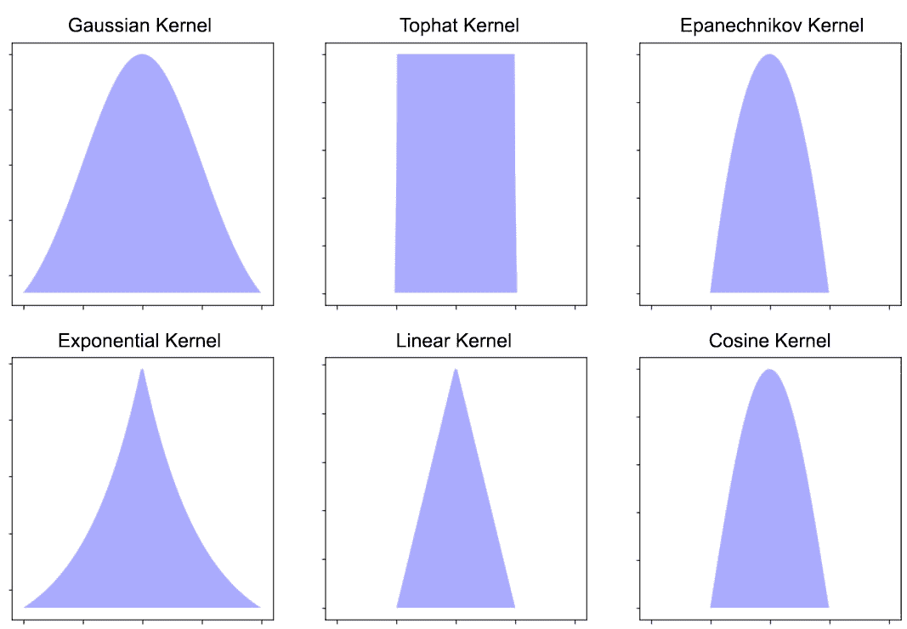
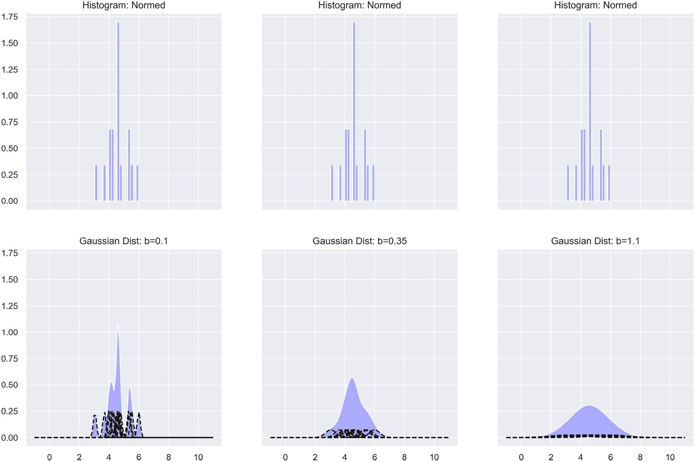

# 第十章：9. 热点分析

概述

在本章中，我们将进行热点分析，并可视化热点分析的结果。我们将使用核密度估计，这是构建分布时最常用的算法，使用的是一组观察值。我们将构建核密度估计模型，并描述概率密度函数背后的基本原理。在本章结束时，你应该能够利用 Python 库构建多维密度估计模型，并处理地理空间数据。

# 引言

在前一章中，我们探讨了市场篮子分析。市场篮子分析，正如你希望记得的那样，是一种算法，旨在理解交易数据中所有项目和项目组之间的关系。这些关系随后被用来帮助零售商优化店铺布局、更加准确地订货库存，并在不减少每笔交易中的商品数量的情况下调整价格。现在，我们将转向探索热点建模。

让我们考虑一个假设场景：一种新的疾病开始在你所在国家的多个社区中蔓延，政府正在努力寻找应对这一公共卫生紧急情况的方法。应对这一健康危机的关键是流行病学知识，包括患者所在的位置以及疾病的传播情况。定位和量化问题区域（通常称为热点）能够帮助卫生专业人员、政策制定者和应急响应团队制定最有效和高效的抗疫策略。这个场景突出了热点建模的众多应用之一。

**热点建模**是一种用于识别一个群体在地理区域分布情况的方法；例如，如何将之前提到的疾病感染者的群体分布在全国各地。创建这种分布依赖于代表性样本数据的可用性。请注意，群体可以是任何在地理学上可定义的事物，包括但不限于犯罪、感染疾病的个体、具有某些人口特征的人群或飓风等：


图 9.1：一个虚构的火灾位置数据示例，展示了一些潜在的热点区域

热点分析非常流行，这主要是因为它在可视化和解释结果方面非常容易。报纸、网站、博客和电视节目都利用热点分析来支持其中的论点、章节和话题。尽管它可能不像最流行的机器学习模型那样广为人知，但主要的热点分析算法，即**核密度估计**，无疑是最广泛使用的分析技术之一。人们甚至在日常生活中不自觉地进行核密度估计。核密度估计是一种热点分析技术，用于估计特定地理事件的真实人口分布。在深入了解算法本身之前，我们需要简要回顾一下空间统计学和概率密度函数。

# 空间统计学

**空间统计学**是统计学的一个分支，专注于分析具有空间属性的数据，包括地理或拓扑坐标。它与时间序列分析类似，目标是分析在某个维度上变化的数据。在时间序列分析中，数据变化的维度是时间，而在空间统计学中，数据则在空间维度上发生变化。空间统计学涵盖了多种技术，其中我们这里关注的技术是核密度估计。与大多数统计分析的目标相同，在空间统计学中，我们试图通过采集地理数据样本来生成洞察并做出预测。地震分析是空间统计分析常用的一个领域。通过收集地震位置数据，可以生成显示高低地震概率区域的地图，这可以帮助科学家确定未来地震可能发生的地点以及地震强度的预期。

## 概率密度函数

核密度估计采用了**概率密度函数**（**PDF**）的思想，这是统计学中的基本概念之一。概率密度函数是描述连续**随机变量**行为的函数。也就是说，它表达了随机变量取某个范围内值的可能性或概率。以美国男性身高为例，利用美国男性身高的概率密度函数，我们可以计算出某位美国男性身高在 1.9 米到 1.95 米之间的概率。


图 9.2：标准正态分布

统计学中最常见的密度函数可能是标准正态分布，它就是以零为中心，标准差为一的正态分布。

与密度函数不同，统计学家或数据科学家通常获得的是来自未知总体分布的随机收集的样本值。这时，核密度估计就派上了用场；它是一种利用样本数据估计随机变量未知概率密度函数的技术。下图表示了一个简单但更合理的分布示例，这是我们希望通过核密度估计来估计的分布。我们会选择一些观察值（样本数据点），并使用这些观察值来创建一个平滑的分布，模拟我们无法知晓的真实底层分布。


图 9.3：三种正态分布的混合

## 在商业中使用热点分析

我们已经提到了一些热点建模可以有效影响行业的方法。在报告传染病时，卫生组织和媒体公司通常会使用热点分析来传达疾病的地理分布和根据地理位置感染该疾病的可能性。通过使用热点分析，这些信息可以可靠地计算和传播。热点分析非常适用于处理健康数据，因为可视化非常直观。这意味着数据被故意或无意误解的可能性相对较低。

热点分析也可以用来预测某些事件可能发生的地理位置。越来越多的研究领域正在利用热点分析的预测能力，其中包括自然灾害和极端天气事件的研究。以地震为例，由于重大地震之间的时间间隔可能很长，而且需要跟踪和测量地震的设备相对较新，因此地震预测一直以难度大著称。

在公共政策和资源部署方面，热点分析在处理人口统计学分析时非常有影响力。确定资源（包括金钱和人员）应该部署到哪里可能是具有挑战性的；然而，鉴于资源通常是人口特定的，热点分析是一种有用的技术，因为它可以用来确定特定人口特征的分布。我们所说的人口特征是指我们可以找到高中毕业生、来自特定全球地区的移民，或者年收入达到或超过$100,000 的人的地理分布。

热点建模的应用几乎是无穷无尽的。我们这里只讨论了其中的三种主要应用。

# 核密度估计

热点分析的主要方法之一是核密度估计。核密度估计通过样本数据和两个参数（即**核函数**和**带宽值**）构建估计的密度。估计的密度像任何分布一样，本质上是随机变量行为的指导。这里的意思是，随机变量在任何特定值{x1, ….., xn}上出现的频率。在处理通常是地理数据的热点分析时，估计的密度回答了这个问题：*给定事件的特定经纬度对出现的频率如何？* 如果某个特定经纬度对{xlongitude, xlatitude}以及附近的其他经纬度对出现的频率很高，那么使用样本数据构建的估计密度将显示出上述经纬度对周围区域的出现概率较高。

核密度估计被称为一种平滑算法，因为它在样本数据上绘制了一条平滑曲线。如果数据是一个具有代表性的样本，这条曲线可以很好地估计真实的总体密度函数。换句话说，当核密度估计方法正确应用时，它旨在去除样本数据中固有的噪声，而这些噪声并不是总体特征。该模型的唯一假设是数据确实属于某种可解释且有意义的密度，从中可以获得见解并付诸实践。也就是说，存在一个真实的潜在分布。我们假设样本数据中包含数据点簇，这些簇与真实总体中的高概率区域对齐。创建真实总体密度的高质量估计的一个好处是，估计的密度可以用于从总体中采样更多的数据。

在这一简短的介绍之后，您可能会有以下两个问题：

+   什么是带宽值？

+   什么是核函数？

接下来我们将回答这两个问题。

## 带宽值

核密度估计中最关键的参数被称为**带宽值**，它对估计质量的影响不容小觑。带宽值的高阶定义是它决定了平滑的程度。如果带宽值较低，则估计的密度会呈现有限的平滑，这意味着密度将捕捉到样本数据中的所有噪声。如果带宽值较高，则估计的密度将非常平滑。过于平滑的密度会去除估计密度中的真实密度特征，而这些特征是合法的，而不是噪声。

用更统计学的术语来说，带宽参数控制着偏差-方差的权衡。也就是说，低带宽值会导致高方差，因为密度对样本数据的方差非常敏感。低带宽值会限制模型适应和解决样本数据中不存在于总体中的空隙的能力。使用低带宽值估计的密度往往会过度拟合数据（这也称为欠平滑的密度）。当使用高带宽值时，结果密度会发生欠拟合，估计密度的偏差较大（这也称为过度平滑的密度）。

注意

在所有随后的练习和活动中，输出可能会略有不同于下文所示的结果。原因如下：数据样本的差异可能会导致输出略有不同，而且`sklearn`和`seaborn`库中有一些非确定性元素，可能导致结果在每次运行时有所不同。

## 练习 9.01：带宽值的影响

在本练习中，我们将使用九个不同的带宽值拟合九个不同的模型，来处理本练习中创建的样本数据。此处的目标是巩固我们对带宽参数影响的理解，并明确指出，如果要得到准确的估计密度，带宽值需要谨慎选择。请注意，寻找最佳带宽值将是下一节的主题。所有练习都将在使用 Python 3 的 Jupyter 笔记本中完成；请确保通过`pip`安装所有必要的包。安装`mpl_toolkits`中的`basemap`模块最简单的方法是使用*Anaconda*。有关下载和安装*Anaconda*的说明，请参见本书开头：

1.  加载本章所需的所有库。`basemap`库用于创建涉及位置数据的图形。其他所有库都在本书的前面部分使用过。

    ```py
    get_ipython().run_line_magic('matplotlib', 'inline')
    import matplotlib.pyplot as plt
    import mpl_toolkits.basemap
    import numpy
    import pandas
    import scipy.stats
    import seaborn
    import sklearn.model_selection
    import sklearn.neighbors
    seaborn.set()
    ```

1.  通过混合三个正态分布来创建一些样本数据（`vals`）。除了样本数据外，还需要定义真实的密度曲线（`true_density`）和数据将被绘制的范围（`x_vec`）：

    ```py
    x_vec = numpy.linspace(-30, 30, 10000)[:, numpy.newaxis]
    numpy.random.seed(42)
    vals = numpy.concatenate(( \
           numpy.random.normal(loc=1, scale=2.5, size=500), \
           numpy.random.normal(loc=10, scale=4, size=500), \
           numpy.random.normal(loc=-12, scale=5, size=500) \
    ))[:, numpy.newaxis]
    true_density = ((1 / 3) * scipy.stats.norm(1, 2.5)\
                              .pdf(x_vec[:, 0]) \
                    + (1 / 3) * scipy.stats.norm(10, 4)\
                                .pdf(x_vec[:, 0]) \
                    + (1 / 3) * scipy.stats.norm(-12, 5)\
                                .pdf(x_vec[:, 0]))
    ```

1.  定义一个元组列表，用于指导多图形的创建。每个元组包含特定子图的行和列索引，以及用于在该子图中创建估计密度的带宽值。请注意，为了本练习的方便，带宽值是随机选择的，但实际上选择最佳带宽值是有一定策略的。我们将在下一节深入探讨这一点。

    ```py
    position_bandwidth_vec = [(0, 0, 0.1), (0, 1, 0.4), (0, 2, 0.7), \
                              (1, 0, 1.0), (1, 1, 1.3), (1, 2, 1.6), \
                              (2, 0, 1.9), (2, 1, 2.5), (2, 2, 5.0)]
    ```

1.  创建九个图，每个图使用不同的带宽值。第一个图（索引为(0, 0)）将使用最低的带宽值，最后一个图（索引为(2, 2)）将使用最高的带宽值。这些值不是绝对的最小或最大带宽值，而只是前一步骤中定义的列表中的最小值和最大值：

    ```py
    fig, ax = plt.subplots(3, 3, sharex=True, \
                           sharey=True, figsize=(12, 9))
    fig.suptitle('The Effect of the Bandwidth Value', fontsize=16)
    for r, c, b in position_bandwidth_vec:
        kde = sklearn.neighbors.KernelDensity(bandwidth=b).fit(vals)
        log_density = kde.score_samples(x_vec)
        ax[r, c].hist(vals, bins=50, density=True, alpha=0.5)
        ax[r, c].plot(x_vec[:, 0], numpy.exp(log_density), \
                      '-', linewidth=2)
        ax[r, c].set_title('Bandwidth = {}'.format(b))
    plt.show()
    ```

    输出结果如下：

    

图 9.4：一个 3 x 3 矩阵的子图

请注意，在第九个子图中（带宽为 5 的地方），估计的密度曲线明显不足以拟合数据。随着带宽值的增加，估计的密度变得更加平滑，直到它明显不足以拟合数据。从视觉效果来看，最优带宽值可能约为`1.6`。

注意

要访问该特定部分的源代码，请参考 [`packt.live/2UOHbTZ`](https://packt.live/2UOHbTZ)。

您还可以在网上运行此示例，网址为 [`packt.live/38DbmTo`](https://packt.live/38DbmTo)。

您必须执行整个 Notebook 才能获得预期的结果。

下一步是设计一个算法来识别最优带宽值，以使估计的密度最合理，从而是最可靠且可操作的。

## 选择最优带宽

如前面练习中提到的，我们可以通过简单地通过视觉比较几种密度来接近选择最优带宽。然而，这既不是选择参数值的最有效方法，也不是最可靠的方法。

优化带宽值有两种标准方法，这两种方法都会出现在未来的练习和活动中。第一种方法是插件法（或公式化方法），它是确定性的，并且没有在样本数据上进行优化。插件法通常实现速度更快，编码更简单，解释也更容易。然而，这些方法有一个大缺点，那就是与在样本数据上进行优化的方法相比，它们的准确性往往较低。这些方法还存在分布假设。最流行的插件方法是 Silverman 法则和 Scott 法则。详细解释这些法则超出了本文的范围，并且对于完全理解核密度估计并非必需，且需要一些复杂的数学工作，因此我们将跳过进一步的探讨。不过，如果有兴趣，公开的许多优秀资源都详细解释了这些法则，并且有不同深度的说明。默认情况下，`seaborn`包（将在未来的练习中使用）使用 Scott 法则作为确定带宽值的方法。

寻找最优带宽值的第二种方法，也是更强健的方法，是通过搜索一个预定义的带宽值网格。网格搜索是一种经验性方法，在机器学习和预测建模中经常用来优化模型的超参数。该过程从定义带宽网格开始，带宽网格就是要评估的一系列带宽值。带宽网格是随机选择的。使用网格中的每个带宽值来创建估计密度；然后，使用伪对数似然值来评分估计密度。最优带宽值是具有最大伪对数似然值的那个带宽值。可以把伪对数似然值看作是获得数据点的概率，数据点出现在我们希望的地方，而没有数据点出现的地方的概率。理想情况下，这两个概率应该都很大。考虑一种情况，即获得数据点的概率很低，这意味着样本中的数据点可能是异常的，因为在真实分布下，我们不会期望在某个地方获得数据点，且其高概率值不成立。伪对数似然值是一种评估指标，其作用与分类问题中的准确度分数和回归问题中的均方根误差相同。

现在，让我们实现网格搜索方法来优化带宽值。

## 练习 9.02：使用网格搜索选择最优带宽

在本练习中，我们将为*练习 9.01*中的样本数据创建一个估计的密度，*带宽值的影响*，并通过网格搜索和交叉验证确定一个最优带宽值。为了执行网格搜索和交叉验证，我们将使用`sklearn`，这是我们在本书中一直使用的工具。

注意

本练习是*练习 9.01*，*带宽值的影响*的延续，因为我们使用的是相同的样本数据，并继续探讨带宽值的影响。

1.  定义带宽值网格和网格搜索交叉验证模型。理想情况下，应该使用留一交叉验证方法，但为了使模型在合理的时间内运行，我们将使用 10 折交叉验证。将模型拟合到样本数据，如下所示：

    ```py
    # define a grid of 100 possible bandwidth values
    bandwidths = 10 ** numpy.linspace(-1, 1, 100)
    # define the grid search cross validation model
    grid = sklearn.model_selection.GridSearchCV\
           (estimator=sklearn.neighbors.KernelDensity(),\
            param_grid={"bandwidth": bandwidths},\
            cv=10)
    # run the model on the previously defined data
    grid.fit(vals)
    ```

    输出结果如下：

    

    图 9.5：交叉验证模型的输出

1.  从模型中提取最优带宽值。`best_params_`函数从模型对象中提取网格中表现最好的参数。

    ```py
    best_bandwidth = grid.best_params_["bandwidth"]
    print("Best Bandwidth Value: {}" \
          .format(best_bandwidth))
    ```

    最优带宽值应大约为`1.6`。我们可以将最优带宽值解释为产生最大伪对数似然值的带宽值。请注意，根据网格中包含的值，最优带宽值可能会发生变化。

1.  绘制样本数据的直方图，并叠加真实密度和估计密度。在这种情况下，估计的密度将是最佳估计密度：

    ```py
    fig, ax = plt.subplots(figsize=(14, 10))
    ax.hist(vals, bins=50, density=True, alpha=0.5, \
            label='Sampled Values')
    ax.fill(x_vec[:, 0], true_density,\
            fc='black', alpha=0.3, label='True Distribution')
    log_density = numpy.exp(grid.best_estimator_\
                            .score_samples(x_vec))
    ax.plot(x_vec[:, 0], log_density,\
            '-', linewidth=2, label='Kernel = Gaussian')
    ax.legend(loc='upper right')
    plt.show()
    ```

    输出结果如下：

    

    ](img/B15923_09_06.jpg)

图 9.6：随机样本的直方图

在这张直方图中，真实密度和最佳估计密度重叠显示。估计密度没有明显的过拟合或欠拟合，且能够很好地捕捉到三个聚类。可以说，它可能更好地贴合真实密度，但这仅仅是由模型根据给定的数据集生成的估计密度。

注意

若要访问此特定部分的源代码，请参考 [`packt.live/2UOHbTZ`](https://packt.live/2UOHbTZ)。

你还可以在线运行这个示例，地址是 [`packt.live/38DbmTo`](https://packt.live/38DbmTo)。

你必须执行整个 Notebook 才能得到预期的结果。

现在让我们进入第二个问题：什么是核函数，它在其中扮演什么角色？

## 核函数

另一个需要设置的参数是核函数。核函数是一个非负函数，它控制密度的形状。像主题模型一样，我们在一个非负环境中工作，因为出现负的似然性或概率是没有意义的。核函数通过以系统的方式加权数据点来控制估计密度的形状。这种加权的系统方法相对简单；与许多其他数据点接近的数据点会被加权，而那些孤立或远离其他数据点的数据点会被减权。被加权的数据点在最终估计的密度中将对应于较高的似然点。

可以使用许多函数作为核函数，但六种常见的选择是高斯（Gaussian）、顶帽（Tophat）、埃潘尼切科夫（Epanechnikov）、指数（Exponential）、线性（Linear）和余弦（Cosine）。这些函数各自代表了不同的分布形状。请注意，在每个公式中，参数 *h* 代表带宽值：

+   高斯：每个观察值具有钟形权重。

    ](img/B15923_09_07.jpg)

图 9.7：高斯核函数的公式

+   顶帽：每个观察值具有矩形的权重。

    ](img/B15923_09_08.jpg)

图 9.8：顶帽核函数的公式

+   埃潘尼切科夫：每个观察值具有丘状的权重。


](img/B15923_09_09.jpg)

图 9.9：埃潘尼切科夫核函数的公式

+   指数：每个观察值具有三角形的权重，三角形的边是凹形的。


](img/B15923_09_10.jpg)

图 9.10：指数核函数的公式

+   线性：每个观察值具有三角形的权重。


](img/B15923_09_11.jpg)

图 9.11：线性核的公式

+   余弦核：每个观测值都有一个圆顶形的权重。这个圆顶形比埃潘尼科夫核在顶部更窄。


图 9.12：余弦核的公式

以下是六个核函数的分布形状：



图 9.13：六个核函数的整体形状

核函数的选择并非完全无关紧要，但它肯定不像带宽值的选择那么重要。一个合理的做法是，对于所有密度估计问题，都使用高斯核，这也是我们在接下来的练习和活动中所做的。

## 练习 9.03：核函数的影响

我们将演示核函数的选择如何影响密度估计的质量。就像我们在探索带宽值效应时做的那样，我们将保持其他所有参数不变，使用在前两次练习中生成的相同数据，并使用之前指定的六个核函数运行六个不同的核密度估计模型。六个估计的密度之间应该能看到明显的差异，但这些差异应该比使用不同带宽值估计的密度之间的差异稍微小一些。请注意，本练习应在与之前练习相同的 Notebook 中执行。

1.  定义一个元组列表，格式与之前定义的相同。每个元组包含子图的行和列索引，以及用于创建密度估计的核函数：

    ```py
    position_kernel_vec = [(0, 0, 'gaussian'), (0, 1, 'tophat'), \
                           (1, 0, 'epanechnikov'), \
                           (1, 1, 'exponential'), \
                           (2, 0, 'linear'), (2, 1, 'cosine'),]
    ```

1.  使用不同的核函数拟合并绘制六个核密度估计模型。为了真正理解核函数之间的差异，我们将带宽值设置为在*练习 9.02*中找到的最优带宽值，即*使用网格搜索选择最优带宽*，并且不调整它：

    ```py
    fig, ax = plt.subplots(3, 2, sharex=True, \
                           sharey=True, figsize=(12, 9))
    fig.suptitle('The Effect of Different Kernels', fontsize=16)
    for r, c, k in position_kernel_vec:
        kde = sklearn.neighbors.KernelDensity(\
              kernel=k, bandwidth=best_bandwidth).fit(vals)
        log_density = kde.score_samples(x_vec)
        ax[r, c].hist(vals, bins=50, density=True, alpha=0.5)
        ax[r, c].plot(x_vec[:, 0], numpy.exp(log_density), \
                      '-', linewidth=2)
        ax[r, c].set_title('Kernel = {}'.format(k.capitalize()))
    plt.show()
    ```

    输出如下：

    

图 9.14：一个 3 x 2 的子图矩阵

在六个核函数中，高斯核生成了最合理的估计密度。除此之外，注意到不同核函数估计的密度之间的差异小于不同带宽值估计的密度之间的差异。这印证了之前的观点，即带宽值是更重要的参数，应在模型构建过程中作为重点。

注意

要访问此特定部分的源代码，请参阅[`packt.live/2UOHbTZ`](https://packt.live/2UOHbTZ)。

您也可以在[`packt.live/38DbmTo`](https://packt.live/38DbmTo)在线运行此示例。

必须执行整个 Notebook 才能获得所需的结果。

在我们大致理解的基础上，让我们讨论核密度估计的推导过程。

## 核密度估计推导

我们跳过正式的数学推导，转而采用直观的流行推导方法。核密度估计将每个样本数据点转化为其自身的分布，其宽度由带宽值控制。然后，将这些个体分布相加，生成所需的密度估计。这一概念相对容易展示；然而，在接下来的练习中，我们在进行演示之前，先尝试从抽象的角度进行思考。对于包含许多样本数据点的地理区域，个体密度将会重叠，并通过相加这些密度，产生在估计密度中更高的可能性点。类似地，对于包含少量或没有样本数据点的地理区域，个体密度将不会重叠，因此在估计密度中会对应较低的可能性点。

## 练习 9.04：模拟核密度估计的推导

这里的目标是展示将个体分布相加，创建随机变量的整体估计密度的概念。我们将通过从一个样本数据点开始，逐步建立这一概念，并逐渐增加样本数据点的数量。此外，还会应用不同的带宽值，因此我们对带宽值对这些个体密度影响的理解将进一步巩固。请注意，本练习应与所有其他练习一起在同一个笔记本中完成。

1.  D 热点分析定义一个函数，用于评估正态分布。输入值包括表示随机变量`X`范围的网格、采样数据点`m`和带宽`b`：

    ```py
    def eval_gaussian(x, m, b):
        numerator = numpy.exp(-numpy.power(x - m, 2) \
                              / (2 * numpy.power(b, 2)))
        denominator = b * numpy.sqrt(2 * numpy.pi)
        return numerator / denominator
    ```

1.  将一个样本数据点绘制为直方图，并显示其在不同带宽值下的个体密度：

    ```py
    m = numpy.array([5.1])
    b_vec = [0.1, 0.35, 0.8]
    x_vec = numpy.linspace(1, 10, 100)[:, None]
    figOne, ax = plt.subplots(2, 3, sharex=True, \
                              sharey=True, figsize=(15, 10))
    for i, b in enumerate(b_vec):
        ax[0, i].hist(m[:], bins=1, fc='#AAAAFF', density=True)
        ax[0, i].set_title("Histogram: Normed")
        evaluation = eval_gaussian(x_vec, m=m[0], b=b)
        ax[1, i].fill(x_vec, evaluation, '-k', fc='#AAAAFF')
        ax[1, i].set_title("Gaussian Dist: b={}".format(b))
    plt.show()
    ```

    输出结果如下：

    

    图 9.15：显示一个数据点及其在不同带宽值下的个体密度

    在这里，我们可以看到已经建立的结论：较低的带宽值会产生非常狭窄的密度，往往会导致过拟合数据。

1.  重复执行*步骤 2*中的工作，但这次将数据点规模扩展到 16 个：

    ```py
    m = numpy.random.normal(4.7, 0.88, 16)
    n = len(m)
    b_vec = [0.1, 0.35, 1.1]
    x_vec = numpy.linspace(-1, 11, 100)[:, None]
    figMulti, ax = plt.subplots(2, 3, sharex=True, \
                                sharey=True, figsize=(15, 10))
    for i, b in enumerate(b_vec):
        ax[0, i].hist(m[:], bins=n, fc='#AAAAFF', density=True)
        ax[0, i].set_title("Histogram: Normed")
        sum_evaluation = numpy.zeros(len(x_vec))
        for j in range(n):
            evaluation = eval_gaussian(x_vec, m=m[j], b=b) / n
            sum_evaluation += evaluation[:, 0]
            ax[1, i].plot(x_vec, evaluation, \
                         '-k', linestyle="dashed")
        ax[1, i].fill(x_vec, sum_evaluation, '-k', fc='#AAAAFF')
        ax[1, i].set_title("Gaussian Dist: b={}".format(b))
    plt.show()
    ```

    输出结果如下：

    

图 9.16：绘制数据点

前面的图像展示了 16 个数据点，它们在不同带宽值下的个体密度，以及它们个体密度的总和。

再次，毫不意外，利用最小带宽值的图表展示了一个过度拟合的估计密度。也就是说，估计的密度捕捉了样本数据中的所有噪声。在这三种密度中，第二种密度（带宽值设置为`0.35`）是最合理的。

注意

若要访问该特定部分的源代码，请参考[`packt.live/2UOHbTZ`](https://packt.live/2UOHbTZ)。

你也可以在[`packt.live/38DbmTo`](https://packt.live/38DbmTo)上在线运行此示例。

您必须执行整个 Notebook 才能获得所需的结果。

## 活动 9.01：在一维中估计密度

在本活动中，我们将生成一些伪造的样本数据，并使用核密度估计估算密度函数。带宽值将通过网格搜索交叉验证进行优化。目标是通过在简单的一维情况下运行模型来巩固我们对这种有用方法的理解。我们将再次利用 Jupyter 笔记本来完成工作。

假设我们将创建的样本数据描述的是美国某州的房屋价格。暂时忽略以下样本数据中的数值。问题是，*房价的分布是什么样的？我们能否提取出某个特定价格区间内房屋的概率？* 这些问题以及更多问题可以通过核密度估计来解答。

以下是完成活动的步骤：

1.  打开一个新的笔记本并安装所有必要的库。

1.  从标准正态分布中抽取 1,000 个数据点。在样本的最后 625 个值上加上 3.5（即索引在 375 到 1,000 之间）。使用`numpy.random.RandomState`设置随机状态为 100，以保证相同的样本值，然后使用`rand.randn(1000)`调用随机生成数据点。

1.  将 1,000 个数据点样本数据绘制为直方图，并在其下方添加散点图。

1.  定义一个带宽值网格。然后，定义并拟合一个网格搜索交叉验证算法。

1.  提取最佳带宽值。

1.  从*步骤 3*重新绘制直方图并叠加估计的密度。

输出将如下所示：


图 9.17：叠加最佳估计密度的随机样本直方图

注

本活动的解决方案可以在第 501 页找到。

# 热点分析

一开始，热点是数据点高度集中的区域，例如犯罪率异常高的特定社区，或受异常数量的龙卷风影响的国家大片区域。热点分析是通过抽样数据，在一个人群中寻找这些可能存在的热点。这个过程通常通过利用核密度估计来完成。

热点分析可以分为四个高层次的步骤：

1.  **收集数据**：数据应包括物体或事件的位置。正如我们简要提到的，运行并实现可操作结果所需的数据量是相对灵活的。最佳状态是拥有一个能代表总体的样本数据集。

1.  **识别基础地图**：下一步是识别哪种基础地图最适合项目的分析和展示需求。在这张基础地图上，模型的结果将被叠加，以便能更清晰地表达热点的位置，使用更易于理解的术语，如城市、邻里或区域。

1.  **执行模型**：在这一步骤中，你需要选择并执行一种或多种空间模式提取方法，以识别热点。对我们来说，这个方法将是——毫不奇怪——核密度估计。

1.  **创建可视化**：热点地图通过将模型结果叠加在基础地图上生成，以支持未解决的业务问题。

从可用性角度来看，热点分析的主要问题之一是，热点的统计显著性并不容易确定。大多数关于统计显著性的问题围绕热点的存在展开。也就是说，发生概率的波动是否真的构成了统计上显著的波动？需要注意的是，进行核密度估计并不需要统计显著性，我们在接下来的工作中将完全不涉及显著性。

虽然“热点”一词传统上用于描述位置数据点的聚集，但它并不限于位置数据。任何数据类型都可能有热点，不管它们是否被称为热点。在接下来的练习中，我们将对一些非位置数据进行建模，以寻找热点，这些热点将是特征空间中具有高或低发生概率的区域。

## 练习 9.05：加载数据并使用 Seaborn 建模

在本练习中，我们将使用 `seaborn` 库来拟合并可视化核密度估计模型。这将应用于位置数据和非位置数据。在进行建模之前，我们需要加载数据，该数据是来自 `sklearn` 的加州住房数据集，并以 CSV 格式提供。文件需要从 GitHub 仓库下载并保存在本地计算机上。该数据集取自 1990 年的美国人口普查，描述了当时加州的住房情况。每一行数据描述一个普查区块组。普查区块组的定义对于本练习并不重要，因此我们将在此跳过定义，专注于更多的实践编码和建模。需要强调的是，所有变量都已经按普查区块进行了汇总。例如，`MedInc` 是每个普查区块中家庭的中位数收入。有关此数据集的更多信息，请访问 [`scikit-learn.org/stable/datasets/index.html#california-housing-dataset`](https://scikit-learn.org/stable/datasets/index.html#california-housing-dataset)。

1.  使用 `california_housing.csv` 加载加州住房数据集。打印数据框的前五行：

    ```py
    df = pandas.read_csv('./california_housing.csv', header=0)
    df.head()
    ```

    注意

    文件的路径取决于文件在系统中的位置。

    输出如下：

    

    图 9.18：来自 sklearn 的加利福尼亚州房屋数据集的前五行

1.  根据`HouseAge`特征过滤数据框，该特征是每个普查区块的房屋中位数年龄。仅保留`HouseAge`小于或等于 15 的行，并将数据框命名为`dfLess15`。打印数据框的前五行，然后将数据框缩减为仅包含经度和纬度特征：

    ```py
    dfLess15 = df[df['HouseAge'] <= 15.0]
    dfLess15 = dfLess15[['Latitude', 'Longitude']]
    dfLess15.head()
    ```

    输出如下：

    

    图 9.19：过滤后的数据集前五行

1.  使用`seaborn`对基于经度和纬度数据点构建的核密度估计模型进行拟合和可视化。该模型有四个输入参数：需要估计密度的两个列的名称（即经度和纬度）、这些列所属的数据框，以及密度估计方法（即`kde`或核密度估计）：

    ```py
    seaborn.jointplot("Longitude", "Latitude", dfLess15, kind="kde")
    ```

    输出如下：

    

    图 9.20：联合图

    注意

    图表可能有所不同，因为每次的估计都不完全相同。

    这个联合图包含了二维估计密度以及`dfLess15`数据集的边际密度。

    如果我们将这些结果叠加到加利福尼亚州的地图上，我们会看到热点区域集中在南加利福尼亚，包括洛杉矶和圣地亚哥，湾区，包括旧金山，以及在一定程度上被称为中央山谷的区域。这个`seaborn`图形的一个优点是，我们可以获得二维的估计密度图，并且分别展示了经度和纬度的边际密度。

1.  基于`HouseAge`特征创建另一个过滤后的数据框；这次仅保留`HouseAge`大于 40 的行，并将数据框命名为`dfMore40`。此外，移除除经度和纬度之外的所有列。然后，打印数据框的前五行：

    ```py
    dfMore40 = df[df['HouseAge'] > 40.0]
    dfMore40 = dfMore40[['Latitude', 'Longitude']]
    dfMore40.head()
    ```

    输出如下：

    

    图 9.21：过滤后的数据集顶部

1.  重复*步骤 3*中的过程，但使用这个新的过滤后的数据框：

    ```py
    seaborn.jointplot("Longitude", "Latitude", dfMore40, kind="kde")
    ```

    输出如下：

    

    图 9.22：联合图

    这个联合图包含了二维估计密度以及`dfMore40`数据集的边际密度。

    这个估计密度要紧凑得多，因为数据几乎完全聚集在两个区域。这些区域分别是洛杉矶和湾区。与*步骤 3*中的图表对比，我们注意到房屋开发已经扩展到整个州。此外，新的住房开发在更多的普查区块中出现的频率也显著提高。

1.  我们再创建另一个过滤后的数据框。这次仅保留`HouseAge`小于或等于五的行，并将数据框命名为`dfLess5`。绘制`Population`和`MedInc`的散点图，如下所示：

    ```py
    dfLess5 = df[df['HouseAge'] <= 5]
    x_vals = dfLess5.Population.values
    y_vals = dfLess5.MedInc.values
    fig = plt.figure(figsize=(10, 10))
    plt.scatter(x_vals, y_vals, c='black')
    plt.xlabel('Population', fontsize=18)
    plt.ylabel('Median Income', fontsize=16)
    ```

    输出如下：

    

    图 9.23：中位收入与人口的散点图

    这是`HouseAge`列中值小于或等于五的中位收入与人口的散点图。

1.  使用另一个`seaborn`函数拟合核密度估计模型。使用 Scott 法则找到最佳带宽。重新绘制直方图，并叠加估算的密度，如下所示：

    ```py
    fig = plt.figure(figsize=(10, 10))
    ax = seaborn.kdeplot(x_vals, \
                         y_vals,\
                         kernel='gau',\
                         cmap='Blues', \
                         shade=True, \
                         shade_lowest=False)
    plt.scatter(x_vals, y_vals, c='black', alpha=0.05)
    plt.xlabel('Population', fontsize=18)
    plt.ylabel('Median Income', fontsize=18)
    plt.title('Density Estimation With Scatterplot Overlay', size=18)
    ```

    输出如下：

    

图 9.24：与步骤 6 中创建的相同散点图，叠加了估算的密度

在这里，估算的密度显示，人口较少的普查区块相比于拥有较高中位收入的区块，更有可能拥有较低的中位收入。这个步骤的重点是展示如何在非位置数据上使用核密度估计。像这样的图通常被称为等高线图。

注意

要访问该部分的源代码，请参阅[`packt.live/2UOHbTZ`](https://packt.live/2UOHbTZ)。

你还可以在[`packt.live/38DbmTo`](https://packt.live/38DbmTo)在线运行此示例。

你必须执行整个笔记本才能获得预期的结果。

在展示热点分析结果时，通常需要涉及某种类型的地图，因为热点分析通常是在位置数据上进行的。获取可以叠加估算密度的地图并不是一件容易的事。由于版权问题，我们将使用非常基础的地图，称为底图，在其上叠加我们的估算密度。将留给你自己扩展本章所学的知识，去处理更复杂和更详细的地图。地图环境也可能很复杂，下载和安装起来很耗时。

## 练习 9.06：与底图一起工作

本练习使用了`mpl_toolkits`的`basemap`模块。`basemap`是一个地图绘制库，可以用来创建基础地图或地理区域的轮廓。这些地图可以叠加核密度估计的结果，从而清晰地展示热点位置。

首先，在 Jupyter 笔记本中运行`import mpl_toolkits.basemap`检查`basemap`是否已安装。如果没有错误加载，说明你已经准备好了，不需要采取任何进一步的操作。如果调用失败，请通过运行`python3 -m pip install basemap`使用`pip`安装`basemap`。重新启动任何已打开的笔记本后，你应该可以正常使用。请注意，`pip`安装仅在已安装 Anaconda 的情况下有效。

本练习的目标是重新建模并重新绘制*练习 9.05*中的位置数据，*使用 Seaborn 加载数据与建模*，使用`sklearn`的核密度估计功能和`basemap`的映射功能。从过滤后的数据框`dfLess15`中提取经度和纬度值，按步骤进行操作。请注意，本练习应与其他所有练习在同一个笔记本中完成。

1.  构建位置网格，以便在其上铺设估计的密度。位置网格是*练习 9.01*中定义随机变量范围的一维向量的二维位置等效物：

    ```py
    xgrid15 = numpy.sort(list(dfLess15['Longitude']))
    ygrid15 = numpy.sort(list(dfLess15['Latitude']))
    x15, y15 = numpy.meshgrid(xgrid15, ygrid15)
    print("X Grid Component:\n{}\n".format(x15))
    print("Y Grid Component:\n{}\n".format(y15))
    xy15 = numpy.vstack([y15.ravel(), x15.ravel()]).T 
    ```

    输出结果如下：

    

    图 9.25：表示 dfLess15 数据集的网格的 x 和 y 分量

1.  定义并拟合一个核密度估计模型。将带宽值设置为 0.05。然后为位置网格上的每个点创建可能性值：

    ```py
    kde15 = sklearn.neighbors.KernelDensity(bandwidth=0.05, \
                                            metric='minkowski', \
                                            kernel='gaussian', \
                                            algorithm='ball_tree')
    kde15.fit(dfLess15.values)
    ```

    核密度估计模型的输出结果如下：

    ```py
    KernelDensity(algorithm='ball_tree', atol=0, bandwidth=0.05, \
                  breadth_first=True, kernel='gaussian', \
                  leaf_size=40, metric='minkowski', \
                  metric_params=None, rtol=0)
    ```

1.  将训练好的模型拟合到`xy`网格上，并打印出形状，如下所示：

    ```py
    log_density = kde15.score_samples(xy15)
    density = numpy.exp(log_density)
    density = density.reshape(x15.shape)
    print("Shape of Density Values:\n{}\n".format(density.shape))
    ```

    输出结果如下：

    ```py
    Shape of Density Values:
    (3287, 3287)
    ```

    请注意，如果你打印出可能性值的形状，它是 3,287 行 × 3,287 列，即 10,804,369 个可能性值。这与预设的经度和纬度网格`xy15`中的值数相同。

1.  创建加利福尼亚州的轮廓，并叠加*步骤 2*中计算的估计密度：

    ```py
    Exercise9.01-Exercise9.06.ipynb
    fig15 = plt.figure(figsize=(10, 10))
    fig15.suptitle(\
        """
        Density Estimation:
        Location of Housing Blocks
        Where the Median Home Age <= 15 Years
        """,\
        fontsize=16)
    The complete code for this step can be found at https://packt.live/38DbmTo.
    ```

    输出结果如下：

    

    图 9.26：将 dfLess15 的估计密度叠加到加利福尼亚州的轮廓上

    `0.05`的值是故意设置为略微过拟合数据。你会注意到，与*练习 9.05*中的较大聚类（构成密度的部分）不同，*使用 Seaborn 加载数据与建模*中的估计密度由许多更小的聚类组成。这种略微过拟合的密度可能比之前版本的密度更有帮助，因为它能更清晰地显示高概率的普查区块的确切位置。之前密度中一个高概率区域是南加州，但南加州是一个面积庞大、人口众多且有许多市政区的地方。请记住，在使用这些结果做商业决策时，可能需要某些特定的精确度，且如果样本数据能支持该级别的精确度或细化结果，应该提供相关信息。

1.  重复*步骤 1*，但使用`dfMore40`数据框：

    ```py
    xgrid40 = numpy.sort(list(dfMore40['Longitude']))
    ygrid40 = numpy.sort(list(dfMore40['Latitude']))
    x40, y40 = numpy.meshgrid(xgrid40, ygrid40)
    print("X Grid Component:\n{}\n".format(x40))
    print("Y Grid Component:\n{}\n".format(y40))
    xy40 = numpy.vstack([y40.ravel(), x40.ravel()]).T 
    ```

    输出结果如下：

    

    图 9.27：表示 dfMore40 数据集的网格的 x 和 y 分量

1.  使用*步骤 4*中建立的网格重复*步骤 2*：

    ```py
    kde40 = sklearn.neighbors.KernelDensity(bandwidth=0.05, \
                                            metric='minkowski', \
                                            kernel='gaussian', \
                                            algorithm='ball_tree')
    kde40.fit(dfMore40.values)
    log_density = kde40.score_samples(xy40)
    density = numpy.exp(log_density)
    density = density.reshape(x40.shape)
    print("Shape of Density Values:\n{}\n".format(density.shape))
    ```

1.  使用*步骤 5*中计算出的估算密度重复执行*步骤 3*：

```py
Exercise9.01-Exercise9.06.ipynb
fig40 = plt.figure(figsize=(10, 10))
fig40.suptitle(\
    """
    Density Estimation:
    Location of Housing Blocks
    Where the Median Home Age > 40 Years
    """, \
    fontsize=16)
The complete code for this step can be found at https://packt.live/38DbmTo.
```

输出结果如下：


图 9.28：估算的 dfMore40 密度叠加在加利福尼亚州的轮廓上

注意

要访问该特定部分的源代码，请参考[`packt.live/2UOHbTZ`](https://packt.live/2UOHbTZ)。

你也可以在[`packt.live/38DbmTo`](https://packt.live/38DbmTo)上在线运行这个示例。你必须执行整个 Notebook 才能获得预期的结果。

这个估算密度实际上是我们在*练习 9.05*，*加载数据与使用 Seaborn 建模*中所做的密度的重新计算。虽然*步骤 3*中的密度能为那些对房地产或人口普查感兴趣的人提供更多细节，但这个密度与*练习 9.05*中对应的密度实际上看起来没有太大不同。热点主要集中在洛杉矶和旧金山，几乎没有其他地方的点。

## 活动 9.02：分析伦敦的犯罪数据

在这个活动中，我们将使用来自[`data.police.uk/data/`](https://data.police.uk/data/)的伦敦犯罪数据，通过核密度估计进行热点分析。由于处理地图数据的难度较大，我们将使用`seaborn`来可视化分析结果。然而，如果你觉得勇敢，并且已经能够运行*练习 9.06*，*与底图一起工作*中的所有图形，那么鼓励你尝试使用地图。

对该犯罪数据进行热点分析的动机有两个方面。首先，我们被要求确定某些类型的犯罪发生的高概率位置，以便能够最大化警力资源的分配。接着，作为后续工作，我们需要确定某些类型的犯罪热点是否随着时间变化而发生变化。这两个问题都可以通过使用核密度估计来解答。

注意

该数据集来自[`data.police.uk/data/`](https://data.police.uk/data/)。它包含根据开放政府许可证 v3.0 许可的公共部门信息。

你还可以从 Packt 的 GitHub 下载，链接为[`packt.live/2JIWs2z`](https://packt.live/2JIWs2z)。

或者，若要直接从源网站下载数据，请访问前述的警察网站，勾选`Metropolitan Police Service`，然后设置日期范围为`2018 年 7 月`至`2018 年 12 月`。接着，点击`生成文件`，然后点击`立即下载`，并将下载的文件命名为`metro-jul18-dec18`。确保你知道如何或能够找到下载目录的路径。

该数据集包含根据开放政府许可证 v3.0 许可的公共部门信息。

完成此活动的步骤如下：

1.  加载犯罪数据。使用你保存下载目录的路径，创建一个包含年月标签的列表，使用`read_csv`命令逐个加载文件，然后将这些文件连接在一起。

1.  打印完整（六个月）和合并数据集的诊断信息。

1.  将数据框缩减为四个变量（`经度`，`纬度`，`月份`，和`犯罪类型`）。

1.  使用`seaborn`中的`jointplot`函数，为 2018 年 7 月、9 月和 12 月的自行车盗窃案件拟合并可视化三个核密度估计模型。

1.  重复*步骤 4*；这次，使用 2018 年 8 月、10 月和 11 月的盗窃案件数据。

1.  重复*步骤 5*；这次，使用 2018 年 7 月、10 月和 12 月的入室盗窃案件数据。

*步骤 6* 最后部分的输出如下：


图 9.29：2018 年 12 月入室盗窃案件的估计联合和边际密度

再次澄清，活动中得到的密度应该已经叠加在地图上，以便我们能清楚地看到这些密度覆盖了哪些区域。如果你有合适的地图平台，建议尝试自己将结果叠加到地图上。如果没有，你可以访问在线地图服务，使用经纬度对来了解具体位置。

注意

本活动的解决方案可以在第 505 页找到。

# 摘要

核密度估计是一种经典的统计技术，属于与直方图相同类别的技术。它允许用户从样本数据中外推，以对特定对象或事件的总体做出洞察和预测。这种外推以概率密度函数的形式呈现，这很好，因为结果可以以可能性或概率的形式解读。该模型的质量依赖于两个参数：带宽值和核函数。如前所述，成功使用核密度估计的最关键部分是设置最优带宽。最优带宽通常通过使用网格搜索交叉验证和伪对数似然作为评分标准来确定。核密度估计的优点在于其简洁性和广泛的适用性。

核密度估计模型在犯罪学、流行病学、气象学和房地产等领域中非常常见，仅举几例。无论你从事哪个行业，核密度估计都应该是适用的。

在监督学习和无监督学习之间，无监督学习无疑是最少使用和最不被重视的学习类别。但情况不应该是这样的。监督学习技术是有限的，并且大多数可用数据并不适合回归和分类。扩展你的技能集，学习无监督学习技术，意味着你将能够利用不同的数据集，以更具创意的方式解决业务问题，甚至增强你现有的监督学习模型。本文并不详尽介绍所有无监督学习算法，但它是一个很好的起点，可以激发你的兴趣，并推动你继续学习。
